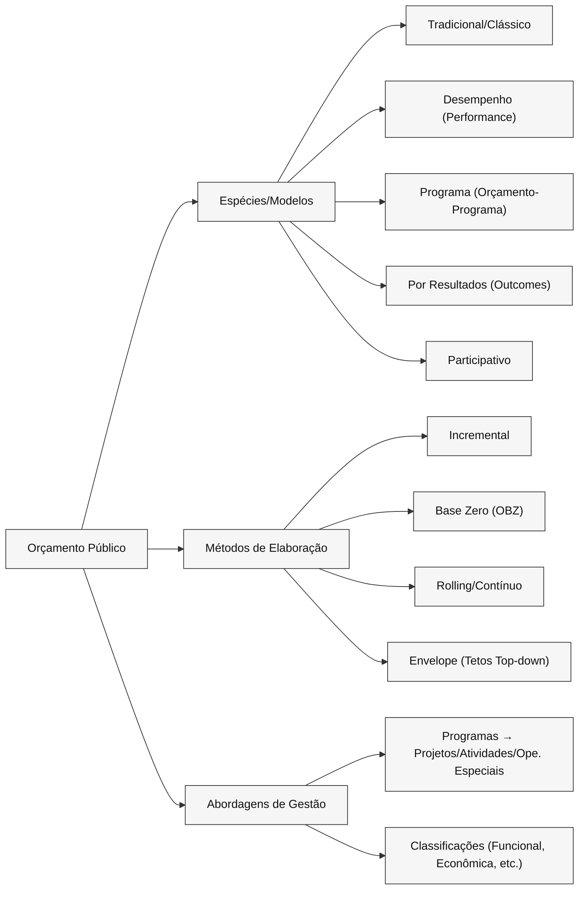
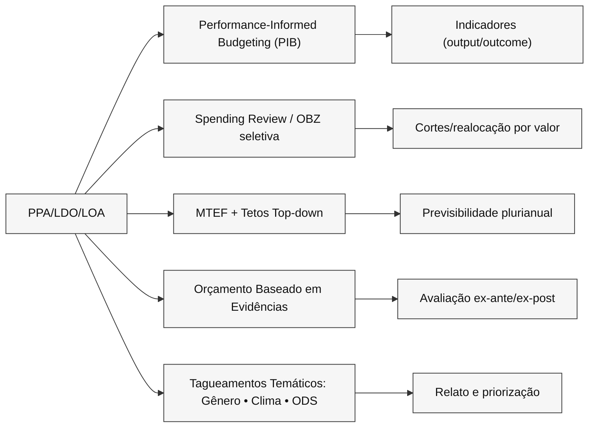
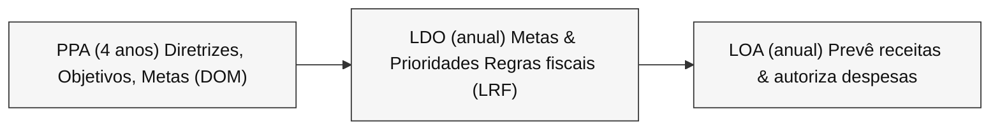

# Orçamento Público

O Orçamento Público é um documento que prevê as receitas – quantias de moeda que, em um período determinado (normalmente um ano), devem entrar – e fixa as despesas, com especificação de suas principais fontes de financiamento e das categorias de despesas mais relevantes.

> O orçamento é um instrumento fundamental de governo, seu principal documento de políticas públicas. Por meio dele, os governantes selecionam prioridades, decidindo como gastar os recursos extraídos da sociedade e como distribuí-los entre diferentes grupos sociais, conforme seu peso ou força política. Portanto, nas decisões orçamentárias, os problemas centrais de uma ordem democrática como representação e accountability estão presentes. (…) A Constituição de 1988 trouxe inegável avanço na estrutura institucional que organiza o processo orçamentário brasileiro. Ela não só introduziu o processo de planejamento no ciclo orçamentário, medida tecnicamente importante, mas, sobretudo, reforçou o Poder Legislativo.

>[!note] Orçamento Público
>É o ato pelo qual o Poder Executivo prevê a arrecadação de receitas e fixa a realização de despesas para o período de um ano e o Poder Legislativo autoriza, por meio de Lei, a execução das despesas destinadas ao funcionamento da máquina administrativa.  O orçamento do Estado é o ato que contém a aprovação prévia das receitas e despesas públicas para um período determinado.

>[!important] Planejamento de **Previsão de arrecadação de Receitas (impostos, taxas, contribuições...)** e **Fixação de Despesas Públicas**, para realização das Políticas Públicas por meio de Programas, Projetos, Atividades e Operações Especais para um determinado período de tempo, aprovados nas Leis do Plano Plurianual - PPA; Lei de Diretrizes Orçamentárias - LDO e Lei Orçamentária Anual - LOA.

## Dimensões do Orçamento Público

Para parte da doutrina, o orçamento público apresenta 3 dimensões relevantes, todas
de interesse direto para a sociedade: jurídica, econômica e política. Além disso, existe
outra parte que elenca mais dois aspectos: administrativo e técnico.

- **Jurídica**: o orçamento tem caráter e força de lei. Nessa posição, define limites a serem respeitados pelos governantes e agentes públicos no tocante à realização de despesas e à arrecadação de receitas. Seguindo a regra geral a respeito da elaboração e da aprovação das leis no Brasil, o processo legislativo relativo ao orçamento público (PPA, LDO e LOA) também passa obrigatoriamente pelas etapas de discussão e votação nas comissões e no Plenário, inclusive acerca de eventuais emendas e destaques, até a sanção presidencial.

- **Administrativa**: o orçamento é visto como importante peça de planejamento na medida em que o Estado busca saber de quanto disporá em termos de recursos financeiros para aplicar em prol das necessidades coletivas. Segundo Giacomoni, o orçamento auxilia os responsáveis pelas finanças públicas na consecução das diversas etapas do processo administrativo, como a programação, a execução e o controle.

- **Técnica**: foram estabelecidos inúmeros mandamentos que visam disciplinar e uniformizar a estrutura da lei orçamentária no país por meio da apresentação de demonstrativos e resultados, estimativa da receita, contabilização da execução orçamentária, dentre outros.

> [!Important] Forma de observação (paradigma, visão):
> 	- Jurídica: STF considera o orçamento uma lei formal.
> 	- Econômica: plano de ação governamental, isto é, o poder de intervir na atividade econômica (emprego, renda).
> 	- Financeira: fluxo de entrada e saída de recursos.
> 	- Política: definição de prioridades, visando à inclusão e à realização de programas governamentais no plano de ação a ser executado.
> 	- Técnica: formalidades técnicas e legais exigidas no processo orçamentário.

> [!tldr] Resumo
> Podemos dizer que o orçamento tem aspecto político, pois revela ações sociais e regionais na destinação das verbas, características econômicas porque manifesta a realidade
da economia, é técnico, pois utiliza cálculos de receita e de despesa e tem, ainda, aspectos
jurídicos, porque atende às normas da Constituição Federal e de leis infraconstitucionais.

## Outros aspectos relevantes do orçamento público

Todos os Poderes e o Ministério Público elaboram suas propostas orçamentárias, porém, quem executa a maior parte das despesas públicas é o Poder Executivo, afinal, essa é a sua principal função.

Basicamente, em termos gerais de elaboração da proposta orçamentária, temos o seguinte: todos os Poderes (Executivo, Legislativo, Judiciário e mais o Ministério Público) e demais órgãos (Unidades Orçamentárias) elaboram as suas propostas e encaminham para o Poder Executivo (Ministério do Planejamento e Orçamento), que faz a consolidação de todas as propostas e encaminha um projeto de lei de orçamento ao Congresso Nacional.

Nenhuma proposta orçamentária, nem mesmo a do Poder Legislativo, pode ser encaminhada
diretamente ao Congresso Nacional pelo órgão que elabora a sua proposta orçamentária.
Essa competência é privativa do Presidente da República (inciso XXIII, do art. 84, da Constituição Federal).

>[!question] A LOA não pode ser delegada, mas o PPA pode ser delegado pelo Presidente da República?
>No Brasil, a elaboração e envio do projeto de lei do Plano Plurianual (PPA) ao Congresso Nacional é uma competência privativa do Presidente da República, conforme estabelecido no art. 84, inciso XXIII, da Constituição Federal. Portanto, não pode ser delegada a outra autoridade.

>[!question] Quem tem competência para dispor sobre orçamento público no Brasil?
>Essa competência é exclusiva do CN. O termo "dispor", na área orçamentária, significa votar, apresentar e rejeitar emendas, manter ou derrubar vetos do Presidente da República, aprovar créditos adicionais, fiscalizar.

## Técnicas, Métodos e Espécies de Orçamento

> [!note] Mapa mental rápido (o “o quê”, “como” e “com que enfoque”)  
> **Espécies/Modelos** = como o Estado concebe o orçamento  
> **Métodos** = como a peça é montada ano a ano  
> **Abordagens de gestão** = como se organiza para entregar (programas/ações, classificações)

### 1) **Espécies / Modelos** (enfoque histórico-institucional)

- **Tradicional/Clássico**  
    **Foco:** insumos/meios (em que item gastar). **Ênfase:** legalidade/controle formal.  
    **Força:** simplicidade e previsibilidade. **Limite:** quase não evidencia resultados.
    
- **Desempenho (Performance Budgeting)**  
    **Foco:** atividades/funções e **produtos (outputs)** mensuráveis (custo por unidade de serviço).  
    **Força:** eficiência operacional. **Limite:** pode ignorar **impactos** (outcomes).
    
- **Orçamento-Programa** (espinha dorsal brasileira desde a Lei 4.320/1964 + DL 200/1967)  
    **Foco:** **programas** com objetivos, metas e indicadores; integração **planejamento↔orçamento** (PPA→LDO→LOA).  
    **Força:** priorização e transparência por **programas/ações**. **Limite:** qualidade depende dos indicadores.
 
 > [!note] Algumas características positivas do Orçamento-Programa:
 > 1 - Permite melhor planejamento das ações do governo;
 > 2 - Facilita a identificação dos gastos, a realização por programas e sua comparação em termos absolutos e relativos;
 > 3 - Contribui para uma orçamentação mais precisa;
 > 4 - Inter-relação entre custo e programação vinculada a objetos;
 > 5 - Permite maior possibilidade de redução de custos;
 > 6 - Torna mais fácil identificar funções duplas;
 > 7 - Foca no que a instituição realiza, não no que ela gasta;
 > 8 - Permite melhor controle e execução dos programas. 
    
- **Por Resultados (Results-Based Budgeting)**  
    **Foco:** **outcomes/impactos** (efetividade), uso de **matriz lógica** e metas de resultado final.  
    **Força:** accountability e valor público. **Limite:** difícil atribuir causalidade em políticas complexas.
    
    > Dica: pense “**outputs** = desempenho; **outcomes** = resultados na sociedade”.
    
- **Participativo**  
    **Foco:** participação social na **definição de prioridades** (sobretudo municipal/estadual).  
    **Força:** legitimidade e aderência local. 
    **Limite:** não altera a natureza **jurídica** da LOA nem a **iniciativa privativa** do Executivo. 
    **Audiências públicas**: são instrumentos de participação social que promovem o engajamento da sociedade na definição de prioridades e na fiscalização da gestão pública. São eventos pontuais realizados pelo poder público para ouvir a população sobre temas específicos, entre eles, a elaboração do orçamento, a revisão de planos diretores ou outros temas de interesse coletivo.
    **Conselho de Gestão**: é um órgão colegiado formado por representantes do governo e da sociedade civil para planejar, monitorar e fiscalizar a execução de políticas públicas. Ele pode ser temático (educação, saúde, meio ambiente) ou geral (gestão administrativa e orçamentária) e ter função consultiva ou deliberativa, ou seja, pode atuar apenas orientando ou ter poder de decisão sobre ações e recursos. A presença deste conselho oferece mais fiscalização da gestão pública, aprimorando a transparência e o controle social.
    

> [!Important] Palavra-chave por espécie  
> **Tradicional:** insumo | **Desempenho:** output | **Programa:** objetivos/ações | **Resultados:** outcome | **Participativo:** prioridade social

---

### 2) **Métodos de elaboração** (como a peça é montada)

- **Incremental**  
    **Como:** parte do **baseline** (dotação vigente) e ajusta +/−.  
    **Prós:** rápido, realista para rotinas. **Contras:** perpetua ineficiências (“inércia orçamentária”).  
    **Use quando:** serviços continuados e estabilidade de custos.
    
- **Base Zero (OBZ)**  
    **Como:** cada unidade justifica do **zero** “pacotes de decisão”; ranqueia do essencial ao desejável.  
    **Prós:** corta gordura, força priorização. **Contras:** alto custo analítico/tempo.  
    **Use quando:** ajuste fiscal, revisão estratégica.
    
  > [!warning] Pegadinha: **OBZ ≠ ignorar histórico**. Você usa dados passados, mas **não assume** que tudo deve continuar.
    
- **Rolling/Contínuo** (janela móvel)  
    **Como:** revisa periodicamente (ex.: 12 meses “deslizantes”).  
    **Observação:** raro no setor público por **anualidade**, mas útil internamente para custodiar projeções.
    
- **Envelope (Tetos Top-down)**  
    **Como:** define **tetos** por órgão/área (macro-fiscal) e detalha **bottom-up** abaixo do teto.  
    **Vínculo:** dialoga com **LDO** (metas fiscais, limites) e regras de gasto.
    

---

### 3) **Abordagens de gestão** (como organizar para entregar)

- **Programas → Ações**  
    **Programa** = guarda-chuva estratégico. **Ações:**  
    **Projeto** (início/fim definidos) | **Atividade** (manutenção/rotina) | **Operação Especial** (sem produto típico, p.ex. dívidas/transferências).
    
- **Classificações que conversam com a prova**
    
    - **Institucional** (quem gasta)
        
    - **Funcional/Subfuncional** (para quê: educação, saúde…)
        
    - **Programática** (programa/ação)
        
    - **Econômica** (GND: corrente × capital; fonte/destinação; modalidade de aplicação)
        

> [!tip] Reconhecimento em questão  
> Se a pergunta falar em **“custos por unidade de serviço”**, puxe **Desempenho**.  
> Se falar em **“objetivos, metas e ações”**, puxe **Programa**.  
> Se a ênfase for **“impacto social medido por indicadores de efetividade”**, puxe **Resultados**.  
> Se exigir **“justificar tudo do zero e ranquear”**, é **OBZ**.  
> Se mencionar **“manter o nível anterior com ajustes”**, é **Incremental**.

---

### 4) Tabela-resumo (decorar sem sofrer)

|Nome|Foco|Palavra-chave|Ponto forte|Risco/limite|
|---|---|---|---|---|
|Tradicional|Insumos/itens|legalidade|Simplicidade|Ignora resultados|
|Desempenho|Outputs/eficiência|custo por produto|Produtividade|Não mede impacto|
|Programa|Programas/ações|objetivos & metas|Integra planejar-executar|Depende de bons indicadores|
|Por Resultados|Outcomes/impacto|efetividade|Valor público|Atribuição difícil|
|Participativo|Prioridades sociais|participação|Legitimidade|Limites legais/fiscais|
|Incremental|Baseline + ajuste|inércia|Agilidade|Cristaliza ineficiências|
|Base Zero|Do zero + ranque|revisão|Corta gordura|Custo analítico|
|Rolling|Janela móvel|atualização|Projeção viva|Anualidade limita|
|Envelope|Tetos top-down|ceilings|Disciplina fiscal|Engessa se mal calibrado|

> [!tldr] Em 3 linhas  
> **Espécies** dizem **o enfoque** (tradicional, desempenho, programa, resultados, participativo).  
> **Métodos** dizem **como montar** (incremental, base-zero, rolling, envelope).  
> A **gestão** organiza para **entregar** (programas→ações + classificações).

## Abordagens Orçamentárias Contemporâneas

> [!note] Linha-mestra  
> O “novo” do orçamento público está menos em inventar outra peça legal e mais em **como** priorizamos, **com que evidências** decidimos e **como ligamos dinheiro → entregas → impactos**. Pense em três vetores: **performance**, **evidências** e **marcadores temáticos** (gênero, clima, ODS).

### 6.1 Performance: três sabores (e onde a banca confunde)

- **Performance Budgeting (PB/Desempenho)**: vincula **recursos → produtos (outputs)**.
    
- **Results-Based Budgeting (RBB/Por Resultados)**: foca **impactos (outcomes)** na sociedade.
    
- **Performance-Informed Budgeting (PIB)**: **usa** indicadores para **informar** alocação, **sem** fórmula mecânica de “x indicador = y reais”.
    

> [!tip] Mnemônico  
> **PB = produto**, **RBB = impacto**, **PIB = informado por indicadores** (mais realista no setor público).

### 6.2 MTEF + Tetos Top-down (disciplina fiscal com previsibilidade)

- **MTEF** (Medium-Term Expenditure Framework): horizonte **plurianual** para despesa, coerente com o **PPA**; agrega **tetos setoriais** que a **LDO** consolida em metas e regras; a **LOA** executa dentro do envelope.
    
- **Ganhos**: antecipa trade-offs, reduz “baselining cego”, melhora coordenação entre órgãos.
    
- **Riscos**: engessamento se tetos mal calibrados; incentivos a **subexecução** para “guardar espaço”.
    

### 6.3 Spending Review (revisões de gasto)

- **O que é**: varredura periódica para **cortar/ajustar** programas de **baixo valor** e **realocar** para prioridades.
    
- **Como**: painéis de custo-efetividade, “pacotes de decisão” (inspiração **OBZ**), metas de economia.
    
- **Use quando**: restrição fiscal, sobreposição de ações, programas com **output alto / outcome baixo**.
    

### 6.4 Orçamento Baseado em Evidências (EBB)

- **Ferramentas**: avaliação ex-ante, pilotos, RCTs/quasi-experimentos, “what works”, sínteses sistemáticas.
    
- **Decisão**: **classificar** programas por força de evidência (alto/médio/baixo) e **condicionar** expansão a evidências.
    
- **Na peça**: anexos da **LDO** trazem metas e riscos; a **LOA** prioriza o que tem melhor **custo-efetividade**.
    

### 6.5 Marcadores temáticos (tagueamento do gasto)

- **Gênero (GRB)**: orçamento **sensível a gênero**: diagnósticos, metas e **tags** para medir esforço e resultado.
    
- **Clima/Verde**: **climate tagging** (mitigação/adaptação), riscos fiscais climáticos, preço-sombra de carbono em análises.
    
- **ODS/Agenda 2030**: **mapeamento** de programas/ações para **metas ODS**, priorização e relato.
    

> [!important] Como cai  
> “**Taguear** ≠ criar novo orçamento”: é **classificar** e **prestar contas** dentro do PPA-LDO-LOA.

### 6.6 Value for Money (3Es) + Matriz Lógica

- **Economia** (comprar bem), **Eficiência** (fazer bem), **Efetividade** (fazer o que importa).
    
- **Matriz Lógica**: insumos → atividades → **outputs** → **outcomes**; indicadores, linha de base, metas e suposições.
    

### 6.7 Integração com PPA-LDO-LOA (receita de prova)

- **PPA**: explicita **objetivos/outcomes** e seleciona programas prioritários.
    
- **LDO**: traduz **metas anuais**, define **tetos**/envelopes e regras; anexa **metas e riscos**.
    
- **LOA**: aloca por **ações**; destaca tags (gênero/clima/ODS) e iniciativas com **evidência**/alto **VfM**.
    

> [!warning] Pegadinhas
> 
> - Indicador **não** cria despesa obrigatória.
>     
> - “Orçamento participativo” **não** altera iniciativa privativa do Executivo, apenas **informa** prioridades.
>     
> - **Resultados** demoram: cuidado com prometer impacto **no mesmo exercício**.
>     

---

### 6.8 Tabela-resumo (para revisão ativa)

|Abordagem|Essência|Ferramentas|Encaixe PPA-LDO-LOA|Risco/limite|
|---|---|---|---|---|
|**PIB (informado por performance)**|Indicadores **informam**, não decidem sozinhos|painéis, metas SMART|Metas na LDO; LOA prioriza ações com melhor desempenho|“fetiche do indicador”|
|**RBB (por resultados)**|Foco em **outcomes**|matriz lógica, avaliação|Outcomes no PPA; metas anuais na LDO|atribuição difícil|
|**MTEF + Tetos**|Horizonte plurianual + **envelopes**|projeções, regras fiscais|LDO define envelopes; LOA executa|engessamento|
|**Spending Review**|Cortar/realocar por **valor**|OBZ seletiva, benchmarks|LDO sinaliza; LOA materializa|captura política|
|**Evidências (EBB)**|Alocar segundo **custo-efetividade**|RCTs, meta-análises|LDO/Anexos de metas; LOA prioriza|escassez de dados|
|**Gênero/Clima/ODS**|**Taguear** e priorizar temas|classificações temáticas|PPA vincula; LOA evidencia|greenwashing/box-ticking|

---

### 6.9 Active-Recall (3 perguntas, 30″ cada)

1. **PIB x PB x RBB**: qual a diferença em uma linha cada?
    
2. Onde **MTEF/tetos** entram no PPA-LDO-LOA?
    
3. **Tagueamento** (gênero/clima/ODS) cria obrigatoriedade de gasto?
    

> [!tldr] Em 20 segundos  
> **Planeje no PPA por outcomes**, **amare PPA→LDO→LOA com tetos e metas**, **alocar por evidência e valor**, **medir por outputs/outcomes**, e **taguear** prioridades transversais para transparência e controle.

---

---

# Enunciado (CESPE) e gabarito
> **Afirmação:** “A **função orçamentária** pode ser entendida como o **instrumento de organização da atuação governamental**, pois **articula um conjunto de ações** que concorrem para um **objetivo comum**, **mensurado por indicadores fixados no PPA**.”
>
> **Gabarito oficial:** **Errado**.

---

## Por que está **ERRADA**
1) **A definição citada é de _Programa_, não de _Função_.**  
   - “Instrumento de organização da atuação governamental que **articula um conjunto de ações** para um **objetivo comum**, **mensurado por indicadores do PPA**” é a **definição clássica de _programa_** (classificação programática).  
2) **Função ≠ Programa.**  
   - **Função** pertence à **classificação funcional**: é o **maior nível de agregação das áreas de atuação** (ex.: **Saúde**, **Educação**) e responde a **“em que área”** o gasto ocorre — **não** estrutura objetivos, indicadores ou ações.  
3) **Os indicadores vinculam-se ao PPA em nível de programas/objetivos**, **não** de função.  
   - Quem tem **objetivo, metas e indicadores** (para monitorar resultados) é o **programa**; a **função** apenas **agrega** dotações por área.

---

## Quadro comparativo “1-minuto Cebraspe”
| Eixo | **Função** | **Programa** |
|---|---|---|
| Natureza | Classificação **funcional** | Classificação **programática** |
| Pergunta-chave | **Em que área** o gasto se insere? | **Para quê** (qual **objetivo**) o governo atua? |
| Estrutura | **Função** → **Subfunção** | **Programa** → **Ações** (projetos/atividades/ops. especiais) |
| Lógica | **Agregação temática** (ex.: Saúde 10, Educação 12) | **Articulação de ações** para **objetivo** com **indicadores/ metas** (PPA) |
| Indicadores PPA | **Não** (não mensura objetivo) | **Sim** (monitoramento do objetivo) |

---

## Pegadinhas típicas
- “A **função** articula ações para objetivos com indicadores” → **ERRADO** (isso é **programa**).  
- “O **programa** é o maior nível de agregação das áreas” → **ERRADO** (isso é **função**).  
- Confundir “**em que área**” (função) com “**para quê/qual objetivo**” (programa).

---

## Exemplo rápido
- **Função:** **Educação** (código 12) — _grande área_ do gasto.  
- **Programa:** **Alfabetização na Idade Certa** — define **objetivo**, **ações** (formação docente, material didático…), **indicadores do PPA** (taxa de alfabetização etc.).

> [!tip] Como memorizar  
> **Função = Área (macrotema)**. **Programa = Objetivo + Ações + Indicadores (PPA)**.

