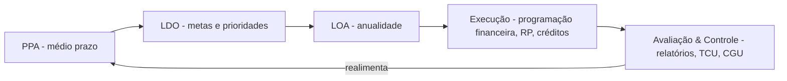
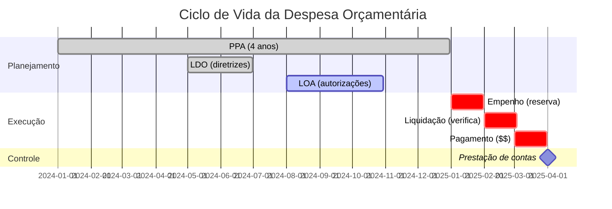

> [!abstract] Visão geral
> Estruturado em 10 partes (como na aula), porém **expandido** com: resumos executivos, quadros de memorização, fluxogramas, itens de jurisprudência, “checagem de conceitos” em estilo CESPE/FGV e um bloco **preditivo** de prováveis temas de prova (baseado em atualizações normativas e guias oficiais recentes).

---

## 1) Introdução — Ciclo Orçamentário
**Definição canônica:** conjunto de fases integradas — **planejamento (PPA)**, **definição de diretrizes (LDO)**, **fixação anual (LOA)**, **execução**, **avaliação/controle** (CF/88, art. 165 e correlatos). A CF vincula PPA/LDO/LOA e disciplina suas funções.  
**PPA 2024-2027 (União):** instituído pela **Lei 14.802/2024**.  
**Novo arcabouço fiscal (regime fiscal sustentável):** **LC 200/2023** redesenha parâmetros de resultado e limites, com reflexos na LDO/LOA.

## 2) Elaboração/Planejamento (PPA)

- **PPA**: diretrizes, objetivos, metas e programas; vigência plurianual (art. 165, §1º, CF). PPA vigente (União): 2024–2027.
    
- **SPOF (Lei 10.180/2001)**: organiza o **Sistema de Planejamento e Orçamento Federal** (SIOP, órgãos setoriais/centrais, etc.).
    
- **MTO 2025 (SOF/MPO)**: manual oficial que padroniza conceitos, classificações e procedimentos; versão 2025 com atualizações em 2025/06 (itens 8.2/8.3, alterações orçamentárias).
    

> [!tip] Dica de prova  
> Provas adoram a **articulação PPA→LDO→LOA** e a identificação correta de **programas/ações** conforme o MTO (cadastro, natureza, identificadores). Consulte sempre a versão vigente do **MTO 2025**.

---

## 3) Discussão/Estudo/Aprovação (LDO e LOA)

- **LDO**: metas/prioridades, **Anexo de Metas Fiscais** e **Riscos Fiscais** (LRF, art. 4º); após LC 200/2023, a LDO absorve novos vínculos às regras do regime fiscal.
    
- **LOA**: detalha a execução anual (fiscal, seguridade e investimento das estatais). Ex.: **LOA 2025 — Lei 15.080/2024** (com anexos de quadros e categorias econômicas).
    
- **Lei 4.320/1964**: normas gerais de elaboração/controle; atenção aos arts. **22** (projeto da LOA), **35-36** (competência e **Restos a Pagar**).
    

> [!example] Exemplo rápido (categorias econômicas)  
> Os quadros da LOA discriminam **receitas e despesas** por **categorias econômicas** (corrente/capital) — ver anexos da LOA/2025 e mensagens anexas do Executivo.

---

## 4) Execução

- **Programação financeira & contingenciamento**: LRF, **art. 9º**; decretos anuais do cronograma (ex.: Decretos 12.448/2025 e 12.477/2025).
    
- **Restos a Pagar (RAP)**: conceito legal (Lei 4.320, art. 36); interação com programação financeira e empoçamento de limites.
    
- **Créditos adicionais** (suplementar, especial, extraordinário): Lei 4.320, **arts. 40-46** (fundamentos, abertura, vigência).
    

> [!question] Checagem (FGV/CESPE)
> 
> 1. O contingenciamento é **ato da LDO**.
>     
> 2. **RAP** são sempre despesas **liquidadas**.
>     
> 3. **Crédito extraordinário** pode ser aberto por **MP** em caso de urgência e imprevisibilidade.  
>     **Gabarito:** (1) **Errado** — é ato da **execução** (decreto) com base na LRF; (2) **Errado** — há **processados** e **não processados**; (3) **Certo** (CF, art. 167, §3º).
>     

---

## 5) Avaliação e Controle

- **Controle interno (CGU)** e **externo (TCU)**: CF, art. 70-74 estrutram auditoria, prestação e fiscalização.
    
- **Monitoramento & avaliação de políticas públicas**: reforçados pela **EC 109/2021** (art. 165, §16).
    

---

## 6) Alocação de Recursos e Papel dos Agentes

- **Papéis institucionais**: MPO/SOF (coordenação orçamentária), órgãos setoriais, unidades orçamentárias (Lei 10.180/2001).
    
- **Princípios e vedações** (Lei 4.320/1964 + CF): anualidade, unidade, exclusividade, etc. (lembre: vedações do art. 167, CF).
    

---

## 7) Questões Comentadas — Cebraspe (curadoria)

> [!help] Como usar  
> Resolva e marque **(C/E)**. Depois confira o gatilho normativo.

1. (C/E) A **LDO** conterá **Anexo de Metas** e **Riscos Fiscais** (LRF, art. 4º) — **Certo**.
    
2. (C/E) **RAP** abrangem despesas empenhadas e não pagas até 31/12 (Lei 4.320, art. 36) — **Certo**.
    
3. (C/E) **Crédito extraordinário** só por lei ordinária — **Errado** (CF admite **MP** em urgência/imprevisibilidade).
    

---

## 8) Questões Comentadas — FGV (curadoria)

1. (Múltipla) No **novo regime fiscal (LC 200/2023)**, a LDO deve compatibilizar metas e limites do regime, afetando a dinâmica de avaliação bimestral e eventuais contingenciamentos — **Correta**.
    
2. (C/E) O **MTO 2025** consolidou orientações atualizadas sobre **alterações orçamentárias (cap. 8)** — **Certo**.
    

---

## 9) **Lista de exercícios — Cebraspe/estilo**

-  (C/E) A **LOA** pode consignar previsões de despesas para exercícios seguintes com investimentos plurianuais (CF, art. 165, §14).
    
-  (C/E) A discussão e aprovação da **LOA** independe do **PPA** — **Errado** (compatibilidade é exigida constitucionalmente).
    

---

## 10) **Lista de exercícios — FGV/estilo**

-  (Múltipla) Assinale o enunciado **conforme** o **MTO 2025** sobre classificação da despesa por natureza (GND 1-6).
    
-  (C/E) O art. 9º da LRF não tem reflexos na decretação de limitação de empenho — **Errado**.
    

---

# Apêndices de reforço

## A) Tabelas e classificações — atalho “pronto-prova”

- **Receitas por natureza** (base legal: Lei 4.320, art. 11, §4º; MTO) — memorize **categoria/subcategoria/natureza**.
    
- **Despesas por GND (1-6)** e **modalidade de aplicação** (MTO 2024/2025).
    

## B) Jurisprudência quente — **emendas orçamentárias**

- **STF e RP-9 (“orçamento secreto”)**: inconstitucionalidade; RP-9 restrita a recomposição técnica, com reforço de transparência.  
    _Impacto didático_: perguntas sobre **emendas individuais/impositivas**, de bancada, de comissão e **limites de RP-9** tendem a aparecer.
    

## C) **Previsão de cobrança (2025-2026)** — _mapa de calor_

- 🔥 **LC 200/2023 (Novo regime fiscal)** — integração **LDO/LOA** com metas e limites, e impactos na avaliação/contingenciamento.
    
- 🔥 **MTO 2025 atualizado** — itens **8.2 (dever de execução)** e **8.3 (alterações orçamentárias)**; classificações e tabelas vigentes.
    
- 🔥 **RAP & programação financeira** — conceito legal (Lei 4.320, art. 36), decretos de programação e noções de **empoçamento**.
    
- 🔥 **Créditos adicionais** — hipóteses, instrumento, vigência (Lei 4.320, arts. 40-46) + **MP para extraordinário** (CF, art. 167, §3º).
    
- 🔥 **STF vs. RP-9** — limites às emendas do relator e transparência (ADPFs/Notícias institucionais).
    

> [!note] Como usar na revisão
> 
> 1. Leia os **quadros do MTO 2025** ⇒ anote “o que mudou” vs 2024.
>     
> 2. Monte flashcards CF/Lei 4.320/LRF/LC 200.
>     
> 3. Resolva questões de RAP, créditos e LDO (Metas/Riscos).
>     

## D) Mini-simulado rápido (5 itens)

1. (C/E) A **LDO** deve conter metas fiscais em cenários que dialogam com a **LC 200/2023** — **Certo**.
    
2. (C/E) **RAP não processados** = “liquidados e não pagos” — **Errado**.
    
3. (C/E) **Crédito especial** depende de indicação de recursos e tem vigência vinculada à LOA — **Certo** (Lei 4.320/1964).
    
4. (Múltipla) A **execução** com limitação de empenho decorre da LRF, **art. 9º** — **Correta**.
    
5. (C/E) O **PPA 2024-2027** fundamenta a compatibilidade da LOA — **Certo**.
    

---

## Referências principais (para prova)

- **CF/88 (Art. 165, 167, 70-74)**; **Lei 4.320/1964**; **LRF (LC 101/2000)**; **Lei 10.180/2001**.
    
- **PPA 2024-2027 (Lei 14.802/2024)**; **LOA 2025 (Lei 15.080/2024 + anexos)**.
    
- **LC 200/2023 (novo regime fiscal)**.
    
- **MTO 2025 (SIOP/SOF)**.
    
- **STF — emendas RP-9** (ADPFs/notas institucionais).
    

# Ciclo Orçamentário — CESPE (Câmara dos Deputados)

_(nota para Obsidian, com tópicos, exemplos e “sensor” calibrado a partir de 2023→2024, projeções para 2025 e 2026)_

---

## 1) Prazos e peças do ciclo (o que mais cai)

- **Quem envia o quê e quando (União):**
    
    - **LDO:** até **15 de abril** de cada ano. ([tcm.go.gov.br](https://www.tcm.go.gov.br/escolatcm/wp-content/uploads/2019/06/M%C3%B3dulo-1-Caderno-de-Conte%C3%BAdo.pdf?utm_source=chatgpt.com "do PPA à Liquidação e Pagamento da Despesa - TCM-GO"))
        
    - **PLOA:** até **31 de agosto** (todos os anos). ([congressonacional.leg.br](https://www.congressonacional.leg.br/legislacao-e-publicacoes/glossario-orcamentario/-/orcamentario/termo/projeto_de_lei_orcamentaria_anual_ploa?utm_source=chatgpt.com "Termo: Projeto de Lei Orçamentária Anual (PLOA)"))
        
    - **PPA (1º ano de mandato):** também até **31 de agosto** e devolução até **22 de dezembro**, nos termos do **art. 35, §2º, ADCT**. ([www12.senado.leg.br](https://www12.senado.leg.br/publicacoes/estudos-legislativos/tipos-de-estudos/outras-publicacoes/agenda-legislativa/capitulo-15-controle-jurisdicional-do-processo-legislativo-orcamentario?utm_source=chatgpt.com "Controle Jurisdicional do Processo Legislativo Orçamentário"))
        
- **Tramitação:** as matérias **orçamentárias federais (PPA, LDO, LOA e créditos)** são apreciadas na **Comissão Mista de Orçamento (CMO)**, criada pelo art. 166, §1º, CF e regulamentada pela Resolução **1/2006-CN**. ([Portal da Câmara dos Deputados](https://www2.camara.leg.br/legin/fed/rescon/2006/resolucao-1-22-dezembro-2006-548706-normaatualizada-pl.html?utm_source=chatgpt.com "Resolução 1/2006"))
    
- **Estrutura programática:** a LOA se organiza por **programas de trabalho** (programação qualitativa e quantitativa). Isso cai o tempo todo. ([www1.siop.planejamento.gov.br](https://www1.siop.planejamento.gov.br/mto/lib/exe/fetch.php/mto2026%3Amto2026.pdf?utm_source=chatgpt.com "Manual Técnico de Orçamento - MTO 2026 - SIOP"))
    

> **Armadilha clássica:** confundir a CMO com **CFT/CAE**. CESPE cobra que **PPA, LDO, LOA e créditos** são da **CMO**, não das comissões permanentes de cada Casa. ([Portal da Câmara dos Deputados](https://www2.camara.leg.br/legin/fed/rescon/2006/resolucao-1-22-dezembro-2006-548706-normaatualizada-pl.html?utm_source=chatgpt.com "Resolução 1/2006"))

---

## 2) Alterações orçamentárias (execução na veia)

- **Créditos adicionais**: suplementar (reforça dotação), especial (cria dotação não prevista) e extraordinário (urgente/imprevisível). **Suplementar e especial** exigem **autorização legislativa prévia e indicação de recurso**; a **LOA pode pré-autorizar** suplementares (art. 165, §8º, CF). **Extraordinário** é a exceção: abre-se **por MP** (art. 167, §3º, CF). ([congressonacional.leg.br](https://www.congressonacional.leg.br/en/materias/materias-orcamentarias/entenda-o-orcamento?utm_source=chatgpt.com "Entenda o Orçamento no Congresso Nacional"))
    
- **Transposição/remanejamento/transferência** entre **categorias de programação/órgãos** durante a execução **precisa de autorização legislativa** (art. 167, VI, CF). Exceção específica: **CT&I** (art. 167, §5º) admite por ato do Executivo. ([www12.senado.leg.br](https://www12.senado.leg.br/orcamento/documentos/estudos/tipos-de-estudos/orcamento-em-discussao/edicao-17-2015-um-exame-sobre-as-mudancas-promovidas-pelo-novo-ss-5o-do-art.-167-da-constituicao-federal-transferencias-de-recursos-entre-categorias-de-programacao-em-acoes-de-ciencia-tecnologia-e-inovacao-e-necessidade-de-regulamentacao?utm_source=chatgpt.com "ORÇAMENTO EM DISCUSSÃO"))
    
- **Contingenciamento (LRF art. 9º):** limitação de empenho e movimentação quando a receita não comporta as metas. O **novo arcabouço (LC 200/2023)** convive com isso e virou pauta recorrente. ([Planalto](https://www.planalto.gov.br/ccivil_03/leis/lcp/lcp101.htm?utm_source=chatgpt.com "Lcp101 - Planalto"))
    

---

## 3) Fases do ciclo + “programa de trabalho”

- **Elaboração** (Poder Executivo coordena; estimativa de **receitas** e **formulação do programa de trabalho**). 
    
- **Discussão/aprovação** (CMO + Congresso). 
    
- **Execução** (empenho, liquidação, pagamento + alterações via créditos). 
    
- **Controle/avaliação** (TCU, controle interno, relatórios).
    
    > CESPE costuma perguntar “o que vem primeiro” ou “onde entra a formulação do programa de trabalho”: é **na elaboração**. 
    

---

## 4) Emendas ao PLOA (vedações quentes)

- Emendas **devem** indicar recursos, via **anulação de despesa**; **não pode** anular **pessoal**, **serviço da dívida** ou **transferências constitucionais** (art. 166, §3º, II e III, CF). Tema batido. 
    

---

## 5) TED (Termo de Execução Descentralizada) — por que caiu/ deve cair

- **Base legal:** Decreto **10.426/2020**.
    
- **Plano de Trabalho** integra o TED e **deve conter, no mínimo, a descrição do objeto**, justificativa, cronograma físico e de desembolso etc. (art. 8º). 
    

---

## 6) MTEF (orçamentação de médio prazo) — como o CESPE costuma tratar

- **Conceito-chave**: estrutura plurianual que combina **previsões de recursos**, **linhas de base de despesas** e **tetos/limites de gasto** para 3–5 anos. Não é “base da prestação de contas” e **não tem**, nos manuais internacionais, um “terceiro pilar” chamado “limite máximo de endividamento” como elemento típico do MTEF. 
    

---

## 7) Raio-X CESPE: 2023 → 2024 → (previsão) 2025/2026

**O que apareceu (amostras públicas):**

- 2023–2024: itens sobre **ciclo orçamentário**, **prazos/competências**, **vedações do art. 166 §3º** e **créditos** (ex.: TSE-UNIF/2024 cobrou ciclo orçamentário; TRT-8/2023 também trouxe o tema). 
    
- Há questões de C/E sobre **quem conduz a formulação** (Executivo), **em que fase entra o controle**, e **remanejamento** com/sem autorização. 
    

**Tendências 2025 (calibradas pelo noticiário técnico/legislativo):**

- **Novo Arcabouço (LC 200/2023)** e seus reflexos operacionais (limites, exceções e interação com a LRF e a programação financeira anual). 
    
- **Créditos extraordinários por MP** (uso recorrente em desastres e eventos urgentes; a banca adora perguntar a **excepcionalidade** do art. 167, §3º). 
    
- **TED** (transparência e conteúdo mínimo do Plano de Trabalho). 
    
- **Exceção CT&I** ao art. 167, VI (remanejamento sem lei). É pegadinha frequente. 
    

> **Sensor recalibrado (pontos de erro mais comuns):**
> 
> 1. Trocar **CMO** por **CFT/CAE**.
>     
> 2. Dizer que **PLOA** vem “2,5 meses depois do PPA” (errado; **ambos** até **31/8**). 
>     
> 3. Esquecer que **crédito extraordinário** é **por MP**. 
>     
> 4. Ignorar a exceção de **CT&I** no remanejamento. 
>     

---

## 8) Itens do usuário — Gabarito C/E comentado

1. **“PLOA do 1º exercício deve ser enviado 2,5 meses após o PPA…”**  
    **Errado.** PPA (no 1º ano de governo) **e** PLOA têm **o mesmo prazo de envio: 31 de agosto**; LDO é que vai até **15 de abril**. Não há “+2,5 meses” entre PPA e PLOA. ([www12.senado.leg.br](https://www12.senado.leg.br/publicacoes/estudos-legislativos/tipos-de-estudos/outras-publicacoes/agenda-legislativa/capitulo-15-controle-jurisdicional-do-processo-legislativo-orcamentario?utm_source=chatgpt.com "Controle Jurisdicional do Processo Legislativo Orçamentário"))
    
2. **“Na execução, o Executivo pode alterar a LOA por projetos de lei com fins específicos.”**  
    **Certo (com ressalvas importantes).** Alterações acontecem via **créditos adicionais**; **suplementares** e **especiais** exigem **lei** (a LOA pode pré-autorizar), e o **extraordinário** é **por MP**. ([congressonacional.leg.br](https://www.congressonacional.leg.br/en/materias/materias-orcamentarias/entenda-o-orcamento?utm_source=chatgpt.com "Entenda o Orçamento no Congresso Nacional"))
    
3. **“Compete à CFT (CD) e à CAE (SF) examinar e emitir parecer… matérias orçamentárias e créditos.”**  
    **Errado.** A competência é da **Comissão Mista de Orçamento (CMO)**, prevista no art. 166, §1º, CF e regulamentada pela **Res. 1/2006-CN**. ([Portal da Câmara dos Deputados](https://www2.camara.leg.br/legin/fed/rescon/2006/resolucao-1-22-dezembro-2006-548706-normaatualizada-pl.html?utm_source=chatgpt.com "Resolução 1/2006"))
    
4. **“Vedada a aprovação de emendas ao PLOA que anulem despesa do serviço da dívida.”**  
    **Certo.** Art. 166, §3º, III, “b”, CF veda emendas que usem **anulação do serviço da dívida** como fonte. ([Planalto](https://www.planalto.gov.br/ccivil_03/constituicao/constituicao.htm?utm_source=chatgpt.com "Constituição - Planalto"))
    
5. **“Créditos suplementares e especiais dependem de autorização legislativa e indicação de recursos; ‘extraordinário’ é a única exceção.”**  
    **Certo.** É a **regra constitucional** (art. 167, V e §3º) e da Lei 4.320/64; a LOA pode **pré-autorizar** suplementares (art. 165, §8º). ([Planalto](https://www.planalto.gov.br/ccivil_03/leis/l4320.htm?utm_source=chatgpt.com "L4320 - Planalto"))
    
6. **“Durante a execução, é vedado remanejamento entre categorias de programação, salvo por créditos adicionais previstos em lei.”**  
    **Certo.** Regra do art. 167, **VI**, CF; lembrar da **exceção de CT&I** (art. 167, §5º). ([www12.senado.leg.br](https://www12.senado.leg.br/orcamento/documentos/estudos/tipos-de-estudos/orcamento-em-discussao/edicao-17-2015-um-exame-sobre-as-mudancas-promovidas-pelo-novo-ss-5o-do-art.-167-da-constituicao-federal-transferencias-de-recursos-entre-categorias-de-programacao-em-acoes-de-ciencia-tecnologia-e-inovacao-e-necessidade-de-regulamentacao?utm_source=chatgpt.com "ORÇAMENTO EM DISCUSSÃO"))
    
7. **“A primeira fase do ciclo envolve, além da estimativa da receita, a formulação do programa de trabalho.”**  
    **Certo.** A **elaboração** inclui a **programação qualitativa (programa de trabalho)**, base do orçamento-programa federal. ([www1.siop.planejamento.gov.br](https://www1.siop.planejamento.gov.br/mto/lib/exe/fetch.php/mto2026%3Amto2026.pdf?utm_source=chatgpt.com "Manual Técnico de Orçamento - MTO 2026 - SIOP"))
    
8. **“Para celebrar TED, é necessário plano de trabalho com a descrição do objeto.”**  
    **Certo.** Decreto **10.426/2020**, art. 8º, I: o Plano de Trabalho **deve conter a descrição do objeto** (entre outros itens). ([Planalto](https://www.planalto.gov.br/ccivil_03/_Ato2019-2022/2020/Decreto/D10426.htm?utm_source=chatgpt.com "D10426 - Planalto"))
    
9. **“MTEF serve de base para prestação de contas e tem 3 elementos: previsões de disponibilidades, despesas e limites máximos de endividamento de médio prazo.”**  
    **Errado.** A literatura internacional (OCDE/World Bank) trata o MTEF como arcabouço plurianual que combina **projeções/“envelope” de recursos**, **linhas de base** e **tetos/limites de despesa** (não “limites máximos de endividamento”), e não é “base de prestação de contas”. ([one.oecd.org](https://one.oecd.org/document/GOV/SBO%282023%2910/REV1/en/pdf?utm_source=chatgpt.com "Medium-term and top-down budgeting in OECD countries"))
    

---

## 9) Mini-simulado (estilo CESPE) — preditivo 2025

> Marque **C/E**:  
> **( )** No âmbito da União, propostas de **crédito extraordinário** integram o processo orçamentário e podem ser **abertas por MP** quando urgentes e imprevisíveis. ([congressonacional.leg.br](https://www.congressonacional.leg.br/legislacao-e-publicacoes/glossario-tecnica-legislativa/-/TecnicaLegislativa/termo/credito_extraordinario?utm_source=chatgpt.com "Termo: Crédito Extraordinário"))  
> **( )** A **LOA** pode **pré-autorizar** a abertura de créditos **suplementares** dentro de limites. ([congressonacional.leg.br](https://www.congressonacional.leg.br/legislacao-e-publicacoes/glossario-orcamentario/-/orcamentario/termo/principio_da_exclusividade_orcamentaria?utm_source=chatgpt.com "Termo: Princípio da Exclusividade Orçamentária"))  
> **( )** A **CMO** emite parecer sobre **PPA, LDO, LOA e créditos** antes do Plenário do Congresso. ([Portal da Câmara dos Deputados](https://www2.camara.leg.br/legin/fed/rescon/2006/resolucao-1-22-dezembro-2006-548706-normaatualizada-pl.html?utm_source=chatgpt.com "Resolução 1/2006"))  
> **( )** A **LC 200/2023** não altera nada na **programação financeira** ou no **contingenciamento**. _(Pegadinha: altera o ambiente de limites e exceções — fica atento!)_ ([Planalto](https://www.planalto.gov.br/ccivil_03/leis/lcp/lcp200.htm?utm_source=chatgpt.com "Lcp 200 - Planalto"))  
> **( )** Em **CT&I**, remanejamentos entre categorias de programação podem ocorrer por **ato do Executivo**, sem lei específica. ([www12.senado.leg.br](https://www12.senado.leg.br/orcamento/documentos/estudos/tipos-de-estudos/orcamento-em-discussao/edicao-17-2015-um-exame-sobre-as-mudancas-promovidas-pelo-novo-ss-5o-do-art.-167-da-constituicao-federal-transferencias-de-recursos-entre-categorias-de-programacao-em-acoes-de-ciencia-tecnologia-e-inovacao-e-necessidade-de-regulamentacao?utm_source=chatgpt.com "ORÇAMENTO EM DISCUSSÃO"))

_Gabarito esperado:_ **C, C, C, E, C.**

---

## 10) Resumo “para a prova”

- **Prazos:** LDO **15/4**; PPA (1º ano) e PLOA **31/8**; devolução **22/12**. ([tcm.go.gov.br](https://www.tcm.go.gov.br/escolatcm/wp-content/uploads/2019/06/M%C3%B3dulo-1-Caderno-de-Conte%C3%BAdo.pdf?utm_source=chatgpt.com "do PPA à Liquidação e Pagamento da Despesa - TCM-GO"))
    
- **Quem aprecia:** **CMO** (Res. 1/2006-CN). ([Portal da Câmara dos Deputados](https://www2.camara.leg.br/legin/fed/rescon/2006/resolucao-1-22-dezembro-2006-548706-normaatualizada-pl.html?utm_source=chatgpt.com "Resolução 1/2006"))
    
- **Emendas ao PLOA:** **não** pode anular **pessoal**, **serviço da dívida** e **transferências constitucionais**. ([Planalto](https://www.planalto.gov.br/ccivil_03/constituicao/constituicao.htm?utm_source=chatgpt.com "Constituição - Planalto"))
    
- **Alterações:** suplementar/especial **com lei** (LOA pode pré-autorizar); **extraordinário por MP**. ([congressonacional.leg.br](https://www.congressonacional.leg.br/legislacao-e-publicacoes/glossario-orcamentario/-/orcamentario/termo/principio_da_exclusividade_orcamentaria?utm_source=chatgpt.com "Termo: Princípio da Exclusividade Orçamentária"))
    
- **Remanejamento:** vedado **sem lei** (art. 167, VI); **exceção CT&I** (§5º). ([www12.senado.leg.br](https://www12.senado.leg.br/orcamento/documentos/estudos/tipos-de-estudos/orcamento-em-discussao/edicao-17-2015-um-exame-sobre-as-mudancas-promovidas-pelo-novo-ss-5o-do-art.-167-da-constituicao-federal-transferencias-de-recursos-entre-categorias-de-programacao-em-acoes-de-ciencia-tecnologia-e-inovacao-e-necessidade-de-regulamentacao?utm_source=chatgpt.com "ORÇAMENTO EM DISCUSSÃO"))
    
- **TED:** Plano de Trabalho **com descrição do objeto** (art. 8º, Dec. 10.426/2020). ([Planalto](https://www.planalto.gov.br/ccivil_03/_Ato2019-2022/2020/Decreto/D10426.htm?utm_source=chatgpt.com "D10426 - Planalto"))
    
- **MTEF:** envelope + baselines + tetos (não “limite de endividamento” como pilar). ([one.oecd.org](https://one.oecd.org/document/GOV/SBO%282023%2910/REV1/en/pdf?utm_source=chatgpt.com "Medium-term and top-down budgeting in OECD countries"))
    

