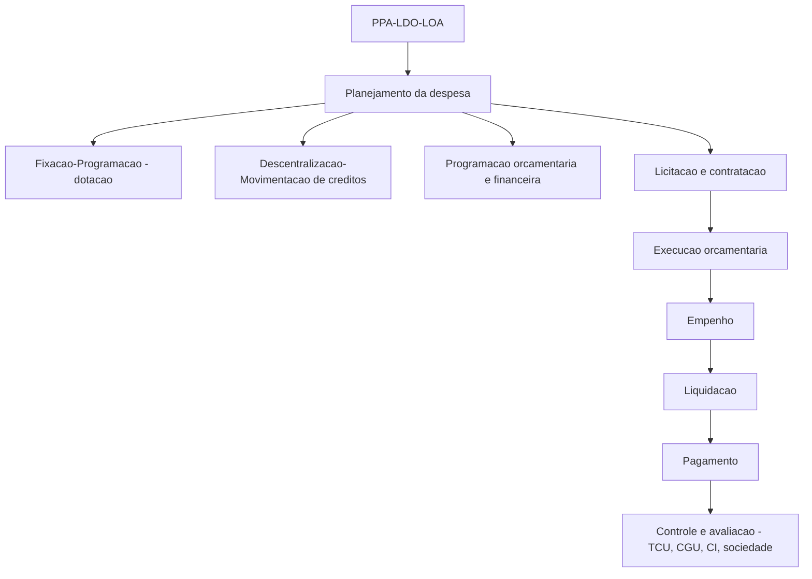
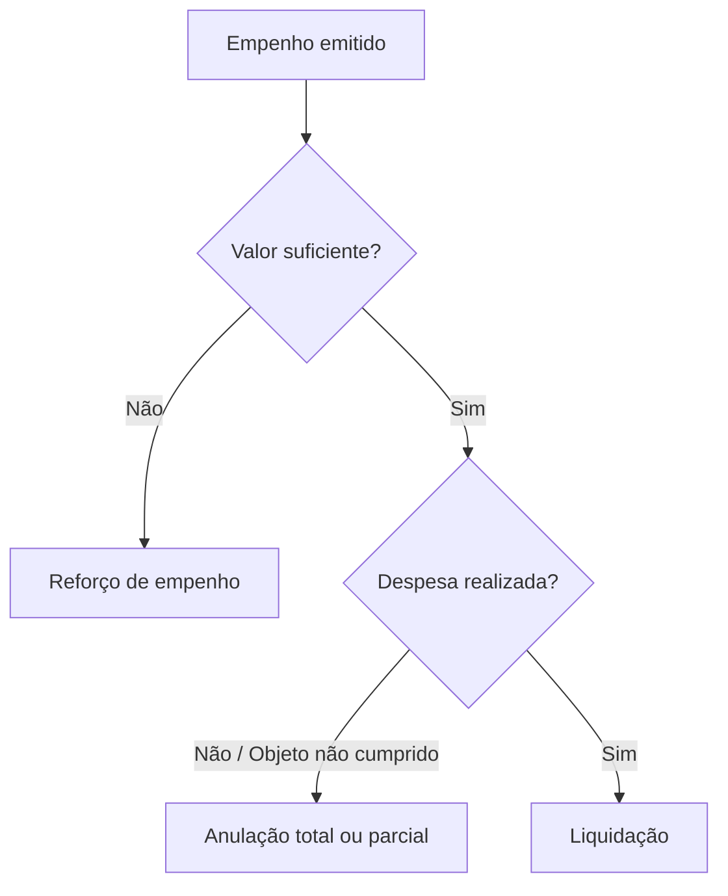
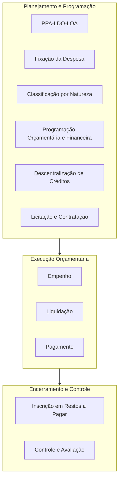
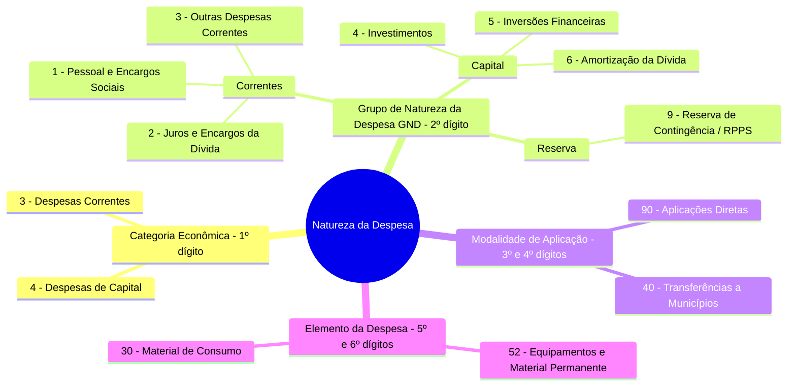
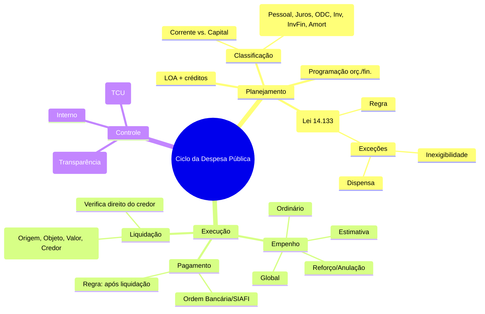
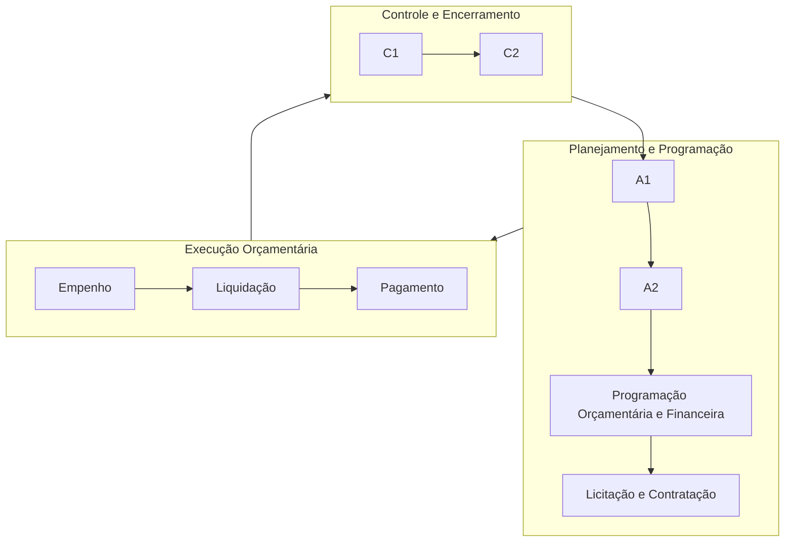

# AFO — Execução da Despesa Pública (nota para Obsidian)

> [!summary] **Mapa geral**  
> Executar o orçamento = realizar **apenas** as despesas autorizadas na LOA e nos créditos adicionais, seguindo **rigorosamente** os estágios legais: **empenho → liquidação → pagamento** (Lei 4.320/1964). O MCASP organiza a gestão da despesa em **planejamento** e **execução**, e a governança se completa com **controle e avaliação**.

---

## 1) Visão panorâmica

* **Regra**: licitar (Lei 14.133/2021). **Exceções**: **inexigibilidade** (art. 74) e **dispensa** (art. 75) quando presentes os requisitos legais.

---

## 2) Planejamento

> [!definition] **Fixação/Programação da despesa**  
> É a dotação inicial aprovada na **LOA** (e seus créditos adicionais), observando o **princípio do equilíbrio**: a despesa autorizada **não** pode superar a previsão de receitas.

**Abrange** (MCASP):

- **Fixação** (dotação)
    
- **Descentralização/movimentação** (provisão de crédito intra/interunidades)
    
- **Programação orçamentária e financeira** (cronogramas)
    
- **Licitação e contratação** (regra; ver §4)
    

> [!tip] Governe o fluxo com **calendário de empenho** + **cronograma de desembolso**. Evita “corrida de fim de ano” e reduz risco de restos a pagar indevidos.

---

## 3) Licitação (regra) e exceções (Lei 14.133/2021)

> [!summary] **Objetivos e princípios**  
> A licitação deve selecionar a proposta **mais vantajosa**, com **isonomia** e **competição**, prevenindo **sobrepreço/superfaturamento**. Aplica princípios como **planejamento, transparência, julgamento objetivo, economicidade** etc. (arts. 5º, 11 e 12 da Lei 14.133/21).

> [!info] **Fases do processo licitatório** (art. 17, Lei 14.133/21):
> 
> 1. preparatória → 2) divulgação do edital → 3) propostas/lances → 4) julgamento → 5) habilitação → 6) recursos → 7) homologação.
>     

**Exceções à licitação:**

- **Inexigibilidade** (art. 74): quando **inviável a competição** (ex.: fornecedor exclusivo; serviços técnicos especializados de natureza predominantemente intelectual com **notória especialização**; contratação de artista consagrado).
    
- **Dispensa** (art. 75): rol **taxativo** (ex.: pequenas compras/serviços até o limite legal; guerra; emergência; contratação com organizações específicas; entre outras hipóteses definidas em lei).
    

> [!warning] **Vínculo com o orçamento:** licitar/contratar **não substitui** o requisito de **dotação** e **empenho**. Sem crédito **não há** despesa válida.

---

## 4) Execução — estágios da despesa (Lei 4.320/1964)

### 4.1 Empenho (1º estágio)

> [!definition] **Conceito**  
> Ato da autoridade competente que **cria obrigação de pagamento** para o Estado, **pendente ou não** de condição (garantia ao credor de que, cumprido o objeto, haverá pagamento).

**Regras-chave**

- **Não pode** exceder o **limite dos créditos** concedidos.
    
- Deve observar o **cronograma** de desembolso da UG.
    
- **Refuerzo/anulação**: reforça-se quando o valor empenhado ficou curto; anula-se totalmente se emitido incorretamente ou se o objeto não foi cumprido.
    

> [!example] **Modalidades de empenho**
> 
> - **Ordinário**: valor previamente conhecido e pagamento **único**.
>     
> - **Estimativa**: valor **não determinável** a priori (ex.: água, energia, diárias).
>     
> - **Global**: valor **definido** para **parcelamento** (ex.: contratos continuados).
>     

> [!warning] **Fim do exercício**  
> Empenho **não liquidado** até **31/12** considera-se **anulado**, **salvo** hipóteses do **Decreto 93.872/1986, art. 35** (ex.: prazo contratual vigente; liquidação em curso; transferências; compromissos no exterior). A **redução/cancelamento** do compromisso implica **anulação** parcial/total com **reversão à dotação** (art. 28 do Decreto 93.872/1986).

### 4.2 Liquidação (2º estágio)

> [!definition] **Conceito**  
> Verifica o **direito do credor** com base em **títulos e documentos** (origem/objeto, **quantia exata** e **quem** deve receber). **Só se paga após regular liquidação** (Lei 4.320/64, art. 62).

**Na prática (SIAFI)**: Nota de Lançamento (NL) comprova a liquidação.

### 4.3 Pagamento (3º estágio)

> [!definition] **Conceito**  
> Entrega de numerário ao credor (ordem bancária no SIAFI), **mediante ordem de pagamento** exarada por autoridade competente, **após** a liquidação.

**Vedações e exceções**

- **Vedado** o **pagamento antecipado** de material/obra/serviço (Decreto 93.872/1986, art. 38), **admitidas** parcelas **na vigência** contratual com **cautelas/garantias** previstas no edital/contrato.
    
- **Adiantamento/suprimento de fundos**: casos **excepcionais**, sempre **precedido de empenho**, para despesas que **não** se ajustam ao processo normal.
    

---

## 5) Restos a Pagar (RAP) — visão rápida

> [!note]
> 
> - **Processados**: já **liquidados** e **não pagos** até 31/12.
>     
> - **Não processados**: **empenhados** e **não liquidados** até 31/12.
>     
> - Gestão de RAP exige lastro financeiro e observância de prazos para reinscrição/cancelamento conforme normas vigentes (atenção aos manuais atualizados).
>     

---

## 6) Controles & avaliação

> [!summary] **Quem controla?**
> 
> - **Controle interno** (cada Poder)
>     
> - **Controle externo** (TCU, com auxílio do controle interno do Executivo)
>     
> - **Controle social** (transparência, LRF/LAI, portais)
>     

**Abrangência**: fiscalização **contábil, financeira, orçamentária, operacional e patrimonial**, visando economicidade, eficiência e eficácia.

---

## 7) Esquema-resumo para memorização

```mermaid
mindmap
  root((Execução da Despesa))
    Planejamento
      LOA + créditos
      Programação orç./fin.
      Licitação (Lei 14.133)
        Regra
        Exceções
          Inexigibilidade
          Dispensa
    Execução
      Empenho
        Ordinário
        Estimativa
        Global
        Reforço/Anulação
      Liquidação
        Provas do direito
      Pagamento
        OB/SIAFI
        Sem antecipação (regra)
    Controle
      Interno
      Externo (TCU)
      Social (transparência)
```

---

# Execução da Despesa (AFO) — como cai nas provas (CEBRASPE & FGV)

> ## Visão-relâmpago

> 
> **Base legal quente (exemplos):** art. 63 da Lei 4.320 (liquidação); vedação de pagamento antecipado com exceções na Lei 14.133/2021 (art. 145) e comunicação contábil na liquidação (art. 146).

---

## Como as bancas cobram (exemplos reais)

### CEBRASPE (TCU – 2025)
- **Liquidação — verificação do direito do credor**  
    _“A liquidação da despesa somente poderá ser efetivada após a verificação do direito adquirido pelo credor, mediante apresentação dos documentos comprobatórios…”_
    
- **Empenho antes da licitação?**  
    Item afirma que _o empenho deve ocorrer obrigatoriamente antes do procedimento licitatório_ — clássico ponto de pegadinha sobre **reserva x empenho**.
    
- **Ajustes no empenho**  
    _“Erro no valor empenhado… procede-se ao cancelamento parcial do empenho, liberando o saldo.”_ (anulação parcial).
    
- **Restos a Pagar & DEAs**  
    • _“DEAs podem ser pagas à conta de dotações vigentes, no elemento adequado.”_  
    • _“Cancelamento de RAP por insuficiência de dotação constitui receita orçamentária…”_ (afirmação para você julgar).  
    • _“Prescrição quinquenal de RAP não processados implica extinção automática, vedado pagamento posterior.”_ (testa prescrição x reconhecimento futuro como DEA).  
    • _“Empenhos não liquidados até 31/12 devem ser **automaticamente** inscritos em RAP NP…”_ (cai muito a palavra “automaticamente”).
    

---

### FGV (provas oficiais)

- **Modalidades de empenho na prática** — **CVM/FGV 2024 (prova oficial, PDF da FGV)**  
    Enunciado coloca um **ordenador** diante de: (i) aditivo para **2ª etapa** de obra (fases mensais) e (ii) **reforço** de empenhos de água. A pergunta exige **combinar modalidades** (global/ordinário/estimativo) no cenário. Excelente para treinar **global x estimativo**. ([FGV Conhecimento](https://conhecimento.fgv.br/sites/default/files/concursos/tarde-analista-cvm-perfil-6-contabilidade-publicaperfil-6-tipo-1.pdf?utm_source=chatgpt.com "COMISSÃO DE VALORES MOBILIÁRIOS"))
    
- **Liquidação — quais informações se apuram** — **Câmara Municipal de SP/FGV 2024**  
    Questão pede **a exceção** entre os itens apurados na liquidação segundo a Lei 4.320 (origem, objeto, **importância exata**, **a quem** se paga — e o que **não** é escopo). ([questoes.grancursosonline.com.br](https://questoes.grancursosonline.com.br/questoes-de-concursos/contabilidade-publica-405707/3120310?utm_source=chatgpt.com "De acordo com a Lei nº 4.320/1964, a liquidação da despes ..."))
    
- **“Subregistro” de obrigações financeiras** — **FGV 2023 (ÁREA IV — Finanças Públicas, banca FGV, caderno oficial)**  
    Cobra a conta utilizada nessa prática (alternativas incluíam _RAP processados_, _RAP não processados_, _Despesas liquidadas mas não pagas_, _Dívida Ativa_, **DEAs**). Excelente para diferenciar **RAP x DEAs**. ([FGV Conhecimento](https://conhecimento.fgv.br/sites/default/files/concursos/cns404-area-4.pdf?utm_source=chatgpt.com "ÁREA IV (FINANÇAS PÚBLICAS)"))
    

> Outros bancos de questões reúnem dezenas de itens sobre **liquidação (art. 63)**, **RAP processados x não processados** e **tipos de empenho**; vale consultar coleções por tema quando quiser montar listas para revisão. ([questoes.grancursosonline.com.br](https://questoes.grancursosonline.com.br/questoes-de-concursos/direito-financeiro-lei-4-320-64-normas-gerais-do-direito-financeiro-405704?utm_source=chatgpt.com "Questões de Concurso sobre Lei 4.320/64 - Normas Gerais ..."))

---

## Padrões de cobrança (checklist rápido)

- **Liquidação** verifica **origem, objeto, importância exata e a quem pagar** antes do pagamento. (Lei 4.320/1964, art. 63).
    
- **Empenho ≠ reserva**: a banca adora afirmar que o **empenho ocorre antes da licitação** — observe que o que aparece na fase interna é **reserva/planejamento**, enquanto o **empenho** nasce com obrigação certa. Veja o item da prova anexa.
    
- **RAP processados x não processados**: distinguem-se pelo estágio atingido (liquidação realizada ou não). FGV e CEBRASPE exploram **inscrição**, **cancelamento** e **prescrição** (e o que vira **DEA**). ([FGV Conhecimento](https://conhecimento.fgv.br/sites/default/files/concursos/cns404-area-4.pdf?utm_source=chatgpt.com "ÁREA IV (FINANÇAS PÚBLICAS)"))
    
- **Pagamento antecipado**: regra é **vedação**; há exceções justificadas e com garantias (Lei 14.133/2021, art. 145). Isso costuma aparecer como assertiva seca.
    

---

## Dica de estudo (alvo “certeiros”)

- **Decore** os verbos da liquidação (“verificar” **origem/objeto/quantia/quem**).
    
- **Tipos de empenho** com **exemplos operacionais** (água/energia → **estimativo**; aluguel/salários/contratos com parcelas → **global**; compra única e conhecida → **ordinário**).
    
- **RAP**: quando **inscreve**, quando **cancela**, o que pode virar **DEA** e impactos no registro orçamentário/financeiro.
    

Se quiser, monto uma segunda nota só reunindo **prints**/links das questões e separo por tópico (Empenho • Liquidação • Pagamento • RAP • DEA) — é só falar.

---

### **Tópico: Análise da Relação entre Restos a Pagar, Prescrição e Despesas de Exercícios Anteriores (DEA)**

**Ponto de Análise Central:** A afirmação _"Prescrição quinquenal de RAP não processados implica extinção automática, vedado pagamento posterior"_ suscita a necessidade de compreender a distinção fundamental entre o cancelamento do registro orçamentário-financeiro (a inscrição em Restos a Pagar) e a subsistência do direito creditório subjacente, o qual pode ser satisfeito por via alternativa.

---

#### **1. Definição e Classificação dos Restos a Pagar (RAP)**

Conforme a Lei nº 4.320/1964, art. 36, "consideram-se Restos a Pagar as despesas empenhadas mas não pagas até o dia 31 de dezembro, distinguindo-se as processadas das não processadas". A classificação é, portanto, de suma importância:

- **Restos a Pagar Processados:** Referem-se a despesas que já percorreram os estágios de empenho e **liquidação**. A liquidação, nos termos do art. 63 da Lei nº 4.320/64, consiste na verificação do direito adquirido pelo credor, tendo por base os títulos e documentos comprobatórios do respectivo crédito. Nesta fase, a obrigação de pagar por parte do ente público é líquida e certa, restando apenas a etapa final do pagamento.
    
- **Restos a Pagar Não Processados:** Correspondem a despesas que foram apenas empenhadas, encontrando-se **pendentes de liquidação**. Isso significa que o credor ainda não implementou a condição para o pagamento (ex: não entregou o bem ou não prestou o serviço) ou a Administração ainda não realizou a devida verificação e aceite.
    

#### **2. Análise da Extinção dos RAP Não Processados e seus Efeitos**

A afirmação em análise refere-se especificamente aos RAP **não processados**. Manuais técnicos, como o Manual de Contabilidade Aplicada ao Setor Público (MCASP), e a legislação correlata estabelecem controles para a manutenção desses saldos, que incluem o cancelamento após determinado período.

1. **"Extinção automática"**: O termo refere-se ao **cancelamento do registro contábil** da despesa como "Restos a Pagar". Trata-se de um procedimento administrativo-contábil para evitar a manutenção indefinida de obrigações pendentes de liquidação, o que comprometeria a fidedignidade das demonstrações contábeis e a gestão orçamentária. A extinção é da _inscrição_, não necessariamente da _obrigação_.
    
2. **"Vedado pagamento posterior"**: A vedação se aplica ao pagamento da despesa **na qualidade de Restos a Pagar daquele exercício específico**. Uma vez que o empenho original foi cancelado, a dotação orçamentária a ele vinculada se extingue, impossibilitando sua utilização para uma ordem de pagamento futura.
    

#### **3. A Solução Jurídico-Contábil: Despesas de Exercícios Anteriores (DEA)**

O cancelamento da inscrição em RAP não extingue a obrigação da Fazenda Pública se o credor, de fato, cumpriu sua parte no contrato (implementou a condição). A dívida existe materialmente, embora o mecanismo orçamentário original para sua quitação tenha sido extinto.

Para esses casos, o ordenamento jurídico prevê a figura das **Despesas de Exercícios Anteriores (DEA)**, definidas no art. 37 da Lei nº 4.320/64:

> "As despesas de exercícios encerrados, para as quais o orçamento respectivo consignava crédito próprio, com saldo suficiente para atendê-las, que não se tenham processado na época própria, bem como os Restos a Pagar com prescrição interrompida e os compromissos reconhecidos após o encerramento do exercício correspondente, poderão ser pagos à conta de dotação específica consignada no orçamen1to, discriminada por elementos, obedecida, sempre que possível, a ordem cronológica."

O procedimento para quitação da obrigação é o seguinte:

1. **Reconhecimento da Dívida:** A autoridade administrativa competente deve, mediante processo regular, reconhecer formalmente a existência da dívida.
    
2. **Dotação Orçamentária:** A despesa deve ser empenhada à conta de uma dotação específica para DEA no orçamento do exercício corrente.
    
3. **Pagamento:** Após o empenho, seguem-se os trâmites normais de liquidação (se ainda não realizada) e pagamento.
    

Em suma, o cancelamento de uma inscrição em RAP não processado constitui um ajuste de natureza orçamentária e contábil, não implicando, _per se_, a extinção da obrigação material da Fazenda Pública, a qual, uma vez reconhecida, deve ser satisfeita por meio de DEA.

---

### **4. Questões de Concursos Recentes (Cebraspe/CESPE e FGV)**

A seguir, exemplos de como as bancas exploram a intersecção desses conceitos.

#### **Questão 1: Cebraspe (CESPE)**

- **Órgão/Ano:** SEFAZ-CE / 2021
    
- **Cargo:** Auditor Fiscal
    
- **Assertiva:** "Uma vez cancelado o empenho de despesa pública inscrito em restos a pagar não processados, a despesa correspondente não poderá mais ser paga pelo poder público, mesmo que o credor venha a cumprir a sua obrigação."
    
- **Gabarito:** Errado.
    
- **Análise da Questão:** A assertiva está incorreta porque ignora a possibilidade de pagamento por meio de Despesas de Exercícios Anteriores (DEA). O cancelamento do registro em RAP impede o pagamento _por essa via_, extinguindo a validade daquele empenho original. Contudo, se o direito do credor for legítimo (ou seja, se ele cumpriu sua obrigação), a obrigação da Administração subsiste e deve ser satisfeita mediante o procedimento de DEA, que envolve o reconhecimento da dívida e a alocação de nova dotação orçamentária no exercício corrente.
    

#### **Questão 2: FGV**

- **Órgão/Ano:** TCE-AM / 2021
    
- **Cargo:** Auditor Técnico de Controle Externo
    
- **Enunciado (adaptado):** "As despesas de exercícios anteriores são aquelas cujo fato gerador ocorreu em exercício financeiro anterior àquele em que se dará o pagamento. Assinale a opção que indica uma despesa que se enquadra nessa categoria."
    
    - (A) Despesa cujo empenho foi emitido no exercício, com pagamento previsto para o exercício seguinte.
        
    - (B) Dívida cuja prescrição tenha se consumado.
        
    - (C) Compromissos reconhecidos após o encerramento do exercício.
        
    - (D) Despesa com vencimento no exercício corrente, mas paga com atraso.
        
    - (E) Despesas inscritas em restos a pagar processados e não pagos no exercício.
        
- **Gabarito:** Alternativa C.
    
- **Análise da Questão:** A alternativa **(C)** é a correta e descreve uma das hipóteses clássicas de DEA, conforme o art. 37 da Lei nº 4.320/64. Um RAP não processado que foi cancelado e cujo serviço foi posteriormente comprovado pelo credor se enquadra perfeitamente como um "compromisso reconhecido após o encerramento do exercício correspondente". As demais alternativas estão incorretas: (A) e (E) descrevem a sistemática de Restos a Pagar, não DEA; (B) descreve uma dívida prescrita, que não pode ser paga; e (D) é uma despesa do próprio exercício, paga com atraso, mas ainda dentro da vigência orçamentária.

Classificação por natureza da despesa (por categorias)

Segundo Aliomar Baleeiro, despesa pública é a “aplicação de certa quantia em dinheiro, por
parte da autoridade ou agente público competente, dentro de uma autorização legislativa, para
execução de um fim a cargo do governo”.

De acordo com Fabiano Garcia Core, “no tocante à despesa, as classificações, basicamente,
respondem às principais indagações que habitualmente surgem quando o assunto é gasto
orçamentário. A cada uma dessas indagações, corresponde um tipo de classificação. Ou seja:
quando a pergunta é ‘para que’ serão gastos os recursos alocados, a resposta será encontrada na
classificação programática ou, mais adequadamente, de acordo com a portaria nº 42/99, na
estrutura programática; ‘em que’ serão gastos os recursos, a resposta consta da classificação
funcional; ‘o que’ será adquirido ou ‘o que’ será pago, na classificação por elemento de despesa;
‘quem’ é o responsável pela programação a ser realizada, a resposta é encontrada na
classificação institucional (órgão e unidade orçamentária); ‘qual o efeito econômico da realização
da despesa’, na classificação por categoria econômica; e ‘qual a origem dos recursos’, na
classificação por fonte de recursos”.

Classificação quanto à forma de ingresso

Quanto à forma de ingresso, as despesas podem ser:
⇒ ORÇAMENTÁRIAS — são as despesas fixadas nas leis orçamentárias ou nas de créditos
adicionais, instituídas em bases legais. Assim, dependem de autorização legislativa.
Obedecem aos estágios da despesa: fixação, empenho, liquidação e pagamento.
Exemplos: construção de prédios públicos, manutenção de rodovias, pagamento de
servidores etc.
⇒ EXTRAORÇAMENTÁRIAS — são as despesas não consignadas no orçamento ou nas leis
de créditos adicionais. Correspondem à devolução de recursos transitórios que foram
obtidos como receitas extraorçamentárias, ou seja, pertencem a terceiros, e não aos
órgãos públicos. São exemplos as restituições de cauções, os pagamentos de restos a
pagar, o resgate de operações por antecipação de receita orçamentária, o repasse ao
credor das consignações em folha etc. Assim, não dependem de autorização legislativa.

Vale lembrar:
➔ Inscrição em restos a pagar = receita extraorçamentária.
➔ Pagamento em restos a pagar = despesa extraorçamentária.
Vale ressaltar que o resgate (pagamento) de operações de crédito por antecipação
de receita orçamentária é despesa extraorçamentária. Entretanto, os encargos
referentes a tais despesas são orçamentários, classificados no elemento de despesa
“25 - Encargos sobre Operações de Crédito por Antecipação da Receita”.

Estrutura da programação orçamentária da despesa

Na estrutura atual, o orçamento público está organizado em programas de trabalho, que contêm
informações qualitativas e quantitativas, sejam físicas ou financeiras.

Programação qualitativa — o programa de trabalho define qualitativamente a programação
orçamentária e deve responder, de maneira clara e objetiva, às perguntas clássicas que
caracterizam o ato de orçar, sendo, do ponto de vista operacional, composto dos seguintes
blocos de informação: classificação por esfera, classificação institucional, classificação funcional,
estrutura programática e principais informações de programa e ação.

Segundo o MTO-2023, o conceito de “programações orçamentárias” é utilizado de maneira
análoga ao uso da expressão “categorias de programação”, compreendendo o detalhamento da
despesa por função, subfunção, unidade orçamentária, ação e subtítulo. Dessa forma, a categoria
de programação, em seu conjunto de classificadores, comunica a finalidade e o escopo da
atuação governamental.

Programação quantitativa — compreende a programação física e financeira. A programação
física define quanto se pretende desenvolver do produto por meio da meta física, que corresponde à quantidade de produto a ser ofertada por ação, de forma regionalizada, se for o
caso, num determinado período e instituída para cada ano. Já a programação financeira define o
que adquirir e com quais recursos, por meio da natureza da despesa, do identificador de uso, da
fonte de recursos, do identificador de operações de crédito, do identificador de resultado
primário e da dotação. Ou seja, a dimensão física define a quantidade de bens e serviços a serem
entregues.

Classificação por natureza da despesa (por categorias)

Nesse contexto, o conjunto de informações que formam o código é conhecido como
classificação por natureza de despesa e informa a categoria econômica, o grupo a que pertence,
a modalidade de aplicação e o elemento. Temos ainda o desdobramento facultativo do elemento
da despesa (subelemento).

Na LOA, a discriminação da despesa, quanto
à sua natureza, far-se-á, no mínimo, por
categoria econômica, grupo de natureza de
despesa e modalidade de aplicação.

Assim como a receita, esse nível de classificação por natureza obedece ao critério econômico.
Permite analisar o impacto dos gastos públicos na economia do país. A despesa é classificada em
duas categorias econômicas, com os seguintes códigos:
3 - DESPESAS ORÇAMENTÁRIAS CORRENTES — classificam-se nessa categoria todas as
despesas que não contribuem, diretamente, para a formação ou aquisição de um bem de capital.
4 - DESPESAS ORÇAMENTÁRIAS DE CAPITAL — classificam-se nessa categoria aquelas
despesas que contribuem, diretamente, para a formação ou aquisição de um bem de capital.

GND das despesas correntes
PESSOAL E ENCARGOS SOCIAIS — despesas orçamentárias com pessoal ativo, inativo e
pensionistas, relativas a mandatos eletivos, cargos, funções ou empregos, civis, militares e de
membros de Poder, com quaisquer espécies remuneratórias, tais como vencimentos e vantagens,
fixas e variáveis, subsídios, proventos da aposentadoria, reformas e pensões, inclusive adicionais,
gratificações, horas extras e vantagens pessoais de qualquer natureza, bem como encargos

JUROS E ENCARGOS DA DÍVIDA — despesas com o pagamento de juros, comissões e outros
encargos de operações de crédito internas e externas contratadas, bem como da dívida pública
mobiliária.

OUTRAS DESPESAS CORRENTES — despesas com aquisição de material de consumo,
pagamento de diárias, contribuições, subvenções, auxílio-alimentação, auxílio-transporte, além
de outras despesas da categoria econômica “despesas correntes” não classificáveis nos demais
grupos de natureza de despesa. Algumas despesas com material de consumo, por exemplo,
merecem destaque. Conforme o MCASP 10ª edição, na classificação da despesa com aquisição
de material devem ser adotados alguns parâmetros que distinguem o material permanente do
material de consumo. Um material é considerado de consumo caso atenda um, e pelo menos
um, dos critérios a seguir:
a. Critério da Durabilidade: se em uso normal perde ou tem reduzidas as suas condições de
funcionamento, no prazo máximo de dois anos;
b. Critério da Fragilidade: se sua estrutura for quebradiça, deformável ou danificável,
caracterizando sua irrecuperabilidade e perda de sua identidade ou funcionalidade;
c. Critério da Perecibilidade: se está sujeito a modificações (químicas ou físicas) ou se deteriora
ou perde sua característica pelo uso normal;
d. Critério da Incorporabilidade: se está destinado à incorporação a outro bem, e não pode ser
retirado sem prejuízo das características físicas e funcionais do principal. Pode ser utilizado para a
constituição de novos bens, melhoria ou adições complementares de bens em utilização (sendo
classificado como 4.4.90.30), ou para a reposição de peças para manutenção do seu uso normal
que contenham a mesma configuração (sendo classificado como 3.3.90.30);
e. Critério da Transformabilidade: se foi adquirido para fim de transformação.
Outro ponto de destaque diz respeito ao GND 2 e GND 3, vejamos:

GND das despesas de capital
INVESTIMENTOS — despesas orçamentárias com softwares e com o planejamento e a execução
de obras, inclusive com a aquisição de imóveis considerados necessários à realização destas
últimas, e com a aquisição de instalações, equipamentos e material permanente.
INVERSÕES FINANCEIRAS — despesas orçamentárias com a aquisição de imóveis ou bens de
capital já em utilização; aquisição de títulos representativos do capital de empresas ou entidades
de qualquer espécie, já constituídas, quando a operação não importe aumento do capital; e com
a constituição ou aumento do capital de empresas, além de outras despesas classificáveis nesse
grupo.

AMORTIZAÇÃO DA DÍVIDA — despesas com o pagamento e/ou refinanciamento do principal e
da atualização monetária ou cambial da dívida pública interna e externa, contratual ou mobiliária.
Cabe ressaltar que, para a Lei nº 4.320/1964, a amortização da dívida é um elemento da despesa
que se apresenta dentro de transferências de capital. Então, deve-se prestar atenção ao contexto
que a banca vai trazer na prova.
➔​ Amortização da dívida na Lei nº 4.320/1964: elemento da despesa (transferências de
capital).
➔​ Amortização da dívida para Portaria nº 163/2001: Grupo de Natureza da Despesa (GND).

Reservas
Com relação à natureza da despesa orçamentária, as reservas não são classificadas como
despesas correntes nem como despesas de capital. Para efeito de classificação, as reservas do
RPPS e de contingência serão identificadas como grupo “9”, todavia não serão passíveis de
execução, servindo de fonte para abertura de créditos adicionais, mediante os quais se dará
efetivamente a despesa que será classificada nos respectivos grupos.
RESERVA DO REGIME PRÓPRIO DE PREVIDÊNCIA DO SERVIDOR – RPPS — de acordo com o
Manual de Contabilidade Aplicada ao Setor Público – MCASP, os ingressos previstos que
ultrapassarem as despesas orçamentárias fixadas em um determinado exercício constituem o
superávit orçamentário inicial, destinado a garantir desembolsos futuros do RPPS do ente
respectivo. Assim sendo, esse superávit orçamentário representará a fração de ingressos que
serão recebidos sem a expectativa de execução de despesa orçamentária no exercício e
constituirá a reserva orçamentária para suportar déficits futuros, em que as receitas orçamentárias
previstas serão menores que as despesas orçamentárias.
RESERVA DE CONTINGÊNCIA — é definida na LDO com base na Receita Corrente Líquida.
Compreende o volume de recursos destinados ao atendimento a passivos contingentes e a
outros riscos, bem como a eventos fiscais imprevistos. Os passivos contingentes são
representados por demandas judiciais, dívidas em processo de reconhecimento e operações de aval e garantias dadas pelo Poder Público. Os outros riscos a que se refere o § 3º do art. 4º da
LRF são classificados em duas categorias: Riscos Fiscais Orçamentários e Riscos Fiscais de Dívida.

Diferenças entre investimentos e inversões financeiras nas aplicações em imóveis relacionadas ao
PIB — o Produto Interno Bruto refere-se ao valor agregado de todos os bens e serviços finais
produzidos dentro do território econômico do país, independentemente da nacionalidade dos
proprietários das unidades produtoras desses bens ==adefb==
 e serviços.
Podemos concluir que, dos conceitos de investimentos e inversões financeiras, as despesas do
grupo “Investimento” contribuem para a formação do Produto Interno Bruto.
A inversão financeira é a despesa de capital que, ao contrário de investimentos, não gera serviços
e incrementa o PIB. Por exemplo, a aquisição de um prédio já pronto para a instalação de um
serviço público é inversão financeira, pois mudou-se a estrutura de propriedade do bem, mas não
a composição do PIB.
Já os investimentos são as despesas de capital que geram serviços e, em consequência,
acréscimos ao PIB. Por exemplo, a construção de um novo edifício é um investimento, pois, além
de gerar serviços, provoca incremento no PIB.

Modalidade de aplicação (3º nível)

A modalidade de aplicação indica se os recursos serão aplicados mediante transferência
financeira, inclusive a decorrente de descentralização orçamentária para outros níveis de governo,
seus órgãos ou entidades, ou diretamente para entidades privadas sem fins lucrativos e outras
instituições; ou, então, diretamente pela unidade detentora do crédito orçamentário, ou por
outro órgão ou entidade no âmbito do mesmo nível de governo. A modalidade de aplicação é
uma informação gerencial que objetiva, principalmente, eliminar a dupla contagem dos recursos
transferidos ou descentralizados.

Segundo o MTO: aplicação direta é a aplicação, pela unidade orçamentária, dos créditos a ela
alocados ou oriundos de descentralização de outras entidades integrantes ou não do orçamentos
fiscal ou da Seguridade Social, no âmbito da mesma esfera de governo.

Classificações Doutrinárias

Segundo a doutrina, ou seja, consoante os estudiosos do direito financeiro, a despesa pública
pode ainda ser classificada nos seguintes aspectos: competência institucional, afetação
patrimonial e regularidade:
Competência institucional: classifica as despesas de acordo com o ente político competente à
sua instituição ou realização, quais sejam: governo federal, estadual, do Distrito Federal e
municipal.

Afetação patrimonial
⇒ Despesa orçamentária efetiva — aquela que, no momento da sua realização, reduz a
situação líquida patrimonial da entidade. Exemplos: despesas correntes, exceto aquisição
de materiais para estoque e a despesa com adiantamento, que representam fatos
permutativos e, assim, são despesas não efetivas.
⇒ Despesa orçamentária não efetiva ou por mutação patrimonial — aquela que, no
momento da sua realização, não reduz a situação líquida patrimonial da entidade e
constitui fato contábil permutativo. Exemplo: despesas de capital, exceto as transferências
de capital que causam decréscimo patrimonial e, assim, são efetivas.

Regularidade ou periodicidade
⇒ Ordinárias — compostas por despesas perenes e que possuem característica de
continuidade, pois repetem-se em todos os exercícios, como as despesas com pessoal,
encargos, serviços de terceiros etc.
⇒ Extraordinárias — não integram sempre o orçamento, pois são despesas de caráter não
continuado, eventual, inconstante, imprevisível, como as despesas decorrentes de
calamidade pública, guerras, comoção interna etc.

Classificações na Lei nº 4.320/1964

Introdução
Pessoal, agora vamos dar uma atenção especial a alguns artigos da Lei nº 4.320/1964
relacionados ao tema. Repare que há diferenças entre os conceitos estudados nesta aula e a
classificação da despesa por natureza. Segundo o art. 12, a despesa será classificada nas
seguintes categorias econômicas: despesas correntes e despesas de capital. Vale lembrar que a
categoria econômica permite analisar o impacto dos gastos na economia do país.
Portanto, conforme a Lei nº 4.320/1964, podemos dizer que se classificam na categoria de
despesas correntes todas as despesas para manutenção e funcionamento dos serviços públicos
em geral. Em outras palavras, são despesas que não contribuem, diretamente, para a formação
ou aquisição de um bem de capital.
Por outro lado, classificam-se na categoria de despesas de capital aquelas despesas que
contribuirão para a produção ou geração de novos bens ou serviços e integrarão o patrimônio
público, ou seja, contribuem, diretamente, para a formação ou aquisição de um bem de capital.
Segundo José Maurício Conti, “o critério estabelecido na Lei n. 4.320/1964 é
preponderantemente econômico. Previsto no art. 12, o critério de que se vale a lei distingue as
despesas públicas em: (i) despesas correntes, as quais estão fundamentalmente atreladas à
realização de serviços e, que, por seu turno, dividem-se em (i.a) despesas de custeio e (i.b)
transferências correntes; e em (ii) despesas de capital, as quais se vinculam à aquisição ou
produção de bens e se classificam em: (ii.a) investimentos, (ii.b) inversões financeiras e (ii.c)
transferências de capital”.

Despesas Correntes
São despesas correntes de acordo com a Lei nº 4.320/1964:
⇒ DESPESAS DE CUSTEIO — as dotações para manutenção de serviços anteriormente
criados, inclusive as destinadas a atender a obras de conservação e adaptação de bens
imóveis. São exemplos o pagamento do salário de servidores públicos (pessoal civil),
militares, aquisição de material de consumo, serviços de terceiros etc. Entende-se por
despesa de custeio todo tipo de despesa que faz manutenção da máquina pública, ou
seja, faz o serviço público funcionar.
Ademais, quando a lei fala em obras de conservação e adaptação de bens imóveis,
podemos dizer que uma simples pintura nas paredes de um órgão público é despesa de
custeio, desde que não promova nenhum acréscimo ou melhoria.
⇒ TRANSFERÊNCIAS CORRENTES — as dotações para despesas às quais não corresponda
contraprestação direta em bens ou serviços, inclusive para contribuições e subvenções
destinadas a atender à manifestação de outras entidades de direito público ou privado.
São exemplos as subvenções sociais, subvenções econômicas, pagamento dos
aposentados, pensionistas e dos juros da dívida pública.
É só lembrar que pertencem às transferências correntes tudo que não representa
manutenção da máquina pública. Juros da dívida são manutenção? Lógico que não. E os
aposentados? Também não, pois eles já foram servidores e já contribuíram para a
manutenção do serviço público; todavia, depois da aposentadoria, não serão mais
caracterizados como manutenção da máquina pública.
Os exemplos são trazidos no art. 13 da Lei nº 4.320/1964 e estão no esquema a seguir:

Aprendemos até agora que as subvenções são despesas correntes que se encontram dentro das
transferências correntes. Mas o que, afinal, são subvenções? A Lei nº 4.320/1964 traz muitos
detalhes sobre elas.
Consideram-se subvenções, para os efeitos da Lei nº 4.320/1964, as transferências destinadas a
cobrir despesas de custeio das entidades beneficiadas1, distinguindo-se entre subvenções sociais
e econômicas.
SUBVENÇÕES SOCIAIS — as que se destinem a instituições públicas ou privadas de caráter
assistencial ou cultural, sem finalidade lucrativa2.
Fundamentalmente e nos limites das possibilidades financeiras, a concessão de subvenções
sociais visará à prestação de serviços essenciais de assistência social, médica e educacional,
sempre que a suplementação de recursos de origem privada aplicados a esses objetivos
revelar-se mais econômica.

O valor das subvenções, sempre que possível, será calculado com base em unidades de serviços
efetivamente prestados ou postos à disposição dos interessados, obedecidos os padrões
mínimos de eficiência previamente fixados3.
Somente à instituição cujas condições de funcionamento forem julgadas satisfatórias pelos
órgãos oficiais de fiscalização serão concedidas subvenções4.
SUBVENÇÕES ECONÔMICAS — as que se destinem a empresas públicas ou privadas de caráter
industrial, comercial, agrícola ou pastoril5.
A cobertura dos déficits de manutenção das empresas públicas, de natureza autárquica ou não,
far-se-á mediante subvenções econômicas expressamente incluídas nas despesas correntes do
orçamento da União, dos estados, dos municípios ou do Distrito Federal6.
Consideram-se, igualmente, como subvenções econômicas: as dotações destinadas a cobrir a
diferença entre os preços de mercado e os preços de revenda, pelo governo, de gêneros
alimentícios ou outros materiais; e as dotações destinadas ao pagamento de bonificações a
produtores de determinados gêneros ou materiais7.
A Lei de Orçamento não consignará ajuda financeira, a qualquer título, a empresa de fins
lucrativos, salvo quando se tratar de subvenções cuja concessão tenha sido expressamente
autorizada em lei especial8.
A subvenção econômica e a contribuição são os instrumentos de cooperação financeira da União
com entidades ou empresas do setor privado que dependem de autorização expressa em lei
especial.
Segundo o Decreto nº 93.872/1986:

Despesas de Capital
São despesas de capital de acordo com a Lei nº 4.320/1964:
⇒ INVESTIMENTOS — as dotações para o planejamento e a execução de obras, inclusive as
destinadas à aquisição de imóveis considerados necessários à realização destas últimas,
bem como para os programas especiais de trabalho, aquisição de instalações,
equipamentos e material permanente e constituição ou aumento do capital de empresas
que não sejam de caráter comercial ou financeiro.

⇒ INVERSÕES FINANCEIRAS — as dotações destinadas à aquisição de imóveis ou de bens
de capital já em utilização; aquisição de títulos representativos do capital de empresas ou
entidades de qualquer espécie, já constituídas, quando a operação não importe aumento
do capital; constituição ou aumento do capital de entidades ou empresas que visem a
objetivos comerciais ou financeiros, inclusive operações bancárias ou de seguros.

⇒ TRANSFERÊNCIAS DE CAPITAL — as dotações para investimentos ou inversões
financeiras que outras pessoas de direito público ou privado devam realizar,
independentemente de contraprestação direta em bens ou serviços, constituindo essas
transferências auxílios ou contribuições, segundo derivem diretamente da Lei de
Orçamento ou de lei especialmente anterior, bem como as dotações para amortização da
dívida pública.

OUTROS ARTIGOS IMPORTANTES
UNIDADE ORÇAMENTÁRIA — constitui unidade orçamentária o agrupamento de serviços
subordinados ao mesmo órgão ou repartição a que serão consignadas dotações próprias12. As
dotações orçamentárias, especificadas por categoria de programação em seu menor nível, são
consignadas às unidades orçamentárias, que são as estruturas administrativas responsáveis pelas
dotações e pela realização das ações. Em casos excepcionais, serão consignadas dotações a
unidades administrativas subordinadas ao mesmo órgão13.
ELEMENTOS — na Lei de Orçamento, a discriminação da despesa far-se-á no mínimo por
elementos. Entende-se por elementos o desdobramento da despesa com pessoal, material,
serviços, obras e outros meios de que se serve a administração pública para consecução dos seus
fins14.
MATERIAL PERMANENTE — para efeito de classificação da despesa, considera-se material
permanente o de duração superior a dois anos15.

Com certeza. Reestruturei e expandi sua nota para Obsidian, integrando todo o conteúdo sobre a classificação da despesa pública de forma coesa e aprofundada, mantendo o estilo visual e a organização lógica do seu material original.

A nova versão enriquece a fase de planejamento, detalha as classificações da despesa e conecta esses conceitos à execução orçamentária, ultrapassando o volume de texto original para oferecer um guia de estudos ainda mais completo.

---

# AFO — Execução e Classificação da Despesa Pública (Nota Consolidada)

> [!summary] Mapa Geral
> 
> Executar o orçamento é realizar apenas as despesas autorizadas na LOA e em créditos adicionais, seguindo rigorosamente os estágios legais: empenho → liquidação → pagamento (Lei 4.320/1964). O processo completo, segundo o MCASP, abrange o planejamento (que inclui a correta classificação da despesa), a execução propriamente dita, e se completa com o controle e a avaliação.

---

## 1) Visão Panorâmica do Ciclo da Despesa

Code snippet

---

## 2) Planejamento e Estrutura da Despesa

A fase de planejamento é crucial e se inicia com a autorização da despesa na Lei Orçamentária Anual (LOA).

> [!definition] Fixação da Despesa
> 
> É a dotação inicial de crédito orçamentário aprovada na LOA (e posteriormente alterada por créditos adicionais), que representa o limite máximo de gasto autorizado para cada finalidade. Deve sempre observar o princípio do equilíbrio: a despesa fixada não pode superar a receita prevista.

Esta fase abrange, segundo o MCASP:

- **Fixação** (dotação inicial).
    
- **Classificação da Despesa** (detalhamento da finalidade e natureza do gasto).
    
- **Descentralização/Movimentação de Créditos** (provisão de crédito entre unidades gestoras).
    
- **Programação Orçamentária e Financeira** (definição de cronogramas de execução).
    
- **Licitação e Contratação** (procedimento regra para aquisições e serviços).
    

### 2.1) Classificação da Despesa Pública

Para entender a execução, é fundamental dominar como a despesa é classificada. A classificação responde a perguntas essenciais sobre o gasto público.

> [!quote] Fabiano Garcia Core
> 
> "No tocante à despesa, as classificações, basicamente, respondem às principais indagações que habitualmente surgem quando o assunto é gasto orçamentário. (...) ‘para que’ serão gastos os recursos (...) na classificação programática; ‘em que’ serão gastos os recursos (...) na classificação funcional; ‘o que’ será adquirido ou ‘o que’ será pago, na classificação por elemento de despesa; ‘quem’ é o responsável (...) na classificação institucional; ‘qual o efeito econômico (...)’, na classificação por categoria econômica; e ‘qual a origem dos recursos’, na classificação por fonte de recursos”.

#### **A. Classificação quanto à Forma de Ingresso**

- **Despesas Orçamentárias:** São as despesas fixadas na LOA e em créditos adicionais. Dependem de autorização legislativa e seguem rigorosamente os estágios de empenho, liquidação e pagamento. Ex: pagamento de servidores, construção de hospitais.
    
- **Despesas Extraorçamentárias:** Não constam no orçamento e não dependem de autorização legislativa. Correspondem à devolução de recursos que pertencem a terceiros e que transitaram pelo caixa do governo (receitas extraorçamentárias). Ex: restituição de cauções, pagamento de Restos a Pagar, resgate de ARO.
    

> [!tip] **Relação com Restos a Pagar (RAP)**
> 
> - A **inscrição** de uma despesa em RAP ao final do exercício é tratada como uma **receita extraorçamentária** (o recurso entra no caixa do novo exercício).
>     
> - O **pagamento** de um RAP no exercício seguinte é uma **despesa extraorçamentária** (devolução do recurso ao credor).
>     

#### **B. Classificação por Natureza da Despesa**

Esta é a classificação mais detalhada e cobrada. Sua estrutura informa o que será adquirido e qual o impacto econômico do gasto. A estrutura completa é: `C.G.M.E.d` (Categoria, Grupo, Modalidade, Elemento, Desdobramento). Na LOA, o detalhamento mínimo é por Categoria, Grupo e Modalidade.

Code snippet

- **1. Categoria Econômica:**
    
    - **3 - Despesas Correntes:** Não contribuem diretamente para a formação ou aquisição de um bem de capital. São gastos para a manutenção da máquina pública (custeio) e transferências.
        
    - **4 - Despesas de Capital:** Contribuem diretamente para a formação ou aquisição de um bem de capital, ou amortizam dívidas. Aumentam o patrimônio público ou reduzem passivos.
        
- **2. Grupo de Natureza da Despesa (GND):**
    
    - **GND 1 - Pessoal e Encargos:** Remuneração de pessoal ativo, inativo e pensionistas.
        
    - **GND 2 - Juros e Encargos da Dívida:** Pagamento de juros e comissões de operações de crédito.
        
    - **GND 3 - Outras Despesas Correntes:** Demais despesas de custeio, como material de consumo, diárias, serviços de terceiros, subvenções.
        
    - **GND 4 - Investimentos:** Planejamento e execução de obras, aquisição de equipamentos e material permanente, aquisição de imóveis para obras. **Gera acréscimo ao PIB.**
        
    - **GND 5 - Inversões Financeiras:** Aquisição de imóveis já em uso, aquisição de ações de empresas já constituídas. **Não gera acréscimo ao PIB**, pois é uma mera troca de propriedade.
        
    - **GND 6 - Amortização da Dívida:** Pagamento do principal da dívida pública.
        
    - **GND 9 - Reservas:** Reserva de Contingência e Reserva do RPPS. Não são executadas diretamente; servem como fonte para créditos adicionais.
        

> [!warning] Material de Consumo vs. Material Permanente
> 
> Um material é de consumo (GND 3) se atender a pelo menos um destes critérios (MCASP):
> 
> - **Durabilidade:** Duração esperada inferior a 2 anos.
>     
> - **Fragilidade:** Quebradiço, deformável, facilmente danificável.
>     
> - **Perecibilidade:** Sujeito a deterioração química ou física.
>     
> - **Incorporabilidade:** Destinado a ser incorporado a outro bem, sem poder ser retirado sem prejuízo.
>     
> - Transformabilidade: Adquirido para ser transformado.
>     
>     Se não se enquadrar em nenhum, é Material Permanente (GND 4).
>     

- **3. Modalidade de Aplicação:**
    
    - Indica se os recursos serão aplicados diretamente pela unidade orçamentária ou transferidos a outra entidade ou esfera de governo. O objetivo é evitar a dupla contagem dos recursos.
        
- **4. Elemento da Despesa:**
    
    - É o desdobramento final, que identifica o objeto do gasto: pessoal, material, serviços, obras, etc.
        

#### **C. Classificações Doutrinárias e da Lei 4.320/1964**

- **Quanto à Afetação Patrimonial:**
    
    - **Efetiva:** Reduz a situação líquida patrimonial do Estado (gera um decréscimo no Patrimônio Líquido). Ex: Despesas correntes (pagamento de salários, juros).
        
    - **Não Efetiva (por Mutação Patrimonial):** Não reduz a situação líquida; é uma mera troca de ativos por outros ativos ou por passivos (fato permutativo). Ex: Despesas de capital (compra de um imóvel, amortização da dívida).
        
- **Quanto à Regularidade:**
    
    - **Ordinárias:** Despesas perenes, que se repetem a cada exercício (pessoal, custeio).
        
    - **Extraordinárias:** Despesas imprevisíveis e eventuais (calamidade pública, guerra).
        
- **Visão da Lei 4.320/1964:**
    
    - **Despesas de Custeio:** Manutenção de serviços (pessoal, material de consumo, conservação de imóveis).
        
    - **Transferências Correntes:** Não há contraprestação direta em bens ou serviços (subvenções sociais e econômicas, juros da dívida, aposentadorias).
        
    - **Investimentos:** Planejamento e execução de obras, aquisição de material permanente.
        
    - **Inversões Financeiras:** Aquisição de imóveis já em uso, compra de ações.
        
    - **Transferências de Capital:** Dotações para que outras entidades realizem investimentos ou inversões (auxílios para obras) e a **amortização da dívida pública**.
        

> [!warning] **Amortização da Dívida: Lei 4.320 vs. Estrutura Atual**
> 
> - Na **Lei 4.320/64**, a amortização da dívida é um elemento dentro de "Transferências de Capital".
>     
> - Na **estrutura atual (Portaria 163/2001)**, é um Grupo de Natureza da Despesa (GND 6) autônomo.
>     

---

## 3) Licitação (Regra) e Contratação Direta (Exceções)

A licitação é o procedimento administrativo prévio à contratação, garantindo a seleção da proposta mais vantajosa para a administração.

> [!summary] Objetivos e Princípios (Lei 14.133/2021)
> 
> A licitação busca selecionar a proposta mais vantajosa, com isonomia e competição, prevenindo sobrepreço/superfaturamento. Aplica princípios como planejamento, transparência, julgamento objetivo, economicidade, entre outros (arts. 5º, 11 e 12).

> [!info] **Fases do Processo Licitatório (art. 17, Lei 14.133/21):**
> 
> 1. Preparatória → 2. Divulgação do edital → 3. Propostas/lances → 4. Julgamento → 5. Habilitação → 6. Recursos → 7. Homologação.
>     

**Exceções à Licitação (Contratação Direta):**

- **Inexigibilidade (art. 74):** Quando a **competição é inviável**. Ex: fornecedor exclusivo; serviços técnicos de natureza predominantemente intelectual com **notória especialização**; contratação de artista consagrado.
    
- **Dispensa (art. 75):** Quando a lei autoriza a não realização, em um rol **taxativo**. Ex: compras de baixo valor; guerra ou emergência; contratação com entidades específicas (ex: fundações de apoio).
    

> [!warning] Vínculo com o Orçamento
> 
> Licitar, dispensar ou inexigir não substitui o requisito de dotação orçamentária e prévio empenho. Sem crédito disponível, não há despesa válida.

---

## 4) Execução — Estágios da Despesa (Lei 4.320/1964)

### 4.1) Empenho (1º Estágio)

> [!definition] Conceito
> 
> É o ato da autoridade competente que cria para o Estado a obrigação de pagamento, pendente ou não de condição. Ele "reserva" a dotação orçamentária para um fim específico, garantindo ao credor que, se cumprir sua parte, receberá o pagamento.

**Regras-Chave:**

- **Não pode** exceder o **limite dos créditos** orçamentários.
    
- É **vedada** a realização de despesa sem prévio empenho.
    

> [!example] **Modalidades de Empenho**
> 
> - **Ordinário:** Para despesas de valor previamente conhecido e cujo pagamento ocorrerá de **uma só vez**. Ex: compra de 10 computadores com pagamento único.
>     
> - **Estimativo:** Para despesas cujo valor exato **não pode ser determinado** a priori. Ex: contas de água, energia elétrica, diárias.
>     
> - **Global:** Para despesas contratuais ou de valor **definido**, mas com **pagamento parcelado**. Ex: contratos de aluguel, salários, serviços continuados.
>     

**Ajustes no Empenho:**

- **Reforço:** Quando o valor empenhado se mostra insuficiente.
    
- **Anulação:** Quando o empenho foi emitido incorretamente, ou se o objeto do contrato não foi cumprido (anulação total ou parcial). A anulação reverte o saldo à dotação orçamentária.
    

### 4.2) Liquidação (2º Estágio)

> [!definition] Conceito
> 
> É a verificação do direito adquirido pelo credor, com base nos títulos e documentos comprobatórios do respectivo crédito. A liquidação apura: a origem e o objeto do que se deve pagar; a importância exata a pagar; e a quem se deve pagar (Art. 63, Lei 4.320/64).

**Objetivo:** Atestar que o credor cumpriu sua obrigação (entregou o bem ou prestou o serviço) para que o pagamento seja autorizado. **Só se paga o que foi regularmente liquidado.**

### 4.3) Pagamento (3º Estágio)

> [!definition] Conceito
> 
> É a entrega do numerário ao credor, por meio de uma ordem de pagamento (ordem bancária no SIAFI) emitida pela autoridade competente, após a regular liquidação.

**Vedações e Exceções:**

- **Vedado o pagamento antecipado**, como regra (Decreto 93.872/86, art. 38).
    
- **Exceções** são admitidas quando previstas no edital/contrato e cercadas de cautelas/garantias, conforme Lei 14.133/2021.
    
- **Adiantamento/Suprimento de Fundos:** Concessão de numerário a servidor para despesas excepcionais que não se submetem ao processo normal de aplicação (sempre precedido de empenho).
    

---

## 5) Restos a Pagar (RAP)

> [!note] Conceito
> 
> São despesas empenhadas, mas não pagas até o final do exercício financeiro (31 de dezembro).
> 
> - **Processados:** A despesa já foi **liquidada**, mas não paga. O direito do credor é líquido e certo.
>     
> - Não Processados: A despesa foi apenas empenhada, mas ainda não foi liquidada (o credor ainda não cumpriu sua parte ou a Administração não a verificou).
>     
>     A gestão de RAP exige lastro financeiro e observância de prazos para reinscrição ou cancelamento.
>     

---

## 6) Controles e Avaliação

> [!summary] **Quem Controla?**
> 
> - **Controle Interno:** Exercido por cada Poder sobre seus próprios atos.
>     
> - **Controle Externo:** Exercido pelo Poder Legislativo (Congresso, Assembleias, Câmaras) com o auxílio dos Tribunais de Contas (TCU, TCEs, TCMs).
>     
> - **Controle Social:** Exercido pela sociedade, por meio de portais da transparência e outros mecanismos garantidos pela LRF e LAI.
>     

**Abrangência:** A fiscalização abrange os aspectos **contábil, financeiro, orçamentário, operacional e patrimonial**, visando à legalidade, legitimidade, economicidade, eficiência e eficácia.

---

## 7) Esquema-Resumo para Memorização

Code snippet

---

# Seção de Aprofundamento e Questões de Concurso

## Como as bancas cobram (CEBRASPE & FGV)

> ## Visão-relâmpago

Code snippet

> **Base legal quente (exemplos):** art. 63 da Lei 4.320 (liquidação); vedação de pagamento antecipado com exceções na Lei 14.133/2021 (art. 145) e comunicação contábil na liquidação (art. 146).

---

## Como as bancas cobram (exemplos reais)

### CEBRASPE (TCU – 2025)

- Liquidação — verificação do direito do credor
    
    “A liquidação da despesa somente poderá ser efetivada após a verificação do direito adquirido pelo credor, mediante apresentação dos documentos comprobatórios…”
    
- Empenho antes da licitação?
    
    Item afirma que o empenho deve ocorrer obrigatoriamente antes do procedimento licitatório — clássico ponto de pegadinha sobre reserva x empenho.
    
- Ajustes no empenho
    
    “Erro no valor empenhado… procede-se ao cancelamento parcial do empenho, liberando o saldo.” (anulação parcial).
    
- Restos a Pagar & DEAs
    
    • “DEAs podem ser pagas à conta de dotações vigentes, no elemento adequado.”
    
    • “Cancelamento de RAP por insuficiência de dotação constitui receita orçamentária…” (afirmação para você julgar).
    
    • “Prescrição quinquenal de RAP não processados implica extinção automática, vedado pagamento posterior.” (testa prescrição x reconhecimento futuro como DEA).
    
    • “Empenhos não liquidados até 31/12 devem ser automaticamente inscritos em RAP NP…” (cai muito a palavra “automaticamente”).
    

---

### FGV (provas oficiais)

- Modalidades de empenho na prática — CVM/FGV 2024 (prova oficial, PDF da FGV)
    
    Enunciado coloca um ordenador diante de: (i) aditivo para 2ª etapa de obra (fases mensais) e (ii) reforço de empenhos de água. A pergunta exige combinar modalidades (global/ordinário/estimativo) no cenário. Excelente para treinar global x estimativo. (FGV Conhecimento)
    
- Liquidação — quais informações se apuram — Câmara Municipal de SP/FGV 2024
    
    Questão pede a exceção entre os itens apurados na liquidação segundo a Lei 4.320 (origem, objeto, importância exata, a quem se paga — e o que não é escopo). (questoes.grancursosonline.com.br)
    
- “Subregistro” de obrigações financeiras — FGV 2023 (ÁREA IV — Finanças Públicas, banca FGV, caderno oficial)
    
    Cobra a conta utilizada nessa prática (alternativas incluíam RAP processados, RAP não processados, Despesas liquidadas mas não pagas, Dívida Ativa, DEAs). Excelente para diferenciar RAP x DEAs. (FGV Conhecimento)
    

---

## Padrões de Cobrança (Checklist Rápido)

- **Liquidação** verifica **origem, objeto, importância exata e a quem pagar** antes do pagamento. (Lei 4.320/1964, art. 63).
    
- **Empenho ≠ reserva**: a banca adora afirmar que o **empenho ocorre antes da licitação** — observe que o que aparece na fase interna é **reserva/planejamento**, enquanto o **empenho** nasce com obrigação certa.
    
- **RAP processados x não processados**: distinguem-se pelo estágio atingido (liquidação realizada ou não). FGV e CEBRASPE exploram **inscrição**, **cancelamento** e **prescrição** (e o que vira **DEA**).
    
- **Pagamento antecipado**: regra é **vedação**; há exceções justificadas e com garantias (Lei 14.133/2021, art. 145).
    

---

## Análise da Relação entre Restos a Pagar, Prescrição e Despesas de Exercícios Anteriores (DEA)

> [!abstract] Ponto Central
> 
> A afirmação "Prescrição quinquenal de RAP não processados implica extinção automática, vedado pagamento posterior" é uma pegadinha clássica. O cancelamento da inscrição orçamentária em RAP não extingue o direito do credor, que pode ser satisfeito via DEA.

#### **1. A Lógica do Cancelamento de RAP Não Processado**

- A "extinção automática" refere-se ao **cancelamento do registro contábil** como "Restos a Pagar" após certo período, para fins de fidedignidade e gestão orçamentária.
    
- A "vedação de pagamento posterior" se aplica ao pagamento **à conta daquele empenho original**, que foi cancelado.
    

#### **2. A Solução: Despesas de Exercícios Anteriores (DEA)**

Se o credor, mesmo após o cancelamento do RAP, comprova que cumpriu sua obrigação, a dívida da Administração Pública subsiste. O pagamento será feito por meio do instituto da **DEA** (Art. 37, Lei 4.320/64).

**Procedimento DEA:**

1. **Reconhecimento da Dívida:** A autoridade competente reconhece formalmente a obrigação.
    
2. **Dotação Orçamentária:** A despesa é empenhada em uma dotação específica para DEA no orçamento do exercício **corrente**.
    
3. **Pagamento:** Seguem-se os estágios de liquidação (se necessária) e pagamento.
    

#### **3. Questões de Concurso Recentes (Cebraspe/FGV)**

- **Questão 1: Cebraspe (SEFAZ-CE / 2021)**
    
    - **Assertiva:** "Uma vez cancelado o empenho de despesa pública inscrito em restos a pagar não processados, a despesa correspondente não poderá mais ser paga pelo poder público, mesmo que o credor venha a cumprir a sua obrigação."
        
    - **Gabarito:** **Errado**.
        
    - **Análise:** A assertiva ignora a possibilidade de pagamento via DEA. O cancelamento do RAP extingue o empenho original, mas não a obrigação material, que pode ser satisfeita com nova dotação no exercício corrente.
        
- **Questão 2: FGV (TCE-AM / 2021)**
    
    - **Enunciado (adaptado):** "Assinale a opção que indica uma despesa que se enquadra na categoria de Despesas de Exercícios Anteriores."
        
    - (A) Despesa cujo empenho foi emitido no exercício, com pagamento previsto para o exercício seguinte.
        
    - (B) Dívida cuja prescrição tenha se consumado.
        
    - **(C) Compromissos reconhecidos após o encerramento do exercício.**
        
    - (D) Despesa com vencimento no exercício corrente, mas paga com atraso.
        
    - (E) Despesas inscritas em restos a pagar processados e não pagos no exercício.
        
    - **Gabarito:** **Alternativa C**.
        
    - **Análise:** A alternativa (C) descreve uma das hipóteses clássicas de DEA (art. 37 da Lei 4.320/64). Um RAP não processado cancelado, cujo direito é comprovado posteriormente, é um "compromisso reconhecido após o encerramento do exercício". As demais alternativas referem-se a RAP (A, E), dívida prescrita (B) ou despesa do exercício (D).

Guarde que uma Unidade Orçamentária é o agrupamento de serviços subordinados
ao mesmo órgão ou repartição para a qual serão consignadas dotações próprias.
Vale destacar que as Unidades Orçamentárias podem corresponder a uma estrutura
administrativa, como Tribunais, Ministérios etc., bem como podem se constituir apenas em
uma classificação para agrupar despesas afins, tais como “Encargos Financeiros”, “Reserva
de Contingência” etc.
De acordo com o MCASP, um órgão orçamentário ou uma unidade orçamentária não
correspondem necessariamente a uma estrutura administrativa, como ocorre, por exemplo,
com alguns fundos especiais e com as unidades orçamentárias “Transferências a Estados,
Distrito Federal e Municípios”, “Encargos Financeiros da União”, “Operações Oficiais de
Crédito”, “Refinanciamento da Dívida Pública Mobiliária Federal” e “Reserva de Contingência”.
Em outras palavras, as Unidades Orçamentárias podem corresponder a uma estrutura
administrativa, como Tribunais, Ministérios etc., bem como podem se constituir apenas em
uma classificação para agrupar despesas afins, tais como “Encargos Financeiros”, “Reserva
de Contingência” etc.

Note também que além das subdivisões de cada Órgão, são também Unidades
Orçamentárias os chamados órgãos autônomos, as autarquias, as fundações públicas,
as empresas públicas e as sociedades de economia mista.

3.4. CLASSIFICAÇÃO FUNCIONAL

De acordo com o MCASP, a classificação funcional segrega as dotações orçamentárias
em funções e subfunções, buscando responder basicamente à indagação “em que área” de
ação governamental a despesa será realizada.
A ideia-chave da classificação Funcional, considerada uma classificação qualitativa, é
funcionar como elemento de ligação dos gastos públicos nas três esferas de governo,
sendo utilizada, tanto no orçamento da União, quanto no orçamento dos Estados.
Também os Municípios estão obrigados a observar essa regra.
O objetivo é que as funções representem as ações desenvolvidas pelo Governo, seja
direta ou indiretamente, aglutinadas em grupos maiores, de acordo com os objetivos
nacionais.
De acordo com o MTO:
“A função pode ser traduzida como o maior nível de agregação das diversas áreas de atuação
do setor público. Reflete a competência institucional do órgão, como cultura, educação, saúde,
defesa, que guarda relação com os respectivos Ministérios. Há situações em que o órgão pode
ter mais de uma função típica, considerando-se que suas competências institucionais podem
envolver mais de uma área de despesa. Nesses casos, deve ser selecionada, entre as competências
institucionais, aquela que está mais relacionada com a ação”.

De acordo com o MCASP, a classificação funcional é representada por cinco dígitos.
Os dois primeiros referem-se à função, enquanto os três últimos dígitos representam a
subfunção, que podem ser traduzidos como agregadores das diversas áreas de atuação do
setor público, nas esferas legislativa, executiva e judiciária

Destaca-se a função Encargos Especiais, que engloba as despesas que não podem
ser associadas a um bem ou serviço a ser gerado no processo produtivo corrente, tais
como dívidas, ressarcimentos, indenizações e outras afins, representando, portanto, uma
agregação neutra. A utilização dessa função irá requerer o uso das suas subfunções típicas.
A subfunção representa uma partição da função, visando agregar determinado
subconjunto de despesas do setor público.

# Guia Exaustivo de Despesa Pública para Concursos de Alto Nível (AFO)

---

## Seção 1: O Ciclo da Despesa Pública: Do Planejamento ao Controle

### 1.1. Visão Panorâmica e o Mapa Geral do Processo

> [!summary] Mapa Geral
> 
> Executar o orçamento público consiste em realizar, de forma estritamente legal, as despesas autorizadas na Lei Orçamentária Anual (LOA) e em seus créditos adicionais. Este processo obedece a uma sequência rigorosa de estágios, consolidada na Lei nº 4.320/1964: empenho, liquidação e pagamento.1 O Manual de Contabilidade Aplicada ao Setor Público (MCASP), principal normativo contábil da federação, organiza a gestão da despesa em quatro macrofases: planejamento, execução, controle e avaliação, formando um ciclo de governança completo.3

A compreensão da despesa pública transcende a mera observação de seus estágios de execução. Ela representa um ciclo contínuo que se inicia no mais alto nível de planejamento governamental e se encerra na avaliação dos resultados alcançados, cujas conclusões retroalimentam o planejamento futuro. Este ciclo é regido por um arcabouço normativo robusto, que inclui a Lei nº 4.320/1964, a Lei de Licitações e Contratos (Lei nº 14.133/2021), o Decreto nº 93.872/1986 e os manuais técnicos como o MCASP e o Manual Técnico de Orçamento (MTO).5

O fluxograma a seguir ilustra a interconexão dessas fases:

É fundamental notar que este processo não é meramente linear, mas sim cíclico. A fase de **Controle e Avaliação**, exercida por órgãos como o Tribunal de Contas da União (TCU), a Controladoria-Geral da União (CGU) e os sistemas de controle interno de cada Poder, não representa apenas um ponto final. As auditorias, os relatórios de gestão e as fiscalizações geram informações cruciais sobre a eficiência, eficácia e economicidade do gasto público. Esses dados são insumos estratégicos que informam e qualificam o ciclo de planejamento subsequente (Plano Plurianual - PPA, Lei de Diretrizes Orçamentárias - LDO e LOA), permitindo o aprimoramento contínuo das políticas públicas e da alocação de recursos. Assim, o controle se fecha sobre o planejamento, caracterizando um ciclo de governança e gestão fiscal responsável.

### 1.2. A Fase de Planejamento: Fixação e Programação

> [!definition] **Fixação da Despesa**
> 
> A fixação da despesa é o ato pelo qual a Lei Orçamentária Anual (LOA) autoriza um montante máximo de recursos (dotação orçamentária) a ser gasto com uma finalidade específica. Este valor é o limite legal que o gestor público não pode ultrapassar, em obediência ao princípio do equilíbrio orçamentário, que veda a fixação de despesas em montante superior à previsão das receitas.

A fase de planejamento antecede qualquer ato de execução e é nela que se define o "o quê", o "quanto" e o "quando" do gasto público. Ela abrange:

- **Fixação da Despesa:** A dotação inicial aprovada na LOA, que pode ser alterada ao longo do exercício por meio de créditos adicionais.
    
- **Programação Orçamentária e Financeira:** O detalhamento da execução ao longo do tempo. A programação orçamentária define as metas e prioridades, enquanto a programação financeira estabelece o cronograma de desembolso, ou seja, a liberação dos recursos financeiros (caixa) para as unidades gestoras.
    
- **Descentralização de Créditos:** O repasse de dotações orçamentárias de um órgão central para unidades administrativas subordinadas, permitindo que estas executem suas parcelas do orçamento.
    

A programação financeira, em particular, é um instrumento de governança fiscal de alta relevância. Ao estabelecer um cronograma de desembolso, o governo gerencia seu fluxo de caixa, garantindo que os pagamentos sejam compatíveis com a entrada de receitas. Essa prática evita a chamada "corrida de fim de ano", um comportamento disfuncional onde gestores aceleram a execução de despesas nos últimos meses para utilizar toda a dotação e evitar cortes orçamentários no exercício seguinte. Um cronograma de desembolso bem executado mitiga esse risco, promove uma execução mais linear e, crucialmente, reduz a probabilidade de inscrição de Restos a Pagar sem o devido lastro financeiro, uma prática que compromete a saúde fiscal do ente público.

### 1.3. A Estrutura da Classificação da Despesa: Decodificando o Gasto Público

A classificação da despesa é a ferramenta que permite identificar, organizar e analisar o gasto público. Ela funciona como o "DNA" da despesa, respondendo a perguntas fundamentais sobre sua finalidade e impacto.

#### 1.3.1. Classificação por Natureza: A Estrutura `c.g.mm.ee.dd` Detalhada

A classificação por natureza é a mais detalhada e a mais cobrada em concursos. Sua estrutura, definida pela Portaria Interministerial STN/SOF nº 163/2001 e detalhada no MCASP, é composta por um código de até 8 dígitos 8:

**`c.g.mm.ee.dd`**

- **`c` - Categoria Econômica (1º dígito):** É o nível mais agregado e informa o efeito do gasto na economia.
    
    - **3 - Despesas Correntes:** Gastos que não contribuem diretamente para a formação ou aquisição de um bem de capital. Destinam-se à manutenção dos serviços públicos e à operação da máquina administrativa.
        
    - **4 - Despesas de Capital:** Gastos que contribuem para a formação ou aquisição de um bem de capital, aumentam o patrimônio público ou reduzem um passivo (dívida).
        
- **`g` - Grupo de Natureza da Despesa (GND) (2º dígito):** Agrega elementos de despesa com as mesmas características quanto ao objeto do gasto.
    
    - **Para Despesas Correntes (c=3):**
        
        - **1 - Pessoal e Encargos Sociais:** Remuneração de servidores ativos, inativos e pensionistas.
            
        - **2 - Juros e Encargos da Dívida:** Pagamento de juros, comissões e outros encargos de operações de crédito.
            
        - **3 - Outras Despesas Correntes:** Demais despesas de custeio, como material de consumo, diárias, serviços de terceiros e subvenções.
            
    - **Para Despesas de Capital (c=4):**
        
        - **4 - Investimentos:** Planejamento e execução de obras, aquisição de equipamentos e material permanente.
            
        - **5 - Inversões Financeiras:** Aquisição de imóveis já em uso, compra de ações de empresas já constituídas.
            
        - **6 - Amortização da Dívida:** Pagamento do valor principal da dívida pública.
            
    - **Reserva:**
        
        - **9 - Reserva de Contingência / Reserva do RPPS:** Dotações genéricas que não são executadas diretamente, mas servem como fonte de recursos para a abertura de créditos adicionais.
            
- **`mm` - Modalidade de Aplicação (3º e 4º dígitos):** Indica como os recursos serão aplicados, se diretamente pela unidade ou por meio de transferência a outra entidade ou esfera de governo. Seu principal objetivo é eliminar a dupla contagem dos recursos nos demonstrativos consolidados. Ex: `90` - Aplicações Diretas.
    
- **`ee` - Elemento de Despesa (5º e 6º dígitos):** Identifica o objeto do gasto de forma detalhada. Ex: `30` - Material de Consumo; `52` - Equipamentos e Material Permanente.
    
- **`dd` - Desdobramento (7º e 8º dígitos):** Detalhamento facultativo do elemento, para atender a necessidades de controle específicas do ente.
    

Essa estrutura codificada não é um mero formalismo contábil; é uma poderosa ferramenta de análise e controle fiscal. Ao agregar os dados por GND, por exemplo, um analista pode monitorar a evolução das despesas com pessoal (GND 1) em relação à receita corrente líquida, verificando o cumprimento dos limites da Lei de Responsabilidade Fiscal (LRF). A separação explícita entre Juros (GND 2) e Amortização do Principal (GND 6) é o que permite o cálculo preciso de importantes indicadores fiscais, como o resultado primário (receitas primárias menos despesas primárias) e o resultado nominal, que são essenciais para avaliar a sustentabilidade da dívida pública.

#### 1.3.2. Análise Aprofundada: Despesas Correntes vs. Despesas de Capital

A distinção entre despesas correntes e de capital é um pilar da análise fiscal. Enquanto as primeiras representam o custo de manter o governo funcionando, as segundas representam a formação de riqueza e a redução de passivos. Dentro das despesas de capital, a diferença entre Investimentos e Inversões Financeiras é um ponto de grande incidência em provas.

A distinção fundamental reside no impacto macroeconômico do gasto, especificamente na formação do Produto Interno Bruto (PIB). Um **investimento (GND 4)**, como a construção de uma nova rodovia ou hospital, cria um novo bem de capital na economia, gerando emprego e renda durante sua execução e aumentando a capacidade produtiva do país. Portanto, ele contribui para a formação bruta de capital fixo e para o crescimento do PIB. Já uma **inversão financeira (GND 5)**, como a compra de um prédio já existente ou a aquisição de ações de uma empresa já constituída, representa uma mera transferência de propriedade de um ativo já existente. Não há criação de nova riqueza, apenas uma mudança na titularidade do ativo. Por isso, não impacta diretamente o PIB.

Outro ponto crucial é a diferenciação entre **Material de Consumo (GND 3, Elemento 30)** e **Material Permanente (GND 4, Elemento 52)**. O MCASP estabelece critérios objetivos para essa classificação.10 Um bem é considerado de consumo se atender a

**pelo menos um** dos seguintes critérios:

- **Durabilidade:** Em uso normal, sua vida útil é inferior a dois anos.
    
- **Fragilidade:** Sua estrutura é quebradiça ou deformável, tornando-o irrecuperável após o uso.
    
- **Perecibilidade:** Está sujeito a deterioração ou perde suas características com o tempo ou uso.
    
- **Incorporabilidade:** Destina-se a ser incorporado a outro bem, não podendo ser retirado sem danificá-lo.
    
- **Transformabilidade:** Foi adquirido com o propósito de ser transformado.
    

Se o material não se enquadrar em **nenhum** desses critérios, ele deve ser classificado como material permanente.

|Critério de Análise|Investimentos (GND 4)|Inversões Financeiras (GND 5)|
|---|---|---|
|**Impacto no PIB**|Contribui para a formação do PIB (criação de nova riqueza).|Não contribui para a formação do PIB (mera troca de titularidade de ativos existentes).|
|**Natureza do Bem**|Aquisição ou criação de bens de capital **novos**.|Aquisição de bens de capital **já em utilização** ou de títulos representativos de capital.|
|**Aumento de Capital de Empresas**|Constituição ou aumento do capital de empresas que **não** tenham caráter comercial ou financeiro.|Constituição ou aumento do capital de empresas com objetivos **comerciais ou financeiros**.|
|**Exemplos Clássicos**|Construção de uma escola; aquisição de novos equipamentos hospitalares; desenvolvimento de software.|Compra de um prédio já construído; aquisição de ações da Petrobras; concessão de empréstimos.|

#### 1.3.3. Outras Classificações Relevantes (Institucional, Funcional, Doutrinária)

Além da classificação por natureza, outras abordagens fornecem diferentes perspectivas sobre o gasto:

- **Orçamentária vs. Extraorçamentária:**
    
    - **Orçamentárias:** Despesas que constam na LOA e dependem de autorização legislativa. Seguem os estágios de empenho, liquidação e pagamento.
        
    - **Extraorçamentárias:** Não transitam pelo orçamento. Correspondem à devolução de valores que pertencem a terceiros (ex: restituição de cauções) ou a pagamentos de obrigações de exercícios anteriores (ex: pagamento de Restos a Pagar).
        
- **Efetiva vs. Não Efetiva (por Mutação Patrimonial):**
    
    - **Efetiva:** Causa uma diminuição na situação líquida patrimonial da entidade. No momento de sua ocorrência, há uma redução do ativo ou aumento do passivo sem a correspondente entrada de um bem ou direito para o patrimônio. Ex: pagamento de salários, juros da dívida.
        
    - **Não Efetiva:** Não altera a situação líquida patrimonial. Trata-se de um fato contábil permutativo, onde há uma troca entre elementos do ativo e/ou passivo. Ex: compra de um veículo à vista (troca de dinheiro por um bem); amortização da dívida (troca de dinheiro pela baixa de um passivo).
        

A classificação em "efetiva" ou "não efetiva" é a ponte conceitual que conecta o sistema orçamentário ao sistema patrimonial. As despesas efetivas são registradas como Variações Patrimoniais Diminutivas (VPD) e impactam diretamente o resultado patrimonial do exercício, apurado na Demonstração das Variações Patrimoniais (DVP). Compreender essa conexão é essencial para resolver questões avançadas que integram AFO e Contabilidade Pública.

---

## Seção 2: A Fase Preparatória da Execução: Licitação e Contratação (Lei 14.133/2021)

Antes que a despesa possa ser executada, a Administração Pública deve, como regra, selecionar seu fornecedor ou prestador de serviço por meio de um processo formal e competitivo: a licitação.

### 2.1. A Licitação como Regra: Princípios, Objetivos e Fases

A Lei nº 14.133/2021, a Nova Lei de Licitações e Contratos, estabelece as normas gerais para as contratações públicas.5 Seu objetivo primordial é assegurar a seleção da proposta mais vantajosa para a Administração, promovendo a isonomia entre os licitantes e o desenvolvimento nacional sustentável.

> [!summary] **Princípios e Fases (Lei 14.133/2021)**
> 
> A licitação é regida por uma série de princípios, como legalidade, impessoalidade, moralidade, publicidade, eficiência, planejamento, transparência e julgamento objetivo (Art. 5º).13 O processo licitatório se desenvolve em uma sequência de fases (Art. 17):
> 
> 1. **Preparatória:** Planejamento da contratação, elaboração do estudo técnico preliminar, termo de referência e edital.
>     
> 2. **Divulgação do Edital:** Publicação do ato convocatório.
>     
> 3. **Apresentação de Propostas e Lances:** Fase competitiva.
>     
> 4. **Julgamento:** Análise e classificação das propostas.
>     
> 5. **Habilitação:** Verificação da qualificação jurídica, técnica e econômico-financeira do licitante vencedor.
>     
> 6. **Recursal:** Prazo para interposição de recursos.
>     
> 7. **Homologação:** Ato final da autoridade competente que confirma a validade de todo o processo.
>     

### 2.2. A Contratação Direta: Desvendando as Exceções

Embora a licitação seja a regra, a lei prevê situações em que ela pode ou deve ser afastada. São os casos de contratação direta, que se dividem em duas espécies: inexigibilidade e dispensa.

#### 2.2.1. Inexigibilidade (Art. 74): Quando a Competição é Inviável

A inexigibilidade de licitação ocorre quando há **inviabilidade de competição**. Não se trata de uma escolha do gestor, mas de uma constatação fática de que é impossível estabelecer uma disputa isonômica entre potenciais fornecedores.14 As hipóteses previstas no Art. 74 da Lei nº 14.133/2021 são:

- **Fornecedor Exclusivo:** Aquisição de materiais ou serviços que só possam ser fornecidos por um único produtor, empresa ou representante comercial.
    
- **Artista Consagrado:** Contratação de profissional do setor artístico, diretamente ou por empresário exclusivo, desde que consagrado pela crítica ou pela opinião pública.16
    
- **Serviços Técnicos Especializados de Notória Especialização:** Contratação de serviços de natureza predominantemente intelectual (pareceres, perícias, assessorias), desde que o profissional ou empresa possua notória especialização, sendo vedada para publicidade e divulgação.17
    

#### 2.2.2. Dispensa (Art. 75): Quando a Lei Autoriza a Não Realização

A dispensa de licitação ocorre em situações onde a competição seria viável, mas o legislador optou por afastar a obrigatoriedade do procedimento por razões de celeridade, economicidade ou relevância do objeto.19 As hipóteses estão previstas em um

**rol taxativo** no Art. 75 da Lei nº 14.133/2021, o que significa que o gestor só pode utilizar os casos expressamente listados. Os principais exemplos são:

- **Dispensa em Razão do Valor:** Para obras e serviços de engenharia de valor inferior a R$ 119.812,02 e para outras compras e serviços de valor inferior a R$ 59.906,02 (valores atualizados periodicamente).21
    
- **Emergência ou Calamidade Pública:** Quando caracterizada a urgência de atendimento a situação que possa ocasionar prejuízo ou comprometer a segurança de pessoas, obras e bens.22
    
- **Licitação Deserta ou Fracassada:** Quando não acudiram interessados (deserta) ou quando todos foram inabilitados ou tiveram suas propostas desclassificadas (fracassada).
    

A distinção fundamental entre as duas modalidades reside na natureza do rol de hipóteses legais. O rol da **inexigibilidade (Art. 74) é exemplificativo** (`numerus apertus`), pois a lei não poderia prever todas as situações fáticas de inviabilidade de competição. O que define a inexigibilidade é a ausência de pluralidade de opções viáveis, e o gestor deve comprovar essa realidade. Em contrapartida, o rol da **dispensa (Art. 75) é taxativo** (`numerus clausus`). O gestor não pode criar novas hipóteses de dispensa; sua atuação está estritamente vinculada às situações expressamente autorizadas pela lei. Essa rigidez visa limitar a discricionariedade administrativa e proteger o princípio constitucional da licitação.

|Critério de Análise|Inexigibilidade (Art. 74)|Dispensa (Art. 75)|
|---|---|---|
|**Fundamento Principal**|Inviabilidade de competição.|Opção do legislador por celeridade, economicidade ou relevância.|
|**Natureza do Rol de Hipóteses**|Exemplificativo (`numerus apertus`).|Taxativo (`numerus clausus`).|
|**Exemplos Chave**|Fornecedor exclusivo; artista consagrado; notória especialização.|Baixo valor; emergência; licitação deserta.|
|**Discricionariedade do Gestor**|Ato vinculado à comprovação da inviabilidade fática.|Ato discricionário (dentro das hipóteses legais), devendo justificar a escolha pela contratação direta.|

### 2.3. Ponto Crítico para Provas: A Conexão Orçamentária (Dotação, Reserva e Empenho)

Um erro comum, frequentemente explorado em concursos, é confundir os momentos dos atos orçamentários com as fases da licitação. A sequência correta é crucial:

1. **Existência de Dotação:** A fase preparatória da licitação só pode ser iniciada se houver previsão de recursos na LOA.
    
2. **Indicação/Reserva Orçamentária:** O edital de licitação deve, obrigatoriamente, indicar a dotação orçamentária que cobrirá a despesa. Este ato, muitas vezes chamado de "reserva" ou "destaque", é um procedimento administrativo interno que "separa" os recursos, garantindo que estarão disponíveis para a futura contratação. Ele não cria obrigação de pagamento.
    
3. **Empenho:** O empenho, que é o ato que efetivamente cria a obrigação de pagamento para o Estado, ocorre **após a conclusão do processo licitatório** (após a adjudicação do objeto ao vencedor e a homologação do certame) e **antes da assinatura do contrato**.
    

Emitir um empenho antes de se conhecer o vencedor da licitação seria um ato juridicamente falho, pois não haveria um credor definido. A reserva orçamentária, portanto, funciona como uma garantia de que o processo licitatório tem lastro financeiro, sem criar uma obrigação legal prematura.

---

## Seção 3: A Execução Orçamentária: Os Estágios Clássicos da Despesa (Lei 4.320/1964)

Uma vez concluída a fase preparatória e selecionado o contratado, inicia-se a execução orçamentária da despesa, que se desdobra em três estágios sequenciais e obrigatórios.

### 3.1. Empenho: O Ato de Criação da Obrigação

#### 3.1.1. Conceito, Vedações e Tipos (Ordinário, Estimativo, Global) com Exemplos Práticos

> [!definition] **Empenho (Art. 58, Lei nº 4.320/64)**
> 
> "O empenho de despesa é o ato emanado de autoridade competente que cria para o Estado obrigação de pagamento pendente ou não de implemento de condição." 23

O empenho é o primeiro e mais importante estágio da execução da despesa. Ele formaliza a reserva de uma parcela da dotação orçamentária para um gasto específico, garantindo ao credor que os recursos para o pagamento existem e estão reservados. A lei é categórica ao vedar a realização de qualquer despesa sem o prévio empenho (Art. 60, Lei nº 4.320/64).

Existem três modalidades de empenho, escolhidas conforme a natureza da despesa:

- **Ordinário:** Utilizado para despesas cujo valor é previamente conhecido e cujo pagamento ocorrerá de **uma só vez**.
    
    - **Exemplo:** Compra de 50 cadeiras, com valor total fixo e pagamento único após a entrega.
        
- **Estimativo:** Aplicado a despesas cujo montante exato **não pode ser determinado previamente**. Um valor é estimado para o período, e o empenho é reforçado ou ajustado conforme a necessidade.
    
    - **Exemplo:** Contas de água, energia elétrica, telefone, ou concessão de diárias a servidores.
        
- **Global:** Destinado a despesas contratuais ou outras de valor conhecido, mas sujeitas a **pagamento parcelado** ao longo do exercício.
    
    - **Exemplo:** Contratos de aluguel, contratos de prestação de serviços continuados (limpeza, vigilância), folha de pagamento de pessoal.
        

#### 3.1.2. Dinâmica do Empenho: Reforço e Anulação

O empenho não é um ato estático. Ele pode ser ajustado durante a execução:

- **Reforço de Empenho:** Ocorre quando o valor originalmente empenhado (especialmente na modalidade estimativa) se mostra insuficiente para cobrir a despesa total. Emite-se um "reforço" utilizando o saldo da mesma dotação orçamentária.
    
- **Anulação de Empenho:** Ocorre para corrigir erros, quando o serviço não é prestado ou o bem não é entregue, ou quando a despesa é cancelada. A anulação pode ser total ou parcial. O valor anulado **reverte à dotação orçamentária**, ficando novamente disponível para uso.
    

### 3.2. Liquidação: A Verificação do Direito do Credor (O Checklist do Art. 63)

> [!definition] **Liquidação (Art. 63, Lei nº 4.320/64)**
> 
> "A liquidação da despesa consiste na verificação do direito adquirido pelo credor tendo por base os títulos e documentos comprobatórios do respectivo crédito." 26

A liquidação é o segundo estágio e funciona como uma auditoria da despesa antes do pagamento. É o momento em que a Administração verifica se o credor cumpriu sua parte no acordo. O Art. 63 estabelece um verdadeiro checklist para o liquidador:

1. **Apuração da origem e do objeto:** Verificar o que foi contratado e se corresponde ao que foi entregue ou prestado.
    
2. **Apuração da importância exata a pagar:** Conferir se o valor cobrado na nota fiscal ou fatura está correto e de acordo com o contrato.
    
3. **Apuração de a quem se deve pagar:** Identificar o credor legítimo para extinguir a obrigação.
    

Este estágio é a ponte entre o controle orçamentário (empenho) e a gestão patrimonial. É na liquidação que o _fato gerador_ da obrigação (a entrega do bem ou a prestação do serviço) é formalmente reconhecido pela Administração. Para despesas efetivas, é neste momento que a variação patrimonial diminutiva ocorre sob o regime de competência, registrando-se o passivo (a obrigação a pagar) no balanço da entidade. A regra de ouro, conforme o Art. 62 da Lei nº 4.320/64, é que **o pagamento da despesa só será efetuado quando ordenado após sua regular liquidação**.

### 3.3. Pagamento: A Extinção da Obrigação e a Regra da Vedação à Antecipação

> [!definition] **Pagamento (Art. 64, Lei nº 4.320/64)**
> 
> "A ordem de pagamento é o despacho exarado por autoridade competente, determinando que a despesa seja paga." 27

O pagamento é o terceiro e último estágio, no qual a Administração Pública extingue a obrigação, entregando o numerário ao credor, geralmente por meio de uma ordem bancária eletrônica via SIAFI (Sistema Integrado de Administração Financeira do Governo Federal).

A principal regra que rege o pagamento é a **vedação à antecipação**. O Art. 38 do Decreto nº 93.872/1986 proíbe o pagamento antes da correspondente liquidação, ou seja, antes do cumprimento da obrigação pelo contratado.29 No entanto, a Lei nº 14.133/2021 (Art. 145) admite o pagamento antecipado em caráter excepcional, desde que:

- Haja previsão no edital;
    
- Represente condição indispensável para obter o bem ou serviço, ou propicie sensível economia de recursos;
    
- A Administração adote as devidas cautelas e garantias, como a exigência de seguro ou fiança bancária.31
    

---

## Seção 4: Procedimentos Especiais e de Encerramento do Exercício

Com o fim do exercício financeiro em 31 de dezembro, surgem procedimentos contábeis e orçamentários específicos para tratar das obrigações que não foram completamente executadas.

### 4.1. Restos a Pagar (RAP): A Gestão das Obrigações Interexercícios

#### 4.1.1. Distinção Fundamental: RAP Processados vs. Não Processados

> [!note] **Restos a Pagar (Art. 36, Lei nº 4.320/64)**
> 
> "Consideram-se Restos a Pagar as despesas empenhadas mas não pagas até o dia 31 de dezembro, distinguindo-se as processadas das não processadas."

A distinção entre RAP Processados e Não Processados é o ponto mais cobrado sobre o tema e depende diretamente do estágio da despesa atingido até o final do exercício:

- **Restos a Pagar Processados (RAP-P):** São despesas que foram **empenhadas e liquidadas**, mas não pagas. Neste caso, o direito do credor é líquido e certo, pois ele já cumpriu sua parte na obrigação. Falta apenas o desembolso financeiro por parte do Estado.
    
- **Restos a Pagar Não Processados (RAP-NP):** São despesas que foram apenas **empenhadas**, mas que se encontram **pendentes de liquidação**. Isso significa que o credor ainda não entregou o bem ou prestou o serviço, ou a Administração ainda não realizou a verificação correspondente. O direito do credor aqui é condicional.
    

#### 4.1.2. Regras de Inscrição, Validade e Cancelamento (Decreto nº 93.872/86)

O Decreto nº 93.872/1986 regulamenta a gestão dos RAP.6 A inscrição dos

**RAP Processados** é, em regra, automática, pois a obrigação já está constituída. Já a inscrição dos **RAP Não Processados** não é totalmente automática; ela depende de análise do gestor e do cumprimento de certas condições, como a vigência do contrato (Art. 35 do Decreto).33

A legislação estabelece prazos de validade para os RAP, especialmente os não processados, visando evitar a perpetuação de obrigações no balanço do governo. Conforme o Art. 68 do Decreto, os RAP-NP que não forem liquidados são bloqueados em 30 de junho do segundo ano subsequente ao de sua inscrição e, posteriormente, cancelados.6 Esse cancelamento extingue o empenho e libera o saldo orçamentário, mas não necessariamente extingue a obrigação subjacente.

### 4.2. Despesas de Exercícios Anteriores (DEA): O Reconhecimento de Dívidas Pretéritas

#### 4.2.1. Análise Aprofundada: A Relação Causal entre o Cancelamento de RAP e a Geração de DEA

> [!definition] **Despesas de Exercícios Anteriores (Art. 37, Lei nº 4.320/64)**
> 
> São despesas de exercícios encerrados, para as quais o orçamento respectivo consignava crédito, mas que não foram processadas na época própria, bem como os RAP com prescrição interrompida e os compromissos reconhecidos após o encerramento do exercício.38

Este é um dos tópicos mais complexos e que exige maior atenção do candidato. A relação entre o cancelamento de um RAP Não Processado e a geração de uma DEA é um exemplo clássico.

Imagine a seguinte situação: um empenho foi inscrito em RAP-NP no final do ano X1. No ano X3, como o credor não cumpriu a obrigação, esse RAP-NP é cancelado, conforme as regras do Decreto nº 93.872/86. O empenho original deixa de existir. Contudo, no ano X4, o credor finalmente entrega o bem e comprova seu direito. A Administração Pública ainda tem a obrigação de pagar, mas o instrumento orçamentário original (o empenho) foi extinto. Como proceder?

A solução é o reconhecimento da dívida como uma **Despesa de Exercício Anterior (DEA)**. O gestor deverá:

1. Instaurar um processo administrativo para reconhecer formalmente a dívida.
    
2. Empenhar a despesa à conta de uma dotação orçamentária específica para "Despesas de Exercícios Anteriores" no orçamento do ano **corrente** (ano X4).
    
3. Proceder à liquidação e ao pagamento, seguindo os trâmites normais.
    

O mecanismo da DEA funciona como uma ferramenta de transparência e controle fiscal. Ele impede a existência de "dívidas ocultas" e força que o custo de uma obrigação pretérita, cujo processamento falhou, seja explicitamente reconhecido e alocado no orçamento do exercício atual. Isso garante que o passivo seja pago de forma legal e transparente, impactando o orçamento vigente e responsabilizando a gestão atual pelo pagamento de obrigações passadas.

|Critério de Análise|Restos a Pagar Processados (RAP-P)|Restos a Pagar Não Processados (RAP-NP)|Despesas de Exercícios Anteriores (DEA)|
|---|---|---|---|
|**Estágio da Despesa Atingido**|Empenho e Liquidação.|Apenas Empenho.|Despesa cujo empenho não foi feito ou foi cancelado no exercício de competência.|
|**Direito do Credor**|Líquido e certo.|Condicional (depende da liquidação).|Reconhecido a posteriori.|
|**Necessidade de Nova Dotação**|Não, utiliza o empenho original.|Não, utiliza o empenho original (enquanto válido).|Sim, exige empenho em dotação específica do orçamento corrente.|
|**Fundamento Legal**|Art. 36, Lei 4.320/64.|Art. 36, Lei 4.320/64.|Art. 37, Lei 4.320/64.|
|**Exemplo Prático**|Serviço prestado em dezembro, nota fiscal atestada, mas pagamento agendado para janeiro.|Contrato assinado e empenhado em novembro para serviço a ser prestado em fevereiro do ano seguinte.|RAP-NP cancelado por decurso de prazo, mas o serviço é posteriormente prestado e aceito.|

#### 4.2.2. Hipóteses de Aplicação do Art. 37 da Lei 4.320/64

O pagamento via DEA não se limita ao caso de RAP cancelados. O Art. 37 abrange outras situações, como:

- Despesas para as quais havia dotação, mas que, por alguma falha administrativa, não foram empenhadas no momento oportuno.
    
- Compromissos cujo direito do credor só foi reconhecido após o encerramento do exercício.
    
- Restos a Pagar cuja prescrição foi interrompida por algum ato da administração que reconheceu a dívida.
    

---

## Seção 5: Análise Estratégica para Concursos (Foco CEBRASPE e FGV)

### 5.1. Padrões de Cobrança e "Pegadinhas" Clássicas por Tópico

- **Classificação da Despesa:** Bancas adoram questões que exigem a diferenciação entre Investimento e Inversão Financeira, ou entre Material de Consumo e Permanente. A distinção entre despesa efetiva e não efetiva também é um tema recorrente.
    
- **Licitação:** A diferença conceitual entre dispensa (rol taxativo) e inexigibilidade (rol exemplificativo) é um clássico. Questões sobre os valores-limite para dispensa também são comuns.
    
- **Estágios da Despesa:** A "pegadinha" mais comum é inverter a ordem dos estágios ou afirmar que o empenho ocorre antes da licitação (confundindo-o com a reserva orçamentária). O detalhamento do que se verifica na liquidação (Art. 63) é frequentemente cobrado de forma literal.
    
- **RAP e DEA:** A maior fonte de questões complexas. As bancas exploram:
    
    - A diferença entre RAP-P e RAP-NP.
        
    - A afirmação incorreta de que o cancelamento de um RAP-NP extingue a dívida.
        
    - A confusão entre o pagamento de um RAP (despesa extraorçamentária) e o pagamento de uma DEA (despesa orçamentária do exercício corrente).
        
    - O uso de advérbios restritivos como "automaticamente" ou "obrigatoriamente" para a inscrição em RAP-NP.
        

### 5.2. Análise Comentada de Questões Reais

A seguir, uma análise de questões que refletem os padrões de cobrança das principais bancas.

#### **Questão 1: FGV - CVM/2024 (Adaptada)**

- **Enunciado:** Um ordenador de despesas precisa autorizar duas despesas: (i) a contratação de um serviço de manutenção predial, com pagamentos mensais fixos ao longo do ano; e (ii) o pagamento de uma fatura de energia elétrica, cujo valor varia mensalmente. As modalidades de empenho adequadas são, respectivamente:
    
- **Análise:** O serviço de manutenção com parcelas fixas caracteriza uma despesa de valor conhecido e pagamento parcelado, exigindo um **empenho global**. A conta de energia elétrica, de valor imprevisível a cada mês, exige um **empenho por estimativa**. A combinação correta é a chave da questão, testando a aplicação prática das modalidades.
    

#### **Questão 2: CEBRASPE - SEFAZ-CE/2021**

- **Assertiva:** "Uma vez cancelado o empenho de despesa pública inscrito em restos a pagar não processados, a despesa correspondente não poderá mais ser paga pelo poder público, mesmo que o credor venha a cumprir a sua obrigação."
    
- **Gabarito:** Errado.
    
- **Análise:** Esta é a "pegadinha" clássica que testa a relação RAP-DEA. A assertiva está incorreta porque o cancelamento do instrumento orçamentário (o empenho inscrito em RAP) não extingue a obrigação legal da Administração. Se o credor cumpre sua parte, a dívida subsiste e deve ser paga mediante o procedimento de **Despesas de Exercícios Anteriores (DEA)**, conforme o Art. 37 da Lei nº 4.320/64.38
    

#### **Questão 3: FGV - TCE-AM/2021 (Adaptada)**

- Enunciado: Assinale a opção que indica uma despesa que se enquadra na categoria de Despesas de Exercícios Anteriores.
    
    (A) Despesa com aluguel de dezembro, empenhada globalmente, com pagamento previsto para janeiro.
    
    (B) Dívida com mais de cinco anos, sem qualquer ato de reconhecimento pela Administração.
    
    (C) Serviço prestado no exercício anterior, cujo empenho foi cancelado por decurso de prazo, sendo o direito do credor agora reconhecido.
    
- **Gabarito:** Alternativa C.
    
- **Análise:** A alternativa (A) descreve um **Restos a Pagar** (processado, se liquidado em dezembro). A alternativa (B) descreve uma dívida provavelmente **prescrita**. A alternativa (C) descreve perfeitamente uma das hipóteses clássicas de DEA: um compromisso reconhecido após o encerramento do exercício, decorrente de um RAP-NP cancelado.
    

### 5.3. Checklist Final: Artigos-Chave e Conceitos para Memorização Rápida

- **Lei nº 4.320/1964:**
    
    - **Art. 36:** Definição e classificação de Restos a Pagar.
        
    - **Art. 37:** Definição e hipóteses de Despesas de Exercícios Anteriores (DEA).
        
    - **Art. 58:** Conceito de Empenho.
        
    - **Art. 60:** Vedação de despesa sem prévio empenho.
        
    - **Art. 62:** Pagamento só após regular liquidação.
        
    - **Art. 63:** O que se verifica na Liquidação (origem/objeto, valor exato, credor).
        
    - **Art. 64:** Conceito de Ordem de Pagamento.
        
- **Lei nº 14.133/2021:**
    
    - **Art. 74:** Hipóteses de Inexigibilidade (rol exemplificativo).
        
    - **Art. 75:** Hipóteses de Dispensa (rol taxativo).
        
- **Decreto nº 93.872/1986:**
    
    - **Art. 38:** Vedação ao pagamento antecipado (regra geral).
        
    - **Arts. 35 e 68:** Regras para inscrição e cancelamento de Restos a Pagar.
        
- **Conceitos-Chave:**
    
    - **Empenho** cria a obrigação.
        
    - **Liquidação** verifica o direito.
        
    - **Pagamento** extingue a obrigação.
        
    - **RAP Processado** = Liquidado. **RAP Não Processado** = Não Liquidado.
        
    - **Cancelamento de RAP-NP não extingue a dívida**, que pode ser paga como **DEA**.