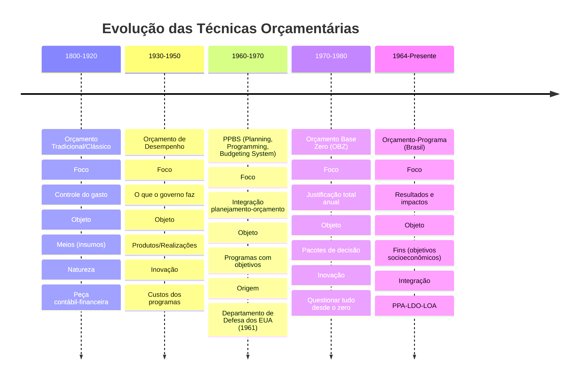

# Técnicas e Modelos Orçamentários
## Material Analítico e Comparativo para Analista Legislativo - Câmara dos Deputados

---

## 1. Linha do Tempo Evolutiva

### Contexto Histórico da Evolução

> [!info] Conceito-Chave
> A evolução dos modelos orçamentários reflete uma transição gradual de **controle de meios** (o que se compra) para **controle de fins** (o que se alcança), e finalmente para **controle de impactos** (o que se transforma na sociedade).

**Primeira Fase - O Orçamento como Controle (Tradicional):**

Surgido na Inglaterra por volta de 1822, em pleno auge do liberalismo econômico, o orçamento tradicional tinha uma função primordial: **controlar politicamente o Executivo**. O Parlamento queria saber onde cada centavo seria gasto para evitar abusos e expansão descontrolada do Estado.

- **Características:** Documentar receitas e autorizar despesas por objeto de gasto (pessoal, material, equipamentos)
- **Ausência de planejamento:** Não havia conexão com objetivos governamentais
- **Aspecto jurídico-contábil preponderante:** Era uma peça de autorização legal, não de gestão
- **Lógica incremental implícita:** Baseava-se no ano anterior com ajustes marginais

**Segunda Fase - O Orçamento como Eficiência (Desempenho):**

Nos EUA, entre as décadas de 1930-1950, surgiu a necessidade de modernizar a gestão pública. As Comissões Hoover (especialmente a de 1949) recomendaram a adoção do **orçamento de desempenho** (performance budget).

- **Inovação conceitual:** Sai do "o que se compra" e vai para "o que se faz"
- **Introdução de custos:** Primeira tentativa de medir quanto custa cada atividade governamental
- **Medidas de desempenho iniciais:** Ainda embrionárias, focadas em volume de trabalho (ex: quilômetros de rodovia pavimentados)
- **Limitação crítica:** **Desvinculação entre planejamento e orçamento** - não havia objetivos estratégicos claros

**Terceira Fase - O Orçamento como Estratégia (PPBS e Orçamento-Programa):**

A década de 1960 trouxe uma revolução conceitual. O **PPBS** (Planning, Programming and Budgeting System) foi introduzido no Departamento de Defesa dos EUA em 1961, durante o governo Kennedy, pelo Secretário Robert McNamara.

- **Contexto histórico:** Guerra Fria, corrida armamentista, necessidade de alocar bilhões em defesa de forma racional
- **Inovação radical:** Integração entre **planejamento estratégico** → **programação** → **orçamentação**
- **Foco em objetivos:** Não basta fazer (desempenho), é preciso saber **por que fazer** e **o que se quer alcançar**
- **Análise de alternativas:** Avaliação custo-benefício de diferentes formas de atingir o mesmo objetivo

> [!warning] Ponto de Atenção Cebraspe
> O PPBS foi **abandonado em 1971** no governo federal dos EUA por ser excessivamente ambicioso, burocrático e difícil de implementar. No entanto, seus conceitos foram absorvidos e adaptados, dando origem ao **orçamento-programa** moderno.

**No Brasil:** O orçamento-programa foi introduzido pela **Lei 4.320/1964** e consolidado pelo **Decreto-Lei 200/1967**. A Constituição de 1988 cristalizou esse modelo ao criar o sistema PPA-LDO-LOA.

**Quarta Fase - O Orçamento como Racionalização (Base Zero):**

Na década de 1970, Peter Pyhrr desenvolveu o **Orçamento Base Zero** (Zero-Based Budgeting - ZBB), aplicado inicialmente na Texas Instruments e depois no governo da Geórgia por Jimmy Carter.

- **Premissa radical:** Cada ano é um ano novo - **nada é garantido**
- **Justificação total:** Todas as despesas, inclusive as continuadas (salários de servidores efetivos), devem ser justificadas anualmente
- **Pacotes de decisão:** Decomposição de programas em "pacotes" que competem por recursos
- **Ordenação por prioridades:** Classificação de todos os pacotes para alocação de recursos escassos

> [!warning] Ponto de Atenção Cebraspe
> O OBZ foi adotado no governo federal dos EUA em 1977 (Jimmy Carter) e **abandonado em 1981** (Ronald Reagan) por ser excessivamente custoso, demorado e burocrático. Apesar disso, suas técnicas influenciam ferramentas modernas como o **spending review**.

---

## 2. Análise Comparativa Cruzada

### 2.1 Orçamento de Desempenho vs. Orçamento-Programa: A Confusão Conceitual Mais Cobrada

> [!tip] Dica de Prova
> Esta é **a distinção mais explorada pelo Cebraspe** em provas de Analista Legislativo e Consultor. A banca adora confundir candidatos que decoram definições sem compreender a essência das diferenças.

#### A Diferença Crucial: Fazer vs. Porquê Fazer para Atingir um Objetivo

| **Critério** | **Orçamento de Desempenho** | **Orçamento-Programa** |
|--------------|----------------------------|------------------------|
| **Foco Central** | **O que o governo faz** (atividades, produtos, serviços) | **Por que o governo faz** (objetivos, resultados, impactos socioeconômicos) |
| **Pergunta Orientadora** | Quantos hospitais construímos? Quantos quilômetros de rodovia pavimentamos? | Qual foi o impacto na saúde da população? Qual foi o efeito no desenvolvimento econômico da região? |
| **Objeto de Mensuração** | **Produtos** e **realizações** (outputs) | **Resultados** e **impactos** (outcomes) |
| **Relação com Planejamento** | **Desvinculado** - não há planejamento estratégico integrado | **Integrado** - orçamento é instrumento de execução do planejamento |
| **Unidade Básica** | Atividade ou projeto isolado | **Programa** como módulo integrador |
| **Tipo de Controle** | **Eficácia** (fazer o que foi planejado; entregar o produto) | **Efetividade** (alcançar transformação social; atingir objetivo) |
| **Avaliação** | Medidas de desempenho: volume de trabalho, unidades produzidas | Indicadores de resultado: taxa de mortalidade infantil, índice de desenvolvimento, nível de escolaridade |

#### Exemplo Prático Comparativo

**Situação:** Governo investe na construção de 10 novos hospitais em regiões periféricas.

**Sob a ótica do Orçamento de Desempenho:**
- **Foco:** Quantos hospitais foram construídos?
- **Meta:** Construir 10 hospitais em 24 meses
- **Medida de desempenho:** 10 hospitais entregues = meta cumprida
- **Avaliação:** Eficaz (fez o que prometeu)
- **Limitação:** Não importa se os hospitais reduziram a mortalidade ou melhoraram a saúde da população

**Sob a ótica do Orçamento-Programa:**
- **Foco:** Por que construir hospitais? Objetivo: reduzir mortalidade infantil em 30% nas regiões periféricas
- **Meta:** Taxa de mortalidade infantil de X para Y por 1.000 nascidos vivos
- **Indicador de resultado:** Variação da taxa de mortalidade infantil
- **Avaliação:** Efetivo (se a mortalidade realmente caiu 30%)
- **Análise adicional:** Se os hospitais foram construídos mas a mortalidade não caiu, o programa foi **eficaz** (entregou o produto) mas **não efetivo** (não atingiu o resultado)

> [!info] Conceito-Chave
> **Eficácia** = fazer o que foi planejado (entregar o produto/serviço)
> **Efetividade** = atingir o objetivo socioeconômico (transformar a realidade)
> 
> **Orçamento de Desempenho** foca em eficácia.
> **Orçamento-Programa** foca em efetividade.

#### Como o Cebraspe Explora Esta Diferença

**Item típico que estaria ERRADO:**

*"O orçamento de desempenho caracteriza-se pela integração entre planejamento e orçamento, estabelecendo metas socioeconômicas a serem alcançadas pelos programas governamentais."*

**Por que está errado?** 
- Integração planejamento-orçamento = característica do **orçamento-programa**, não do desempenho
- Metas socioeconômicas = objetivo do **orçamento-programa**
- Orçamento de desempenho foca em **metas de realização** (produtos), não metas socioeconômicas

**Item típico que estaria CERTO:**

*"O orçamento de desempenho representa um avanço em relação ao orçamento tradicional ao introduzir a preocupação com os resultados das ações governamentais, embora ainda não integre plenamente planejamento e orçamento como no orçamento-programa."*

**Por que está certo?**
- Reconhece que desempenho é **evolução** do tradicional (correto)
- Identifica que desempenho se preocupa com **resultados das ações** (produtos/realizações - correto)
- Aponta a **limitação crítica**: ausência de integração com planejamento (correto)
- Diferencia claramente de orçamento-programa (correto)

---

### 2.2 Orçamento Incremental vs. Orçamento Base Zero: A Lógica do Ajuste vs. Lógica da Justificação Total

> [!warning] Ponto de Atenção Cebraspe
> O Cebraspe frequentemente apresenta cenários práticos e cobra a identificação da técnica orçamentária aplicada. Compreender a **lógica decisória** é mais importante que decorar características.

#### A Oposição Conceitual Fundamental

| **Critério** | **Orçamento Incremental** | **Orçamento Base Zero (OBZ)** |
|--------------|---------------------------|------------------------------|
| **Ponto de Partida** | **Orçamento do ano anterior** (base histórica) | **Zero** (nenhuma dotação é garantida) |
| **Lógica de Alocação** | Ajustes marginais (incrementos ou decrementos) sobre a base | Justificação total de todas as despesas desde o zero |
| **Premissa** | Atividades existentes são necessárias e legítimas; questiona-se apenas o **novo** | **Nada é presumido**; tudo deve ser justificado, inclusive atividades continuadas |
| **Processo de Decisão** | Examinar novas atividades e ajustar as existentes | Avaliar **todas** as atividades (novas e existentes) em igualdade de condições |
| **Elemento Central** | **Base inicial** + ajustes | **Pacotes de decisão** ordenados por prioridade |
| **Custo de Elaboração** | **Baixo** - simples, rápido, baseado em histórico | **Alto** - trabalhoso, demorado, exige análise detalhada de tudo |
| **Participação Gerencial** | Baixa - níveis inferiores têm pouco envolvimento | **Alta** - exige envolvimento de gerentes de todos os níveis |
| **Orientação** | Baseada em **insumos** (elementos de despesa) | Baseada em **resultados** (produtos finais e justificativas) |
| **Flexibilidade** | **Baixa** - prisioneiro do passado | **Alta** - permite realocações radicais |
| **Risco de Desperdício** | **Alto** - perpetua ineficiências do passado | **Baixo** - questiona e elimina desperdícios |
| **Viabilidade Prática** | **Alta** - aplicável a qualquer contexto | **Baixa** - inviável para todo o orçamento; aplicável a programas ou áreas específicas |

#### Comparação Detalhada

**Orçamento Incremental:**

- **Base histórica como ponto de partida:** "No ano passado gastamos R$ 10 milhões com o Programa X. Para o próximo ano, vamos alocar R$ 10,5 milhões (ajuste de 5%)"
- **Simplicidade:** Não questiona a necessidade do Programa X; apenas ajusta o valor
- **Rapidez:** Não exige análises profundas; basta aplicar percentuais de ajuste (inflação, expansão, contenção)
- **Conservadorismo:** Preserva decisões passadas; mudanças são graduais
- **Limitação crítica:** **Perpetua desperdícios** - se o Programa X era ineficiente no ano anterior, continuará sendo

**Orçamento Base Zero:**

- **Tabula rasa anual:** "Esqueça que gastávamos R$ 10 milhões com o Programa X. Justifique desde o zero: por que ele deve existir? Quanto realmente precisa? Há alternativas melhores?"
- **Pacotes de decisão:** Cada programa/atividade é decomposto em "pacotes" que descrevem: finalidade, custo, benefício, alternativas, medidas de desempenho
- **Ordenação por prioridade:** Todos os pacotes (de programas novos e antigos) são classificados em ordem de importância. Os recursos disponíveis são alocados começando pelos de maior prioridade
- **Questionamento radical:** Atividades continuadas podem ser **eliminadas ou reduzidas** para financiar novos programas com maior prioridade
- **Limitação crítica:** **Custo operacional proibitivo** - analisar tudo desde o zero a cada ano é inviável

> [!info] Conceito-Chave
> O orçamento incremental é **descritivo** da realidade orçamentária (descreve como orçamentos são realmente elaborados na prática). O orçamento base zero é **prescritivo** (prescreve como deveriam ser elaborados para máxima racionalidade).

#### Exemplo Prático Comparativo

**Situação:** Ministério da Saúde tem 20 programas em execução e propõe criar 3 novos programas.

**Sob a ótica Incremental:**

1. Mantém-se a dotação de base dos 20 programas existentes
2. Aplica-se ajuste inflacionário (ex: 5%) sobre a base
3. Avaliam-se apenas os 3 novos programas propostos
4. Decisão: aprovar ou rejeitar os novos programas
5. **Não se questiona:** A necessidade dos 20 programas existentes

**Resultado:**
- Orçamento total = Base dos 20 programas (R$ 100 mi) × 1,05 (ajuste) + Novos programas (R$ 15 mi) = R$ 120 milhões
- Processo: rápido, simples
- Risco: programas ineficientes ou obsoletos entre os 20 existentes continuam sendo financiados

**Sob a ótica Base Zero:**

1. **Ignora-se** a existência prévia dos 20 programas
2. Todos os 23 programas (20 antigos + 3 novos) são tratados como se fossem novos
3. Para cada programa, elabora-se um **pacote de decisão** detalhando:
   - Objetivo do programa
   - Justificativa de existência
   - Custos estimados
   - Benefícios esperados
   - Alternativas (formas diferentes de atingir o mesmo objetivo)
   - Níveis de esforço (mínimo, intermediário, desejável)
4. Todos os 23 pacotes são **ordenados por prioridade** (ranking)
5. Recursos disponíveis (ex: R$ 110 milhões) são alocados começando pelo pacote de maior prioridade até esgotar os recursos

**Resultado:**
- Alguns programas antigos podem ser **eliminados** se tiverem baixa prioridade
- Alguns programas antigos podem ter **recursos reduzidos**
- Novos programas de alta prioridade podem receber mais recursos que programas antigos de baixa prioridade
- Processo: extremamente trabalhoso, demorado
- Benefício: elimina desperdícios, prioriza o que realmente importa

#### Como o Cebraspe Explora Esta Diferença

**Item típico que estaria CERTO:**

*"No orçamento base zero, diferentemente do orçamento incremental, as atividades correntes podem ser eliminadas ou reduzidas para possibilitar o financiamento de novos programas com maior nível de prioridade ou para economia orçamentária."*

**Por que está certo?**
- Identifica corretamente que OBZ **não protege atividades existentes**[136]
- Aponta que atividades correntes podem ser **eliminadas ou reduzidas** (correto - característica do OBZ)
- Contrasta com incremental (que protege a base histórica)
- Menciona finalidade dupla: financiar novos programas OU gerar economia

**Item típico que estaria ERRADO:**

*"O orçamento base zero caracteriza-se pela simplicidade e rapidez de elaboração, pois parte do orçamento do ano anterior como referência, exigindo apenas ajustes nas novas demandas."*

**Por que está errado?**
- "Simplicidade e rapidez" = características do **incremental**, não do OBZ
- "Parte do orçamento do ano anterior" = define **incremental**, contradiz a essência do OBZ (que parte do zero)
- OBZ é **complexo, trabalhoso e demorado**

---

### 2.3 Tabela Comparativa Geral dos Modelos

| **Modelo** | **Foco Principal** | **Critério de Alocação de Recursos** | **Vantagens** | **Desvantagens (Gestão Pública Moderna)** |
|------------|-------------------|--------------------------------------|---------------|------------------------------------------|
| **Orçamento Tradicional/Clássico** | **Controle do gasto**; aspecto jurídico-contábil; meios (insumos) | Objeto de gasto (pessoal, material, equipamento); sem vinculação a objetivos | • Simplicidade • Fácil controle político • Transparência sobre onde o dinheiro vai | • Ausência total de planejamento • Não avalia resultados • Não permite avaliar eficiência ou eficácia • Dissociado das necessidades da sociedade |
| **Orçamento de Desempenho** | **O que o governo faz** (atividades, produtos, realizações); eficiência operacional | Custos dos programas; volume de trabalho; realizações físicas | • Introduz preocupação com custos • Medidas de desempenho (embrionárias) • Foco em produtos/serviços entregues • Evolução do controle (não apenas gastar, mas entregar) | • Desvinculação entre planejamento e orçamento • Não avalia **por que** fazer • Não mensura impacto socioeconômico • Controle de eficácia, não efetividade |
| **Orçamento-Programa** | **Por que o governo faz** (objetivos socioeconômicos); resultados e impactos; fins | Programas vinculados a objetivos; metas de resultado; indicadores de impacto | • Integração planejamento-orçamento • Foco em resultados para a sociedade • Permite avaliar efetividade • Transparência sobre o que se quer alcançar • Base para accountability | • Dificuldade de mensurar impactos • Exige sistemas de monitoramento complexos • **No Brasil:** rigidez orçamentária dificulta flexibilidade • Risco de "orçamento-programa de ficção" |
| **Orçamento Base Zero (OBZ)** | **Justificação total**; priorização; racionalização radical de todos os gastos | Pacotes de decisão ordenados por prioridade; análise custo-benefício de tudo | • Elimina desperdícios estruturais • Questiona tudo, inclusive o óbvio • Priorização transparente • Permite realocações radicais • Alta participação gerencial | • **Custo operacional proibitivo** • Extremamente trabalhoso e demorado • Inviável para todo o orçamento • Risco de "paralisia por análise" • Resistência organizacional |
| **Orçamento Incremental** | **Ajuste marginal** sobre a base histórica; estabilidade; continuidade | Base do ano anterior + ajustes (inflação, expansão/contenção) | • Simplicidade e rapidez • Baixo custo operacional • Previsibilidade • Reduz conflitos (decisões marginais) | • **Perpetua ineficiências** • Prisioneiro do passado • Não questiona desperdícios estruturais • Baixa capacidade de realocação • Não é normativo (apenas descreve a prática) |

---

## 3. O Modelo Brasileiro em Foco Crítico

### 3.1 Fundamentos Legais e Conceituais do Orçamento-Programa no Brasil

> [!info] Conceito-Chave
> O Brasil adota **formalmente** o orçamento-programa desde 1964, consolidado pela Constituição de 1988 através do sistema integrado **PPA-LDO-LOA**. A integração planejamento-orçamento é o alicerce do modelo brasileiro.

#### Base Legal

1. **Lei 4.320/1964:** Introduziu o orçamento-programa no Brasil, estabelecendo que o orçamento deve conter programas de trabalho (art. 2º)

2. **Decreto-Lei 200/1967:** Consolidou o planejamento como princípio fundamental da Administração Pública e o orçamento-programa como instrumento (art. 7º e 16)

3. **Constituição Federal de 1988 (art. 165, 166, 167):** Criou o **sistema de planejamento orçamentário brasileiro**, composto de três leis ordinárias integradas:

#### O Sistema PPA-LDO-LOA: Espinha Dorsal do Orçamento-Programa Brasileiro

**PPA - Plano Plurianual (art. 165, § 1º, CF/88):**

- **Vigência:** 4 anos (inicia no 2º ano do mandato e termina no 1º ano do mandato seguinte)
- **Natureza:** Instrumento de **planejamento estratégico de médio prazo**
- **Conteúdo:** Diretrizes, objetivos, metas da administração pública
- **Estrutura:** Organizado em **programas** (com objetivos, metas quantitativas, indicadores)
- **Função:** Estabelecer **o que** o governo quer alcançar no período
- **Alcance:** Regional (§ 1º) - visa reduzir desigualdades regionais

> [!tip] Dica de Prova
> O **programa** é a unidade de integração entre planejamento (PPA) e orçamento (LOA). É através dos programas que a LOA materializa as diretrizes do PPA.

**LDO - Lei de Diretrizes Orçamentárias (art. 165, § 2º, CF/88):**

- **Vigência:** Anual
- **Natureza:** **Elo entre PPA e LOA**; instrumento de transição entre planejamento e orçamento
- **Funções principais:**
  1. **Selecionar prioridades:** Dentre os programas do PPA, define quais serão priorizados no exercício seguinte
  2. **Orientar a elaboração da LOA:** Estabelece parâmetros, regras, metas fiscais
  3. **Dispor sobre alterações tributárias**
  4. **Política de aplicação de agências de fomento**
  5. **Estabelecer metas e prioridades** para o ano seguinte

**LOA - Lei Orçamentária Anual (art. 165, § 5º, CF/88):**

- **Vigência:** Anual (exercício financeiro)
- **Natureza:** Instrumento de **execução operacional** do planejamento
- **Estrutura:** Composta de 3 orçamentos:
  1. **Orçamento Fiscal:** Poderes, Ministério Público, Defensoria
  2. **Orçamento da Seguridade Social:** Saúde, Previdência, Assistência Social
  3. **Orçamento de Investimento das Estatais**

- **Conteúdo:** Previsão de receitas e fixação de despesas para o exercício
- **Função:** **Viabilizar a execução** das políticas públicas previstas no PPA e priorizadas pela LDO

#### O Princípio da Compatibilização (Hierarquia Lógica)

> [!warning] Ponto de Atenção Cebraspe
> As três leis têm a **mesma hierarquia formal** (leis ordinárias), mas há uma **hierarquia lógico-sistemática** entre elas que o Cebraspe adora explorar.

**CF/88, art. 165, § 7º:**
> "Os orçamentos previstos no § 5º, I e II, deste artigo, compatibilizar-se-ão com o plano plurianual"

**CF/88, art. 166, § 3º, I:**
> "As emendas ao projeto de lei do orçamento anual (...) somente podem ser aprovadas caso (...) sejam compatíveis com o plano plurianual e com a lei de diretrizes orçamentárias"

**CF/88, art. 166, § 4º:**
> "As emendas ao projeto de lei de diretrizes orçamentárias não poderão ser aprovadas quando incompatíveis com o plano plurianual"

**Hierarquia lógica:**

1. **PPA** (topo da pirâmide) - define o planejamento de médio prazo
2. **LDO** (meio) - deve ser compatível com o PPA
3. **LOA** (base) - deve ser compatível com PPA e LDO

**Lógica operacional:**
- PPA responde: **O que queremos alcançar?** (objetivos, metas de 4 anos)
- LDO responde: **O que é prioritário agora?** (prioridades do exercício seguinte)
- LOA responde: **Quanto vamos gastar e com o quê?** (dotações para executar as prioridades)

---

### 3.2 Desafios e Críticas à Implementação: "Orçamento-Programa de Ficção"

> [!warning] Ponto de Atenção Cebraspe
> O Cebraspe frequentemente cobra a **distância entre teoria e prática** do orçamento-programa brasileiro. Conhecer as críticas e limitações é essencial para questões avançadas.

#### O Conceito de "Orçamento-Programa Formal" ou "de Ficção"

Embora o Brasil **formalmente** adote o orçamento-programa, a **prática** orçamentária apresenta características que contradizem a essência do modelo:

**1. Rigidez Orçamentária Extrema**

- **Despesas obrigatórias consomem ~92-95% do orçamento federal**
- Sobram apenas 5-8% de **despesas discricionárias** (sujeitas a decisão governamental)
- **Implicação:** Não há espaço real para realocação de recursos segundo prioridades estratégicas

**Composição das despesas obrigatórias:**
- Previdência Social (INSS)
- Pessoal e encargos sociais
- Benefícios assistenciais (BPC/LOAS, Bolsa Família/Auxílio Brasil)
- Saúde e educação (vinculações constitucionais)
- Emendas parlamentares impositivas
- Subsídios e subvenções legalmente obrigatórios

> [!info] Conceito-Chave
> **Rigidez orçamentária** = porcentual do orçamento que é **automaticamente executado** por determinação constitucional ou legal, sem margem para decisão discricionária do gestor sobre prioridades estratégicas.

**2. Vinculações e Indexações**

**Vinculações constitucionais:**
- **Saúde:** Mínimo de 15% da RCL (Receita Corrente Líquida) - EC 29/2000 e LC 141/2012
- **Educação:** Mínimo de 18% das receitas de impostos da União (art. 212, CF/88)
- **Fundeb:** 20% de determinados impostos (EC 108/2020)

**Indexações ao salário mínimo:**
- Aposentadorias e pensões do RGPS (piso = salário mínimo)
- BPC/LOAS (1 salário mínimo)
- Abono salarial (até 2 salários mínimos)
- Seguro-desemprego (valores vinculados ao SM)

**Implicação crítica:** Aumento da receita **automaticamente** aumenta gastos (vinculações); aumento do salário mínimo **automaticamente** aumenta despesas (indexações). O orçamento fica **pró-cíclico** e **acrítico**.

> [!warning] Ponto de Atenção Cebraspe
> A vinculação de despesas à receita torna o gasto público **mais volátil, pró-cíclico e desacompanhado de critérios de desempenho**. Contradiz a lógica do orçamento-programa (alocar segundo resultados esperados).

**3. Dificuldade de Mensurar Impactos**

- **Indicadores de resultado:** Frequentemente inexistentes, imprecisos ou não monitorados
- **Avaliação de efetividade:** Rara; predomina avaliação de execução financeira (quanto foi gasto) e física (quanto foi entregue), não de impacto
- **Cultura burocrática:** Foco no cumprimento formal (gastar a dotação, entregar produtos) vs. cultura de resultados (atingir objetivos)

**Exemplo:** Um programa pode ter 100% de execução orçamentária e 100% de execução física (indicadores positivos), mas não ter alcançado o objetivo socioeconômico pretendido (impacto zero ou negativo).

**4. "Orçamento de Ficção": Parâmetros Irrealistas**

Crítica recorrente: a LOA é aprovada com **premissas macroeconômicas irrealistas** (crescimento do PIB, inflação, câmbio superestimados ou subestimados conforme conveniência), gerando um orçamento que é "**ficção**" - não será executado como aprovado.

**Consequências:**
- **Frustração de receita:** Receitas não se realizam conforme previsto
- **Contingenciamento:** Bloqueios e limitações de empenho ao longo do ano
- **Créditos adicionais:** Necessidade de suplementações via créditos adicionais
- **Perda de credibilidade:** LOA deixa de ser instrumento confiável de planejamento

> [!tip] Dica de Prova
> O Cebraspe pode explorar a distinção entre o **orçamento-programa idealizado** (teoria) e o **orçamento-programa brasileiro real** (prática com rigidez, vinculações, dificuldade de avaliar resultados).

**5. Baixa Discricionariedade Gerencial**

Com 92-95% do orçamento "engessado", o gestor público tem **pouquíssima margem de manobra** para:
- Realocar recursos de programas ineficazes para programas eficazes
- Responder a mudanças de prioridades
- Inovar em políticas públicas

**Implicação:** Orçamento se torna incremental na prática (ajustes marginais sobre a base obrigatória), contradizendo o espírito do orçamento-programa (alocação por resultados esperados).

---

### 3.3 Visão Cebraspe: Como a Banca Explora a "Distância Entre Teoria e Prática"

**Item típico que estaria CERTO:**

*"Embora o Brasil adote formalmente o orçamento-programa, com integração entre PPA, LDO e LOA, a rigidez orçamentária decorrente de despesas obrigatórias e vinculações constitucionais limita a capacidade de o gestor público realocar recursos segundo critérios de eficiência e efetividade dos programas."*

**Por que está certo?**
- Reconhece a adoção formal do orçamento-programa (correto)
- Identifica a integração PPA-LDO-LOA (correto)
- Aponta a limitação prática: rigidez orçamentária (correto)
- Consequência: baixa capacidade de realocação por critérios de desempenho (correto)

**Item típico que estaria ERRADO:**

*"No orçamento-programa brasileiro, a vinculação constitucional de despesas com saúde e educação garante que os recursos sejam alocados com base em critérios de eficiência e resultados, otimizando o impacto das políticas públicas."*

**Por que está errado?**
- Vinculação constitucional **não garante alocação por eficiência e resultados**
- Ao contrário: vinculação é **automática** (percentual da receita), **independente** de avaliação de desempenho ou resultados
- É **acrítica** - aloca recursos sem questionar se estão sendo bem aplicados
- Contradiz a lógica do orçamento-programa (que deveria alocar por resultados esperados, não por automatismos)

---

## 4. Orçamento Base Zero (OBZ): Desmistificação para Concurso

### 4.1 Processo de Análise: Pacotes de Decisão e Ordenação por Prioridades

> [!info] Conceito-Chave
> O OBZ se estrutura em **três elementos centrais**: (1) Unidades de decisão, (2) Pacotes de decisão, (3) Priorização (ranking) dos pacotes.

#### Elemento 1: Identificação das Unidades de Decisão

**Conceito:** Unidade de decisão é o **nível organizacional** onde os pacotes de decisão serão preparados. Pode ser:
- Um programa governamental
- Uma atividade específica
- Um projeto
- Um departamento/setor

**Critérios para definir unidades de decisão:**
- Tamanho e localização da organização
- Capacidade da equipe de analisar e preparar pacotes
- Complexidade da operação
- Primeiro ano de implantação: unidades maiores; anos seguintes: maior descentralização

#### Elemento 2: Formulação dos Pacotes de Decisão

> [!warning] Ponto de Atenção Cebraspe
> O **pacote de decisão** é a unidade básica do OBZ. Compreender sua estrutura é essencial para questões que apresentam cenários práticos.

**Pacote de decisão:** Documento que identifica e descreve uma atividade específica de modo que a administração possa:
1. Avaliá-la
2. Priorizá-la em comparação com outras atividades
3. Decidir aprová-la ou rejeitá-la

**Componentes de um pacote de decisão:**

1. **Finalidade:** Para que serve a atividade? Qual problema resolve?
2. **Descrição da atividade:** O que será feito? Como será feito?
3. **Custos:** Quanto custará? Decomposição por tipo de gasto
4. **Benefícios:** Quais resultados são esperados? Impactos quantitativos e qualitativos
5. **Consequências de não aprovar:** O que acontece se esta atividade não for financiada?
6. **Alternativas:** Existem outras formas de alcançar o mesmo objetivo? Qual é mais eficiente?
7. **Medidas de desempenho:** Como avaliar se a atividade está atingindo os objetivos?
8. **Níveis de esforço:** Qual o custo e benefício de diferentes níveis de financiamento?
   - **Nível mínimo:** Abaixo disso, não vale a pena fazer
   - **Nível atual:** Manter o mesmo nível de atividade
   - **Nível aprimorado:** Expandir/melhorar a atividade

> [!tip] Dica de Prova
> O Cebraspe frequentemente apresenta cenários onde o gestor está elaborando orçamento e cobra a identificação da técnica. Se o cenário descreve **elaboração de pacotes com diferentes níveis de esforço, custos, benefícios e alternativas**, trata-se de OBZ.

**Exemplo de Pacote de Decisão:**

**Programa:** Vigilância Sanitária de Alimentos

**Pacote de Decisão:** Inspeção de Estabelecimentos Alimentícios

**Finalidade:** Prevenir doenças de origem alimentar através da inspeção de restaurantes, supermercados e indústrias

**Níveis de Esforço:**

| Nível | Descrição | Custo Anual | Benefício Esperado |
|-------|-----------|-------------|-------------------|
| **Mínimo** | Inspecionar apenas estabelecimentos de alto risco (500 inspeções/ano) | R$ 800 mil | Redução de 20% nas intoxicações alimentares notificadas |
| **Atual** | Inspecionar estabelecimentos de alto e médio risco (1.200 inspeções/ano) | R$ 1,5 milhão | Redução de 35% nas intoxicações |
| **Aprimorado** | Inspecionar todos os estabelecimentos + programa educativo (2.500 inspeções/ano) | R$ 2,8 milhões | Redução de 60% nas intoxicações + certificação de qualidade |

**Alternativas:** 
- Parceria com universidades para inspeções (custo 30% menor)
- Sistema de automonitoramento com auditorias por amostragem

**Medidas de desempenho:**
- Número de inspeções realizadas
- Taxa de estabelecimentos em conformidade
- Número de intoxicações alimentares notificadas

---

#### Elemento 3: Priorização (Ranking) dos Pacotes de Decisão

**Conceito:** Após elaborados, todos os pacotes de decisão (de programas existentes e novos) são **ordenados por prioridade**, criando um ranking único.

**Processo de priorização:**

1. **Cada gestor** ordena os pacotes de sua área (ex: Secretário de Saúde ordena todos os pacotes da saúde)
2. **Gestores superiores** consolidam e reordenam pacotes de diferentes áreas (ex: Ministro ordena pacotes de todas as secretarias)
3. **Alta administração** faz a ordenação final (ex: Presidente/Governador/Prefeito)

**Critério de alocação de recursos:**

- Recursos disponíveis são alocados começando pelo pacote de **maior prioridade**
- Continua-se descendo no ranking até **esgotar os recursos**
- Pacotes abaixo da "**linha de corte**" não são financiados (mesmo que sejam programas existentes!)

**Exemplo ilustrativo:**

Orçamento disponível: R$ 100 milhões

| Ranking | Pacote de Decisão | Custo | Acumulado | Status |
|---------|-------------------|-------|-----------|--------|
| 1º | Vacinação infantil (programa existente) | R$ 20 mi | R$ 20 mi | ✓ Aprovado |
| 2º | UTIs neonatais (programa novo) | R$ 15 mi | R$ 35 mi | ✓ Aprovado |
| 3º | Tratamento de câncer (programa existente) | R$ 25 mi | R$ 60 mi | ✓ Aprovado |
| 4º | Programa de atividade física (programa novo) | R$ 10 mi | R$ 70 mi | ✓ Aprovado |
| 5º | Fiscalização sanitária (programa existente) | R$ 18 mi | R$ 88 mi | ✓ Aprovado |
| 6º | Telemedicina (programa novo) | R$ 12 mi | R$ 100 mi | ✓ Aprovado (totalmente) |
| 7º | Campanha anti-tabagismo (programa existente) | R$ 5 mi | R$ 105 mi | ✗ Não aprovado |
| 8º | Pesquisa médica (programa existente) | R$ 8 mi | R$ 113 mi | ✗ Não aprovado |

**Resultado:** Programas existentes de menor prioridade (7º e 8º) foram **eliminados** para dar lugar a programas novos de maior prioridade (2º, 4º, 6º).

> [!info] Conceito-Chave
> No OBZ, **não há garantia de continuidade**. Programas existentes competem em igualdade de condições com programas novos. A única coisa que importa é a **prioridade** (custo-benefício, alinhamento estratégico, urgência).

---

### 4.2 Viabilidade e Aplicabilidade Prática no Setor Público Brasileiro

#### Por que o OBZ Não é o Modelo Vigente no Brasil

> [!warning] Ponto de Atenção Cebraspe
> O Cebraspe adora cobrar por que determinada técnica não é adotada. Conhecer as **limitações práticas** do OBZ é crucial.

**1. Custo operacional proibitivo**

- Analisar **todo** o orçamento desde o zero a cada ano exigiria:
  - Milhares de servidores dedicados
  - Meses de trabalho
  - Sistemas de informação extremamente sofisticados
- **Inviável** para orçamentos complexos como o federal (milhares de ações orçamentárias)

**2. Rigidez orçamentária brasileira**

- 92-95% das despesas são **obrigatórias** por determinação constitucional ou legal
- Não adianta "justificar desde o zero" se a despesa é **obrigatória por lei**
- OBZ só faria sentido para os 5-8% de despesas discricionárias (viabilidade questionável)

**3. Resistência organizacional**

- Gestores veem seus programas sendo **questionados radicalmente**
- Risco de **perder tudo** gera insegurança e resistência
- Cultura burocrática brasileira é **incremental** (mudanças graduais), não revolucionária

**4. Experiência internacional**

- **EUA:** Adotado em 1977 (governo Carter), **abandonado em 1981** (governo Reagan)
- **Razão:** Excessivamente burocrático, caro, demorado, com benefícios marginais
- **Lição:** OBZ é mais útil como **ferramenta seletiva** do que como método universal

#### OBZ como Inspiração para Ferramentas Modernas: Spending Review

> [!info] Conceito-Chave
> Embora o OBZ "puro" seja inviável, seus princípios inspiram ferramentas modernas de **revisão periódica de gastos** (spending review), amplamente adotadas por países da OCDE.

**Spending Review (Revisão Periódica de Gastos):**

**Conceito:** Processo sistemático e institucionalizado de revisar programas e despesas existentes para identificar oportunidades de economia orçamentária e/ou realocação de recursos.

**Diferenças em relação ao OBZ:**

| **Critério** | **OBZ** | **Spending Review** |
|--------------|---------|-------------------|
| **Abrangência** | Todo o orçamento anualmente | Seletiva (programas específicos) ou global (em consolidações fiscais) |
| **Periodicidade** | Anual | Plurianual (ex: ciclos de 3-5 anos) |
| **Ponto de partida** | Zero absoluto | Cenário fiscal base (projeções sem mudanças) |
| **Foco** | Justificar tudo | Identificar oportunidades de economia e/ou ganhos de eficiência |
| **Resultado esperado** | Orçamento otimizado desde o zero | Propostas de reformas específicas (economias documentadas) |

**Aplicação no Brasil:**

- **Ministério do Planejamento e Orçamento:** Criou em 2024 a **Subsecretaria de Revisão do Gasto Público** (Decreto 11.978/2024)
- **Objetivo:** Analisar gastos existentes para abrir espaço fiscal e financiar novas prioridades
- **Abrangência:** Gastos diretos, renúncias fiscais, subsídios
- **Participação:** Congresso Nacional e sociedade (diferentemente do contingenciamento unilateral do Executivo)

> [!tip] Dica de Prova
> O Cebraspe pode apresentar um cenário de spending review e perguntar se é OBZ. Atenção: são **ferramentas diferentes**. Spending review é **seletiva, plurianual e focada em economias**; OBZ é **universal, anual e focado em justificação total**.

**Vantagens do Spending Review sobre o OBZ:**

1. **Viabilidade operacional:** Analisa programas selecionados, não todo o orçamento
2. **Ciclo plurianual:** Não precisa repetir a cada ano; ciclos de 3-5 anos
3. **Transparência:** Economias fiscais são documentadas e divulgadas
4. **Participação ampla:** Congresso e sociedade participam (legitimidade)
5. **Flexibilidade:** Pode ser global (em crises fiscais) ou seletiva (programas específicos)

---

## 5. Questões Comentadas (Estilo Cenário)

### Questão 1

**O gestor de um Ministério, ao elaborar sua proposta orçamentária para o exercício seguinte, partiu do orçamento executado no ano anterior como base de referência, aplicando um percentual de ajuste inflacionário de 4,5% sobre a dotação de todos os programas existentes. Para os três novos programas propostos, realizou análise detalhada de custos e benefícios, justificando a necessidade de criação. Não foram questionadas a continuidade nem a efetividade dos programas já existentes.**

**Com base nesse cenário, é correto afirmar que o gestor utilizou a técnica do orçamento base zero para elaborar a proposta orçamentária.**

( ) CERTO  
( ) ERRADO

---

**GABARITO: ERRADO**

**Comentário Detalhado:**

Esta questão testa a capacidade do candidato de identificar a técnica orçamentária a partir de um cenário prático, explorando a confusão entre **orçamento incremental** e **orçamento base zero**.

**Análise do cenário:**

1. **"partiu do orçamento executado no ano anterior como base de referência"** 
   - Elemento-chave: **base histórica**
   - Característica do **orçamento incremental**, não do OBZ

2. **"aplicando um percentual de ajuste inflacionário de 4,5% sobre a dotação de todos os programas existentes"**
   - **Ajuste marginal** sobre a base
   - **Típico do orçamento incremental**
   - Contradiz o OBZ (que não parte de base nenhuma)

3. **"Para os três novos programas propostos, realizou análise detalhada de custos e benefícios"**
   - Análise **apenas** dos novos programas
   - **Típico do incremental:** questiona-se o novo, não o existente

4. **"Não foram questionadas a continuidade nem a efetividade dos programas já existentes"**
   - **Elemento decisivo**
   - **Contradiz frontalmente a essência do OBZ**, que exige justificação de **tudo**, inclusive (e especialmente) programas existentes

**Por que NÃO é OBZ:**

No orçamento base zero:
- **Não há base de referência** (parte do zero, não do ano anterior)
- **Não há ajuste percentual** sobre base histórica (contradiz a lógica do zero)
- **Programas existentes e novos são tratados em igualdade** - ambos devem ser justificados
- **Tudo é questionado** - continuidade e efetividade de programas existentes são centrais na análise

**Técnica utilizada:** **Orçamento Incremental**

Características presentes:
- Base histórica como ponto de partida ✓
- Ajustes marginais sobre a base ✓
- Não questionamento dos programas existentes ✓
- Análise apenas do que é novo ✓

**Como o Cebraspe pensaria:**

A banca incluiu elementos de confusão:
- Mencionou "análise detalhada de custos e benefícios" (presente no OBZ, mas também pode estar presente no incremental para programas novos)
- Candidato despreparado pode pensar: "análise de custo-benefício = OBZ"

**Erro:** No OBZ, a análise de custo-benefício é feita para **tudo** (existentes e novos). No cenário, foi feita **apenas para os novos**.

**Lição:** Identifique o **ponto de partida** (base histórica vs. zero) e o **escopo da análise** (apenas o novo vs. tudo).

---

### Questão 2

**Durante a elaboração do orçamento de uma autarquia federal, o dirigente solicitou que cada departamento elaborasse documentos descrevendo suas atividades em três níveis de financiamento: um nível mínimo essencial, um nível de manutenção dos serviços atuais e um nível de expansão com melhoria de qualidade. Cada documento deveria conter a finalidade da atividade, os custos de cada nível, os benefícios esperados, as consequências de não aprovação e formas alternativas de execução. Após a elaboração desses documentos por todos os departamentos, foi realizada uma reunião de priorização, na qual os documentos foram ordenados por importância, e os recursos disponíveis foram alocados começando pelos de maior prioridade até o esgotamento do orçamento.**

**O cenário descrito caracteriza a aplicação da técnica do orçamento-programa, que se baseia na definição de metas e objetivos a serem alcançados pelos programas governamentais.**

( ) CERTO  
( ) ERRADO

---

**GABARITO: ERRADO**

**Comentário Detalhado:**

Esta questão é mais sofisticada e exige que o candidato diferencie **orçamento base zero** (que o cenário descreve) de **orçamento-programa** (que o item afirma).

**Análise do cenário:**

1. **"documentos descrevendo suas atividades em três níveis de financiamento: mínimo essencial, manutenção, expansão com melhoria"**
   - **Níveis de esforço** = característica central do **OBZ**
   - Não é característico do orçamento-programa

2. **"Cada documento deveria conter: finalidade, custos, benefícios, consequências de não aprovação, formas alternativas"**
   - Estrutura de um **pacote de decisão** (OBZ)
   - Extremamente detalhado e analítico

3. **"documentos foram ordenados por importância, e os recursos disponíveis foram alocados começando pelos de maior prioridade até o esgotamento do orçamento"**
   - **Priorização (ranking)** de pacotes de decisão = elemento central do **OBZ**
   - Alocação sequencial até esgotar recursos = típico do OBZ

**Técnica descrita no cenário:** **Orçamento Base Zero (OBZ)**

**Por que NÃO é Orçamento-Programa:**

Embora o orçamento-programa também:
- Defina metas e objetivos ✓
- Analise resultados esperados ✓
- Avalie alternativas ✓

**Diferenças cruciais:**

| **Aspecto** | **Orçamento-Programa** | **OBZ (cenário descrito)** |
|-------------|----------------------|---------------------------|
| **Estrutura básica** | Programas (conjuntos de ações com objetivo comum) | Pacotes de decisão (atividades específicas em níveis de esforço) |
| **Níveis de financiamento** | Não utiliza níveis mínimo/médio/expansão | **Característica central: níveis de esforço**[135][138] |
| **Priorização** | Entre programas, dentro do planejamento estratégico (PPA) | **Ranking único de todos os pacotes** competindo por recursos[139][141] |
| **Alocação de recursos** | Vinculada ao PPA e LDO; programas priorizados recebem recursos | **Sequencial por ranking até esgotar orçamento** (programas podem ficar sem recursos)[133] |
| **Questionamento de existentes** | Programas existentes no PPA tendem a continuar | **Tudo compete igualmente**; existentes podem ser eliminados |

**Elemento de confusão incluído pelo Cebraspe:**

O item afirma que orçamento-programa "se baseia na definição de metas e objetivos" (verdadeiro). No entanto, **isso não basta para caracterizar o cenário como orçamento-programa**.

**Raciocínio correto:**

- O cenário descreve **pacotes de decisão com níveis de esforço e priorização por ranking** = **OBZ**
- Embora tanto OBZ quanto orçamento-programa trabalhem com objetivos, a **metodologia** descrita é específica do OBZ
- O item tenta confundir afirmando uma verdade sobre orçamento-programa (que tem metas e objetivos) para validar uma classificação incorreta do cenário

**Lição:** Identifique a **metodologia específica** descrita no cenário (pacotes de decisão + níveis de esforço + ranking = OBZ), não apenas características gerais que podem estar presentes em vários modelos.

---

### Questão 3

**Em determinado órgão público, a elaboração orçamentária para o exercício de 2025 foi realizada da seguinte forma: o setor de planejamento identificou como objetivo estratégico a "redução da mortalidade infantil em 30% até 2028". Para alcançar esse objetivo, foram estruturados três programas: (1) Programa de Acompanhamento Pré-Natal; (2) Programa de Capacitação de Parteiras; (3) Programa de Melhoria da Infraestrutura de Maternidades. Cada programa foi detalhado com metas quantitativas, indicadores de resultado (taxa de mortalidade infantil por 1.000 nascidos vivos) e alocação de recursos vinculada ao alcance dos indicadores. A proposta orçamentária foi compatibilizada com o Plano Plurianual vigente.**

**O cenário descrito caracteriza a aplicação do orçamento de desempenho, pois estabelece medidas de desempenho vinculadas aos programas governamentais.**

( ) CERTO  
( ) ERRADO

---

**GABARITO: ERRADO**

**Comentário Detalhado:**

Esta questão exige diferenciação fina entre **orçamento de desempenho** e **orçamento-programa**, explorando a confusão entre **medidas de desempenho** (outputs) e **indicadores de resultado** (outcomes).

**Análise do cenário:**

1. **"objetivo estratégico: redução da mortalidade infantil em 30% até 2028"**
   - **Objetivo socioeconômico** (impacto na sociedade)
   - Característica do **orçamento-programa**, não do desempenho

2. **"programas estruturados para alcançar o objetivo"**
   - **Programa** como unidade de integração planejamento-orçamento
   - Típico do **orçamento-programa**

3. **"indicadores de resultado (taxa de mortalidade infantil)"**
   - **Indicador de resultado/impacto** (outcome)
   - **Não** é medida de desempenho (output)
   - Característica do **orçamento-programa**

4. **"proposta compatibilizada com o Plano Plurianual vigente"**
   - **Integração planejamento-orçamento**
   - Característica do **orçamento-programa** (sistema PPA-LDO-LOA)

**Técnica descrita no cenário:** **Orçamento-Programa**

**Por que NÃO é Orçamento de Desempenho:**

A confusão está na expressão "medidas de desempenho". O item afirma que o cenário caracteriza orçamento de desempenho "pois estabelece medidas de desempenho vinculadas aos programas".

**Erro conceitual:**

No cenário, não há **medidas de desempenho** (outputs), mas sim **indicadores de resultado** (outcomes).

**Diferença crucial:**

| **Tipo** | **O que mede** | **Exemplo no cenário** | **Modelo** |
|----------|---------------|----------------------|------------|
| **Medida de desempenho (output)** | Produtos/serviços entregues; volume de trabalho | "1.000 consultas pré-natais realizadas" | Orçamento de **desempenho** |
| **Indicador de resultado (outcome)** | Impacto socioeconômico; transformação da realidade | "Redução da taxa de mortalidade infantil de 20 para 14 por 1.000 nascidos vivos" | Orçamento-**programa** |

**No cenário descrito:**

- O indicador mencionado é **"taxa de mortalidade infantil"** = **indicador de resultado/impacto** (outcome)
- **Não** é output (produto/serviço)
- Portanto, caracteriza **orçamento-programa**, não orçamento de desempenho

**Elementos adicionais que confirmam orçamento-programa:**

- **Objetivo socioeconômico** (reduzir mortalidade) vs. objetivo operacional (entregar serviços)
- **Integração com PPA** (planejamento de médio prazo)
- **Programas** como unidade estruturante

**Como o Cebraspe pensaria:**

A banca testaria se o candidato:
1. Sabe diferenciar **medida de desempenho** (output) de **indicador de resultado** (outcome)
2. Compreende que orçamento de desempenho foca em **o que se faz** (produtos), não em **o que se atinge** (resultados socioeconômicos)
3. Reconhece a **integração planejamento-orçamento** como característica do orçamento-programa, não presente no orçamento de desempenho

**Lição:** Atenção à natureza do indicador mencionado no cenário. Se mede **impacto socioeconômico** (taxa de mortalidade, índice de escolaridade, PIB regional) = orçamento-programa. Se mede **produto/serviço entregue** (quilômetros pavimentados, consultas realizadas, alunos matriculados) = orçamento de desempenho.

---

### Questão 4

**Um gestor de secretaria estadual, pressionado pela necessidade de contenção de gastos, adotou o seguinte procedimento: analisou detalhadamente cada programa em execução, questionando sua necessidade, eficiência e resultados. Para cada programa, elaborou três cenários de custeio (mínimo, intermediário e pleno) e identificou alternativas de execução. Após essa análise, manteve 70% dos programas existentes com ajustes, eliminou 20% dos programas considerados de baixa prioridade e criou 10% de novos programas. Os recursos economizados foram realocados para as novas prioridades.**

**A técnica orçamentária aplicada pelo gestor foi o orçamento incremental, uma vez que a maioria dos programas existentes foi mantida, com ajustes marginais.**

( ) CERTO  
( ) ERRADO

---

**GABARITO: ERRADO**

**Comentário Detalhado:**

Esta questão é mais sutil e testa se o candidato compreende que a **técnica** não é definida pelo **resultado** (quantos programas foram mantidos), mas pelo **processo** (metodologia de análise e decisão).

**Análise do cenário:**

1. **"analisou detalhadamente cada programa em execução, questionando sua necessidade, eficiência e resultados"**
   - **Questionamento de programas existentes** = **não** é incremental
   - Incremental **não questiona** a base histórica

2. **"elaborou três cenários de custeio (mínimo, intermediário e pleno)"**
   - **Níveis de esforço** = característica do **OBZ**
   - Não é usado no incremental

3. **"identificou alternativas de execução"**
   - **Análise de alternativas** = característica do **OBZ**
   - Incremental não analisa alternativas; aceita ou rejeita o proposto

4. **"eliminou 20% dos programas considerados de baixa prioridade"**
   - **Eliminação de programas existentes** por critério de prioridade
   - **Típico do OBZ**; **não ocorre** no incremental

5. **"recursos economizados foram realocados para novas prioridades"**
   - **Realocação ativa** baseada em priorização
   - **OBZ**; incremental tende a adicionar recursos, não realocar

**Técnica descrita no cenário:** **Orçamento Base Zero (aplicação seletiva)**

**Por que NÃO é Orçamento Incremental:**

O item tenta confundir afirmando que, como "a maioria dos programas foi mantida" (70%), trata-se de incremental.

**Erro conceitual:**

A técnica **não é definida pelo percentual de manutenção**, mas pela **metodologia de análise**.

**Orçamento Incremental:**
- **Metodologia:** Parte da base histórica; não questiona programas existentes; ajusta valores; analisa apenas o novo
- **Resultado típico:** Alta manutenção (>90%) dos programas existentes

**Orçamento Base Zero (cenário):**
- **Metodologia:** Questiona tudo; elabora níveis de esforço; analisa alternativas; prioriza; elimina o que tem baixa prioridade
- **Resultado:** Pode manter a maioria (como no cenário: 70%) ou não - **depende da análise**, não é automático

**Elemento de confusão:**

Candidato despreparado pensa: "70% mantidos = incremental"

**Correção:** No incremental, programas existentes são mantidos **sem questionamento**. No cenário, foram **questionados, analisados e priorizados** - alguns foram eliminados (20%). A metodologia é de **OBZ**, mesmo que o resultado final tenha mantido a maioria.

**Analogia:**

- **Incremental:** "Manter a lista de compras do mês passado e adicionar algumas coisas novas"
- **OBZ (cenário):** "Questionar cada item da lista, analisar se é realmente necessário, comparar alternativas, priorizar tudo e montar uma nova lista (que pode até ser parecida com a anterior, mas foi revalidada)"

**Como o Cebraspe pensaria:**

A banca testaria se o candidato:
1. Diferencia **processo** (metodologia) de **resultado** (percentual mantido)
2. Reconhece os elementos metodológicos do OBZ (questionamento, níveis de esforço, alternativas, priorização, eliminação)
3. Não se deixa confundir pelo fato de a maioria ter sido mantida

**Lição:** Foque na **metodologia descrita** (como foi feito), não no **resultado final** (quantos foram mantidos). OBZ questiona tudo; incremental aceita a base e ajusta.

---

### Questão 5

**Na elaboração da Lei Orçamentária Anual de um município, o secretário de finanças compatibilizou a proposta com as diretrizes estabelecidas na Lei de Diretrizes Orçamentárias, que havia selecionado as prioridades dentre os programas constantes do Plano Plurianual. A estrutura orçamentária foi organizada por programas, cada qual com objetivos definidos, metas quantificadas e indicadores para acompanhamento. Além disso, o secretário aplicou um ajuste de 6% sobre as dotações do exercício anterior para as despesas continuadas, focando a análise detalhada apenas nas novas despesas propostas.**

**O cenário descrito evidencia a plena aplicação do orçamento-programa no município, caracterizado pela integração entre planejamento e orçamento através do sistema PPA-LDO-LOA e pela organização em programas com objetivos e metas.**

( ) CERTO  
( ) ERRADO

---

**GABARITO: ERRADO**

**Comentário Detalhado:**

Esta é a questão mais sofisticada, exigindo que o candidato reconheça a **coexistência de elementos de diferentes técnicas** e identifique que a presença de características incrementais **contradiz** a "plena aplicação" do orçamento-programa.

**Análise do cenário:**

**Elementos de Orçamento-Programa presentes:**

1. ✓ **Compatibilização LOA com LDO e PPA** (integração planejamento-orçamento)
2. ✓ **Estrutura organizada por programas** com objetivos, metas e indicadores
3. ✓ **Sistema PPA-LDO-LOA** implementado

**Elemento Incremental presente:**

4. ✗ **"Aplicou um ajuste de 6% sobre as dotações do exercício anterior para as despesas continuadas, focando a análise detalhada apenas nas novas despesas"**
   - **Base histórica** como ponto de partida para despesas continuadas
   - **Ajuste percentual** sem questionamento
   - **Análise apenas do novo**, não do existente
   - **Típico do orçamento incremental**

**Por que está ERRADO:**

O item afirma "**plena aplicação** do orçamento-programa". A palavra "**plena**" é o elemento-chave.

**Orçamento-programa em sua plenitude** exigiria:

- Alocar recursos com base em **objetivos e resultados esperados**, não em base histórica
- Avaliar **todos** os programas (continuados e novos) quanto à sua efetividade e prioridade
- **Não** usar ajustes percentuais automáticos sobre a base do ano anterior

**O que ocorre no cenário:**

- Há uma **estrutura** de orçamento-programa (PPA-LDO-LOA, programas com objetivos)
- Mas a **metodologia de alocação de recursos** para despesas continuadas é **incremental** (base histórica + ajuste percentual)
- **Coexistência** de modelos: forma de orçamento-programa com prática incremental

**Diagnóstico:**

O cenário descreve o que a doutrina chama de **"orçamento-programa formal"** ou **"de fachada"**:
- Formalmente organizado como orçamento-programa (programas, objetivos, PPA-LDO-LOA)
- Mas na prática, a alocação de recursos segue lógica incremental (base + ajuste; não questiona o existente)

**Isso é comum no Brasil?**

**Sim**. Exatamente a crítica que vimos na seção 3.2:
- Estrutura formal de orçamento-programa ✓
- Prática incremental na alocação de recursos ✓
- Rigidez orçamentária impede realocação por resultados ✓

**Como o Cebraspe pensaria:**

A banca testaria se o candidato:
1. Reconhece que **estrutura** (programas, PPA-LDO-LOA) não basta para caracterizar plena aplicação
2. Identifica elementos **incrementais** na metodologia (base histórica + ajuste)
3. Compreende que "plena aplicação" exige **coerência entre forma e prática**
4. Conhece a crítica doutrinária sobre orçamento-programa "formal" vs. "real"

**Elemento de confusão:**

O cenário apresenta **muitos elementos corretos** de orçamento-programa (PPA-LDO-LOA, programas, objetivos, metas, indicadores). Candidato despreparado pode pensar: "Está tudo certo, então é plena aplicação".

**Erro:** A presença do elemento incremental (base + ajuste; análise apenas do novo) **contradiz** a plena aplicação.

**Lição:** Identifique **incoerências** entre elementos de diferentes modelos no mesmo cenário. Orçamento-programa "pleno" não convive com práticas incrementais de alocação de recursos.

---

## 6. Síntese para Revisão Rápida

> [!tip] Dica de Prova
> Use esta síntese para revisão pré-prova. Foque nos **elementos distintivos** que o Cebraspe mais cobra.

### Elementos-Chave para Diferenciação Rápida

| **Se o cenário menciona...** | **Provavelmente é...** |
|------------------------------|----------------------|
| Objeto de gasto, pessoal, material, equipamentos; sem objetivos | **Tradicional** |
| Produtos entregues, serviços prestados, realizações, volume de trabalho; custos por atividade | **Desempenho** |
| Objetivos socioeconômicos, resultados, impactos, indicadores de outcome; integração PPA-LDO-LOA | **Programa** |
| Pacotes de decisão, níveis de esforço (mínimo/intermediário/pleno), alternativas, priorização por ranking | **Base Zero** |
| Base do ano anterior, ajuste percentual, não questiona existentes, analisa apenas o novo | **Incremental** |

### Armadilhas Clássicas do Cebraspe

1. **Afirmar que orçamento de desempenho integra planejamento e orçamento** → ERRADO (só o programa integra)

2. **Afirmar que OBZ é simples e rápido** → ERRADO (é complexo e demorado)

3. **Afirmar que incremental questiona a necessidade de programas existentes** → ERRADO (aceita a base sem questionar)

4. **Confundir medidas de desempenho (outputs) com indicadores de resultado (outcomes)** → Outputs = desempenho; Outcomes = programa

5. **Afirmar que plena aplicação de orçamento-programa ocorre apenas por ter PPA-LDO-LOA** → ERRADO (pode ser "formal" com prática incremental)

6. **Afirmar que OBZ é o modelo vigente no Brasil** → ERRADO (modelo vigente é orçamento-programa)

7. **Confundir spending review com OBZ** → Spending review é seletivo e plurianual; OBZ é universal e anual

---

**Material elaborado em:** 18 de outubro de 2025  
**Fontes principais:** Lei 4.320/1964, CF/88, Decreto-Lei 200/1967, doutrina orçamentária brasileira e internacional  
**Aplicação:** Análise de questões Cebraspe 2015-2025 para cargos de Analista Legislativo, Consultor e Auditor

---

> [!info] Conceito-Chave Final
> "A evolução das técnicas orçamentárias reflete a maturação da gestão pública: do simples controle de gastos (tradicional) para a busca de eficiência (desempenho), depois para a vinculação a objetivos estratégicos (programa), e finalmente para o questionamento sistemático do status quo (base zero). O desafio brasileiro é superar a distância entre o modelo formal (orçamento-programa) e a prática real (incremental com rigidez extrema). Compreender essa tensão é essencial para o Analista Legislativo que atuará no coração do processo orçamentário nacional."

