# Classificações da Despesa Orçamentária – Guia Analítico (Técnica Legislativa)

## Lógica das Múltiplas Classificações da Despesa

O orçamento público federal utiliza **múltiplas classificações para cada despesa**, permitindo diferentes visões complementares. Cada classificação responde a uma **pergunta distinta** sobre o gasto, a saber:

- **Classificação Institucional (Órgão/Unidade Orçamentária)** – **Quem gasta?** Identifica **quem é o responsável** pela execução do gasto (qual órgão e unidade).
    
- **Classificação Funcional (Função/Subfunção)** – **Em que área?** Indica **em que área de ação governamental** a despesa será realizada (setor ou função de governo, ex: saúde, educação etc.).
    
- **Classificação Programática (Programa/Ação/Subtítulo)** – **Com qual objetivo?** Revela **qual política ou finalidade se pretende atingir** com a despesa, ou seja, o objetivo do programa e a iniciativa (ação) desenvolvida para alcançá-lo. Também detalha **o que será feito e onde**, por meio da descrição da ação, produto e subtítulo (localização física ou beneficiário).
    
- **Classificação por Natureza da Despesa (Categoria Econômica / GND / Modalidade / Elemento)** – **Com o quê?** Especifica **em que será gasto o recurso**, isto é, quais os **insumos ou objetos de gasto** adquiridos (por exemplo, gastos com pessoal, serviços, equipamentos, obras etc.). Adicionalmente, indica **como o recurso será aplicado** (diretamente ou via transferência) e **qual o efeito econômico** do gasto (despesa corrente ou de capital).
    

Essa estrutura multidimensional permite que o orçamento responda simultaneamente às perguntas clássicas do planejamento orçamentário de forma clara e objetiva. A seguir, aprofunda-se cada classificação e sua finalidade.

```mermaid
flowchart LR
  A[🧭 Orçamento Federal<br/>As 4 perguntas centrais] --> B[👤 Quem gasta?<br/>Institucional]
  A --> C[🏷️ Em que área?<br/>Funcional]
  A --> D[🎯 Com qual objetivo?<br/>Programática]
  A --> E[🧱 Com o quê?<br/>Natureza C-G-M-E-D]

  subgraph Visão Integrada
    direction TB
    B --> D
    C --> D
    D --> E
  end
````

```mermaid
mindmap
  root((Classificações da<br/>Despesa))
    Institucional
      Quem gasta?
      Órgão
      Unidade Orçamentária
      Responsabilização
    Funcional
      Em que área?
      Função
      Subfunção
      Comparabilidade
    Programática
      Com qual objetivo?
      Programa
      Ação
      Subtítulo
      Resultados
    Natureza
      Com o quê?
      C-G-M-E-D
      Efeito econômico
      Objeto de gasto
```


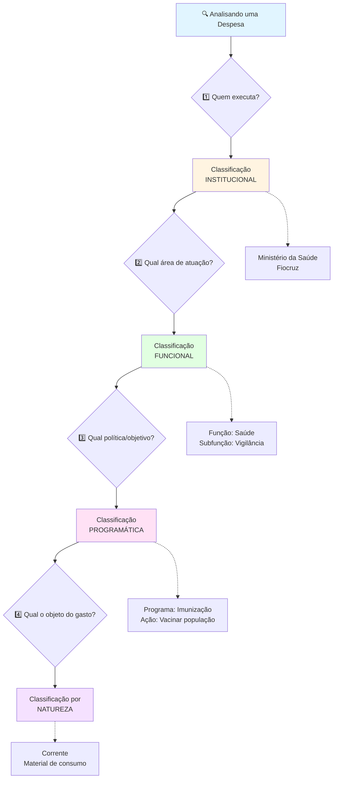
## Classificação Institucional da Despesa (Quem gasta)

A **classificação institucional** discrimina a despesa por **órgão orçamentário e unidade orçamentária**, refletindo a estrutura organizacional responsável pelo gasto. O **Órgão** é um agrupamento de unidades orçamentárias, ao passo que cada **Unidade Orçamentária (UO)** corresponde a um ente (ministério, secretaria, fundo, autarquia etc.) dotado de crédito orçamentário para executar ações específicas. As dotações orçamentárias, detalhadas por programas e ações no menor nível, são consignadas às UOs, que realizam de fato a despesa.

_Exemplo:_ O **Ministério da Saúde** é um órgão orçamentário; nele encontram-se UOs como a **Fundação Oswaldo Cruz (Fiocruz)**, o **Fundo Nacional de Saúde**, entre outras, cada qual com suas dotações.

**Independência estrutural:** Importante notar que nem sempre órgão/UO correspondem exatamente à estrutura administrativa formal. Há casos de **unidades orçamentárias sem equivalente administrativo direto**, por exemplo, fundos especiais ou o órgão específico _"Transferências a Estados, Distrito Federal e Municípios"_, utilizado para centralizar repasses intergovernamentais. Assim, a classificação institucional visa **"quem gasta" no âmbito do orçamento**, podendo agrupar despesas de uma mesma entidade mesmo que ela não seja um ministério tradicional.

O código institucional geralmente possui dígitos para órgão e para UO (no âmbito federal, são dois dígitos para órgão e três para UO). Essa classificação facilita a **responsabilização e controle legal**, pois cada despesa fica vinculada a um ente autorizado na lei orçamentária. **Do ponto de vista da legalidade**, garante que os créditos sejam gastos somente pelo órgão/UO a que foram atribuídos. Também permite analisar **eficiência administrativa**, comparando a execução orçamentária entre diferentes órgãos.


## Classificação Funcional da Despesa (Em que área)

A **classificação funcional** organiza a despesa por **função e subfunção**, explicitando **a área de atuação governamental** em que o gasto se insere. A **Função** (código de dois dígitos no orçamento federal) representa o **setor ou campo da ação pública** – por exemplo, _Saúde_, _Educação_, _Defesa_, _Segurança Pública_, _Agricultura_, etc. Já a **Subfunção** (geralmente três dígitos) detalha uma **subárea dentro da função**, indicando a natureza mais específica da despesa (por exemplo, dentro da função Saúde, subfunções como _Atenção Básica_, _Vigilância Sanitária_, _Imunização_; na Educação, _Ensino Fundamental_, _Educação Profissional_, etc.).

Cada ação orçamentária (atividade, projeto ou operação especial) recebe obrigatoriamente uma função e subfunção associadas, independentemente do órgão que a execute. **Destaque:** a classificação funcional **não depende da estrutura administrativa** nem dos programas – ela é uma classificação **padronizada nacionalmente e comum** a todos os entes (União, Estados, DF, Municípios). Isso garante a **comparabilidade e consolidação** dos gastos públicos por área em nível nacional, possibilitando, por exemplo, saber o total de despesas em _Saúde_ somando União + Estados + Municípios, ainda que executadas por órgãos distintos.

Essa independência funcional é conhecida como **matricialidade**: é possível combinar funções e subfunções de forma transversal. Por exemplo, um programa de desenvolvimento tecnológico no **Ministério da Defesa** poderia ser classificado na função _Ciência e Tecnologia_, apesar de não estar no órgão tipicamente responsável por C&T – graças à natureza matricial, a função não está “presa” à missão institucional do órgão. Assim, a despesa é registrada na área a que realmente serve, **explicitando a prioridade de política pública atendida**.

_A classificação funcional responde:_ **“Em que áreas de despesa a ação governamental será realizada?”**. Em termos de controle e análise, ela é vital para avaliar **prioridades governamentais** – ex.: qual percentual do orçamento vai para saúde, educação, defesa, etc. – independentemente de qual ministério gasta. Também auxilia na **transparência** e no atendimento de normas legais: por exemplo, a Constituição vincula percentuais mínimos de gasto em **educação** e **saúde** (funções específicas), cujo cumprimento pode ser acompanhado graças a essa classificação funcional.


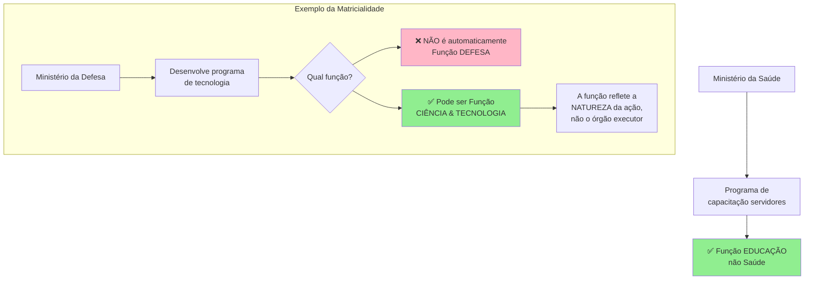

## Classificação Programática da Despesa (Com qual objetivo)

A **classificação programática** estrutura a despesa em **programas**, **ações** e **subtítulos**, vinculando o orçamento ao planejamento de médio prazo (PPA – Plano Plurianual). Ela evidencia **o objetivo e as entregas esperadas com o gasto**.

- **Programa:** É o elemento de planejamento de mais alto nível no PPA e LOA, agrupando um conjunto de ações com um objetivo comum. Representa **o objetivo estratégico ou o tema de política pública** a alcançar. Ex: Programa _"Melhoria da Atenção Básica de Saúde"_.
    
- **Ação:** É a operação orçamentária em si, que pode ser uma **atividade**, **projeto** ou **operação especial**. Cada ação corresponde a um produto ou serviço a ser entregue, contribuindo para o objetivo do programa.
    
    - _Atividade:_ é uma ação contínua e de manutenção de serviço, geralmente de natureza corrente (ex: _Manutenção de Hospitais Federais_).
        
    - _Projeto:_ é uma ação com prazo determinado, que resulta em um bem ou serviço novo, em geral envolvendo investimento de capital (ex: _Construção de Unidade de Saúde XYZ_).
        
    - _Operação especial:_ ação que não gera um produto específico, mas atende obrigações institucionais, como despesas de dívida ou transferências sem contrapartida (ex: _Pagamento de Aposentadorias_).
        
- **Subtítulo:** Detalha a localização física ou o público-alvo da ação, sendo o **menor nível de discriminação da programação** (geralmente indica **onde** a ação se realiza ou **quem é beneficiado**). Ex: subtítulos podem identificar o município ou unidade beneficiada por um projeto, quando há descentralização.
    

**Pergunta atendida:** a estrutura programática indica **“o que se pretende alcançar com a implementação da política pública e o que será feito para isso”**. O **programa** esclarece a **finalidade/objetivo** (ponto de chegada desejado), e a **ação** descreve **como se vai chegar lá**, ou seja, **o que será desenvolvido** (obras, serviços, atendimentos etc.). A presença de informações como _produto, unidade de medida e meta física_ para cada ação reforça esse foco em resultados.

Importante: na classificação programática atual, **todas as despesas, inclusive transferências financeiras, subsídios, subvenções, financiamentos, entram no escopo de alguma ação orçamentária**. Ou seja, **mesmo uma transferência de recursos a outro ente ou a pessoa física** é planejada como parte de uma ação com produto específico (por exemplo, uma ação de “Concessão de subsídio X” ou “Apoio financeiro Y”). Isso integra essas despesas ao programa correspondente, permitindo acompanhar sua execução e avaliar impactos.

_A integração Planejamento-Orçamento:_ Os programas e ações do orçamento derivam do Plano Plurianual, garantindo que o orçamento execute as estratégias de governo. Assim, a classificação programática é ferramenta para **eficiência** e **avaliação de resultados**, pois associa recursos a objetivos e metas claras. Analistas podem verificar se **as metas físicas** previstas (no subtítulo) foram alcançadas com os recursos alocados, mensurando a efetividade do gasto público.

> [!INFO] **Conceito-chave – Programas, Atividades, Projetos e Operações Especiais**
> 
> - **Programa:** agregado de ações visando a um objetivo específico, mensurado por indicadores de resultado. Ex: Programa _“Erradicação do Aedes Aegypti”_.
>     
> - **Atividade:** ação contínua de manutenção de um serviço público, com produtos recorrentes, tipicamente custeio. Ex: Manutenção de unidades de vigilância sanitária.
>     
> - **Projeto:** ação com prazo determinado, que implica a entrega de um produto final específico (obra ou implantação de um bem/serviço novo), geralmente envolvendo investimento de capital. Ex: Construção de um hospital.
>     
> - **Operação especial:** ação que não resulta em um bem ou serviço diretamente para a sociedade, mas cumpre obrigações administrativas ou legais. Ex: Pagamento de sentenças judiciais, contribuição a organismo internacional, serviço da dívida.  
>     _Dica:_ Atividades costumam ter caráter contínuo (despesa corrente), enquanto projetos têm caráter temporário e frequentemente de capital. Operações especiais muitas vezes são classificadas como despesas correntes por não gerarem ativos (ex: pagamento de dívida, transferências a entes). Saber distinguir essas categorias ajuda a prever se a despesa é corrente ou de capital.
>     

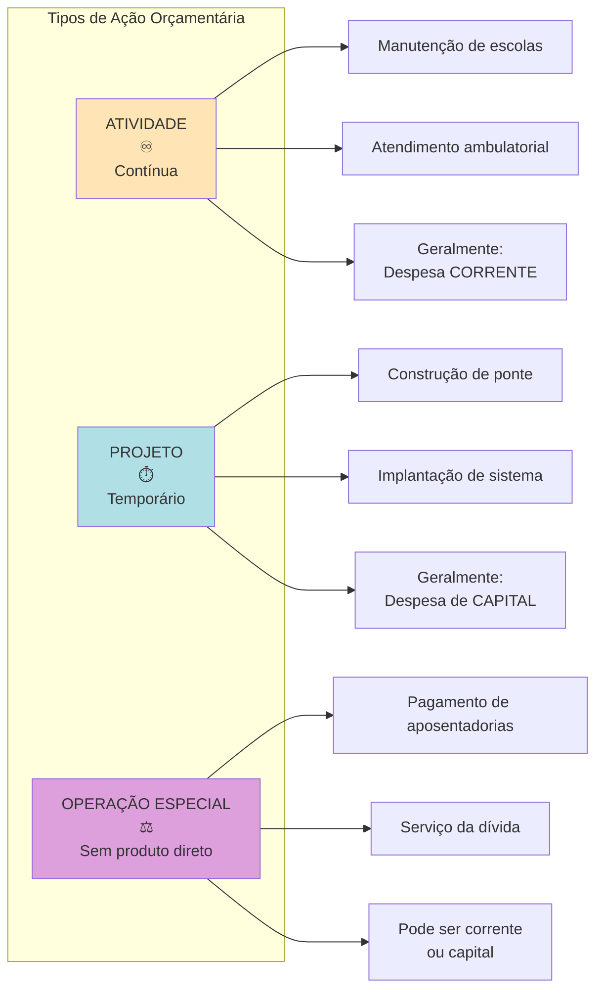

## Classificação por Natureza da Despesa (Com o quê)

A **classificação por natureza da despesa** responde em detalhes **“com quê” o recurso será gasto**, isto é, qual o **objeto do gasto e seu tratamento contábil**. Trata-se de uma classificação **quantitativa/contábil** composta de múltiplos níveis hierárquicos codificados, usualmente resumidos pela sigla **C-G-M-E-D** (Categoria, Grupo, Modalidade, Elemento, Desdobramento):

- **Categoria Econômica (C)** – indica o **efeito econômico** da despesa, classificando-a em **Corrente** ou **de Capital**. Este é o nível mais agregado:
    
    - **Despesas Correntes:** aquelas que **não contribuem diretamente para a formação ou aquisição de um bem de capital**. Ou seja, são gastos que se esgotam no consumo presente ou mantêm serviços já existentes – p.ex. pagamento de pessoal, custeio operacional, juros da dívida.
        
    - **Despesas de Capital:** aquelas que **contribuem diretamente para a formação ou aquisição de um bem de capital** (ativo público durável). São aplicações de recursos que geram novos bens ou direitos para o Estado – p.ex. obras públicas, compras de equipamentos permanentes, aquisições de imóveis, amortização de dívida.
        

Essa distinção de categoria tem base legal na Lei 4.320/1964 (art. 12) e é fundamental: _despesa corrente_ tende a refletir **gasto de consumo ou manutenção**, enquanto _despesa de capital_ reflete **investimento ou amortização** que altera o patrimônio. A categoria econômica dá uma primeira visão do impacto do gasto: **a pergunta aqui é** _“qual o efeito econômico da realização da despesa?”_ – se gera ativos (capital) ou apenas despesa do período (corrente).

- **Grupo de Natureza da Despesa (GND)** – especifica a **classe de gasto dentro da categoria**, agrupando despesas com características semelhantes quanto ao objeto. A estrutura padrão (União) define **6 grupos** de natureza da despesa, numerados de 1 a 6, conforme a tabela:
    

| **GND** | **Grupo de Natureza da Despesa** | **Categoria**          |
| ------- | -------------------------------- | ---------------------- |
| **1**   | Pessoal e Encargos Sociais       | Despesa **Corrente**   |
| **2**   | Juros e Encargos da Dívida       | Despesa **Corrente**   |
| **3**   | Outras Despesas Correntes        | Despesa **Corrente**   |
| **4**   | Investimentos                    | Despesa **de Capital** |
| **5**   | Inversões Financeiras            | Despesa **de Capital** |
| **6**   | Amortização da Dívida            | Despesa **de Capital** |

Os grupos 1, 2 e 3 são despesas correntes (gastos de custeio em sentido amplo), ao passo que os grupos 4, 5 e 6 são despesas de capital. Cada grupo agrega elementos de despesa de natureza similar:

- **GND 1 – Pessoal e encargos:** remuneração de servidores ativos, contribuições e encargos empregador (gasto com pessoal).
    
- **GND 2 – Juros e encargos da dívida:** gastos com juros, correções monetárias e outros encargos de empréstimos contraídos (serviço da dívida corrente).
    
- **GND 3 – Outras despesas correntes:** todos os demais custeios operacionais e transferências correntes não incluídos nos grupos anteriores (ex: material de consumo, serviços de terceiros, subvenções, transferências a entes para manutenção, etc.).
    
- **GND 4 – Investimentos:** despesas de capital que **resultam na aquisição ou geração de novos bens de capital** para o ente públicotce.ro.gov.br. Inclui, por exemplo, **obras públicas, instalações, equipamentos e material permanente novos**, além de possíveis participações em capital de empresas **não** empresariais (ver adiante)tce.ro.gov.br.
    
- **GND 5 – Inversões Financeiras:** despesas de capital que **não geram bem novo, mas representam aquisição de bens ou direitos já existentes, ou aporte a empresas**tce.ro.gov.br. Exemplos: **aquisição de imóveis ou bens de capital já em utilização**; **compra de ações** ou quotas de empresas já constituídas; **participação no aumento de capital de empresas com fins lucrativos**tce.ro.gov.br. Em resumo, é aplicação de capital em algo já em funcionamento ou investimento indireto.
    
- **GND 6 – Amortização da dívida:** despesas de capital relativas **ao pagamento ou refinanciamento do principal da dívida pública** (interna ou externa), reduzindo o endividamento. Observação: apenas o **principal** da dívida é despesa de capital; os **juros** são despesa corrente (GND 2), conforme a classificação acima.
    


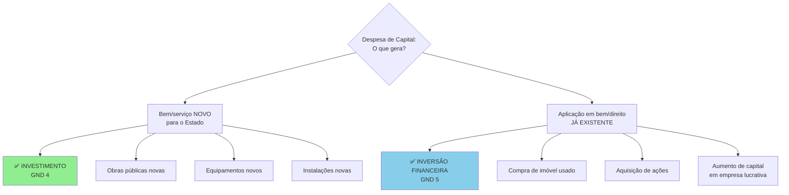

> [!INFO] **Conceito-chave – Investimentos, Inversões e Transferências de Capital (Lei 4.320/64)**  
> A Lei 4.320/1964, art. 12, desdobra as despesas de capital em três categorias, definidas em seus §§4º–6º:  
> **Investimentos:** dotações para o **planejamento e a execução de obras**, bem como para a **aquisição de instalações, equipamentos e material permanente** novos. Inclui ainda a aquisição de imóveis considerados necessários às obras e serviços em implantação, **e até mesmo capitalizações em empresas desde que não tenham fins comerciais ou financeiros**tce.ro.gov.br. Em suma, são gastos que **criam novos bens de capital** para o serviço público (obras e bens permanentes).  
> **Inversões Financeiras:** dotações destinadas à **aquisição de bens de capital já em utilização ou de imóveis** já existentes; à **compra de títulos** (ações/quotas) representativos do capital de empresas **já constituídas**; e **à constituição ou aumento de capital de empresas ou entidades com fins comerciais ou financeiros** (incluindo operações bancárias ou de seguros)tce.ro.gov.br. Ou seja, envolve **aplicação de recursos em bens ou empresas já existentes**, seja para obtê-los ou para investir neles, sem criar um novo bem público diretamente.  
> **Transferências de Capital:** dotações para **investimentos ou inversões financeiras que serão realizados por outra entidade (pública ou privada)**, **sem contraprestação direta** em bens/serviços para quem transferetce.ro.gov.br. São, em essência, **recursos repassados** a terceiros para que estes executem despesas de capital. Exemplos: **auxílios** ou **contribuições de capital** a Estados, Municípios ou entidades (para obras, aquisição de equipamentos etc. que serão patrimônio do beneficiário) e **amortizações da dívida pública**tce.ro.gov.br. (Nota: na classificação moderna, amortização é destacada como GND 6, mas conceitualmente a lei agrupou sob transferências de capital.)

- **Modalidade de Aplicação (M)** – indica **como os recursos serão aplicados**, isto é, se a despesa **será executada diretamente** pela unidade detentora do crédito ou **mediante transferência** a outra entidade (e qual o tipo de entidade beneficiária). Em outras palavras, responde: **“de que forma serão aplicados os recursos?”**. A modalidade previne a **dupla contagem** de despesas nos orçamentos fiscalizados: por exemplo, se a União transfere R$100 milhões a um Estado para certo investimento, essa saída da União não deve somar-se ao dispêndio do Estado na mesma obra para fins de cálculo do gasto nacional. Assim, a União registra a despesa com uma modalidade que sinaliza transferência intergovernamental, enquanto o Estado registra o recebimento como receita e a execução como despesa própria – mecanismos permitem que na consolidação esse gasto não seja contado duas vezes.  
    Cada modalidade é codificada por dois dígitos, com significados padrões. Exemplos: _Aplicação Direta_ (cód. 90, recurso executado diretamente pela entidade que o detém, inclusive por descentralização intragoverno), _Transferência a Estado_ (cód. 50 – recurso transferido a um órgão/entidade de governo estadual), _Transf. a Município_ (cód. 60), _Transf. a entidade privada sem fins lucrativos_ (cód. 50, a depender da estrutura vigente – os códigos exatos podem variar conforme portarias) etc. O essencial: a modalidade identifica se a despesa será realizada **no âmbito da mesma esfera governamental ou fora dela**, servindo ao controle da destinação dos recursos e transparência sobre repasses.
    
- **Elemento de Despesa (E)** – detalha **o objeto específico do gasto**, ou seja, **qual o item ou serviço adquirido** pela Administração. É o nível que lista itens como: _Salários e Vencimentos_, _Obrigações Patronais_, _Material de Consumo_, _Material Permanente_, _Serviços de Consultoria_, _Obras e Instalações_, _Equipamentos e Material Permanente_, _Diárias_, _Passagens_, _Subvenções_, _Contribuições_, _Auxílios_, _Amortização de dívida interna_, etc. Cada elemento possui um código de dois dígitos e descrição própria, padronizados nacionalmente por portarias (STN/SOF). Por exemplo: **30 – Material de Consumo**, **51 – Obras e Instalações**, **52 – Equipamentos e Material Permanente**, **91 – Sentenças Judiciais**, etc.. O elemento, portanto, responde **“quais os insumos que se pretende utilizar ou adquirir?”** com aquela despesa.
    
    - Os elementos são agrupados pelos GNDs: por exemplo, no GND 3 (Outras despesas correntes) há elementos como 30 (consumo), 36 (outros serviços terceiros PF), 39 (outros serviços PJ) etc., enquanto no GND 4 (Investimentos) encontram-se 51 (obras), 52 (equipamentos permanentes) etc.
        
    - **Relação com a contabilidade:** O elemento de despesa costuma se alinhar com a natureza dos gastos reconhecidos contabilmente. Por exemplo, elementos de pessoal refletem despesa com folha de pagamento; elementos de investimento refletem aquisição de ativo imobilizado, e assim por diante. É uma ponte entre orçamento e contabilidade, facilitando a geração de informações para as demonstrações contábeis a partir dos registros orçamentários.
        
- **Desdobramento do Elemento (D)** – é um detalhamento **facultativo** do elemento de despesa, utilizado a critério de cada ente para aprimorar o controle interno ou gerencial. Consiste em códigos adicionais (geralmente dois dígitos finais) que a Administração pode acrescentar para discriminar melhor certos gastos além do que o elemento já prevê. Por exemplo, dentro do elemento _39 – Outros Serviços de Terceiros (PJ)_, um órgão poderia criar desdobramentos para diferenciar _serviços de tecnologia da informação_, _serviços de limpeza_, _serviços de comunicação_, etc., se julgar útil. Na lei orçamentária federal, quando não há detalhamento específico, usa-se geralmente **“00”** como desdobramento, indicando nenhuma especificação extra. Ressalta-se que **desdobramentos não são padronizados nacionalmente**, servindo apenas a controles do próprio órgão ou ente, e não constam no balanço geral consolidado.
    

Em conjunto, esses cinco níveis compõem o código completo da natureza da despesa. No orçamento federal, por exemplo, um código típico poderia ser **3 3 90 39 00**, onde cada parte significa: Categoria 3 (Despesa Corrente), GND 3 (Outras Despesas Correntes), Modalidade 90 (Aplicação Direta), Elemento 39 (Outros Serviços de Terceiros – PJ), Desdobramento 00 (não detalhado).

Essa classificação por natureza é **obrigatória** e uniforme na União, Estados, DF e Municípios, conforme normas federais (como a Portaria Conjunta STN/SOF nº 163/2001 e atualizações), permitindo total transparência e controle sobre **“no que” exatamente o dinheiro público é gasto.** Além disso, integra orçamento e contabilidade: os estágios da despesa (empenho, liquidação, pagamento) são registrados por natureza, alimentando a escrituração contábil governamental.

> [!WARNING] **Ponto de Atenção – Classificação de Capital vs Corrente (armadilhas)**  
> As bancas (especialmente Cebraspe) exploram detalhes das definições de despesas de capital e correntes. Fique atento às **situações fronteiriças**:
> 
> - **Manutenção vs. Obra Nova:** Despesas com **manutenção, conservação ou adaptação de bens públicos já existentes** **não** são investimentos – são **despesas de custeio (correntes)**, pois não resultam em bem novotce.ro.gov.br. Ex: reformar um prédio, reparar uma estrada ou pintar uma escola existente **é despesa corrente** (mesmo envolva “obra” de engenharia). Só **obras que geram um novo bem ou ampliam significativamente um bem** são classificadas como investimentos (capital).
>     
> - **Bem usado vs. bem novo:** A **aquisição de um bem de capital usado ou de segunda mão** (por exemplo, comprar um prédio já construído, máquinas já em uso) não configura investimento para efeitos orçamentários, e sim **inversão financeira**tce.ro.gov.br, já que o bem não está sendo produzido novo, apenas transferido de propriedade. Em contraste, comprar um **bem novo** (veículo zero, equipamento saindo de fábrica) normalmente entra em investimentos (se for bem permanente).
>     
> - **Transferências para obras de terceiros:** Quando a União **transfere recursos a outro ente ou entidade para que este realize uma obra ou aquisição de capital**, do ponto de vista do transferidor isso **não é investimento próprio**, mas sim **transferência de capital**. Ex: Um convênio federal destinando verbas a um Município construir uma creche – na LOA da União será classificado como transferência de capital (modalidade de aplicação indicando transferência), não como investimento diretotce.ro.gov.br. Já no município recebedor, a execução da obra será um investimento na classificação municipal.
>     
> - **Capitalização de empresas:** A **participação da União no aumento de capital de uma empresa estatal dependente** pode soar como investimento na empresa, mas orçamentariamente é **inversão financeira** se a empresa tiver fins lucrativos (ex: BNDES, Petrobras)tce.ro.gov.br. A lei faz distinção: aportes em entidades de natureza comercial/financeira são inversões; apenas aportes em entidades sem fim lucrativo poderiam ser tratadas como investimento (situação rara, pois órgãos sem fins lucrativos geralmente não são empresas).
>     
> - **Despesa orçamentária vs. patrimonial:** Nem toda despesa orçamentária representa consumo de patrimônio. Por exemplo, ao **adquirir um veículo novo (investimento)**, o governo realiza despesa na ótica orçamentária, mas em termos patrimoniais apenas trocou dinheiro por um ativo – o patrimônio líquido não diminui naquele momento. Essa despesa de capital é **“não efetiva”** (permutativa). Já o **gasto com combustível ou salário** não gera ativo, reduzindo a situação patrimonial – despesa **efetiva**. Em prova, cuidado: dizer que “toda despesa orçamentária causa diminuição do patrimônio público” é **Errado**, pois despesas de capital podem não impactar imediatamente o patrimônio líquido (mas sim trocar ativo por outro).
>     


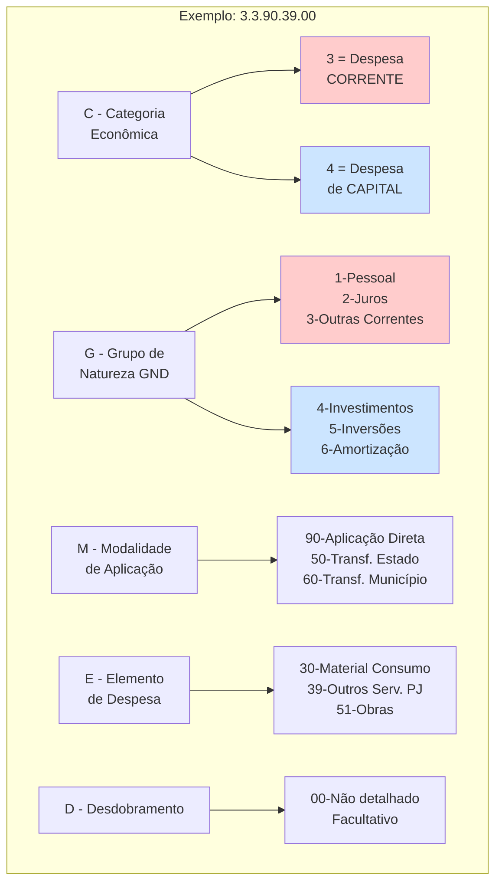

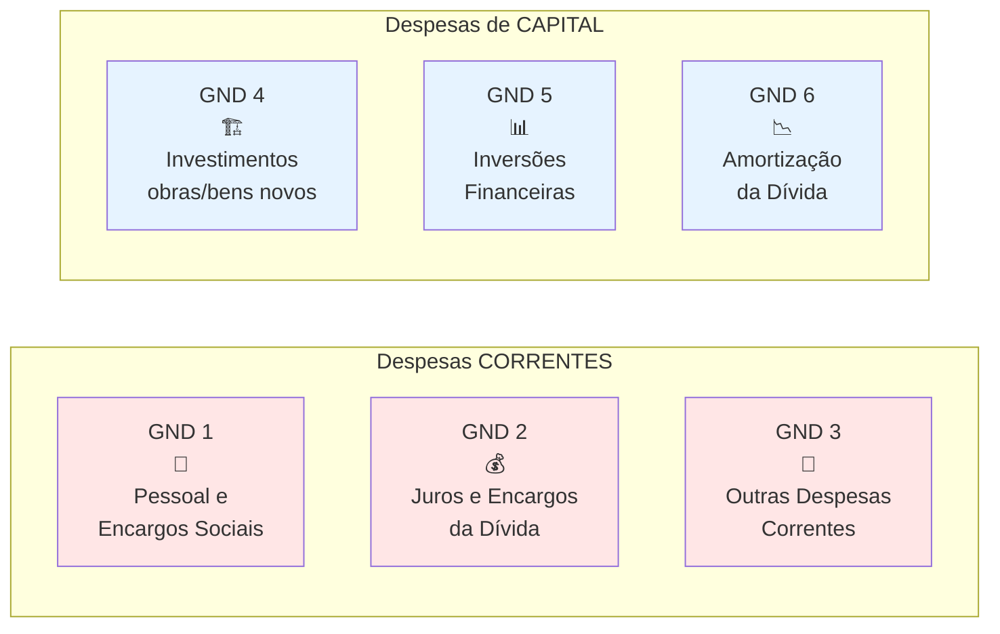


## Integração entre Orçamento e Contabilidade (DCASP)

As classificações da despesa não servem apenas para a execução orçamentária em si, mas também **se refletem nas demonstrações contábeis** do setor público – as DCASP (Demonstrações Contábeis Aplicadas ao Setor Público). Vamos ver como cada classificação aparece ou contribui em quatro demonstrações principais: Balanço Orçamentário, Balanço Financeiro, Balanço Patrimonial e Demonstração das Variações Patrimoniais.


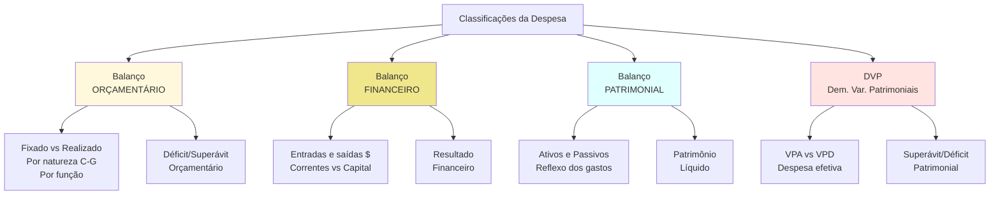

### Balanço Orçamentário (Execução: despesa fixada vs realizada)

O **Balanço Orçamentário (BO)** evidencia a execução do orçamento em termos de **previsão vs realização** das receitas e despesas do exercício, conforme determina a Lei 4.320/64 (art. 102). Nele são confrontadas as **despesas previstas (fixadas)** na LOA e créditos adicionais **com as despesas efetivamente empenhadas (realizadas)** ao longo do ano. Assim, permite avaliar se as despesas foram executadas conforme autorizadas e se houve economia ou excesso de gasto frente ao previsto.

No BO, as despesas são apresentadas **classificadas por categoria econômica e grupo de natureza**, detalhando para cada grupo: a dotação inicial, a dotação atualizada (após créditos ou cortes), o montante **empenhado**, o liquidado, o pago e eventuais saldos não executados. Ou seja, utiliza a **classificação por natureza** para demonstrar a execução orçamentária. **Exemplo:** mostrar quanto foi autorizado e gasto em despesas correntes vs de capital, e dentro destas, em pessoal, investimento etc., evidenciando cancelamentos ou restos a pagar.

Adicionalmente, o **BO incorpora a classificação funcional de forma complementar**. Frequentemente, anexa-se ao balanço um demonstrativo por função/subfunção, permitindo verificar, por exemplo, quanto da despesa realizada foi na função saúde, educação, etc., comparado ao previsto. Essa complementação atende exigências de transparência e controle de resultados por área.

Em resumo, o Balanço Orçamentário proporciona uma visão de **legalidade e planejamento**: mostra se o órgão executou as despesas dentro dos limites autorizados (cada UO/órgão terá suas dotações demonstradas) e se **houve superávit ou déficit orçamentário** – diferença entre receitas arrecadadas e despesas empenhadas. Um resultado deficitário indica que despesas empenhadas superaram as receitas arrecadadas (aparece no BO como déficit a cobrir). Esse resultado orçamentário é base para avaliar o equilíbrio fiscal sob a ótica orçamentária.

_Contribuição das classificações:_ A classificação institucional no BO permite verificar a execução por órgão/UO (por meio dos anexos de despesa por unidade). A classificação funcional e programática permitem aos responsáveis e controle avaliar **cumprimento de metas legais** (mínimo em saúde/educação, por ex.) e **eficácia dos programas** executados. Já a classificação por natureza no BO destaca **a composição do gasto público** – ex.: qual parcela foi com pessoal, quanto foi investimento, etc. – fundamental para análises de eficiência (qual o peso de gastos de custeio vs investimentos) e atendimento de regras fiscais (como a “regra de ouro”, detalhada adiante).

### Balanço Financeiro (Entradas e saídas de caixa)

O **Balanço Financeiro (BF)** apresenta o fluxo de recursos financeiros do ente no exercício, evidenciando **todos os ingressos e pagamentos** efetuados, tanto os orçamentários quanto os extraorçamentários. Nele, as **receitas orçamentárias arrecadadas** e **despesas orçamentárias pagas** são demonstradas juntamente com **recebimentos e pagamentos extraorçamentários** (como cauções, depósitos, restos à pagar de anos anteriores), mais os saldos de caixa iniciais e finais. O saldo final do BF indica o **resultado financeiro do exercício**, calculado pela variação do disponível em caixa.

Em termos de classificação, o Balanço Financeiro geralmente agrupa as receitas e despesas orçamentárias por grandes categorias econômicas: **Receitas Correntes, Receitas de Capital** e **Despesas Correntes, Despesas de Capital**, detalhando dentro destas os principais agregados (por exemplo, receitas correntes tributárias, de transferências, etc., e despesas correntes com pessoal, outras; despesas de capital com investimentos, amortização, etc.). Isso permite identificar **de onde vieram os recursos de caixa e em que foram aplicados**. Por exemplo, o BF mostra se o caixa do ano veio majoritariamente de receitas correntes e se foi empregado principalmente em despesas correntes, ou se houve uso de ingressos de capital (como operações de crédito) para cobrir gastos correntes – o que acende alerta para a _regra de ouro_.

> _Exemplo:_ Se o Balanço Financeiro evidencia R$ X em Operações de Crédito (receita de capital) e grande parte foi usada em pagamento de despesas correntes (pessoal, custeio), significa que o governo contraiu dívida para financiar custeio – prática vedada pela Constituição salvo exceções (regra de ouro). Essa verificação só é possível separando entradas e saídas por categoria econômica.

Assim, a classificação por natureza (categoria/grupo) permeia o BF na distinção de correntes vs capital. A modalidade de aplicação não aparece explicitamente, pois o BF foca no fluxo agregado de caixa, mas indiretamente os pagamentos a outros entes constam no BF como saídas orçamentárias (e aparecem como ingressos orçamentários no BF do ente recebedor).

O Balanço Financeiro é útil para análise de **liquidez e gestão de caixa**, mas também de **responsabilidade fiscal**: ele conecta o orçamentário com o efetivo financeiro, evidenciando se obrigações foram postergadas (restos a pagar aumentam se despesas empenhadas não pagas aparecem como saídas extraorçamentárias futuras). Em relação às classificações, o BF consolida os fluxos mas **não detalha por programa ou unidade** – é uma visão agregada. Contudo, fornece base para avaliar o cumprimento de regras fiscais de caixa (p.ex. restos a pagar, resultado financeiro) e complementar análises patrimoniais.

### Balanço Patrimonial (Posição financeira e patrimonial)

O **Balanço Patrimonial (BP)** demonstra a situação patrimonial do ente público em 31 de dezembro, evidenciando **seus ativos, passivos e o patrimônio líquido**. Diferentemente do BO e BF (visões orçamentária e financeira), o BP adota a visão **patrimonial (competência)**, similar a empresas privadas. Nele, as classificações orçamentárias não aparecem de forma explícita, já que o BP se estrutura por contas contábeis (caixa, créditos, bens permanentes, obrigações, PL etc.).

Contudo, **os efeitos das despesas classificadas por natureza refletem-se no BP**. Por exemplo:

- Despesas de capital executadas, especialmente **investimentos**, tendem a **aumentar o ativo permanente** no BP (obras concluídas viram edificações registradas, equipamentos passam a constar no ativo imobilizado). Assim, a parcela dos gastos que era investimento materializa-se em bens públicos no patrimônio. Já **inversões financeiras** podem se refletir em participações societárias (ativo financeiro) ou imóveis adquiridos (ativo permanente).
    
- Despesas correntes, por sua natureza, **reduzem o patrimônio líquido** se não forem compensadas por receita. Gastos com pessoal ou consumo saem do caixa (ativo) sem contrapartida em novos ativos, resultando na diminuição do patrimônio líquido (são variações patrimoniais diminutivas efetivas).
    
- **Amortizações da dívida** (despesa de capital) reduzem o passivo exigível (dívida a pagar) e o ativo (caixa), sem impactar diretamente o PL (é troca de dívida por redução de caixa, impacto neutro em PL). Já **pagamento de juros** (despesa corrente) reduz ativo (caixa) e PL, pois é despesa efetiva.
    
- **Restos a pagar**: despesas empenhadas e não pagas até 31/12 aparecem no BP como passivos (obrigações a pagar), indicando que embora orçamentariamente executadas, financeiramente estão pendentes. Isso conecta orçamento e patrimônio.
    

A classificação **funcional** e **programática** não são visíveis no BP, pois este não segrega ativos ou passivos “por função” ou “por programa”. Entretanto, as políticas de investimento do governo (ligadas à classificação funcional/programática) repercutem na composição patrimonial – por exemplo, forte investimento em infraestrutura de transporte (função Transportes) levará a um aumento dos ativos imobilizados nessa categoria (rodovias, pontes), algo evidenciado nas notas explicativas do BP ou em quadros suplementares de ativo imobilizado por tipo.

Em síntese, o Balanço Patrimonial oferece a visão consolidada do **resultado acumulado de todas as despesas e receitas**: se houve sucessivos déficits, o PL será reduzido (patrimônio negativo, situação de insolvência); se investimentos aumentaram, haverá mais ativos permanentes. **Para análise de transparência e eficiência**, a correta classificação por natureza durante a execução permite ao BP retratar fielmente quantos ativos foram gerados e quanta dívida contraída. A segregação entre ativo **financeiro** e **permanente** no BP também dialoga com a natureza da despesa: gastos de capital elevam o ativo permanente, enquanto o resultado orçamentário (superávit/déficit) afeta o ativo financeiro e passivos de curto prazo.

### Demonstração das Variações Patrimoniais (Despesa orçamentária vs patrimonial)

A **Demonstração das Variações Patrimoniais (DVP)** evidencia as **variações quantitativas** que aumentam ou diminuem o patrimônio líquido da entidade pública no exercício. É análoga, em parte, à demonstração de resultado do exercício das empresas privadas, mostrando as **receitas e ganhos (variações patrimoniais aumentativas – VPA)** e as **despesas, perdas ou saídas que reduzem o patrimônio (variações patrimoniais diminutivas – VPD)**. O confronto entre VPA e VPD resulta no **superávit ou déficit patrimonial** do período.

Essa demonstração deixa claro um ponto crucial: **nem toda despesa orçamentária é uma despesa patrimonial (VPD)**. A DVP considera apenas as variações que afetam o patrimônio líquido. Assim:

- **Despesas orçamentárias **correntes**** (custeio em geral) normalmente são também despesas patrimoniais efetivas – ex: pagamento de salários, contas de consumo, transferências correntes reduzem o PL e aparecem como VPD na DVP.
    
- **Despesas orçamentárias de capital** dividem-se em duas categorias na ótica patrimonial:
    
    - As que **reduzem o PL** (VPD): principalmente **transferências de capital** que não geram ativo para o ente (ex: recursos doados a outro ente ou entidade – o patrimônio sai sem retorno) e **perdas de investimentos**. Também **perdas por baixa de ativo** ou depreciações de bens entram aqui, embora não sejam despesa orçamentária do exercício.
        
    - As que **não reduzem o PL** (não são VPD): **investimentos que resultam na aquisição de um ativo** são variações **permutativas** – trocam um ativo (dinheiro) por outro (bem permanente) de igual valor, sem impacto no patrimônio líquido imediato. Esses gastos **não aparecem como despesa na DVP**, pois não houve diminuição de riqueza líquida, apenas mudança na composição do ativo. Ex: se o governo compra um prédio por R$ 1 milhão, há despesa orçamentária de capital, mas na DVP isso não constará como despesa; o ativo prédio de R$ 1 milhão entra e o caixa sai, patrimônio líquido se mantém. Somente ao longo do tempo, via depreciação do prédio, haverá VPD.
        
    - **Amortização de dívida** também não afeta o PL (reduz ativo e passivo simultaneamente), então o pagamento do principal da dívida **não é despesa na DVP** – é variação permutativa. Já os juros pagos, sim, aparecem como VPD (reduzem PL).
        

Portanto, a DVP faz a ponte entre a **execução orçamentária e o impacto econômico real**. Uma entidade pode ter realizado grandes despesas de capital (investimentos) e, no BO, ter déficit orçamentário, mas na DVP pode apresentar equilíbrio ou superávit patrimonial, porque muitos gastos não reduziram patrimônio líquido. Inversamente, pode cumprir orçamento equilibrado mas ter déficit patrimonial devido a reconhecer depreciações, provisões, etc.

As **classificações da despesa contribuem para a análise da DVP** ao identificar quais despesas são potencialmente VPD ou não. Por exemplo, conhecendo que determinado valor foi classificado como investimento (GND 4), o analista sabe que aquilo aumentou ativos, não pressão direta sobre PL. Já valores em **Outras Despesas Correntes (GND 3)** provavelmente foram VPD. A distinção corrente/capital da classificação por natureza é base para compor a DVP corretamente, complementada por informações adicionais (depreciações, baixas de ativo, provisões).

Em provas, costuma-se dizer que a DVP evidencia a diferença entre **despesa orçamentária e despesa efetiva**. **Despesa efetiva** é aquela que reduz o patrimônio líquido – conceito atrelado à DVP. Assim, despesas orçamentárias de capital, quando efetivamente aumentam um ativo, **não são despesas efetivas**. Essa análise é essencial também para o **resultado fiscal (em sentido amplo)**: por exemplo, o cálculo de resultado primário do governo foca em receitas e despesas efetivas (excluindo investimentos financiados por dívida, em alguns casos), para refletir o impacto fiscal genuíno.

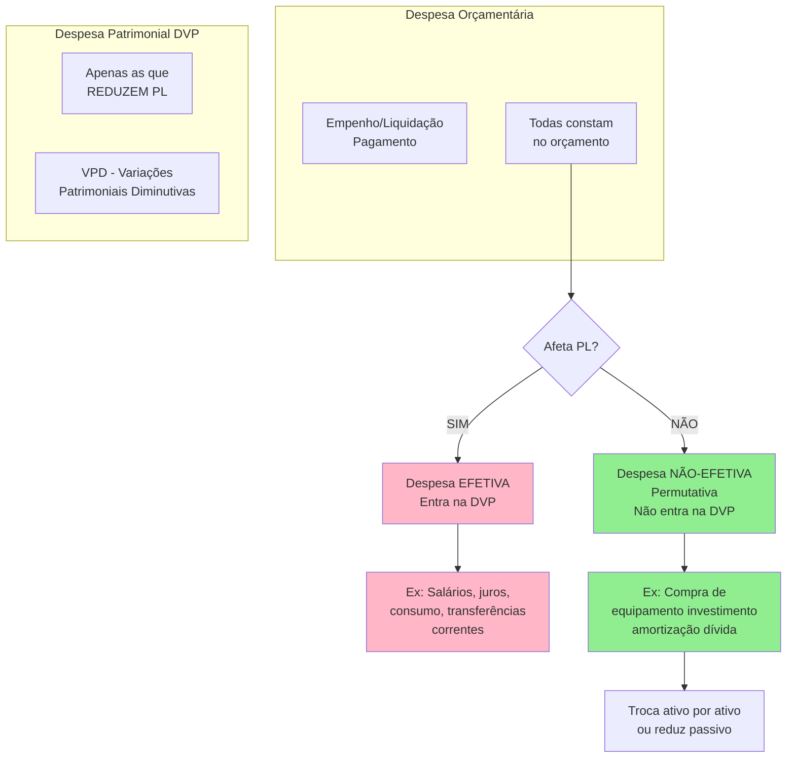
### Classificações e Análise da Legalidade, Eficiência, Transparência e Resultado Fiscal

**Legalidade:** A estrutura de classificações orçamentárias auxilia no cumprimento das normas legais e constitucionais. A classificação institucional garante que cada gasto esteja vinculado a um órgão e UO autorizados na LOA, evitando desvios de finalidade e facilitando o controle por Tribunal de Contas por jurisdicionado. A classificação funcional permite verificar facilmente o atendimento de vinculações legais de gasto mínimo, como os **aplicativos mínimos em saúde e educação** – como as despesas são marcadas por função, comprovar o percentual aplicado nessas áreas torna-se direto. Além disso, a segregação por natureza ajuda a respeitar limites da **Lei de Responsabilidade Fiscal**: por exemplo, despesa de pessoal (GND 1) é limitada a certos percentuais da receita, e seu acompanhamento requer que esteja corretamente classificada ali.

**Eficiência e eficácia:** Com as classificações programática e de natureza, pode-se avaliar **eficiência alocativa** – quanto do orçamento está indo para atividades-fim (investimentos, programas finalísticos) versus atividades-meio (custeio administrativo, folha). Uma alta proporção de **despesa corrente com manutenção e pessoal** em detrimento de **investimentos** pode indicar baixa prioridade a expansão de serviços ou infraestrutura, ou ainda ineficiências (como custeio administrativo elevado). Por outro lado, acompanhar a **execução por programa** permite julgar eficácia: se um programa X teve grande dotação mas não atingiu metas físicas, há um alerta de ineficiência. As classificações fornecem o ferramental para análises de desempenho – por exemplo, custo por unidade de produto entregue (ligando despesa por natureza com metas físicas da ação).

**Transparência:** A abertura dos gastos em diversas classificações facilita a compreensão pública e o controle social. Cidadãos podem perguntar _“quanto se gasta com saúde?”_ – a classificação funcional responde. _“Quanto se gasta com salários?”_ – a natureza (GND 1) responde. _“O que tal programa de governo realizou?”_ – a classificação programática, juntamente com relatórios de metas, responde. A Lei de Acesso à Informação e os portais da transparência exploram essas classificações para apresentar dados abertos claros. A independência da classificação funcional, por exemplo, dá transparência supraministerial – não importa qual pasta executou, sabe-se o total por política pública.

**Resultado fiscal:** Em sentido estrito, o resultado fiscal do governo (superávit ou déficit) e especialmente o **resultado primário** são avaliados com base nas classificações. O **Resultado Primário** foca no saldo entre receitas e despesas não financeiras do governo, excluindo juros. Para apurá-lo, é imprescindível identificar **juros da dívida (GND 2)** separados de outras despesas – a classificação por natureza provê isso. Tanto que existe inclusive um **Identificador de Resultado Primário (RP)** na classificação de cada ação/despesa, marcando se ela entra no cálculo da meta fiscal. Por exemplo, despesas custeadas por determinadas doações ou operações podem ser excluídas da meta, conforme a LDO – algo indicado pelo identificador RP.

Ademais, a distinção entre corrente e capital sustenta a **Regra de Ouro** (CF art. 167, III): ela proíbe que a despesa corrente exceda a soma da receita corrente + operações de crédito **destinadas a capital**. Ou vista de outra forma, veda tomar empréstimos para pagar despesas correntes. Monitorar isso implica olhar se houve ingresso de **receita de capital** (emissão de dívida) para cobrir gasto corrente – o que a classificação econômica deixa claro. Se o orçamento mostrar déficit corrente e necessidade de dívida, pode ferir a regra de ouro, a menos que aprovado por crédito especial. Esse é um exemplo de como as classificações garantem alertas de **sustentabilidade fiscal**.

Resumindo, as múltiplas classificações da despesa orçamentária, integradas às demonstrações contábeis, **não são burocracia excessiva**, mas sim ferramentas essenciais de planejamento, controle e avaliação. Elas respondem **quem gasta, em que, para qual fim e de que forma**, permitindo desde a conformidade legal (uso adequado das dotações) até análises de efetividade das políticas públicas e responsabilidade fiscal do Estado.

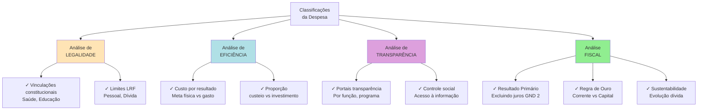


> [!TIP] **Dica de Prova**  
> Ao resolver questões sobre classificação da despesa, identifique no enunciado palavras-chave que indiquem **quem executa**, **para qual finalidade** e **o que é adquirido**. Isso guiará a resposta:
> 
> - Se o item descreve **manutenção de algo existente**, **pagamento rotineiro** ou **serviço continuado**, pense em **despesa corrente** (custeio).
>     
> - Se descreve **criação ou aquisição de um ativo novo** (construção, compra de equipamento novo, implantação de projeto), associe a **despesa de capital** (investimento).
>     
> - Se o governo **repassa recursos a outro ente** realizar o projeto, lembre que para o repassador é **transferência de capital**, não investimento direto.
>     
> - Atenção a termos como **“aquisição de imóvel”**: um imóvel novo para incorporar a um projeto pode ser investimento, mas geralmente **compra de imóvel existente** é inversão financeira. **“Juros da dívida”** são despesas correntes, enquanto **“amortização do principal”** é capital.  
>     Em casos duvidosos, lembre das definições legais (Lei 4.320) e da lógica das perguntas-chave – isso ajuda a eliminar alternativas incorretas.
>     

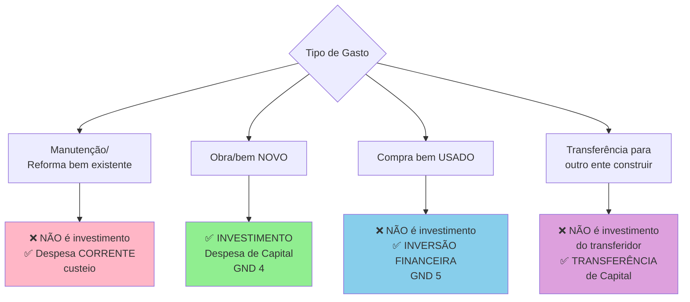


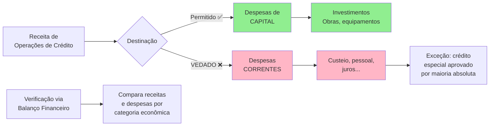


## Questões de Certo ou Errado (Estilo Cebraspe)

Julgue os itens a seguir quanto à classificação orçamentária da despesa no âmbito federal, marcando **Certo (C)** ou **Errado (E)**. Em seguida, confira o gabarito comentado.

1. **(CESPE)** As **despesas de capital** abrangem somente gastos que resultam na criação ou aquisição de novos bens para o patrimônio público, _não incluindo a compra de imóveis já existentes_, por não representarem formação de capital.
    
2. **(CESPE)** A despesa realizada com **obras de conservação e adaptação** de um prédio público já existente deve ser classificada como **investimento**, uma vez que envolve a execução de obra de engenharia.
    
3. **(CESPE)** **Recursos transferidos pela União a um Estado, destinados à construção de uma obra pública estadual**, são classificados, no orçamento da União, como **investimentos**, pois financiam a formação de um bem de capital (obra) em outro ente.
    
4. **(CESPE)** A **aquisição, pelo Governo Federal, de ações de empresas privadas** configura despesa orçamentária classificada como **inversão financeira**, uma vez que se trata de aplicação de capital em empreendimento já em funcionamento.
    
5. **(CESPE)** O **pagamento de juros da dívida pública** da União é classificado como **despesa de capital**, pois está relacionado a operação de crédito governamental, ao passo que o pagamento do principal da dívida (amortização) é despesa corrente.
    

**Gabarito e Comentários:**

1. **Errado.** A assertiva exclui indevidamente a compra de imóveis existentes das despesas de capital. Segundo a Lei 4.320/64, **a aquisição de imóveis** já construídos é sim classificada como despesa de capital, na categoria de **Inversões Financeiras**tce.ro.gov.br. Despesas de capital não se restringem a bens novos; incluem investimentos (bens novos) **e inversões** (bens já em uso, aquisição de imóveis, participação societária etc.). Logo, a compra de um imóvel já existente **é despesa de capital (inversão)**, contrariando o item.
    
2. **Errado.** Despesas de **conservação, manutenção ou adaptação** de bens públicos existentes **não são investimentos**, mas sim **despesas de custeio (correntes)**. A Lei 4.320/64 define que manutenção de serviços e obras de conservação de bens imóveis são classificadas como **Despesas de Custeio (correntes)**tce.ro.gov.br. Portanto, reformar ou adaptar um prédio já construído não gera um novo ativo, sendo despesa corrente. O erro do item foi afirmar que seria investimento.
    
3. **Errado.** Recursos que a União **transfere para outro ente** executar uma obra **não são classificados como investimento pela União**, e sim como **Transferência de Capital**. Apesar de a finalidade do recurso ser uma obra (bem de capital) no Estado, do ponto de vista do orçamento federal trata-se de uma **dotação transferida sem contraprestação direta**, enquadrada como transferência de capitaltce.ro.gov.br. Investimentos correspondem a obras executadas pelo próprio ente que gasta. Logo, o item está incorreto em classificar como investimento uma despesa que, na União, é registrada como transferência (despesa de capital transferida).
    
4. **Certo.** A compra de ações ou participação em empresas já existentes é o exemplo clássico de **Inversão Financeira** – despesa de capital que não cria um novo bem público, mas **aplica recursos em um empreendimento em funcionamento**tce.ro.gov.br. Assim, quando o governo adquire ações de uma empresa privada (ou mesmo aumenta capital de uma empresa estatal de objetivo lucrativo), classifica a despesa no Grupo 5 (Inversões Financeiras). O item descreveu corretamente essa classificação.
    
5. **Errado.** **Juros e encargos da dívida** são classificados como **despesas correntes**, não de capital. No quadro de grupos de natureza, “Juros e Encargos da Dívida” é o **GND 2**, pertencente à categoria Despesas Correntes. Já o **pagamento do principal (amortização)** da dívida pública é despesa de capital (GND 6). O item invertou as classificações – afirmou que juros são capital, o que contraria a norma. Portanto, está incorreto.

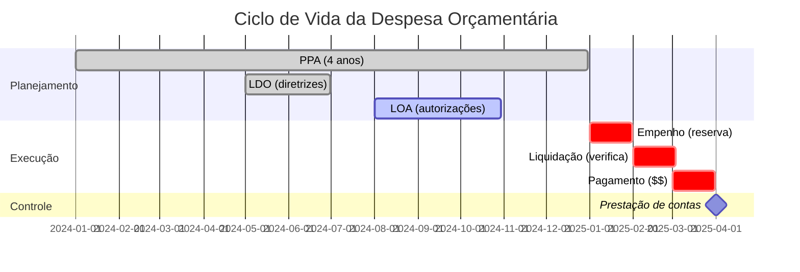

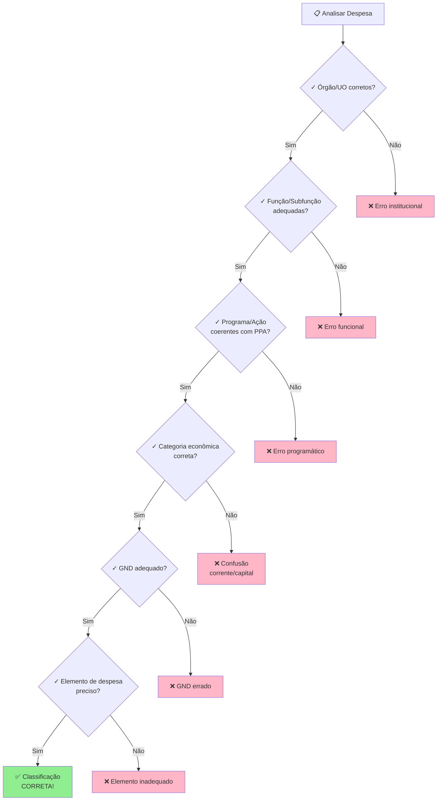

# 📊 Classificação Orçamentária: Guia Completo (MTO)

## 🎯 Introdução: A Lógica do Orçamento-Programa

Pense no orçamento público como um **GPS da gestão governamental**. Assim como o GPS precisa saber ONDE você está, PARA ONDE vai e COMO chegar, o orçamento precisa responder perguntas fundamentais sobre os gastos públicos

## 📋 Classificação Qualitativa

A programação qualitativa do orçamento está organizada em **programas de trabalho** que devem responder, de maneira clara e objetiva, às perguntas clássicas que caracterizam o ato de orçar  .

### 🔍 Estrutura Completa (Os 5 Blocos)

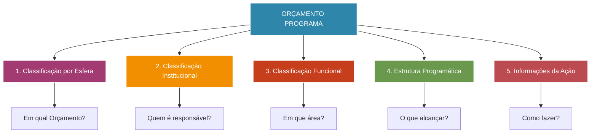

### 📊 Tabela Detalhada: Blocos, Itens e Perguntas

| **BLOCO DA ESTRUTURA** | **ITEM DA ESTRUTURA** | **PERGUNTA A SER RESPONDIDA** | **ANALOGIA** |
|------------------------|----------------------|-------------------------------|--------------|
| **1. Classificação por Esfera** | Esfera Orçamentária | **Em qual Orçamento?** | É como escolher qual "carteira" usar: fiscal, seguridade ou investimento das estatais |
| **2. Classificação Institucional** | • Órgão<br>• Unidade Orçamentária | **Quem é o responsável por fazer?** | Quem "assina" o projeto? Qual departamento executa? |
| **3. Classificação Funcional** | • Função<br>• Subfunção | **Em que áreas de despesa a ação governamental será realizada?** | É a "categoria" do gasto: saúde, educação, segurança, etc. |
| **4. Estrutura Programática** | Programa | **O que se pretende alcançar com a implementação da Política Pública?** | O "objetivo maior" - como "melhorar a educação básica" |
| **5. Informações Principais da Ação** | Ação | **Qual a atuação governamental empreendida com vistas ao alcance do objetivo do programa?** | As "tarefas específicas" para atingir o objetivo |

### 🎭 Detalhamento das Informações da Ação

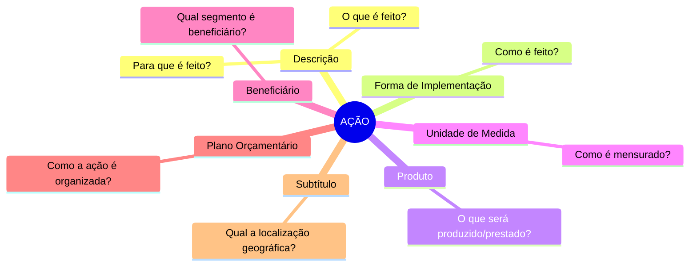

| **SUBITEM DA AÇÃO** | **PERGUNTA** | **EXEMPLO PRÁTICO** |
|---------------------|--------------|---------------------|
| Descrição | O que é feito? Para que é feito? | "Construção de escolas para ampliar acesso à educação" |
| Forma de Implementação | Como é feito? | "Transferência direta", "Descentralizada", "Direta" |
| Produto | O que será produzido ou prestado? | "Escola construída", "Aluno matriculado" |
| Unidade de Medida | Como é mensurado? | "Unidade", "Pessoa", "Quilômetro" |
| Beneficiário | Qual segmento da sociedade ou do Estado é beneficiário? | "População de baixa renda", "Estudantes" |
| Plano Orçamentário | Como a atuação governamental desenvolvida na ação é organizada? | Detalhamento interno da ação |
| Subtítulo | Qual a localização geográfica da ação? | "No Estado de SP", "Nacional" |

---

## 💰 Classificação Quantitativa

A programação quantitativa possui **duas dimensões complementares** :

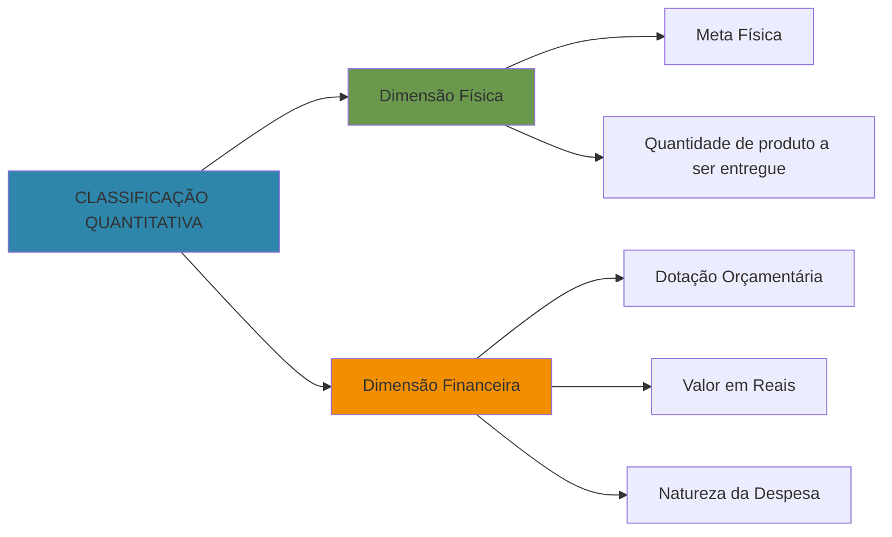

### 📐 Estrutura da Classificação Quantitativa

| **DIMENSÃO** | **ITENS DA ESTRUTURA** | **O QUE RESPONDE** | **EXEMPLO** |
|--------------|------------------------|-------------------|-------------|
| **Física** | • Meta Física<br>• Unidade de Medida | Quantas unidades do produto serão entregues? | "100 escolas" ou "5.000 alunos atendidos" |
| **Financeira** | • Dotação Orçamentária<br>• Natureza da Despesa<br>• Fonte de Recursos<br>• Identificador de Uso (IDUSO) | Quanto custará? De onde vem o dinheiro? Como será gasto? | "R$ 10 milhões" vindos de "recursos do Tesouro" para "obras e instalações" |

---

## 🎨 Analogia Completa: O Orçamento como uma Receita de Bolo

Imagine que o governo vai fazer um **bolo gigante para a sociedade**:

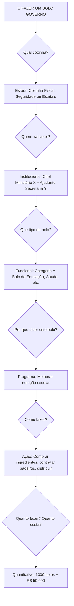

### 🔑 Analogia Detalhada por Bloco:

1. **Esfera** = Em qual cozinha vamos trabalhar? (Fiscal, Seguridade, Investimento)
2. **Institucional** = Quem é o chef responsável? (Órgão e Unidade)
3. **Funcional** = Que tipo de receita? (Função: Educação, Subfunção: Ensino Fundamental)
4. **Programa** = Qual o menu completo? (Ex: "Alimentação Escolar de Qualidade")
5. **Ação** = Quais os passos da receita? (Comprar, preparar, servir)
6. **Quantitativo** = Quantos bolos? Quanto vai custar? (Meta física + dotação)

---

## 🎯 Fluxo de Entendimento: Das Perguntas à Estrutura

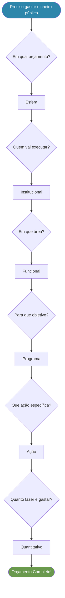

---

## 💡 Dicas para Memorização

### **Mnemônico: "EI-FU-PRO-AÇÃ-QUA"**

- **E**sfera - Em qual?
- **I**nstitucional - Quem?
- **FU**ncional - Onde (área)?
- **PRO**grama - Por quê (objetivo)?
- **AÇÃ**o - Como?
- **QUA**ntitativo - Quanto?

### 📝 Resumo Visual Simplificado

```
┌─────────────────────────────────────────┐
│   ORÇAMENTO = RESPONDER 6 PERGUNTAS     │
├─────────────────────────────────────────┤
│ ① EM QUAL? ➜ Esfera                     │
│ ② QUEM? ➜ Institucional                 │
│ ③ ONDE (área)? ➜ Funcional              │
│ ④ POR QUÊ? ➜ Programa                   │
│ ⑤ COMO? ➜ Ação                          │
│ ⑥ QUANTO? ➜ Quantitativo (física+$$$)   │
└─────────────────────────────────────────┘
```

---

## ✅ Checklist de Compreensão

- [ ] Sei identificar os 5 blocos da classificação qualitativa
- [ ] Consigo responder qual pergunta cada bloco responde
- [ ] Entendo a diferença entre Programa e Ação
- [ ] Sei distinguir dimensão física e financeira
- [ ] Consigo aplicar a analogia da receita em exemplos reais

**Espero que esta nota tenha facilitado sua compreensão! O segredo é sempre pensar nas perguntas que cada classificação responde.** 🎓