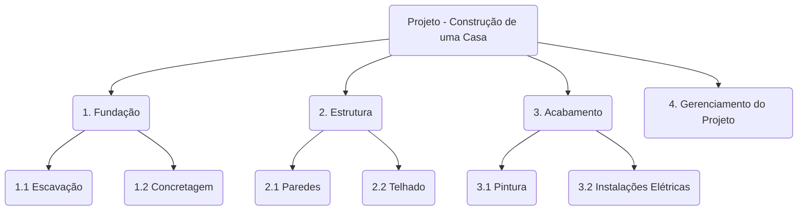

---
tags:
  - gerenciamento-de-projetos
  - escopo
  - planejamento
  - pmbok
  - concursos
aliases:
  - EAP
  - WBS
  - Estrutura Analítica do Projeto
---

# Estrutura Analítica do Projeto (EAP / WBS)

A **Estrutura Analítica do Projeto (EAP)**, ou *Work Breakdown Structure (WBS)*, é uma decomposição hierárquica e orientada às entregas do trabalho a ser executado pela equipe do projeto para atingir os objetivos do projeto e criar as entregas requeridas.

> [!quote] Foco de Concurso
> A EAP é um dos artefatos mais importantes do gerenciamento de projetos. As bancas focam em sua finalidade (decompor o escopo), na Regra dos 100% e no que ela **não** é (não é um cronograma, não mostra dependências).

---
## 🎯 Finalidade e Características-Chave

- **Organizar e Definir o Escopo Total:** A EAP visualiza todo o escopo do projeto. Se não está na EAP, não faz parte do projeto.
- **Orientada a Entregas:** A EAP foca no **"o quê"** (entregas) e não no **"como"** (atividades). As atividades vêm depois, no cronograma.
- **Base para Planejamento:** É a fundação para quase todo o planejamento subsequente:
    - **Cronograma:** As atividades são definidas a partir dos pacotes de trabalho.
    - **Custos:** As estimativas de custo são feitas para cada pacote de trabalho e agregadas.
    - **Recursos:** Os recursos necessários são planejados com base no trabalho a ser feito.
    - **Riscos:** Ajuda a identificar riscos em níveis mais detalhados.

---
## 🏗️ Estrutura e Componentes

- **Decomposição:** É o processo de subdividir as entregas do projeto em componentes menores e mais gerenciáveis.
- **Níveis da EAP:**
    - **Nível 1:** O projeto em si.
    - **Níveis Intermediários:** Fases, subprojetos ou entregas principais.
    - **Nível mais baixo:** **Pacote de Trabalho (Work Package)**.
- **Pacote de Trabalho:**
    - É o nível mais baixo da EAP.
    - É o ponto em que o custo e a duração do trabalho podem ser estimados e gerenciados de forma confiável.
    - O trabalho dentro de um pacote de trabalho é a base para a definição das atividades do cronograma.

---
## 📜 Regras Fundamentais da EAP

### 1. A Regra dos 100%
- **Definição:** A EAP deve incluir **100%** do trabalho definido pelo escopo do projeto e capturar **todas** as entregas – internas, externas e de gerenciamento.
- **Implicação:** A soma do trabalho dos níveis "filho" deve ser igual a 100% do trabalho do nível "pai". Não se deve incluir nenhum trabalho que não esteja no escopo (evitando *gold plating*).

### 2. Pacotes de Trabalho Mutuamente Exclusivos
- **Definição:** Não deve haver sobreposição no escopo definido entre dois elementos diferentes da EAP. Cada item deve ser único e distinto.
- **Implicação:** Isso evita duplicidade de trabalho, confusão de responsabilidades e problemas na contabilização de custos.

### 3. A Regra 8/80 (Diretriz, não regra estrita)
- **Definição:** Uma diretriz sugere que um pacote de trabalho deve ter uma duração entre 8 e 80 horas de esforço para ser concluído.
- **Propósito:** Ajuda a garantir que os pacotes de trabalho não sejam nem muito grandes (difíceis de gerenciar) nem muito pequenos (microgerenciamento).

---
## 📊 Dicionário da EAP (WBS Dictionary)

- **O que é:** Um documento que fornece informações detalhadas sobre cada componente da EAP.
- **Conteúdo Típico para um Pacote de Trabalho:**
    - **ID do componente:** Código de identificação único.
    - **Descrição do trabalho:** Detalhes da entrega.
    - **Critérios de aceitação:** Como a conclusão e qualidade serão validadas.
    - **Marcos e entregas:** Resultados específicos.
    - **Informações contratuais e de custo.**
    - **Responsável (pessoa ou organização).**

> [!danger] O que a EAP **NÃO** é:
> - **Não é um Cronograma:** Ela não mostra a ordem das tarefas, durações ou dependências. Ela é uma entrada para o cronograma.
> - **Não é uma Estrutura Organizacional:** Ela mostra o trabalho do projeto, não a hierarquia da equipe ou da empresa.
> - **Não é uma lista de atividades:** O nível mais baixo são os **pacotes de trabalho** (entregas), não as atividades (ações).

---
## 📄 Exemplo de Estrutura

