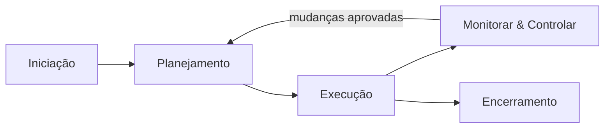
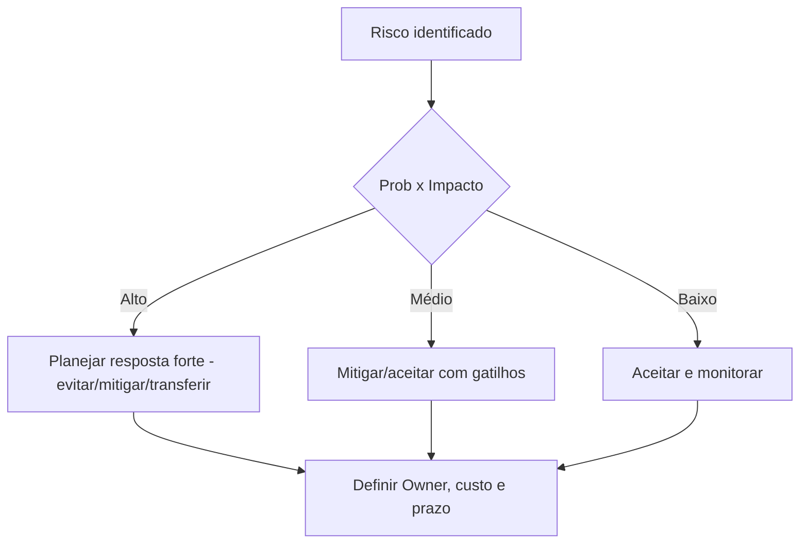

# Nota — Gerenciamento de Projetos (do “gold plating” aos papéis)

> [!summary] Essência  
> Projeto = esforço temporário para criar um resultado único. Sucesso = entregar **escopo** combinado, **no prazo**, **no custo** e com **qualidade/valor** aceitáveis, sob **riscos controlados** e com **patrocinador satisfeito**.

---

## 1) Conceitos que caem muito

- **Escopo do produto vs. escopo do projeto**: o “o quê” (características do resultado) vs. o “como” (trabalho necessário).
    
- **Baseline**: linhas de base aprovadas de **escopo**, **cronograma** e **custos**; só mudam via **controle integrado de mudanças**.
    
- **Creep de escopo** (_scope creep_) x **mudança controlada**: creep = inclusão **não aprovada**; mudança controlada = **solicitada, avaliada, aprovada**.
    
- **Gold plating**: “embelezar” além do combinado (entregar a mais sem requerimento). Parece generoso, mas **aumenta risco, custo, prazos** e **cria obrigação** futura. Deve ser **evitado**; foco é cumprir **requisitos e critérios de aceitação**.
    
- **Valor** (business value): benefícios esperados (econômicos, operacionais, sociais). Em ágil, medido a cada incremento; em preditivo, validado em marcos/gates.
    

---

## 2) Ciclo de vida e abordagens

- **Preditivo (cascata)**: escopo mais estável; planejamento detalhado upfront; útil em obras, contratos regulados, requisitos fixos.
    
- **Ágil/Adaptativo** (Scrum/Kanban): incerteza alta; ciclos curtos, feedback contínuo, **backlog priorizado**; útil em software/serviços digitais.
    
- **Híbrido**: arquitetura e marcos preditivos + entregas incrementais ágeis.
    

---

## 3) Papéis e responsabilidades (RACI como referência)

|Papel|Foco|Responsabilidades-chave|
|---|---|---|
|**Patrocinador (Sponsor)**|Direção e valor|Define visão, aprova business case, garante recursos, **autoriza mudanças de alto impacto**, resolve impedimentos organizacionais.|
|**Gerente de Projeto (GP/PM)**|Entrega|Integra todas as áreas, mantém baseline, gerencia riscos, comunica status, **pede decisão** quando fora da sua autoridade.|
|**PMO** (Escritório de Projetos)|Governança|Metodologia, templates, suporte, **portfólio** e lições aprendidas.|
|**Steering Committee** (Comitê)|Estratégia|Avalia desempenho, prioriza, decide **go/no-go** em marcos.|
|**Gerentes Funcionais**|Recursos|Alocam equipe, tratam conflitos de capacidade, avaliam desempenho funcional.|
|**Equipe do Projeto**|Execução técnica|Decompõe WBS, estima, executa, testa, registra evidências.|
|**Product Owner** (ágeis)|Valor do produto|Prioriza backlog, define **critérios de aceitação**, aceita/rejeita entregas.|
|**Scrum Master** (ágeis)|Fluxo e cultura|Remove impedimentos, facilita eventos, protege time de interferências.|
|**Partes Interessadas (Stakeholders)**|Influência|Podem afetar/ser afetadas; devem ser mapeadas e **engajadas**.|

> [!tip] Dica prática  
> Use **matriz RACI** nos principais pacotes da WBS. Evita ambiguidade e reduz retrabalho (e “gold plating” por zelo excessivo).

---

## 4) Planejamento na prática (mínimo viável de qualidade)

1. **Termo de Abertura** + **Business Case** (por quê, o quê, quanto vale).
    
2. **WBS/EAP** (decompor em pacotes mensuráveis).
    
3. **Cronograma** (rede lógica, caminho crítico, reservas).
    
4. **Orçamento** (custos diretos/indiretos; contingência).
    
5. **Qualidade** (critérios de aceitação, **Definition of Done**, checklists).
    
6. **Riscos** (registro, probabilidade x impacto, respostas: evitar, mitigar, transferir, aceitar; **owner** por risco).
    
7. **Aquisições** (make-or-buy, estratégia, critérios de seleção, riscos contratuais).
    
8. **Stakeholders & Comunicação** (mapa de poder/interesse; **quem recebe o quê, quando, como**).
    
9. **Plano de Mudanças** (formulário de CR, fluxo de aprovação, impactos integrados).
    
10. **Governança** (marcos/gates, tolerâncias e escalonamento).
    

---

## 5) Execução sem “surpresas” (e sem gold plating)

- **Trabalhar o que está planejado**: qualquer “melhoria” não prevista vira **solicitação de mudança** com **análise de impacto** antes de executar.
    
- **Controle Integrado de Mudanças**: toda mudança altera **no mínimo um**: escopo, prazo, custo, risco, qualidade ou valor. Registre decisão e atualize baseline.
    
- **Qualidade**: _build-in quality_ (fazer certo da primeira vez) + _QA/QC_, auditorias de processo e inspeções.
    

---

## 6) Monitoramento & Controle (M&C)

- **KPIs básicos**: % completado, entregas aceitas, riscos ativos/resolvidos, consumo de contingência, variações.
    
- **EVM (Earned Value Management)** — útil em provas e em prática:
    
    - **PV** (Planned Value), **EV** (Earned Value), **AC** (Actual Cost).
        
    - **Variações**: CV = EV − AC; SV = EV − PV.
        
    - **Índices**: **CPI** = EV/AC (custo), **SPI** = EV/PV (prazo).
        
    - **Previsão**: EAC ≈ BAC/CPI (simples) ou outras fórmulas conforme cenário.
        
- **Relato executivo**: sumário visual (semana a semana), decisões pendentes do comitê, próximos marcos, riscos “top 5”.
    

---

## 7) Qualidade & “gold plating” — como segurar a caneta

> [!warning] Gold Plating  
> É **adicionar escopo** não solicitado/agregado sem aprovação formal.  
> **Riscos**: desvio de custo/prazo, efeitos colaterais no produto, precedentes contratuais, questionamentos de auditoria.  
> **Como evitar**:
> 
> - Critérios de aceitação claros (e DoD/DoR no ágil).
>     
> - **Revisões de qualidade** com checklist vinculado aos requisitos.
>     
> - Cultura de **“pare, registre, aprove”** para mudanças.
>     
> - Incentivos alinhados: **não** premiar “extra não aprovado”, e sim **conformidade e valor combinado**.
>     

---

## 8) Riscos e respostas (mapa rápido)

> [!note] Boas práticas
> 
> - **Gatilhos (triggers)** claros para acionar plano B.
>     
> - **Reserva de contingência** vinculada a riscos residuais.
>     
> - **Revisões periódicas** do registro de riscos (risk burndown em ágil).
>     

---

## 9) Aquisições e contratos (visão geral)

- **Estratégia**: o que comprar, quando, com que modelo (preço global, unitário, time & material etc.).
    
- **Especificação**: foco em **resultados e critérios de medição**, evitando ambiguidade (fonte típica de creep/gold plating).
    
- **Matriz de riscos contratual**: quem arca com quais eventos; mecanismos de reequilíbrio; SLAs/OLAs.
    

---

## 10) Encerramento e aprendizado

- **Aceite formal** (produto, transição operacional, SLAs ativados).
    
- **Encerramento administrativo e contratual** (entregáveis, garantias, pendências).
    
- **Lições aprendidas**: o que manter, o que mudar; atualize repositório do PMO.
    
- **Avaliação de benefícios** (ex-post), especialmente em programas/portfólios.
    

---

## 11) Checklist antiplating (colar na capa do projeto)

- Requisitos rastreáveis ↔ critérios de aceitação?
    
- DoD/DoR (ou checklist de qualidade) publicado para o time?
    
- Fluxo de **Change Request** ativo e conhecido?
    
- RACI aplicado aos pacotes críticos?
    
- Relatório executivo periódico (com decisões pendentes do sponsor)?
    
- Métricas EVM ou equivalente para variação?
    
- Plano de testes/validação amarrado aos requisitos?
    
- Recompensas **não** ligadas a “extras” sem aprovação?
    

