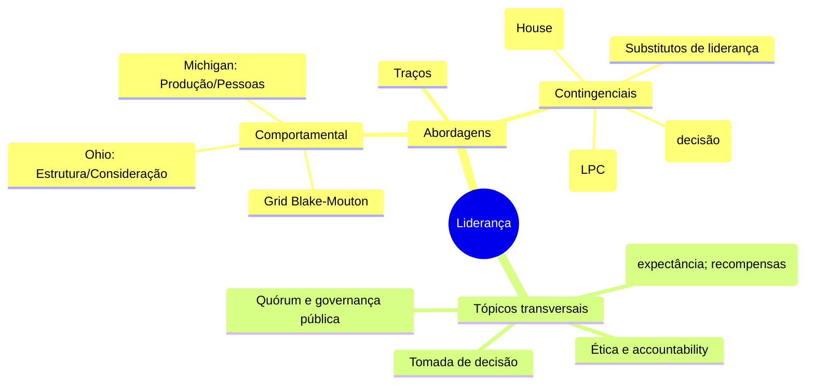
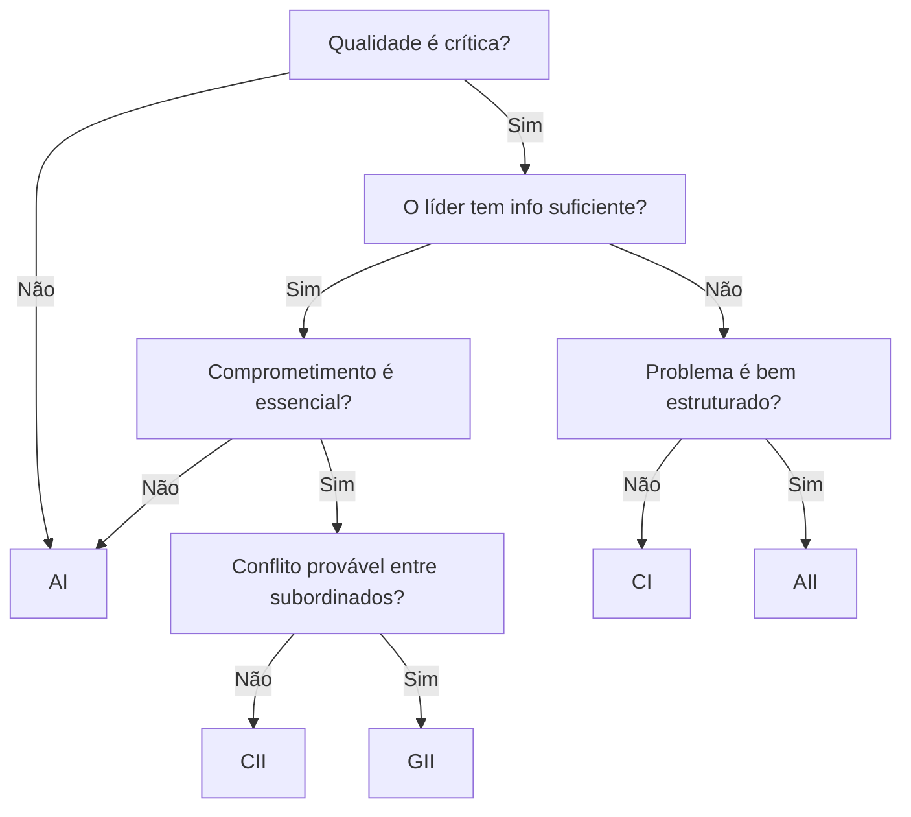

---

exam_focus: "Liderança (teorias clássicas e contingenciais) — provas CESPE/Cebraspe, FGV"  
status: draft  
rev: 1.0

# Liderança — guia para provas (Obsidian)

> [!summary]  
> **Essência para a prova**: teorias de liderança cobram **quando** cada estilo funciona, **quadros comparativos**, **conceitos centrais**, **armadilhas de prova** e **aplicações em cenários**. Priorize: **Teoria do Caminho‑Objetivo (House)**, **Árvore de Decisão de Vroom‑Yetton‑Jago**, **Comportamental (Ohio/Michigan; Grid Blake‑Mouton)**, **Contingencial de Fiedler (LPC)** e **Traços**. Conecte com gestão pública (motivação, tomada de decisão, desenho de processos, accountability).

---

## 0) Mapa geral (para memorização)

---

## 1) Teoria do Caminho‑Objetivo (Robert House)

**Foco:** aumentar **expectância** e **instrumentalidade** dos liderados, **clareando o caminho** até as metas.

**Estilos do líder**

- **Diretivo**: orienta o _como_ e _quando_ (regras, cronogramas, feedback frequente).
    
- **Apoiador**: enfatiza bem‑estar, relações e clima.
    
- **Participativo**: consulta e considera sugestões para a decisão.
    
- **Orientado à realização**: metas desafiadoras, alta expectativa de desempenho.
    

**Fatores situacionais**

- **Características dos liderados**: experiência, locus de controle, competências.
    
- **Características da tarefa/ambiente**: estruturação, rotina/ambiguidade, sistemas de recompensas e formalização.
    

**Regras de ouro (para prova)**

- Tarefa **ambígua/complexa** → **Diretivo**.
    
- Clima **frio/estressante** → **Apoiador**.
    
- Liderados **experientes/altamente capazes** → **Participativo**.
    
- Metas **altas e mensuráveis** com equipe **autônoma** → **Orientado à realização**.
    

> [!example] Exemplo público  
> Implementação de novo **sistema de protocolo eletrônico**: tarefas ambíguas e resistências → líder **diretivo** para padronizar processos + **apoiador** para reduzir estresse; depois **participativo** para refinar fluxos.

> [!warning] Pegadinhas
> 
> - **Não** confunda com Hersey‑Blanchard (maturidade do liderado). House foca **clarear o caminho** e **ajustar recompensas**.
>     
> - **Não** pressupõe um estilo fixo.
>     

**Mini‑quiz**

- _Se a tarefa já é altamente estruturada e a equipe é novata, o estilo diretivo agrega pouco?_ → **Falso** (ainda reduz incerteza e ambiguidade cultural/organizacional).
    

---

## 2) Árvore de Decisão de Vroom‑Yetton‑Jago (VYJ)

**Foco:** **qualidade** da decisão e **aceitação/comprometimento** da equipe.

**Perguntas‑chave (sim/não)**: importância da qualidade, informação do líder, estrutura do problema, necessidade de comprometimento, probabilidade de aceitação sem participação, conflito entre subordinados, etc.

**Estilos de decisão (continuum)**

- **AI**: decide sozinho com info própria.
    
- **AII**: coleta info individualmente; decide sozinho.
    
- **CI**: consulta indivíduos; decide sozinho.
    
- **CII**: consulta em grupo; decide sozinho.
    
- **GII**: decide **com** o grupo (consenso/maioria sob facilitação).
    

**Árvore (visual simplificado)**

> [!tip] Uso prático  
> Problemas **técnicos e urgentes** → tendem a **AI/AII**. Questões **político‑organizacionais** que exigem **comprometimento** → **CII/GII**.

> [!warning] Pegadinhas
> 
> - VYJ é **normativo/prescritivo**, não meramente descritivo.
>     
> - **Não** trata de motivação diretamente, e sim de **processo decisório**.
>     

**Flashcards (estilo Obsidian)**

- **Q:** Quando preferir **GII**? **A:** Alta necessidade de comprometimento + conflito provável + líder sem info completa.
    

---

## 3) Perspectiva Comportamental (Ohio, Michigan) e Grid Gerencial (Blake‑Mouton)

**Ohio State**: duas dimensões independentes →

- **Estrutura de Iniciação** (tarefa, papéis, monitoramento)
    
- **Consideração** (relações de confiança, respeito, apoio)
    

**Michigan**: ênfase em **orientação para pessoas** vs **produção**, e em equipes de alto desempenho.

**Grid Blake‑Mouton (9x9)**

- (1,9) **Clube**; (9,1) **Autoritário**; (5,5) **Meio‑termo**; (1,1) **Empobrecido**; (9,9) **Equipe**.
    

> [!warning] Armadilha  
> A linha **clássica** “o melhor é 9,9” é **didática**, não universal. Situações podem exigir outros pontos.

**Aplicação em prova**

- Relacione **Estrutura** ≈ processos/indicadores em órgãos públicos; **Consideração** ≈ clima e engajamento.
    

---

## 4) Modelo Contingencial de Fiedler (LPC)

**Premissas**

- Estilo **fixo** (difícil de treinar/mudar). Medido por **LPC**:
    
    - **LPC alto** → orientação a **relacionamentos**.
        
    - **LPC baixo** → orientação a **tarefa**.
        

**Favorabilidade situacional** (3 fatores)

1. **Relação líder‑membros** (confiança/respeito)
    
2. **Estrutura da tarefa** (grau de definição)
    
3. **Poder de posição** (autoridade formal)
    

**Combinações vencedoras (regra‑mnemônico)**

- Situações **muito favoráveis** **ou** **muito desfavoráveis** → **líder de tarefa (LPC baixo)**.
    
- Situações **intermediárias** → **líder de relacionamento (LPC alto)**.
    

> [!failure] Pegadinhas
> 
> - Fiedler **não recomenda** “mudar o estilo”; recomenda **ajustar a situação** (ex.: formalizar tarefas, reforçar poder formal, trabalhar relações) **ou** realocar o líder.
>     

---

## 5) Abordagem dos Traços

**Ideia central**: traços (ambição, energia, integridade, autoconfiança, inteligência, conhecimento) **associam‑se**, mas **não determinam** a eficácia em todas as situações.

> [!warning] Atenção
> 
> - Falha clássica: buscar **traço universal**.
>     
> - Desconsidera contexto e papel dos liderados.
>     

**Para memorizar**: _TRAÇOS ajudam na **emergência** do líder; comportamento e contexto influem na **eficácia**_.

---

## 6) Outros tópicos que a banca costuma cobrar

- **Liderança Situacional (Hersey & Blanchard)**: combina **direção** e **apoio** conforme **maturidade/competência e comprometimento** do liderado (S1 a S4). Não confundir com House.
    
- **LMX (Leader‑Member Exchange)**: qualidade diferenciada das relações diádicas líder‑membro; efeitos sobre desempenho, satisfação e justiça.
    
- **Substitutos e neutralizadores de liderança (Kerr & Jermier)**: certas **características da tarefa/organização** (altamente estruturada, feedback intrínseco, normas profissionais) **substituem** ou **neutralizam** efeitos do líder.
    
- **Transformacional vs Transacional**: inspiração, visão, consideração individualizada e estímulo intelectual **vs** recompensas contingentes e gestão por exceção.
    
- **Autêntica e Servidora**: ética, transparência, foco no desenvolvimento das pessoas e serviço ao público; ligação com **accountability**.
    
- **Poder e influência (French & Raven)**: legítimo, recompensa, coerção, especialista, referência.
    
- **Viéses decisórios do líder**: ancoragem, confirmação, excesso de confiança (link com **VYJ**).
    
- **Ética e setor público**: integridade do líder, conflito de interesses, interesse público.
    

---

## 7) Tabelas de comparação (revisão relâmpago)

|Teoria|Palavra‑chave|Flexibilidade do estilo|Diagnóstico central|Erros comuns|
|---|---|---|---|---|
|**Traços**|características pessoais|n/a|identificar traços associados|supor traço universal|
|**Comportamental**|o que o líder **faz**|treinável|tarefa × pessoas|ignorar contexto|
|**Fiedler**|**ajuste situação** ao estilo|**baixa** (estilo fixo)|LPC + favorabilidade|“treinar para mudar o estilo”|
|**House**|**clarear caminho** + recompensas|**alta**|estilo × características liderados/tarefa|confundir com Hersey‑Blanchard|
|**VYJ**|**processo decisório**|**alta**|árvore de decisão|achar que trata de motivação|

---

## 8) Cenários típicos de prova (marque o estilo)

- **Equipe júnior**, tarefa **ambígua**, prazo curto → **Diretivo** (House) / **AI/AII** (VYJ).
    
- **Conflito entre áreas**, sucesso depende do **comprometimento** → **GII** (VYJ) ou **CII**.
    
- **Situação muito favorável** (alta confiança, tarefa clara, poder forte) → **Fiedler: LPC baixo** (tarefa).
    
- **Profissionais seniores com normas profissionais** (ex.: TI/saúde) → **Substitutos de liderança** atuam; foque em **metas/recursos**.
    

---

## 9) Armadilhas e como a banca cobra

- Troca entre **Caminho‑Objetivo** × **Situacional**.
    
- Achar que **Blake‑Mouton** sempre prescreve **9,9** como único ideal.
    
- Dizer que **VYJ** avalia motivação (na verdade, **processo decisório**).
    
- Dizer que Fiedler recomenda **mudar o estilo**.
    

---

## 10) Atalhos mnemônicos

- **House**: _Líder vira Waze_: **clareia o caminho** e **dá recompensas**.
    
- **VYJ**: _GPS da decisão_: escolhe **rota de participação**.
    
- **Fiedler**: _Terno sob medida_: **ajuste o ambiente**, não o líder.
    

---

## 11) Perguntas de revisão (active recall)

- **Qual a relação de House com a Teoria da Expectância?**
    
- **Quando a decisão em grupo (GII) supera AI?**
    
- **Quais os três fatores da favorabilidade situacional em Fiedler?**
    
- **Diferença entre Estrutura de Iniciação (Ohio) e orientação para produção (Michigan)?**
    

---

## 12) Checklists para questões discursivas

-  Identifique **teoria** e **situação**
    
-  Aponte **variáveis contingenciais**
    
-  Escolha **estilo coerente** e **justifique**
    
-  Conecte com **setor público** (accountability, legalidade, transparência)
    
-  Cite **armadilhas** e por que não se aplicam
    

---

    

---

> [!done] O que estudar depois
> 
> 1. Questões CESPE/FGV sobre **VYJ** e **House**; 2) Casos práticos mapeando **Fiedler**; 3) Quadros de comparação; 4) Simulados de certo/errado com pegadinhas.
>