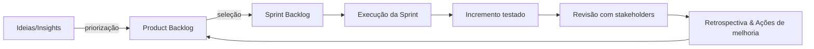
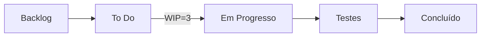

# Material de Estudo Avançado: Metodologias Ágeis, Práticas de Engenharia e Design Estratégico

## 1. A Grande Categorização (O Diferencial)

A principal fonte de confusão no estudo de métodos ágeis para concursos públicos e para a prática profissional é a tendência de tratar todos os termos — Scrum, Kanban, XP, TDD, DDD — como se fossem "metodologias" intercambiáveis e concorrentes. Essa visão é imprecisa e prejudica a compreensão de como essas ferramentas se complementam. Para construir um conhecimento sólido e diferenciado, é crucial abandonar essa ideia e adotar um modelo mental baseado em camadas de responsabilidade.

> [!info] Conceito-Chave
> 
> O termo "Metodologia Ágil" é um grande guarda-chuva. Para fins de concurso e clareza conceitual, é fundamental dissecar este universo em três camadas distintas que resolvem problemas diferentes: a gestão do trabalho, a qualidade da construção e a modelagem do negócio. Scrum, XP e DDD não são concorrentes; são ferramentas para desafios distintos, operando em diferentes níveis de abstração. Uma equipe de alta performance não escolhe um em detrimento do outro; ela compõe sua forma de trabalhar selecionando as ferramentas adequadas de cada camada.

### 1.1. Frameworks de Gestão de Fluxo/Projeto

Esta categoria responde à pergunta fundamental: **"Como organizamos, gerenciamos e damos visibilidade ao trabalho da equipe?"**. O foco aqui é o processo, o fluxo de valor, a colaboração e a entrega. Estes frameworks são, em grande parte, agnósticos sobre as práticas técnicas de engenharia utilizadas para construir o software. Eles são o "invólucro" do processo.

- **Conceitos:** **Scrum**, **Kanban**.
    
- **Análise:** O **Scrum** aborda a gestão do trabalho através de um processo empírico, baseado em iterações de tempo fixo chamadas Sprints. Seu objetivo é criar um ritmo sustentável que permita inspeção e adaptação frequentes tanto do produto quanto do processo. Por outro lado, o **Kanban** foca na otimização de um fluxo contínuo de trabalho. Sua filosofia é visualizar o trabalho, limitar o trabalho em progresso (Work in Progress - WIP) para evitar gargalos e maximizar a eficiência da entrega. Eles são duas respostas diferentes para o mesmo problema de gestão.
    

### 1.2. Práticas/Frameworks de Engenharia de Software

Esta categoria responde a uma pergunta diferente e mais técnica: **"Como construímos o software com excelência técnica, qualidade intrínseca e manutenibilidade?"**. O foco aqui não é a gestão de um backlog, mas o artesanato do desenvolvimento de software. São disciplinas e práticas que garantem que o código produzido seja robusto, limpo e fácil de evoluir.

- **Conceitos:** **Extreme Programming (XP)**, **Test-Driven Development (TDD)**, **Behavior-Driven Development (BDD)**.
    
- **Análise:** O **XP** é um framework abrangente de práticas de engenharia que promove valores como comunicação, simplicidade e feedback para atingir alta qualidade. Práticas como Pair Programming e Integração Contínua são pilares do XP. O **TDD** é uma disciplina específica, frequentemente parte do XP, onde os testes de unidade são escritos _antes_ do código de produção, guiando o design do software em um nível micro. O **BDD** é uma evolução do TDD que eleva o foco do nível do código para o nível do comportamento do sistema, utilizando uma linguagem natural para criar especificações executáveis que podem ser entendidas por toda a equipe, incluindo stakeholders de negócio.
    

### 1.3. Abordagem de Design Estratégico

Esta categoria opera em um nível de abstração ainda mais alto, respondendo à pergunta: **"Como modelamos sistemas complexos para que eles reflitam fielmente a realidade e as regras do negócio?"**. O foco aqui é a integridade conceitual do software e seu alinhamento com o domínio do problema.

- **Conceito:** **Domain-Driven Design (DDD)**.
    
- **Análise:** O DDD não se preocupa com a gestão de Sprints ou com o ciclo "Red-Green-Refactor". Ele é uma abordagem para lidar com a complexidade inerente a domínios de negócio sofisticados. O DDD promove uma colaboração intensa entre especialistas técnicos e especialistas do domínio de negócio para criar um modelo rico e profundo do problema. Esse modelo, então, serve como a espinha dorsal da arquitetura do software, garantindo que a solução técnica esteja intrinsecamente ligada à estratégia de negócio.
    

A separação nessas três categorias revela que a maturidade de uma equipe ágil não está em "fazer Scrum" perfeitamente, mas em sua capacidade de combinar, de forma consciente, elementos de cada camada para responder aos desafios específicos de seu contexto.

## 2. Comparativo #1: Os Frameworks de Gestão (Scrum vs. Kanban)

Scrum e Kanban são as duas abordagens mais proeminentes para a gestão de trabalho em equipes ágeis. Embora ambos visem a melhoria do processo e a entrega de valor, suas filosofias, mecanismos e contextos de aplicação são fundamentalmente diferentes. A escolha entre eles não é uma questão de superioridade, mas de adequação ao tipo de demanda e à natureza do trabalho.

> [!tip] Dica de Prova
> 
> O Cebraspe adora criar itens que atribuem características de um framework ao outro. Memorize a tabela abaixo, focando nas diferenças filosóficas: empirismo em ciclos (Scrum) versus otimização de fluxo contínuo (Kanban). Um item que afirma que "Kanban utiliza Sprints" ou que "Scrum foca em limitar o WIP por coluna" estará invariavelmente errado.

| **Eixo de Comparação**  | **Scrum**                                                                                                                                                                                                              | **Kanban**                                                                                                                                                                                                                                                                     |
| ----------------------- | ---------------------------------------------------------------------------------------------------------------------------------------------------------------------------------------------------------------------- | ------------------------------------------------------------------------------------------------------------------------------------------------------------------------------------------------------------------------------------------------------------------------------ |
| **Filosofia Central**   | **Empirismo e Iteração.** Baseado em ciclos curtos e fixos (Sprints) para inspecionar e adaptar o produto e o processo. O objetivo é aprender e ajustar em cadências regulares.1                                       | **Fluxo Contínuo e Kaizen (Melhoria Contínua).** Focado em visualizar o fluxo de trabalho, limitar o trabalho em progresso (WIP) e otimizar o fluxo de ponta a ponta. A melhoria é contínua e incremental.1                                                                    |
| **Cadência**            | **Time-boxed Sprints.** O trabalho é organizado em iterações de duração fixa (ex: 1 a 4 semanas). O escopo do Sprint é "travado" no início para promover foco.                                                         | **Fluxo Contínuo.** Não há iterações prescritivas. Itens de trabalho são "puxados" para o fluxo assim que há capacidade disponível. A entrega é contínua e desacoplada de um cronograma fixo.                                                                                  |
| **Papéis**              | **Prescritivo.** Três papéis formais e bem definidos: **Product Owner** (responsável pelo "o quê"), **Scrum Master** (responsável pelo processo), e **Developers** (responsáveis pelo "como").1                        | **Não prescritivo.** Não define papéis. Recomenda começar com os papéis e responsabilidades existentes e evoluí-los organicamente conforme as necessidades do fluxo de trabalho se tornam aparentes.                                                                           |
| **Métricas Principais** | **Velocity (Velocidade).** Mede a quantidade de trabalho (geralmente em Story Points) que a equipe conclui por Sprint. É uma métrica de capacidade usada para planejamento e previsão de _lotes_ de trabalho futuros.1 | **Lead Time e Cycle Time.** **Lead Time:** tempo total desde a solicitação do cliente até a entrega final. **Cycle Time:** tempo total de trabalho ativo no item (desde o início do trabalho até a conclusão). Focam na previsibilidade e eficiência de _itens individuais_.14 |
| **Quando usar**         | Projetos complexos com escopo a ser descoberto, onde a entrega em incrementos regulares agrega valor e permite feedback constante. Ideal para o desenvolvimento de novos produtos ou funcionalidades significativas.17 | Ambientes com demanda contínua e variação de prioridades, como equipes de suporte, manutenção, operações (DevOps) ou serviços. Onde o foco é a eficiência, a previsibilidade do fluxo e a rápida resposta a novas demandas.17                                                  |

A distinção entre as métricas é particularmente importante. A **Velocity** do Scrum ajuda a responder "quanto trabalho conseguimos fazer no próximo Sprint?". Já o **Lead Time** do Kanban ajuda a responder "dado que iniciamos este item agora, quando ele provavelmente estará pronto?". São perguntas que atendem a lógicas de planejamento distintas: planejamento de capacidade de lote (Scrum) versus planejamento de entrega de item individual (Kanban). O **Cycle Time** é um subconjunto do Lead Time e é crucial para a equipe identificar gargalos internos, pois mede apenas o tempo em que um item está sendo ativamente trabalhado, excluindo o tempo de espera em filas.16

## 3. Comparativo #2: As Práticas de Engenharia (XP, TDD, BDD)

Enquanto Scrum e Kanban organizam o trabalho, as práticas de engenharia definem como esse trabalho é executado com qualidade técnica. Ignorar esta camada é uma receita para o acúmulo de débito técnico, mesmo que as cerimônias ágeis estejam sendo seguidas à risca.

### 3.1. XP (Extreme Programming): O Framework da Excelência em Engenharia

O Extreme Programming não é um concorrente do Scrum, mas sim um poderoso complemento. É um conjunto de práticas de engenharia de software projetado para produzir software de alta qualidade e, ao mesmo tempo, ser capaz de responder a requisitos em constante mudança. O XP é fundamentado em cinco valores essenciais: **Comunicação, Simplicidade, Feedback, Coragem e Respeito**.5 Esses valores se manifestam em um conjunto de práticas interconectadas.

As principais práticas do XP incluem:

- **Pair Programming (Programação em Par):** Todo o código de produção é escrito por dois desenvolvedores em uma única máquina. Isso promove a revisão contínua do código, o compartilhamento de conhecimento e a resolução mais rápida de problemas complexos.6
    
- **Continuous Integration (CI - Integração Contínua):** Os desenvolvedores integram seu trabalho ao repositório principal várias vezes ao dia. Cada integração é verificada por uma construção automatizada (incluindo testes), o que permite detectar erros de integração rapidamente.19
    
- **Simple Design (Design Simples):** A equipe se esforça para criar o design mais simples possível que atenda aos requisitos atuais, evitando a superengenharia e a complexidade desnecessária. A pergunta norteadora é: "Qual a coisa mais simples que poderia funcionar?".5
    
- **Test-Driven Development (TDD):** Os testes automatizados são escritos antes do código de produção. Essa prática não apenas garante a cobertura de testes, mas também guia o design do código de forma incremental.4
    
- **Refactoring (Refatoração):** É a prática de melhorar a estrutura interna do código existente sem alterar seu comportamento externo. A refatoração contínua mantém o código limpo e fácil de manter ao longo do tempo.19
    

### 3.2. A Evolução dos Testes: TDD vs. BDD

Dentro do universo da engenharia de software, TDD e BDD representam uma evolução na forma como os testes são utilizados para guiar o desenvolvimento.

#### TDD (Test-Driven Development): A Disciplina do Desenvolvedor

O TDD é uma prática de design de software focada no **desenvolvedor** e na **unidade de código**.7 Seu fluxo de trabalho é conhecido como o ciclo **"Red-Green-Refactor"** 8:

1. **Red (Vermelho):** O desenvolvedor escreve um teste de unidade automatizado para uma nova funcionalidade. Como a funcionalidade ainda não existe, o teste, ao ser executado, deve falhar.
    
2. **Green (Verde):** O desenvolvedor escreve a quantidade mínima de código de produção necessária para que o teste passe. O objetivo nesta fase não é a elegância, mas a funcionalidade.
    
3. **Refactor (Refatorar):** Com a segurança de um teste que passa, o desenvolvedor melhora o design tanto do código de produção quanto do código de teste, eliminando duplicação e melhorando a clareza, sem alterar o comportamento.
    

O principal benefício do TDD não é apenas a suíte de testes que ele produz, mas o fato de que ele força um design de código mais simples, modular e com baixo acoplamento.

#### BDD (Behavior-Driven Development): A Linguagem do Negócio

O BDD pode ser entendido como uma evolução e uma extensão do TDD.9 Ele pega os princípios do "test-first" do TDD, mas eleva o nível de abstração. Em vez de focar em unidades de código (métodos, classes), o BDD foca no **comportamento do sistema** do ponto de vista do **usuário** ou do **negócio**.9

A principal inovação do BDD é o uso de uma linguagem estruturada e natural, como o Gherkin, para descrever o comportamento esperado. Essa linguagem utiliza a sintaxe `Given-When-Then` (Dado-Quando-Então) 10:

- **`Given` (Dado):** Descreve o contexto ou o estado inicial do sistema.
    
- **`When` (Quando):** Descreve a ação ou o evento que é executado pelo usuário.
    
- **`Then` (Então):** Descreve o resultado ou o estado final esperado.
    

Essas descrições, chamadas de cenários, formam **"especificações executáveis"**. Elas servem a um duplo propósito: são especificações claras e inequívocas que alinham desenvolvedores, testadores e stakeholders de negócio, e também podem ser automatizadas para verificar se o sistema se comporta conforme o especificado.

No contexto de uma organização pública como a Câmara dos Deputados, o BDD transcende a engenharia de software e se torna uma ferramenta de governança. Os cenários BDD, escritos em português claro, funcionam como uma documentação viva e auditável das regras de negócio implementadas. Eles fornecem um registro permanente e verificável de como o sistema atende aos requisitos legais e regimentais, oferecendo um nível de transparência e rastreabilidade que é inestimável para a prestação de contas a órgãos de controle.

## 4. A Abordagem Estratégica: O que é DDD?

O Domain-Driven Design (DDD) está em uma categoria própria. Não é um método de gestão de projetos nem um conjunto de práticas de codificação, mas sim uma abordagem abrangente para o design de software em ambientes de alta complexidade de negócio.11 Seu objetivo principal é alinhar o design do software com o modelo de negócio, criando uma representação rica e precisa do domínio no código.

> [!warning] Ponto de Atenção Cebraspe
> 
> DDD não é uma 'metodologia ágil' no mesmo sentido que Scrum. É uma abordagem de design de software. Uma questão que afirme 'DDD é um framework ágil para gestão de projetos' estaria ERRADA. O DDD pode e deve ser usado em conjunto com frameworks ágeis para guiar o desenvolvimento de soluções complexas.

O DDD é dividido em dois conjuntos de padrões: o estratégico e o tático.

### 4.1. Os Dois Pilares do DDD

#### Design Estratégico (O "Macro"): Mapeando o Terreno do Negócio

O Design Estratégico lida com a visão de alto nível do sistema e do domínio. Seu objetivo é decompor um domínio de negócio grande e complexo em partes menores e mais gerenciáveis, estabelecendo limites claros entre elas.11

- **Linguagem Ubíqua (Ubiquitous Language):** Este é talvez o conceito mais fundamental do DDD. Trata-se da criação de um vocabulário comum, rigoroso e compartilhado entre desenvolvedores, especialistas de domínio, e todos os envolvidos no projeto. Essa linguagem é usada nas conversas, nos diagramas, na documentação e, crucialmente, no próprio código (nomes de classes, métodos, variáveis). A Linguagem Ubíqua elimina ambiguidades e garante que o software seja uma expressão fiel do modelo de negócio.11
    
- **Contextos Delimitados (Bounded Contexts):** São as fronteiras explícitas dentro das quais um modelo de domínio específico e sua Linguagem Ubíqua se aplicam. Por exemplo, o termo "Cliente" pode ter significados e atributos diferentes no contexto de "Vendas" e no contexto de "Suporte Técnico". O Bounded Context estabelece essa fronteira, permitindo que cada modelo evolua de forma independente e coesa. Em arquiteturas modernas, como microservices, cada Bounded Context é um forte candidato a se tornar um ou mais microservices.23
    

#### Design Tático (O "Micro"): Construindo o Modelo no Código

Enquanto o Design Estratégico mapeia o terreno, o Design Tático fornece os blocos de construção para implementar o modelo de domínio _dentro de um único Bounded Context_.13

- **Entidades (Entities):** São objetos que possuem uma identidade única que persiste ao longo do tempo e através de diferentes estados. A identidade é o que os define, não seus atributos. Por exemplo, um Deputado é uma Entidade; mesmo que seu partido ou estado mude, ele continua sendo a mesma pessoa.23
    
- **Objetos de Valor (Value Objects):** São objetos definidos por seus atributos, sem uma identidade conceitual. Dois Objetos de Valor com os mesmos atributos são considerados iguais. Eles são imutáveis. Por exemplo, um endereço ou um valor monetário são Objetos de Valor.23
    
- **Agregados (Aggregates):** Um Agregado é um cluster de Entidades e Objetos de Valor associados que é tratado como uma única unidade para fins de consistência de dados. Ele possui uma "raiz" (Aggregate Root), que é uma Entidade específica dentro do agregado. A raiz é o único ponto de entrada para qualquer modificação no agregado, garantindo que todas as regras de negócio e invariantes sejam aplicadas de forma consistente.23
    
- **Repositórios (Repositories):** São mecanismos para encapsular a lógica de armazenamento e recuperação de Agregados, fornecendo a ilusão de uma coleção de objetos na memória. Eles separam o modelo de domínio das preocupações com a infraestrutura de persistência.
    

## 5. A Grande Síntese: "Como Tudo Isso se Encaixa?"

A verdadeira maestria sobre esses conceitos reside em entender como eles se integram harmoniosamente para criar um processo de desenvolvimento robusto, adaptável e alinhado ao negócio. A seguir, um cenário prático ilustra essa sinergia.

> [!tip] Cenário de Integração
> 
> Imagine uma nova equipe na Câmara dos Deputados encarregada de desenvolver o "Sistema de Gestão de Emendas Parlamentares", um domínio notoriamente complexo com regras intrincadas e stakeholders diversos.
> 
> 1. **A Estratégia (DDD):** Antes de escrever uma única linha de código, a equipe se reúne com consultores legislativos e analistas de orçamento (os _domain experts_). Juntos, eles aplicam o **Design Estratégico do DDD** para mapear o domínio. Eles identificam diferentes **Bounded Contexts**, como 'Submissão de Emenda', 'Análise de Admissibilidade Técnica' e 'Alocação Orçamentária'. Eles também colaboram para construir uma **Linguagem Ubíqua** rigorosa, garantindo que termos como "emenda impositiva", "relator setorial" ou "impedimento de ordem técnica" tenham significados precisos e compartilhados por todos.
>     
> 2. **A Gestão (Scrum):** Para organizar o trabalho de desenvolvimento, a equipe adota o **Scrum**. Eles criam um Product Backlog com Épicos e Estórias de Usuário que são escritas usando a Linguagem Ubíqua. O trabalho é planejado em **Sprints** de duas semanas, com a realização de todas as cerimônias (Planning, Daily Scrum, Sprint Review, Sprint Retrospective) para garantir transparência, inspeção e adaptação.
>     
> 3. **A Construção (XP, TDD, BDD):** Dentro de cada Sprint, a equipe aplica as práticas de engenharia do **XP** para construir o incremento do produto.
>     
>     - Para uma Estória de Usuário crítica como "Calcular o impacto orçamentário de uma emenda de bancada", o Product Owner, um consultor e os desenvolvedores colaboram para escrever cenários em **BDD**: `Dado que a emenda é do tipo 'Bancada Estadual' e o estado é 'SP', Quando o valor de R$ 1.000.000 for submetido, Então o sistema deve validar contra o limite orçamentário da bancada de 'SP'`. Isso garante que a regra de negócio seja perfeitamente compreendida antes da implementação.
>         
>     - Os desenvolvedores trabalham em pares (**Pair Programming**) e usam **TDD** para implementar a lógica de cálculo. Eles escrevem um teste de unidade para uma pequena parte da regra que falha (Red), depois o código para fazê-lo passar (Green), e então refatoram para melhorar o design (Refactor).
>         
>     - Todo o código é integrado continuamente ao repositório principal (**Continuous Integration**), e a suíte de testes automatizados (TDD e BDD) é executada a cada integração para garantir que o sistema esteja sempre funcional.
>         
> 4. **A Arquitetura (DDD):** O código que implementa a lógica de negócio é estruturado usando os padrões do **Design Tático do DDD**. A 'Emenda' é modelada como uma **Entidade** e é a raiz de um **Agregado** que inclui seus 'Autores' e 'Itens de Despesa', garantindo a consistência transacional do conjunto. O 'Valor Monetário' da emenda é um **Objeto de Valor** imutável.
>     
> 
> Neste cenário, os frameworks e práticas não competem. Eles se complementam em camadas: **DDD** para o design da solução, **Scrum** para a gestão do processo, e **XP/TDD/BDD** para a qualidade da execução técnica.

## 6. Questões Comentadas (Estilo Cebraspe-Confusão)

Para consolidar o conhecimento, seguem cinco itens no estilo Cebraspe, projetados para explorar as confusões conceituais mais comuns entre os tópicos abordados.

Item 1:

(CESPE/CEBRASPE - Adaptada) O Kanban, por ser um método de fluxo contínuo, não prescreve papéis definidos e utiliza métricas como Lead Time e Cycle Time para otimizar a entrega. No entanto, assim como o Scrum, ele organiza o trabalho em iterações de tempo fixo, conhecidas como Sprints, para garantir uma cadência previsível.

Item 2:

(CESPE/CEBRASPE - Adaptada) O Test-Driven Development (TDD) é considerado uma evolução do Behavior-Driven Development (BDD), pois foca em testes de unidade escritos por desenvolvedores, enquanto o BDD se concentra em uma linguagem de negócio mais abstrata e de alto nível.

Item 3:

(CESPE/CEBRASPE - Adaptada) Uma equipe de desenvolvimento pode adotar o Scrum como seu framework de gestão de projetos e, simultaneamente, utilizar práticas de engenharia do Extreme Programming (XP), como Pair Programming e Integração Contínua, para a construção do incremento do produto a cada Sprint.

Item 4:

(CESPE/CEBRASPE - Adaptada) No Domain-Driven Design (DDD), o Design Tático, que envolve a definição de Entidades e Agregados, deve preceder o Design Estratégico, pois a definição concreta dos objetos de código é necessária para se compreender os limites dos Contextos Delimitados.

Item 5:

(CESPE/CEBRASPE - Adaptada) A métrica Velocity, amplamente utilizada em equipes que adotam o Kanban, serve para medir o tempo médio que um item de trabalho leva para atravessar todo o fluxo, desde a sua solicitação até a entrega final.

---

### Gabarito Comentado

**Item 1: ERRADO.**

- **Comentário:** O item descreve corretamente várias características do Kanban (fluxo contínuo, ausência de papéis prescritos, métricas de Lead Time e Cycle Time). No entanto, a afirmação de que o Kanban organiza o trabalho em Sprints é fundamentalmente incorreta. Sprints, ou iterações de tempo fixo, são a característica central da cadência do Scrum. A essência do Kanban é a ausência de time-boxes prescritivos, operando em um fluxo contínuo onde o trabalho é puxado conforme a capacidade permite. A mistura dessas características invalida a asserção.
    

**Item 2: ERRADO.**

- **Comentário:** A relação de evolução está invertida. O BDD é uma evolução do TDD, e não o contrário. O TDD foi pioneiro no ciclo "test-first" com foco no desenvolvedor e no design do código em nível de unidade (nível micro). O BDD expandiu essa ideia para o nível do comportamento do sistema, incorporando uma linguagem colaborativa (como Gherkin) para envolver stakeholders de negócio. Portanto, o BDD representa uma abstração de mais alto nível que se baseia nos princípios estabelecidos pelo TDD.
    

**Item 3: CERTO.**

- **Comentário:** O item descreve perfeitamente a complementaridade entre os frameworks de gestão (Categoria 1) e as práticas de engenharia (Categoria 2). O Scrum organiza o "o quê" e o "quando" do trabalho, enquanto o XP fornece as práticas técnicas para o "como", garantindo a qualidade da construção. É uma prática comum e altamente recomendada que equipes Scrum adotem práticas do XP, como Pair Programming, TDD e Integração Contínua, para garantir a qualidade técnica do software que entregam ao final de cada Sprint.
    

**Item 4: ERRADO.**

- **Comentário:** A ordem está invertida. No DDD, o Design Estratégico (o "macro") deve preceder o Design Tático (o "micro"). É fundamental primeiro entender e mapear o domínio de negócio em alto nível — definindo a Linguagem Ubíqua e os Contextos Delimitados — para somente depois detalhar a implementação do modelo dentro de cada contexto com Entidades, Agregados, etc. Começar pelo tático sem uma estratégia clara levaria a um design de código desconectado da realidade do negócio e a uma arquitetura fragmentada.
    

**Item 5: ERRADO.**

- **Comentário:** O item comete dois erros conceituais graves. Primeiro, atribui a métrica Velocity ao Kanban, quando ela é uma métrica característica do Scrum. Segundo, descreve a função do Lead Time (tempo total do pedido à entrega) e a atribui incorretamente à Velocity. A Velocity, no Scrum, mede a _quantidade_ de trabalho (em Story Points, por exemplo) que a equipe consegue entregar em um Sprint, e é usada para previsão de capacidade. A métrica que mede o tempo de fluxo de um item individual é o Lead Time, esta sim, fundamental no Kanban.
# Cultura Ágil — visão geral

> [!summary]  
> **Cultura Ágil** é o conjunto de valores, princípios, estruturas organizacionais e práticas que priorizam **entrega contínua de valor**, **feedback rápido**, **adaptação a mudanças** e **aprendizado organizacional**.

- **Por quê?** Reduzir tempo de ciclo, elevar qualidade e **maximizar valor** entregue ao cidadão/cliente.
    
- **Como?** Equipes **multidisciplinares**, fluxo **visual**, cadências curtas, **autonomia com alinhamento** (OKRs/Roadmaps), **DevOps/Automação**, decisões baseadas em **dados**.
    
- **Para quem?** Funciona em **produto digital**, **serviços internos**, e também no **setor público**, com atenção a **governança, transparência e conformidade**.
    

---

## 1) Fundamentos

### 1.1 Valores do Manifesto Ágil

- **Indivíduos e interações** > processos e ferramentas
    
- **Software/serviço funcionando** > documentação abrangente
    
- **Colaboração com o cliente** > negociação de contratos
    
- **Responder a mudanças** > seguir um plano
    

> [!note]  
> “>” não significa “apagar” o item à direita, e sim **preferir o da esquerda** quando houver trade-off.

### 1.2 Os 12 Princípios (síntese prática)

- Satisfação do cliente com **entregas contínuas** e **precoces**
    
- **Mudanças são bem-vindas**, mesmo tardiamente
    
- Entrega frequente (semanas, não meses)
    
- **Negócio + TI** juntos diariamente
    
- **Times motivados** e confiáveis
    
- Comunicação **face a face** (ou síncrona equivalente)
    
- **Software/serviço funcionando** é a medida primária
    
- **Ritmo sustentável**
    
- **Excelência técnica** e bom design
    
- **Simplicidade** (maximizar o trabalho não feito)
    
- **Autonomia** para times (auto-organização)
    
- **Inspeção e adaptação** contínuas (retrospectivas)
    

### 1.3 Lean Thinking (base da agilidade)

- **Valor** (do ponto de vista do usuário/cidadão)
    
- **Fluxo** (remover gargalos)
    
- **Puxar** (trabalhar conforme capacidade/WIP)
    
- **Perfeição** (kaizen: melhoria contínua)
    
- **Eliminar desperdícios** (espera, retrabalho, excesso de handoffs, WIP alto, etc.)
    

---

## 2) Cinco fatores para desenvolver a cultura ágil (Silva, 2021)

> [!tip] **Memorize a sigla: VEeBR**  
> **V**isão · **E**strutura · **E**quipes ágeis · **B**ackbone · **R**oadmap

1. **Visão** — propósito, outcomes e critérios de sucesso (ex.: OKRs)
    
2. **Estrutura** — times pequenos, orientados a produto/valor, autonomia com guard-rails
    
3. **Equipes ágeis** — multifuncionais, T-shaped, foco em cliente, dados e experimentação
    
4. **Backbone** — práticas/processos/tecnologia que sustentam (CI/CD, padrões, métricas, design system, segurança, privacidade, acessibilidade)
    
5. **Roadmap** — evolução **orientada a valor**, com hipóteses, releases e **balanceamento de horizontes (H1, H2, H3)**
    

---

## 3) Pensamento sistêmico (Senge) aplicado à agilidade

- Organizações como **sistemas interconectados**, não “silos”.
    
- **Alavancas sistêmicas**: políticas, incentivos, fluxo, tecnologia, capacidade.
    
- **Atrasos e efeitos colaterais**: medir e rever políticas para evitar otimizações locais que **pioram o todo**.
    
- Aprendizado em ciclos (**dupla alça**): ajustar **ações** e **pressupostos**.
    

---

## 4) Estruturas, papéis e rituais

### 4.1 Scrum (exemplo de framework)

- **Papéis**: Product Owner (valor), Scrum Master (fluxo/impedimentos), Time de Desenvolvimento (entrega)
    
- **Eventos**: Planejamento da Sprint, Daily, Revisão, Retrospectiva
    
- **Artefatos**: Product Backlog, Sprint Backlog, Incremento
    
- **Definições**: **DoR** (Definition of Ready), **DoD** (Definition of Done)
    



### 4.2 Kanban (gestão visual do fluxo)

- Quadro **To Do / Doing / Done** (ou etapas do seu processo)
    
- **Limites de WIP** por coluna/etapa
    
- Métricas de **lead time, cycle time, throughput**
    
- **Cadências**: Replenishment, Delivery Planning, Retro de Serviço, Operações
    



### 4.3 Outras abordagens

- **XP** (TDD, refatoração, integração contínua, pair programming)
    
- **DevOps** (CI/CD, observabilidade, feature flags, SRE/SLIs/SLOs)
    
- **Design Thinking/Discovery** (descoberta de problema/valor antes da entrega)
    

---

## 5) Backlog & descoberta de valor

- **User stories**: “Como [persona], quero [necessidade], para [valor]”.
    
- **INVEST** (Independente, Negociável, Valiosa, Estimável, Pequena, Testável).
    
- **Critérios de aceitação** claros; **DoR/DoD** visíveis.
    
- **Discovery contínuo**: entrevistas, protótipos, testes A/B, analytics, mapa de jornada.
    
- **Priorização**: valor vs. esforço/risco; **WSJF** (quando aplicável).
    
- **Roadmap**: outcomes (não só features), hipóteses, métricas de impacto.
    

---

## 6) Métricas que importam

> [!warning] Evite “vanity metrics”  
> Ex.: apenas contar “quantidade de requisitos/linhas de código” não indica **valor**.

- **Lead time** (ideia → produção)
    
- **Cycle time** (início → fim da execução)
    
- **Throughput** (# itens concluídos/tempo)
    
- **WIP** (itens em progresso)
    
- **Confiabilidade de entrega** (percentil de lead/cycle time)
    
- **Qualidade**: taxa de defeitos, retrabalho, MTTR, disponibilidade (SLOs)
    
- **Valor/Impacto**: adoção, NPS do serviço, taxa de sucesso de tarefa, indicadores de política pública/negócio
    

> [!tip]  
> **CFD (Cumulative Flow Diagram)** evidencia gargalos. Burndown/ Burnup apoiam acompanhamento de Sprints/Lotes.

---

## 7) Estratégia & Portfólio (H1/H2/H3 + OKRs)

- **Horizonte 1**: eficiência e otimização do core (fazer mais com menos).
    
- **Horizonte 2**: extensões adjacentes, validação de novos modelos.
    
- **Horizonte 3**: exploração/disrupção (apostas de longo prazo).
    
- **OKRs**: alinham **outcomes**; evitam micromanagement de tasks.
    
- **Lean Portfolio**: limites de WIP no portfólio, políticas explícitas, governança leve e transparente.
    

---

## 8) Adoção no setor público (governança & conformidade)

> [!note]  
> **Ágil ≠ ausência de documentação.** É documentação **útil, enxuta e viva**, proporcional ao risco.

- **Transparência e rastreabilidade**: decisões, critérios, backlog, mudanças.
    
- **Contratações**: foco em **produtos/serviços** e **resultados**, não apenas “escopo fechado de atividades”.
    
- **Risco & compliance**: separar **controle de qualidade** (DoD, testes, segurança) de **burocracia**.
    
- **Acessibilidade, LGPD, segurança**: incluídas no **Backbone** e no **DoD**.
    
- **Medição de valor público**: métricas de atendimento, tempo de resposta ao cidadão, acessibilidade e inclusão.
    
- **Documentos vivos**: TR, Plano de Entregas, Roadmap, Matriz de Riscos, Relatórios de desempenho.
    

---

## 9) Pessoas & cultura

- **Segurança psicológica**: base para experimentação e aprendizado.
    
- **Liderança servidora**: remover impedimentos, dar contexto, **evitar comando-controle**.
    
- **T-shaped skills** e colaboração interfuncional.
    
- **Aprendizado contínuo** (comunidades de prática, guildas).
    
- **Gestão de mudanças**: ADKAR/Kotter, comunicação clara, “quick wins”.
    

---

## 10) Práticas essenciais (checklists)

### 10.1 Definition of Ready (DoR)

-  Objetivo claro e valor esperado
    
-  Critérios de aceitação definidos
    
-  Dependências mapeadas
    
-  Tamanho adequado (caber em 1 sprint/fluxo)
    
-  Riscos conhecidos e mitigação inicial
    

### 10.2 Definition of Done (DoD)

-  Código revisado/testado (unit/integr./segurança/acessibilidade)
    
-  Documentação mínima atualizada (usuário/operacional)
    
-  Observabilidade (logs/metrics/traces)
    
-  Homologado com stakeholders quando aplicável
    
-  Implantado/Disponibilizado (ou pronto para)
    

---

## 11) Anti-padrões comuns (e como evitar)

- **Scrum “zumbi”** (só cerimônias, sem valor) → medir outcomes e lead time.
    
- **WIP infinito** → limitar WIP, políticas explícitas, foco.
    
- **Micromanagement** → OKRs e acordos de autonomia.
    
- **Backlog inflado sem priorização** → higiene regular, “kill list”.
    
- **Velocidade como meta** → use para **previsão**, não como KPI de cobrança.
    
- **Arquitetura rígida** → **evolutiva**, padrões e automação (Backbone).
    

---

## 12) Roteiro de implementação (passo a passo)

1. **Diagnóstico** (fluxo atual, gargalos, riscos, métricas de base)
    
2. **Visão & Outcomes** (OKRs)
    
3. **Estrutura** (times por valor; guard-rails)
    
4. **Backbone** (CI/CD, padrão de logs, SLOs, design system, segurança)
    
5. **Piloto** (1 time, 90 dias, metas claras)
    
6. **Escala com cautela** (comunidades de prática, coachs internos)
    
7. **Governança leve** (políticas explícitas, transparência)
    
8. **Kaizen** (retros cadenciadas + analytics do fluxo)
    

---

## 13) Artefatos úteis para a sua vault

- **Template de User Story**
    
    ```
    Como [persona],
    quero [necessidade],
    para [valor].
    Critérios de aceitação:
    - ...
    - ...
    ```
    
- **Template de OKR**
    
    ```
    Objetivo: [outcome ambicioso e claro]
    KR1: [métrica de resultado]
    KR2: [métrica de resultado]
    Iniciativas (hipóteses):
    - ...
    ```
    
- **Política de WIP (exemplo)**
    
    - Doing: máx. 3 itens por time
        
    - QA: máx. 2 itens
        
    - Bloqueado: **0** tolerância (>24h exige ação do líder)
        

---

## 14) Perguntas de checagem (active recall)

> [!question]
> 
> 1. Qual a diferença entre **valor** e **entrega**?
>     
> 2. Como **DoR/DoD** reduzem retrabalho?
>     
> 3. Cite **três métricas de fluxo** e para que servem.
>     
> 4. Como equilibrar o portfólio entre **H1/H2/H3**?
>     
> 5. Quais são os **cinco fatores** (Silva, 2021) e um exemplo prático de cada?
>     

---

## 15) Glossário rápido

- **Backlog**: lista priorizada de itens de valor.
    
- **Lead/Cycle time**: tempo ponta-a-ponta / tempo de execução.
    
- **WIP**: trabalho em progresso.
    
- **DoR/DoD**: pronto para começar / pronto de verdade.
    
- **OKR**: objetivo + resultados-chave.
    
- **WSJF**: priorização por custo de atraso vs. duração.
    
- **SLO/SLI**: objetivo e indicador de nível de serviço.
    

---

> [!info] Próximos passos sugeridos
> 
> 1. Definir **OKRs trimestrais** alinhados à visão.
>     
> 2. Mapear o **fluxo atual** e estabelecer **limites de WIP**.
>     
> 3. Criar/ajustar **Backbone** mínimo (CI/CD, DoD, observabilidade, acessibilidade).
>     
> 4. Rodar um **piloto** com métricas de base (lead/cycle/defeitos/impacto).
>     
> 5. Instituir **cadências** (reviews abertas, retros, governança de portfólio leve).
>     

