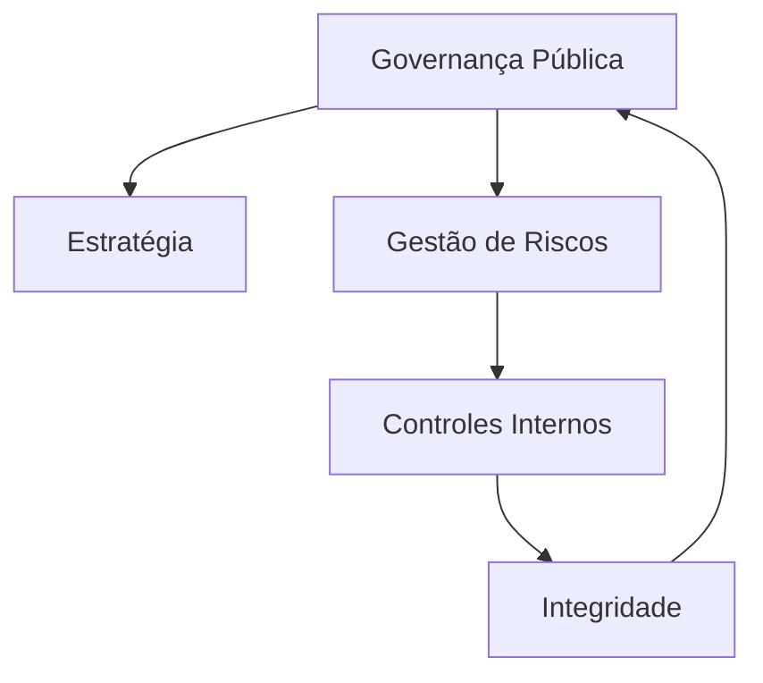

# Decreto 9.203/2017 – Governança, Riscos, Controles e Integridade (GRC-I)

## 1. Conceito central de Governança Pública (art. 2º)

O Decreto 9.203/2017 define **governança pública** como o **conjunto de mecanismos de liderança, estratégia e controle** usados para **avaliar, direcionar e monitorar a gestão**, com vistas à **condução de políticas públicas** e à **prestação de serviços de interesse da sociedade**. 

> [!info] Conceito-chave  
> **Governança ≠ gestão.**  
> _Gestão_ é o dia a dia: executar orçamento, tocar projetos, gerir pessoas.  
> _Governança_ fica “acima” disso: define para onde ir (estratégia), como deve ser feito (diretrizes) e acompanha se a gestão está entregando (monitoramento e controle).

Esse conceito foi fortemente inspirado no **Referencial de Governança do TCU**, que fala exatamente em mecanismos de **liderança, estratégia e controle**, incorporado pelo Decreto como conceito oficial da União. 

- **Liderança** – pessoas em cargos estratégicos (alta administração) que dão direção, exemplo ético e prioridade ao tema.
    
- **Estratégia** – objetivos, metas, planos e prioridades (PPA, planos setoriais, planos estratégicos internos).
    
- **Controle** – sistemas de controles internos, auditoria interna, monitoramento de riscos e resultados. 
    

---

## 2. Princípios x Diretrizes – a pegadinha clássica

### 2.1. O mapa mental

- **Princípios (art. 3º)** – são os **valores** da governança pública: o _“porquê”_ e o _“para quê”_ a governança existe.
    
- **Diretrizes (art. 4º)** – são orientações práticas sobre **como** a governança deve ser desenhada e implementada: o _“como fazer”_. 
    

Os **princípios da governança pública** no art. 3º são:

- **Capacidade de resposta**
    
- **Integridade**
    
- **Confiabilidade**
    
- **Melhoria regulatória**
    
- **Prestação de contas e responsabilidade**
    
- **Transparência** 
    

As **diretrizes da governança pública** no art. 4º são 11, mas podem ser agrupadas em blocos (resumidamente): 

1. **Foco em resultados e eficiência**
    
    - Direcionar ações para resultados à sociedade, com soluções tempestivas e inovadoras, mesmo com recursos limitados.
        
    - Simplificar, modernizar e integrar serviços públicos, especialmente os digitais.
        
2. **Monitoramento e avaliação**
    
    - Monitorar desempenho e avaliar concepção, implementação e resultados de políticas e ações prioritárias.
        
3. **Articulação institucional e padrões de conduta**
    
    - Articular instituições e coordenar processos entre níveis e esferas de governo.
        
    - Incorporar padrões elevados de conduta pela alta administração, para orientar o comportamento dos agentes públicos.
        
4. **Evidência, clareza institucional e transparência**
    
    - Manter decisão orientada por evidências, legalidade e qualidade regulatória.
        
    - Definir formalmente funções, competências e responsabilidades das estruturas.
        
    - Promover comunicação aberta, voluntária e transparente das atividades e resultados da organização, reforçando o acesso público à informação.
        

> [!warning] Ponto de Atenção Cebraspe
> 
> - **Jamais** confunda:
>     
>     - _“Capacidade de resposta, integridade, confiabilidade, melhoria regulatória, prestação de contas e responsabilidade, transparência”_ ⇒ **sempre princípios** (art. 3º).
>         
>     - _“Gestão de riscos, controles internos, simplificação administrativa, monitorar desempenho, comunicação aberta etc.”_ ⇒ **diretrizes ou mecanismos** (art. 4º e 5º).
>         
> - Se o item disser algo como “**gestão de riscos é princípio da governança pública**”, a tendência é ser **ERRADO**.
>     

### 2.2. Tabela comparativa (para decorar sem confundir)

|Dimensão|**Princípios (art. 3º)** – _valores / porquê_|**Diretrizes (art. 4º)** – _ações / como_|
|---|---|---|
|**Foco no cidadão**|Capacidade de resposta (responder adequadamente às demandas sociais)|Direcionar ações para busca de resultados para a sociedade; inovar mesmo com recursos escassos|
|**Ética e probidade**|Integridade, prestação de contas e responsabilidade|Incorporar padrões elevados de conduta pela alta administração; instituir programas de integridade|
|**Confiabilidade da gestão**|Confiabilidade, transparência|Monitorar desempenho, avaliar políticas, comunicar atividades e resultados de forma aberta|
|**Qualidade normativa**|Melhoria regulatória|Decisão baseada em evidências e qualidade regulatória; simplificação administrativa e modernização|
|**Organização interna**|(implícito nos valores)|Articular instituições, coordenar processos; definir funções, competências e responsabilidades|

---

## 3. A Arquitetura GRC-I: Governança, Riscos, Controles e Integridade

O Decreto amarra quatro peças que, juntas, formam um **sistema de governança GRC-I**: **Governança, Riscos, Controles Internos e Integridade**. 

### 3.1. Governança (o topo)

- Conceito do art. 2º: mecanismos de **liderança, estratégia e controle** para avaliar, direcionar e monitorar a gestão. 
    
- **Art. 5º** detalha os **mecanismos de governança**:
    
    - **Liderança** (integridade, competência, responsabilidade, motivação da alta administração)
        
    - **Estratégia** (definição de objetivos, planos, alinhamento institucional)
        
    - **Controle** (gestão de riscos, controles internos, auditoria interna e outras funções de avaliação)
        

> [!tip] Dica de Prova  
> Se aparecer “mecanismos da governança pública” no Decreto, pense em **três palavras-guia**:  
> **Liderança – Estratégia – Controle**.  
> São esses mecanismos que dão vida aos princípios e diretrizes.

### 3.2. Gestão de riscos (a “defesa”)

- A **gestão de riscos** aparece:
    
    - Como parte dos **mecanismos de governança** (art. 5º). 
        
    - E, de forma bem forte, no **art. 17**, que manda a **alta administração** estabelecer, manter, monitorar e aprimorar **sistema de gestão de riscos e controles internos**, para identificar, avaliar, tratar, monitorar e analisar criticamente riscos que possam impactar a estratégia e os objetivos da organização. 
        

Em termos práticos:

- **Risco** = qualquer evento que possa atrapalhar a entrega de valor público.
    
- O sistema de gestão de riscos deve:
    
    - Mapear riscos estratégicos, operacionais, de integridade, TI etc.
        
    - Avaliar probabilidade e impacto.
        
    - Definir respostas (aceitar, reduzir, compartilhar, evitar).
        
    - Monitorar se as respostas estão funcionando.
        

### 3.3. Controles internos (a execução)

Na visão do Decreto + CGU: 

- **Controles internos** são processos desenhados para **mitigar riscos** e assegurar que as atividades sejam executadas de forma **ordenada, ética, econômica, eficiente e eficaz**, preservando legalidade e economicidade.
    
- O art. 17 coloca **gestão de riscos e controles internos no mesmo sistema**, deixando claro que:
    
    - Gestão de riscos **identifica e prioriza** problemas.
        
    - Controles internos são as **respostas estruturadas** (procedimentos, sistemas, autorizações, segregação de funções, revisões, auditorias etc.).
        

> [!tip] Dica de Prova  
> Se o item tratar **gestão de riscos** e **controles internos** como coisas completamente separadas da governança, desconfie.  
> Pelo Decreto, eles **integram o sistema de governança**, sob responsabilidade da **alta administração** (art. 17).

### 3.4. Integridade (o alicerce)

Aqui está uma das maiores fontes de pegadinha:

1. **Integridade como princípio** – Art. 3º, II: _integridade_ é um **princípio da governança pública**. 
    
2. **Programa de integridade como diretriz/mecanismo** – Art. 19 obriga órgãos e entidades da administração direta, autárquica e fundacional a instituírem **programa de integridade**, com objetivo de prevenir, detectar, punir e remediar fraudes e corrupção.
    

O art. 19 define eixos mínimos do programa de integridade: 

- **Comprometimento e apoio da alta administração**
    
- **Unidade responsável** pelo programa no órgão
    
- **Análise e gestão de riscos de integridade**
    
- **Monitoramento contínuo** do programa
    

A **CGU** é o órgão central que define procedimentos para estruturar, executar e monitorar esses programas no Executivo Federal. 

> [!warning] Ponto de Atenção Cebraspe
> 
> - Está **certo** dizer que **integridade é princípio da governança** _e também_ objeto de um **programa específico** a ser implementado (art. 3º + art. 19).
>     
> - Está **errado** afirmar que a integridade é “apenas” um programa ou que é “apenas” diretriz: ela ocupa os dois níveis – **valor** e **instrumento prático**.
>     

---

## 4. Mecanismos de implementação – “quem faz o quê?”

### 4.1. Comitê Interministerial de Governança (CIG)

O Decreto cria o **CIG** (art. 7º), órgão em nível de Presidência da República, para **assessorar o Presidente na condução da política de governança**. 

- **Composição** (art. 8º):
    
    - Ministro da Casa Civil (coordena o comitê)
        
    - Ministro da Fazenda
        
    - Ministro do Planejamento, Desenvolvimento e Gestão (atual denominação pode ter mudado, mas a lógica é a mesma)
        
    - Ministro da Transparência e CGU (atual CGU) 
        
- **Competências principais do CIG (art. 9º)**: 
    
    - Propor medidas, mecanismos e práticas organizacionais para atender princípios e diretrizes de governança.
        
    - **Aprovar manuais e guias** de governança.
        
    - Aprovar recomendações a colegiados temáticos.
        
    - Incentivar e monitorar aplicação de boas práticas de governança.
        
    - Expedir **resoluções** com orientações gerais.
        

> [!tip] Dica de Prova  
> O CIG é **normativo/estratégico**, não operacional.
> 
> - Ele **não executa** programas de integridade dentro dos ministérios.
>     
> - Ele **define diretrizes e manuais**, e **acompanha** a implementação.
>     

### 4.2. Comitês internos de governança (em cada órgão)

Os órgãos e entidades da administração federal direta, autárquica e fundacional **devem instituir comitê interno de governança ou atribuir suas competências a colegiado existente**, por ato do dirigente máximo (art. 14). ([Scribd](https://pt.scribd.com/document/701538534/Decreto-n%C2%BA-9-203-de-22-de-Novembro-de-2017?utm_source=chatgpt.com "Decreto Nº 9.203, de 22 de Novembro de 2017 | PDF"))

**Competências típicas desses comitês (art. 15)**: ([Scribd](https://pt.scribd.com/document/701538534/Decreto-n%C2%BA-9-203-de-22-de-Novembro-de-2017?utm_source=chatgpt.com "Decreto Nº 9.203, de 22 de Novembro de 2017 | PDF"))

- **Auxiliar a alta administração** na implementação e manutenção de processos, estruturas e mecanismos de governança.
    
- **Incentivar e promover iniciativas** de:
    
    - acompanhamento de resultados,
        
    - melhoria de desempenho,
        
    - uso de instrumentos que melhorem o processo decisório.
        
- **Promover e acompanhar a implementação** das medidas, mecanismos e práticas organizacionais de governança definidos pelo CIG (manuais e resoluções).
    
- Elaborar manifestações técnicas sobre temas de governança.
    

Além disso, devem **publicar atas e resoluções em sítio eletrônico**, salvo conteúdo sigiloso (art. 16). ([Scribd](https://pt.scribd.com/document/701538534/Decreto-n%C2%BA-9-203-de-22-de-Novembro-de-2017?utm_source=chatgpt.com "Decreto Nº 9.203, de 22 de Novembro de 2017 | PDF"))

> [!warning] Ponto de Atenção Cebraspe
> 
> - Se o item disser que o comitê interno tem “natureza meramente consultiva” ou que “não acompanha implementação das decisões do CIG”, tende a estar **ERRADO**.
>     
> - O Decreto coloca esse comitê como **braço executivo da governança dentro do órgão**, com função clara de **promover e acompanhar** as medidas de governança.
>     

### 4.3. Alta administração

A **alta administração** é o grande protagonista da governança:

- **Art. 6º** – cabe à alta administração **implementar e manter mecanismos, instâncias e práticas de governança** em consonância com os princípios e diretrizes do Decreto. ([Portal TCU](https://portal.tcu.gov.br/data/files/FB/B6/FB/85/1CD4671023455957E18818A8/Referencial_basico_governanca_organizacional_3_edicao.pdf?utm_source=chatgpt.com "Referencial básico de governança pública ..."))
    
- **Art. 17** – a alta administração **deve estabelecer, manter, monitorar e aprimorar** o sistema de **gestão de riscos e controles internos**, alinhado à estratégia e objetivos da organização. ([Scribd](https://pt.scribd.com/document/701538534/Decreto-n%C2%BA-9-203-de-22-de-Novembro-de-2017?utm_source=chatgpt.com "Decreto Nº 9.203, de 22 de Novembro de 2017 | PDF"))
    
- **Art. 19, I** – exige **comprometimento e apoio da alta administração** como primeiro eixo do Programa de Integridade. ([ordemjuridica.com.br](https://www.ordemjuridica.com.br/news/portaria-tcu-no-170-de-12-de-novembro-de-2020?utm_source=chatgpt.com "portaria-tcu nº 170, de 12 de novembro de 2020."))
    

TCU e CGU reforçam esse papel: governança falha é, em geral, responsabilidade da **alta administração**, não de níveis técnicos isolados. ([Portal TCU](https://portal.tcu.gov.br/data/files/FB/B6/FB/85/1CD4671023455957E18818A8/Referencial_basico_governanca_organizacional_3_edicao.pdf?utm_source=chatgpt.com "Referencial básico de governança pública ..."))

> [!tip] Dica de Prova  
> A banca adora inverter:
> 
> - dizer que o **CIG executa** programas nos órgãos (errado);
>     
> - ou que **comitê interno** define política nacional (errado).  
>     A lógica correta é:  
>     **CIG (topo estratégico da União)** → define política, manuais e orientações.  
>     **Alta administração + comitê interno** → implementam, monitoram e aperfeiçoam governança, riscos, controles e integridade _dentro_ do órgão.
>     

---

## 5. Questões comentadas (estilo Cebraspe – certo/errado)

### Item 1

> **( )** De acordo com o Decreto 9.203/2017, a gestão de riscos e a definição de diretrizes estratégicas são princípios da governança pública.

> [!info] Gabarito comentado  
> **Gabarito: ERRADO.**
> 
> - Os **princípios** da governança estão **taxativamente** no art. 3º (capacidade de resposta, integridade, confiabilidade, melhoria regulatória, prestação de contas e responsabilidade, transparência). ([proad.ufpr.br](https://proad.ufpr.br/almoxarifado/files/2017/08/decreto-9203-2017-governanca.pdf?utm_source=chatgpt.com "decreto-9203-2017-governanca.pdf"))
>     
> - **Gestão de riscos** é tratada como **mecanismo** e como elemento de sistema de governança (art. 5º e 17).
>     
> - **Diretrizes estratégicas** são abordadas no art. 4º e articuladas com monitoramento e avaliação (diretriz), não como princípio.
>     

---

### Item 2

> **( )** A integridade, segundo o Decreto 9.203/2017, é simultaneamente um princípio da governança e o objetivo de um programa específico que deve ser implementado pelos órgãos.

> [!info] Gabarito comentado  
> **Gabarito: CERTO.**
> 
> - **Art. 3º, II** – Integridade é **princípio da governança pública**. ([Serviços e Informações do Brasil](https://www.gov.br/transportes/pt-br/centrais-de-conteudo/aula-transparnciac-zip?utm_source=chatgpt.com "Apresentação do PowerPoint - Portal Gov.br"))
>     
> - **Art. 19** – Obriga órgãos e entidades a instituírem **programa de integridade**, com medidas para prevenir, detectar, punir e remediar fraudes e corrupção. ([ordemjuridica.com.br](https://www.ordemjuridica.com.br/news/portaria-tcu-no-170-de-12-de-novembro-de-2020?utm_source=chatgpt.com "portaria-tcu nº 170, de 12 de novembro de 2020."))
>     
> - Assim, integridade aparece **como valor (princípio)** e como **objeto de um programa específico**.
>     

---

### Item 3

> **( )** O Comitê Interministerial de Governança (CIG) é o órgão responsável por executar os planos de integridade dentro de cada ministério.

> [!info] Gabarito comentado  
> **Gabarito: ERRADO.**
> 
> - O **CIG**, criado no art. 7º, tem função de **assessorar o Presidente na condução da política de governança**, propor medidas e aprovar manuais e resoluções. ([Scribd](https://pt.scribd.com/document/701538534/Decreto-n%C2%BA-9-203-de-22-de-Novembro-de-2017?utm_source=chatgpt.com "Decreto Nº 9.203, de 22 de Novembro de 2017 | PDF"))
>     
> - A **execução de programas de integridade** é responsabilidade de **cada órgão**, por meio da **alta administração** e de suas estruturas internas (comitê interno de governança, unidade de integridade, corregedoria etc.), seguindo os procedimentos definidos pela CGU. ([Serviços e Informações do Brasil](https://www.gov.br/cgu/pt-br/centrais-de-conteudo/campanhas/integridade-publica/integridade-publica?utm_source=chatgpt.com "Integridade Pública — Controladoria-Geral da União"))
>     

---

### Item 4

> **( )** Os comitês internos de governança instituídos pelos órgãos federais possuem natureza meramente consultiva, não lhes cabendo acompanhar a implementação das medidas de governança definidas pelo CIG.

> [!info] Gabarito comentado  
> **Gabarito: ERRADO.**
> 
> - O art. 15 atribui aos comitês internos, entre outras, a competência de **“promover e acompanhar a implementação das medidas, mecanismos e práticas organizacionais de governança definidos pelo CIG”**. ([Scribd](https://pt.scribd.com/document/701538534/Decreto-n%C2%BA-9-203-de-22-de-Novembro-de-2017?utm_source=chatgpt.com "Decreto Nº 9.203, de 22 de Novembro de 2017 | PDF"))
>     
> - Ou seja, eles **não são apenas consultivos**: possuem papel ativo de **promoção e acompanhamento** da governança no órgão.
>     

---

### Item 5

> **( )** Cabe à alta administração dos órgãos e entidades estabelecer sistema de gestão de riscos e controles internos, alinhado à estratégia organizacional, conforme previsto no Decreto 9.203/2017.

> [!info] Gabarito comentado  
> **Gabarito: CERTO.**
> 
> - **Art. 17** determina que a **alta administração** deve estabelecer, manter, monitorar e aprimorar **sistema de gestão de riscos e controles internos**, voltado à implementação da estratégia e à consecução dos objetivos da organização. ([Scribd](https://pt.scribd.com/document/701538534/Decreto-n%C2%BA-9-203-de-22-de-Novembro-de-2017?utm_source=chatgpt.com "Decreto Nº 9.203, de 22 de Novembro de 2017 | PDF"))
>     
> - A vinculação à **estratégia** é expressa: o sistema de riscos e controles serve justamente para **proteger a execução da missão institucional**.
>     

---

Se você quiser, no próximo passo posso transformar essa nota em um “mini-mapa” em Mermaid só com os artigos mais cobrados (2, 3, 4, 5, 6, 14–19), ou montar um micro-questionário adicional só de trocas “princípio ↔ diretriz” para treino de Cebraspe.