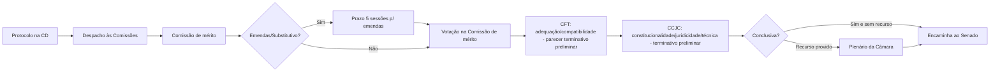
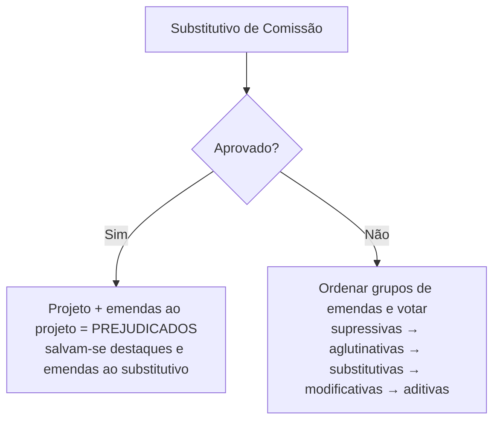
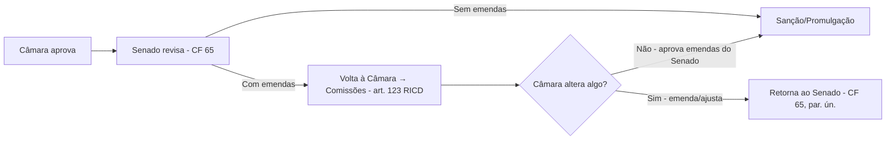

> [!summary] **Visão rápida**
> 
> - **Fluxo padrão na Câmara (ordem de exame):** mérito → **CFT (adequação/compatibilidade orçamentária)** → **CCJC** (constitucionalidade/juridicidade/técnica). Essa sequência decorre do art. 53 do RICD. ([Portal da Câmara dos Deputados](https://www2.camara.leg.br/atividade-legislativa/legislacao/regimento-interno-da-camara-dos-deputados/arquivos-1/RICD%20atualizado%20ate%20RCD%2016-2025.pdf "REGIMENTO INTERNO DA CÂMARA DOS DEPUTADOS"))
>     
> - **Papel “terminativo” (preliminar) de CCJC e CFT:** os pareceres **da CCJC sobre constitucionalidade** e **da CFT sobre adequação financeira-orçamentária** são **terminativos** nessa fase preliminar (podem barrar ou sanar vícios), sujeitos a recurso ao Plenário (apreciação preliminar). ([Portal da Câmara dos Deputados](https://www2.camara.leg.br/atividade-legislativa/legislacao/regimento-interno-da-camara-dos-deputados/arquivos-1/RICD%20atualizado%20ate%20RCD%2016-2025.pdf "REGIMENTO INTERNO DA CÂMARA DOS DEPUTADOS"))
>     
> - **Emendas nas comissões:** prazo **5 sessões** após aviso na ODC das Comissões; podem ser ao texto ou ao **substitutivo do relator**, inclusive por membros da comissão.
>     
> - **Se o PL for **emendado/substituído** na(s) comissão(ões):** o **substitutivo tem preferência** e, se aprovado, **prejudica** o projeto original e as emendas a ele (salvam-se destaques e emendas ao substitutivo).
>     
> - **Retorno do Senado:** as **emendas do Senado** são **distribuídas às comissões competentes da Câmara**; a CD pode **aprovar, rejeitar ou emendar**; se **emendar de novo**, retorna ao Senado (CF, art. 65, par. ún.).
>     
> - **Obrigatoriedade de CFT:** **toda proposição** (salvo requerimentos) passa pela **CFT** para exame **de adequação/compatibilidade** com PPA/LDO/LOA; o **parecer da CFT é terminativo nessa preliminar**. ([Portal da Câmara dos Deputados](https://www2.camara.leg.br/atividade-legislativa/legislacao/regimento-interno-da-camara-dos-deputados/arquivos-1/RICD%20atualizado%20ate%20RCD%2016-2025.pdf "REGIMENTO INTERNO DA CÂMARA DOS DEPUTADOS"))
>     

---

# 1) Apresentação e despacho (Câmara)

| Passo                 | O que ocorre                                                                                                                                                                                                                 | Base                                                                                                                                                                                                                                         |
| --------------------- | ---------------------------------------------------------------------------------------------------------------------------------------------------------------------------------------------------------------------------- | -------------------------------------------------------------------------------------------------------------------------------------------------------------------------------------------------------------------------------------------- |
| Protocolo do PL       | Numeração e autuação                                                                                                                                                                                                         | CF, art. 59/61                                                                                                                                                                                                                               |
| Despacho às comissões | **Ordem de exame na Câmara:** (i) **mérito** → (ii) **CFT** (compatibilidade/adequação orçamentária) → (iii) **CCJC** (constitucionalidade/juridicidade/técnica). A CFT também pode apreciar **mérito**, “quando for o caso” | ([Portal da Câmara dos Deputados](https://www2.camara.leg.br/atividade-legislativa/legislacao/regimento-interno-da-camara-dos-deputados/arquivos-1/RICD%20atualizado%20ate%20RCD%2016-2025.pdf "REGIMENTO INTERNO DA CÂMARA DOS DEPUTADOS")) |

> [!note] **Por que a CFT aparece “no meio” do caminho?**  
> O RICD **determina** que, antes do Plenário (ou quando ele é dispensado em conclusiva), a proposição seja apreciada **também pela CFT**, **quanto à compatibilidade/adequação** ao PPA/LDO/LOA; além disso, o **parecer da CFT sobre adequação** é **terminativo** na fase preliminar (art. 54, II). ([Portal da Câmara dos Deputados](https://www2.camara.leg.br/atividade-legislativa/legislacao/regimento-interno-da-camara-dos-deputados/arquivos-1/RICD%20atualizado%20ate%20RCD%2016-2025.pdf "REGIMENTO INTERNO DA CÂMARA DOS DEPUTADOS"))

---

# 2) Emendas **nas comissões** (ponto crucial)

## 2.1 Janela e quem pode propor

- **Prazo**: **5 sessões** (contadas da **publicação do anúncio** na ODC das Comissões).
    
- **Quem pode**: qualquer Deputado (após designado o relator), a **CLP** e **membros da comissão** ao **substitutivo** do relator.
    

> [!abstract] **Tipos (RICD, art. 118)**  
> **Supressiva, aglutinativa, substitutiva/substitutivo, modificativa, aditiva, subemenda e de redação** (esta última **sem alterar mérito**).

## 2.2 Se a comissão **aprova emendas** ou **um substitutivo**

- O **substitutivo de comissão tem preferência** sobre o projeto. Vota-se **primeiro** o substitutivo; se **aprovado**, **prejudica** o projeto e suas emendas (salvos destaques e emendas ao substitutivo). Se **rejeitado**, votam-se as **emendas** e, por **último**, o projeto.
    
- **Emendas inconstitucionais/injurídicas (CCJC)** ou **incompatíveis financeiramente (CFT)** **não vão a voto** (art. 189, §6º).
    
- **Emenda “saneadora” pela CCJC ou CFT:** se a comissão preliminar (CCJC/CFT) **apresenta emenda para sanar vício**, **o processo segue** e a **apreciação preliminar** pelo Plenário (se houver recurso) ocorrerá **depois** da manifestação das demais comissões (art. 146).
    

> [!tip] **Conclusiva em comissões e recurso**  
> Se a matéria é **conclusiva**, só vai ao Plenário se houver **recurso provido**. E **não se admite emendar em Plenário** a **parte aprovada conclusivamente** **sem** recurso provido (art. 120, §5º).

---

# 3) Plenário da Câmara (quando houver)

## 3.1 Emendas em Plenário (regra e urgência)

- **Durante discussão** (apreciação preliminar/turno único/1º turno): **qualquer Deputado** ou **Comissão**.
    
- **2º turno**: por **Comissão** (maioria absoluta) ou com **1/10** de subscritores (ou Líderes que representem esse número).
    
- **Urgência**: só **emendas de comissão** ou **subscritas por 1/5 da Casa** (ou Líderes que representem 1/5), **até o início da votação** (art. 120 e §4º). ([Portal da Câmara dos Deputados](https://www2.camara.leg.br/atividade-legislativa/legislacao/regimento-interno-da-camara-dos-deputados/arquivos-1/RICD%20atualizado%20ate%20RCD%2016-2025.pdf "REGIMENTO INTERNO DA CÂMARA DOS DEPUTADOS"))
    

## 3.2 Ordem de votação e “prejudicialidade”

- **Vota-se em globo** a proposição ou substitutivo, ressalvados destaques; **emendas** em **grupos** (parecer **favorável** vs **contrário**); **divergentes/destacadas** são **uma a uma** (art. 189).
    
- **Preferências-chave (art. 191):** substitutivo de comissão **tem preferência**; **aprovado o substitutivo**, **prejudica** o projeto e emendas a ele; rejeição do projeto **prejudica** suas emendas; ordem típica entre emendas: **supressivas → aglutinativas → substitutivas → modificativas → aditivas**.
    

---

# 4) Casa revisora: Senado Federal (CF, art. 65)

|Situação no Senado|Consequência|
|---|---|
|Aprova **sem mudanças**|Vai à **sanção** (ou promulgação)|
|Aprova **com emendas/substitutivo**|**Volta à Câmara (Casa iniciadora)** para deliberar sobre as **alterações** (CF, art. 65, par. ún.)|
|Rejeita|Arquivamento|

**Base constitucional direta**: Art. 65, parágrafo único, determina que **“sendo o projeto emendado, voltará à Casa iniciadora”**. ([bd.camara.leg.br](https://bd.camara.leg.br/bitstreams/6d72f7c3-ea69-41e6-a564-4039d9ae232b/download?utm_source=chatgpt.com "Art. 65"))

---

# 5) **Quando o PL volta do Senado com emendas — o que a Câmara pode fazer?**

## 5.1 Onde tramitam as emendas do Senado na Câmara

- **Distribuição às comissões competentes**, **juntamente com o projeto**, para **parecer** (art. 123 do RICD). Isso inclui, conforme o caso, **mérito**, **CFT (adequação/compatibilidade)** e **CCJC**.
    

## 5.2 A Câmara pode **emendar de novo**?

- **Sim.** As emendas do Senado abrem uma **nova rodada de deliberação**, com possibilidade de a Câmara **aprovar, rejeitar ou ainda emendar**. Se a Câmara **modificar o texto** (ex.: aprovar emendas próprias ou alterar as do Senado), o projeto **retorna ao Senado** (a lógica do **art. 65, par. ún.** impõe convergência de texto). ([bd.camara.leg.br](https://bd.camara.leg.br/bitstreams/6d72f7c3-ea69-41e6-a564-4039d9ae232b/download?utm_source=chatgpt.com "Art. 65"))
    
- **No Plenário da Câmara**, valem as **mesmas regras de emendas** (art. 120) e a **mesma ordem de votação e preferências** (arts. 189–191). Atenção para o **art. 120, §3º** (limita emendas **de redação** quando a redação final for de **emendas da Câmara** a projeto do Senado) — por simetria, mostra a preocupação de não “reabrir” indevidamente o mérito apenas sob rótulo de redação. ([Portal da Câmara dos Deputados](https://www2.camara.leg.br/atividade-legislativa/legislacao/regimento-interno-da-camara-dos-deputados/arquivos-1/RICD%20atualizado%20ate%20RCD%2016-2025.pdf "REGIMENTO INTERNO DA CÂMARA DOS DEPUTADOS"))
    

> [!warning] **Limites materiais**  
> A Câmara **não** pode “aproveitar a volta” apenas para **inserir matéria estranha** (jabuti), sob pena de inconstitucionalidade formal (exige-se identidade temática e simetria entre as Casas; qualquer alteração **exige nova manifestação da outra Casa**). **Se a Casa revisora altera, tem de voltar** — e se a iniciadora alterar de novo, **volta outra vez**. (CF, art. 65, par. ún.; doutrina/jurisprudência correlata) ([bd.camara.leg.br](https://bd.camara.leg.br/bitstreams/6d72f7c3-ea69-41e6-a564-4039d9ae232b/download?utm_source=chatgpt.com "Art. 65"))

---

# 6) **É obrigatório passar pela CFT?** (Resposta direta)

**Sim, como regra.** O RICD **impõe** que, **antes do Plenário** (ou quando este é dispensado), a proposição seja **apreciada pela CFT** quanto à **compatibilidade/adequação** com **PPA, LDO e LOA** (art. 53, II). O **parecer da CFT sobre adequação** é **terminativo** na fase preliminar (art. 54, II). Isso vale **também para emendas** que alterem o impacto financeiro-orçamentário. ([Portal da Câmara dos Deputados](https://www2.camara.leg.br/atividade-legislativa/legislacao/regimento-interno-da-camara-dos-deputados/arquivos-1/RICD%20atualizado%20ate%20RCD%2016-2025.pdf "REGIMENTO INTERNO DA CÂMARA DOS DEPUTADOS"))

> [!tip] **Tradução prática**  
> Se, na comissão de mérito, **surgir emenda** com impacto fiscal (renúncia de receita, despesa etc.), **a CFT precisa se manifestar** (pelo menos **quanto à adequação/compatibilidade**). **Sem adequação**, a emenda **não vai a voto** (art. 189, §6º).

---

# 7) Saída da Câmara → Senado → Executivo/CN

- **Aprovado** na Câmara (com ou sem Plenário), segue ao **Senado** (Casa revisora).
    
- Aprovado **sem emendas** pelo Senado → **sanção**/**promulgação**.
    
- **Com emendas** no Senado → **volta à Câmara** (art. 123 RICD + CF 65, par. ún.).
    

---

# 8) Sanção, veto e RCCN (idêntico ao roteiro base)

- **Sanção/veto presidencial (15 dias úteis; veto total/parcial fundamentado)** (CF, art. 66). ([Planalto](https://www.planalto.gov.br/ccivil_03/constituicao/constituicao.htm?utm_source=chatgpt.com "Constituição - Planalto"))
    
- **Veto** apreciado em **sessão conjunta** do **Congresso** em **30 dias**; o RCCN fixa a **contagem** a partir da **protocolização do veto na Presidência do Senado** (art. 104-A RCCN). ([Senado Legis](https://legis.senado.leg.br/sdleg-getter/documento?disposition=inline&dm=4077103&utm_source=chatgpt.com "Constituição Federal/88 Art. 66. A Casa na qual tenha sido ..."))
    

---

# 9) Diagramas (Mermaid)

## 9.1 Câmara — comissões, CFT e CCJC (incluindo emendas/substitutivo)

_(Art. 53 e 54 RICD; emendas nas comissões art. 119)._ ([Portal da Câmara dos Deputados](https://www2.camara.leg.br/atividade-legislativa/legislacao/regimento-interno-da-camara-dos-deputados/arquivos-1/RICD%20atualizado%20ate%20RCD%2016-2025.pdf "REGIMENTO INTERNO DA CÂMARA DOS DEPUTADOS"))

## 9.2 Preferência & prejudicialidade no Plenário (síntese)

_(Arts. 189–191 RICD)._

## 9.3 Retorno do Senado

---

# 10) Tabelas de consulta rápida

## 10.1 Onde posso apresentar **emendas**?

|Fase|Quem pode|Janela|Observações|
|---|---|---|---|
|**Comissões (apreciação conclusiva ou preparatória ao Plenário)**|Qualquer Deputado (após designação de relator); CLP; **membros da comissão** ao **substitutivo**|**5 sessões** após **aviso na ODC**|Substitutivo de comissão **tem preferência**; **emendas inconstitucionais/inadequadas** não vão a voto.|
|**Plenário (regra geral)**|Qualquer Deputado/Comissão|Até **início da votação**|Em **urgência**, só **comissão** ou **1/5 da Câmara** (ou Líderes que representem 1/5). **Parte aprovada conclusivamente sem recurso** **não** pode ser emendada (art. 120, §4º e §5º). ([Portal da Câmara dos Deputados](https://www2.camara.leg.br/atividade-legislativa/legislacao/regimento-interno-da-camara-dos-deputados/arquivos-1/RICD%20atualizado%20ate%20RCD%2016-2025.pdf "REGIMENTO INTERNO DA CÂMARA DOS DEPUTADOS"))|
|**Retorno do Senado (emendas do Senado)**|Comissões e Plenário da Câmara|Conforme pauta|**Art. 123 RICD** manda **distribuir às comissões**; se a Câmara **emendar**, **volta ao Senado** (CF, 65, par. ún.).|

## 10.2 **CCJC** x **CFT** — quando “travarem” e quando “sanarem”

|Comissão|“Travamento” (terminativo preliminar)|Como “sanar” e seguir|
|---|---|---|
|**CCJC**|Se apontar **inconstitucionalidade/injuridicidade**, pode **barrar** na preliminar|**Apresenta emenda saneadora** (art. 146) → matéria **prossegue**; apreciação preliminar em Plenário, se cabível.|
|**CFT**|Se apontar **inadequação/incompatibilidade** financeira-orçamentária, **não submete a voto** a emenda viciada; parecer é **terminativo** nessa preliminar|**Emenda saneadora de adequação/compatibilidade** (art. 146) → matéria **prossegue**; em Plenário, **emendas incompativeis** não vão a voto (art. 189, §6º).|

---

# 11) Bases legais (pinçadas)

- **RICD — Emendas e prazos:** arts. **118–123** (tipos, comissões, Plenário, aglutinativas; emendas do Senado) e **189–191** (ordem/preferência/prejudicialidade; §6º veda voto de emenda inconstitucional ou financeiramente incompatível).
    
- **RICD — Fluxo nas comissões e caráter terminativo preliminar:** arts. **53–56** e **54 (I–II)**; **146** (emendas saneadoras pela CCJC/CFT). ([Portal da Câmara dos Deputados](https://www2.camara.leg.br/atividade-legislativa/legislacao/regimento-interno-da-camara-dos-deputados/arquivos-1/RICD%20atualizado%20ate%20RCD%2016-2025.pdf "REGIMENTO INTERNO DA CÂMARA DOS DEPUTADOS"))
    
- **CF/88 — Casas e retorno após emenda:** **art. 65**, parágrafo único (“sendo emendado, volta à Casa iniciadora”). ([bd.camara.leg.br](https://bd.camara.leg.br/bitstreams/6d72f7c3-ea69-41e6-a564-4039d9ae232b/download?utm_source=chatgpt.com "Art. 65"))
    
- **CF/88 + RCCN — veto:** **art. 66** CF (15 dias úteis; sessão conjunta; maioria absoluta); **RCCN art. 104-A** (contagem do prazo de 30 dias a partir da **protocolização no Senado**). ([Planalto](https://www.planalto.gov.br/ccivil_03/constituicao/constituicao.htm?utm_source=chatgpt.com "Constituição - Planalto"))
    

---

> [!check] **Respostas objetivas às suas dúvidas**
> 
> 1. **“Não ficou claro o que acontece se o PL for emendado nas comissões da CD.”**  
>     — **Substitutivo** da comissão tem **preferência**; **aprovado**, **prejudica** o projeto original e suas emendas (exceto destaques e emendas ao substitutivo). **Emendas viciadas** (inconstitucionais/financeiramente incompatíveis) **não** vão a voto.
>     
> 2. **“Voltando do Senado, pode ser emendado na CD (comissões ou Plenário)?”**  
>     — **Sim.** As **emendas do Senado** são **distribuídas às comissões** da Câmara (art. 123). A Câmara pode **aprovar/rejeitar/ajustar**; **se ajustar**, **volta ao Senado** (CF, art. 65, par. ún.).
>     
> 3. **“Em caso de emenda, passa na CCJC e na CFT?”**  
>     — **Conforme o conteúdo.** **Se houver impacto fiscal**, **CFT** deve se pronunciar **quanto à adequação/compatibilidade**; **sempre** há crivo **CCJC** quanto à **constitucionalidade/juridicidade/técnica** no circuito definido pelo art. 53 do RICD; ambos têm **papel terminativo preliminar** (art. 54). ([Portal da Câmara dos Deputados](https://www2.camara.leg.br/atividade-legislativa/legislacao/regimento-interno-da-camara-dos-deputados/arquivos-1/RICD%20atualizado%20ate%20RCD%2016-2025.pdf "REGIMENTO INTERNO DA CÂMARA DOS DEPUTADOS"))
>     
> 4. **“É obrigatório passar pela CFT?”**  
>     — **Sim, regra geral** (salvo requerimentos). O art. 53, II, **obriga** o exame **CFT** de compatibilidade/adequação ao **PPA/LDO/LOA**; o **parecer da CFT** sobre essa **adequação** é **terminativo** (art. 54, II). ([Portal da Câmara dos Deputados](https://www2.camara.leg.br/atividade-legislativa/legislacao/regimento-interno-da-camara-dos-deputados/arquivos-1/RICD%20atualizado%20ate%20RCD%2016-2025.pdf "REGIMENTO INTERNO DA CÂMARA DOS DEPUTADOS"))
>     

---

