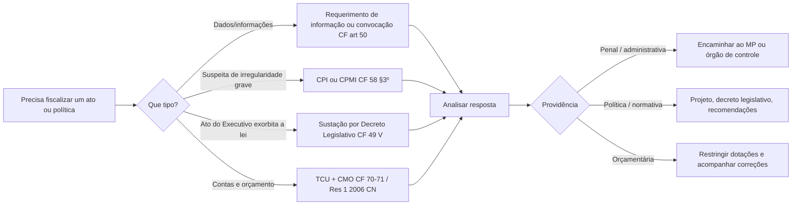

# Papel fiscalizador do Congresso Nacional e da Câmara dos Deputados

> [!summary] Visão geral rápida  
> O **Congresso Nacional** exerce o **controle externo** da Administração Pública federal, com o **auxílio do TCU** (CF, arts. 70 e 71). Suas ferramentas vão de **requerimentos de informação e convocações de autoridades**, à **sustação de atos do Executivo**, **CPIs/CPMIs**, **julgamento anual das contas do Presidente** e **comissões mistas temáticas** (como a **CMO** e a **CCAI**). A **Câmara dos Deputados**, além de compartilhar essas ferramentas, tem papéis próprios: **autorizar, por 2/3, a instauração de processo por crime de responsabilidade** e **promover tomada de contas do Presidente** quando não apresentadas em prazo. ([Normas](https://normas.leg.br/?urn=urn%3Alex%3Abr%3Afederal%3Aconstituicao%3A1988-10-05%3B1988%401996-04-30%21art70&utm_source=chatgpt.com "Art. 70. da Constituição da República Federativa do Brasil"))

---

## Fundamentos constitucionais (mapa rápido)

|Dispositivo|O que diz|Para que serve|Quem usa|
|---|---|---|---|
|**CF, art. 70**|Controle externo das finanças públicas + controle interno de cada Poder|Base da fiscalização contábil, financeira, orçamentária, operacional e patrimonial|Congresso (controle externo) + TCU (auxílio)|
|**CF, art. 71**|Competências do **TCU** no auxílio ao Congresso|Auditar, julgar contas de responsáveis, informar ao Legislativo; mecanismos de sustação de atos/contratos|TCU + Congresso|
|**CF, art. 49, V, IX, X, XI**|(V) **Sustar** atos normativos do Executivo que **exorbitem**; (IX) **julgar contas** do PR; (X) **fiscalizar e controlar** atos do Executivo; (XI) zelar pela competência legislativa|Controle político-normativo e financeiro|Congresso|
|**CF, art. 50**|**Convocar Ministros** e **pedir informações** (30 dias) — recusa/atraso/inf. falsas = **crime de responsabilidade**|Obter dados e controlar políticas públicas|Câmaras ou comissões|
|**CF, art. 58, §3º** e **Lei 1.579/1952**|**CPI/CPMI** com poderes de autoridade judicial, para **fato determinado** e **prazo certo**|Investigar e encaminhar conclusões ao MP|Câmara, Senado ou Congresso (mista)|
|**CF, art. 51, I e II**|**Autorizar**, por 2/3, processo por crime de responsabilidade; **tomada de contas** do PR se não apresentadas|Gatekeeper do impeachment e garantia de accountability|Câmara dos Deputados|

Fontes: ([tce.se.gov.br](https://www.tce.se.gov.br/Legislacao/Legisla%C3%A7%C3%A3o%20Nacional/DISPOSITIVOS%20DA%20CONSTITUI%C3%87%C3%83O%20FEDERAL%20ALUSIVOS%20AO%20TCU.pdf?utm_source=chatgpt.com "Da Fiscalização Contábil, Financeira e Orçamentária"))

---

## Ferramentas de fiscalização — como usar no dia a dia

### 1) Requerimentos de informação e convocações (CF, art. 50)

- **Quem**: qualquer das Casas ou **qualquer comissão**.
    
- **Como**: pedido escrito de informação (prazo: **30 dias**) ou **convocação** pessoal de Ministro/titulares de órgão.
    
- **Efeito**: **crime de responsabilidade** se houver recusa, não atendimento no prazo ou **informação falsa**.     

> [!tip] Dica prática  
> Para acompanhar cumprimento de RI: peça apoio técnico do **TCU** (art. 71, VII) para análise de dados recebidos. 
---

### 2) CPIs/CPMIs (CF, art. 58, §3º; Lei 1.579/1952)

- **Instalação**: requerimento de **1/3** dos membros; **fato determinado**; **prazo certo**.
    
- **Poderes**: investigação **própria de autoridade judicial**; conclusões vão ao **MP**.
    
- **Tipos**: **CPI** (em uma Casa) e **CPMI** (mista).
    
- **Regulação**: Constituição, regimentos internos e **Lei 1.579/1952**. 
    

---

### 3) Sustação de atos normativos do Executivo (CF, art. 49, V)

- **Quando**: ato regulamentar extrapola a lei ou limites de delegação.
    
- **Como**: **Decreto Legislativo** sustando o ato, com efeito **erga omnes**.
    
- **Base doutrinária e prática**: estudos do Senado detalham natureza e efeitos.     

> [!warning] Contratos administrativos  
> Nos termos do **art. 71** (controle externo), há dinâmica específica para **sustação de contratos** com irregularidades (prazo para saneamento; se não sanado, providências por Congresso/TCU). Consulte os §§ do art. 71 para o rito. ([Normas](https://normas.leg.br/?urn=urn%3Alex%3Abr%3Afederal%3Aconstituicao%3A1988-10-05%3B1988%21art71&utm_source=chatgpt.com "Art. 71. da Constituição da República Federativa do Brasil"))

---

### 4) Julgamento das contas do Presidente (CF, art. 49, IX; art. 71, I)

- **Fluxo**: **TCU** emite **parecer prévio** em 60 dias; Congresso **julga** anualmente as contas e aprecia relatórios de governo. 
    

---

### 5) Comissões mistas de fiscalização temática

- **CMO** – Comissão Mista de **Planos, Orçamentos Públicos e Fiscalização** (Res. 1/2006-CN). Atua na LOA/LDO e no acompanhamento da execução; utiliza relatórios do **TCU** (p.ex., **obras com irregularidades graves**). 
    
- **CCAI** – Comissão Mista de **Controle das Atividades de Inteligência** (Res. 2/2013-CN). Fiscaliza externamente as atividades de inteligência do SISBIN. 
    

---

## Câmara dos Deputados: papéis específicos de fiscalização

### 1) Autorizar processo por crime de responsabilidade (impeachment)

- A **Câmara** **autoriza**, por **2/3**, a instauração de processo contra PR, Vice e Ministros de Estado (Senado **processa e julga**). Base também na **Lei 1.079/1950**. 
    

### 2) Tomada de contas do Presidente se não apresentadas

- Se o Presidente não apresentar as contas **em até 60 dias** após a abertura da sessão legislativa, **compete à Câmara** proceder à tomada de contas. 
    

### 3) CFFC — Comissão de Fiscalização Financeira e Controle

- Comissão permanente vocacionada ao **acompanhamento e fiscalização contábil, financeira, orçamentária e patrimonial**.
    
- Instrumentos regimentais como **Proposta de Fiscalização e Controle (PFC)** para acionar o **TCU**. 
    

> [!example] Exemplo prático  
> Denúncias sobre execução de programa federal → **CFFC** propõe **PFC** → TCU realiza auditoria → relatório volta ao Congresso (apoia deliberações da **CMO** e do Plenário). 

---

## Fluxo mental de fiscalização (diagrama)

---

## Tabela — Quando usar o quê

|Situação|Ferramenta|Resultado esperado|
|---|---|---|
|Falta de dados/explicação do governo|**Requerimento de informação** ou **convocação** (CF, art. 50)|Resposta oficial em **30 dias**; sanção por descumprimento|
|Normativo infralegal excede a lei|**Decreto Legislativo** (CF, art. 49, V)|**Sustação** do ato|
|Suspeita de ilícito em política/contrato|**CPI/CPMI** (CF, art. 58, §3º; Lei 1.579/1952)|Relatório com envio ao **MP**|
|Controle das contas públicas|**TCU** (art. 71) + **julgamento** anual (art. 49, IX)|Parecer prévio do TCU e decisão do Congresso|
|Execução orçamentária problemática|**CMO** + relatórios do **TCU**|Bloqueios/condicionamentos e correções na LOA/LDO|
|Contas do PR não apresentadas|**Tomada de contas pela Câmara** (art. 51, II)|Força a accountability do Chefe do Executivo|

Fontes: ([Senado Legis](https://legis.senado.leg.br/sdleg-getter/documento?disposition=inline&dm=4600328&ts=1619731101876&utm_source=chatgpt.com "CONSTITUIÇÃO FEDERAL"))

---

## Notas finas e boas práticas

> [!info] Transparência e técnica  
> • Use o **TCU** para suporte técnico (art. 71, VII) em auditorias complexas. ([Portal TCU](https://portal.tcu.gov.br/conheca-o-tcu/competencias-do-tcu?utm_source=chatgpt.com "Competências do TCU - Conheça o TCU"))  
> • Em temas de **inteligência**, a **CCAI** é o foro adequado para controle externo especializado. ([Portal da Câmara dos Deputados](https://www2.camara.leg.br/legin/fed/rescon/2013/resolucao-2-22-novembro-2013-777449-publicacaooriginal-141944-pl.html?utm_source=chatgpt.com "Legislação Informatizada - RESOLUÇÃO Nº 2, DE 2013-CN"))

> [!hint] Integração orçamento–controle  
> O diálogo **TCU ↔ CMO** é essencial: achados do TCU subsidiam decisões orçamentárias (p.ex., restrição de dotações a obras com irregularidades graves). ([sites.tcu.gov.br](https://sites.tcu.gov.br/recursos/trabalhos-pos-graduacao/pdfs/Controle%20externo%20da%20administra%C3%A7%C3%A3o%20p%C3%BAblica%20exercido%20pelo%20Tribunal%20de%20Contas%20da%20Uni%C3%A3o%20-%20TCU%2C%20O.pdf?utm_source=chatgpt.com "Controle externo da administração pública exercido pelo ..."))

> [!warning] Prazos e ritos contam  
> Em convocações e pedidos de informação, monitore **prazos** e registre **eventuais descumprimentos**, pois podem configurar **crime de responsabilidade**. ([Senado Legis](https://legis.senado.leg.br/sdleg-getter/documento?disposition=inline&dm=4600328&ts=1619731101876&utm_source=chatgpt.com "CONSTITUIÇÃO FEDERAL"))

---

## Referências úteis (oficiais)

- **Constituição Federal** – arts. **70–71** (TCU/controle externo), **49** (competências exclusivas: sustação, julgamento de contas etc.), **50** (informações/convocações), **58, §3º** (CPI/CPMI), **51** (competências da Câmara).
    
- **Lei 1.579/1952** – regramento das **CPIs**. 
    
- **Lei 8.443/1992** – **Lei Orgânica do TCU**. 
    
- **Res. 1/2006-CN** – **CMO** e tramitação orçamentária conjunta. ([Portal da Câmara dos Deputados](https://www2.camara.leg.br/atividade-legislativa/legislacao/regimento-interno-da-camara-dos-deputados/arquivos-1/RICD%20atualizado%20ate%20RCD%2016-2025.doc?utm_source=chatgpt.com "REGIMENTO INTERNO DA CÂMARA DOS DEPUTADOS"))
    
- **Res. 2/2013-CN** – **CCAI**, controle de atividades de inteligência. ([Portal da Câmara dos Deputados](https://www2.camara.leg.br/legin/fed/rescon/2013/resolucao-2-22-novembro-2013-777449-publicacaooriginal-141944-pl.html?utm_source=chatgpt.com "Legislação Informatizada - RESOLUÇÃO Nº 2, DE 2013-CN"))
    
- **CFFC (Câmara)** – página institucional e atribuições. ([Portal da Câmara dos Deputados](https://www2.camara.leg.br/atividade-legislativa/legislacao/regimento-interno-da-camara-dos-deputados/arquivos-1/RICD%20atualizado%20ate%20RCD%2016-2025.pdf?utm_source=chatgpt.com "Aprova o Regimento Interno da Câmara dos"))
    

---

