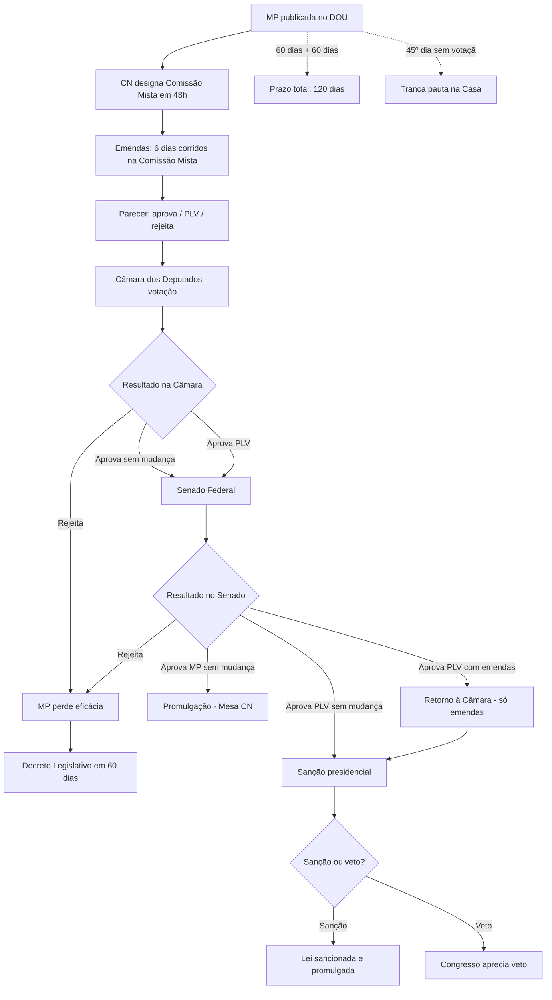
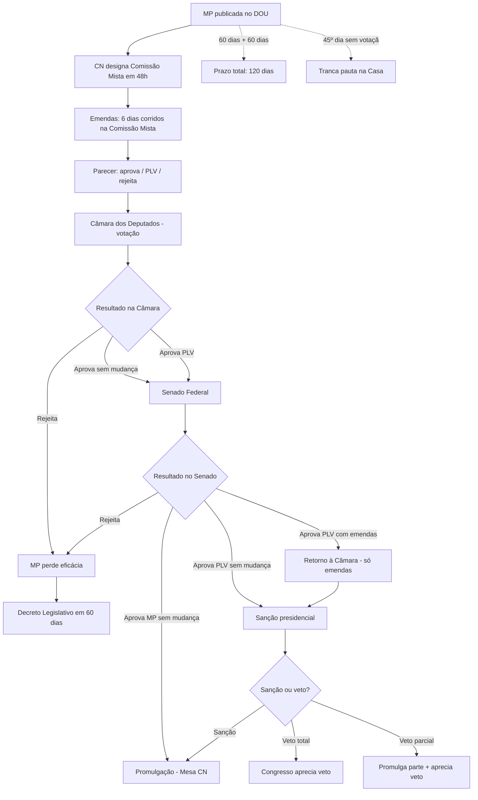

## **MP – Tramitação Completa**

> [!summary] **Essência**
> 
> - **Natureza**: Ato do **Presidente da República**, com **força de lei**, editado em casos de **relevância e urgência** ([CF, art. 62, _caput_](https://www.google.com/search?q=https://www.planalto.gov.br/ccivil_03/constituicao/constituicao.htm%23art62)). Vigência de **60 dias**, **prorrogável automaticamente por igual período**; prazos **suspensos durante o recesso parlamentar**. Após o **45º dia sem deliberação**, entra em **regime de urgência** e **sobresta a pauta** da Casa onde estiver tramitando (o "trancamento de pauta").
>     
> - **Rito Bicameral**: **Comissão Mista** (12 deputados + 12 senadores) é designada em **até 48h**. **Emendas somente perante a Comissão**, no prazo de **6 dias corridos** da publicação. O parecer pode propor um **PLV** (Projeto de Lei de Conversão). A **Câmara dos Deputados vota primeiro**, depois o **Senado Federal**; se este **alterar**, o texto retorna à Câmara **apenas para deliberar sobre as modificações** ([Resolução CN nº 1/2002](https://www.google.com/search?q=http://www.planalto.gov.br/ccivil_03/congresso/res/rcn01-02.htm)).
>     
> - **Desfechos Possíveis**:
>     
>     - **MP aprovada sem alteração** → **Promulgação** pela Mesa do Congresso Nacional (**sem sanção presidencial**).
>         
>     - **PLV aprovado (com alteração)** → **Sanção ou veto** do Presidente da República.
>         
>     - **Rejeitada ou caducou (60+60 dias)** → Congresso **deve** editar **decreto legislativo** sobre as **relações jurídicas** em **até 60 dias**; na omissão, as **relações são preservadas**.
>         

---

### 1. Visão Geral e Linha do Tempo

|**Etapa**|**O que ocorre**|**Base Normativa**|
|---|---|---|
|**Edição e Publicação no DOU**|MP entra em **vigor imediato**, produzindo efeitos jurídicos.|[CF, art. 62, _caput_](https://www.google.com/search?q=https://www.planalto.gov.br/ccivil_03/constituicao/constituicao.htm%23art62)|
|**Até 48h**|Presidentes da Câmara e do Senado designam **Comissão Mista** (12 dep. + 12 sen. + suplentes); proporcionalidade partidária + **1 vaga de rodízio para minorias**.|[RCCN 1/2002, art. 2º](https://www.google.com/search?q=http://www.planalto.gov.br/ccivil_03/congresso/res/rcn01-02.htm%23art2)|
|**Instalação (até 24h após designação)**|Comissão se reúne; elege **Presidente** e **Vice**; designa **Relator** e **Relator-Revisor** (alternância entre Casas).|[RCCN 1/2002, art. 3º](https://www.google.com/search?q=http://www.planalto.gov.br/ccivil_03/congresso/res/rcn01-02.htm%23art3)|
|**Dias 1 a 6 (corridos)**|**Prazo único para emendas**, apresentadas **exclusivamente na Comissão Mista** (protocolo na Secretaria-Geral da Mesa do Senado).|[RCCN 1/2002, art. 4º](https://www.google.com/search?q=http://www.planalto.gov.br/ccivil_03/congresso/res/rcn01-02.htm%23art4)|
|**Parecer da Comissão Mista**|Pode: **aprovar** a MP; **propor PLV** (com alterações); ou **rejeitar**. Se suprimir/alterar trechos, propõe também **decreto legislativo**.|[RCCN 1/2002, art. 5º](https://www.google.com/search?q=http://www.planalto.gov.br/ccivil_03/congresso/res/rcn01-02.htm%23art5)|
|**Câmara dos Deputados**|**Casa iniciadora** na votação plenária.|Praxe Constitucional; [Guia CN](https://www.google.com/search?q=https://www12.senado.leg.br/manualdecomunicacao/estilos/processo-legislativo/medida-provisoria)|
|**Senado Federal**|**Casa revisora**; se **emendar**, Câmara delibera **apenas sobre as emendas**.|[Guia CN](https://www.google.com/search?q=https://www12.senado.leg.br/manualdecomunicacao/estilos/processo-legislativo/medida-provisoria)|
|**Conversão**|**Sem alteração**: **promulgação** pelo Presidente da Mesa do CN; **Com alteração (PLV)**: **sanção/veto** presidenciais.|[RCCN 1/2002, arts. 12-13](https://www.google.com/search?q=http://www.planalto.gov.br/ccivil_03/congresso/res/rcn01-02.htm%23art12)|
|**Caducidade/Rejeição**|**Decreto legislativo** em até **60 dias** para regular relações jurídicas; na falta, **relações preservadas**.|[RCCN 1/2002, art. 11](https://www.google.com/search?q=http://www.planalto.gov.br/ccivil_03/congresso/res/rcn01-02.htm%23art11)|

---

### 2. Fluxograma Visual (Mermaid)

---

### 3. A Comissão Mista: O Coração da Análise da MP

A **Comissão Mista** é o órgão bicameral e temporário que realiza a primeira e mais crucial análise da MP.

- **Funções**: Examinar **admissibilidade** (relevância e urgência), **mérito**, **constitucionalidade** e **adequação orçamentária**. É a **única instância para apresentação de emendas**.
    
- **Composição**: 12 Deputados + 12 Senadores (e suplentes), respeitando a proporcionalidade partidária e garantindo **vaga de rodízio para minorias**.
    
- **Quóruns**: Abertura de reunião com **1/3** dos membros de cada Casa. Deliberação por **maioria de votos**, presente a **maioria absoluta** dos membros de **cada Casa**, garantindo o equilíbrio bicameral.
    

> [!note] Nota Técnica Importante
> 
> A análise pela Comissão Mista é um requisito fundamental do rito. Na ADI 4029, o STF reafirmou a obrigatoriedade deste exame prévio, que em alguns períodos chegou a ser dispensado, declarando inconstitucional a interpretação que permitia a supressão dessa etapa.

---

### 4. O Poder de Emenda: Escopo e Limites

> [!warning] Regra de Ouro: SOMENTE na Comissão Mista, em 6 dias
> 
> Emendas só podem ser protocoladas na Comissão Mista, perante a SGM do Senado, no prazo peremptório de 6 dias corridos da publicação da MP. Não há outra janela para emendar.

#### Limites Materiais ao Poder de Emenda

1. **Pertinência Temática ("Jabutis")**
    
> [!error] STF: Vedação Absoluta de "Jabutis" (ADI 5127)
>  É inconstitucional inserir no PLV matérias estranhas ao objeto original da MP. Tal prática viola os requisitos de relevância e urgência, o devido processo legislativo e o princípio da lealdade institucional. O controle pode ser preventivo (pela Mesa Diretora) ou repressivo (pelo STF).
    
2. Matérias Vedadas pelo Art. 62, § 1º, da CF
    
    Não pode haver MP (e, por consequência, emenda) sobre:
    
    - Direito **penal, processual penal e processual civil**;
        
    - Nacionalidade, cidadania, direitos políticos, partidos e direito eleitoral;
        
    - Organização do Judiciário e do MP, suas carreiras e garantias;
        
    - **PPA, LDO, LOA** e créditos (salvo o extraordinário);
        
    - Matéria de **lei complementar**;
        
    - Matéria já aprovada pendente de sanção;
        
    - Detenção/sequestro de bens, poupança popular ou ativos financeiros.
        
3. Vedação do Art. 246 da CF
    
    É proibido usar MP para regulamentar artigo da Constituição alterado por emenda promulgada a partir de 1995.
    

---

### 5. Prazos, Urgência e Trancamento de Pauta

|**Tema**|**Regra Consolidada**|
|---|---|
|**Vigência (60 + 60)**|Prazo inicial de 60 dias, com **prorrogação automática** por mais 60 se não for votada. A contagem é **suspensa durante o recesso**.|
|**Urgência (45º dia)**|A partir do 45º dia de sua publicação, a MP **tranca a pauta** da Casa onde estiver, sobrestando todas as demais deliberações (exceto PECs, vetos e leis orçamentárias).|

---

### 6. Foco: Implicações Setoriais

#### ⚖️ Tributário

> [!abstract] Eficácia Condicionada (CF, art. 62, § 2º)
> 
> MP que institua ou majore impostos só produz efeitos no exercício financeiro seguinte SE for convertida em lei até 31 de dezembro do ano de sua edição.
> 
> **Exceções** (efeito imediato): **II, IE, IPI, IOF** e Imposto Extraordinário de Guerra (IEG). A MP deve, ainda, respeitar as **anterioridades anual e nonagesimal** ([CF, art. 150, III](https://www.google.com/search?q=https://www.planalto.gov.br/ccivil_03/constituicao/constituicao.htm%23art150iii)), salvo para os impostos excepcionados na própria Constituição.

#### 💰 Orçamentário

> [!danger] **Proibido por MP**: PPA, LDO, LOA e créditos suplementares/especiais.

> [!info] **Permitido por MP**: **Crédito extraordinário** para atender a despesas imprevisíveis e urgentes, como as decorrentes de **guerra, comoção interna ou calamidade pública** ([CF, art. 167, § 3º](https://www.google.com/search?q=https://www.planalto.gov.br/ccivil_03/constituicao/constituicao.htm%23art167%C2%A73)).

#### ⚖️ Penal e Processual

> [!error] **Vedação Absoluta**. Não cabe MP para criar crimes, cominar penas ou alterar normas do CPP ou CPC. A segurança jurídica e as garantias fundamentais exigem o rito legislativo ordinário para essas matérias.

---

### 7. Jurisprudência Essencial do STF

|**Julgado**|**Tema Central**|**Decisão e Ratio Decidendi**|
|---|---|---|
|**ADI 5127**|**"Jabutis"**|**Inconstitucionalidade de matéria estranha** em PLV. Viola a exigência de relevância e urgência (que é da matéria, não do ato), o devido processo legislativo e a lealdade institucional.|
|**ADI 4.029**|**Rito e Urgência**|O trancamento de pauta no 45º dia é **imperativo e obrigatório**, não uma faculdade. Reafirmou a **obrigatoriedade do exame pela Comissão Mista**.|
|**ADI 1.610**|**Matéria Penal**|A vedação de MP em matéria penal é **absoluta**, não se admitindo nem mesmo para normas benéficas ao réu (_abolitio criminis_).|
|**ADI 1.651**|**Lei Complementar**|MP **não pode tratar de matéria de lei complementar**. O vício é de origem e insanável, mesmo que o PLV seja aprovado com quórum qualificado.|

---

### 8. Checklist Operacional Completo

#### Fase I: Análise de Viabilidade (Pré-Edição)

- [ ] Verificar se há **relevância e urgência** materialmente comprováveis.
    
- [ ] Confirmar que a matéria **não está nas vedações** do art. 62, § 1º, e art. 246 da CF.
    
- [ ] Se tributário: checar **anterioridades** e a necessidade de conversão até 31/12.
    
- [ ] Se orçamentário: confirmar que se trata de **crédito extraordinário** (guerra, calamidade).
    

#### Fase II: Tramitação na Comissão Mista

- [ ] Monitorar a **designação da Comissão** (até 48h).
    
- [ ] Acompanhar a definição do **Relator**.
    
- [ ] Observar o **prazo de emendas** (6 dias corridos) e seu conteúdo.
    
- [ ] Analisar o **parecer da Comissão** (aprovação, PLV ou rejeição).
    

#### Fase III: Tramitação nos Plenários

- [ ] Acompanhar inclusão na **Ordem do Dia da Câmara**.
    
- [ ] Monitorar a votação e o trânsito para o **Senado**.
    
- [ ] Se o Senado emendar, preparar-se para a deliberação das alterações na **Câmara**.
    

#### Fase IV: Desfecho

- [ ] **PLV aprovado**: Acompanhar o prazo de **sanção/veto** presidencial (15 dias úteis).
    
- [ ] **MP aprovada sem alteração**: Aguardar a **promulgação** pela Mesa do Congresso.
    
- [ ] **Rejeitada/Caducou**: Monitorar a edição do **Decreto Legislativo** (60 dias).
    

---

### 9. Referências Consolidadas

- **Constituição Federal de 1988**: [Art. 62](https://www.google.com/search?q=https://www.planalto.gov.br/ccivil_03/constituicao/constituicao.htm%23art62), [Art. 150](https://www.google.com/search?q=https://www.planalto.gov.br/ccivil_03/constituicao/constituicao.htm%23art150), [Art. 167](https://www.google.com/search?q=https://www.planalto.gov.br/ccivil_03/constituicao/constituicao.htm%23art167), [Art. 246](https://www.google.com/search?q=https://www.planalto.gov.br/ccivil_03/constituicao/constituicao.htm%23art246).
    
- **Resolução do Congresso Nacional nº 1, de 2002**: [Texto integral](https://www.google.com/search?q=http://www.planalto.gov.br/ccivil_03/congresso/res/rcn01-02.htm).
    
- **Supremo Tribunal Federal**: Acompanhamento de ADIs sobre o tema.
    
- **Guias do Congresso Nacional**: [Senado Federal](https://www.google.com/search?q=https://www12.senado.leg.br/manualdecomunicacao/estilos/processo-legislativo/medida-provisoria) e [Câmara dos Deputados](https://www.google.com/search?q=https://www.camara.leg.br/internet/agencia/infograficos-html5/medida-provisoria/index.html).
    

# MP – Tramitação Completa: Guia Detalhado e Aprofundado  
(com foco em tributário, penal, regulatório e procedimentos da Comissão Mista)

> [!summary] **Essência**
> 
> - **Natureza**: Ato do **Presidente da República**, com **força de lei**, editado em casos de **relevância e urgência** (CF, art. 62, *caput*). Vigência de **60 dias**, **prorrogável automaticamente por igual período**; prazos **suspensos durante recesso**, salvo convocação extraordinária. Após o **45º dia sem deliberação**, entra em **regime de urgência** e **sobresta a pauta** da Casa onde estiver tramitando (o chamado "trancamento de pauta").
>     
> - **Rito bicameral**: **Comissão Mista** (12 deputados + 12 senadores) é designada em **até 48h**. **Emendas somente perante a Comissão Mista**, no prazo de **6 dias corridos** da publicação. Parecer pode propor **PLV** (projeto de lei de conversão). **Câmara vota primeiro**, depois **Senado**; se este **alterar**, retorna à Câmara **apenas para as modificações**.
>     
> - **Desfechos possíveis**:
>     - **MP aprovada sem alteração** → **promulgação** pela Mesa do Congresso Nacional (**sem sanção presidencial**).
>     - **PLV aprovado** → **sanção ou veto** do Presidente da República.
>     - **Rejeitada ou caducou** (60+60 dias) → Congresso **deve** editar **decreto legislativo** sobre **relações jurídicas** em **até 60 dias**; na omissão, **relações preservadas**.

---

## 1) Visão geral e linha do tempo

| **Etapa** | **O que ocorre** | **Base normativa** |
|-----------|------------------|-------------------|
| **Edição e publicação no DOU** | MP entra em **vigor imediato**, produzindo efeitos desde a publicação | CF, art. 62, *caput* |
| **Até 48h** | **Presidentes da Câmara e do Senado** designam **Comissão Mista** (12 dep. + 12 sen. + igual nº de suplentes); proporcionalidade partidária + **1 vaga de rodízio para minoritárias** | RCCN 1/2002, art. 2º, §§ 2º-3º |
| **Instalação (24h após designação)** | Comissão se reúne; elege **Presidente** e **Vice**; designa **Relator** e **Relator-Revisor** (alternância entre Casas) | RCCN 1/2002, art. 3º |
| **Dias 1 a 6 (corridos)** | **Prazo único para emendas**, apresentadas **exclusivamente na Comissão Mista** (protocolo na SGM do Senado) | RCCN 1/2002, art. 4º, *caput* e § 1º |
| **Parecer da Comissão Mista** | Pode: **aprovar** a MP tal como editada; **propor PLV** (com alterações); ou **rejeitar**; se suprimir/alterar trechos, propõe também **decreto legislativo** para relações jurídicas | RCCN 1/2002, art. 5º, §§ 4º-5º |
| **Câmara dos Deputados** | **Casa iniciadora** na votação plenária | Praxe constitucional |
| **Senado Federal** | **Casa revisora**; se **emendar**, Câmara delibera **apenas sobre as emendas** | Guia CN |
| **Conversão** | **Sem alteração**: **promulgação** pelo **Presidente da Mesa do CN**; **Com alteração (PLV)**: **sanção/veto presidenciais** | RCCN 1/2002, arts. 12-13 |
| **Caducidade/rejeição** | **Decreto legislativo** em até **60 dias** para regular relações jurídicas; na falta, **relações preservadas** | RCCN 1/2002, art. 11, §§ 1º-3º |

---

## 2) Fluxograma visual (Mermaid)

---

## 3) A Comissão Mista: estrutura, composição e garantias minoritárias

### 3.1. Natureza e funções

A **Comissão Mista de Deputados e Senadores** é órgão **bicameral temporário** criado *ad hoc* para cada MP editada. Suas atribuições centrais:

- Examinar **admissibilidade** (requisitos de relevância e urgência);
- Analisar **mérito**, **adequação orçamentária** e **constitucionalidade**;
- Receber e opinar sobre **emendas** (única instância para apresentá-las);
- Emitir **parecer conclusivo**: pela MP, por PLV (substitutivo) ou pela rejeição.

### 3.2. Composição numérica e designação

| Aspecto | Regra |
|---------|-------|
| **Titulares** | 12 Deputados + 12 Senadores |
| **Suplentes** | Igual número (12 + 12) |
| **Prazo de designação** | **48 horas** da publicação da MP no DOU |
| **Autoridade designante** | Presidentes da Câmara e do Senado (conjuntamente) |

> [!info] **Proporcionalidade e representação minoritária**
> 
> - A composição **obedece à proporcionalidade partidária** em cada Casa.
>     
> - **É assegurada vaga de rodízio para as representações minoritárias** (RCCN 1/2002, art. 2º, § 3º), **ainda que pela proporcionalidade estrita não lhes caiba lugar**.
>     
> - Isso garante **pluralismo** e **controle democrático** sobre as MPs, evitando hegemonia absoluta da Maioria.

### 3.3. Instalação e órgãos diretivos

**Prazo**: Até **24 horas** após a designação, a Comissão Mista se reúne para:

1. **Eleger Presidente** (dentre seus membros);
2. **Eleger Vice-Presidente**;
3. **Designar Relator** (pode ser Deputado ou Senador);
4. **Designar Relator-Revisor** (da Casa **oposta** à do Relator, para garantir equilíbrio bicameral).

**Presidente da Comissão Mista**:

- Coordena reuniões;
- Recebe emendas (via SGM do Senado);
- Dá posse ao Relator;
- Submete parecer à votação do colegiado.

**Relator**:

- Examina MP, emendas e propõe parecer;
- Pode oferecer **emenda de relator** ou **PLV** (substitutivo global);
- Prazo diferenciado para apresentar trabalho (não rígido, mas deve respeitar urgência da MP).

**Relator-Revisor**:

- Revisa parecer do Relator (especialmente em MPs complexas);
- Garante visão bicameral equilibrada.

### 3.4. Quóruns e deliberação

| Aspecto | Regra |
|---------|-------|
| **Abertura de reunião** | **1/3** dos membros de **cada Casa** |
| **Deliberação** | **Maioria de votos**, presente **maioria absoluta** dos membros de **cada Casa** |
| **Votação do parecer** | Maioria simples dos presentes (desde que maioria absoluta de cada Casa) |

> [!tip] **Garantia bicameral**
> 
> Exigir **maioria absoluta de cada Casa separadamente** (e não do total) impede que uma Casa imponha sua vontade sobre a outra na Comissão Mista.

### 3.5. Prazos da Comissão Mista

A RCCN 1/2002 **não fixa prazo rígido** para o parecer da Comissão Mista, mas:

- **Contagem geral**: A MP tem **60 + 60 dias** de vigência.
- **Urgência (45º dia)**: Se não votada, **tranca pauta** → pressão para conclusão rápida.
- **Emendas**: **6 dias corridos** da publicação (prazo **peremptório**).
- **Parecer**: Deve ser apresentado **o mais breve possível**, para permitir votação pelas Casas antes do 120º dia.

**Prorrogações**: A Comissão **não tem direito a prorrogação regimental**; se demorar, a MP entra em regime de urgência (45º dia) e, posteriormente, **perde eficácia** (120º dia).

---

## 4) O poder de emenda do Congresso Nacional: escopo, limites e vedações

### 4.1. Quem pode emendar

**Legitimados para apresentar emendas à MP** (RCCN 1/2002, art. 4º):

- **Qualquer Deputado Federal**;
- **Qualquer Senador**;
- **Comissão Permanente** de qualquer das Casas (mediante aprovação por maioria absoluta de seus membros);
- **Comissão de Legislação Participativa** (sugestões da sociedade civil, transformadas em emenda de Comissão).

### 4.2. Prazo e local de apresentação

> [!warning] **Regra de ouro: SOMENTE perante a Comissão Mista, em 6 dias**
> 
> - Emendas **só podem ser protocoladas na Comissão Mista**, **perante a SGM do Senado Federal**.
>     
> - Prazo: **6 dias corridos**, contados da **publicação da MP no DOU**.
>     
> - Prazo é **peremptório** (não admite prorrogação).
>     
> - **Não corre em recesso**, salvo convocação extraordinária.

### 4.3. Tipos de emendas admissíveis

As emendas podem ser:

1. **Supressivas**: eliminam partes da MP;
2. **Modificativas**: alteram redação sem mudar substância;
3. **Aditivas**: acrescentam dispositivos;
4. **Substitutivas**: substituem partes ou todo o texto (neste último caso, o Relator apresenta **PLV** – Projeto de Lei de Conversão).

### 4.4. Limites materiais ao poder de emenda

#### a) **Pertinência temática ("jabutis")**

> [!error] **STF: vedação absoluta de "jabutis" (ADI 5127)**
> 
> - É **inconstitucional** inserir no PLV (ou em emendas) **matérias estranhas** ao objeto original da MP.
>     
> - **Fundamentos**:
>     - Violação ao **art. 62, *caput*, CF** (relevância e urgência são requisitos da **matéria específica** constante da MP);
>     - Ofensa ao **devido processo legislativo** (impede debate adequado);
>     - Desrespeito ao **princípio da lealdade institucional** (Executivo edita MP com objeto determinado; Congresso deve debater **aquele** objeto).
>     
> - **Controle**: Preventivo (Mesa/Comissão indefere emenda estranha) ou repressivo (STF via ADI).

#### b) **Matérias vedadas pelo art. 62, § 1º, CF**

Ainda que pertinente ao tema da MP, **não pode haver emenda** que:

- Trate de **direito penal**, **processual penal** ou **processual civil**;
- Verse sobre **nacionalidade**, **cidadania**, **direitos políticos**, **partidos políticos** ou **direito eleitoral**;
- Organize **Poder Judiciário** ou **Ministério Público**, suas carreiras e garantias;
- Trate de **PPA**, **LDO**, **LOA** ou **créditos suplementares/especiais** (salvo crédito extraordinário);
- Regule **matéria de lei complementar**;
- Discipline **matéria já aprovada em projeto pendente de sanção**;
- Trate de **detenção ou sequestro de bens, poupança popular ou ativos financeiros**.

#### c) **Art. 246, CF (vedação de regulamentar EC pós-1995)**

É vedada MP (e, por consequência, emenda a ela) para **regulamentar artigo constitucional** cuja redação tenha sido alterada por **emenda promulgada a partir de 1995**.

#### d) **Aumento de despesa em MP de iniciativa vinculada**

Se a matéria for de **iniciativa privativa** (ex.: organização administrativa), emendas que **aumentem despesas** são vedadas (salvo as exceções do art. 63, I, CF).

### 4.5. Emendas de redação e correção formal

São **sempre admissíveis** emendas que visem:

- Sanar **vício de linguagem**;
- Corrigir **incorreção de técnica legislativa**;
- Evitar **lapso manifesto**.

Essas emendas **não alteram o mérito** e podem ser apresentadas **até na redação final** (se houver).

### 4.6. Emenda aglutinativa (negociação entre Líderes)

**Emenda aglutinativa** resulta da **fusão de emendas**, ou destas com o texto, por **transação** tendente à aproximação de posições.

- **Pode ser apresentada** pelos Líderes **em Plenário** (na Câmara ou Senado), **no momento da votação**.
- Exige **maioria absoluta dos membros da Casa** para apresentação (na Câmara).

---

## 5) O PLV (Projeto de Lei de Conversão): natureza, tramitação e controle

### 5.1. O que é o PLV

O **PLV** é um **substitutivo global** apresentado pela **Comissão Mista** no seu parecer, que **substitui inteiramente o texto da MP** por outro.

**Características**:

- **Pode alterar substancialmente** o conteúdo original;
- **Deve manter pertinência temática** (vedação de "jabutis");
- **Submete-se à sanção/veto** presidencial (diferentemente da MP aprovada sem alterações, que é promulgada automaticamente).

### 5.2. Tramitação do PLV nas Casas

1. **Comissão Mista apresenta PLV** no parecer;
2. **Câmara dos Deputados** (Casa iniciadora) vota o PLV;
3. Se **Câmara aprovar**, envia ao **Senado**;
4. **Senado** pode:
   - **Aprovar sem modificações** → PLV vai à sanção;
   - **Rejeitar** → MP perde eficácia;
   - **Emendar** → retorna à Câmara **apenas para as emendas**.
5. **Câmara** decide sobre as emendas do Senado;
6. **PLV aprovado** vai à **sanção ou veto** presidencial.

### 5.3. Situação da MP durante tramitação do PLV

> [!important] **MP permanece em vigor até decisão final ou decurso do prazo**
> 
> - Enquanto o PLV tramita, a **MP original continua produzindo efeitos**.
>     
> - Se PLV for **rejeitado**, MP **perde eficácia**.
>     
> - Se PLV for **aprovado e sancionado**, **converte-se em lei**, e a MP é **substituída**.

### 5.4. Controle judicial dos "jabutis"

**ADI 5127 (STF, rel. Min. Rosa Weber, j. 15/10/2015)**:

- **Ratio decidendi**: Inserir matéria estranha no PLV viola:
  - Art. 62, *caput*, CF (requisitos de relevância e urgência são da **matéria específica**);
  - Princípio do **devido processo legislativo**;
  - Princípio da **lealdade institucional**.

- **Consequência**: PLV convertido em lei **com "jabutis"** pode ser objeto de **ADI** no STF → declaração de **inconstitucionalidade** dos dispositivos estranhos.

**Critérios para aferir pertinência temática** (desenvolvidos pelo STF):

1. **Teste de aderência lógica**: A emenda trata de tema **conexo ou afim** à MP?
2. **Teste de finalidade**: A emenda busca **aperfeiçoar** a MP ou **introduzir agenda paralela**?
3. **Teste de fundamentação**: Há **justificativa consistente** para inclusão da matéria?

> [!example] **Exemplos**
> 
> - **Válido**: MP sobre mercado de combustíveis + emenda sobre logística de distribuição de combustíveis.
>     
> - **Inválido ("jabuti")**: MP sobre saúde pública + emenda criando nova autarquia de turismo.

---

## 6) Prazos, urgência e trancamento de pauta

### 6.1. Prazo de vigência (60 + 60 dias)

| Marco temporal | Efeito |
|----------------|--------|
| **Dia 0** | Publicação no DOU → **início da vigência** |
| **60º dia** | Se não convertida, **prorrogação automática** por mais 60 dias |
| **120º dia** | Se não convertida, **MP perde eficácia** |

**Suspensão**: Prazos **não correm** durante **recesso parlamentar**, salvo convocação extraordinária **específica** para a MP.

### 6.2. Regime de urgência (45º dia)

> [!warning] **Trancamento de pauta a partir do 45º dia**
> 
> - Se a MP **não for votada em 45 dias** de sua publicação (ou da chegada à Casa, se já aprovada pela outra), entra em **regime de urgência**.
>     
> - **Efeito**: **Sobresta todas as demais deliberações** da Casa onde estiver, **exceto**:
>     - PEC em tramitação;
>     - LDO (prazo constitucional: até 17/7);
>     - LOA (prazo: até 22/12);
>     - Vetos presidenciais (prazo: 30 dias);
>     - Outras MPs em urgência.

**Estratégia legislativa**:

- Governo usa o trancamento para **pressionar votação** rápida.
- Oposição pode **negociar emendas** ou **acordos** sob a ameaça de "pauta travada".

### 6.3. Exceções ao trancamento

Não sobrestam a pauta:

1. Matérias com **prazo constitucional** (LDO, LOA, vetos);
2. **PECs** em curso;
3. **Outras MPs** já em urgência (votam-se na ordem de chegada ao 45º dia).

---

## 7) Tributário: anterioridades, exceções e conversão até 31/12

### 7.1. Regra-matriz (CF, art. 62, § 2º)

> [!abstract] **MP tributária: eficácia condicionada**
> 
> **MP que institua ou majore impostos** só produz efeitos **no exercício financeiro seguinte** SE for **convertida em lei até 31/12** do ano de sua edição.

**Exceções** (impostos de efeito imediato):

- **II** (Importação)
- **IE** (Exportação)
- **IPI** (Produtos Industrializados)
- **IOF** (Operações Financeiras)
- **IEG** (Imposto Extraordinário de Guerra, art. 154, II, CF)

### 7.2. Cumulação com anterioridades (CF, art. 150, III)

**Anterioridade anual ("b")**: Não cobrar no mesmo exercício da lei que instituiu/majorou.

**Anterioridade nonagesimal ("c")**: Não cobrar antes de 90 dias da publicação.

**Exceções**:

- A **"b"** não se aplica a: **IEG**, **II**, **IE**, **IPI**, **IOF**, **ICMS-combustíveis** (EC 33/2001), **CIDE-combustíveis** (art. 177, § 4º, I, "b").
- A **"c"** não se aplica a: **IEG**, **II**, **IE**, **IR**, **IOF**, **ICMS-base de cálculo** (art. 150, § 1º).

### 7.3. Leitura prática

> [!example] **Cenários**
> 
> **Cenário 1**: MP editada em **junho/2025** aumenta alíquota de **ICMS** (imposto estadual → MP **não pode**; mas, hipoteticamente, se pudesse):
> 
> - Conversão até **31/12/2025** → produz efeitos a partir de **1º/1/2026** + 90 dias (abril/2026).
>     
> **Cenário 2**: MP editada em **agosto/2025** aumenta alíquota de **IOF**:
> 
> - **Efeito imediato** (IOF é exceção), mas deve respeitar **90 dias**? **Não** (IOF também é exceção à noventena).
>     
> **Cenário 3**: MP editada em **novembro/2025** aumenta alíquota de **IRPF**, convertida em **fevereiro/2026**:
> 
> - **Não produz efeitos** para o exercício de 2026 (conversão após 31/12/2025).

---

## 8) Orçamentário: o que pode e o que não pode

### 8.1. Vedação geral (CF, art. 62, § 1º, I, "d")

> [!danger] **Proibido por MP**
> 
> **PPA**, **LDO**, **LOA** e **créditos suplementares/especiais**.

### 8.2. Exceção: crédito extraordinário (CF, art. 167, § 3º)

> [!info] **Permitido: crédito extraordinário por MP**
> 
> - **Requisitos**:
>     - **Despesas imprevisíveis** e **urgentes**;
>     - Decorrentes de **guerra**, **comoção interna** ou **calamidade pública**.
>     
> - **Prática**: Executivo federal frequentemente abre crédito extraordinário por MP (ex.: **MP 1.289/2025**, citada na fonte original).

**Controle**:

- Congresso pode **rejeitar** a MP se considerar ausentes os requisitos;
- TCU fiscaliza **a posteriori** a execução orçamentária.

---

## 9) Penal e processual: vedação absoluta

> [!error] **Não cabe MP para**
> 
> - Criar **crimes** ou **penas**;
> - Alterar **CPP** ou **CPC**;
> - Tratar de qualquer matéria **penal** ou **processual penal/civil**.

**Ratio**: Segurança jurídica e garantias fundamentais exigem **rito ordinário** de lei, com amplo debate.

**Exemplo**: Abolitio criminis (excluir crime do Código Penal) **não pode** ser via MP, ainda que benéfica ao réu (ADI 1.610/STF).

---

## 10) Regulatório: limites e possibilidades

**Em princípio, MP pode tratar de matérias regulatórias** (organização administrativa, políticas públicas), **desde que**:

1. Haja **relevância e urgência** demonstradas;
2. Não viole as **vedações do art. 62, § 1º** (ex.: não invada organização do Judiciário/MP);
3. Não viole **art. 246** (regulamentação de EC pós-1995);
4. Mantenha **pertinência temática** no PLV (sem "jabutis");
5. Respeite **iniciativa privativa** (se houver).

**Exemplos**:

- **Pode**: Criar agência reguladora (se matéria de lei ordinária e houver urgência setorial demonstrada);
- **Pode**: Alterar competência de agência para regular novo marco tecnológico (ex.: 5G);
- **Duvidoso**: Criar múltiplas agências simultaneamente (falta urgência individualizada);
- **Não pode**: Regulamentar carreira de membros do Judiciário ou MP (vedação expressa).

---

## 11) Votações, promulgação e sanção: desfechos finais

### 11.1. Votação nas Casas

**Quorum**: **Maioria simples** (maioria dos presentes, presente a maioria absoluta dos membros).

**Processo**: Votação ostensiva (simbólica ou nominal), salvo matérias de escrutínio secreto (que **não incluem MPs**).

### 11.2. Desfechos possíveis

| Situação | Encaminhamento | Base |
|----------|----------------|------|
| **MP aprovada sem alteração** pelas duas Casas | **Promulgação** pelo **Presidente da Mesa do CN** (sem sanção presidencial) | RCCN 1/2002, art. 12 |
| **PLV aprovado** sem alterações pelo Senado | **Sanção ou veto** do Presidente da República | RCCN 1/2002, art. 13 |
| **PLV com emendas do Senado** | Retorna à Câmara **apenas para as emendas** → Sanção/veto | RCCN 1/2002, art. 13 |
| **Rejeição** ou **caducidade** (60+60) | **Decreto legislativo** sobre relações jurídicas em até 60 dias; na falta, **relações preservadas** | RCCN 1/2002, art. 11 |

### 11.3. Sanção e veto (PLV aprovado)

**Presidente da República** tem **15 dias úteis** para:

- **Sancionar** (total ou parcialmente);
- **Vetar** (total ou parcialmente).

**Veto**:

- Motivação: **inconstitucionalidade** ou **contrariedade ao interesse público**;
- Comunicado ao CN em **48 horas**;
- Congresso tem **30 dias** para apreciar (escrutínio secreto, maioria absoluta para rejeitar o veto).

---

## 12) Caducidade e decreto legislativo

### 12.1. Perda de eficácia

Se MP **não for convertida** em lei em **120 dias** (ou for **rejeitada**):

- **Perde eficácia** desde a edição (efeitos **ex tunc**);
- Congresso **deve** editar **decreto legislativo** em **até 60 dias** para regular as **relações jurídicas** constituídas durante a vigência da MP.

### 12.2. Omissão do Congresso

Se Congresso **não editar** o decreto legislativo em 60 dias:

- As **relações jurídicas permanecem válidas** (convalidação tácita) – CF, art. 62, § 11.

**Exemplo prático**:

- MP aumenta alíquota de imposto por 60 dias, depois caduca;
- Decreto legislativo pode:
  - (a) **Convalidar** cobranças feitas;
  - (b) Determinar **devolução** de valores;
  - (c) **Parcelar** créditos tributários.

---

## 13) Jurisprudência do STF: síntese aprofundada

### 13.1. ADI 5127 (leading case sobre "jabutis")

**Tema**: Vedação de inserção de matéria estranha em PLV.

**Decisão**: ADI 5.127, Rel. Min. Rosa Weber, Tribunal Pleno, j. 15/10/2015.

**Principais fundamentos**:

1. **Violação à relevância e urgência** (art. 62, *caput*): Se Congresso insere matéria estranha, está legislando sobre tema que **não teve urgência reconhecida** pelo Executivo → burla o rito constitucional.

2. **Ofensa ao devido processo legislativo**: Impede debate adequado sobre matérias complexas; prejudica participação social e transparência.

3. **Princípio da lealdade institucional**: Executivo edita MP com objeto determinado; Congresso deve debater **aquele** objeto, não agenda paralela.

**Consequência**: PLVs com "jabutis" são **inconstitucionais** nos dispositivos estranhos.

### 13.2. ADI 4.029 (urgência e trancamento)

**Tema**: Obrigatoriedade do trancamento de pauta após 45 dias.

**Decisão**: ADI 4.029, Rel. Min. Luiz Fux, j. 08/03/2012.

**Ratio**: Trancamento é **imperativo constitucional** (art. 62, § 6º); Casas não podem deliberar outras matérias se MP estiver em urgência, **exceto** matérias com prazo constitucional (LDO, LOA, vetos).

### 13.3. ADI 1.910-MC (controle de MPs em vigor)

**Tema**: Cabimento de medida cautelar para suspender MP antes da conversão.

**Decisão**: ADI 1.910-MC, Rel. Min. Sepúlveda Pertence, j. 29/04/1999.

**Ratio**: MP tem **força de lei** (art. 62, *caput*) → é suscetível de controle abstrato de constitucionalidade, **mesmo antes da conversão**.

### 13.4. ADI 1.610 (vedação de MP em matéria penal)

**Tema**: Impossibilidade de usar MP para tratar de direito penal.

**Decisão**: ADI 1.610, Rel. Min. Sydney Sanches, j. 19/02/1998.

**Ratio**: Vedação é **absoluta** (art. 62, § 1º, I, "b"); mesmo aspectos benéficos (ex.: abolitio criminis) **não podem** ser via MP → segurança jurídica e garantias fundamentais exigem rito ordinário.

### 13.5. ADI 1.651 (vedação de MP sobre lei complementar)

**Tema**: MP não pode regular matéria de lei complementar.

**Decisão**: ADI 1.651, Rel. Min. Maurício Corrêa, j. 26/06/1997.

**Ratio**: Mesmo que o PLV obtenha **quorum qualificado** (maioria absoluta) na conversão, **vício persiste** → é de **origem**, insanável.

### 13.6. ADI 1.516 (reedição de MP)

**Tema**: Vedação de reedição de MP rejeitada ou que perdeu eficácia.

**Decisão**: ADI 1.516, Rel. Min. Octavio Gallotti, j. 19/02/1997.

**Contexto**: Antes da EC 32/2001, havia reedições sucessivas ("MPs eternas").

**Ratio**: EC 32/2001 vedou reedição na mesma sessão legislativa → STF validou a nova regra (art. 62, § 10).

---

## 14) Checklist operacional completo (para advogados, consultores e gestores)

### Fase I: Pré-edição (Análise de Viabilidade)

- [ ] Verificar se há **relevância** demonstrável (situação excepcional que justifique medida extraordinária);
- [ ] Verificar se há **urgência** temporal (projeto de lei ordinário não atende ao prazo);
- [ ] Confirmar que matéria **não está vedada** (art. 62, § 1º + art. 246);
- [ ] Se tributário: checar **anterioridades** (anual + noventena) e **exceções** (II, IE, IPI, IOF, IEG);
- [ ] Se orçamentário: confirmar que é **crédito extraordinário** (guerra, comoção, calamidade);
- [ ] Avaliar **apoio político** no Congresso (MP sem base pode ser rejeitada);
- [ ] Preparar **justificativa robusta** (exposição de motivos com dados concretos).

### Fase II: Edição e Publicação

- [ ] Redação técnica impecável (evitar vícios formais de inconstitucionalidade);
- [ ] Exposição de motivos detalhada (fundamentar relevância e urgência);
- [ ] Publicação no DOU (início da vigência e contagem do prazo de 120 dias);
- [ ] Comunicação ao Congresso Nacional.

### Fase III: Tramitação na Comissão Mista

- [ ] Monitorar **designação da Comissão** (até 48h);
- [ ] Acompanhar indicação de **Relator** e **Relator-Revisor**;
- [ ] Subsidiar tecnicamente o Relator (envio de notas técnicas, estudos);
- [ ] Monitorar **prazo de emendas** (6 dias corridos);
- [ ] Avaliar emendas apresentadas quanto a:
  - **Pertinência temática** (evitar "jabutis");
  - **Constitucionalidade**;
  - **Impacto político e técnico**.
- [ ] Preparar **defesa** de emendas favoráveis e **contestação** de contrárias;
- [ ] Acompanhar **parecer da Comissão Mista** (aprovar MP, PLV ou rejeitar).

### Fase IV: Tramitação na Câmara e no Senado

- [ ] Monitorar inclusão na **Ordem do Dia** da Câmara;
- [ ] Acompanhar **discussão e votação** em Plenário;
- [ ] Se aprovado **PLV com alterações**: analisar compatibilidade com intenção original;
- [ ] Monitorar trânsito ao **Senado**;
- [ ] Repetir monitoramento no Senado;
- [ ] Se Senado **emendar**: analisar emendas e preparar posicionamento para retorno à Câmara.

### Fase V: Sanção/Veto (se PLV aprovado)

- [ ] Analisar **texto final** aprovado pelo Congresso;
- [ ] Avaliar **vícios de inconstitucionalidade** ou **contrariedade ao interesse público**;
- [ ] Decidir por: **sanção integral**, **veto parcial** ou **veto total**;
- [ ] Se veto: preparar **razões consistentes** (constitucionalidade ou interesse público);
- [ ] Comunicar veto ao Congresso (que tem 30 dias para apreciar).

### Fase VI: Monitoramento Pós-Conversão

- [ ] Se convertida em lei: monitorar **implementação** e eventuais **ADIs no STF**;
- [ ] Se rejeitada/caducou: acompanhar edição de **Decreto Legislativo** (60 dias);
- [ ] Avaliar necessidade de **novo projeto de lei** sobre o tema;
- [ ] Fazer **avaliação de impacto** legislativo (lições aprendidas).

---

## 15) Boas práticas: visão estratégica e recomendações

### 15.1. Para o Poder Executivo (ao editar MP)

1. **Documentar exaustivamente** relevância e urgência (criar dossiê com dados, estudos, pareceres);
2. **Diálogo prévio** com Lideranças do Congresso (evitar rejeição por falta de apoio político);
3. **Texto enxuto e focado** (quanto mais extenso, maior chance de "jabutis" na conversão);
4. **Evitar temas polêmicos desnecessários** (não misturar agenda popular com impopular);
5. **Antecipar emendas prováveis** (já inserir na MP pontos que serão cobrados, se aceitáveis).

### 15.2. Para o Poder Legislativo (ao analisar MP)

1. **Exigir cumprimento de prazos** (Comissão Mista, parecer, votação);
2. **Fiscalizar pertinência temática** das emendas (Mesa e Comissão devem barrar "jabutis");
3. **Usar emendas para aperfeiçoar** (não para "sequestrar" a MP com agenda paralela);
4. **Avaliar custo-benefício** da conversão (rejeitar MP ruim é controle legítimo);
5. **Elaborar Decreto Legislativo** em caso de caducidade (proteger relações jurídicas).

### 15.3. Para advogados, consultores e acadêmicos

1. **Acompanhamento diário** de MPs que afetem clientes ou área de estudo (alertas automáticos);
2. **Elaboração de minutas de emendas** tecnicamente robustas (enviar a parlamentares aliados);
3. **Participação em audiências públicas** (se convocadas pela Comissão Mista);
4. **Preparação de pareceres** sobre inconstitucionalidades (subsidiar eventuais ADIs);
5. **Gestão de riscos regulatórios** (se MP afetar negócio, planejar adequação ou litígio).

---

## 16) Referências essenciais e consolidadas

- **CF/88**: art. **62** (requisitos, prazos, Comissão Mista, trancamento, relações jurídicas), art. **150, III, b e c** (anterioridades), art. **167, § 3º** (crédito extraordinário), art. **246** (vedação de regulamentar EC pós-1995).

- **RCCN 1/2002** (rito das MPs no Congresso Nacional): designação da Comissão Mista, prazos para emendas, parecer, votações, promulgação, decreto legislativo.

- **Guia "Entenda a tramitação da MP"** (Congresso Nacional): passos, prazos, quóruns.

- **STF**:
  - **ADI 5127** (jabutis);
  - **ADI 4.029** (trancamento);
  - **ADI 1.910-MC** (controle de MP em vigor);
  - **ADI 1.610** (vedação penal);
  - **ADI 1.651** (vedação lei complementar);
  - **ADI 1.516** (reedição).

---

### O que é (definição legal)

**Medida provisória** é um ato **unipessoal do Presidente da República**, com **força de lei**, admitido **somente** em caso de **relevância e urgência**. Editada, deve ser **imediatamente submetida ao Congresso Nacional** e obedece a prazos constitucionais de **60 dias, prorrogáveis uma vez por igual período**; passado o 45º dia, passa a **sobrestar a pauta** da Casa em que estiver tramitando (regime de urgência). Tudo isso está no **art. 62 da Constituição**. ([Planalto](https://www.planalto.gov.br/ccivil_03/constituicao/constituicao.htm?utm_source=chatgpt.com "Constituição - Planalto"))

Além do texto constitucional, o **rito interno de apreciação** das MPs pelo Congresso (comissão mista, prazos, votação em cada Casa) está detalhado na **Resolução do Congresso Nacional nº 1/2002**, que integra o Regimento Comum. ([Senado Legis](https://legis.senado.leg.br/norma/561120?utm_source=chatgpt.com "Resolução do Congresso Nacional nº 1 de 08/05/2002"))

### Por que o Executivo precisa desse instrumento (finalidade constitucional)

A MP é um **mecanismo excepcional** para **responder rapidamente** a situações que **exigem disciplina normativa imediata**, quando o tempo do processo legislativo comum **não é compatível**. Ela **produz efeitos jurídicos imediatos**, mas **depende de controle político** (apreciação pelo Congresso) e **jurisdicional** (pelo STF) — por exemplo, o Supremo já interveio para: (i) **vedar “jabutis”** na lei de conversão (matéria estranha ao objeto original) e (ii) **exigir** a atuação da **comissão mista** prevista na Constituição. ([STF News](https://noticias.stf.jus.br/postsnoticias/legislativo-nao-pode-incluir-em-lei-de-conversao-materia-estranha-a-mp-decide-stf/?utm_source=chatgpt.com "Legislativo não pode incluir em lei de conversão matéria ..."))

### Quem pode editar

**Apenas o Presidente da República** pode editar medida provisória. Essa compreensão é uníssona na doutrina e decorre literalmente do **art. 62** (“o Presidente da República poderá adotar medidas provisórias”), além de constar em materiais técnicos do Senado. ([Planalto](https://www.planalto.gov.br/ccivil_03/constituicao/constituicao.htm?utm_source=chatgpt.com "Constituição - Planalto"))

### Pode delegar a competência de editar MP?

**Não.**  
A Constituição **lista** quais atribuições o Presidente **pode** delegar (art. 84, **parágrafo único**) — e **editar MP não está entre elas**. O parágrafo único autoriza delegação **apenas** de competências específicas (v.g., incisos **VI**, **XII** e **XXV**, primeira parte), a Ministros de Estado, ao PGR ou ao AGU. Editar MP é competência **privativa e indelegável** do Presidente. ([normas.leg.br](https://normas.leg.br/?urn=urn%3Alex%3Abr%3Afederal%3Aconstituicao%3A1988-10-05%3B1988%21art84&utm_source=chatgpt.com "Art. 84. da Constituição da República Federativa do Brasil"))

> ⚖️ **Cuidado para não confundir com “lei delegada”:**  
> **Lei delegada** (art. 68 da CF) é outra **espécie normativa**: o **Congresso autoriza** o Presidente, por **resolução**, a legislar **dentro de limites** (delegação legislativa). **Não é** MP e **não** torna a edição de MP delegável — são institutos distintos com fundamentos, procedimentos e vedações próprios. ([bd.camara.leg.br](https://bd.camara.leg.br/bitstreams/3df3b006-1ec7-46af-a0d6-aff340727cc1/download?utm_source=chatgpt.com "Art. 68"))

### Controles e limites relevantes (bem sintético)

- **Controle parlamentar:** comissão mista (12 deputados + 12 senadores) e votação nas duas Casas, conforme Res. 1/2002-CN; o STF invalidou dispositivos que permitiam pular a comissão mista. ([Senado Legis](https://legis.senado.leg.br/norma/561120?utm_source=chatgpt.com "Resolução do Congresso Nacional nº 1 de 08/05/2002"))
    
- **Controle judicial:** o STF veda “contrabando legislativo” na conversão de MP (ADI 5.127). ([STF News](https://noticias.stf.jus.br/postsnoticias/legislativo-nao-pode-incluir-em-lei-de-conversao-materia-estranha-a-mp-decide-stf/?utm_source=chatgpt.com "Legislativo não pode incluir em lei de conversão matéria ..."))
    
- **Limites materiais:** a MP **não pode** tratar de matérias vedadas (p.ex., **penal** e **processual**, **orçamentárias** como PPA/LDO/LOA, matérias **reservadas a LC**), nem pode **regulamentar artigo constitucional alterado por EC após 1995** (art. 246). Tudo conforme o **art. 62, §1º**, e o art. **246** da CF. ([Planalto](https://www.planalto.gov.br/ccivil_03/constituicao/constituicao.htm?utm_source=chatgpt.com "Constituição - Planalto"))
    
- **Comunicação institucional:** a Câmara e o próprio Congresso oferecem guias oficiais que reforçam definição, prazos e controle democraticamente compartilhado. ([Portal da Câmara dos Deputados](https://www2.camara.leg.br/comunicacao/assessoria-de-imprensa/guia-para-jornalistas/medida-provisoria?utm_source=chatgpt.com "Medida Provisória"))
    

**Em uma linha:** MP é um **ato excepcional** do **Presidente da República**, **indelegável**, usado **apenas** quando há **relevância e urgência**, com **efeitos imediatos**, mas sujeito a **prazos, filtros materiais e controle** do Congresso e do STF. ([Planalto](https://www.planalto.gov.br/ccivil_03/constituicao/constituicao.htm?utm_source=chatgpt.com "Constituição - Planalto"))