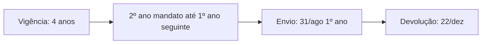
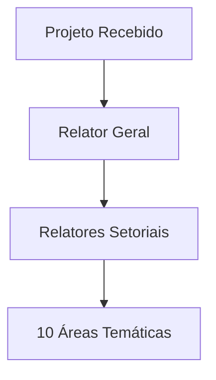

# Processo Legislativo das Matérias Orçamentárias

> **Nota elaborada para concurso da Câmara dos Deputados**  
> *Baseada no Art. 166 CF/88, Regimento Comum do Congresso Nacional e Regimento Interno da Câmara dos Deputados*

---

## 📋 Sumário Executivo

O processo legislativo orçamentário brasileiro possui características especiais que o distinguem do processo legislativo comum, sendo regulamentado pelo **Art. 166 da Constituição Federal**, pelo **Regimento Comum do Congresso Nacional** (Resolução CN nº 1/1970) e pela **Resolução CN nº 1/2006**, com aplicação subsidiária do Regimento Interno da Câmara dos Deputados.

**Principais características distintivas:**
- Tramitação em **sessão conjunta** das duas Casas
- Competência exclusiva da **Comissão Mista de Orçamento (CMO)**
- Emendas apresentadas **apenas na CMO** (não no Plenário)
- Prazos constitucionais **improrrogáveis** para aprovação
- Regime de **emendas impositivas** para individuais e de bancada

---

## 🏛️ Fundamento Constitucional

### Art. 166 da Constituição Federal

> *"Os projetos de lei relativos ao plano plurianual, às diretrizes orçamentárias, ao orçamento anual e aos créditos adicionais serão apreciados pelas duas Casas do Congresso Nacional, na forma do regimento comum."*

#### Dispositivos Relacionados:
- **Art. 165**: Define o conteúdo do PPA, LDO e LOA
- **Art. 167**: Estabelece vedações orçamentárias
- **ADCT Art. 35**: Prazos para elaboração das peças orçamentárias

---

## 🎯 Matérias Orçamentárias

### 1. Plano Plurianual (PPA)

**Conteúdo (Art. 165, §1º CF/88):**
- Diretrizes, objetivos e metas da administração pública federal
- Programas de duração continuada
- Despesas de capital e programas de duração continuada

### 2. Lei de Diretrizes Orçamentárias (LDO)

**Conteúdo (Art. 165, §2º CF/88):**
- Metas e prioridades da administração pública federal
- Orientação para elaboração da LOA
- Alterações na legislação tributária
- Política de aplicação das agências financeiras oficiais de fomento

⚠️ **Regra Especial:** Se não aprovada até 17/jul, a sessão legislativa não será interrompida (Art. 57, §2º CF/88).

### 3. Lei Orçamentária Anual (LOA)

**Composição (Art. 165, §5º CF/88):**
1. **Orçamento Fiscal** - Poderes da União, órgãos, entidades da administração
2. **Orçamento de Investimento** - Empresas estatais
3. **Orçamento da Seguridade Social** - Entidades e órgãos vinculados

### 4. Créditos Adicionais

| Tipo | Finalidade | Abertura | Vigência |
|------|------------|----------|----------|
| **Suplementares** | Reforço de dotação existente | Decreto (após autorização) | Exercício financeiro |
| **Especiais** | Despesas sem dotação específica | Lei específica | Exercício financeiro* |
| **Extraordinários** | Despesas urgentes (guerra, calamidade) | Medida Provisória/Decreto | Exercício financeiro* |

*Exceção: Se abertos nos últimos 4 meses, podem ser reabertos no exercício seguinte.

---

## 🏢 Comissão Mista de Orçamento (CMO)

### Fundamento Legal
- **Constitucional:** Art. 166, §1º CF/88
- **Infraconstitucional:** Resolução CN nº 1/2006

### Composição e Estrutura

#### Membros
- **40 titulares:** 30 Deputados + 10 Senadores
- **40 suplentes:** Mesma proporção
- **Proporcionalidade partidária**
- **Vedação:** Membros da comissão anterior não podem ser designados

#### Mesa Diretora
- **Presidente e Vice-Presidentes:** Alternância anual entre Deputado e Senador
- **Instalação:** Última terça-feira de março
- **Mandato:** 1 ano (vedada reeleição)

#### Comitês Permanentes
1. **CFIS** - Comitê de Avaliação, Fiscalização e Controle da Execução Orçamentária
2. **CAR** - Comitê de Avaliação da Receita  
3. **COI** - Comitê de Avaliação das Informações sobre Obras e Serviços com Indícios de Irregularidades Graves
4. **CAE** - Comitê de Exame da Admissibilidade de Emendas

#### Colegiados Especiais
- **CCBE** - Colegiado de Coordenadores das Bancadas Estaduais
- **CRLP** - Colegiado de Representantes das Lideranças Partidárias

### Competências (Art. 166, §1º CF/88)

#### I - Análise de Projetos
- Examinar e emitir parecer sobre PPA, LDO, LOA e créditos adicionais
- Examinar contas apresentadas pelo Presidente da República

#### II - Fiscalização
- Examinar planos e programas nacionais, regionais e setoriais
- Exercer acompanhamento e fiscalização orçamentária
- Atuar sem prejuízo das demais comissões (Art. 58 CF/88)

---

## ✏️ Sistema de Emendas Orçamentárias

### Classificação das Emendas

#### 1. Emendas Individuais Impositivas

**Marco Legal:** EC nº 86/2015, alterada pela EC nº 126/2022

**Características:**
- **Limite:** 2% da Receita Corrente Líquida (RCL)
- **Distribuição:** 1,55% Deputados + 0,45% Senadores (EC 126/2022)
- **Saúde:** Mínimo 50% para ações e serviços públicos de saúde
- **Execução:** Obrigatória (salvo impedimento técnico)

**Transferências (Art. 166-A CF/88):**
- **Transferência Especial:** Sem finalidade específica, 70% despesas de capital
- **Transferência com Finalidade Definida:** Vinculada ao objeto da emenda

#### 2. Emendas de Bancada Estadual

**Marco Legal:** EC nº 100/2019

**Características:**
- **Limite:** 1% da RCL
- **Apresentação:** Até 8 emendas por bancada estadual
- **Execução:** Obrigatória (salvo impedimento técnico)
- **Continuidade:** Investimentos plurianuais devem ser renovados

#### 3. Emendas de Comissão
- **Natureza:** Não impositivas
- **Execução:** Discricionária
- **Apresentação:** Por comissões técnicas das Casas

#### 4. Emendas de Relatoria
- **Natureza:** Não impositivas  
- **Apresentação:** Relator Geral e Relatores Setoriais

### Requisitos para Aprovação (Art. 166, §3º CF/88)

As emendas ao projeto de LOA somente podem ser aprovadas caso:

#### I - Compatibilidade
- Compatíveis com PPA e LDO

#### II - Indicação de Recursos
Recursos provenientes de **anulação de despesa**, excluídas:
- a) Dotações para pessoal e seus encargos
- b) Serviço da dívida  
- c) Transferências tributárias constitucionais

#### III - Finalidades Específicas
- a) Correção de erros ou omissões
- b) Relacionadas aos dispositivos do texto do projeto

### Impedimentos de Ordem Técnica

**Fundamento:** Art. 166, §13 CF/88 e LCP nº 210/2024

#### Hipóteses Legais (Art. 10 LCP 210/2024):
1. Incompatibilidade do objeto com a ação orçamentária
2. Óbices que inviabilizem empenho no exercício
3. Ausência de projeto de engenharia aprovado
4. Ausência de licença ambiental prévia
5. Não comprovação de capacidade de custeio pelo ente beneficiado
6. Insuficiência de recursos para conclusão

#### Procedimento:
- **Análise:** Órgão executor declara impedimento fundamentado
- **Remanejamento:** Parlamentar pode indicar nova programação
- **Prazo:** Definido na LDO para superação de impedimentos

---

## ⚖️ Tramitação Regimental

### Processo na CMO (Resolução CN 1/2006)

#### 1. Recebimento e Autuação
- Matéria recebida pela Secretaria do Congresso Nacional
- Autuação, numeração e publicação em avulsos eletrônicos
- Definição de calendário de tramitação

#### 2. Distribuição

**Áreas Temáticas dos Relatores Setoriais:**
1. Agricultura e Desenvolvimento Agrário
2. Cidades, Viação e Transportes, e Comunicações
3. Ciência, Tecnologia, Educação, Cultura, Esporte e Saúde
4. Defesa Nacional e Segurança Pública
5. Desenvolvimento Regional e Turismo
6. Fazenda, Planejamento e Gestão
7. Integração Nacional, Meio Ambiente e Desenvolvimento Social
8. Justiça, Relações Exteriores e Defesa do Consumidor
9. Minas e Energia
10. Trabalho, Previdência e Assistência Social

#### 3. Apresentação de Emendas
- **Local:** Exclusivamente na CMO
- **Vedação:** Emendas no Plenário do Congresso Nacional
- **Prazos:** Definidos no calendário de tramitação
- **Análise:** Admissibilidade pelo CAE

#### 4. Relatórios
- **Setoriais:** Análise por área temática
- **Preliminar:** Relator Geral
- **Final:** Após debates e votação preliminar

#### 5. Votação na CMO
- **Quórum:** Maioria absoluta dos membros
- **Ordem:** Primeiro emendas, depois projeto
- **Parecer:** Aprovação do parecer final

### Sessão Conjunta do Congresso Nacional

#### Competência
- **Art. 1º, V Regimento Comum:** "discutir e votar o Orçamento"
- **Mesa Diretora:** Presidida pelo Presidente do Senado Federal

#### Procedimento
- **Relatório:** Apresentação pelo Relator Geral da CMO
- **Discussão:** Líderes partidários e parlamentares inscritos
- **Votação:** Texto da CMO em bloco
- **Destaque:** Possibilidade de votação em separado

#### Prazos para Votação
- **PPA:** Até 22/dezembro do 1º ano do mandato
- **LDO:** Até 17/julho (sessão não interrompida se não aprovada)
- **LOA:** Até 22/dezembro
- **Créditos Adicionais:** Sem prazo específico

### Sanção Presidencial

#### Prazo
- **15 dias úteis** para sanção ou veto (Art. 66 CF/88)

#### Possibilidades
1. **Sanção integral**
2. **Sanção com veto parcial**  
3. **Veto total** (raro em matérias orçamentárias)

#### Veto Presidencial
- **Comunicação:** Imediata ao Congresso Nacional
- **Prazo para apreciação:** 30 dias (Art. 66, §4º CF/88)
- **Quórum para derrubada:** Maioria absoluta em sessão conjunta

---

## 🚫 Vedações Orçamentárias (Art. 167 CF/88)

### Principais Vedações Relacionadas ao Processo Legislativo

#### I - Princípio da Legalidade Orçamentária
"O início de programas ou projetos não incluídos na lei orçamentária anual"

#### II - Princípio do Equilíbrio Orçamentário  
"A realização de despesas ou assunção de obrigações que excedam os créditos orçamentários ou adicionais"

#### V - Princípio da Autorização Legislativa
"A abertura de crédito suplementar ou especial sem prévia autorização legislativa e sem indicação dos recursos correspondentes"

#### VI - Princípio da Proibição do Estorno
"A transposição, o remanejamento ou a transferência de recursos de uma categoria de programação para outra ou de um órgão para outro, sem prévia autorização legislativa"

**Definições:**
- **Remanejamento:** Alteração entre órgãos diferentes
- **Transposição:** Alteração entre programas do mesmo órgão  
- **Transferência:** Alteração entre categorias econômicas do mesmo órgão e programa

**Exceção (§5º):** Atividades de ciência, tecnologia e inovação podem ser remanejadas por ato do Executivo.

---

## 📊 Aspectos Financeiros Especiais

### Execução Orçamentária das Emendas Impositivas

#### Obrigatoriedade (Art. 166, §11 CF/88)
"É obrigatória a execução orçamentária e financeira das programações oriundas de emendas individuais, em montante correspondente ao limite a que se refere o § 9º"

#### Critérios de Equidade (Art. 166, §19 CF/88)
- Tratamento **objetivo e imparcial**
- Atendimento **igualitário** às emendas
- **Independentemente da autoria**

#### Limitação Proporcional (Art. 166, §18 CF/88)
- Possibilidade de redução proporcional
- Apenas para cumprimento da meta fiscal da LDO
- Mesma proporção das demais despesas discricionárias

### Restos a Pagar (Art. 166, §17 CF/88)
- **Emendas Individuais:** Até 1% da RCL
- **Emendas de Bancada:** Até 0,5% da RCL

### Transferências para Entes Federados (Art. 166, §16 CF/88)
- **Independem** da adimplência do ente destinatário
- **Não integram** a base de cálculo da RCL para limites de pessoal

---

## 🔄 Especialidades do Processo Legislativo Orçamentário

### Diferenças do Processo Legislativo Comum

| Aspecto | Processo Comum | Processo Orçamentário |
|---------|----------------|----------------------|
| **Iniciativa** | Múltipla | Privativa do Executivo |
| **Tramitação** | Casas separadamente | Sessão conjunta |
| **Comissões** | Múltiplas por Casa | CMO exclusiva |
| **Emendas** | Em qualquer fase | Apenas na CMO |
| **Prazos** | Flexíveis | Constitucionais improrrogáveis |
| **Execução** | Não garantida | Impositiva (individuais/bancada) |

### Aplicação Subsidiária (Art. 166, §7º CF/88)
"Aplicam-se aos projetos mencionados neste artigo, no que não contrariar o disposto nesta seção, as demais normas relativas ao processo legislativo."

**Hierarquia Normativa:**
1. **Constituição Federal** (Art. 165-167)
2. **Regimento Comum** (Resolução CN 1/1970 e conexas)
3. **Resolução CN 1/2006** (processo orçamentário)
4. **Regimento do Senado** (Art. 151 Regimento Comum)
5. **Regimento da Câmara** (subsidiariamente)

---

## 🎓 Pontos de Atenção para Concursos

### 1. Pegadinhas Clássicas

❌ **ERRADO:** "Emendas podem ser apresentadas no Plenário do Congresso"
✅ **CORRETO:** Emendas são apresentadas exclusivamente na CMO

❌ **ERRADO:** "A LDO deve ser aprovada até 31 de dezembro"
✅ **CORRETO:** LDO deve ser aprovada até 17 de julho

❌ **ERRADO:** "Todas as emendas são impositivas"
✅ **CORRETO:** Apenas individuais e de bancada são impositivas

### 2. Mudanças Recentes (EC 126/2022)
- Limite de emendas individuais: **1,2% → 2%** da RCL
- Nova distribuição: **1,55% Deputados + 0,45% Senadores**
- Metade para saúde mantida: **50%** do total

### 3. Cronologia das Emendas Constitucionais
- **EC 86/2015:** Emendas individuais impositivas
- **EC 100/2019:** Emendas de bancada impositivas  
- **EC 105/2019:** Transferência especial e com finalidade definida
- **EC 126/2022:** Aumento do limite e nova distribuição

### 4. Casos Especiais
- **Estado de Calamidade:** Regime extraordinário (Art. 167-B a 167-G)
- **Novo Regime Fiscal:** Teto de gastos (ADCT Art. 106-110)
- **Ajuste Fiscal Estadual/Municipal:** Vedações temporárias (Art. 167-A)

---

## 📚 Legislação de Referência

### Constitucional
- **CF/88 Arts. 165-169:** Sistema orçamentário brasileiro
- **ADCT Art. 35:** Prazos para elaboração das leis orçamentárias
- **ADCT Arts. 106-110:** Novo Regime Fiscal

### Infraconstitucional
- **Lei 4.320/1964:** Normas gerais de direito financeiro
- **LCP 101/2000:** Lei de Responsabilidade Fiscal
- **LCP 210/2024:** Emendas parlamentares impositivas

### Regimental
- **Resolução CN 1/1970:** Regimento Comum do Congresso Nacional
- **Resolução CN 1/2006:** Comissão Mista de Orçamento
- **Resolução CD 17/1989:** Regimento Interno da Câmara dos Deputados

---

## 🎯 Exercícios de Fixação

### 1. Analise a assertiva:
"As emendas individuais ao projeto de lei orçamentária anual devem ser compatíveis com o plano plurianual e com a lei de diretrizes orçamentárias, indicando os recursos necessários através da anulação de despesas, sendo vedada a anulação de dotações para pessoal e encargos, serviços da dívida e transferências constitucionais."

**Resposta:** ✅ CORRETO - Art. 166, §3º, I e II, "a", "b" e "c" CF/88

### 2. Complete:
"A CMO é composta por ___ deputados e ___ senadores, sendo instalada até a ___ de ___, com mandato de ___ ano(s)."

**Resposta:** 30 deputados e 10 senadores, última terça-feira de março, 1 ano.

### 3. Marque V ou F:
( ) O PPA tem vigência de 4 anos, coincidindo exatamente com o mandato presidencial.
( ) A LDO deve ser aprovada até 17 de julho, sob pena de não interrupção da sessão legislativa.
( ) As emendas de bancada estadual têm limite de 1% da RCL e são impositivas.
( ) Os créditos extraordinários podem ser abertos por decreto em casos de calamidade pública.

**Respostas:** F, V, V, F (por MP no âmbito federal)

---

## 💡 Dicas de Memorização

### Mnemônicos

**Prazos de Envio:** "**A**bril **L**DO, **A**gosto **P**PA/**L**OA"
- **A**bril (15): **L**DO  
- **A**gosto (31): **P**PA e **L**OA

**Composição CMO:** "**3**0 **D**eputados, **1**0 **S**enadores = **4**0"
- **3**-**1** = Proporção Deputados-Senadores
- **4**0 total de titulares

**Emendas Impositivas:** "**I**ndividuais **2%**, **B**ancada **1%**"
- **I**-**2** (Individuais 2%)
- **B**-**1** (Bancada 1%)

---

**Autor:** Consultor da Câmara dos Deputados  
**Data:** Outubro de 2025  
**Versão:** 1.0