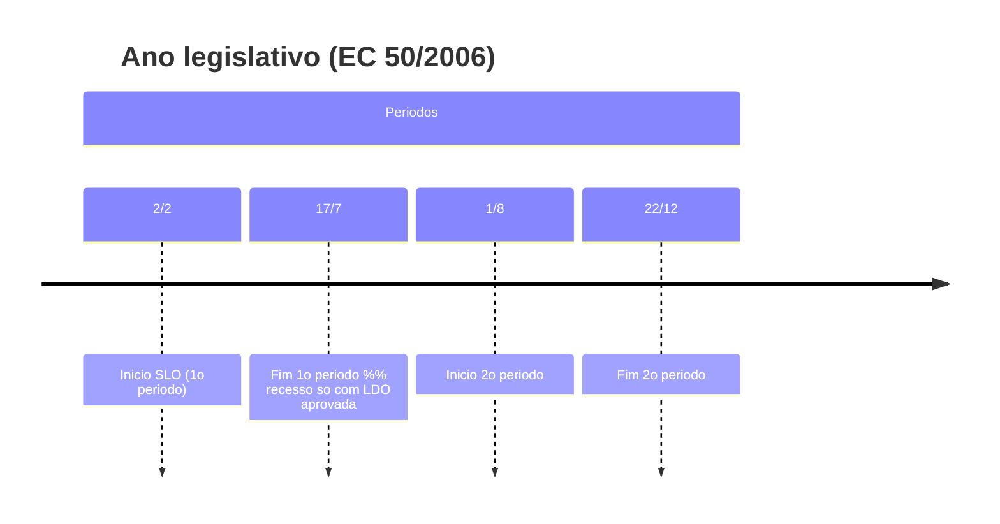

> [!summary] **Mapa do capítulo (o que cai)**
> - **Legislatura x Sessão Legislativa Ordinária (SLO)**, datas e exceções pós **EC 50/2006**.
> - **Convocação extraordinária** do CN: hipóteses, quem convoca, pauta e vedações.
> - **Sessão conjunta**: quando ocorre (CF art. 57 §3º; **RCCN art. 1º**), local, votação e classificação.
> - **Direção dos trabalhos**: composição e atuação das **Mesas**; substituição do presidente do CN.
> - **Lideranças**: reconhecimento no CN e **liderança do Governo** específica (RCCN **art. 4º**).

---

# 1) Considerações iniciais — Legislatura, SLO e eventos preparatórios

| Conceito | Regra prática | Observações e âncoras |
|---|---|---|
| **Legislatura** | Dura **4 anos** e começa **1º/2**. | SLO inicia **2/2** de todo ano; se cair em **sáb/dom/feriado**, transfere-se ao **1º dia útil** subsequente. *(anotações do curso)* |
| **SLO (datas atuais)** | **2/2 a 17/7** e **1/8 a 22/12** (pós **EC 50/2006**). | Antigo regime: 15/2–30/6 e 1/8–15/12. *(anotações do curso)* |
| **Interrupção em 17/7** | Só há recesso se a **LDO** estiver **aprovada** até 17/7. | Sem LDO aprovada, o CN segue reunido. *(anotações do curso)* |
| **Sessões preparatórias** | **1º e 3º anos** da legislatura para posse e eleição de Mesas. | CF prevê para o **1º ano**; **RISF/RICD** replicam no **3º ano** para 2º biênio das Mesas. *(anotações do curso)* |

> [!important] Pontos de prova
> - **A legislatura começa em 1º/2**; a **SLO começa em 2/2** (transferível ao 1º útil).  
> - Recesso de julho **depende** da LDO aprovada.  
> - Vedado pagar **indenizatória** por **convocação extraordinária** (vide bloco a seguir).

---

# 2) Convocação extraordinária (CF art. 57 §6º, §§7º-8º)

## Quem convoca e quando

| Quem convoca | Hipóteses | Observações chave |
|---|---|---|
| **Presidente do Senado Federal** | **Estado de Defesa**; **Intervenção Federal**; **pedido de autorização para Estado de Sítio**; **compromisso e posse do PR/VP**. | Convoca **sozinho**; não depende de aprovação prévia. *(CF 57 §6º I — notas do curso)* |
| **PR da República**, **Presidentes da CD e SF (conjuntamente)**, **maioria dos membros de ambas as Casas** | **Urgência** ou **interesse público relevante**. | Depende de **maioria absoluta** em **cada** Casa. *(CF 57 §6º II — notas do curso)* |

> [!note] **Pauta e pagamentos**
> - Na sessão legislativa extraordinária, delibera-se **apenas** o que estiver na **pauta de convocação**; **MPs vigentes** na data da convocação **entram automaticamente** na pauta. **Vedada** indenizatória por convocação. *(CF 57 §§7º–8º — notas do curso)*

### Exemplo prático (2023) — duas convocações pelo inciso I  
- **Posse do PR/VP** (ato convocatório de 16/12/2022 para 1/1/2023 — sessão solene).  
- **Intervenção Federal no DF** (8/1/2023): convocação extraordinária **sem ajuda de custo**, para apreciar o decreto. *(atos reproduzidos nas suas anotações)*

---

# 3) Sessão conjunta do Congresso Nacional

## 3.1 Quando há sessão conjunta? (comparativo CF × RCCN)

| **CF art. 57 §3º** | **RCCN art. 1º** |
|---|---|
| Inaugurar a sessão legislativa | Inaugurar a sessão legislativa |
| Elaborar o regimento comum | Elaborar/reformar o Regimento Comum |
| Regular serviços comuns às duas Casas | Caso abrangido em “demais casos da CF” |
| Compromisso/posse do PR/VP | Dar posse ao PR/VP eleitos |
| Conhecer e deliberar **veto** | Conhecer matéria vetada e deliberar |
| – | Promulgar **EC**, discutir e votar **Orçamento**, **delegação legislativa**, demais casos CF/RCCN |

Fonte e detalhamento do quadro: curso (Cap. 3) com âncoras explícitas a **RCCN art. 1º**. 

> [!location] **Local padrão e exemplos**
> **Plenário da Câmara dos Deputados**, salvo escolha prévia de outro local. Há precedentes também no **Plenário do Senado** (p.ex., sessão solene). :contentReference[oaicite:1]{index=1}

## 3.2 Classificação didática das sessões conjuntas
Ver **quadro 8** (curso) com marcação solene x deliberativa por item do **art. 1º do RCCN**. 

## 3.3 Processo de votação (separação de Casas)
- **Votos computados separadamente**; regra: vota primeiro a **CD** e depois o **SF**; **exceção**: em **veto de projeto de iniciativa de senador**, começa pelo **Senado** (RCCN **art. 43**). 
- **Voto contrário de uma Casa** → **rejeição** da matéria (RCCN **art. 43 §1º**). 

> [!tip] Lembrete conceitual
> Sessão conjunta = reunião simultânea **no mesmo local**, mas **votação separada por Casa**. Não confundir com **sessão unicameral** da revisão constitucional (1994). 
## 3.4 Modalidades de votação (RCCN arts. **44–47**)
- **Simbólica** (padrão): líderes **representam** votos dos liderados; cabe **verificação** por líder, 5 senadores ou 20 deputados (art. **45**). 
- **Nominal**: hoje operacionalizada por **painel eletrônico** em hipóteses regimentais (art. **46** e regras de vetos **106-B/106-D**, quando aplicável). *(ver curso para contexto e histórico)* 
- **Secreta**: residual por deliberação do Plenário (após EC 76/2013, vetos passaram a ser **ostensivos/nominais**). *(curso)*

## 3.5 Encerramento de discussão e requerimentos
- **Encerramento da discussão**: após o último inscrito; se estourar o tempo e houver inscritos, convoca-se nova sessão e, ao fim, considera-se encerrada (**art. 39**); também pode encerrar por **requerimento** (líder ou 10 de cada Casa), após **4 senadores + 6 deputados** terem falado. 
- **Adiamento**: **não** há adiamento de **discussão**; é possível **adiar votação** por **até 48h**, **somente por líder** e **sem** prejudicar prazos constitucionais (**art. 40**). 
- **Requerimentos em sessão conjunta**: **não** se discutem; cada Casa pode **encaminhar** por 2 membros (5 min.) (**art. 41**). 

> [!example] **Veto e prazo constitucional**
> O prazo de **30 dias** para apreciar veto (**CF 66 §4º**) conta da **protocolização** na **Presidência do Senado** (RCCN **art. 104-A**). Isso impacta a avaliação de **adiamento de votação** (art. **40** in fine). 
### Fluxo — Encerrar discussão e votar
```mermaid
flowchart LR
  A[Discussao em andamento] --> B{Oradores inscritos?}
  B -->|Nao| C[Encerrar discussao - art 39]
  B -->|Sim| D[Prossegue ate ultimo orador]
  D --> E{Estourou tempo da sessao?}
  E -->|Sim| F[Convoca nova sessao e encerra ao final - art 39]
  E -->|Nao| G[Possivel requerimento de encerramento - art 39 §1]
  G --> H[Se aprovado, vai a votacao]
  ```
  
## 4) Direção dos trabalhos (Mesas) e presidência no CN
#### 4.1 Quem dirige o quê (visão prática)

| Órgão                            | O que dirige                                                                                                                                |
| -------------------------------- | ------------------------------------------------------------------------------------------------------------------------------------------- |
| **Mesa do Congresso Nacional**   | **Sessões conjuntas** do CN (presidida pelo **Presidente do Senado** – CF 57 §5º; ver RCCN art. 1º para hipóteses). _(anotações + art. 1º)_ |
| **Mesa da Câmara dos Deputados** | Trabalhos legislativos e serviços administrativos da CD.                                                                                    |
| **Mesa do Senado Federal**       | Trabalhos legislativos do SF.                                                                                                               |
| **Mesas da CD e SF (conjuntas)** | **Promulgação de EC** em sessão conjunta **solene** (RCCN art. 1º III). _(curso)_                                                           |

## 4.2 Substituição do presidente da Mesa do CN (prática + jurisprudência)

- Impedido o **Presidente do Senado** (que preside a Mesa do CN), a **substituição** na **convocação** de sessão conjunta recai no **1º Vice-Presidente da Mesa do CN** (exercido pelo **1º Vice-Presidente da Câmara**), não no 1º VP do Senado, conforme entendimento citado no **curso** e precedentes do **STF** (caso de anulação de convocação feita pelo 1º VP do SF no exercício da Presidência). _(curso, itens 4.1.4)_
    

> [!hint] Terminologia  
> Em documentos oficiais, recomenda-se: **“Presidente da Mesa do Congresso Nacional”**. _(curso, 4.1.3)_

# 5) Lideranças no Congresso Nacional (RCCN **art. 4º**)

## 5.1 Reconhecimento das lideranças partidárias

- O **RCCN reconhece** as lideranças partidárias **de cada Casa** para atuação **em sessões conjuntas** e **comissões mistas** (RCCN **art. 4º caput**). _(curso)_
### 5.2 Liderança do Governo (no CN)

| Órgão                  | Líder                      | Vice-líderes                                          | Base                           |
| ---------------------- | -------------------------- | ----------------------------------------------------- | ------------------------------ |
| **Congresso Nacional** | **1** indicado pelo **PR** | até **18**, indicados pelo **Líder do Governo no CN** | **RCCN art. 4º §2º** _(curso)_ |
| **Senado**             | indicado pelo **PR**       | indicados pelo **Líder** (qtd. não fixa)              | **RISF 66-A** _(curso)_        |
| **Câmara**             | indicado pelo **PR**       | **20** indicados pelo **PR**                          | **RICD art. 11** _(curso)_     |
Apêndice — Procedimentos de discussão e votação (quick ref.)

|Tema|Regra|RCCN|
|---|---|---|
|**Discussão**|Oradores por inscrição, até **20 min**; de preferência alternando favoráveis x contrários; pode encerrar por exaustão, por nova sessão ao fim, ou por **requerimento** (líder **ou** 10 de cada Casa, após **4 sen. + 6 dep.**)|**arts. 38–39**.|
|**Adiamento**|**Não** há adiamento de discussão; pode haver **adiamento de votação** (até **48h**, **apenas líder**, sem prejudicar prazos constitucionais)|**art. 40**.|
|**Requerimentos**|Não se discutem; encaminhamento por **2 membros de cada Casa** (5 min)|**art. 41**.|
|**Votação separada**|Votos **sempre** separados; **voto contrário** de uma Casa **rejeita**; ordem: **CD → SF**; exceção: **veto de iniciativa de senador** (**SF → CD**)|**art. 43**.|
|**Processo simbólico**|Líderes **representam** votos dos liderados presentes; cabe **verificação** (líder; 5 sen.; 20 dep.)|**art. 45**.|
|**Veto — prazo**|30 dias (CF 66 §4º) contado da **protocolização no SF** (**art. 104-A**)|**art. 104-A** + art. 40 (prejuízo).|

### Diagramas para memorizar
```mermaid
timeline
  title Ano legislativo (EC 50/2006)
  section Periodos
    2/2 : Inicio SLO (1o periodo)
    17/7 : Fim 1o periodo  %% recesso so com LDO aprovada
    1/8 : Inicio 2o periodo
    22/12 : Fim 2o periodo
```

### Quem convoca o CN (extraordinária)

SLO: marcos do ano legislativo



