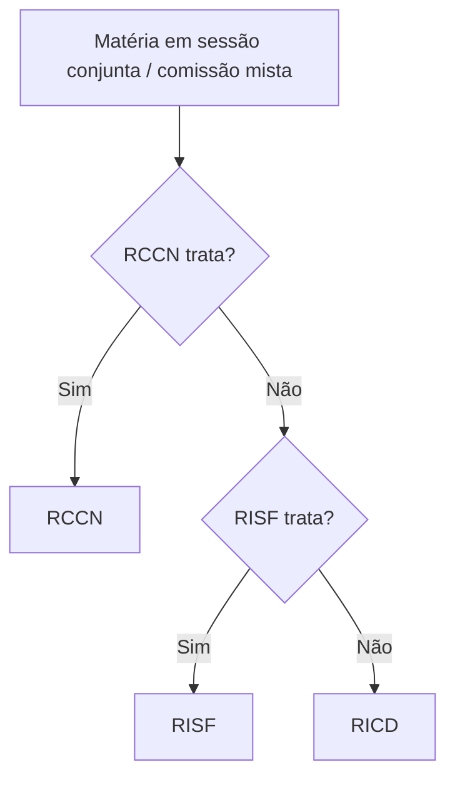
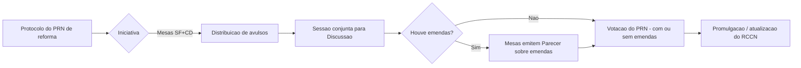

> [!sumário] **O que você vai ver aqui**
> - Fontes normativas que regem o CN e o processo legislativo federal.  
> - Como o RCCN se aplica e quando usar RISF/RICD supletivamente.  
> - Sessões conjuntas (panorama).  
> - **Como se reforma o RCCN** (iniciativa, emendas, pareceres, discussão e votação).  
> - Quadro-resumo de resoluções **integrantes** do RCCN.

## 1) Fontes normativas (mapa rápido)

| Camada | Norma | Escopo | Observações |
|---|---|---|---|
| 1 | **CF/88 (arts. 44 a 75)** | Poder Legislativo federal | Princípios estruturantes do bicameralismo e do processo legislativo. |
| 2 | **RCCN (Resolução CN nº 1/1970)** | Trabalhos **conjuntos** do CN | Define sessões conjuntas, comissões mistas e reforma do próprio RCCN (art. 1º; art. 128-130). :contentReference[oaicite:0]{index=0} :contentReference[oaicite:1]{index=1} |
| 3 | **RISF** e **RICD** | Regras internas de cada Casa | Aplicação **supletiva** quando o RCCN for omisso (ordem: RCCN → RISF → RICD). :contentReference[oaicite:2]{index=2} |

> [!important] **Aplicação supletiva (não é hierarquia)**
> “Nos casos omissos neste Regimento aplicar-se-ão as disposições do Regimento do Senado e, se este ainda for omisso, as do da Câmara dos Deputados.” (**RCCN, art. 151**). 

### Diagrama — Qual regimento usar?

## 2) Sessões conjuntas (panorama do art. 1º RCCN)

O RCCN lista quando Câmara e Senado se reúnem sob direção da Mesa do CN: inaugurar a sessão legislativa; dar posse ao PR/VP; **promulgar EC**; discutir e votar o Orçamento; deliberar sobre **veto**; delegação legislativa (inc. IX); e **elaborar ou reformar o Regimento Comum** (inc. XI).

## 3) **Reforma do RCCN** (cap. 2 do seu curso + RCCN arts. 128 a 130)

### 3.1 Quadro-síntese (com base nas suas anotações, ancorado nos arts. 128-130)

|Etapa|Regra (suas anotações)|Âncora no RCCN|
|---|---|---|
|**Iniciativa**|a) **Conjunta** das Mesas do SF e da CD; **ou** b) **Coletiva** de **100** congressistas (mín.: 20 senadores + 80 deputados).|“Reforma do Regimento Comum — **arts. 128 a 130** (iniciativa I e II; n.º mínimo de subscritores)”.|
|**Emendas**|De **qualquer congressista**, até o **encerramento da discussão**.|Emendas e votação da matéria vinculadas ao **art. 129**.|
|**Pareceres**|Em **PRN de iniciativa parlamentar**, as **Mesas** do SF e da CD emitem **parecer**; pode haver **parecer único por acordo**.|“Parecer das Mesas… — **art. 128, §3º**; **parecer único — art. 130**.”|
|**Discussão**|Em **sessão conjunta** convocada (segundo suas notas: após avulsos, se a iniciativa é das Mesas; ou após prazo para parecer quando iniciativa é parlamentar).|Sessão conjunta: **art. 1º, XI**; dinâmica nos **arts. 128-129**.|
|**Votação**|**Imediatamente após a discussão**; se houver emendas, após o **prazo para parecer** sobre elas (suas notas mencionam janelas de **15d/10d/5d**).|Regras de votação ancoradas no **art. 129**.|

>[!tip] Dicas de prova
>- Cite **art. 151** quando perguntarem “qual regimento aplico se o RCCN for omisso?”.
>- Para **iniciativa** da reforma, mencione **art. 128, I e II** e o número mínimo de subscritores.
>- **Parecer único** por acordo entre as Mesas = **art. 130**

3.2 Fluxo (alto nível) — Reforma do RCCN

A ideia é montar um teste interativo nesse chat apenas com questões de Administração Geral. O quiz seria no estilo cebraspe. Busque analizar questões de concursos passados, buscar uma capacidade preditiva e didatica para o concurso da Câmara dos Deputados de 2026.
## 4) Resoluções “**parte integrante**” do RCCN (exemplos clássicos)

|Resolução CN|Tema|Base textual que declara “parte integrante do RCCN”|
|---|---|---|
|**Res. 3/1990**|Comissão Representativa do CN|Art. 1º da própria Res. 3/1990 (texto incorporado no compêndio do RCCN).|
|**Res. 1/2002**|Apreciação de **Medidas Provisórias** (art. 62 CF)|(Listada no seu curso, com a mesma fórmula do art. 1º).|
|**Res. 1/2006**|**CMO** e tramitação orçamentária (art. 166 CF)|(Listada no seu curso, com a mesma fórmula do art. 1º).|
|**Res. 4/2008**|Comissão Mista Permanente sobre **Mudanças Climáticas**|(Listada no seu curso, com a mesma fórmula do art. 1º).|
|**Res. 2/2013**|**CCAI** — Controle das Atividades de Inteligência|(Listada no seu curso, com a mesma fórmula do art. 1º).|

> [!abstract] Observação útil  
O PDF consolidado do RCCN **inclui** a Res. 3/1990 com a cláusula de “parte integrante” (você verá o texto dentro do próprio compêndio).

## 5) Anotações do curso (Cap. 2) — checkpoints para revisão

- **Prazos usuais na reforma** (segundo o seu material):
    
    - **15 dias** para parecer (iniciativa parlamentar); **5 dias** para realizar a sessão de discussão após convocação; **10 dias** para parecer sobre emendas.
        
    - **Votação**: em regra, **imediata após discussão**, ou após o prazo de parecer das emendas.
        
    - (Âncora no RCCN: arts. **128-130**; emendas e votação, **art. 129**).

