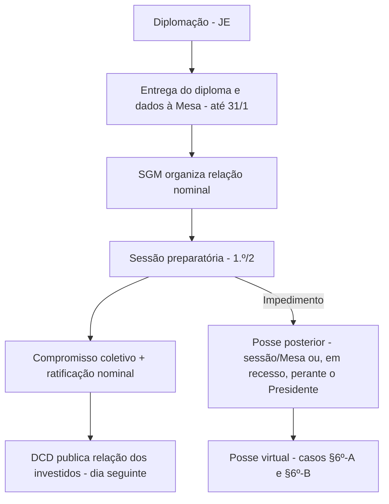

---

---
___
title: "Posse dos Deputados — procedimentos, posse posterior e compromisso"  
subtitle: "Guia prático (Consultoria Legislativa)"  
status: "versão de estudo"  
updated: "2025-10-22"  
___

# Posse dos Deputados (RICD)

> [!summary] Visão geral  
> A posse envolve (i) **providências anteriores** (externas e internas), (ii) o **rito da sessão preparatória** (compromisso solene), (iii) **providências do dia seguinte**, (iv) hipóteses de **posse posterior** e (v) a relação entre **compromisso de posse** e **investidura no mandato**.

---

## 1. Procedimentos

### 1.1. Anteriores à sessão de posse

#### 1.1.1. Externos (fora da Câmara)

- **Diplomação** pela Justiça Eleitoral.
    
- Organização documental (diploma, dados pessoais, contatos da assessoria/partido).
    
- Preparação logística para o dia 1.º/2 (1.º ano da legislatura).
    

> [!tip] Checklist — providências externas
> 
> -  Diploma expedido pela Justiça Eleitoral
>     
> -  Documentos pessoais/fiscais organizados
>     
> -  Contatos da assessoria, partido e gabinete provisório
>     

#### 1.1.2. Internos (na Câmara)

- **Apresentação do diploma e dados à Mesa (até 31/1):**
    
    > “O candidato diplomado Deputado Federal deverá apresentar à Mesa, pessoalmente ou por intermédio do seu Partido, **até o dia 31 de janeiro** do ano de instalação de cada legislatura, o **diploma expedido pela Justiça Eleitoral**, juntamente com a **comunicação de seu nome parlamentar, legenda partidária e unidade da Federação**…”  
    > — **RICD, art. 3º, caput**
    
- **Nome parlamentar (2 elementos):**
    
    > “O **nome parlamentar** compor-se-á, salvo quando, a juízo do Presidente, devam ser evitadas confusões, **apenas de dois elementos**: um prenome e o nome; dois nomes; ou dois prenomes.”  
    > — **RICD, art. 3º, § 1º**
    
- **Relação oficial (SGM) antes da posse:**
    
    > “Caberá à **Secretaria-Geral da Mesa organizar a relação dos Deputados diplomados**, que deverá estar concluída **antes da instalação da sessão de posse**.”  
    > — **RICD, art. 3º, § 2º**
    
- **Critérios da relação nominal:** por **UF** (de norte a sul) e por **ordem alfabética** do **nome parlamentar** (com legenda).
    
    > — **RICD, art. 3º, § 3º**
    

> [!check] Checklist — internos (até 31/1)
> 
> -  Entregar **diploma** à Mesa
>     
> -  Informar **nome parlamentar** (2 elementos)
>     
> -  Informar **legenda** e **UF**
>     
> -  Conferir **relação nominal** organizada pela SGM
>     

---

### 1.2. No dia da sessão de posse (sessão preparatória)

**Convocação e direção dos trabalhos (1.º/2, 1.º ano da legislatura):**

> “Os candidatos diplomados Deputados Federais **reunir-se-ão em sessão preparatória**, na sede da Câmara dos Deputados.”  
> — **RICD, art. 4º, caput**  
> “**Assumirá a direção dos trabalhos o último Presidente**, se reeleito Deputado, e, na sua falta, **o Deputado mais idoso, dentre os de maior número de legislaturas**.”  
> — **RICD, art. 4º, § 1º**

**Secretários da Mesa provisória e proclamação:**

> “Aberta a sessão, o Presidente **convidará quatro Deputados**, de preferência de **Partidos diferentes**, para servirem de Secretários e **proclamará os nomes** dos Deputados diplomados, constantes da relação…”  
> — **RICD, art. 4º, § 2º**

**Compromisso solene — conteúdo e ritual (coletivo + ratificação nominal):**

> “Examinadas e decididas as reclamações… **será tomado o compromisso solene**. **De pé todos os presentes**, o Presidente proferirá a seguinte declaração:  
> ‘**Prometo manter, defender e cumprir a Constituição, observar as leis, promover o bem geral do povo brasileiro e sustentar a união, a integridade e a independência do Brasil**’.  
> Ato contínuo, feita a chamada, **cada Deputado, de pé**, a ratificará dizendo: **‘Assim o prometo’**, permanecendo os demais Deputados sentados e em silêncio.”  
> — **RICD, art. 4º, § 3º**

**Inalterabilidade do conteúdo e do rito; vedações:**

> “**O conteúdo do compromisso e o ritual** de sua prestação **não poderão ser modificados**; o compromissando **não poderá apresentar, no ato, declaração oral ou escrita, nem ser empossado por procurador**.”  
> — **RICD, art. 4º, § 4º**

> [!example] Passos práticos no Plenário (roteiro)
> 
> 1. Presidente (reeleito) ou decano dirige a sessão
>     
> 2. Convite a **4 Secretários** (preferência por partidos distintos)
>     
> 3. **Proclamação** dos nomes (relação da SGM)
>     
> 4. **Compromisso coletivo** (texto fixo)
>     
> 5. **Chamada nominal** → “Assim o prometo”
>     

---

### 1.3. No dia seguinte à sessão de posse

**Publicação oficial (base de presença/quórum/votações):**

> “O Presidente fará **publicar, no Diário da Câmara dos Deputados do dia seguinte, a relação dos Deputados investidos no mandato**, […] a qual […] **servirá para o registro do comparecimento, verificação de quórum e votações nominais e por escrutínio secreto**.”  
> — **RICD, art. 4º, § 9º**

> [!done] Efeitos práticos imediatos
> 
> -  Consolidação de **investidura**
>     
> -  Habilita a **contagem de presença** e **quórum**
>     
> -  Insere o parlamentar nas **votações nominais e secretas**
>     

---

## 2. Posse posterior

Quando o parlamentar **não toma posse na sessão preparatória**:

- **Forma e local:**
    
    > “O Deputado **empossado posteriormente** prestará o compromisso **em sessão e junto à Mesa**; **se em recesso**, **perante o Presidente**.”  
    > — **RICD, art. 4º, § 5º**
    
- **Prazos (30 + 30) e marcos iniciais:**
    
    > “Salvo motivo de força maior ou enfermidade, a **posse dar-se-á no prazo de 30 dias, prorrogável por igual período**, contado:  
    > I – da **primeira sessão preparatória**;  
    > II – da **diplomação** (se eleito no curso da legislatura);  
    > III – do **fato que a ensejar**, quando a posse se verificar por **convocação do Presidente**.”  
    > — **RICD, art. 4º, § 6º**
    
- **Posse por videoconferência (excepcional):**
    
    > “Poderá o Presidente, **mediante requerimento**, **colher o compromisso de posse por videoconferência** durante a sessão preparatória **ou no mesmo dia** de sua realização, acompanhado o ato pela SGM, que lavrará termo.”  
    > — **RICD, art. 4º, § 6º-A** (Res. 37/2022)
    
- **Direito à posse virtual (licença-gestante):**
    
    > “Nos casos de **licença-gestante**, […] o requerimento, acompanhado da **declaração de parto em período inferior a 120 dias**, **assegura o direito à posse virtual** à parlamentar diplomada.”  
    > — **RICD, art. 4º, § 6º-B** (Res. 37/2022)
    

> [!warning] Atenção — perda de prazo  
> Atraso **sem justificativa idônea** compromete a investidura. Utilize o **pedido de prorrogação** com fundamento (força maior/enfermidade) quando necessário.

---

## 3. Compromisso de posse × mandato (investidura)

- **Dispensa de novo compromisso (suplente e retorno do titular):**
    
    > “Tendo **prestado o compromisso uma vez**, fica o **Suplente** dispensado de fazê-lo em convocações subsequentes, **bem como o Deputado ao reassumir o lugar**, sendo a volta comunicada à Casa pelo Presidente.”  
    > — **RICD, art. 4º, § 7º**
    
- **Sem compromisso ‘nos estritos termos’ = sem investidura:**
    
    > “**Não se considera investido** no mandato de Deputado Federal **quem deixar de prestar o compromisso nos estritos termos regimentais**.”  
    > — **RICD, art. 4º, § 8º**
    

> [!important] Essência jurídica (consultoria)
> 
> - **Diplomação ≠ investidura.** A diplomação é condição prévia; a **investidura** decorre do **compromisso válido (conteúdo e rito imutáveis)** no **prazo**.
>     
> - A publicação no **DCD (dia seguinte)** consolida quem conta para **presença**, **quórum** e **votações**.
>     

---

## Apêndices operacionais

> [!abstract] Linha do tempo (modelo)  
> **T−15 → T−1 (janeiro):** diploma + dados à Mesa; conferência da relação da SGM.  
> **T0 (1.º/2):** sessão preparatória; direção dos trabalhos; 4 Secretários; proclamação dos nomes; **compromisso** → “Assim o prometo”.  
> **T+1:** **DCD** publica a **relação dos investidos** → presença/quórum/votações.  
> **Após T0 (se cabível):** **posse posterior** (sessão/Mesa; recesso → perante o Presidente; hipóteses de **posse virtual**).

> [!check] Micro-checklist do dia
> 
> -  Documento de identidade
>     
> -  Confirmação de protocolo (diploma/dados)
>     
> -  Contatos da SGM/Mesa
>     
> -  Roteiro de deslocamento e credenciamento
>     

---

### Observações didáticas (Curso de Regimento)

- **Objetivo do rito**: conferir **formalidade, publicidade e segurança jurídica** à investidura.
    
- **Nome parlamentar** com 2 elementos visa **padronização** e evita homonímia.
    
- **Relação nominal (SGM)** garante **ordenação por UF** e **controle do Plenário**.
    
- **Compromisso** é **ato único e coletivo**, seguido de **ratificação individual**, preservando simultaneidade e identificação nominal.
    
- **Posse posterior** resguarda o mandato em situações legítimas (força maior, enfermidade), com **controle de prazos** e **soluções tecnológicas** (videoconferência).
    

---

> [!cite] Dispositivos-chave RICD (para consulta rápida)
> 
> - **Art. 3º** (diploma, nome parlamentar, SGM e relação nominal)
>     
> - **Art. 4º, caput e §§ 1º–4º** (sessão preparatória, direção, secretários, proclamação, compromisso e rito)
>     
> - **Art. 4º, §§ 5º–9º** (posse posterior; prazos; videoconferência; licença-gestante; dispensa de novo compromisso; não investidura; publicação no DCD)
>     

---

# 1) O que é a SGM (conceito + missão)

A **Secretaria-Geral da Mesa (SGM)** é o **órgão técnico-legislativo que apoia a Mesa Diretora e a Presidência** na condução do Plenário e do processo legislativo. Em termos práticos, ela:

- **coordena as atividades legislativas**, acompanha e assessora as **sessões do Plenário**,
    
- **registra** e controla informações sobre **tramitação** e **movimentação parlamentar**, presença/quórum e **votações**,
    
- presta **assessoria técnico-jurídica** à Mesa e à Presidência. ([Portal da Câmara dos Deputados](https://www2.camara.leg.br/a-camara/estruturaadm/secretarias/secretaria-geral-da-mesa?utm_source=chatgpt.com "Secretaria-Geral da Mesa - Câmara dos Deputados"))
    

No próprio **Regimento Interno da Câmara (RICD)**, a SGM aparece como peça operacional do rito: por exemplo, **organiza a relação dos diplomados** antes da posse (art. 3º, §2º) e é canal operacional de remessa de proposições às comissões (art. 139, III). ([Portal da Câmara dos Deputados](https://www2.camara.leg.br/atividade-legislativa/legislacao/regimento-interno-da-camara-dos-deputados/arquivos-1/RICD%20atualizado%20ate%20RCD%2016-2025.pdf "REGIMENTO INTERNO DA CÂMARA DOS DEPUTADOS"))

> Dica de prova: guarde a distinção “**SGM = Plenário/rito**” vs. “**Diretoria-Geral = administração**”. A SGM está colada à Mesa e ao funcionamento do processo legislativo; a Diretoria-Geral cuida da máquina administrativa.

---

# 2) Onde ela se encaixa (posição institucional)

A SGM **assessora diretamente a Mesa Diretora**, que é quem dirige os trabalhos legislativos e administrativos da Câmara. (A página institucional da Mesa e do SGM deixa essa subordinação clara.) ([Portal da Câmara dos Deputados](https://www2.camara.leg.br/comunicacao/assessoria-de-imprensa/guia-para-jornalistas/mesa-diretora?utm_source=chatgpt.com "Mesa Diretora - Câmara dos Deputados"))

O **Presidente da Câmara** inclusive **dá posse** ao **Secretário-Geral da Mesa**, evidenciando o vínculo hierárquico-funcional do titular com a Chefia da Casa. (RICD histórico consolidado). ([Portal da Câmara dos Deputados](https://www.camara.leg.br/internet/legislacao/regimento_interno/RIpdf/regInterno.pdf "RICD 2004 com atualizações até res. 23-2004 _26-5-2004_.doc"))

---

# 3) Composição e estrutura (quem faz parte)

A SGM é **chefiada pelo Secretário-Geral da Mesa** e conta com **Secretários-Gerais Adjuntos** com focos específicos (por exemplo, **Adjunto de Plenário**, **Adjunto de Coordenação Técnico-Jurídica** e **Adjunta de Planejamento da Atividade Legislativa**). Esses cargos e seus titulares aparecem nas páginas oficiais de contatos e de estrutura, e podem variar por **Ato da Mesa** que ajusta funções e organogramas. ([Portal da Câmara dos Deputados](https://www2.camara.leg.br/a-camara/estruturaadm/secretarias/secretaria-geral-da-mesa/contatos?utm_source=chatgpt.com "Contatos - Câmara dos Deputados"))

Unidades típicas da SGM incluem, entre outras, **Assessoria Técnico-Jurídica** e áreas voltadas ao **Plenário** e ao **planejamento da atividade legislativa** — espelhando suas frentes de atuação (técnico-jurídica, procedimentos e plenário). ([Portal da Câmara dos Deputados](https://www2.camara.leg.br/a-camara/estruturaadm/secretarias/secretaria-geral-da-mesa?utm_source=chatgpt.com "Secretaria-Geral da Mesa - Câmara dos Deputados"))

> Regra institucional: alterações finas de estrutura (criação/extinção de funções) costumam ser feitas por **Atos da Mesa** — por isso é comum ver ajustes como o **Ato da Mesa nº 59/2023** mexendo nas funções comissionadas da SGM. ([Portal da Câmara dos Deputados](https://www2.camara.leg.br/legin/int/atomes/2023/atodamesa-59-3-maio-2023-794144-publicacaooriginal-167759-cd-mesa.html?utm_source=chatgpt.com "ATO DA MESA Nº 59, DE 03/05/2023 - Publicação Original"))

---

# 4) Atribuições-chave (o que a SGM faz na prática)

**Antes da posse / início de legislatura**

- **Organiza a relação oficial dos deputados diplomados** (por UF e ordem alfabética do nome parlamentar), **antes da instalação da sessão de posse** (art. 3º, §§2º–3º, RICD). ([Portal da Câmara dos Deputados](https://www2.camara.leg.br/atividade-legislativa/legislacao/regimento-interno-da-camara-dos-deputados/arquivos-1/RICD%20atualizado%20ate%20RCD%2016-2025.pdf "REGIMENTO INTERNO DA CÂMARA DOS DEPUTADOS"))
    

**Durante a tramitação ordinária**

- **Recebe, numera e encaminha proposições** no fluxo formal: o RICD prevê explicitamente que a **remessa de proposições às comissões é feita por intermédio da SGM**, com prazos e ordem (art. 139, III, RICD). Isso consolida a SGM como **hub processual** entre Mesa/Plenário e Comissões. ([Portal da Câmara dos Deputados](https://www.camara.leg.br/internet/legislacao/regimento_interno/RIpdf/regInterno.pdf "RICD 2004 com atualizações até res. 23-2004 _26-5-2004_.doc"))
    

**Em Plenário**

- **Assessorar as sessões** (instalação, condução, registros, atas; presença, quórum e votações), além da **assessoria técnico-jurídica** constante à Mesa/Presidência — descrição institucional. ([Portal da Câmara dos Deputados](https://www2.camara.leg.br/a-camara/estruturaadm/secretarias/secretaria-geral-da-mesa?utm_source=chatgpt.com "Secretaria-Geral da Mesa - Câmara dos Deputados"))
    

**Publicidade e registros**

- **Publicações no Diário da Câmara** e manutenção dos **registros de tramitação** e **movimentação parlamentar** — descrição institucional. ([Portal da Câmara dos Deputados](https://www2.camara.leg.br/a-camara/estruturaadm/secretarias/secretaria-geral-da-mesa?utm_source=chatgpt.com "Secretaria-Geral da Mesa - Câmara dos Deputados"))
    

---

# 5) “Regras do jogo” (normas que tocam a SGM)

1. **Regimento Interno (RICD)**
    
    - **Art. 3º, §§2º–3º**: SGM **organiza a relação** dos diplomados (posse). ([Portal da Câmara dos Deputados](https://www2.camara.leg.br/atividade-legislativa/legislacao/regimento-interno-da-camara-dos-deputados/arquivos-1/RICD%20atualizado%20ate%20RCD%2016-2025.pdf "REGIMENTO INTERNO DA CÂMARA DOS DEPUTADOS"))
        
    - **Art. 139, III**: **Remessa às comissões** é “**por intermédio da SGM**”, com prazo de chegada **até a sessão seguinte** (ou **imediatamente**, em **urgência**). ([Portal da Câmara dos Deputados](https://www.camara.leg.br/internet/legislacao/regimento_interno/RIpdf/regInterno.pdf "RICD 2004 com atualizações até res. 23-2004 _26-5-2004_.doc"))
        
2. **Atos da Mesa (normas administrativas)**
    
    - Ajustam **estrutura e funções comissionadas** da SGM (ex.: Ato da Mesa nº 59/2023). Em concursos, isso cai como **“quem pode alterar a estrutura”** e **“por qual instrumento”**: **Mesa Diretora, por Ato da Mesa**. ([Portal da Câmara dos Deputados](https://www2.camara.leg.br/legin/int/atomes/2023/atodamesa-59-3-maio-2023-794144-publicacaooriginal-167759-cd-mesa.html?utm_source=chatgpt.com "ATO DA MESA Nº 59, DE 03/05/2023 - Publicação Original"))
        
3. **Relação com a Mesa e com a Presidência**
    
    - A **Mesa dirige** os trabalhos legislativos; a SGM **assessora** e **opera** o rito. O **Presidente** dá **posse** ao Secretário-Geral, reforçando a **subordinação funcional**. ([Portal da Câmara dos Deputados](https://www2.camara.leg.br/comunicacao/assessoria-de-imprensa/guia-para-jornalistas/mesa-diretora?utm_source=chatgpt.com "Mesa Diretora - Câmara dos Deputados"))
        

---

## Para fixar (resumo em 6 linhas)

- **O que é:** braço **técnico-legislativo** da Mesa/Presidência para Plenário e processo. ([Portal da Câmara dos Deputados](https://www2.camara.leg.br/a-camara/estruturaadm/secretarias/secretaria-geral-da-mesa?utm_source=chatgpt.com "Secretaria-Geral da Mesa - Câmara dos Deputados"))
    
- **Onde fica:** no topo do eixo **Plenário-Mesa-Presidência** (não é área administrativa geral). ([Portal da Câmara dos Deputados](https://www2.camara.leg.br/comunicacao/assessoria-de-imprensa/guia-para-jornalistas/mesa-diretora?utm_source=chatgpt.com "Mesa Diretora - Câmara dos Deputados"))
    
- **Quem compõe:** **Secretário-Geral** + **Adjuntos** (Plenário; Coordenação Técnico-Jurídica; Planejamento) + unidades como **Assessoria Técnico-Jurídica**. ([Portal da Câmara dos Deputados](https://www2.camara.leg.br/a-camara/estruturaadm/secretarias/secretaria-geral-da-mesa/contatos?utm_source=chatgpt.com "Contatos - Câmara dos Deputados"))
    
- **O que faz:** sessões do Plenário, quórum, votações, registros, **remessa às comissões**, publicações. ([Portal da Câmara dos Deputados](https://www2.camara.leg.br/a-camara/estruturaadm/secretarias/secretaria-geral-da-mesa?utm_source=chatgpt.com "Secretaria-Geral da Mesa - Câmara dos Deputados"))
    
- **Base normativa:** RICD (arts. **3º, §§2º–3º**; **139, III**), **Atos da Mesa** (estrutura). ([Portal da Câmara dos Deputados](https://www2.camara.leg.br/atividade-legislativa/legislacao/regimento-interno-da-camara-dos-deputados/arquivos-1/RICD%20atualizado%20ate%20RCD%2016-2025.pdf "REGIMENTO INTERNO DA CÂMARA DOS DEPUTADOS"))
    
- **Regra de ouro:** **tudo que é rito de Plenário passa pela SGM**; **tudo que é máquina administrativa geral passa pela Diretoria-Geral**. ([Portal da Câmara dos Deputados](https://www2.camara.leg.br/a-camara/estruturaadm/secretarias/secretaria-geral-da-mesa?utm_source=chatgpt.com "Secretaria-Geral da Mesa - Câmara dos Deputados"))
    

