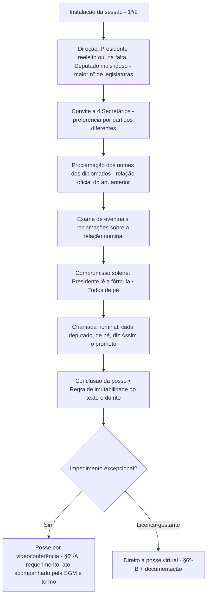

> [!summary] O que acontece neste dia?  
> No **dia 1º de fevereiro do 1º ano da legislatura**, realiza-se a **sessão preparatória** de posse. Nela, define-se **quem dirige os trabalhos**, compõe-se uma **Mesa provisória** (4 secretários), **proclamam-se** os nomes dos diplomados e toma-se o **compromisso solene** — cujo **conteúdo e ritual são imutáveis**. Existem hipóteses **excepcionais** de posse por **videoconferência** e, no caso de **licença-gestante**, direito à **posse virtual**.

---

## 1) Texto-base (citações diretas do RICD)

> **Caput — convocação e data**  
> “**No dia 1º de fevereiro do primeiro ano de cada legislatura**, os candidatos diplomasdos deputados federais **reunir-se-ão em sessão preparatória**, na sede da Câmara dos Deputados.”

> **§ 1º — quem dirige os trabalhos**  
> “**Assumirá a direção dos trabalhos o último presidente, se reeleito deputado**, e, **na sua falta, o deputado mais idoso, dentre os de maior número de legislaturas**.”

> **§ 2º — Mesa provisória e proclamação**  
> “Aberta a sessão, **o presidente convidará quatro deputados**, de preferência **de partidos diferentes**, para servirem de **secretários** e **proclamará os nomes** dos deputados diplomados, constantes da relação a que se refere o artigo anterior.”

> **§ 3º — compromisso solene (conteúdo e ritual)**  
> “Examinadas e decididas […] as reclamações atinentes à relação nominal dos deputados, **será tomado o compromisso solene** dos empossados. **De pé todos os presentes**, o presidente proferirá a seguinte declaração:  
> **‘Prometo manter, defender e cumprir a Constituição, observar as leis, promover o bem geral do povo brasileiro e sustentar a união, a integridade e a independência do Brasil’.**  
> **Ato contínuo, feita a chamada, cada deputado, de pé, a ratificará dizendo: ‘Assim o prometo’**, permanecendo os demais deputados sentados e em silêncio.”

> **§ 4º — inalterabilidade e vedações**  
> “**O conteúdo do compromisso e o ritual de sua prestação não poderão ser modificados**; o compromissando **não poderá apresentar, no ato, declaração oral ou escrita nem ser empossado através de procurador**.”

> **§ 6º-A — posse por videoconferência (excepcional)**  
> “Nas hipóteses excepcionais de que trata o § 6º […] **poderá o presidente, mediante requerimento**, colher o **compromisso de posse por meio de videoconferência durante a sessão preparatória ou no mesmo dia** de sua realização, **acompanhado o ato pela Secretaria-Geral da Mesa**, que lavrará o respectivo termo.”

> **§ 6º-B — licença-gestante (direito à posse virtual)**  
> “Nos casos de **licença-gestante**, o requerimento referido no § 6º-A […], devidamente acompanhado da **declaração de parto em período inferior a 120 dias**, **assegurará o direito à posse virtual à parlamentar diplomada**.”

> **§ 8º — investidura condicionada ao compromisso**  
> “**Não se considera investido** no mandato de deputado federal **quem deixar de prestar o compromisso nos estritos termos regimentais**.”

> **Comentário (nota didática)**  
> O RICD **não fixa horário** para a abertura da sessão preparatória; o horário **consta do ato de convocação**. Ex.: em **2023**, a sessão começou às **10h**.

---

## 2) Roteiro do Plenário (visual e memorização)

> [!tip] Decore o **esqueleto do rito**: direção → 4 secretários → proclamação → compromisso (texto fixo) → ratificação (“Assim o prometo”).

---

## 3) Papéis no dia da posse (quem faz o quê)

|Papel|Responsabilidades-chave|
|---|---|
|**Presidente da sessão**|Dirige os trabalhos; convida **4 Secretários**; decide reclamações sobre a lista; profere a **fórmula do compromisso**.|
|**4 Secretários (Mesa provisória)**|Auxiliam na condução: verificações, chamadas, registros. Preferência por **pluralidade partidária**.|
|**Secretaria-Geral da Mesa (SGM)**|Suporte técnico-regimental; se houver **videoconferência**, **acompanha o ato e lavra termo**; garante a conformidade do rito.|
|**Deputados diplomados**|Atendem à chamada e, **de pé**, ratificam: **“Assim o prometo”**; mantêm a **solenidade** (silêncio dos demais).|

---

## 4) Pode × Não pode (no ato do compromisso)

> [!success] **Pode**
> 
> - **Compromisso coletivo** lido pelo Presidente, com todos **de pé**.
>     
> - **Ratificação nominal** por cada empossando: **“Assim o prometo”**.
>     
> - **Videoconferência**, em **hipóteses excepcionais**, **com requerimento** e **ato acompanhado pela SGM** (§ 6º-A).
>     
> - **Posse virtual** na **licença-gestante** com a documentação exigida (§ 6º-B).
>     

> [!error] **Não pode**
> 
> - **Alterar o texto** do compromisso ou **modificar o ritual** (§ 4º).
>     
> - **Falar** (declaração oral) ou **entregar textos** (declaração escrita) **no ato** (§ 4º).
>     
> - **Ser empossado por procurador** (§ 4º).
>     
> - **Ser considerado investido** quem **não** prestar o compromisso **nos termos regimentais** (§ 8º).
>     

---

## 5) Checklist operacional (dia da sessão)

> [!check] **Antes de abrir a sessão**
> 
> -  Verificar o **ato de convocação** (horário).
>     
> -  Conferir a **relação oficial** dos diplomados (será base da proclamação).
>     
> -  Orientações de comportamento (solenidade durante a ratificação).
>     

> [!check] **Durante a sessão**
> 
> -  Acompanhar a **proclamação** dos nomes.
>     
> -  Atenção à **fórmula do compromisso** (texto **fixo**).
>     
> -  Na chamada nominal, **responder de pé**: **“Assim o prometo”**.
>     

> [!check] **Se houver impedimento**
> 
> -  Avaliar **posse por videoconferência** (§ 6º-A): **requerimento**, **SGM** acompanha o ato e **lavra termo**.
>     
> -  **Licença-gestante**: anexar **declaração de parto (< 120 dias)** para assegurar a **posse virtual** (§ 6º-B).
>     

---

## 6) Erros que derrubam a investidura (e como evitar)

> [!attention] **Pontos de queda**
> 
> - **Tentar alterar** a fórmula do compromisso ou o **ritual** → **vedado** (§ 4º).
>     
> - **Fazer declaração** oral/escrita **no ato** → **vedado** (§ 4º).
>     
> - **Não prestar** o compromisso **nos estritos termos** → **não há investidura** (§ 8º).  
>     **Como evitar:** siga **à risca** o texto/rito; em caso excepcional, use **requerimento** e **acompanhe pela SGM**.
>     

---

## 7) Observação de agenda (hora da sessão)

> [!note] **Horário**  
> O RICD **não fixa horário**; ele **consta do ato de convocação**. Em **2023**, a sessão foi às **10h**.  
> **Moral da história:** verifique sempre o **ato de convocação**.

---

## 8) Para memorizar em 20 segundos

> [!quote]  
> **Posse = forma + solenidade**: quem preside (Presidente reeleito / decano), **4 secretários**, **proclamação** da lista, **compromisso com texto imutável** e **ratificação nominal** (“Assim o prometo”). **Sem compromisso válido, não há investidura**. **Videoconferência/gestante** só com **requerimento** e **ato acompanhado pela SGM**.

---

