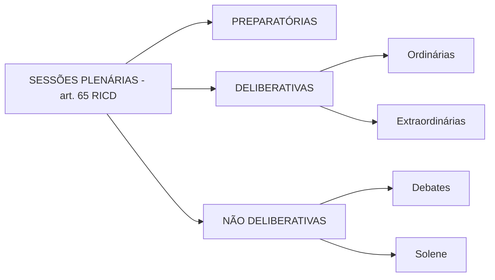
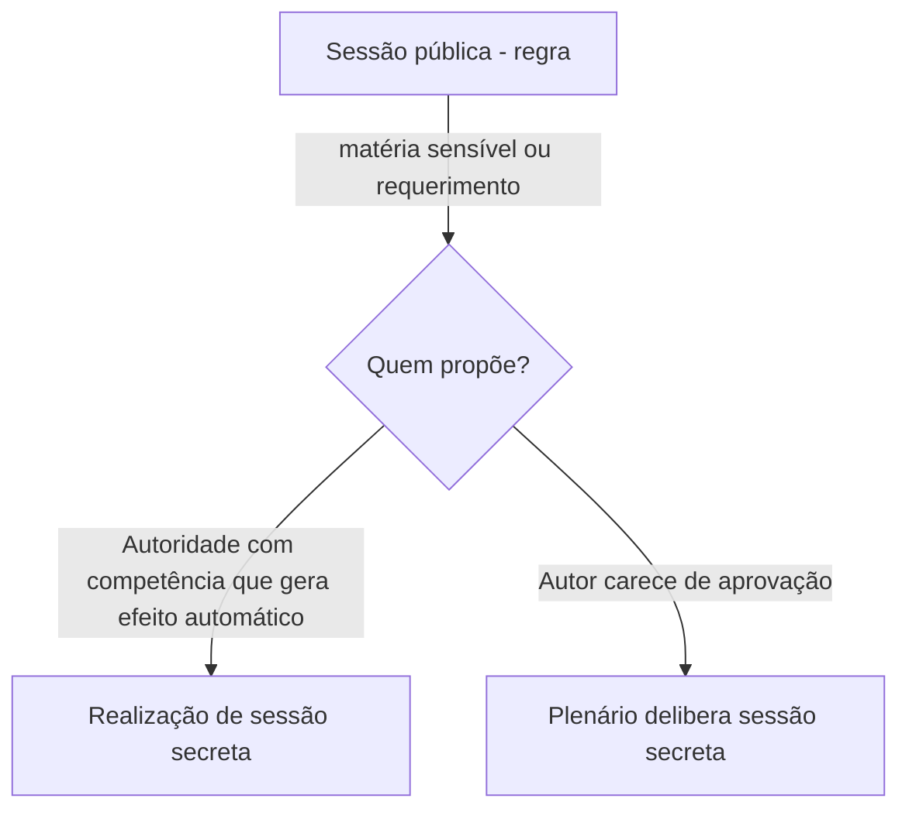

# Sessões Plenárias da Câmara — finalidade & publicidade (RICD)

> [!summary] Em uma frase  
> O RICD classifica as **sessões** em **preparatórias**, **deliberativas** (ordinárias e extraordinárias) e **não deliberativas** (debates e solenes), presume-as **públicas** e, após as reformas de **Res. 19/2012** e **Res. 21/2021**, alterou **classificação, fases e duração**, reduzindo espaços de obstrução e priorizando celeridade.

---

## 1) Mapa visual da classificação

> [!note] Publicidade  
> **Regra:** públicas. **Exceção:** secretas, por matéria sensível ou requerimento — conforme autoria, o requerimento **gera** sessão secreta ou **depende** de aprovação do Plenário (arts. 69 e 92 RICD).

---

## 2) O que mudou com Res. 19/2012 e Res. 21/2021

- **Res. 19/2012**: consolidou a **classificação atual** (art. 65) e ajustou ritos de **sessões preparatórias** e **eleição da Mesa** (art. 6º):
    
    - **1º ano da legislatura (1º/2)**: sessão para **posse** e sessão para **eleição da Mesa** (horários definidos pela Casa).
        
    - **3º ano da legislatura**: **sessão preparatória** antes de 2/2 para **eleger a Mesa** do biênio final.
        
- **Res. 21/2021**: redesenhou a **dinâmica das deliberativas**:
    
    - **Eliminou** duração fixa: **ordinária** (antes 5h) e **extraordinária** (antes 4h) agora **duram até esgotar a pauta**.
        
    - **Evita sessões em sequência** (ordinária + extraordinárias no mesmo dia) e **restringe** uso repetido de **comunicações de liderança** (em regra, **1 vez/dia**).
        
    - Aproximou o regime de plenario ao das **comissões** (que não têm tempo-limite de reunião).
        

> [!attention] Efeito prático  
> Pauta pode seguir por muitas horas (até depois da meia-noite). **Obstrução** via múltiplas sessões no mesmo dia e múltiplas comunicações ficou **limitada**.

---

## 3) Quadro comparativo rápido

|Tipo|Finalidade|Fases|Dias/horários usuais|Duração|Quórum para iniciar|Quem convoca|Observações|
|---|---|---|---|---|--:|---|---|
|**Preparatória**|**Posse** e **eleição da Mesa**|específicas|1º/2 (1º ano); antes de 2/2 (3º ano)|Até concluir|≥ 51 deputados|Presidente|Regra de 2012: duas sessões no 1º ano (posse; eleição).|
|**Deliberativa ordinária**|Discutir e **votar** proposições|**4 fases**: Pequeno Exp., Grande Exp., **Ordem do Dia**, Comunicações|Ter–Qui|**Sem limite** (Res. 21/2021)|≥ 51|Presidente (em regra)|Na prática 2021–2023, **priorizou-se** a extraordinária.|
|**Deliberativa extraordinária**|**Ordem do Dia** (somente)|**Sem** Pequeno/Grande Exp./Comunic.|Em dias/horários diversos|**Sem limite**; pode **adentrar o dia seguinte**|≥ 51|**Presidente, Colégio de Líderes ou Plenário** (art. 67)|Término: por **esgotar pauta** ou por **acordo/conveniência da Presidência** (paralela à regra das comissões).|
|**Debates** (não deliberativa)|Debate **sem votação**|Regidas pelo Presidente|**Segundas (14h)** e **Sextas (9h)**|**5h**|≥ 51|Presidente|Ordinária **sem Ordem do Dia** vira **debates** (art. 66, §3º).|
|**Solene** (não deliberativa)|**Homenagens**|–|Conforme ato|Até **4h**|**Qualquer número**|Presidente ou Plenário|Pode-se reservar o **Grande Expediente** ou prorrogar **debates** em até 30 min para a homenagem (art. 68).|

> [!tip] Comunicação de lideranças  
> Pode ocorrer **a qualquer momento**: líderes (ou vice-líderes/delegados) falam sobre assunto relevante. **Após 2021**, em regra **1 vez/dia** (salvo mais de uma sessão no dia), coibindo uso indiscriminado.

---

## 4) Duração, prorrogação e fases

- **Sem prorrogação** para **ordinárias/extraordinárias** (artigos sobre prorrogação foram **revogados** pela Res. 21/2021). A **Ordem do Dia** deixou de ter limite de 3 horas.
    
- **Debates**: ainda admitem **prorrogação de até 30 min** para homenagens (art. 68, §1º), mas há **lacuna** porque o art. 72 (critérios de prorrogação) foi revogado — tema **controvertido** na aplicação prática.
- Quanto à duração temporal das sessões, as alterações promovidas pela Resolução nº 21/2021 buscaram dar o mesmo tratamento já oferecido às comissões, uma vez que esses colegiados não possuem limitação de tempo para a realização de suas reuniões (RICD, art. 46, § 6º).

> Independentemente das novas determinações da Resolução nº 21/2021, as sessões deliberativas ordinárias permanecem previstas no Regimento Interno para acontecer de terças a quintas-feiras. Todavia, os registros de sessões da Casa ocorridas desde a promulgação da citada resolução em maio de 2021 até meados de março de 2023, revelam que, em relação às sessões deliberativas, a Casa priorizou a realização de sessões deliberativas extraordinárias e não realizou nenhuma sessão deliberativa ordinária. *Um dos possíveis motivos para essa preferência pela realização de sessões deliberativas extraordinárias é que essas sessões possuem apenas a fase da ordem do dia, enquanto, no caso de sessão deliberativa ordinária, o Regimento manteve predefinidas as quatro fases: o pequeno expediente, o grande expediente, a ordem do dia e as comunicações parlamentares*. As segundas e sextas-feiras são reservadas para realização de sessões de debates, conforme veremos adiante mais detalhadamente.

---

## 5) Suspensão, encerramento e levantamento

- **Suspensão**: o Presidente pode **suspender uma única vez**, por **até 1 hora**; se não reabrir, **considera-se encerrada**.
    
- **Levantamento (encerramento antecipado)**: antes do término, pode ocorrer por: **I)** tumulto grave; **II)** luto/falecimento (Congressista ou Chefe de Poder/luto oficial); **III)** presença de menos de **1/10 de deputados (52)** nos debates (contagem sem desprezar fração).
    

---

## 6) Extraordinárias — quem pode convocar e limites

- **Legitimados** (art. 67): **Presidente**, **Colégio de Líderes** ou **Plenário**.
    
- **Término por juízo da Presidência**: a analogia com comissões (art. 46, §6º) sustenta **encerramento por acordo/conveniência** — mas **não** quando a sessão extraordinária **foi convocada pelo Colégio de Líderes ou pelo Plenário** (controle recíproco).
    
- **Precedente político (2016)**: uso do Colégio de Líderes para convocar sessão visando **rever ato da Presidência** gerou **nulidade** por “abuso/casuísmo”.
    

---

## 7) Publicidade x segredo — em detalhe

> [!question] Para não esquecer nas provas
> 
> 1. **Classificação do art. 65** e **fases** da **ordinária**.
>     
> 2. **Legitimados** para **extraordinária** (art. 67).
>     
> 3. **Quórum de início**: regra dos **51**; **solene** com **qualquer número**.
>     
> 4. **Res. 21/2021**: **sem duração fixa** e **sem prorrogação** nas deliberativas; **comunicação de lideranças** limitada.
>     
> 5. **Sessões de debates**: **seg. e sex.**, **5h**, sem Ordem do Dia.
>     

---

## 8) Resumo essencial (para revisão rápida)

- **Classificação (art. 65)**: Preparatórias | Deliberativas (**ordinária** com 4 fases; **extraordinária** só **Ordem do Dia**) | Não deliberativas (**debates** e **solenes**).
    
- **Publicidade**: públicas; **secretas** por matéria/requerimento, às vezes dependem de **aprovação do Plenário** (arts. 69 e 92).
    
- **Preparatórias**: posse e eleição da Mesa (1º/2 no 1º ano; no **3º ano** antes de 2/2) — **Res. 19/2012**.
    
- **Res. 21/2021**: tirou **tempo-limite** de ordinárias/extraordinárias, **limitou obstrução** (comunicações de lideranças 1 vez/dia; menor incentivo a sessões sucessivas), **aproximou** o funcionamento ao das comissões.
    
- **Debates**: segundas/14h e sextas/9h, **5h**, sem votação; **solene** até **4h**, com **qualquer número**.
    
- **Suspensão**: 1 vez, até **1h**; **levantamento**: tumulto, luto, ou < **1/10** nos debates (52).

> As sessões ordinárias para as quais o presidente da Câmara dos Deputados não designar ordem do dia convertem-se em sessões de debates (art. 66, § 3º).

---

> [!check] Mini‑quiz (autoavaliação)  
> **1.** Qual é a regra de publicidade e quando a sessão pode ser secreta?  
> **2.** Quem pode convocar sessão extraordinária e quais limites ao encerramento?  
> **3.** Cite as quatro fases da ordinária e o que mudou após 2021.  
> **4.** Quais diferenças centrais entre **debates** e **solene** (duração, quórum, finalidade)?

---

> [!tip] Dica de memorização  
> **PODS** para ordinária: **P**equeno exp. → **O**rdem do dia (núcleo) → **D**ebates? (não!) → **S**em prorrogação pós‑2021, mas com **Comunicações** ao final.