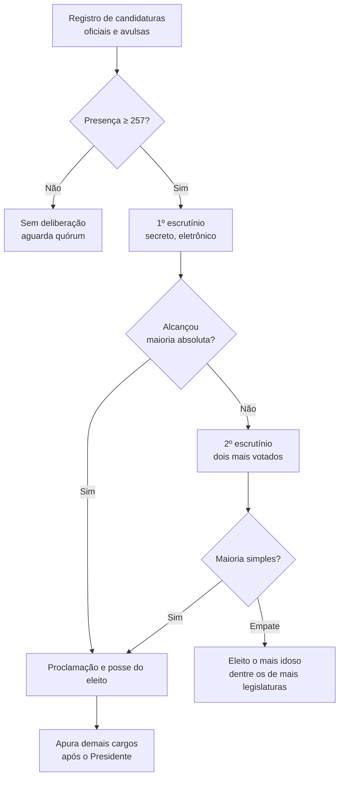

---

## title: Eleição da Mesa da Câmara — guia prático  
aliases: [Eleição da Mesa, Mesa Diretora — eleição]  
tags: [RICD, Mesa, processo-legislativo, sessões-preparatórias]  
updated: 2025-10-27

---

## 1) Quando ocorre

- **No início da Legislatura (1º biênio):** na **2ª sessão preparatória do dia 1º de fevereiro**, elege-se Presidente, demais membros e suplentes de secretário (mandato de 2 anos; **vedada recondução para o mesmo cargo na eleição imediatamente subsequente**).
    
- **No 3º ano da Legislatura (2º biênio):** em **data e hora designadas** pelo Presidente, antes de inaugurada a sessão legislativa, sob direção da Mesa da sessão anterior.
    

> [!note] A sessão preparatória  
> Para abrir a sessão de posse, **o RICD não exige quórum específico**; a prática recente tem sido abrir painel após a posse e já aproveitar o quórum para a sessão de eleição na sequência.

---

## 2) Quóruns e escrutínios (o coração do rito)

- **Presença mínima para realizar a eleição:** **maioria absoluta dos Deputados (257)**.
    
- **1º escrutínio (votação secreta pelo sistema eletrônico):** eleito quem obtiver **maioria absoluta de votos**.
    
- **2º escrutínio:** se ninguém alcançar maioria absoluta no 1º, disputam os **dois mais votados**; vence a **maioria simples**.
    
- **Desempate:** **o mais idoso, dentre os de maior número de legislaturas**.
    
- **Proclamação e posse imediata** dos eleitos.
    

> [!abstract] Diferença importante de quóruns  
> **Quórum para abrir sessão** × **quórum para votar**: o primeiro diz respeito à abertura; o segundo, à deliberação. Para a eleição da Mesa, aplica-se **presença de maioria absoluta** (257). Houve precedente em QO sobre abertura com número inferior, valendo, para abertura, a regra geral do art. 79, §2º.

---

## 3) Registro de candidaturas

- **Oficiais (por proporcionalidade):** o **Líder** registra candidatos previamente escolhidos pela bancada/Bloco para os cargos distribuídos segundo o princípio da **representação proporcional**.
    
- **Avulsas:** o próprio Deputado comunica **por escrito** ao Presidente.
    

---

## 4) Forma de votação: eletrônico como regra, cédulas como exceção

A **Res. nº 45/2006** fixou como **regra** o **sistema eletrônico** (mantendo a votação por **cédulas** apenas quando o eletrônico for inviável).

---

## 5) Como se calcula a “maioria absoluta de votos” no 1º escrutínio

- **Regra consolidada por Questões de Ordem:**
    
    - **QO 10.266/1997** e **QO 545/2006**: no **1º escrutínio**, considera-se eleito o candidato que obtiver **maioria absoluta dos votos dos votantes**, **incluídos os votos em branco** e **excluídos os nulos**.
        
- **Regra prática (exemplo):** “maioria absoluta de votos” = **primeiro inteiro acima da metade do total de votos válidos considerados para o cômputo (votantes menos nulos)**.
    
- Observação geral sobre votações: **votos em branco** e **abstenções registradas no painel** contam **para quórum**, mas os **nulos são desconsiderados** para o cálculo da maioria absoluta de votos.
    

---

## 6) Passo a passo operacional (sequência típica)

1. **Recebimento/registro** das candidaturas (oficiais e avulsas).
    
2. **Verificação de presença**: mínimo de **257** para deliberar.
    
3. **Chamada para votação** (escrutínio secreto, via sistema eletrônico).
    
4. **Apuração do Presidente primeiro**; **só depois** dos demais cargos.
    
5. **Se necessário, 2º escrutínio** (dois mais votados) e **critério de desempate**.
    
6. **Proclamação e posse imediata**; o novo Presidente **assume a direção dos trabalhos** e determina a apuração dos demais cargos.
    

---

## 7) Fluxo visual (Mermaid)

---

## 8) Checklist rápido para a Mesa/Lideranças

-  Cargos distribuídos **por proporcionalidade** definidos e **chapa(s)** ajustadas.
    
-  **Quórum de deliberação** (≥ 257) verificado.
    
-  **Sistema eletrônico** operacional; **cédulas** apenas se houver impossibilidade técnica.
    
-  **Apuração do Presidente primeiro**; posse imediata; em seguida, demais cargos.
    
-  Em caso de dúvida sobre cálculo de maioria no 1º escrutínio, aplicar **QO 10.266/1997** e **QO 545/2006** (conta-se brancos; excluem-se nulos).
    

---

## 9) Fundamentação essencial

- **Datas e direção dos trabalhos:** RICD **arts. 5º** e **6º**.
    
- **Rito da eleição e formalidades (I–V):** RICD **art. 7º**.
    
- **Votação eletrônica como regra / cédulas como exceção:** **Res. 45/2006** (histórico e finalidade).
    
- **Quórum de deliberação (≥ 257) e distinção com abertura de sessão:** doutrina/precedentes.
    
- **Cálculo da maioria no 1º escrutínio:** **QO 10.266/1997** e **QO 545/2006**.
    

---

> [!tip] Dica de condução  
> Se o Presidente **não** for escolhido no 1º escrutínio, **mantenha o foco**: realize imediatamente o **2º escrutínio** **apenas** para o cargo de Presidente, e **só após** a definição do eleito prossiga com a apuração dos demais cargos. Isso reduz insegurança procedimental e preserva a linearidade do rito.

> [!important] Em caso de falha técnica  
> **Inviável o sistema eletrônico?** Aplique o **procedimento por cédulas** previsto no parágrafo único do art. 7º (quando aplicável), conforme a racionalidade introduzida pela Res. 45/2006.

---