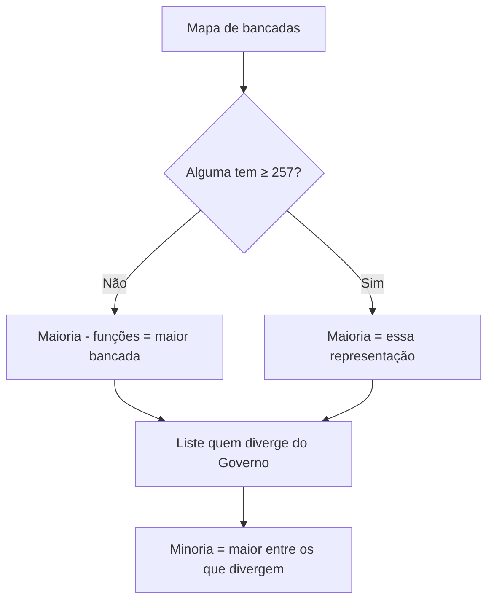

---

aliases: [Maioria e Minoria — RICD, Bancada Negra — RICD]  
tags: [RICD, lideranças, Maioria, Minoria, Bancada-Negra, Mesa, CCAI]  
author: Consultor Legislativo (nota didática)  
updated: 2025-10-27
---
# RICD — Maioria, Minoria e Bancada Negra

> [!summary] Em uma frase  
> **Maioria** = quem detém (ou exerce as funções de) maioria absoluta na Casa; **Minoria** = a **maior** representação **com posição política diversa da Maioria em relação ao Governo**; **Bancada Negra** = colegiado temático com voz e voto nas reuniões de líderes e fala semanal nas Comunicações de Liderança.

---

## 1) Base normativa essencial (para consulta rápida)

- **Maioria/Minoria (conceitos):** RICD, art. 13 (caput e parágrafo único).
    
- **Prerrogativas da Maioria:** RICD, art. 8º, § 1º (Mesa), art. 89 (tempo nas Comunicações de Liderança); CF, art. 89, IV (Conselho da República); Res.-CN nº 2/2013, art. 7º (CCAI).
    
- **Liderança da Minoria:** RICD, **art. 11-A** (líder + **9** vice-líderes; escolha e indicações).
    
- **Bancada Negra:** RICD, **art. 13-A** (criação, estrutura e eleição **20 de novembro**; voz e voto nas reuniões de líderes; fala semanal nas Comunicações de Liderança).
    

> [!tip] Lembrete prático  
> A **Minoria não é o “menor” partido**: é a **maior** representação (partido/bloco) **que diverge do Governo em relação à Maioria**.

---

## 2) Quem é a **Maioria** na Câmara?

**Regra-matriz** (art. 13, caput):

- Se **um partido/bloco** tiver **≥ 257** deputados (maioria absoluta), **ele é a Maioria**.
    

**Se ninguém tiver 257** (parágrafo único do art. 13):

- **Exerce as funções de Maioria** o **partido/bloco com o maior número** de deputados (a maior bancada).
    

### Prerrogativas-chave da Maioria

1. **Primazia** na escolha de cargo da **Mesa** (art. 8º, § 1º).
    
2. **Mais tempo** nas **Comunicações de Liderança** (art. 89).
    
3. **Assento** no **Conselho da República** (CF, art. 89, IV).
    
4. **Assento** na **CCAI** – Comissão Mista de Controle das Atividades de Inteligência (Res.-CN nº 2/2013, art. 7º).
    

> [!example] Exemplo didático — Ninguém atingiu 257  
> Bancadas: A(85), B(80), C(78), D(76), E(75), F(4).  
> **Maioria**: **Partido A** (maior bancada), até que alguém atinja 257.

---

## 3) Quem é a **Minoria**?

**Definição em dois filtros cumulativos (art. 13):**

1. **Posição diversa da Maioria em relação ao Governo** (critério político), **e**
    
2. **Representação imediatamente inferior** à Maioria (critério numérico/comparativo).
    

> [!warning] Pegadinha clássica  
> A **Minoria não é “a segunda maior bancada”** automaticamente. **Se** a segunda maior **estiver com a Maioria/Governo**, a **Minoria** será a **maior bancada** que **diverge da Maioria em relação ao Governo**.

### Dois cenários para fixar

**Hipótese 1** (base governista: A, B, E):

- A: 85 (fav. Governo) → **Maioria** (maior bancada).
    
- B: 80 (fav. Governo)
    
- **C: 78 (contra Governo) → Minoria** (maior entre os que divergem).
    

**Hipótese 2** (D e C contra Governo):

- **D: 108 (contra)** → **Maioria** (maior bancada).
    
- C: 101 (contra)
    
- **B: 97 (a favor)** → **Minoria** (é a maior entre os que **divergem** da Maioria quanto ao Governo).
    

### Liderança da Minoria (art. 11-A)

- **Composição:** 1 **Líder** + **9 Vice-Líderes**.
    
- **Escolha:**
    
    - **Líder** → indicado pela **representação considerada Minoria** (art. 13).
        
    - **Vice-líderes** → indicados **pelo Líder da Minoria**, entre deputados de partidos **que, em relação ao Governo, expressem posição contrária à da Maioria**.
        
- **Sem prejuízo** das prerrogativas do **líder/vice-líderes do partido/bloco** que seja, ele próprio, a Minoria (art. 13).
    

---

## 4) **Bancada Negra** (art. 13-A)

### Propósito

Fortalecer o **debate de igualdade racial** e assegurar **representatividade** nas instâncias de coordenação política da Casa.

### Estrutura

- **Coordenação-Geral** + **3 Vice-Coordenadorias**.
    

### Prerrogativas operacionais

- **Participar das Reuniões de Líderes**, com **direito a voz e voto**.
    
- **Falar semanalmente** por **5 minutos** nas **Comunicações de Liderança** (pessoalmente ou por delegação).
    

### Eleição interna

- **Data:** **20 de novembro** de cada **sessão legislativa**.
    
- **Processo:** **escrutínio secreto**; **maioria absoluta** no 1º; **maioria simples** no 2º; presença de **maioria absoluta** dos parlamentares **negros e negras**; **chapa única** pode ser **aclamada**.
    

> [!info] Observação  
> A Bancada Negra não altera a regra de distribuição proporcional de vagas, mas **ganha assento político** nas decisões que a **Reunião de Líderes** articula com a Mesa.

---

## 5) Passo a passo — como identificar **Maioria** e **Minoria** no dia a dia

1. **Conte as bancadas** (partidos e blocos).
    
2. Alguém tem **≥ 257**?
    
    - **Sim** → essa representação é **Maioria**.
        
    - **Não** → **Maioria (funções)** = **maior bancada**.
        
3. Para achar a **Minoria**:
    
    - Liste as bancadas **que divergem** da **Maioria** **em relação ao Governo**.
        
    - **Escolha a maior** **entre elas**.
        
4. **Registre** as lideranças formais no sistema (Líder da Minoria + 9 vice-líderes) e **acompanhe** mudanças de posição em relação ao Governo (podem redefinir a Minoria).
    

---

## 6) Dúvidas frequentes (FAQ)

**1) A Minoria pode ser um bloco?**

> Sim. O art. 13 fala em **partido ou bloco**.

**2) A Minoria precisa “apoiar o Governo”?**

> **Não**. Na verdade, a Minoria é **quem diverge da Maioria em relação ao Governo** (pode ser pró ou contra o Governo, a depender do alinhamento da Maioria).

**3) Se a segunda maior bancada estiver com a Maioria/Governo, ela é a Minoria?**

> **Não**. Procura-se a **maior bancada** que **diverge** da Maioria quanto ao Governo.

**4) Quem escolhe o Líder da Minoria?**

> **A própria representação considerada Minoria**; os **9 vice-líderes** são indicados **pelo Líder da Minoria**.

**5) A Bancada Negra “ganha” vaga automática na Mesa?**

> **Não**. As prerrogativas centrais são **voz e voto nas Reuniões de Líderes** e a **fala semanal** nas Comunicações de Liderança, além de sua **coordenação interna**.

---

## 7) Quadro-resumo (cola de bolso)

|Instituto|Conceito-chave|Como identificar|Pontos de atenção|
|---|---|---|---|
|**Maioria**|Quem tem 257+; se não, maior bancada **exerce as funções**|Conte bancadas; verifique 257; se não houver, pegue a maior|Dá **primazia** na Mesa; **mais tempo** nas comunicações; assentos em **Conselho da República** e **CCAI**|
|**Minoria**|Maior representação que **diverge da Maioria** **em relação ao Governo**|Liste divergentes; escolha a **maior**|**Não é** a segunda maior automaticamente; tem **liderança própria** (1 líder + 9 vices)|
|**Bancada Negra**|Cohesiona atuação sobre **igualdade racial**|Coordenação-Geral + 3 Vice-Coordenadorias|**Voz e voto** em Reunião de Líderes; **5 min/semana** nas Comunicações de Liderança; eleição **20/11**|

---

## 8) Erros comuns em prova e em plenário

- **Confundir Minoria** com “menor partido”: **falso**.
    
- Achar que **sem 257** não há Maioria: **há** (uma representação **exerce as funções** da Maioria).
    
- Esquecer que o **critério político (posição frente ao Governo)** é **essencial** para identificar a Minoria.
    
- Supor que a **Bancada Negra** altera **cálculo de proporcionalidade** de comissões/Mesa: **não altera**.
    

---

## 9) Para o(a) parlamentar: checklist de uso

-  Confirmar **mapa de bancadas** (partidos e blocos) atualizado.
    
-  Verificar **alinhamento ao Governo** de cada bancada.
    
-  Identificar **Maioria** (257+ ou maior bancada) e **Minoria** (maior divergente).
    
-  Registrar/acompanhar **Líder da Minoria** e **9 vice-líderes**.
    
-  Acionar a **Bancada Negra** nas pautas pertinentes; coordenar participação nas **reuniões de líderes** e nas **Comunicações de Liderança**.
    

> [!done] Conclusão  
> **Maioria** e **Minoria** são categorias **institucionais** com efeitos concretos de **poder de agenda e tempo**; a **Bancada Negra** agrega **representatividade** com **acesso direto** à coordenação política da Casa.
