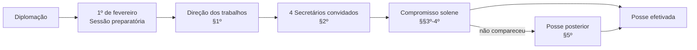

---

## title: RICD — Arts. 1º a 10 • Posse, Mesa e Lideranças (com paralelo ao Regimento Comum)  
tags: [RICD, processo-legislativo, Câmara-dos-Deputados, Mesa-Diretora, Lideranças, Regimento-Comum]  
level: Câmara/Analista
---
# Visão geral (até o art. 10)

> [!summary] Essência
> 
> - **Sede e sessões**: a Câmara funciona no Palácio do Congresso; a sessão ordinária **não se interrompe em 17 de julho sem LDO**. ([Portal da Câmara dos Deputados](https://www2.camara.leg.br/atividade-legislativa/legislacao/regimento-interno-da-camara-dos-deputados/arquivos-1/RICD%20atualizado%20ate%20RCD%2016-2025.pdf "REGIMENTO INTERNO DA CÂMARA DOS DEPUTADOS"))
>     
> - **Sessões preparatórias**: posse (ritual imutável) e eleição da Mesa (1º e 3º anos da legislatura). ([Portal da Câmara dos Deputados](https://www2.camara.leg.br/atividade-legislativa/legislacao/regimento-interno-da-camara-dos-deputados/arquivos-1/RICD%20atualizado%20ate%20RCD%2016-2025.pdf "REGIMENTO INTERNO DA CÂMARA DOS DEPUTADOS"))
>     
> - **Mesa Diretora**: 7 titulares (Pres., 2 VPs, 4 Secretários) + 4 Suplentes de Secretário; composição assegura **representação proporcional**, com **1 vaga garantida à Minoria**. ([Portal da Câmara dos Deputados](https://www2.camara.leg.br/comunicacao/assessoria-de-imprensa/guia-para-jornalistas/mesa-diretora?utm_source=chatgpt.com "Mesa Diretora"))
>     
> - **Lideranças**: escolha por bancadas/blocos (CF, art. 17, §3º); vice-líderes (1/4 da bancada), **líderes e vice-líderes não podem integrar a Mesa**; prerrogativas do art. 10. ([Portal da Câmara dos Deputados](https://www2.camara.leg.br/atividade-legislativa/legislacao/regimento-interno-da-camara-dos-deputados/arquivos-1/RICD%20atualizado%20ate%20RCD%2016-2025.pdf "REGIMENTO INTERNO DA CÂMARA DOS DEPUTADOS"))
>     

---

## 1) Disposições preliminares (arts. 1º e 2º)

|Tema|Regra|Observações-chave|
|---|---|---|
|**Sede**|A Câmara funciona no **Palácio do Congresso Nacional**.|Mesa pode deliberar, _ad referendum_ da maioria absoluta, por outro local em motivo relevante/força maior. ([Portal da Câmara dos Deputados](https://www2.camara.leg.br/atividade-legislativa/legislacao/regimento-interno-da-camara-dos-deputados/arquivos-1/RICD%20atualizado%20ate%20RCD%2016-2025.pdf "REGIMENTO INTERNO DA CÂMARA DOS DEPUTADOS"))|
|**Calendário**|Sessões ordinárias: **2/fev–17/jul** e **1/ago–22/dez**.|Datas constitucionais; se cair em fim de semana/feriado, transfere p/ 1º dia útil. ([Portal da Câmara dos Deputados](https://www2.camara.leg.br/atividade-legislativa/legislacao/regimento-interno-da-camara-dos-deputados/arquivos-1/RICD%20atualizado%20ate%20RCD%2016-2025.pdf "REGIMENTO INTERNO DA CÂMARA DOS DEPUTADOS"))|
|**📌 LDO e recesso (destaque)**|**Não interrompe** em 17/jul sem aprovação da **LDO** pelo Congresso.|Reitera o **art. 57, §2º, CF/88**. Para prova, é um “ponto de corte” do recesso. ([Portal da Câmara dos Deputados](https://www2.camara.leg.br/atividade-legislativa/legislacao/regimento-interno-da-camara-dos-deputados/arquivos-1/RICD%20atualizado%20ate%20RCD%2016-2025.pdf "REGIMENTO INTERNO DA CÂMARA DOS DEPUTADOS"))|

> [!warning] Cuidado!
> A banca adora cobrar a literalidade: **“não será interrompida em 17 de julho enquanto não for aprovada a LDO”** (CF/88 + RICD). ([Portal da Câmara dos Deputados](https://www.camara.leg.br/internet/comissao/index/mista/orca/Legisla_CMO/const_fed.html?utm_source=chatgpt.com "CONSTITUIÇÃO FEDERAL"))

---

## 2) Sessões preparatórias — **Posse dos Deputados** (arts. 3º e 4º)

|Etapa|Como funciona|Base|
|---|---|---|
|**Direção dos trabalhos (destaque)**|Assume o **último Presidente**, se reeleito; na falta, o **Deputado mais idoso, dentre os de maior nº de legislaturas**.|Art. 4º, §1º. ([Portal da Câmara dos Deputados](https://www2.camara.leg.br/atividade-legislativa/legislacao/regimento-interno-da-camara-dos-deputados/arquivos-1/RICD%20atualizado%20ate%20RCD%2016-2025.pdf "REGIMENTO INTERNO DA CÂMARA DOS DEPUTADOS"))|
|**Secretários ad hoc (destaque)**|Presidente convida **4 Deputados**, de preferência de **partidos diferentes**, p/ servirem de Secretários; proclama os diplomados.|Art. 4º, §2º. ([Portal da Câmara dos Deputados](https://www2.camara.leg.br/atividade-legislativa/legislacao/regimento-interno-da-camara-dos-deputados/arquivos-1/RICD%20atualizado%20ate%20RCD%2016-2025.pdf "REGIMENTO INTERNO DA CÂMARA DOS DEPUTADOS"))|
|**Compromisso solene (destaque)**|**Conteúdo e ritual imutáveis**; compromissando **não** pode apresentar declaração (oral/escrita) **nem ser empossado por procurador**.|Art. 4º, §§3º–4º. ([Portal da Câmara dos Deputados](https://www2.camara.leg.br/atividade-legislativa/legislacao/regimento-interno-da-camara-dos-deputados/arquivos-1/RICD%20atualizado%20ate%20RCD%2016-2025.pdf "REGIMENTO INTERNO DA CÂMARA DOS DEPUTADOS"))|
|**Posse posterior**|Em sessão, **junto à Mesa**; no **recesso**, perante o **Presidente**.|Art. 4º, §5º. ([Portal da Câmara dos Deputados](https://www2.camara.leg.br/atividade-legislativa/legislacao/regimento-interno-da-camara-dos-deputados/arquivos-1/RICD%20atualizado%20ate%20RCD%2016-2025.pdf "REGIMENTO INTERNO DA CÂMARA DOS DEPUTADOS"))|
|**Prazo de posse (destaque)**|**30 dias**, prorrogável por igual período (força maior/enfermidade), contado de: (I) 1ª sessão preparatória; (II) diplomação (se eleito na legislatura); (III) convocação do Presidente.|Art. 4º, §6º, I–III. ([Portal da Câmara dos Deputados](https://www2.camara.leg.br/atividade-legislativa/legislacao/regimento-interno-da-camara-dos-deputados/arquivos-1/RICD%20atualizado%20ate%20RCD%2016-2025.pdf "REGIMENTO INTERNO DA CÂMARA DOS DEPUTADOS"))|

---

## 3) **Eleição da Mesa** (Seção II)

### 3.1 Quando ocorre

- **Início da legislatura**: na **2ª sessão preparatória** do dia **1º de fevereiro**. ([Portal da Câmara dos Deputados](https://www2.camara.leg.br/atividade-legislativa/legislacao/regimento-interno-da-camara-dos-deputados/arquivos-1/RICD%20atualizado%20ate%20RCD%2016-2025.pdf "REGIMENTO INTERNO DA CÂMARA DOS DEPUTADOS"))
    
- **Terceiro ano da legislatura**: **antes da sessão legislativa**, sob a direção da **Mesa anterior**. Enquanto não eleita, **dirige os trabalhos a Mesa anterior**. ([Portal da Câmara dos Deputados](https://www2.camara.leg.br/atividade-legislativa/legislacao/regimento-interno-da-camara-dos-deputados/arquivos-1/RICD%20atualizado%20ate%20RCD%2016-2025.pdf "REGIMENTO INTERNO DA CÂMARA DOS DEPUTADOS"))
    

### 3.2 Composição e proporcionalidade

- **Estrutura**: **7 titulares** (Presidente, **2 Vice-Presidentes**, **4 Secretários**) **+ 4 Suplentes de Secretário**. ([Portal da Câmara dos Deputados](https://www2.camara.leg.br/comunicacao/assessoria-de-imprensa/guia-para-jornalistas/mesa-diretora?utm_source=chatgpt.com "Mesa Diretora"))
    
- **Regra-matriz**: “tanto quanto possível”, **representação proporcional** de partidos/blocos; **candidatura avulsa** é possível, desde que do mesmo espectro (partido/bloco) ao qual caiba o cargo. ([Portal da Câmara dos Deputados](https://www2.camara.leg.br/atividade-legislativa/legislacao/regimento-interno-da-camara-dos-deputados/arquivos-1/RICD%20atualizado%20ate%20RCD%2016-2025.pdf "REGIMENTO INTERNO DA CÂMARA DOS DEPUTADOS"))
    
- **Distribuição (destaque)**: salvo acordo diverso, **Lideranças escolhem** “**da maior para a menor representação**” o(s) cargo(s) que cabem a cada uma. **Há 1 vaga assegurada à Minoria**. ([Portal da Câmara dos Deputados](https://www2.camara.leg.br/atividade-legislativa/legislacao/regimento-interno-da-camara-dos-deputados/arquivos-1/RICD%20atualizado%20ate%20RCD%2016-2025.pdf "REGIMENTO INTERNO DA CÂMARA DOS DEPUTADOS"))
    
- **Vacância**: até **30/11 do 2º ano**, há **eleição em até 5 sessões**; depois disso, a **Mesa designa** um titular para **responder**. **Perde o cargo** quem **mudar de partido**. ([Portal da Câmara dos Deputados](https://www2.camara.leg.br/atividade-legislativa/legislacao/regimento-interno-da-camara-dos-deputados/arquivos-1/RICD%20atualizado%20ate%20RCD%2016-2025.pdf "REGIMENTO INTERNO DA CÂMARA DOS DEPUTADOS"))
    

### 3.3 Votação e formalidades (art. 7º)

|Item|Regra|
|---|---|
|**Modo de votação**|**Escrutínio secreto** e **sistema eletrônico**. ([Portal da Câmara dos Deputados](https://www2.camara.leg.br/atividade-legislativa/legislacao/regimento-interno-da-camara-dos-deputados/arquivos-1/RICD%20atualizado%20ate%20RCD%2016-2025.pdf "REGIMENTO INTERNO DA CÂMARA DOS DEPUTADOS"))|
|**Quóruns**|1º escrutínio: **maioria absoluta**; 2º escrutínio: **maioria simples**, **presente** a maioria absoluta dos Deputados. ([Portal da Câmara dos Deputados](https://www2.camara.leg.br/atividade-legislativa/legislacao/regimento-interno-da-camara-dos-deputados/arquivos-1/RICD%20atualizado%20ate%20RCD%2016-2025.pdf "REGIMENTO INTERNO DA CÂMARA DOS DEPUTADOS"))|
|**Empate**|**Mais idoso, dentre os de maior nº de legislaturas**. ([Portal da Câmara dos Deputados](https://www2.camara.leg.br/atividade-legislativa/legislacao/regimento-interno-da-camara-dos-deputados/arquivos-1/RICD%20atualizado%20ate%20RCD%2016-2025.pdf "REGIMENTO INTERNO DA CÂMARA DOS DEPUTADOS"))|
|**Passos formais**|Registro **individual ou por chapa**; cabina indevassável + sobrecartas; **4 urnas** (2 p/ Presidente, 2 p/ demais cargos); apuração com proclamação e **posse imediata**. ([Portal da Câmara dos Deputados](https://www2.camara.leg.br/atividade-legislativa/legislacao/regimento-interno-da-camara-dos-deputados/arquivos-1/RICD%20atualizado%20ate%20RCD%2016-2025.pdf "REGIMENTO INTERNO DA CÂMARA DOS DEPUTADOS"))|

> [!tip] Exemplo didático de distribuição por proporcionalidade  
> **Hipótese** (513 vagas): Bloco A=200; Bloco B=150; Bloco C=90; Bloco D=50; Bloco E=23.  
> Seguindo o §1º do art. 8º (**maior → menor**), as lideranças **escolhem** cargos até preencher os **7 titulares** (Pres., 2 VPs, 4 Secretários). Se, ao final, **nenhum nome da Minoria** tiver obtido cargo, aplica-se o **§3º (garantia de 1 membro)** por **acordo**/ajuste político no momento da composição. _O Regimento não fixa fórmula matemática: prevalece o acordo entre lideranças com observância da proporcionalidade._ ([Portal da Câmara dos Deputados](https://www2.camara.leg.br/atividade-legislativa/legislacao/regimento-interno-da-camara-dos-deputados/arquivos-1/RICD%20atualizado%20ate%20RCD%2016-2025.pdf "REGIMENTO INTERNO DA CÂMARA DOS DEPUTADOS"))

---

## 4) **Líderes** (Cap. IV — arts. 9º e 10)

|Tema|Regra|Base|
|---|---|---|
|**Quem e como**|Deputados se agrupam por **partidos** ou **blocos**; a representação que atende ao **art. 17, §3º da CF** pode **escolher Líder** e comunicá-lo à Mesa (maioria absoluta da bancada).|Art. 9º, _caput_ e §2º. ([Portal da Câmara dos Deputados](https://www2.camara.leg.br/atividade-legislativa/legislacao/regimento-interno-da-camara-dos-deputados/arquivos-1/RICD%20atualizado%20ate%20RCD%2016-2025.pdf "REGIMENTO INTERNO DA CÂMARA DOS DEPUTADOS"))|
|**Vice-líderes**|**1 vice-líder para cada 4 deputados (ou fração)**; pode haver **Primeiro Vice-Líder**.|Art. 9º, §1º. ([Portal da Câmara dos Deputados](https://www2.camara.leg.br/atividade-legislativa/legislacao/regimento-interno-da-camara-dos-deputados/arquivos-1/RICD%20atualizado%20ate%20RCD%2016-2025.pdf "REGIMENTO INTERNO DA CÂMARA DOS DEPUTADOS"))|
|**Vedações (destaque)**|**Líderes e vice-líderes não podem integrar a Mesa.**|Art. 9º, §5º. ([Portal da Câmara dos Deputados](https://www2.camara.leg.br/atividade-legislativa/legislacao/regimento-interno-da-camara-dos-deputados/arquivos-1/RICD%20atualizado%20ate%20RCD%2016-2025.pdf "REGIMENTO INTERNO DA CÂMARA DOS DEPUTADOS"))|
|**Cálculo mínimo**|Quantidade mínima de vice-líderes é calculada **com base no resultado final do TSE**.|Art. 9º, §6º. ([Portal da Câmara dos Deputados](https://www2.camara.leg.br/atividade-legislativa/legislacao/regimento-interno-da-camara-dos-deputados/arquivos-1/RICD%20atualizado%20ate%20RCD%2016-2025.pdf "REGIMENTO INTERNO DA CÂMARA DOS DEPUTADOS"))|

### Prerrogativas do Líder (art. 10)

- **Palavra** em Comunicações de Liderança (art. 66, §§1º e 3º c/c art. 89).
    
- **Inscrever** membros da bancada nas Comunicações Parlamentares.
    
- **Participar** de **qualquer Comissão** (sem voto), podendo **encaminhar** votação ou requerer **verificação**.
    
- **Encaminhar a votação** no Plenário (orientação de bancada, até **1 minuto**).
    
- **Registrar candidatos** do partido/bloco para a **Mesa**; **indicar membros** da bancada para **Comissões** e **substituí-los** a qualquer tempo. ([Portal da Câmara dos Deputados](https://www2.camara.leg.br/atividade-legislativa/legislacao/regimento-interno-da-camara-dos-deputados/arquivos-1/RICD%20atualizado%20ate%20RCD%2016-2025.pdf "REGIMENTO INTERNO DA CÂMARA DOS DEPUTADOS"))
    

> [!example] Na prática  
> Em plenário, o(a) Líder pode **orientar “Sim/Não/Obstrução/Liberação”**; nas comissões, mesmo sem voto, pode **encaminhar** a votação e **pedir verificação**, influenciando o resultado. ([Portal da Câmara dos Deputados](https://www2.camara.leg.br/atividade-legislativa/legislacao/regimento-interno-da-camara-dos-deputados/arquivos-1/RICD%20atualizado%20ate%20RCD%2016-2025.pdf "REGIMENTO INTERNO DA CÂMARA DOS DEPUTADOS"))

---

## 5) **Paralelos com o Regimento Comum do Congresso Nacional (RCCN)**

|Tema|RICD (Câmara)|RCCN (Congresso Nacional)|
|---|---|---|
|**Direção das sessões**|Presidente da Câmara dirige as sessões da Casa.|Sessões **conjuntas** são “**sob a direção da Mesa** do Congresso” (Presidência do **Senado**). ([Senado Federal](https://www25.senado.leg.br/documents/59501/97171143/RCCN.pdf/933b504d-a653-4df5-9329-d4f38c42f64f "REGIMENTO COMUM"))|
|**Mesa do Congresso**|—|**Composição definida** por decisão conjunta das Mesas (1993): Pres. do Senado (Pres. do CN); 1º VP = VP da **Câmara**; 2º VP = 2º VP do **Senado**; 1º Sec. = 1º Sec. da **Câmara**; 2º Sec. = 2º Sec. do **Senado**; 3º Sec. = 3º Sec. da **Câmara**; 4º Sec. = 4º Sec. do **Senado**. ([Senado Federal](https://www25.senado.leg.br/documents/59501/97171143/RCCN.pdf/933b504d-a653-4df5-9329-d4f38c42f64f "REGIMENTO COMUM"))|
|**Sessão ordinária e LDO**|RICD repete: **não interrompe em 17/jul sem LDO**.|Regra **constitucional** (CF, art. 57, §2º) que também **vincula** o Congresso (RCCN agenda LDO em sessão conjunta). ([Portal da Câmara dos Deputados](https://www.camara.leg.br/internet/comissao/index/mista/orca/Legisla_CMO/const_fed.html?utm_source=chatgpt.com "CONSTITUIÇÃO FEDERAL"))|
|**Lideranças**|Regras de líderes/vice-líderes e prerrogativas (arts. 9º–10).|RCCN trata das **lideranças no Congresso** (Governo, Maioria, Minoria, Oposição) e **modalidades de votação** (simbólica, nominal, _secreta_ em hipóteses específicas). ([Senado Federal](https://www25.senado.leg.br/documents/59501/97171143/RCCN.pdf/933b504d-a653-4df5-9329-d4f38c42f64f "REGIMENTO COMUM"))|
|**Comissões Mistas**|—|**Proporcionalidade** e direção pela **Mesa do Congresso** (Pres. do Senado). ([Senado Federal](https://www25.senado.leg.br/documents/59501/97171143/RCCN.pdf/933b504d-a653-4df5-9329-d4f38c42f64f "REGIMENTO COMUM"))|

> [!note] Referências oficiais
> 
> - **RICD (atualizado até RCD 16/2025)** — textos de arts. 1º–10, sessões preparatórias e eleição da Mesa. ([Portal da Câmara dos Deputados](https://www2.camara.leg.br/atividade-legislativa/legislacao/regimento-interno-da-camara-dos-deputados/arquivos-1/RICD%20atualizado%20ate%20RCD%2016-2025.pdf "REGIMENTO INTERNO DA CÂMARA DOS DEPUTADOS"))
>     
> - **RCCN (Res. 1/1970-CN, compilação 2025)** — direção das sessões conjuntas, composição da Mesa do CN (Decisão 31/8/1993). ([Senado Federal](https://www25.senado.leg.br/documents/59501/97171143/RCCN.pdf/933b504d-a653-4df5-9329-d4f38c42f64f "REGIMENTO COMUM"))
>     
> - **CF/88, art. 57, §2º** — trava de recesso pela LDO. ([Portal da Câmara dos Deputados](https://www.camara.leg.br/internet/comissao/index/mista/orca/Legisla_CMO/const_fed.html?utm_source=chatgpt.com "CONSTITUIÇÃO FEDERAL"))
>     

---

## 6) Check rápido (autoteste)

1. Quem dirige a sessão preparatória se o último Presidente **não** foi reeleito? → **Deputado mais idoso, dentre os de maior nº de legislaturas**. ([Portal da Câmara dos Deputados](https://www2.camara.leg.br/atividade-legislativa/legislacao/regimento-interno-da-camara-dos-deputados/arquivos-1/RICD%20atualizado%20ate%20RCD%2016-2025.pdf "REGIMENTO INTERNO DA CÂMARA DOS DEPUTADOS"))
    
2. A eleição da Mesa no **3º ano** ocorre **quando** e **sob quem**? → **Antes da sessão legislativa**, **sob direção da Mesa anterior**. ([Portal da Câmara dos Deputados](https://www2.camara.leg.br/atividade-legislativa/legislacao/regimento-interno-da-camara-dos-deputados/arquivos-1/RICD%20atualizado%20ate%20RCD%2016-2025.pdf "REGIMENTO INTERNO DA CÂMARA DOS DEPUTADOS"))
    
3. Em caso de empate na eleição, quem vence? → **Mais idoso** (entre os de maior nº de legislaturas). ([Portal da Câmara dos Deputados](https://www2.camara.leg.br/atividade-legislativa/legislacao/regimento-interno-da-camara-dos-deputados/arquivos-1/RICD%20atualizado%20ate%20RCD%2016-2025.pdf "REGIMENTO INTERNO DA CÂMARA DOS DEPUTADOS"))
    
4. Pode haver **candidatura avulsa**? → Sim, **oriunda da mesma representação** (partido/bloco). ([Portal da Câmara dos Deputados](https://www2.camara.leg.br/atividade-legislativa/legislacao/regimento-interno-da-camara-dos-deputados/arquivos-1/RICD%20atualizado%20ate%20RCD%2016-2025.pdf "REGIMENTO INTERNO DA CÂMARA DOS DEPUTADOS"))
    
5. Líderes podem integrar a Mesa? → **Não**. ([Portal da Câmara dos Deputados](https://www2.camara.leg.br/atividade-legislativa/legislacao/regimento-interno-da-camara-dos-deputados/arquivos-1/RICD%20atualizado%20ate%20RCD%2016-2025.pdf "REGIMENTO INTERNO DA CÂMARA DOS DEPUTADOS"))
    

---

> [!hint] Para lembrar na hora da prova  
> **“LDO trava recesso”**, **“ritual de posse não muda”**, **“Mesa: proporcionalidade + Minoria”**, **“líder não é da Mesa”**, **“empate: mais idoso entre os mais experientes”**.

CAPÍTULO V
DOS BLOCOS PARLAMENTARES, DA MAIORIA E DA MINORIA

