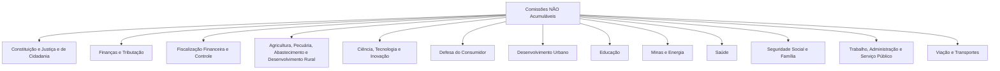
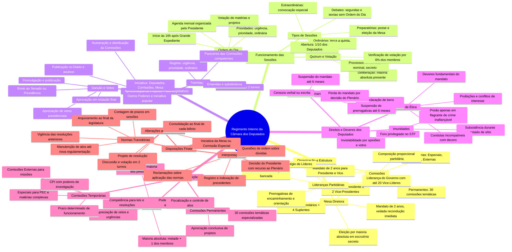
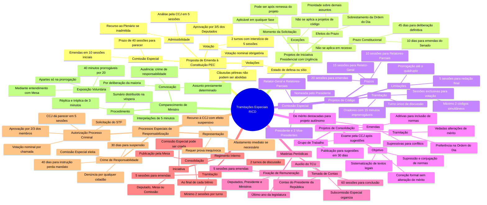

```mermaid
graph TD
    RICD["Regimento Interno da Câmara dos Deputados (RICD)"]

    RICD --> T1["TÍTULO I - DISPOSIÇÕES PRELIMINARES"]
    T1 --> C1_1["CAPÍTULO I - Da Sede"]
    T1 --> C1_2["CAPÍTULO II - Das Sessões Legislativas"]
    T1 --> C1_3["CAPÍTULO III - Das Sessões Preparatórias"]
    C1_3 --> S1_3_1["Seção I - Da Posse dos Deputados"]
    C1_3 --> S1_3_2["Seção II - Da Eleição da Mesa"]
    T1 --> C1_4["CAPÍTULO IV - Dos Líderes"]
    T1 --> C1_5["CAPÍTULO V - Dos Blocos Parlamentares, da Maioria e da Minoria"]
    T1 --> C1_6["CAPÍTULO VI - Da Bancada Negra"]

    RICD --> T2["TÍTULO II - DOS ÓRGÃOS DA CÂMARA"]
    T2 --> C2_1["CAPÍTULO I - Da Mesa"]
    C2_1 --> S2_1_1["Seção I - Disposições Gerais"]
    C2_1 --> S2_1_2["Seção II - Da Presidência"]
    C2_1 --> S2_1_3["Seção III - Da Secretaria"]
    T2 --> C2_2["CAPÍTULO II - Do Colégio de Líderes"]
    T2 --> C2_2A["CAPÍTULO II-A - Da Secretaria da Mulher"]
    T2 --> C2_2B["CAPÍTULO II-B - Da Secretaria da Primeira Infância, Infância, Adolescência e Juventude"]
    T2 --> C2_3["CAPÍTULO III - Da Procuradoria Parlamentar"]
    T2 --> C2_3A["CAPÍTULO III-A - Da Ouvidoria Parlamentar"]
    T2 --> C2_3B["CAPÍTULO III-B - Do Conselho de Ética e Decoro Parlamentar"]
    T2 --> C2_3C["CAPÍTULO III-C - Da Corregedoria Parlamentar"]
    T2 --> C2_3D["CAPÍTULO III-D - Da Secretaria de Relações Internacionais"]
    T2 --> C2_3E["CAPÍTULO III-E - Da Secretaria de Comunicação Social"]
    T2 --> C2_3F["CAPÍTULO III-F - Da Secretaria de Participação, Interação e Mídias Digitais"]
    T2 --> C2_3G["CAPÍTULO III-G - Da Secretaria da Transparência"]
    T2 --> C2_3H["CAPÍTULO III-H - Da Secretaria do Empreendedorismo Legislativo"]
    T2 --> C2_3I["CAPÍTULO III-I - Da Secretaria da Inovação Legislativa"]
    T2 --> C2_3J["CAPÍTULO III-J - Da Secretaria de Defesa das Prerrogativas Parlamentares"]
    T2 --> C2_4["CAPÍTULO IV - Das Comissões"]
    C2_4 --> S2_4_1["Seção I - Disposições Gerais"]
    C2_4 --> S2_4_2["Seção II - Das Comissões Permanentes"]
    S2_4_2 --> SS2_4_2_1["Subseção I - Da Composição e Instalação"]
    S2_4_2 --> SS2_4_2_2["Subseção II - Das Subcomissões e Turmas"]
    S2_4_2 --> SS2_4_2_3["Subseção III - Das Matérias ou Atividades de Competência das Comissões"]
    C2_4 --> S2_4_3["Seção III - Das Comissões Temporárias"]
    S2_4_3 --> SS2_4_3_1["Subseção I - Das Comissões Especiais"]
    S2_4_3 --> SS2_4_3_2["Subseção II - Das Comissões Parlamentares de Inquérito"]
    S2_4_3 --> SS2_4_3_3["Subseção III - Das Comissões Externas"]
    C2_4 --> S2_4_4["Seção IV - Da Presidência das Comissões"]
    C2_4 --> S2_4_5["Seção V - Dos Impedimentos e Ausências"]
    C2_4 --> S2_4_6["Seção VI - Das Vagas"]
    C2_4 --> S2_4_7["Seção VII - Das Reuniões"]
    C2_4 --> S2_4_8["Seção VIII - Dos Trabalhos"]
    C2_4 --> S2_4_9["Seção IX - Da Admissibilidade e da Apreciação das Matérias pelas Comissões"]
    C2_4 --> S2_4_10["Seção X - Da Fiscalização e Controle"]
    C2_4 --> S2_4_11["Seção XI - Da Secretaria e das Atas"]
    C2_4 --> S2_4_12["Seção XII - Do Assessoramento Legislativo"]

    RICD --> T3["TÍTULO III - DAS SESSÕES DA CÂMARA"]
    T3 --> C3_1["CAPÍTULO I - Disposições Gerais"]
    T3 --> C3_2["CAPÍTULO II - Das Sessões Públicas"]
    C3_2 --> S3_2_1["Seção I - Do Pequeno Expediente"]
    C3_2 --> S3_2_2["Seção II - Da Ordem do Dia"]
    C3_2 --> S3_2_3["Seção III - Do Grande Expediente"]
    C3_2 --> S3_2_4["Seção IV - Das Comunicações de Lideranças"]
    C3_2 --> S3_2_5["Seção V - Das Comunicações Parlamentares"]
    C3_2 --> S3_2_6["Seção VI - Da Comissão Geral"]
    T3 --> C3_3["CAPÍTULO III - Das Sessões Secretas"]
    T3 --> C3_4["CAPÍTULO IV - Da Interpretação e Observância do Regimento"]
    C3_4 --> S3_4_1["Seção I - Das Questões de Ordem"]
    C3_4 --> S3_4_2["Seção II - Das Reclamações"]
    T3 --> C3_5["CAPÍTULO V - Da Ata"]

    RICD --> T4["TÍTULO IV - DAS PROPOSIÇÕES"]
    T4 --> C4_1["CAPÍTULO I - Disposições Gerais"]
    T4 --> C4_2["CAPÍTULO II - Dos Projetos"]
    T4 --> C4_3["CAPÍTULO III - Das Indicações"]
    T4 --> C4_4["CAPÍTULO IV - Dos Requerimentos"]
    C4_4 --> S4_4_1["Seção I - Sujeitos a Despacho Apenas do Presidente"]
    C4_4 --> S4_4_2["Seção II - Sujeitos a Despacho do Presidente, Ouvida a Mesa"]
    C4_4 --> S4_4_3["Seção III - Sujeitos a Deliberação do Plenário"]
    T4 --> C4_5["CAPÍTULO V - Das Emendas"]
    T4 --> C4_6["CAPÍTULO VI - Dos Pareceres"]

    RICD --> T5["TÍTULO V - DA APRECIAÇÃO DAS PROPOSIÇÕES"]
    T5 --> C5_1["CAPÍTULO I - Da Tramitação"]
    T5 --> C5_2["CAPÍTULO II - Do Recebimento e da Distribuição das Proposições"]
    T5 --> C5_3["CAPÍTULO III - Da Apreciação Preliminar"]
    T5 --> C5_4["CAPÍTULO IV - Dos Turnos a que Estão Sujeitas as Proposições"]
    T5 --> C5_5["CAPÍTULO V - Do Interstício"]
    T5 --> C5_6["CAPÍTULO VI - Do Regime de Tramitação"]
    T5 --> C5_7["CAPÍTULO VII - Da Urgência"]
    C5_7 --> S5_7_1["Seção I - Disposições Gerais"]
    C5_7 --> S5_7_2["Seção II - Do Requerimento de Urgência"]
    C5_7 --> S5_7_3["Seção III - Da Apreciação de Matéria Urgente"]
    T5 --> C5_8["CAPÍTULO VIII - Da Prioridade"]
    T5 --> C5_9["CAPÍTULO IX - Da Preferência"]
    T5 --> C5_10["CAPÍTULO X - Do Destaque"]
    T5 --> C5_11["CAPÍTULO XI - Da Prejudicialidade"]
    T5 --> C5_12["CAPÍTULO XII - Da Discussão"]
    C5_12 --> S5_12_1["Seção I - Disposições Gerais"]
    C5_12 --> S5_12_2["Seção II - Da Inscrição e do Uso da Palavra"]
    C5_12 --> S5_12_3["Seção III - Do Adiamento da Discussão"]
    C5_12 --> S5_12_4["Seção IV - Do Encerramento da Discussão"]
    C5_12 --> S5_12_5["Seção V - Da Proposição Emendada Durante a Discussão"]
    T5 --> C5_13["CAPÍTULO XIII - Da Votação"]
    C5_13 --> S5_13_1["Seção I - Disposições Gerais"]
    C5_13 --> S5_13_2["Seção II - Das Modalidades e Processos de Votação"]
    C5_13 --> S5_13_3["Seção III - Do Processamento da Votação"]
    C5_13 --> S5_13_4["Seção IV - Do Encaminhamento da Votação"]
    C5_13 --> S5_13_5["Seção V - Do Adiamento da Votação"]
    T5 --> C5_14["CAPÍTULO XIV - Da Redação do Vencido, da Redação Final e dos Autógrafos"]

    RICD --> T6["TÍTULO VI - DAS MATÉRIAS SUJEITAS A DISPOSIÇÕES ESPECIAIS"]
    T6 --> C6_1["CAPÍTULO I - Da Proposta de Emenda à Constituição"]
    T6 --> C6_2["CAPÍTULO II - Dos Projetos de Iniciativa do Presidente da República com Solicitação de Urgência"]
    T6 --> C6_3["CAPÍTULO III - Dos Projetos de Código"]
    T6 --> C6_3A["CAPÍTULO III-A - Dos Projetos de Consolidação"]
    T6 --> C6_4["CAPÍTULO IV - Das Matérias de Natureza Periódica"]
    C6_4 --> S6_4_1["Seção I - Dos Projetos de Fixação da Remuneração"]
    C6_4 --> S6_4_2["Seção II - Da Tomada de Contas do Presidente da República"]
    T6 --> C6_5["CAPÍTULO V - Do Regimento Interno"]
    T6 --> C6_6["CAPÍTULO VI - Da Autorização para Instauração de Processo Criminal"]
    T6 --> C6_7["CAPÍTULO VII - Do Processo nos Crimes de Responsabilidade"]
    T6 --> C6_8["CAPÍTULO VIII - Do Comparecimento de Ministro de Estado"]
    T6 --> C6_9["CAPÍTULO IX - Da Participação na Comissão Representativa e no Conselho da República"]

    RICD --> T7["TÍTULO VII - DOS DEPUTADOS"]
    T7 --> C7_1["CAPÍTULO I - Do Exercício do Mandato"]
    T7 --> C7_2["CAPÍTULO II - Da Licença"]
    T7 --> C7_3["CAPÍTULO III - Da Vacância"]
    T7 --> C7_4["CAPÍTULO IV - Da Convocação de Suplente"]
    T7 --> C7_5["CAPÍTULO V - Do Decoro Parlamentar"]
    T7 --> C7_6["CAPÍTULO VI - Da Licença para Instauração de Processo Criminal contra Deputado"]

    RICD --> T8["TÍTULO VIII - DA PARTICIPAÇÃO DA SOCIEDADE CIVIL"]
    T8 --> C8_1["CAPÍTULO I - Da Iniciativa Popular de Lei"]
    T8 --> C8_2["CAPÍTULO II - Das Petições e Representações e Outras Formas de Participação"]
    T8 --> C8_3["CAPÍTULO III - Da Audiência Pública"]
    T8 --> C8_4["CAPÍTULO IV - Do Credenciamento de Entidades e da Imprensa"]

    RICD --> T9["TÍTULO IX - DA ADMINISTRAÇÃO E DA ECONOMIA INTERNA"]
    T9 --> C9_1["CAPÍTULO I - Dos Serviços Administrativos"]
    T9 --> C9_2["CAPÍTULO II - Da Administração e Fiscalização Contábil, Orçamentária, Financeira, Operacional e Patrimonial"]
    T9 --> C9_3["CAPÍTULO III - Da Polícia da Câmara"]
    T9 --> C9_4["CAPÍTULO IV - Da Delegação de Competência"]
    T9 --> C9_5["CAPÍTULO V - Do Sistema de Consultoria e Assessoramento"]

    RICD --> T10["TÍTULO X - DAS DISPOSIÇÕES FINAIS"]
```

mindmap
  root((Tramitações Especiais RICD))
    Proposta de Emenda à Constituição - PEC
      Admissibilidade
        Análise pela CCJ em 5 sessões
        Recurso ao Plenário se inadmitida
        Vedações: estado de defesa/sítio e cláusulas pétreas
      Comissão Especial
        Prazo: 40 sessões para parecer
        Emendas: primeiras 10 sessões do prazo
        Mesmo quorum da PEC para emendas
      Discussão e Votação
        2 turnos com interstício de 5 sessões
        Votação nominal obrigatória
        Aprovação por 3/5 dos Deputados
        Interstício regimental entre turnos
      Regime de Urgência
        Prazo de uma sessão para emendas
        Comissão pode pedir 2 sessões para parecer
        Prazos contam em sessões
    
    Projetos de Iniciativa Presidencial com Urgência
      Prazo Constitucional
        45 dias para deliberação na Câmara
        Art. 64, §§ 1º, 2º e 3º da CF
        10 dias para emendas do Senado
      Efeitos do Prazo
        Sobrestamento da Ordem do Dia
        Prioridade absoluta sobre demais assuntos
        Inclusão automática na pauta
      Exceções ao Prazo
        Não corre em recesso
        Não se aplica a projetos de código
        Suspensão durante recesso parlamentar
      Momento da Solicitação
        Pode ser após remessa do projeto
        Aplicável em qualquer fase da tramitação
        Válido para projetos já em andamento
    
    Projetos de Código
      Comissão Especial
        Nomeada pelo Presidente
        Presidente e 3 Vice-Presidentes
        Relator-Geral e Relatores-Parciais
        Eleição de dirigentes em 2 sessões
      Prazos para Emendas e Pareceres
        20 sessões para apresentação de emendas
        10 sessões para Relatores-Parciais
        15 sessões para Relator-Geral
        Redação do vencido em 5 sessões
      Tramitação Especial
        Turno único de discussão
        Oradores: 15 minutos improrrogáveis
        Sessões exclusivas para votação
        5 sessões para redação final
      Limitações e Prorrogações
        Máximo de 2 códigos simultâneos
        Prazos prorrogáveis até o dobro
        Casos excepcionais: até o quádruplo
        Suspensão por até 120 sessões
    
    Projetos de Consolidação
      Objetivo e Natureza
        Sistematização de textos legais
        Correção formal sem alterar mérito
        Supressão e conjugação de normas
        Vedada alteração de conteúdo
      Grupo de Trabalho
        Publicação para sugestões: 30 dias
        Incorporação de sugestões ao texto
        Exame pela CCJ após sugestões
        Parecer sobre aspectos formais
      Emendas Permitidas
        Aditivas: para inclusão de normas
        Supressivas: para conflitos normativos
        De mérito: destacadas para projeto autônomo
        Fundamentação obrigatória
      Tramitação Preferencial
        Preferência na Ordem do Dia
        Vedadas alterações de mérito
        Parecer da CCJ sobre emendas
        Correção de vícios formais
    
    Matérias Periódicas
      Fixação de Remuneração
        Último ano da legislatura
        Deputados, Presidente, Vice e Ministros
        Comissão de Finanças elabora projeto
        5 sessões para emendas
      Tomada de Contas
        Contas do Presidente da República
        Subcomissão Especial organiza
        60 sessões para conclusão dos trabalhos
        Auxílio do TCU
        Relatores-Parciais por órgão orçamentário
    
    Regimento Interno
      Iniciativa
        Deputado, Mesa ou Comissão
        Comissão Especial pode ser criada
        Deliberação da Câmara
      Tramitação
        5 sessões para recebimento de emendas
        Pareceres: CCJ, Comissão Especial e Mesa
        2 turnos de discussão
        Mínimo de 2 sessões por turno
      Redação Final
        Comissão Especial ou Mesa
        Conforme origem do projeto
      Consolidação
        Ao final de cada biênio
        Publicação pela Mesa
        Integração de todas alterações
    
    Processos Especiais de Responsabilização
      Autorização para Processo Criminal
        Solicitação do STF
        CCJ dá parecer em 5 sessões
        Votação nominal por chamada
        Aprovação por 2/3 dos membros
        Presidente e Vice-Presidente da República
        Ministros de Estado
      Crime de Responsabilidade
        Denúncia por qualquer cidadão
        Comissão Especial eleita
        Prazo para instrução: 40 dias - perda mandato
        Prazo para instrução: 30 dias - suspensão
        Defesa: 10 dias úteis
        Parecer: 5 sessões após instrução
      Representação
        Requer prova inequívoca da acusação
        Afastamento imediato se necessário
        Votação por 2/3 para admissão
        Recurso à CCJ com efeito suspensivo
    
    Comparecimento de Ministro
      Convocação
        Por deliberação da maioria
        Assunto previamente determinado
        Ausência: crime de responsabilidade
        Comunicação com antecedência
      Exposição Voluntária
        Mediante entendimento com Mesa
        40 minutos prorrogáveis por 20
        Apartes só na prorrogação
        Comissão Geral durante exposição
      Procedimento de Interpelação
        Sumário distribuído na véspera
        Interpelações de 5 minutos
        Réplica e tréplica de 3 minutos
        Líderes: 5 minutos sem apartes

```mermaid
graph LR
    RICD[Prazos Regimentais RICD]
    
    RICD --> COM[Prazos para Comissões]
    RICD --> REC[Prazos para Recursos]
    RICD --> MESA[Prazos para Mesa Diretora]
    RICD --> PLEN[Prazos em Plenário]
    RICD --> RED[Prazos para Redação]
    RICD --> PROP[Prazos para Proposições]
    RICD --> DEP[Prazos para Deputados]
    RICD --> DISC[Prazos Processos Disciplinares]
    RICD --> OUT[Outros Prazos]
    
    COM --> COM1["5 sessões - Parecer em regime de urgência (Art. 52, I)"]
    COM --> COM2["10 sessões - Parecer em regime de prioridade (Art. 52, II)"]
    COM --> COM3["40 sessões - Parecer em tramitação ordinária (Art. 52, III)"]
    COM --> COM4["Metade do prazo da Comissão - Relator oferecer parecer (Art. 52, §1)"]
    COM --> COM5["Até metade dos prazos - Prorrogação exceto urgência (Art. 52, §2)"]
    COM --> COM6["2 sessões - Avocação/novo relator em prioridade (Art. 52, §3)"]
    COM --> COM7["5 sessões - Avocação/novo relator em ordinária (Art. 52, §3)"]
    COM --> COM8["2 sessões - Vista de processo exceto urgência (Art. 57, XVI)"]
    COM --> COM9["Até reunião seguinte - Redação de novo texto (Art. 57, XI)"]
    COM --> COM10["Até reunião seguinte - Redação parecer vencedor (Art. 57, XII)"]
    COM --> COM11["5 sessões - Admissibilidade de PEC (Art. 202)"]
    COM --> COM12["40 sessões - Comissão Especial parecer PEC (Art. 202, §2)"]
    COM --> COM13["10 primeiras sessões - Emendas à PEC (Art. 202, §3)"]
    COM --> COM14["5 sessões - Convocação para eleição (Art. 39, §1)"]
    COM --> COM15["10 sessões - Discutir e votar código (Art. 206)"]
    COM --> COM16["5 sessões - Relatório do vencido em código (Art. 206, V)"]
    COM --> COM17["24 horas - Antecedência avulsos da pauta (Art. 47, pu)"]
    COM --> COM18["Mín. 10 dias - Cumprimento de convocações (Art. 61, §2)"]
    COM --> COM19["5 sessões - CFFC implementar PAFC (Art. 61-A)"]
    COM --> COM20["Fim sess legislativa - CFFC apresentar RAFC (Art. 61-A, §1)"]
    COM --> COM21["120 dias prorrog 60 - CPI concluir (Art. 35, §3)"]
    COM --> COM22["5 sessões - Relatório CPI em Ordem do Dia (Art. 37, I)"]
    COM --> COM23["5 sessões - Presidente remeter conclusões CPI (Art. 37, pu)"]
    COM --> COM24["8 sessões - Comissão Externa no País (Art. 38, pu)"]
    COM --> COM25["30 sessões - Comissão Externa exterior (Art. 38, pu)"]
    COM --> COM26["3 meses - Nova eleição em vaga (Art. 40, §1)"]
    COM --> COM27["Max 2 sessões - Parecer urgência (Art. 157, §1)"]
    COM --> COM28["1 sessão - Parecer sobre emendas urgência (Art. 157, §4)"]
    COM --> COM29["2 sessões - Eleger Presidente Comissão Especial (Art. 205, §2)"]
    COM --> COM30["20 sessões - Emendas a código (Art. 205, §4)"]
    COM --> COM31["10 sessões - Relatores-Parciais código (Art. 205, §5)"]
    COM --> COM32["15 sessões - Relator-Geral código (Art. 205, §6)"]
    COM --> COM33["10 sessões - Parecer emendas Senado código (Art. 210)"]
    
    REC --> REC1["5 sessões - Recurso apreciação conclusiva (Art. 58, §1)"]
    REC --> REC2["5 sessões - Recurso prejudicialidade (Art. 164, §2)"]
    REC --> REC3["2 dias úteis - Recurso representado à CCJ (Art. 14, VII)"]
    
    MESA --> MESA1["48 horas - Reclamação extravio proposição (Art. 108)"]
    MESA --> MESA2["48 horas - Convocação de Suplente (Art. 241)"]
    MESA --> MESA3["2 sessões - Promulgação de resoluções (Art. 198, §2)"]
    MESA --> MESA4["Até 5 sessões - Envio código ao Senado (Art. 209)"]
    MESA --> MESA5["3 sessões - Envio projeto à sanção (Art. 210, §4)"]
    MESA --> MESA6["72 horas - Envio redação final aprovada (Art. 58, §5)"]
    MESA --> MESA7["2 sessões - Processo ético em Ordem do Dia (Art. 248, §2)"]
    MESA --> MESA8["30 dias - Sugestões consolidação (Art. 213, §2)"]
    MESA --> MESA9["3 sessões - Preencher vaga Comissão (Art. 45, §3)"]
    MESA --> MESA10["2 sessões - Apelo membro retém papéis (Art. 57, XX, b)"]
    
    PLEN --> PLEN1["5 sessões - Interstício turnos PEC (Art. 202, §6)"]
    PLEN --> PLEN2["2 sessões - Interstício PEC Ordem Dia (Art. 202, §5)"]
    PLEN --> PLEN3["45 dias - Projeto urgência Presidente (Art. 204, I)"]
    PLEN --> PLEN4["10 dias - Emendas Senado urgência (Art. 204, II)"]
    PLEN --> PLEN5["5 sessões - Proposição Ordem Dia após emendas (Art. 120)"]
    PLEN --> PLEN6["1 sessão - Adiamento discussão urgente (Art. 177, I)"]
    PLEN --> PLEN7["3 sessões - Adiamento discussão prioridade (Art. 177, II)"]
    PLEN --> PLEN8["5 sessões - Adiamento discussão ordinária/PEC (Art. 177, III)"]
    PLEN --> PLEN9["1 sessão - Adiamento votação urgente (Art. 193, I)"]
    PLEN --> PLEN10["3 sessões - Adiamento votação prioridade (Art. 193, II)"]
    PLEN --> PLEN11["5 sessões - Adiamento votação ordinária/PEC (Art. 193, III)"]
    PLEN --> PLEN12["4 sessões - Discussão 1º turno (Art. 168)"]
    PLEN --> PLEN13["2 sessões - Discussão 2º turno (Art. 168)"]
    PLEN --> PLEN14["2 sessões - Texto destaque projeto separado (Art. 162, X)"]
    PLEN --> PLEN15["2 sessões - Publicação código avulsos (Art. 207)"]
    PLEN --> PLEN16["5 sessões - Debate código encerramento (Art. 207, §2)"]
    PLEN --> PLEN17["1 hora - Nova verificação votação (Art. 185, §4)"]
    PLEN --> PLEN18["60 dias úteis - Processos ético-disciplinares (Art. 16)"]
    PLEN --> PLEN19["90 dias úteis - Perda de mandato (Art. 16, §1)"]
    
    RED --> RED1["10 sessões - Redação ordinária (Art. 196)"]
    RED --> RED2["5 sessões - Redação prioridade (Art. 196)"]
    RED --> RED3["1 sessão prorrog 1 - Redação urgência/PEC (Art. 196)"]
    RED --> RED4["5 sessões - Redação final código (Art. 208)"]
    
    PROP --> PROP1["10 minutos - Proposições após Grande Expediente (Art. 82, §4)"]
    PROP --> PROP2["5 sessões - Emendas apreciação conclusiva (Art. 120, §1)"]
    PROP --> PROP3["Até encerramento - Emendas discussão (Art. 120)"]
    PROP --> PROP4["20 minutos - Emendas Comissão pós-discussão (Art. 120, §3)"]
    PROP --> PROP5["10 dias - Manifestação autorização processo (Art. 217, I)"]
    PROP --> PROP6["5 sessões - CCJ parecer autorização (Art. 217, II)"]
    PROP --> PROP7["60 dias - Tomada contas Presidente (Art. 215)"]
    PROP --> PROP8["60 sessões - Organização contas exercício (Art. 215, §1)"]
    
    DEP --> DEP1["5 minutos - Breves comunicações (Art. 81)"]
    DEP --> DEP2["25 minutos - Grande Expediente (Art. 87)"]
    DEP --> DEP3["10 minutos - Comunicações Parlamentares (Art. 90, pu)"]
    DEP --> DEP4["3 a 10 minutos - Comunicações Liderança (Art. 89)"]
    DEP --> DEP5["8 minutos - Governo/Minoria/Oposição/Maioria (Art. 89)"]
    DEP --> DEP6["15 minutos - Discussão Comissão (Art. 57, VII)"]
    DEP --> DEP7["10 minutos - Não membro Comissão (Art. 57, VII)"]
    DEP --> DEP8["20 minutos - Réplica Relator Comissão (Art. 57, IX)"]
    DEP --> DEP9["5 minutos - Discussão Plenário (Art. 174)"]
    DEP --> DEP10["3 minutos - Encaminhamento votação (Art. 192)"]
    DEP --> DEP11["1 minuto - Orientação bancada Líder (Art. 192, §2)"]
    DEP --> DEP12["3 minutos - Discussão urgência (Art. 157, §3)"]
    DEP --> DEP13["15 minutos - Discussão código (Art. 207, §1)"]
    DEP --> DEP14["30 minutos - Relator código (Art. 207, §1)"]
    DEP --> DEP15["40 min prorrog 20 - Ministro Comissão Geral (Art. 91, §1)"]
    DEP --> DEP16["3 minutos - Interpelação Ministro (Art. 221, §2)"]
    DEP --> DEP17["5 minutos - Emenda destacada código (Art. 206, III)"]
    DEP --> DEP18["10 minutos - Interstício parecer oral urgência (Art. 157, §6)"]
    
    DISC --> DISC1["10 dias úteis - Defesa suspensão (Art. 13, II)"]
    DISC --> DISC2["15 dias prorrog 15 - Apuração Conselho (Art. 13, II)"]
    DISC --> DISC3["10 dias úteis - Parecer suspensão (Art. 13, III)"]
    DISC --> DISC4["5 dias úteis - Defesa perda mandato (Art. 14, I)"]
    DISC --> DISC5["40 dias úteis - Instrução perda mandato (Art. 14, IV)"]
    DISC --> DISC6["30 dias úteis - Instrução suspensão temporária (Art. 14, IV)"]
    DISC --> DISC7["10 dias úteis - Parecer pós-instrução (Art. 14, IV)"]
    DISC --> DISC8["5 dias úteis - Recurso CCJ (Art. 14, VII)"]
    DISC --> DISC9["5 dias úteis - CCJ sobre recurso (Art. 14, VII)"]
    DISC --> DISC10["5 dias úteis - Novo relator instrução (Art. 248, §4, I)"]
    DISC --> DISC11["5 dias úteis - Novo relator parecer (Art. 248, §4, II)"]
    
    OUT --> OUT1["120 dias - Licença saúde p/ suplente (Art. 241, III)"]
    OUT --> OUT2["15 meses - Vaga antes término (Art. 242)"]
    OUT --> OUT3["1 hora - Suspensão sessão/reunião (Art. 70 e 41, XXIV)"]
    OUT --> OUT4["30 minutos - Homenagens prorrogação (Art. 68, §1)"]
    OUT --> OUT5["30 minutos - Aguardar quorum (Art. 79, §3)"]
    OUT --> OUT6["24 horas - Convocação extraordinária (Art. 67, §2)"]
    OUT --> OUT7["8h às 13h30 - Inscrição Pequeno Expediente (Art. 81, §2)"]
    OUT --> OUT8["Até semana precedente - Publicação Ordem Dia (Art. 86)"]

```

