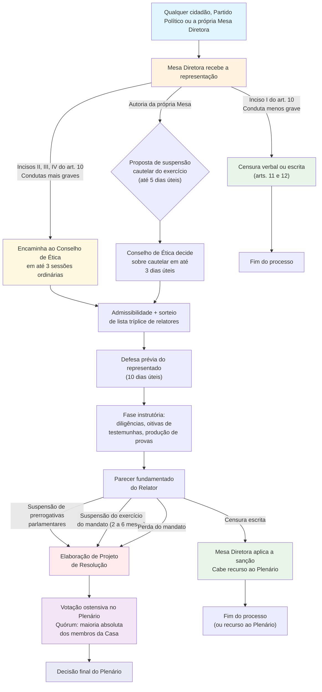

# Julgamento de Deputado no âmbito da Câmara: **RICD + Código de Ética**

_(aula prática de um analista legislativo da Câmara — com foco em “pontos quentes” de prova)_

## 1) Base normativa e ideia-força

- O **Código de Ética e Decoro Parlamentar** (Res. nº 25/2001) **integra** o RICD e **complementa** o Regimento: é dali que saem as condutas puníveis, as sanções e o **processo disciplinar**.
    
- O RICD remete expressamente: “o deputado… estará sujeito às penalidades e ao processo disciplinar previstos no **Código de Ética**”.
    

---

## 2) Quem julga, quem movimenta e quem executa (papéis institucionais)

**Conselho de Ética e Decoro Parlamentar (CEDP)**

- Órgão **competente para examinar as condutas** e **propor as penalidades**; composição: **21** titulares e **21** suplentes (mandato de 2 anos).
    
- O Presidente do Conselho tem as mesmas prerrogativas de manutenção da ordem do Presidente da Câmara; e **presidente de comissão/conselho vota** nas deliberações.
    

**Corregedoria Parlamentar**

- Promove a **manutenção do decoro**, pode instaurar **sindicância ou inquérito** para apurar notícias de ilícitos envolvendo Deputados.
    
- **Corregedor pode participar de todas as fases no CEDP**, inclusive debates, **sem direito a voto**. (Ponto que cai!)
    

**Mesa/Presidência**

- **Censura verbal**: aplicada pelo **Presidente da Câmara** (em sessão) ou de Comissão (nas reuniões).
    
- **Censura escrita**: aplicada pela **Mesa** (com defesa de 5 dias e recurso ao Plenário).
    
- **Novidade 2024 (cautelar)**: a **Mesa pode propor suspensão cautelar do exercício do mandato** (prazo do inciso III do art. 10) quando a representação por quebra de decoro for **de autoria da Mesa**; a proposta deve ser oferecida em **até 5 dias úteis** do conhecimento do fato.
    

---

## 3) Condutas puníveis (mapa mental rápido — “o que costuma cair”)

- **Art. 4º (incompatível com o decoro)** e **Art. 5º (atentatório ao decoro)** trazem o **catálogo de condutas** (vantagens indevidas, abuso de prerrogativas, fraude, revelar informações sigilosas, patrocinar interesse indevido, etc.).  
    _Dicas de cobrança_: reconhecer exemplos concretos e vincular **tipo de sanção** cabível.
    

---

## 4) **Sanções** (art. 10 a 13) — escada sancionatória e efeitos

**Rol do art. 10 (caput)**: o Código lista as **penalidades aplicáveis** (cobrança clássica).

**Censura verbal (art. 11)**

- Aplicação: Presidente (Plenário) ou Presidente de Comissão; **cabe recurso ao Plenário em 2 dias úteis**.
    

**Censura escrita (art. 12)**

- Aplicação: Mesa; **defesa em 5 dias úteis** antes da decisão; **recurso ao Plenário em 2 dias úteis**.
    

**Suspensão de prerrogativas regimentais (art. 13 caput)**

- **Proposta pelo CEDP via Projeto de Resolução**; decisão pelo **Plenário, votação ostensiva e por maioria absoluta**.
    
- O art. 14 lista **quais prerrogativas podem ser suspensas** (inscrição para usar a palavra, relatar proposições, presidir, integrar comitiva, usar certas estruturas, etc.). (Tema de detalhe que banca ama).
    

**Suspensão do exercício do mandato (art. 10, §2º)**

- **De 2 a 6 meses**, preservadas as **votações em Plenário**. (Ponto fino).
    

**Perda do mandato (art. 10, §4º; art. 14 final)**

- Admissível na **concorrência de condutas** dos arts. 4º e 5º, **sem prejuízo** das sanções civis/penais.
    
- **Votação em Plenário é ostensiva e por maioria absoluta** (alinhar com CF, art. 55).
    

**Regra de ouro**: **Ressarcimento ao erário** quando houver vantagem indevida de recurso público (sem prejuízo da sanção ética).

---

## 5) **Como começa?** — legitimidade, porta de entrada e filtros

- **Tudo nasce na Mesa**: “as representações relacionadas com o decoro serão feitas **diretamente à Mesa**”.
    
- **Qualquer cidadão** tem legitimidade para requerer à Mesa a representação (com **descrição de fatos e provas**). (Pegadinha recorrente.)
    
- **Triagem da Mesa**:
    
    - Se **sanção do inciso I** (censura), aplica-se o **art. 11 ou 12**;
        
    - Se **sanções dos incisos II, III, IV** (mais gravosas), **encaminha ao Conselho em até 3 sessões**.
        
- **Representação de Partido (CF, 55, §2º)**: **vai direto ao Conselho** (prazo das 3 sessões).
    

---

## 6) **Rito no Conselho** (da admissibilidade ao parecer)

- **Sorteio de lista tríplice** e designação de **Relator** (vedações: não pode ser do mesmo partido/bloco do representado).
    
- **Defesa prévia**: **10 dias úteis** após notificação. (Item fácil e muito cobrado.)
    
- **Instrução**: o Relator pode propor **diligências e avaliações**; contraditório e ampla defesa **em todas as fases**.
    
- **Inépcia**: se o Conselho entender **inepta** a representação **de Partido**, _1/10 da Câmara_ pode recorrer ao **Plenário**.
    
- **Relatório/Parecer**: ao final, o CEDP **propõe a penalidade** cabível (inclusive **projeto de resolução** para suspensão de prerrogativas/suspensão do mandato/perda).
    

**Prazos-macro do processo (art. 16)**

- **60 dias** para concluir no CEDP, **prorrogáveis uma única vez por 30 dias**; terminado o prazo, **inclui em pauta em até 2 sessões**. (Cronograma campeão de prova.)
    
- **Representação é irrenunciável**: não pode ser retirada no curso do processo.
    

**Recurso para a CCJC (novidade do rito)**

- Cabe recurso **com efeito suspensivo** para a CCJC em **5 dias úteis**, **quando o parecer é pela perda do mandato**; **sem efeito suspensivo** nas demais hipóteses. (Ponto fino.)
    

---

## 7) **Medida cautelar (2024)** — como funciona

- **Proposta**: pela **Mesa**, em até **5 dias úteis** do fato (ato contínuo à representação **de autoria da própria Mesa**).
    
- **Decisão**: **Conselho decide em até 3 dias úteis**; cabe **recurso ao Plenário**.
    
- **Prazo**: vinculado ao **inciso III do art. 10** (mesmo teto temporal da suspensão do exercício do mandato).
    

---

## 8) **Votações em Plenário** — o que decorar

- **Suspensão de prerrogativas**: **votação ostensiva, maioria absoluta**.
    
- **Perda do mandato**: **votação ostensiva, maioria absoluta** (harmonizado à CF, art. 55).
    

---

## 9) **Fluxo visual do processo** (resumo esquemático)

**Linha do tempo (prazos-chave)**

- **3 sessões**: Mesa → CEDP (sanções II–IV).
    
- **10 dias úteis**: defesa prévia.
    
- **60 + 30 dias**: conclusão no CEDP (prorrogável 1x) → depois, **pauta em 2 sessões**.
    
- **Cautelar**: **5 dias úteis** para a Mesa propor; **3 dias úteis** para o CEDP decidir.
    

---

## 10) **Quadro rápido de sanções e competência**

|Sanção|Quem aplica/propõe|Defesa/Recursos|Decisão final|
|---|---|---|---|
|**Censura verbal (art. 11)**|Presidente (Plenário/Comissão)|**Recurso ao Plenário** em **2 dias úteis**|Plenário (recurso)|
|**Censura escrita (art. 12)**|**Mesa** (defesa prévia **5 dias**)|**Recurso ao Plenário** em **2 dias úteis**|Plenário (recurso)|
|**Suspensão de prerrogativas (art. 13/14)**|**CEDP** propõe **PR**|—|**Plenário**, **voto ostensivo/maioria absoluta**|
|**Suspensão do exercício do mandato**|**CEDP** propõe **PR**|—|**Plenário** (mesma regra de votação) — prazo **2 a 6 meses** (mantém voto em Plenário)|
|**Perda do mandato**|**CEDP** propõe **PR**|**Recurso com efeito suspensivo à CCJC (5 dias úteis)**|**Plenário**, **voto ostensivo/maioria absoluta**|

> [!note]  
> **Ressarcimento ao erário** pode cumular com a sanção ética quando houver vantagem indevida de recurso público.

---

## 11) **Pontos quentes para a prova (checklist final)**

1. **Legitimidade ativa**: **qualquer cidadão** pode requerer à Mesa (com fatos e provas).
    
2. **Corregedor no CEDP**: **participa sem voto** (cai muito!).
    
3. **Censura verbal**: Presidente aplica; **recurso em 2 dias úteis**.
    
4. **Censura escrita**: Mesa aplica; **defesa prévia (5 dias)** e **recurso (2 dias)**.
    
5. **Encaminhamento ao CEDP**: **3 sessões** (sanções II–IV).
    
6. **Defesa prévia no CEDP**: **10 dias úteis**.
    
7. **Votação em Plenário** (suspensão de prerrogativas, suspensão do mandato, perda): **ostensiva e maioria absoluta**.
    
8. **Prazos do processo**: **60 + 30** dias no CEDP; depois **pauta em 2 sessões**.
    
9. **Inépcia de representação de Partido**: **recurso de 1/10** ao Plenário.
    
10. **Representação é irrenunciável** (não pode ser retirada).
    
11. **Cautelar (2024)**: **Mesa propõe (5 dias úteis)** → **CEDP decide (3 dias úteis)** → recurso ao Plenário.
    

---

