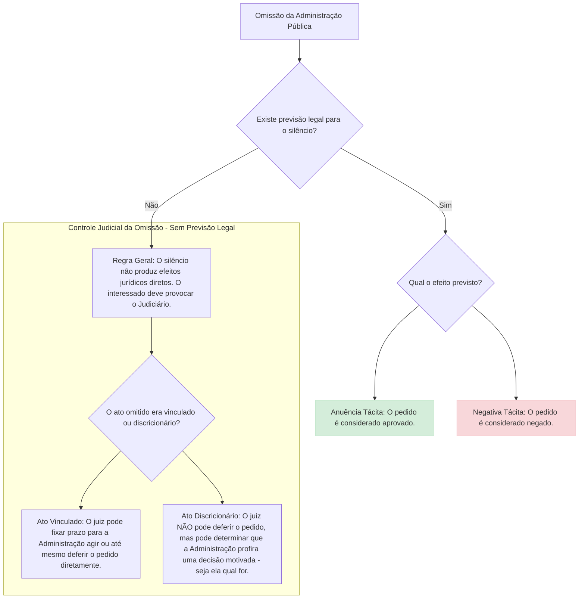

-----

# Atos Administrativos

## 1\. Conceito e Natureza Jurídica

Os **atos administrativos** são a principal ferramenta pela qual a Administração Pública manifesta sua vontade, agindo no exercício da função administrativa. Trata-se de uma espécie de ato jurídico, porém com características e finalidades próprias, regido predominantemente pelo Direito Público.

Em essência, são declarações unilaterais do Estado (ou de quem o represente) que têm como objetivo produzir efeitos jurídicos imediatos, visando sempre o **interesse público**.

### 1.1. Definições Doutrinárias Clássicas

Para consolidar o entendimento, é fundamental conhecer a visão de grandes juristas sobre o tema:

  - **Hely Lopes Meirelles:** Enfatiza a **unilateralidade** e a **finalidade** do ato.

    > *"Ato administrativo é toda manifestação **unilateral** de vontade da Administração Pública que, agindo nessa qualidade, tenha por fim imediato adquirir, resguardar, transferir, modificar, extinguir e declarar direitos, ou impor obrigações aos administrados ou a si própria.”*

  - **Maria Sylvia Zanella Di Pietro:** Destaca a **produção de efeitos imediatos** e o **controle judicial**.

    > *“Pode-se definir ato administrativo como a **declaração do Estado** ou de quem o represente, que produz **efeitos jurídicos imediatos**, com observância da lei, sob regime jurídico de direito público e sujeita a **controle pelo Poder Judiciário**.”*

  - **Celso Antônio Bandeira de Mello:** Aponta o ato como um **complemento da lei**.

    > *“Declaração do Estado (...), no exercício de prerrogativas públicas, manifestada mediante providências jurídicas **complementares da lei a título de lhe dar cumprimento**, e sujeitas a controle de legitimidade por órgãos jurisdicionais.”*

  - **José dos Santos Carvalho Filho:** Oferece uma visão sintética e completa dos elementos essenciais.

    > *“A exteriorização da vontade de **agentes da Administração Pública ou de seus delegatários**, nessa condição, que, sob **regime de direito público**, vise à produção de efeitos jurídicos, com o fim de atender ao **interesse público**.”*

### 1.2. Pontos Fundamentais (Síntese de Carvalho Filho)

Podemos esquematizar o conceito a partir de três pilares fundamentais:

1.  **Sujeito:** A vontade emana de um **agente da Administração Pública** ou de alguém com prerrogativas estatais (delegatários, como concessionárias de serviço público).
2.  **Finalidade e Conteúdo:** O ato deve produzir **efeitos jurídicos** (criar, modificar, extinguir direitos/obrigações) com um fim público específico.
3.  **Regime Jurídico:** A categoria é regida, em sua essência, pelo **Direito Público**, o que confere à Administração uma posição de verticalidade (supremacia) em relação ao particular.

## 2\. Características Essenciais do Ato Administrativo

As definições doutrinárias nos permitem extrair as características que moldam o ato administrativo:

| Característica | Descrição | Exemplo Prático |
| :--- | :--- | :--- |
| **Manifestação Unilateral** | Representa a vontade exclusiva da Administração. Diferencia-se dos contratos, que são bilaterais. | A emissão de uma multa de trânsito. |
| **Vontade da Administração** | Pode emanar de qualquer Poder (Executivo, Legislativo, Judiciário) quando em **função administrativa**. | O Presidente do Tribunal de Justiça nomeando um novo servidor. |
| **Praticado por Particulares** | Possível quando particulares atuam no exercício de prerrogativas públicas (delegação). | Uma concessionária de rodovia aplicando uma multa por evasão de pedágio. |
| **Produção de Efeitos Jurídicos** | Cria, modifica ou extingue direitos e obrigações, alterando a ordem jurídica. | A concessão de uma licença para construir. |
| **Finalidade de Interesse Público** | Objetivo primordial e inafastável. A ausência dessa finalidade vicia o ato (desvio de finalidade). | A desapropriação de um terreno para a construção de um hospital. |
| **Regime de Direito Público** | A Administração atua com supremacia sobre o particular, dotada de prerrogativas especiais. | A interdição de um estabelecimento comercial por risco sanitário. |
| **Controle Judicial** | Todo ato administrativo, por ser subordinado à lei, está sujeito ao controle de legalidade pelo Poder Judiciário. | Um cidadão pode acionar a Justiça para anular uma multa que considera ilegal. |

## 3\. O Silêncio Administrativo

O "não agir" da Administração pode ou não gerar consequências jurídicas. O silêncio, em si, não é um ato administrativo, mas um **fato administrativo** cujos efeitos dependem de previsão legal.

## 4\. Atributos do Ato Administrativo (Mnemônico: P.A.T.I.)

Os atributos são as qualidades que conferem ao ato administrativo seu regime jurídico especial, diferenciando-o dos atos privados.

  ### 4.1. Presunção de Legitimidade e Veracidade

  - **Conceito:** Todo ato administrativo nasce com uma presunção relativa (*iuris tantum*) de que foi praticado em conformidade com a lei (**legitimidade**) e que os fatos alegados pela Administração são verdadeiros (**veracidade**).
  - **Consequências Práticas:**
    1.  **Executoriedade Imediata:** O ato produz efeitos e deve ser cumprido desde sua edição, mesmo que possua vícios, até que sua invalidade seja declarada.
    2.  **Inversão do Ônus da Prova:** Cabe ao administrado que alega a ilegalidade provar o vício do ato.
    3.  **Necessidade de Provocação:** O Poder Judiciário só pode declarar a nulidade do ato se for provocado.
  - **Exceção Importante:** A presunção de veracidade pode ser mitigada em conflito com outros princípios constitucionais, como a **presunção de inocência** em processos disciplinares. Nesse caso, cabe à Administração provar a infração cometida pelo servidor.

### 4.2. Autoexecutoriedade

  - **Conceito:** É a prerrogativa que a Administração possui, em certas situações, de executar suas decisões por meios próprios, sem a necessidade de prévia autorização do Poder Judiciário, podendo inclusive empregar a força física.
  - **Fundamentos:**
      - Presunção de Legitimidade.
      - Supremacia do Interesse Público.
      - Necessidade de celeridade e urgência.
  - **Situações de Ocorrência (Não está presente em todos os atos\!):**
    1.  Quando a lei **expressamente previr**.
    2.  Em situações de **urgência** que, se não contidas, podem gerar um dano maior.
  - **Exemplo:** A remoção de um veículo estacionado em local proibido (guincho) ou a apreensão de mercadorias vencidas em um supermercado.

#### Desdobramentos da Autoexecutoriedade:

  - **Exigibilidade:** Meio de **coação indireta**. A Administração impõe sanções ou restrições para "convencer" o particular a cumprir a obrigação.
      - *Exemplo:* A impossibilidade de licenciar um veículo enquanto houver multas de trânsito pendentes. A Administração não toma o dinheiro da sua conta, mas cria um obstáculo para forçar o pagamento.
  - **Executoriedade:** Meio de **coação direta**. A Administração usa seus próprios meios (materiais e humanos) para fazer cumprir a decisão.
      - *Exemplo:* A demolição de uma construção irregular que apresenta risco de desabamento.

### 4.3. Tipicidade

  - **Conceito (Maria Sylvia Zanella Di Pietro):** O ato administrativo deve corresponder a uma das figuras definidas previamente em lei, como aptas a produzir determinados resultados. Para cada finalidade, a lei prevê um tipo de ato específico.
  - **Relação com a Legalidade:** É uma consequência direta do princípio da legalidade. A Administração só pode fazer o que a lei permite e, para isso, deve usar o "instrumento" (ato) que a lei designou.
  - **Dupla Função:**
    1.  **Garantia para o Administrado:** Impede que a Administração crie atos unilaterais "inominados" e impositivos sem base legal.
    2.  **Limite à Discricionariedade:** A própria lei, ao definir o tipo de ato, já estabelece os limites da atuação do administrador.
  - **Exemplo:** Para punir um servidor, a lei prevê os atos de advertência, suspensão e demissão. O gestor não pode criar uma "punição de rebaixamento de cargo" se ela não estiver prevista em lei.

### 4.4. Imperatividade

  - **Conceito:** É a qualidade pela qual os atos administrativos se impõem a terceiros, criando obrigações unilateralmente, independentemente da concordância do destinatário.
  - **Fundamento:** Supremacia do interesse público sobre o privado.
  - **Poder Extroverso:** A imperatividade permite que os efeitos do ato transcendam a esfera jurídica da Administração e atinjam diretamente a esfera jurídica do particular.
  - **Exemplo:** Uma ordem de interdição de um estabelecimento é obrigatória para o proprietário, quer ele concorde com ela ou não.
  - **Observação:** Nem todos os atos são imperativos. Os atos enunciativos (ex: certidões) ou negociais (ex: permissão de uso de bem público) não possuem essa característica.
