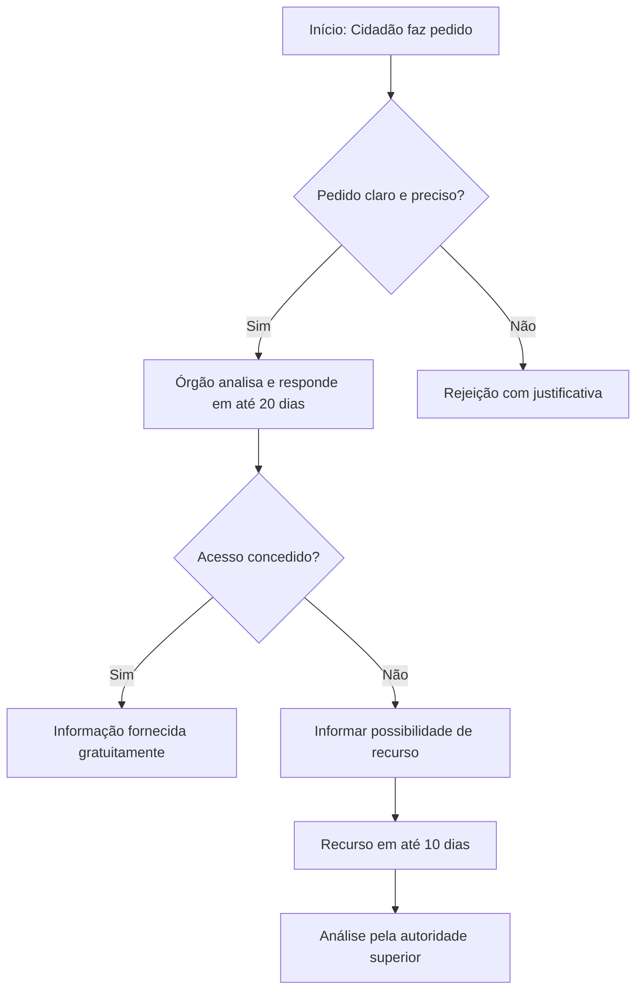
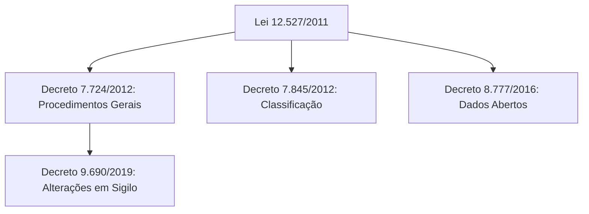
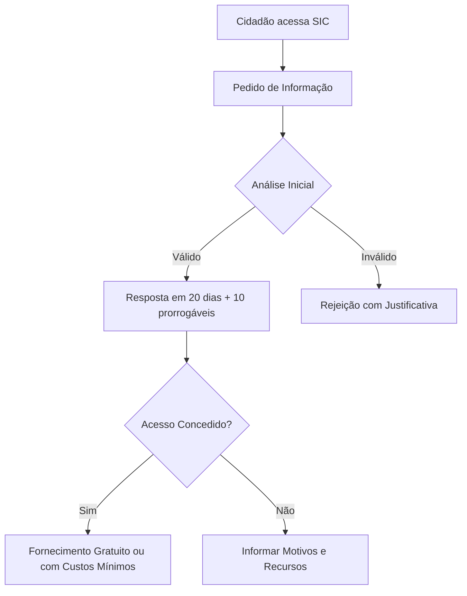
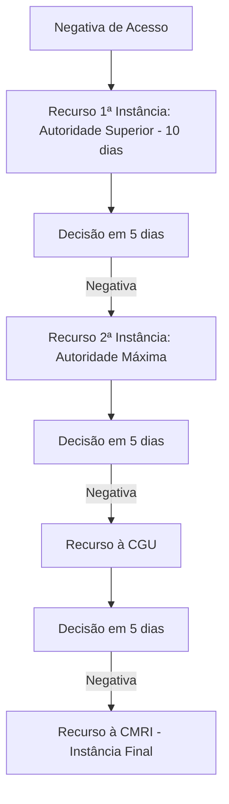

# Decreto 7.724/2012 e Lei de Acesso à Informação (LAI)

## Introdução
A Lei de Acesso à Informação (LAI), Lei nº 12.527/2011, estabelece o direito de acesso a informações públicas no Brasil, promovendo transparência na administração pública . O Decreto nº 7.724/2012 regulamenta a LAI no âmbito do Poder Executivo Federal, definindo procedimentos para garantir o acesso a informações e a classificação de dados restritos  . Este decreto foi publicado em 16 de maio de 2012 e abrange transparência ativa e passiva, além de regras para pedidos e recursos .

> [!info] Objetivo Principal
> Garantir o acesso a informações públicas de forma objetiva, ágil e transparente, em linguagem clara e de fácil compreensão, conforme dever do Estado .

## Visão Geral da Lei de Acesso à Informação (LAI)
A LAI aplica-se a União, Estados, Distrito Federal e Municípios, incluindo administrações direta e indireta, Tribunais de Contas e Ministério Público . Entidades privadas sem fins lucrativos que recebem recursos públicos também devem divulgar informações sobre o uso desses recursos .

### Princípios da LAI
- **Transparência Ativa**: Divulgação proativa de informações de interesse público nos sites oficiais, sem necessidade de pedido .
- **Transparência Passiva**: Atendimento a pedidos de informação feitos por qualquer pessoa, física ou jurídica .
- **Exceções**: Não são divulgadas informações sigilosas, como assuntos secretos de Estado, que coloquem em risco a segurança nacional ou atividades de investigação policial .

> [!tip] Dica Prática
> A LAI é inspirada em convenções internacionais, como a Convenção das Nações Unidas Contra a Corrupção, que enfatiza transparência na administração pública .

A LAI aplica-se a todos os entes federativos (União, Estados, DF e Municípios), incluindo administrações direta e indireta, Tribunais de Contas, Ministério Público e entidades privadas sem fins lucrativos que recebem recursos públicos (limitado ao uso desses recursos).

### Princípios Fundamentais (Art. 3º da LAI)

- Publicidade como preceito geral e sigilo como exceção.
- Divulgação de informações de interesse público independentemente de solicitação.
- Utilização de meios de comunicação viabilizados pela tecnologia da informação.
- Fomento ao desenvolvimento da cultura de transparência na administração pública.
- Desenvolvimento do controle social da administração pública.

> [!tip] Dica para Provas CEBRASPE cobra a distinção entre transparência ativa (divulgação proativa em sites oficiais) e passiva (atendimento a pedidos específicos). Exemplo: "A divulgação de remunerações de servidores é transparência ativa" – correto.

## Detalhes do Decreto 7.724/2012
O Decreto 7.724/2012 regulamenta a LAI no Executivo Federal, estabelecendo procedimentos para pedidos, respostas, recursos e classificação de informações  . Ele define conceitos chave e isenta custos para quem não pode arcar com eles .

### Definições Importantes
| Termo                  | Definição                                                                 | Fonte |
|------------------------|---------------------------------------------------------------------------|-------|
| Documento Preparatório | Documento formal usado como base para decisões ou atos administrativos, como pareceres e notas técnicas . |  |
| Informação Requerida   | Deve ser especificada de forma clara e precisa no pedido .           |  |
| Custo dos Serviços     | Busca e fornecimento são gratuitos, exceto custos de reprodução, mídias e postagem; isenção para quem declara incapacidade financeira . |  |

### Procedimentos para Pedidos de Acesso
Os pedidos devem conter especificação clara da informação requerida . Não serão atendidos pedidos genéricos ou desproporcionais .

> [!example] Exemplo de Pedido Inválido
> "Eu quero saber os contratos do governo com educação básica." Este pedido é vago, pois não especifica se são contratos ativos ou finalizados, nem apresenta interpretação única .

### Recursos e Reclamações
Sempre que o pedido não for atendido totalmente, o cidadão deve ser informado sobre recursos, prazos e autoridade responsável . Recursos são computados considerando a data de registro .

- **Prazo para Resposta Inicial**: Até 20 dias .
- **Prazo para Recurso**: 10 dias após resposta inicial .
- **Comissão Mista de Reavaliação**: Aprova regimento interno por maioria absoluta para organização e funcionamento .

> [!warning] Atenção
> Informações pessoais de agentes públicos ou privados não são divulgadas, assim como dados em segredo de justiça .

## Relação com Outros Decretos
O Decreto 7.724/2012 é complementado por:
- Decreto nº 7.845/2012: Procedimentos de classificação de informações .
- Decreto nº 8.777/2016: Política de Dados Abertos no Executivo Federal .
- Alterações: Decreto nº 9.690/2019 permite que comissionados declarem informações sigilosas .

### Diagrama de Regulamentações

## Aplicação Prática e Importância
A LAI e seu decreto regulador fortalecem a democracia ao combater a corrupção e promover accountability . No âmbito federal, aplica-se a todos os órgãos do Executivo, e o descumprimento pode ser contestado junto a autoridades como a Controladoria-Geral da União (CGU) .

## Definições Chave do Decreto 7.724/2012 (Art. 3º)

O decreto define termos essenciais para uniformizar a aplicação da LAI. Essas definições são frequentemente cobradas em questões objetivas ou discursivas pela CEBRASPE, exigindo memorização precisa.

|Inciso|Termo|Definição|
|---|---|---|
|I|Informação|Dados, processados ou não, que podem ser utilizados para produção e transmissão de conhecimento, contidos em qualquer meio, suporte ou formato.|
|II|Dados Processados|Dados submetidos a qualquer operação ou tratamento por meio de processamento eletrônico ou por meio automatizado com o emprego de tecnologia da informação.|
|III|Documento|Unidade de registro de informações, qualquer que seja o suporte ou formato.|
|IV|Informação Sigilosa|Informação submetida temporariamente à restrição de acesso público em razão de sua imprescindibilidade para a segurança da sociedade e do Estado, e aquelas abrangidas pelas demais hipóteses legais de sigilo.|
|V|Informação Pessoal|Informação relacionada à pessoa natural identificada ou identificável, relativa à intimidade, vida privada, honra e imagem.|
|VI|Tratamento da Informação|Conjunto de ações referentes à produção, recepção, classificação, utilização, acesso, reprodução, transporte, transmissão, distribuição, arquivamento, armazenamento, eliminação, avaliação, destinação ou controle da informação.|
|VII|Disponibilidade|Qualidade da informação que pode ser conhecida e utilizada por indivíduos, equipamentos ou sistemas autorizados.|
|VIII|Autenticidade|Qualidade da informação que tenha sido produzida, expedida, recebida ou modificada por determinado indivíduo, equipamento ou sistema.|
|IX|Integridade|Qualidade da informação não modificada, inclusive quanto à origem, trânsito e destino.|
|X|Primariedade|Qualidade da informação coletada na fonte, com o máximo de detalhamento possível, sem modificações.|
|XI|Informação Atualizada|Informação que reúne os dados mais recentes sobre o tema, de acordo com sua natureza, com os prazos previstos em normas específicas ou conforme a periodicidade estabelecida nos sistemas informatizados que a organizam.|
|XII|Documento Preparatório|Documento formal utilizado como fundamento da tomada de decisão ou de ato administrativo, a exemplo de pareceres e notas técnicas.|

> [!warning] Atenção em Provas CEBRASPE pode questionar exceções: informações pessoais têm prazo de sigilo de 100 anos (Art. 31 da LAI). Documentos preparatórios não são sigilosos por si só, mas podem ser protegidos se afetarem processos decisórios.

## Gratuidade e Custos (Art. 4º do Decreto 7.724/2012)

A busca e o fornecimento da informação são gratuitos, ressalvada a cobrança do valor referente ao custo dos serviços e dos materiais utilizados, tais como reprodução de documentos, mídias digitais e postagem.**Parágrafo único**: Está isento de ressarcir os custos dos serviços e dos materiais utilizados aquele cuja situação econômica não lhe permita fazê-lo sem prejuízo do sustento próprio ou da família.

> [!example] Exemplo Cobrado em Provas Um cidadão de baixa renda solicita cópias de documentos extensos. Resposta: Isento se declarar incapacidade financeira (sem necessidade de comprovação inicial, mas sujeito a verificação).

## Serviço de Informações ao Cidadão (SIC)

O SIC é o órgão responsável por atender pedidos de informação no âmbito federal, obrigatório em cada ente ou entidade (Art. 9º da LAI). Funciona como ponto de contato para transparência passiva.

- **Funções**: Orientar sobre pedidos, registrar solicitações, fornecer informações ou indicar onde obtê-las.
- **Requisitos**: Disponível presencialmente e eletronicamente (e-SIC).
- **Prazo para Resposta**: Até 20 dias, prorrogável por mais 10 dias com justificativa (Art. 11 da LAI).
- **Cobrança em Provas**: CEBRASPE testa se o SIC deve informar sobre recursos em caso de negativa e se pedidos anônimos são permitidos (sim, desde que não exijam identificação).
- 

## Sistema de Recursos e Autoridades Envolvidas

O sistema de recursos é hierárquico, garantindo revisão de negativas. Prazos e instâncias são pontos quentes em provas da CEBRASPE.

### Instâncias de Recursos (Art. 16 a 21 da LAI e Decreto)

1. **Primeira Instância**: Autoridade hierarquicamente superior à que negou o acesso (prazo: 10 dias para recorrer).
2. **Segunda Instância**: Autoridade máxima do órgão (ex.: Ministro).
3. **Terceira Instância**: Controladoria-Geral da União (CGU).
4. **Instância Final**: Comissão Mista de Reavaliação de Informações (CMRI), composta por ministros e outros altos funcionários.

- **Prazo Geral para Recursos**: 10 dias a contar da ciência da decisão.
- **Autoridades Chave**:
    - **CGU**: Fiscaliza cumprimento, analisa recursos e promove transparência.
    - **CMRI**: Decide sobre desclassificação de informações ultrassecretas e secretas.
    - **Outras**: Ouvidoria-Geral da União para reclamações.

> [!note] Pontos Cobrados pela CEBRASPE
> 
> - Recursos não suspendem prazos de sigilo.
> - CMRI pode reavaliar classificações a qualquer tempo.
> - Pegadinha: Recurso contra negativa de desclassificação vai para CMRI diretamente.

### Diagrama de Fluxo de Recursos

## Principais Pontos Cobrados pela Banca CEBRASPE/CESPE

- **Classificação de Sigilo** (Art. 24 da LAI): Ultrassecreto (25 anos), Secreto (15 anos), Reservado (5 anos). CEBRASPE cobra quem pode classificar (ex.: Presidente para ultrassecreto).
- **Exceções ao Acesso**: Segurança nacional, investigações policiais, informações pessoais (100 anos de sigilo).
- **Transparência Ativa**: Obrigatoriedade de divulgação de contratos, licitações, remunerações em sites (Art. 8º da LAI).
- **Pedidos Inválidos**: Genéricos, desproporcionais ou que exijam trabalho adicional (ex.: "Analise todos os contratos" – inválido).
- **Atualizações e Complementos**: Decreto 9.690/2019 permite delegação de classificação a comissionados (cobrado em questões recentes).
- **Dicas para Estudo**: Foque em arts. 3º-5º da LAI e 3º-4º do Decreto. Pratique com questões antigas: "É sigilosa a informação imprescindível à segurança da sociedade" – correto.

> [!important] Nota Final para Concurso Estude a literalidade da lei para precisão. CEBRASPE valoriza assertivas como "O sigilo é exceção" e critica respostas que confundem prazos ou instâncias. Consulte o Portal da Transparência para exemplos práticos.

> [!note] Nota Final
> Este decreto e a LAI representam um avanço na relação entre Estado e cidadão, facilitando o acesso a informações públicas e incentivando a transparência . Para mais detalhes, consulte fontes oficiais como o Portal da Transparência.