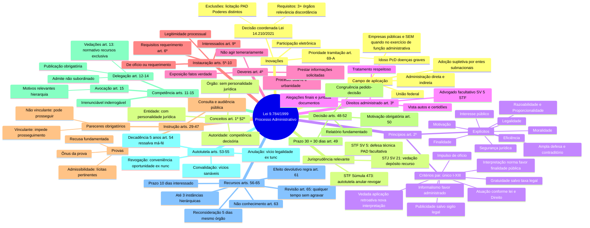
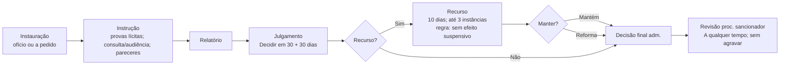
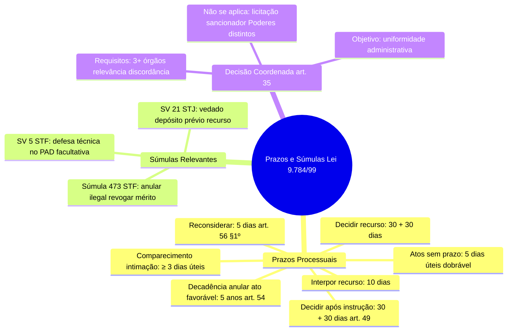

---

## title: Apostila — Lei 9.784/1999 (Processo Administrativo Federal)  
subtitle: Foco em CEBRASPE e FGV — teoria, esquemas, pegadinhas e exercícios de fixação  
level: Analista (nível superior)  
author: Prof. — Direito Administrativo para Concursos
---
# Visão geral e mapa da prova

> [!summary] O que mais cai (CEBRASPE/FGV)
> 
> - **Princípios e critérios do art. 2º** (legalidade, finalidade, motivação, razoabilidade, proporcionalidade, moralidade, **ampla defesa/contraditório**, segurança jurídica, **interesse público**, **eficiência** + parágrafo único I–XIII).
>     
> - **Direitos (art. 3º)** e **deveres (art. 4º) do administrado**.
>     
> - **Competência, delegação e avocação** (arts. 11 a 15): vedações do art. 13 e requisitos do ato de delegação (art. 14).
>     
> - **Atos processuais: forma, tempo e lugar** (arts. 22 a 25) e **prazos** (art. 24; art. 49; art. 59/61 para recursos).
>     
> - **Instauração, instrução, provas, pareceres** (arts. 5º, 30, 31–34, 38, 40, 42).
>     
> - **Motivação (art. 50 e § 1º)** e **motivação aliunde**.
>     
> - **Autotutela**: anulação (art. 53) e **prazo decadencial de 5 anos** (art. 54); **revogação**; **convalidação** (art. 55).
>     
> - **Recursos administrativos** (arts. 56–65): legitimidade (art. 58), **efeito não suspensivo** (art. 61), três instâncias (art. 57), **revisão** (art. 65).
>     
> - **Decisão coordenada** (Lei 14.210/2021): quando cabe e hipóteses de não aplicação.
>     
> - **Súmulas essenciais**: **SV 5** (defesa técnica no PAD dispensável), **SV 21** (depósito prévio para recurso administrativo é inconstitucional), **Súmula 473/STF** (autotutela).
>     

> [!tip] Estratégia de estudo
> 
> 1. Memorize o **art. 2º caput e parágrafo único** com **palavras‑chave**. 2) Fixe **vedações do art. 13**. 3) Grude no quadro de **prazos**. 4) Resolva exercícios com **pegadinhas clássicas** abaixo.
>     

---

# 1. Campo de aplicação (art. 1º) e conceitos do § 2º

**Âmbito:** A Lei nº 9.784/1999 estabelece **normas básicas** do **processo administrativo** no **âmbito da Administração Pública federal** (**direta e indireta**).

> [!note]
> 
> - Aplica‑se **à União** (Administração direta, autarquias e fundações públicas federais; empresas estatais **quando** atuem em prerrogativas públicas específicas do processo).
>     
> - **Estados, DF e Municípios**: **não** se aplicam automaticamente. Podem **adotar por lei própria** (simetria/supletividade). Na falta de norma local, muitos editam ato prevendo aplicação **subsidiária** da Lei 9.784.
>     

**Conceitos (art. 1º, § 2º):**

- **Órgão**: unidade de atuação integrante da estrutura da Administração direta e indireta (não tem personalidade jurídica).
    
- **Entidade**: unidade de atuação **com personalidade jurídica** (ex.: autarquia, fundação pública).
    
- **Autoridade**: servidor ou agente público com **poder de decisão**.
    

> [!warning] Pegadinha  
> Cobram “órgão possui personalidade jurídica”. **Falso**. Quem tem personalidade é a **entidade**.

---

# 2. Princípios (art. 2º) e critérios orientadores (par. único I–XIII)

**Princípios expressos:** legalidade, finalidade, motivação, razoabilidade, proporcionalidade, moralidade, **ampla defesa**, **contraditório**, **segurança jurídica**, **interesse público** e **eficiência**.

**Critérios do parágrafo único (lembre o mnemônico L‑I‑I‑M‑P‑P‑M‑S‑I‑C‑G‑O‑S):**

1. **Legalidade**: atuação conforme a lei e o Direito.
    
2. **Indisponibilidade/Impessoalidade**: fins de interesse geral; vedada renúncia total ou parcial de poderes/competências sem lei.
    
3. **Impessoalidade (promoção pessoal vedada)**.
    
4. **Moralidade**: probidade, decoro e boa‑fé.
    
5. **Publicidade** (ressalvado sigilo constitucional).
    
6. **Proporcionalidade**: adequação meios‑fins; sem excessos.
    
7. **Motivação**: indicar pressupostos de fato e de direito.
    
8. **Segurança jurídica**: formalidades essenciais garantidas.
    
9. **Informalismo** a favor do administrado (formas simples suficientes).
    
10. **Contraditório e ampla defesa**: comunicação, alegações finais, provas e recursos **quando** possam resultar sanções ou em litígios.
    
11. **Gratuidade**: sem custas, salvo lei.
    
12. **Oficialidade**: impulso de ofício do processo.
    
13. **Segurança jurídica (interpretação pro administrado)**: interpretar norma de modo a melhor assegurar o fim público; **vedada a aplicação retroativa de nova interpretação**.
    

> [!example] Em prova  
> A banca escreve: “Pode haver interpretação **retroativa** mais gravosa ao administrado.” **Errado** (art. 2º, par. único, XIII).

---

# 3. Direitos (art. 3º) e deveres (art. 4º) do administrado

**Direitos (art. 3º):** respeito; **acesso e vista aos autos**, cópias e decisões; **apresentar alegações e documentos** antes da decisão; **assistência por advogado é facultativa**, salvo lei exigir.

**Deveres (art. 4º):** veracidade; lealdade, urbanidade e boa‑fé; não agir temerariamente; **prestar informações e colaborar**.

> [!tip] PAD e SV 5  
> No **PAD**, **não** é obrigatória a defesa técnica por advogado (**SV 5** do STF). A lei local pode exigir.

---

# 4. Fases do processo administrativo

## 4.1 Instauração (arts. 5º a 10)

- Pode iniciar‑se **de ofício** ou **a pedido** do interessado (art. 5º).
    
- Requerimento **por escrito**, salvo quando admitida solicitação oral, com: autoridade destinatária; identificação; domicílio; pedido fundamentado; data e assinatura (art. 6º). **Vedada recusa imotivada** – o servidor **deve orientar** sobre falhas (par. único).
    
- **Modelos padronizados** (art. 7º) e **pedido coletivo** possível (art. 8º) quando houver identidade de fundamentos.
    
- **Interessados** (art. 9º): quem inicia; quem tenha direito/interesse afetado; organizações representativas (coletivos); pessoas/associações quanto a **difusos**.
    
- **Capacidade** (art. 10): maiores de 18 anos (salvo norma especial).
    

> [!abstract] Processo x Procedimento x Processo judicial
> 
> - **Processo administrativo**: relação **bilateral**, na Administração (Executivo).
>     
> - **Processo judicial**: relação **trilateral** (autor, réu, juiz), decisão **transita em julgado**.
>     
> - O processo administrativo **não transita em julgado** e **pode ser judicializado** a qualquer tempo.
>     

> [!note] Legitimados como interessados no processo administrativo:
> Art. 9º São legitimados como interessados no processo administrativo:
> I – pessoas físicas ou jurídicas que o iniciem como titulares de direitos ou interesses individuais
> ou no exercício do direito de representação;
> II – aqueles que, sem terem iniciado o processo, têm direitos ou interesses que possam ser
afetados pela decisão a ser adotada;
III – as organizações e associações representativas, no tocante a direitos e interesses coletivos;
IV – as pessoas ou as associações legalmente constituídas quanto a direitos ou interesses difusos.

## 4.2 Instrução (arts. 30–34, 38, 40, 42)

- **Provas ilícitas** são inadmissíveis (art. 30).
    
- **Participação social**: **consulta pública** (art. 31) e **audiência pública** (art. 32); outros meios (art. 33); resultados devem constar dos autos (art. 34).
    
- Autoridade determina diligências necessárias. Pode **recusar provas** **ilícitas, impertinentes, desnecessárias ou protelatórias** (**decisão fundamentada**) — **art. 38, § 2º**.
    
- **Arquivamento** se o interessado **não apresenta documentos essenciais no prazo** (art. 40).
    
- **Pareceres obrigatórios**:
    
    - **Vinculante** e não emitido no prazo: **processo não prossegue**; responsabilização de quem deu causa (art. 42, § 1º).
        
    - **Não vinculante** e não emitido: processo **pode prosseguir**; responsabilização pela omissão (art. 42, § 2º).
        
> Somente poderão ser recusadas, mediante decisão fundamentada, as provas proposta pelos interessados quando sejam ilícitas, impertinentes, desnecessárias ou protelatórias.

>[!note] Audiência Pública
>Art. 31. Quando a matéria do processo envolver **assunto de interesse geral**, o órgão competente poderá, **mediante despacho motivado**, abrir período de consulta pública para manifestação de terceiros, antes da decisão do pedido, ==se não houver prejuízo para a parte interessada==.
>§ 1º – A abertura da consulta pública será objeto de divulgação pelos meios oficiais, a fim de
>que pessoas físicas ou jurídicas possam examinar os autos, fixando-se prazo para oferecimento de alegações escritas.
>§ 2º – O comparecimento à consulta pública não confere, por si, a condição de interessado do
>processo, mas confere o direito de obter da Administração resposta fundamentada, que poderá ser comum a todas as alegações substancialmente iguais.
>Art. 32. Antes da tomada de decisão, a juízo da autoridade, diante da relevância da questão,
>poderá ser realizada audiência pública para debates sobre a matéria do processo.
>Art. 33. Os órgãos e entidades administrativas, em matéria relevante, poderão estabelecer
>outros meios de participação de administrados, diretamente ou por meio de organizações e
>associações legalmente reconhecidas.
>Art. 34. Os resultados da consulta e audiência pública e de outros meios de participação de administrados deverão ser apresentados com a indicação do procedimento adotado.

Outra regra importante da fase da instrução é a questão dos pareceres dos órgãos consultivos, que se dividem em vinculantes e não vinculantes. Os pareceres podem ser entendidos como manifestações sem caráter decisório e que possuem o objetivo de auxiliar a autoridade competente na tomada de decisão. Um dos órgãos consultivos mais importantes de todo o serviço público são as comissões de ética, que, ainda que não possam aplicar sanções disciplinares, podem emitir pareceres recomendando que determinado servidor seja punido.

Todos os pareceres dos órgãos consultivos devem ser elaborados no prazo máximo
de 15 dias, salvo se houver comprovada necessidade de um prazo maior ou se estivermos
diante de norma especial.

Necessário se faz, neste ponto, diferenciarmos o resultado quando um parecer consultivo
obrigatório deve ser emitido. Para isso, deve-se analisar se o mesmo é vinculante ou não
vinculante. No primeiro caso, o processo não terá prosseguimento, de forma que aquele
que deu causa ao atraso deve ser responsabilizado. No caso de um parecer não vinculante,
poderá o processo ter seguimento e ser decidido sem a sua apresentação, podendo, da
mesma forma, ocorrer a responsabilização da autoridade que omitiu o atendimento.

Neste sentido são as regras expressas nos §§ 1º e 2º do art. 42 da Lei n. 9.784/1999:
§ 1º Se um parecer obrigatório e vinculante deixar de ser emitido no prazo fixado, o processo não
terá seguimento até a respectiva apresentação, responsabilizando-se quem der causa ao atraso.
§ 2º Se um parecer obrigatório e não vinculante deixar de ser emitido no prazo fixado, o processo
poderá ter prosseguimento e ser decidido com sua dispensa, sem prejuízo da responsabilidade de quem se omitiu no atendimento.
## 4.3 Relatório e julgamento

- **Relatório**: peça informativa‑opinativa que descreve a instrução. A autoridade **julgadora não fica adstrita** ao relatório.
    
- **Prazo para decidir**: **30 dias** após a conclusão da instrução, **prorrogável por igual período** mediante motivação (art. 49). _(Muito cobrado!)_
    

> [!warning] Pegadinha  
> “Decurso do prazo de 30 dias torna **tácita** a decisão favorável ao administrado.” **Errado**. A lei prevê dever de decidir e possibilidade de responsabilização, **não** há deferimento tácito geral na 9.784.

Concluída a fase do relatório, a administração possui o dever de decidir, devendo assim
o fazer no prazo de 30 dias, salvo prorrogação por igual período. Neste sentido é o teor dos
art. 48 e 49 da Lei n. 9.784:
	Art. 48. A Administração tem o dever de explicitamente emitir decisão nos processos administrativos e sobre solicitações ou reclamações, em matéria de sua competência.
	Art. 49. Concluída a instrução de processo administrativo, a Administração tem o prazo de até trinta dias para decidir, salvo prorrogação por igual período expressamente motivada.

---

# 5. Atos processuais: forma, tempo e lugar (arts. 22–25)

- **Forma**: não dependem de forma determinada salvo exigência legal (art. 22). Devem ser por **escrito, em vernáculo**, com **data, local e assinatura**; reconhecimento de firma **só com dúvida**; **autenticação** pode ser feita pelo próprio órgão; **páginas numeradas e rubricadas**.
    
- **Tempo**: realizam‑se **em dias úteis**, no horário normal da repartição (art. 23). Atos iniciados **devem ser concluídos** para não causar prejuízo.
    
- **Prazos**: na falta de previsão específica, **5 dias** para atos do órgão e dos administrados, **prorrogáveis ao dobro** com justificativa (art. 24).
    
- **Lugar**: preferencialmente na **sede do órgão**; se outro local, **cientificar** o interessado (art. 25).
    

---

# 6. Competência, delegação e avocação (arts. 11–15)

**Competência** é **irrenunciável** e exercida pelo órgão ao qual foi atribuída (art. 11), **admitindo**:

- **Delegação** (art. 12–14):
    
    - Pode haver delegação **mesmo sem subordinação hierárquica**.
        
    - **Vedada** delegação de: (i) **atos normativos**; (ii) **decisão de recursos**; (iii) **matéria de competência exclusiva** (art. 13).
        
    - **Exigências do ato de delegação** (art. 14): especificar matérias e poderes, **limites**, **duração**, **objetivos** e **recurso cabível**; **publicação** é condição de eficácia; pode conter **ressalva** do exercício pelo delegante.
        
- **Avocação** (art. 15): **excepcional**, **temporária** e **justificada** por **motivos relevantes**; só **vertical** (autoridade superior).
    

> [!warning] Pegadinhas clássicas
> 
> - “Delegação **transfere titularidade** da competência.” **Falso** (transfere **exercício**, não titularidade).
>     
> - “Avocação pode ser **permanente**.” **Falso** (deve ser **temporária** e **justificada**).
>     

---

# 7. Motivação e motivação _aliunde_ (art. 50)

**Regra:** atos **devem ser motivados** quando **restringem direitos**, impõem **sanções** ou **decidem** processos (inclusive concursos), **dispensam/inexigem licitação**, decidem **recursos**, **reexame de ofício**, **divergem** de jurisprudência/parecer etc. (incisos I–VIII do art. 50).

**Qualidade da motivação:** **explícita, clara e congruente**, podendo consistir em **declaração de concordância** com fundamentos de **pareceres, informações, decisões ou propostas anteriores** — **motivação _aliunde_** (art. 50, § 1º). Esses fundamentos **integram** o ato.

> [!tip] Em prova  
> É comum afirmarem que motivação _aliunde_ é **vedada**. **Errado**: é **admitida**, desde que os fundamentos estejam **acessíveis** e **integrados** ao ato.

---

# 8. Autotutela: anulação, revogação e convalidação (arts. 53–55)

- **Anulação (legalidade)**: a Administração **deve** anular atos **ilegais**. **Efeitos ex tunc** (retroativos). **Prazo decadencial de 5 anos** quando o ato **beneficia** o administrado (art. 54), **salvo má‑fé**. _(cobrança recorrente)_
    
- **Revogação (mérito)**: a Administração **pode** revogar por **conveniência e oportunidade**, com **efeitos ex nunc** (prospectivos), **respeitados direitos adquiridos** (art. 53).
    
- **Convalidação (art. 55)**: atos com **defeitos sanáveis** **podem** ser convalidados se **não lesarem o interesse público** nem **prejudicarem terceiros**. **Em regra**, sanáveis: **forma** e **competência** (**não exclusiva**), se presentes os demais requisitos.
    

> [!quote]  
> **Súmula 473/STF**: a Administração pode **anular** atos ilegais e **revogá‑los** por conveniência/oportunidade, respeitados direitos adquiridos, **ressalvada** a apreciação judicial.

> [!warning] Não se revoga
> 
> - **Atos já exauridos** (efeitos consumados),
>     
> - **Atos vinculados**,
>     
> - **Atos que geraram direito adquirido**,
>     
> - **Atos integrados a procedimento** (p. ex., adjudicação após contrato),
>     
> - **Meros atos administrativos** (sem efeitos jurídicos próprios — p. ex., parecer, certidão, atestado).
>     

---

# 9. Recursos administrativos e revisão (arts. 56–65)

**Cabimento** (art. 56): por **legalidade ou mérito**.

**Fluxo (art. 56, § 1º)**: recurso é **dirigido à autoridade que decidiu**; se **não reconsiderar em 5 dias**, remete à **autoridade superior**.

**Prazos**:

- **Interposição**: **10 dias**, salvo disposição específica (Lei especial prevalece).
    
- **Decidir recurso**: **30 dias**, **prorrogável** por igual período com motivação (art. 59/61).
    
- **Instâncias**: **até 3 instâncias** (art. 57), salvo lei.
    

**Legitimidade** (art. 58): partes; **indiretamente afetados**; **organizações representativas** (coletivos); **cidadãos/associações** (difusos).

**Efeitos**: **regra sem efeito suspensivo** (art. 61). A autoridade recorrida ou a imediatamente superior **pode** conceder **efeito suspensivo** **de ofício ou a pedido** diante de **justo receio de prejuízo de difícil/ incerta reparação** (par. único do art. 61).

**Não conhecimento** (art. 63): fora do prazo; órgão incompetente (com indicação da autoridade correta e devolução do prazo – § 1º); parte ilegítima; após exaurida a esfera administrativa.

**Revisão (art. 65)**: processos **sancionadores** podem ser **revistos a qualquer tempo**, de ofício ou a pedido, se surgirem **fatos novos** ou **circunstâncias relevantes**; **vedado agravar** a sanção.

> [!quote]  
> **SV 21**: é **inconstitucional** exigir **depósito/arrolamento** prévios de dinheiro ou bens para **admissibilidade de recurso** administrativo.

> [!question] Checagem rápida  
> (CEBRASPE) “Todo recurso administrativo tem efeito suspensivo.” **Errado**. Regra: **não**;  
> (FGV) “Revisão pode agravar a sanção?” **Não** — parágrafo único do **art. 65**.

Art. 56. Das decisões administrativas cabe recurso, em face de razões de legalidade e de mérito.
§ 1º O recurso será dirigido à autoridade que proferiu a decisão, a qual, se não a reconsiderar no
prazo de cinco dias, o encaminhará à autoridade superior.
§ 2º Salvo exigência legal, a interposição de recurso administrativo independe de caução.
§ 3º Se o recorrente alegar que a decisão administrativa contraria enunciado da súmula vinculante,
caberá à autoridade prolatora da decisão impugnada, se não a reconsiderar, explicitar, antes de
encaminhar o recurso à autoridade superior, as razões da aplicabilidade ou inaplicabilidade da
súmula, conforme o caso.

Art. 58. Têm legitimidade para interpor recurso administrativo:
I – os titulares de direitos e interesses que forem parte no processo;
II – aqueles cujos direitos ou interesses forem indiretamente afetados pela decisão recorrida;
III – as organizações e associações representativas, no tocante a direitos e interesses coletivos;
IV – os cidadãos ou associações, quanto a direitos ou interesses difusos.

Art. 58. Têm legitimidade para interpor recurso administrativo:
I – os titulares de direitos e interesses que forem parte no processo;
II – aqueles cujos direitos ou interesses forem indiretamente afetados pela decisão recorrida;
III – as organizações e associações representativas, no tocante a direitos e interesses coletivos;
IV – os cidadãos ou associações, quanto a direitos ou interesses difusos.

Art. 65. Os processos administrativos de que resultem sanções poderão ser revistos, a qualquer
tempo, a pedido ou de ofício, quando surgirem fatos novos ou circunstâncias relevantes suscetíveis
de justificar a inadequação da sanção aplicada.
Parágrafo único. Da revisão do processo não poderá resultar agravamento da sanção.

---

# 10. Decisão coordenada (Lei 14.210/2021)

**Conceito:** instância **interinstitucional/intersetorial** que **simplifica** o processo com a **participação concomitante** de todas as autoridades decisórias e responsáveis pela instrução técnico‑jurídica.

**Quando cabe:** decisões que exijam participação de **3 ou mais** setores/órgãos/entidades **e**:

- seja **justificável pela relevância** da matéria; **e**
    
- haja **discordância que prejudique a celeridade**.
    

**Não se aplica a**: (a) **licitações**; (b) processos **sancionadores**; (c) processos com **autoridades de Poderes distintos**.

> [!tip] Ligações com princípios  
> Concretiza **eficiência** e **celeridade**, reduzindo retrabalho e decisões conflitantes.

A decisão coordenada:
	a) não exclui a responsabilidade originária de cada órgão ou autoridade envolvida;
	b) obedecerá aos princípios da legalidade, da eficiência e da transparência;
	c) utilizará, sempre que necessário, a simplificação do procedimento e a concentração das instâncias decisórias;

Art. 49-G. A conclusão dos trabalhos da decisão coordenada será consolidada em ata, que
conterá as seguintes informações:
I – relato sobre os itens da pauta;
II – síntese dos fundamentos aduzidos;
III – síntese das teses pertinentes ao objeto da convocação;
IV – registro das orientações, das diretrizes, das soluções ou das propostas de atos governamentais
relativos ao objeto da convocação;
V – posicionamento dos participantes para subsidiar futura atuação governamental em matéria
idêntica ou similar; e
VI – decisão de cada órgão ou entidade relativa à matéria sujeita à sua competência.

---

# 11. Prioridade de tramitação (art. 69‑A)

Têm prioridade os processos em que figure como parte/interessado: (i) **idosos** (≥ 60 anos); (ii) **pessoa com deficiência**; (iii) **portadores de doenças graves** listadas (tuberculose ativa, neoplasia maligna, cardiopatia grave, etc.).

---

# 12. Quadro de prazos essenciais

|Evento|Prazo|
|---|---|
|Comparecimento do interessado quando necessário|**≥ 3 dias úteis (mínimo)**|
|Atos sem prazo específico (art. 24)|**5 dias** (prorrogáveis ao **dobro** com justificativa)|
|Decisão após conclusão da instrução (art. 49)|**30 dias**, prorrogáveis **+30** com motivação|
|Interposição de **recurso** (regra)|**10 dias**|
|**Reconsideração** pela autoridade que decidiu (art. 56, § 1º)|**5 dias**|
|Decidir **recurso**|**30 dias**, prorrogáveis **+30** com motivação|
|**Decadência** para **anular** ato que beneficie o administrado (art. 54)|**5 anos** (salvo **má‑fé**)|

> [!warning] Dica de memorização  
> **3‑5‑30‑10‑5‑30‑5** _(ordem do quadro acima, lembrando que os dois “30” admitem +30 por justificativa e o último “5” é decadência em anos)._

**Art. 66.** Os prazos começam a correr a partir da data da cientificação oficial, excluindo-se da contagem o dia do começo e incluindo-se o do vencimento.

§ 1º Considera-se prorrogado o prazo até o primeiro dia útil seguinte se o vencimento cair em dia em que não houver expediente ou este for encerrado antes da hora normal.

**§ 2º Os prazos expressos em dias contam-se de modo contínuo.**

---

# 13. Fluxo resumido do processo (esquema)

1. **Instauração** (ofício/ requerimento) → 2) **Instrução** (provas; diligências; participação social; pareceres) → 3) **Relatório** → 4) **Julgamento** (30 + 30) → 5) **Recursos** (10; até 3 instâncias; sem efeito suspensivo salvo excepcional) → 6) **Revisão** (a qualquer tempo; sem agravamento).
    

---

# 14. Tópicos transversais e pegadinhas de prova

- **Informalismo** **a favor do administrado**: formas **simples** são preferíveis quando suficientes para garantir direitos.
    
- **Oficialidade** ≠ autoritarismo: o impulso de ofício **não dispensa** a observância do **contraditório e ampla defesa**.
    
- **Publicidade** com **sigilo constitucional**: segredo de justiça, informações pessoais sensíveis e segurança do Estado podem restringir **acesso** (justificadamente).
    
- **Parecer** não decide: regra é **não vinculante**, salvo lei preveja o contrário.
    
- **Competência exclusiva**: **não** pode ser delegada **nem** convalidada se o vício recai exatamente na exclusividade.
    
- **Motivação posterior**: a regra é motivação **contemporânea** ao ato; a _aliunde_ **não é posteriorização**, é **incorporação** de fundamentos já existentes.
    

---

# 15. Casos práticos (mini‑casos cobrados)

**(1) Delegação para órgão não subordinado**  
Ministério A delega a autarquia B (não subordinada) a prática de ato técnico. **Cabe**, desde que **publicado** e com os **requisitos do art. 14**. _Não_ se transfere **titularidade**.

**(2) Parecer obrigatório não veio**  
Se **vinculante**: **suspende** o processo até emissão, **com responsabilização** de quem atrasou (art. 42, § 1º). Se **não vinculante**: segue sem ele, **responsabiliza‑se** a omissão (art. 42, § 2º).

**(3) Recurso pedindo efeito suspensivo**  
Regra: **não tem**; pode ser **concedido** por **justo receio** de prejuízo difícil/ incerta reparação (art. 61, par. ún.).

**(4) Anular aposentadoria após 6 anos**  
Ato favorável: **decadência de 5 anos** (art. 54). **Exceção**: **má‑fé** afasta a decadência; pode anular a qualquer tempo.

**(5) Vício de competência**  
Se **não exclusiva**, **convalida** (art. 55). Se **exclusiva**, **não**.

---

# 16. Exercícios de fixação (estilo CEBRASPE)

Marque **C** (certo) ou **E** (errado):

1. ( ) No processo administrativo federal, o princípio da **eficiência** não está expresso no art. 2º.
    
2. ( ) A **motivação aliunde** é admitida, devendo integrar o ato os fundamentos adotados.
    
3. ( ) A **avocação** pode ser utilizada permanentemente, desde que motivada.
    
4. ( ) Regra geral: o **recurso administrativo** não tem efeito suspensivo.
    
5. ( ) O **prazo decadencial** para anulação de ato favorável ao administrado é de **5 anos**, salvo má‑fé.
    
6. ( ) Parecer **obrigatório e vinculante** não emitido em prazo **não** impede o prosseguimento do processo, mas gera responsabilização.
    

**Gabarito comentado:** 1E (eficiência está no art. 2º); 2C (art. 50, § 1º); 3E (avocação é **temporária**); 4C (art. 61, regra sem efeito suspensivo); 5C (art. 54); 6E (art. 42, § 1º: **impede** o prosseguimento).

---

# 17. Exercícios de fixação (estilo FGV — múltipla escolha)

**1.** A respeito da **delegação**, assinale a correta:  
A) Transfere‑se a **titularidade** da competência.  
B) Pode recair sobre **decisão de recursos**.  
C) Exige **publicação** e especificação de matérias, limites, duração e objetivos.  
D) É vedada a órgãos não subordinados.  
**Gabarito:** **C** (art. 14).

**2.** Segundo a Lei 9.784/1999, o **prazo para decidir** após a conclusão da instrução é:  
A) 10 dias improrrogáveis.  
B) 20 dias prorrogáveis uma vez.  
C) 30 dias, prorrogáveis por igual período mediante motivação.  
D) 45 dias, sem prorrogação.  
**Gabarito:** **C** (art. 49).

**3.** Sobre **recursos administrativos**, é correto:  
A) Têm sempre **efeito suspensivo**.  
B) Podem tramitar por **até três instâncias**.  
C) Dependem de **depósito prévio**.  
D) Têm cabimento apenas por **ilegalidade**.  
**Gabarito:** **B** (art. 57). A) errado (art. 61); C) errado (**SV 21**); D) errado (cabem por **legalidade ou mérito**, art. 56).

---

# 18. Checklists de prova

**Princípios e critérios (art. 2º)** ✔  
**Direitos e deveres (arts. 3º–4º)** ✔  
**Instauração e instrução (5–10; 30–34; 38; 40; 42)** ✔  
**Atos processuais e prazos (22–25; 24; 49)** ✔  
**Competência/ delegação/ avocação (11–15; 13; 14; 15)** ✔  
**Motivação e aliunde (50, § 1º)** ✔  
**Autotutela (53–55; 54 decadência)** ✔  
**Recursos/ revisão (56–65; 58; 61; 63; 65)** ✔  
**Decisão coordenada (Lei 14.210/2021)** ✔  
**Prioridade (69‑A)** ✔

---

# 19. Revisão rápida de véspera (flash)

- **Art. 2º (caput + XIII)**: **não** retroagir nova interpretação.
    
- **Art. 14**: **publicar** delegação; indicar **limites/duração/objetivos**.
    
- **Art. 49**: **30 + 30** para decidir.
    
- **Art. 54**: **5 anos** (decadência) — salvo **má‑fé**.
    
- **Art. 61**: recurso **sem efeito suspensivo** (pode conceder).
    
- **SV 5**: advogado **facultativo** no PAD.
    
- **SV 21**: **vedado** depósito prévio para recurso.
    
- **Súmula 473/STF**: **anula** ilegal; **revoga** mérito.
    

---

# 20. Referências legais (para consulta rápida)

- **Lei nº 9.784/1999** — Processo Administrativo no âmbito da Administração Pública Federal.
    
- **Lei nº 14.210/2021** — Decisão coordenada no processo administrativo federal.
    
- **Súmulas**: **SV 5**, **SV 21** (STF); **Súmula 473/STF** (autotutela).
    

---

> [!summary] Como usar
> 
> 1. Revise o **mapa global** (primeiro diagrama). 2) Veja o **fluxo do processo**. 3) Memorize **prazos e súmulas** no mini‑mapa final.
>     

## 1) Mapa global (panorama)

> [!warning] Pegadinhas clássicas
> 
> - “Delegação transfere **titularidade** da competência” ❌ (transfere **exercício**).
>     
> - “Recurso tem **efeito suspensivo** como regra” ❌ (regra **não** tem).
>     
> - “Nova interpretação **retroage** contra o administrado” ❌ (vedada retroatividade mais gravosa).
>     

---

## 2) Fluxo do processo (esquema rápido)

---

## 3) Prazos essenciais + juris (mini‑mapa)

> [!tip] Mnemônico dos prazos: **3–5–30–10–5–30–5**  
> (comparecimento; ato sem prazo; decisão; interposição; reconsideração; decisão de recurso; decadência em anos)

---

## 4) Check rápido de véspera

- **Art. 2º XIII**: sem retroatividade de nova interpretação.
    
- **Art. 13**: não delega **norma, recursos, competência exclusiva**.
    
- **Art. 14**: delegação **publicada** e com **limites/duração/objetivos**.
    
- **Art. 49**: **30 + 30** para decidir.
    
- **Art. 54**: **5 anos** (salvo má‑fé).
    
- **Art. 61**: recurso **sem efeito suspensivo** (pode conceder por justo receio).
    
- **SV 5 | SV 21 | STF 473**: anote no topo da prova.
    

