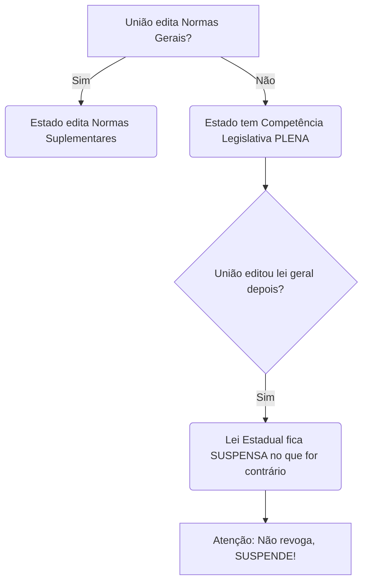

# Capítulo: A Repartição de Competências no Federalismo Brasileiro

## 1. Introdução: O Desafio da Convivência Federativa

O Estado Federal brasileiro é caracterizado pela coexistência de múltiplas ordens jurídicas — a da União, a dos Estados, a do Distrito Federal e a dos Municípios — que incidem sobre um mesmo território e sobre as mesmas pessoas. Para organizar essa complexa estrutura e garantir a harmonia e a eficiência da ação estatal, a Constituição da República Federativa do Brasil de 1988 (CF/88) estabeleceu um sistema detalhado de repartição de competências.

Como ensinam Gilmar Mendes, Inocêncio Coelho e Paulo Gustavo Gonet, este mecanismo é fundamental para “evitar conflitos e desperdício de esforços e recursos”. A repartição de competências é, portanto, o pilar que sustenta o equilíbrio do nosso pacto federativo.

As competências atribuídas aos entes federativos podem ser classificadas em três grandes eixos:

a) Competências Administrativas (ou Materiais): Referem-se à capacidade de atuar concretamente, executar políticas públicas e prestar serviços. Exemplo: a União emite moeda (art. 21, VII).

b) Competências Legislativas: Consistem na prerrogativa de inovar na ordem jurídica, criando leis e normas sobre determinadas matérias. Exemplo: a União legisla sobre Direito Penal (art. 22, I).

c) Competências Tributárias: É a capacidade de instituir e arrecadar tributos, matéria cujo estudo aprofundado pertence ao Direito Tributário.

Para realizar essa divisão, o constituinte originário se valeu, predominantemente, da **técnica da predominância do interesse**. Segundo este critério, as matérias de interesse geral e nacional foram atribuídas à União; aquelas de interesse regional, aos Estados-membros; e as de interesse predominantemente local, aos Municípios.

## 2. As Competências da União

A União, por ser o ente central da federação, detém as competências de maior abrangência, relacionadas à soberania nacional, à uniformidade de temas estratégicos e à representação do país. Suas competências estão enumeradas, principalmente, nos artigos 21 e 22 da CF/88.

### 2.1. Competência Administrativa Exclusiva (Art. 21)

O art. 21 trata das competências materiais da União, que são **exclusivas**. O caráter exclusivo significa que elas são **indelegáveis**, ou seja, não podem ser transferidas a outro ente federativo.

Dentre as mais relevantes, podemos citar:

- Manter relações com Estados estrangeiros e participar de organizações internacionais (inc. I);
    
- Declarar a guerra e celebrar a paz (inc. II);
    
- Assegurar a defesa nacional (inc. III);
    
- Decretar o estado de sítio, o estado de defesa e a intervenção federal (inc. V);
    
- Emitir moeda (inc. VII);
    
- Executar os serviços de polícia marítima, aeroportuária e de fronteiras, atribuição da Polícia Federal (inc. XXII);
    
- Organizar e fiscalizar a proteção e o tratamento de dados pessoais, nos termos da lei (inc. XXVI, incluído pela EC 115/2022).
    

### 2.2. Competência Legislativa Privativa (Art. 22)

O art. 22, por sua vez, elenca as matérias sobre as quais compete **privativamente** à União legislar. A terminologia "privativa" é crucial, pois indica que, embora a competência pertença à União, ela pode ser **delegada** aos Estados e ao Distrito Federal, por meio de lei complementar, para que legislem sobre questões específicas dentro da matéria delegada (art. 22, parágrafo único).

Os incisos I e II deste artigo são de memorização obrigatória para qualquer estudante de Direito. Para facilitar, utiliza-se o mnemônico **CAPACETE DE PM**:

- **C**ivil
    
- **A**grário
    
- **P**enal
    
- **A**eronáutico
    
- **C**omercial
    
- **E**leitoral
    
- **T**rabalho
    
- **E**special
    
- **DE**sapropriação
    
- **P**rocessual
    
- **M**arítimo
    

> DE OLHO NA SÚMULA VINCULANTE!
> 
> A competência privativa da União para legislar sobre Direito Penal tem consequências importantes. A Súmula Vinculante 46 estabelece que "a definição dos crimes de responsabilidade e o estabelecimento das respectivas normas de processo e julgamento são da competência legislativa privativa da União".

## 3. Competências Comuns (Art. 23)

As competências comuns, previstas no art. 23, são de natureza administrativa e devem ser exercidas por **todos os entes federativos simultaneamente**: União, Estados, Distrito Federal e Municípios. O objetivo é a cooperação em áreas sensíveis para a sociedade.

Um exemplo notável é o dever de "zelar pela guarda da Constituição, das leis e das instituições democráticas e conservar o patrimônio público" (inc. I). Outros exemplos incluem cuidar da saúde, proteger o meio ambiente e fomentar a cultura.

O parágrafo único do art. 23 determina que uma lei complementar fixará normas para a cooperação entre os entes, visando ao equilíbrio do desenvolvimento e do bem-estar em âmbito nacional.

## 4. Competências Concorrentes (Art. 24)

Aqui tratamos de competências **legislativas** exercidas concorrentemente pela União, Estados e Distrito Federal (os Municípios ficam de fora).

O sistema de legislação concorrente funciona da seguinte forma:

- **União:** Limita-se a estabelecer **normas gerais** (art. 24, § 1º).
    
- **Estados e DF:** Exercem a **competência suplementar**, detalhando as normas gerais para atender às suas peculiaridades (art. 24, § 2º).
    
- Na ausência de norma geral federal, os Estados e o DF exercem **competência legislativa plena** (art. 24, § 3º).
    
- Se a União, posteriormente, editar a norma geral, a lei estadual terá sua eficácia **suspensa** naquilo que for contrário à norma federal (art. 24, § 4º).
    

Dentre as matérias mais importantes, destacam-se as do inciso I. O mnemônico **PUTEFO** auxilia na memorização:

- **P**enitenciário
    
- **U**rbanístico
    
- **T**ributário
    
- **E**conômico
    
- **F**inanceiro
    
- **O**rçamento (consta no inciso II)
    

## 5. Competências dos Estados-Membros (Art. 25)

A Constituição não enumerou exaustivamente as competências estaduais. Em vez disso, adotou a técnica da **competência remanescente (ou residual)**. Isso significa que tudo aquilo que não for competência da União (arts. 21 e 22), não for competência dos Municípios (art. 30) e não for comum ou concorrente, "sobra" para os Estados-membros (art. 25, § 1º).

## 6. Competências do Distrito Federal (Art. 32)

O Distrito Federal possui uma natureza híbrida, acumulando tanto as competências legislativas e administrativas reservadas aos Estados quanto as reservadas aos Municípios.

## 7. Competências dos Municípios (Art. 30)

As competências municipais estão expressas no art. 30, sendo marcadas pela predominância do **interesse local**. As principais são:

- **Legislar sobre assuntos de interesse local** (inc. I);
    
- **Suplementar a legislação federal e a estadual no que couber** (inc. II).
    

> DE OLHO NA JURISPRUDÊNCIA!
> 
> O STF já decidiu que é constitucional uma lei municipal que obriga a substituição de sacolas plásticas por biodegradáveis, por se tratar de matéria de interesse local ligada à proteção do meio ambiente (RE 586.224). Da mesma forma, a Súmula Vinculante 38 confirma que "é competente o Município para fixar o horário de funcionamento de estabelecimento comercial".

## 8. A Repartição de Competências na Visão do STF: Casos Práticos

### 8.1. Invasão da Competência Privativa da União (Art. 22)

- **Telecomunicações, Radiodifusão e Energia:** É inconstitucional lei estadual ou municipal que discipline o núcleo dos serviços de telecomunicações, energia elétrica ou serviço postal, por ser competência privativa da União (art. 22, IV e art. 21, X e XI). Exemplos: leis que obrigam operadoras a bloquear sinais de celular em presídios (ADI 5.253), que proíbem a entrega de correspondências em certos horários (ADPF 222) ou que isentam desempregados do pagamento de contas de luz (ADI 2.299).
    
- **Trânsito e Transporte:** Compete privativamente à União legislar sobre o tema (art. 22, XI). Portanto, é inconstitucional lei estadual que obrigue a instalação de equipamentos de segurança em ônibus (ADI 3.671) ou que limite o credenciamento de clínicas para exames do DETRAN com base em critérios demográficos (ADI 5.774). Por outro lado, o STF decidiu que Municípios não podem proibir o transporte privado por aplicativos, pois isso contraria os parâmetros da lei federal e ofende a livre iniciativa (RE 1.054.110).
    
- **Direito do Trabalho e Exercício de Profissões:** Legislar sobre Direito do Trabalho (art. 22, I) e condições para o exercício de profissões (art. 22, XVI) é atribuição da União. Assim, são inconstitucionais: lei estadual que crie feriado não previsto na lei federal (ADI 4.820), que reconheça a profissão de condutor de ambulância (ADI 5.876) ou que estipule jornada de trabalho diferente da legislação federal (ADI 6.149).
    
- **Direito Civil, Propriedade e Seguros:** Sendo matérias de competência privativa da União (art. 22, I e VII), não pode o ente federado legislar sobre elas. Exemplos: lei distrital que obrigava a doação de alimentos próximos do vencimento foi invalidada por dispor sobre direito de propriedade (ADI 5.838); lei estadual que previa isenção de direitos autorais não contida na lei federal (ADI 5.800); e lei estadual que dispunha sobre contratos de seguros de saúde (ADI 3.207).
    
- **Sistemas de Consórcios e Sorteios:** A **Súmula Vinculante 2** firma a inconstitucionalidade de lei estadual ou distrital que disponha sobre sistemas de consórcios e sorteios, inclusive bingos e loterias.
    
- **Diretrizes e Bases da Educação:** Compete à União legislar sobre o tema (art. 22, XXIV). É inconstitucional lei estadual que afaste a exigência de revalidação de diploma de países do Mercosul para servidores públicos (ADI 5.341).
    
- **Material Bélico:** A competência da União para legislar sobre o tema (art. 22, I) e para autorizar e fiscalizar sua produção e comércio (art. 21, VI) é ampla, abrangendo o registro, o porte e a destinação de armas apreendidas (ADI 2.729 e ADI 3.193).
    

### 8.2. O Equilíbrio na Competência Concorrente (Art. 24)

- **Direito do Consumidor:** Os Estados podem editar normas mais protetivas ao consumidor (competência concorrente, art. 24, V), desde que não contradigam as normas gerais da União e não criem ônus desproporcionais que afetem a livre concorrência.
    
    - **Válido:** Lei estadual que estabelece tempo máximo de espera em lojas de operadoras (ADI 5.833) ou que obriga a instalação de divisórias em caixas de banco para dar privacidade (ADI 4.633).
        
    - **Inválido:** Lei estadual que impõe a fornecedores a obrigação de ceder um veículo reserva em caso de demora no conserto, por criar um ônus excessivo e violar a isonomia (ADI 5.158).
        
- **Meio Ambiente e Proteção à Fauna:** Os Estados podem editar normas mais protetivas, com base em suas peculiaridades. O STF validou lei estadual que proibiu o uso de animais em testes de cosméticos, por entender que o ente agiu dentro de sua competência concorrente (ADI 5.996).
    
- **Direito Tributário e Financeiro:** É inconstitucional lei estadual que discipline a responsabilidade de terceiros por infrações tributárias de forma distinta do que estabelece o Código Tributário Nacional (CTN), que é a norma geral da União (ADI 4.845).
    
- **Proteção à Infância e Juventude:** O STF considerou constitucional lei estadual que determina que vítimas de estupro do sexo feminino sejam examinadas por peritas legistas mulheres, enquadrando a norma na competência concorrente do art. 24, XV (ADI 6.039).

## 9. Questões de Concurso (Estilo Cespe/Cebraspe)

Para fixar o conteúdo, analise as seguintes assertivas e julgue-as como Certo (C) ou Errado (E).

**1. ( )** A competência da União para legislar sobre direito civil, agrário e comercial é classificada como exclusiva, sendo, portanto, indelegável aos estados-membros.

**2. ( )** Na ausência de lei federal que estabeleça normas gerais sobre direito urbanístico, os estados possuem competência legislativa plena para tratar da matéria, mas a superveniência de lei federal geral suspende a eficácia da lei estadual naquilo que lhe for contrário.

**3. ( )** Compete aos municípios, em caráter privativo, legislar sobre assuntos de interesse local e, de forma concorrente com a União e os estados, sobre a proteção ao meio ambiente e o combate à poluição.

### **Gabarito Comentado**

**1. Errado.** A competência da União para legislar sobre essas matérias é **privativa** (art. 22, I), e não exclusiva. A principal característica da competência privativa é a possibilidade de delegação aos estados e ao DF, mediante lei complementar, conforme o parágrafo único do art. 22. A competência exclusiva, prevista no art. 21, é que é indelegável.

**2. Certo.** A assertiva descreve perfeitamente o funcionamento da competência legislativa concorrente, conforme previsto no art. 24, §§ 3º e 4º, da Constituição Federal. O direito urbanístico é matéria de competência concorrente (art. 24, I).

**3. Errado.** Os municípios não participam da competência legislativa concorrente do art. 24. A competência para proteger o meio ambiente é **comum** do ponto de vista administrativo (art. 23, VI) e **concorrente** do ponto de vista legislativo (art. 24, VI), mas esta última se restringe à União, aos Estados e ao Distrito Federal. Os municípios legislam sobre o tema com base em seu interesse local (art. 30, I) e para suplementar a legislação superior (art. 30, II).

---

### Tabela – **A Linha Tênue** (Repartição de Competências em Matérias “Pegadinha”)

| Assunto                                                               | Competência (Regra)                                                                                                                                                      | Detalhe Crucial da Linha Tênue                                                                                                                                                                                                                                                                                                                                                                                                                                                                                                                   | Fundamento (CF / Lei / STF-STJ)                                                                                                                                                                                                                                                                                                                                                                                                                                                                                                                                                                                                   |
| --------------------------------------------------------------------- | ------------------------------------------------------------------------------------------------------------------------------------------------------------------------ | ------------------------------------------------------------------------------------------------------------------------------------------------------------------------------------------------------------------------------------------------------------------------------------------------------------------------------------------------------------------------------------------------------------------------------------------------------------------------------------------------------------------------------------------------ | --------------------------------------------------------------------------------------------------------------------------------------------------------------------------------------------------------------------------------------------------------------------------------------------------------------------------------------------------------------------------------------------------------------------------------------------------------------------------------------------------------------------------------------------------------------------------------------------------------------------------------- |
| **Trânsito – normas x execução (multas, organização do tráfego)**     | **Legislar sobre trânsito e transporte:** privativa da União. **Executar e fiscalizar:** competência administrativa comum, com forte atuação municipal.                  | União edita o CTB e define **infrações e penalidades**. Município **organiza, sinaliza e fiscaliza** o trânsito local (inclusive com guarda municipal) e aplica as multas **com base no CTB**, mas **não pode criar novas infrações nem agravar penas**.                                                                                                                                                                                                                                                                                         | CF, art. 22, XI; art. 30, V. CTB, arts. 21–24 (competência dos órgãos executivos de trânsito). STF: inconstitucional lei municipal que imponha sanção mais grave que a do CTB. ([STF Notícias](https://noticias.stf.jus.br/postsnoticias/e-inconstitucional-lei-municipal-que-impoe-pena-mais-grave-que-o-codigo-de-transito/?utm_source=chatgpt.com "É inconstitucional lei municipal que impõe pena mais grave ..."))                                                                                                                                                                                                           |
| **Briga de vizinho x Lei do Silêncio (poluição sonora)**              | **Direito civil:** privativo da União. **Meio ambiente / poluição sonora / posturas municipais:** competência comum e concorrente, com forte componente municipal.       | Regras de vizinhança (direito de propriedade, uso anormal da propriedade) são de **direito civil (União)**; mas **Lei do Silêncio**, limites de ruído, horários para som alto, licenciamento e sanções administrativas decorrem de **competência municipal em meio ambiente e interesse local**. A pegadinha é dizer que “poluição sonora é só União/Estado”: o Município pode legislar e multar quando houver interesse local.                                                                                                                  | CF, arts. 22, I; 23, VI; 24, VI; 30, I e II. STF: RE 194704/MG – Município pode legislar sobre meio ambiente e controle da poluição, em matéria de interesse local. ([CogniJUS](https://www.cognijus.com/blog/meio-ambiente-e-poluicao-competencia-municipal-re-194704mg-supremo-tribunal-federal-stf?utm_source=chatgpt.com "Meio ambiente e poluição - RE 194704/MG"))                                                                                                                                                                                                                                                          |
| **Filas em bancos (tempo máximo de espera)**                          | **Sistema financeiro e instituições financeiras:** União. **Conforto, atendimento e interesse local:** Município.                                                        | Organização do **Sistema Financeiro Nacional** é da União, mas o **tempo máximo de espera em fila** é visto como **assunto de interesse local/defesa do consumidor**, podendo ser disciplinado por lei municipal (“Lei das Filas”). A banca adora afirmar que “bancos = sempre União”: aqui é exceção importante.                                                                                                                                                                                                                                | CF, arts. 22, VII; 30, I. STF – Tema 272 (RE 610.221) e RE 432.789/SC: Município pode legislar sobre tempo de atendimento em filas de bancos. ([Supremo Tribunal Federal](https://portal.stf.jus.br/jurisprudenciaRepercussao/verAndamentoProcesso.asp?classeProcesso=RE&incidente=3850351&numeroProcesso=610221&numeroTema=272&utm_source=chatgpt.com "Tema 272"))                                                                                                                                                                                                                                                               |
| **Horário de funcionamento de comércio em geral (inclui farmácias)**  | **Interesse local – Município.**                                                                                                                                         | Fixar o **horário de funcionamento de estabelecimentos comerciais** (lojas, bares, farmácias, supermercados etc.) é típico assunto de **interesse local**, cabendo ao Município. A pegadinha é confundir com “direito do trabalho” (jornada) ou “direito econômico” (União), mas o STF consolidou a competência municipal.                                                                                                                                                                                                                       | CF, art. 30, I. Súmula Vinculante 38: “É competente o Município para fixar o horário de funcionamento de estabelecimento comercial”. STF aplica a SV 38 também para farmácias (ARE 1.487.578 AgR). ([Supremo Tribunal Federal](https://portal.stf.jus.br/jurisprudencia/sumariosumulas.asp?base=26&sumula=2183&utm_source=chatgpt.com "Súmula Vinculante 38"))                                                                                                                                                                                                                                                                    |
| **Horário de funcionamento de bancos**                                | **Exceção:** União (sistema financeiro).                                                                                                                                 | Apesar da SV 38, o STF e o STJ entendem que **horário de funcionamento de bancos** não pode ser fixado por lei municipal, pois integra a organização e funcionamento de instituições financeiras, matéria da **União**. Banca gosta de perguntar: “à luz da SV 38, pode o Município fixar o horário dos bancos?” – **Não.**                                                                                                                                                                                                                      | CF, art. 22, VII. STF: jurisprudência que ressalva bancos da SV 38 (competência da União para definir horário bancário). ([Buscador Dizer o Direito](https://buscadordizerodireito.com.br/jurisprudencia/3779/sumula-vinculante-38-stf?utm_source=chatgpt.com "Súmula Vinculante 38-STF"))                                                                                                                                                                                                                                                                                                                                        |
| **Guarda municipal aplicando multa de trânsito**                      | **Polícia de trânsito:** poder de polícia administrativa, exercido conforme CTB; **segurança pública** (art. 144) é principalmente estadual, mas aqui o foco é trânsito. | Pegadinha clássica: confundir **guarda municipal** com polícia ostensiva (estadual). STF entendeu que é **constitucional** lei municipal dando à guarda competência para **fiscalizar trânsito e aplicar multas**, porque se trata de **poder de polícia de trânsito**, não de polícia ostensiva de segurança pública.                                                                                                                                                                                                                           | CF, arts. 22, XI; 30, V. STF – Tema 472 (RE 658.570/MG): é constitucional atribuir à guarda municipal o exercício do poder de polícia de trânsito, inclusive imposição de sanções administrativas. ([Supremo Tribunal Federal](https://portal.stf.jus.br/jurisprudenciaRepercussao/verAndamentoProcesso.asp?classeProcesso=RE&incidente=4146148&numeroProcesso=658570&numeroTema=472&utm_source=chatgpt.com "Tema 472"))                                                                                                                                                                                                          |
| **Transporte por aplicativo (Uber, 99 etc.) x táxi**                  | **Diretrizes gerais de trânsito e transporte:** União. **Transporte urbano local:** Municípios (regulamentar e fiscalizar).                                              | União define as **diretrizes gerais** (Lei 12.587/2012, alterada pela Lei 13.640/2018) e garante a **livre iniciativa e concorrência**. Municípios podem **regular e fiscalizar** o transporte individual privado (cadastro, requisitos mínimos), mas **não podem proibir ou restringir desproporcionalmente** o serviço de apps. Pegadinha: “Município pode proibir Uber?” → **Inconstitucional**.                                                                                                                                              | CF, arts. 22, XI; 30, I e V; 170, caput. STF – Tema 967 (RE 1.054.110/SP): é inconstitucional proibir ou restringir o transporte privado individual por aplicativo; Municípios apenas regulam e fiscalizam sem contrariar a lei federal. ([Supremo Tribunal Federal](https://portal.stf.jus.br/jurisprudenciaRepercussao/verAndamentoProcesso.asp?classeProcesso=RE&incidente=5206938&numeroProcesso=1054110&numeroTema=967&utm_source=chatgpt.com "Tema 967 da repercussão geral"))                                                                                                                                              |
| **Fogos de artifício ruidosos (meio ambiente x livre iniciativa)**    | **Meio ambiente / interesse local:** Municípios, em competência comum/concorrente.                                                                                       | Proibição de fogos **apenas ruidosos** foi considerada válida: Município pode, para proteger meio ambiente e saúde (ruído, animais, pessoas autistas etc.), **restringir produtos** mesmo havendo disciplina federal sobre comércio de explosivos. A linha tênue está entre **meio ambiente/interesse local** (Município) e **regulação de produtos explosivos** (União).                                                                                                                                                                        | CF, arts. 23, VI; 24, VI; 30, I. STF: considerou constitucional lei municipal que proíbe fogos de artifício ruidosos com base em proteção ambiental e à saúde. ([STF Notícias](https://noticias.stf.jus.br/postsnoticias/especial-meio-ambiente-stf-decide-que-municipios-podem-proibir-fogos-de-artificio-ruidosos/?utm_source=chatgpt.com "STF decide que municípios podem proibir fogos de artifício ..."))                                                                                                                                                                                                                    |
| **Telecomunicações x uso do solo urbano (antenas e torres)**          | **Telecomunicações e radiodifusão:** privativas da União. **Uso e ocupação do solo / ambiente urbano:** Municípios.                                                      | A pegadinha: Município **não pode** legislar sobre aspectos **técnicos de telecomunicações** (instalação de ERBs, parâmetros de sinal etc.), pois isso invade competência privativa da União – STF declarou inconstitucionais leis locais que disciplinavam instalação de antenas como matéria de telecom. Em contrapartida, Município pode **disciplinar o uso do solo urbano** (zoneamento, recuos, impacto urbano) e instituir **taxas de uso do solo** para torres, desde que não interfira no serviço de telecom em si.                     | CF, art. 22, IV; art. 30, VIII. STF – Tema 1235 (ARE 1.370.232/SP): é inconstitucional lei municipal que versa sobre instalação de estação rádio base (ERB), por invadir competência da União em telecom. Ao mesmo tempo, STF reconhece competência municipal para instituir taxas de uso do solo e tratar de aspectos urbanísticos. ([CogniJUS](https://www.cognijus.com/blog/competencia-legislativa-instalacao-de-antenas-transmissoras-de-telefonia-celular-e-ordenamento-territorial-are-1370232-rgsp-supremo-tribunal-federal-stf?utm_source=chatgpt.com "instalação de antenas transmissoras de telefonia celular e ...")) |
| **Segurança em agências bancárias (portas giratórias, câmeras etc.)** | **Sistema financeiro:** União. **Segurança pública:** competência legislativa concorrente (União, Estados, DF e Municípios).                                             | Exigir **itens de segurança em estabelecimentos financeiros** (ex.: portas giratórias, câmeras, biombos) foi considerado constitucional em lei estadual, pois trata de **segurança pública** (competência concorrente), não de organização do sistema financeiro. Pegadinha: “lei estadual sobre segurança em bancos é inconstitucional por invadir SFN?” → STF entendeu que **não**, por incidir sobre segurança, não sobre atividade bancária em si.                                                                                           | CF, arts. 22, VII; 24, I (segurança). STF: julgou constitucional lei de SC que impõe medidas de segurança a estabelecimentos financeiros, reconhecendo competência concorrente em segurança pública. ([Migalhas](https://www.migalhas.com.br/quentes/334026/stf--e-constitucional-lei-de-sc-com-normas-de-seguranca-para-estabelecimentos-financeiros?utm_source=chatgpt.com "STF: É constitucional lei de SC com normas de segurança ..."))                                                                                                                                                                                      |
| **Licitações – normas gerais x normas específicas locais**            | **Normas gerais de licitação e contratação:** União. **Normas suplementares/adaptativas:** Estados, DF e Municípios.                                                     | A União edita a **lei de normas gerais** (hoje, Lei 14.133/2021). Estados e Municípios podem **complementar**, adaptando procedimentos às suas realidades, desde que não contrariem as normas gerais nem violem princípios (isonomia, seleção da proposta mais vantajosa etc.). STF decidiu que entes subnacionais **podem alterar a ordem das fases** da licitação, desde que respeitados os parâmetros constitucionais e gerais. Pegadinha: afirmar que qualquer variação local na ordem das fases “usurpa competência da União” – nem sempre. | CF, art. 22, XXVII; art. 37, XXI. STF: reconheceu que Estados, DF e Municípios podem editar normas que alterem a ordem de fases das licitações, observadas as normas gerais de licitação da União e os princípios da Administração Pública. ([Buscador Dizer o Direito](https://buscadordizerodireito.com.br/jurisprudencia/327/competencia-para-legislar-sobre-licitacao?utm_source=chatgpt.com "Competência para legislar sobre licitação"))                                                                                                                                                                                    |

---

Talk to a human to try to solve a problem with my subscription. Yesterday, after the automatic renewal, I had to cancel my subscription because It charged me almost 399 dollars. They attendant was very compressive and a few hour letter they refound me. However, I just look at the black friday prices and its a lot more affordable (almost 160 dollars), but I cannot use the discount. Is it possible to renew with black friday price?
