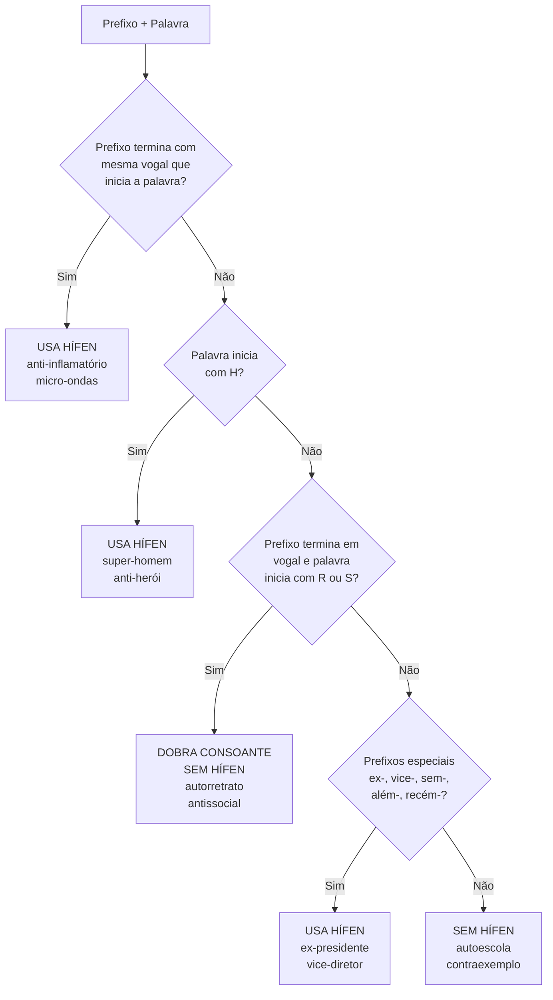

# O Sistema Gráfico do Português: Regras Essenciais de Acentuação e Hífen

> [!important] **Objetivo da Nota** 
> Guia sistemático e prático das regras de acentuação gráfica e uso do hífen em português. Foco nas regras normativas essenciais para produção de texto no padrão culto exigido no exame diplomático.

## Lógica do Sistema de Acentuação Gráfica

> [!definition] **Princípio Fundamental** 
> O sistema de acentuação português marca **exceções** aos padrões prosódicos gerais da língua. A acentuação gráfica sinaliza quando a tonicidade não segue as regras naturais de distribuição do acento tônico.

O sistema segue uma hierarquia lógica:

- **Proparoxítonas**: todas são acentuadas (padrão menos comum)
- **Paroxítonas**: acentuadas quando **não** terminam nas terminações mais frequentes
- **Oxítonas**: acentuadas quando terminam em terminações específicas

## Regras de Acentuação Gráfica

### Proparoxítonas

> [!note] **Regra Absoluta** **TODAS** as proparoxítonas são acentuadas graficamente, sem exceção.

**Exemplos sistemáticos:**

- **Substantivos**: médico, última, câmara, máquina, república, democracia
- **Adjetivos**: clássico, prático, econômico, acadêmico, científico
- **Formas verbais**: estudássemos, fizéssemos, cantávamos
- **Casos específicos**: árvore, época, público, biológico, tecnológico, geográfico, histórico, psicológico, pedagógico

### Paroxítonas

> [!important] **Regra-Chave** Paroxítonas são acentuadas quando **NÃO** terminam em: -a(s), -e(s), -o(s), -em, -ens

#### Terminações que Exigem Acento:

**1. Terminadas em -L:**

- amável, dócil, fóssil, têxtil, difícil, móvel, automóvel
- responsável, possível, terrível, incrível, horrível

**2. Terminadas em -N:**

- hífen, pólen, Cármen, dólmen, éden, gérmen, líquen, abdômen

**3. Terminadas em -R:**

- caráter, mártir, açúcar, fêmur, âmbar, câncer, revólver, cadáver, éter

**4. Terminadas em -X:**

- tórax, látex, fênix, ônix, córtex, sílex

**5. Terminadas em -PS:**

- bíceps, tríceps, fórceps

**6. Terminadas em -Ã(S):**

- ímã, órfã, irmã (e respectivos plurais)

**7. Terminadas em -ÃO(S):**

- órgão, órfão, sótão, acórdão (e respectivos plurais)

**8. Terminadas em -UM/-UNS:**

- álbum, fórum (álbuns, fóruns)

**9. Terminadas em -I(S):**

- táxi, júri, lápis, biquíni, oásis

**10. Terminadas em -U(S):**

- vírus, bônus, ônus

**11. Terminadas em ditongo oral:**

- várzea, área, série, história, glória, memória
- território, laboratório, auditório, relatório

### Oxítonas

> [!note] **Regra das Oxítonas** 
> Acentuam-se as oxítonas terminadas em: **-a(s), -e(s), -o(s), -em, -ens**

**Exemplos por terminação:**

**Terminadas em -A(S):**

- cajá, maracujá, guaraná, cará, vatapá, Paraná

**Terminadas em -E(S):**

- você, café, jacaré, pontapé, rapé, bebê, purê

**Terminadas em -O(S):**

- avó, cipó, paletó, dominó, carijó, robô, vovô

**Terminadas em -EM:**

- também, alguém, ninguém, porém, além, aquém, vintém

**Terminadas em -ENS:**

- parabéns, armazéns, reféns, vinténs

### Monossílabos Tônicos

> [!note] **Mesma Regra das Oxítonas** 
> Monossílabos tônicos seguem o mesmo padrão: acentuam-se quando terminados em -a(s), -e(s), -o(s).

**Exemplos:**

- **-A(S)**: dá, má, já, pá, sá, lá, cá
- **-E(S)**: dê, fé, mês, três, pés, rés
- **-O(S)**: dó, só, pó, nó, pôs

### Regras do Hiato

> [!important] **Regra do Hiato** 
> Acentuam-se o "i" e o "u" tônicos quando:
> 
> 1. São a segunda vogal do hiato
> 2. São tônicos
> 3. Estão sozinhos na sílaba ou seguidos de "s"
> 4. **NÃO** são seguidos de "nh"

**Exemplos com acento:**

- sa-í-da, sa-ú-de, ca-í, pa-ís, ba-ú
- heroína, cafeína, egoísmo, faísca
- Piauí, tuiuiú, Grajaú, juízes, raízes

**Exemplos SEM acento (exceções):**

- rainha, moinho (seguidos de "nh")
- juiz, ruim, cair, contribuir (em sílaba com consoante)

> [!example] **Caso Especial: Oxítonas** 
> Em oxítonas, mantém-se o acento mesmo após ditongo: Piauí, tuiuiú, teiú

### Regras dos Ditongos Abertos

> [!important] **Mudança do Acordo Ortográfico**
>  **SUPRESSÃO** do acento nos ditongos abertos das paroxítonas - mudança fundamental do Acordo de 1990.

**Ainda acentuados (oxítonas e monossílabos):**

- **-éi**: anéis, fiéis, papéis, pastéis, réis, méis
- **-éu**: céu, chapéu, troféu, véu, réu, degréu
- **-ói**: herói, constrói, dói, corrói, faróis, anzóis

**NÃO mais acentuados (paroxítonas):**

- **-ei**: assembleia, ideia, plateia, geleia, estreia, europeia
- **-oi**: boia, jiboia, apoio, alcaloide, asteroide, paranoico

> [!note] **Exceção Importante** 
> Paroxítonas terminadas em -r mantêm acento pela regra das paroxítonas: destróier, Méier

### Acento Diferencial

> [!definition] **Casos Mantidos** 
> Apenas **dois casos** obrigatórios permanecem no português atual:

1. **pôr** (verbo) vs **por** (preposição)
    
    - Vou **pôr** o livro na mesa / Passo **por** aqui sempre
2. **pôde** (pretérito) vs **pode** (presente)
    
    - Ele **pôde** vir ontem / Ele **pode** vir hoje

> [!note] **Caso Opcional** **fôrma** (utensílio) vs **forma** (formato) - acento opcional, mas recomendado para clareza.

**Casos abolidos:** para, pelo, pela, polo, pera (não mais diferenciados)

## Regras do Hífen

### Hífen com Prefixos

> [!important] **Área Mais Complexa** 
> O uso do hífen com prefixos constitui o conjunto de regras mais intrincado do sistema ortográfico português.

#### Regra 1: Mesma Vogal

**Quando o prefixo termina com a mesma vogal que inicia a palavra:**

- micro-ondas, anti-inflamatório, auto-observação, semi-interno
- arqui-inimigo, ultra-aquecido, neo-ortodoxo

> [!note] **Exceção** 
> Prefixo "co-" une-se mesmo com vogal igual: coordenar, cooperar, cooperação

#### Regra 2: Antes de H (Obrigatório)

**Sempre hífen antes de "h":**

- anti-herói, anti-higiênico, super-homem, mini-hotel
- neo-helênico, proto-história, sub-hepático, ultra-humano, sobre-humano

#### Regra 3: Dobrar R/S

**Prefixo terminado em vogal + palavra iniciada por r/s = dobrar consoante:**

- antirreligioso, autorretrato, contrassenha, ultrassom
- antissocial, autorregulamentação, macrorregião, ultrassonografia, microssistema

#### Regra 4: Vogais Diferentes

**Prefixo terminado em vogal + palavra iniciada por vogal diferente = junção direta:**

- aeroespacial, agroindustrial, autoaprendizagem
- contraindicação, extraescolar, plurianual

#### Regra 5: Prefixo Terminado em Consoante

**Prefixo terminado em consoante + palavra iniciada por vogal = sem hífen:**

- hiperativo, interativo, subaquático
- superinteressante, hiperacidez

#### Prefixos Especiais (Sempre com Hífen)

**ex-, sem-, além-, aquém-, recém-, vice-:**

- **ex-**: ex-presidente, ex-aluno, ex-marido, ex-diretor
- **sem-**: sem-vergonha, sem-terra, sem-teto, sem-número
- **além-**: além-mar, além-túmulo, além-fronteiras
- **aquém-**: aquém-mar, aquém-fronteiras
- **recém-**: recém-nascido, recém-chegado, recém-casado
- **vice-**: vice-presidente, vice-diretor, vice-reitor

**pós-, pré-, pró- (quando tônicos):**

- **pós-**: pós-graduação, pós-operatório, pós-moderno
- **pré-**: pré-escola, pré-história, pré-estabelecido
- **pró-**: pró-africano, pró-europeu, pró-americano

#### Regras para BEM/MAL

**bem- (sempre com hífen):**

- bem-estar, bem-vindo, bem-sucedido, bem-humorado
- bem-aventurado, bem-nascido, bem-criado

**mal- (hífen antes de vogal, h, ou l):**

- mal-estar, mal-humorado, mal-intencionado, mal-educado
- **MAS**: malcriado, malfeito, malformado (consoante)

### Hífen em Palavras Compostas

#### Substantivos Compostos

**Mantêm hífen quando preservam unidade semântica:**

- guarda-chuva, porta-aviões, conta-gotas, segunda-feira
- tenente-coronel, médico-cirurgião, beija-flor, couve-flor, bem-te-vi

#### Compostos que Perderam Noção de Composição

**Sem hífen quando perderam sentido de composição:**

- girassol, paraquedas, mandachuva, pontapé, madressilva
- aguardente, malmequer, vaivém

#### Adjetivos Compostos de Nacionalidade

**Sempre com hífen:**

- luso-brasileiro, afro-americano, sino-japonês, anglo-saxão
- franco-alemão, nipo-brasileiro, indo-europeu

#### Espécies Botânicas e Zoológicas

**Sempre com hífen:**

- erva-doce, pimenta-do-reino, bem-te-vi, mico-leão-dourado
- couve-flor, joão-de-barro, maria-vai-com-as-outras

## Pontuação Essencial: Uso da Vírgula

> [!note] **Foco na Clareza** 
> Regras básicas de vírgula que afetam diretamente a clareza textual, essenciais.

### Casos Fundamentais

1. **Aposto explicativo:**
    
    - O presidente, líder da nação, discursou ontem.
2. **Vocativo:**
    
    - Maria, venha aqui imediatamente.
    - Estudem, candidatos, com dedicação.
3. **Adjunto adverbial deslocado:**
    
    - Pela manhã, estudamos gramática.
    - Estudamos gramática, pela manhã.
4. **Orações subordinadas adverbiais antepostas:**
    
    - Quando chegou, todos já haviam saído.
    - Se estudarem bem, passarão no concurso.
5. **Orações coordenadas adversativas:**
    
    - Estudei muito, mas não passei na prova.
    - Preparou-se bem, contudo não obteve aprovação.

## Autoavaliação e Aplicação Prática

### Questão 1: Acentuação Gráfica

> [!question] **Exercício de Aplicação** 
> Justifique a presença ou ausência de acento nas palavras abaixo, aplicando as regras sistemáticas:
> 
> a) **ideia** (por que não tem acento?) b) **médico-cirurgião** (analise cada elemento) c) **Piauí** (explique a regra aplicada) d) **autorretrato** (justifique grafia e hífen) e) **pôde** vs **pode** (explique a diferenciação)

### Questão 2: Hífen com Prefixos

> [!question] **Análise de Casos** 
> Determine o uso correto do hífen e justifique com base nas regras:
> 
> a) anti + inflamatório = ? b) auto + retrato = ? c) ex + presidente = ? d) bem + estar = ? e) mal + formado = ?

### Questão 3: Aplicação Integrada

> [!question] **Produção Textual** 
> Redija um parágrafo de 5-6 linhas utilizando pelo menos:
> 
> - 2 palavras com acento por regra do hiato
> - 1 composto com hífen (substantivo)
> - 1 palavra com prefixo (aplicando regra correta)
> - 1 caso de vírgula com adjunto adverbial deslocado
> 
> Tema: "A importância da correção linguística na carreira diplomática"

---

> [!important] **Nota Final para CACD** Este material sistematiza as regras normativas essenciais do português padrão. O domínio preciso dessas regras é fundamental para a produção textual exigida no exame diplomático, onde a correção linguística é critério eliminatório. Pratique regularmente a aplicação dessas regras em contextos de escrita formal.
