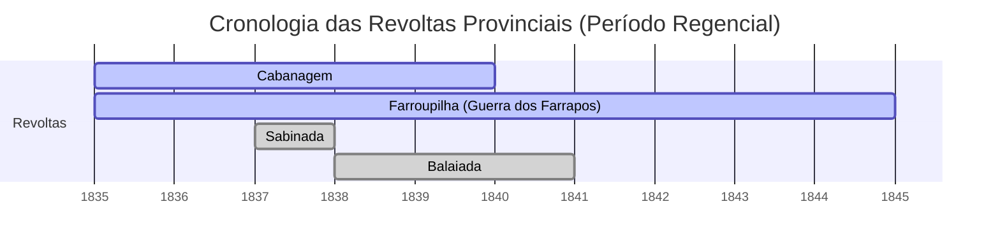

# Período Regencial (1831–1840)

O **Período Regencial** corresponde à década de 1831 a 1840 na história do Brasil, entre a abdicação de D. Pedro I e a declaração da maioridade de D. Pedro II. Foi uma fase de transição conturbada entre o Primeiro e o Segundo Reinado, marcada por intensa **instabilidade política e social**. Sem um monarca adulto no trono, o país experimentou arranjos de poder inovadores e enfrentou uma série de revoltas regionais que colocaram em risco a unidade nacional[pt.wikipedia.org](https://pt.wikipedia.org/wiki/Per%C3%ADodo_regencial_\(Brasil\)#:~:text=Ocorre%20nesta%20fase%20uma%20s%C3%A9rie,a%20preserva%C3%A7%C3%A3o%20de%20seus%20interesses). O historiador Marcello Basile caracteriza a Regência como um verdadeiro **“laboratório da nação”**, um período de debate e redefinição do _pacto político_ iniciado em 7 de abril de 1831, quando a abdicação de D. Pedro I desencadeou amplo debate sobre os fundamentos do governo, as instituições e as relações entre as províncias [Dropbox](https://www.dropbox.com/search?path=%2F&query=todas_hb.pdf). Conforme Emília Viotti da Costa, o arranjo político herdado da Independência deixara os municípios subordinados às províncias e estas ao poder central, com eleições indiretas censitárias que **excluíam a maior parte da população** do processo político [pt.wikipedia.org](https://pt.wikipedia.org/wiki/Per%C3%ADodo_regencial_\(Brasil\)#:~:text=Conforme%20Em%C3%ADlia%20Viotti%20da%20Costa,1). Tais contradições estruturais emergiram com força durante a Regência, em meio ao vácuo de poder deixado pelo imperador.

> [!quote] **Joaquim Nabuco sobre a Regência:**  
> “No Brasil, porém, a Regência foi **a república de fato, a república provisória**...” [pt.wikipedia.org](https://pt.wikipedia.org/wiki/Per%C3%ADodo_regencial_\(Brasil\)#:~:text=Nabuco%3A%20,a%20preserva%C3%A7%C3%A3o%20de%20seus%20interesses), observou o estadista e historiador Nabuco, enfatizando o caráter excepcional desse período em que, na ausência do imperador, experimentou-se na prática uma espécie de governo republicano temporário.

## Centralização vs. Descentralização: Disputas e Reformas Iniciais (1831–1834)

A abdicação de D. Pedro I em 7 de abril de 1831 pegou de surpresa as elites políticas e abriu uma disputa acirrada entre diferentes facções sobre os rumos do Império. De um lado, estavam os **liberais moderados**, defensores da manutenção da ordem monárquica com algumas **reformas limitadas**; de outro, os **liberais exaltados**, que pregavam mudanças mais radicalmente **descentralizadoras** e até flertavam com ideias republicanas; e, por fora, os **restauradores**, que desejavam o retorno de D. Pedro I ou de um governo nos moldes absolutistas tradicionais. Essa tensão entre **centralização** e **descentralização** permearia todas as reformas políticas do período regencial [Google Drive](https://drive.google.com/file/d/1gwXp9f1KSJzgU1iuzGLXm3h0J7vXILCh)[Google Drive](https://drive.google.com/file/d/1gwXp9f1KSJzgU1iuzGLXm3h0J7vXILCh).

> [!definition] **Liberais Moderados (“chimangos”):** Representantes da elite imperial, favoráveis a uma monarquia constitucional centralizada com ajustes pontuais. Buscavam **estabilidade** e temiam mudanças sociais profundas. Lideranças: Evaristo da Veiga, Marquis de Barbacena, padre Diogo Antônio Feijó (embora este último tendesse a posições mais progressistas em alguns momentos). Eram pejorativamente chamados de _chimangos_ pelos opositores.

> [!definition] **Liberais Exaltados (“jurujubas”):** Ala radical dos liberais, defendia **maior autonomia provincial** e até ideias federalistas ou republicanas. Inspiravam-se em ideais da Revolução Francesa e de movimentos liberais estrangeiros [pt.wikipedia.org](https://pt.wikipedia.org/wiki/Per%C3%ADodo_regencial_\(Brasil\)#:~:text=Ocorrera%20em%20Fran%C3%A7a%20%20a,3). Tinham base nas camadas médias urbanas e contavam com jornalistas como Cipriano Barata e eventuais militares. Chamados por apelidos como _jurujubas_ ou _farroupilhas_, eram mais **antimonarquistas** e participaram de agitações e revoltas.

> [!definition] **Restauradores (“caramurus”):** Grupo político conservador, formado em boa parte por portugueses residentes e por brasileiros nostálgicos do **absolutismo**. Queriam a restauração de D. Pedro I (ou, após sua morte em 1834, mantiveram-se fiéis à ordem centralizadora e alinhados à corte portuguesa). José Bonifácio (antes de ser exilado) e o brigadeiro Francisco Bento Gonçalves eram vozes desse campo. Receberam o apelido de _caramurus_, termo de origem indígena adotado pelos jornais satíricos da época.

Nos primeiros anos da Regência, prevaleceram os liberais moderados, que controlavam a Assembleia Geral. Buscando estabilizar o país sem o imperador, eles empreenderam **reformas institucionais** importantes, porém de cunho liberal limitado. Entre elas destacaram-se:

- **Criação da Guarda Nacional (1831):** Instituída em agosto de 1831, logo após a abdicação, pelo então ministro da Justiça Diogo Feijó. A Guarda Nacional era uma milícia cidadã destinada a manter a ordem interna, armando os proprietários locais como oficiais. Colocou-se assim, _de fato_, uma força policial **“à disposição das classes proprietárias”** para controlar revoltas e assegurar a estabilidade [philarchive.org](https://philarchive.org/archive/DECACD-4#:~:text=Com%20esse%20intuito%2C%20o%20governo,que%20seria%20usada%20na). Cada comarca organizava seus batalhões de guardas nacionais, comandados por “coronéis” eleitos entre os grandes proprietários. A criação da Guarda Nacional tinha dois objetivos políticos: substituir as tropas de linha (cujas lealdades eram duvidosas após revoltas como a Noite das Garrafadas) e cooptar as elites regionais para a manutenção da ordem imperial. Embora concebida como instrumento de **descentralização** da segurança (dando poder local aos notáveis), a Guarda Nacional também reforçou laços de **clientelismo** e controle oligárquico, servindo de pilar para o pacto entre governo central e elite agrária.
    
- **Código de Processo Criminal (1832):** Aprovado em 1832, foi uma reforma judiciária de caráter liberalizante, pois **descentralizou** a administração da justiça. Introduziu a figura dos *juízes de paz eleitos localmente*, com amplos poderes policiais e judiciais nas vilas e cidades. Esse código transferiu às autoridades locais (muitas vezes os próprios membros da elite provincial) competências sobre segurança pública, reduzindo a interferência direta do poder central nos assuntos cotidianos das províncias [Google Drive](https://drive.google.com/file/d/1Zm4BTtOM3Pf0bZmPNwDD9DI9mWMFptKM). Na prática, os juízes de paz e as jurys populares (implantadas pelo código) ampliaram a autonomia local, em sintonia com as demandas descentralizadoras dos liberais exaltados. Por outro lado, críticos apontavam que, ao colocar a justiça nas mãos das oligarquias locais, o Código poderia enfraquecer a autoridade nacional e dificultar a repressão uniforme a rebeldias.
    

Essas reformas iniciais refletem o **embate ideológico** do período: os moderados buscavam acomodar pressões liberais concedendo autonomia local moderada, sem abdicar do **poder moderador** e da unidade monárquica. Já os exaltados clamavam por mais medidas federativas, enquanto os restauradores denunciavam qualquer descentralização como ameaça à integridade do Império. Os anos de 1831–1834 foram, assim, uma experiência de **experimentalismo político**: tentava-se encontrar um equilíbrio entre a herança centralizadora de 1824 e as demandas por participação provincial. Não por acaso, a historiografia destaca a Regência como o momento em que se discutiu até que ponto o Brasil poderia ser uma **monarquia descentralizada**.

> [!note] **Exemplo de cobrança (CACD – Questão Objetiva):**  
> _“A Regência foi vista pelas elites provinciais como oportunidade de construção de uma monarquia federalista, o que responderia a certas expectativas de autonomia levantadas no momento de sua adesão à independência. De fato, a discussão de peças legais que aumentavam a autonomia local teve início no final do Primeiro Reinado e resultou na promulgação, por exemplo, do Código de Processo Criminal, em 1832.”_ (Item 3, CESPE/CEBRASPE 2013) [Google Drive](https://drive.google.com/file/d/1Zm4BTtOM3Pf0bZmPNwDD9DI9mWMFptKM). – _Esse item foi considerado **Certo** pela banca, pois aponta corretamente o movimento inicial de descentralização legal que culminaria no Ato Adicional._

## O Ato Adicional de 1834: autonomia provincial e “experiência federalista”

Diante das pressões descentralizadoras e da contínua tensão entre as facções, o Parlamento aprovou uma reforma constitucional de grande envergadura: o **Ato Adicional de 12 de agosto de 1834**. Tratou-se de uma emenda à Constituição de 1824 que, em linhas gerais, **ampliou a autonomia das províncias**, configurando uma espécie de _experiência federalista_ temporária no Império. As principais medidas do Ato Adicional foram:

- **Assembléias Legislativas Provinciais:** O Ato criou legislativos eleitos em cada província, com competência para legislar sobre assuntos locais (inclusive impostos provinciais, educação e polícia). Essas assembleias provinciais deram voz política às elites regionais, que passaram a deliberar leis próprias, atendendo a antigas reivindicações de maior **autogoverno** local[cursosapientia.com.br](https://www.cursosapientia.com.br/conteudo/noticias/bernardo-pereira-de-vasconcelos-liberal-ou-conservador#:~:text=Bernardo%20Pereira%20de%20Vasconcelos%20tamb%C3%A9m,suspensos%2C%20entre%20outras%20medidas%20descentralizadoras).
    
- **Regência Una e Eletiva:** Substituição da Regência Trina (governo de três regentes simultâneos) por uma **Regência Una**, exercida por apenas um regente, **eletivo** (escolhido por voto nacional na Assembleia) para um mandato de quatro anos. Essa mudança buscou dar mais eficiência e unidade ao Executivo regencial. Em 1835 realizou-se a primeira eleição para regente uno, vencida pelo padre Diogo **Feijó** – um liberal moderado – que assumiu o cargo em solo (antes, entre 1831-34, vigorou uma Regência Trina Permanente formada por Francisco de Lima e Silva, José da Costa Carvalho e João Bráulio Muniz).
    
- **Suspensão do Conselho de Estado:** O Ato extinguiu (ou pôs em recesso) o influente Conselho de Estado, órgão consultivo nomeado por D. Pedro I que havia sido criado pela Constituição para assessorá-lo nas decisões do Poder Moderador. Os liberais viam o Conselho de Estado como um bastião do absolutismo e **clientelismo** do imperador; sua eliminação em 1834 foi celebrada como vitória liberal. Isso, porém, deixava **vago** o canal formal de aconselhamento do chefe de Estado, até sua restauração pelos conservadores anos depois (em 1841, já no Segundo Reinado).
    
- **Manutenção do Poder Moderador (teórica):** O Poder Moderador – a prerrogativa metaconstitucional do monarca de intervir nos demais poderes – **não foi abolido** do texto constitucional. Porém, durante a Regência, esse poder encontrava-se “suspenso” de fato, já que não havia imperador exercendo-o. O Ato Adicional não transferiu o Poder Moderador aos regentes. Assim, certas atribuições, como dissolver a Câmara ou nomear senadores vitalícios, ficaram restritas. Os regentes uno passaram a governar dentro de limites mais **legalistas**, dependendo mais do Legislativo.
    
- **Município Neutro da Corte:** O Ato desmembrou a cidade do Rio de Janeiro de sua província, criando o “Município Neutro” sob administração direta do governo central. A Província do Rio de Janeiro passou a ter outra capital (Niterói). Essa mudança buscava evitar que a província-sede do governo concentrasse poder demais.
    

Em suma, o Ato Adicional de 1834 representou o ápice das **reformas liberais** da Regência, consagrando princípios **descentralizadores**. Muitos historiadores o avaliam como um ensaio de federalismo monárquico: pela primeira (e única) vez no Império, concedeu-se às províncias autonomia legislativa significativa, quase como “Estados” federados. **Paradoxalmente**, essa descentralização veio acompanhada de uma centralização administrativa no topo (um único regente). O equilíbrio era tênue: acreditava-se que um regente único forte conseguiria conter eventuais abusos provinciais, enquanto as assembleias locais acalmariam as demandas regionais.

> [!question] **Exemplo (CACD – Item de Prova Objetiva):**  
> _“A Constituição do Império foi modificada em aspectos essenciais poucos anos depois de iniciada a fase regencial, e o Ato Adicional de 1834 **interrompeu** a descentralização político-administrativa que se iniciava: as províncias, que deixaram de contar com assembleias legislativas, perderam a prerrogativa de elaborar suas próprias leis.”_ [Google Drive](https://drive.google.com/file/d/1Zm4BTtOM3Pf0bZmPNwDD9DI9mWMFptKM) – _Esse item foi considerado **Errado** no TPS/CACD, pois afirma o oposto da realidade: na verdade o Ato Adicional **promoveu** a descentralização, criando as assembleias provinciais e ampliando a autonomia local._

**Limites e problemas:** Apesar do avanço liberal, o Ato Adicional não demorou a apresentar desafios. A transferência de poder para as províncias ocorreu em um contexto de frágil autoridade central – justamente quando um regente liberal (Feijó) assumia. A falta de mecanismos eficazes de coordenação entre centro e partes gerou **conflitos políticos**: presidentes de província (nomeados pelo regente) entravam em atrito com as novas assembleias locais; líderes regionais antes contidos pelo Rio de Janeiro agora sentiam-se livres para desafiar ordens que considerassem contrárias a interesses locais. Além disso, grupos excluídos do poder (setores populares, escravos, classes médias emergentes) viram na relativa desorganização do poder central uma oportunidade para fazer suas reivindicações à força.

Como veremos, nos anos posteriores (1835-1837) eclodiu uma série de **revoltas provinciais** graves, algumas inspiradas justamente pelo clima mais autônomo propiciado pelo Ato Adicional. Tais rebeliões evidenciaram os riscos de uma descentralização sem salvaguardas eficazes à autoridade nacional. A resposta do outro grupo político – os **conservadores** – seria um movimento de retração das liberdades provinciais, conhecido como **Regresso**.

## Revoltas Provinciais (1835–1840)

A Regência enfrentou diversos **movimentos rebeldes** nas províncias, provocados tanto por disputas políticas locais quanto por profundas questões sociais. Essas revoltas desafiaram a coesão do Império e estão entre os fatores que motivaram a guinada conservadora a partir de 1837. A seguir, examinamos as principais insurreições regenciais – suas causas, lideranças, composição social, objetivos e desfechos:

### Cabanagem (Pará, 1835–1840)

- **Causas:** Extrema pobreza e **exclusão política** na Província do Grão-Pará. A região vivia isolada do centro e sofrera com a crise econômica pós-Independência (queda das exportações locais). A elite local luso-brasileira marginalizava caboclos, indígenas e negros. Fome, miséria e ressentimento contra o domínio dos “brancos” portugueses acenderam a revolta [Google Drive](https://drive.google.com/file/d/1gwXp9f1KSJzgU1iuzGLXm3h0J7vXILCh).
    
- **Lideranças:** Embora de caráter popular, contou inicialmente com alguns membros da elite dissidente. Destacaram-se nomes como **Félix Malcher** (fazendeiro mestiço, primeiro líder, depois morto), **Francisco Vinagre** e seu irmão Antônio Vinagre, e **Eduardo Angelim** (mestiço de classe média, que liderou a fase republicana). Eram chamados de _cabanos_ (moradores de cabanas ribeirinhas). Importante frisar que muitos líderes iniciais tinham origem humilde/mestiça, algo singular nas rebeliões do período.
    
- **Composição social:** _Heterogênea, majoritariamente popular._ Participaram indígenas, caboclos, mestiços, escravos foragidos e pobres urbanos. Trata-se de uma das poucas revoltas brasileiras com **ampla participação das “classes ínfimas”** (termo de Emilia Viotti) – por isso é frequentemente citada como _revolução social_. Setores da elite paraense chegaram a apoiar no começo, mas logo foram alijados ou mudaram de lado.
    
- **Objetivos:** Inicialmente, os rebeldes queriam derrubar o presidente da província (nomeado pelo Rio) e obter **maior autonomia local**, além de aliviar a miséria geral. Com o avanço do movimento, radicalizaram-se as demandas: estabeleceu-se um **governo próprio** em Belém, chegando a proclamar (implicitamente) algo próximo a uma separação do Império. Angelim, ao assumir, defendeu terras para pobres e expulsão dos portugueses. Em suma, a Cabanagem evoluiu de um motim regional contra autoridades corruptas para uma **contestação da ordem imperial**, com tons de revolução social e nativista.
    
- **Desfecho:** Foi **violentamente reprimida** pelas forças imperiais. A retomada de Belém pelas tropas legalistas em 1836 levou a massacres. Focos guerrilheiros persistiram no interior até 1840, quando a anistia foi oferecida aos remanescentes. Calcula-se que entre **30 a 40 mil pessoas** morreram [Google Drive](https://drive.google.com/file/d/1gwXp9f1KSJzgU1iuzGLXm3h0J7vXILCh) – um verdadeiro cataclismo demográfico (cerca de 20% da população do Pará). A Cabanagem somente terminou oficialmente em 1840, já sob o governo pessoal de Pedro II, sendo a última revolta pacificada do período regencial. Seu legado foi um Pará arrasado e despovoado, e a demonstração mais dramática de que tensões sociais profundas grassavam no Império.
    

### Sabinada (Bahia, 1837–1838)

- **Causas:** Insatisfação da elite baiana com o governo regencial e, em especial, com a nomeação de presidentes provinciais de fora (por vezes vistos como prepostos do Rio). A Bahia vinha de crises econômicas e havia tensão latente desde a **Revolta dos Malês (1835)** – levante de escravos muçulmanos em Salvador, cruelmente sufocado. O clima era de ressentimento contra o poder central e desejo de **maior autonomia** provincial.
    
- **Liderança:** Capitaneada pelo dr. **Francisco Sabino** Álvares da Rocha Vieira, um médico e jornalista liberal, além de setores da oficialidade militar local (como o major Silva Castro). A liderança era de classe média urbana (profissionais liberais, oficiais) e parte da elite açucareira recuou de apoiar ao perceber o radicalismo.
    
- **Composição social:** _Predominantemente classe média e militares_, com algum apoio popular urbano. Não houve mobilização de escravos (até porque o recente levante Malê assustara os rebeldes, que não queriam uma insurreição servil). Artesãos, soldados e libertos aderiram em Salvador, mas a revolta ficou restrita à capital e arredores – não teve base camponesa nem tomou o interior.
    
- **Objetivos:** Proclamar uma **Bahia autônoma** até que D. Pedro II atingisse a maioridade. Curiosamente, os sabinadas não rejeitavam a monarquia nem Pedro II – queriam separar-se apenas temporariamente (“República Bahiense **provisória**”), alegando proteger a província até a maioridade do imperador. Esse plano híbrido refletia tanto o desejo de autogoverno quanto a manutenção do laço dinástico no futuro. Também exigiam o fim do recrutamento forçado e mais liberdade de comércio. Em essência, a Sabinada desafiava o governo regencial (que consideravam ilegítimo ou incompetente), mas não a instituição monárquica em si.
    
- **Desfecho:** Após controlar Salvador por cerca de 4 meses, os sabinados foram derrotados por tropas legalistas enviadas pelo regente em março de 1838. Houve combates sangrentos e **represálias severas**: estima-se 1.500 a 2.000 mortos nos confrontos [Google Drive](https://drive.google.com/file/d/1gwXp9f1KSJzgU1iuzGLXm3h0J7vXILCh)[Google Drive](https://drive.google.com/file/d/1gwXp9f1KSJzgU1iuzGLXm3h0J7vXILCh). Sabino e outros líderes foram presos (Sabino depois deportado para o Mato Grosso). A repressão imperial restabeleceu o controle na Bahia, que ficou sob **intervenção militar** por algum tempo. A Sabinada mostrou a determinação do governo central em não tolerar separatismos, ainda que “temporários”, e serviu de alerta sobre a _inquietação das elites regionais_.
    

> [!note] **Revolta dos Malês (1835):** Pouco antes da Sabinada, em janeiro de 1835, Salvador foi cenário da Revolta dos Malês – uma insurreição de escravizados islamizados e libertos africanos, que planejavam tomar a cidade, matar os brancos e abolir a escravidão. O movimento foi contido em poucas horas, mas deixou cerca de 70 mortos e disseminou o **pânico de levantes escravos** na elite brasileira. Esse episódio contribuiu para moderar a Sabinada (que não incluiu escravos em seus planos) e evidenciou que a **questão da escravidão** já fervilhava no seio do Império durante a Regência.

### Balaiada (Maranhão, 1838–1841)

- **Causas:** Profunda crise econômica e opressão social no sertão do Maranhão e Piauí. Conflitos entre facções políticas locais (liberais x conservadores maranhenses) degeneraram em violência. Em 1838, a prisão arbitrária de um vaqueiro provocou a revolta inicial. A Balaiada nasceu da união espontânea de **sertanejos pobres, vaqueiros, quilombolas e artesãos** contra os abusos das oligarquias e contra a miséria extrema (fomes frequentes, colapso do comércio do algodão).
    
- **Nome e Lideranças:** O nome deriva de Manoel **Balaio**, artesão fabricante de cestos (_balaios_), que liderou camponeses em armas – daí “Balaiada”. Outras figuras de relevo: Raimundo Gomes, um vaqueiro que libertou presos da cadeia de Vila da Manga, dando início à insurgência; e o negro **Cosme Bento**, ex-escravo que reuniu mais de 3.000 escravos fugidos e fundou o quilombo “Coluna Negra”, aderindo à revolta. Não havia um comando unificado – era um movimento difuso e dividido em bandos.
    
- **Composição social:** Marcadamente **popular e heterogênea**. Envolveu vaqueiros, peões, pequenos agricultores, escravos fugidos, mestiços pobres e alguns artesãos urbanos. Setores médios quase não participaram, e as elites locais permaneceram leais em sua maioria (até porque tinham milícias da Guarda Nacional para se defender). Por isso, a Balaiada é vista como uma revolta de **desesperados sociais**, com cunho de revolta camponesa e de escravos.
    
- **Objetivos:** Difusos e pouco articulados ideologicamente. Em geral, os revoltosos clamavam contra a **opressão dos potentados locais**, contra a pobreza e por vingança a injustiças. Houve palavras de ordem pela _liberdade aos escravos_ (Cosme defendia abolir a escravidão regionalmente) e por “justiça” aos pobres. Em termos políticos, chegaram a tomar cidades no interior e pretendiam derrubar o presidente da Província do Maranhão. Não formularam, porém, projeto de secessão ou mudança de regime claro – era antes uma explosão de revolta social contra as condições intoleráveis de vida.
    
- **Desfecho:** Diante do descontrole no Maranhão, o regente Araújo Lima nomeou em 1839 o então coronel **Luís Alves de Lima e Silva** (futuro Duque de Caxias) para pacificar a província. Caxias assumiu com poderes militares e políticos amplos (presidente e comandante das armas) e, usando tanto a força quanto anistias seletivas, **derrotou a Balaiada em 1840**. Cosme foi enforcado em 1842; Balaio morrera em combate; Raimundo Gomes rendeu-se em troca de perdão. A repressão combinou violência – incluindo fuzilamentos e prisões em massa – com oferta de perdão para quem depusesse armas. Em 1841, a ordem estava restabelecida. A Balaiada evidenciou a capacidade de reação do governo central e especialmente projetou Caxias como “o pacificador” do Império. Também legou lições às elites: a necessidade de controlar o sertão e integrar esses grupos sociais para evitar novas explosões.
    

### Guerra dos Farrapos (Rio Grande do Sul, 1835–1845)

- **Causas:** Questões econômicas e fiscais específicas do sul, combinadas a um aceso sentimento regionalista. Os estancieiros gaúchos, produtores de **charque** (carne seca) bovino, ressentiam-se dos **altos impostos** imperiais sobre seu produto e da concorrência da carne platina (Uruguai/Argentina) que entrava no Brasil mais barata. Exigiam protecionismo às charqueadas gaúchas [Google Drive](https://drive.google.com/file/d/1Zm4BTtOM3Pf0bZmPNwDD9DI9mWMFptKM). Além disso, havia queixas contra a nomeação de presidentes provinciais não locais e contra a pouca autonomia para decisões provinciais. Ideias republicanas circulavam entre parte da elite local influenciada pelos vizinhos hispano-americanos. Assim, somou-se **interesse econômico** e **ideal liberal-republicano**.
    
- **Lideranças:** Grandes fazendeiros e militares rio-grandenses articularam o movimento. Destacam-se **Bento Gonçalves** (estancieiro e coronel da Guarda Nacional, líder máximo dos farroupilhas), **Antônio de Souza Neto** (militar que proclamou a república em 1836) e o italiano **Giuseppe Garibaldi** (aventureiro republicano que se uniu à causa e comandou ações navais). A maioria da liderança vinha da elite estancieira local (os _farrapos_ inicialmente eram apelido pejorativo dado pelos legalistas, mas os rebeldes o assumiram).
    
- **Composição social:** _Predominantemente elite e setores médios._ Foi uma revolta conduzida pelos fazendeiros ricos e suas clientelas (peões de estância, alguns escravos incorporados como soldados, oficiais militares locais). Não teve o caráter popular amplo de Cabanagem ou Balaiada – embora camadas humildes tenham lutado, o comando e interesses atendidos eram os dos proprietários. Parte significativa do Exército e da Guarda Nacional gaúcha aderiu à revolução, dando-lhe organização militar forte.
    
- **Objetivos:** Inicialmente, maior **autonomia provincial** e melhores condições econômicas (redução de impostos imperiais, liberdade para a província legislar sobre assuntos locais). Com o acirramento do conflito, evoluiu para a **separação**: em 1836, os farroupilhas proclamaram a **República Rio-Grandense** (ou de Piratini), independente do Brasil. Posteriormente, expandiram a rebelião a Santa Catarina, proclamando também a efêmera **República Juliana** em Laguna (1839). Eram movidos tanto por pragmatismo econômico (livrar-se da política tributária imperial) quanto por ideais republicanos e federalistas. Em suas cartas, líderes farrapos falavam em acabar com o “despotismo” do Rio de Janeiro e seguir o exemplo das repúblicas platinas. Contudo, havia divergências internas: alguns queriam apenas forçar concessões fiscais do Império, outros insistiam em independência plena.
    
- **Desfecho:** Foi a revolta mais longa – durou 10 anos – e só terminou já no Segundo Reinado. O Império, após várias campanhas militares malsucedidas, mudou de estratégia: nomeou em 1842 o mesmo **Caxias** como comandante e pacificador no sul. Em 1845, Caxias negociou com os líderes farroupilhas a **Paz de Ponche Verde**, acordando uma anistia geral e **concessões**: integração dos oficiais farroupilhas ao Exército Imperial (com patentes), incorporação da província de São Pedro do Rio Grande do Sul em condição igual às demais (ou seja, sem as punições pretendidas inicialmente), e redução de impostos sobre o charque gaúcho. Os escravos que haviam lutado ao lado dos farroupilhas, porém, **não foram libertados** pelo acordo – um aspecto controverso (alguns foram entregues de volta aos donos ou vendidos fora da província, pois o Império não reconhecia a legalidade da alforria dada pelos rebeldes). A Farroupilha terminou, portanto, mediante um **acordo político-militar**, garantindo a unidade do Império. Legou símbolos (como a bandeira e hino rio-grandenses) e um mito regional de bravura republicana, mas também reforçou a percepção, pelas elites centrais, de que concessões localizadas podiam evitar rupturas maiores.
    

> [!question] **Exemplo (CACD – Questão Objetiva):**  
> _“No período regencial, além da Farroupilha, outros movimentos armados eclodiram no Brasil: no Grão-Pará, a Cabanagem; no Maranhão e no Piauí, a Balaiada; na Bahia, a Sabinada **e a revolta dos Malês**...”_[Google Drive](https://drive.google.com/file/d/1Zm4BTtOM3Pf0bZmPNwDD9DI9mWMFptKM). – _Item correto de prova que enumera as principais revoltas regenciais, indicando a abrangência geográfica das rebeliões (do Norte ao Sul) e incluindo a insurreição escrava dos Malês entre elas._

_Diagrama: Cronologia comparada das revoltas (início e término)._ Observa-se que **Cabanagem** e **Farroupilha** iniciam-se simultaneamente em 1835, porém a Farroupilha estende-se até 1845 (já bem dentro do Segundo Reinado), ao passo que as demais terminaram ainda durante a Regência. **Sabinada** e **Balaiada** eclodiram após 1837, num contexto de reação conservadora já em curso, mas só a Balaiada perdurou até a véspera do Golpe da Maioridade (1840).

**Análise geral das rebeliões:** As revoltas regenciais evidenciam a conexão entre **descentralização política e tensões sociais**. Onde as instituições provinciais eram frágeis e a exclusão social mais aguda (Pará, Maranhão), movimentos populares violentos explodiram, clamando por mudanças profundas. Onde havia elites locais fortes com agenda própria (Rio Grande, Bahia), levantaram-se revoltas político-elitistas com objetivos provinciais específicos. Em comum, todas expressavam descontentamento com o poder central regencial – ora por **omissão** (abandono econômico, como no Norte), ora por **comissão** (interferências indesejadas, como no Sul e Nordeste). A multiplicidade e simultaneidade desses conflitos quase levou ao **esfacelamento territorial** do país, e gerou entre a classe dirigente um forte **sentimento de urgência** por retomar as rédeas do poder central para salvar a unidade imperial[cursosapientia.com.br](https://www.cursosapientia.com.br/conteudo/noticias/bernardo-pereira-de-vasconcelos-liberal-ou-conservador#:~:text=Apesar%20das%20medidas%20liberais%20que,ele%20na%20d%C3%A9cada%20de%201830). Essa é a origem do chamado **Regresso Conservador**.

## O Regresso Conservador (1837–1840)

A partir de 1837, verifica-se uma guinada política no Império: as lideranças **conservadoras** assumem o controle do governo regencial e empreendem um movimento de **recentralização do poder**, em resposta direta à instabilidade dos anos anteriores. Esse período, conhecido como _Regresso Conservador_, reflete a reação das elites moderadas (agora assustadas com os excessos liberais e com as rebeliões) no sentido de “por a casa em ordem”. As principais características e eventos do Regresso foram:

- **Queda dos Liberais do poder (1837):** O regente Feijó, enfrentando impasses políticos e sem conseguir sufocar as revoltas, renunciou em setembro de 1837. Em sua vaga, a Assembleia elegeu regente o senador **Pedro de Araújo Lima**, um político de tendência conservadora (depois Marquês de Olinda). Com Araújo Lima na regência una, formou-se um Ministério predominantemente **conservador**, incluindo expoentes como Bernardo Pereira de Vasconcelos e Paulino José Soares de Sousa. Inaugurava-se assim uma fase de **retrocesso nas reformas liberais**.
    
- **Ideologia do “Regresso”:** Os conservadores argumentavam que a descentralização fora longe demais e colocara em risco a integridade do Império. Era preciso retornar a princípios de **autoridade central** para restaurar a ordem. Bernardo de Vasconcelos, figura central do Regresso, defendia que não se tratava de abolir a liberdade, mas de “corrigir os excessos” liberais para salvar as conquistas de 1824. Conforme suas palavras, era necessário sacrificar certos princípios quando a experiência mostrasse serem inadequados, adaptando-os à **verdade e à ordem** [Dropbox](https://www.dropbox.com/search?path=%2F&query=todas_hb.pdf). Em outras palavras, o Regresso justificava-se como **contrarrevolução preventiva**: recuar em autonomia para evitar a balcanização do Império.
    
- **Lei Interpretativa do Ato Adicional (1840):** Símbolo máximo do Regresso, essa lei (promulgada em 12 de maio de 1840) alterou pontos-chave do Ato Adicional de 1834, **restringindo a autonomia provincial** recém-conquistada. A Lei Interpretativa devolveu diversas atribuições das Assembleias Provinciais ao controle do poder central [Google Drive](https://drive.google.com/file/d/1gwXp9f1KSJzgU1iuzGLXm3h0J7vXILCh). Por exemplo, matérias de polícia e justiça voltaram a ser legisladas nacionalmente; presidentes provinciais readquiriram poderes de interferência nos municípios; e a **Guarda Nacional** foi subordinada ao governo central (Ministério da Guerra), retirando sua autonomia local [Google Drive](https://drive.google.com/file/d/1gwXp9f1KSJzgU1iuzGLXm3h0J7vXILCh). Em suma, a lei “reinterpretou” o Ato Adicional de forma a esvaziá-lo, _restaurando_ grande parte do centralismo original.
    
- **Outras medidas centralizadoras:** Além da Lei Interpretativa, os conservadores reestruturaram instituições para reforçar o centro. Foram aprovadas leis reorganizando o **Judiciário** (Lei de 1841, já no início do Segundo Reinado, recriou o Conselho de Estado e instituiu os juízes municipais nomeados, reduzindo o alcance dos juízes de paz). Medidas administrativas recentralizaram a arrecadação e sufocaram iniciativas provinciais consideradas “excessivas”. A imprensa exaltada foi reprimida. Em suma, procurou-se “arrumar a casa” fortalecendo os instrumentos de governo central e limitando liberdades locais.
    

> [!note] **Vasconcelos: do Ato Adicional ao Regresso:** Uma figura emblemática dessa guinada foi **Bernardo Pereira de Vasconcelos**. Liberal moderado influente, ele fora o relator e defensor do Ato Adicional de 1834, contribuindo para descentralizar o Império [cursosapientia.com.br](https://www.cursosapientia.com.br/conteudo/noticias/bernardo-pereira-de-vasconcelos-liberal-ou-conservador#:~:text=Bernardo%20Pereira%20de%20Vasconcelos%20tamb%C3%A9m,suspensos%2C%20entre%20outras%20medidas%20descentralizadoras). Poucos anos depois, diante do caos, Vasconcelos “virou a casaca” e tornou-se líder do Regresso, pregando a centralização para conter as revoltas. Nas palavras de um historiador, _“para ele e os outros conservadores do Regresso, era preciso centralizar o poder para conter as revoltas provinciais e evitar o esfacelamento territorial do país”_ [cursosapientia.com.br](https://www.cursosapientia.com.br/conteudo/noticias/bernardo-pereira-de-vasconcelos-liberal-ou-conservador#:~:text=Apesar%20das%20medidas%20liberais%20que,ele%20na%20d%C3%A9cada%20de%201830). Em 1840, foi Vasconcelos quem articulou e defendeu no Parlamento a Lei Interpretativa que revertia as medidas descentralizadoras que ele mesmo ajudara a aprovar. Esse percurso ilustra a pragmática mudança de posição das elites imperiais conforme as circunstâncias.

- **Golpe da Maioridade (1840):** Enquanto os conservadores promoviam o Regresso, os liberais – agora na oposição – tramaravam uma maneira de retomar o poder. A oportunidade veio com a ideia de antecipar a maioridade de Pedro de Alcântara (futuro D. Pedro II). O jovem imperador tinha apenas 14 anos em 1840 (a Constituição fixava 18 anos para maioridade), mas uma campanha chamada **“Clube da Maioridade”** mobilizou a opinião pública e parlamentares em favor de declará-lo apto a reinar imediatamente. O objetivo político dos liberais era derrubar a regência controlada pelos conservadores, trazendo Pedro II ao trono como figura de conciliação que lhes permitisse ascender ao governo. Em julho de 1840, o Parlamento – sob pressão popular e com apoio inclusive de alguns conservadores moderados – aprovou a declaração de maioridade do imperador. Esse **Golpe da Maioridade** encerrou antecipadamente o período regencial e deu início ao **Segundo Reinado** (1840–1889) [Google Drive](https://drive.google.com/file/d/1Zm4BTtOM3Pf0bZmPNwDD9DI9mWMFptKM)[Google Drive](https://drive.google.com/file/d/1Zm4BTtOM3Pf0bZmPNwDD9DI9mWMFptKM).
    

O termo “golpe” se justifica porque a manobra ignorou a idade legal estipulada, embora tenha sido feita de forma institucional (com aprovação quase unânime no Parlamento). A coroação de D. Pedro II, aos 14 anos, foi saudada com entusiasmo por amplos setores – todos ansiavam por estabilidade. Os liberais assumiram o primeiro gabinete do novo reinado, marcando a vitória conjuntural desse grupo. Entretanto, a **ordem centralizada** que os conservadores desejavam acabaria prevalecendo: nos anos seguintes, consolidou-se um Estado imperial forte, capaz de sufocar rebeliões (como a **Revolução Liberal de 1842**, reação frustrada dos liberais contra o Regresso [Google Drive](https://drive.google.com/file/d/1gwXp9f1KSJzgU1iuzGLXm3h0J7vXILCh)) e de manter a unidade nacional até o final do século.

Em síntese, o Regresso Conservador representou a **síntese política** da experiência regencial: após flertar com o “federalismo” e quase ver o país fragmentar-se, a elite imperial optou por reafirmar o **centralismo monárquico**. A Regência terminou com a restauração de grande parte do poderio do Rio de Janeiro sobre as províncias – agora sob a liderança pessoal de um imperador jovem e moldável. A partir de 1840, nasceram os novos **partidos políticos nacionais** (Conservador e Liberal), ambos controlados por oligarquias que, embora rivais, concordavam na necessidade de preservar a autoridade central e a estrutura social vigente.

## A Dimensão Externa do Período Regencial

No campo da política externa, o Brasil regencial adotou uma postura em geral **defensiva e reativa**, voltada principalmente a assegurar o reconhecimento internacional do novo arranjo de poder e a lidar com pressões estrangeiras, enquanto evitava aventuras externas dado o contexto interno turbulento. Vários aspectos merecem destaque:

- **Reconhecimento internacional:** A abdicação de D. Pedro I e a menoridade de seu herdeiro levantaram dúvidas iniciais sobre a estabilidade do Império, mas os países estrangeiros logo **reconheceram o governo regencial** como legítimo sucessor do regime imperial. O Brasil garantiu a continuidade dos tratados firmados no Primeiro Reinado, como o de 1825 com Portugal (em que este reconheceu a Independência). Aliás, D. Pedro I partiu para a Europa justamente para lutar pelo trono português de sua filha, D. Maria II, contra o usurpador D. Miguel – conflito externo que, por alguns anos, afastou a possibilidade de qualquer tentativa de retorno de Pedro ao Brasil. Com a vitória liberal em Portugal e a morte de D. Pedro I (1834), cessou a ameaça restauradora externa. As relações luso-brasileiras, mediadas pela Grã-Bretanha, se normalizaram, embora questões como a dívida da indenização de 1825 continuassem sendo tratadas.
    
- **Pressões britânicas e o fim do tráfico de escravos:** A **Inglaterra** foi, de longe, o principal desafio externo da Regência. Desde a independência, o Reino Unido pressionava o Brasil a abolir o tráfico atlântico de escravos (havia acordos prévios em 1826 prevendo o fim do tráfico em 1830). Em meio à abdicação, o governo regencial _cedeu_ em termos legais: promulgou a **Lei de 7 de Novembro de 1831** (também conhecida como Lei Feijó) declarando livres todos os africanos desembarcados no Brasil a partir daquela data e definindo o tráfico negreiro como pirataria [Google Drive](https://drive.google.com/file/d/1gwXp9f1KSJzgU1iuzGLXm3h0J7vXILCh). Em teoria, portanto, o tráfico de escravos tornava-se ilegal já em 1831. **Na prática**, porém, essa lei nunca foi efetivamente aplicada – pelo contrário, inaugurou-se o período do chamado _“tráfico para inglês ver”_, pois o contrabando de cativos **aumentou** nas décadas de 1830 e 40 com conivência das autoridades locais. Os interesses escravistas internos (grandes fazendeiros e comerciantes de escravos) impediram a execução da lei [Google Drive](https://drive.google.com/file/d/1gwXp9f1KSJzgU1iuzGLXm3h0J7vXILCh). A Marinha britânica, por sua vez, intensificou a patrulha na costa da África e do Brasil, fiscalizando navios suspeitos. Isso gerou tensões diplomáticas: os britânicos chegavam a apreender navios negreiros em águas brasileiras, o que o governo via como violação de soberania. O **tema do tráfico** manteve relações anglo-brasileiras num estado delicado durante toda a Regência – um _impasse_ que só seria resolvido em 1850, quando o Brasil finalmente reprimirá o tráfico (Lei Eusébio de Queirós), já sob ameaça explícita da Royal Navy (Lei britânica Bill Aberdeen de 1845). Em resumo, a pressão **abolicionista** britânica foi constante: embora os regentes resistissem a cumpri-la de fato nos anos 1830, tiveram que gerenciar essa pressão por meio de negociações e retórica diplomática, tentando ganhar tempo sem romper com a potência amiga.
    
- **Relações com a Bacia do Prata:** No cenário platino (América do Sul), o período regencial foi de cautela. Após a perda da Cisplatina (1828) e a independência do Uruguai, o Brasil evitou envolver-se diretamente nas guerras civis dos vizinhos, pois não dispunha de recursos nem estabilidade interna para conflitos externos. **Argentina:** Durante a Regência, o vizinho ao sul passou pelo governo forte de Juan Manuel de Rosas (Confederação Argentina) – um caudilho centralizador que aspirava influência sobre Uruguai e Paraguai. O Brasil viu com preocupação a ascensão de Rosas, mas limitou-se a apoiar discretamente seus opositores. **Uruguai:** O novo país (Banda Oriental) entrou em guerra civil entre Colorados e Blancos. O Brasil regencial apoiou os _Colorados_ (liberais, liderados por Rivera) contra os _Blancos_ (conservadores aliados a Rosas), para evitar que Rosas controlasse Montevidéu. Em 1839, chegou a enviar ajuda naval simbólica a Montevidéu. Essas ações foram o prelúdio da intervenção maior que ocorreria já no Segundo Reinado (a Guerra contra Oribe e Rosas, 1851–52). Mas na Regência propriamente, prevaleceu a **diplomacia**: o Império buscou **garantir suas fronteiras** no sul, manter o livre comércio nos rios platinos e não permitir hegemonia absoluta de Rosas na região – sem, contudo, travar guerra aberta.
    
- **Estados Unidos e outras potências:** Os EUA mantiveram relações amistosas com o Brasil regencial, baseadas no comércio (algodão, açúcar) e na doutrina Monroe, mas sem intervenções relevantes – os norte-americanos acompanhavam a situação à distância, consideravelmente mais preocupados com o Caribe e o Pacífico na época. A **França** vivia sob a Monarquia de Julho (Luís Filipe) e tinha laços culturais com o Brasil: ideias liberais e republicanas francesas influenciaram intelectuais exaltados brasileiros [Google Drive](https://drive.google.com/file/d/1gwXp9f1KSJzgU1iuzGLXm3h0J7vXILCh)[Google Drive](https://drive.google.com/file/d/1gwXp9f1KSJzgU1iuzGLXm3h0J7vXILCh). Não houve conflitos diretos com a França, somente intercâmbio artístico e científico (como a Missão Australiana de 1836 para observar um eclipse). Outras potências europeias (Portugal, após 1834; e Reino da Prússia, Reino de Nápoles, etc.) mantiveram legação diplomática normal, reconhecendo o governo dos regentes.
    
- **Economia e dívida externa:** Externamente, o governo regencial preocupou-se em manter a **solvência financeira** do Império perante credores europeus. A dívida contraída por D. Pedro I – incluindo o empréstimo para pagar a indenização a Portugal em 1825 – pesava no Tesouro. Negociações com banqueiros ingleses continuaram, e novos empréstimos foram evitados dada a crise fiscal interna (sobretudo após a Tarifa Alves Branco de 1844 já no Segundo Reinado é que a situação fiscal melhoraria). Assim, na Regência a política externa econômica foi basicamente não entrar em moratória e seguir honrando os pagamentos, o que garantiu credibilidade mínima. A **Inglaterra** permaneceu a principal parceira comercial e **credora** do Brasil, exercendo influência econômico-política considerável [Google Drive](https://drive.google.com/file/d/1gwXp9f1KSJzgU1iuzGLXm3h0J7vXILCh).
    

Em suma, **a dimensão externa da Regência esteve intimamente ligada à interna**. A instabilidade política interna limitou aventuras externas, mas não impediu que o Brasil mantivesse suas alianças e tratados. Os regentes concentraram esforços em **evitar conflitos externos** e em **aplacar as potências exigentes** (notadamente os britânicos quanto ao tráfico negreiro). Essa postura conservadora no exterior ajudou o Império a passar incólume por esse decênio turbulento: nenhum território se perdeu (ao contrário, debelaram-se movimentos separatistas internos) e a **soberania brasileira** foi paulatinamente fortalecida, a ponto de o país, já estabilizado sob Pedro II, poder adotar atuação mais enérgica no Cone Sul e finalmente enfrentar a questão do tráfico na década seguinte [Google Drive](https://drive.google.com/file/d/1gwXp9f1KSJzgU1iuzGLXm3h0J7vXILCh).

## Conclusão: Legados da Regência e formação do Estado imperial

O Período Regencial revelou-se um verdadeiro **laboratório político** do Brasil monárquico – uma época em que se experimentaram modelos de descentralização e se evidenciou o **choque entre projetos de nação**. De um lado, províncias e grupos sociais testaram seus limites, reivindicando autonomia e justiça local; de outro, a elite dirigente constatou que somente um **Estado central forte** poderia segurar o país unido diante de tantas divergências. As lições desses anos conturbados moldaram o Segundo Reinado:

- Consolidou-se a visão de que o Brasil não comportaria um federalismo nos moldes americanos naquele momento, dado o risco de fragmentação. A experiência de 1834-40 mostrou os perigos de se ceder poder demais às províncias sem mecanismos sólidos de controle central.
    
- Ao mesmo tempo, reconheceu-se a necessidade de incluir as elites regionais no pacto imperial. A criação da Guarda Nacional, a anistia aos revoltosos menos radicais e a própria negociação ao final da Farroupilha indicaram a estratégia de **cooptar lideranças locais** em vez de simplesmente esmagá-las. Esse pacto foi formalizado com a rotatividade político-partidária sob Pedro II, onde liberais e conservadores (compostos por oligarquias regionais) revezavam-se no poder dentro das regras do jogo monárquico.
    
- A Regência legou instituições e práticas: o Código de Processo Criminal (apesar de amendado) influenciou a justiça local; a Guarda Nacional permaneceu baluarte do poder dos “coronéis” no interior por décadas; algumas assembleias provinciais ganharam experiência que seria útil após 1850, quando voltaram a ter maior relevância administrativa.
    
- **Socialmente**, as revoltas regenciais foram prenúncio de questões que marcariam o Império. A participação de escravos (Malês, Balaiada parcialmente, Farroupilha marginalmente) e de camadas populares nas rebeliões acendeu o alerta sobre a **“questão servil”** e a desigualdade. Embora sufocadas, essas revoltas deixaram memórias e heróis regionais, assim como expuseram as feridas da escravidão e do abandono das populações pobres – desafios que só seriam enfrentados mais adiante.
    

Em termos de memória histórica, a Regência ora é vista como período de anarquia e transição superado pelo advento “salvador” de D. Pedro II, ora como **período fértil de debates** que semeou ideias de federalismo, cidadania e mesmo republicanismo (daí Nabuco chamá-la de _“república provisória”_). Alguns historiadores, como **Ilmar Rohloff de Mattos**, destacam que a solução encontrada – o reforço do poder central aliado às elites locais – configurou o “pacto imperial” que deu estabilidade ao Segundo Reinado. Já outros, como **Emília Viotti da Costa**, enfatizam que a ordem restaurada pós-1840 manteve intocados os privilégios das classes dominantes e **adiou a inclusão das massas** na vida política nacional [pt.wikipedia.org](https://pt.wikipedia.org/wiki/Per%C3%ADodo_regencial_\(Brasil\)#:~:text=Conforme%20Em%C3%ADlia%20Viotti%20da%20Costa,1)[pt.wikipedia.org](https://pt.wikipedia.org/wiki/Per%C3%ADodo_regencial_\(Brasil\)#:~:text=Foi%20um%20dos%20mais%20importantes,e%20a%20centraliza%C3%A7%C3%A3o%20do%20poder).

Por fim, para os objetivos do **CACD (Concurso de Diplomata)**, o estudo do Período Regencial é fundamental porque sintetiza muitos dilemas da formação do Brasil: monarquia versus república, centro versus regiões, elites versus populares, escravidão versus pressões morais externas, entre outros. Compreender a Regência é compreender como o Brasil **se manteve uno** quando muitos esperavam seu colapso, e como as escolhas feitas então moldaram o Estado nacional que perdurou até o final do século XIX.

> [!question] **Exemplo de Questão Discursiva (CACD 2013):**  
> _“Considerando os excertos apresentados, discorra sobre as chamadas **‘reformas liberais’** e o **‘regresso conservador’** no período regencial. Aborde, necessariamente, os seguintes tópicos: **centralização e descentralização**; as **reformas institucionais** relativas à organização das províncias; dinâmicas políticas e **disputas entre facções**; e as **revoltas do período regencial**, suas motivações e os agentes sociais envolvidos.”_ [Dropbox](https://www.dropbox.com/search?path=%2F&query=todas_hb.pdf) – _Essa questão sintetiza a abordagem analítica exigida pelo CACD: é preciso articular os eventos (reformas legais, revoltas) com as correntes políticas e ideológicas em conflito no período, demonstrando compreensão crítica do Regencial como “laboratório” do Império._

## Autoavaliação

1. **Compare as agendas dos liberais moderados, liberais exaltados e restauradores durante a Regência.** Quais eram as principais divergências entre essas facções no tocante à Constituição de 1824 e à distribuição do poder entre centro e províncias?
    
2. **Quais inovações trouxe o Ato Adicional de 1834 e por que ele foi considerado uma vitória dos liberais?** Explique também como os conservadores reagiram a essas inovações posteriormente.
    
3. **Escolha uma das revoltas provinciais (Cabanagem, Sabinada, Balaiada ou Farroupilha) e resuma:** (a) contexto e causa imediata; (b) participação social (quem se envolveu); (c) objetivo declarado pelos revoltosos; (d) como terminou e qual sua importância para o governo regencial.
    

## Fontes Consultadas

- BASILE, Marcello. **“O laboratório da nação: a era regencial (1831-1840)”**, in _O Brasil Imperial – Volume II (1831-1870)_, org. R. Salles & K. Grinberg. Rio de Janeiro: Civilização Brasileira, 2009.
    
- FAUSTO, Boris. _História do Brasil_. São Paulo: EdUSP, 1995 (especialmente cap. 4).
    
- SCHWARCZ, Lilia & STARLING, Heloisa. _Brasil: Uma Biografia_. São Paulo: Companhia das Letras, 2015.
    
- CARVALHO, José Murilo de. _A Construção da Ordem: A Elite Política Imperial_ (e _Teatro de Sombras_). Rio de Janeiro: Civilização Brasileira, 2007.
    
- COSTA, Emília Viotti da. _Da Monarquia à República_: capítulos sobre o Período Regencial. São Paulo: Editorial Grijalbo, 1977.
    
- MATTOS, Ilmar Rohloff de. _O Tempo Saquarema: Elite Política e Projeto de Nação (1831-1840)_. Rio de Janeiro: Access, 1987.
    
- DOLHNIKOFF, Miriam. _“Ato Adicional de 1834”_ – verbete in _Dicionário da Independência_. São Paulo: Editora Globo, 2002.
    
- NEVES, Lúcia Bastos & FERREIRA, Marieta (orgs.). _História do Brasil Império_. Rio de Janeiro: Civilização Brasileira, 2019. (Vários artigos sobre a Regência, revoltas e regresso).
    
- Provas e Editais do Instituto Rio Branco (CACD), diversos anos – _questões sobre o Período Regencial_.