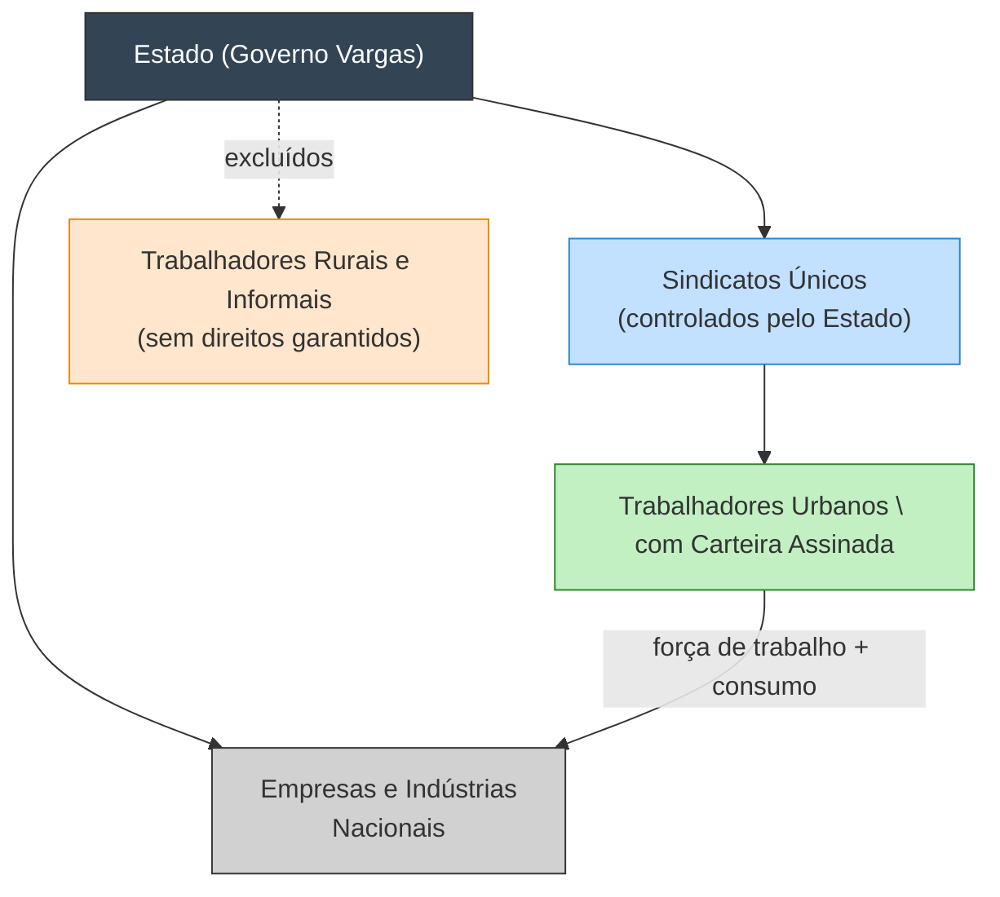

# Industrialização e Legislação Trabalhista na Era Vargas (1930-1945): A Construção do Brasil Urbano-Industrial

A Era Vargas (1930-1945) marcou uma transformação profunda na estrutura socioeconômica brasileira. **Getúlio Vargas** assumiu o poder em 1930 prometendo romper com a velha ordem oligárquica da República Velha e implementar um projeto nacional de desenvolvimento. Duas faces centrais desse projeto foram a **industrialização acelerada** e a criação de uma abrangente **legislação trabalhista** – processos interligados que visavam construir um Brasil urbano-industrial moderno. Nesta nota, analisamos em profundidade como o impulso industrializante varguista e o chamado _trabalhismo_ (as políticas trabalhistas e sindicais) formaram um só esquema estratégico de construção do Estado Novo, combinando modernização econômica com controle social. Veremos as etapas da **industrialização por substituição de importações**, o papel do Estado como empreendedor, a **formação do arcabouço legal trabalhista** (do Ministério do Trabalho à CLT de 1943) e, principalmente, a **articulação entre essas esferas** – mostrando como os direitos trabalhistas foram utilizados como instrumento político-econômico para viabilizar a industrialização, controlar o operariado e **expandir o mercado interno**. Por fim, discutiremos o conceito de **“cidadania regulada”** de Wanderley Guilherme dos Santos, que interpreta a inclusão limitada dos trabalhadores urbanos como estratégia de tutela estatal sobre a sociedade.

## O Projeto de Industrialização Varguista

A chegada de Vargas ao poder coincidiu com a oportunidade – e necessidade – de alterar o modelo econômico brasileiro até então baseado na agroexportação (principalmente do café). A **crise de 1929** desacelerou drasticamente as exportações e reduziu a entrada de produtos manufaturados importados, criando condições para uma industrialização por substituição de importações _involuntária_. De fato, **no início da década de 1930** houve um redirecionamento do capital cafeeiro para atividades industriais, e diversos produtos que antes eram importados passaram a ser fabricados internamente. Esse período viu o número de fábricas multiplicar e o parque industrial diversificar-se, com surgimento de indústrias têxteis, alimentícias, etc. Em outras palavras, a própria conjuntura internacional forçou o Brasil a “olhar para dentro”: _era preciso construir uma economia voltada para dentro do país, com a constituição e ampliação de um mercado interno_.

Contudo, Vargas não se limitou a colher os frutos dessa industrialização espontânea. A partir de meados dos anos 1930, especialmente com o **Estado Novo (1937-1945)**, ele implementou um projeto _deliberado_ de industrialização, com forte **intervenção estatal**. O Estado assumiu papel de _indutor e investidor direto_ no desenvolvimento industrial. Esse modelo, conhecido como **Industrialização por Substituição de Importações (ISI)**, foi elevado à política de governo: _“O desenvolvimento nacional calcado na industrialização”_ tornou-se diretriz, aproveitando-se do contexto externo conturbado (como a Segunda Guerra Mundial) para impulsionar a indústria doméstica. Vargas via a industrialização como sinônimo de soberania e progresso. Em 1941, no discurso de inauguração das obras da Companhia Siderúrgica Nacional (CSN) em Volta Redonda, ele proclamou o fim da era agrário-exportadora: _“O país semicolonial, agrário, importador de manufaturas e exportador de matérias-primas poderá arcar com as responsabilidades de uma vida industrial autônoma”_.

_Vista panorâmica da usina da Companhia Siderúrgica Nacional (CSN) em Volta Redonda (RJ). A construção da CSN durante a Era Vargas simbolizou o esforço de criar indústrias de base nacionais, reduzindo a dependência de importações de aço e impulsionando a industrialização._

### Estado empreendedor e indústrias de base

Para viabilizar esse salto industrial, o Estado Novo atuou como **Estado empreendedor**, criando empresas estatais em setores estratégicos e de base. Diversas **indústrias estatais** nasceram no período, alavancadas por investimentos públicos e acordos diplomáticos. Entre as principais iniciativas destacam-se:

- **Setor siderúrgico:** criação da _Companhia Siderúrgica Nacional (CSN)_ em 1941/42. A CSN foi fruto dos _Acordos de Washington_ firmados com os Estados Unidos durante a Segunda Guerra – Vargas obteve financiamento e tecnologia em troca do fornecimento de matérias-primas para os Aliados. A usina de Volta Redonda, inaugurada em 1946, tornou o Brasil capaz de produzir aço em escala, insumo fundamental para a industrialização pesada.
    
- **Mineração e metais:** criação da _Companhia Vale do Rio Doce (CVRD)_ em 1942, para explorar e exportar minério de ferro de alta qualidade. A Vale (hoje Vale S.A.) viria a ser uma das maiores mineradoras do mundo, garantindo matéria-prima para a siderurgia nacional e divisas para o país.
    
- **Petróleo e energia:** instituiu-se em 1938 o _Conselho Nacional do Petróleo_, passo inicial para a organização da indústria petrolífera (embora a Petrobras só fosse criada em 1953). Em 1939, descobriu-se petróleo na Bahia; também foram criadas empresas como a _Companhia Hidrelétrica do São Francisco (CHESF)_ em 1945, visando geração de energia elétrica – infraestrutura essencial para sustentar o parque fabril nascente.
    
- **Indústria mecânica e de transportes:** criação da _Fábrica Nacional de Motores (FNM)_ em 1940, inicialmente planejada para produzir motores de avião e depois caminhões e tratores. Houve esforços para desenvolver uma indústria aeronáutica nacional, ainda que limitados pelos recursos técnicos da época.
    
- **Outros setores:** fundação da _Companhia Nacional de Álcalis_ (1943) para produção de barrilha (soda), vital para indústrias químicas e de vidro; reestruturação de ferrovias e criação de órgãos de planejamento econômico (como o Conselho Técnico de Economia e Finanças).
    

Em resumo, o governo Vargas **nacionalizou e investiu em setores-chave** que a iniciativa privada considerava de alto custo ou risco. O resultado foi a formação das bases de um Brasil industrial: siderurgia, mineração, energia e infraestrutura de transportes se expandiram com apoio direto do Estado. Essa estratégia se alinhava ao forte **nacionalismo econômico** do Estado Novo, que buscava reduzir a dependência externa e “armar” o país com os meios para o desenvolvimento autônomo. A indústria nascente era protegida por políticas como tarifas alfandegárias e câmbio controlado, ao mesmo tempo em que o governo mantinha controle centralizado sobre investimentos e acordos internacionais (por exemplo, barganhando apoio dos EUA na guerra em troca de recursos industriais).

> [!note] **Industrialização e intervenção estatal**  
> O modelo varguista de industrialização por substituição de importações combinou **iniciativa estatal direta** e mobilização de capitais privados nacionais. Mesmo antigos cafeicultores investiram em fábricas, mas foi a mão firme do Estado – via empresas públicas, planejamento e proteção de mercado – que impulsionou indústrias de base antes inexistentes no Brasil. A forte **coordenação governamental** era vista como necessária para superar o legado da economia colonial exportadora e criar um parque industrial integrado ao projeto de nação. Vargas priorizou setores como aço, energia e petróleo, considerados a "_ponta de lança_" do desenvolvimento, e usou o contexto da guerra a favor do Brasil. Essa industrialização “desde cima” caracterizou uma **modernização conservadora**: mudanças econômicas profundas sem ruptura revolucionária, conduzidas pelo Estado autoritário.

## Legislação Trabalhista e o “Trabalhismo”

Paralelamente ao projeto industrial, o governo Vargas construiu um abrangente arcabouço de **legislação trabalhista**, inaugurando o que se convencionou chamar de _trabalhismo varguista_. Pela primeira vez na história brasileira, o **Estado assumiu a questão social como assunto central** de governo. Vargas buscou integrar a classe trabalhadora urbana ao Estado, concedendo uma série de direitos e garantindo representação oficial – porém sempre sob rígido controle estatal. Esse movimento envolveu tanto **instituições** (ministérios, tribunais) quanto **leis** que moldaram as relações de trabalho e a organização sindical.

### A criação do arcabouço legal trabalhista (1930-1942)

Uma das primeiras medidas de Getúlio ao assumir o Governo Provisório foi instituir mecanismos para tratar da “questão social”. Em **26 de novembro de 1930**, Vargas criou por decreto o **Ministério do Trabalho, Indústria e Comércio (MTIC)**. Como primeiro titular da pasta, nomeou **Lindolfo Collor**, político influenciado pelas doutrinas sociais católicas e pelo corporativismo europeu. O novo ministério – apelidado de “Ministério da Revolução” – tinha a missão de mediar conflitos trabalhistas, elaborar políticas sociais e, fundamentalmente, **enquadrar o movimento operário** dentro da órbita do Estado. Foi criado também o _Departamento Nacional do Trabalho_, encarregado de fiscalizar e fazer cumprir as leis trabalhistas.

Nos anos seguintes, uma série de **decretos** passou a regulamentar diversos aspectos das relações de trabalho, atendendo em parte a reivindicações históricas dos trabalhadores urbanos. Entre as principais medidas e marcos legais do período pré-CLT, destacam-se:

- **Lei de Sindicalização (Decreto nº 19.770, de 1931):** regulamentou a organização dos sindicatos de trabalhadores e empregadores. Adotou-se o princípio da **unicidade sindical** – ou seja, o Estado reconheceria **apenas um sindicato por categoria profissional ou econômica em cada localidade**. Os sindicatos passaram a ser definidos como _“órgãos de cooperação com o poder público”_, em vez de entidades autônomas de luta de classes. O Ministério do Trabalho tinha poder de **conceder ou cassar cartas sindicais**, e funcionários ministeriais podiam acompanhar as assembleias sindicais, efetivamente **controlando a vida sindical**. Essa medida instaurou o **modelo corporativista** no Brasil, inspirado no fascismo italiano: as organizações de trabalhadores ficavam atreladas ao Estado, integradas a uma estrutura na qual se pretendia harmonizar capital e trabalho sob tutela governamental. Em troca do reconhecimento oficial e de alguns benefícios (como imposto sindical compulsório, monopólio da representação), os sindicatos abdicaríam da autonomia e da combatividade. _(Conforme o historiador Boris Fausto, esse decreto de 1931 inseriu os sindicatos em um quadro de colaboração com o Estado, garantindo unidade e controle estatal sobre o movimento operário.)_
    
- **Jornada de trabalho e férias:** Já em 1932, o governo atendeu demandas operárias como a **jornada de 8 horas diárias** e a **semana de 48 horas** (6 dias por semana) para os trabalhadores urbanos. Também introduziu o direito a **férias anuais remuneradas** e o **descanso hebdomadário (domingo)**. Tais medidas, embora nem sempre efetivamente cumpridas de imediato, representaram enormes avanços frente às condições da Primeira República, quando jornadas de 12-15 horas não eram incomuns e não havia descanso legal. Em 1936, por exemplo, foi instituído o descanso semanal remunerado obrigatório.
    
- **Proteção ao trabalho feminino e infantil:** Decretos em 1932-33 proibiram o **trabalho noturno de menores de 18 anos**, vetaram atividades insalubres para mulheres e estabeleceram licença remunerada à gestante (4 semanas antes e depois do parto). A equiparação salarial entre homens e mulheres para trabalho igual também foi preconizada já em 1932 – ao menos na letra da lei.
    
- **Justiça do Trabalho:** embora idealizada desde a Constituição de 1934, a **Justiça do Trabalho** só foi implantada em 1941, como órgão administrativo do poder Executivo (apenas em 1946 passou ao Judiciário). Vargas criou as _Juntas de Conciliação e Julgamento_ e o _Conselho Nacional do Trabalho_ para dirimir conflitos trabalhistas, oferecendo um canal institucional para reclamos dos trabalhadores – ainda que sob controle estatal, evitando que conflitos se politizassem nas ruas.
    
- **Salário mínimo:** em **1º de maio de 1940**, Vargas anunciou a instituição do **salário mínimo** em nível nacional. A política do salário mínimo visava assegurar um patamar básico de remuneração que permitisse a subsistência do trabalhador e sua família. Os valores foram fixados por decreto (variando por regiões do país conforme o custo de vida). Essa medida atendeu reivindicação antiga e tinha também motivação econômica (estímulo ao consumo interno, como veremos adiante).
    

Muitos desses direitos já estavam previstos (ao menos como princípios) na **Constituição de 1934**, a primeira a incluir um capítulo específico sobre a ordem econômica e social. A Carta de 1934 garantiu, por exemplo, a **jornada de 8 horas, o repouso semanal remunerado, o salário mínimo, a proibição do trabalho infantil**, entre outros avanços. No entanto, a implementação dependia de legislação infraconstitucional e da ação do Executivo – papel que Vargas assumiu de forma centralizadora. Vale notar que a Constituição de 1934 também menciona **liberdade sindical** (art. 120), mas na prática essa liberdade foi tolhida pela estrutura corporativa imposta via decretos.

Em **10 de novembro de 1937**, Vargas instituiu uma nova Constituição autocrática (a _Polaca_), extinguindo o regime democrático. A **Constituição de 1937**, inspirada na _Carta del Lavoro_ do fascismo italiano, reforçou a ideologia corporativista: ela **proibiu explicitamente greves e lockouts** em seu artigo 139. A partir daí, a repressão a movimentos autônomos dos trabalhadores se intensificou – especialmente após 1935, quando Vargas usou o temor do comunismo (após a Intentona Comunista) para justificar a ilegalização de sindicatos ligados à esquerda e a prisão ou exílio de lideranças operárias. Com partidos e o Congresso fechados no Estado Novo, Vargas governava por decretos-lei, podendo assim moldar livremente a legislação trabalhista conforme seus objetivos políticos.

### A Consolidação das Leis do Trabalho (CLT) – 1943

> [!important] **A CLT como marco trabalhista**   
> **Consolidação das Leis do Trabalho (CLT)** – Decreto-Lei nº 5.452, de 1º de maio de 1943 – foi o ápice da obra legislativa trabalhista da Era Vargas. A CLT reuniu e sistematizou em um só código **922 artigos** que compilaram todos os direitos, normas e instituições trabalhistas construídos desde 1930. Ela conferiu **amparo legal unificado a direitos antes dispersos**, transformando profundamente as relações de trabalho no Brasil. Por essa realização, Vargas granjeou o título simbólico de _“Pai dos Pobres”_, dada a gratidão propagandeada das classes trabalhadoras beneficiadas.

A **CLT** foi anunciada por Getúlio em grande ato no Dia do Trabalhador de 1943 e entrou em vigor em novembro daquele ano. Ela consolidou direitos fundamentais dos trabalhadores urbanos, como:

- **Limitação da jornada de trabalho** – fixação da jornada máxima de 8 horas diárias e 48 horas semanais, já praticada desde os decretos anteriores.
    
- **Repouso semanal remunerado** – garantia de pelo menos 24 horas de descanso remunerado (preferencialmente aos domingos).
    
- **Férias anuais remuneradas** – direito a 30 dias de férias com remuneração acrescida de um terço do salário (embrião do _terço de férias_).
    
- **Proteção à maternidade** – confirmação do direito a licença-maternidade (na época de 84 dias).
    
- **Estabilidade provisória** – proibição de dispensa da empregada gestante desde a confirmação da gravidez até pelo menos um mês após o parto (também proteção a líderes sindicais e outras categorias específicas).
    
- **Justiça do Trabalho** – regulamentação da estrutura da Justiça do Trabalho, criada em 1941, com suas Juntas de Conciliação e o Tribunal Superior do Trabalho (este último ainda no âmbito do Executivo até 1946).
    
- **Documento de identificação profissional** – tornou **obrigatória a Carteira de Trabalho e Previdência Social (CTPS)** para qualquer relação de emprego. A carteira profissional servia não só para registrar contrato e direitos, mas também como instrumento de controle da força de trabalho.
    
- **Previdência Social** – unificou normas sobre os IAPs (Institutos de Aposentadoria e Pensões) por categoria, embriões do futuro INSS. Garantiu direito à aposentadoria e assistência médica através desses institutos, financiados por contribuições de empregados, empregadores e Estado.
    
- **Outros direitos** – adicional de horas extras (mínimo de 20%), proteção contra acidentes de trabalho, indenização por tempo de serviço (embrião do FGTS), regulamentação do trabalho de menores e mulheres, etc.
    

Em suma, a CLT criou um _estatuto legal do trabalhador brasileiro_, algo inédito em um país que, poucas décadas antes, saíra da escravidão. Muitos direitos que eram apenas **promessas ou reivindicações históricas tornaram-se lei positiva**. Não é exagero qualificá-la como um _“marco civilizatório”_ nas relações trabalhistas do Brasil.

No entanto, a CLT nasceu sob um regime ditatorial e carrega em seu DNA contradições importantes. Como destacou a historiografia, sua elaboração foi motivada por três fatores principais: _(1) o avanço da urbanização e da classe operária urbana; (2) a necessidade de mediar os conflitos entre patrões e empregados num contexto de industrialização; (3) o receio do Estado frente à ascensão de ideologias subversivas (comunismo, anarquismo)_. Assim, a CLT foi ao mesmo tempo uma resposta às **demandas sociais** e um **instrumento político** do Estado Novo. **Vargas reconhecia que, para atrair mão de obra do campo para as cidades industriais, era preciso garantir condições mínimas de trabalho e proteção social** – evitando que a migração resultasse em tensões ingovernáveis. Por outro lado, desejava-se evitar greves e agitações que ameaçassem a estabilidade do regime. Desse equilíbrio entre _ampliar direitos_ e _reforçar o controle_ surgiu a CLT.

Um aspecto crucial é que a CLT consolidou também o **modelo sindical corporativista**. Ela manteve e detalhou dispositivos como a **unicidade sindical**, a **contribuição sindical obrigatória** (um dia de salário anual de cada empregado, recolhido pelo Estado e repassado ao sindicato) e a **proibição de greves** (já vigente desde 1937). Ou seja, ao mesmo tempo em que avançava na garantia de benefícios ao trabalhador, a CLT impunha **limites severos à sua liberdade de organização e expressão coletiva**. Os sindicatos oficiais (organizados por categoria e região) tornaram-se praticamente extensões do Ministério do Trabalho: não podiam filiar-se livremente a centrais independentes, nem realizar greves por demandas fora dos estreitos limites permitidos – sob pena de intervenção estatal. Esse arranjo foi descrito como “**peleguismo**”, referindo-se aos líderes sindicais cooptados pelo governo (_pelego_ era literalmente a manta que amortecia o atrito entre o cavalo e o cavaleiro – metáfora do amortecimento dos conflitos sociais pelo Estado).

Assim, o varguismo estruturou uma forma de **“cidadania pelo alto”**: os direitos sociais eram concedidos _de cima para baixo_, como dádivas do Estado protetor, e não conquistados por plena negociação ou luta autônoma dos trabalhadores. Vargas aparecia como o árbitro paternal entre o capital e o trabalho – papel consolidado em sua figura carismática nos famosos discursos de 1º de Maio, quando anunciava novos benefícios ao “seu povo”.

## A Articulação entre Industrialização e Trabalhismo

Chegamos ao **cerne da análise**: de que modo a política industrial e a política trabalhista de Vargas eram duas faces do _mesmo_ projeto de construção do Estado nacional. Longe de serem iniciativas desconectadas (uma econômica, outra social), elas se **complementavam estrategicamente**. A industrialização acelerada exigia condições sociais e políticas específicas, e a legislação trabalhista/trabalhista serviu a esses fins em múltiplas dimensões. Vamos dissecar três aspectos principais dessa articulação: **(1)** o controle do movimento operário; **(2)** a criação de um mercado interno consumidor; **(3)** o estabelecimento de uma forma peculiar de cidadania condicionada (a _“cidadania regulada”_).

### 1. Controle do movimento operário e paz social para o desenvolvimento

Para industrializar, Vargas precisava de **estabilidade interna** – particularmente nas relações entre capital e trabalho. Greves prolongadas, conflitos classistas ou agitação revolucionária poderiam deter investimentos, desorganizar a produção e ameaçar o próprio governo. Lembremos que, na Primeira República, as movimentações operárias (influenciadas por anarquistas e comunistas) foram tratadas como caso de polícia, sem concessões de direitos. Vargas adotou uma abordagem dupla: _repressão e cooptação_. A legislação trabalhista foi, simultaneamente, **um avanço social e um mecanismo de controle político**.

A **estrutura sindical corporativista** implantada em 1931 e reforçada na CLT foi essencial para esse controle. Ao estabelecer sindicatos únicos supervisionados pelo Estado, Vargas **desarticulou a autonomia do movimento operário**. Sindicatos livres ou paralelos foram proibidos; todas as associações tinham que se **enquadrar** (daí o termo _“sindicatos enquadrados”_, usado na época) no sistema oficial ou seriam dissolvidas. As lideranças sindicais passaram a depender do aval governamental – muitas tornando-se aliadas (os chamados _pelegos_), enquanto opositores eram afastados.

No **Estado Novo**, esse aparato mostrou toda sua força. Sob a retórica de “colaboração entre as classes”, o governo dissolveu sindicatos independentes e **criminalizou greves** (como vimos, banidas pela Constituição de 1937). Em 1935-37, após o levante comunista da ANL, Vargas intensificou a repressão: _“militantes foram presos e torturados, líderes dos trabalhadores expulsos do Brasil, e sindicatos fechados”_. O comunismo foi eleito o inimigo principal, justificando a suspensão de qualquer atividade operária fora do controle estatal. Dessa forma, **garantiu-se a paz social necessária para a industrialização**: nos anos de guerra, por exemplo, praticamente não houve greves significativas no Brasil, ao contrário de muitos países – o operariado brasileiro encontrava-se tutelado e suas demandas canalizadas pelos mecanismos oficiais.

Em troca da disciplina exigida, Vargas ofereceu **benefícios concretos aos trabalhadores**, ganhando sua lealdade. Essa era a barganha implícita do _trabalhismo_: _direitos sociais concedidos em troca de cooperação e apoliticidade_. Vargas cunhou a ideologia de que não havia mais luta de classes, mas sim uma grande família nacional, com ele próprio como **mediador paternal**. O resultado foi a figura do presidente como **“Pai dos Pobres”**, a quem os trabalhadores deviam gratidão pelos novos direitos – enquanto, por baixo, se retirava deles o _direito de fazer pressão_ (através de greves, sindicatos livres, partidos operários). Os sindicatos transformaram-se em **correias de transmissão** da política estatal, mobilizando os trabalhadores nas campanhas nacionalistas e garantindo apoio popular a Vargas, mas **esvaziando qualquer potencial contestatório**.

Esse arranjo reflete o conceito de **“pacto populista-autoritário”** que vários autores atribuem ao varguismo: uma aliança em que as classes populares urbanas recebiam proteção e benefícios do Estado, porém sob liderança incontestada do “grande chefe” e sem verdadeira autonomia política. Wanderley Guilherme dos Santos o interpreta como parte de uma _“modernização conservadora”_, na qual o Brasil se modernizou (industrializou e urbanizou) sem mexer nas estruturas de poder oligárquicas subjacentes. **O operariado urbano foi incorporado como força de trabalho na indústria e como base de apoio do regime, porém sob submissão ao Estado** – que arbitrava os conflitos trabalhistas a seu critério e sufocava qualquer organização não oficial. Em consequência, _“a submissão do operariado à burocracia estatal”_ e a _“irrelevância dos partidos políticos”_ tornaram-se marcas do período, segundo W. G. dos Santos, já que as disputas sociais aconteciam dentro do aparelho de Estado em vez de em arenas democráticas.

Em síntese, **o trabalhismo varguista garantiu a “paz industrial”**. Com trabalhadores controlados e, em certa medida, contentes pelos novos direitos, o governo pôde focar no esforço industrial sem enfrentar maiores insurgências trabalhistas. Esse controle teve um claro propósito econômico e político: _evitar a influência comunista/anarquista e garantir a produtividade das novas fábricas_, ao mesmo tempo em que se legitimava como governo benfeitor. Vargas acreditava estar incluindo os trabalhadores no projeto nacional – mas sempre de forma **“inclusão controlada”**, como ele próprio justificava. Para ele, _ditadura não era o oposto de democracia, pois na sua visão a verdadeira democracia era incluir os trabalhadores, ainda que para isso fosse preciso autoritarismo para “impedir que outros atrapalhassem” seus planos_. Nessa lógica, a repressão aos “discordantes” era não um mal, mas um meio de realizar a justiça social sem caos. A figura emblemática disso é o **Departamento de Imprensa e Propaganda (DIP)**, que glorificava Vargas e sua proteção aos humildes, enquanto ocultava a coerção por trás.

### 2. Criação de um mercado interno consumidor

Um dos efeitos econômicos mais importantes da política trabalhista de Vargas – e certamente intencional – foi **estimular o crescimento do mercado interno**. Para que a industrialização fosse sustentável, o Brasil precisava de consumidores para absorver a produção das novas fábricas. Até então, a base consumidora no país era pequena e concentrada nas elites urbanas, já que a massa da população (rural e trabalhadores urbanos informais) tinha baixíssima renda. **Ao formalizar o emprego urbano e fixar salários mínimos, Vargas ajudou a expandir o poder de consumo dos trabalhadores**, integrando-os progressivamente ao mercado.

A ideia, influenciada por doutrinas do _fordismo_ e do _desenvolvimentismo_, era que **trabalhadores melhor remunerados e protegidos se tornam também consumidores**. Políticas como o salário mínimo, por exemplo, visavam garantir **uma renda estável e suficiente para as necessidades básicas**, o que por sua vez criaria demanda para bens industriais de consumo (alimentos processados, tecidos, vestuário, calçados, móveis, etc.). _“Desenvolver o fator consumo”, antes praticamente inexistente na economia latifundiária, tornou-se parte integrante do projeto nacional_.

A legislação trabalhista desempenhou papel crucial nisso: ao **assegurar um piso salarial legal**, coibir jornadas extenuantes e impor descanso remunerado, ela **efetivamente injetou renda disponível e tempo livre** na classe trabalhadora urbana. O trabalhador com carteira assinada passou a ter um fluxo de renda mais previsível (salário fixo e regular) e algumas garantias que aumentavam sua segurança econômica – por exemplo, o direito à indenização por demissão sem justa causa (introduzido depois, mas já se esboçava o princípio da estabilidade decenal), aposentadoria futura, etc. Isso tornava mais viável que ele se planejasse para consumir bens duráveis ou não apenas de subsistência imediata.

Além disso, **a urbanização** impulsionada pela industrialização significou milhões de pessoas migrando para cidades (particularmente do Nordeste para o Sudeste industrializado), onde inevitavelmente entravam na economia monetária e de mercado. Vargas incentivou essa migração de forma organizada em alguns casos – por exemplo, os “soldados da borracha” e outras frentes – mas principalmente criou condições para que o campo esvaziado pelo declínio das oligarquias exportadoras mandasse contingentes ao mercado de trabalho urbano. Ao chegar nas cidades, esses migrantes encontravam, graças à CLT, **um Estado que lhes oferecia proteção social básica** (ao menos no discurso e na lei), diferente do abandono que tinham no meio rural.

É importante frisar que a **legislação trabalhista de Vargas excluía os trabalhadores rurais** – estes só seriam contemplados muito mais tarde, na década de 1960. Isso significa que os benefícios em consumo e direitos concentraram-se nos trabalhadores **urbanos formais**. Em 1940, a população brasileira ainda era majoritariamente rural; assim, a expansão do mercado consumidor interno ocorreu gradualmente à medida que a urbanização progrediu e mais pessoas passaram a ter empregos formais nas cidades. Ainda assim, já nos anos 1940 o Brasil viu o surgimento de um **proletariado urbano** que, mesmo modesto em renda, constituía uma massa de consumidores de baixo custo. Empresas nacionais começaram a produzir bens de consumo populares para esse novo público (por exemplo, tecidos baratos para roupas prontas em vez de importação, alimentos industrializados acessíveis, etc.).

Os formuladores entendiam essa lógica. _Descobriu-se a correlação entre “justiça social” e formação de mercado interno_ – nas palavras de um relatório da época, citado por Oliveira Vianna, **garantir direitos ao trabalhador não era apenas caridade, mas uma estratégia de desenvolvimento econômico**. Vargas, ainda que não economista, percebia intuitivamente que **trabalho protegido era também estímulo ao crescimento**. Na justificativa do salário mínimo, por exemplo, seus assessores destacavam que além de proteger o trabalhador, essa medida **ativaria a demanda interna e abriria oportunidades para a indústria nascente**.

Um trecho elucidativo: _“Era preciso diversificar a economia e criar formas de produção vinculadas ao consumo interno... constatou-se que o Brasil já podia se projetar para a constituição e ampliação de um mercado interno, isto é, desenvolvimento do fator consumo... É principalmente dessa necessidade de desenvolver o consumo que o Direito do Trabalho se apresenta como um dos principais caminhos de solução. O Estado passa a ser chamado a... proporcionar ao trabalhador maior estabilidade e, portanto, maior possibilidade de consumir os bens que deveriam circular internamente no mercado nacional”_. Ou seja, **as leis trabalhistas foram vistas como ferramenta para “nacionalizar” o mercado consumidor**, integrando as massas ao circuito econômico moderno.

Em números, o impacto foi significativo: já em 1940, foram fixados 14 valores regionais de salário mínimo, e em 1943 cerca de 1 milhão de carteiras de trabalho haviam sido emitidas (com Vargas simbolicamente portando a Carteira nº 000001). Cada carteira assinada representava um novo consumidor com algum poder de compra assegurado. Esse processo plantou as sementes do que, nas décadas seguintes, seria o mercado de massas brasileiro.

Concomitantemente, a ampliação do mercado interno fechava um **círculo virtuoso** desejado pelo varguismo: fortalecia a indústria nacional (que vendia mais), gerava mais empregos, aumentava arrecadação do Estado (via impostos e contribuições), o que permitia mais investimentos públicos e sociais. Assim, trabalhismo e desenvolvimento econômico retroalimentavam-se.

Por fim, não se pode esquecer o elemento **político**: ao melhorar as condições materiais de parte dos trabalhadores, Vargas conquistava sua _lealdade_. Milhares de famílias urbanas passaram a relacionar suas conquistas (descanso semanal, férias pagas, salário digno) diretamente à figura de Getúlio. Isso criava uma base social de apoio ao regime e, mais tarde, ao próprio retorno de Vargas em 1951 pelo voto popular. O mercado interno criado não era apenas econômico, mas também um **colchão de legitimidade política**: trabalhadores-consumidores satisfeitos tendem a respaldar a ordem vigente.

Em suma, **a legislação trabalhista varguista ajudou a formar o Brasil como sociedade de consumo de massas (ainda embrionária nos anos 1940)**. Ao promover a inclusão econômica do operário urbano, Vargas atacou estruturalmente o caráter agrário-exportador excludente herdado da República Velha. Isso foi peça-chave na transição para um país urbano-industrial: não basta ter fábricas; é preciso ter quem compre os produtos. O trabalhismo deu esse passo, **construindo a figura do trabalhador-cidadão-consumidor** no imaginário brasileiro.

### 3. “Cidadania Regulada”: direitos condicionados e tutela estatal

Apesar de todos os avanços, os direitos trabalhistas na Era Vargas não foram universais nem incondicionais. Pelo contrário, estavam **vinculados à inserção do indivíduo em determinada categoria laboral reconhecida pelo Estado**. Esse fenômeno foi conceituado pelo cientista político **Wanderley Guilherme dos Santos** como _“cidadania regulada”_. Em sua obra _Cidadania e Justiça_ (1979), W. G. Santos argumenta que, a partir da Revolução de 1930, o Brasil inaugurou um modelo peculiar de cidadania, no qual os direitos não emanavam de valores políticos universais, e sim da posição ocupada pelo indivíduo na estrutura ocupacional definida legalmente.

> [!definition] **Cidadania regulada** (W. G. dos Santos)  
> _“Por cidadania regulada entendo o conceito de cidadania cujas raízes encontram-se, não em um código de valores políticos, mas em um sistema de estratificação ocupacional, e que, ademais, tal sistema de estratificação ocupacional é definido por norma legal. Em outras palavras, são **cidadãos todos aqueles membros da comunidade que se encontram localizados em qualquer uma das ocupações reconhecidas e definidas em lei**.”_ (Santos, 1979, p.75).

Em termos práticos, durante a Era Vargas **era cidadão (pleno de direitos sociais)** aquele trabalhador _com carteira assinada_, pertencente a uma categoria formal e urbana reconhecida pelas leis trabalhistas. Quem estivesse **fora desse marco legal – desempregados, trabalhadores informais, empregados domésticos, camponeses – ficava à margem da cidadania**. Os direitos e benefícios criados premiavam _“aqueles segmentos inseridos na ordem regulada, por meio de incentivos e benefícios sociais, punindo, ao mesmo tempo, aqueles trabalhadores e organizações sindicais não regularizados e não inseridos no novo marco institucional”_. Em outras palavras, se você estava dentro do sistema (empregado formal em empresa urbana, filiado ao sindicato oficial da categoria), tinha proteção do Estado; se estava fora, permanecia desprotegido e, pior, via-se impedido de organizar-se de forma autônoma (pois sindicatos “paralelos” não eram permitidos).

Essa cidadania parcial criou uma sociedade dual. **Trabalhadores urbanos formais desfrutavam de direitos sociais inéditos**, enquanto **trabalhadores rurais e informais permaneceram cidadãos de segunda classe** – Wanderley os chama de _“pré-cidadãos”_. Os camponeses, por exemplo, só viriam a ter salário mínimo e direito à sindicalização rural nos anos 1960 (Estatuto do Trabalhador Rural, 1963). Até lá, _70% ou mais da força de trabalho brasileira não se enquadrava na “cidadania regulada” e, portanto, não gozava das proteções varguistas_. Isso significava que enormes contingentes ficaram dependentes do favor político local ou da mera sobrevivência à margem da lei, o que reforçou desigualdades regionais e sociais.

Do ponto de vista do Estado Novo, essa **restrição foi deliberada**. Manter os direitos atrelados à condição de trabalhador formal urbano servia a dois propósitos:

- **Concentrar esforços na classe operária industrial**, que era vista como estratégica para o projeto de modernização. Era nessa classe que Vargas queria incutir lealdade e que precisava estar pacificada para produzir. Já a massa rural, dispersa pelo interior, não era então considerada motor do desenvolvimento – e estendê-los direitos poderia desagradar às oligarquias agrárias, cujo apoio Vargas também cortejava. Assim, optou-se por uma _expansão seletiva da cidadania_.
    
- **Reforçar o poder de tutela do Estado**: se o trabalhador sabia que seus direitos provinham diretamente da **graça estatal** (e não de conquistas autônomas ou universais), ele tenderia a adotar uma postura de **submissão e gratidão perante o Estado**. Isso gerava o que Santos chamou de _“comportamento de submissão política ante o Estado”_. Os cidadãos regulados viam no Governo o benfeitor a quem deviam fidelidade, ao mesmo tempo em que não ousavam desafiar o Estado, sob risco de perderem seus privilégios. Afinal, esses direitos não eram naturais ou inalienáveis; podiam ser suspensos se o indivíduo “saísse da linha” (por exemplo, envolvesse-se em ativismo não autorizado).
    

A _cidadania regulada_ consolidou-se através de instituições como a **Previdência Social contributiva**. Benefícios previdenciários (aposentadorias, pensões, assistência médica) foram vinculados às contribuições feitas via emprego formal. Isso fez com que trabalhadores com melhores salários e registro formal acumulassem mais benefícios, enquanto os de renda baixa (ou informais) ficavam sem nada – **“quem era mais bem remunerado, tinha mais benefícios”** e quem não contribuía, ficava excluído. Assim, a proteção social varguista espelhou e até aprofundou a estratificação do mercado de trabalho: consolidou uma **aristocracia operária** com direitos garantidos versus um exército de pobres sem cobertura. Aqueles de fora do sistema acabavam muitas vezes recorrendo a favores e clientelismo político para conseguir algum amparo, o que reforçava o poder dos governantes.

Em nível macro, a cidadania regulada representou uma forma de **associação entre política social e autoritarismo** bastante singular. _“Como parte de uma estratégia política, o regime repetia a política do Estado Novo de conceder direitos sociais como compensação pela restrição dos direitos políticos e como meio de aquiescência das massas”_. Ou seja, o Estado Novo trocou participação política por benefícios sociais: o povo perdia voz, mas ganhava proteção (alguns). Essa lógica persistiu até mesmo durante o regime militar de 1964, indicando que o padrão instituído nos anos 30 teve longa duração na cultura política brasileira.

Importante destacar que essa cidadania regulada **não significou imobilismo completo**. Pelo contrário, Wanderley G. dos Santos reconhece que, mesmo com seus limites, o varguismo _“resolveu quase ao mesmo tempo dois dilemas fundamentais da ordem social moderna: a redistribuição de riqueza e a ampliação da participação política” – ainda que de forma peculiar_. Ao dar direitos sociais antes de direitos políticos, o Brasil seguiu um caminho inverso ao das democracias liberais clássicas. Isso teve **consequências ambíguas**: se por um lado estabilizou o país (evitando conflitos revolucionários através de concessões sociais), por outro _dificultou o desenvolvimento de uma cidadania plena e de instituições democráticas sólidas_. Como apontado, a ausência de canais políticos genuínos (partidos, sindicatos livres) retirou dos trabalhadores a prática da participação, que é essencial para a consolidação democrática.

A longo prazo, no entanto, a incorporação (mesmo regulada) de setores antes marginalizados criou **novos atores sociais**. Quando a democracia voltou após 1945, muitos trabalhadores já tinham consciência de seus direitos sociais e passaram a reivindicar também direitos políticos. A **ideologia trabalhista** varguista influenciou a formação de partidos como o PTB (fundado por Getúlio em 1945), que defendiam a continuidade e ampliação da legislação social. Embora pensada para conservar o controle, a cidadania regulada acabou por _fomentar expectativas de cidadania mais ampla_, o que nos anos posteriores alimentou lutas pela extensão de direitos aos trabalhadores rurais, pelo fim do autoritarismo sindical, etc.

Em resumo, **industrialização e legislação trabalhista andaram juntas como projeto de Estado** na Era Vargas. A primeira não teria avançado sem a estabilidade e o apoio proporcionados pela segunda; e a segunda talvez não existisse sem a visão de desenvolvimento econômico que a justificasse. A Era Vargas edificou o Brasil urbano-industrial com uma mão de ferro na política e outra estendida em proteção social. Essa dualidade legou ao país tanto a base industrial e os direitos do trabalho – marcos positivos – quanto uma tradição de centralização autoritária e cidadania limitada que ainda reverbera em nossa cultura política. Compreender essa articulação é fundamental para interpretar não apenas aquele período, mas os caminhos do desenvolvimento brasileiro no século XX.

> [!question] **Questões para autoavaliação**
> 
> 1. _Explique como a estrutura de **sindicatos corporativistas** criada na Era Vargas contribuiu para a política de industrialização. Qual era o objetivo do governo ao controlar estreitamente o movimento operário?_
>     
> 2. _Analise o papel da **legislação trabalhista varguista** na formação do mercado interno brasileiro. De que maneira direitos como o salário mínimo e a carteira de trabalho influenciaram o desenvolvimento econômico do país?_
>     
> 3. _O que significa **“cidadania regulada”** no contexto da Era Vargas? Como esse conceito reflete as ambiguidades do projeto varguista de conceder direitos sociais sob um regime autoritário?_
>     

