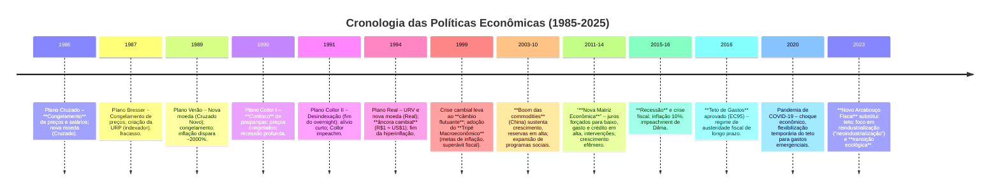

# As Transformações da Economia Brasileira na Nova República (1985-2025): Da Hiperinflação à Busca por um Novo Modelo de Desenvolvimento

A trajetória econômica do Brasil desde a redemocratização em 1985 até meados de 2025 é marcada por sucessivas transformações de paradigma. O país passou de um cenário de **crise crônica e hiperinflação** nos anos 1980 para a estabilização monetária nos anos 1990, adotou um arranjo macroeconômico ortodoxo que surfou o **boom das commodities** nos anos 2000, e posteriormente enfrentou a **ruptura desse modelo** no início dos anos 2010. Atualmente, o Brasil busca um **novo modelo de desenvolvimento**, equilibrando responsabilidade fiscal com políticas de reindustrialização e transição ecológica. Abaixo, examinamos criticamente cada fase desse processo histórico, destacando as lógicas das políticas adotadas, seus resultados e seus custos.

## 1. Herança da “Década Perdida” e a Luta contra a Hiperinflação (1985-1994)

A década de 1980 ficou conhecida no Brasil como “década perdida” devido à estagnação econômica e inflação fora de controle. Com o esgotamento do modelo de desenvolvimento da ditadura militar – baseado em endividamento externo nos anos 1970 – o país entrou os anos 80 em crise da dívida, forçado a adotar austeridade e incapaz de honrar pagamentos. A inflação anual ultrapassou **três dígitos** durante toda a década, evoluindo para um quadro de **hiperinflação** no final dos anos 80: em **1989**, a inflação chegou a cerca de 1.972% no ano, e nos primeiros meses de **1990** alcançou impressionantes **70-80% ao mês**. Esse ambiente de inflação fora de controle corroía salários, inviabilizava investimentos e alimentava profundas tensões sociais. Combatê-lo tornou-se prioridade absoluta dos governos da Nova República, começando com José Sarney (1985-1990).

Diante do colapso inflacionário, foram tentados **sucessivos planos heterodoxos de estabilização** entre 1986 e 1991. Esses planos buscavam **“choques” econômicos** para quebrar a inércia inflacionária, combinando **congelamento de preços e salários**, **trocas de moeda** e mecanismos diversos de desindexação. No entanto, todos falharam em debelar de forma duradoura a inflação, pelas razões que destacaremos. Os principais planos do período foram:

- **Plano Cruzado (fevereiro/1986, Sarney)** – Congelou preços e salários (instituiu o “*gatilho salarial*” para reajustes quando a inflação acumulada chegasse a 20% ao mês) e lançou uma nova moeda, o Cruzado, cortando três zeros do cruzeiro. Houve inicial euforia: a inflação caiu e o poder de compra aumentou brevemente. Contudo, com preços fixos e custos subindo, logo surgiram **desequilíbrios de preços relativos**, desabastecimento de produtos e “águas de panela vazia” nas prateleiras. O congelamento se tornou insustentável: a inflação represada explodiu mais adiante, anulando os ganhos iniciais. O Cruzado fracassou de forma evidente após as eleições de 1986, quando preços administrados foram reajustados e a inflação voltou em força, levando inclusive o Brasil a declarar moratória da dívida externa em fevereiro de 1987.
    
- **Plano Bresser (junho/1987, Sarney)** – Novo congelamento de preços, agora eliminando o gatilho salarial, e criação de um indexador (*URP – Unidade de Referência de Preços*) para ajustes salariais. O plano trouxe apenas alívio temporário: a inflação arrefeceu por poucos meses, mas _“congelamento de preços não funcionou”_ e logo os preços dispararam novamente. Analistas apontam que o plano falhou por não atacar a origem fiscal da inflação e pela própria **moratória externa de 1987**, que impedia ajustes cambiais necessários – com o câmbio fixo (devido à moratória), a inflação continuou alimentada pela desvalorização paralela da moeda.
    
- **Plano Verão (janeiro/1989, Sarney)** – Nova reforma monetária: trocou-se o Cruzado pelo **Cruzado Novo** (corte de mais três zeros) e retomou-se o congelamento generalizado de preços. A URP e outros indexadores foram abolidos, tentando “reiniciar” a economia. Outra vez houve alívio efêmero, seguido por **retorno violento da inflação**, que atingiu quase 2.000% naquele ano. Em essência, o Plano Verão repetiu ferramentas já utilizadas, sem resolver o desequilíbrio fiscal subjacente ou a inércia indexada – daí seu fracasso semelhante aos anteriores.
    
- **Plano Collor I (março/1990, Collor)** – No início do governo Fernando Collor, optou-se por uma medida drástica: o **confisco de grande parte da liquidez**. O plano _congelou_ e bloqueou por 18 meses todos os saldos de poupança e depósitos à vista acima de um limite, retirando dinheiro em circulação. A moeda voltou a se chamar cruzeiro. Além disso, congelaram-se novamente preços e salários. O choque contracionista produziu uma **forte recessão**, mas nem assim conseguiu domar a inflação por muito tempo.
    
- **Plano Collor II (janeiro/1991, Collor)** – Complementou o anterior, focando em eliminar os resquícios de indexação diária: extinguiu as contas remuneradas pelo overnight (muito usadas para proteção contra inflação) e criou a **Taxa Referencial (TR)** como nova taxa básica. Houve também nova tentativa de desindexar contratos. Apesar de uma breve desaceleração inflacionária, a estabilidade não se sustentou. A essa altura, a **instabilidade política** agravou a econômica: Collor viu-se envolvido em escândalos de corrupção e acabou **impeachment em 1992**. Seu sucessor, Itamar Franco, ainda enfrentou inflação alta (próxima de 30% ao mês em meados de 1993) e promoveu **nova troca da moeda** (do cruzeiro para o cruzeiro real, em 1993) enquanto arquitetava-se um plano definitivo.
    

> [!note] **Fracassos dos Planos Heterodoxos:** Em retrospecto, a sucessão de planos dos anos 80/início dos 90 falhou por **ignorar causas estruturais** da inflação e usar instrumentos inadequados. A maioria apostou em congelamentos abruptos e choques heterodoxos, sem assegurar o ajuste fiscal nem ancorar expectativas de forma crível. Como resumiu o economista José Luís Oreiro, _“o fracasso dos planos se deu na escolha inadequada dos instrumentos utilizados para estabilização”_ – ou seja, resolver sintomas (preços) em vez das causas (déficit público, indexação generalizada, desequilíbrio externo). Assim, a hiperinflação persistiu e até se agravou. No início de **1994**, após quase uma década de tentativas frustradas, o Brasil acumulava enorme distorção econômica e uma população desacreditada de planos econômicos milagrosos.

No contexto de esgotamento total da capacidade de convivência com a inflação (com memória recente de **80% ao mês** e colapso econômico em 1990), criou-se terreno político para medidas mais abrangentes. A estabilização sustentável viria apenas com uma **estratégia diferente**, concebida em 1993-94 no governo Itamar Franco sob liderança do então ministro da Fazenda, Fernando Henrique Cardoso. Essa estratégia, o **Plano Real**, rompeu com a lógica heterodoxa imediatista e lançou bases mais sólidas para debelar o _dragão inflacionário_ de vez.

## 2. A Virada Liberal e a Estabilização com o Plano Real (1990-1998)

Paralelamente à luta contra a inflação, o Brasil do início dos anos 1990 viveu uma **profunda inflexão de modelo econômico**, alinhando-se às tendências liberais globais pós-Guerra Fria. O governo Collor (1990-1992) marcou essa **virada liberal** ao desmontar pilares do antigo modelo de substituição de importações: promoveu uma **abertura comercial acelerada** (redução drástica de tarifas e barreiras de importação) e iniciou um programa de **privatizações** de empresas estatais. A economia brasileira, antes uma das mais fechadas do mundo, expôs-se à concorrência externa para forçar a modernização industrial. Collor justificava essas medidas como necessárias para combater o _“atraso tecnológico”_ gerado por décadas de protecionismo e integrar o Brasil à nova ordem global. Também houve liberalização financeira e eliminação de controles cambiais, facilitando fluxos de capital. Essas reformas romperam com paradigmas vigentes desde o pós-guerra, trazendo ganhos de eficiência, mas também impacto social imediato: setores industriais não competitivos sucumbiram e o desemprego urbano aumentou. A combinação de arrocho monetário para segurar preços e abertura das importações contribuiu para **recessão em 1990-92** e alimentou insatisfação popular. Collor acabou impedido em 1992 por razões político-corruptivas, mas o **rumo liberalizante** persistiu nos governos seguintes.

### O Plano Real (1994): âncora cambial e fim da inflação

Foi neste contexto de abertura econômica e necessidade de estabilidade que se implementou o **Plano Real**, lançado em etapas a partir de meados de 1993 e culminando em julho de 1994 com a introdução do **real** como nova moeda. O Plano Real diferenciou-se dos anteriores por sua estratégia técnica e gradual de ataque à inflação inercial. Em primeiro lugar, criou-se uma unidade de conta indexada, a **URV (Unidade Real de Valor)**, que funcionou como “moeda virtual” transitória. Durante alguns meses, preços e salários foram convertidos e expressos em URV, que era diariamente reajustada pela inflação, enquanto a moeda vigente (cruzeiro real) continuava sofrendo a erosão inflacionária. Esse mecanismo deu tempo para agentes econômicos adaptarem preços relativos ao nível de equilíbrio, **sem congelamento brusco**, e preparou a conversão final para a nova moeda real na paridade desejada.

Em **1º de julho de 1994**, entrou em circulação o **Real (R$)**, com **paridade próxima de 1 para 1 em relação ao dólar** americano. Aqui residiu a principal âncora do plano: o governo **fixou uma taxa de câmbio valorizada** para o real e comprometeu-se a mantê-la, intervindo no mercado se necessário. Na prática, adotou-se um **regime de banda cambial**, em que o Banco Central vendia dólares das reservas para segurar o valor do real dentro de um patamar alvo. Ao mesmo tempo, a política monetária foi ajustada para **taxas de juros altíssimas**, justamente para atrair capitais estrangeiros em volume suficiente que financiassem aquele câmbio semi-fixo e equilibrassem o balanço de pagamentos. Em outras palavras, o Plano Real utilizou o câmbio como âncora nominal: ao tornar o real forte frente ao dólar (inicialmente _US$1 ≈ R$1_), os produtos importados ficaram baratos, forçando a concorrência a derrubar os preços internos e quebrando a espiral de remarcações. Com a abertura comercial já em curso, a enxurrada de importados de baixo preço ajudou a _“forçar uma baixa de preços no Brasil para desacelerar a inflação”_.

Concomitantemente, o Plano Real incluiu medidas de ajuste fiscal e monetário ortodoxo: controle de emissão de moeda, corte de gastos e aumento de impostos (houve, por exemplo, criação da **CPMF** e outros tributos emergenciais) para sinalizar **responsabilidade fiscal** e desindexação ampla de contratos. O pacote completo restaurou a confiança: a inflação **despencou** de cerca de 50% ao mês (junho/94) para menos de 2% ao mês no segundo semestre de 1994 – e continuou caindo até atingir patamares inferiores a 10% ao ano em 1996-97. Foi uma vitória histórica: _“o período de hiperinflação foi resolvido após a implantação do Plano Real”_, resultado da separação das funções da moeda via URV e da âncora cambial que estabilizou preços. Pela primeira vez em mais de 15 anos, os brasileiros voltaram a ter uma moeda confiável e previsível no dia a dia. A estabilização trouxe ganhos sociais palpáveis, com recuperação do salário real e alívio para os mais pobres – o fim da inflação crônica removeu um dos motores da desigualdade, já que a inflação punha pesada carga sobre os salários e a renda fixa.

> [!important] **Custos do Plano Real:** Embora indiscutivelmente bem-sucedido em domar a inflação, o Plano Real cobrou **custos econômicos de longo prazo**. A manutenção da âncora cambial exigiu juros internos estratosféricos (a taxa básica _Selic_ chegou a **45% ao ano** em 1995) para atrair capitais e defender o real. Essa combinação de **câmbio sobrevalorizado e juros altos** teve efeitos colaterais severos sobre a indústria nacional e o crescimento. Produtos importados baratos invadiram o mercado interno, enquanto o crédito caro sufocou investimentos – resultando numa “**falência da indústria nacional**” em diversos setores, incapazes de competir ou financiar-se. Nos anos imediatamente pós-Real, o país enfrentou **déficits comerciais sucessivos** e perda de participação de manufaturados nas exportações, configurando um processo de **desindustrialização** que se arrastaria pelas décadas seguintes. De fato, o PIB industrial estagnou e o PIB total cresceu em média apenas ~2,4% ao ano entre 1991 e 1999, pese a estabilidade de preços. O setor manufatureiro, já sofrendo com o “custo Brasil” (infraestrutura deficiente, alta carga tributária), viu-se ainda mais pressionado pela abertura e câmbio apreciado – _“a indústria foi para o chão”_, nas palavras de um ex-presidente da CNI. Além disso, o governo precisou **endividar-se** para sustentar o plano: a dívida pública líquida cresceu cerca de _40% do PIB entre 1994 e 1998_, reflexo dos juros reais altíssimos pagos aos credores internos e externos. A situação tornou-se crítica quando, na esteira de crises financeiras internacionais (México 1994, Ásia 1997, Rússia 1998), investidores passaram a duvidar da capacidade do Brasil manter a paridade cambial. Sob forte ataque especulativo e fuga de capitais em **1998**, o governo FHC teve de recorrer a um **empréstimo de ~US$41 bilhões do FMI** para reforçar as reservas e tentar evitar o colapso do real durante a campanha à reeleição. Essa defesa custosa apenas adiou o inevitável: em janeiro de **1999**, poucos meses após FHC ser reeleito, a pressão tornou-se insustentável e o Brasil **abandonou a âncora cambial**, deixando o real flutuar. O câmbio disparou (o dólar dobrou de valor em relação ao real em semanas), marcando o **fim do Plano Real em sua configuração original**.

Em resumo, o período 1990-1998 consolidou no Brasil uma agenda de reformas liberalizantes – abertura comercial, privatizações, desregulamentação – e alcançou o feito crucial de estabilizar a moeda com o Plano Real em 1994. Este reorganizou a economia, debelou a hiperinflação e lançou fundamentos para modernização. Contudo, essa estabilização foi acompanhada de **vulnerabilidades macroeconômicas** (como a dependência de capitais voláteis e aumento da dívida) e **contradições no desenvolvimento** (desindustrialização e desemprego em certos segmentos). O colapso do regime cambial em 1999 evidenciou a necessidade de um novo arcabouço de política econômica para garantir a estabilidade conquistada sem incorrer em desequilíbrios insustentáveis.

## 3. A Consolidação do “Tripé Macroeconômico” e o “Boom das Commodities” (1999 ~ 2010)

Com a crise cambial de janeiro de 1999, o Brasil foi compelido a reprojetar sua estratégia econômica. O segundo mandato de FHC iniciou implementando o chamado **“tripé macroeconômico”** – um novo modelo de políticas **monetária, fiscal e cambial** destinado a garantir estabilidade sem câmbio fixo. Os três pilares desse tripé, anunciados em 1999, foram: **câmbio flutuante**, **metas de inflação** e **metas de superávit primário (responsabilidade fiscal)**. Em regime de câmbio flutuante, o valor do real passou a ser determinado livremente pelo mercado, eliminando a necessidade de o Banco Central gastar reservas para controlar a cotação. Para ancorar as expectativas de inflação (antes ancoradas pelo dólar), adotou-se formalmente em junho/1999 o **regime de metas de inflação**: o Conselho Monetário Nacional fixaria uma meta anual de inflação a ser perseguida, cabendo ao Banco Central calibrar a taxa de juros (_Selic_) para atingi-la. Por fim, para assegurar solvência das contas públicas e reduzir a relação dívida/PIB – que beirava 50-60% – instituiu-se uma política fiscal rígida, com metas de **superávit primário** anuais. Em 2000 foi aprovada a **Lei de Responsabilidade Fiscal**, consolidando esse compromisso em lei. Este arranjo – _“metas de inflação, câmbio flutuante e austeridade fiscal”_ – formou a espinha dorsal da política econômica do Brasil por aproximadamente duas décadas.

> [!definition] **Tripé Macroeconômico (1999)**: Conjunto integrado de três regras macroeconômicas adotadas a partir de 1999, visando manter a estabilidade conquistada pelo Plano Real. Os pilares são: **(1)** regime de **câmbio flutuante**, permitindo que o real se valorize ou deprecie conforme o mercado, funcionando como amortecedor externo; **(2)** **metas formais de inflação**, com um Banco Central operacionalmente autônomo ajustando os juros para cumprir a meta e segurar os preços; **(3)** **responsabilidade fiscal**, perseguindo **superávits primários** (ou equilíbrio) no orçamento público para controlar a dívida. Esse tripé busca equilibrar o chamado “**trilema**” macroeconômico, garantindo ao mesmo tempo inflação baixa, contas externas viáveis e sustentabilidade das contas públicas.

Nos anos 2000, o tripé macroeconômico trouxe credibilidade internacional e domesticação da inflação, mas sua eficácia prática foi amplificada por um contexto externo extremamente favorável: o **boom das commodities**. A partir de aproximadamente 2003, a rápida expansão da China e de outros mercados emergentes provocou um **superciclo de alta nos preços de commodities** agrícolas, minerais e energéticas. Como grande exportador de produtos básicos (soja, minério de ferro, petróleo, carne, açúcar, etc.), o Brasil foi diretamente beneficiado. A balança comercial, deficitária nos anos 90, entrou em sucessivos **superávits**; dólares fluíam tanto via comércio quanto via investimentos. O **período de bonança externa** lembrava o “milagre” do início dos anos 70, desta vez movido a commodities: de 2003 a 2007 o PIB brasileiro cresceu em média 4-5% ao ano, acima do padrão das duas décadas anteriores. As **reservas internacionais** do país saltaram – de apenas US$ 37 bilhões em 2002 para mais de US$ 200 bilhões ao final de 2008 – tornando o Brasil credor externo líquido e fortalecendo a capacidade de resistir a choques. Esse cenário permitiu ao governo Lula (2003-2010) combinar **estabilidade macroeconômica com inclusão social**: a disciplina do tripé foi mantida (metas de inflação cumpridas, superávits primários robustos usados para abater dívida) ao mesmo tempo em que se ampliaram **gastos sociais e investimentos públicos**. Programas como o **Bolsa Família** (lançado em 2003) e políticas de aumento real do salário mínimo foram financiados em parte pelos dividendos do crescimento e da arrecadação crescente proporcionada pelo boom. O resultado foi uma **queda significativa da pobreza e da desigualdade** ao longo dos anos 2000. Pela primeira vez, o país experimentava simultaneamente inflação baixa, contas externas equilibradas (até **recordes de superávit comercial** em meados dos anos 2000) e melhoria na distribuição de renda.

Analistas destacam que _“o sucesso econômico do Brasil durante os dois primeiros mandatos de Lula (2003-2010) foi parcialmente ancorado num boom de commodities”_ – ou seja, a conjuntura internacional favorável potencializou o modelo doméstico. De fato, o governo aproveitou esses ganhos para quitar antecipadamente a dívida com o FMI em 2005 e obter o **grau de investimento** para o Brasil em 2008. Mesmo a **Crise Financeira Global de 2008** teve impacto ameno e temporário sobre a economia brasileira, que caiu em 2009 mas retomou forte crescimento em 2010, graças à solidez construída e à alta dos preços de exportação (a cotação do minério de ferro, por exemplo, atingiu pico histórico em 2010-11).

Entretanto, apesar dos avanços, **desafios estruturais** permaneceram ou emergiram nesse período. Um dos efeitos colaterais do boom de commodities foi a persistência da **desindustrialização**. A abundância de dólares e a apreciação do real que acompanhou o ciclo externo tornaram os produtos estrangeiros ainda mais baratos, prejudicando a competitividade da indústria local – fenômeno conhecido como _doença holandesa_. A participação da manufatura no PIB brasileiro caiu continuamente (de ~25% nos anos 1980 para cerca de 15% em 2010). Enquanto _“o país se tornou um dos maiores produtores mundiais de alimentos, a indústria tradicional entrou em profundo declínio”_. Em outras palavras, o Brasil viu sua pauta de exportações se **reprimarizar** (concentrar em básicos), perdendo terreno em setores de maior valor agregado. Ademais, o próprio tripé macroeconômico não esteve isento de críticas: para cumprir as metas de inflação com choques de oferta negativos (como alta de commodities) o Banco Central muitas vezes manteve juros elevados, e a política fiscal austera limitava investimentos públicos – fatores que alguns argumentam ter mantido o crescimento aquém do potencial. Ainda assim, o consenso à época era de que o arcabouço vigente trazia um equilíbrio razoável entre estabilidade e crescimento, dentro das limitações estruturais. O período até 2010 foi marcado por otimismo – sintetizado na sigla BRICS – de que o Brasil finalmente ingressara num ciclo virtuoso de desenvolvimento.

Essa percepção começou a mudar na virada da década. Por volta de **2011-2012**, o cenário externo deixou de ser tão benigno: o boom das commodities arrefeceu (preços do petróleo e minério caindo após 2011, e principalmente após 2014) e o crescimento chinês desacelerando. Internamente, a inflação brasileira voltara a rondar o teto da meta (próximo de 6-7% a.a.), enquanto o PIB de **2012** cresceu somente 1% – sinalizando esgotamento do modelo de consumo. Foi nesse contexto que o governo brasileiro tentou uma **guinada na política econômica**, abandonando parcialmente o tripé.

## 4. A Crise do Modelo e a Busca por Novos Rumos (2011 – Presente)

Com a posse de Dilma Rousseff em 2011, houve a implementação de um conjunto de políticas econômicas heterodoxas que ficou conhecido como **“Nova Matriz Econômica” (NME)**. Essa nova estratégia partia da leitura de que o tripé macroeconômico, se por um lado estabilizara a economia, por outro havia limitado o crescimento e desestimulado a indústria. A proposta da Nova Matriz era promover um **revigoramento do desenvolvimento**, com o **Estado atuando mais ativamente** para estimular a demanda, o investimento e a competitividade industrial. Na prática, isso se traduziu em uma combinação de políticas adotadas a partir de 2011-2012 que incluíam: **afrouxamento monetário** deliberado, **expansão do gasto público e do crédito** e intervenções diretas em preços-chave na economia.

> [!definition] **Nova Matriz Econômica (2011-2014):** Conjunto de políticas de viés desenvolvimentista implementadas no início da década de 2010, caracterizadas por **forte intervenção estatal** e abandono da ortodoxia do tripé. A NME combinou **política monetária expansionista** (queda acentuada da taxa Selic, mesmo com inflação em alta), **política fiscal ativa** (elevação de gastos públicos e desonerações tributárias para estimular setores específicos), uso de **bancos públicos** para **crédito direcionado subsidiado** (formação de “campeões nacionais” via BNDES) e **controle de preços administrados** (conhecido como “populismo tarifário”, congelando ou reduzindo preços de combustíveis e energia). Houve também medidas cambiais para favorecer a indústria, como intervenções para desvalorizar o real e aumentar a proteção comercial em alguns setores. Em suma, a Nova Matriz buscou retomar o crescimento via demanda interna e reindustrialização, ainda que ao custo de menor ênfase no controle da inflação e do equilíbrio fiscal.

Inicialmente, em 2012, a Nova Matriz produziu alguns efeitos desejados – a taxa Selic caiu ao menor nível histórico até então (7,25% a.a.), e houve alguma recuperação do PIB em 2013 (3%). Contudo, logo **surgiram desequilíbrios** significativos. A inflação, longe de convergir para o centro da meta, voltou a acelerar e ultrapassou o teto (IPCA fechando em 10,7% em 2015). A queda forçada dos juros em **2012**, em meio a pressões inflacionárias, minou a credibilidade do Banco Central – que passou a ser visto como subordinado politicamente, aumentando as expectativas inflacionárias futuras. Enquanto isso, as desonerações tributárias setoriais e o aumento de gastos levaram a um rápido **deterioro fiscal**: o superávit primário virou déficit em 2014, e a dívida pública entrou em trajetória de alta acentuada. Adicionalmente, algumas intervenções tiveram efeitos perversos – por exemplo, o congelamento de preços de combustíveis estrangulou financeiramente a Petrobras, minando investimentos, e a redução forçada nas tarifas de energia em 2013 desorganizou o setor elétrico. Investidores perderam confiança na condução econômica, resultando em queda de investimentos privados. O câmbio se desvalorizou fortemente (em 2015 ultrapassou R$ 4,00 por US$) alimentando mais inflação. Todos esses fatores combinados culminaram na **grave recessão de 2015-2016**. O país registrou uma contração acumulada do PIB de cerca de 7% nesses dois anos, a maior de sua história republicana em tempos de paz. O desemprego disparou para dois dígitos. Em retrospecto, estudos apontam que a crise de 2014-2017 no Brasil foi _“fruto de uma combinação de choques de oferta e demanda resultantes de erros de política econômica”_, em especial as políticas da Nova Matriz Econômica. Essas políticas teriam **reduzido o produto potencial** do país, ao alocar recursos em setores pouco produtivos e provocar perda de eficiência geral.

Diante do agravamento da crise, já em 2015 o governo Dilma tentou uma inflexão de volta à ortodoxia – nomeando Joaquim Levy (economista pró-austeridade) como ministro da Fazenda – mas o ajuste fiscal empreendido foi tímido e efêmero. A essa altura, a crise econômica somou-se à crise política (Operação Lava Jato e impasse com o Congresso), culminando no **impeachment de Dilma Rousseff em 2016**. Seu sucessor, Michel Temer, adotou prontamente uma agenda de **reformas estruturais e ajuste fiscal de longo prazo**, revertendo os experimentos da Nova Matriz. O tripé macroeconômico foi **resgatado**: o Banco Central recuperou a autonomia e voltou a priorizar as metas de inflação (que rapidamente convergiram, com o IPCA caindo para ~3% em 2017), e o Ministério da Fazenda implantou medidas duras de contenção de gastos.

A mais emblemática dessas medidas foi a Emenda Constitucional 95, promulgada em dezembro de 2016, que instituiu o **Teto de Gastos**. Esse novo regime fiscal congelou por 20 anos o gasto primário federal em termos reais – ou seja, as despesas da União só poderiam crescer no máximo conforme a inflação do ano anterior (variação zero em termos reais). O chamado **“Novo Regime Fiscal”** foi um remédio inédito para tentar reverter a trajetória explosiva da dívida e restaurar a confiança do mercado na solvência do Estado. De fato, a aprovação do **PEC do Teto** sinalizou um compromisso forte com a disciplina fiscal, contribuindo para a redução do risco-país e a queda da inflação e dos juros já a partir de 2017. Em paralelo, o governo Temer encaminhou a **Reforma da Previdência** (para conter o maior gasto obrigatório) – embora acabasse aprovada apenas em 2019 sob seu sucessor – e realizou a reforma trabalhista em 2017. As medidas de ajuste tiveram o efeito de estancar a sangria fiscal e estabilizar a dívida em torno de 75-80% do PIB em 2018. A economia saiu da recessão em 2017, voltando a crescer modestamente (~1% ao ano em 2017-2018) com inflação baixa.

Nos anos seguintes (2019-2022, governo Bolsonaro), a política econômica manteve em linhas gerais o arcabouço ortodoxo: o Banco Central continuou perseguindo metas de inflação (chegando a ganhar **autonomia formal** por lei em 2021), e a regra do Teto de Gastos permaneceu norteadora do orçamento. Em 2019 aprovou-se finalmente a **Reforma da Previdência**, crucial para aliviar pressões fiscais de longo prazo. Porém, essa agenda foi interrompida por choques exógenos – notadamente a **pandemia de Covid-19 em 2020**, que forçou um relaxamento temporário do teto de gastos (Orçamento de Guerra) para permitir pacotes emergenciais de estímulo e auxílio à população. A pandemia elevou a dívida pública (pico de 88% do PIB em 2020) e fez o PIB despencar 3.9% em 2020, seguido de recuperação de 4.6% em 2021. Em 2022, a inflação global de commodities pós-pandemia pressionou os preços internos (IPCA > 10%), levando o Banco Central a novamente subir juros (Selic de 2% a.a. em 2021 para 13,75% em 2022). Ainda assim, a âncora do teto de gastos mostrava sinais de esgotamento político: diversas manobras foram feitas para contorná-la (criação de subtetos, crédito extraordinário, emendas do relator etc.), corroendo sua credibilidade.

### Novo arcabouço fiscal, reindustrialização e transição ecológica (2023-2025)

Em **2023**, com a volta de Luiz Inácio Lula da Silva à presidência, o Brasil iniciou uma **nova fase de debates econômicos**. Reconhecendo as limitações do rígido teto de gastos – que, se mantido estritamente, implicaria forte redução do peso do Estado ao longo do tempo – o governo propôs substituí-lo por um **Novo Arcabouço Fiscal**. Esse novo regime (Lei Complementar 200/2023) busca equilibrar responsabilidade fiscal com maior flexibilidade para investimentos públicos. Em vez de um congelamento fixo, estabeleceu-se que a **despesa primária** poderá crescer anualmente de acordo com o crescimento da **receita**: no máximo **70% da variação real da receita** do ano anterior, caso a meta fiscal seja cumprida, ou **50%** se a meta não for atingida. Além disso, definiu-se um **piso** de crescimento real de **0,6% ao ano** para as despesas, e um **teto** de **2,5% ao ano**, independentemente do comportamento excepcional da receita. Ou seja, mesmo que haja boom de arrecadação, o gasto não pode crescer acima de 2,5% acima da inflação; por outro lado, mesmo em recessões (receita em queda), o gasto ainda poderá subir 0,6% em termos reais para não estrangular a prestação de serviços. O novo arcabouço também fixou **metas de resultado primário** anuais com banda de tolerância de 0,25% do PIB – se o resultado sair fora da banda inferior (déficit maior que o permitido), gatilhos de contenção de despesas são acionados. Em suma, o **Regime Fiscal Sustentável** de 2023 pretende ser uma âncora fiscal mais **dinâmica**, ajustando gastos à realidade do ciclo econômico, porém mantendo trajetória de dívida sob controle no médio prazo. Resta acompanhar sua implementação e se o governo conseguirá cumprir as metas de resultado (a meta para 2024 é déficit zero).

Paralelamente, os debates de 2023 em diante apontam para uma agenda de **retomada do desenvolvimento com transformação estrutural**. Dois eixos ganham destaque retórico e programático: a **reindustrialização** (ou “neoindustrialização”) e a **transição ecológica**. Após décadas de desindustrialização, o governo Lula tem enfatizado políticas para fortalecer a indústria doméstica, especialmente em setores de tecnologia e energias limpas. O Ministério do Desenvolvimento, Indústria e Comércio (sob Geraldo Alckmin) lançou programas de incentivo à manufatura e inovação, e a aprovação de uma **Reforma Tributária** em 2023 (unificando impostos sobre consumo) é vista como passo importante para reduzir o **Custo Brasil** que penaliza a produção. Alckmin referiu-se à necessidade de _“reduzir o custo Brasil [...] e, de outro lado, desenvolver competências e promover inovação”_ para que a indústria brasileira aproveite oportunidades em áreas como digitalização e **descarbonização**. De fato, há uma convergência entre a pauta industrial e a pauta ambiental: o governo delineou um **Plano de Transformação Ecológica**, integrando ações de combate à mudança climática com geração de novos investimentos e empregos “verdes”. Esse plano – apresentado na COP28 em 2023 – abrange **seis eixos** principais: **finanças sustentáveis**, **bioeconomia**, **transição energética** (expansão de renováveis, como solar e eólica, e do hidrogênio verde), **adensamento tecnológico** (indústria 4.0 e cadeias produtivas de baixo carbono), **infraestrutura verde** e **economia circular**. É a primeira vez que a agenda ambiental entra de forma transversal na estratégia econômica brasileira, com pelo menos 17 dos 37 ministérios engajados em ações sob a ótica da sustentabilidade. Espera-se que a **transição ecológica** mobilize investimentos vultosos (estima-se necessidade de US$ 130-150 bilhões ao ano até 2030) em áreas como energias limpas, mobilidade elétrica, reflorestamento e mercado de carbono. Essa transição, além de contribuir para mitigar a crise climática, é vista como oportunidade de reposicionar o Brasil na vanguarda de uma **“nova economia”**, capitalizando suas vantagens comparativas (matriz energética relativamente limpa, biodiversidade, agricultura sustentável) para gerar crescimento com inclusão.

Em conclusão, dos anos 1980 até 2025, o Brasil percorreu um ciclo completo de desafios econômicos: enfrentou e venceu o monstro da hiperinflação com a âncora cambial do Real, consolidou a estabilidade via um tripé macroeconômico que lhe serviu bem durante os anos de boom global, mas viu-se em apuros quando tentou reviver o desenvolvimentismo estatal sem base sólida, mergulhando em crise. Agora, busca-se um **novo consenso** que combine o melhor dos mundos – disciplina fiscal e monetária (para evitar o retorno da inflação e do endividamento excessivo) com **políticas ativas de desenvolvimento**, focadas em reerguer a capacidade industrial e aproveitar a onda verde global. Resta saber se esse novo modelo se materializará em um **crescimento sustentável e inclusivo** nas próximas décadas, ou se novos ajustes de rota serão necessários. A história recente ensina que não há soluções mágicas: a prosperidade duradoura exige instituições sólidas, pragmatismo nas políticas e adaptação constante aos cenários interno e externo em mudança.

> [!question] **Autoavaliação**
> 
> - **Comparação de estratégias anti-inflacionárias:** Em que a abordagem dos **planos heterodoxos** dos anos 1980 (ex: Cruzado, Collor) diferiu da estratégia do **Plano Real** (1994) no combate à inflação? Por que o Plano Real obteve êxito onde os anteriores falharam?
>     
> - **Tripé macroeconômico em perspectiva:** Explique os três pilares do **tripé macroeconômico** adotado em 1999. Como esse arranjo contribuiu para a estabilidade econômica durante o boom das commodities dos anos 2000? Quais fragilidades ou “heranças malditas” persistiram nesse período, especialmente no que tange à estrutura produtiva?
>     
> - **Quebra de modelo e novos caminhos:** Quais foram as principais medidas da **Nova Matriz Econômica** no início dos anos 2010 e por que elas conduziram à crise de 2014-2016? Em resposta, que reformas foram implementadas (ex: Teto de Gastos) e, mais recentemente, quais mudanças o **Novo Arcabouço Fiscal** de 2023 introduziu? Como essas iniciativas se relacionam com os objetivos de **reindustrialização** e **transição ecológica** do Brasil atual?
>
