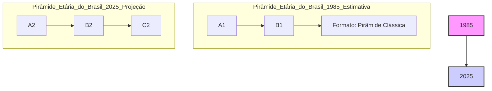
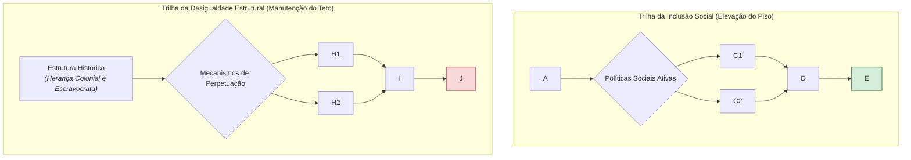

# As Transformações da Sociedade Brasileira na Nova República (1985-2025): Avanços, Paradoxos e Desafios

## Introdução: A Era dos Contrastes

O período da Nova República, inaugurado em 1985 com o fim do regime militar, representa um dos mais complexos e dinâmicos capítulos da história social brasileira. Ao longo de quatro décadas, o Brasil vivenciou transformações profundas que redefiniram sua demografia, sua estrutura social, suas identidades coletivas e sua inserção no mundo. Este relatório se propõe a realizar uma análise aprofundada dessas mudanças, com foco em um paradoxo central que marca a trajetória do país no período: a coexistência de notáveis avanços na inclusão social e na redução da pobreza com a preservação de estruturas de desigualdade historicamente arraigadas e brutalmente persistentes.

A promulgação da Constituição de 1988 serviu como o alicerce jurídico e ideológico para um novo projeto de nação, prometendo a universalização de direitos e a construção de um Estado de bem-estar social. Sob sua égide, o Brasil testemunhou uma acelerada transição demográfica, combateu a miséria com políticas sociais de impacto global, viu a emergência e o fortalecimento de novos movimentos sociais que pautaram a agenda pública e mergulhou na revolução digital que reconfigurou as interações humanas e o mundo do trabalho.

Contudo, esses avanços ocorreram em um terreno social marcado por fissuras profundas. A mesma sociedade que celebrava a saída de milhões da pobreza continuava a ser uma das mais desiguais do planeta. As cidades, palcos do dinamismo econômico, tornaram-se também a expressão física da segregação e da violência. A expansão da cidadania para grupos historicamente marginalizados conviveu com a ascensão de forças conservadoras e com a intensificação da polarização política.

Este documento analítico percorrerá as múltiplas facetas dessa era de contrastes. Partindo do marco fundador da Constituição Cidadã, examinará as mudanças estruturais na demografia e na economia, para então mergulhar na análise do grande paradoxo da inclusão com desigualdade. Em seguida, abordará a reconfiguração das identidades e dos movimentos sociais, os desafios da vida urbana e o impacto ambíguo da era digital. O objetivo é oferecer um panorama estratégico e crítico, essencial para a compreensão das forças que moldaram o Brasil contemporâneo e que continuarão a definir seus desafios no futuro próximo.

## I. O Alicerce da Mudança: A Constituição de 1988 como Novo Pacto Social

A transição para a democracia no Brasil culminou na promulgação da Constituição Federal de 1988, um documento que não apenas reestruturou o Estado, mas redefiniu fundamentalmente o pacto social da nação. Apelidada de "Constituição Cidadã" por Ulysses Guimarães, ela representa o mais ambicioso esforço de universalização de direitos da história brasileira, servindo como a matriz legal e programática para as principais transformações sociais das décadas seguintes.

### A "Constituição Cidadã" como Fundamento da Universalização

A Constituição de 1988 foi o resultado direto de um intenso processo de mobilização da sociedade civil, que, após duas décadas de autoritarismo, viu na Assembleia Nacional Constituinte a oportunidade de refundar o país sobre novas bases. Movimentos sociais, sindicatos e diversas organizações populares participaram ativamente dos debates, pressionando por uma agenda de ampliação da cidadania. O texto final refletiu essa efervescência, estabelecendo a República Federativa do Brasil como um Estado Democrático de Direito, cujos fundamentos incluem a cidadania, a dignidade da pessoa humana e os valores sociais do trabalho.

Esse novo arranjo rompeu com o modelo anterior, centralizador e autoritário, e lançou as bases para uma social-democracia, ainda que em um contexto adverso. A Carta Magna estabeleceu um extenso rol de direitos sociais, buscando aproximar o Brasil dos modelos de Estado de bem-estar social europeus, nos quais os direitos são garantidos universalmente pelo Estado. Essa ambição representou um verdadeiro "novo patamar civilizatório" para a sociedade brasileira, ao vincular, pela primeira vez de forma tão explícita, a concessão de direitos à condição de cidadania, e não mais a critérios corporativos ou contributivos.

### A Criação da Seguridade Social e a Ruptura com o Modelo Anterior

A mais significativa inovação da Constituição de 1988 no campo social foi, sem dúvida, a criação do sistema de Seguridade Social, definido no artigo 194 como "um conjunto integrado de ações de iniciativa dos Poderes Públicos e da sociedade, destinadas a assegurar os direitos relativos à saúde, à previdência e à assistência social". Este tripé representou uma ruptura conceitual e estrutural com o modelo de _seguro social_ que vigorava até então, no qual o acesso a benefícios como assistência médica e aposentadoria era restrito aos trabalhadores formais que contribuíam para a previdência.

- **Saúde (SUS):** O pilar mais revolucionário da Seguridade Social foi a instituição do Sistema Único de Saúde (SUS). O artigo 196 da Constituição estabelece que "a saúde é direito de todos e dever do Estado", garantindo o "acesso universal e igualitário" aos serviços de saúde. Essa formulação transformou a saúde, antes um benefício previdenciário para poucos, em um direito de cidadania para todos, criando o maior sistema de saúde pública universal do mundo. O SUS foi organizado com base em diretrizes de descentralização, atendimento integral (com foco na prevenção) e participação da comunidade.
    
- **Assistência Social:** A Constituição também elevou a assistência social a um novo patamar. Antes de 1988, ela era marcada pela caridade, filantropia e clientelismo, sem obrigação formal do Estado. A nova Carta, em seu artigo 203, estabeleceu a assistência como um direito a ser prestado "a quem dela necessitar, independentemente de contribuição à seguridade social". Essa mudança foi fundamental para desvincular a proteção social da capacidade contributiva, criando a base para políticas de combate à pobreza, como o Benefício de Prestação Continuada (BPC) e, posteriormente, o Bolsa Família.
    
- **Previdência Social:** Embora mantendo um caráter contributivo, a previdência também foi ampliada, buscando a "uniformidade e equivalência dos benefícios e serviços às populações urbanas e rurais", um avanço significativo para os trabalhadores do campo, historicamente desprotegidos.
    

### A Institucionalização da Participação Social

Refletindo as demandas dos "novos movimentos sociais" que emergiram nas décadas de 1970 e 1980, a Constituição de 1988 institucionalizou diversos canais de participação da sociedade na gestão do Estado. Foram criados conselhos gestores de políticas públicas em áreas como saúde, assistência social e direitos da criança, com composição paritária entre governo e sociedade civil. As conferências nacionais tornaram-se espaços deliberativos para a formulação de políticas. Esse modelo descentralizado e participativo, especialmente visível na arquitetura do SUS e do Sistema Único de Assistência Social (SUAS), representou um esforço inédito de aprofundar a democracia para além do voto, incorporando a sociedade civil no ciclo das políticas públicas.

### Tensões e Limites

Apesar de seu caráter transformador, a implementação da Constituição de 1988 foi marcada por tensões e desafios estruturais. Uma contradição fundamental definiu todo o período: a Carta Magna nasceu de uma conjuntura de efervescência democrática e popular, consagrando um projeto de Estado social abrangente e universalista, mas sua aplicação prática se deu em um cenário global de ascensão do neoliberalismo, que pregava o Estado mínimo e a primazia do mercado.6 Essa tensão estrutural explica a lacuna crônica entre as promessas constitucionais e a realidade de políticas sociais frequentemente subfinanciadas e contestadas.

Adicionalmente, o caráter detalhista e programático da Constituição, com muitas de suas normas dependendo de regulamentação posterior, criou um campo fértil para a judicialização. Diante de um Congresso Nacional muitas vezes conservador e refratário a avanços em pautas sociais sensíveis, o Poder Judiciário, em especial o Supremo Tribunal Federal (STF), foi progressivamente assumindo um papel de protagonista na concretização dos direitos constitucionais. Como será visto adiante, foi por meio da interpretação dos princípios fundamentais da Constituição que o STF garantiu direitos cruciais para a população LGBTQIA+, exemplificando como a "judicialização da política" se tornou uma característica definidora da expansão da cidadania na Nova República.

---

**Tabela 1: Marcos Jurídicos e Institucionais da Nova República (1988-2024)**

|Ano|Marco Jurídico/Institucional|Descrição e Relevância|Fontes|
|---|---|---|---|
|1988|**Constituição Federal**|Estabelece o novo pacto social, cria a Seguridade Social (SUS, Previdência, Assistência Social) e universaliza direitos.|13|
|1989|**Lei nº 7.716 (Lei Caó)**|Define os crimes resultantes de preconceito de raça ou de cor, tornando o racismo crime inafiançável e imprescritível.|18|
|1990|**Lei nº 8.080 (Lei Orgânica da Saúde)**|Regulamenta o Sistema Único de Saúde (SUS) em todo o território nacional, detalhando seus princípios e sua organização.|11|
|1993|**Lei nº 8.742 (Lei Orgânica da Assistência Social - LOAS)**|Regulamenta a Assistência Social como política de seguridade social e cria o Benefício de Prestação Continuada (BPC).|2|
|2003|**Criação da SEPPIR**|Criação da Secretaria de Políticas de Promoção da Igualdade Racial, fortalecendo a agenda antirracista no Executivo.|18|
|2003|**Lei nº 10.639**|Torna obrigatório o ensino de História e Cultura Afro-Brasileira nas escolas de ensino fundamental e médio.|18|
|2006|**Lei nº 11.340 (Lei Maria da Penha)**|Cria mecanismos para coibir a violência doméstica e familiar contra a mulher, um marco na luta feminista.|21|
|2010|**Estatuto da Igualdade Racial**|Institui o Sistema Nacional de Promoção da Igualdade Racial (Sinapir) e define políticas para combater a discriminação.|18|
|2011|**Decisão do STF (ADI 4277 / ADPF 132)**|Reconhece a união estável para casais do mesmo sexo, equiparando-a à união estável heteroafetiva.|23|
|2012|**Lei nº 12.711 (Lei de Cotas)**|Determina a reserva de 50% das vagas em universidades e institutos federais para estudantes de escolas públicas, com subcotas raciais.|18|
|2019|**Decisão do STF (ADO 26 / MI 4733)**|Criminaliza a homofobia e a transfobia, equiparando-as ao crime de racismo, diante da omissão do Congresso.|23|

---

## II. A Transformação Silenciosa: Dinâmicas Demográficas e seus Impactos Estruturais

Paralelamente às transformações políticas, a sociedade brasileira passou por uma profunda e silenciosa revolução demográfica. A rápida queda das taxas de fecundidade e o consequente envelhecimento da população alteraram de forma permanente a estrutura etária do país, gerando tanto oportunidades únicas quanto desafios monumentais para o futuro do Estado de bem-estar social.

### A Queda da Fecundidade e o Envelhecimento Acelerado

O Brasil vivenciou uma das mais rápidas transições de fecundidade do mundo. Em poucas décadas, o país passou de um perfil de alta natalidade para um cenário de famílias drasticamente menores. Em 1960, a taxa de fecundidade total (TFT) era de 6,3 filhos por mulher; em três décadas, despencou para 2,3, e no início do século XXI, já se encontrava abaixo do nível de reposição populacional de 2,1 filhos.

As causas dessa mudança são multifatoriais e estão intrinsecamente ligadas a outras transformações sociais do período:

- **Urbanização:** A migração em massa do campo para a cidade alterou os custos e benefícios de se ter filhos.
    
- **Educação e Trabalho Feminino:** A crescente inserção da mulher no mercado de trabalho e o aumento de sua escolaridade foram fatores decisivos, adiando a maternidade e reduzindo o número de filhos desejado.
    
- **Métodos Contraceptivos:** A ampla, ainda que não planejada pelo Estado, disseminação de métodos contraceptivos, especialmente a pílula e a esterilização feminina, deu às mulheres maior controle sobre sua vida reprodutiva.
    

Essa drástica redução da natalidade, combinada com o aumento da expectativa de vida, provocou um processo de envelhecimento populacional em um ritmo muito mais acelerado do que o observado nos países europeus. A idade mediana da população brasileira saltou de 29 anos em 2010 para 35 anos em 2022. As projeções indicam que, por volta de 2025, o Brasil terá a sexta maior população de idosos do mundo, e em 2031, o número de idosos deverá superar o de crianças pela primeira vez na história.

### O Envelhecimento e os Desafios para o Estado de Bem-Estar

O rápido envelhecimento populacional impõe uma pressão sem precedentes sobre os sistemas de proteção social concebidos na Constituição de 1988, que foram desenhados em um contexto demográfico muito mais jovem.

- **Previdência Social:** O sistema previdenciário brasileiro, baseado no modelo de repartição simples (onde os trabalhadores da ativa financiam os benefícios dos aposentados), enfrenta um desequilíbrio fiscal crescente. Com o envelhecimento, a razão entre contribuintes e beneficiários diminui inexoravelmente, tornando o sistema financeiramente insustentável no longo prazo sem reformas. Estudos do IPEA já apontavam, há mais de uma década, para a urgência de adequar as regras de aposentadoria a essa nova realidade demográfica.
    
- **Sistema de Saúde (SUS):** O impacto no SUS é igualmente severo. Uma população mais idosa demanda mais serviços de saúde, com um perfil epidemiológico dominado por doenças crônicas não transmissíveis (como diabetes, hipertensão e câncer) e condições que exigem cuidados de longa duração. O sistema, que já enfrenta um subfinanciamento crônico, está pouco preparado para essa transição. Estudos da Fiocruz e do IEPS mostram que 75% dos idosos dependem exclusivamente do SUS, mas a oferta de serviços especializados, como geriatria e leitos de longa permanência, é insuficiente e não acompanha o ritmo do envelhecimento.33 A desigualdade também se manifesta aqui: idosos de baixa renda têm pior saúde e acesso mais precário a serviços, dependendo mais de atendimentos emergenciais.
    

A transição demográfica não foi um processo homogêneo. Ela foi profundamente marcada pelas desigualdades sociais existentes. Mulheres com maior escolaridade e renda, concentradas nas regiões mais ricas, lideraram a queda da fecundidade, muitas vezes tendo menos filhos do que o desejado pela dificuldade em conciliar carreira e família. Em contrapartida, mulheres mais pobres, com menor escolaridade e acesso precário a serviços de saúde reprodutiva, continuaram a ter taxas de fecundidade mais altas, frequentemente resultado de gestações não planejadas na juventude. Isso significa que a transição demográfica, em vez de atenuar, refletiu e por vezes reforçou as clivagens sociais, com o "bônus" de famílias menores sendo mais bem aproveitado pelas classes média e alta, enquanto o "ônus" de uma alta razão de dependência jovem persistiu por mais tempo entre os mais pobres.

### A Janela de Oportunidade Perdida? O Debate sobre o Bônus Demográfico

A transição demográfica abriu para o Brasil uma "janela de oportunidade" ou "bônus demográfico": um período de tempo finito em que a proporção da população em idade ativa (15 a 64 anos) cresce mais rapidamente do que a população dependente (crianças e idosos). Esse fenômeno, que no Brasil se estendeu aproximadamente dos anos 1970 até a década de 2030, reduz a razão de dependência total e, teoricamente, libera recursos que podem ser investidos em educação, infraestrutura e poupança, impulsionando o crescimento econômico.

Há um amplo consenso entre economistas e demógrafos de que o Brasil não aproveitou plenamente essa oportunidade única. A janela demográfica coincidiu com períodos de grande instabilidade econômica, como a "década perdida" de 1980, a hiperinflação do início dos anos 1990 e a profunda recessão de 2014-2016, que foi agravada pela pandemia de Covid-19. A falta de investimentos consistentes em educação de qualidade e a incapacidade da economia de gerar empregos formais suficientes para absorver a grande massa de jovens que ingressava no mercado de trabalho impediram que o bônus demográfico se traduzisse em um salto de produtividade e desenvolvimento.

A pandemia de Covid-19 é vista por analistas como o "golpe mortal" na fase final do bônus, ao dizimar o mercado de trabalho e reduzir drasticamente a população ocupada. Com o fechamento iminente da janela de oportunidade e o início do aumento da razão de dependência (agora puxada pelos idosos), o Brasil enfrenta o grave risco de "envelhecer antes de enriquecer". Isso significa que o país terá que arcar com os custos sociais de uma população idosa sem ter acumulado a riqueza e a produtividade necessárias para sustentar um sistema de proteção social robusto, um dos maiores desafios estruturais para as próximas décadas.

## III. O Grande Paradoxo Brasileiro: Inclusão Social vs. Persistência da Desigualdade

O coração da experiência social brasileira na Nova República reside em um profundo e desafiador paradoxo: o país obteve um sucesso notável e internacionalmente reconhecido na redução da pobreza e da miséria, especialmente na primeira década do século XXI, mas falhou em alterar de forma significativa sua estrutura de desigualdade, que permanece entre as mais altas do mundo. A análise deste paradoxo revela a natureza e os limites do modelo de desenvolvimento social adotado no período.

### Avanços na Redução da Pobreza

A queda expressiva dos indicadores de pobreza no Brasil, sobretudo entre 2002 e 2014, foi impulsionada por uma combinação de políticas públicas que atuaram diretamente na base da pirâmide social. Duas se destacam:

- **Políticas de Transferência de Renda Condicionada:** O Programa Bolsa Família (PBF), criado em 2003 pela unificação de programas anteriores, tornou-se a principal ferramenta do Estado brasileiro no combate à pobreza. Estudos do Instituto de Pesquisa Econômica Aplicada (IPEA) demonstram sua alta eficácia e focalização. Cerca de 70% dos recursos do programa atingiam os 20% mais pobres da população, e suas transferências foram responsáveis por uma redução de 15% na pobreza e de 25% na extrema pobreza. Com um custo orçamentário relativamente baixo, em torno de 0,5% do PIB, o PBF teve um impacto desproporcionalmente positivo, respondendo por cerca de 10% da queda da desigualdade de renda (medida pelo Índice de Gini) entre 2001 e 2015. O programa também teve efeitos intergeracionais importantes, ao vincular os benefícios a condicionalidades nas áreas de saúde e educação. Contudo, suas limitações também são evidentes, principalmente o baixo valor médio dos benefícios, que, embora aliviasse a miséria, era insuficiente para tirar a maioria das famílias da condição de pobreza.
    
- **Valorização do Salário Mínimo:** A política de reajustes reais do salário mínimo, que garantiu aumentos acima da inflação de forma consistente, foi outro pilar fundamental. Seu impacto transcendeu os trabalhadores formais, gerando um "efeito-farol" que elevou a remuneração também no setor informal. Mais importante, como a Constituição de 1988 atrelou o piso dos benefícios da Previdência Social (aposentadorias e pensões) e da Assistência Social (BPC) ao salário mínimo, sua valorização teve um efeito cascata em milhões de domicílios, especialmente entre os mais pobres e idosos.56 Um estudo aprofundado da UFF, analisando o período de 2002 a 2013, concluiu que a política de valorização do salário mínimo foi o fator mais importante para a redução da pobreza, explicando até 70% da queda na proporção de pobres quando se considera seu efeito-spillover. O impacto foi particularmente forte na redução da intensidade e da severidade da pobreza, e mais pronunciado nas regiões mais pobres do país, como o Nordeste.
    

### A Desigualdade Intransigente: Renda e Riqueza no Topo

Apesar desses avanços inegáveis na base da pirâmide, o topo permaneceu praticamente intocado. O Brasil, que entrou na Nova República como um dos países mais desiguais do mundo, continua a ostentar esse título.

- **Índice de Gini e a Concentração de Renda:** Embora o Índice de Gini da renda domiciliar per capita tenha registrado uma queda contínua e histórica entre 2001 e 2014, ele partiu de um patamar extremamente elevado e permaneceu em níveis incompatíveis com uma sociedade democrática. A partir de 2015, com a crise econômica, a desigualdade de renda voltou a crescer, revertendo parte dos ganhos da década anterior. Análises do economista Marcelo Neri, da FGV Social, demonstram a persistência histórica dessa desigualdade e como as pesquisas domiciliares tradicionais, como a PNAD, subestimam a concentração no topo.60 Ao combinar dados da PNAD com os registros do Imposto de Renda da Pessoa Física (IRPF), Neri e outros pesquisadores revelaram que a parcela da renda apropriada pelo 1% mais rico é muito maior do que se imaginava, elevando o Gini de um já altíssimo 0,6 para mais de 0,7.
    
- **A Desigualdade de Riqueza:** A desigualdade de riqueza (o estoque de ativos, como imóveis, investimentos financeiros e participações em empresas) é ainda mais brutal e persistente do que a desigualdade de renda (o fluxo de rendimentos). Relatórios da Oxfam Brasil trazem dados alarmantes: em 2024, 63% de toda a riqueza do país estava nas mãos do 1% mais rico, enquanto os 50% mais pobres detinham apenas 2% do patrimônio nacional. Em uma das comparações mais chocantes, o relatório "A Distância que nos Une" apontou que seis bilionários brasileiros possuíam a mesma riqueza que os 100 milhões de brasileiros mais pobres somados. Essa extrema concentração de riqueza, muitas vezes herdada, é um fator estrutural que perpetua a desigualdade através das gerações.
    

### Desvendando o Paradoxo

A chave para entender o paradoxo brasileiro está na natureza das políticas implementadas. O país foi bem-sucedido em políticas de _alívio à pobreza_, que atuaram elevando o "piso" de renda da sociedade. O Bolsa Família e a valorização do salário mínimo foram instrumentos eficazes para garantir uma renda mínima e melhorar as condições de vida na base da pirâmide.

Contudo, o Brasil fracassou completamente em implementar políticas que pudessem afetar o "teto" da distribuição de renda e, principalmente, de riqueza. A estrutura tributária brasileira é um dos principais mecanismos de perpetuação da desigualdade. Ela é altamente regressiva, ou seja, onera proporcionalmente mais os pobres do que os ricos. Os tributos sobre o consumo (como ICMS e IPI), que incidem igualmente sobre todos, representam a maior parte da arrecadação, enquanto a tributação sobre a renda e o patrimônio é baixa e cheia de brechas. Lucros e dividendos distribuídos a acionistas são isentos de imposto de renda desde 1996, e a tributação sobre grandes fortunas e heranças é ínfima ou inexistente em padrões internacionais.

Essa configuração permite que a riqueza no topo se acumule e se reproduza com pouca ou nenhuma contribuição redistributiva, um fenômeno alinhado à tese de Thomas Piketty de que, quando a taxa de retorno do capital (r) é maior que a taxa de crescimento da economia (g), a desigualdade tende a aumentar. O Brasil, portanto, promoveu uma inclusão social pelo consumo e pela renda na base, mas sem tocar nos privilégios e na estrutura de acumulação de riqueza no topo. O resultado é uma sociedade menos pobre, mas ainda radicalmente desigual.

## IV. Novos Atores, Novas Pautas: A Reconfiguração dos Movimentos Sociais

O ambiente democrático inaugurado com a Nova República e consolidado pela Constituição de 1988 foi o catalisador para a emergência e o fortalecimento de movimentos sociais baseados em políticas de identidade. O movimento feminista, o movimento negro e o movimento LGBTQIA+ ganharam visibilidade sem precedentes, desafiando estruturas sociais arraigadas e pautando de forma decisiva a agenda pública, o que resultou em avanços legislativos e institucionais significativos, mas também provocou fortes reações conservadoras.

### O Protagonismo Feminista na Nova República

O movimento feminista, que já atuava na luta contra a ditadura, teve um papel central no processo constituinte. A mobilização da chamada "bancada do batom" foi crucial para garantir que a Constituição de 1988 estabelecesse, como cláusula pétrea, a igualdade de direitos e obrigações entre homens e mulheres. Esse foi o ponto de partida para uma série de conquistas.

A mais emblemática delas foi a sanção da **Lei nº 11.340/2006, a Lei Maria da Penha**. Considerada pela ONU uma das legislações mais avançadas do mundo no combate à violência doméstica, a lei foi resultado de anos de ativismo e da condenação do Brasil na Comissão Interamericana de Direitos Humanos. Ela criou mecanismos para prevenir e punir a violência contra a mulher, representando uma mudança de paradigma ao tratar o problema não como uma questão privada, mas como uma violação de direitos humanos que exige a intervenção do Estado. Ao longo do período, o movimento feminista também se diversificou, com o fortalecimento de correntes como o feminismo negro, que trouxe para o centro do debate a intersecção entre gênero e raça, denunciando a dupla opressão sofrida pelas mulheres negras.

### A Luta Contra o Racismo Estrutural

O movimento negro também se consolidou como um ator político fundamental na Nova República, transformando a luta antirracista em pauta de Estado. Sua atuação na Constituinte foi decisiva para duas conquistas históricas na Carta de 1988: o reconhecimento do direito à propriedade das terras para as comunidades remanescentes de quilombos (Art. 68 do ADCT) e a definição do crime de racismo como inafiançável e imprescritível.

A partir dos anos 2000, a pressão do movimento resultou na adoção de políticas de ação afirmativa, uma de suas mais antigas e controversas reivindicações. A criação da Secretaria de Políticas de Promoção da Igualdade Racial (SEPPIR) em 2003 deu um novo impulso institucional à pauta.18 Os marcos mais importantes foram:

- **O Estatuto da Igualdade Racial (2010):** Após uma década de tramitação, a lei foi aprovada, estabelecendo diretrizes para políticas públicas de combate à discriminação racial.
    
- **A Lei de Cotas (2012):** A Lei nº 12.711 determinou a reserva de vagas em universidades e institutos federais para estudantes de escolas públicas, com subcotas para pretos, pardos e indígenas. Essa política, validada pelo STF, teve um impacto profundo na democratização do acesso ao ensino superior, alterando a composição social e racial das universidades brasileiras.
    

Apesar desses avanços, a luta contra o racismo estrutural, que se manifesta na violência policial, na desigualdade de oportunidades e na sub-representação política, continua a ser um dos maiores desafios do país.

### A Emergência da Cidadania LGBTQIA+

O movimento por direitos de lésbicas, gays, bissexuais, travestis e transexuais (LGBTQIA+) emergiu da clandestinidade do final da ditadura para se tornar uma força política visível e organizada na Nova República. A trajetória do movimento é marcada por uma notável evolução interna, refletida na própria sigla, que se expandiu de "GLS" para "LGBTQIA+" para abarcar a diversidade de identidades de gênero e orientações sexuais, demonstrando um processo de amadurecimento e inclusão.

Diante de um Poder Legislativo consistentemente hostil às suas pautas, o movimento LGBTQIA+ adotou uma estratégia de **judicialização da política**, buscando no Poder Judiciário o reconhecimento de seus direitos fundamentais. Essa estratégia se mostrou extremamente bem-sucedida, resultando em decisões históricas do Supremo Tribunal Federal (STF) que alteraram a paisagem jurídica do país:

- **União Estável (2011):** O STF reconheceu a união estável para casais do mesmo sexo, garantindo-lhes os mesmos direitos e deveres das uniões heteroafetivas.23
    
- **Casamento Civil (2013):** Com base na decisão do STF, o Conselho Nacional de Justiça (CNJ) emitiu a Resolução 175, que proibiu os cartórios de se recusarem a celebrar o casamento civil entre pessoas do mesmo sexo.
    
- **Criminalização da LGBTfobia (2019):** Em uma decisão paradigmática, o STF determinou que, diante da omissão inconstitucional do Congresso, os atos de homofobia e transfobia deveriam ser enquadrados como crime de racismo até que uma lei específica fosse aprovada.
    

O sucesso desses movimentos em pautar a sociedade e conquistar direitos institucionais não ocorreu sem resistência. Pelo contrário, cada avanço gerou uma reação de setores conservadores da sociedade, especialmente de grupos religiosos fundamentalistas. A ascensão de uma forte bancada evangélica no Congresso Nacional e a disseminação de pânicos morais, como a chamada "ideologia de gênero", podem ser entendidas como uma resposta direta ao protagonismo adquirido pelos movimentos feminista e LGBTQIA+. Essa dialética entre o avanço na conquista de direitos e o acirramento da reação conservadora tornou-se uma das principais dinâmicas de conflito social e político na segunda metade da Nova República, alimentando a polarização que marca o Brasil contemporâneo.

## V. As Cicatrizes Urbanas da Desigualdade

As profundas desigualdades estruturais que caracterizam a sociedade brasileira não são abstrações estatísticas; elas se materializam de forma concreta e visível no espaço urbano. As metrópoles brasileiras, motores do crescimento econômico, são também o palco onde as contradições do país se manifestam com maior crueza, através da violência endêmica, da segregação socioespacial e da precariedade dos serviços básicos de mobilidade e saneamento. Esses problemas não são fenômenos isolados, mas sim sintomas interconectados da mesma patologia social.

A paisagem urbana brasileira é, em si, um mapa da desigualdade. A forma como as cidades se organizaram, especialmente durante o intenso processo de urbanização do século XX, reflete e reforça as hierarquias sociais. O local de moradia de um cidadão determina, em grande medida, seu acesso a oportunidades de trabalho e educação, sua exposição à violência, a qualidade dos serviços públicos que recebe e, em última instância, suas chances de vida.

### Violência Urbana: Uma Guerra Não Declarada

A violência letal persiste como um dos mais graves problemas do Brasil. Ao longo da Nova República, o país acumulou taxas de homicídio comparáveis às de nações em guerra. Dados do Fórum Brasileiro de Segurança Pública e do IPEA mostram que essa violência não é aleatória; ela tem cor, idade e endereço. As principais vítimas são jovens, negros e moradores das periferias das grandes cidades. A taxa de mortes por agressão, que já era alta, saltou de 22,2 por 100 mil habitantes em 1990 para 28,3 em 2013, com picos ainda maiores em determinados períodos e regiões. Essa realidade brutal é a face mais trágica da exclusão social e da falha do Estado em garantir o mais básico dos direitos: o direito à vida.

### Segregação Socioespacial: Cidades Partidas

O modelo de urbanização brasileiro é historicamente caracterizado pela segregação socioespacial, seguindo um padrão de centro-periferia que aparta fisicamente as classes sociais. De um lado, bairros centrais e condomínios fechados dotados de infraestrutura, serviços e segurança; de outro, vastas periferias e favelas marcadas pela precariedade habitacional e pela ausência do poder público. Essa separação não é apenas física, mas simbólica, criando "cidades partidas" e limitando as interações entre diferentes grupos sociais. Estudos demonstram uma correlação direta e alarmante entre os níveis de segregação e as taxas de violência. Uma pesquisa da Fiocruz indicou que um aumento no índice de segregação está associado a um crescimento de até 50% no número de homicídios, evidenciando como a organização do espaço urbano é um fator determinante na dinâmica da criminalidade.

### Crise de Mobilidade e Saneamento: A Desigualdade no Cotidiano

Os desafios da vida urbana se manifestam de forma contundente na precariedade dos serviços essenciais para a população mais pobre.

- **Mobilidade Urbana:** O modelo de desenvolvimento urbano brasileiro priorizou o transporte individual motorizado, resultando em cidades congestionadas, poluídas e com um sistema de transporte público caro e ineficiente.83 Para os moradores das periferias, que dependem do transporte coletivo e enfrentam longas jornadas diárias para chegar ao trabalho, a crise de mobilidade representa um custo financeiro e de tempo de vida altíssimo, aprofundando as desigualdades de acesso à cidade.
    
- **Saneamento Básico:** O déficit em saneamento é uma das mais vergonhosas cicatrizes do país. Dados do Instituto Trata Brasil revelam que quase 35 milhões de brasileiros não têm acesso a água tratada e cerca de 100 milhões vivem sem coleta de esgoto. Essa carência, concentrada nas áreas mais pobres, tem consequências diretas na saúde pública, sendo responsável por centenas de milhares de internações anuais por doenças de veiculação hídrica, que afetam desproporcionalmente crianças e idosos. A falta de saneamento não é apenas uma falha de infraestrutura, mas um indicador explícito de desigualdade e de negação da dignidade humana.
    

Portanto, a análise da questão urbana na Nova República revela como a cidade é o território onde o paradoxo brasileiro se torna visível e palpável. As mesmas metrópoles que concentram riqueza e modernidade são as que expõem, em seus contrastes, a persistência de uma ordem social excludente e violenta.

## VI. A Sociedade em Rede: A Revolução Digital e suas Ambiguidades

A massificação da internet e das redes sociais, a partir dos anos 2000, introduziu uma nova e poderosa variável na equação social brasileira. A revolução digital reconfigurou drasticamente as interações sociais, o debate público e o mundo do trabalho. Longe de ser uma força unicamente modernizadora ou democratizante, a tecnologia digital atuou, em grande medida, como um amplificador das contradições e tensões já existentes na sociedade brasileira, aprofundando tanto as possibilidades de mobilização quanto as dinâmicas de polarização e precarização.

### Reconfiguração das Interações e do Debate Público

A internet transformou a forma como os brasileiros se comunicam, se relacionam e consomem informação.88 As redes sociais tornaram-se a principal arena do debate público, com consequências ambíguas. Por um lado, elas forneceram ferramentas poderosas para a organização de movimentos sociais, permitindo que pautas antes restritas a círculos militantes ganhassem escala nacional, como visto nas manifestações de 2013 e no ativismo digital dos movimentos identitários.

Por outro lado, a lógica dos algoritmos, que privilegia o engajamento e a formação de comunidades afins, exacerbou a polarização política.90 As redes sociais facilitaram a criação de "bolhas informativas" ou "câmaras de eco", onde os indivíduos são expostos predominantemente a visões que reforçam suas próprias crenças, dificultando o diálogo e o consenso. Esse ambiente se mostrou extremamente fértil para a disseminação de desinformação (_fake news_) e discursos de ódio, contribuindo para o acirramento das tensões políticas e para a erosão da confiança nas instituições, um fenômeno que marcou a política brasileira na última década.

### Transformações no Mundo do Trabalho: Uberização e Precarização

No campo econômico, a revolução digital deu origem a novos modelos de negócio e novas formas de trabalho, notadamente a chamada "economia de plataforma" ou "gig economy". O fenômeno da "uberização" simboliza essa transformação, na qual empresas de tecnologia intermediam a prestação de serviços por uma vasta mão de obra classificada não como empregada, mas como "parceira" ou "autônoma".

Para o sociólogo Ricardo Antunes, a uberização representa "a face mais dura e perversa do capitalismo contemporâneo". Ao transferir os riscos e custos da atividade para o trabalhador (que deve arcar com seu próprio veículo, celular, plano de dados, etc.) e ao negar a existência de um vínculo empregatício, esse modelo contorna as proteções sociais e trabalhistas conquistadas ao longo do século XX e consagradas na CLT e na Constituição de 1988. O resultado é a emergência de uma nova classe de trabalhadores altamente precarizados, o "precariado", que vive sem direitos básicos como férias, décimo terceiro salário, descanso remunerado ou seguridade social em caso de acidente ou doença.

Dessa forma, a revolução digital, no contexto brasileiro, não apenas criou novas oportunidades, mas também aprofundou velhas feridas. Ela amplificou a capacidade de organização da sociedade civil, mas também a polarização política. E, no mundo do trabalho, ofereceu uma nova e sofisticada roupagem para a histórica tendência brasileira de informalidade e precarização, apresentando um dos maiores desafios para o futuro do pacto social estabelecido em 1988.

## Conclusão: Síntese dos Paradoxos e Desafios para o Futuro

A trajetória da sociedade brasileira na Nova República (1985-2025) é a crônica de uma modernização incompleta e paradoxal. O período foi, inegavelmente, palco de avanços sociais de grande magnitude. A redemocratização e a promulgação da Constituição de 1988 estabeleceram um arcabouço institucional que permitiu a expansão da cidadania, a universalização de direitos fundamentais como a saúde e a criação de uma rede de proteção social que, em seu auge, foi capaz de retirar milhões de pessoas da pobreza extrema, em um feito reconhecido mundialmente. A sociedade civil se reorganizou, e novos movimentos sociais, baseados em pautas de gênero, raça e sexualidade, ganharam força, desafiando hierarquias seculares e conquistando direitos importantes, muitas vezes através da atuação do Poder Judiciário.

Contudo, este processo de inclusão social foi superficial e limitado. Ele se deu sem o enfrentamento das estruturas mais profundas da desigualdade brasileira. O paradoxo central do período reside precisamente nisto: o Brasil conseguiu elevar o piso de renda dos mais pobres, mas manteve o teto de acumulação de riqueza dos mais ricos praticamente intocado. Políticas como o Bolsa Família e a valorização do salário mínimo foram eficazes no alívio da pobreza, mas a ausência de reformas estruturais, notadamente uma reforma tributária que onerasse progressivamente a renda e a riqueza, permitiu que o país continuasse a ser um dos campeões mundiais de concentração.

Essa contradição fundamental se reflete em todas as dimensões da vida social. A transição demográfica, que poderia ter sido um bônus para o desenvolvimento, foi em grande parte desperdiçada por crises econômicas e pela falta de investimento em educação, deixando o país com o desafio de envelhecer antes de enriquecer. As metrópoles brasileiras tornaram-se a expressão física da desigualdade, com a segregação espacial alimentando a violência e expondo a falência do Estado em prover serviços básicos de forma equânime. Por fim, a revolução digital, em vez de resolver, agiu como um catalisador das tensões preexistentes, amplificando a polarização política e criando novas formas de precarização do trabalho.

Olhando para o futuro, os desafios para o Brasil são imensos e complexos. O primeiro é de ordem econômica e social: como garantir crescimento sustentável e financiar o Estado de bem-estar em um cenário pós-bônus demográfico, com uma população envelhecida e crescentes demandas sobre a saúde e a previdência. O segundo, e talvez mais crucial, é de ordem política: como reconstruir consensos e fortalecer a democracia em uma sociedade fraturada pela polarização e pela desconfiança. A superação do grande paradoxo brasileiro exigirá, em última análise, a coragem política para ir além das políticas paliativas e finalmente enfrentar a questão central que define a história do país: a desigualdade em suas raízes mais profundas.

## Questões para Autoavaliação (Active Recall)

> [!question] Questão 1
> 
> Discorra criticamente sobre o paradoxo central da Nova República, explicando como foi possível ao Brasil reduzir significativamente a pobreza nas décadas de 2000 e 2010 sem, contudo, alterar de forma substancial seus altíssimos níveis de desigualdade de renda e, principalmente, de riqueza. Fundamente sua análise nos diferentes impactos de políticas como o Bolsa Família e a valorização do salário mínimo versus a inércia em reformas estruturais, como a tributária.

> [!question] Questão 2
> 
> Analise o papel dos "novos movimentos sociais" (feminista, negro e LGBTQIA+) na redefinição da agenda pública e na expansão da cidadania no Brasil pós-1988. Em sua resposta, aborde a estratégia de "judicialização da política" como ferramenta para a conquista de direitos e discuta a dialética entre os avanços desses movimentos e a emergência de uma reação conservadora.

> [!question] Questão 3
> 
> Explique a tese do "bônus demográfico" e avalie em que medida o Brasil aproveitou (ou desperdiçou) sua "janela de oportunidade" demográfica. Conecte sua análise aos desafios futuros do envelhecimento populacional para o sistema de seguridade social (saúde e previdência) e ao risco de o país "envelhecer antes de enriquecer".
