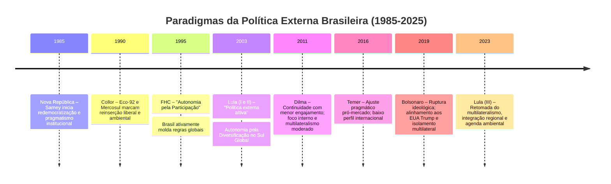

# A Evolução da Política Externa Brasileira na Nova República (1985-2025): Paradigmas, Atores e Desafios

## Introdução

A Política Externa Brasileira (PEB) da Nova República (1985-2025) passou por distintas fases paradigmáticas, refletindo as transformações domésticas (redemocratização, estabilidade econômica, crises políticas) e mudanças no cenário global (fim da Guerra Fria, globalização, ascensão do Sul Global). A partir de 1985, com o fim do regime militar, o Brasil buscou reconstruir sua inserção internacional sobre novas bases democráticas e constitucionais – enfatizando direitos humanos, cooperação e integração regional (princípios consagrados no Art. 4º da Constituição de 1988). Desde então, **a PEB evoluiu de um enfoque inicial de “pragmatismo institucional”**, passando pelo paradigma da **“autonomia pela participação”** nos anos 1990, até a busca de **“autonomia pela diversificação”** com protagonismo altivo nos anos 2000. Essa trajetória conheceu inflexões importantes na década de 2010 (Dilma, Temer e Bolsonaro) e uma retomada de eixos tradicionais no pós-2023. A seguir, analisamos comparativamente cada período, destacando continuidades, rupturas e as estratégias adotadas para afirmar a autonomia e os interesses do Brasil em um mundo em transformação.

> [!definition] **Pragmatismo Institucional (Sarney/Collor)**: Paradigma da PEB pós-1985 caracterizado pela reinserção **pragmática** do Brasil nas instituições e normas internacionais, rompendo isolamentos do período autoritário. Enfatizou os **preceitos constitucionais** (democracia, direitos humanos, cooperação regional) e a construção de **arranjos institucionais** duradouros (como o Mercosul) para ancorar a política externa na nova ordem internacional.

## 1. Reconstrução Democrática e “Pragmatismo Institucional” (Sarney e Collor, 1985-1992)

Com a redemocratização em 1985 (governo José Sarney), a política externa brasileira precisou **superar o legado autoritário** e reposicionar o Brasil no mundo de acordo com os valores democráticos emergentes. A **Constituição de 1988** forneceu balizas inéditas para a PEB ao consagrar princípios como a prevalência dos direitos humanos, a defesa da paz, a autodeterminação dos povos e o compromisso com a integração latino-americana. Na prática, isso significou que o Brasil passou a se engajar ativamente em agendas globais antes evitadas pelo regime militar – por exemplo, aderindo a tratados de direitos humanos e participando de fóruns ambientais. A diplomacia brasileira buscou demonstrar **continuidade institucional aliada a novos objetivos democráticos**, o que implicou uma atuação pragmática e não ideológica: mantinham-se certos **pressupostos de autonomia** da tradição diplomática, porém agora guiados pelo **institucionalismo democrático** (regras internacionais, acordos de cooperação e respeito ao direito internacional).

Um pilar dessa fase foi a **reaproximação com a Argentina**, transformando uma antiga rivalidade em parceria estratégica regional. Sarney e o presidente argentino Raúl Alfonsín firmaram acordos pioneiros de cooperação a partir de 1986 (como a *Declaração de Foz do Iguaçu*) que construíram **confiança mútua** – notadamente na área nuclear – e pavimentaram o caminho para a criação do **Mercosul**. O Tratado de Assunção, assinado em 1991 já sob Collor, estabeleceu o Mercosul unindo Brasil, Argentina, Uruguai e Paraguai, concretizando a visão de integração econômica sul-americana como pedra angular da nova PEB. Essa guinada cooperativa substituiu **“políticas de conflito e rivalidade” pela cooperação e acordo com a Argentina**, marcando definitivamente o ingresso do Brasil em um paradigma **regionalista institucionalizado**. Além disso, o Brasil **reinseriu-se em agendas globais cruciais**: por exemplo, sediou a **Conferência da ONU sobre Meio Ambiente e Desenvolvimento de 1992** (Rio-92, durante o governo Collor), afirmando seu compromisso com o desenvolvimento sustentável e o multilateralismo ambiental. Também reviu posições até então “soberanistas” em temas de segurança: Collor assinou acordos de não proliferação nuclear – criando a agência binacional de contabilidade nuclear (ABACC) com a Argentina e aderindo ao Tratado de Tlatelolco (zona livre de armas nucleares) – sinalizando alinhamento às normas internacionais de desarmamento. No plano econômico, Collor iniciou a abertura comercial e reformas neoliberais alinhadas ao **“Consenso de Washington”**, rompendo com o velho estatismo desenvolvimentista, ainda que de forma parcial e atribulada.

Em síntese, o período Sarney/Collor caracterizou-se por um **“pragmatismo institucional”**: o Itamaraty atuou pragmaticamente para **institucionalizar a reintegração do Brasil** ao mundo democrático e liberal pós-Guerra Fria, sem rompantes ideológicos. Houve continuidade de aspectos tradicionais (universalismo, defesa da autonomia nacional), porém adaptados à nova conjuntura: o Brasil passou a buscar autonomia **por meio da participação construtiva** nas regras multilaterais emergentes, e não pela distância ou confronto. A diplomacia valorizou a criação de **marcos institucionais estáveis** – Mercosul, acordos de direitos humanos e meio ambiente, mecanismos de diálogo regional – como alicerces para uma inserção confiável e respeitada. Essa base lançada no fim dos anos 80 permitiria à PEB dar saltos mais ambiciosos nas décadas seguintes.

## 2. “Autonomia pela Participação” (Governo FHC, 1995-2002)

O governo Fernando Henrique Cardoso (1995-2002) inaugurou um novo paradigma definido como **“autonomia pela participação”**, conceito formulado por diplomatas e acadêmicos da época (e.g. Gelson Fonseca Jr., Celso Lafer). A ideia central era: **fortalecer a autonomia brasileira através do engajamento ativo nas instituições, regimes e fóruns internacionais**, em vez de buscar distância ou isolamento. Em outras palavras, o Brasil deveria **aderir a regimes internacionais (mesmo de natureza liberal)** e participar da elaboração de normas globais **“sem perda da capacidade de gestão da política externa”**, de modo a **influenciar a formulação das regras do sistema internacional**. Essa estratégia rompia definitivamente com a noção antiga de que autonomia significaria ficar à margem (postura que vigorou em certos momentos do regime militar, como a recusa em aderir ao TNP). Agora, acreditava-se que **sentar-se à mesa das negociações globais ampliaria a margem de manobra do país** e traria ganhos concretos à defesa de seus interesses.

> [!definition] **Autonomia pela Participação (FHC)**: Paradigma em que a autonomia nacional é **buscada por meio da participação ativa** nos fóruns e regimes internacionais (econômicos, políticos e de segurança). Ao **aderir às normas globais** – inclusive de cunho liberal – e ajudar a escrevê-las, o Brasil visava influenciar as regras do jogo internacional e preservar seus interesses, ao contrário de permanecer isolado. Exemplo: assinatura de tratados de não proliferação e atuação protagonista na OMC para moldar a agenda do comércio global.

Na prática, o período FHC foi marcado por **intensa atividade multilateral e diplomacia presidencial ativa**. O Brasil ratificou acordos longamente evitados, como o Tratado de Não Proliferação Nuclear (TNP, aderido em 1998), sinalizando confiança de que poderia fazê-lo **sem comprometer sua segurança e tecnologia**, justamente porque ajudara a moldar salvaguardas regionais (ABACC) que garantiam transparência e isonomia com a Argentina. O país também assumiu papel destacado na fundação da **Organização Mundial do Comércio (OMC)** em 1995, abraçando o sistema multilateral de comércio e usando-o em benefício próprio – por exemplo, abrindo disputas contra potências quando necessário. Sob FHC, o Brasil aderiu a vários regimes internacionais de ponta: tratados ambientais (Protocolo de Kyoto sobre clima, 1997), regimes de direitos humanos da ONU, regimes financeiros (Basileia, OCDE em status de observador), entre outros, **internalizando padrões internacionais** na expectativa de **ganhar voz na governança global**. Havia um claro esforço de **aproximação com os Estados Unidos e Europa** dentro de uma relação mais madura: FHC buscou parcerias estratégicas sem alinhamento automático, tentando equilibrar interesses. Por exemplo, embora cético em relação à proposta da Área de Livre Comércio das Américas (ALCA) inicialmente, o Brasil concordou em discutir o tema, de olho em não ficar excluído das dinâmicas hemisféricas – **“terminaria por ir pragmaticamente à ALCA”** nas palavras de Celso Lafer, ainda que o projeto não tenha se concretizado. Em suma, o Brasil de FHC atuou como **“global player em ascensão”**, presente nas mesas de negociação de comércio, meio ambiente, segurança e direitos humanos, acumulando capital diplomático para reforçar sua autonomia.

No **plano regional**, a estratégia de FHC combinou **liderança por cooperação** e estabilidade macroeconômica. Após o sucesso do Plano Real (1994) que estabilizou a economia brasileira, o país ganhou credibilidade para **exercer influência junto aos vizinhos**. Houve empenho na **consolidação do Mercosul**: o Protocolo de Ouro Preto (1994) deu estrutura institucional ao bloco (tarifa externa comum, secretariado, etc.) e nos anos seguintes o Mercosul se aprofundou como zona de livre comércio. O Brasil assumiu postura de **“liderança por exemplo”**, auxiliando parceiros em crises (e.g. apoiando a Argentina durante turbulências financeiras no final dos 90) e propondo iniciativas de integração física (lançamento da IIRSA em 2000, para infraestrutura sul-americana). FHC também **inaugurou a ideia de uma “Comunidade Sul-Americana”**: promoveu em 2000 a Primeira Reunião de Cúpula da América do Sul em Brasília, reunindo todos os líderes sul-americanos, prefigurando uma coordenação continental que floresceria adiante (Unasul). A lógica era ancorar a estabilidade regional – considerada pré-requisito para o desenvolvimento – via diálogo político e econômico frequente. Ademais, o Brasil manteve **política externa macroeconômica responsável**, o que aumentou sua influência nos fóruns econômicos: foi convidado a integrar o **G20 financeiro** (criado em 1999 após crises financeiras globais) e teve participação ativa em discussões sobre arquitetura financeira internacional. Em síntese, a era FHC consolidou a imagem do Brasil como um **parceiro confiável e moderador** – “autônomo, mas cooperativo” – disposto a assumir responsabilidades globais em troca de voz e espaço na governança mundial. Essa postura pavimentou o caminho para ambições ainda maiores de protagonismo que viriam no governo seguinte.

## 3. O “Protagonismo Altivo” e a Ênfase no Sul Global (Governo Lula, 2003-2010)

A chegada de Luiz Inácio Lula da Silva à presidência em 2003 marcou **nova inflexão estratégica** na política externa: sem romper com os fundamentos anteriores, o Brasil buscou **maior autonomia através da diversificação de parcerias e da atuação altiva no Sul Global**. A gestão do chanceler Celso Amorim cunhou a expressão **“política externa ativa e altiva”**, refletindo uma diplomacia **assertiva, com elevado protagonismo internacional e afirmação orgulhosa dos interesses nacionais**. Em essência, se FHC perseguira autonomia integrando-se às regras globais, **Lula buscou aprofundar a autonomia diversificando os eixos de inserção internacional**, de modo a **reduzir as assimetrias de poder** entre o Brasil e os grandes centros. Esse enfoque está alinhado ao conceito de **“autonomia pela diversificação”**: o país passa a aderir a princípios e normas internacionais **por meio de alianças Sul-Sul (inclusive regionais) e de acordos com parceiros não tradicionais – China, Índia, África, Oriente Médio, Leste Europeu, etc. – acreditando que tais alianças reduzem as assimetrias frente às potências e aumentam sua capacidade negociadora**. Em outras palavras, o Brasil buscou novos **pólos de poder e coalizões heterodoxas** para fugir da dependência excessiva do eixo Norte (EUA-Europa) e **pluralizar suas relações exteriores**, ganhando mais espaço de manobra.

> [!definition] **Autonomia pela Diversificação (Lula)**: Paradigma em que o Brasil **busca autonomia ampliando o leque de parcerias internacionais**, sobretudo com potências emergentes e países em desenvolvimento (Sul Global). Por meio de **alianças Sul-Sul, mecanismos regionais e acordos com parceiros não tradicionais (China, Índia, África etc.)**, procura-se **diluir dependências e assimetrias** frente às potências hegemônicas, fortalecendo o poder de barganha nacional. Essa estratégia pautou iniciativas como IBAS, BRICS e a priorização da América do Sul na era Lula.

Na prática, o governo Lula elevou o patamar de ambição da PEB. O Brasil **diversificou suas parcerias estratégicas**: aproximou-se significativamente da **China e da Índia**, aprofundando comércio e coordenação diplomática (essas relações especiais seriam consagradas na criação do fórum **BRICS** – Brasil, Rússia, Índia, China, depois África do Sul – que desde 2009 reúne as principais economias emergentes em cúpulas anuais). Simultaneamente, lançou com Índia e África do Sul o **Fórum de Diálogo IBAS (Índia-Brasil-África do Sul)** em 2003, uma inovadora coalizão trilateral de democracias do Sul para cooperação em desenvolvimento e coordenação política. Esse movimento ilustrava a busca brasileira de **novos agrupamentos internacionais fora do eixo tradicional**.

O Brasil de Lula também intensificou **projetos de integração regional “para além do Mercosul”**. Houve a priorização da **integração sul-americana** em sentido amplo: em 2008 foi criada a **UNASUL (União de Nações Sul-Americanas)**, mecanismo político e de segurança regional que uniu todos os 12 países sul-americanos, com sede em Quito e um Conselho de Defesa Sul-Americano proposto pelo Brasil. A UNASUL representava a visão de Lula de uma América do Sul coesa, capaz de resolver seus conflitos **sem tutela externa**, reforçando a liderança regional brasileira. No âmbito do Mercosul, a parceria foi aprofundada e politizada – permitiu-se a entrada da **Venezuela** (processo iniciado em 2006; ingresso efetivo em 2012) e encorajou-se a coordenação em fóruns multilaterais (o Mercosul atuou com voz conjunta em negociações da OMC e da ALCA, por exemplo). Além disso, o Brasil fomentou a criação da **Comunidade dos Países da América Latina e Caribe (CELAC)** – lançada em 2010 e formalizada em 2011 – que exclui EUA e Canadá, como forma de fortalecer a identidade latino-americana em assuntos globais. Paralelamente, Lula impulsionou uma **aproximação sem precedentes com a África**: multiplicou embaixadas brasileiras no continente (dobrando o número), realizou inúmeras visitas presidenciais a países africanos e estabeleceu cooperações técnicas (em agricultura tropical, saúde, educação) com nações africanas, numa política de **resgate histórico e solidariedade Sul-Sul**. Essa ofensiva diplomática no Sul Global elevou o **prestígio do Brasil entre países em desenvolvimento**, que passaram a ver o país como porta-voz de seus interesses nos grandes fóruns.

No cenário **multilateral global**, o Brasil adotou uma postura assertiva e até contestatória em certos temas, visando **reformar a ordem internacional “em favor” do Sul**. Um exemplo emblemático foi a atuação brasileira na **OMC**: na Conferência de Cancún (2003), o Brasil liderou o G20 comercial (coalizão de países em desenvolvimento) que enfrentou EUA e UE na questão de subsídios agrícolas, alterando o curso da Rodada de Doha. Essa liderança do G20 comercial mostrou a **capacidade do Brasil de articular coalizões flexíveis (“geometria variável”) para pressionar por regras mais justas** no comércio. Outro exemplo foi a campanha pela **reforma do Conselho de Segurança da ONU**: o Brasil, junto com Alemanha, Índia e Japão, formou o chamado **G4**, grupo que pleiteou assentos permanentes no CSNU para membros adicionais. Ainda que a reforma não se concretizasse, o Brasil demonstrou capacidade propositiva e ganhou respaldo de mais de 100 países à sua candidatura, fixando seu nome como aspirante legítimo a maior protagonismo na ONU. Na área de segurança internacional, a PEB também inovou: o Brasil **assumiu pela primeira vez o comando de uma missão de paz da ONU**, liderando a Minustah (Missão de Estabilização da ONU no Haiti) de 2004 a 2017. A presença de tropas brasileiras e o comando militar da operação renderam reconhecimento ao Brasil como contribuinte à paz e segurança globais – um ativo importante para reforçar seu argumento de que está pronto para responsabilidades maiores (como um assento permanente no CSNU). Ademais, em 2010, Brasil e Turquia articularam uma **tentativa de mediação no impasse nuclear iraniano**, negociando diretamente com Teerã um acordo (Declaração de Teerã) para troca de urânio que evitasse novas sanções. Embora o acordo tenha sido rejeitado pelas potências ocidentais, a iniciativa evidenciou a **disposição do Brasil em desafiar hierarquias estabelecidas** e propor soluções diplomáticas alternativas – um **protagonismo altivo** que marcou sua presença no Oriente Médio.

Do ponto de vista ideacional, Lula projetou uma imagem de Brasil como **líder do Sul Global e defensor de uma ordem mundial mais inclusiva**. Discursos brasileiros enfatizaram a necessidade de democratização das instituições de Bretton Woods, criticaram o **“unilateralismo” norte-americano** (especialmente após a invasão do Iraque em 2003) e advogaram valores como desenvolvimento sustentável, erradicação da fome (caso da proposta brasileira de um fundo mundial de combate à fome apresentado na ONU) e direitos humanos com viés universalista porém respeitando soberanias. Em 2004, o Brasil lançou a iniciativa **“ação contra a fome e a miséria”** junto à ONU, em parceria com França, Chile e ONU, vinculando segurança alimentar à paz. Internamente, essa fase coincidiu com o boom econômico e a ascensão do Brasil entre as maiores economias, o que deu lastro material a essas ambições. Como resultado, ao final da era Lula, o Brasil era visto como **“global player emergente”**, cortejado por grandes potências (sediou grandes eventos como a Copa 2014 e Olimpíada 2016, escolhidas nessa época) e ao mesmo tempo aclamado pelo mundo em desenvolvimento como exemplo de sucesso e solidariedade. Havia, contudo, também críticas: alguns analistas acusaram a política externa de **“excessivamente Sul-Sul e ideológica”**, potencialmente descuidando de interesses econômicos imediatos em nome de grande estratégia; outros temiam um **sobredimensionamento das capacidades brasileiras** (o chamado “efeito voos de galinha”). De todo modo, em termos de prova de concurso (CACD), é fundamental compreender as **diferenças entre o paradigma da “autonomia pela participação” (anos 90) e o do “protagonismo altivo/autonomia pela diversificação” (anos 2000)**: o primeiro buscava mudar o status quo **por dentro**, jogando pelas regras, enquanto o segundo visou **mudar correlações de poder**, reescrevendo as regras em coalizão com novos atores. Ambos almejavam autonomia, mas por caminhos distintos e adaptados às conjunturas de cada década.

> [!note] **Objetivos do G4** (Brasil, Alemanha, Índia e Japão): Formado em 2004, o grupo articulou uma proposta de reforma do Conselho de Segurança da ONU visando ampliar os assentos permanentes. Os países do G4 – grandes economias sem assento permanente – **apoiavam mutuamente suas candidaturas** a membros permanentes, defendendo a atualização da estrutura do CSNU pós-Guerra Fria. Apesar de amplo apoio (mais de 100 países), a iniciativa enfrentou resistências (especialmente do grupo Coffee Club) e **não se concretizou**, mas consolidou o Brasil como candidato natural a qualquer futura expansão do Conselho.

## 4. Período de Inflexão e Desafios (Governos Dilma, Temer e Bolsonaro, 2011-2022)

A década de 2010 testemunhou **mudanças significativas e alguns retrocessos** na política externa brasileira, em grande parte devido a constrangimentos econômicos e políticos domésticos, bem como a recalibragens ideológicas de cada governo. Podemos dividir em três sub-fases: a **continuidade cautelosa** sob Dilma Rousseff (2011-2016), um **ajuste pragmático e baixo perfil** sob Michel Temer (2016-2018) e uma **ruptura ideológica** sob Jair Bolsonaro (2019-2022). Em conjunto, esses anos formam um período de **inflexão**, no qual muito do protagonismo construído nos anos 2000 se dissipou e eixos tradicionais da diplomacia brasileira foram questionados ou abandonados.

**Dilma Rousseff (2011-2016):** Ao assumir, Dilma sinalizou em discursos que daria continuidade à ênfase no **Sul Global** – mencionando reforço das relações com vizinhos sul-americanos, América Latina, África, Oriente Médio e Ásia (Discurso de posse, 2011). De fato, em grande medida **houve continuidade de elementos universalistas** da era Lula: mantiveram-se prioridades de estreitar laços com América do Sul, África e demais parceiros em desenvolvimento. No plano multilateral, o Brasil **continuou defendendo o multilateralismo e a reforma das instituições globais**, e viu materializar uma iniciativa importante: **a criação do Novo Banco de Desenvolvimento (NBD) do BRICS em 2014**, primeira instituição financeira liderada por emergentes – um “possível elemento de contestação à ordem internacional”, ainda que incipiente. Dilma também deu destaque a temas de direitos humanos nos foros internacionais e advogou a doutrina da **“Responsabilidade ao Proteger”** (conceito proposto pelo Brasil na ONU em 2011 como complemento à Responsabilidade de Proteger, enfatizando cautela e accountability em intervenções humanitárias). No entanto, apesar dessas continuidades retóricas, **o contexto interno e externo limitou o ativismo**. O boom das commodities arrefeceu, a economia brasileira desacelerou e entrou em recessão, minando recursos e confiança necessários para grande projeção internacional. Simultaneamente, **crises políticas domésticas** (protestos de 2013, impasse fiscal, instabilidade que culminaria no impeachment) **consumiram o foco do governo**, levando a uma PEB mais **reativa e de baixo perfil**. Dilma viajou menos ao exterior do que Lula; algumas iniciativas emblemáticas arrefeceram – a integração sul-americana perdeu ímpeto, com a UNASUL começando a enfrentar divisões ideológicas entre governos regionais. Um episódio marcante foi o **abalo nas relações com os EUA em 2013**: após revelações de espionagem da NSA sobre Dilma, ela cancelou uma visita de Estado a Washington, esfriando a “reaproximação” que Lula havia construído. Ainda que em 2015 houvesse sinal de recomposição (cooperação Brasil-EUA em mudança do clima, por exemplo), o estrago estava feito na confiança mútua. Em resumo, a era Dilma manteve a orientação geral da política externa **sem inovação significativa**, mas **com perda de intensidade e protagonismo** (“mais do mesmo, porém menos”) devido a limitações conjunturais. O Brasil passou a ser visto como um ator global menos ativo – **“menor ativismo internacional”** e projeção minada pela crise econômica – embora não tenha havido rupturas ideológicas na diplomacia.

**Michel Temer (2016-2018):** Com o impeachment de Dilma e a posse de Temer, houve um redirecionamento pontual da PEB, ainda que de curta duração. Temer e seus chanceleres (José Serra e depois Aloysio Nunes, ambos do PSDB) propuseram uma política externa de **“desideologização”** – em essência, uma crítica implícita ao alegado “terceiromundismo ideológico” dos governos petistas. Na prática, isso significou **priorizar parceiros desenvolvidos tradicionais** e temas econômicos, buscando **reabilitar a imagem do Brasil** pós-crise política. Houve um esforço de **reaproximação rápida com os EUA e a UE**: por exemplo, **as negociações do acordo Mercosul-União Europeia foram aceleradas** (entre 2016-2018 conseguiu-se avançar decisivamente, culminando no acordo político de 2019). O governo Temer também se alinhou com a **guinada à direita na América Latina** – coincidindo com Maurício Macri na Argentina e outros – para isolar regimes de esquerda considerados problemáticos: o caso da **Venezuela** é emblemático, suspensa do Mercosul em 2017 por ruptura democrática. A integração regional sofreu **retrocesso**: a UNASUL, por divergências ideológicas, entrou em hibernação; o Brasil voltou-se a grupos como a **Aliança do Pacífico** (onde Temer buscou aproximação como observador) e participou da criação do **Foro PROSUL** em 2019 (já sob Bolsonaro, mas na esteira do enfraquecimento da UNASUL).

Internamente, Temer trouxe diplomatas de carreira de volta a postos-chave (Serra, embora político, logo foi substituído por Aloysio Nunes que deu mais espaço ao Itamaraty profissional). Contudo, as diretrizes políticas vinham do topo: **enfatizar comércio, investimentos e reformas econômicas**. Temer ratificou o **Acordo de Paris sobre o clima** (2016) – mostrando compromisso com agendas globais consensuais – mas diminuiu o tom Sul-Sul. O período foi relativamente **estável porém discreto**: o Brasil ficou **focado em “arrumar a casa” economicamente** (reformas internas) e tinha menor legitimidade internacional devido à percepção controversa do impeachment, o que reduziu convites e protagonismo (por exemplo, poucas iniciativas novas partiram do Brasil). Analistas apontam que houve **“inércia” na política externa de Temer** – mantiveram-se compromissos já assumidos (como a organização da cúpula BRICS 2019 no Brasil, preparada em 2017-18), mas sem expansões. Em suma, Temer representou um **ajuste de ênfase**: revalorizou relações com potências tradicionais e buscou pragmatismo econômico, ao mesmo tempo em que **se afastou de algumas agendas Sul-Sul** e viu esvaziar certa projeção global do Brasil. Foi um **interregno de baixo perfil**, que pavimentou terreno para mudanças ainda mais bruscas na administração seguinte.

**Jair Bolsonaro (2019-2022):** O governo Bolsonaro significou **uma ruptura inédita com vários alicerces da diplomacia brasileira**. Pela primeira vez desde 1985, a política externa foi orientada quase exclusivamente por uma visão **ideológica de extrema-direita**, marcada pelo alinhamento automático a um eixo político específico (a administração Trump nos EUA) e pelo rompimento com tradições multilaterais e universalistas do Itamaraty. O chanceler inicial, Ernesto Araújo, declarava querer **“libertar o Itamaraty do globalismo”**, via uma agenda abertamente anti-esquerda, cética do multilateralismo e do aquecimento global, e pró-soberanista nos costumes. Isso se traduziu em medidas e posturas que **abalaram a imagem internacional do Brasil e resultaram em isolamento sem precedentes**. Bolsonaro alinhou-se tão estreitamente a Donald Trump que **chegou a romper consensos diplomáticos históricos**: por exemplo, aproximou o Brasil de **Israel** (rompendo a tradição de equilíbrio com países árabes, chegou a prometer transferir a embaixada para Jerusalém), confrontou a **China** – maior parceiro comercial – com declarações ofensivas e desconfiança ideológica (embora depois moderadas pela ala econômica), e atacou organismos como a ONU e OMS em discursos, ecoando teorias conspiratórias.

Uma das marcas mais graves foi o **retrocesso na agenda ambiental e de mudança do clima**: o governo enfraqueceu órgãos de fiscalização ambiental e viu o desmatamento na Amazônia disparar a níveis recorde, o que gerou forte reação internacional. Bolsonaro adotou tom beligerante contra o Acordo de Paris (ameaçando sair, embora não tenha formalizado saída) e minimizou a questão climática, resultando em **isolamento em fóruns ambientais** e desgaste diplomático com Europa (países como França travaram o acordo UE-Mercosul em resposta à política ambiental brasileira). No contexto da **pandemia de COVID-19**, a resposta negacionista de Bolsonaro (negando gravidade, rejeitando vacinas inicialmente) o isolou ainda mais e prejudicou iniciativas cooperativas – Brasil ficou à margem de esforços globais de coordenação sanitária. De modo geral, **o Brasil sob Bolsonaro perdeu protagonismo internacional e reputação**: deixou de ser convidado a discussões-chave, foi visto como **“pária” diplomático em certas agendas** e perdeu confiança de parceiros tradicionais e emergentes. Um reflexo concreto: **“o principal reflexo da política externa de Bolsonaro foi o isolamento do Brasil internacionalmente”**, seja pela escolha de aliados erráticos (Trump saiu em 2020, deixando Bolsonaro órfão), seja pela postura conflitiva com a ordem multilateral.

No âmbito regional e multilateral, Bolsonaro promoveu um **desmonte de engajamentos tradicionais**. O Brasil **saiu da UNASUL** oficialmente em 2019, contribuindo para seu fim, e também **suspendeu participação na CELAC** até 2023. Manteve-se no Mercosul por questões econômicas, mas Bolsonaro mostrou pouco entusiasmo pelo bloco – considerou-o apenas sob óptica comercial, advogou flexibilização unilateral e teve atritos com a Argentina após 2019 (relações azedaram com o governo Alberto Fernández, ao ponto de Bolsonaro não comparecer à posse do vizinho). O Itamaraty, tradicional bastião de estabilidade, foi **politizado**: Ernesto Araújo foi amplamente criticado (internamente e externamente) pelo isolamento causado, e acabou substituído em 2021 por um chanceler mais discreto (Carlos França) que tentou recuperar alguma normalidade, embora sob forte tutela do Planalto. Observadores notaram que durante o governo Bolsonaro **rompeu-se a trajetória diplomática iniciada por FHC e fortalecida nos governos Lula/Dilma de buscar proeminência global via coalizões e liderança regional**. Em vez disso, o Brasil **subordinou-se ideologicamente a uma potência (EUA de Trump) e negligenciou o multilateralismo**, algo sem paralelo em épocas recentes. Como resultado, ao final de 2022, a PEB encontrava-se **esvaziada e com capital diplomático reduzido**: o Brasil deixara de ser referência em direitos humanos, clima, integração regional – ao contrário, fora criticado nesses campos – e acumulava desafetos inclusive com parceiros próximos (Europa, vizinhos sul-americanos, China). Ficaram alguns vínculos pragmáticos: com os EUA de Biden houve distanciamento (a transição foi tensa, Bolsonaro demorou a reconhecer a vitória de Biden), mas interesses econômicos básicos (agronegócio com China, por exemplo) continuaram. Pode-se argumentar que a **institucionalidade do Itamaraty evitou danos irreversíveis** – em áreas técnicas, cooperação continuou a existir graças ao “pragmatismo institucional” dos diplomatas de carreira, mesmo sob orientação política ideológica. Ainda assim, o período Bolsonaro representa **um caso de estudo de inflexão anômala** na PEB, frequentemente cobrado em concursos pelo contraste que oferece: **foi a antítese da “política externa altiva e ativa” dos anos Lula e mesmo da “autonomia pela participação” dos anos FHC**.

## 5. A Retomada dos Eixos Tradicionais (Governo atual, 2023-2025)

Com a volta de Luiz Inácio Lula da Silva à presidência em 2023 (governo Lula 3), a política externa brasileira entrou numa fase de **resgate e reconstrução** de seus eixos históricos, após os abalos do período anterior. Em poucas palavras, o atual governo busca **“desfazer o isolamento”** e **recolocar o Brasil como protagonista cooperativo** no sistema internacional, retomando princípios tradicionais: valorização do multilateralismo, integração regional, cooperação Sul-Sul (inclusive com África) e liderança em desenvolvimento sustentável. Há um consenso no Itamaraty de que o Brasil precisa **recuperar confiança internacional** e posição de destaque nas agendas globais, o que tem guiado as ações desde o início de 2023.

Logo nas primeiras semanas, Lula sinalizou prioridade absoluta à **integração sul-americana e latino-americana** – explicitamente contrastando com a negligência do governo Bolsonaro na região. Sua primeira viagem internacional foi à **Argentina**, onde reafirmou a parceria estratégica e celebrou o retorno do Brasil à **CELAC** (Comunidade de Estados Latino-Americanos e Caribenhos), da qual o país estivera ausente desde 2020. Em seguida, o Brasil **reingressou na UNASUL** (formalizado em maio de 2023) e Lula sediou em Brasília uma **Cúpula de Presidentes Sul-Americanos** para reativar o diálogo político regional. Esses gestos evidenciam a restauração do **compromisso brasileiro com a liderança regional inclusiva**: retomada de projetos conjuntos (discutiu-se, por exemplo, revitalizar a infraestrutura integracionista e cooperação amazônica) e reconexão diplomática até com países ideologicamente distintos (Brasil busca mediar polarizações regionais, voltando a ser “ponte”). No âmbito do Mercosul, o governo atual também recolocou energia: Lula destravou negociações pendentes, como a do acordo Mercosul-UE (a posição brasileira voltou a ser construtiva, embora exigindo garantias ambientais dos europeus), e propôs novos temas para o bloco (integração energética, moeda comum para transações regionais, etc.). Em suma, há **clara ênfase em reconstruir a integração sul-americana como pilar** da PEB, retomando o antigo ideal do Brasil como **“líder natural” na América do Sul, porém com base no respeito mútuo e na colaboração (não imposição)**.

Simultaneamente, o Brasil sob Lula 3 adotou uma postura de **reengajamento ativo no multilateralismo global**. Lula reposicionou o país como ator confiável em fóruns como a ONU, G20 e OMS. Por exemplo, _imediatamente no início de 2023,_ o Brasil **voltou a contribuir para o combate à mudança climática**: Lula participou da COP27 (ainda em 2022, logo após eleito) anunciando **“o Brasil está de volta”** e se oferecendo para sediar uma COP futura. De fato, em 2023 a ONU confirmou a cidade de Belém (Pará) como sede da **COP-30 em 2025**, fruto de pleito brasileiro – um símbolo do novo compromisso ambiental. O governo reativou o **Fundo Amazônia** (com doações de países como Noruega, Alemanha e agora EUA) e lançou a **Cúpula da Amazônia** (agendada para 2023) envolvendo países amazônicos e parceiros como Congo e Indonésia, visando uma aliança de nações detentoras de florestas tropicais. Essa liderança ambiental contrasta fortemente com a gestão anterior e alinha o Brasil à vanguarda das negociações climáticas, **ressaltando a agenda ambiental como pilar da política externa** atual.

No plano político e de segurança, o Brasil voltou a buscar **diálogo para a paz em conflitos internacionais**. Lula propôs a ideia de um “clube da paz” para mediar a Guerra na Ucrânia, oferecendo os bons ofícios brasileiros (embora a iniciativa enfrente ceticismo das partes, mostra a intenção do Brasil de retomar papel construtivo em grandes crises). O país tem reiterado na ONU a **defesa do direito internacional e do multilateralismo**, condenando invasões mas também pregando negociação – um equilíbrio diplomático clássico brasileiro. Em setembro de 2023, por exemplo, Lula usou seu tradicional primeiro discurso na Assembleia Geral da ONU para advogar cessar-fogo na Ucrânia, reforma do Conselho de Segurança e combate à desigualdade global.

No eixo econômico, o Brasil voltou a se engajar em coalizões amplas: reativou laços com a **África** (o governo planejou diversas visitas de alto nível; já em 2023 Lula recebeu líderes africanos e anunciou reabertura de embaixadas na África que haviam sido fechadas). A cooperação Sul-Sul foi revitalizada pelo **retorno da ABC (Agência Brasileira de Cooperação) a projetos internacionais**, inclusive em países latino-americanos e africanos nas áreas de saúde, educação e agricultura (programas antes suspensos). No comércio, além de buscar avançar acordos via Mercosul, o Brasil retomou negociações com parceiros como México, e reaqueceu o diálogo com os EUA em nível econômico e climático (a visita de Lula a Washington em fevereiro 2023 tratou de democracia e meio ambiente, com os EUA aderindo ao Fundo Amazônia). Não há mais o alinhamento automático a Washington; em vez disso, busca-se **relação pragmática e previsível** com os EUA de Biden, ao mesmo tempo em que **se estreitam os laços com a China**: Lula visitou Pequim em 2023 e firmou amplo pacote de acordos (investimentos de ~R$50 bi, cooperação tecnológica e renováveis), reforçando a parceria estratégica sino-brasileira. Ou seja, o Brasil retorna à **postura equidistante e universalista**, mantendo fortes laços tanto com Ocidente quanto com Oriente – coerente com a tradição de diversificação do Itamaraty.

Um fórum crucial para o protagonismo brasileiro atual é o **G20**. O Brasil assumirá a presidência do G20 em 2024, e Lula já indicou que pretende usar essa posição para pautar temas de interesse do Sul Global, como **combate à fome, financiamento climático e reforma da governança financeira**. Em 2023, Lula participou ativamente da cúpula do G7 (Japão) como convidado – algo que não ocorria há muitos anos – e cobrou dos ricos ações concretas contra desigualdades e mudanças climáticas. Essa voz altiva no G7/G20 reforça a imagem do Brasil como **porta-voz dos países em desenvolvimento** nos grandes círculos decisórios. Em outras instâncias, o Brasil voltou a ter **atuação propositiva**: reengajou-se no Conselho de Direitos Humanos da ONU (foi eleito membro para o biênio 2024-26), e revitalizou o diálogo no âmbito dos BRICS, que em 2023 discutem expansão e papeis monetários (o Brasil acolheu bem a entrada de novos membros e tem interesse em fortalecer o NBD para financiamento alternativo).

Em suma, o período 2023-2025 caracteriza-se por uma **clara retomada dos fundamentos tradicionais da PEB**: respeito ao multilateralismo, diplomacia presidencial ativa e equilibrada entre todos os parceiros, liderança regional responsável e compromisso com agendas globais de interesse comum (clima, direitos humanos, paz). O Brasil procura **recuperar a confiança e o soft power perdidos**, e já colhe alguns frutos – como a escolha para sediar a COP-30 e a melhoria do ambiente diplomático com a Europa (e.g. reaproximação com França após tensões amazônicas) e com os EUA. O desafio adiante será consolidar esses esforços em resultados tangíveis (ex.: concluir o acordo Mercosul-UE de forma mutuamente benéfica, impulsionar reformas nas instituições globais) e **garantir que a política externa permaneça estável e à altura de sua tradição**, independentemente de futuros ciclos políticos internos. Para o CACD, é importante notar como _este retorno pós-2023 reflete uma “volta aos eixos”_, mostrando a resiliência de princípios consagrados da diplomacia brasileira após um hiato, e evidenciando na prática a diferença entre políticas personalistas (caso Bolsonaro) e políticas de Estado de longo prazo.

> [!question] **Perguntas de Autoavaliação**
> 
> 1. Compare os paradigmas de **“autonomia pela participação” (era FHC)** e **“autonomia pela diversificação” (era Lula)**. Quais os objetivos de cada estratégia e como diferiam na busca de autonomia para o Brasil no sistema internacional?
>     
> 2. Quais continuidades e mudanças marcaram a PEB entre os governos **Lula (2003-2010)** e **Dilma (2011-2016)**? Considere o contexto internacional e doméstico de cada período em sua resposta.
>     
> 3. Explique de que maneira o governo **Bolsonaro (2019-2022)** rompeu com tradições da diplomacia brasileira desde 1985. Cite pelo menos duas áreas (regional, multilateral, ambiental, etc.) em que essa ruptura foi evidente e os impactos que teve na imagem internacional do Brasil.
>
