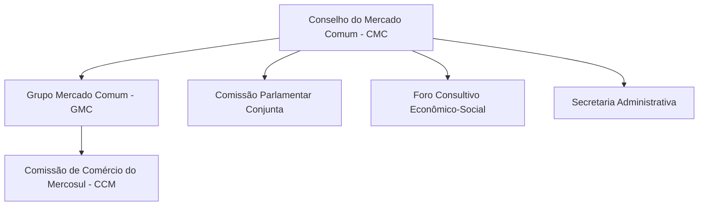

# O Mercosul na Nova República (1985-2025): Do Projeto Estratégico aos Desafios Contemporâneos

## Introdução

O **Mercado Comum do Sul (Mercosul)** firmou-se como o principal projeto de política externa do Brasil no período da Nova República, configurando-se num ambicioso esforço de integração regional sul-americana. Desde sua gênese, no contexto da redemocratização nos anos 1980, até os desafios complexos enfrentados nas últimas décadas, o bloco passou por fases distintas de construção institucional, avanços e recuos. Esta nota analisa a trajetória completa do Mercosul – da visão estratégica que uniu Brasil e Argentina pós-1985, passando pela consolidação institucional dos anos 1990, até a crise de identidade e os impasses contemporâneos no período pós-2015 –, com foco especial nos debates atuais sobre **flexibilização das regras do bloco** e no **Acordo Mercosul-União Europeia**. O objetivo é dissecar os principais eventos, conceitos e dilemas que marcam a história do bloco, com ênfase nas perspectivas da **política externa brasileira**.

## Gênese do Mercosul (1985-1991): Um Projeto Político e Estratégico

A formação do Mercosul teve raízes essencialmente **políticas e estratégicas**, iniciando-se com a **reaproximação histórica entre Brasil e Argentina** em meados da década de 1980. Com o fim dos regimes militares e a restauração da democracia em ambos os países, abriu-se espaço para superar décadas de rivalidade geopolítica. A **Declaração de Iguaçu**, assinada em 30 de novembro de 1985 pelos presidentes Raúl Alfonsín e José Sarney, simbolizou esse momento de virada. O encontro de Foz do Iguaçu não só celebrou a sintonia política das novas democracias, mas **lançou as bases de um plano estratégico de integração binacional**, deixando claro que Brasil e Argentina haviam **“sobrepujado, de forma definitiva, a ideia de ver no outro uma ameaça geopolítica, militar e econômica”**. Em outras palavras, a antiga hipótese de conflito na Bacia do Prata foi substituída pela noção de cooperação, inaugurando uma nova fase nas relações bilaterais.

> [!note] **Confiança Mútua: Iguaçu, PICE e Cooperação Nuclear**  
> Os anos seguintes à Declaração de Iguaçu foram marcados por medidas concretas de **construção de confiança** entre Brasil e Argentina. Destacam-se:  
> – **Programa de Integração e Cooperação Econômica (PICE)**: lançado em julho de 1986, abrangeu 24 protocolos setoriais visando liberalizar o comércio e coordenar políticas entre os dois países. O PICE foi um marco decisivo que **aprofundou a interdependência econômica bilateral**, pavimentando o caminho para um espaço econômico comum.  
> – **Acordos de cooperação nuclear**: em paralelo ao PICE, Brasil e Argentina firmaram em 1985 uma Declaração Conjunta sobre Política Nuclear, culminando na criação da **Agência Brasileiro-Argentina de Contabilidade e Controle de Materiais Nucleares (ABACC)** em 1991. Essa iniciativa eliminou suspeitas mútuas no campo nuclear e foi essencial para **dissipar a desconfiança estratégica** acumulada durante a corrida armamentista do período anterior.  
> – **Tratado de Integração, Cooperação e Desenvolvimento (1988)**: assinado pelos presidentes Sarney e Alfonsín, estabeleceu a meta de criar em até 10 anos um **“espaço econômico comum”** entre Brasil e Argentina, com liberalização integral de comércio de bens e serviços. Esse tratado bilateral acelerou o processo integracionista, servindo de ponte entre as iniciativas do PICE e a etapa subsequente de integração regional mais ampla.

A consolidação dessa aproximação bilateral criou as condições para **expandir o projeto a nível regional**. Em março de 1991, já sob os governos de Fernando Collor (Brasil) e Carlos Menem (Argentina) – que adotavam políticas econômicas liberalizantes –, juntaram-se ao processo o Paraguai e o Uruguai, resultando na assinatura do **Tratado de Assunção**. Esse tratado constituiu formalmente o Mercosul, definindo o objetivo de estabelecer um **Mercado Comum** entre os quatro países fundadores. O **Artigo 1º** do Tratado de Assunção estipulou que o Mercado Comum do Sul deveria estar implementado até 31 de dezembro de 1994, pressupondo: **livre circulação de bens, serviços e fatores de produção**, a **instituição de uma Tarifa Externa Comum (TEC)** e de uma **política comercial comum** frente a terceiros, além da **coordenação de políticas macroeconômicas** e da **harmonização de legislações** em áreas pertinentes. Em suma, almejava-se uma integração econômica profunda nos moldes do **Mercado Comum Europeu**, embora com prazos bastante ambiciosos e levando em conta princípios de **gradualismo e flexibilidade** para acomodar assimetrias entre os países.

O Mercosul nascia, portanto, de uma **vontade política** de cooperação regional sob a égide da democracia e do desenvolvimento conjunto. A superação da rivalidade histórico-estrutural entre Brasil e Argentina foi a pedra angular desse projeto, permitindo canalizar esforços conjuntos para enfrentar desafios comuns – desde o atraso tecnológico e a crise da dívida externa latino-americana nos anos 1980 até a necessidade de ampliação de mercados para sustentar a modernização econômica no fim da Guerra Fria. O Tratado de Assunção consagrou essa visão ao incluir não apenas cláusulas comerciais, mas também a ideia de coordenação de políticas e **compromisso com a democracia**, prenúncio do que viria a ser formalizado mais tarde no Protocolo de Ushuaia (1998) sobre a cláusula democrática.

## Consolidação Institucional e Expansão (Anos 1990)

Após 1991, o Mercosul ingressou em uma fase de **consolidação institucional** e **expansão de suas bases jurídicas e econômicas**. Um marco fundamental ocorreu em dezembro de 1994, com a assinatura do **Protocolo de Ouro Preto** – instrumento que dotou o bloco de personalidade jurídica internacional e definiu sua estrutura institucional de caráter intergovernamental. Diferentemente da União Europeia, optou-se por um **modelo decisório horizontal, baseado no consenso entre os Estados-partes**, sem órgãos supranacionais. O Protocolo de Ouro Preto estabeleceu os principais órgãos do Mercosul, a saber: o **Conselho do Mercado Comum (CMC)**, instância máxima formada por chanceleres e ministros de Economia; o **Grupo Mercado Comum (GMC)**, órgão executivo de coordenação; e a **Comissão de Comércio do Mercosul (CCM)**, de natureza técnica para administração das políticas comerciais. Além disso, foram criados a **Comissão Parlamentar Conjunta** (embrião do atual Parlamento do Mercosul), o **Foro Consultivo Econômico-Social** (integrando representantes da sociedade civil) e a **Secretaria Administrativa** (estabelecida em Montevidéu). Essa arquitetura institucional, ainda vigente em essência, reflete a lógica **intergovernamental** e a preferência por mecanismos de cooperação estatal, evitando delegar soberania a entes autônomos.

> [!definition] **Protocolo de Ouro Preto (1994)**  
> Tratado adicional ao de Assunção que **instituiu a estrutura organizacional do Mercosul** e conferiu-lhe personalidade jurídica internacional. O protocolo reafirmou o caráter **intergovernamental** do bloco – decisões por consenso, requerendo internalização nos ordenamentos nacionais – e estabeleceu órgãos decisórios (CMC, GMC, CCM) e consultivos. Com Ouro Preto, o Mercosul pôde atuar como sujeito de direito internacional, firmando acordos com outros países e blocos. Em suma, Ouro Preto **consolidou juridicamente** o Mercosul, preparando-o para entrar em vigor pleno como união aduaneira a partir de 1º de janeiro de 1995.

No plano econômico, a segunda metade da década de 1990 foi marcada pela implementação das obrigações do Tratado de Assunção, em especial a criação de uma **união aduaneira**. Em 1º de janeiro de 1995 entrou em vigor a **Tarifa Externa Comum (TEC)** para grande parte do universo tarifário, acompanhada da eliminação quase total das tarifas internas entre os membros. Na prática, contudo, o Mercosul constituiu-se como uma **“união aduaneira imperfeita”**. Muitos produtos considerados sensíveis – como itens do setor automotivo, açúcar, dentre outros – ficaram de fora do regime comum e integraram listas nacionais de exceções à TEC, impedindo que 100% das mercadorias fossem abrangidas pela tarifa zero intrabloco. Esse desenho incompleto permitiu acomodar diferenças setoriais e assimetrias econômicas, mas legou desafios de coordenação que perduram. Ainda assim, os resultados comerciais do Mercosul nos anos 1990 foram expressivos: o comércio intrarregional cresceu significativamente e cadeias produtivas começaram a se integrar. Por exemplo, a corrente de comércio brasileira com os vizinhos quadruplicou entre 1991 e 1998, impulsionando exportações industriais brasileiras. Em paralelo, porém, a **coordenação de políticas macroeconômicas** mostrou-se problemática, prejudicada por fatores como a assimetria de tamanho entre as economias e choques cambiais (notadamente a maxidesvalorização do real em 1999).

No final dos anos 1990, o bloco também **expandiu seu âmbito geográfico e temático**. Foram assinados acordos de livre comércio associando Chile (1996) e Bolívia (1997) como **Estados Associados** do Mercosul, ampliando a influência regional do grupo. Ademais, avançou-se em agendas políticas: em 1998, por exemplo, os membros adotaram o **Protocolo de Ushuaia**, introduzindo a **cláusula democrática** que condiciona a participação no Mercosul ao respeito às instituições democráticas. Tal cláusula seria aplicada nos anos seguintes, destacadamente para suspender temporariamente o Paraguai em 2012 (após ruptura democrática no impeachment do presidente Lugo) e a Venezuela em 2017 (devido ao rompimento da ordem democrática sob o regime de Nicolás Maduro). No cômputo geral, ao fim da década de 1990 o Mercosul havia se consolidado como união aduaneira (ainda que imperfeita) e evoluído de um projeto estritamente comercial para uma **integração de natureza mais complexa**, com dimensões institucionais, políticas e sociais agregadas à econômica.

## Estágio Atual e Desafios Contemporâneos (pós-2015)

Entrando na segunda metade da década de 2010, o Mercosul deparou-se com **desafios de natureza inédita** em sua trajetória, desencadeando o que muitos analistas qualificam como uma **crise de integração e de identidade** do bloco. Três ordens de dificuldades merecem destaque: (1) a **paralisia e tensões político-ideológicas internas**, que minaram a coesão do bloco; (2) o **debate sobre flexibilização** das regras fundamentais do Mercosul, especialmente no tocante à negociação conjunta de acordos comerciais (a chamada _“regra de ouro”_ do bloco); e (3) os **impasses na agenda de negociações externas**, ilustrados sobretudo pelo arrastado Acordo Mercosul-União Europeia e por iniciativas com outros parceiros. Adicionalmente, o período recente viu evoluções no quadro de membros – com a **adesão em curso da Bolívia** e a continuidade da **suspensão da Venezuela** – refletindo os condicionantes políticos da integração. A seguir, cada um desses aspectos é examinado em detalhe.

### Crise de integração e tensões político-ideológicas

Desde meados da década de 2010, o Mercosul vivencia um período de **esvaziamento relativo e desacordo entre seus membros**, decorrente em parte da mudança no ciclo político na região. A chamada “onda rosa” (governos de centro-esquerda) que havia prevalecido nos anos 2000 cedeu espaço, a partir de 2015-2016, a lideranças de centro-direita em países-chave – como a vitória de Mauricio Macri na Argentina (2015) e a ascensão de Michel Temer e, posteriormente, Jair Bolsonaro no Brasil (2016 e 2019). Essa inflexão ideológica expôs visões divergentes sobre os rumos do bloco: de um lado, setores defendendo maior abertura econômica e liberalização; de outro, vozes receosas quanto à perda de autonomia e defesa de políticas mais protecionistas.

Os efeitos dessas divergências ficaram evidentes em momentos simbólicos. No aniversário de 30 anos do Mercosul, celebrado em março de 2021, uma cúpula presidencial realizada por videoconferência evidenciou um **franco descompasso entre os líderes**. Na ocasião, o presidente brasileiro Jair Bolsonaro retirou-se abruptamente da reunião após atritos, evidenciando a falta de sintonia política interna. Como observaram analistas, **“a grave crise sanitária (...) e os devastadores efeitos econômicos da pandemia deveriam ser uma oportunidade para intensificar as convergências, mas a realidade revelou dissensos e desarticulação”**. Em suma, **rusgas ideológicas** entre governos de orientação distinta (por exemplo, entre Bolsonaro e o presidente argentino Alberto Fernández) **prejudicaram o andamento da integração** e quase inviabilizaram declarações ou iniciativas conjuntas no período.

Paralelamente, indicadores econômicos refletiram um certo declínio da centralidade do Mercosul para seus membros, sobretudo para o Brasil. A participação do bloco no comércio exterior brasileiro caiu de 17,4% em 1998 para menos de 6% em 2020. Em 2019, o intercâmbio Brasil-Mercosul representou apenas 1,5% do PIB brasileiro. Essa perda de dinamismo comercial intra-bloco – em parte efeito das crises econômicas regionais e da própria diversificação de mercados pelos países – reforçou a percepção de **estagnação**. Muitos passaram a questionar se o Mercosul estaria **“andando em círculos”**, incapaz de avançar para além de uma união aduaneira incompleta e tampouco disposto a retroceder a uma simples área de livre-comércio. Alguns estudiosos apontaram a existência de uma **“crise de identidade”** no Mercosul, diante de impasses sobre aprofundar a integração vs. flexibilizá-la. De fato, já em 2019 identificavam-se quatro cenários teóricos para o futuro do bloco: ruptura/extinção, manutenção do _status quo_ com crescente flexibilização, regressão a zona de livre comércio, ou aprofundamento em direção ao mercado comum. Esse debate conceitual ganhou contornos práticos nos últimos anos, especialmente em torno da questão da **regra de negociação conjunta de acordos comerciais**.

### O debate da flexibilização: a _regra de ouro_ do Mercosul em xeque

Um dos temas mais candentes no Mercosul contemporâneo é a proposta de **flexibilização das regras do bloco para permitir acordos comerciais individuais** de seus membros. Desde a fundação, vigora no Mercosul o princípio de negociar acordos extrarregionais **em conjunto**, derivado da união aduaneira e consagrado juridicamente pela Decisão 32/00 do Conselho do Mercado Comum. Essa “_regra de ouro_” – nenhum Estado-parte pode concluir tratado de livre-comércio separadamente – visa resguardar a TEC e o poder de barganha coletivo. Entretanto, diante da lentidão do bloco em firmar novos acordos, alguns membros menores passaram a questionar essa restrição.

Em particular, o **Uruguai**, sob o governo de Luis Lacalle Pou (desde 2020), assumiu postura abertamente favorável a flexibilizar o Mercosul. Montevidéu argumenta que, por seu porte econômico modesto, o Uruguai não pode se dar ao luxo de ficar atado a um Mercosul estagnado, sob pena de perder oportunidades de integração a cadeias globais. Em 2021, Lacalle Pou anunciou o início de **negociações bilaterais com a China** para um acordo de livre-comércio, _a despeito_ das regras do bloco. Essa iniciativa unilateral gerou forte atrito: Argentina e Paraguai reagiram negativamente, lembrando que tal tratado violaria o marco legal mercosulino. O então presidente argentino, Alberto Fernández, chegou a declarar que o Uruguai deveria escolher “ou a China, ou o Mercosul” caso insistisse nesse caminho. Analistas passaram a alertar para o **risco de cisão interna**: _“o rompimento dessa regra de ouro deixa o Mercosul sob risco de cisão, caso algum membro discorde da negociação”_.

Do lado brasileiro, a posição variou conforme o governo. Durante a gestão Bolsonaro/Guedes, o Brasil manifestou simpatia pela ideia de modernização e certa flexibilização – alinhando-se à pressão por abertura comercial e redução da TEC. Já com a volta de Lula em 2023, Brasília retomou um tom mais integracionista clássico, enfatizando a necessidade de consenso e de fortalecimento do Mercosul como plataforma comum (embora sem descartar ajustes). De todo modo, até o momento **nenhuma mudança formal** foi adotada na regra da negociação conjunta – em grande parte devido à firme oposição argentina (sobretudo durante o governo Fernández) e paraguaia, que temem que a flexibilização **“seria o fim do Mercosul como união alfandegária”**.

> [!important] **Impasse Mercosul: acordos em bloco vs. acordos individuais**  
> _“O Mercosul entrou nessa queda de braço: assinar acordos com terceiros países **em conjunto** ou flexibilizar as regras para permitir acordos **individuais**. O bloco está em plena discussão sobre o seu futuro”_.  
> _– Marcelo Elizondo, especialista em Mercosul (RFI, 2021)_

Enquanto as discussões prosseguem, o Uruguai aventa alternativas drásticas. Lideranças uruguaias sugeriram transformar o país em **membro associado** (rebaixando seu status) para escapar da TEC e recuperar “soberania comercial”. Outra via especulada seria negociar fora do Mercosul e depois tentar incorporar os demais via cláusulas de adesão diferenciada (_multi-speed_ integration). Por ora, nenhuma dessas opções se concretizou, mas a pressão uruguaia surtiu alguns efeitos: reacendeu-se o debate sobre **redução tarifária na TEC** (com o Brasil promovendo cortes unilaterais em 2022, temporariamente aceitos pelo Mercosul sob justificativa de pandemia) e impeliu o bloco a buscar acelerar acordos pendentes, para não perder membros. A expectativa é que a questão da flexibilização permaneça central, especialmente com a possível chegada de governos mais liberais na região (por exemplo, discute-se que a eventual ascensão de lideranças pró-mercado na Argentina poderia alinhar-se à posição uruguaia). Em suma, a **“regra de ouro” do Mercosul** – negociar em bloco – está sob escrutínio como nunca antes, numa tensão entre preservação da **coesão regional** e busca por **agilidade individual**.

### Acordo Mercosul–União Europeia: impasses e perspectivas

A negociação de um acordo de associação birregional entre Mercosul e União Europeia (UE) constitui, sem dúvida, o **principal dossiê externo** do bloco sul-americano nas últimas décadas. Iniciadas formalmente em 1999, as tratativas Mercosul-UE foram concluídas _em princípio_ apenas em 2019 – após **20 anos e 40 rodadas** de idas e vindas – marcando um feito diplomático celebrado pelos governos à época. O acordo prometia criar uma das maiores áreas de livre-comércio do mundo, envolvendo mercados que somam 750 milhões de pessoas e cerca de 25% do PIB global. Contudo, **passados vários anos desde o “fechamento” em junho de 2019, o acordo ainda não entrou em vigor nem foi ratificado pelas partes**, enfrentando **novos obstáculos de ordem ambiental, comercial e política**.

Um fator crítico para o atraso foi o chamado **“efeito Bolsonaro”**. Parlamentares europeus congelaram o processo de ratificação após 2019, alegando ser politicamente inviável aprovar um tratado com o Brasil num momento em que a imagem ambiental brasileira estava profundamente arranhada pelos altos índices de desmatamento e queimadas na Amazônia. Países como França e Áustria deixaram claro que, nos termos originais, não ratificariam o acordo sem garantias adicionais de sustentabilidade. Assim, a UE propôs em 2023 a inclusão de um **“instrumento adicional” (side letter)** com compromissos ambientais vinculantes por parte do Mercosul. Entre as exigências europeias estão: garantias contra o **desmatamento** (principalmente na Amazônia), respeito a acordos climáticos, mecanismos de implementação do Acordo de Paris, além de cláusulas chamadas **“espelho”** – que condicionariam a entrada de produtos no mercado europeu ao cumprimento de padrões ambientais e sanitários equivalentes aos exigidos na Europa. Um exemplo sensível é a questão dos **agrotóxicos**: diversos pesticidas liberados no Brasil nos últimos anos são proibidos na UE, e parlamentares europeus defendem que o acordo impeça a importação de mercadorias produzidas com tais substâncias.

Do lado do Mercosul (especialmente do Brasil), essas demandas extras foram recebidas com reserva. O governo brasileiro de Luiz Inácio Lula da Silva, empossado em 2023, assumiu um discurso pró-meio ambiente e **reiterou a vontade de concluir o acordo ainda em 2023**. Entretanto, Lula qualificou os termos adicionais propostos como **“imposições inaceitáveis”**, defendendo a renegociação de partes do texto. As resistências do Mercosul concentram-se na percepção de que as cláusulas ambientais europeias possam restringir a competitividade do agronegócio sul-americano e violar a soberania em políticas de desenvolvimento. Além disso, há **divergências intra-Mercosul**: a Argentina manifestou preocupações de que a abertura comercial à Europa prejudique setores industriais domésticos (postura mais pronunciada sob o governo Fernández), ao passo que Uruguai e Paraguai pressionam por aproveitar os benefícios do acordo o quanto antes. O Brasil, por sua vez, busca um equilíbrio – quer salvaguardas para sua política de **reindustrialização e compras governamentais**, pontos que considerou pouco endereçados no texto original, mas sem perder a janela estratégica de fechar o tratado.

No campo europeu, tampouco há unanimidade. A **França** desponta como principal opositor, muito vocal em temas agrícolas e ambientais, enquanto países como Alemanha e Espanha desejam avançar. Setores protecionistas europeus (notadamente agricultores) alegam preocupação com a concorrência de produtos sul-americanos mais baratos e com padrões de produção distintos. Já o setor industrial europeu, de olho em acesso aos mercados do Mercosul, pressiona pela conclusão. Esse jogo de forças interno, somado ao calendário político (eleições para o Parlamento Europeu em 2024), cria um cenário incerto. Há quem tema que, se não houver acordo até meados de 2024, o tratado possa ficar indefinidamente na geladeira.

Em resumo, o acordo Mercosul-UE se transformou num **impasse emblemático**: de um lado, é visto como _vital_ para o Mercosul ampliar sua inserção global e reduzir a dependência em relação à China; de outro, expôs fraturas de confiança e diferenças de visão em temas sensíveis como meio ambiente. No momento, as partes negociam uma solução de meio-termo para a questão ambiental – possivelmente introduzindo garantias mútuas sem reabrir completamente o tratado. A presidência brasileira do Mercosul em 2023 trabalhou para apresentar contrapropostas à UE (o Mercosul enviou resposta à side letter europeia em setembro de 2023, por exemplo). Resta avaliar se haverá vontade política suficiente para um consenso. Caso se supere o entrave, o acordo ainda precisará ser assinado oficialmente e ratificado por todos os Parlamentos nacionais dos países envolvidos, um processo que pode ser longo. Enquanto isso, o **ceticismo** permanece: passados quase **25 anos desde o início das negociações**, o Mercosul-UE tornou-se um teste decisivo da capacidade do Mercosul em **entregar resultados concretos** na frente externa e conciliar desenvolvimento econômico com sustentabilidade ambiental – um tema caro à diplomacia contemporânea.

### Outras frentes externas: Singapura e além

Apesar das dificuldades com a UE, o Mercosul obteve recentemente algumas vitórias em sua **agenda de negociações externas**, indicando um esforço de reativação. Em **7 de dezembro de 2023**, durante a Cúpula de Presidentes no Rio de Janeiro, foi assinado o **Acordo de Livre-Comércio Mercosul–Singapura**. Trata-se do primeiro acordo comercial concluído pelo Mercosul desde 2011 e, notavelmente, o primeiro com um país asiático. Pelo acordo, Singapura eliminará imediatamente 100% de suas tarifas de importação para produtos do Mercosul, enquanto os membros do bloco concederão acesso livre para cerca de 95,8% dos produtos de Singapura, com desgravação escalonada em até 15 anos. Produtos considerados “sensíveis” pelos sul-americanos foram excluídos, resguardando setores estratégicos. O tratado com Singapura abrange também disciplinas modernas – comércio de serviços, investimentos, compras governamentais, facilitação de comércio, propriedade intelectual, comércio eletrônico, etc. – bem como mecanismos próprios de solução de controvérsias. Sua assinatura marcou um importante **passo de abertura** do Mercosul no cenário asiático e sinalizou aos parceiros (e aos membros internos, como o Uruguai) que o bloco ainda pode celebrar acordos quando há convergência de interesses.

Além de Singapura, o Mercosul vem buscando diversificar suas parcerias: concluiu, em paralelo ao acordo UE, um **Acordo de Livre-Comércio com a EFTA** (Associação Europeia de Livre-Comércio, que inclui Suíça, Noruega, Islândia e Liechtenstein) em 2019. Negociações também estão em andamento com o **Canadá**, a **Coreia do Sul** e a **Indonésia**, entre outros. Essas tratativas visam ampliar mercados para exportações agrícolas e industriais do Mercosul, reduzindo a dependência de mercados tradicionais e respondendo à dinâmica de proliferação de acordos comerciais bilaterais no mundo.

Mesmo o **Reino Unido**, pós-Brexit, manifestou interesse em estreitar relações comerciais com o Mercosul, embora formalmente ainda não haja negociação de FTA lançada. Igualmente, acordos de cooperação foram firmados com a **Aliança do Pacífico** (grupo de países latino-americanos mais abertos) buscando convergência em agendas aduaneiras e facilitação de comércio.

Esses esforços indicam que, _“em um mundo de incertezas no multilateralismo da OMC”_, o Mercosul procura recuperar terreno via acordos preferenciais. Contudo, desafios permanecem: é preciso conciliar as diferentes ambições dentro do bloco (por exemplo, Argentina tradicionalmente mais cautelosa vs. Uruguai mais agressivo em liberalização) e garantir que os acordos firmados sejam efetivamente ratificados e implementados. De todo modo, o acordo com Singapura – já encaminhado para os Parlamentos nacionais em 2024 – é um alento e pode servir de modelo para futuros entendimentos com economias asiáticas de médio porte.

### Adesões e suspensões: Bolívia e Venezuela

A dimensão político-institucional do Mercosul envolveu, nos anos recentes, a questão de sua **ampliação e da aplicação de suas cláusulas democráticas**. Dois casos merecem menção: **Bolívia** e **Venezuela**.

A **República da Bolívia** vinha buscando tornar-se membro pleno do Mercosul desde o início da década de 2010. O **Protocolo de Adesão da Bolívia** foi assinado em 2015, mas a incorporação efetiva ficou pendente por anos aguardando a ratificação pelos Parlamentos de todos os Estados-partes. Em dezembro de 2023, enfim, na Cúpula do Mercosul no Rio de Janeiro, os presidentes do bloco anunciaram a **integração oficial da Bolívia como quinto Estado-parte**, após a conclusão das ratificações pendentes (inclusive pelo Brasil, que aprovou o protocolo em 2023). Em julho de 2024, o parlamento boliviano sancionou a adesão, e o presidente Luis Arce promulgou a lei doméstica correspondente, formalizando a entrada do país no Mercosul. De acordo com os termos do protocolo, a Bolívia terá um período de **até quatro anos** para se adaptar integralmente ao acervo normativo do Mercosul (mais de 4.500 normas). Nesse intervalo, deve gradualmente implementar a TEC e as demais obrigações, passando por um cronograma de convergência. Com a adesão boliviana, o Mercosul **passa a contar seis membros plenos (incluindo a Venezuela, atualmente suspensa)** e alcança de fato toda a América do Sul continental, à exceção de Guianas e Suriname. A entrada da Bolívia é estratégica por diversos motivos: incorpora um importante produtor de gás natural e minerais, conecta geograficamente o Mercosul à região andina e cumpre o objetivo histórico de Artigo 1º do Tratado de Assunção de abertura a outros parceiros latino-americanos. Para a Bolívia, por sua vez, significa acesso a um mercado ampliado e a institucionalização de vínculos comerciais já expressivos (o país já possuía um ACE – Acordo de Complementação Econômica – com o Mercosul desde 1997). Resta acompanhar como o país administrará a transição, dada sua dependência de tarifas aduaneiras e a necessidade de não firmar novos acordos extrarregionais individuais (o protocolo de adesão inclui expressamente a obrigação de respeitar a regra de negociação conjunta).

Por outro lado, a situação da **Venezuela** evidencia a interface entre integração e democracia no Mercosul. O país aderiu ao bloco em 2012, em circunstâncias peculiares: a negociação vinha desde 2006, mas estava travada pela não-aprovação no Senado paraguaio; com a suspensão do Paraguai em 2012 (pós-impeachment de Lugo), os demais membros aproveitaram para efetivar a entrada da Venezuela. A Venezuela então participou como membro pleno de 2012 a 2016, porém enfrentou dificuldades em internalizar normas e cumprir obrigações econômicas, ao mesmo tempo em que mergulhava numa grave crise política interna. Em dezembro de 2016, alegando descumprimento de requisitos normativos, os quatro sócios fundadores decidiram suspender a Venezuela do Mercosul. Poucos meses depois, em abril de 2017, a suspensão foi reiterada e fundamentada no **descumprimento da cláusula democrática** do Protocolo de Ushuaia, dada a ruptura da ordem democrática por parte do governo Nicolás Maduro. Desde então, a Venezuela permanece **suspensa indefinidamente** do Mercosul – mantém obrigações adquiridas em acordos anteriores, mas não participa das instâncias decisórias nem goza de benefícios tarifários. A continuidade da suspensão está atrelada à restauração da democracia no país, condição necessária para readmissão. Em 2023, com a mudança de governos no Brasil e Argentina (ambos mais simpáticos a dialogar com Caracas), houve especulações sobre uma possível reaproximação cautelosa, mas nenhum passo formal de reintegração foi dado até 2025. Assim, o caso venezuelano demonstra a relevância do **Protocolo de Ushuaia**: o Mercosul consolidou-se não apenas como um projeto econômico, mas também como uma comunidade de democracias, disposta a **tolher a participação de membros que violem princípios democráticos**. Essa dimensão político-normativa reforça a legitimidade do bloco, mas também implicou na perda temporária de um membro de grande peso petrolífero e geopolítico.

## Conclusão

Em seus 30 e poucos anos de existência, o Mercosul percorreu um caminho que reflete as vicissitudes políticas e econômicas da América do Sul. Foi concebido como **projeto estratégico de política externa brasileira** e sul-americana – visando consolidar a paz regional e alavancar o desenvolvimento econômico conjunto – e alcançou êxitos inegáveis, como a intensificação do comércio intrazona, a criação de uma zona de paz no Cone Sul e a coordenação diplomática em diversos fóruns internacionais. Ao mesmo tempo, enfrenta **limites estruturais** e **desafios contemporâneos** consideráveis: a dificuldade de aprofundar-se até um mercado comum pleno, as tensões entre visões liberais e desenvolvimentistas dentro do bloco, a necessidade de atualizar-se para temas como meio ambiente, economia digital e cadeias globais, e a urgência de provar sua relevância ante as demandas das sociedades atuais.

Do ponto de vista do Brasil, o Mercosul permanece uma peça central de sua política externa regional – _“o caminho natural para a projeção internacional do país”_, nas palavras de muitos chanceleres – mas requer constante calibragem. A atual conjuntura demanda combinar **realismo e ambição**: realismo para reconhecer as assimetrias e limitações (evitando paralisia integracionista), e ambição para promover as reformas e iniciativas necessárias à revitalização do bloco. A “flexibilização” em debate é parte desse dilema: como tornar o Mercosul mais ágil e responsivo, sem diluí-lo ou esvaziá-lo de sentido integracionista.

Por fim, vale recordar que o legado intangível do Mercosul não é menor que o tangível. A construção de uma **“comunidade psicológica não belicista”** no Cone Sul – i.e., a consolidação da confiança mútua e da resolução pacífica de controvérsias – deve-se em grande medida aos êxitos do Mercosul e aos laços criados entre sociedades e governos. Preservar e renovar esse legado é imperativo. Em um mundo de crescentes rivalidades e mudanças constantes, o Mercosul enfrentará pressões, mas também terá oportunidades, se souber se reinventar. Para os diplomatas brasileiros e sul-americanos, a missão que se impõe é **pensar estrategicamente o futuro do bloco**, equilibrando abertura e solidariedade regional, de modo que o Mercosul siga sendo, nas próximas décadas, não um obstáculo, mas um instrumento eficaz de competitividade e desenvolvimento compartilhado na região.

> [!question] **Perguntas para Autoavaliação**
> 
> 1. **Relações Brasil-Argentina e a criação do Mercosul:** Quais foram os principais fatores políticos que permitiram a aproximação entre Brasil e Argentina nos anos 1980 e como essa convergência se refletiu nas etapas iniciais de formação do Mercosul (Declaração de Iguaçu, PICE, Tratado de Assunção)?
>     
> 2. **União Aduaneira Imperfeita:** Por que o Mercosul é frequentemente caracterizado como uma _“união aduaneira imperfeita”_? Explique quais obstáculos impediram a plena implementação do mercado comum conforme previsto em 1991 e analise os impactos disso na credibilidade do bloco.
>     
> 3. **Flexibilização vs. Coesão Regional:** Avalie criticamente o debate recente sobre a flexibilização do Mercosul. Quais são os argumentos a favor e contra permitir que membros firmem acordos individuais fora do bloco? Em sua resposta, considere os possíveis efeitos dessa mudança sobre a unidade e o peso negociador do Mercosul, mencionando o caso concreto das negociações Uruguai–China.
>     

