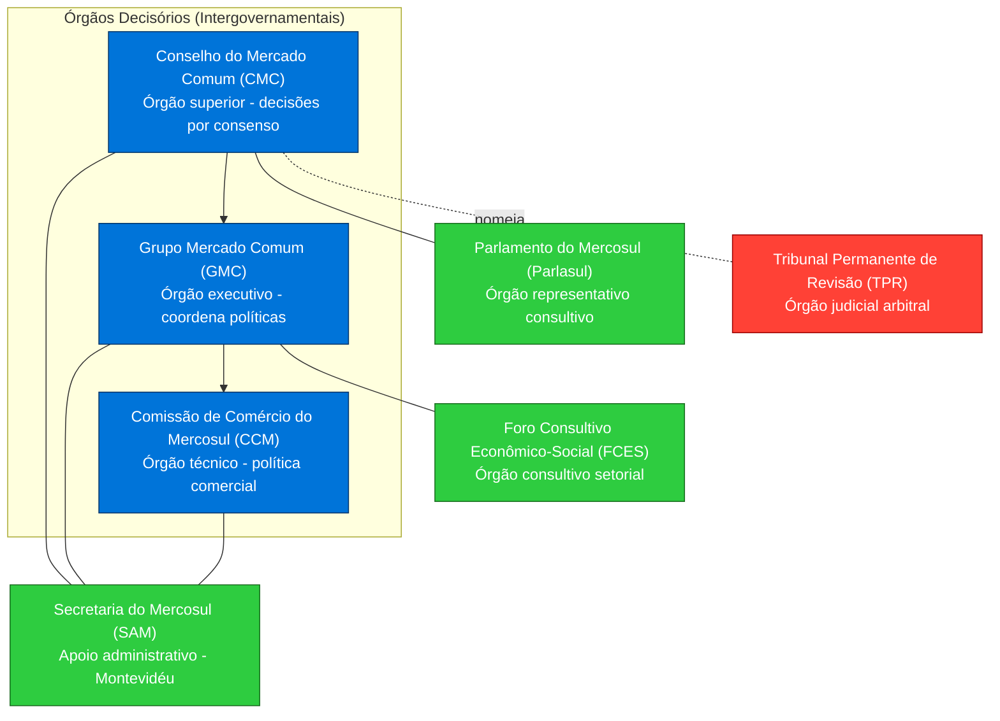
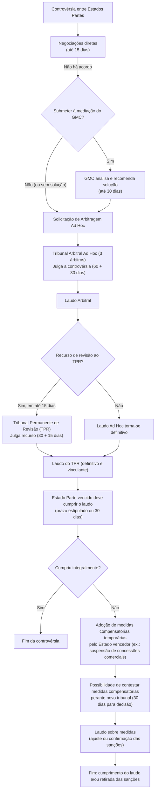

# A Arquitetura Institucional do Mercosul: Estrutura, Funcionamento e o Sistema de Solução de Controvérsias

## Estrutura Institucional do Mercosul (Protocolo de Ouro Preto, 1994)

### Natureza Intergovernamental

O Mercosul é caracterizado por uma **arquitetura intergovernamental**, na qual os Estados-membros tomam decisões por consenso, sem delegar competências decisórias a órgãos supranacionais. O **Protocolo de Ouro Preto (1994)** definiu a estrutura institucional do bloco e confirmou que apenas determinados órgãos possuem capacidade decisória, **todos de natureza intergovernamental**. Isso significa que **não há autoridades independentes** no estilo de uma Comissão Europeia ou de um Tribunal de Justiça autônomo; em vez disso, as decisões são acordadas coletivamente pelos governos dos Estados Partes.

Um **princípio central** é o do **consenso**: _“As decisões dos órgãos do Mercosul serão tomadas por consenso e com a presença de todos os Estados Partes.”_. Na prática, cada país possui poder de veto nas deliberações, assegurando que nenhuma medida seja adotada sem o aval unânime de todos os membros. Essa dinâmica ressalta a preservação da soberania nacional no processo decisório do Mercosul e contrasta com modelos supranacionais em que decisões por maioria podem vincular Estados discordantes.

Consequentemente, **não existe legislação diretamente aplicável no âmbito regional sem incorporação nacional prévia**, nem instituições que imponham decisões diretamente aos Estados ou particulares. O Mercosul funciona como uma _organização internacional clássica_, cujas normas precisam ser internalizadas pelos Parlamentos ou governos dos membros para produzirem efeitos domésticos. Esse desenho institucional, delineado em Ouro Preto, conferiu também personalidade jurídica de direito internacional ao Mercosul, exercida por meio de seu órgão máximo, o Conselho do Mercado Comum (CMC).

> [!important] **Resumo** 
> A estrutura institucional do Mercosul é estritamente intergovernamental. Os Estados Partes decidem em conjunto (por unanimidade) e não delegaram poderes decisórios a entidades supranacionais. Esse modelo assegura a igualdade soberana dos membros, embora possa limitar a agilidade e a coercitividade das decisões do bloco.

### Órgãos Decisórios Principais

O Protocolo de Ouro Preto estabeleceu **três órgãos principais com poder decisório** no Mercosul, todos compostos por representantes dos governos dos Estados-membros:

#### Conselho do Mercado Comum (CMC)

O **CMC** é o órgão superior do Mercosul e responsável pela **condução política** do processo de integração. Nele repousa a autoridade final para tomadas de decisão de maior porte, visando assegurar o cumprimento dos objetivos do Tratado de Assunção e a constituição do mercado comum.

- **Composição:** É formado pelos **Ministros das Relações Exteriores e da Economia** (ou seus equivalentes) de cada Estado Parte. Adicionalmente, os Presidentes da República costumam participar das reuniões semestrais de cúpula do CMC, o que realça seu caráter político de alto nível.
    
- **Presidência rotativa:** A presidência do CMC é exercida em rodízio semestral por cada país, em ordem alfabética.
    
- **Competências:** O CMC define políticas e orienta o processo de integração. Entre suas funções, destacam-se: velar pelo cumprimento do Tratado e dos protocolos; formular políticas para conformação do mercado comum; **exercer a titularidade da personalidade jurídica do Mercosul** (ou seja, o CMC age em nome do bloco); negociar e firmar acordos internacionais em nome do Mercosul (podendo delegar ao GMC em certos casos); criar ou modificar órgãos do Mercosul, incluindo reuniões de ministros em áreas específicas; e decidir matérias financeiras e orçamentárias do bloco. Em suma, o CMC combina atribuições **político-estratégicas** e normativas de cúpula.
    
- **Atos normativos:** As decisões do CMC, denominadas **“Decisões”**, têm caráter obrigatório para os Estados Partes. Tais Decisões orientam o rumo do bloco e frequentemente requerem posterior **internalização** pelas legislações nacionais.
    

#### Grupo Mercado Comum (GMC)

O **GMC** é definido como o **órgão executivo** do Mercosul. Atua como instância permanente de coordenação governamental, encarregada de implementar as decisões políticas do CMC e de supervisionar o funcionamento cotidiano do bloco.

- **Composição:** Cada país designa **quatro membros titulares e quatro alternos** para o GMC, incluindo obrigatoriamente representantes dos Ministérios das Relações Exteriores, dos Ministérios da Economia (ou equivalentes) e dos Bancos Centrais. O GMC é coordenado pelos Ministérios das Relações Exteriores dos membros, refletindo a primazia diplomática na integração.
    
- **Funcionamento:** O GMC reúne-se periodicamente (ordinária e extraordinariamente, conforme necessário) e pode convidar representantes de outros órgãos governamentais ou do Mercosul para colaborar, conforme o assunto em debate. Ele organiza as reuniões do CMC e prepara estudos e projetos a pedido deste.
    
- **Competências:** Dentre as atribuições do GMC estão: garantir, no limite de suas competências, o cumprimento do Tratado de Assunção, protocolos e acordos; **propor projetos de Decisão ao CMC**; adotar medidas necessárias para executar as Decisões do CMC; estabelecer programas de trabalho para avançar na integração; criar ou extinguir órgãos técnicos auxiliares (como subgrupos de trabalho e reuniões especializadas); **negociar acordos externos** delegados pelo CMC; aprovar o orçamento anual do Mercosul e supervisionar a Secretaria Administrativa.
    
- **Atos normativos:** As decisões do GMC são chamadas **“Resoluções”**, obrigatórias para os Estados após aprovadas. Essas resoluções, de caráter mais executivo e administrativo, também necessitam de incorporação nacional conforme a matéria.
    

#### Comissão de Comércio do Mercosul (CCM)

A **CCM** funciona como **órgão técnico** encarregado dos assuntos comerciais e da implementação diária da união aduaneira e política comercial comum. Ela serve de instância de gestão e aplicação das regras acordadas em matéria tarifária e comercial.

- **Composição:** É integrada por **quatro membros titulares e quatro alternos por país**, geralmente técnicos governamentais das áreas de comércio exterior, e coordenada pelos Ministérios das Relações Exteriores.
    
- **Funcionamento:** A CCM **reúne-se pelo menos uma vez por mês** ou sempre que solicitada pelo GMC ou por qualquer Estado Parte, dada a necessidade de acompanhamento contínuo das questões comerciais.
    
- **Competências:** Incluem: zelar pela aplicação dos instrumentos da política comercial comum (como a Tarifa Externa Comum – TEC – e listas de exceção); monitorar o comércio intra-Mercosul e com terceiros países e avaliar a evolução das políticas comuns; analisar pedidos dos Estados sobre aplicação da TEC ou outras políticas comerciais e se pronunciar a respeito; **tomar decisões na administração da TEC e instrumentos comuns** acordados; propor ao GMC novas normas ou ajustes nas existentes em matéria comercial e aduaneira; e estabelecer comitês técnicos para assessorá-la.
    
- **Atos normativos:** As decisões da CCM tomam a forma de **“Diretrizes”** (ou **“Diretrizes”**), que também são **obrigatórias** para os Estados uma vez emitidas. Em alguns casos, a CCM pode também emitir **“Propostas”** elevadas ao GMC. Notavelmente, a CCM possui **atribuição quase jurisdicional** de receber **reclamações** originadas de particulares ou governos sobre violações comerciais (conforme previsto no Anexo do Protocolo de Ouro Preto, referente ao antigo Protocolo de Brasília). Essas reclamações por parte de empresas ou indivíduos afetados por medidas nacionais podem ser canalizadas pelas Seções Nacionais da CCM, oferecendo um meio consultivo de alerta de descumprimentos, embora sem acesso direto ao sistema contencioso (ver seção sobre particulares).
    

> [!note] **Hierarquia de Normas** 
> Cada órgão decisório expede normas com denominações distintas (Decisões do CMC, Resoluções do GMC e Diretrizes da CCM), mas **todas têm status de compromissos obrigatórios intra-bloco**. Elas integram as chamadas **fontes jurídicas do Mercosul**, abaixo apenas do próprio Tratado de Assunção e seus protocolos. Contudo, para produzirem efeitos, tais normas carecem de implementação nacional, conforme veremos adiante em “Funcionamento do bloco”.

### Outros Órgãos Relevantes

Além dos três órgãos decisórios intergovernamentais, a estrutura institucional do Mercosul conta com **órgãos de natureza consultiva e de apoio**, que embora não detenham poder de decisão vinculante, cumprem papéis importantes de representação política, participação social e suporte administrativo. Destacam-se:

#### Parlamento do Mercosul (Parlasul)

O **Parlasul** é o órgão **representativo dos Parlamentos nacionais** no âmbito do Mercosul. Ele sucedeu à antiga Comissão Parlamentar Conjunta (CPC) estabelecida em Ouro Preto. Enquanto a CPC era composta por parlamentares indicados pelos Congressos nacionais e tinha funções de harmonização legislativa e internalização mais ágeis das normas, o Parlasul, criado em 2005, caminha em direção a uma representação **cidadã** do processo de integração, com previsão de parlamentares eleitos diretamente (ainda em transição, pois nem todos os países realizam eleições diretas para o Parlasul).

- **Natureza e composição:** O Parlasul é um órgão **consultivo e deliberativo em âmbito político**, reunindo representantes dos Estados Partes (atualmente escolhidos pelos parlamentos nacionais, com a perspectiva de eleições diretas no futuro). Todos os Estados têm número igual de parlamentares no órgão durante a fase inicial, buscando representar de forma equilibrada os interesses nacionais.
    
- **Competências:** O Parlasul **não legisla vinculativamente** para o bloco (diferentemente do Parlamento Europeu, por exemplo). Suas atribuições incluem: debater temas de interesse regional; emitir **recomendações e declarações** políticas sobre assuntos relevantes; elaborar **projetos de normas** e pareceres não obrigatórios a respeito de propostas oriundas do CMC; contribuir para a **harmonização legislativa** entre os países; e, significativamente, **solicitar Opiniões Consultivas ao TPR** sobre interpretação do Direito do Mercosul. Essa última função, introduzida com o Protocolo de Olivos, permite ao Parlamento regional levantar dúvidas jurídicas ao Tribunal Permanente de Revisão, embora as respostas não tenham efeito vinculante (ver discussão sobre opiniões consultivas adiante).
    
- **Importância:** O Parlasul representa a perspectiva parlamentar e **democrática** no Mercosul, reforçando a transparência e o debate público do processo integracionista. Entretanto, seu papel prático ainda é limitado, pois o poder normativo efetivo reside nos órgãos executivos do bloco. Ainda assim, ele sinaliza a intenção de, a longo prazo, aproximar o Mercosul de um modelo com maior participação popular.
    

#### Foro Consultivo Econômico-Social (FCES)

O **FCES** é o órgão que dá voz aos **setores econômicos e sociais** no Mercosul. Previsto em Ouro Preto como instância consultiva, o Foro é integrado por representantes de trabalhadores, empresários e outros segmentos da sociedade civil de todos os países, em número igual por Estado Parte.

- **Natureza:** De caráter **meramente consultivo**, o FCES não tem poder decisório. Sua função é **assessorar e opinar** sobre o impacto social e econômico das políticas do Mercosul.
    
- **Competências:** O Foro acompanha e **avalia o impacto** das iniciativas de integração na sociedade, e estuda temas econômicos e sociais relevantes para o processo integracionista. Pode **formular recomendações** ao GMC, expressando preocupações ou sugestões dos setores produtivos e organizações sociais. Por exemplo, pode emitir pareceres sobre efeitos de tal medida em empregos, ou propor iniciativas para aprofundar a dimensão social do Mercosul.
    
- **Papel estratégico:** Embora não vinculativo, o FCES é um canal institucional para inclusão de atores não estatais no debate regional, buscando legitimar e ajustar o processo de integração às necessidades e percepções da sociedade.
    

#### Secretaria do Mercosul (SAM)

A **Secretaria Administrativa do Mercosul (SAM)**, sediada em Montevidéu, é o órgão de **apoio operacional e técnico** do bloco. Sua criação visa dotar o Mercosul de uma memória institucional e de uma estrutura permanente de serviços.

- **Funções administrativas:** A Secretaria funciona como **arquivo oficial** de toda a documentação e legislação do Mercosul, mantendo registros e dados históricos. Ela também é responsável pela **publicação e divulgação** das normas adotadas (Decisões, Resoluções, Diretrizes) e dos laudos arbitrais de controvérsias no _Boletim Oficial do Mercosul_. Dessa forma, assegura-se transparência e publicidade às decisões tomadas.
    
- **Logística e organização:** A SAM organiza as reuniões do bloco, providenciando suporte logístico para os encontros do CMC, GMC, etc., tanto em Montevidéu (sua sede) quanto em outras cidades conforme necessário. Ela presta serviços de tradução, comunicação entre os órgãos, e guarda os tratados e instrumentos ratificados.
    
- **Orçamento:** A Secretaria possui um orçamento próprio, financiado por contribuições iguais dos Estados Partes, para custear seu funcionamento. O GMC aprova e fiscaliza esse orçamento.
    
- **Suporte técnico:** Além das tarefas administrativas, a SAM auxilia no trâmite de procedimentos formais, como por exemplo no **sistema de solução de controvérsias**: é a Secretaria que recebe notificações de disputas, sorteia árbitros quando necessário e comunica prazos processuais aos Estados. Assim, atua como cartório e secretaria dos tribunais arbitrais do Mercosul.
    
- **Limitações:** A Secretaria **não possui competência decisória nem deliberativa**. Seu papel é instrumental, executando orientações emanadas dos órgãos políticos e atuando sob supervisão do GMC. Não se assemelha, portanto, a uma “Comissão” burocrática com iniciativa própria, mas sim a um escritório de apoio.
    

#### Tribunal Permanente de Revisão (TPR)

O **Tribunal Permanente de Revisão (TPR)** é o **órgão judicial de segunda instância** do Mercosul, estabelecido pelo Protocolo de Olivos (2002) como parte do sistema de solução de controvérsias do bloco. Diferentemente dos demais órgãos aqui listados, o TPR **não surgiu com Ouro Preto**, mas sua menção é importante ao descrever a arquitetura institucional atual, pois acrescenta uma dimensão quasi-judicial antes inexistente.

- **Composição:** O TPR é composto por **5 árbitros** designados: cada Estado Parte aponta um árbitro (jurista de reconhecida competência) para mandato de dois anos, renovável até dois períodos. Além desses quatro (um por país), há um quinto árbitro, escolhido consensualmente por todos os membros (ou por sorteio, se não houver unanimidade), para mandato de três anos. Este quinto árbitro não pode ter a nacionalidade de um Estado que esteja envolvido em disputa que ele julgue, garantindo neutralidade adicional.
    
- **Disponibilidade e sede:** Os árbitros do TPR devem manter-se **disponíveis permanentemente** para atuar quando convocados. A sede fixa do Tribunal é **Assunção, Paraguai**, embora ele possa, excepcionalmente, reunir-se em outras cidades do Mercosul conforme a conveniência do caso.
    
- **Competência contenciosa:** O TPR atua principalmente como **instância recursal** das decisões dos Tribunais Arbitrais Ad Hoc (primeira instância nas controvérsias entre Estados). Ou seja, se um Estado não concordar com um laudo arbitral ad hoc, pode recorrer ao TPR para reexaminar as questões de direito. O TPR pode **confirmar, modificar ou revogar** o laudo recorrido, e seu pronunciamento final é **definitivo e obrigatório** sobre a disputa. Em caso de recurso, a decisão do TPR _prevalece_ sobre a do tribunal inicial.
    
- **Funcionamento nos casos concretos:** Quando atua num caso específico, o TPR funciona com um _quórum_ variável:
    
    - Se a disputa for entre dois países, o Tribunal é composto por **3 árbitros**: os árbitros designados pelos dois países litigantes, mais um terceiro árbitro (presidente) sorteado dentre os demais não nacionais das partes. Isso assegura imparcialidade do presidente.
        
    - Se mais de dois países estiverem envolvidos (por ex., um litígio trilateral), então o TPR atua com sua **composição completa de 5 árbitros**.
        
- **Outras atribuições:** O TPR, além da função contenciosa recursal, pode exercer papel consultivo. O Protocolo de Olivos previu a possibilidade de órgãos do Mercosul ou os **Supremos Tribunais** dos Estados solicitarem **Opiniões Consultivas** ao TPR sobre interpretações do direito mercosulino. Essa inovação, inspirada no mecanismo de “reenvio prejudicial” europeu, visa promover aplicação uniforme das normas do bloco. Contudo, as opiniões consultivas do TPR **não têm efeito vinculante** para quem as solicita, servindo apenas de orientação. Cabe notar que o Parlasul, conforme mencionado, também pode encaminhar questões para opinião consultiva do TPR, reforçando a sinergia entre órgãos político-representativos e o órgão jurídico.
    
- **Importância sistêmica:** A existência do TPR marca uma **evolução na institucionalidade do Mercosul**, adicionando um elemento de estabilidade jurídica. Ele confere ao bloco um mecanismo próprio de arbitragem permanente, embora limitado a controvérsias entre Estados. Diferentemente de uma corte internacional típica, o TPR atua sob demanda (não há “processos contínuos” ou demandas de particulares) e nos estritos termos do Protocolo de Olivos, mas sua presença eleva o patamar de _juridicidade_ da integração, aproximando-o (ainda que timidamente) de modelos mais judicializados de resolução de conflitos.
    

> [!summary] 
> **Em resumo**, a arquitetura institucional do Mercosul consiste em **órgãos decisórios intergovernamentais** (CMC, GMC, CCM) que formulam políticas e normas por consenso; **órgãos consultivos e representativos** (Parlasul, FCES) que inserem parlamentares e sociedade civil no processo integrativo; **um órgão administrativo** (Secretaria) que sustenta operacionalmente o bloco; e um **órgão de solução de controvérsias** (TPR, complementado por tribunais arbitrais ad hoc) que dirime litígios jurídicos entre os Estados. Essa estrutura, delineada a partir de Ouro Preto e refinada por acordos posteriores (Olivos, criação do Parlasul), reflete o equilíbrio buscado entre aprofundar a coordenação regional e resguardar as prerrogativas dos Estados soberanos.

## Funcionamento do Bloco: Processo Decisório e Vigência das Normas

### Decisões por Consenso

O **processo decisório** no Mercosul é inteiramente baseado na **regra do consenso** entre os Estados Partes, como já citado. Isso implica que **todas as decisões** nos órgãos com capacidade normativa requerem anuência unânime. Não há votação majoritária: se um país discorda, a decisão não é adotada.

O Protocolo de Ouro Preto cristalizou esse princípio no art. 37: _“As decisões dos órgãos do Mercosul serão tomadas por consenso e com a presença de todos os Estados Partes.”_. Na prática, essa exigência de presença e acordo de todos os membros significa que as reuniões formais do CMC, GMC ou CCM **só podem deliberar validamente se todos os países estiverem representados** e, além disso, **qualquer divergência impede a aprovação** da medida.

**Implicações do consenso:**

- **Lentidão e menor aprofundamento integracionista:** O consenso tende a tornar o processo decisório **mais lento e gradual**, pois requer negociações exaustivas até que se elimine qualquer objeção. Muitas vezes, as decisões refletem o **mínimo denominador comum**, para acomodar sensibilidades nacionais, o que pode resultar em normas menos ambiciosas ou cheias de exceções.
    
- **Estabilidade e legitimidade entre os membros:** Por outro lado, nenhuma decisão é imposta a um Estado sem seu consentimento expresso. Isso garante um sentimento de **propriedade igualitária** sobre os acordos tomados, reduzindo resistências internas quanto à implementação. Em termos políticos, o consenso é visto como forma de **resguardar a soberania** – fundamental dado o passado de rivalidades e assimetrias econômicas na região.
    
- **Ausência de supranacionalidade:** Diferentemente da União Europeia, onde em vários temas vigora a votação por maioria qualificada (e um Estado pode ser vinculado por uma decisão mesmo tendo votado contra), no Mercosul **não há esse elemento supranacional**. Nenhum órgão do Mercosul pode "passar por cima" de um governo nacional discordante. Todos os membros têm, na prática, poder de veto. Isso confere ao bloco um caráter mais **diplomático** do que **integrativo** jurídico, pois privilegia a _negociação política contínua_ em vez de mecanismos autônomos de tomada de decisão.
    
- **Exemplo prático:** Se o Mercosul quiser, por exemplo, atualizar a Tarifa Externa Comum para um produto sensível, todos os quatro países originais (e demais membros se houver) precisam concordar. Caso um discorde – por pressão de setor interno ou outra razão – a modificação não ocorre. Essa situação tem se verificado em diversas negociações comerciais, exigindo paciência e frequentemente levando a **exceções temporárias** para certos países, de modo a quebrar impasses sem ferir o consenso formal.
    

**Presença obrigatória:** O trecho “com a presença de todos os Estados Partes” também ressalta que as decisões não podem ser tomadas **in absentia**. Se um país não comparece a uma reunião (o que raramente ocorre, pois usualmente há delegações mesmo quando discordantes), formalmente não se pode deliberar. Isso encoraja a participação ativa e a diplomacia preventiva – os países normalmente negociam previamente textos para evitar constrangimentos na hora da decisão final.

### Fontes Jurídicas e Internalização das Normas

No Mercosul, as normas adotadas pelos órgãos decisórios **não entram automaticamente em vigor nos territórios nacionais**. Ao contrário do direito comunitário europeu, que possui efeito direto em muitos casos, o Mercosul exige a **incorporação** ou **internalização** das normas por cada Estado para que produzam efeitos jurídicos domésticos.

Ouro Preto disciplina essa matéria nos arts. 38 e 42: os Estados Partes se comprometem a tomar todas as medidas necessárias para **assegurar o cumprimento, em seus territórios, das normas emanadas do CMC, GMC e CCM**. Em outras palavras, cada decisão, resolução ou diretriz do Mercosul **precisa ser transformada em lei ou ato interno** equivalente, conforme os procedimentos legais de cada país, quando isso for necessário. Algumas normas que versam sobre aspectos administrativos podem ser implementadas por decreto do Poder Executivo; outras, que alteram leis, requerem aprovação pelos Parlamentos nacionais.

**Hierarquia e tipologia das normas mercosulinas:**

- Conforme o art. 41 de Ouro Preto, as **fontes jurídicas do Mercosul** incluem, em primeiro nível, o Tratado de Assunção, seus protocolos e acordos adicionais; em segundo, os acordos firmados no âmbito do Tratado; e, em terceiro, as Decisões, Resoluções e Diretrizes adotadas pelos órgãos desde a vigência do Tratado. Essa hierarquia demonstra que o direito derivado (Decisões/Resoluções/Diretrizes) está subordinado aos tratados fundantes.
    
- Uma vez adotada uma norma no Mercosul, segue-se um **procedimento de internalização coordenado**: cada país a incorpora e informa a Secretaria do Mercosul; quando _todos_ informarem a incorporação, a Secretaria comunica a simultaneidade; então, **30 dias depois dessa comunicação, a norma entra em vigor uniformemente em todos os Estados Partes**. Esse mecanismo visa evitar _descompasso temporal_ na aplicação – ou seja, prevenir que a regra esteja valendo em um país enquanto noutro ainda não.
    
- Enquanto um Estado não concluir sua internalização, a norma fica em suspenso em todos. Isso dá margem para **atrasos**. Por exemplo, se o Congresso de um país demora em aprovar determinada Decisão, nenhum membro está juridicamente obrigado a cumpri-la até que todos concluam o processo, o que pode frustrar iniciativas integracionistas por tempo considerável.
    

**Obrigatoriedade e problemas decorrentes:** As normas dos órgãos do Mercosul são formalmente obrigatórias desde sua adoção, mas essa obrigatoriedade é condicionada à incorporação “quando necessário”. Na prática, _sempre é necessário_, pois sem transposição a norma não tem efeitos diretos. Isso cria o fenômeno do **“duplo estágio” normativo**: a decisão primeiro vincula os governos no plano internacional (compromisso perante os parceiros) e depois, mediante atos nacionais, vincula os indivíduos e empresas no plano interno.

Diferentemente da UE, onde determinados regulamentos se aplicam diretamente em todos os Estados membros sem necessidade de ato nacional, no Mercosul persiste o **princípio do direito internacional clássico** de que tratados (e normas derivadas) precisam ser incorporados às ordens internas – seja por decreto presidencial, portaria ministerial ou lei legislativa, conforme a matéria. Isso reforça a **primazia das Constituições e legislações nacionais**: um país pode, inclusive, recusar internalizar uma norma Mercosul se entendê-la inconstitucional ou contrária a leis vigentes, embora politicamente deva então negociar solução (ou em último caso, isso vira uma controvérsia jurídica no sistema de disputas do Mercosul).

**Exemplo e papel do Poder Legislativo:** Uma Decisão do CMC criando, digamos, um regulamento comum sanitário para produtos alimentícios só passa a afetar as empresas em cada país quando as autoridades domésticas editam normativas espelhando esse regulamento. Os Parlamentos têm papel crucial quando se trata de compromissos que alterem direitos e deveres internamente – por isso, a **Comissão Parlamentar Conjunta (CPC)**, sucedida pelo Parlasul, tinha a missão de **acelerar os procedimentos internos para pronta entrada em vigor das normas**. Ou seja, os congressistas do CPC atuavam para harmonizar legislações e aprovar rapidamente aquilo que o Mercosul decidia, minimizando a defasagem entre a decisão regional e sua efetividade nacional.

**Publicação e transparência:** Ao ser internalizada, cada norma é publicada no diário oficial de cada país e também no **Boletim Oficial do Mercosul**. Isso garante que haja registro público consolidado das normas integracionistas, embora, de fato, usuários do sistema legal precisem consultar tanto as fontes regionais quanto a legislação interna correspondente para compreender plenamente o regime jurídico aplicável.

**Desafio da uniformidade:** A necessidade de incorporação pode levar a **diferenças de texto ou interpretação** entre países, caso a norma seja vertida de forma não idêntica no ordenamento de cada um. E se um país não cumpre o compromisso de internalizar, o instrumento legal internacional existe mas **fica sem eficácia prática** naquele território. Esse cenário já ocorreu, por exemplo, com decisões que nunca foram implementadas por todos os membros, tornando-se letra morta regional. Isso afeta a **segurança jurídica** do Mercosul: investidores ou cidadãos podem ter dificuldade em saber se determinada regra Mercosul realmente vale em todos os países ou se há discrepâncias.

Em suma, o Mercosul funciona com base em **cooperação voluntária e coordenação legislativa**: seus Estados acordam normas conjuntamente e depois cada qual faz sua parte para aplicá-las internamente. Trata-se de um arranjo de “integración por derecho interno”, contrastando com modelos de “direito comunitário” de aplicação direta. Embora preserve a soberania, esse modelo requer comprometimento contínuo dos países em transpor o que foi decidido e torna a **eficácia das normas dependente da vontade e capacidade doméstica**. O êxito integracionista, assim, está condicionado não apenas às negociações diplomáticas, mas também ao trabalho burocrático-legislativo dentro de cada Estado Parte.

> [!important] **Diferença para a União Europeia** 
> No Mercosul, não há equivalente ao _Regulamento UE_ (que é autoexecutável). Mesmo decisões técnicas, como as da CCM, exigem transposição. Já a UE combina a supranacionalidade com o princípio da aplicação direta e da supremacia do direito comunitário, o que assegura uniformidade e coercitividade – algo ausente no Mercosul. Essa escolha consciente dos membros reflete níveis de integração distintos: o Mercosul posiciona-se como uma união aduaneira clássica, não (ainda) uma união político-jurídica avançada.

## O Sistema de Solução de Controvérsias do Mercosul (Foco Principal)

A **solução de controvérsias** no Mercosul percorreu uma trajetória de evolução significativa desde a criação do bloco. Resolver de forma pacífica, institucional e previsível os conflitos que surgem da interpretação ou descumprimento das normas do Mercosul é essencial para dar credibilidade e estabilidade à integração regional. No contexto do Mercosul, que carece de um poder judiciário supranacional, estabeleceu-se um **sistema próprio de resolução de litígios entre os Estados**.

### Evolução Histórica e o Protocolo de Olivos (2002)

**Tratado de Assunção (1991):** No ato fundador do Mercosul, os países já previram mecanismos para enfrentar divergências. O _Anexo III do Tratado de Assunção_ delineou um sistema provisório com negociação direta e, se necessário, arbitragem ad hoc. Ficou estabelecido que, durante o período de transição para o mercado comum, haveria um regime transicional de solução de controvérsias, com a perspectiva de criar-se um mecanismo permanente mais adiante (um “sistema permanente” mencionado no Tratado como objetivo futuro).

**Protocolo de Brasília (1991):** Poucos meses após o Tratado, os membros adotaram o **Protocolo de Brasília para Solução de Controvérsias**, que entrou em vigor em 1993. Esse foi o primeiro mecanismo formal do Mercosul, aplicável até 2004. O sistema do Protocolo de Brasília previa **três fases básicas**:

1. **Negociações diplomáticas diretas** entre os Estados em disputa (por até 15 dias);
    
2. **Mediação do Grupo Mercado Comum (GMC)**, caso não houvesse acordo nas negociações diretas (por até 30 dias);
    
3. **Arbitragem ad hoc**, com formação de um Tribunal Arbitral temporário de 3 membros que emitiria um laudo em até 60 dias (prorrogáveis para 90).
    

Os laudos arbitrais sob o Protocolo de Brasília eram **definitivos e inapeláveis**, vinculando os Estados e valendo como coisa julgada entre eles. Esse sistema foi utilizado em diversos casos nos anos 1990: houve **nove laudos arbitrais** emitidos no período de vigência do Protocolo de Brasília, envolvendo disputas sobre bens (açúcar, produtos lácteos, pneus, antidumping de frango, entre outras).

**Limitações identificadas:** Com a prática, perceberam-se **deficiências** no arranjo de Brasília. Dentre elas:

- A ausência de uma instância recursal ou permanente significava que **cada tribunal arbitral decidia isoladamente**, o que poderia levar a incoerências na interpretação do direito do Mercosul. Não havia um guardião da uniformidade jurídica.
    
- **Forum shopping:** Não havia impedimento formal para que, paralelamente ou subsequentemente a um litígio Mercosul, os países levassem a mesma controvérsia a outros foros internacionais, como a **OMC**. De fato, ocorreu de um mesmo caso ser julgado no Mercosul e no sistema multilateral, gerando duplicidade e possivelmente decisões conflitantes. Um exemplo marcante foi:
    
    - **Caso das medidas antidumping argentinas sobre frangos brasileiros:** O Brasil reclamou no Mercosul de uma resolução argentina (Res. 574/2000 do Ministério da Economia) que impunha direitos antidumping a frangos inteiros do Brasil. O **Tribunal Arbitral Mercosul (IV Laudo)** entendeu que os procedimentos argentinos estavam dentro de sua finalidade e não violavam a regra de livre comércio do Mercosul. Inconformado, o Brasil **recorreu à OMC** sobre o mesmo assunto. Em 2003, o Órgão de Solução de Controvérsias da OMC decidiu em favor do Brasil, determinando que a Argentina ajustasse sua legislação. Ou seja, o Brasil obteve na OMC um resultado diferente do obtido no Mercosul. Esse episódio demonstrou a possibilidade de _forum shopping_ e a fragilidade do sistema regional frente ao multilateral, já que o país pôde buscar um segundo julgamento e, no caso, preferiu aderir ao veredito externo mais favorável.
        
- **Cumprimento e efetividade:** Embora os laudos de Brasília fossem formalmente finais, não havia meios adicionais de garantir seu cumprimento além da pressão política, nem previsão de sanções compensatórias automáticas em caso de não implementação.
    
- **Acesso de particulares:** Ainda que o Protocolo de Brasília previsse que particulares pudessem acionar seu governo para este abrir uma controvérsia (via “reclamação” encaminhada ao GMC, como mencionado antes), na prática os agentes privados tinham pouco protagonismo e dependiam completamente da vontade de seus governos em comprar a briga.
    

**Protocolo de Olivos (2002):** Diante dessas lacunas, os Estados Partes, impulsionados por uma agenda de _relançamento do Mercosul_ no início dos anos 2000, negociaram melhorias no sistema de disputas. O resultado foi o **Protocolo de Olivos para a Solução de Controvérsias**, assinado em fevereiro de 2002 e em vigor desde 2004. O Protocolo de Olivos **revogou** expressamente o Protocolo de Brasília, instituindo um novo mecanismo, com objetivos de:

- **Aprimorar a segurança jurídica e a coerência** do sistema, por meio da criação de um **Tribunal Permanente de Revisão (TPR)** – introduzindo uma segunda instância e um núcleo estável de árbitros.
    
- **Agilizar procedimentos** e tornar o sistema mais “consistente e sistemático”, inclusive regulando questões como medidas de urgência, prazos claros, etc.
    
- **Coibir a duplicidade de foros:** O art. 1º do Protocolo de Olivos trouxe uma cláusula explícita sobre escolha de foro para disputas que também poderiam ir à OMC ou a outros acordos preferenciais. Ficou estabelecido que a controvérsia _pode ser submetida ou a um ou a outro foro, à escolha da parte reclamante_, e uma vez escolhido e iniciado um procedimento em um, não se pode recorrer ao outro para o mesmo objeto. Essa regra visa evitar o forum shopping e a sobreposição de decisões. Ela **obriga o Estado reclamante a fazer uma opção exclusiva**: Mercosul ou OMC (ou outro acordo), mitigando o problema vivido no caso dos frangos, por exemplo.
    
- **Manter um equilíbrio entre solução política e jurídica:** O Olivos manteve a etapa de negociação direta e a possibilidade de conciliação via GMC (veremos adiante), respeitando a diplomacia como primeira via, mas ao mesmo tempo fortaleceu o aspecto jurídico ao criar a instância de revisão e mecanismos mais detalhados de execução.
    

Em síntese, o Protocolo de Olivos modernizou o sistema de controvérsias do Mercosul, aproximando-o parcialmente de modelos mais judicializados (como o da OMC ou mesmo alguns elementos do modelo europeu), sem, contudo, romper com a lógica básica intergovernamental. Abaixo, delineamos com detalhe as **fases do sistema** conforme Olivos, que atualmente rege as disputas intrabloco.

### Fases do Sistema de Solução de Controvérsias (Procedimento detalhado)

Conforme o Protocolo de Olivos (2002) – e seu Regulamento anexo, estabelecido pela Decisão CMC 37/03 –, o processo para resolver controvérsias entre Estados Partes do Mercosul passa pelas seguintes **etapas**, que combinam tentativas diplomáticas e arbitragem jurídica. O foco é **disputas entre governos**; não há ações diretas de particulares, embora estes possam instigar seus governos a agir. As fases são:

1. **Fase Diplomática – Negociações Diretas**
    
2. **Fase Política – Intervenção (opcional) do GMC**
    
3. **Fase Arbitral – Tribunal Arbitral Ad Hoc**
    
4. **Fase de Revisão – Tribunal Permanente de Revisão (TPR)**
    
5. **Cumprimento e Eventuais Medidas Compensatórias**
    

Cada etapa tem procedimentos e prazos próprios, conforme descrito a seguir.

#### Fase Diplomática: Negociações Diretas

A **primeira etapa obrigatória** quando surge uma controvérsia é tentar solucioná-la via **negociações diretas** entre os Estados envolvidos, **sem intervenção de terceiros**. Essa exigência reforça a preferência do Mercosul por **soluções amigáveis e políticas** antes de judicializar conflitos.

- **Início da disputa:** Um Estado Parte que se sinta lesado pela interpretação ou não-cumprimento, por outro Estado, de alguma obrigação do Mercosul (seja do Tratado, protocolos, decisões, etc.) deve **notificar formalmente** o outro Estado sobre sua intenção de iniciar uma controvérsia. A partir dessa notificação, as partes contam com um prazo para negociar.
    
- **Prazo das negociações:** As tratativas diretas **não podem exceder 15 dias**, salvo acordo em contrário entre as partes para prolongar. O curto prazo (duas semanas) sugere que essas negociações devem ser concentradas e objetivas. Todavia, na prática, as partes podem, de comum acordo, estender um pouco mais se estiverem perto de uma solução.
    
- **Comunicação ao Mercosul:** Os Estados envolvidos devem **manter o GMC informado** das gestões em curso e de seus resultados, via Secretaria do Mercosul. Essa medida traz transparência intra-bloco – os demais membros ficam cientes do litígio – e permite ao GMC acompanhar o caso para eventual fase seguinte.
    
- **Objetivo:** O ideal é que, nesse diálogo direto, os países alcancem um entendimento mútuo. Isso pode ocorrer de diversas formas: desde a remoção voluntária de uma medida questionada, compensações bilaterais negociadas, ajustes normativos ou quaisquer arranjos diplomáticos satisfatórios.
    
- **Resultado:** Se as **negociações diretas resultarem em acordo**, a controvérsia se encerra ali mesmo, possivelmente formalizada numa ata ou entendimentos bilaterais. **Caso contrário**, duas situações:
    
    - Expirado o prazo de 15 dias sem acordo (ou alcançou-se apenas solução parcial de alguns pontos, mas outros permanecem em disputa), passa-se adiante no procedimento.
        
    - Importante: No Mercosul, **não é permitido pular a negociação direta** – esta fase é **condição de procedibilidade** para as demais. Ou seja, um Estado não pode simplesmente acionar o tribunal arbitral sem antes ter tentado dialogar com o contraparte.
        
- **Significado político:** Essa etapa inicial enfatiza a **autonomia da vontade dos Estados** e a busca de compromissos negociados. Ela é consistente com a tradição latino-americana de privilegiar soluções diplomáticas (em linha, por exemplo, com métodos pactuados no Tratado de Olivos, que inclusive listou como princípio a resolução amistosa antes de recorrer a arbitragem).
    

Em suma, a fase diplomática é **simples e informal**: apenas envolve conversas diretas e eventualmente trocas de notas diplomáticas entre as chancelarias. Muitos conflitos acabam resolvidos aqui, sem publicidade. Entretanto, se essa via falhar, as partes precisam decidir se acionam ou não o próximo passo.

#### Intervenção do Grupo Mercado Comum (Mediação Política Opcional)

Se as negociações diretas não resolverem plenamente a divergência, existe a **possibilidade** (não obrigação) de buscar uma **solução política mediada pelo Mercosul**, através do **Grupo Mercado Comum (GMC)**. Diferentemente da etapa anterior, que é necessariamente tentada, a ida ao GMC depende da vontade das partes na controvérsia.

- **Opção pelo GMC:** Segundo o art. 6º do Protocolo de Olivos, caso não haja acordo (ou haja só solução parcial) nas negociações diretas, **qualquer dos Estados em disputa pode partir diretamente para a arbitragem**. **Contudo**, alternativamente, **os Estados podem conjuntamente submeter a controvérsia à consideração do GMC**. Essa submissão requer consenso entre os litigantes (um Estado sozinho não consegue obrigar o outro a ir ao GMC).
    
- **Procedimento no GMC:** Se os dois concordarem em acionar o GMC, este convocará uma reunião (geralmente extraordinária, dada a urgência) e **examinará a situação**. O GMC:
    
    - Dá oportunidade para que as partes exponham suas posições e argumentos em detalhe.
        
    - Pode requisitar **assessoramento de especialistas** em aspectos técnicos da controvérsia, escolhidos de uma lista pré-estabelecida de peritos. Isso é útil em disputas complexas (por exemplo, questões sanitárias, técnicas aduaneiras) onde uma opinião neutra possa esclarecer fatos ou normas.
        
    - Os custos desses peritos, se convocados, são compartilhados pelos países em disputa.
        
- **Terceiros interessados:** O Protocolo também prevê que, findas as negociações diretas, **um Estado Parte que não seja parte da controvérsia** (ou seja, um terceiro membro do Mercosul) pode, de forma justificada, solicitar que o GMC analise o caso. Isso ocorreria se esse país acha que a disputa bilateral pode afetar interesses dele ou do bloco como um todo. Nessa hipótese, o Estado reclamante original pode já ter iniciado a arbitragem; o pedido do terceiro **não interrompe** o processo arbitral em curso, a menos que os litigantes concordem em pausar. Na prática, isso permite a um vizinho trazer suas preocupações, mas não trava o andamento do litígio principal.
    
- **Recomendações do GMC:** Após avaliar o problema, o GMC pode emitir **recomendações** às partes com vistas a solucionar a divergência. Idealmente, tais recomendações devem ser **específicas e detalhadas**, indicando o que cada parte poderia fazer ou ajustar para se chegar a um entendimento. Podem envolver sugestões de compromissos mútuos, ações de cooperação, prazos para adequações, etc.
    
    - Se a ida ao GMC foi a pedido de um terceiro Estado (não parte), o GMC _poderá_ apenas fazer **comentários ou recomendações** gerais, já que nesse caso as partes em si não pediram sua intervenção formal.
        
- **Prazo:** Esta fase de mediação **não pode exceder 30 dias** desde a data da reunião do GMC em que o caso foi apresentado. Ou seja, é um procedimento relativamente expresso. Em 30 dias (ou menos), o GMC deve concluir seus trabalhos – ou as partes aceitam a recomendação e fecham um acordo, ou persistem as diferenças.
    
- **Característica:** Note-se que a atuação do GMC aqui **não é uma arbitragem** – o GMC não impõe solução, apenas propõe. As recomendações **não são vinculantes**, a não ser que as partes as adotem voluntariamente como base de acordo. Trata-se, de fato, de uma **mediação política**, aproveitando o peso diplomático do Mercosul para tentar conciliar interesses.
    
- **Se resolver:** Se as partes acatarem as recomendações do GMC e chegarem a um acordo, o litígio se encerra amigavelmente (podendo ser formalizado num compromisso no GMC).
    
- **Se não resolver:** Caso não haja solução (ou uma das partes não aceite a recomendação), então resta aberto o caminho para a arbitragem formal. Ao final dos 30 dias sem sucesso, qualquer parte pode imediatamente requerer a instauração do tribunal arbitral ad hoc – de fato, se já não o fez antes.
    

**Exercício dessa fase:** Na experiência do Mercosul, a fase do GMC foi usada em alguns casos sob o Protocolo de Brasília e continua disponível sob Olivos. Contudo, muitas vezes os países preferem **ir direto à arbitragem** depois da negociação direta falhar, especialmente se o clima político for de confronto. A vantagem de passar pelo GMC é tentar um _acordo negociado com ajuda coletiva_, possivelmente menos adversarial e mais rápido que um processo arbitral. A desvantagem é que, se já houve tensão na fase direta, o GMC pode pouco mais fazer do que repetir negociações com mais gente na sala.

Em suma, a intervenção do GMC representa uma **válvula política**: uma chance extra de solução negociada, agora sob a “aura” institucional do Mercosul, antes de partir para julgadores independentes. É uma particularidade do Mercosul, pois na OMC, por exemplo, passado o estágio de consultas entre as partes, já se vai automaticamente a painel se não houve acordo – não há um órgão político colegiado multilateral para mediar.

#### Fase Arbitral: Tribunal Arbitral Ad Hoc

Não obtida a solução nem por negociações diretas, nem (se tentada) via GMC, a controvérsia ingressa na esfera **jurídico-arbitral**. Essa é a **terceira etapa**, em que o litígio é encaminhado a um julgamento por um painel de árbitros independentes, que emitirão uma decisão obrigatória.

- **Início da arbitragem:** Qualquer um dos Estados Partes na controvérsia pode, então, **comunicar à Secretaria Administrativa do Mercosul sua decisão de recorrer à arbitragem**. Essa comunicação marca formalmente o início da etapa arbitral (Capítulo VI do Protocolo de Olivos).
    
    - A Secretaria, ao receber a solicitação, **notifica imediatamente** o outro Estado envolvido e o GMC. A partir daí, suspendem-se eventuais negociações políticas pendentes e foca-se na montagem do tribunal.
        
- **Composição do Tribunal Ad Hoc:** Conforme o art. 10 de Olivos, cada litígio é julgado por um **Tribunal Arbitral Ad Hoc de 3 árbitros**:
    
    - Cada Estado litigante **nomeia um árbitro titular** de sua escolha, dentre uma **lista prévia** de árbitros Mercosul (cada país mantém uma lista de 12 nomes de árbitros qualificados depositada na Secretaria). Essa nomeação deve ocorrer em até **15 dias** após a notificação do recurso à arbitragem. Simultaneamente, cada parte designa **um árbitro suplente**, também da lista, para cobrir eventual impedimento do titular.
        
    - O **terceiro árbitro, que presidirá o Tribunal**, é escolhido de comum acordo pelas partes, dentre os nomes da lista que **não sejam nacionais de nenhum dos Estados em disputa**. Elas têm um prazo (não explicitado aqui, mas usualmente curto) para concordar num nome neutro.
        
    - **Sorteio do presidente:** Se não houver acordo sobre o presidente, a Secretaria do Mercosul procede a um **sorteio** entre os árbitros elegíveis da lista. O sorteio ocorre no dia seguinte à interposição do recurso, conforme art. 20 do Protocolo, para evitar demora. Ou seja, rapidamente se define o presidente imparcial.
        
    - Critérios: Os árbitros devem ser juristas de reconhecida competência em direito internacional e no direito Mercosul, e gozar de imparcialidade e independência . Não podem ter interesse no litígio nem ser ligados à administração central dos Estados.
        
- **Procedimento arbitral:** Uma vez constituído, o Tribunal Ad Hoc estabelece seu **calendário processual**. As partes apresentam por escrito suas alegações (memoriais), depois réplicas, e usualmente há **audiência oral** onde cada lado expõe argumentos e provas e os árbitros podem tirar dúvidas. Os Estados podem designar **representantes e assessores jurídicos** para conduzir sua defesa perante o Tribunal. Se dois ou mais Estados estiverem do mesmo lado (sustentando a mesma posição), podem **unificar sua representação** e nomear apenas um árbitro conjuntamente (ex.: se 3 países juntos queixam-se de um quarto, eles podem agir como uma “parte”).
    
    - O Tribunal pode adotar **medidas provisórias** a pedido de uma parte, se necessário para prevenir danos graves e iminentes durante o processo. Isso equivale a ordens de urgência (injunções), por exemplo, suspendendo temporariamente a aplicação de uma medida contestada até a decisão final, caso haja risco de prejuízo irreparável.
        
- **Prazo para decisão:** O Tribunal Arbitral Ad Hoc deve proferir seu **laudo arbitral em até 60 dias** a contar de sua formação. Em casos complexos, esse prazo pode ser **prorrogado por mais 30 dias** no máximo, a critério do Tribunal. Portanto, o prazo total não deve exceder 90 dias (cerca de 3 meses), o que é relativamente expedito em termos de litígios internacionais.
    
- **Decisão – Laudo Arbitral:** O resultado é um **Laudo**, contendo a decisão e a fundamentação jurídica. Algumas características:
    
    - O laudo é decidido por **maioria** (2 dos 3 árbitros).
        
    - Os árbitros não podem apresentar **votos dissidentes fundamentados** – isto é, mesmo que haja divergência interna, o laudo sai como expressão do Tribunal, sem opiniões separadas publicadas. Isso visa dar mais força de autoridade à decisão e evitar que os perdedores se apeguem a argumentos de um voto vencido.
        
    - O laudo deve ser **fundamentado** e assinado pelos três árbitros. Deliberações e votos são confidenciais, não se divulgando qual árbitro votou como.
        
    - Uma vez notificado às partes, o laudo arbitral é **obrigatório** para elas. Porém, conforme art. 26 de Olivos, ele _só terá força de coisa julgada_ (definitivo) se não for apresentado recurso de revisão dentro do prazo estipulado.
        
- **Cumprimento inicial:** Os laudos arbitrais ad hoc devem ser cumpridos na forma e prazo neles fixados. O Tribunal pode indicar medidas ou orientar como se daria a execução. Se não estipular prazo específico, o padrão é **30 dias** desde a notificação para implementar o laudo. A parte vencedora deve ser informada, via Secretaria/GMC, sobre o que a parte vencida fará para cumprir (ex.: “revogaremos tal decreto em 20 dias”, ou “pagaremos X de compensação”).
    
- **Recurso de Esclarecimento:** Dentro de 15 dias da notificação do laudo, qualquer parte pode pedir um **esclarecimento** ao próprio Tribunal Ad Hoc sobre algum ponto obscuro ou sobre o modo de cumprimento. O Tribunal responde em 15 dias e pode dar prazo adicional para cumprir. Esse recurso não é o “recurso de revisão” (apelação), mas sim um pedido de aclaramento sem efeito suspensivo, utilizado para eliminar ambiguidades.
    
- **Encerramento ou Apelação:** Se nenhuma das partes apelar (recurso de revisão) dentro de **15 dias**, então o laudo ad hoc torna-se **definitivo e com força de coisa julgada** entre eles. A disputa termina ali e segue-se apenas a etapa de implementação. **Se, porém, uma parte estiver insatisfeita com a decisão**, ela pode acionar o **Tribunal Permanente de Revisão**, iniciando a fase recursal (ver próxima seção). Nesse ínterim, o cumprimento do laudo ad hoc fica **suspenso** até a decisão em segunda instância.
    

> [!example] **Caso dos “Pneus Remoldados” (Uruguai vs. Argentina, 2005)** 
> Uma ilustração do procedimento arbitral do Mercosul foi a disputa em que o Uruguai contestou a **Lei argentina nº 25.626/2002**, que proibia a importação de pneus remoldados usados. O Uruguai alegou que essa proibição violava as normas do Mercosul sobre livre comércio e não-discriminação. Após negociações diretas fracassadas, constituiu-se em 2005 um **Tribunal Ad Hoc** para julgar o caso. Inicialmente, o Tribunal considerou que a medida argentina podia ser justificada por razões ambientais (princípios da precaução e prevenção), distinguindo o caso de uma disputa anterior de 2002 envolvendo pneus remoldados entre Uruguai e Brasil. **Decisão:** Em outubro de 2005, por maioria, o Tribunal Ad Hoc decidiu que a proibição argentina **não violava** o direito do Mercosul, entendendo que era uma exceção admissível para proteger o meio ambiente. **Recurso:** O Uruguai recorreu ao TPR. Em dezembro de 2005, o **TPR reformou** a decisão: apontou que, embora exceções ambientais sejam legítimas, o exame pelo tribunal inferior fora insuficiente. O TPR observou que a lei argentina era **discriminatória**, pois afetava apenas pneus importados, protegendo a indústria local, e julgou a justificativa ambiental **improcedente** frente ao viés protecionista. Determinou, assim, que a lei violava as obrigações do Mercosul e deveria ser modificada. Esse caso demonstra o funcionamento das duas instâncias: o Tribunal Ad Hoc e o TPR, além de evidenciar o debate entre preservação ambiental vs. livre comércio no bloco.

#### Fase de Revisão: Tribunal Permanente de Revisão (TPR)

A **quarta etapa**, em casos em que haja discordância com o laudo de primeira instância, é o **Recurso de Revisão** perante o TPR. Trata-se de uma **apelação** em sede arbitral, inovação trazida por Olivos para corrigir erros de direito e dar uniformidade interpretativa.

- **Recurso de Revisão:** Qualquer das partes na controvérsia (tanto a reclamante quanto a reclamada) pode interpor recurso de revisão do laudo ad hoc ao TPR, **no prazo de até 15 dias** a contar da notificação do laudo. Esse recurso deve ser apresentado à Secretaria do Mercosul, que acusa recebimento e aciona o procedimento de revisão.
    
    - O recurso deve se limitar a **questões de direito** discutidas no caso e às **interpretações jurídicas** adotadas pelo Tribunal Ad Hoc. Em outras palavras, não é uma oportunidade para reexaminar fatos já estabelecidos, mas sim para contestar a aplicação ou interpretação das normas Mercosul ou internacionais relevantes.
        
    - Uma exceção: se o laudo de primeira instância tiver sido proferido _ex aequo et bono_ (ou seja, por equidade e não estritamente com base jurídica), então não cabe recurso. Essa situação é rara, pois normalmente os tribunais decidem com base legal.
        
- **Composição do TPR para o caso:** Recebido o recurso, procede-se à definição dos árbitros que julgarão:
    
    - **Dois árbitros** serão aqueles **designados** pelos dois Estados em litígio para compor o TPR (cada Estado Parte tem seu árbitro permanente no Tribunal). Naturalmente, o árbitro do país A e o do país B envolvidos irão participar.
        
    - O **terceiro árbitro (Presidente)** será selecionado por **sorteio** dentre os outros árbitros do TPR que **não sejam nacionais** dos países em disputa. Esse sorteio é feito pelo Diretor da Secretaria do Mercosul, no dia seguinte ao recurso, constituindo formalmente o Tribunal revisor.
        
    - Se a controvérsia envolvesse mais de dois Estados (situação rara), o **TPR se reuniria com todos os 5 árbitros** titulares.
        
    - Há possibilidade de os Estados, de comum acordo, definirem outro critério de composição (por exemplo, usar todos 5 mesmo sendo caso bilateral), mas isso só com concordância mútua.
        
- **Procedimento no TPR:** Após constituído (3 membros), o TPR estabelece prazos breves:
    
    - A parte contrária ao recorrente tem **15 dias** após notificada do recurso para apresentar uma **contestação** (contra-razões).
        
    - O TPR deve **decidir o recurso em até 30 dias** contados do término do prazo para a contestação. Pode prorrogar uma única vez por mais 15 dias, se necessário. Ou seja, no máximo 45 dias para julgar o apelo.
        
    - Não há, em princípio, audiências públicas conhecidas no TPR; ele pode deliberar com base no registro do caso anterior e nas alegações escritas das partes. Dada a urgência, é um processo acelerado.
        
- **Escopo do julgamento:** O TPR realiza um **reexame da aplicação do direito**:
    
    - Ele pode **confirmar** o laudo ad hoc, **modificá-lo** (em parte ou totalmente) ou **revogá-lo**. Pode inclusive alterar a fundamentação jurídica e chegar a conclusão diferente.
        
    - O TPR não está restrito aos termos exatos do pedido da parte recorrente; ao apreciar as questões de direito, pode identificar erros e corrigi-los, fazendo prevalecer sua própria interpretação.
        
    - Sua decisão vem na forma de um **Laudo do Tribunal Permanente de Revisão**, também fundamentado.
        
- **Definitividade:** O laudo do TPR é **final e inapelável**. Não cabe nenhum outro recurso ou reconsideração (salvo pedidos de esclarecimento similares aos da fase ad hoc, dentro de 15 dias, junto ao próprio TPR, para pequenos pontos obscuros).
    
    - O laudo do TPR **prevalece sobre o laudo arbitral ad hoc**. Assim, se houver divergência, vale o que o TPR decidiu.
        
    - Após a notificação do laudo do TPR, ele se torna **obrigatório para os Estados Partes na controvérsia** e adquire força de coisa julgada.
        
- **Cumprimento:** A partir da notificação do laudo do TPR, o Estado condenado deve cumpri-lo (se o TPR reverteu a decisão inicial, possivelmente um Estado diferente do identificado pelo tribunal ad hoc pode agora ser condenado). O TPR pode ter fixado um prazo ou modalidade; se não, aplica-se a regra geral de 30 dias para cumprimento.
    
- **Importância do TPR:** Esta fase de revisão é crucial porque:
    
    - Garante um duplo grau de jurisdição, dando mais **legitimidade** e sentimento de justiça às partes (que têm “uma segunda chance” de apresentar seus argumentos jurídicos).
        
    - **Harmoniza a jurisprudência:** Como um órgão permanente, o TPR tende a adotar certos entendimentos consistentes ao longo do tempo, criando uma _jurisprudência Mercosul_. Por exemplo, ao julgar casos de exceções comerciais (como no caso dos pneus), o TPR estabelece parâmetros que guiarão futuras disputas semelhantes, promovendo previsibilidade.
        
    - **Evita decisões aberrantes:** Caso um tribunal ad hoc erre na aplicação do direito, o TPR atua como “corretivo”. Isso eleva a qualidade das decisões finais e evita que um laudo juridicamente insustentável tenha que ser acatado simplesmente porque não havia apelação (situação que ocorria sob o Protocolo de Brasília).
        
- **Acesso direto (excepcional):** O Protocolo de Olivos permite, no art. 23, que **as partes concordem em pular a fase arbitral e ir direto ao TPR em instância única**. Para isso, após terminadas as negociações diretas obrigatórias, ambos devem expressamente acordar submeter a controvérsia ao TPR como tribunal de única instância. Nesse caso, o TPR atua _como se fosse o tribunal ad hoc_, seguindo as regras pertinentes, e seu laudo é final, **sem possibilidade de recurso** (porque já se usou o TPR). Essa opção pode ser útil se os países quiserem uma solução rápida e confiável, evitando despesas e tempo de duas fases. Contudo, na prática, é raramente utilizada, pois requer alto nível de confiança mútua.
    

Em resumo, o TPR trouxe ao Mercosul um elemento de **judicialização mais robusta**, criando jurisprudência e confiabilidade ao sistema de controvérsias. Ele é um dos diferenciais do Protocolo de Olivos que aproximam o Mercosul de um modelo mais institucionalizado em relação ao sistema original.

#### Cumprimento das Decisões e Medidas de Execução

Uma vez esgotado o processo contencioso (seja com laudo arbitral definitivo não apelado, seja com laudo do TPR), abre-se a fase de **implementação da decisão**. Aqui, o foco é **assegurar que o Estado vencido cumpra as obrigações determinadas no laudo**. Olivos dedica vários artigos (27 a 31) para tratar do cumprimento e da hipótese de descumprimento, inclusive prevendo sanções temporárias.

- **Obrigação de cumprir:** O art. 27 estabelece que os laudos, tanto de tribunais ad hoc quanto do TPR, **devem ser cumpridos integralmente, na forma e alcance estabelecidos**. Não é permitido ao Estado condenado invocar sua legislação interna ou dificuldades administrativas para se esquivar – há um compromisso internacional de resultado. Além disso, a adoção de eventuais medidas compensatórias (pelo vencedor) não exime o Estado infrator de seu dever de cumprir o laudo. Isso deixa claro que _retaliação não substitui compliance_: o objetivo final é que a parte perdedora corrija sua conduta.
    
- **Prazo de cumprimento:** Como citado, se o laudo não fixou um prazo específico para implementação, aplica-se o prazo padrão de **30 dias** a partir da notificação. Tribunais podem, em casos complexos, conceder prazos maiores (por exemplo, “retirar tal medida em 60 dias” ou “alterar lei até o fim do ano”), mas isso deve estar expresso. A contagem se dá em dias corridos.
    
- **Notificação de medidas:** O Estado obrigado a cumprir deve **informar à outra parte e ao GMC (via Secretaria)**, dentro de 15 dias após a notificação do laudo, **quais medidas adotará para cumpri-lo**. Essa comunicação permite transparência e dá chance da parte vencedora avaliar se o plano de cumprimento é adequado.
    
- **Verificação de cumprimento:** Caso surja divergência sobre se o laudo foi devidamente cumprido:
    
    - Se a **parte vencedora** entende que as medidas tomadas não atendem o laudo, ela tem até **30 dias** após a adoção dessas medidas para submeter a questão novamente a julgamento, pelo **mesmo Tribunal Arbitral Ad Hoc ou pelo TPR** (conforme quem emitiu o laudo). O tribunal então reexamina, em até 30 dias, se houve cumprimento ou não. Se o tribunal original não puder se reunir (por ex., arbitradores indisponíveis), constitui-se outro com suplentes para essa função.
        
    - Esse mecanismo, previsto no art. 30, é como uma **“fase de implementação”** onde o tribunal esclarece se as ações do derrotado satisfazem o decidido ou se ainda há descumprimento parcial.
        
- **Medidas Compensatórias (retaliação):** O Protocolo de Olivos, aprendendo com a OMC, incorporou a possibilidade de **sanções compensatórias temporárias** em caso de não cumprimento:
    
    - Se um Estado não cumprir total ou parcialmente o laudo dentro do prazo devido, a parte vencedora pode, dentro de até 1 ano após o fim do prazo de cumprimento, iniciar a aplicação de **medidas compensatórias temporárias**, como **suspensão de concessões** ou outras obrigações equivalentes. Em termos simples, isso significa que o país vencedor pode retaliar comercialmente o infrator – por exemplo, suspendendo concessões tarifárias (aumentando tarifas contra produtos do infrator) ou outras vantagens que originalmente concedera no Mercosul.
        
    - Essas medidas visam induzir o cumprimento, **não** punir permanentemente. Por isso são temporárias: devem ser retiradas assim que o laudo for cumprido.
        
    - **Setores afetados:** O Estado vencedor deve, preferencialmente, aplicar a suspensão de benefícios **no mesmo setor** impactado pelo descumprimento (por exemplo, se a disputa era sobre produtos agrícolas, retaliar no setor agrícola). Se julgar impraticável ou ineficaz restringir-se a esse setor, ele pode estender a outro, **justificando as razões** (tal como falta de importações suficientes no setor original para gerar pressão).
        
    - **Notificação prévia:** As medidas compensatórias propostas devem ser informadas formalmente ao Estado infrator com **antecedência mínima de 15 dias** antes de sua aplicação. Isso dá uma última janela para negociação ou cumprimento antes que a retaliação se efetive.
        
    - **Contestação das medidas:** O Estado que sofrerá a retaliação tem duas possibilidades de recurso:
        
        1. Se o infrator alega que, na verdade, **cumpriu adequadamente** e a outra parte está retaliando sem motivo, ele pode, até 15 dias após receber a notificação das sanções, levar a situação ao tribunal (ad hoc ou TPR) para decidir se as medidas compensatórias são cabíveis, ou se já houve cumprimento satisfatório. O tribunal teria 30 dias para verificar se o laudo já foi atendido suficientemente e se, portanto, as sanções não deveriam ocorrer.
            
        2. Se o infrator reconhece que não cumpriu totalmente, mas acha que a **retaliação é excessiva**, também pode, até 15 dias depois de iniciada a retaliação, pedir que o tribunal avalie a proporcionalidade das medidas.
            
    - O tribunal convocado para essas tarefas (pode ser o mesmo ad hoc ou o TPR, conforme quem decidiu originalmente) analisará:
        
        - Se o país vencedor justificou corretamente a escolha de retaliar em setor diferente (se aplicável).
            
        - **A proporcionalidade** da retaliação em relação ao dano do não cumprimento. Considera, por exemplo, o volume de comércio afetado pela violação e pelas medidas, o prejuízo causado, etc. A ideia é evitar retaliações exageradas que se tornem punitivas além do necessário.
            
    - O tribunal deve decidir em até 30 dias sobre essas questões.
        
    - **Ajuste das medidas:** Caso o tribunal julgue que as medidas do vencedor foram excessivas, ele determina um ajuste, e o Estado que retaliou deve **adequar-se à decisão do tribunal em até 10 dias**.
        
    - Tudo isso configura um sistema controlado de retaliação, semelhante ao da OMC (painel de arbitragem de retaliação), mas sob gestão do próprio Mercosul.
        
- **Fim da controvérsia:** Idealmente, a implementação se completa quando o Estado infrator cumpre o laudo. As sanções (se aplicadas) devem então cessar. O art. 27 reforça que mesmo com medidas compensatórias em vigor, permanece o dever de cumprir o laudo – ou seja, a retaliação não “compra” o direito de não cumprir; ela é apenas pressão temporária.
    
- **Caso notório de demora:** Houve disputas em que, apesar do sistema, o cumprimento tardou. Por exemplo, menciona-se um caso relativo a restrições ao comércio de tabaco e derivados que **perdurou mais de quatro anos** em debate, evidenciando que, se os Estados não chegam a um entendimento, mesmo com laudos e prazos, a resolução efetiva pode se arrastar (seja por negociações paralelas, seja por dificuldades domésticas em aplicar a decisão).
    

Esse arcabouço de cumprimento e sanção no Mercosul mostra a tentativa de **dar “músculos” ao sistema**, porém sempre dentro do âmbito intergovernamental (o cumprimento depende da ação do Estado perdedor, e a sanção, da ação do Estado vencedor – não há um “xerife” supranacional executando a decisão). A efetividade, portanto, em última instância, reside na pressão política e econômica que os países podem exercer uns sobre os outros, e no interesse em manter a credibilidade do bloco.

#### Características Adicionais e Acesso de Particulares

**Ausência de acesso direto de particulares:** No Mercosul, somente **Estados** podem ser parte formal em uma controvérsia interestatal. **Indivíduos, empresas ou outras entidades privadas não têm legitimidade** para acionar o mecanismo de solução de controvérsias diretamente. Isso contrasta, por exemplo, com a União Europeia, onde atores privados podem acionar a justiça europeia em certos casos, ou mesmo com a OMC, onde embora só Estados litigam, há considerável influência de lobbies privados que impulsionam disputas.

No Mercosul, foi previsto um **canal indireto de reclamação de particulares**:

- O Protocolo de Brasília (mantido em essência por Olivos até que se regule diferentemente) permitiu que particulares apresentem reclamações às **Seções Nacionais da CCM** ou a suas autoridades nacionais competentes. Se um exportador brasileiro, por exemplo, sentir-se prejudicado por uma medida argentina supostamente violadora do Mercosul, ele pode peticionar ao Governo do Brasil. Este avaliará o pleito e, **se considerar procedente**, levará adiante diplomática ou juridicamente contra a Argentina.
    
- Em cada país, há uma seção nacional da CCM que recebe essas reclamações privadas e as analisa tecnicamente. A CCM no plano regional pode inclusive deliberar sobre tais reclamações (emitindo recomendações ao Estado alegadamente infrator). Contudo, **tal procedimento consultivo na CCM não impede** que o Estado reclamante, se quiser, **abra uma controvérsia formal simultaneamente via Protocolo de Olivos**.
    
- Em outras palavras, o particular aciona seu governo, e o governo decide se transforma isso numa disputa interestatal. O particular em si **não é parte** do processo Mercosul e não participa diretamente das audiências arbitrais, etc.
    

Isso significa que os direitos e benefícios que o Mercosul confere a cidadãos e empresas (tarifas preferenciais, não discriminação, etc.) **dependem dos governos para serem defendidos**. Se um governo, por razões políticas ou custo diplomático, optar por não reclamar contra outro país, mesmo que suas empresas estejam sofrendo prejuízo, o particular não tem recurso no âmbito Mercosul. Ele fica restrito a buscar soluções no Judiciário nacional (que geralmente não pode obrigar outro país) ou pressionar politicamente.

**Opiniões Consultivas do TPR:** Conforme mencionado, o **TPR pode emitir opiniões consultivas** sobre questões jurídicas do Mercosul, a pedido:

- do CMC,
    
- do GMC,
    
- da CCM,
    
- conjuntamente pelos Estados Partes,
    
- do Parlamento do Mercosul (todas essas hipóteses dependem de regulamentação do CMC e foram contempladas nas normas subsequentes),
    
- ou dos **Tribunais Superiores de Justiça nacionais** (isto é, as Supremas Cortes dos membros).
    

Essa inovação visa auxiliar na **interpretação uniforme** do direito do Mercosul dentro de cada país. Por exemplo, se a Suprema Corte do Brasil estiver julgando um caso interno que depende de entender o alcance de uma Decisão CMC Mercosul, ela poderia solicitar ao TPR uma opinião sobre aquela norma. Isso lembra o mecanismo de _preliminary ruling_ da UE, onde juízes nacionais consultam a Corte europeia.

No Mercosul, porém, há **diferenças-chave**:

- A consulta é feita pelo tribunal superior nacional, não por qualquer juiz de instância inferior (diferente da UE onde juízes de primeiro grau também podem). Um juiz de instância inferior teria que pedir à sua Suprema Corte para então esta acionar o TPR. Esse filtro reduz a quantidade de consultas.
    
- A opinião consultiva do TPR **não é obrigatória** para o tribunal que perguntou, nem para nenhum outro. Tem caráter persuasivo, mas não vinculante. Isso foi apontado como um “obstáculo ponderável” à eficácia do mecanismo, pois, diferentemente da UE onde a resposta do Tribunal de Justiça vincula o juiz nacional, no Mercosul a Corte local pode, se quiser, divergir da orientação dada pelo TPR.
    
- Ainda assim, o instrumento existe desde 2005. Na prática, seu uso tem sido **escasso**, reflexo talvez da pouca incorporação do direito Mercosul em litígios internos ou do desinteresse dos tribunais nacionais em consultar, dada a não obrigatoriedade.
    

**Custos e logística:** Cabe lembrar que todo o sistema de controvérsias tem custos arcados pelos países envolvidos:

- Cada país paga os honorários de **seu árbitro** no tribunal ad hoc, e dividem meio a meio os custos do presidente do tribunal. No TPR, dividem igualmente os custos de todos os árbitros que atuarem no recurso.
    
- O GMC fixa tabelas de honorários e gastos elegíveis.
    
- Existe a previsão de um **Fundo Especial** para facilitar pagamento de árbitros, alimentado pelos países junto com o orçamento da Secretaria. Isso para evitar que países menores tenham dificuldade financeira em bancar processos (o que poderia dissuadi-los de reclamar direitos).
    

O domínio da _sede_ do TPR em Assunção também reforça a institucionalidade (há um prédio, uma Secretaria do TPR que edita uma Revista do TPR etc., fomentando doutrina e transparência).

Em suma, o Sistema de Solução de Controvérsias do Mercosul, sob o Protocolo de Olivos, desenha um caminho escalonado: começa na **diplomacia**, pode passar por uma **conciliação política regional**, e culmina (se necessário) em um **julgamento arbitral em duas instâncias**, com obrigações claras e possibilidade de **retaliação** se não cumpridas. É um modelo híbrido, combinando respeito à soberania (negociação, consenso para usar GMC, árbitros indicados pelos próprios países) com elementos de legalidade internacional (tribunais neutros, prazos rígidos, decisões vinculantes). A seguir, é pertinente discutir **como esse sistema tem funcionado na prática e compará-lo criticamente** com outros sistemas (OMC, UE), explorando seus pontos fortes e fracos.

### Análise Crítica: Eficácia e Desafios do Sistema vs. OMC e União Europeia

Após esmiuçar a estrutura e o funcionamento do Mercosul e de seu sistema de solução de controvérsias, é fundamental avaliá-los **criticamente**, sobretudo em comparação com modelos mais “judicializados” ou supranacionais, como o da **Organização Mundial do Comércio (OMC)** e da **União Europeia (UE)**. Essa análise permite entender as escolhas do Mercosul, seus resultados e os desafios para o futuro da integração regional.

- **Modelo Intergovernamental vs. Modelo Supranacional:** Desde sua concepção, o Mercosul **optou por um modelo intergovernamental**, refletido na exigência de consenso e na ausência de órgãos com vontade própria. Isso contrasta com a UE, onde um modelo supranacional foi adotado progressivamente – a Comissão Europeia pode propor legislação e fiscalizar cumprimento, o Parlamento Europeu (eleito diretamente) codecide muitas matérias, e o Tribunal de Justiça da UE tem autoridade para invalidar leis nacionais contrárias ao direito da União. No Mercosul, **todo poder emana dos Estados**: não há nenhuma decisão que um Estado seja obrigado a acatar se não concordou expressamente, e não há uma instância interna capaz de anular atos nacionais incompatíveis. Essa estrutura traz **menos atritos de soberania** (pois não há imposição), mas **cobra seu preço na eficácia integracionista**. Muitos estudiosos apontam que a falta de supranacionalidade torna o Mercosul vulnerável a **impasses políticos** – basta um país atravessar uma crise doméstica ou mudança de orientação para paralisar avanços, já que não é possível contorná-lo por voto majoritário.
    
- **Processo Decisório:** O princípio do **consenso unânime** tem sido um **freio** para decisões ágeis. Por exemplo, negociações para aprofundar a união aduaneira ou estabelecer políticas comuns muitas vezes ficaram emperradas por veto de um membro. A UE, pelo contrário, ao introduzir a **maioria qualificada** (por ponderação de votos) em várias áreas, conseguiu aprovar normativas mesmo com discordâncias isoladas – o que foi crucial para avançar o mercado interno europeu. No Mercosul, **reformas institucionais** que exigiriam consenso enfrentam o _paradoxo do consenso_: como passá-las, se beneficiariam o todo mas temporariamente algum membro pode se sentir prejudicado? Assim, o Mercosul permanece institucionalmente quase idêntico há décadas, salvo a criação do Parlasul e do TPR.
    
- **Natureza das Normas e Internalização:** A necessidade de **internalizar** cada norma Mercosul nos ordenamentos nacionais retarda e às vezes impede a efetivação homogênea das regras. Em comparação:
    
    - Na **UE**, muito do direito (regulamentos) tem **aplicação direta** e até primazia sobre leis internas conflitantes, sem que os Parlamentos nacionais precisem agir. Isso gera uma integração jurídica **profunda**, com menos lacunas.
        
    - Na **OMC**, as decisões e normas multilaterais também precisam ser implementadas pelos países, mas o sistema de solução de controvérsias robusto (painéis e Órgão de Apelação) e a pressão global encorajam o alinhamento. Entretanto, diferentemente da UE, a OMC não tem como forçar mudanças legais internas; ela autoriza retaliação se o membro não cumprir, similar ao Mercosul.
        
    - Assim, o Mercosul se aproxima mais do modelo OMC (intergovernamental) do que do UE (supranacional). A diferença é que na OMC há um **poder sancionatório efetivo internacional** (retaliações comerciais amplas) e um peso de “reputação global” que estimula cumprimento. No Mercosul, a **interdependência regional** e o desejo político de integração são os incentivos principais – que às vezes falham, principalmente se o custo interno de cumprir for considerado alto por um governo.
        
- **Sistema de Solução de Controvérsias – grau de judicialização:** O Mercosul, com Olivos, deu um passo adiante criando o TPR e regras claras, mas **continua menos judicializado** que a OMC e muito menos que a UE:
    
    - **OMC:** Sistema consolidado, com **Órgão de Apelação** (ainda que atualmente paralisado por questões políticas) e rulings que, se não cumpridos, legitimam retaliações significativas de diversos parceiros comerciais. Na OMC, após a fase de consultas obrigatória, a abertura de um painel _não depende de concordância do réu_; é automática a pedido do autor. No Mercosul, abrir arbitragem também independe do réu (basta o autor querer após negociação frustrada). Porém, a **cobertura das disputas OMC é universal** e as decisões criam precedentes respeitados mundo afora, enquanto no Mercosul tudo se restringe aos membros do bloco e ao acervo normativo mercosulino.
        
    - **UE:** Possui um verdadeiro **Poder Judiciário supranacional**. O Tribunal de Justiça da UE não apenas resolve conflitos entre Estados, mas também pode ser acionado pela Comissão contra Estados que não implementam direito da UE (infringement procedure), e suas decisões **impõem multas** e obrigações diretas. Além disso, particulares podem acionar o Tribunal Geral e o TJUE em certas condições (controle de legalidade de atos da UE, responsabilidade civil da UE, etc.). O Mercosul não tem nada semelhante – o TPR não julga descumprimento exceto quando outro Estado reclama, e não participa de questões internas dos países. Também, na UE, as **decisões judiciais valem erga omnes** e integram o direito comunitário; no Mercosul, os laudos valem _inter partes_ (entre os litigantes) e não necessariamente vinculam futuras controvérsias diferentes (embora na prática sirvam de referência).
        
    - Um ponto de crítica no Mercosul é a **timidez do acesso de particulares** e tribunais nacionais: apesar de existir o mecanismo de opinião consultiva, sua não obrigatoriedade e a necessidade de passar pela Suprema Corte limitam severamente seu uso. Isso impede que o direito do Mercosul seja “vivo” nas cortes nacionais, reduzindo sua autoridade.
        
    - Entretanto, há quem defenda que, dado o estágio político do Mercosul, _um sistema contencioso 100% judicializado e supranacional seria inviável_, pois os governos não estariam dispostos a ceder esse grau de soberania. O modelo arbitral oferece um meio-termo: respeita-se a vontade estatal (afinal, os árbitros são designados pelos Estados e não se pronunciam ex officio, somente quando provocados por Estados).
        
- **Eficácia e cumprimento das decisões:** Historicamente, o Mercosul teve exemplos de **cumprimento tardio ou parcial** de decisões arbitrais:
    
    - O caso dos **pneus remoldados** anteriormente descrito: o TPR decidiu contra a Argentina em 2005. A Argentina, contudo, demorou para implementar plenamente – acabou mantendo restrições por um tempo. Esse impasse coincidiu com um caso paralelo na OMC (Comunidades Europeias vs. Brasil sobre pneus usados, no qual o Brasil argumentou, com base em uma exceção Mercosul, e a UE contestou). No fim, a Argentina só regulamentou uma exceção limitada para o Uruguai. Ou seja, o enforcement dentro do Mercosul foi complicado; pesou mais a **negociação política posterior** que a pura coerção legal.
        
    - O tal contencioso de **tabaco** mencionado (Paraguai x Brasil, possivelmente, sobre aumentos de impostos ou restrições alfandegárias para cigarros paraguaios) teria levado anos se arrastando. Isso sugere que, se a relação política entre os países não é favorável, mesmo o sistema jurídico não consegue impingir uma solução rápida – um problema similar existe na OMC, vide caso Boeing-Airbus que arrastou-se por 15 anos.
        
    - Diferentemente da UE, onde um Estado que não cumpre pode sofrer multas pela Corte e até, em tese, perda de certos direitos políticos (como suspensão de voto, embora isso seja mais ligado a violações de princípios), no Mercosul a punição por descumprimento é deixar que o outro Estado imponha retaliação. Isso funciona entre grandes players (Brasil e Argentina podem retaliar-se causando impacto). Mas se o descumpridor for um país pequeno (Paraguai ou Uruguai) e o prejudicado um grande, a retaliação às vezes nem interessa (pois o pequeno tem pouco acesso a suspender) ou pode prejudicar setores privados sem mudar a postura governamental. Assim, **a efetividade do sistema Mercosul depende muito da simetria de poder e do interesse político** em resolver a questão.
        
    - Digno de nota: no Mercosul, até hoje não houve uma situação de _punir formalmente_ um Estado por descumprir laudo, além das retaliações comerciais autorizadas. Na UE, pelo contrário, já houve vários casos de condenações com multas diárias por não implementação de acórdãos.
        
- **Uso do sistema vs. sistema da OMC:** Após Olivos e a criação da cláusula de foro, observa-se que **alguns litígios comerciais intrabloco continuam indo à OMC** ao invés de ao Mercosul. Por exemplo, questões de políticas macroeconômicas ou comerciais às vezes envolvem outros países de fora ou tocam em disciplinas OMC; os governos podem preferir o foro genebrino por acreditarem ser mais neutro ou efetivo (especialmente se a controvérsia envolver um membro Mercosul versus interesses de terceiros países).
    
    - Além disso, se um país não confia totalmente na isenção dos árbitros regionais (que podem ter vínculos ou pressões políticas regionais), talvez opte pela OMC onde os painéis incluem especialistas de fora e há mais precedentes.
        
    - No entanto, muitos casos eminentemente _intra-Mercosul_ têm sido resolvidos internamente, o que é positivo para a autonomia do bloco. A cláusula de opção de foro impede que se duplique o contencioso: por exemplo, se Brasil processa Argentina no Mercosul sobre certa medida, não pode depois processar na OMC _a mesma medida no mesmo período_. Isso protege a integridade do julgamento Mercosul e evita situações como a do antidumping de frango onde houve decisões conflitantes.
        
    - Cabe lembrar que a OMC não julga violações de acordos regionais em si; ela julga violações das regras da OMC. Então algumas disputas Mercosul nem teriam como ir à OMC (ex.: uma violação a uma Decisão CMC que não seja também violação OMC).
        
- **Comparação do alcance material:** O Mercosul cobre temas que a OMC às vezes não atinge (por exemplo, acordos políticos, integração produtiva, direitos de residência, etc., embora boa parte do direito Mercosul seja comercial). Já a UE vai muito além, legisla sobre meio ambiente, consumidores, movimento de pessoas, moeda, etc. O contencioso Mercosul até hoje focou basicamente em questões de comércio de bens e obrigações aduaneiras. Não tivemos, por exemplo, disputas sobre concorrência, auxílios estatais, questões monetárias, ou direitos humanos dentro do Mercosul. Isso delimita o escopo do sistema de controvérsias: **é um sistema predominantemente de comércio intrazona**.
    
- **Parlasul e participação democrática:** Em termos de arquitetura institucional, o Parlasul ainda não desempenha papel comparável ao Parlamento Europeu. Não tem poder de barrar ou emendar Decisões do CMC. Seu impacto reside em debates e recomendações políticas. A falta de maior participação legislativa supranacional faz com que às vezes as decisões do Mercosul careçam de **“enraizamento” nacional** ou escrutínio público robusto, ficando sujeitas apenas à negociação executiva. Isso pode gerar déficits de implementação – por exemplo, parlamentos nacionais podem demorar a ratificar algo porque não sentiram coparticipantes em sua elaboração. A UE mitigou isso dando voz e voto aos parlamentares europeus na confecção das leis comunitárias.
    
- **Flexibilidade vs. rigidez:** Um ponto a favor do modelo Mercosul, argumentam alguns, é sua **flexibilidade diplomática**. Podendo contornar regras por consenso, os Estados adaptam o ritmo e obrigações conforme as condições (vide, por exemplo, tolerância a atrasos ou derrogações temporárias quando um país enfrenta crise econômica). O modelo UE, juridicamente rígido, exige do país ir a Bruxelas renegociar tratados ou arriscar sanções automáticas se não cumprir déficit, etc. No Mercosul, **tudo é negociável politicamente**, para o bem ou para o mal. O mal é que isso arrisca insegurança jurídica; o bem é que evita rupturas – em vez de penalizar formalmente, busca-se conciliação.
    
- **Crises políticas e o arcabouço jurídico:** O Mercosul enfrentou crises, como a **suspensão do Paraguai em 2012** após o impeachment do presidente Lugo (os outros membros invocaram a cláusula democrática). Aquilo foi resolvido politicamente, fora do âmbito do sistema de controvérsias de Olivos. Mostra que questões mais políticas ou institucionais o Mercosul trata extra juridicamente, via CMC. Já a UE, com todos os mecanismos legais, também em certos casos recorre ao político (vide crises do Euro, crise de refugiados). Mas a diferença é que na UE sempre há uma moldura legal para enquadrar a solução (ex: condicionalidades), ao passo que no Mercosul as soluções ad hoc prevalecem se necessário, o que para concursos como o CACD é importante notar: _o Mercosul vale-se mais da via diplomática do que da coação jurídica em última instância_.
    

**Eficácia do Sistema de Controvérsias Mercosul – sumário crítico:**

O sistema Mercosul de controvérsias tem pontos fortes, como:

- Procedimentos relativamente rápidos (prazos curtos, se comparados a litígios internacionais usuais).
    
- Custos compartilhados e acessíveis, permitindo mesmo a países pequenos acionarem (Paraguai já venceu disputas, por exemplo).
    
- Mecanismo de apelação (TPR) que melhora qualidade das decisões e evita decisões absurdas.
    
- Possibilidade de retaliação que dá força coercitiva às decisões, ao menos potencialmente.
    

E pontos fracos:

- Falta de acesso direto de quem sofre na ponta (empresas, cidadãos), dependendo do interesse político do Estado.
    
- Possibilidade de soluções políticas _fora_ do marco legal, caso os Estados decidam ignorar ou reinterpretar obrigações (risco de politização).
    
- Dificuldade em obrigar efetivamente um Estado resistente – sem uma entidade independente para forçar, tudo depende de retaliação ou acordos.
    
- Quantidade reduzida de casos: em 30 anos, o Mercosul teve algumas dezenas de disputas formais, enquanto a OMC, em período semelhante, teve mais de 500. Isso pode indicar tanto uma cooperação melhor (menos disputas) quanto uma subutilização do sistema (disputas existem mas são resolvidas informalmente ou ignoradas, ou levadas a outro foro).
    

Em **comparação com a OMC**, o Mercosul tem a vantagem de um ambiente regional mais restrito e cooperativo, podendo levar em conta contextos locais e obter soluções mais customizadas. Contudo, a OMC tinha um sistema mais consolidado, respeitado internacionalmente; já o Mercosul é menos conhecido e testado. Por exemplo, um laudo Mercosul não tem a publicidade nem o peso de um relatório de painel da OMC.

Em **comparação com a UE**, o Mercosul ainda está longe de ter um “Estado de Direito” regional forte. A UE obriga os países a ceder parcela significativa de soberania – o Mercosul deliberadamente não o faz. Assim, a **profundidade da integração** difere: enquanto a UE atinge ordem jurídica interna de cada país (dando direitos subjetivos a particulares que eles podem reclamar nos tribunais nacionais usando direito da UE), o Mercosul fica no plano **interestatal** e depende da boa vontade governamental para que os benefícios cheguem ao cidadão comum. Isso afeta a **percepção popular** do Mercosul: se um cidadão não vê garantias concretas (por exemplo, não consegue demandar numa corte local a aplicação de uma tarifa zero Mercosul se a alfândega descumprir, a não ser que seu governo interfira), tende a encarar o bloco como algo distante ou puramente político.

**Exemplo comparativo final:** Suponha que um Estado membro do Mercosul aumente indevidamente um imposto de exportação prejudicando outro. Pelo Mercosul, o lesado tenta negociação, possivelmente arbitragem, etc., o que leva meses. Na UE, se um Estado membro fizesse algo contra as regras do mercado único, a Comissão Europeia poderia abrir um procedimento quase imediatamente e, se não corrigido, levar ao Tribunal de Justiça, cujo veredicto seria final e aplicável dentro do país infrator, possivelmente com multa. Isso mostra a diferença de _agência integrativa_. Contudo, a UE só alcançou isso com alto grau de confiança mútua e cessão de competência – no Mercosul, os países não estavam prontos para isso.

**Conclusão crítica:** O Mercosul, como projeto de integração regional, **prioriza a coordenação consensual e a resolução política**. Seu sistema jurídico-institucional, embora aprimorado com o tempo (particularmente com o Protocolo de Olivos), ainda revela a tensão entre **soberania nacional** e **efetividade comunitária**. A arquitetura institucional sem órgãos supranacionais impede imposições, o que pode ser virtuoso para manter a coesão política, mas limita a capacidade do bloco de se autodisciplinar. O sistema de controvérsias, por sua vez, é um mecanismo valioso que deu alguns frutos (casos resolvidos) e aumentou a previsibilidade jurídica no Mercosul. Entretanto, **desafios persistem**: garantir que todos os Estados internalizem e apliquem as normas em tempo hábil; incentivar o uso do sistema para evitar que violações fiquem sem resposta; fortalecer o cumprimento das decisões arbitrais; e, possivelmente, no futuro, **envolver mais os atores domésticos** (cortes e cidadãos) para criar um verdadeiro _direito mercosulino vivo_.

A comparação com a OMC e a UE evidencia que o Mercosul ainda se apoia muito na _vontade política_ dos governos de fazer o sistema funcionar. Nos momentos em que essa vontade faltou, o bloco estagnou ou enfrentou crises. Por outro lado, quando há alinhamento político, o modelo flexível permite avançar rapidamente acordos (por exemplo, adoção de políticas comuns emergenciais, ou negociação conjunta com terceiros países). Em síntese, a **arquitetura institucional** e o **sistema de solução de controvérsias** do Mercosul refletem escolhas de integração menos profundas, focadas na cooperação intergovernamental. Para fins de concurso (CACD) e atuação diplomática, é crucial compreender essas características e suas implicações práticas, pois elas explicam tanto o ritmo do processo integracionista sul-americano quanto suas vulnerabilidades e potencialidades.

## Diagramas

> [!note] **Organograma Simplificado da Estrutura do Mercosul** 
> O diagrama abaixo ilustra os principais órgãos do Mercosul conforme estabelecido pelo Protocolo de Ouro Preto e desenvolvidos posteriormente. Os órgãos decisórios intergovernamentais (em azul) tomam decisões por consenso; os órgãos consultivos e de apoio (em verde) auxiliam o processo de integração; e o órgão jurisdicional (em vermelho) lida com controvérsias quando necessário.

> [!note] **Fluxo do Sistema de Solução de Controvérsias (Protocolo de Olivos)** 
> Este diagrama de fluxo resume as etapas do mecanismo de controvérsias do Mercosul, desde a negociação inicial até a possível aplicação de sanções compensatórias em caso de não cumprimento do laudo arbitral.

## Questões para Autoavaliação

> [!question] **1. Por que o Mercosul adotou um modelo institucional intergovernamental, e quais são as principais diferenças em relação a um modelo supranacional como o da União Europeia?**  
> Explique como a estrutura decisória do Mercosul reflete a soberania dos Estados e compare as implicações do princípio do consenso e da necessidade de internalização das normas com o funcionamento de blocos integrados em moldes supranacionais.

> [!question] **2. Quais são as etapas do Sistema de Solução de Controvérsias do Mercosul e como elas se comparam aos mecanismos de resolução de disputas da OMC?**  
> Detalhe cada fase (negociação direta, GMC, tribunal ad hoc, TPR) e discuta em que medida o sistema do Mercosul busca equilibrar solução política e jurídica. Aborde também a questão da escolha de foro Mercosul vs. OMC e os desafios no cumprimento das decisões arbitrais no contexto regional.

> [!question] **3. Analise criticamente a eficácia do Tribunal Permanente de Revisão (TPR) do Mercosul.**  
> Como o TPR contribui para a uniformidade de interpretação do direito do Mercosul e para a resolução de controvérsias? Quais limitações ainda persistem em razão da natureza do bloco e do caráter não-vinculante de suas opiniões consultivas? Dê exemplos de casos ou situações que ilustrem sua resposta.

**Fonte das Informações:** Protocolo de Ouro Preto (1994); Observatório de Regionalismo (2023); Protocolo de Olivos (2002); Migalhas (análise do sistema de controvérsias, 2008); Revista do TPR (2013); e demais dispositivos e casos mencionados ao longo do texto.