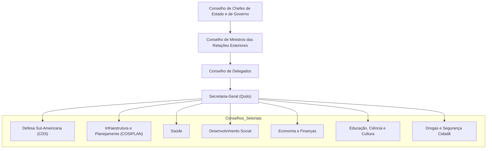

# A UNASUL: O Auge, a Crise e o Legado do Projeto de Integração Sul-Americana

## Origens e Criação: A **Maré Rosa** e o Protagonismo Brasileiro

No início dos anos 2000, a América do Sul vivenciou uma **“Maré Rosa”** – uma sucessão de governos de esquerda e centro-esquerda que trouxeram novos ares políticos e econômicos à região. Países sul-americanos, livres dos regimes militares e buscando superar crises econômicas passadas, adotaram agendas progressistas, nacionalistas e de desenvolvimento com forte presença estatal. Nesse contexto, ganhou força a ideia de fortalecer a **autonomia regional em relação aos Estados Unidos**, cuja influência histórica passou a ser questionada. Em vez de alinhamento automático a Washington, os líderes sul-americanos passaram a defender uma integração **“de Sul para Sul”**, construindo uma identidade própria e mecanismos de cooperação autônomos.

> [!note] **A visão da integração sul-americana nos anos 2000**
> 
> - **Busca de Autonomia:** Governos sul-americanos da _Maré Rosa_ desejavam reduzir a dependência de potências externas (especialmente dos EUA) e **afirmar a soberania regional**.
>     
> - **Regionalismo Pós-Liberal:** Emergiu um novo regionalismo voltado não apenas ao comércio, mas à **concertação política** e ao desenvolvimento socioeconômico conjunto da região.
>     
> - **Brasil como Protagonista:** A política externa brasileira (sob Lula da Silva e chanceler Celso Amorim) via a integração sul-americana como pilar para ampliar o **poder de barganha global do Brasil**. O país adotou a estratégia da “autonomia por diversificação”, formando múltiplas parcerias e liderando a criação de instituições regionais para projetar influência no mundo.
>     

O embrião da UNASUL remonta à _I Reunião de Presidentes da América do Sul_, convocada em Brasília no ano 2000 pelo então presidente Fernando Henrique Cardoso. Naquela ocasião, os 12 países sul-americanos sentaram-se juntos para discutir soluções coletivas – pela primeira vez, delineando um espaço exclusivamente sul-americano de diálogo e cooperação. Seguiram-se novas cúpulas regionais (Guaiaquil em 2002, Quito em 2004), nas quais consolidou-se a visão de uma integração **abrangente**. A _Declaração de Cusco_ de 2004 foi especialmente importante: ali se anunciou a criação da **Comunidade Sul-Americana de Nações (CASA)**, prenúncio da UNASUL.

Em **23 de maio de 2008**, já sob a liderança de governantes como **Lula (Brasil)**, **Hugo Chávez (Venezuela)**, **Néstor Kirchner (Argentina)**, **Evo Morales (Bolívia)**, entre outros, foi **assinado em Brasília o Tratado Constitutivo da UNASUL**, oficializando a **União de Nações Sul-Americanas**. A ideia era criar um bloco que congregasse **todos os 12 países da América do Sul**, superando divisões sub-regionais (como Mercosul e Comunidade Andina) e elevando a integração a um novo patamar. Após a ratificação parlamentar em cada país, a UNASUL entrou em vigor oficialmente em 2011.

**Objetivos e Ambições:** Ao nascer, a UNASUL se definia como um projeto de integração multifacetado – **“um grande guarda-chuva”** que englobaria dimensões **políticas, econômicas, sociais, culturais e de infraestrutura**, indo muito além de acordos comerciais. Buscava-se **construir uma identidade sul-americana compartilhada**, com cidadania regional (chegou-se a cogitar moeda comum e passaporte unificado) e **concertação política autônoma** frente a atores externos. Em suma, a UNASUL ambicionava consolidar a **América do Sul como um polo coeso no cenário internacional multipolar**, capaz de atuar coletivamente na solução de desafios internos (desigualdades sociais, déficit de infraestrutura, etc.) e aumentar o peso da região nas negociações globais. Essa visão estratégica teve forte respaldo do Brasil: o governo Lula via a integração sul-americana não só como um fim em si mesmo, mas como meio de **projetar o Brasil e seus vizinhos em bloco no mundo**, reduzindo assimetrias de poder e afirmando a voz do Sul Global.

## Arquitetura Institucional e Conselhos Setoriais da UNASUL

A estrutura institucional da UNASUL refletia sua natureza de **fórum político intergovernamental**. No topo, estabeleceu-se um **Conselho de Chefes de Estado e de Governo**, instância máxima deliberativa formada pelos Presidentes dos países-membros. Havia também um **Conselho de Ministros das Relações Exteriores**, responsável por acompanhar as decisões presidenciais, e um **Conselho de Delegados** (altos funcionários designados por cada país) para o trabalho cotidiano de coordenação. A **Secretaria-Geral** da UNASUL – sediada em Quito, Equador – seria ocupada por um Secretário-Geral eleito consensualmente, encarregado de articular os programas e projetos do bloco.

Além desses órgãos centrais, um diferencial da UNASUL foi a criação de **12 Conselhos Setoriais ministeriais**, dedicados a áreas específicas de cooperação. Esses conselhos temáticos sinalizavam a abrangência do projeto integracionista. Entre os principais, destacam-se:

- **Conselho de Defesa Sul-Americano (CDS):** Criado em dezembro de 2008 por iniciativa brasileira, o CDS foi talvez o componente mais inovador da UNASUL. Sua instituição representou uma ruptura com a tradição hemisférica da Guerra Fria em que a cooperação de defesa era estruturada em torno dos EUA. **Pela primeira vez, os países sul-americanos possuíram um mecanismo próprio de diálogo em matéria de defesa**, sem tutela externa. O CDS tornou-se um **canal permanente de fomento da confiança mútua** – um espaço para troca de informações militares, transparência em gastos de defesa, coordenação de exercícios e políticas de segurança. Em contexto de crises político-militares, provou ser útil para consulta e contenção de tensões. Seu objetivo de longo prazo era **consolidar uma identidade sul-americana de defesa**, fortalecendo a capacidade dissuasória coletiva da região e reduzindo a interferência de potências externas em assuntos de segurança regional. Dentre as iniciativas concretas do CDS, estiveram a criação de uma **Escola Sul-Americana de Defesa** e de um **Centro de Estudos Estratégicos de Defesa**, além de grupos de trabalho sobre políticas de defesa comparadas – frutos que são frequentemente mencionados como **legado bem-sucedido da UNASUL**.
    
- **Conselho Sul-Americano de Infraestrutura e Planejamento (COSIPLAN):** Responsável por coordenar a integração física do subcontinente, o COSIPLAN incorporou e deu continuidade à IIRSA (Iniciativa para a Integração da Infraestrutura Regional Sul-Americana), lançada em 2000. No âmbito do COSIPLAN foram mapeados **eixos de integração** (estradas transfronteiriças, corredores bioceânicos, interconexões energéticas, redes de telecomunicações, etc.) e formulados **520 projetos prioritários de infraestrutura**, voltados a melhorar a conectividade regional. Embora os desafios de financiamento e burocracia nacional tenham limitado o avanço de muitos planos, mais de **100 projetos chegaram a ser concluídos** na fase áurea da UNASUL, especialmente em rodovias e ampliação de redes de fibra ótica. O COSIPLAN, portanto, deixou como legado um acervo de projetos e estudos para a integração física sul-americana – base sobre a qual novos esforços (como os defendidos pelo Brasil em 2023) podem se apoiar.
    
- **Outros Conselhos Setoriais:** A amplitude do esforço integracionista se refletiu em conselhos para quase todas as políticas públicas de caráter transnacional. Foram estabelecidos, por exemplo, o **Conselho Sul-Americano de Saúde**, que propiciou cooperação entre sistemas públicos de saúde (incluindo a formação de um _banco regional de preços de medicamentos_ para compras conjuntas e mais baratas); o **Conselho sobre o Problema Mundial das Drogas**, visando ações coordenadas contra o narcotráfico; conselhos de **Educação, Cultura, Ciência e Tecnologia** para intercâmbio de políticas nessas áreas; um **Conselho de Desenvolvimento Social**; um **Conselho de Economia e Finanças** (buscando diálogo macroeconômico regional); além do **Conselho de Segurança Cidadã, Justiça e Coordenação contra o Crime Organizado Transnacional**. Essa estrutura multifacetada denotava o **caráter multidimensional da UNASUL**, cujo propósito era institucionalizar a cooperação sul-americana em **diversas frentes**, sob a égide de um mesmo organismo.
    

> [!example] **Conselho de Defesa Sul-Americano (CDS) – Objetivos e Significado**  
> _Criado em 2008, o CDS diferenciou a UNASUL de processos prévios de integração._ Seu estabelecimento, liderado pelo Brasil após a crise gerada pelo ataque colombiano a uma base guerrilheira no Equador (Caso Angostura, 2008), **marcou uma inflexão histórica**: os países sul-americanos passariam a **tratar de segurança e defesa entre si, sem intermediação externa**. Entre os objetivos centrais do CDS, destacam-se:
> 
> - **Fomento da Confiança Mútua:** Por meio de intercâmbio de informações, transparência em gastos militares e reuniões regulares de ministros da Defesa, o CDS buscou dissipar desconfianças históricas entre vizinhos e evitar corridas armamentistas regionais.
>     
> - **Mecanismo de Gestão de Crises:** O CDS funcionaria como instância de consulta em situações de tensão político-militar, facilitando soluções negociadas regionais (por ex., prevenindo escaladas como a crise Colômbia-Equador de 2008).
>     
> - **Identidade de Defesa Sul-Americana:** Em lugar de doutrinas importadas, pretendia-se desenvolver uma _visão sul-americana de defesa_, reforçando a autonomia regional. Exercícios militares conjuntos, formações profissionais integradas e centros de estudos estratégicos foram fomentados visando esse fim.
>     
> - **Redução da Influência Externa:** O CDS explicitamente rompeu com a lógica pan-americana da Guerra Fria dominada pelos EUA, sinalizando que a **América do Sul poderia gerir sua própria segurança**. Essa cooperação endógena em defesa é frequentemente citada como um dos **legados mais positivos da UNASUL**, mesmo por críticos do bloco.
>     

## O Auge da UNASUL (2008-2014): Concertação Política em Ação

No seu período de maior vitalidade – aproximadamente de **2008 a 2014** – a UNASUL demonstrou na prática o valor de um foro sul-americano autônomo para **gestão de crises e promoção da estabilidade democrática na região**. Amparada pela conjuntura favorável (governos ideologicamente convergentes e compromisso político alto com a integração), a UNASUL atuou como **mediadora eficaz em conflitos regionais**, ocupando um espaço antes dominado pela OEA ou por atores externos.

Dois exemplos emblemáticos ilustram esse auge de atuação política:

- **Crise Institucional na Bolívia (2008):** Em setembro de 2008, o governo de Evo Morales enfrentou uma violenta revolta de grupos oposicionistas autonomistas em províncias do leste boliviano (a chamada crise da “Meia Lua”). A tensão ameaçava a integridade territorial boliviana e a estabilidade democrática do país. Diante disso, a UNASUL convocou uma **cúpula de emergência em Santiago, Chile**, reunindo todos os presidentes sul-americanos em solidariedade à Bolívia. O resultado foi uma firme declaração de apoio ao governo constitucional de Evo Morales, condenando quaisquer intentos de ruptura da ordem interna. Essa intervenção diplomática coordenada ajudou a arrefecer os ânimos e evitar uma escalada maior do conflito, revelando a capacidade da UNASUL em **proteger a democracia e a unidade regional** sem ingerência de potências de fora.
    
- **Crises entre Colômbia e Vizinhos (2008-2010):** A Colômbia, então governada por Álvaro Uribe (de orientação à direita), protagonizou atritos severos com países vizinhos. O primeiro ocorreu em **março de 2008**, quando forças colombianas realizaram uma operação militar unilateral no território do Equador (ataque de Angostura) para atingir guerrilheiros das FARC – fato que gerou ruptura diplomática entre Quito e Bogotá e mobilização de tropas na fronteira. A criação do Conselho de Defesa da UNASUL, poucos meses depois, foi uma resposta direta a esse incidente, oferecendo um **mecanismo regional de diálogo de segurança** para impedir novos confrontos. Já em **2010**, houve uma crise diplomática Colômbia-Venezuela: Uribe acusou o governo de Hugo Chávez de abrigar guerrilheiros, levando ao rompimento de relações entre Caracas e Bogotá. A UNASUL entrou em cena como mediadora – por meio do então secretário-geral Néstor Kirchner – para facilitar o diálogo na transição para o novo governo colombiano de Juan Manuel Santos. A mediação surtiu efeito: em agosto de 2010, Santos e Chávez se reuniram com auspícios da UNASUL e restauraram as relações diplomáticas. Esses episódios evidenciam que, no auge, a UNASUL funcionou como **foro de concertação política ágil**, capaz de reagir a crises regionais de segurança e evitar seu agravamento.
    

Além das mediações em conflitos, a UNASUL atuou em outras frentes importantes durante esse período áureo:

- Envio de **missões de observação eleitoral** para países membros, a fim de fortalecer a confiança nos processos democráticos regionais. Por exemplo, eleições no Paraguai e no Suriname contaram com acompanhamento de delegações da UNASUL para assegurar sua lisura.
    
- Resposta conjunta a desastres e desafios humanitários: em 2010, após o devastador terremoto no Haiti (país caribenho observado pela UNASUL), o bloco aprovou a **Declaração de Solidariedade com o Haiti**, criando um fundo UNASUL-Haiti de US$100 milhões para auxílio à reconstrução. Essa iniciativa marcou a presença internacional solidária da UNASUL e a emergência de uma diplomacia coletiva sul-americana.
    
- **Coordenação de políticas públicas regionais**: foram lançados planos de ação conjuntos em áreas sociais (saúde, educação, combate à pobreza) e iniciativas como o _Banco de Preços de Medicamentos_ mencionados, sinalizando ganhos de escala e aprendizados compartilhados entre os países.
    

> [!important] **UNASUL no auge: a região falando com uma só voz**  
> _Entre 2008 e 2014, a UNASUL consolidou-se como instância central de diálogo político na América do Sul._ Alguns marcos desse período:
> 
> - **Defesa da Democracia:** Reação enérgica e unida à tentativa de ruptura institucional na Bolívia (2008), reafirmando o compromisso regional com a ordem democrática.
>     
> - **Mediação de Conflitos Regionais:** Papel protagonista na superação de crises bilaterais, como as tensões Colômbia-Equador e Colômbia-Venezuela, evitando isolamento de governos e promovendo reconciliação diplomática.
>     
> - **Unidade Autônoma:** Ao lidar com conflitos sul-americanos sem recorrer a Washington ou à OEA, a UNASUL demonstrou na prática a viabilidade de uma **governança sul-americana autônoma**, reforçando um sentimento de destino comum entre os países.
>     
> - **Integração Além do Comércio:** Projetos concretos em infraestrutura, saúde e políticas sociais avançaram sob o guarda-chuva político da UNASUL, mostrando ganhos tangíveis da cooperação regional (estradas binacionais, programas de vacinação coordenados, etc.).  
>     _Esse período de ouro reforçou a legitimidade da UNASUL junto aos governos da região, que passaram a enxergar o bloco como patrimônio coletivo e fórum preferencial para questões sul-americanas._ ✅
>     

## A Crise e Paralisia do Bloco (a partir de 2015)

A partir de **2015**, a trajetória da UNASUL entrou em inflexão negativa. Diversos fatores – sobretudo **políticos** – convergiram para paralisar o bloco e esvaziar suas instituições. Em poucos anos, a iniciativa outrora vista como o ápice do regionalismo sul-americano transformou-se em um projeto estagnado, com muitos países se retirando formalmente. Os principais elementos dessa crise foram:

**1. Mudança no Cenário Político Regional:** O fim da “Maré Rosa” alterou profundamente o ambiente em que a UNASUL operava. Por volta de 2015-2016, vários governos progressistas deram lugar a administrações de **direita ou centro-direita**, como Mauricio Macri na Argentina, Pedro Pablo Kuczynski no Peru, Michel Temer no Brasil, Sebastián Piñera no Chile, entre outros. Essa guinada ideológica gerou **ruptura do consenso** que sustentava a UNASUL. Para os novos governos conservadores, o bloco passou a ser visto como um **projeto associado à esquerda regional**, uma herança política de seus antecessores que não alinhava com suas prioridades. Em suma, a UNASUL – concebida como espaço plural, mas inegavelmente impulsionada pela onda progressista anterior – perdeu apoio de vários Estados, que passaram a questionar sua utilidade e **viés ideológico percebido**. Críticas antigas ressurgiram com força: opositores alegavam que a UNASUL era um ente redundante (sobreposto a outras organizações) e de eficácia duvidosa, “uma espécie de União Europeia latina” idealista e deslocada da realpolitik regional.

**2. A Crise Venezuelana (Fator de Fratura Interna):** A deterioração da situação política na **Venezuela** funcionou como um gatilho crucial de discórdia no bloco. A partir de 2014, a Venezuela mergulhou em grave crise institucional e humanitária, com denúncias de autoritarismo sob o governo Nicolás Maduro. A **UNASUL dividiu-se profundamente** sobre como responder. Países governados pela esquerda (como Bolívia e o Uruguai, além da própria Venezuela) defendiam a não intervenção e o diálogo com Caracas, enquanto os governos de direita emergentes (Brasil pós-2016, Argentina de Macri, Colômbia de Duque etc.) queriam uma linha mais dura de condenação ao regime venezuelano. Em 2017, essa cisão ficou explícita: Argentina, Brasil, Chile, Colômbia, Paraguai e Peru emitiram uma declaração conjunta repudiando o governo Maduro como “antidemocrático”. A UNASUL, construída para consenso, **paralisou diante do impasse** – não havia posição unânime possível sobre Venezuela. Ademais, em **2017 o Secretário-Geral da UNASUL, o ex-presidente colombiano Ernesto Samper, renunciou** (oficialmente em protesto pelo impeachment de Dilma Rousseff, aliada política). A vaga de secretário-geral ficou em aberto e os membros **não conseguiram acordo sobre um substituto**, devido às divisões políticas. Essa lacuna de liderança fragilizou ainda mais a capacidade de ação do bloco.

**3. Saída em Massa de Membros:** Sem consenso político e sem comando efetivo, vários países optaram por **suspender ou renunciar à sua participação na UNASUL**. O movimento teve início em **abril de 2018**, quando os seis países críticos a Maduro (Brasil, Argentina, Chile, Colômbia, Peru e Paraguai) anunciaram a suspensão temporária de sua participação. Meses depois, em agosto de 2018, o novo governo colombiano de Iván Duque formalizou a **saída definitiva da Colômbia**, anunciando o retorno às instâncias da OEA em detrimento da UNASUL. Em março de 2019, o Equador (presidido por Lenín Moreno, já rompido com o correísmo) também deixou o bloco e exigiu a devolução do prédio que sediava a Secretaria-Geral em Quito. Na sequência, em **abril de 2019**, Brasil (governo Jair Bolsonaro), Argentina (governo Macri), Chile (Piñera) e Paraguai oficializaram sua retirada. Por fim, em 2020, até mesmo o Uruguai (já sob governo de centro-direita de Lacalle Pou) desligou-se. Assim, num intervalo curto, a UNASUL perdeu a participação de **7 de seus 12 membros**, incluindo as maiores economias. Sem quórum e sem financiamento (vale notar que o Brasil já em 2018 havia deixado de pagar suas contribuições, acumulando dívida de R$ 12,5 milhões), a organização entrou em hibernação. O secretariado foi dissolvido e programas foram interrompidos por falta de recursos – até a bela sede projetada em Quito tornou-se um edifício vazio, devolvido ao governo equatoriano.

**4. A Criação do PROSUL (2019):** Em meio ao descrédito da UNASUL, os países sul-americanos alinhados aos novos governos conservadores lançaram uma iniciativa alternativa: o **Fórum para o Progresso e Desenvolvimento da América do Sul**, conhecido pela sigla PROSUL (ou PROSUR, em espanhol). Idealizado pelos presidentes **Sebastián Piñera (Chile)** e **Iván Duque (Colômbia)**, o PROSUL foi formalmente estabelecido em **março de 2019**, numa cúpula em Santiago. A proposta era **substituir a UNASUL por um mecanismo mais “pragmático” e alinhado aos valores dos novos governos de direita**. Piñera descreveu o PROSUL como um bloco “aberto a todos os países da América do Sul e **sem ideologias**”, com estrutura flexível, leve e decisões ágeis – uma crítica implícita ao excesso de politicização e burocracia atribuídos à UNASUL. Na prática, entretanto, **a criação do PROSUL excluiu a Venezuela** (não convidada a aderir) e contou inicialmente com a adesão de 8 países: Chile, Colômbia, Brasil, Argentina, Paraguai, Peru, Equador e Guiana (Bolívia, Uruguai e Suriname enviaram apenas observadores). Ficou claro que o novo foro carregava também seu **viés ideológico**, só que em sentido oposto – buscava reunir os governos de centro-direita em torno de uma integração focada em **liberalização econômica e cooperação “sem o bolivarianismo”**. Nos anos seguintes, o PROSUL realizou algumas reuniões, mas adotou deliberadamente uma institucionalidade mínima (sem secretaria permanente). Com a volta de governos progressistas em diversos países a partir de 2020-2021, o PROSUL passou a ter seu futuro questionado, já que **alguns de seus criadores se afastaram** (o Chile de Gabriel Boric suspendeu sua participação em 2022). De todo modo, o surgimento do PROSUL em 2019 simbolizou o **divórcio político** na integração sul-americana: em vez de um único espaço inclusivo como fora a UNASUL, a região fragmentou-se em fóruns paralelos de acordo com afinidades ideológicas.

> [!note] **Por que a UNASUL entrou em colapso?**  
> **Resumo das causas-chave (2015-2019):**
> 
> - **Polarização Ideológica:** A heterogeneidade política pós-2015 inviabilizou consensos. Governos de direita passaram a ver a UNASUL como instrumento “bolivariano”, minando o compromisso coletivo.
>     
> - **Crise na Venezuela:** Diante do impasse sobre como lidar com Maduro, a divisão interna paralisou a ação do bloco e impediu a escolha de nova liderança em 2017.
>     
> - **Falta de Liderança e Financiamento:** Sem secretário-geral e com o principal país (Brasil) retraindo apoio financeiro e diplomático, a UNASUL perdeu tração administrativa. A iniciativa regional – que dependia muito do engajamento presidencial – ficou órfã na fase Temer/Bolsonaro.
>     
> - **Abandono Institucional:** A saída coordenada da maioria dos membros entre 2018-20 esvaziou completamente o bloco. Restaram poucos países (Bolívia, Guiana, Suriname, Venezuela e alguns que hesitaram em formalizar a retirada) mantendo o tratado vivo no papel.
>     
> - **Proliferação de Alternativas:** A criação do PROSUL em 2019 ofereceu uma alternativa concorrente (embora limitada) e sinalizou que os dissidentes da UNASUL não tinham intenção de retorno próximo.  
>     _Em síntese, a UNASUL foi vítima das mudanças de maré política: seu destino ilustra como **projetos de integração profundamente ligados ao contexto político doméstico** podem se fragilizar com a alternância de poder nos países-membros._ ⚠️
>     

## Legado da UNASUL e Tentativas Recentes de Retomada

Apesar da sua quase extinção funcional, a UNASUL deixou **legados importantes** para o regionalismo sul-americano – experiências e estruturas que servem de referência aos atuais esforços de cooperação. Dentre esses legados, destacam-se:

- **Institucionalidade em Defesa:** O **Conselho de Defesa Sul-Americano (CDS)** consolidou uma prática inédita de **cooperação sul-sul em defesa**. Ainda que o CDS tenha ficado inativo após 2015, a ideia de uma política de defesa coordenada regionalmente permanece como marco. Militares e diplomatas da região desenvolveram laços de confiança, compartilharam doutrinas e vislumbraram a possibilidade de ações conjuntas (como missões de paz ou resposta a desastres). Esse capital de diálogo em defesa é frequentemente citado como um dos **legados mais duradouros da UNASUL**, podendo ser reativado no futuro. Mesmo durante a paralisação, os Centros de estudos criados no âmbito do CDS continuaram a existir em menor escala, e servem de base para retomar a cooperação assim que houver vontade política.
    
- **Portfólio de Projetos de Integração Física:** No campo de infraestrutura, a UNASUL via COSIPLAN elaborou um **plano continental de obras** que mapeou as necessidades de conectividade na América do Sul. Muitos projetos saíram do papel ou avançaram em fases preparatórias graças à priorização dada no âmbito unasureiro. Por exemplo, a interligação viária Brasil-Peru (Estrada do Pacífico), corredores bioceânicos ligando portos no Atlântico e Pacífico, e melhorias em rotas amazônicas tiveram estímulo político via UNASUL. Esse portfólio técnico-político não se perdeu: ao contrário, **continua à disposição dos governos sul-americanos atuais**. Tanto que, em 2023, ao discutir a retomada da integração, os líderes regionais – Lula em particular – enfatizaram a necessidade de resgatar projetos de infraestrutura já identificados no COSIPLAN, para dar um enfoque concreto e não ideológico à cooperação.
    
- **Coordenação em Políticas Sociais e Saúde:** A UNASUL também inovou ao promover articulações de políticas públicas em áreas sociais. O **Conselho de Saúde**, por exemplo, criou redes sul-americanas de epidemiologia e vigilância sanitária, além do mencionado _Banco de Preços de Medicamentos_ que permitiu economias significativas em compras governamentais conjuntas. Esse aprendizado em saúde coletiva mostrou sua utilidade durante crises posteriores, como a pandemia de COVID-19 – quando países da região voltaram a cooperar para adquirir vacinas, inspirados por mecanismos semelhantes aos ensaiados na UNASUL. Outros conselhos (Educação, Desenvolvimento Social, Meio Ambiente) deixaram planos de ação e bases de dados compartilhados que podem ser reativados.
    
- **Valorização da Autonomia Regional:** Talvez o legado intangível mais importante tenha sido provar que **a América do Sul pode ter voz própria unida**. A existência da UNASUL, ainda que brevemente, habituou uma geração de líderes e diplomatas a consultar primeiro os vizinhos antes de recorrer a fora externos. Criou-se uma **consciência regional sul-americana** mais nítida, com símbolos (bandeira, hino), encontros regulares de presidentes e um discurso de destino comum. Esse capital político-diplomático influenciou a criação de outras iniciativas como a **CELAC (Comunidade de Estados Latino-Americanos e Caribenhos)** em 2010, que segue ativa no âmbito latino-americano mais amplo. Em outras palavras, a UNASUL legou a ideia de que é viável – e desejável – **um espaço exclusivamente sul-americano de diálogo**, algo que permanece no imaginário dos formuladores de política externa na região.
    

### A Cúpula de Brasília de 2023 e o “Consenso de Brasília”

Com a recente **onda de retomada de governos progressistas** na região (entre 2019 e 2022, países como Argentina, Bolívia, Chile, Colômbia, Peru e Brasil elegeram novamente líderes de centro-esquerda), ressurgiu a discussão sobre reviver mecanismos de integração sul-americana. O presidente brasileiro **Lula da Silva**, retornando ao poder em 2023, foi um dos principais entusiastas em **reativar a UNASUL ou criar um fórum similar**. Em maio de 2023, Lula **convocou uma Cúpula de Presidentes da América do Sul em Brasília**, reunindo **11 dos 12 chefes de Estado** (apenas a presidente do Peru não pôde comparecer, enviando representante). Esse encontro sinalizou a disposição coletiva de **“voltar a olhar coletivamente” para a América do Sul**, nas palavras de Lula.

Embora alguns países ainda resistam em ressuscitar formalmente a sigla UNASUL (que ficou associada a disputas passadas), o clima da reunião foi de pragmatismo. Ao final, foi emitido o chamado **“Consenso de Brasília”**, uma declaração conjunta destacando pontos de convergência imediata. Entre as **prioridades acordadas** estiveram: a **integração energética** (interconexão de redes elétricas e troca de recursos energéticos, para reduzir custos e aumentar a segurança energética regional); a ação coordenada contra a **mudança climática** (especialmente proteção da Amazônia, agenda liderada pelo Brasil); a **cooperação em infraestrutura física**, retomando planos do COSIPLAN; e o compromisso com a **defesa da democracia e direitos humanos** no subcontinente. Curiosamente, o texto final **não mencionou expressamente a UNASUL** – possivelmente para evitar controvérsias semânticas – mas reafirmou a necessidade de um mecanismo sul-americano de concertação. Ou seja, na prática validou-se a ideia de reviver a UNASUL, ainda que potencialmente com outro nome ou formato.

De fato, já **em 2023 alguns países retornaram formalmente ao Tratado da UNASUL**. Brasil e Argentina, por exemplo, oficializaram em abril de 2023 sua reintegração ao bloco (depois de terem se retirado em 2019). Pouco após a cúpula de Brasília, a **Colômbia de Gustavo Petro anunciou seu retorno** – com o detalhe de propor que a UNASUL fosse renomeada para “**Associação de Nações Sul-Americanas**”, a fim de marcar um recomeço plural e duradouro. Com isso, o número de membros ativos sobe novamente (Bolívia, Venezuela, Guiana, Suriname nunca saíram; Brasil, Argentina e Colômbia regressando; possivelmente Chile e Peru avaliando o passo). Ainda há desafios políticos pela frente, pois nem todos os governos atuais estão plenamente alinhados – o Uruguai, por exemplo, mantém postura cética quanto a instituições regionais ideologizadas. Porém, a tendência de 2023 sugere uma **vontade renovada de cooperação sul-americana**, aprendendo-se com os erros do passado.

Como apontou Lula na abertura da cúpula, é essencial que a integração regional seja tratada como **política de Estado, acima de governos de turno e ideologias**. Isso implica criar **garantias de pluralismo** e mecanismos mais estáveis, para que o fórum sul-americano não volte a ser paralisado a cada mudança interna nos países. A menção de Petro sobre garantir “permanência ao longo do tempo” reflete essa preocupação. Em síntese, o legado da UNASUL – seus acertos (como o CDS e a cooperação em infraestrutura) e também seus percalços – está servindo de base para **um redesenho da integração sul-americana**. Seja reativando a UNASUL original ou instituindo um novo organismo com outro nome, os países da região indicam reconhecer que **a resposta aos desafios comuns (sejam econômicos, ambientais ou geopolíticos) passa pela união e coordenação sul-americana**. A história da UNASUL, do **auge à crise**, oferece lições valiosas para que esse novo esforço de integração seja mais resiliente e eficaz, equilibrando ambição com realismo e garantindo que o projeto pertença a **toda a América do Sul** – e não apenas a um grupo ideológico – de forma sustentável.

---

> [!question] **Para reflexão e autoavaliação:**
> 
> 1. **(Crise da UNASUL)** – Quais foram as principais causas do esvaziamento e paralisia da UNASUL após 2015? Analise como fatores internos (mudança de governos, crise venezuelana) e estruturais (modelo de consenso, financiamento) contribuíram para o declínio do bloco.
>     
> 2. **(Cooperação em Defesa)** – Explique os objetivos que motivaram a criação do Conselho de Defesa Sul-Americano (CDS) em 2008 e avalie por que ele é considerado um dos legados mais bem-sucedidos da UNASUL. Em que medida o CDS representou uma mudança na dinâmica de segurança regional?
>     
> 3. **(Futuro da Integração Sul-Americana)** – Considerando as lições da experiência da UNASUL, quais os desafios para retomar a integração sul-americana em um novo formato no contexto atual? Discuta como reconciliar diferenças ideológicas entre governos e fortalecer a institucionalidade regional para evitar a repetição da crise vivida pela UNASUL.
>     

> [!graph]

