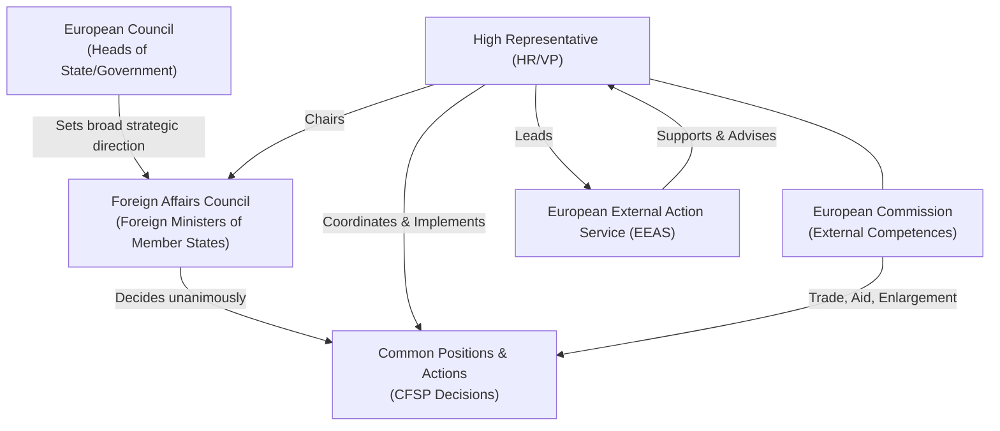

# The European Union’s Foreign Policy: Strategic Autonomy in a World of Powers

## Summary

The European Union (EU) has developed a unique foreign policy apparatus that blends supranational and intergovernmental elements. At its core is the **Common Foreign and Security Policy (CFSP)**, through which the EU strives to speak and act collectively on the global stage. A defining ambition in recent years is achieving **strategic autonomy** – the capacity to defend its interests and values independently, without overreliance on outside powers. The EU’s foreign policy architecture has evolved to support this goal, notably with the post-Lisbon creation of the **High Representative** and the European External Action Service, yet historical tensions persist. The need for unanimous consensus among member states often complicates fast, unified action, especially in crises. Nevertheless, the EU has made strides in areas like trade and sanctions, and it champions a normative, multilateral approach to global affairs. Today, facing great-power competition and challenges from Russia’s war in Ukraine to a rising China, the EU’s quest for strategic autonomy has become more urgent – even as internal divisions and institutional constraints test the limits of its foreign policy cohesion.

## Key Concepts

- **Common Foreign and Security Policy (CFSP) / PESC:** The CFSP (Política Externa e de Segurança Comum, PESC, in Portuguese) is the intergovernmental pillar of EU foreign policy. Established by the 1993 Maastricht Treaty and strengthened by the 2009 Lisbon Treaty, it enables the Union to take joint diplomatic actions and positions. CFSP decisions (e.g. foreign policy statements, sanctions, defense missions) are generally governed by unanimity among member states, reflecting its intergovernmental nature. The CFSP’s objectives (per Article 21 of the Treaty on European Union) include safeguarding the EU’s values, maintaining peace, strengthening international security, promoting democracy, the rule of law and human rights. Importantly, CFSP is exempt from the usual jurisdiction of the European Court of Justice and remains a domain where national governments retain decisive control.
    
- **Common Security and Defence Policy (CSDP) / PCSD:** The CSDP (Política Comum de Segurança e Defesa, PCSD, in Portuguese) is an integral part of the CFSP, focused on defense and crisis management. It provides the EU with operational capacity through civilian missions and military operations beyond its borders. Under the CSDP framework, the EU has deployed missions ranging from military training teams (e.g. in Mali and Somalia) to police and rule-of-law missions. The policy also includes initiatives like EU Battlegroups (rapid reaction forces, never yet used in combat) and mechanisms for capability development. While ambitious in scope, the CSDP is fundamentally intergovernmental: member states volunteer troops and assets, and decisions require consensus.
    
- **Strategic Autonomy:** In the EU context, _strategic autonomy_ refers to the Union’s ability to make and implement foreign policy (including security and defense) decisions independently, without undue reliance on other global powers. Initially applied mostly to security and defence, the concept has broadened to other areas like economic resilience and supply chains. Achieving strategic autonomy implies developing sufficient military capabilities, a robust industrial base, cohesive decision-making, and a shared strategic vision among EU countries. The term gained prominence after events that shook European assumptions – notably Brexit, the Trump administration’s unpredictability, and increasing geopolitical assertiveness of Russia and China. Today the EU often frames it as “open strategic autonomy,” emphasizing the EU’s pursuit of autonomy while remaining open to international cooperation.
    
- **Normative Power Europe:** This concept characterizes the EU as an international actor that wields influence chiefly through norms and values rather than military might. As a “normative power,” the EU seeks to shape what is considered “normal” in international relations – promoting principles like human rights, democracy, rule of law, and multilateralism. The EU diffuses these norms by example and inducement (e.g. requiring human rights clauses in trade agreements and conditionality in aid), rather than through coercion. This idea, advanced by scholars such as Ian Manners, builds on the EU’s history as a “civilian power” (François Duchêne’s term) that is long on economic influence and soft power but short on armed force. While the EU prides itself on this normative role – often presenting itself as a champion of a rules-based international order – critics note that normative power has limits when confronted with hard power realities and that the EU sometimes struggles to consistently uphold its values in practice.
    
- **Supranational vs. Intergovernmental Dynamics:** EU foreign policy operates at the intersection of supranational and intergovernmental processes. _Supranational_ policies are those where sovereignty is pooled and EU institutions can take the lead – for example, **trade policy** is an exclusive competence of the EU, negotiated by the European Commission on behalf of all member states. In such areas, decisions often use qualified majority voting and the European Parliament has a role, reflecting a more federal approach. By contrast, _intergovernmental_ policies like the CFSP rely on member state consensus and diplomacy in the Council, with the Commission and Parliament having limited roles. This duality runs through the EU’s external action: trade, development aid, enlargement, and humanitarian aid are handled supranationally (leading to relatively cohesive and assertive policies), whereas security and diplomacy require careful agreement among 27 capitals. The tension between these modes means the EU can project unity and power in some domains (e.g. as a single trade bloc) while being slow or divided in others (e.g. reacting to a war or international crisis when national interests diverge). Understanding this dynamic is key to analyzing the EU’s capacity – and often its **capability-expectations gap** – as a foreign policy actor.
    

## Detailed Analysis: The EU as a Foreign Policy Actor

The EU often defies traditional categorization as a global power. It is neither a unitary state nor a mere international organization, but a hybrid entity with state-like and organization-like features. Over decades, analysts have variously called it a _“civilian power”_ and a _“normative power,”_ highlighting how the EU leverages economic tools, law, and values rather than military force. Indeed, the EU’s identity as a foreign policy actor has been built around promotion of norms (democracy, human rights, multilateral rules) and conflict resolution, reflecting the Union’s founding ethos of turning war-torn Europe into a zone of peace. EU enlargement policy, for example, has been one of its most effective foreign policy instruments, using the attraction of membership to spread stability and democratic standards to its neighborhood. Likewise, through humanitarian aid and development assistance, the EU (and its member states collectively) is the world’s largest donor, projecting influence via soft power.

However, the EU’s soft power ambitions have often collided with hard realities and internal constraints. The need for unanimity in CFSP matters can impede timely or decisive action. Member states sometimes fail to **“speak with one voice”** on contentious issues, undermining the EU’s credibility. For instance, during international crises like the 2011 Libya intervention or the 2003 Iraq War, EU countries took divergent positions, preventing a unified EU stance. More recently, disunity was evident in responses to China’s assertiveness – while major states like France and Germany favored a firm line on upholding international law, others (e.g. Hungary or Greece) hesitated to criticize Beijing due to close economic ties. Similarly, in Middle East diplomacy, differing historical relationships and perspectives (for example, on the Israel-Palestine conflict) have made it hard for the EU to be more than a cautious “honest broker.” This institutional **tension between supranationalism and intergovernmentalism** is a defining feature of EU foreign policy. Supranational elements (like the European Commission’s role in trade or humanitarian aid) give the EU heft in those arenas, but core foreign policy and defense remain dominantly intergovernmental, where the **lowest common denominator** often prevails.

The interplay of these forces shapes the EU’s capacity to act in crises. On one hand, the EU has achieved notable successes as a diplomatic actor: it helped negotiate the Iran Nuclear Deal (with the High Representative coordinating talks), has led civilian missions in the Balkans and Africa, and deployed naval operations (such as Operation Atalanta to fight piracy off Somalia). These illustrate that when political will is present, the EU framework can deliver. On the other hand, expectations frequently exceed capabilities. The term **“capability-expectations gap”** was coined to describe how global expectations of the EU (to resolve conflicts, uphold liberal order) often outstrip its actual capability to agree and implement action. This gap was evident in the 1990s Yugoslav wars, when the nascent EU foreign policy apparatus failed to prevent conflict on European soil – prompting the sober realization that “Europe still needs America” militarily via NATO. The lesson has repeated in more recent theaters: without a unified military force or clear consensus, the EU’s crisis response often defaults to declarations and aid rather than forceful intervention. In sum, the EU is a significant global player – arguably **“the only genuine supranational power in world politics”** in terms of its law-based integration – but it remains a power of a different sort, one constrained by the dual logic of its union and the divergent priorities of its members.

## Detailed Analysis: Post-Lisbon Institutional Framework

The Treaty of Lisbon (entered into force in 2009) was a watershed for EU foreign policy, overhauling institutions to enhance coherence and visibility. A centerpiece of these reforms was the creation of the **High Representative of the Union for Foreign Affairs and Security Policy (HR/VP)** – a “double-hatted” position that merged two previously separate roles (the intergovernmental High Representative for CFSP and the European Commissioner for External Relations). The HR/VP serves _both_ the Council and the Commission: as High Representative, they chair the Foreign Affairs Council (meeting of foreign ministers) and coordinate member states’ positions; as a Vice-President of the European Commission, they steer the Commission’s external portfolios (trade, development, enlargement, humanitarian aid, etc.). This dual role is meant to bridge the EU’s supranational and intergovernmental poles, ensuring policies are consistent across institutions. For example, the HR/VP can propose sanctions or statements, then seek unanimous approval in the Council, and also oversee their implementation via Commission instruments – providing a _single face_ and voice for EU external action.

Lisbon also established the **European External Action Service (EEAS)**, effectively the EU’s diplomatic corps. The EEAS supports the HR/VP and EU delegations worldwide, aiming to make EU foreign policy more coherent and effective. Staffed by officials drawn from the Commission, the Council Secretariat, and national diplomatic services, the EEAS manages diplomatic relations and runs over 140 EU Delegations (de facto embassies) in countries and international organizations. Through the EEAS and the HR/VP’s team, the EU now has a capacity for 24/7 diplomatic communication and crisis response coordination that did not exist pre-Lisbon. The HR/VP and EEAS work closely with member states’ diplomats (in Brussels committees and on the ground) to formulate common positions. While the EEAS does not replace national foreign ministries, it has grown into a hub for joint analysis, policy planning, and situational awareness, strengthening the EU’s collective diplomatic weight.

Another post-Lisbon innovation is the enhanced role of the **European Council** (the gathering of EU Heads of State or Government) in foreign affairs. The European Council (distinct from the Council of Ministers) has no formal legislative power but sets the Union’s “strategic interests and objectives” in external action (Article 22 TEU). In practice, this means that EU leaders at summit meetings provide top-level direction on major foreign policy questions. For instance, the European Council has issued strategic declarations (like the **Versailles Declaration of March 2022** calling for bolstering European defense and energy independence after Russia’s invasion of Ukraine) and has been the forum for hammering out consensus on sensitive issues (such as sanction packages on Russia or defining the mandate for negotiating international agreements). The European Council also appoints the HR/VP and its President often represents the EU in high-level diplomacy alongside the HR/VP. By convening heads of government, it can overcome impasses that ministers alone cannot – though it can also be a venue where national leaders reassert control. Still, its strategic guidance role has been key in crises: for example, EU leaders collectively decided to launch the **Permanent Structured Cooperation (PESCO)** on defense in 2017 to deepen military collaboration.

Below is a simplified diagram of how these actors interlink in the EU’s foreign policy system:

_Figure: Post-Lisbon EU foreign policy architecture – the High Representative (HR/VP) connects the intergovernmental Council and the supranational Commission, supported by the EEAS._

Despite these institutional improvements, challenges remain in practice. The requirement of consensus in the Council still means a single dissenting member can block a common action. The Lisbon Treaty did introduce mechanisms to ease decision-making – for example, **constructive abstention** (allowing a state to abstain without vetoing) and the possibility of **Qualified Majority Voting (QMV)** in limited CFSP cases – but member states have been reluctant to use QMV for foreign policy, guarding their sovereignty. Proposals by Commission Presidents (like Ursula von der Leyen’s call to move to QMV for sanctions and human rights statements) reflect frustration with unanimity, especially after episodes where single countries held up EU actions (e.g. Cyprus delaying Belarus sanctions in 2020, or Hungary’s hesitance on Russia sanctions). The **European Parliament** has gained a greater consultative role post-Lisbon (it must consent to international agreements and often debates foreign affairs), and it has been an outspoken champion of human rights (for instance, the Parliament’s opposition effectively froze the EU–China investment deal in 2021 over China’s sanctioning of MEPs). However, the Parliament still has no formal power in CFSP decisions. Overall, the Lisbon reforms equipped the EU with better tools and a clearer voice, but the ultimate effectiveness of EU foreign policy continues to depend on political will and unity among the member states.

## Detailed Analysis: Strategic Autonomy Debate

**Defining strategic autonomy:** For Europe, _strategic autonomy_ means the ability to decide and act in foreign, security, and defense matters in pursuit of its interests **independently** – specifically, without being beholden to or overly dependent on external powers like the United States. In a traditional defense sense, it implies Europe being able to handle security challenges in its neighborhood (and beyond) with minimal outside assistance. This encompasses not only having capable military forces and a robust defense industry but also the political unity to use them when needed. In recent years the term has broadened: the EU speaks of autonomy in economic terms (securing supply chains, reducing reliance on certain countries for critical goods like medical equipment or semiconductors) and in technological terms (e.g. digital sovereignty). Importantly, EU leaders often stress “_open_ strategic autonomy,” indicating that Europe seeks resilience and capacity to act for itself, _while_ maintaining alliances (notably with the US/NATO) and an open global economy. It is not about isolation, but about insurance – the ability to chart Europe’s course even if allies are unwilling or global rules erode.

**Evolution of the debate:** Strategic autonomy has evolved from a niche idea to a central strategic goal. Initially, in the early 2000s (and even in the EU’s 2016 Global Strategy), it was discussed largely in the context of security and defense cooperation. European policymakers recognized that to be a credible global actor, the EU had to be able to manage crises in its backyard, especially after the wake-up call of the Yugoslav conflicts in the 1990s when Europe had to rely on US-led NATO intervention. From **2013–2016**, the focus was indeed on defense cooperation and modest steps like improving battle-group usability. The concept gained significant momentum **after 2016**. A confluence of events – **Brexit** (which removed one of Europe’s strongest militaries and a sometimes Eurosceptic voice on defense integration), the **Trump presidency in the US** (which openly questioned the NATO alliance’s reliability and imposed tariffs on EU allies), and **China’s growing assertiveness** – created a more hostile and uncertain geopolitical environment. Between **2017 and 2019**, EU strategic autonomy was increasingly framed as a project to ensure Europe can defend its interests in a world of great power rivalry, no longer assuming automatic US alignment. European leaders like France’s President Emmanuel Macron became vocal proponents of building an autonomous European pillar on security, warning that Europe could no longer “outsource” its security.

In **2020**, the COVID-19 pandemic added a new dimension: Europe discovered its vulnerability in critical medical supplies and value chains, prompting talk of autonomy in health and industrial policy. This led to the term “open strategic autonomy” in the EU’s trade and industrial strategy – balancing autonomy with openness. Since **2021**, strategic autonomy has permeated virtually all EU policy areas, from energy (reducing dependency on Russian gas) to technology (promoting European champions in tech). Interestingly, as the scope widened, the explicit use of the phrase “strategic autonomy” sometimes diminished – replaced by synonyms like “strategic sovereignty,” “capacity to act,” or simply folded into the language of resilience. Then, in February **2022**, Russia’s full-scale invasion of Ukraine jolted Europe’s security order. This crisis both tested and turbocharged the strategic autonomy agenda: it confirmed that Europe still relies heavily on the US (for intelligence, advanced weaponry, nuclear deterrence), but it also spurred the EU to take previously unthinkable steps (financing arms to Ukraine, steeply boosting defense budgets, fast-tracking work on joint defense initiatives). The **Versailles Declaration** by EU leaders in March 2022 explicitly aimed for “bolstering European defence capabilities” and reducing dependencies in energy and critical sectors. In short, _what was once a abstract discussion has become a driving force in EU debates_ – even if the _meaning_ of strategic autonomy is interpreted differently across capitals.

**Internal divergences:** Not all EU countries view strategic autonomy in the same light – in fact, it has been a subject of **internal debate, even skepticism**. Generally, **France** is the concept’s chief champion. With its Gaullist tradition, nuclear arsenal, and seat on the UN Security Council, France has long advocated for Europe to have the capability to act independently of (but cooperative with) the US. Paris often emphasizes the need for Europe to be able to handle security crises in its neighborhood, even suggesting that Europe should build the capacity for autonomous operations if the US is unwilling or busy elsewhere. On the other side of the spectrum, **Eastern European** and Baltic states (e.g. Poland, the Baltic trio) have been wary of the term, fearing it could signal a decoupling from the US or a weakening of NATO. For these countries, facing an aggressive Russia, the American security guarantee is irreplaceable; any notion of strategic autonomy that hints at Europe going it alone raises concerns. As one analysis notes, under Macron, France pushed strongly for autonomy, while many eastern members remained skeptical, concerned it would _“undermine NATO by duplicating its efforts and annoying the US”_. They prefer to speak of complementarity – Europe strengthening its defense within NATO, rather than setting up a parallel track. Countries like **Germany**, traditionally cautious about military matters, have oscillated but in recent years warmed up to more European cooperation (especially post-Ukraine invasion, Germany announced a “Zeitenwende” with massive defense investments). Smaller neutral countries (e.g. Sweden, Finland before they sought NATO membership, or Austria) also support autonomy in principle but within a strong multilateral (often NATO or partnership) context. The departure of the UK (a staunch Atlanticist) somewhat eased achieving consensus on EU defense efforts, yet divergences persist. Notably, debates about how to approach China or how closely to align with US policies (such as on Iran or the Middle East) show a spectrum of views – some governments prioritize transatlantic unity above all, while others are willing to stake out an independent EU line.

**Obstacles to strategic autonomy:** The pursuit of autonomy faces multiple practical hurdles. First, there is the **capabilities gap** – Europe’s rhetoric outpaces its actual military capabilities. While the EU collectively spends a large sum on defense (second only to the US), those expenditures are fragmented among 27 national armies, resulting in inefficiencies and capability shortfalls (for example, shortages in strategic airlift, reconnaissance, and even basic ammunition in some cases). Efforts like **PESCO (Permanent Structured Cooperation)** aim to develop capabilities jointly, but meaningful results (new equipment, interoperability improvements) take time. The **European Defence Fund** now provides EU budget money to collaborative defense research and development, yet Europe’s defense industrial base still has overlaps and intra-EU competition. Second, **political fragmentation** remains a key issue: forging consensus among all member states, especially on use of force, is challenging. Divergent threat perceptions – a result of different histories, geographies, and political cultures – mean EU members often disagree on when and where to intervene (for instance, interventions in North Africa or the Middle East have split opinions). Without a shared strategic culture, talk of autonomy can ring hollow. As experts point out, Europe lacks unanimity on fundamental questions like whether the EU should even undertake territorial defense on its own (most say that’s NATO’s job) or expeditionary combat missions far from home. This feeds into the third obstacle: **reliance on NATO/US**. The credibility of EU autonomy will hinge on its ability to handle threats, but as of now NATO remains the bedrock of European defense (21 EU states are NATO members, and NATO’s integrated command and the US security guarantee are seen as indispensable, especially in Eastern Europe). Even President Macron’s calls for autonomy acknowledge that NATO is still crucial; Europe cannot feasibly replace American assets like strategic airlift or nuclear deterrent in the near term. The US itself historically encouraged Europe to take more responsibility, but has also cautioned against duplication or weakening of NATO cohesion. During the Trump years, the US stance oscillated – Trump’s dismissive attitude ironically pushed Europe to talk more about autonomy, yet it also sowed division (some countries doubled down on NATO reliance as a message that the US was still needed).

Another obstacle is **institutional inertia**: changing how the EU makes foreign policy decisions (e.g. moving to QMV) is politically very sensitive. A single country’s veto can stop progress – as seen in attempts to issue common statements on China or to impose human rights sanctions (e.g. one state’s objection can water down or block an EU position). Moreover, pursuing strategic autonomy in newer domains like tech or supply chains can clash with the EU’s free-market instincts or the interests of powerful economic stakeholders (e.g. Germany’s export industries wary of decoupling from China). There’s also the question of **political will**: autonomy requires not just capacity but the will to use it. EU members historically have often preferred to delegate hard security to NATO or avoid military options; changing this mindset is a gradual process (“autonomy is a mindset,” as one commentator put it). Finally, Europe’s **neighborhood challenges** – from a volatile Middle East and North Africa to an aggressive Russia – mean that strategic autonomy isn’t a static end-state but a moving target: as threats evolve, the EU must constantly adapt (e.g. cyber defense, energy security). The war in Ukraine highlighted both the progress and the limits: the EU achieved unprecedented unity on sanctions and began investing more in defense, but it also laid bare that Europe on its own could not have deterred or now contain Russia without massive US and UK support. In the long run, advocates argue that strategic autonomy is about ensuring Europe can act if it _has_ to, especially as the US might increasingly focus on Asia (China) and expect Europe to manage its own backyard.

In summary, the strategic autonomy debate is about Europe’s quest for agency in a changing world. It has moved from think-tank jargon to official policy, driven by real-world shocks. There is broad agreement that the EU should be more capable and resilient – the disagreements are about means and the end-state. The coming years will likely see continued efforts to bolster European defense cooperation (e.g. joint procurement to fix gaps revealed by Ukraine war) and reduce critical dependencies (as seen in energy policy after 2022). The balance between strengthening the EU’s own capacities and maintaining strong transatlantic ties will remain delicate. As one analysis noted, **European strategic autonomy will likely develop “not independently from NATO, but by contributing to and shaping the course of the alliance”**. In other words, strategic autonomy is not a pivot away from allies, but a form of European responsibility – ensuring that the EU can be a pillar in the transatlantic relationship and act when others won’t or can’t.

## Detailed Analysis: EU Foreign Policy Instruments

The EU possesses a wide toolbox of foreign policy instruments, some of which are unique given its nature as a supranational union. These instruments range from the hard (economic sanctions, civilian/military missions) to the soft (trade agreements, development aid, diplomatic dialogue). Below are key instruments and policies the EU uses externally:

- **Trade Policy (Common Commercial Policy):** Trade is arguably the EU’s most powerful external instrument. As a single market of 450 million consumers, the EU wields considerable economic clout, and trade policy is an exclusive competence of the Union. The European Commission negotiates trade agreements on behalf of all member states, giving the EU a united front in dealing with partners – from major powers like China and the US to smaller states. By acting as one, EU countries amplify their bargaining power and leverage access to the vast EU market to obtain concessions. Beyond the economic benefits (opening markets, protecting investments), the EU increasingly uses trade agreements to export its standards and values (labour rights, environmental standards, etc.). For example, recent EU trade deals include chapters on sustainable development and commitments to international conventions. The EU also employs **trade sanctions** and restrictions as foreign policy tools – often decided in tandem with CFSP sanctions. One recent innovation is the **Anti-Coercion Instrument (ACI)** (agreed in 2023), which allows the EU to retaliate against economic blackmail by others. In sum, trade is both a carrot and a stick in EU foreign policy: a carrot through access to its market and a stick through withdrawal of that access.
    
- **Sanctions and Economic Statecraft:** As part of CFSP, the EU frequently uses sanctions to respond to breaches of international law or human rights. Sanctions (restrictive measures) can include asset freezes, visa bans on officials, arms embargoes, or broader economic sector bans. They require unanimous agreement but have been a go-to tool given the EU’s economic weight. For instance, the EU has imposed multiple rounds of sanctions on Russia (since 2014 and dramatically expanded after 2022), on Iran (over nuclear and human rights issues), on Syria, Venezuela, North Korea, and many others. EU sanctions are legally binding on all member states and companies within them – making them quite effective when consensus is reached. The recent creation of a **Global Human Rights Sanctions Regime** (EU’s version of a Magnitsky Act) allows the EU to target human rights abusers worldwide. Sanctions demonstrate the EU’s capacity for normative action, though achieving unanimity can be challenging, as occasionally individual states hold up measures due to bilateral interests (e.g. as mentioned, Cyprus initially delayed sanctions on Belarus over an unrelated issue).
    
- **Diplomatic Tools and Dialogues:** The EU conducts extensive diplomatic dialogues and summit diplomacy. It has **Strategic Partnerships** with key countries (like the US, Japan, India, etc.), holding regular summits to steer relations. EU Delegations abroad engage in daily diplomacy, coordinating with member states’ embassies and speaking for the EU on many issues. The **European Neighbourhood Policy (ENP)** is a specialized diplomatic framework for the EU’s immediate neighbors in Eastern Europe, the Caucasus, and the Southern Mediterranean. Launched in 2004, the ENP aims to foster stability, security, and prosperity in neighboring regions by offering closer political and economic ties in return for reforms. Through bilateral action plans, financial assistance, and trade concessions (short of membership), the ENP tries to anchor neighbors to the EU’s orbit and prevent “new dividing lines” in Europe. Its track record is mixed (given turmoil in regions like Syria, Libya, Ukraine’s war), but it remains a key policy channel. Additionally, the EU often plays a convening role in multilateral diplomacy – for example, the EU3 (France, Germany, Italy) plus the HR negotiated with Iran; the EU has facilitated Serbia-Kosovo talks; and the Union is a participant in the Quartet on Middle East Peace, etc. Such diplomacy leverages the EU’s perceived neutrality and economic incentives.
    
- **Enlargement Policy:** Expansion of the EU’s membership has been one of its most transformative foreign policy instruments. By offering the prospect of membership, the EU incentivized profound political and economic reforms in Central and Eastern Europe post-Cold War, successfully integrating 100+ million people into a stable democratic union. Enlargement is often dubbed the EU’s most successful foreign policy. Today, the process continues (though slowly) with Western Balkan countries, and since 2022, Ukraine and Moldova have become candidates in the wake of geopolitical shifts. The process involves strict conditions (the **Copenhagen criteria**) and the adoption of the entire EU acquis (body of law), meaning candidate countries must align with EU standards in everything from governance to trade. This policy exports EU norms and extends the zone of peace and cooperation in Europe. However, enlargement has grown more complex as EU absorption capacity and public opinion in existing states raise concerns. Still, as a foreign policy tool, enlargement (and its pre-accession assistance, IPA funds) has arguably done more to stabilize and Europeanize the continent than any military intervention could.
    
- **Common Security and Defence Policy (CSDP) Missions:** Under the CSDP, the EU can deploy **civilian missions and military operations** abroad, contributing to international crisis management. Since the early 2000s, the EU has launched dozens of missions on three continents. Civilian missions have included training police in Afghanistan, advising on rule of law in Iraq, monitoring ceasefires in Georgia and Ukraine, and capacity-building in many African states. Military operations have ranged from small battlegroup stand-by forces (unused) to larger endeavors like Operation **EUFOR Althea** in Bosnia (peacekeeping), **Operation Atalanta** off Somalia (naval anti-piracy patrols), and training missions for armies in Mali, Somalia, Central African Republic, etc. These operations are usually consensual (invited by host nations or mandated by the UN) and typically limited in scale compared to NATO operations. They reflect the EU’s preference for multilateral, legality-based interventions and often focus on post-conflict stabilization rather than high-intensity combat. Notably, **EU Battlegroups** – standing rapid reaction forces of about 1,500 troops contributed by coalitions of member states – have been operational since 2007 but never deployed due to political disagreements on when to use them. The experience of CSDP missions has been mixed: some successes in training local forces or improving maritime security, but also clear limitations in logistics and political mandate. Nonetheless, these missions give the EU a presence on the ground and experience in joint operations, and they complement NATO by focusing on tasks NATO often does not (like civilian security sector reform).
    
- **Permanent Structured Cooperation (PESCO) and Defense Initiatives:** Recognizing the need to boost defense integration, in 2017 the EU launched **PESCO**, wherein willing member states commit to binding targets for increasing defense investment, harmonizing requirements, and developing joint capabilities. PESCO currently has dozens of collaborative projects (from developing new drone systems and cyber units to joint training centers). While still in early stages, it is a framework for overcoming fragmentation by pooling efforts. Complementing it, the **European Defence Fund (EDF)**, initiated in the EU’s 2021-2027 budget, allocates funding to joint research and development of defense tech – a groundbreaking step as EU budget money (about €8 billion over 7 years) goes to military-related projects. These efforts are geared toward ensuring Europe can produce critical defense equipment and reduce duplication among national forces. Another related initiative is the **Coordinated Annual Review on Defence (CARD)**, which monitors national defense plans to spot cooperation opportunities. While these are not flashy instruments, over time they aim to produce tangible improvements in Europe’s autonomous capacity (e.g. a future European drone, better interoperable armored vehicles, etc.).
    
- **Development Aid and Humanitarian Assistance:** The EU’s external action includes substantial development cooperation through instruments like the Neighbourhood, Development and International Cooperation Instrument (NDICI) – “Global Europe” budget, and the European Development Fund (EDF, not to be confused with the defense fund). By providing billions in aid to Africa, Asia, Latin America, and the neighborhood, the EU addresses root causes of instability (poverty, governance issues) and builds partnerships. Programs under the EU’s **Neighbourhood Policy** or the **African Union–EU partnership** promote reforms, infrastructure, and social programs, often in exchange for governance improvements. Humanitarian aid is managed by the Commission’s ECHO department and is a significant part of global relief efforts. These instruments enhance the EU’s image as a benevolent power and can yield influence (sometimes dubbed “soft power by cheque-book”). For example, through conditionality, the EU has influenced human rights policies or conflict resolutions (like pushing Sudan to peace via aid incentives, or supporting the Colombia peace process). However, the impact of aid can be slow and is often dependent on local political will.
    

In summary, the EU’s foreign policy toolkit is comprehensive in theory: it can deploy soldiers and policemen, impose economic might, offer the allure of market access or membership, and speak with moral authority on the global stage. The effectiveness of these instruments varies case by case. Trade and enlargement have been particularly effective historically. Defense missions and sanctions show the EU’s potential when united, but also expose internal limits. Increasingly, the EU is learning to combine tools – for instance, in the Sahel region, it uses military training missions, humanitarian aid, development projects, and diplomacy in tandem (the so-called “integrated approach”). Yet coordination remains a work in progress. The true test is whether the EU can marshal these instruments in a crisis with speed and unity. When it succeeds (as arguably in the robust sanctions response to Russia, or in the aid provided to Ukraine), it significantly shapes outcomes; when it fails (as in Libya 2011, when Europeans were split and the EU as such was sidelined), it highlights that instruments are only as strong as the political consensus behind them.

## Contemporary Challenges

The EU’s foreign policy today faces an environment often described as one of “a world of powers” – characterized by great power competition, erosion of multilateral norms, and crises that demand quick responses. Several key challenges illustrate the difficulties the EU encounters in trying to act as one on the global stage:

- **Speaking with One Voice in Geopolitical Crises:** A persistent challenge for the EU is achieving unity in response to fast-moving international crises. Member states bring different perspectives and interests, making consensus difficult just when decisiveness is needed. For example, in dealing with **China’s rise**, the EU has struggled to calibrate a common approach. In 2019 the EU formally labeled China a “partner, competitor, and systemic rival” all at once, reflecting internal ambivalence. Some countries (notably Germany pre-2022) prioritized economic ties with Beijing, given huge trade volumes, while others pushed for a firmer line on human rights and security. Divisions have played out in episodes like the EU’s statement on the South China Sea arbitration in 2016, which was watered down after Hungary and Greece (recipients of major Chinese investments) objected to tougher language against China. Similarly, on issues like Chinese human rights abuses in Xinjiang or Hong Kong, the EU has at times been hamstrung – a sanctions exchange in 2021 led to the freezing of a major EU-China investment deal, showing the delicate balance between standing up for values and protecting economic interests. The **Middle East** provides another case: EU member states have diverse historical ties and opinions (e.g. former colonial powers like France and the UK vs. non-aligned states) which have made it hard to go beyond generic common positions. During the Syrian civil war, for instance, the EU’s influence was marginal – some members supported the opposition, others were more cautious, and the Union mainly focused on humanitarian aid. In the **Israel-Palestine conflict**, while the EU officially supports a two-state solution, internal splits (some states more pro-Israel, others more pro-Palestine or calling for stricter enforcement of international law) often prevent bold collective action. A stark recent illustration came in late 2023: when the International Criminal Court issued warrants related to war crimes in the Israel-Hamas war, EU countries openly split – some said they would execute the warrant against the Israeli Prime Minister, others (France, Hungary) flatly refused. In UN votes concerning the Gaza war, EU states voted differently, undercutting the image of EU unity. These examples underline that _“it is not easy to speak with one voice,”_ as one EU diplomat understated. Every crisis tests EU cohesion, and adversaries sometimes exploit these splits (e.g. China courting certain EU members, or Russia fostering ties with sympathetic European parties).
    
- **Transatlantic Relations – Dependency vs. Autonomy:** The relationship with the **United States** is at the heart of EU foreign policy dilemmas. On one hand, the US is Europe’s traditional ally, NATO anchor, and a like-minded democracy; on the other, recent years have shown that US policies can diverge sharply from European preferences (e.g. the Iraq War in 2003, or the America First approach under Trump). The EU is often torn between a desire for greater autonomy and the practical need for US partnership. The **Trump era (2017–2020)** was a wake-up call: Trump’s questioning of NATO’s Article 5, withdrawal from the Paris climate accord and Iran nuclear deal, and tariffs on EU steel/aluminum fundamentally shook European trust. This spurred calls in Europe to “take our destiny into our own hands” (in Angela Merkel’s words) and strengthened the strategic autonomy narrative. However, the subsequent election of Joe Biden, a staunch Atlanticist, soothed many nerves – demonstrating also the flipside: when Washington is cooperative, many in Europe feel less urgency for autonomy. Eastern European states in particular, feeling existentially threatened by Russia, emphasize that **NATO (i.e. the US) remains indispensable** for their security and worry that talk of EU autonomy could _“annoy the US”_ or signal weakening commitment. The current reality post-Ukraine invasion is that Europe’s dependence on the US for defense has grown in some ways: the US massively bolstered Europe’s security in 2022–2023 (deploying troops to Eastern Europe, providing advanced weapons to Ukraine, sharing intelligence). Some analysts note that despite the EU’s moves to strengthen defense, these are “insufficient to reverse the trend of greater dependence on the US, reducing European foreign policy autonomy”. This is a paradox: a crisis driving Europe to do more also deepened reliance on American capabilities. Nonetheless, European leaders are cognizant that the US global focus might shift (towards China), or that future US politics might bring another administration less committed to Europe. Thus, managing the **transatlantic bond** while pursuing capability upgrades is a delicate dance. There is broad agreement that a stronger European defense pillar can actually bolster NATO (a “win-win” where Europe can handle crises in its neighborhood, allowing NATO to focus on big threats). NATO-EU cooperation has increased (e.g. joint NATO-EU declarations), and the US under Biden has welcomed EU defense efforts as long as they’re complementary. But the proof will lie in investment and political will in Europe: will EU countries follow through on defense spending pledges? Will they coordinate those investments via the EU to avoid wasteful duplication? And can the EU maintain unity if, say, a future US policy (imagine a détente with Russia or a conflict with China) puts Europe in a tough spot? These questions hang over the autonomy debate. In summary, the US remains Europe’s foremost partner, and calls for autonomy are _not_ about breaking that alliance but about ensuring Europe is a more equal and self-reliant partner. The challenge is to prepare for a world in which the EU can act “if and when necessary” on its own, without undermining the vital alliance that exists.
    
- **EU–China Relations – Balancing Economic Interests and Values:** China’s emergence as a global power and an increasingly assertive actor poses a complex challenge for EU foreign policy. The EU-China relationship is multifaceted: China is a lucrative economic partner (the EU’s largest source of imports and an important export market), but also a **“systemic rival”** espousing a different governance model. Balancing these dimensions has proven difficult. Economically, many EU industries are deeply intertwined with China (from German automotive to French aerospace). The EU has sought to engage China through dialogue and agreements – for example, negotiating the Comprehensive Agreement on Investment (CAI) to address market access imbalances. However, concern over China’s unfair trade practices, subsidies, and the huge trade deficit (over €300 billion in 2022) has prompted a more defensive EU trade posture (screening of Chinese investments in strategic sectors, anti-dumping measures, etc.). On the political front, China’s human rights record (Xinjiang camps, Hong Kong crackdown) and assertiveness in the South China Sea and toward Taiwan have tested the EU’s normative stance. In 2021, when the EU imposed limited sanctions on a few Chinese officials involved in Xinjiang abuses, China responded with sweeping sanctions on EU politicians and scholars. This tit-for-tat led the European Parliament to **freeze the CAI deal’s ratification**, showing that values can derail economic cooperation. In addition, China’s courting of individual EU countries via the Belt and Road Initiative and the “16+1” format (now 14+1, as some exited) has at times undermined EU unity – Beijing leveraged divides, offering investments to some smaller or cash-strapped states, which in turn occasionally watered down EU statements critical of China. The war in Ukraine also impacted EU-China dynamics: China’s tacit support of Russia and refusal to condemn the invasion worried Europeans, leading to more talk of “de-risking” (reducing strategic dependencies on China). The European Commission’s 2023 strategy emphasized lowering reliance on China in critical areas (like minerals, batteries) without full decoupling. The EU’s challenge is to remain open (given legitimate business interests) but firm on its principles. It increasingly coordinates with like-minded partners (G7, US, Japan) on issues like 5G security (many EU states restricted Chinese telecom Huawei) and emphasizes reciprocity (seeking a “level playing field”). As of 2025, EU-China relations are cordial but cool: high-level dialogues resumed, yet distrust runs high. For the EU, China is a test of strategic autonomy – can the EU form and execute a coherent policy that isn’t just aligned with Washington or captive to economic lobbies? The answer is still unfolding.
    
- **Russia’s Invasion of Ukraine – A Catalyst and a Test:** Russia’s full-scale invasion of Ukraine in February 2022 has been the most acute security crisis in Europe since World War II, and it has profoundly affected EU foreign and security policy. In many ways, the EU reacted with surprising unity and resolve. Within days of the invasion, the EU agreed on massive sanctions packages targeting Russian banks, companies, and oligarchs; these were _unprecedented in scope_ and agreed unanimously by all member states. The Union also took the historic step of activating the **European Peace Facility (EPF)** to finance the supply of lethal weapons to Ukraine – shattering a long-standing taboo on EU involvement in arms transfers. Over €5 billion has been mobilized via the EPF to reimburse member states for arms sent to Kyiv. The EU also moved swiftly on the energy front: although heavily dependent on Russian gas, by winter 2022 the EU managed to drastically reduce that dependence (finding alternate suppliers and accelerating energy transition). Politically, the war revitalized the EU and even NATO – countries like Sweden and Finland chose to join NATO, and the EU granted Ukraine (and Moldova) candidate status for membership, a geopolitical decision unthinkable before. Observers noted that the invasion _“galvanized joint European action”_ and might have strengthened EU cohesion rather than fracture it. Fears that Russia would split the EU (for instance by using gas supplies or propaganda) did not materialize in the first phases of the war; if anything, public opinion across Europe swung in favor of supporting Ukraine despite economic costs. However, as the war has persisted, challenges have grown: differing sensitivities have emerged between a “justice” camp (mostly Eastern Europe, insisting on Russia’s complete defeat and facing justice) and a “peace” camp (some in Western/Southern Europe more open to a negotiated settlement to end bloodshed). So far, the hardliners have largely carried the day, and the EU’s line remains to support Ukraine “as long as it takes,” but future rifts are possible (especially if domestic politics change in key countries or if the US support wavers, forcing a difficult debate in Europe). The war also underscored **military shortfalls** that the EU must urgently address – Europe found its stocks of munitions and equipment insufficient for a high-intensity conflict, prompting new cooperative efforts to ramp up defense production. It is also recalibrating EU relations with the Global South, as many developing nations were skeptical of Europe’s focus on Ukraine versus other conflicts – an area where the EU’s claim of normative leadership is under scrutiny.
    

Nonetheless, Russia’s aggression has unquestionably spurred progress on EU defense integration that had languished for years. The adoption of the **Strategic Compass in 2022** (a policy blueprint for EU security for the next 5-10 years) gained impetus and concrete initiatives (like plans for a 5,000-strong rapid deployment force by 2025). Defense spending has increased across Europe, and collaboration via the EU is being used to channel some of it (for instance, joint procurement of ammunition). We can say the war has been a **“turning point”** – an EU that once hesitated to use hard power is now directly funding arms in a conflict. However, it also clearly highlighted the continuing centrality of NATO: US intelligence and coordination were crucial in the lead-up, and NATO as a deterrent against any Russian expansion remains paramount. Some analysts argue that the war has actually _reinforced_ Europe’s Atlanticist orientation, bringing countries closer under US leadership in the face of a common foe. In Tocci’s assessment, despite EU moves, the war’s demands have _increased_ dependence on the US, potentially reducing the EU’s autonomy especially vis-à-vis China (as Europe needs to keep the US engaged in Europe). The coming challenge will be maintaining European unity through what could be a protracted conflict or a fraught post-war settlement. Also, rebuilding Ukraine (an endeavor the EU will likely lead) and integrating Ukraine into the EU will be a monumental task that will redefine the Union. In essence, the EU’s handling of the Ukraine war is both a **proof of concept** for its foreign policy – showing it can be strong and united – and a stress test that will shape its strategic identity for years to come.

In all these challenges, a common theme emerges: the EU is at its strongest externally when it manages internal unity, and conversely, external adversaries or crises often exploit EU internal divisions. Moving forward, the EU’s global role will depend on reforms and political leadership that can harness Europe’s collective power. The world of 2025 and beyond – with aggressive authoritarian powers, contested global norms, and possibly less US global presence – is in many ways the kind of world the EU’s foreign policy project was designed for, but also one it finds uncomfortable. The push for strategic autonomy, the investments in defense, the recalibration of partnerships are all the EU’s response to this environment. Whether the EU can truly become a global power “in its own right” without abandoning the cooperative, law-based approach that is its DNA remains an open question.

## Connections

Understanding the EU’s foreign policy and strategic autonomy debate provides insight into several related topics important for international relations and the CACD context:

- **NATO and Transatlantic Security:** EU foreign and security policy is deeply intertwined with NATO. Twenty-one EU member states are in NATO, and NATO’s collective defense underpins European security. The development of the EU’s CSDP and talk of strategic autonomy raise questions about the future EU-NATO relationship – whether it will be complementary (the EU handling some crises, NATO others) or competitive. The history of European defense integration cannot be separated from NATO dynamics (from the failed European Defence Community in the 1950s to today’s debates on EU army vs NATO). For CACD, key points include understanding Article 5 obligations, how EU efforts like PESCO align with NATO capability targets, and the political perspectives of major players (US, France, Eastern Europe) on EU defense initiatives.
    
- **United States Foreign Policy:** EU-US relations form a cornerstone of global politics. The EU often coordinates with the US on sanctions (e.g. Iran, Russia) and shares values of democracy and human rights. However, differences in approach (e.g. the Iraq War, trade disputes, attitude toward international agreements like the Iran deal or climate accords under different administrations) highlight how shifts in US foreign policy impact Europe’s strategy. The concept of EU strategic autonomy partly arose from uncertainty about US commitments. CACD candidates should grasp how EU policy adjusts in response to US actions – for instance, how Trump’s era pushed the EU to seek more self-reliance, or how a more cooperative US (like under Biden) can reinvigorate alliances (e.g. coordinating on China or tech standards).
    
- **Common Security and Defence Policy (CSDP):** Delving deeper into the CSDP connects to topics like the EU’s military and civilian missions (their mandates, achievements, and limitations), the institutional setup (Political and Security Committee, EU Military Staff, etc.), and how the CSDP has evolved from the 1999 Saint-Malo declaration to the present Strategic Compass. The Treaty of Lisbon’s Article 42(7) (EU’s mutual defense clause, invoked by France after the 2015 Paris attacks) and how it complements NATO’s Article 5 is a notable connection. The CSDP also links to defense industrial cooperation and initiatives like PESCO and the EDF, which connect with broader discussions on European defense industry consolidation.
    
- **Treaty of Lisbon and EU Integration History:** EU foreign policy is a product of the EU’s overall integration journey. From the European Coal and Steel Community’s nascent diplomatic forays to the European Political Cooperation (EPC) of the 1970s, and through Maastricht’s creation of the CFSP (as the second pillar) to Lisbon’s streamlining in 2009, the legal and institutional milestones are essential background. The Lisbon Treaty in particular is worth noting: its changes (HR/VP role, EEAS, eliminating the pillar structure) aimed to resolve issues from the previous setup. Lisbon also introduced the legal personality of the EU, enabling it to sign treaties as one entity – a fundamental change for external relations. For CACD, being familiar with treaty provisions (like TEU Articles 21-46 for CFSP/CSDP) and the competencies division between EU and states in external relations is valuable.
    
- **International Order and Multilateralism:** The EU positions itself as a defender of the rules-based international order, with the UN at its core. Its foreign policy emphasizes multilateral solutions, whether through the UN (the EU often coordinates positions at the UN, though only states have a vote) or through support of international law (e.g. backing the ICC, WTO, Paris Agreement, etc.). The concept of **effective multilateralism** featured in the 2003 European Security Strategy and was reiterated in the 2016 Global Strategy. Connections here include how the EU cooperates in forums like the G20, how Brexit affected the EU’s voice in international bodies (the UK was a UN Security Council member), and how EU’s commitment to multilateralism is tested by great power competition. In a time of UN Security Council paralysis (due to vetoes by China/Russia), the EU’s role in keeping multilateral approaches alive (or finding alternative coalitions) is a key theme.
    
- **European Integration and Identity:** EU foreign policy is also a reflection of the ongoing project of European integration – the balance of national versus supranational interests. It touches on questions of European sovereignty (can the EU be sovereign in any sense?) and identity (do Europeans see themselves as having a common foreign policy interest?). The **supranational vs intergovernmental** tug-of-war we discussed is a microcosm of wider EU integration debates. Understanding this can be linked to topics like EU internal politics, rise of Euroskepticism (some Euroskeptic parties oppose giving more power to Brussels in foreign policy), and how crises (e.g. the Eurozone crisis, migration crisis) indirectly affect the trust and cohesion needed for a common external stance.
    

These connections show that EU foreign policy is not an isolated domain; it sits at the intersection of security studies, international law, and integration theory. For the CACD exam, linking EU foreign policy to these broader themes can demonstrate a holistic understanding of how the EU operates within the international system and how its approach compares and relates to other major actors.

## Key Takeaways for the CACD

- **Legal-Institutional Framework:** The CFSP remains largely intergovernmental, requiring unanimity in the Council for decisions, and is guided by the European Council’s strategic direction. The Treaty of Lisbon was a game-changer, creating the High Representative/VP position and the EEAS to unify EU external action. However, no EU “army” exists – defense relies on member states, coordinated via the CSDP. Understanding Articles 24-46 of the TEU (CFSP/CSDP provisions) and how they limit or enable action is crucial. For instance, Article 42(7) TEU (mutual defense clause) vs Article 5 NATO, or Article 31 TEU (allowing abstention or _constructive abstention_ in CFSP votes) are legal points that could be tested. Also, recall that the European Court of Justice has no jurisdiction in CFSP, underscoring its intergovernmental nature.
    
- **Strategic Autonomy Debate:** This is a high-probability topic given its prominence. Be prepared to explain the concept, its evolution (from security/defense focus to broader resilience), and the driving factors (Brexit, Trump, assertive Russia/China, pandemics). Know the differing views: France vs Eastern Europe, and how Germany’s position is evolving. Be able to discuss obstacles like capability shortfalls, lack of common strategic culture, and reliance on NATO. Mention EU initiatives towards autonomy – PESCO, EDF, efforts to use QMV in CFSP (and resistance to it). Also, know examples where autonomy is being tested: e.g. European efforts to keep the Iran deal alive despite US withdrawal (INSTEX mechanism creation) or developing independent military mobility.
    
- **HR/VP and EEAS roles:** Who is the High Representative and what do they do? It’s common to ask about this role because it embodies the EU’s foreign policy aspirations. Key points: chairs Foreign Affairs Council, leads CFSP, but also is Vice-President of Commission coordinating external tools (trade, aid). The HR represents the EU diplomatically (often alongside national leaders) and can speak on behalf of the Union. The dual hat nature is meant to ensure coherence. The European External Action Service is the support structure – essentially the EU’s foreign ministry equivalent – coordinating 140+ delegations and staffing the policy-making process. Know that current office-holders (e.g. Josep Borrell as of 2021-2024, previously Federica Mogherini, Catherine Ashton) have shaped the role differently. The HR is appointed by European Council (by QMV, with European Commission President’s agreement, and subject to Parliament approval as part of Commission).
    
- **Foreign Policy Instruments and Effectiveness:** The exam may probe which EU external policy has been most successful – enlargement is a good answer (transformative for Central/Eastern Europe, dubbed the EU’s most successful foreign policy). Trade is another strong candidate (EU’s “geoeconomic” power). Conversely, hard security is where the EU is weakest – NATO is the primary actor. You should remember some CSDP missions (names, locations, purposes) as examples, and that no EU military operation has been high-intensity war-fighting – they are peacekeeping, training, or piracy-focused. For instance: Operation Atalanta (Somali piracy, success in reducing attacks), Operation Althea (Bosnia, ongoing stabilization force), EUTM Mali (training Mali’s army, complicated by coups), etc. Also mention novel tools like the European Peace Facility used in Ukraine (first time EU financed arms deliveries).
    
- **Current Geopolitical Crises and EU Response:** Have at least a sentence on how the EU has handled: Russia/Ukraine (strong unity on sanctions and aid, but reliance on US remains; also enlargement to Ukraine/Moldova now on agenda), China (designation as partner/competitor/rival, challenges with unity and recent “de-risking” approach), US (improvement post-Trump but uncertainty long-term), and regional issues (Iran nuclear diplomacy, Mediterranean migration issues affecting foreign policy with Africa, etc.). The Ukraine war in particular is a case study of the EU stepping up (refugee protection, energy solidarity, sanctions). It’s useful to note that the EU activated the _Temporary Protection Directive_ for Ukrainian refugees – the first time ever – showing an external crisis shaping internal policy. Also, mention the Strategic Compass (2022) as a key document responding to a changed security environment (it outlines threat assessments and targets like a 5000-strong force).
    
- **Normative vs Realpolitik Balance:** The EU’s brand as a normative power can be contrasted with its need to navigate realpolitik. Examples: on human rights, the EU tries to uphold them (e.g. sanctions on Myanmar, Belarus), but sometimes interests prevail (e.g. needing Turkey’s cooperation on migration, the EU toned down criticism despite democratic backsliding). Another classic example: arms exports are national, and some EU states sell weapons to human rights violators (undermining EU’s stated values). This interplay could be a discussion point – e.g. “to what extent is the EU truly a normative power in its foreign policy?” You should be able to argue that while norms guide EU rhetoric and some actions, pragmatism and member-state interests often limit a purely normative approach.
    

By focusing on these aspects, a CACD candidate can demonstrate a comprehensive understanding of the EU’s foreign policy – covering institutions, concepts, capabilities, and contemporary issues. Always try to cite specific examples or events to back up general points, as those concretize your arguments and show mastery of the subject matter.

## Further Reading

- **European Union Global Strategy (2016)** – _“Shared Vision, Common Action: A Stronger Europe.”_ This official strategy outlines the EU’s global vision, emphasizing principled pragmatism, multilateral order, and calls for European strategic autonomy in security and defense.
    
- **EU Strategic Compass (2022)** – A detailed roadmap adopted by the Council for strengthening the EU’s security and defence by 2030. It identifies threats (Russia, cyber, etc.) and includes concrete measures to make the EU a more capable security provider.
    
- **Treaty of Lisbon (2007/2009) – CFSP/CSDP Provisions:** Title V of the Treaty on European Union (Articles 21-46) provides the legal basis for EU foreign, security, and defence policy. Key articles: Art.24 (principles of CFSP), Art.42 (CSDP and mutual defense clause), Art.43 (tasks for CSDP missions).
    
- **Sven Biscop (2019-2022 writings)** on European strategic autonomy – e.g., _“European Strategic Autonomy: Operationalizing the Vision”_ – for analysis by a leading expert from the Egmont Institute on what strategic autonomy entails for EU defense and how to achieve it.
    
- **Jolyon Howorth (2018 & 2021)** – _“Strategic Autonomy and EU–NATO Cooperation”_ (2018) and other works by Howorth for a perspective on how Europe’s quest for autonomy fits with transatlantic relations and why autonomy does not mean antagonism toward the US.
    

_(Official EU documents like the Global Strategy and Strategic Compass are especially useful for understanding the EU’s self-perception and plans. Scholarly articles by experts such as Biscop and Howorth provide critical context and debates on strategic autonomy.)_

## Active Recall Questions

1. **Analytical Question:** How does the tension between supranational and intergovernmental decision-making affect the effectiveness of the EU’s Common Foreign and Security Policy, and what reforms could improve the EU’s ability to respond to crises? _(Consider examples like unanimity in sanctions or the role of the High Representative in bridging EU institutions.)_
    
2. **Evolution Question:** In what ways did events such as the Trump presidency, Brexit, and Russia’s war against Ukraine influence the European Union’s pursuit of strategic autonomy? Discuss how these events shifted member states’ views and the EU’s policies on defence and foreign relations.
    
3. **Normative vs. Realist Question:** The EU often portrays itself as a champion of a rules-based international order and a normative power. To what extent has the EU been able to uphold its values (democracy, human rights, multilateralism) in its foreign policy when confronted with realpolitik challenges? Illustrate your answer with examples (e.g. relations with China, handling of crises in the Middle East, or partnerships with authoritarian regimes for pragmatic reasons).
    

> [!important] **Note:** This study note is designed to be detailed, accurate, and strategic, prioritizing high-probability CACD themes. It integrates institutional facts with current developments to provide a comprehensive understanding of the European Union’s foreign policy and the concept of strategic autonomy.