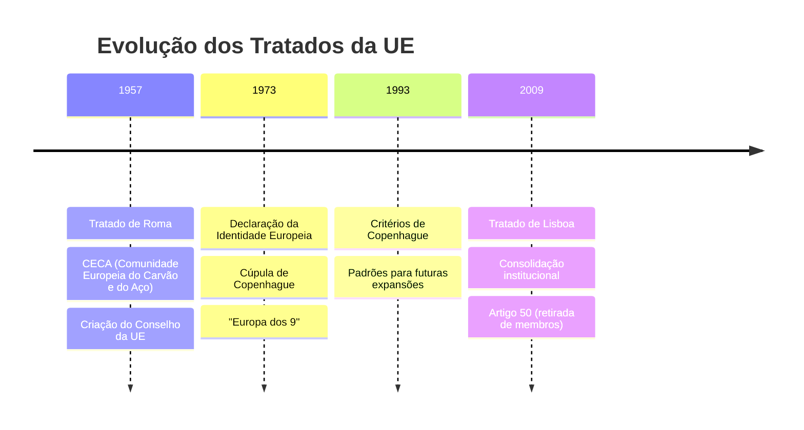
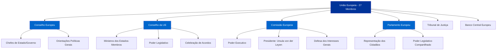

# A União Europeia: Trajetória, Instituições, Desafios Atuais e Relações com o Brasil

## 1. Origens e Evolução Histórica do Projeto Europeu

### Contexto do Pós-Guerra (Anos 1940-1950)

Após a devastação da Segunda Guerra Mundial, os países da Europa Ocidental buscaram garantir **paz duradoura, reconstrução econômica** e prevenir a expansão do comunismo soviético no continente. Com o apoio dos EUA via [[_O Plano Marshall|Plano Marshall]], promoveram a recuperação econômica **para “reduzir o descontentamento político e conter a maré comunista na Europa Ocidental”**. Em 1949, criaram a **OTAN** para defesa coletiva face à URSS. Nesse ambiente, surgiu a ideia de integrar setores estratégicos (como carvão e aço) entre antigos rivais (França e Alemanha), de modo a **tornar uma nova guerra “não só impensável, mas materialmente impossível”**. Essa visão foi expressa na **Declaração Schuman (1950)**, que propôs a comunidade do carvão e aço como primeiro passo concreto para a união europeia. Em suma, a integração europeia nasceu como projeto _sui generis_ motivado pela **segurança e prosperidade comuns**, amparado por valores de democracia ocidental e pelo alinhamento contra a influência soviética na Guerra Fria.

### A Trajetória dos Tratados Fundamentais

A evolução da União Europeia é marcada por tratados-chave que ampliaram gradualmente a integração econômica e política:

- **Tratado de Paris (1951)** – **Comunidade Europeia do Carvão e do Aço (CECA)**: Primeiro tratado supranacional, unindo França, Alemanha Ocidental, Itália, Bélgica, Holanda e Luxemburgo. Criou um mercado comum de carvão e aço, gerido por uma Alta Autoridade, **gerando interdependência nesses insumos bélicos para “eivar desconfianças” e impedir rearmamentos ocultos**. Entrou em vigor em 1952 (vigente até 2002).
    
- **Tratados de Roma (1957)** – **CEE e EURATOM**: Fundaram a **Comunidade Econômica Europeia (CEE)** e a Comunidade Europeia de Energia Atômica. **Objetivo:** estabelecer um **mercado comum** amplo (eliminando barreiras comerciais internas e harmonizando políticas) e cooperar no uso pacífico da energia nuclear. Vigentes desde 1958, esses tratados **expandiram a integração econômica geral** além do setor carvão-aço.
    
- **Ato Único Europeu (1986)** – Primeira grande revisão dos Tratados de Roma, já com 12 membros na Comunidade. **Objetivo:** impulsionar a conclusão do **Mercado Único** até 1992, removendo as últimas barreiras às **“quatro liberdades”** (bens, serviços, pessoas e capitais). **Principais mudanças:** ampliação do voto de maioria qualificada no Conselho (reduzindo vetos nacionais) e criação de novos procedimentos legislativos que deram mais influência ao Parlamento Europeu. Vigência: 1987.
    
- **Tratado de Maastricht (1992)** – Também chamado **Tratado da União Europeia**, em vigor desde 1993, **fundou oficialmente a “União Europeia”**. Estruturou a integração em **três pilares**: (1) **Comunidades Europeias** (matéria supranacional abrangendo economia, mercado interno, etc.), (2) **Política Externa e de Segurança Comum (PESC)** e (3) **Justiça e Assuntos Internos** – estes dois últimos de caráter mais **intergovernamental**. Maastricht lançou as bases da **União Econômica e Monetária**, com critérios de convergência e calendário para a moeda única (o **euro**), e criou a **cidadania europeia**, garantindo direitos civis aos nacionais dos Estados-membros. Adicionalmente, introduziu o procedimento de **codecisão** legislativa, fortalecendo o Parlamento, e novas áreas de cooperação em defesa e justiça.
    
- **Tratados de Amsterdã (1997) e Nice (2001)** – Revisões institucionais visando preparar a UE para incorporar um grande número de novos membros no alargamento dos anos 2000. **Amsterdã** (vigente 1999) incorporou o **Acordo de Schengen** ao quadro da UE, criou a figura do **Alto Representante para PESC** (primeira encarnação do “ministro das Relações Exteriores” europeu) e estendeu a codecisão a mais áreas, **“tornando a tomada de decisão mais transparente”** com maior uso do processo legislativo ordinário. **Nice** (vigente 2003) ajustou a **composição da Comissão** (estabelecendo número máximo de comissários) e **redefiniu o sistema de votos do Conselho**, ponderando votos e introduzindo critérios de **“dupla maioria”** para decisões eficientes numa UE de até 25 membros. Apesar dessas reformas, persistiram limitações que seriam endereçadas no tratado seguinte.
    
- **Tratado de Lisboa (2007)** – Vigente desde 2009, é o marco da UE contemporânea. **Objetivo:** tornar a UE **“mais democrática, eficiente e capaz de enfrentar problemas globais com uma só voz”** após os fracassos do projeto de Constituição Europeia (2005). **Principais inovações institucionais:** fortalecimento do Parlamento Europeu (passou a codecisor em quase toda legislação); adoção do voto de **dupla maioria** no Conselho (55% dos países representando 65% da população para aprovar a maioria dos atos); criação da **Iniciativa de Cidadania** (participação direta popular). Aboliu-se a antiga estrutura de pilares, unificando a personalidade jurídica da UE. Foram criados os cargos de **Presidente estável do Conselho Europeu** (mandato de 2,5 anos, para dar continuidade – atualmente Charles Michel) e o **Alto Representante da UE para Relações Exteriores e Política de Segurança**, agora também vice-presidente da Comissão, apoiado por um **Serviço Europeu de Ação Externa (diplomacia comum)**. O Tratado de Lisboa também **clarificou a divisão de competências** entre UE e Estados (competências exclusivas, partilhadas e nacionais), e vinculou juridicamente a **Carta de Direitos Fundamentais da UE**.
    

> [!note] **Os Três Pilares de Maastricht (1992)** 
> O Tratado de Maastricht estruturou a UE em três “pilares”. O **Pilar Comunitário** englobava as Comunidades Europeias (CEE/CE, CECA, Euratom) sob método supranacional (maioria qualificada e legislação comunitária direta). O **Segundo Pilar** era a PESC – cooperação intergovernamental em política externa e defesa, decidida por unanimidade. O **Terceiro Pilar** cobria Justiça e Assuntos Internos (cooperação policial, jurídica, imigração), também de caráter intergovernamental. _Lisboa (2007) aboliu essa divisão_, integrando PESC e Justiça Interna no quadro único da UE, embora **a distinção supranacional vs. intergovernamental persista em prática** (vide adiante a Natureza Jurídica da UE).

### Processos de Alargamento da UE

Desde os seis fundadores originais, a UE realizou sucessivas **ondas de adesão**. Cada ampliação trouxe novos membros e demandou ajustes institucionais. Principais fases:

- **1973:** 1ª ampliação – Reino Unido, Irlanda e Dinamarca aderem (a **Noruega** negociou, mas rejeitou em referendo). A UE passa de 6 para 9 membros.
    
- **1981:** Grécia junta-se, consolidando a democracia após o fim da ditadura militar.
    
- **1986:** Espanha e Portugal aderem, integrando as jovens democracias ibéricas e fomentando a coesão norte-sul.
    
- **1995:** Áustria, Suécia e Finlândia ingressam, países neutros que só entraram após a Guerra Fria. A UE chega a 15 membros.
    
- **2004:** **“Grande alargamento”** – **10 países da Europa Central e Oriental** (Polônia, Hungria, República Tcheca, Eslováquia, Eslovênia, Estônia, Letônia, Lituânia) mais **Chipre e Malta** aderiram em 1º de maio de 2004. Foi **a maior expansão da história da UE**, marcando simbolicamente o fim da divisão Leste-Oeste da Guerra Fria. Em um só dia, a União saltou de 15 para 25 membros, incorporando cerca de **75 milhões de novos cidadãos** e levando a população total a aumentar em mais de 25%. Esse alargamento exigiu intensas reformas (Ato Único, Maastricht, Amsterdã, Nice) para adaptar as instituições a muitos membros e representou uma “virada histórica” ao estender a estabilidade e prosperidade da UE a ex-países do bloco socialista.
    
- **2007:** Bulgária e Romênia juntam-se (adiadas de 2004 por questões de preparo institucional), elevando a UE a 27 países.
    
- **2013:** Croácia torna-se o 28º membro. (Em 2013 a UE atinge 28 membros, número que depois reduziria com a saída do Reino Unido).
    

Atualmente (meados de 2025), a UE possui **27 Estados-membros**, após a saída britânica. Estão em andamento novos **processos de adesão**: países dos **Bálcãs Ocidentais** (Sérvia, Montenegro, Macedônia do Norte, Albânia, Bósnia e Kosovo*) e, mais recentemente, **Ucrânia e Moldávia** (que obtiveram status de candidatas em 2022 em resposta à guerra com a Rússia). O possível futuro alargamento traz novamente desafios de governança, reacendendo debates sobre reformas institucionais para garantir a eficácia decisória em uma UE que pode ultrapassar 30 membros nos próximos anos.

## 2. Estrutura Institucional e Funcionamento da UE

A União Europeia possui um **arcabouço institucional único**, combinando elementos **supranacionais** e **intergovernamentais**. No centro do sistema decisório está o chamado **“Triângulo Institucional”** – **Comissão Europeia**, **Conselho da União Europeia** e **Parlamento Europeu** – que juntos elaboram e aprovam a legislação da UE. Além deles, outras instituições desempenham papéis cruciais (como o **Conselho Europeu**, o **Tribunal de Justiça da UE** e o **Banco Central Europeu**). A seguir, detalhamos a função de cada órgão e a natureza jurídica híbrida (supranacional/intergovernamental) da União.

### O Triângulo Institucional e o Processo Decisório

- **Comissão Europeia:** é o **órgão executivo e de iniciativa legislativa** da UE. Composta por um membro de cada país (os “comissários”, indicados pelos governos, mas comprometidos com o interesse coletivo europeu), a Comissão **representa os interesses gerais da UE**. Detém o monopólio da **iniciativa legislativa** na maioria das áreas – **propõe novas leis** após avaliações de impacto e consultas públicas. Também cabe à Comissão **executar o orçamento da UE**, gerir as políticas comuns (ex: agricultura, comércio) e **zelar pelo cumprimento do direito da UE**, podendo abrir processos contra Estados infratores (infringement) no Tribunal de Justiça. Em suma, a Comissão atua como **“guardiã dos Tratados”** e motor da integração.
    
- **Conselho da União Europeia** (ou **Conselho de Ministros**): representa os **governos nacionais** dos Estados-membros. É composto por ministros de cada país, variando conforme o assunto (e.g., ministros da Economia deliberam questões econômicas). No processo legislativo ordinário, o Conselho atua como **co-legislador ao lado do Parlamento**, aprovando, rejeitando ou emendando as propostas da Comissão. Grande parte das decisões do Conselho hoje é tomada por **maioria qualificada** (cada país tem um peso de voto proporcional; são necessários ~72% dos votos ponderados, respeitando critérios de população, para aprovar medidas). Todavia, em temas sensíveis (como política externa, fiscalidade, adesão de novos membros) ainda vigora a unanimidade, refletindo o caráter **intergovernamental** dessas áreas. A presidência do Conselho (rotativa a cada 6 meses entre os países) organiza agendas e negociações. Em síntese, o Conselho equilibra a integração com a **soberania nacional**, sendo foro de barganha entre Estados – mas quando decide por maioria, os países **cedem parcela de soberania**, devendo acatar as decisões coletivas.
    
- **Parlamento Europeu (PE):** é o parlamento **supranacional**, **eleito diretamente** pelos cidadãos da UE a cada 5 anos. Atualmente com 705 deputados, o PE representa os povos europeus e **co-legisla** com o Conselho na maioria das matérias (via **processo legislativo ordinário**, antes chamado codecisão). O Parlamento pode **aprovar, emendar ou vetar** legislação proposta, dando legitimidade democrática às normas europeias. Tem também poderes orçamentários (aprova o orçamento anual e o quadro financeiro plurianual junto com o Conselho) e de controle político: aprova a nomeação da Comissão (inclusive podendo vetar o candidato a presidente da Comissão) e pode **censurar a Comissão** (demitindo-a coletivamente, com maioria de 2/3). Apesar de inicialmente consultivo, o PE ganhou amplos poderes desde Maastricht e Lisboa, reduzindo o **“déficit democrático”** da UE. Ainda assim, não tem direito formal de iniciativa legislativa (solicita à Comissão propostas) e em política externa seu papel é limitado.
    

**Processo Legislativo Ordinário:** normalmente, **a Comissão propõe uma lei**, então **Parlamento e Conselho avaliam em duas leituras**, propondo emendas e buscando um texto comum (muitas vezes via **trílogos** informais). Caso entrem em acordo, a lei é aprovada e publicada. Se discordarem, forma-se um Comitê de Conciliação (3ª fase) para negociar compromisso; se este fracassar, a lei não segue. Assim, tanto representantes dos cidadãos (PE) quanto dos Estados (Conselho) precisam concordar, garantindo dupla legitimidade. Em alguns casos especiais (chamados **processos legislativos especiais**), o Conselho decide sozinho (após consentimento ou consulta ao PE) – por exemplo, em acordos de política externa ou adesão de novos membros. Isso reflete áreas onde os governos mantêm controle.

> [!important] **Intergovernamental vs. Supranacional** 
> Nas políticas **supranacionais** (mercado interno, união aduaneira, concorrência, comércio, meio ambiente etc.), a **“método comunitário”** prevalece: a Comissão propõe, decisões no Conselho por maioria, Parlamento codecide, e o direito europeu resultante é **diretamente aplicável e superior** às leis nacionais. Já em áreas **intergovernamentais** (como PESC – política externa e de segurança comum – e certos assuntos fiscais ou de defesa), os Estados **mantêm poder de veto/unanimidade**, a Comissão e o PE têm papéis reduzidos, e as decisões geralmente não têm efeito jurídico direto interno (dependendo de implementação nacional). Essa dualidade confere à UE seu caráter _sui generis_: não é um Estado federal, mas em muitas competências age de forma unificada e supranacional. O **Tratado de Lisboa** integrou estrutura, mas preservou **cláusulas de exceção** para respeitar soberanias em domínios sensíveis (ex.: nenhum exército pode ser enviado pela UE sem consentimento de todos os países). Esse equilíbrio dinâmico entre **integração profunda** e **cooperação intergovernamental** é uma das chaves de compreensão do funcionamento da União.

### Outras Instituições-Chave da UE

- **Conselho Europeu:** É a **cúpula dos Chefes de Estado ou Governo** dos 27 países, juntamente com seu presidente permanente e o presidente da Comissão. Reúne-se geralmente a cada trimestre em Bruxelas. **Função:** **“definir as orientações e prioridades políticas gerais da UE”**, fixando os grandes rumos e arbitrando questões sensíveis. **Não legisla** nem gere o dia-a-day, mas decide consensualmente **questões estratégicas**: por exemplo, novas adesões, quadro financeiro plurianual, posicionamentos geopolíticos importantes, indicações de nomes para altos cargos (propõe o Presidente da Comissão, nomeia o Alto Representante, presidente do BCE, etc.). Em suma, o Conselho Europeu atua como **instância máxima de coordenação política**, imprimindo impulso e visão de longo prazo. Foi formalizado como instituição em Maastricht (1992) e ganhou presidente fixo em Lisboa. Atualmente, o presidente do Conselho Europeu (desde 2019, Charles Michel; anteriormente Donald Tusk, Herman van Rompuy) facilita consensos entre líderes. Decisões do Conselho Europeu costumam requerer **unanimidade**, pois tratam de temas vitais de soberania. Assim, ele encarna o **caráter intergovernamental** no topo da UE – “os chefes de governo reunidos decidindo o destino do bloco”. Embora não faça leis diretamente, suas **“conclusões”** orientam as legislações e políticas que a Comissão e o Conselho da UE depois detalharão.
    
- **Tribunal de Justiça da União Europeia (TJUE):** Sediado em Luxemburgo, é o **poder judiciário** do bloco. **Garante a aplicação uniforme do direito da UE** em todos os países e zela para que Estados e instituições cumpram os Tratados. Compreende a **Corte de Justiça** (um juiz por país, lida com questões de interpretação do direito da UE e recursos de tribunais nacionais) e o **Tribunal Geral** (dois juízes por país, julga casos de indivíduos e empresas contra instituições da UE, concorrência, auxílio estatal etc.). O TJUE tem competência final sobre matérias de direito comunitário: tribunais nacionais frequentemente submetem dúvidas (vias **prejudiciais**) para Luxemburgo decidir o sentido das leis europeias. Se um país membro violar obrigações (por ex., não implementar uma diretiva), a **Comissão ou outro Estado** pode acioná-lo no TJUE (**ação por infração**). As sentenças do Tribunal são vinculantes; pode inclusive impor **multas** a governos infratores. Além disso, o Tribunal pode **anular atos** das instituições europeias contrários aos Tratados (se acionado pelo Parlamento, Conselho ou Comissão, ou mesmo por cidadãos em certos casos). A jurisprudência do TJUE ao longo das décadas firmou princípios basilares da ordem jurídica da UE, como a **supremacia do direito europeu** sobre leis nacionais conflitantes e o **efeito direto** (direitos que indivíduos podem invocar diretamente com base no direito da UE). Em suma, o TJUE sustenta a UE como uma **união de Direito**, assegurando que as regras comuns prevaleçam e sejam interpretadas de forma uniforme de Lisboa a Helsinque.
    
- **Banco Central Europeu (BCE):** Instituição financeira independente, sediada em Frankfurt, criada em 1998 para gerir a nova moeda comum. O BCE é o **guardião do euro** – conduz a **política monetária** da **Zona do Euro** (atualmente 20 países). Seu **objetivo primário é manter a estabilidade de preços**, isto é, inflação baixa e controlada (hoje definida como 2% ao ano). Para tanto, o BCE fixa as **taxas de juros básicas** (refinanciamento, depósito etc.), controla a oferta monetária e implementa medidas monetárias não convencionais quando necessário (como compra de ativos em crises). **Estrutura:** é regido por um Conselho de Governadores (os presidentes dos Bancos Centrais Nacionais do euro + o Comitê Executivo do BCE). **Independência:** nem governos nacionais nem instituições da UE podem instruir o BCE, protegendo-o de pressões políticas. Durante a **crise do euro (2010-2015)**, o BCE teve papel crucial (famosa frase de Mario Draghi: “fará o que for preciso” para salvar o euro), atuando como emprestador de último recurso e lançando programas de estímulo. Além da política monetária, o BCE (junto com Banco Central nacionais) supervisiona grande parte do sistema bancário (União Bancária). Importante destacar que **nem todos os países da UE adotaram o euro** – mas nos 20 que sim, o BCE substitui os bancos centrais nacionais na política monetária. O atual presidente é Christine Lagarde (desde 2019, sucedendo Draghi). Em resumo, o BCE faz para a área do euro o que outros bancos centrais nacionais fazem para seus países, porém numa dimensão **supranacional**: **“trabalhamos para preservar o valor do euro”**, servindo ~340 milhões de europeus que usam a moeda única.
    

### Natureza Jurídica da União: Supranacional vs. Intergovernamental

A UE não é um Estado federativo, mas tampouco uma simples organização internacional – é uma construção híbrida. Em **partes do projeto europeu há clara cessão de soberania** nacional a entidades supranacionais: por exemplo, na política comercial comum, somente a UE (via Comissão) pode assinar acordos comerciais; nas regras de concorrência, a Comissão pode vetar fusões ou punir empresas diretamente; no caso do euro, países abriram mão de moeda própria e política de juros em favor do BCE. Nesses domínios, **a União age “acima” dos Estados**, criando normas aplicáveis diretamente aos cidadãos e empresas (regulamentos, diretivas) e sujeitando os governos à jurisdição do TJUE. Há inclusive o princípio da **primazia**: **se uma lei nacional conflita com uma lei da UE, prevalece a europeia** (como reconhecido desde o caso Costa vs. ENEL, 1964). Esse caráter **supranacional** da UE a aproxima de uma federação em certas políticas (especialmente mercado interno e união monetária).

Por outro lado, há esferas em que os **Estados-membros conservam plenamente sua soberania e o mecanismo decisório é **intergovernamental**. A **PESC** (política externa e segurança) é emblemática: as decisões _requerem consenso_ dos 27 (cada país retém direito de veto em questões diplomáticas e militares). A UE pode, por exemplo, adotar **sanções externas ou posições internacionais** em seu nome, mas apenas se todos os governos concordarem. O **Alto Representante** coordena e representa a posição comum, mas não pode impor uma política externa europeia contra a vontade de algum Estado. Outro exemplo é a **política fiscal**: impostos diretos ainda são competência nacional, e qualquer harmonização tributária na UE exige unanimidade no Conselho – refletindo a sensibilidade do tema. Assim, em áreas intergovernamentais, a UE atua mais como fórum de cooperação entre soberanias, e menos como autoridade autônoma.

Essa dicotomia manifesta-se historicamente nos “três pilares” (comunitário supranacional vs. 2º e 3º pilares intergovernamentais). **Após Lisboa**, embora formalmente haja um só pilar, **persistem diferenças nos procedimentos e alcance das normas** conforme o campo. Por exemplo, decisões de PESC não são passíveis de controle do TJUE nem envolvem o Parlamento (salvo consentimento em tratados). A **segurança e defesa** seguem sendo essencialmente intergovernamentais (a UE não pode obrigar um país a enviar tropas, e a OTAN permanece a aliança de defesa coletiva para os europeus).

Em resumo, a **UE combina dimensões supranacionais (onde age como entidade única com poderes próprios) e dimensões intergovernamentais (onde age como confederação de estados)**. Essa natureza **híbrida** é a razão de frequentemente a Europa ser chamada de **“gigante econômico, mas anão político”** – enorme integração em comércio e economia, porém dificuldades em ter uma voz política/militar unificada. No entanto, com cada crise e tratado, a União tem tendido a expandir a esfera supranacional (por exemplo, a pandemia e a guerra recente levaram a iniciativas coletivas inovadoras em saúde, energia e defesa). A manutenção desse equilíbrio – integrando onde for vantajoso, respeitando soberanias onde necessário – é um ponto central do Direito e da Política da UE.

## 3. Situação Atual e Desafios Contemporâneos (até meados de 2025)

A União Europeia nos últimos anos enfrentou desafios de magnitude histórica, tanto **internos** quanto **externos**, que testam sua coesão e impulsionam novas transformações. Nesta seção, analisamos (a) os **desafios internos**, incluindo o ressurgimento de forças eurocéticas e problemas de respeito ao Estado de Direito dentro de alguns países-membros, bem como os efeitos do **Brexit**; (b) os **desafios externos e estratégicos**, como a guerra na Ucrânia, a competição geopolítica entre EUA e China e a crise energética; e (c) as **grandes agendas** estratégicas adotadas pela UE – notadamente o **Pacto Ecológico Europeu** e a **transição digital** – como respostas de longo prazo a esses desafios.

### Desafios Internos: Euroceticismo, Populismo e Estado de Direito

**Ascensão de Eurocéticos e Extrema-Direita:** Nos últimos anos, diversos países da UE viram o crescimento de partidos **nacionalistas, populistas de direita e abertamente eurocéticos**. Essas forças questionam a integração profunda – algumas pregando repatriação de poderes a nível nacional, outras até defendendo sair do euro ou da própria UE. Exemplo marcante é a **França**, onde a líder Marine Le Pen (Reunião Nacional) chegou ao segundo turno nas eleições presidenciais de 2017 e 2022 com plataforma anti-Bruxelas. Na **Itália**, partidos de extrema-direita como a Liga de Matteo Salvini e o Irmãos da Itália de Giorgia Meloni (atual primeira-ministra) ganharam protagonismo; Meloni referiu-se certa vez à UE como “um gigante burocrático e um anão político”, criticando sua eficácia. Esses movimentos costumam explorar temáticas como **anti-imigração**, defesa do “interesse nacional” contra regras europeias e oposição a liberalismo cosmopolita. Atualmente, na **Hungria** e **Polônia**, governantes nacional-conservadores (Viktor Orbán e o partido Lei e Justiça, respectivamente) adotam retórica eurocética, travando disputas com Bruxelas em valores democráticos. No Parlamento Europeu, partidos de extrema-direita compõem hoje dois grupos significativos – **ID (Identidade e Democracia)** e **ECR (Conservadores e Reformistas)** – somando cerca de **128 eurodeputados (aprox. 17% do PE)**. Essas bancadas congregam legendas como RN francês, Liga italiana, Alternativa para Alemanha, Vox espanhola e Lei e Justiça polonesa. Há uma pauta comum que os une: **aversão à imigração**, **nacionalismo eurocético (contra “mais integração”)** e discurso **anti-elite liberal/progressista**, afirmando representar “o povo contra o establishment”. Entretanto, diferenças existem (por exemplo, sobre relação com a Rússia: umas forças são pró-Moscou, outras anti-Kremlin), o que dificulta sua união total. _Impacto:_ O crescimento dessas forças **pressiona a UE internamente** – governos populistas podem vetar consensos, e o risco de retrocessos democráticos em certos países desafia os valores fundadores. As **eleições europeias de 2024** antecipam um avanço adicional desses partidos, possivelmente fragmentando mais o Parlamento e influenciando a escolha dos próximos líderes da União. Ainda que, por ora, temores de um “efeito dominó” de saídas pós-Brexit não tenham se concretizado (nenhum país além do Reino Unido manifestou plano sério de sair), a **retórica anti-UE tornou-se parte do cenário político** em muitos Estados, exigindo resposta das lideranças pró-europeias para reconectar a União aos cidadãos (melhorando comunicação, reformando processos, etc.).

**Desafios ao Estado de Direito:** Um aspecto crítico associado a alguns governos eurocéticos é o **desrespeito a princípios do Estado de Direito** – independência judicial, liberdade de imprensa, direitos fundamentais – sobre os quais a UE está fundada (art. 2 TUE). **Hungria** e **Polônia** tornaram-se casos notórios: reformas judiciais polonesas politizaram cortes e conselho de magistratura; na Hungria, o governo Orbán sufocou pluralismo midiático, sociedade civil e alterou a constituição em benefício próprio. A UE, comprometida a ser uma “união de valores”, enfrenta a complexa tarefa de **disciplinar democraticamente** esses membros sem alienar suas sociedades. Mecanismos acionados incluem: o **Artigo 7 do TUE** (processo que pode levar à suspensão de direitos de voto de um país que viole gravemente valores da UE) – tanto Polônia quanto Hungria estão sob processos do Art.7 desde 2017-2018, porém a sanção máxima nunca avançou devido à exigência de unanimidade (e eles se protegem mutuamente). Em 2020, a UE inovou ao criar um **mecanismo de condicionalidade** ligando o recebimento de fundos do orçamento ao respeito ao Estado de Direito. **Polônia e Hungria contestaram isso na Justiça, mas perderam**: em fevereiro de 2022, o **TJUE confirmou que a UE pode condicionar fundos ao respeito aos valores**. Isso abriu caminho para a Comissão **congelar repasses** – de fato, bilhões de euros do Fundo de Recuperação Pós-Covid destinados a esses países estão bloqueados até implementarem reformas (e no caso húngaro, o orçamento regular de coesão também sofreu cortes). Varsóvia e Budapeste chamaram isso de “chantagem” e “ataque à soberania”, mas outros governos elogiaram como medida necessária para “reforçar a comunidade de valores”. A Comissão Europeia agora publica relatórios anuais de Estado de Direito para todos os países, escrutinando independência judicial, corrupção, liberdade de mídia etc., o que pressiona por melhorias. Até meados de 2025, a Polônia (sob novo governo eleito em 2023) dá sinais de voltar atrás em abusos judiciais para liberar fundos, enquanto a Hungria permanece relutante, travando batalhas com Bruxelas. Esse embate **interno** – entre uma UE que se vê como comunidade de democracias liberais e alguns governos nacionalistas iliberais – é **inédito** no bloco e seu desfecho será determinante para o futuro da coesão política.

**Consequências do Brexit:** A saída do **Reino Unido** da UE, formalizada em 31 de janeiro de 2020, foi um abalo sem precedentes – o primeiro membro a deixar o bloco, desfazendo 47 anos de participação britânica. Passados alguns anos, as **consequências do Brexit** ficaram mais claras:

- _Institucionalmente_: O Brexit retirou da UE uma das maiores economias (2ª do bloco) e um membro do **Conselho de Segurança da ONU** com poder nuclear. Com isso, a **balança de poder intra-UE mudou**: França e Alemanha emergem ainda mais dominantes; países médios perderam um aliado tradicional em prol de mercados abertos e menos regulação. Por outro lado, a **saída do “embaçador” britânico** facilitou certos consensos – o Reino Unido frequentemente vetava aprofundamentos (ex: integração defensiva, orçamental); sem ele, a UE uniu-se rapidamente em novas frentes (como o citado fundo de recuperação comum pós-pandemia, algo que Londres provavelmente dificultaria).
    
- _Econômico-comercial_: Novas barreiras surgiram no comércio UE–Reino Unido. Apesar de um **Acordo de Comércio e Cooperação** (2020) garantindo tarifa zero para mercadorias, procedimentos alfandegários voltaram, impactando cadeias de suprimentos (especialmente agroalimentar e pequenas empresas). Setores como serviços financeiros em Londres também perderam **“passaporte”** para atuar livremente no continente. A UE criou um fundo de ajuste para apoiar regiões afetadas pelo Brexit. Até 2025, o comércio britânico com a UE diminuiu em relação à tendência pré-2016, e algumas empresas relocaram partes de operações para países da UE (ex: sedes de bancos para Frankfurt/Paris). Para a UE como um todo, o impacto macroeconômico foi absorvido (o Reino Unido representava ~13% do PIB da UE-28).
    
- _Político e simbólico_: O Brexit funcionou paradoxalmente como **catalisador de unidade** entre os 27 restantes. Durante as negociações (2017-2019), a UE manteve coesão notável – **Irlanda** recebeu solidariedade na questão de evitar fronteira rígida com a Irlanda do Norte, e nenhum outro país desertou da posição comum. O temor de que Brexit inspirasse outros referendos (“Frexit”, “Nexit” etc.) não se materializou – ao contrário, a saída tumultuada e as dificuldades enfrentadas pelo Reino Unido fora do bloco serviram meio que **de exemplo dissuasório**. O apoio popular à UE até aumentou em alguns países após 2016. Internamente, a UE precisou lidar com **novos arranjos**: por exemplo, a **Irlanda do Norte** ganhou status especial (mantém alinhamento com mercado da UE para evitar fronteira física na ilha irlandesa), o que causou disputas Londres-Bruxelas até um novo acordo (Windsor, 2023).
    
- _Segurança e Defesa_: O Reino Unido era uma potência militar significativa; sua saída levantou questões sobre a capacidade da UE em matéria de defesa europeia autônoma. A UE vem tentando preencher lacunas via cooperação estruturada permanente (PESCO) e projetos conjuntos, mas a realidade é que, sem os britânicos, a UE ficou mais dependente da **OTAN**/EUA para hard power. Ao mesmo tempo, o RU permanece parceiro próximo da UE em sanções e política externa (ex.: alinhados nas sanções à Rússia), ainda que fora das estruturas formais.
    

Em síntese, o Brexit foi um choque, mas a UE **demonstrou resiliência**, evitando fragmentação e até aprofundando políticas em resposta. Persistem arestas na relação futura (especialmente sobre serviços e cooperação regulatória), mas a crise existencial que se temia para a UE não se concretizou – pelo contrário, o projeto de integração seguiu adiante, agora **sem o sócio tradicionalmente mais cético** dentro.

### Desafios Externos e Estratégicos: Guerra na Ucrânia, Autonomia Estratégica e Crise Energética

**Guerra na Ucrânia e Segurança Europeia:** A invasão russa da Ucrânia em fevereiro de 2022 trouxe a guerra de alta intensidade de volta à Europa – um choque geopolítico que **abalou o paradigma de segurança da UE**. A UE, tradicionalmente avessa a envolvimento militar, reagiu de forma relativamente unida e firme contra a agressão russa. **Medidas tomadas:** Em coordenação com EUA e aliados, a UE impôs **pacotes massivos de sanções econômicas** à Rússia (congelamento de reservas do Banco Central russo, embargo a petróleo e carvão russos, exclusão de bancos do SWIFT, sanções a oligarcas etc.). Notavelmente, pela primeira vez na história, a UE (via **Fundo Europeu de Apoio à Paz**) financiou o envio de **armas letais** a um país em guerra (para auxiliar a defesa ucraniana), rompendo um tabu. Até meados de 2025, já destinou mais de 5 bilhões de euros para reembolsar Estados-membros que fornecem armamento a Kiev. Além disso, a UE acolheu **milhões de refugiados ucranianos** concedendo-lhes proteção temporária automática – uma demonstração de solidariedade raramente vista em crises migratórias passadas. Politicamente, a guerra **reforçou a coesão transatlântica**: a UE alinhou-se fortemente aos EUA/NATO no apoio à Ucrânia, inclusive com países tradicionalmente neutros como Suécia e Finlândia abandonando neutralidade e pedindo adesão à OTAN (a Finlândia já ingressou em 2023; a Suécia aguarda ratificações).

No âmbito de **defesa europeia**, a guerra funcionou como despertador: países como **Alemanha** reverteram políticas de baixo investimento militar (anunciando o fundo “Zeitenwende” de €100 bi para modernizar suas Forças Armadas). A UE acelerou iniciativas de **cooperação militar**: aprovou em 2022 a **“Bússola Estratégica”**, um plano para dotar a UE de capacidade de reação mais rápida (prevendo, por exemplo, uma força-tarefa de 5 mil soldados pronta até 2025). Lançou também projetos de **compras conjuntas de armamentos** (para repor estoques doados e aproveitar economia de escala). Entretanto, a realidade é que a defesa da Europa diante da ameaça russa recaiu sobretudo na OTAN e no apoio dos EUA – **a guerra ressaltou tanto a importância da aliança atlântica quanto a necessidade europeia de assumir mais responsabilidade**. Existe uma tensão: por um lado, a crise mostrou que **“tempos de paz acabaram”** e que a UE precisa _“falar a língua do poder”_ (parafraseando Borrell) – investindo mais em dissuasão e segurança; por outro, reforçou a dependência dos recursos militares americanos. Ainda assim, a UE tomou passos impensáveis antes: a **Ucrânia** foi aceita como **candidata oficial à UE** (junto com Moldávia) poucos meses após a invasão, um sinal geopolítico de longo prazo. Também discute seriamente expansão para **Bálcãs Ocidentais** para estabilizar o leste europeu. Assim, a guerra na Ucrânia tornou-se um catalisador para a UE **repensar sua arquitetura de segurança**, impulsionando tanto a cooperação europeia de defesa quanto a ampliação do bloco em nome da estabilidade continental.

**Autonomia Estratégica vs. Competição EUA-China:** Nos últimos anos, a UE tem promovido o conceito de **“autonomia estratégica”**, que ganhou tração especial durante a presidência Trump e a pandemia, e segue atual diante da rivalidade EUA-China. Em essência, significa **fortalecer a capacidade europeia de agir independentemente** e **reduzir dependências externas** em setores críticos – seja em defesa, tecnologia, energia ou cadeias produtivas. A noção emergiu originalmente no contexto de defesa (uma Europa capaz de conduzir operações militares sem depender totalmente dos EUA), mas hoje **“autonomia estratégica não se limita à segurança e defesa”**, abarcando também autonomia industrial, digital, econômica. Por exemplo, a UE percebeu dependências problemáticas: 98% dos princípios ativos de certos medicamentos vêm da Ásia; semicondutores e equipamentos de telecomunicações dependem de fornecedores estrangeiros; energia (gás russo); até questões de infraestrutura financeira (domínio do dólar nos pagamentos internacionais). A resposta europeia tem sido múltipla:

- **Defesa:** O fortalecimento do pilar europeu na OTAN e desenvolvimento de capacidades autônomas (como mencionado, PESCO, Fundo Europeu de Defesa para financiar projetos, Bússola Estratégica). A França especialmente pressiona por opções europeias independentes, mas países do leste temem enfraquecer laços com EUA. A guerra na Ucrânia, paradoxalmente, _adiou_ a plena autonomia: com a ameaça russa, a **OTAN** ficou ainda mais central e a proteção americana indispensável. Porém, a UE viu ser vital investir em sua **base industrial de defesa** (fábricas de munição, etc.) para não depender de estoques dos EUA ou outros.
    
- **Tecnologia e Indústria:** A UE lançou agendas para **soberania digital e industrial**. Exs.: **EU Chips Act** (lei para incentivar produção de semicondutores na Europa, reduzindo a dependência de chips asiáticos/americanos), alavancando investimentos públicos-privados; **Aliança Europeia de Baterias** e de Matérias-Primas para garantir insumos críticos (lítio, terras-raras) local ou via parceiros diversificados. Regulamentou estrangeiros: criou um mecanismo de **screening de investimentos externos** (para barrar aquisições indesejadas de empresas estratégicas por estatais de fora, e.g. chinesas). Também, no campo comercial, discute instrumentos anti-coerção (responder a coerção econômica de potências) e condicionalidades ambientais em acordos (para moldar normas globais conforme seus padrões).
    
- **Relação com EUA e China:** A UE posiciona-se como **aliado dos EUA**, mas **quer evitar dependência excessiva ou alinhamento automático**. Sob Biden, as relações UE-EUA melhoraram (cooperação climática, tecnológica via Conselho de Comércio e Tecnologia etc.), porém divergências surgem: por exemplo, o maciço subsídio industrial americano (Lei de Redução da Inflação, 2022) foi visto como discriminatório contra empresas europeias, levando a UE a pensar em sua própria resposta (Flexibilizar auxílios estatais e criar fundos para competitividade). Com **China**, a UE tenta uma via própria: define Pequim como “parceiro em alguns temas, **concorrente** econômico e **rival sistêmico**” simultaneamente. Procura equilibrar relacionamento – mantendo comércio robusto (China é 2º maior parceiro da UE) e cooperação climática, mas protegendo setores estratégicos e criticando direitos humanos. A postura de alguns líderes (ex: Macron defende que Europa não seja “vassala” nem dos EUA nem da China) ilustra a busca de um **terceiro caminho europeu**, às vezes controverso. _Exemplo atual:_ Em 2023, depois de visitas de líderes europeus a Pequim, fala-se se a “autonomia estratégica” implicaria a Europa não seguir automaticamente uma eventual pressão americana contra a China (por Taiwan, p.ex.). Washington teme essa ambiguidade, mas a UE argumenta que quer **“autonomia de pensamento estratégico”** – ou seja, decidir caso a caso segundo seus interesses. Entretanto, a guerra na Ucrânia provou que quando valores fundamentais estão em jogo, Europa e EUA permanecem unidos; a divergência maior é em cenários como China, onde os interesses comerciais europeus são enormes (Alemanha, por ex., exporta muito para China).  
    Em suma, a **autonomia estratégica europeia** é um objetivo em construção: há consenso de que a Europa deve “se virar mais por si mesma num mundo difícil”. Contudo, falta acordo exato sobre o alcance – **“não há consenso sobre o que realmente significa”**. A tarefa de 2022-25 tem sido justamente dar conteúdo prático: diversificar fornecedores (energia, chips), investir em indústrias críticas e reduzir vulnerabilidades sem cair em protecionismo excessivo. Esse esforço ocorre enquanto a UE navega a competição EUA-China, tentando **preservar seu modelo e interesses** sem se alinhar cegamente a Washington nem ser ingênua com Pequim.
    

**Crise Energética de 2021-2023:** A UE viveu uma grave **crise de energia** a partir de 2021, exacerbada brutalmente pela guerra na Ucrânia. A Rússia, antes principal fornecedor de gás natural (cerca de 40% do consumo europeu), reduziu drasticamente os fluxos em 2022 em retaliação às sanções, levando os preços do gás e eletricidade na Europa a níveis recordes. Para economias e consumidores europeus, foi um choque de preços e risco de escassez no inverno. A crise revelou a **perigosa dependência energética** da UE em relação a um fornecedor geopoliticamente hostil. A resposta europeia foi dupla: **emergencial** e **estrutural**.

No imediato, a UE acionou medidas coordenadas sem precedentes: os países concordaram em **reduzir voluntariamente 15% do consumo de gás** no inverno 22/23, compartilhar gás em caso de emergência e **encher estoques de gás** antes do inverno (meta superada de >90% da capacidade armazenada). Também adotaram um mecanismo temporário de **limite de preço do gás** em mercados para conter especulação, e facilitaram **compras conjuntas de gás natural liquefeito (GNL)** no mercado global para barganhar melhor preço. A Comissão lançou o plano **“RePowerEU”** (2022) visando **“pôr fim à dependência dos combustíveis fósseis russos o mais rapidamente possível”**. Esse plano diversificou fornecedores (mais GNL dos EUA, Qatar; gasoduto da Noruega, North Africa; reativação de terminais), **redução de demanda** e **aceleração de renováveis**. De fato, em 2022-23, a UE conseguiu cortar a fatia do gás russo para menos de 10%, substituindo-o por GNL e outras fontes, sem racionamento forçado. No pico da crise, muitos governos subsidiaram contas de luz/gás dos cidadãos e empresas com centenas de bilhões de euros, para amortecer o choque social e inflacionário.

Estruturalmente, a crise deu enorme impulso político ao **Green Deal** (ver adiante) – pois energias renováveis significam independência energética. A UE elevou metas de eficiência e energias limpas para reduzir uso de gás. Além disso, a UE aprendeu a **usar seu peso conjunto no mercado energético**: lançou plataforma para **compras conjuntas de gás** permanentemente, buscando melhores contratos e evitar que países concorram entre si encarecendo preços. Em suma, a crise energética evidenciou que **“diversificar fontes, reduzir demanda e aumentar eficiência”** são cruciais para a segurança europeia. Felizmente, um inverno ameno em 2022/23 e esforços coordenados permitiram contornar o pior. Em 2023, os preços recuaram para patamares pré-guerra em parte, e o risco imediato passou. Mas permanecem desafios: algumas indústrias intensivas (química, fertilizantes) perderam competitividade com energia cara em 2022, e a UE discute como evitar desindustrialização (a resposta entrelaça com subvenções verdes e reformas estruturais). A crise também escancarou divergências entre países – ex.: Alemanha inicialmente relutou em racionar ou encarar teto de preços, enquanto sul da Europa pressionava por solidariedade. No fim, um compromisso coletivo prevaleceu, reforçando a **resiliência da união**. A lição estratégica: energia é geopolítica, e a UE precisa tratar como questão de segurança comum, não apenas econômica. A transição energética ganhou não só motivação climática mas agora também de **autonomia estratégica**.

### Grandes Agendas Atuais: Pacto Ecológico Europeu e Transição Digital

Diante das transformações globais, a UE adotou agendas abrangentes para moldar seu futuro econômico-social. Duas prioridades gêmeas definidas pela Comissão von der Leyen (2019-2024) são: **tornar-se uma economia sustentável (neutra em carbono)** e **liderar a era digital**, assegurando competitividade e valores europeus no ciberespaço. São projetos de longo prazo, mas que já resultaram em políticas concretas até 2025.

**Pacto Ecológico Europeu (European Green Deal):** Lançado em dezembro de 2019, é a estratégia-mestra da UE para enfrentar as **mudanças climáticas** e **reorientar seu modelo de desenvolvimento**. **Visão:** fazer da Europa o **primeiro continente neutro em carbono até 2050**, conciliando proteção ambiental com crescimento econômico. Entre as metas centrais está **reduzir as emissões de gases de efeito estufa em pelo menos 55% até 2030** (comparado a 1990) – meta esta convertida em lei (Lei Climática Europeia de 2021). O Green Deal abrange um amplo **roteiro de medidas** em energia, indústria, transportes, agricultura e biodiversidade:

- Na **energia**, meta de ~_fit for 55%_ de renováveis até 2030, eliminação progressiva do carvão, expansão da geração solar e eólica, e melhorias de eficiência (renovação predial). Após a crise do gás russo, essas metas foram até reforçadas pela urgência de independência energética.
    
- Nos **transportes**, já se aprovou a **proibição de venda de carros novos a gasolina/diesel a partir de 2035**, impulsionando a transição para veículos elétricos. Incentiva-se mobilidade sustentável, ferrovias, e combustíveis limpos para aviação/marítimo.
    
- Em **indústria**, criou-se o conceito de **transição justa**: fundos para regiões dependentes de combustíveis fósseis (ex: carvão na Polônia) diversificarem economia, para que nenhum trabalhador seja “deixado para trás”. Ao mesmo tempo, a UE endureceu normas antipoluição e propôs a inédita **Taxa de Ajustamento de Carbono** nas fronteiras (CBAM) – um tarifa sobre importações de setores intensivos em carbono, para equalizar custos ambientais e evitar _dumping_ ecológico. Essa medida começa faseamento em 2023-26.
    
- No **uso da terra e biodiversidade**, o Pacto Ecológico inclui a **Estratégia da Biodiversidade 2030** (meta de proteger 30% de terras e mares da UE), plano para desmatamento zero em cadeias de suprimento (lei que bane importação de produtos associados a desmatamento ilegal, impactando inclusive o Brasil no setor agrícola), e a Estratégia “Do Prado ao Prato” visando agricultura sustentável e redução de agrotóxicos.
    

> [!note] **European Green Deal – importância estratégica** 
> Segundo a própria Comissão, o Pacto Ecológico é **“a nova estratégia de crescimento da Europa”**, visando _“transformar a UE numa economia moderna, eficiente no uso de recursos e competitiva, garantindo que em 2050 não haja emissões líquidas de GEE”_. Ele busca **desvincular crescimento de uso de recursos**, liderar inovação verde (painéis solares, baterias, hidrogênio verde) e dar à UE a dianteira em normatização ambiental (exportando padrões ao mundo). Além do imperativo climático, após a guerra na Ucrânia, o Green Deal também virou pilar de **segurança energética** e autonomia (renováveis domésticas = menos importações voláteis). Entretanto, o projeto enfrenta desafios: alguns setores e países resistem (ex: Polônia reluta em abandonar carvão rapidamente sem compensações; agricultores reclamam de regras ambientais duras). Também há a competição externa – e.g., EUA lançaram um grande pacote de subsídios verdes (IRA), o que pressiona a UE a facilitar investimentos para não perder indústrias. Ainda assim, até 2025 a UE aprovou grande parte do pacote _Fit for 55_: reformas no **Mercado de Carbono (ETS)** para cortar emissões mais rápido e incluir setores como aviação e transporte marítimo; criação de um **Fundo Social para Clima** para ajudar famílias vulneráveis nos custos da transição; lei de restauração da natureza, etc. Resta implementar e executar, mantendo coesão interna. A presidência espanhola do Conselho (2023) e a futura presidência belga (2024) têm trabalhado para consolidar esses dossiês antes das eleições europeias.

**Transição Digital e Soberania Tecnológica:** Em paralelo ao verde, a UE aposta na **transformação digital** como motor econômico e questão de soberania. A pandemia acelerou digitalização, mas também expôs dependências (tecnológicas, cadeias de suprimento asiáticas) e riscos (desinformação online, poder das big tech). As ações da UE nesse âmbito têm duas frentes: **regulação do espaço digital** segundo valores europeus, e **promoção da capacidade tecnológica** própria.

No campo regulatório, a UE vem se afirmando como **vanguardista global em regulação da Internet e tecnologia** (“Brussels effect”). Destacam-se duas legislações históricas aprovadas em 2022:

- **Lei dos Serviços Digitais (DSA)**: impõe obrigações estritas a plataformas online quanto a moderação de conteúdo, transparência de algoritmos e combate a ilegalidades online. Plataformas muito grandes (Facebook, YouTube, Twitter etc.) serão auditadas quanto a riscos sistêmicos (disseminação de desinformação, por ex.) e podem ter que mudar práticas. É uma tentativa de **responsabilizar big tech pelo ambiente online**, ao mesmo tempo protegendo a liberdade de expressão.
    
- **Lei dos Mercados Digitais (DMA)**: visa **garantir mercado digital justo e competitivo**. Estabelece regras para os “_gatekeepers_” – grandes empresas controladoras de ecossistemas (como Google, Apple, Amazon, Meta, Microsoft): elas não poderão, por exemplo, favorecer seus próprios serviços nas plataformas, ou impedir interoperabilidade de serviços de mensagem, etc. A DMA combate práticas monopolistas no digital, buscando abrir espaço a concorrentes menores e inovação.
    

Ambas as leis, DSA e DMA, formam um pacote coerente que **coloca limites ao poder das gigantes de tecnologia** e reforça direitos de usuários, privacidade e concorrência leal. A UE ainda avançou em outras frentes: lançou a **Regulamentação de IA (AI Act)** (em fase final de aprovação) – será o **primeiro marco legal abrangente sobre Inteligência Artificial no mundo**, classificando sistemas de IA conforme risco e banindo usos inaceitáveis (ex: vigilância massiva). Outras normas recentes incluem a **Lei de Governança de Dados**, a **Lei de Resiliência Cibernética**, e a **DORA** (regulamento de resiliência operacional digital no setor financeiro). Em 2018, já havia a famosa **GDPR (Lei Geral de Proteção de Dados)**, replicada mundo afora. Com isso, a UE se consolida como o **“regulador do mundo digital”**, exportando seus padrões – a ponto de em 2024 propor na ONU que suas regras para plataformas sirvam de referência global.

No aspecto de **capacitação tecnológica**, a UE fixou metas chamadas **“Década Digital 2030”**: que 80% dos adultos tenham habilidades digitais básicas, todas residências com conectividade gigabit, 75% das empresas usando computação em nuvem, duplicar startups _unicorns_, entre outras. Usou parte do fundo de recuperação pós-Covid para investimentos digitais (cada país teve que alocar >=20% do Plano de Recuperação em digital – ex: redes 5G, governo eletrônico, capacitação de PME). Criou programas como o **Europa Digital** (financiando IA, supercomputação, cibersegurança) e fortaleceu projetos paneuropeus (por exemplo, um _consórcio IPCEI_ para microeletrônica). A noção de **“soberania digital”** permeia essas iniciativas: a Europa quer reduzir dependência de tecnologias estrangeiras, seja desenvolvendo nuvens europeias seguras (projeto GAIA-X), seja estimulando fabricantes de chips (EU Chips Act para atingir 20% da produção global de semicondutores na Europa até 2030), ou definindo padrões próprios (como na rede 6G ou computação quântica).

Um desafio contemporâneo é competir com os gigantes do Vale do Silício e China em inovação – a UE investe menos em P&D no digital e carece de campeões globais (exceto áreas nicho como telecom/Nokia-Ericsson, ou setores industriais). Em resposta ao **boom da IA generativa** (ex: ChatGPT), a UE discute como fomentar IA europeia e ao mesmo tempo regular riscos – 2025 será crucial para isso. Também lida com escassez de profissionais de TI, que tentam suprir com vistos facilitados e treinamentos. Em síntese, a **transição digital da UE** busca posicioná-la não como mera consumidora de tecnologias alheias, mas **criadora de regras e, quando possível, de alternativas** que reflitam seus valores (privacidade, transparência, inclusão). O sucesso dessa agenda será vital para a competitividade econômica futura e para a **autonomia estratégica** face ao domínio tecnológico de EUA e China.

## 4. Política Externa da UE e Relações com o Brasil

### A UE como Ator Global: Política Externa e de Segurança Comum (PESC)

Desde Maastricht (1992), a UE aspira a ter uma **Política Externa e de Segurança Comum (PESC)**, permitindo-lhe **“falar a uma só voz”** nas relações internacionais. Contudo, a PESC permanece, em grande medida, **intergovernamental**: as decisões requerem unanimidade no Conselho (entre os 27 ministros de Relações Exteriores ou chefes de governo, conforme o nível) e o papel das instituições supranacionais é limitado. Isso faz com que a UE, apesar de potência econômica, muitas vezes seja vista como **fragmentada politicamente** – um “anão político” incapaz de influir proporcionalmente ao seu peso econômico. Ainda assim, houve avanços institucionais: o Tratado de Lisboa criou o posto de **Alto Representante da União para Negócios Estrangeiros e Política de Segurança** (atualmente Josep Borrell), que acumula cargo de Vice-Presidente da Comissão. O Alto Representante preside o **Conselho de Relações Exteriores** e coordena posições comuns, apoiado por um verdadeiro serviço diplomático – o **Serviço Europeu de Ação Externa (SEAE)**, com embaixadas da UE em mais de 140 países. Isso deu **maior visibilidade e coerência** à ação externa europeia. Por exemplo, o Alto Representante negocia, em nome da UE, acordos internacionais e lidera diálogos (como foi no acordo nuclear com Irã, a UE atuou como mediadora).

**Desafios da PESC:** O principal entrave é **conciliar 27 interesses nacionais**. Em muitas questões globais, há alinhamento – valores democráticos, apoio ao multilateralismo, comércio aberto, clima – mas divergências surgem em casos específicos: relação com a Rússia (antes de 2022, alguns Estados eram mais condescendentes devido à energia, ex.: Alemanha; outros, como Polônia/Bálticos, eram duros), relação com China (há divisão entre países mais econômicamente próximos de Pequim vs. os que enfatizam segurança e direitos humanos), Oriente Médio (diferentes ênfases no conflito Israel-Palestina), etc. A necessidade de unanimidade leva a **posições de menor denominador comum**. Exemplos: por anos a UE não conseguiu **reconhecer a independência de Kosovo** oficialmente porque Espanha, Grécia e outros vetaram (por motivos domésticos). Ou ainda, sanções a regimes autoritários às vezes demoraram por hesitações de alguns (caso de Belarus em 2020, Chipre travou por questão não-relacionada). Há propostas de passar certas decisões de política externa à maioria qualificada – mas receio de Estados em minoria impede mudança no curto prazo.

**Missões e Segurança:** No campo de segurança, a UE desenvolveu a **Política Comum de Segurança e Defesa (PCSD)**, que permite realizar **missões civis e militares** no exterior, geralmente de gestão de crises e treinamento (ex: missões de treinamento de exércitos na África, operação naval anti-pirataria no Chifre da África, missão de estabilização nos Bálcãs nos anos 2000, etc.). Porém, essas missões são limitadas e dependem de contribuições voluntárias dos Estados. A UE não tem um **exército único**; no máximo há os **“Grupos de Batalha”** multinacionais prontos (nunca usados em campo). A cooperação OTAN-EU é estreita – 21 países são membros de ambas – e a OTAN continua o pilar principal de defesa territorial. Entretanto, a UE complementa em **segurança não convencional**: é grande financiadora de ajuda ao desenvolvimento e humanitária (usando isso como ferramenta de soft power), e estabelece **sanções diplomático-econômicas conjuntas** que a tornam um influente “poder normativo”. Por ex., as sanções da UE ao Irã levaram Teerã à mesa de negociação em 2015 (acordo JCPOA); as sanções atuais à Rússia são decisivas para pressionar Moscou.

**“Falar a uma só voz”:** Embora desafiador, houve momentos de sucesso: na **COP21/2015 (Acordo de Paris)**, a UE atuou unida e foi crucial na diplomacia climática. Em **comércio**, a Comissão negocia acordos em nome de todos, tornando a UE um bloco atrativo (ex: acordos UE-Japão, UE-Canadá). Em **defesa**, a resposta coordenada à guerra na Ucrânia mostrou que, diante de grande ameaça, a UE pode sim se unir (mesmo países historicamente neutros, como Suécia, apoiaram sanções severas). Ademais, a UE tenta carregar o manto do **multilateralismo** e da ordem baseada em regras: no sistema ONU, a UE atuou junta para defender o acordo de Paris, o pacto nuclear iraniano (lamentando a retirada dos EUA sob Trump), e reforma da OMC. Entretanto, a UE ainda carece de **força militar integrada** e **agilidade diplomática** para rivalizar com superpotências em influência global. A dependência de unanimidade leva a críticas de lentidão ou paralisia (por ex., para condenar violações de direitos humanos de forma robusta, às vezes um Estado bloqueia linguagem mais forte). Tenta-se contornar via **declarações “em nome de grande maioria”** quando não há consenso total. Por exemplo, **Hungria** recentemente bloqueou algumas declarações UE sobre China ou Oriente Médio, forçando o restante a emitir posição conjunta de 26 países.

Resumindo, a **UE como ator global** é forte em **poder brando e econômico**: é maior doador mundial de ajuda, tem poder de regulador global (pauta digital e ambiental), e usa seu mercado como alavanca (cláusulas de valores em acordos comerciais). Porém, em termos _geoestratégicos_, ainda luta para consolidar um **poder duro unificado**. O dilema – e imperativo – para a UE é tornar seu peso político e de segurança mais proporcional à sua dimensão econômica e normativa.

### Relações União Europeia – Brasil: Parceria Estratégica

**Visão Geral:** Brasil e UE mantêm laços diplomáticos há mais de 60 anos (relações formais desde 1960). Ao longo do tempo, celebraram acordos de cooperação (científica, comercial etc.) e intensificaram contatos. Em **2007**, essas relações ganharam status de **Parceria Estratégica**. Isso sinalizou um compromisso de diálogo privilegiado e cooperação ampla, reconhecendo o Brasil como líder regional emergente e parceiro de valores compartilhados (democracia, direitos humanos). Desde então, UE e Brasil realizaram **cúpulas de alto nível** periódicas (a última em 2014, devido a hiatos na era pós-2016), e estabeleceram cerca de **30 diálogos setoriais** em temas diversos.

**Principais Eixos da Parceria:** A **Parceria Estratégica UE-Brasil** abrange cooperação nas dimensões:

- **Política:** Há consultas regulares sobre temas da agenda internacional – por exemplo, diálogo sobre reforma da ONU, não-proliferação, crise climática, situação regional na América Latina, etc. O Brasil e a UE costumam alinhar-se na defesa do multilateralismo e de soluções negociadas para conflitos, embora nem sempre concordem em tudo (vide divergências recentes sobre Ucrânia, discutidas adiante). Há mecanismos de diálogo direitos humanos (o **Diálogo de Alto Nível UE-Brasil em DH** se reúne periodicamente para trocar melhores práticas e compromissos). E desde 2013, existe também diálogo em política de defesa e segurança (Brasil participou, por exemplo, de missões de paz da ONU apoiadas pela UE e colaborações em segurança cibernética começam a surgir).
    
- **Econômico-Comercial:** A UE historicamente é um dos **maiores parceiros comerciais do Brasil**. É atualmente o 2º destino das exportações brasileiras (atrás da China) e importante fonte de importações. Produtos brasileiros como soja, café, suco de laranja, minério de ferro e carne têm na UE mercados-chave; enquanto o Brasil importa sobretudo máquinas, produtos químicos e farmacêuticos europeus. A UE também é o **maior investidor estrangeiro direto** no Brasil – multinacionais europeias atuam nos setores financeiro, automotivo, energia, telecomunicações. Essa interdependência econômica impulsionou o interesse em um **acordo de livre-comércio entre Mercosul e UE** (tratado tratado abaixo). Além disso, Brasil e UE cooperam em fóruns econômicos globais (O Brasil apoia, em linhas gerais, o sistema da OMC que a UE defende, embora haja contenciosos pontuais, como subsídios agrícolas ou casos na OMC envolvendo açúcar, carne de frango, etc., que foram resolvidos diplomaticamente).
    
- **Científico e Tecnológico:** A parceria engloba um **Acordo de Cooperação em Ciência e Tecnologia** desde 2004. Brasil e UE realizam projetos conjuntos em áreas como astronomia (Brasil é parceiro do observatório ESO e do projeto do Telescópio E-ELT), energia (pesquisa em biocombustíveis, smart grids), espaço (satélites – Brasil já cooperou com programa Galileo), e inovação industrial. O Brasil tem acesso a programas de pesquisa europeus (já participou do Horizon 2020 e poderá aderir ao Horizon Europe). Universidades brasileiras e europeias mantêm intercâmbios (o programa Erasmus+ abrange mobilidade acadêmica Brasil-UE). Em **sociedade da informação**, há diálogo sobre governança da Internet (ambos defendem gestão multissetorial aberta) e cooperação em tecnologias digitais (por ex., parceria UE-Brasil em desenvolvimento de 5G em certos pilotos).
    
- **Energia e Mudança Climática:** Este é um eixo cada vez mais importante. A UE vê o Brasil como ator-chave em energia limpa (etanol, potencial solar/eólico, hidrogênio verde futuro) e na questão florestal/clima (Amazônia). Há cooperação em projetos de energia renovável, eficiência energética e financiamento climático. O Brasil, por sua vez, se beneficia de assistência europeia via programas ambientais, como o Fundo Amazônia (Alemanha, Noruega e UE financiam). Após tensões ambientais na época 2019-2022, a agenda de clima voltou a ser convergente em 2023 com o novo governo brasileiro. Brasil e UE compartilham objetivos do Acordo de Paris e atuam juntos em negociações climáticas (por exemplo, ambos apoiam mecanismos de mercado de carbono globais, acordaram linguagem sobre florestas na COP26, etc.). No nível técnico, há cooperação em monitoramento satelital da Amazônia (programas como o Copernicus da UE fornecem dados).
    
- **Dimensão Social e Cultural:** Os diálogos setoriais incluem temas de inclusão social, trabalho, educação, direitos humanos. A UE financia projetos no Brasil via programas temáticos (ex: apoio a sociedade civil, iniciativas de igualdade de gênero, migração e refúgio – a UE apoiou a acolhida de refugiados venezuelanos pelo Brasil). Culturalmente, institutos europeus e delegação da UE promovem intercâmbios artísticos, e há aumento no turismo bilateral (isento de visto de curta duração mutuamente). Essa dimensão, embora menos estratégica, reforça os laços interpessoais e compreensão mútua.
    

No geral, **Brasil e UE compartilham valores e objetivos em muitas áreas**, o que sustenta a retórica de “parceria baseada em valores comuns de democracia, direitos humanos, liberdades fundamentais, inclusão social e desenvolvimento sustentável”. Todavia, _em certos temas globais e regionais, surgem divergências ou diferenças de ênfase_, conforme discutiremos.

### O Acordo Mercosul–União Europeia: Estado Atual, Impasses e Perspectivas

Uma peça central das relações UE-Brasil (e UE–América do Sul) é a tentativa de se concluir e ratificar o **Acordo de Associação Mercosul–UE**, incluindo um amplo **Acordo de Livre-Comércio** birregional. As negociações se arrastaram por **20 anos**: iniciadas em 1999, travadas e retomadas várias vezes até um **acordo político final anunciado em junho de 2019**. Esse acordo potencial cria um mercado de 780 milhões de habitantes – **seria a maior zona de livre comércio do mundo em população** – eliminando tarifas em 91% dos produtos europeus e 92% dos produtos do Mercosul ao longo de anos. Para o Brasil e vizinhos, promete acesso ampliado a um mercado de alto poder aquisitivo; para a UE, acesso a matérias-primas e contratos governamentais sul-americanos, além de vantagens geopolíticas (aproximação com uma região democrática). Porém, desde 2019 o acordo **não foi ratificado** e enfrenta **forte resistência, sobretudo na Europa**.

**Impasses principais:** O obstáculo mais notório são as **preocupações ambientais**. Quando o acordo foi concluído em 2019, praticamente coincidiu com a chegada do governo Jair Bolsonaro no Brasil, sob o qual o desmatamento na Amazônia disparou e políticas ambientais/regulatórias foram desmontadas. Isso gerou **reação negativa da opinião pública europeia**: ONGs, parlamentos e governos (especialmente **França**, Áustria, Irlanda, Bélgica) argumentaram que ratificar o acordo naquele contexto seria **compactuar com a destruição da Amazônia**. O presidente francês **Emmanuel Macron** travou firmemente, dizendo que não assinaria se o Brasil não cumprisse o Acordo de Paris e não parasse o desmatamento – conflito pessoal inclusive com Bolsonaro em 2019 agravou a situação. Outros países temem impactos agrícolas: o acordo permite cotas de importação de carne bovina, açúcar, etanol do Mercosul, o que **assusta produtores rurais europeus** (principalmente franceses, irlandeses, poloneses) que alegam concorrência desleal e standards ambientais inferiores. De fato, **França e Polônia lideram oposição** – ambos sofreram grandes protestos de agricultores e se mostram céticos apesar das salvaguardas propostas. A **Polônia** inclusive adotou resolução formal contra o acordo “na forma atual”, mirando a questão agrícola. Na **Itália**, o governo de direita atual também sinalizou reticências, apoiando suas poderosas cooperativas agroalimentares (Meloni declarou que “não há condições para assinar o texto atual”). Assim formou-se um **bloco minoritário contrário** no Conselho da UE (França, Polônia, Itália, Áustria, talvez Irlanda e outros) que pode **bloquear a ratificação** – basta 4 países somando 35% da população para barrar (França+Polônia+Itália já alcançam isso). No Parlamento Europeu, há também oposição transversal (Verdes, esquerda e até parte do centro tem restrições), o que tornaria a aprovação por maioria simples lá incerta.

**Soluções em negociação:** Para salvar o acordo, a Comissão Europeia – apoiada por países favoráveis como **Espanha (que enxerga vantagem geopolítica e econômica) e Alemanha** – propôs em 2021-2022 desenvolver um **“instrumento adicional” vinculante em matéria ambiental**. Seria um anexo com compromissos do Mercosul de proteger florestas e cumprir metas climáticas, possivelmente incluindo **sanções comerciais caso haja violação**. No entanto, essa ideia causou mal-estar no Mercosul: em 2023, o presidente Lula criticou duramente **“imposições” e “ameaças”** da UE – referindo-se justamente a essa carta europeia que previa **penalidades unilaterais se compromissos ambientais não fossem atendidos**. Lula disse que **“um acordo entre parceiros estratégicos não pode ter ameaças; sentemo-nos e resolvamos diferenças”**, deixando claro que **não aceita um adendo punitivo imposto pela UE**. Além disso, o Brasil questiona uma cláusula do acordo que dá acesso a empresas europeias em licitações públicas brasileiras (tema de **compras governamentais**), pois **“poderia matar empresas brasileiras”** segundo Lula. Assim, em meados de 2023, o Mercosul e a UE trocaram minutas de um texto adicional: a UE pedindo garantias ambientais; o Mercosul contrapropôs compromissos, mas rejeitando sanções automáticas.

**Cenário atual (2024-2025):** Houve um avanço importante em **dezembro de 2024**: numa reunião em Brasília e Montevidéu, a UE e Mercosul **anunciaram que chegaram a um consenso político** sobre o texto adicional ambiental e demais questões, praticamente fechando as negociações pendentes. Esse “acordo revisado” foi tido como imperativo geopolítico para ambos os lados (aproxima Mercosul da Europa em meio às tensões EUA-China). _Entretanto,_ ainda **não foi assinado formalmente** e terá de ser ratificado. **Obstáculos persistem na ratificação:** França continua cética – Macron chamou o acordo de “inaceitável” até o último momento, e mesmo após o acerto de 2024, analistas preveem **“longa corrida de obstáculos”** para ratificar. Paris quer garantias de cumprimento (ex.: um mecanismo de que se o Brasil voltar a desmatar, o acordo possa ser suspenso). Polônia igualmente mantém oposição na agricultura. A sociedade civil europeia (movimentos de agricultores, ONGs ambientais) permanece dividida: entidades agrícolas protestam que serão prejudicadas pelos produtos sul-americanos, enquanto ONGs ambientais ainda duvidam da efetividade das promessas verdes. **No Mercosul**, há também vozes críticas: setores industriais e de serviço temem competição europeia (especialmente na Argentina, onde a economia é mais fechada). Notavelmente, o recém-eleito presidente da Argentina (dez/2024), Javier **Milei**, questionou o Mercosul e pode complicar consensos regionais; porém, seus parceiros regionais reafirmaram vontade no acordo.

**Importância e potencialidades:** Se for ratificado, o acordo Mercosul-UE seria **estrategicamente significativo**. Consolidaria um **“ponte econômica sem precedentes” entre os continentes** – nas palavras de líderes favoráveis – e **reafirmaria o compromisso da UE com o multilateralismo comercial** frente à crescente bipolaridade EUA-China. Para o Brasil, significaria acesso preferencial a um mercado de 450 milhões de consumidores, beneficiando especialmente o agronegócio (embora com cotas) e setores industriais que exportam (ex: a Embraer poderia vender aviões sem tarifas). Também atrairia mais investimentos europeus para infraestrutura, energia limpa e indústria no Mercosul. Para a UE, garantiria mercado para bens industriais (máquinas alemãs, veículos, fármacos) e possibilidade de influenciar padrões no Mercosul conforme regras do acordo (ambientais, trabalhistas).

**Conclusão provável:** Com Lula e aliados sul-americanos empenhados e a presidência espanhola da UE em 2023 tendo impulsionado, as **negociações políticas fecharam em 2024**. Agora, começa a batalha de **ratificação nacional**: todos os parlamentos do Mercosul e da UE (incluindo parlamentos regionais na Bélgica) devem aprovar. Essa tramitação pode levar de 1 a 2 anos ou mais. A Espanha, Alemanha, Portugal e outros formam coalizão ativa para persuadir os céticos, enfatizando cláusulas ambientais robustas e a chance histórica de “contraponto ao protecionismo e à influência chinesa”. A Comissão Europeia argumenta que é um **“imperativo geopolítico” aproximar a América do Sul”**. Caso a França decida manter veto, o acordo pode fracassar – mas seria um golpe à credibilidade da UE em parcerias globais. A expectativa é que, com ajustes e possivelmente concessões (ex: fundos europeus para proteção amazônica ou proteção a agricultores locais), o acordo possa _enfim entrar em vigor em 2025 ou 2026_. Se isso ocorrer, UE e Brasil terão aprofundado significativamente seus laços econômicos e estratégicos, abrindo um novo capítulo após décadas de negociações.

> [!important] **Fator ambiental no acordo** 
> Vale destacar que a **política ambiental brasileira 2019-2022 foi determinante na oposição europeia**. Com a mudança de governo em 2023 (volta de Lula), o Brasil recuperou interlocução verde: desmatamento caiu nos primeiros meses, Marina Silva (ambientalista) retomou o ministério, e programas de conservação foram reativados. Isso melhorou o clima de confiança. A UE, por sua vez, incluiu no texto adicional compromissos como **alinhamento ao Acordo de Paris** e combate ao desmatamento, bem como diálogo ambiental estruturado e possivelmente um painel para resolver disputas ambientais. Resta saber se esses dispositivos convencerão os críticos e, sobretudo, se serão eficazes. O episódio ilustra como **as “divergências” UE-Brasil em agenda global (clima)** quase sepultaram um acordo histórico – mas também como **convergência retomada** nessa área está sendo chave para salvá-lo.

### Convergências e Divergências UE–Brasil em Temas Globais

**Convergências:** Brasil e União Europeia compartilham compromissos em vários desafios globais:

- **Mudança do Clima e Desenvolvimento Sustentável:** Ambos apoiam fortemente o Acordo de Paris e os Objetivos de Desenvolvimento Sustentável da ONU. Após um hiato na era Bolsonaro, o Brasil sob Lula voltou a ser parceiro construtivo em clima, anunciando meta de desmatamento zero até 2030 e sediando a COP30 (Belém, 2025) com suporte europeu. A UE e seus Estados financiam programas ambientais no Brasil (Fundo Amazônia retomado) e coordenam diplomacias verdes (ex: pressão conjunta para reconhecimento do direito humano a ambiente saudável na ONU). No **financiamento climático**, a UE reconhece a necessidade de apoiar países em desenvolvimento – Brasil defende mais ambição de países ricos, mas não antagoniza a UE como faz com EUA às vezes.
    
- **Direitos Humanos e Governança Global:** Ambos apoiam o sistema ONU de direitos humanos e o Tribunal Penal Internacional (o Brasil é parte do Estatuto de Roma; a maioria dos países da UE também, embora notemos que nem todos – ex: a UE faz pressão por accountability internacional que o Brasil em geral apoia, salvo nuances em votações). Em questões como igualdade de gênero, combate ao racismo, direitos indígenas, há diálogo positivo (apesar de diferenças de contexto). Ambos promovem reformas em governança global: o Brasil pleiteia reforma do **Conselho de Segurança da ONU** para inclusão de emergentes; a **UE oficialmente apoia** (declara apoiar assento permanente para Brasil, Alemanha, Índia, Japão e representação melhor da África) – embora internamente haja divergências (Itália discorda, mas a UE chega a ter posição comum favorável à reforma).
    
- **Multilateralismo e Regras Comerciais:** A UE e o Brasil valorizam a OMC e o comércio baseado em regras. Trabalharam juntos para a criação do mecanismo de arbitragem multi-participativo quando o Órgão de Apelação da OMC travou (EUA bloquearam juízes). Em negociações comerciais, ambos buscam flexibilização de subsídios agrícolas dos ricos e disciplinas para subsídios industriais (China). Podem divergir em detalhes (Brasil historicamente protege indústria nascente, UE defende tarifas baixas), mas no geral compartilham interesse em um sistema aberto e previsível.
    
- **Paz e Segurança Internacional:** Ambos pregam soluções pacíficas de controvérsias, papel central da ONU, missões de paz (o Brasil foi grande contribuinte em Missões da ONU como no Haiti; UE apoiou). No tema de **proliferação nuclear**, ambos apoiam o regime de não proliferação (TNP) e acordos como o do Irã (JCPOA). O Brasil, contudo, tem atuação às vezes não alinhada totalmente ao Ocidente – ex: vota a favor de tratados de desarmamento nuclear que potências da OTAN rejeitam – mas isso não é conflito direto, e sim perspectiva diferente.
    
- **Cooperação Bi-regional UE–América Latina:** O Brasil, como liderança regional, e a UE mantêm o diálogo **UE-CELAC**. Em julho 2023, houve cúpula UE-CELAC após 8 anos, onde apesar de divergências sobre Ucrânia, conseguiram avançar em agenda comum (saúde, clima, justiça social). A UE lançou um plano de investimentos “Global Gateway” para AL, com projetos no Brasil (ex: cabos de fibra ótica, hidrogênio verde). O Brasil vê a UE como parceiro preferível a depender excessivamente da China, desde que em termos mutuamente benéficos – isso converge com a estratégia europeia de laços mais fortes com Am. Latina para diversificar parcerias.
    

**Divergências/Pontos de Atrito:**

- **Guerra na Ucrânia:** Essa é a principal divergência recente. A UE tomou posição clara de apoio à Ucrânia e condenação veemente da Rússia, aplicando sanções. O Brasil (sob Bolsonaro, abstinha-se; sob Lula, condenou a invasão na ONU mas recusa sanções e mantém postura de “neutralidade ativa” pedindo negociações). Lula chegou a afirmar que “ambos os lados têm culpa” e criticou o fornecimento de armas ocidentais, o que gerou mal-estar em Bruxelas. Na cúpula UE-CELAC 2023, o Brasil liderou países que **evitaram chamar a Rússia de agressora** no texto final – muito criticado pela UE. Assim, no tema Ucrânia, há **diferentes abordagens**: UE vê questão de princípios e segurança europeia, Brasil enfatiza diálogo e não alinhamento (em parte por BRICS e estratégia Sul Global). Essa divergência não rompe a parceria, mas a UE gostaria de mais apoio brasileiro, enquanto o Brasil se ressente de pressão para se alinhar contra Moscou.
    
- **Direitos Humanos em Fóruns Internacionais:** Embora valores converjam, em votações na ONU às vezes divergem. Ex: resoluções sobre orientação sexual ou pena de morte – o Brasil já votou diferente (por pressões domésticas religiosas, no gov. Bolsonaro chegou a se alinhar a países ultraconservadores em questões de gênero, chocando a UE; isso agora foi revertido com Lula). Em geral, ambos defendem direitos humanos universais, mas o Brasil – quando governado por coalizões incluindo conservadores – adotou posições aquém do padrão europeu em algumas pautas sociais. Com Lula, tende a alinhar mais uma vez.
    
- **Política para Venezuela/Cuba/Nicaragua:** A UE aplica sanções a indivíduos do regime venezuelano, criticou duramente a ruptura democrática na Nicarágua e lamenta falta de liberdades em Cuba, embora busque diálogo. O Brasil, na tradição de não intervenção, evita sanções e mantém relações mais próximas desses governos (especialmente sob Lula, reatou laços com Maduro). Há diferenças de tom: UE clama por eleições livres e condena violações; Brasil defende diálogo sem isolacionismo, às vezes minimizando críticas públicas. Contudo, em 2023 ambos apoiaram negociações México para Venezuela e convergiram no apoio a eleições supervisionadas lá. Não é ruptura, mas nuance diplomática.
    
- **Relações com China e EUA:** O Brasil busca equilibrar entre EUA, UE e China. Às vezes o Brasil privilegia BRICS ou Mercosul, pedindo multipolaridade, o que a UE entende mas observa com cautela. Por exemplo, Brasil e UE divergem sobre aplicação de sanções secundárias americanas (UE também diverge dos EUA nisso, aliás). Já quanto à China: a UE classifica como rival sistêmico, enquanto o Brasil evita isso. Ainda assim, nenhum contencioso direto – apenas perspectivas: a UE gostaria que o Brasil endossasse mais suas preocupações com direitos humanos na China ou postura no Indo-Pacífico, mas o Brasil se mantém distante dessas questões regionais.
    
- **Comércio Agrícola e Protecionismo:** Tradicionalmente, a UE protege seu setor agrícola via PAC, enquanto o Brasil defende liberalização agrícola e critica subsídios europeus. Houve litígios (caso do açúcar brasileiro na OMC contra subsídios europeus, que o Brasil ganhou em 2005). Essas tensões reflutem nos debates do acordo Mercosul-UE e nas cúpulas UE-Mercosul (países do Mercosul acusam UE de protecionismo sanitário e ambiental; UE acusa Mercosul de falta de padrões). É uma divergência de interesses setoriais, administrada via negociações. Hoje, com o Green Deal, a UE discute taxar carbono de importações – o Brasil teme impacto sobre aço, por ex., mas dialoga para adequar-se.
    

Em conclusão, **Brasil e UE mantêm mais convergências que divergências nos grandes temas globais**. As divergências que existem costumam derivar da diferença de posições geopolíticas – a UE como bloco rico global, o Brasil como voz do Sul Global emergente. Porém, há **complementaridade**: o Brasil valoriza a UE como força de equilíbrio multipolar, e a UE vê no Brasil um aliado democrático em fóruns internacionais. Sob governos comprometidos com democracia e clima (como o atual brasileiro), a tendência é de **aproximação e cooperação mais estreita**. Persistirão diferenças de visão (ex.: postura frente a potências autoritárias), mas o diálogo franco e respeito mútuo fazem parte da Parceria Estratégica. Como resumiu um comunicado conjunto nos 10 anos da parceria: _“celebramos 10 anos de Parceria Estratégica UE-Brasil, baseada em valores e interesses compartilhados, que se traduzem em cooperação concreta do nível bilateral ao global”_. O desafio para ambas as partes é traduzir essa retórica em resultados tangíveis – e a ratificação do acordo Mercosul-UE seria o maior deles, sinalizando ao mundo o vigor dessa relação birregional.

---

> [!question] **Questões para Autoavaliação:**
> 
> - **(1)** Explique os principais objetivos e mudanças institucionais introduzidos pelos **Tratados de Maastricht (1992)** e de **Lisboa (2007)** no processo de integração europeia. Como esses tratados reformularam a estrutura e as competências da União?
>     
> - **(2)** Avalie os desafios enfrentados pela UE no período pós-Brexit, considerando tanto as pressões **internas** (ascensão de euroceticismo, disputas sobre Estado de Direito) quanto as **externas** (guerra na Ucrânia, competição EUA-China). De que forma esses desafios afetam a coesão e o futuro do bloco?
>     
> - **(3)** O acordo de associação **Mercosul–União Europeia** tem sido apresentado como estratégico para ambas as partes. Discuta a importância econômica e geopolítica desse acordo e identifique os principais obstáculos que têm impedido sua ratificação, especialmente no que tange às **preocupações ambientais** e aos interesses domésticos envolvidos na UE e no Brasil.
>

## Introdução

A União Europeia (UE) representa o modelo mais avançado de integração regional no mundo contemporâneo, constituindo **muito mais que um bloco econômico e comercial**. Atualmente composta por 27 membros, é o resultado de uma longa construção político-institucional marcada pela criação de novas instituições como o Parlamento, a Comissão e o Direito Comunitário.

---

## I. Fundamentos Normativos e Evolução Histórica

### 1.1 Marcos Fundacionais

### 1.2 Valores e Objetivos Fundamentais

Segundo o Tratado de Lisboa, a União Europeia tem como valores o respeito pela dignidade humana, a liberdade, a democracia, a igualdade, o estado de direito e o respeito pelos direitos humanos e como objetivo a promoção da paz, dos valores comuns e do bem-estar dos seus povos.

**Elementos da Identidade Europeia (1973):**

- Democracia representativa
- Estado de direito
- Justiça social
- Respeito pelos direitos humanos

---

## II. Estrutura Organizacional

### 2.1 Arquitetura Institucional

### 2.2 Principais Instituições

#### **Conselho da União Europeia**

- Instituído pelo Tratado de Roma, de 1957, é um dos principais órgãos decisórios da UE
- Composto pelos chefes de Estado e de governo de todos os países-membros
- **Função principal**: celebração de acordos da UE com outros países e organizações internacionais

#### **Comissão Europeia**

- **Natureza**: Órgão executivo da UE
- **Composição**: Um representante de cada Estado-membro
- **Presidente atual**: Ursula von der Leyen, que se tornou a primeira mulher a ocupar o cargo de presidente da Comissão Europeia em 2019
- **Função**: Defende os interesses gerais da UE

##### Diretrizes de von der Leyen (Mandato 2019-2024)

Von der Leyen centrou sua proposta de mandato em seis grandes ambições para a Europa:

1. **Pacto Ecológico Europeu**
2. **Economia a serviço das pessoas**
3. **UE preparada para a era digital** (parâmetros seguros e éticos)
4. **Proteção do modo de vida europeu** (baseado no estado de direito)
5. **UE mais forte no mundo** (ordem global baseada em regras)
6. **Fortalecimento da democracia** dentro do próprio bloco

#### **Parlamento Europeu**

- Representação direta dos cidadãos europeus
- Poder legislativo compartilhado
- Papel crescente no processo decisório

---

## III. Direito Comunitário Europeu

### 3.1 Características Fundamentais

O Direito Comunitário constitui um dos pilares da integração europeia, caracterizando-se por:

- **Supranacionalidade**: Prevalência sobre legislações nacionais
- **Aplicabilidade direta**: Efeitos jurídicos imediatos nos Estados-membros
- **Efeitos extraterritoriais**: Contrariamente à afirmação de que "não se aplica a terceiros", o Direito Comunitário Europeu pode ter efeitos extraterritoriais

### 3.2 Regulamentação Internacional

**Exemplo Prático**: A Comissão Europeia, a Malásia e a Indonésia assinaram no ano de 2023, uma declaração conjunta que prevê a criação de uma força-tarefa para fomentar a cooperação no processo de implementação do Regulamento Europeu sobre Desmatamento.

---

## IV. Processo de Expansão e Critérios de Adesão

### 4.1 Evolução Numérica

### 4.2 Critérios de Copenhague (1993)

A Declaração da Identidade Europeia de 1973 ainda não impunha padrões a futuras expansões do bloco, algo que viria a se concretizar somente com os critérios de Copenhague de 1993.

**Critérios para adesão:**

- Instituições democráticas estáveis
- Estado de direito
- Economia de mercado funcional
- Capacidade de assumir obrigações da adesão

### 4.3 Casos Específicos

#### **Romênia e Bulgária**

Foram aceitas como países-membros da UE em abril de 2005, após decisão do Conselho da UE. Todavia, a adesão das duas repúblicas ao Espaço Schengen vem sendo protelada, apesar dos pedidos do Parlamento Europeu.

#### **Países Candidatos (2018)**

São países candidatos a adesão à UE: Albânia, Macedônia, Montenegro, Sérvia e Turquia.

---

## V. Questões Contemporâneas e Desafios

### 5.1 Brexit e o Artigo 50

O Tratado de Lisboa, em seu art. 50, dispôs acerca da possibilidade de um país-membro retirar-se da UE e estabeleceu o prazo de dois anos após a notificação de saída – prazo esse passível de prorrogação.

### 5.2 Cooperação Externa e Parcerias

#### **Parceiros Estratégicos**

A UE tem diversos parceiros estratégicos, entre eles Estados Unidos da América, Canadá, México e Japão. Todos os membros do grupo BRICS também são parceiros estratégicos da UE.

#### **Reforma da Cooperação (Era von der Leyen)**

Sob a liderança de Ursula von der Leyen, a Comissão Europeia entendeu que a era da cooperação baseada no paradigma de doador-recipiente chegara ao fim. Com a reforma do próprio orçamento para a ação externa, a Comissão criou um mecanismo de financiamento do desenvolvimento internacional, que tem por efeito empoderar os parceiros do sul global.

---

## VI. Relações UE-Brasil

### 6.1 Acordo MERCOSUL-UE

O início das negociações do recém-concluído Acordo de Associação MERCOSUL-UE teve início em 1999, na reunião entre chanceleres dos países de ambos os blocos, realizada no Rio de Janeiro.

**Produtos com isenção tarifária para o Brasil:**

- Café torrado e solúvel
- Suco de laranja
- Carne bovina

### 6.2 Primeira Cúpula Brasil-UE (2007)

A Primeira Cúpula Brasil-UE, que ocorreu em Lisboa em 2007, focou em temas relacionados à cooperação técnica e à agenda política mundial.

---

## VII. Institucionalidade vs. Organizações Correlatas

### 7.1 Distinções Importantes

A despeito de seus nomes, o Conselho da Europa e a Corte Europeia de Direitos Humanos não são instituições da UE.

Esta distinção é fundamental para compreender a arquitetura institucional europeia, onde nem todas as organizações com denominação "europeia" integram necessariamente a União Europeia.

---

## Conclusão

A União Europeia representa um modelo singular de integração supranacional, caracterizado pela **geometria variável** e pelo **eixo franco-alemão** como motor da integração. A partir do eixo franco-alemão e de um alargamento da geometria variável, a UE tornou-se muito mais do que um bloco econômico e comercial, constituindo-se como referência global para processos de integração regional, apesar dos desafios contemporâneos representados por crises internas e pressões centrífugas.

---

