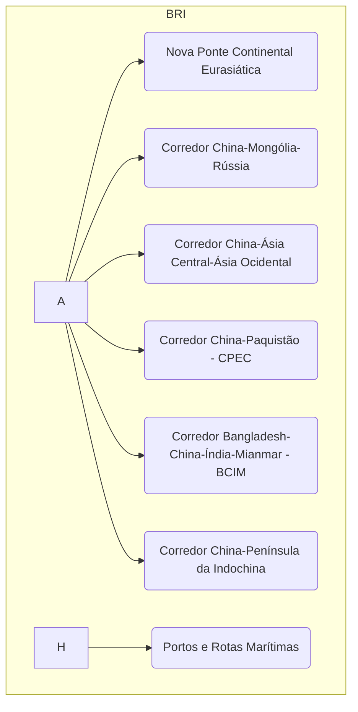

# A Política Externa da China no Século XXI: Da "Ascensão Pacífica" à Competição Estratégica Global

## I. Introdução: A Grande Estratégia de Rejuvenescimento Nacional

A política externa da República Popular da China no século XXI não pode ser compreendida como uma série de reações ad-hoc aos eventos internacionais, mas sim como a manifestação externa de um projeto coerente, de longo prazo e profundamente enraizado em sua história e em suas aspirações futuras: o "Grande Rejuvenescimento da Nação Chinesa" (中华民族伟大复兴, _Zhōnghuá Mínzú Wěidà Fùxīng_). Este conceito constitui a "Grande Estratégia" da China, especialmente sob a liderança de Xi Jinping, orientando suas ações desde a economia e a tecnologia até a diplomacia e a defesa.

A trajetória da política externa chinesa contemporânea é marcada por uma transição doutrinária fundamental. Sob a liderança de Deng Xiaoping, a China adotou a máxima de "esconder as capacidades e aguardar o momento" (韬光养晦, _tāo guāng yǎng huì_), uma estratégia de baixo perfil que permitiu ao país focar em seu desenvolvimento econômico interno, evitando confrontos e se integrando pacificamente ao sistema internacional. Essa abordagem, conhecida como "Ascensão Pacífica", caracterizou a política externa chinesa no final do século XX e início do século XXI.1

No entanto, a crise financeira global de 2008 representou um ponto de inflexão crucial. A percepção em Pequim foi a de um declínio relativo do Ocidente, liderado pelos Estados Unidos, e a abertura de uma "janela de oportunidade estratégica" para a China.1 Com a ascensão de Xi Jinping ao poder em 2012, a doutrina evoluiu para uma postura mais assertiva e proativa, resumida na expressão "lutar por conquistas" (奋发有为, _fèn fā yǒu wéi_). Essa nova fase é encapsulada pelo conceito do "Sonho Chinês" (中国梦, _Zhōngguó Mèng_), que não mais se contenta em apenas aguardar o momento, mas busca ativamente moldar o ambiente internacional para realizar o rejuvenescimento nacional.

A tese central desta análise é que a política externa da China no século XXI é a projeção de um projeto de reconstrução nacional multifacetado. Este projeto visa, em primeiro lugar, superar o legado traumático do "Século de Humilhação"; em segundo, garantir a segurança de seus recursos energéticos, matérias-primas e cadeias de suprimentos, que são a base de sua estabilidade econômica e social; e, em última instância, restaurar a China à sua percebida posição histórica de centralidade no sistema internacional, o que implica remodelar as normas e instituições da governança global para que reflitam seus interesses e valores.

## II. Os Pilares da Estratégia Chinesa: Determinantes Históricos e Econômicos

A grande estratégia chinesa assenta-se sobre dois pilares fundamentais e interconectados: um motor narrativo, forjado na história e na ideologia, e um motor material, impulsionado por imperativos geoeconômicos. Compreender a interação entre a memória do passado e as vulnerabilidades do presente é essencial para decifrar a lógica por trás da assertividade chinesa no cenário mundial.

### A. A Força da História e da Ideologia: O Motor Narrativo

A política externa de Pequim é profundamente informada por uma narrativa histórica que funciona como uma poderosa ferramenta de mobilização e legitimação política. No centro dessa narrativa estão o trauma do "Século de Humilhação" e a promessa do "Grande Rejuvenescimento Nacional".

O "Século de Humilhação" (百年国耻, _bǎinián guóchǐ_) refere-se ao período entre a Primeira Guerra do Ópio (1839-42) e a fundação da República Popular da China em 1949. Foi uma era marcada por derrotas militares para potências ocidentais e para o Japão, pela imposição de "tratados desiguais", pela perda de soberania sobre territórios como Hong Kong e pela fragmentação interna que levou ao colapso do sistema imperial. Para o Partido Comunista Chinês (PCC), essa não é apenas uma memória histórica, mas uma narrativa ativamente construída e mobilizada para fins políticos contemporâneos.

Essa narrativa serve a múltiplos propósitos estratégicos. Internamente, ela legitima o governo unipartidário do PCC, apresentando-o como a única força capaz de pôr fim à humilhação, restaurar a dignidade nacional e proteger a China de futuras agressões externas.9 Externamente, ela justifica uma política externa mais assertiva e o fortalecimento militar como medidas defensivas necessárias para garantir que a China "nunca mais será humilhada".3 A narrativa transforma a busca por poder da China, que poderia ser vista como revisionismo agressivo, em um ato de restauração e justiça histórica, buscando recuperar o "lugar de direito da China no mundo".

A contrapartida dessa memória traumática é o "Grande Rejuvenescimento da Nação Chinesa", o objetivo final que anima a estratégia de Xi Jinping. O "Sonho Chinês", popularizado por Xi, é a expressão máxima desse objetivo, definido como a construção de um país socialista moderno, próspero, forte e harmonioso.3 Este conceito foi formalmente inscrito na constituição do PCC e do Estado chinês em 2018, consagrando-o como a meta suprema da nação e o propósito unificador que orienta todas as políticas públicas.10 Questões como a reunificação com Taiwan são enquadradas dentro dessa lógica, sendo vistas não apenas como um objetivo geopolítico, mas como a etapa final e indispensável para curar as "cicatrizes" do século de humilhação e completar o projeto de rejuvenescimento nacional.7

Com a erosão da ideologia comunista tradicional como fonte de legitimidade, o nacionalismo, alimentado por essa narrativa histórica, preenche uma lacuna crucial para o PCC. Ele fornece uma justificativa poderosa para a centralização do poder e para ações assertivas no cenário internacional, enquadrando-as como passos necessários para a restauração da glória nacional.

### B. Os Imperativos Geoeconômicos: A Vulnerabilidade como Motor

Se a história fornece a justificativa ideológica, a economia fornece o imperativo material para a política externa assertiva da China. O modelo de desenvolvimento chinês, que transformou o país na "fábrica do mundo", gerou uma dependência crítica de recursos externos, criando uma vulnerabilidade estratégica fundamental que Pequim busca mitigar a todo custo.

A China é o maior consumidor mundial de recursos naturais.12 Apesar de suas vastas reservas domésticas, seu apetite industrial supera em muito sua capacidade de produção. Dados revelam a magnitude dessa dependência: a China importa aproximadamente 70% do petróleo que consome, 40% do gás natural, 80% de seu cobre e 94% de seu níquel.13 A segurança alimentar também é uma preocupação crescente, com a taxa de autossuficiência em alimentos caindo de 93,6% em 2006 para 65,8% em 2020.

Essa dependência cria uma vulnerabilidade geoestratégica aguda. A maior parte dessas importações vitais transita por rotas marítimas, especialmente através de pontos de estrangulamento (_choke points_) como o Estreito de Malaca, que são vulneráveis a interrupções e largamente policiados pela Marinha dos Estados Unidos e seus aliados.13 Para a liderança chinesa, a possibilidade de um bloqueio naval em um cenário de crise representa uma ameaça existencial, capaz de paralisar sua economia e gerar instabilidade interna, minando a própria base de legitimidade do PCC.

Em resposta, a China desenvolveu uma estratégia de segurança de recursos que é um dos principais motores de sua política externa. Essa estratégia se baseia na diversificação de fornecedores e de rotas de transporte.14 Isso se manifesta em investimentos diretos massivos em países ricos em recursos na África e na América Latina 15, bem como na busca agressiva por minerais críticos para a transição energética, como lítio e terras raras, onde a China busca dominar não apenas o refino, mas toda a cadeia de valor, desde a extração.17 Essa busca por segurança de recursos é parte integrante do que Pequim chama de "conceito holístico de segurança de estado", que coloca a segurança dos recursos naturais no mesmo patamar da segurança militar e política.

Nesse contexto, a assertividade externa da China pode ser vista não apenas como uma projeção de poder, mas como uma gigantesca estratégia de mitigação de risco. A Iniciativa Cinturão e Rota (BRI), por exemplo, com seus corredores terrestres que conectam a China à Ásia Central, Rússia e Paquistão, funciona como uma apólice de seguro geoestratégica. Cada ferrovia, oleoduto e porto construído sob a égide da BRI é uma tentativa de criar redundância logística e contornar os _choke points_ marítimos potencialmente controlados por potências rivais. A militarização de ilhas no Mar do Sul da China também serve a esse propósito, buscando garantir a segurança de suas linhas de comunicação marítimas mais vitais. A agressividade externa, portanto, é a outra face da moeda da insegurança interna.

## III. Os Instrumentos da Grande Estratégia: Da Conectividade à Governança Global

Para executar sua grande estratégia de rejuvenescimento nacional, a China desenvolveu um conjunto sofisticado de instrumentos de política externa. O mais proeminente é a Iniciativa Cinturão e Rota (BRI), o "hardware" geoeconômico projetado para remodelar a conectividade global. Mais recentemente, Pequim lançou um trio de "Iniciativas Globais" (GDI, GSI e GCI), que funcionam como o "software" normativo, de segurança e ideológico para a nova ordem que almeja construir.

### A. A Iniciativa Cinturão e Rota (BRI): A Espinha Dorsal Geoeconômica

Lançada por Xi Jinping em 2013, a Iniciativa Cinturão e Rota (一带一路, _Yīdài Yīlù_), também conhecida como Nova Rota da Seda, é o projeto de política externa mais ambicioso da China contemporânea. Trata-se de uma vasta rede de projetos de infraestrutura, comércio e investimento que se estende pela Ásia, Europa, África e América Latina, visando criar um novo mapa da economia global com a China em seu centro.20

Os objetivos da BRI são multifacetados e operam em diferentes níveis:

- **Objetivos Econômicos:** Em um nível imediato, a BRI serve para exportar o excesso de capacidade industrial da China em setores como aço e cimento, encontrar novos mercados para suas empresas de construção e tecnologia, e promover a internacionalização de sua moeda, o Renminbi (RMB), através de financiamentos e contratos.
    
- **Objetivos Geopolíticos:** A iniciativa visa criar uma esfera de influência econômica sino-cêntrica, aumentando a dependência de outros países em relação ao financiamento, tecnologia e mercados chineses. Ao fazê-lo, a China solidifica seu status de potência global e constrói uma rede de parceiros que podem oferecer apoio diplomático em fóruns internacionais.
    
- **Objetivos Geoestratégicos:** Como mencionado, a BRI é uma resposta direta à vulnerabilidade de recursos da China. A construção de corredores terrestres e o controle de portos estratégicos visam garantir a segurança de suas linhas de abastecimento e criar rotas comerciais alternativas que contornem pontos de estrangulamento marítimo controlados pelos EUA.
    

A iniciativa é estruturada em torno de um "cinturão" terrestre e uma "rota" marítima, que se desdobram em vários corredores econômicos.

Apesar de sua escala e ambição, a BRI enfrenta críticas e controvérsias significativas. A mais proeminente é a acusação de "diplomacia da armadilha da dívida" (_debt-trap diplomacy_). Críticos, especialmente os Estados Unidos e a Índia, argumentam que a China concede empréstimos para projetos de infraestrutura com termos insustentáveis a países vulneráveis. Quando esses países não conseguem pagar a dívida, Pequim supostamente exige concessões estratégicas, como o controle de longo prazo sobre portos (como o caso de Hambantota, no Sri Lanka) ou outros ativos nacionais.27 Embora Pequim negue veementemente essa prática, a falta de transparência em seus contratos de empréstimo alimenta a desconfiança. No entanto, alguns acadêmicos argumentam que essa narrativa é simplista, apontando que os problemas de dívida de muitos países são complexos e envolvem também má gestão local e dívidas com credores ocidentais.31 Outras críticas à BRI incluem os impactos ambientais e sociais negativos de muitos de seus megaprojetos, a falta de licitações abertas e a preferência por empresas e mão de obra chinesas, o que limita os benefícios para as economias locais.

### B. A Tríade de Xi Jinping para a Governança Global: GDI, GSI e GCI

Se a BRI constitui o "hardware" da nova ordem que a China almeja, um conjunto de três iniciativas globais lançadas por Xi Jinping desde 2021 representa o "software": a estrutura normativa, de segurança e ideológica. Juntas, a Iniciativa de Desenvolvimento Global (GDI), a Iniciativa de Segurança Global (GSI) e a Iniciativa de Civilização Global (GCI) marcam a transição da China de uma potência que aceita as regras do sistema (_rule-taker_) para uma que busca ativamente criá-las e moldá-las (_rule-maker_).

- **Iniciativa de Desenvolvimento Global (GDI - 2021):** Proposta na Assembleia Geral da ONU, a GDI visa realinhar a agenda de desenvolvimento global em torno das prioridades e da visão chinesa. Focada em áreas como redução da pobreza, segurança alimentar, industrialização verde e conectividade digital, a GDI busca acelerar a implementação da Agenda 2030 da ONU.33 Criticamente, a iniciativa promove um modelo de desenvolvimento liderado pelo Estado, que enfatiza o crescimento material e a estabilidade, em contraste com o modelo ocidental que frequentemente inclui condicionalidades ligadas à democracia e aos direitos humanos. A GDI é um veículo para a China se posicionar como líder do Sul Global, oferecendo um caminho de desenvolvimento alternativo e alinhando a cooperação internacional à sua própria experiência e interesses.
    
- **Iniciativa de Segurança Global (GSI - 2022):** Lançada em meio a crescentes tensões geopolíticas, a GSI é a proposta da China para uma nova arquitetura de segurança global. Ela se opõe explicitamente ao que Pequim chama de "mentalidade da Guerra Fria", "segurança de bloco" e "confronto", em uma crítica direta ao sistema de alianças militares liderado pelos EUA.37 A GSI se baseia em um conceito de segurança "comum, abrangente, cooperativa e sustentável" e reitera os princípios fundamentais da política externa chinesa: respeito à soberania, integridade territorial e não-interferência nos assuntos internos de outros países.39 Essa ênfase na soberania ressoa com muitos países do Sul Global e serve para proteger a China de críticas sobre suas próprias questões internas, como Taiwan, Xinjiang e Hong Kong.
    
- **Iniciativa de Civilização Global (GCI - 2023):** A GCI é a dimensão de _soft power_ da grande estratégia de Xi. Ela defende o respeito pela diversidade das civilizações e se opõe à imposição de valores ou modelos políticos de um país sobre os outros. A iniciativa é uma resposta direta ao que a China percebe como o universalismo dos valores ocidentais. Ao promover a ideia de "valores comuns da humanidade" (paz, desenvolvimento, equidade, justiça, democracia e liberdade) em vez de "valores universais" (que Pequim associa à democracia liberal e aos direitos humanos individuais), a China busca legitimar seu próprio sistema político e criar um arcabouço ideológico para um mundo multipolar onde diferentes modelos de governança podem coexistir sem uma hierarquia de valores.
    

A tabela a seguir sistematiza a função e o propósito de cada uma dessas iniciativas, destacando a complementaridade entre o "hardware" e o "software" da estratégia chinesa.

|Iniciativa|Tipo|Conceito Central|Objetivo Estratégico|Instrumentos|
|---|---|---|---|---|
|**BRI** (2013)|Geoeconômica (Hardware)|Conectividade física e digital|Criar uma esfera econômica sino-cêntrica; garantir segurança de recursos e rotas.|Corredores econômicos, portos, ferrovias, financiamento de infraestrutura.|
|**GDI** (2021)|Governança (Software)|Desenvolvimento liderado pelo Estado|Posicionar a China como líder do Sul Global; redefinir a agenda de desenvolvimento.|Cooperação Sul-Sul, projetos alinhados à Agenda 2030, Fundo de US$4 bi.|
|**GSI** (2022)|Segurança (Software)|Segurança indivisível e soberania|Desafiar o sistema de alianças dos EUA; criar uma arquitetura de segurança alternativa.|Defesa da não-interferência, diálogo, oposição a "sanções unilaterais".|
|**GCI** (2023)|Ideológica (Software)|Diversidade de civilizações|Legitimar o modelo chinês; combater o universalismo de valores ocidentais.|Diálogos intercivilizacionais, intercâmbios culturais, promoção de "valores comuns".|

Esta abordagem integrada demonstra como a estratégia chinesa opera simultaneamente nos campos material e ideacional. A BRI cria a dependência econômica e a conectividade física, enquanto a GDI, a GSI e a GCI fornecem a justificativa normativa e a estrutura ideológica para a nova ordem global que a China busca liderar.

## IV. A China na Arena Global: Relações com os Principais Atores

A projeção da grande estratégia chinesa reconfigura suas relações com todos os principais atores do sistema internacional. A dinâmica mais definidora é a competição estratégica com os Estados Unidos, mas as parcerias com a Rússia, as complexas relações com a União Europeia e a crescente influência na América Latina são igualmente cruciais para entender o papel da China no mundo.

### A. A Competição Estratégica com os Estados Unidos

A relação sino-americana é a mais consequente do século XXI, tendo evoluído de uma parceria econômica cautelosa para uma rivalidade abrangente que se desenrola em múltiplas dimensões.

- **Dimensão Tecnológica: A "Guerra dos Chips":** A competição transcendeu a guerra comercial tarifária da era Trump para se tornar uma batalha fundamental pelo domínio tecnológico.45 O epicentro dessa disputa são os semicondutores, ou chips, componentes essenciais para tecnologias críticas como inteligência artificial, 5G, computação quântica e sistemas militares avançados.46 Percebendo a tecnologia como um campo de batalha geopolítico, os Estados Unidos implementaram uma série de medidas, como o CHIPS and Science Act e rigorosos controles de exportação, com o objetivo de criar um "gargalo" tecnológico para frear o avanço militar e econômico da China.45 Essa estratégia transformou as cadeias de suprimentos de tecnologia em um domínio de segurança nacional, onde a eficiência econômica foi subordinada à resiliência e à contenção estratégica.
    
- **Dimensão Militar: Mar do Sul da China e Taiwan:** As tensões militares são mais agudas em dois pontos focais: o Mar do Sul da China e Taiwan. No Mar do Sul da China, Pequim reivindica soberania sobre quase toda a área, delimitada pela "Linha das Nove Raias", e tem construído e militarizado ilhas artificiais para reforçar suas reivindicações. Em resposta, os EUA e seus aliados conduzem regularmente operações de "liberdade de navegação" (FONOPs) para desafiar o que consideram reivindicações marítimas excessivas e ilegais.
    
    Taiwan, no entanto, permanece como o ponto de atrito mais perigoso e potencialmente explosivo. A China considera a ilha autogovernada uma "província rebelde" e um componente inalienável de seu território, não descartando o uso da força para alcançar a "reunificação". Os EUA, por sua vez, mantêm uma política de "ambiguidade estratégica", mas têm aprofundado seu apoio político e militar a Taipei, com vendas de armas e trânsitos de navios de guerra pelo Estreito de Taiwan, aumentando o risco de um erro de cálculo que poderia levar a um conflito direto entre as duas potências nucleares.
    

A disputa por Taiwan e a "guerra dos chips" estão intrinsecamente ligadas, elevando drasticamente os riscos. A principal vulnerabilidade tecnológica da China reside na sua incapacidade de produzir os semicondutores mais avançados, cuja fabricação está massivamente concentrada em Taiwan, especificamente na empresa Taiwan Semiconductor Manufacturing Company (TSMC).48 Para os Estados Unidos, a defesa da autonomia de Taiwan transcende, portanto, a defesa de uma democracia ou a contenção da expansão chinesa; tornou-se um imperativo de segurança tecnológica. Um controle chinês sobre Taiwan significaria o controle sobre a fonte mais importante de chips avançados do mundo, o que representaria um golpe devastador para a segurança econômica e militar de todo o Ocidente. Isso transforma a questão de Taiwan no ponto focal da competição pela liderança tecnológica global, tornando um eventual conflito na região um evento de consequências globais catastróficas.

### B. A "Parceria Sem Limites" com a Rússia

A relação sino-russa, formalizada como uma "parceria estratégica abrangente de coordenação para uma nova era" e popularmente descrita como uma amizade "sem limites", constitui um contraponto fundamental à ordem liderada pelos EUA. Declarada em uma declaração conjunta por Xi Jinping e Vladimir Putin em fevereiro de 2022, poucos dias antes da invasão russa da Ucrânia, essa parceria é baseada em uma oposição compartilhada à hegemonia americana e a um desejo comum de promover uma ordem mundial multipolar.

A guerra na Ucrânia aprofundou e, ao mesmo tempo, expôs a natureza assimétrica dessa aliança. Para a Rússia, isolada pelo Ocidente, a China tornou-se uma tábua de salvação econômica indispensável. Pequim emergiu como o principal comprador do petróleo e gás russos desviados da Europa e forneceu um sistema financeiro alternativo, centrado no yuan, que permite às entidades russas contornar as sanções ocidentais e o sistema SWIFT.

Para a China, a parceria também é altamente benéfica. A Rússia é uma fonte segura de energia a preços vantajosos, um parceiro diplomático crucial no Conselho de Segurança da ONU e, talvez o mais importante, um ator que absorve a atenção estratégica e os recursos militares dos Estados Unidos e da Europa. Ao manter o foco do Ocidente na segurança europeia, a Rússia alivia a pressão sobre a China no Indo-Pacífico, dando a Pequim mais espaço de manobra. Apesar da retórica de uma parceria "sem limites", a China tem agido com pragmatismo, evitando fornecer apoio militar letal direto a Moscou para não se expor a sanções secundárias do Ocidente, com o qual mantém laços econômicos muito mais profundos. Isso demonstra que, embora a parceria seja estratégica, ela é guiada pelos interesses nacionais chineses, que prevalecem sobre qualquer compromisso ideológico.

### C. Relações com a União Europeia: Parceiro, Competidor, Rival Sistêmico

A relação da União Europeia com a China é marcada por uma complexidade deliberada, oficialmente enquadrada em um marco tripartite: a China é, simultaneamente, um **parceiro** de cooperação em desafios globais, um **competidor** econômico e um **rival sistêmico** que promove modelos alternativos de governança.

Inicialmente, a dimensão da parceria, focada em áreas como mudanças climáticas e comércio, era predominante. No entanto, nos últimos anos, especialmente após a pandemia de COVID-19, a repressão em Hong Kong e a postura ambígua da China em relação à guerra na Ucrânia, os elementos de competição e rivalidade sistêmica ganharam um peso muito maior.63 A confiança erodiu, levando a UE a adotar uma nova doutrina de **"de-risking"** (redução de riscos). Esta política não busca um desacoplamento (_decoupling_) total da economia chinesa, mas sim uma redução calculada de dependências estratégicas em setores críticos, como matérias-primas, tecnologias verdes (baterias, painéis solares) e produtos farmacêuticos.

As tensões atuais são alimentadas por várias frentes. Economicamente, a UE está cada vez mais preocupada com seu enorme déficit comercial com a China, com a falta de acesso recíproco ao mercado chinês para empresas europeias e com a concorrência desleal de produtos chineses fortemente subsidiados pelo Estado, como veículos elétricos, que ameaçam a indústria europeia.66 Geopoliticamente, a UE desconfia da crescente influência chinesa em sua vizinhança (Bálcãs, Leste Europeu) através da BRI e está frustrada com o apoio tácito de Pequim à Rússia. Essa multifacetada relação pode ser melhor compreendida através de exemplos concretos:

|Dimensão|China como Parceiro de Cooperação|China como Competidor Econômico|China como Rival Sistêmico|
|---|---|---|---|
|**Comércio**|Grande mercado para produtos de luxo e agrícolas da UE.|Concorrência desleal de produtos subsidiados (EVs, aço); barreiras de acesso ao mercado chinês.66|Uso da coerção econômica contra Estados-membros (ex: Lituânia).|
|**Tecnologia**|Cooperação em pesquisa básica.|Disputa por padrões globais (5G, IA); "Guerra dos Chips".46|Ciberespionagem; exportação de tecnologias de vigilância.|
|**Governança Global**|Cooperação em pautas como mudanças climáticas (COP) e saúde (OMS).66|Competição por influência em organizações internacionais.69|Promoção de um modelo de governança alternativo (GDI, GSI) que desafia os valores da UE.70|
|**Geopolítica**|Diálogo sobre questões nucleares (Irã).|Projeção de poder através da BRI na vizinhança da UE (Bálcãs, Leste Europeu).|Apoio tácito à Rússia; contestação da ordem de segurança liderada pelos EUA/OTAN.64|

Essa tabela ilustra o difícil ato de equilíbrio que a UE deve realizar. Ela precisa cooperar com a China em questões globais existenciais, ao mesmo tempo que a combate em frentes econômicas e se defende de sua rivalidade sistêmica. A capacidade de manter a coesão interna entre os 27 Estados-membros, cada um com diferentes níveis de exposição e interesses em relação à China, é o maior desafio para a eficácia da política externa europeia.

### D. O Brasil e a América Latina: O Dilema da Dependência

Para a América Latina, e em particular para o Brasil, a ascensão da China representa a transformação geoeconômica mais significativa do século XXI. A China ultrapassou os Estados Unidos e a União Europeia para se tornar o principal parceiro comercial da maioria dos países da região. Essa relação é impulsionada pela insaciável demanda chinesa por commodities, como soja, minério de ferro, petróleo e cobre, que são abundantes na região.

As oportunidades são evidentes. A parceria com a China gerou superávits comerciais expressivos para muitos países sul-americanos, sustentou o crescimento econômico durante o "boom das commodities" e atraiu investimentos chineses em setores como energia e infraestrutura, muitas vezes no âmbito da BRI, oferecendo uma fonte de financiamento alternativa às instituições ocidentais.

Contudo, os desafios e riscos estruturais são igualmente profundos. A natureza da relação comercial – exportação de produtos primários da América Latina em troca de produtos manufaturados da China – aprofunda a dependência da região de um modelo extrativista, um fenômeno conhecido como "reprimarização" da pauta exportadora.76 Ao mesmo tempo, a inundação de produtos chineses baratos e competitivos nos mercados locais sufoca a indústria nacional, minando os esforços de diversificação econômica e desenvolvimento tecnológico.76 Além disso, a crescente presença econômica, política e até mesmo militar da China na região é vista com crescente preocupação pelos Estados Unidos, que consideram a América Latina sua esfera de influência tradicional, colocando os países da região no meio de uma disputa geopolítica crescente.

Para o Brasil, essa dinâmica representa um dilema estratégico fundamental. Historicamente, a política externa brasileira aspirava à liderança política e econômica na América do Sul, promovendo a integração regional e exportando produtos manufaturados para seus vizinhos. A China, com seu poderio econômico avassalador, estabeleceu relações bilaterais diretas e robustas com todos os países da região, efetivamente "contornando" o Brasil e diminuindo sua influência regional.78 Pior, a China compete diretamente com a indústria brasileira nos mercados sul-americanos. O Brasil se encontra, portanto, em uma encruzilhada: lucrar no curto prazo com a venda de commodities para a China significa, em muitos aspectos, aceitar um papel de fornecedor de matérias-primas na divisão internacional do trabalho e assistir à erosão de sua base industrial e de sua liderança regional. Gerenciar essa relação complexa – maximizando as oportunidades econômicas enquanto mitiga os riscos estratégicos de longo prazo – é, sem dúvida, a tarefa mais crucial e desafiadora para a diplomacia brasileira no século XXI.

## V. A China e a Ordem Multilateral: Reformando por Dentro e Criando por Fora

A estratégia da China para remodelar a governança global é dual. Por um lado, ela trabalha "por dentro" do sistema existente, especialmente nas Nações Unidas, para aumentar sua influência e moldar as normas a seu favor. Por outro, ela trabalha "por fora", criando instituições paralelas que oferecem uma alternativa à arquitetura de Bretton Woods, dominada pelo Ocidente. Essa abordagem de "revisionismo pragmático" não busca demolir a ordem atual, mas sim torná-la menos central e criar um ecossistema institucional mais favorável aos seus interesses.

### A. Atuação no Sistema ONU: Do Ativismo Seletivo à Influência Crescente

A postura da China no sistema ONU passou por uma transformação notável. Durante décadas, Pequim adotou uma abordagem de baixo perfil, marcada por abstenções frequentes no Conselho de Segurança (CSNU) e uma participação discreta em outras agências.81 No entanto, à medida que seu poder cresceu, sua postura evoluiu para um ativismo assertivo e seletivo.

No CSNU, a China agora utiliza seu poder de veto de forma muito mais robusta, frequentemente em coordenação com a Rússia, para bloquear resoluções que considera uma violação da soberania nacional ou uma forma de intervencionismo ocidental. Os vetos em resoluções sobre a Síria e a Venezuela são exemplos claros dessa nova postura.82 O pilar do discurso chinês na ONU é a defesa intransigente dos princípios da Carta da ONU de soberania, integridade territorial e, acima de tudo, não-interferência nos assuntos internos de outros Estados.84 Essa posição é estrategicamente vantajosa, pois protege a China de críticas internacionais sobre questões sensíveis como Xinjiang, Hong Kong e Taiwan, e ao mesmo tempo angaria apoio entre muitos países em desenvolvimento que compartilham uma desconfiança histórica do intervencionismo das grandes potências.

Além do CSNU, a China tem expandido metodicamente sua influência nas agências especializadas, fundos e programas da ONU. Pequim tornou-se um dos maiores contribuintes financeiros para o orçamento regular da ONU e para as operações de paz, e tem trabalhado para aumentar o número de cidadãos chineses em altos cargos de liderança em organizações como a Organização das Nações Unidas para a Alimentação e a Agricultura (FAO) e a Organização Internacional do Trabalho (OIT).69 Essa presença crescente na burocracia internacional permite à China influenciar a definição de normas técnicas, padrões globais e agendas políticas, alinhando-as gradualmente com seus interesses nacionais e sua visão de mundo.

### B. A Criação de uma Arquitetura Paralela: AIIB e NDB

A segunda vertente da estratégia multilateral da China é a criação de novas instituições financeiras que funcionam como uma alternativa à ordem de Bretton Woods. Essa iniciativa é uma resposta direta à frustração da China e de outros países emergentes com o ritmo lento das reformas de governança no Fundo Monetário Internacional (FMI) e no Banco Mundial, instituições que continuam a refletir a distribuição de poder do pós-Segunda Guerra Mundial, com domínio dos Estados Unidos e da Europa.

- **Banco Asiático de Investimento em Infraestrutura (AIIB):** Lançado oficialmente em 2016 e com sede em Pequim, o AIIB foi criado com a missão de financiar o vasto déficit de infraestrutura na Ásia e em outras regiões.90 O banco é visto como um complemento e, em muitos aspectos, um concorrente direto do Banco Mundial e do Banco Asiático de Desenvolvimento (controlado pelo Japão e pelos EUA). O sucesso diplomático da China em atrair importantes aliados dos EUA, como o Reino Unido, a Alemanha e a Austrália, como membros fundadores do AIIB, foi um marco que sinalizou a demanda global por mais fontes de financiamento para o desenvolvimento e a crescente influência de Pequim na governança econômica global.
    
- **Novo Banco de Desenvolvimento (NDB) do BRICS:** Criado na Cúpula de Fortaleza, no Brasil, em 2014, e com sede em Xangai, o NDB (também conhecido como "Banco do BRICS") tem o objetivo de mobilizar recursos para projetos de infraestrutura e desenvolvimento sustentável nos países do BRICS e em outras economias emergentes.93 Uma de suas características mais inovadoras e politicamente significativas é o mandato de aumentar a proporção de financiamento concedido em moedas locais dos países membros. Essa diretriz faz parte de um esforço mais amplo do BRICS para promover a "desdolarização" e reduzir a dependência do sistema financeiro global centrado no dólar americano, desafiando um dos pilares da hegemonia dos EUA.
    

Essa estratégia dual permite à China obter o melhor de dois mundos. Ela continua a se beneficiar da estabilidade e do acesso a mercados proporcionados pela ordem existente, enquanto trabalha para reformá-la por dentro. Ao mesmo tempo, a construção de uma arquitetura paralela (AIIB, NDB, mecanismos financeiros da BRI) oferece uma alternativa atraente, muitas vezes com menos condicionalidades políticas, para os países em desenvolvimento. Isso cria um sistema internacional cada vez mais competitivo e fragmentado, onde os países têm mais opções de financiamento e alinhamento, e onde a China se posiciona habilmente como um polo de poder indispensável.

## VI. Conclusão: O Futuro da Ordem Internacional e o Papel da China

A política externa da China no século XXI é a manifestação de uma Grande Estratégia de rejuvenescimento nacional, um projeto ambicioso, multifacetado e de longo prazo, impulsionado por uma poderosa narrativa de superação histórica e por agudas vulnerabilidades geoeconômicas. A transição da discrição da "Ascensão Pacífica" para a assertividade do "Sonho Chinês" não foi um desvio, mas uma evolução calculada, acelerada pela percepção de uma janela de oportunidade estratégica para remodelar a ordem internacional.

O revisionismo chinês é de natureza pragmática. A China não é uma potência revolucionária que busca a destruição completa do sistema internacional, do qual se beneficiou enormemente. Em vez disso, é uma potência reformista e construtora de alternativas. Ela utiliza os instrumentos da própria ordem liberal – comércio, investimento, participação em instituições multilaterais – para aumentar seu poder e influência, ao mesmo tempo que constrói uma arquitetura paralela (BRI, AIIB, NDB, GDI/GSI/GCI) que gradualmente desloca o centro de gravidade do poder global do Ocidente euro-atlântico para a Ásia.

As implicações para a ordem global são profundas. O mundo caminha para uma estrutura cada vez mais competitiva, marcada por uma rivalidade sistêmica entre os Estados Unidos e a China. Esta não é uma repetição da Guerra Fria, dada a profunda interdependência econômica entre os dois polos, mas uma competição que se desenrola em múltiplos domínios – tecnológico, econômico, militar e ideológico. O resultado provável não é uma vitória clara de um lado, mas uma ordem internacional mais fragmentada, com esferas de influência concorrentes e uma diversidade de modelos de governança disputando legitimidade.

Para o Brasil, este cenário apresenta o desafio diplomático mais complexo de sua história recente. A parceria econômica com a China é vital e oferece oportunidades inegáveis. No entanto, o padrão dessa relação ameaça os objetivos estratégicos de longo prazo do Brasil, como a reindustrialização, a diversificação econômica, a liderança regional e a autonomia estratégica. Navegar na crescente rivalidade sino-americana, evitando alinhamentos automáticos e maximizando o espaço de manobra, exigirá uma política externa sofisticada, pragmática e firmemente ancorada nos interesses nacionais. A capacidade de equilibrar a cooperação econômica com a China e a defesa dos próprios vetores de desenvolvimento determinará o lugar do Brasil na nova ordem internacional que está sendo forjada.

## VII. Questões para Autoavaliação (Active Recall)

1. Discorra sobre a transição da política externa chinesa da "Ascensão Pacífica" para o "Sonho Chinês", analisando como os determinantes históricos (o "Século de Humilhação") e econômicos (a dependência de recursos) informaram essa mudança e como ela se manifesta na Iniciativa Cinturão e Rota (BRI).
    
2. Analise criticamente a relação tridimensional da União Europeia com a China ("parceiro, competidor, rival sistêmico"). De que forma essa complexidade se reflete nas políticas de "de-risking" e na competição tecnológica, e quais as implicações para a coesão da própria UE?
    
3. Compare a estratégia multilateral da China no sistema ONU com sua iniciativa de criar novas instituições financeiras como o AIIB e o NDB. De que maneira essa abordagem dual serve à sua Grande Estratégia de se tornar uma potência central na governança global?