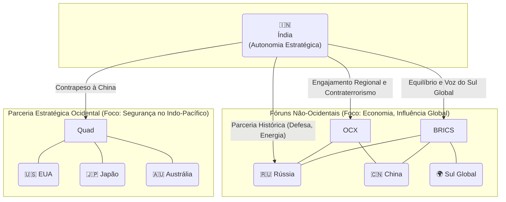

# A Política Externa Indiana: A Busca por "Autonomia Estratégica" em uma Ordem Mundial em Transformação

---

## 1. Introdução: A Índia em um Mundo Multipolar

A política externa da Índia contemporânea é definida por uma busca incessante pela maximização de seus interesses nacionais em um cenário global crescentemente fragmentado e competitivo. A ascensão da Índia como uma potência econômica e militar, com uma das economias de mais rápido crescimento do mundo e um arsenal nuclear robusto, coincide com uma reconfiguração da ordem mundial, que se afasta do unipolarismo pós-Guerra Fria para uma estrutura mais complexa, frequentemente descrita como multipolar ou "multi-conceitual". Nesse ambiente fluido, Nova Delhi busca forjar seu próprio caminho, evitando os constrangimentos de alianças formais que marcaram a era anterior.

Este relatório argumentará que o princípio reitor da grande estratégia indiana é a **"autonomia estratégica"**. Este conceito, embora herdeiro do histórico Movimento dos Não-Alinhados, evoluiu significativamente. Deixou de ser uma postura ideológica de equidistância para se tornar uma doutrina pragmática de **"multi-alinhamento"**. Esta abordagem permite que a Índia se engaje simultaneamente com múltiplos polos de poder, muitas vezes concorrentes — como os Estados Unidos e a Rússia, ou agrupamentos como o Quad e os BRICS — sem se prender a obrigações de aliança. O objetivo final é manter a máxima flexibilidade decisória, permitindo que a Índia atue como um "leading power" (potência líder) em vez de um mero "balancing power" (potência de equilíbrio), moldando os resultados globais em vez de apenas reagir a eles.

A análise se desdobrará em quatro partes centrais para desvendar essa complexa estratégia. Primeiramente, serão explorados os fundamentos conceituais e históricos da autonomia estratégica, traçando sua linhagem desde o não-alinhamento de Nehru até sua formulação atual. Em segundo lugar, serão analisados os vetores geopolíticos que moldam sua aplicação prática, com foco especial nas rivalidades estruturais com a China e o Paquistão. Em terceiro lugar, será demonstrada a manifestação prática do multi-alinhamento através de um exame detalhado da participação indiana em agrupamentos com orientações e membros divergentes. Finalmente, será abordada a projeção de poder da Índia no Oceano Índico, sua esfera prioritária de influência e o principal palco para sua doutrina de "provedor líquido de segurança".

## 2. Fundamentos da Autonomia Estratégica: Da Ideologia ao Pragmatismo

A grande estratégia da Índia hoje não pode ser compreendida sem uma análise de sua evolução conceitual. A transição do "não-alinhamento" para a "autonomia estratégica" não foi apenas uma mudança de terminologia, mas uma profunda adaptação filosófica e prática, impulsionada pelas lições duras da história e pelas realidades implacáveis da geopolítica contemporânea.

### 2.1. A Herança do Não-Alinhamento (MNA)

> [!note] O Movimento dos Não-Alinhados (MNA) foi a pedra angular da política externa indiana durante a Guerra Fria, refletindo o desejo de uma nação recém-independente de afirmar sua soberania em um mundo dividido em dois blocos de poder.

**Origens e Princípios:** O MNA, co-fundado e liderado pelo primeiro-ministro Jawaharlal Nehru, foi a resposta da Índia pós-colonial à bipolaridade da Guerra Fria. Seu objetivo central era manter uma distância estratégica dos blocos antagônicos liderados pelos Estados Unidos e pela União Soviética, preservando assim a soberania nacional e a independência na tomada de decisões em assuntos internacionais.1 A doutrina era fundamentada nos "Panchsheel", os Cinco Princípios de Coexistência Pacífica, que foram formalizados no acordo sino-indiano de 1954 e posteriormente adotados pelo MNA. Esses princípios incluíam o respeito mútuo pela integridade territorial e soberania, a não-agressão mútua, a não-interferência mútua nos assuntos internos, a igualdade e o benefício mútuo, e a coexistência pacífica.1 Para Nehru, o não-alinhamento não era passividade, mas uma política positiva e ativa para promover a paz e a cooperação entre as nações recém-descolonizadas da Ásia e da África.2

**Legado e Limitações:** O MNA tornou-se um componente central da identidade da Índia no cenário global, posicionando-a como uma líder moral das nações em desenvolvimento.3 No entanto, a eficácia e a viabilidade dessa postura puramente ideológica foram severamente questionadas após a guerra sino-indiana de 1962. A derrota humilhante da Índia revelou a vulnerabilidade de uma política externa que desvalorizava as alianças de segurança frente a ameaças militares concretas.1 Esse evento traumático demonstrou que a neutralidade ideológica não era garantia de segurança territorial, criando uma dissonância profunda na elite estratégica indiana que persiste até hoje. Com o fim da Guerra Fria e a desintegração da União Soviética — que havia se tornado um parceiro estratégico de fato da Índia, apesar do não-alinhamento professado —, a estrutura bipolar que dava sentido ao MNA desapareceu, tornando o conceito obsoleto em sua forma original.3

### 2.2. A Evolução para a "Autonomia Estratégica" e o "Multi-Alinhamento"

A necessidade de adaptar a política externa indiana a um mundo unipolar e, posteriormente, multipolar, deu origem a um novo paradigma. A "autonomia estratégica" emergiu como a sucessora pragmática do não-alinhamento, mantendo seu espírito de independência, mas descartando sua rigidez ideológica.

> [!definition] Autonomia Estratégica e Multi-Alinhamento
> 
> A autonomia estratégica é o princípio que guia a política externa da Índia no século XXI. Ela prioriza a autossuficiência e a independência decisória, buscando maximizar a liberdade de ação da Índia para perseguir seus interesses nacionais. Diferentemente do não-alinhamento, ela não rejeita parcerias, mas as abraça de forma flexível e baseada em questões (issue-based).3 O
> 
> **multi-alinhamento** é a manifestação prática dessa autonomia. É uma estratégia proativa de engajamento simultâneo com múltiplos polos de poder, permitindo que a Índia colabore com diferentes atores em diferentes áreas, sem se comprometer com alianças formais e excludentes. Como articulado pelo Ministro das Relações Exteriores, S. Jaishankar, é um tempo para a Índia "engajar a América, gerenciar a China, cultivar a Europa, reassegurar a Rússia, trazer o Japão para o jogo, atrair os vizinhos...".5

A transição do não-alinhamento para a autonomia estratégica não foi um evento singular, mas um processo evolutivo moldado por mudanças geopolíticas cruciais. Analistas identificam três iterações distintas dessa doutrina, cada uma respondendo a um ambiente internacional diferente 4:

1. **Primeira Iteração (Pós-Guerra Fria e Unipolaridade):** Com o colapso da União Soviética, a Índia perdeu seu principal patrono de grande potência e se viu em um mundo inequivocamente unipolar, dominado pelos EUA. A agenda internacional americana, percebida como expansionista e intrusiva, gerou desconfiança em Nova Delhi. A resposta indiana foi uma política de _hedging_ (proteção): engajar-se com os EUA para colher os benefícios, mas ao mesmo tempo construir parcerias com outras potências, como a Rússia e a China, para criar um contrapeso e preservar o espaço de manobra.4
    
2. **Segunda Iteração (Ascensão da China):** À medida que a China ascendia economicamente e militarmente, mas antes de sua postura se tornar abertamente expansionista, a Índia buscou uma recalibração. A política de autonomia estratégica visava manter uma certa equidistância entre Washington e Pequim. O objetivo era evitar um dilema de segurança, assuagiar os temores chineses de um cerco liderado pelos EUA e criar espaço para uma acomodação política entre as duas gigantes asiáticas. Esse período viu uma desaceleração no ritmo da parceria Índia-EUA.4
    
3. **Terceira Iteração (Expansionismo Chinês e Multi-Alinhamento):** A postura cada vez mais assertiva e beligerante da China, especialmente sob Xi Jinping — marcada por confrontos na fronteira, a construção da Iniciativa Cinturão e Rota (BRI) e a militarização do Mar do Sul da China —, alterou fundamentalmente o cálculo estratégico da Índia. A China passou a ser vista como o desafio predominante e existencial à segurança e aos interesses indianos. Em resposta, a autonomia estratégica evoluiu para sua forma atual de multi-alinhamento. O objetivo agora não é mais a equidistância, mas a construção ativa de uma ampla coalizão de potências com interesses semelhantes (principalmente as democracias marítimas do Quad) para contrabalançar o poder e a influência chinesa no Indo-Pacífico.4
    

Essa evolução demonstra que a autonomia estratégica não é uma doutrina estática. É uma síntese dialética que combina o desejo histórico de independência do não-alinhamento com a prática pragmática de parcerias flexíveis, impulsionada pela necessidade imperativa de gerenciar a ameaça chinesa. É o pragmatismo superando a ideologia como força motriz da grande estratégia indiana.

## 3. Os Vetores Geopolíticos: A Vizinhança Complexa e Conflituosa

A aplicação da autonomia estratégica pela Índia é moldada, acima de tudo, pelas realidades de sua vizinhança imediata. Duas rivalidades históricas e estruturais — com a China e com o Paquistão — funcionam como os principais vetores que definem as prioridades de segurança de Nova Delhi e impulsionam sua diplomacia de multi-alinhamento.

### 3.1. A Rivalidade Estrutural com a China

A relação sino-indiana é, sem dúvida, o desafio de política externa mais complexo e consequente para a Índia. É uma relação marcada por uma competição multifacetada que abrange disputas territoriais, rivalidade econômica e uma luta por influência regional e global.

**Disputas Fronteiriças:** A fronteira não demarcada de aproximadamente 3.488 km, conhecida como a Linha de Controle Real (LAC), é uma fonte perene de tensão e desconfiança. As principais áreas de disputa são a região de Aksai Chin, no setor ocidental, que é administrada pela China mas reivindicada pela Índia como parte de Ladakh, e o estado de Arunachal Pradesh, no setor oriental, que é administrado pela Índia mas reivindicado pela China, que rejeita a validade da Linha McMahon de 1914.6 Essa disputa latente irrompeu em uma guerra em grande escala em 1962 e levou a confrontos militares significativos em Nathu La e Cho La (1967), no vale de Sumdorong Chu (1987), no platô de Doklam (2017) e, mais recentemente, a um confronto mortal no Vale de Galwan em 2020, o primeiro com fatalidades em décadas.6 Esses incidentes demonstram a volatilidade da fronteira e a possibilidade sempre presente de uma escalada militar.

**A Resposta à Iniciativa Cinturão e Rota (BRI):** A Índia é uma das poucas grandes potências a se opor aberta e consistentemente à BRI, a ambiciosa iniciativa de infraestrutura global da China. As objeções de Nova Delhi são profundas e multifacetadas:

- **Violação da Soberania:** A principal e mais inflexível objeção da Índia é que o Corredor Econômico China-Paquistão (CPEC), um dos projetos-âncora da BRI, atravessa a Caxemira administrada pelo Paquistão (Gilgit-Baltistan), um território que a Índia reivindica como seu. Para a Índia, endossar a BRI seria legitimar a ocupação paquistanesa e comprometer sua reivindicação soberana.8
    
- **Preocupações Estratégicas e "Armadilha da Dívida":** Nova Delhi vê a BRI não como um projeto puramente econômico, mas como um instrumento para a projeção de poder e hegemonia chinesa. Há um temor profundo de que a China use a "diplomacia da armadilha da dívida" para obter controle sobre ativos estratégicos em países vizinhos, criando um cerco estratégico em torno da Índia. O exemplo mais citado é o porto de Hambantota, no Sri Lanka, que foi arrendado à China por 99 anos após o governo cingalês não conseguir pagar os empréstimos chineses.7
    
- **Falta de Transparência e Normas Internacionais:** A Índia critica a BRI por sua falta de transparência, pela ausência de um processo consultivo com todos os stakeholders e por não aderir a normas internacionais de governança, sustentabilidade financeira e proteção ambiental.8
    

**Contramedidas Indianas:** A resposta da Índia à BRI não é apenas passiva (boicote ao Fórum da BRI), mas cada vez mais proativa. Nova Delhi busca oferecer alternativas de conectividade para seus vizinhos, muitas vezes em colaboração com parceiros. Iniciativas como o desenvolvimento do porto de Chabahar no Irã (que fornece uma rota alternativa para o Afeganistão e a Ásia Central, contornando o Paquistão), o Corredor de Crescimento Ásia-África (AAGC) em parceria com o Japão, e o fortalecimento de plataformas regionais como a BIMSTEC (Iniciativa da Baía de Bengala para Cooperação Técnica e Econômica Multi-Setorial), que deliberadamente exclui a China, são exemplos dessa estratégia de contrapeso.8

### 3.2. A Relação com o Paquistão: Dissuasão Nuclear e Instabilidade Crônica

A rivalidade com o Paquistão é mais antiga e visceral, enraizada na partição sangrenta de 1947. Embora a ameaça chinesa seja estrategicamente maior a longo prazo, o conflito com o Paquistão é mais volátil e imediato.

**O Conflito da Caxemira:** A disputa pela soberania da região da Caxemira é o cerne da inimizade indo-paquistanesa, tendo sido a causa de três das quatro guerras entre os dois países.12 A situação na Linha de Controle (LoC) que divide a Caxemira é caracterizada por um conflito de baixa intensidade, marcado por violações de cessar-fogo e, crucialmente, por acusações indianas de que o Paquistão arma, treina e apoia grupos terroristas que realizam ataques em território indiano.14

**A Dimensão Nuclear:** A dinâmica do conflito foi irrevogavelmente alterada em 1998, quando ambos os países realizaram testes nucleares e se declararam potências nucleares. A nuclearização do subcontinente elevou drasticamente os riscos de qualquer escalada militar, transformando uma disputa regional em uma potencial crise de segurança global.13 A gestão dessa dissuasão nuclear instável é uma preocupação central para ambos os países e para a comunidade internacional.

> [!important] A rivalidade sino-paquistanesa não constitui dois problemas separados para a Índia, mas sim um **desafio estratégico unificado de "duas frentes"**. A parceria "para todos os climas" entre Pequim e Islamabad, que inclui cooperação militar, diplomática e econômica, cria um dilema de segurança permanente para Nova Delhi. O CPEC é a manifestação física dessa aliança, solidificando a presença chinesa em território disputado pela Índia e concedendo à China acesso estratégico ao Oceano Índico através do porto de Gwadar.7 Isso força a Índia a dividir seus recursos e atenção estratégica entre sua fronteira ocidental (com o Paquistão) e sua fronteira norte/leste (com a China), justificando em grande parte sua aproximação com parceiros ocidentais como os do Quad.

A instabilidade da dissuasão nuclear na Ásia do Sul deriva de uma assimetria fundamental nas doutrinas e posturas dos dois países.

|Característica|**Índia**|**Paquistão**|**Implicação Estratégica**|
|---|---|---|---|
|**Arsenal Estimado (2025)**|~180 ogivas 12|~170 ogivas 12|Paridade numérica aproximada, mas com expansão e modernização contínuas do arsenal paquistanês.12|
|**Doutrina Declarada**|_No First Use_ (NFU) - "Não Uso Primeiro" (com a ressalva de que a política está sob revisão desde 2019).12|_First Use_ - Ausência de uma política de NFU; reserva-se o direito de usar armas nucleares primeiro para dissuadir um ataque convencional em larga escala.12|Assimetria doutrinária fundamental. O Paquistão utiliza a ameaça nuclear para compensar sua inferioridade percebida em forças convencionais em relação à Índia.16|
|**Foco do Arsenal**|Dissuasão estratégica contra a China e o Paquistão; busca por uma tríade nuclear crível (terra, ar e mar) para garantir a capacidade de retaliação.13|Armas Nucleares Táticas (TNWs) de baixo rendimento, projetadas para uso no campo de batalha contra forças convencionais invasoras.12|O foco do Paquistão em TNWs rebaixa significativamente o limiar nuclear, aumentando o risco de uma escalada rápida de um conflito convencional para um nuclear.16|
|**Postura Geral**|Dissuasão Mínima Credível.|Dissuasão de Espectro Completo.|A doutrina paquistanesa cria um perigoso "guarda-chuva nuclear" que pode encorajar conflitos de baixa intensidade, operando sob a premissa de que a resposta indiana será contida.|

Essa dinâmica assimétrica dá origem ao **"paradoxo da estabilidade-instabilidade"**. A posse de armas nucleares por ambos os lados cria uma forma de estabilidade no nível estratégico, tornando um conflito total improvável devido ao medo da destruição mútua assegurada.16 Paradoxalmente, essa mesma estabilidade no topo incentiva a instabilidade em níveis inferiores. O Paquistão, sentindo-se protegido por seu guarda-chuva nuclear, pode se sentir mais propenso a usar atores não-estatais e conduzir uma guerra assimétrica, calculando que a resposta da Índia será limitada pelo medo de uma escalada nuclear.14 Por sua vez, a Índia busca formas de retaliar a essas provocações sem cruzar o limiar nuclear, o que levou a ações como os "ataques cirúrgicos" de 2016 e os ataques aéreos de 2019 em Balakot.14 Isso cria um ciclo perigoso de ação e reação que torna a região cronicamente instável, apesar da dissuasão estratégica.

## 4. O "Multi-Alinhamento" na Prática: A Gestão de Parcerias Divergentes

O multi-alinhamento é a expressão mais visível da autonomia estratégica da Índia. Ele se manifesta na participação simultânea e ativa em agrupamentos com composições, ideologias e objetivos geopolíticos distintos, e por vezes, conflitantes. Esta seção analisa como a Índia navega em suas parcerias com o Ocidente, sua relação histórica com a Rússia e seu papel em fóruns não-ocidentais, usando cada plataforma para maximizar seus interesses de maneira pragmática.

Snippet de código

### 4.1. A Parceria Estratégica com o Ocidente: O Quad como Contrapeso

A aproximação da Índia com as democracias ocidentais, especialmente através do Diálogo de Segurança Quadrilateral (Quad), representa a mudança mais dramática em relação à sua política tradicional de não-alinhamento.

**Papel e Objetivos:** O Quad é um agrupamento estratégico informal que reúne a Índia, os Estados Unidos, o Japão e a Austrália. Embora seus membros insistam que não é uma aliança militar, seu objetivo implícito e principal é criar um contrapeso à crescente assertividade militar e econômica da China na região do Indo-Pacífico.17 A cooperação dentro do Quad vai além da segurança tradicional, abrangendo áreas como a segurança marítima, a resiliência das cadeias de suprimentos, o desenvolvimento de tecnologias críticas e emergentes (como 5G e inteligência artificial), a colaboração em saúde global (como a iniciativa de vacinas) e o financiamento de infraestrutura.5 Para a Índia, o Quad é uma plataforma crucial para acessar tecnologia, capital e apoio diplomático e de segurança para gerenciar o desafio chinês.19

**O Dilema Indiano:** A participação no Quad coloca a Índia em um delicado ato de equilíbrio. Por um lado, a crescente ameaça da China tornou a parceria com os EUA e seus aliados uma necessidade estratégica. A Índia tornou-se muito mais disposta a participar de iniciativas que poderiam ser vistas como provocativas por Pequim, especialmente após os confrontos na fronteira em 2020.17 Por outro lado, a Índia resiste veementemente a qualquer tentativa de formalizar o Quad como uma aliança militar ao estilo da OTAN. Tal movimento violaria o princípio central da autonomia estratégica, que evita alianças que restrinjam a liberdade de ação de Nova Delhi.17 A Índia é o único membro do Quad que não possui um tratado de aliança militar formal com os Estados Unidos, um fato que sublinha sua insistência em manter sua independência estratégica.17

### 4.2. A Relação Tradicional com a Rússia: Pragmatismo e Interesses Nacionais

Enquanto aprofunda seus laços com o Ocidente, a Índia simultaneamente cultiva sua parceria histórica com a Rússia, um legado da Guerra Fria que perdura por razões eminentemente pragmáticas.

**Laços Históricos e Dependência de Defesa:** A relação com a Rússia é descrita por diplomatas indianos como "entre as mais estáveis das principais relações do mundo".20 Essa estabilidade é ancorada em uma profunda dependência militar. A Rússia continua a ser o maior fornecedor de equipamentos de defesa para a Índia, com mais de 50% do inventário militar indiano em serviço sendo de origem russa ou soviética.21 Isso inclui plataformas críticas como os caças Su-30MKI, os tanques T-90 e o sistema de defesa aérea S-400.21 Além da defesa, a cooperação se estende à energia nuclear civil e ao espaço.22

**Navegando a Crise da Ucrânia:** A invasão da Ucrânia pela Rússia em 2022 colocou a política de multi-alinhamento da Índia sob intensa pressão internacional. No entanto, Nova Delhi adotou uma postura de neutralidade calculada, abstendo-se repetidamente de condenar a Rússia em votações na ONU e pedindo diálogo e diplomacia.23 Essa posição, embora criticada pelo Ocidente, é um exemplo clássico de autonomia estratégica em ação. Ela foi motivada por dois interesses nacionais primordiais: primeiro, a necessidade de não alienar seu principal fornecedor de armas e peças de reposição; e segundo, a oportunidade econômica de comprar petróleo bruto russo com grandes descontos, o que ajudou a mitigar a inflação doméstica e impulsionou o comércio bilateral a níveis recordes.21 A Índia defendeu sua posição argumentando que seus interesses nacionais e sua política externa são guiados pela autonomia, não por pressões externas.24

### 4.3. A Liderança no Sul Global: BRICS, OCX e G-20

A participação da Índia em fóruns predominantemente não-ocidentais como BRICS (Brasil, Rússia, Índia, China, África do Sul e novos membros) e a Organização para Cooperação de Xangai (OCX) é fundamental para sua estratégia de equilíbrio e projeção de influência.

**Objetivos Múltiplos:** O engajamento da Índia nesses grupos serve a vários propósitos estratégicos:

1. **Plataforma para uma Ordem Multipolar:** A Índia vê o BRICS, em particular, como um fórum para promover uma ordem global e econômica mais multipolar e para reformar as instituições de governança global (como o FMI e o Banco Mundial) que são dominadas pelo Ocidente. O Novo Banco de Desenvolvimento (NDB) do BRICS é um exemplo concreto dessa ambição.17
    
2. **Voz do Sul Global:** Esses fóruns fornecem à Índia uma plataforma vital para se posicionar como uma líder e porta-voz dos interesses do Sul Global. Ao sediar a cúpula do G-20 em 2023, a Índia defendeu com sucesso a inclusão da União Africana como membro permanente, reforçando suas credenciais como uma ponte entre o mundo desenvolvido e o em desenvolvimento.19
    
3. **Gerenciamento da Influência Chinesa:** Uma razão crucial para a participação ativa da Índia é garantir que esses fóruns não sejam completamente dominados por sua rival, a China, e usados contra os interesses indianos.19 A presença da Índia ajuda a moderar as tendências anti-ocidentais, conferindo a esses grupos uma imagem mais "não-ocidental" do que "anti-ocidental" e impedindo que a China monopolize a liderança do Sul Global.25
    

A tabela a seguir sintetiza como a Índia utiliza essas diferentes plataformas para alcançar objetivos distintos, ilustrando a lógica do multi-alinhamento.

|Agrupamento|Objetivo Primário da Índia|Principal Foco Temático|Como Serve à Autonomia Estratégica|
|---|---|---|---|
|**Quad**|Contrabalançar a assertividade da China; aprofundar a parceria com democracias marítimas.18|Segurança (Marítima, Cibernética), Tecnologia, Conectividade.|Fornece um contrapeso de segurança e capacidades tecnológicas que a Índia não pode gerar sozinha, aumentando sua capacidade de dissuadir a China.|
|**BRICS**|Promover uma ordem econômica multipolar; liderar o Sul Global; impedir o domínio chinês no grupo.17|Economia, Finanças (NDB), Desenvolvimento, Reforma da Governança Global.|Fornece uma plataforma para projetar influência global e equilibrar a parceria com o Ocidente, evitando dependência excessiva de qualquer um dos blocos.|
|**OCX (SCO)**|Engajamento com a Ásia Central; cooperação em contraterrorismo; manter um canal de diálogo com China e Rússia.18|Segurança Regional, Contraterrorismo, Conectividade.|Permite à Índia manter um pé na geopolítica da Eurásia e cooperar em áreas de interesse mútuo (como o Afeganistão), mesmo com adversários.|

No entanto, o multi-alinhamento não é uma política de neutralidade passiva, mas um ato de equilíbrio ativo e cada vez mais difícil. A crescente polarização global, impulsionada pela rivalidade EUA-China e pela aliança "sem limites" entre Rússia e China, está tornando as contradições inerentes a essa política mais agudas.26 A Índia é cada vez mais forçada a fazer escolhas difíceis. Incidentes como a recusa da Índia em assinar declarações conjuntas da OCX que não condenavam o terrorismo da maneira que desejava, ou seu distanciamento de narrativas de "desdolarização" dentro do BRICS, mostram que seus interesses frequentemente divergem dos de seus parceiros "não-ocidentais".17 O sucesso futuro do multi-alinhamento dependerá da habilidade diplomática da Índia em gerenciar essas contradições crescentes.

## 5. O Oceano Índico: A Esfera de Projeção Prioritária

Para a Índia, o Oceano Índico não é apenas uma via navegável; é sua esfera de influência natural e a arena prioritária para a projeção de seu poder e liderança. A política indiana para a região evoluiu de uma postura defensiva para uma estratégia proativa, encapsulada na doutrina de ser o "provedor líquido de segurança" da região, operacionalizada através da visão SAGAR.

### 5.1. A Doutrina do "Provedor Líquido de Segurança" (Net Security Provider)

> [!definition] Provedor Líquido de Segurança (Net Security Provider)
> 
> Este conceito define o papel que a Índia aspira desempenhar na Região do Oceano Índico (IOR). Significa que a Índia, como a principal potência residente, assume a responsabilidade de contribuir para a estabilidade e segurança geral da região mais do que consome dela.28 Não se trata de uma busca por hegemonia militar, mas de fornecer "bens públicos" essenciais, como segurança contra pirataria e terrorismo, liberdade de navegação, assistência humanitária e resposta a desastres (HADR), e capacitação de nações parceiras menores.29

A adoção dessa doutrina é uma resposta direta e estratégica à crescente presença naval, econômica e diplomática da China na IOR. A China, através de sua "Rota da Seda Marítima" (parte da BRI) e do desenvolvimento de portos e instalações em países como Paquistão (Gwadar), Sri Lanka (Hambantota) e Mianmar, tem desafiado o que a Índia considera sua esfera de influência tradicional.31 A doutrina do "provedor líquido de segurança" é, portanto, uma tentativa de reafirmar a primazia da Índia na região, oferecendo aos estados litorâneos menores uma parceria de segurança confiável e baseada em regras, como alternativa à dependência da China.32

### 5.2. A Visão SAGAR (Security and Growth for All in the Region)

Lançada pelo Primeiro-Ministro Narendra Modi em 2015, a visão SAGAR é a estrutura política e diplomática que operacionaliza a doutrina do "provedor líquido de segurança". O nome é um acrônimo, mas também significa "oceano" em hindi, sublinhando seu foco geográfico.34

**Pilares e Iniciativas:** SAGAR é uma visão holística que integra segurança com desenvolvimento. Seus pilares incluem 32:

- **Cooperação em Segurança:** Fortalecer a capacidade dos países da região para garantir a segurança de suas costas e zonas econômicas exclusivas.
    
- **Capacitação e Integração Econômica:** Ajudar os países parceiros a desenvolver suas capacidades e promover o uso sustentável dos recursos marinhos (a "economia azul").
    
- **Desenvolvimento Sustentável:** Trabalhar em conjunto para proteger o ambiente marinho.
    
- **Conectividade:** Melhorar a conectividade de infraestrutura entre os países da região.
    
- **Ação Coletiva:** Promover uma abordagem cooperativa para lidar com ameaças não tradicionais como pirataria, terrorismo e desastres naturais.
    

**Ações Concretas:** A visão SAGAR foi traduzida em ações tangíveis. A Índia implementou uma rede de radares de vigilância costeira em países como Maldivas, Seychelles e Maurício para criar uma consciência de domínio marítimo compartilhado. Forneceu navios de patrulha, interceptores e aeronaves de vigilância a esses países para aumentar suas capacidades.36 A Marinha Indiana realiza patrulhas coordenadas, exercícios navais conjuntos (como o exercício MILAN) e é frequentemente a "primeira a responder" em crises humanitárias na região, como visto nas missões de ajuda durante a pandemia de COVID-19 (Missão Sagar), no auxílio ao ciclone em Moçambique e Madagascar, e no apoio à contenção do derramamento de óleo nas Maurícias.33

**Evolução para MAHASAGAR:** Em 2025, a Índia expandiu essa visão para MAHASAGAR (Mutual and Holistic Advancement for Security and Growth Across Regions). Esta nova formulação amplia o escopo geográfico e conceitual de SAGAR, englobando não apenas a IOR imediata, mas o Sul Global de forma mais ampla, e reforçando a ambição da Índia de ser uma líder em questões de segurança e desenvolvimento em uma escala maior.31

A política da Índia para o Oceano Índico (SAGAR) e sua política para o Indo-Pacífico mais amplo (participação no Quad) não devem ser vistas isoladamente. Elas são, na verdade, duas faces da mesma moeda estratégica, ambas fundamentalmente projetadas para gerenciar e conter a ascensão da China. A política SAGAR funciona como uma estratégia _defensiva e construtiva_, focada em fortalecer os laços com os vizinhos menores e mais vulneráveis da IOR, consolidando a posição da Índia em seu "núcleo" geográfico e oferecendo uma alternativa à influência chinesa.32 Em contraste, a participação no Quad é uma estratégia mais _assertiva e de contrapeso_, que projeta poder para além da IOR, em colaboração com grandes potências, para moldar o ambiente de segurança na "periferia estendida" de todo o Indo-Pacífico.18 Juntas, elas formam uma resposta coordenada e em camadas à principal preocupação estratégica da Índia.

## 6. Conclusão Analítica: Os Desafios e o Futuro da Grande Estratégia Indiana

A política externa da Índia, meticulosamente guiada pelo princípio da autonomia estratégica e executada através da prática do multi-alinhamento, representa um sofisticado e complexo ato de equilíbrio. É uma estratégia projetada para uma ordem mundial em transição, permitindo que Nova Delhi mantenha uma flexibilidade crucial, evite os constrangimentos de alianças formais e persiga seus interesses nacionais de forma eminentemente pragmática. Ao se engajar com todos os principais polos de poder, a Índia busca não apenas reagir aos eventos globais, mas moldá-los ativamente, afirmando seu lugar como uma das potências líderes do século XXI.

No entanto, essa grande estratégia enfrenta desafios significativos e crescentes que testarão sua resiliência no futuro.

- **A Pinça Sino-Russa:** O desafio mais premente é a crescente profundidade da parceria estratégica "sem limites" entre a China, a principal rival da Índia, e a Rússia, seu parceiro de defesa tradicional. À medida que Moscou se torna cada vez mais dependente de Pequim econômica e diplomaticamente, os interesses russos podem se alinhar mais estreitamente com os chineses, inclusive na Ásia do Sul. Isso poderia erodir a disposição ou a capacidade da Rússia de atuar como um contrapeso à China ou de fornecer à Índia tecnologia de defesa de ponta, forçando Nova Delhi a fazer escolhas difíceis que preferiria evitar e, potencialmente, tornando o ato de equilíbrio do multi-alinhamento insustentável em sua forma atual.26
    
- **Volatilidade dos Parceiros:** A crescente dependência da Índia de parcerias com democracias ocidentais, especialmente os Estados Unidos, para contrabalançar a China, a expõe à volatilidade de seus processos políticos internos e prioridades de política externa. Uma mudança de administração em Washington, por exemplo, poderia levar a uma reavaliação do compromisso americano com o Quad ou com a estratégia do Indo-Pacífico, deixando a Índia em uma posição vulnerável.18 A autonomia estratégica busca mitigar essa dependência, mas não pode eliminá-la completamente.
    
- **Limitações de Capacidade:** As ambições da Índia de ser uma potência líder global e a provedora líquida de segurança em sua região ainda são, em parte, limitadas por suas próprias capacidades econômicas e militares. Embora crescentes, essas capacidades ainda não se comparam às da China ou dos Estados Unidos.38 A entrega de projetos de infraestrutura regionais tem sido historicamente mais lenta que a da China, e a modernização militar é um processo contínuo e caro. A iniciativa "Aatmanirbhar Bharat" (Índia Autossuficiente) é uma resposta direta a essa vulnerabilidade, buscando fortalecer a base industrial e tecnológica doméstica para reduzir dependências externas críticas.5
    

**Prognóstico:** Diante de um cenário global incerto e cada vez mais polarizado, a Índia provavelmente continuará a seguir o caminho do multi-alinhamento, pois é a estratégia que melhor preserva sua flexibilidade e serve aos seus interesses multifacetados. No entanto, a crescente pressão das contradições geopolíticas, especialmente o nexo China-Rússia, exigirá uma diplomacia ainda mais ágil e sofisticada. É provável que, embora mantenha canais abertos com todos, a Índia se incline pragmaticamente mais em direção a parceiros, como os do Quad, que compartilham de forma mais explícita sua principal preocupação estratégica: a necessidade de garantir um Indo-Pacífico livre, aberto e baseado em regras, em face da ascensão de uma China revisionista. A jornada da Índia para se tornar uma potência líder dependerá de sua capacidade de gerenciar essas complexas dinâmicas externas enquanto fortalece suas capacidades internas.

---

## 7. Questões para Autoavaliação (Active Recall)

> [!question] Questão 1
> 
> Analise criticamente o conceito de "multi-alinhamento" da Índia. De que forma a participação indiana simultânea no Quad e nos BRICS representa tanto a força quanto a principal vulnerabilidade de sua busca por "autonomia estratégica" na atual ordem global?

> [!question] Questão 2
> 
> Discuta como a rivalidade com a China funciona como o principal vetor organizador da política externa indiana contemporânea, influenciando (a) sua política para o Oceano Índico (doutrina SAGAR) e (b) sua relação com o Paquistão (a ameaça de "duas frentes").

> [!question] Questão 3
> 
> Explique o "paradoxo da estabilidade-instabilidade" no contexto da rivalidade nuclear entre Índia e Paquistão. Como a assimetria entre a doutrina de "Não Uso Primeiro" (NFU) da Índia e a dependência do Paquistão em armas nucleares táticas (TNWs) molda a dinâmica dos conflitos na região da Caxemira?