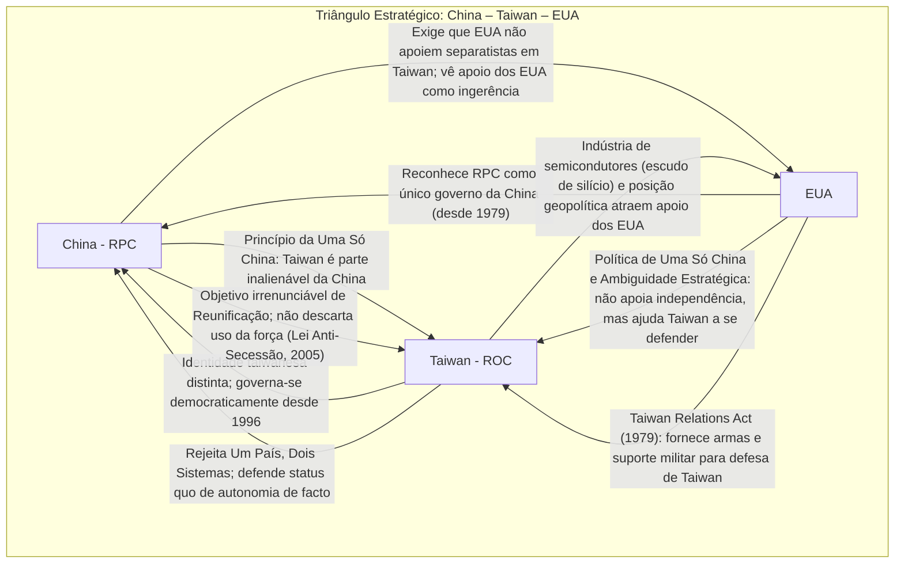

# As Tensões no Estreito de Taiwan: Geopolítica, Direito Internacional e o Confronto China–EUA

## Origens Históricas da Disputa

A questão de Taiwan remonta ao desfecho da **Guerra Civil Chinesa (1945–1949)**. Em outubro de 1949, Mao Zedong proclamou a **República Popular da China (RPC)** em Pequim, após derrotar o governo nacionalista do **Kuomintang (KMT)**. O líder nacionalista Chiang Kai-shek e cerca de 2 milhões de simpatizantes refugiaram-se na ilha de Taiwan, estabelecendo em Taipei um governo rival – a **República da China (ROC)** – que se considerava o governo legítimo de toda a China. A partir de então, consolidaram-se **dois regimes distintos**: a RPC, socialista e controlando o continente, e a ROC em Taiwan, inicialmente sob regime autoritário de partido único (KMT), mas reivindicando ainda representar a China inteira.

> [!note] **“Duas Chinas” e o dilema da representação (1949–1971)**  
> Entre 1949 e 1971, tanto Pequim (RPC) quanto Taipei (ROC) afirmavam ser a única autoridade legítima sobre a China como um todo. Taiwan manteve por décadas a pretensão de ser a “verdadeira China”, ocupando inclusive a cadeira chinesa nas Nações Unidas até 1971, enquanto a RPC permanecia excluída. Esse arranjo provisório refletia a dinâmica da Guerra Fria: os EUA e aliados apoiavam Taipei, ao passo que a RPC era isolada internacionalmente. A disputa pela representação culminou na **Resolução 2758 da Assembleia Geral da ONU (1971)**, que reconheceu o governo da RPC como o **“único representante legítimo da China”** nas Nações Unidas, expulsando os representantes de Chiang Kai-shek. A partir de então, Taiwan perdeu seu assento na ONU e viu sua posição diplomática se enfraquecer.

Vale notar que, em _princípio_, tanto comunistas quanto nacionalistas chineses concordavam que Taiwan fazia parte da China (divergindo apenas sobre quem governaria essa “China”). Ainda durante a Segunda Guerra Mundial, a posse de Taiwan (então chamada Formosa) foi transferida do Japão de volta para a República da China em 1945 – conforme as declarações do **Cairo (1943)** e de **Potsdam (1945)** – consolidando a visão chinesa (aceita pelos EUA na época) de que Taiwan integrava o território chinês legítimo. Assim, a disputa não é sobre _se_ Taiwan pertence historicamente à China, mas sobre _quem_ é o governo chinês legítimo e se Taiwan pode ou não aspirar a um status político distinto.

Após 1949, o Estreito de Taiwan foi palco de crises militares que reforçaram a divisão. Em 1950, com a eclosão da Guerra da Coreia, os EUA passaram a proteger Taiwan diretamente: o presidente Truman enviou a 7ª Frota ao estreito para impedir uma invasão chinesa da ilha. Nas décadas seguintes, ocorreram conflitos esporádicos, incluindo as **Crises do Estreito de Taiwan** de 1954–55 e 1958, quando a RPC bombardeou ilhas controladas pela ROC (Quemoy, Matsu), levando Washington a ameaçar represálias nucleares para dissuadir Pequim. Esses confrontos cimentaram Taiwan como aliado dos EUA durante a Guerra Fria (recebendo apoio militar em troca de conter a expansão comunista na Ásia). Em 1954, os EUA assinaram com Taipei o **Tratado de Defesa Mútua**, sinalizando compromisso de defesa – tratado este que vigorou até o fim dos anos 1970.

## O Triângulo Estratégico: China, Taiwan e Estados Unidos

No centro das tensões do Estreito de Taiwan está um **triângulo estratégico** entre a RPC, Taiwan e os EUA. Cada ator possui interesses vitais e políticas próprias em relação à questão taiwanesa, frequentemente em atrito direto uns com os outros. A seguir, analisamos separadamente o posicionamento de cada vértice desse triângulo geopolítico, para depois visualizar suas interações.

### República Popular da China (RPC): “Uma Só China” e a Reunificação

Para a RPC, Taiwan é um assunto de **soberania nacional inegociável** e parte integrante de seu território. **Pequim adota o “Princípio de Uma Só China”**, segundo o qual existe apenas uma China no mundo, governada pela RPC, e Taiwan é uma província chinesa **inalienável**. Esse princípio é considerado **pilar da política externa chinesa** e questão de legitimidade do Partido Comunista Chinês (PCC). Desde Mao até Xi Jinping, a “completa reunificação” é proclamada como objetivo histórico: recuperar Taiwan é visto como a conclusão da integridade territorial chinesa após o “Século de Humilhação” e as divisões da era imperialista.

Pequim combina pressões diplomáticas e militares para **dissuadir qualquer movimento de independência taiwanesa**. Em 2005, aprovou a **Lei Anti-Secessão**, que **estabelece a reunificação pacífica como meta**, **mas autoriza “meios não pacíficos” caso Taiwan tente se separar formalmente**. Essa lei codificou em termos jurídicos a ameaça latente de uso da força: a China se reserva o direito de intervir militarmente se “secessonistas” em Taiwan declararem independência ou se esgotarem as possibilidades de reunificação pacífica. O presidente Xi, em diversos pronunciamentos, reiterou que _“não renunciaremos ao uso da força”_ e que preferencialmente buscará a reunificação via o modelo “**Um País, Dois Sistemas**” – oferta já rejeitada pela grande maioria dos taiwaneses, especialmente após os eventos em Hong Kong.

Pequim também investe pesadamente no **isolamento internacional de Taiwan**. A RPC exige que todos os países com que mantém relações diplomáticas **reconheçam o princípio de Uma Só China e não tenham laços oficiais com Taipé**. Atualmente, menos de 15 países no mundo ainda reconhecem formalmente a ROC (Taiwan) como Estado; todos os demais aderem à posição de Pequim. A China utiliza seu peso econômico e diplomático para **excluir Taiwan de organizações internacionais**, vetando sua participação até como observador em órgãos como a OMS, OACI, Interpol, etc., sob o argumento de que apenas a RPC pode representar os interesses chineses nesses fóruns.

> [!example] **Diplomacia da RPC: pressão e isolamento de Taiwan**  
> _Exemplo:_ Na ONU, a China conseguiu em 1971 a aprovação da Resolução 2758, expulsando os representantes de Taiwan da organização. Desde então, Pequim **bloqueia sistematicamente a participação taiwanesa**: a delegação chinesa impediu até mesmo que taiwaneses ingressem nas instalações da ONU (por exemplo, jornalistas portadores de passaporte de Taiwan são barrados). Além disso, Pequim **coopta países** para que rompam relações com Taipé – nos últimos anos, Panamá, República Dominicana, El Salvador e outros trocaram o reconhecimento de Taiwan pelo da RPC. Essa estratégia reforça a narrativa chinesa de que **o mundo aceita Taiwan como parte da China**, ao mesmo tempo em que **asfixia o espaço internacional** dos taiwaneses, pressionando-os a aceitar eventual negociação de reunificação.

Militarmente, a RPC transformou o **Exército Popular de Libertação (EPL)** em uma força capaz de lançar operações contra Taiwan, embora um ataque anfíbio em larga escala seja altamente desafiador. Nos últimos anos, sob Xi Jinping, a **coerção militar** aumentou: exercícios navais e aéreos massivos em torno da ilha tornaram-se frequentes (ver seção de Dinâmicas Contemporâneas), e mísseis balísticos chineses já foram lançados sobre Taiwan em testes de intimidação. Pequim busca desenvolver capacidade de **“anti-acesso/negação de área (A2/AD)”** para afastar ou atrasar uma intervenção militar dos EUA em caso de conflito no estreito.

Do ponto de vista de Pequim, a questão de Taiwan envolve também a **rivalidade sistêmica China–EUA**. A RPC enxerga o apoio americano a Taiwan como ingerência em seus assuntos internos e uma tentativa de “conter” a ascensão chinesa. Em suma, _nenhuma liderança chinesa_ pode se dar ao luxo de parecer fraca nessa questão doméstica vital – o que cria um imperativo constante de firmeza retórica e **postura assertiva** em relação a Taiwan.

### Taiwan (República da China em Taiwan): Identidade Distinta e Defesa da Autonomia

Taiwan, oficialmente ainda denominada República da China (ROC), passou por transformações profundas desde 1949. **Inicialmente, o regime autoritário do KMT em Taiwan sustentava a ficção de ser o governo legítimo de toda a China**, recusando qualquer ideia de “dois países” ou independência formal de Taiwan – pois isso implicaria renunciar à reivindicação sobre o continente. Até a década de 1970, Taipé ocupava a cadeira chinesa na ONU e mantinha relações diplomáticas como “China” (ROC). Porém, **com a perda de reconhecimento internacional e, internamente, o processo de democratização nos anos 1980–90**, emergiu uma **nova identidade taiwanesa** distinta, sobretudo entre as gerações que já nasceram na ilha.

Hoje, **a maioria da população de Taiwan se vê como taiwanesa, não como chinesa**, e valoriza a realidade de Taiwan como uma sociedade livre, democrática e separada do continente. Governos democraticamente eleitos em Taipé, especialmente do **Partido Progressista Democrático (DPP)** – como o de **Tsai Ing-wen (2016–2024)** – abandonaram a antiga pretensão de representar toda a China. Tsai e seu partido enfatizam o status de Taiwan como um **estado de facto soberano**, ainda que evitem declarar independência de jure (para não provocar guerra). Slogans como _“as duas partes não são subordinadas uma à outra”_ são usados para expressar que **Taiwan e China são entidades separadas**, cada qual com seu próprio governo.

Em termos práticos, **Taiwan comporta-se como um Estado independente**: elege seus líderes, tem forças armadas, moeda, passaportes e relações internacionais (embora sob restrições). Entretanto, devido à pressão da RPC, Taiwan adota nomes oficiosos como "_Taipé Chinês_" em eventos internacionais e não busca assento na ONU desde os anos 1990, optando por pleitear participação significativa em organismos específicos (saúde, aviação, etc.). Essa _“ambiguidade deliberada”_ no status – manter o nome formal “República da China” e não declarar a República de Taiwan – é parte da estratégia para **preservar o _status quo_ pacífico**, evitando cruzar a linha vermelha de Pequim.

Do ponto de vista estratégico, Taiwan adota uma **postura defensiva e de dissuasão**. Consciente de sua desvantagem militar num confronto direto com a China continental, a ilha investe em capacidades assimétricas (sistemas antiaéreos, mísseis antinavio, guerra cibernética) para tornar qualquer ataque chinês **custoso e difícil** – é a chamada estratégia do “**porco-espinho**”. Além do apoio americano (ver adiante), Taiwan também reforçou laços com parceiros regionais preocupados com a assertividade chinesa, como o Japão e a Austrália, embora sem alianças formais. Internamente, o governo ampliou o serviço militar obrigatório (de 4 meses para **1 ano a partir de 2024**), motivado em parte pelas lições da guerra na Ucrânia de que a preparação da sociedade para defesa civil é crucial diante de ameaças de invasão.

Um trunfo singular de Taiwan é sua posição dominante na **indústria global de semicondutores** – recurso vital da economia e segurança mundial contemporâneas. A ilha produz mais de 60% dos chips semicondutores do planeta, concentrando tecnologias de ponta na fabricação de **microchips** (especialmente através da gigante TSMC). Essa primazia tecnológica conferiu a Taiwan o chamado **“escudo de silício”**, termo que alude à ideia de que **sua importância insubstituível na cadeia produtiva global protege a ilha de ataques externos**. Em outras palavras, uma agressão militar contra Taiwan interromperia imediatamente o suprimento global de chips avançados, causando um choque econômico mundial – um efeito dissuasório sobre a própria China (hoje dependente de chips taiwaneses). Além disso, Taiwan explora diplomaticamente esse ativo: saber que a defesa de Taiwan é fundamental para manter estáveis as cadeias tecnológicas globais **aumenta o incentivo para que EUA, Japão e outros aliados ajudem a protegê-la**. Não por acaso, a presidente Tsai enfatizou que a segurança da cadeia de suprimentos de semicondutores requer a sobrevivência de Taiwan como uma democracia estável. Em suma, **Taiwan utiliza sua indústria de chips como carta estratégica**, tanto para fortalecer suas defesas (a alta tecnologia local abastece suas necessidades militares) quanto para angariar apoio internacional – uma abordagem que alguns chamam de _“diplomacia do escudo de silício”_.

Por fim, Taiwan se esforça para **manter o apoio da população** à sua estratégia de não provocação. A maioria dos taiwaneses apoia o _status quo_ indefinido – isto é, continuar existindo autonomamente sem declarar independência nem aceitar a reunificação – por entender que essa é a via mais segura para preservar a paz e a prosperidade na ilha. Assim, Taiwan caminha em uma linha estreita: _fortalece sua identidade e democracia_, mas sem cruzar o limiar que poderia desencadear um conflito aberto com a China.

### Estados Unidos: Ambiguidade Estratégica e o Dilema “Uma Só China”

Os **Estados Unidos** ocupam um papel central no contencioso de Taiwan, atuando como **garante extraoficial da segurança taiwanesa**, ao mesmo tempo em que gerenciam uma relação complexa com a China continental. Desde a Segunda Guerra Mundial, Taiwan foi um aliado próximo dos EUA (especialmente durante a Guerra Fria). Contudo, a política americana precisou se ajustar à ascensão da RPC e sua reivindicação irredutível sobre Taiwan, resultando em uma **estratégia deliberada de “ambiguidade estratégica”** que perdura até hoje.

Em 1979, os EUA **romperam relações diplomáticas formais com Taiwan e reconheceram a RPC** como o único governo da China (retirando sua embaixada de Taipé e estabelecendo em Pequim). Esse passo – parte da normalização sino-americana iniciada com Nixon em 1972 – implicou aderir, em termos **políticos**, à chamada **“Política de Uma Só China”**: Washington reconhece que o governo da RPC é o legítimo representante da China e “toma nota” da posição chinesa de que **Taiwan faz parte da China**, sem, entretanto, endossar explicitamente essa reivindicação. **Importante**: a _Política de Uma Só China dos EUA_ não é idêntica ao _Princípio de Uma Só China da RPC_. Os EUA **“reconhecem”** (acknowledge) a posição chinesa, mas **não “aceitam”** (do not endorse) a soberania da RPC sobre Taiwan. Essa nuance foi proposital, deixada nos **Comunicados Conjuntos sino-americanos**: os EUA concordaram que **não contestariam** a afirmação de Pequim de que há uma só China, mas também **não afirmaram que Taiwan é parte da RPC** – apenas que “os chineses de ambos os lados do estreito concordam que há uma só China”. Tal formulação ambígua sustenta até hoje a postura americana.

> [!definition] **Política de “Ambiguidade Estratégica” dos EUA**  
> Desde 1979, os EUA adotam uma política calculada de **ambiguidade estratégica** em relação a Taiwan. Isso significa que **os EUA não deixam claro se interviriam militarmente para defender Taiwan em caso de ataque chinês**, mantendo intencionalmente a incerteza. O objetivo é duplo: **dissuadir a China de invadir** (pois ela não pode ter certeza da resposta americana) e **dissuadir Taiwan de declarar independência** (pois Taipé não pode contar 100% com um amparo automático dos EUA). Essa postura evita compromissos explícitos que poderiam precipitar uma guerra: se Washington prometesse defesa incondicional, Taiwan poderia agir de forma mais provocativa, e a China se sentiria tentada a testar essa garantia; por outro lado, se Washington descartasse ajudar Taiwan, Pequim poderia se encorajar a usar a força. Logo, a ambiguidade serve para **equilibrar as duas frentes de dissuasão**, ainda que venha sendo calibrada ao longo do tempo conforme o poder chinês cresce.

Na prática, embora sem relações diplomáticas formais com Taipé, os EUA mantêm com Taiwan **laços robustos e apoio militar substancial**. Ainda em 1979, o Congresso dos EUA aprovou a **Taiwan Relations Act (TRA)** – legislação interna que, em essência, assegura que os EUA **continuarão a ajudar Taiwan a se defender**, fornecendo armas e serviços de treinamento militar. O TRA não chega a garantir explicitamente intervenção americana em caso de guerra, mas estabelece que qualquer tentativa de determinar o futuro de Taiwan por meios não pacíficos será considerada “uma ameaça à paz e preocupação grave” dos EUA, e prevê que os EUA mantenham capacidade militar na região para resistir a coerção contra Taiwan. Graças a essa lei, Taiwan se tornou um dos maiores receptores de armas americanas (sistemas de defesa aérea, aeronaves, navios etc.), permitindo à ilha modernizar suas Forças Armadas.

Os EUA também **sustentam uma presença militar** dissuasória no Indo-Pacífico (incluindo a **Sétima Frota da Marinha** baseada no Japão) e realizam ocasionalmente **trânsitos navais pelo Estreito de Taiwan** para afirmar o direito de passagem internacional (freedom of navigation) e sinalizar a Pequim que a região não é um “mar interno” chinês. Contudo, **não existe um tratado de defesa mútua** entre EUA e Taiwan – parte da ambiguidade é justamente evitar obrigações automáticas. Em visitas de alto nível e vendas de armas, Washington calibra o nível de **apoio simbólico**: por exemplo, embora presidentes americanos raramente falem diretamente com presidentes taiwaneses, há o envio de emissários e congressistas (a visita de Nancy Pelosi em 2022 foi um exemplo marcante dessa demonstração de apoio, embora não governamental).

Nos anos recentes, a **ambiguidade estratégica tem sido testada**. Autoridades como o presidente Joe Biden, em várias ocasiões desde 2021, declararam que “_os EUA defenderiam Taiwan_” se a China atacasse – afirmações depois suavizadas pela Casa Branca, reiterando que a política não mudou. Essas declarações refletem a tensão entre _ambiguidade_ e _dissuasão reforçada_ diante do crescimento do poderio chinês. Analistas debatem se os EUA deveriam adotar uma **“clareza estratégica”** (tornar explícito que defenderão Taiwan) para conter Pequim; por ora, porém, a política oficial continua a ser a ambiguidade, combinada com um **aumento qualitativo no apoio militar a Taiwan** (mais vendas de armas sofisticadas, cooperação de inteligência, treinamento de tropas taiwanesas, etc.). Vale lembrar que os EUA também contam com os **“Seis Garantias”** dadas a Taiwan em 1982 (não reconhecimento da soberania chinesa sobre a ilha, não mediar entre Taiwan e China, etc.), reafirmando que o futuro de Taiwan deve ser decidido _pacificamente_.

Em suma, a posição dos EUA sobre Taiwan pode ser resumida assim: **(1)** Os EUA **reconhecem a RPC** diplomaticamente e aceitam a “One China Policy” – ou seja, **não mantêm relações oficiais com Taiwan** e **não apoiam a independência taiwanesa**; **(2)** Contudo, os EUA **insistem que qualquer reunificação com Taiwan ocorra pacificamente e com consentimento democrático dos taiwaneses** – oposição firme ao uso da força por Pequim; **(3)** Enquanto isso, **os EUA garantem que Taiwan tenha meios para se defender**, fornecendo armamentos e possivelmente intervindo militarmente se houver agressão (mantendo a incerteza sobre o grau de intervenção). Essa política é moldada pelo entendimento estratégico de que o destino de Taiwan afeta diretamente a **credibilidade americana e o equilíbrio de poder na Ásia-Pacífico**. Deixar Taiwan sucumbir à força minaria a confiança dos aliados dos EUA na região e reforçaria a hegemonia chinesa na Ásia – cenário inaceitável para Washington.

> [!important] **O Triângulo Estratégico em Resumo**  
> A relação entre **China, Taiwan e EUA** é uma delicada dança estratégica: a China comunista exige que os EUA não “interfiram” (não armem ou incentivem Taiwan) e reafirma que usará _todos os meios necessários_ para impedir a independência da ilha; Taiwan, por sua vez, depende do apoio dos EUA para dissuadir Pequim, mas precisa evitar provocá-la; e os EUA tentam equilibrar o compromisso de apoiar uma democracia sob ameaça com o interesse de evitar guerra direta com a China. Esse triângulo é marcado por desconfiança mútua e _jogo de sinais_: **Pequim** reforça poder militar e pressiona diplomaticamente, **Taipé** fortalece suas defesas e alianças informais, e **Washington** navega cuidadosamente entre engajamento com a China e respaldo a Taiwan. A estabilidade reside em grande parte na manutenção de um **status quo ambíguo**, no qual Taiwan não é reconhecida como país independente, mas tampouco forçada a se submeter à RPC – uma situação que todas as partes toleram por falta de alternativa aceitável.

_(Diagrama: relações centrais do triângulo China–Taiwan–EUA. Os textos nas setas resumem políticas ou ações-chave de cada relação bilateral.)_

## A Dimensão Jurídica: Direito Internacional e o Status de Taiwan

Apesar do forte componente geopolítico, a questão de Taiwan também é um **desafio jurídico no âmbito do Direito Internacional**. Não há consenso global sobre o status político-legal de Taiwan: trata-se de um país soberano? Uma província rebelde da RPC? Ou algo sui generis? A seguir, examinamos os principais marcos e argumentos jurídicos relevantes – da ONU à Corte Internacional de Justiça – que moldam a discussão.

### A Representação da China na ONU e a Resolução 2758 (1971)

Um ponto crítico é a **ONU**, guardiã da soberania estatal no pós-1945. Até 1971, **Taiwan (ROC) ocupava a cadeira da “China” nas Nações Unidas**, incluindo um assento permanente no Conselho de Segurança. Isso mudou com a adoção da **Resolução 2758 da Assembleia Geral da ONU**, em 25 de outubro de 1971, que decidiu _“**restaurar todos os direitos da República Popular da China**”_ na ONU, reconhecendo os representantes de Pequim como os únicos legítimos da China, e _“expulsar imediatamente os representantes de Chiang Kai-shek”_ daquela organização. Em suma, a RPC assumiu o lugar da China na ONU, e Taiwan ficou **sem representação**.

Do ponto de vista legal, a Resolução 2758 tratou **da questão da representação chinesa**, mas **não explicitou o status de Taiwan** enquanto entidade política separada. **Taiwan não é mencionada no texto** – afinal, formalmente tratava-se apenas de decidir qual governo representaria a China nas Nações Unidas. A ROC (Taiwan) foi expulsa não por “ser Taiwan”, mas por ser considerada o antigo governo da China que já não exercia controle sobre o território continental. **Pequim, contudo, sustenta que a resolução teve implicações mais amplas**: argumenta que **a ONU, ao reconhecer a RPC, implicitamente confirmou que Taiwan é parte da China** e que _“a questão de Taiwan foi completamente resolvida”_ em 1971. Essa interpretação se apoia no fato de que praticamente todos os Estados-membros da ONU depois de 1971 passaram a evitar qualquer reconhecimento diplomático de Taiwan, e em pareceres internos da Secretaria da ONU (Escritório do Assessor Jurídico) que instruíram usar a designação “Taiwan, província da China” em documentos oficiais.

Contudo, **muitos juristas e governos discordam da leitura chinesa sobre a Resolução 2758**. Aponta-se que a AGNU não declarou Taiwan uma província da RPC – ela **silenciou** quanto ao status final da ilha. **Fato:** até hoje, Taiwan **não é membro da ONU nem observador**, mas também **não é uma região administrada pela RPC** (a RPC jamais governou Taiwan desde sua fundação). Ou seja, Taiwan permanece numa espécie de limbo jurídico. Parlamentares de democracias ocidentais ressaltam que a 2758 _“não toma qualquer posição sobre Taiwan; não determina que a RPC tenha soberania sobre Taiwan; nem se pronuncia sobre uma futura inclusão de Taiwan na ONU”_. Essa ambiguidade abre espaço para disputa interpretativa:

- **China (RPC)**: Defende que a Resolução 2758 cristalizou a aceitação do _Uma Só China_. Em 2022, o ministro Wang Yi declarou na ONU que a 2758 é “**parte do consenso internacional**” de que Taiwan é parte da China. Alega ainda que mesmo as tentativas de Taiwan de voltar à ONU na década de 1990 foram rejeitadas com base nessa resolução. Pequim cita que **159 países reconhecem a RPC e aderem ao princípio de Uma China** como prova de que Taiwan não goza de reconhecimento estatal.
    
- **Taiwan (ROC) e apoiadores**: Argumentam que a resolução tratou apenas de quem representa _China_, não resolveu _Taiwan_. Nas últimas décadas, Taiwan enfatiza que **2758 não impede a participação taiwanesa em organismos internacionais** – o texto não menciona Taiwan, portanto _nada proíbe_ que Taiwan seja admitida separadamente (claro, esbarrando na oposição política da RPC). Em 2023-2024, aliados de Taiwan (EUA, UE, Japão, etc.) declararam que a resolução **não deve ser “deturpada” para excluir Taiwan indevidamente**. Em suma, na visão de Taipé e seus parceiros, a 2758 resolveu o problema da “cadeira da China”, mas **não decidiu a questão da soberania de Taiwan**.
    

> [!important] **Resolução 2758 da AGNU (1971) – Interpretações Divergentes**
> 
> - **Conteúdo**: Reconheceu o governo da RPC como o _“único representante legítimo da China”_ na ONU e expulsou os representantes de Chiang Kai-shek. **Não mencionou “Taiwan”** nem delineou o status político da ilha.
>     
> - **Posição da RPC**: Afirma que a resolução _“reafirmou completamente o princípio de Uma Só China”_ – ou seja, que Taiwan é parte da China sob soberania da RPC. Argumenta que, ao ser reconhecida como única representante da “China”, a RPC automaticamente passou a representar Taiwan na ONU (já que Taiwan faria parte da China). Pequim cita pareceres jurídicos da ONU que referem-se a Taiwan como _província da China_.
>     
> - **Posição de Taiwan e aliados**: Enfatizam que a 2758 **não resolveu o status de Taiwan**. Destacam que o texto _“não menciona Taiwan; não aborda a soberania taiwanesa; não estabelece direitos da RPC sobre a ilha; e é silencioso quanto à participação de Taiwan na ONU”_. Acusam Pequim de _distorcer_ o alcance da resolução para justificar a exclusão de Taiwan de organismos internacionais. Em 2024, parlamentos como o da Bélgica e República Tcheca aprovaram moções declarando que _“nada em 2758 impede a participação de Taiwan em organizações internacionais”_ e condenando a interpretação expansiva dada pela RPC.
>     

Na prática, a ONU e a maioria esmagadora dos países membros **trataram Taiwan como parte da China** após 1971 (ex.: listando Taiwan como província nas agências da ONU). Entretanto, essa foi mais uma **decisão política** do que um juízo jurídico definitivo. Taiwan não tem assento na ONU porque para isso precisaria de uma **moção da Assembleia Geral** aceita (politicamente inviável devido ao peso da China) ou de um acordo com Pequim. Nos últimos anos, a questão voltou ao debate: os EUA e G7 têm apoiado **participação “significativa” de Taiwan em órgãos internacionais**, argumentando que problemas globais (saúde, aviação, crime organizado) requerem inclusão de 23 milhões de taiwaneses, e que isso **não contradiz a política de Uma Só China** – pois participação técnica não equivale a reconhecimento estatal. A UE deixou claro que sua **“política de uma só China” é diferente do princípio chinês** e que apoia o _status quo_ e resolução pacífica, inclusive defendendo espaço para Taiwan em fóruns multilaterais.

Em resumo, **no plano jurídico-institucional global, Taiwan permanece numa situação anômala**: não é membro da ONU, mas também não é (de fato) governada pela RPC. A Resolução 2758 resolveu a questão de representação da China na ONU, mas **não resolveu a questão de Taiwan**, que persiste como um caso de autodeterminação não consumada, dependendo fundamentalmente da correlação de forças e acordos políticos para ser eventualmente dirimida.

### A Posição do Brasil e o Reconhecimento da “Uma Só China”

O Brasil, seguindo a tendência global do início dos anos 1970, alterou seu reconhecimento diplomático da China em favor de Pequim. Até 1974, o Brasil mantinha relações formais com Taiwan (ROC) – foi, inclusive, o primeiro país a reconhecer a República da China em 1912, após a Revolução Xinhai. Porém, **em 15 de agosto de 1974, o Brasil reconheceu a República Popular da China como o único governo legítimo da China, rompendo laços oficiais com Taiwan**. Esse movimento ocorreu no bojo da aproximação entre Ocidente e RPC pós-Nixon, e atendeu aos pré-requisitos chineses para o estabelecimento de relações diplomáticas.

Desde então, a **política brasileira aderiu integralmente ao princípio de Uma Só China**. Todos os governos brasileiros, de diferentes espectros, reiteraram que **Taiwan é parte inseparável do território chinês**. Por exemplo, em 1974 o comunicado conjunto Sino-Brasileiro declarou Taiwan como “província da China”. Mais recentemente, em abril de 2023, durante visita do presidente Lula a Pequim, o **Itamaraty reafirmou “firmemente” o princípio de Uma Só China**: reconhecendo a RPC como o _único governo legal da China_ e explicitando que _“Taiwan é parte inseparável do território chinês”_. A nota conjunta sino-brasileira apoiou ainda a **resolução pacífica das questões no Estreito de Taiwan** e a integridade territorial dos Estados – sinalizando que o Brasil desaprova mudanças unilaterais de _status quo_ (seja uma declaração de independência por Taiwan, seja uso de força pela China).

Em termos práticos, **o Brasil não mantém relações diplomáticas nem contatos oficiais de alto nível com Taiwan**. Existem apenas escritórios comerciais em cada lado (o _Taipei Economic and Cultural Office_ em Brasília, e o _Escritório Comercial do Brasil_ em Taipé), encarregados de questões econômicas e consulares, mas sem status de embaixada. Diplomatas brasileiros evitam viagens oficiais a Taiwan, e o país costuma ausentar-se de iniciativas internacionais de apoio à participação taiwanesa em organismos (freqüentemente alinhando-se à posição chinesa nas votações da ONU). Essa postura decorre tanto do compromisso firmado com Pequim em 1974 quanto do interesse do Brasil em **preservar sua parceria estratégica com a China** (hoje seu maior parceiro comercial). O Brasil busca, assim, **neutralidade cautelosa**: reconhece a RPC e não questiona suas posições centrais, enquanto encoraja a manutenção da paz no estreito e continua a comerciar com Taiwan (dentro dos limites não diplomáticos).

Em suma, no contexto do Direito Internacional, o Brasil está entre os países que **formalmente consideram Taiwan um assunto interno chinês**. Isso significa que **Brasília não reconhece Taiwan como Estado** e apoia a ideia de reunificação pacífica sob a égide de _Uma Só China_. Esta posição, compartilhada por quase todos os países latino-americanos e pela ONU, é um dos obstáculos para qualquer reivindicação de estatuto internacional de Taiwan. Sem reconhecimento amplo, Taiwan permanece, sob a óptica estrita do direito internacional clássico, uma entidade sem personalidade jurídica plena (não é Estado membro da ONU, não pode assinar tratados universais, etc.). Por outro lado, cabe notar que esse “consenso” internacional em torno de _Uma Só China_ tem base tanto jurídica (reconhecimento diplomático é prerrogativa soberana de cada país) quanto **política** (a influência da RPC). Se, hipoteticamente, a comunidade internacional mudasse de postura e muitos países passassem a reconhecer Taiwan, a equação jurídica também mudaria – ilustração de como **direito internacional e poder geopolítico interagem** fortemente no caso taiwanês.

### Taiwan e a Corte Internacional de Justiça (CIJ): Jurisdição Impossível?

Diante do impasse político, alguns podem questionar: poderia a disputa sobre Taiwan ser levada à **Corte Internacional de Justiça (CIJ)**, para um parecer ou julgamento imparcial? Em teoria, questões de soberania podem ser submetidas à CIJ, porém no caso de Taiwan existem **obstáculos jurídicos intransponíveis**.

Primeiro, a CIJ só pode julgar casos **contenciosos entre Estados soberanos** (Artigo 34(1) do Estatuto da CIJ). Apenas Estados têm legitimidade para ser parte em processos na Corte. **Taiwan, porém, não é reconhecida como Estado pela ONU** nem pela grande maioria dos países – logo, não poderia figurar como autor ou réu num caso contencioso. Tampouco a RPC admitiria participar de um litígio onde se colocasse em questão sua soberania sobre Taiwan; e, sem o consentimento das partes, a CIJ não tem jurisdição obrigatória (a menos que ambos tivessem aceitado jurisdição de antemão, o que não se aplica aqui). Ou seja, **não há foro contencioso viável**: a RPC não reconhece Taiwan como seu igual jurídico, e a CIJ não pode forçar um Estado a comparecer sem consentimento.

Outra via teórica seria um **Parecer Consultivo da CIJ** sobre o status de Taiwan, solicitado pela Assembleia Geral ou outro órgão da ONU. Essa alternativa também enfrenta dificuldades: qualquer iniciativa nesse sentido seria **altamente politizada** e provavelmente bloqueada nos bastidores. A China, membro permanente do Conselho de Segurança, certamente mobilizaria seus aliados para evitar que uma questão tão sensível fosse levada à Corte. Mesmo que a Assembleia Geral aprovasse um pedido de parecer (o que exigiria maioria de votos superando a influência chinesa), a CIJ poderia considerar a questão _ultra vires_ ou simplesmente recusar-se a opinar, alegando tratar-se de disputa essencialmente política (a CIJ já foi cautelosa em casos similares, embora tenha dado parecer sobre ocupações e autodeterminação em casos como Namíbia e Saara Ocidental).

Adicionalmente, a falta de clareza sobre o status de Taiwan tornaria a formulação da pergunta ao tribunal complexa: Perguntar “Taiwan é parte da China?” envolveria reconhecer _quem_ representa Taiwan na Corte ou na ONU (um problema em si). Alternativamente, poderia-se perguntar genericamente sobre o _direito de autodeterminação do povo de Taiwan_. Ainda assim, qualquer resposta da CIJ teria **caráter consultivo, não vinculante**, e quase seguramente seria ignorada por uma das partes (Pequim deixaria claro que não se submeteria a tal opinião).

Assim, **na prática o Direito Internacional oferece poucos caminhos para resolver a questão de Taiwan por meios judiciais**. A situação escapa às tradicionais categorias legais de _disputa interestatal_ ou _descolonização_, posicionando-se num âmbito politicamente carregado de reconhecimento de governos. Enquanto a RPC não reconhecer Taiwan como sujeito jurídico, e Taiwan não tiver acesso às instâncias internacionais, a CIJ permanece fora do baralho de opções.

### O Estreito de Taiwan e o Direito do Mar: Liberdade de Navegação

A rivalidade em torno de Taiwan também se manifesta no domínio do **Direito do Mar**, especialmente quanto ao **Estreito de Taiwan** (a faixa marítima de ~130 km que separa a ilha do continente). Esse estreito é uma importante rota de navegação internacional conectando o Mar da China Oriental ao Mar do Sul da China. Uma questão jurídica relevante é: **o Estreito de Taiwan constitui águas internacionais?** Quem detém direitos sobre ele?

Pela Convenção da ONU sobre o Direito do Mar (UNCLOS), cada lado – China continental e Taiwan – tem direito a um mar territorial de até 12 milhas náuticas a partir de suas costas. Como a largura total do estreito varia de ~85 a 100 milhas náuticas, há uma faixa central significativa (cerca de 50 a 60 milhas náuticas de largura) que fica **além dos mares territoriais de ambos os lados**. Esta porção central configura um **“corredor” de águas internacionais** (ou, tecnicamente, águas não submetidas à soberania de nenhum Estado – podendo ser alto-mar ou Zona Econômica Exclusiva). **Estados Unidos, Japão e outras marinhas ocidentais consideram essa parte central do estreito como águas internacionais, abertas à livre navegação e sobrevoo**. Com base nisso, **navios de guerra estrangeiros podem transitar pelo estreito sem pedir permissão**, exercendo o chamado direito de passagem em trânsito (aplicável a estreitos usados para navegação internacional, conforme UNCLOS Art. 37–38). De fato, periodicamente destróieres americanos e aliados atravessam o Estreito de Taiwan, declarando exercer liberdade de navegação em alto mar.

A **China, por outro lado, contesta essas travessias militares**. Pequim sustenta que o estreito, dadas as circunstâncias únicas de Taiwan ser parte da China, **não deve ser tratado como simples “estreito internacional”**. Em 1996, a RPC estabeleceu **linhas de base retas** ao longo de sua costa no Estreito de Taiwan, demarcando suas águas internas e mar territorial de forma a estender ao máximo possível sua jurisdição no estreito. Autoridades chinesas têm argumentado que chamá-lo de “águas internacionais” é incorreto, pois o estreito estaria em grande parte dentro de zonas econômicas exclusivas chinesas (continental e de Taiwan). Assim, **Pequim alega poder exigir autorização para passagem de navios militares estrangeiros**, classificando suas operações como provocativas. Cada vez que um navio de guerra dos EUA ou aliados atravessa o estreito, a China protesta veementemente, por vezes destacando aeronaves ou embarcações para monitorar de perto.

Do ponto de vista do direito internacional, **a posição chinesa carece de fundamento jurídico sólido**: mesmo que partes do estreito estejam em ZEE sob jurisdição chinesa, a UNCLOS garante **liberdade de navegação em ZEE** (inclusive para militares). Além disso, enquanto Taiwan não estiver sob controle da RPC, a China continental não pode somar as águas dos dois lados como se fossem de um só país contíguo – de fato, o estreito _conecta duas massas de alto-mar_ ao norte e sul, preenchendo a definição de **Estreito Internacional** (UNCLOS Art. 37). Juristas apontam que a RPC **“não tem base legal para restringir a navegação de navios estrangeiros no corredor central do Estreito de Taiwan”**. A situação, porém, permanece tensa: a China usa meios administrativos (como fechar temporariamente áreas do estreito para exercícios militares) e pressões políticas para _desencorajar_ o trânsito naval estrangeiro, tentando **redefinir, de facto, o _status_ do estreito como uma zona sob influência chinesa**.

Em síntese, no âmbito do Direito do Mar, o Estreito de Taiwan exemplifica como questões legais e estratégicas se entrelaçam. **Legalmente**, há forte argumento para a existência de alto-mar no meio do estreito, garantindo liberdade de navegação internacional. **Politicamente**, contudo, a China contesta essa liberdade quando se trata de ativos militares, por considerar o estreito parte de seu entorno doméstico sensível. Os EUA, para sustentar o princípio de mares livres, continuarão realizando operações navais ali, ao passo que a RPC verá isso como desafio à sua soberania. Até hoje, nenhuma das partes cedeu terreno jurídico: não há acordo internacional específico sobre o estreito, e as tensões no mar refletem a ambiguidade maior do status de Taiwan.

## Desafios e Dinâmicas Contemporâneas (até 2025)

Nos últimos anos, a questão de Taiwan ganhou renovada urgência, com um **agravamento das tensões militares e uma conjuntura internacional em rápida mudança**. Nesta seção, examinamos alguns dos principais **desdobramentos contemporâneos** – da intensificação das manobras chinesas à competição tecnológica e as lições extraídas da guerra na Ucrânia – e como eles moldam os cálculos de China, Taiwan e EUA em 2025.

### Escalada Militar Chinesa: ADIZ, Linha Mediana e Exercícios de Cerco

Desde cerca de 2020, a **pressão militar direta da China sobre Taiwan atingiu níveis sem precedentes desde a crise dos anos 1995–96**. Um indicador claro é a atividade na **Zona de Identificação de Defesa Aérea (ADIZ)** de Taiwan – um perímetro aéreo autodeterminado onde Taiwan requer que aeronaves se identifiquem. A **Força Aérea do EPL (PLAAF)** passou a enviar incursões quase diárias de aviões militares (caças, bombardeiros, drones) ao redor da ilha, especialmente no quadrante sudoeste da ADIZ taiwanesa. Esses sobrevoos forçam Taiwan a acionar sua defesa aérea constantemente, **desgastando os recursos e criando uma “nova normalidade” de ameaça constante**. Em 2021, por exemplo, Taiwan registrou mais de **600 incursões de aeronaves chinesas só entre janeiro e início de outubro**, quebrando todos os recordes históricos.

Outro elemento crítico é a **Linha Mediana do Estreito de Taiwan** – uma linha imaginária equidistante entre Taiwan e o continente, respeitada tacitamente por décadas como limite de patrulhamento militar (para evitar incidentes). **Por décadas (1955–2020), a China raramente violou a linha mediana**; entretanto, a partir de 2020, aviões chineses passaram a cruzá-la com frequência deliberada. Hoje, intrusões além da linha tornaram-se rotineiras, indicando que **Pequim não mais reconhece tal divisão**. Essa campanha visa **erosionar o _status quo_ de segurança**: ao habituar-se a cruzar a linha, a China muda fatos consumados e dificulta um eventual retorno a arranjos anteriores, **redefinindo unilateralmente a “zona de segurança”** no estreito.

Paralelamente, a **Marinha e a Guarda Costeira chinesas** intensificaram presença. Exercícios navais de grande escala envolvendo porta-aviões, destroyers e lançamentos de mísseis balísticos foram conduzidos ao redor de Taiwan, notadamente em agosto de 2022 (como resposta à visita de Nancy Pelosi, quando mísseis chineses sobrevoaram Taiwan e caíram próximos ao Japão), e repetidos em abril de 2023 e outubro de 2024. No exercício “**Joint Sword 2024B**” (outubro/2024), a China **simulou um bloqueio total de Taiwan**, mobilizando um número recorde de **153 aeronaves militares e várias flotilhas navais** ao redor da ilha. Em alguns casos, **navios da Guarda Costeira chinesa** chegaram a **invadir brevemente águas territoriais de Taiwan**, sob pretexto de “patrulhas de aplicação da lei” – um comportamento arriscado que aumentou a chance de colisões e incidentes. Esse uso ostensivo da Guarda Costeira (às vezes em coordenação com a marinha) indica uma **estratégia de pressão constante de “zona cinzenta”**, isto é, ações coercitivas abaixo do limiar de guerra aberta.

Do lado de Taiwan e aliados, a resposta tem sido de **resistência e preparo**. Taiwan ampliou seu orçamento de defesa, reforçou programas de mísseis de longo alcance e melhorias em portos/aeródromos para resistir a um cerco. Realiza exercícios militares próprios para testar sua prontidão (incluindo simulações de invasão anfíbia). Após as grandes manobras chinesas, autoridades taiwanesas condenaram-nas como _“provocações irracionais”_ e ressaltaram a determinação de defender a ilha. Os EUA e parceiros, por sua vez, vêm **aumentando o trânsito de navios no estreito e sobrevoos nas proximidades**, afirmando que não se intimidarão. Além disso, intensificaram treinamentos combinados e venda de armamentos avançados a Taiwan (por exemplo, sistemas de mísseis antinavio Harpoon, misseis antiaéreos PAC-3, e possivelmente apoio para produção doméstica de submarinos convencionais por Taiwan).

A consequência dessas dinâmicas é uma atmosfera de **alerta constante**. Analistas descrevem a situação atual como _“**quase uma nova crise do Estreito permanente**”_. Cada movimento da China – seja um voo de bombardeiro H-6 circundando a ilha, seja um exercício de desembarque anfíbio no Mar da China Oriental – é escrutinado por Taiwan e EUA como potencial ensaio ou preparação para cenários de conflito. **Erros de cálculo** são um risco real: com tantos ativos militares interagindo em proximidade, um incidente não intencional (colisão de navios ou aeronaves, por exemplo) poderia escalar rapidamente. Não por acaso, em 2023 tanto Washington quanto a UE enfatizaram a **necessidade de “contenção” e manutenção do _status quo_ no Estreito de Taiwan**, advertindo contra “ações unilaterais que alterem o status quo pela força ou coerção”.

Em suma, **a dimensão militar da questão de Taiwan entrou em fase delicada**. A RPC busca _normalizar_ sua presença militar e demonstrar capacidade de isolar Taiwan, enquanto Taiwan e EUA querem _denormalizar_ essas ações, exibindo prontidão de contra-reação. Essa “dupla dissuasão” torna o equilíbrio mais frágil: **quanto mais a China mostra poder, mais Taiwan se sente compelida a se preparar e a buscar apoio externo; e quanto mais apoio externo, mais a China intensifica demonstrações de força** – um ciclo perigoso que a diplomacia terá dificuldade de administrar nos próximos anos.

### Competição Tecnológica e o “Escudo de Silício” de Taiwan

No centro da rivalidade sino-americana contemporânea, há uma **corrida tecnológica** que converge diretamente em Taiwan. A ilha é sede da **TSMC**, maior fabricante global de semicondutores avançados, e de outras empresas-chave de componentes eletrônicos. **Semicondutores são considerados “o petróleo do século XXI”**, essenciais em praticamente todos os setores – de eletrônicos de consumo a armamentos modernos. Assim, quem dominar sua produção detém não apenas vantagem econômica, mas também **supremacia estratégica**.

Taiwan, com apenas 1% da população mundial, produz hoje **mais de 60% dos chips globalmente**, incluindo os mais avançados de 3–5 nanômetros. A TSMC sozinha responde por **cerca de 53% do mercado global de fundição de semicondutores**. Essa realidade confere ao governo taiwanês um poderoso _asset_: a economia mundial (incluindo a da China e dos EUA) **depende de chips “Made in Taiwan”** para funcionar. Em virtude disso, surgiu o conceito do **“Silicon Shield” (Escudo de Silício)**: a ideia de que a importância de Taiwan na cadeia de suprimentos global **atua como escudo protetor contra ataques**. Afinal, uma guerra arruinaria fábricas vitais (como as “fabs” da TSMC) e paralisaria a entrega de chips, afetando empresas do Vale do Silício, indústrias automotivas alemãs, fabricantes de celulares sul-coreanos, etc., inclusive as próprias empresas chinesas. Até certo ponto, esse risco catastrófico **desincentiva ações militares chinesas extremas**, pois **Pequim também seria severamente prejudicada por um colapso na oferta de semicondutores**.

Contudo, o “escudo de silício” tem **dois lados**: se, por um lado, previne um ataque imediato imprudente, por outro **atrai a cobiça e incentiva disputas econômicas**. A China investe bilhões para _alcançar autossuficiência_ em chips, reduzindo sua vulnerabilidade. Enquanto não consegue, **incorpora a tomada de Taiwan (e de sua indústria de chips) como parte do ganho estratégico** de uma eventual reunificação forçada. Em outras palavras, controlar Taiwan significaria para a China controlar o maior centro produtor de chips – um prêmio que consolidaria a hegemonia tecnológica chinesa. Isso é reconhecido pelos EUA: **garantir que Taiwan não caia sob domínio chinês é também garantir que a China não monopolize os semicondutores avançados** do futuro.

Nesse contexto, os EUA adotaram uma **política de cerco tecnológico à China**, impondo sanções severas ao setor chinês de semicondutores (desde 2019, intensificadas em 2022 com restrições a venda de equipamentos litográficos e chips de IA para a China). Taiwan alinhou-se a essas medidas, apesar de perder vendas no curto prazo, justamente porque entende que **manter sua liderança tecnológica e o atraso chinês é fundamental para sua segurança**. Ao mesmo tempo, **Taiwan usa sua indústria como instrumento diplomático**: recentemente tem firmado parcerias com países como EUA, Japão e UE para instalação conjunta de fábricas ou centros de P&D – fortalecendo laços, garantindo investimentos e, politicamente, **ampliando o número de nações com interesse direto na sobrevivência de Taiwan**.

A expressão _“diplomacia do escudo de silício”_ descreve essa estratégia: **oferecer acesso à tecnologia ou produção de chips de Taiwan em troca de apoio político ou segurança**. Exemplos incluem a abertura de fábricas da TSMC nos EUA (Arizona) e no Japão, com bênção governamental; e a disposição de Taiwan em compartilhar know-how com parceiros “amigos” que reforcem suas alianças. Do ponto de vista taiwanês, isso diversifica riscos (reduzindo concentração de produção só na ilha) mas ao mesmo tempo **entrelaça mais países em sua defesa** – pois um ataque à ilha interromperia também as operações conjuntas no exterior.

Por fim, cabe mencionar que o “escudo de silício” não é garantia absoluta. Alguns analistas alertam que confiar demais nele pode ser perigoso: **se a liderança chinesa julgar que considerações políticas e nacionais superam as econômicas, pode decidir agir apesar dos danos**. Regimes autoritários por vezes se mostram dispostos a sacrificar ganhos econômicos por objetivos de poder. Além disso, a tendência de médio prazo é as potências buscarem **reduzir dependência**: EUA e UE investem em fábricas domésticas (Intel, GlobalFoundries, etc.), e a China procura caminhos paralelos (como chips menos avançados porém suficientes em massa, ou suprir-se via contrabando tecnológico). Ou seja, o **valor protetivo do escudo de silício pode diminuir** se Taiwan deixar de ser a fonte quase insubstituível que é hoje.

Em 2025, contudo, Taiwan ainda **detém a “chave” de silício do mundo**. Isso eleva sua importância estratégica a um patamar sem precedentes, tornando o confronto em torno de Taiwan não apenas uma disputa territorial/ideológica, mas também **uma batalha pelo controle da tecnologia fundamental do século**. Nesse tabuleiro, Taiwan procura maximizar sua segurança utilizando seu know-how industrial, enquanto China e EUA travam uma corrida para assegurar a supremacia tecnológica – seja integrando, seja isolando Taiwan.

### Lições da Guerra na Ucrânia: Impactos nos Cálculos de Pequim, Taipé e Washington

A **invasão da Ucrânia pela Rússia em 2022** lançou um novo prisma sobre Taiwan. Imediatamente, analistas e formuladores de políticas passaram a perguntar: _Poderia Taiwan ser “a próxima Ucrânia”?_ Que **lições** a China e Taiwan tirariam desse conflito para seus planos e preparativos?

Do lado chinês, a guerra na Ucrânia foi acompanhada **“atentamente” pela liderança em Pequim**. Segundo relatórios de inteligência ocidentais, **Xi Jinping e o alto escalão do PCC ficaram surpreendidos** com vários aspectos: **(1)** a **feroz resistência ucraniana** – a moral nacional e a mobilização da sociedade ucraniana para lutar, desmentindo expectativas de colapso rápido; **(2)** as **falhas militares da Rússia** – problemas logísticos, comando deficiente, dificuldade em tomar capitais, o que sugere que invadir um território grande e hostil é mais difícil do que o agressor supunha; **(3)** a **resposta unida do Ocidente** – sanções econômicas massivas e o fornecimento de armamentos avançados à Ucrânia, sinalizando que os EUA e aliados reagiriam energicamente a violações de soberania. Esses fatores serviram de **alerta a Pequim**: um ataque a Taiwan poderia enfrentar resistência obstinada da população local (que, assim como os ucranianos, não quer ser governada por um vizinho autoritário) e desencadear uma frente unida Ocidental contra a China, com sanções devastadoras para a economia chinesa e apoio militar significativo a Taiwan.

William Burns, diretor da CIA, afirmou que **Pequim está “calculando custos e consequências” com muito mais cuidado** após ver o destino de Putin na Ucrânia. A palavra-chave é **dissuadir**: se antes a China pudesse crer que uma ação rápida tomaria Taiwan antes de qualquer reação externa, agora ela vê o risco de se enredar num conflito prolongado e internacionalizado – um pesadelo estratégico que poria em risco as ambições de desenvolvimento chinês. Isso não quer dizer que a China descartou o uso da força, mas talvez adie planos ou reavalie táticas (por exemplo, buscar uma guerra relâmpago que apresente o mundo um fato consumado, dificultando organizar uma coalizão como na Ucrânia, ou investir ainda mais em capacidade nuclear para desencorajar intervenção dos EUA).

Já **Taiwan tirou lições importantes da luta ucraniana**. Em primeiro lugar, viu-se a importância de uma **defesa territorial resiliente**: drones baratos, mísseis portáteis antitanque, guerrilha urbana – todas ferramentas que permitiram a um país menor resistir a um exército teoricamente superior. Taiwan vem adaptando seus planos de defesa para incorporar esses elementos: aquisição de drones marítimos e aéreos, estoques de mísseis Javelin/Stinger, fortificação de infraestruturas críticas e treinos de defesa civil estão em andamento. Outro aprendizado é a **importância da preparação da sociedade**: a Ucrânia se beneficiou de ter elevado seu nível de prontidão após 2014; Taiwan, percebendo isso, **estendeu o serviço militar obrigatório de 4 meses para 1 ano** e começou a treinar sua população para resposta a ataques (ex.: simulados de raid aéreo, instrução básica de tiro para reservistas, etc.). O governo taiwanês cita explicitamente a _“experiência ucraniana”_ para justificar essas medidas duras mas necessárias.

Além disso, Taiwan viu na Ucrânia o valor de **parcerias internacionais ativas**. Zelensky conseguiu mobilizar a opinião pública global, conquistando apoio diplomático e material vital. Taiwan, que não quer esperar a crise estourar, intensificou sua diplomacia preventiva: recebe delegações parlamentares ocidentais em demonstração de apoio, envia ajuda humanitária (Taiwan doou suprimentos à Ucrânia e refugiados), e investe em comunicação estratégica para não deixar a narrativa ser dominada pela China. Em outras palavras, Taiwan quer deixar claro que, tal como a Ucrânia, é uma vítima inocente potencial de agressão – e que merece solidariedade e assistência.

Para os **Estados Unidos e aliados**, a guerra da Ucrânia serviu tanto de **alerta quanto de laboratório**. O alerta: a possibilidade de guerra de alta intensidade envolvendo grandes potências deixou de ser remota, e Taiwan é possivelmente o próximo grande teste. O laboratório: as táticas de sanções coordenadas, fornecimento de armas e compartilhamento de inteligência empregadas na Ucrânia oferecem um _template_ para um eventual cenário Taiwan. Washington provavelmente concluiu que **armar Taiwan _antes_ do conflito estourar** é crucial (evitando o dilema de tentar enviar suprimentos a uma ilha sitiada, o que seria muito mais difícil do que fazê-lo via Polônia à Ucrânia). Assim, há um esforço em curso para **acelerar entregas de armas a Taiwan** e até **pré-posicionar estoques** no Indo-Pacífico, aprendendo com as deficiências iniciais na Ucrânia. Igualmente, os EUA trabalham para **costurar uma coalizão regional**: embora Taiwan não tenha uma OTAN equivalente, os EUA buscam alinhamento com Japão, Austrália e outros para que, se algo ocorrer, haja uma frente mais preparada.

No aspecto de dissuasão, a mensagem emanada de Washington, Bruxelas e Tóquio é enfatizar que **agressão não compensará** – tentando convencer Xi Jinping de que **um ataque a Taiwan traria isolamento e ruína econômica semelhantes ou maiores aos que Putin enfrenta**. Por sua vez, há também o cuidado de **não encorajar aventuras taiwanesas**: o Ocidente deixou claro que apoia Taiwan, mas dentro do _status quo_ (por exemplo, nenhum país reconheceu independência formal de Taiwan pós-Ucrânia, e os EUA discretamente desaconselham referendos que alterem o nome ou a constituição taiwanesa).

Em conclusão, a guerra na Ucrânia atuou como um **espelho antecipatório** para a questão de Taiwan. Todos os atores ajustaram seus cálculos: **Pequim** viu os riscos e provavelmente reforçou seus planos para contornar surpresas (tanto militares quanto econômicas, buscando blindar-se de sanções); **Taipé** ganhou senso de urgência para se armar e unir seu povo em torno da defesa; e **Washington** reafirmou a importância de alianças e da prontidão para prevenir agressões. Ainda que os cenários não sejam idênticos (Taiwan, por ser ilha, apresenta desafios logísticos distintos), as _lições de Kiev_ ecoam em _Taipei_: preparação, resistência e parcerias podem dissuadir até mesmo um gigante agressor. Resta saber se tais lições serão suficientes para manter a paz no Estreito de Taiwan nos próximos anos, ou se, ao contrário, a região se encaminha para um confronto que muitos já enxergam no horizonte como o maior risco à segurança global.

## Questões para Autoavaliação

1. **Ambiguidade Estratégica:** Explique como funciona a política de “ambiguidade estratégica” dos EUA em relação a Taiwan. Quais objetivos duplos ela procura atingir e quais são os potenciais riscos dessa abordagem diante da crescente assertividade chinesa?
    
2. **ONU e Status de Taiwan:** Qual é o significado da Resolução 2758 (1971) da Assembleia Geral da ONU no contexto da questão de Taiwan? Discuta as diferentes interpretações dessa resolução pela China e pelos aliados de Taiwan, e como isso afeta a participação de Taiwan em organizações internacionais.
    
3. **Fatores Estratégicos Contemporâneos:** Avalie como a importância da indústria de semicondutores de Taiwan (“escudo de silício”) e as lições derivadas da guerra na Ucrânia influenciam os cálculos estratégicos de Pequim e Washington sobre um possível confronto no Estreito de Taiwan. Como esses fatores podem atuar para dissuadir ou precipitar um conflito?