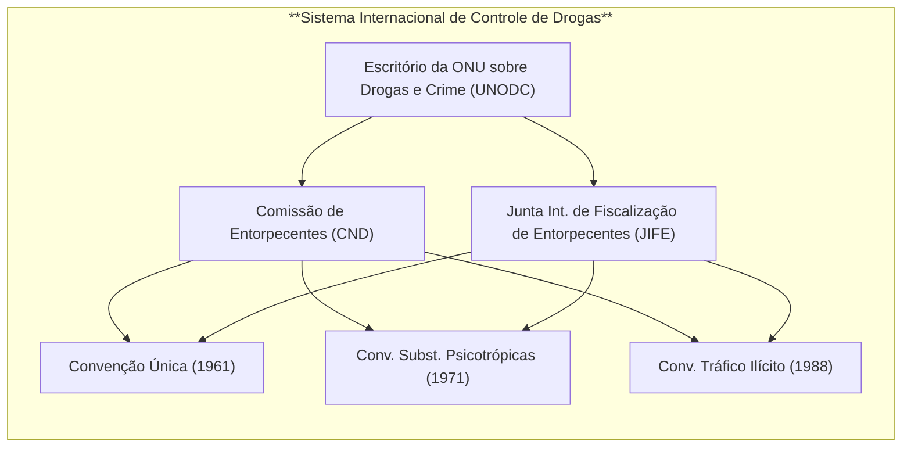

# Ameaças Transnacionais na Segurança Internacional no Século XXI

## Introdução

As **ameaças transnacionais** tornaram-se foco central da segurança internacional no século XXI. Fenômenos como o **narcotráfico**, o **crime organizado transnacional** e os **crimes cibernéticos** ultrapassam fronteiras nacionais, desafiando a capacidade dos Estados de enfrentá-los isoladamente. Esses problemas globais exigem cooperação internacional intensa, bem como **regimes internacionais** robustos para coordenar estratégias e harmonizar legislações. A seguir, analisa-se cada ameaça em profundidade – sua natureza, os principais regimes internacionais vigentes e os desafios e debates centrais que permeiam a cooperação entre países para enfrentá-las.

## Narcotráfico: Natureza da Ameaça

O **tráfico internacional de drogas** ilícitas constitui uma das mais antigas e lucrativas atividades criminosas transnacionais. Movimenta bilhões de dólares por ano e alimenta uma cadeia de violência e corrupção que afeta a segurança de diversos países. **Cartéis e redes de narcotráfico** operam em escala global, aproveitando-se de diferenças legais e falhas de fiscalização nas fronteiras. Além dos danos à saúde pública pelo aumento do consumo de entorpecentes, o narcotráfico corrompe instituições estatais, financia grupos armados e intensifica a violência criminosa, comprometendo a estabilidade interna de nações e regiões inteiras. Por essas razões, as drogas figuram no topo da agenda de segurança internacional desde o fim do século XX, sendo tratadas como um **“problema mundial das drogas”** que demanda resposta multilateral coordenada[brasil.un.org](https://brasil.un.org/pt-br/65425-drogas-declara%C3%A7%C3%A3o-conjunta-pede-melhor-compreens%C3%A3o-dos-fatores-sociais-e-econ%C3%B4micos#:~:text=%E2%80%9CEstamos%20plenamente%20conscientes%20de%20que,as%20estrat%C3%A9gias%E2%80%9D%2C%20diz%20a%20declara%C3%A7%C3%A3o).

## Narcotráfico: Regime Internacional de Controle de Drogas

Para enfrentar o narcotráfico, a comunidade internacional consolidou um **regime global de controle de drogas**, estruturado principalmente em torno de três tratados da ONU amplamente ratificados: a **Convenção Única sobre Entorpecentes (1961)**, a **Convenção sobre Substâncias Psicotrópicas (1971)** e a **Convenção das Nações Unidas contra o Tráfico Ilícito de Entorpecentes e Substâncias Psicotrópicas (1988)**. Juntas, essas convenções formam os pilares legais do combate mundial às drogas, buscando limitar a produção, o comércio e o uso de drogas apenas a fins médicos e científicos.

- **Convenção Única de 1961:** unificou tratados anteriores sobre ópio, coca e derivados, expandindo o controle internacional para incluir **cannabis** e diversos opioides sintéticos[pt.wikipedia.org](https://pt.wikipedia.org/wiki/Conven%C3%A7%C3%A3o_%C3%9Anica_sobre_Entorpecentes#:~:text=Os%20tratados%20anteriores%20controlavam%20apenas,Escrit%C3%B3rio%20das%20Na%C3%A7%C3%B5es%20Unidas%20sobre). Estabeleceu um sistema de listas (escalonando as substâncias conforme seu risco) e criou estruturas institucionais dedicadas. A **Comissão de Entorpecentes (CND)**, órgão político no âmbito do ECOSOC, foi encarregada de supervisionar as políticas e é auxiliada pela **Organização Mundial da Saúde (OMS)** na avaliação e classificação de substâncias. A Convenção de 1961 também criou a **Junta Internacional de Fiscalização de Entorpecentes (JIFE, ou INCB em inglês)**, responsável por monitorar e controlar a produção e o comércio lícito de drogas (como os opiáceos medicinais), evitando desvios para o mercado ilegal[pt.wikipedia.org](https://pt.wikipedia.org/wiki/Conven%C3%A7%C3%A3o_%C3%9Anica_sobre_Entorpecentes#:~:text=contempladas,suplementado%20pela%20Conven%C3%A7%C3%A3o%20sobre%20Subst%C3%A2ncias). O **Escritório das Nações Unidas sobre Drogas e Crime (UNODC)** atua como secretariado do regime, apoiando os países no cumprimento das convenções e monitorando diariamente a implementação nacional[pt.wikipedia.org](https://pt.wikipedia.org/wiki/Conven%C3%A7%C3%A3o_%C3%9Anica_sobre_Entorpecentes#:~:text=listas%20de%20subst%C3%A2ncias%20controladas%20do,fortalece%20as%20disposi%C3%A7%C3%B5es%20contra%20a). Em 1972, a Convenção Única foi emendada por um Protocolo que reforçou obrigações de tratamento e reabilitação de dependentes.
    
- **Convenção de 1971 (Substâncias Psicotrópicas):** ampliou o regime para abranger drogas sintéticas e alucinógenos recém-desenvolvidos (como LSD, anfetaminas e MDMA) não contemplados em 1961[pt.wikipedia.org](https://pt.wikipedia.org/wiki/Conven%C3%A7%C3%A3o_%C3%9Anica_sobre_Entorpecentes#:~:text=pa%C3%ADs%20e%20o%20trabalho%20com,8). Estabeleceu controles internacionais semelhantes (listas de substâncias, restritas a usos médicos/científicos) e inseriu a OMS no papel de recomendação técnica sobre quais psicotrópicos deveriam ser controlados.
    
- **Convenção de 1988:** adotada em Viena, reforçou significativamente a cooperação internacional na repressão ao **tráfico ilícito** de drogas. Considerada o “terceiro pilar” do sistema universal antidrogas[brasil.un.org](https://brasil.un.org/pt-br/64669-conven%C3%A7%C3%A3o-da-onu-contra-tr%C3%A1fico-de-entorpecentes-e-subst%C3%A2ncias-psicotr%C3%B3picas-faz-25-anos#:~:text=Subst%C3%A2ncias%20Psicotr%C3%B3picas,controle%20de%20drogas%20universalmente%20aprovado), essa Convenção obrigou os Estados a criminalizar o narcotráfico em suas legislações domésticas e adotar medidas contra atividades conexas como **lavagem de dinheiro** e **desvio de precursores químicos** essenciais à fabricação de entorpecentes[brasil.un.org](https://brasil.un.org/pt-br/64669-conven%C3%A7%C3%A3o-da-onu-contra-tr%C3%A1fico-de-entorpecentes-e-subst%C3%A2ncias-psicotr%C3%B3picas-faz-25-anos#:~:text=preven%C3%A7%C3%A3o%2C%20tratamento%20e%20reabilita%C3%A7%C3%A3o). Seu objetivo central é _“promover a cooperação entre os Estados para lidar de forma mais eficaz com o tráfico de drogas, eliminar os lucros do crime organizado com o comércio ilícito e fornecer novas ferramentas aos governos”_[brasil.un.org](https://brasil.un.org/pt-br/64669-conven%C3%A7%C3%A3o-da-onu-contra-tr%C3%A1fico-de-entorpecentes-e-subst%C3%A2ncias-psicotr%C3%B3picas-faz-25-anos#:~:text=A%20Conven%C3%A7%C3%A3o%20de%201988%20tem,Conven%C3%A7%C3%A3o%20tamb%C3%A9m%20buscou%20reduzir%20o). A Convenção de 1988 também detalhou e ampliou o mandato da JIFE na fiscalização de precursores, estabelecendo sistemas de monitoramento do comércio legítimo (por exemplo, o sistema de Notificação Pré-Exportação – **PEN Online** – para impedir desvios)[brasil.un.org](https://brasil.un.org/pt-br/64669-conven%C3%A7%C3%A3o-da-onu-contra-tr%C3%A1fico-de-entorpecentes-e-subst%C3%A2ncias-psicotr%C3%B3picas-faz-25-anos#:~:text=A%20Conven%C3%A7%C3%A3o%20detalha%20o%20mandato,para%20fabrica%C3%A7%C3%A3o%20de%20drogas%20il%C3%ADcitas). Graças a esses mecanismos, conseguiu-se virtualmente eliminar, nas últimas décadas, o desvio de insumos químicos do mercado legal para a produção ilegal de drogas[brasil.un.org](https://brasil.un.org/pt-br/64669-conven%C3%A7%C3%A3o-da-onu-contra-tr%C3%A1fico-de-entorpecentes-e-subst%C3%A2ncias-psicotr%C3%B3picas-faz-25-anos#:~:text=psicotr%C3%B3picas%2C%20fornecendo%20%E2%80%93%20em%20parceria,para%20fabrica%C3%A7%C3%A3o%20de%20drogas%20il%C3%ADcitas).
    

> [!note] **Universalidade do Regime Antidrogas**  
> As três convenções antidrogas da ONU alcançaram adesão quase universal: 186 Estados são parte da Convenção de 1961[pt.wikipedia.org](https://pt.wikipedia.org/wiki/Conven%C3%A7%C3%A3o_%C3%9Anica_sobre_Entorpecentes#:~:text=Em%20fevereiro%20de%202018%2C%20a,5). Esse amplo engajamento reflete o consenso internacional de que o problema das drogas deve ser enfrentado coletivamente. Trata-se de um exemplo do princípio da **“responsabilidade comum e compartilhada”**, segundo o qual _“o problema mundial das drogas continua a ser uma responsabilidade comum e compartilhada que deve ser abordada em um ambiente multilateral, por meio de cooperação internacional eficaz”_[brasil.un.org](https://brasil.un.org/pt-br/65425-drogas-declara%C3%A7%C3%A3o-conjunta-pede-melhor-compreens%C3%A3o-dos-fatores-sociais-e-econ%C3%B4micos#:~:text=%E2%80%9CEstamos%20plenamente%20conscientes%20de%20que,as%20estrat%C3%A9gias%E2%80%9D%2C%20diz%20a%20declara%C3%A7%C3%A3o). Em outras palavras, tanto países produtores quanto consumidores de drogas dividem a obrigação de adotar medidas coordenadas – do combate ao tráfico à redução da demanda – respeitando simultaneamente a soberania de cada Estado e os direitos humanos.

Para visualizar a estrutura do regime internacional de controle de drogas, segue um diagrama esquemático:

_(Diagrama: as convenções de 1961, 1971 e 1988 formam a base legal; a Comissão de Entorpecentes (CND) supervisiona as políticas e decisões sobre as convenções, com apoio técnico da OMS; a JIFE/INCB monitora o cumprimento (quotas de produção, comércio lícito, etc.); o UNODC atua como braço executivo, auxiliando países e servindo de secretaria do regime.)_

## Narcotráfico: Desafios e Debates na Cooperação Internacional

Apesar do arcabouço internacional consolidado, persistem **desafios consideráveis** para a cooperação antidrogas. Um dos principais entraves deriva do **princípio da soberania**: cada Estado tem suas prioridades e sensibilidades internas em matéria de drogas, o que pode limitar a disposição em ajustar leis nacionais ou aceitar monitoramento externo. Por exemplo, alguns países resistem a determinadas políticas antidrogas por considerá-las interferência em assuntos internos – daí a ênfase constante em respeitar _“plenamente a soberania e a integridade territorial dos Estados”_ em declarações conjuntas sobre drogas[brasil.un.org](https://brasil.un.org/pt-br/65425-drogas-declara%C3%A7%C3%A3o-conjunta-pede-melhor-compreens%C3%A3o-dos-fatores-sociais-e-econ%C3%B4micos#:~:text=O%20documento%20afirma%20que%20os,respeito%20m%C3%BAtuo%20entre%20os%20Estados%E2%80%9D). Diferenças culturais e históricas também influenciam abordagens (caso do cultivo tradicional da folha de coca, defendido por alguns governos andinos como patrimônio cultural, em tensão com as regras da Convenção de 1961).

Outro desafio é a **disparidade legislativa** entre países. Embora as convenções busquem harmonização, ainda há variações significativas: certas jurisdições impõem pena de morte para crimes de drogas, enquanto outras aboliram penas severas; algumas descriminalizaram o uso pessoal de determinadas substâncias, enquanto outras mantêm tolerância zero. Essa falta de uniformidade pode dificultar a colaboração jurídica – por exemplo, pedidos de **extradição** ou assistência jurídica podem ser negados se o fato não for crime nos dois países ou se houver risco de pena considerada desproporcional em um deles. A cooperação também esbarra em **capacidades desiguais** de aplicação da lei: países com recursos limitados ou instituições fragilizadas (por corrupção ou violência) podem ser elos fracos no combate global, incapazes de cumprir plenamente obrigações de fiscalização de fronteiras ou erradicação de cultivos ilícitos.

### Debate: “Guerra às Drogas” vs. Abordagens Alternativas

Um debate crucial na agenda internacional de drogas opõe a tradicional **“guerra às drogas”** – estratégia proibicionista e repressiva inaugurada pelos EUA nas décadas de 1970-80 – a enfoques alternativos como a **descriminalização do uso** e a **legalização regulamentada** de certas drogas. Críticos da guerra às drogas argumentam que, em mais de meio século, a estratégia punitiva não conseguiu reduzir significativamente nem a oferta nem a demanda de drogas, ao passo que gerou efeitos colaterais nefastos: encarceramento em massa, violações de direitos humanos e fortalecimento do poder do crime organizado. Entre 1998 e 2008, por exemplo, o número global de usuários de drogas permaneceu estável, assim como a área de cultivo de papoula, apesar dos esforços repressivos[reuters.com](https://www.reuters.com/article/world/onu-rev-guerra-s-drogas-em-meio-a-clamor-global-por-liberalizao-idUSKCN0XG2S1/#:~:text=,Solim%C3%A1n%2C%20ao%20jornal%20ingl%C3%AAs%20Guardian). Líderes latino-americanos destacam que a abordagem estritamente militar e policial _“fracassou, destruindo ou prejudicando milhares de vidas”_, e apontam uma tendência irreversível de reformas, como a legalização da cannabis em alguns países[reuters.com](https://www.reuters.com/article/world/onu-rev-guerra-s-drogas-em-meio-a-clamor-global-por-liberalizao-idUSKCN0XG2S1/#:~:text=drogas). Ex-presidentes e especialistas reunidos em comissões globais têm defendido estratégias de **redução de danos**, tratamento de usuários como questão de saúde pública, e até a regulamentação legal de mercados de drogas para enfraquecer as quadrilhas.

Por outro lado, países mais conservadores em política de drogas – **Rússia**, **China**, alguns países asiáticos e árabes – rejeitam a liberalização, temendo aumento do consumo e citando obrigações dos tratados vigentes. Mesmo entre aliados ocidentais há divisões: os EUA, por exemplo, embora internamente alguns de seus estados legalizem a maconha, em fóruns internacionais historicamente sustentaram a manutenção do regime proibicionista (ainda que nos últimos anos tenham adotado tom mais voltado a saúde pública). Esse conflito de visões ficou evidente na Sessão Especial da ONU sobre Drogas em 2016 (UNGASS 2016), quando _“enormes divisões”_ emergiram entre Estados defendendo descriminalização e foco em saúde versus aqueles contrários a flexibilizações[reuters.com](https://www.reuters.com/article/world/onu-rev-guerra-s-drogas-em-meio-a-clamor-global-por-liberalizao-idUSKCN0XG2S1/#:~:text=Apesar%20de%20uma%20concord%C3%A2ncia%20ampla,quanto%20pela%20guerra%20%C3%A0s%20drogas)[reuters.com](https://www.reuters.com/article/world/onu-rev-guerra-s-drogas-em-meio-a-clamor-global-por-liberalizao-idUSKCN0XG2S1/#:~:text=Mas%2C%20segundo%20os%20delegados%2C%20algumas,regulamentar%20o%20acesso%20%C3%A0%20maconha). O resultado foi uma declaração política de compromisso, vista como tímida pelos reformistas por ainda enfatizar a redução da oferta em vez da redução de danos[reuters.com](https://www.reuters.com/article/world/onu-rev-guerra-s-drogas-em-meio-a-clamor-global-por-liberalizao-idUSKCN0XG2S1/#:~:text=afirmou).

Uma frase célebre do então presidente colombiano Juan Manuel Santos resume o espírito do debate: _“Isso não é um pedido de legalização das drogas... É um pedido de reconhecimento de que, entre a guerra total e a legalização, existe uma ampla gama de opções que vale a pena explorar”_[reuters.com](https://www.reuters.com/article/world/onu-rev-guerra-s-drogas-em-meio-a-clamor-global-por-liberalizao-idUSKCN0XG2S1/#:~:text=direitos%20humanos). Assim, no cenário atual, mantém-se a tensão entre cumprir rigorosamente as convenções da ONU – que proíbem usos não médicos de entorpecentes – e inovar em políticas nacionais para minimizar os danos sociais do fenômeno das drogas. Esse debate tem implicações para a cooperação: iniciativas de alguns países (como Portugal, Uruguai, Canadá e certos estados dos EUA) de descriminalizar ou legalizar desafiam o regime internacional e exigem acomodações diplomáticas para evitar que o “fio” do consenso global se rompa. O princípio da **responsabilidade comum e compartilhada** permanece central, mas sua efetivação requer conciliar responsabilidade repressiva com responsabilidade em prevenção, tratamento e respeito aos direitos humanos – um equilíbrio delicado que ainda está em evolução na governança global das drogas[brasil.un.org](https://brasil.un.org/pt-br/65425-drogas-declara%C3%A7%C3%A3o-conjunta-pede-melhor-compreens%C3%A3o-dos-fatores-sociais-e-econ%C3%B4micos#:~:text=%E2%80%9CEstamos%20plenamente%20conscientes%20de%20que,as%20estrat%C3%A9gias%E2%80%9D%2C%20diz%20a%20declara%C3%A7%C3%A3o)[brasil.un.org](https://brasil.un.org/pt-br/65425-drogas-declara%C3%A7%C3%A3o-conjunta-pede-melhor-compreens%C3%A3o-dos-fatores-sociais-e-econ%C3%B4micos#:~:text=O%20documento%20afirma%20que%20os,respeito%20m%C3%BAtuo%20entre%20os%20Estados%E2%80%9D).

## Crime Organizado Transnacional: Natureza da Ameaça

O **crime organizado transnacional** engloba redes criminosas diversificadas que operam através de fronteiras, envolvendo-se em múltiplas atividades ilícitas: tráfico de drogas, **tráfico de pessoas**, **contrabando de migrantes**, **tráfico de armas**, **lavagem de dinheiro**, crimes ambientais, entre outros. Essas organizações criminosas – máfias, cartéis, gangues transnacionais – caracterizam-se por estrutura hierárquica ou em rede, planejamento de longo prazo e enorme poder financeiro. A globalização, aliada aos avanços em transportes, comunicações e tecnologia financeira, ampliou o alcance e sofisticação desses grupos, que aproveitam brechas legais e jurisdicionais entre países para expandir seus empreendimentos ilícitos. As **ameaças à segurança** são múltiplas: o crime organizado corrompe instituições públicas (polícias, judiciário, governos), desestabiliza economias lícitas mediante infiltração financeira, gera violência armada e pode, em certos contextos, aliar-se a grupos terroristas ou insurgentes, aprofundando conflitos. Na década de 1990, com o fim da Guerra Fria, emergiu a compreensão de que o crime organizado transnacional era um _“novo perigo comum”_ à comunidade internacional, exigindo resposta cooperativa semelhante à adotada contra ameaças tradicionais à paz.

> [!definition] **Definição – Grupo Criminoso Organizado (Convenção de Palermo)**  
> De acordo com o Artigo 2º da Convenção da ONU contra o Crime Organizado Transnacional, considera-se **“grupo criminoso organizado”** _“um grupo estruturado de três ou mais pessoas, existente há algum tempo e atuando concertadamente com o propósito de cometer uma ou mais infrações graves, com a intenção de obter, direta ou indireta, um benefício econômico ou outro benefício material”_[vladimiraras.blog](https://vladimiraras.blog/2020/05/16/o-conceito-de-organizacao-criminosa-e-suas-controversias/#:~:text=Diz%20o%20art,23). **Infrações graves** são definidas como aquelas puníveis com pelo menos 4 anos de prisão[vladimiraras.blog](https://vladimiraras.blog/2020/05/16/o-conceito-de-organizacao-criminosa-e-suas-controversias/#:~:text=enunciadas%20na%20Conven%C3%A7%C3%A3o%2C%20%E2%80%9Ccom%20a,23). Essa definição visa abarcar as quadrilhas estáveis envolvidas em criminalidade lucrativa de alto impacto, servindo de base comum para as legislações nacionais.

## Crime Organizado Transnacional: A Convenção de Palermo e seus Protocolos

O principal instrumento global de combate ao crime organizado transnacional é a **Convenção das Nações Unidas contra o Crime Organizado Transnacional**, adotada em 2000 e conhecida como **Convenção de Palermo**. Trata-se de um tratado multilateral abrangente, em vigor desde 2003, que **reconhece a gravidade do problema e a necessidade de estreita cooperação internacional para enfrentá-lo**[unodc.org](https://www.unodc.org/lpo-brazil/pt/crime/marco-legal.html#:~:text=antes%20de%20aderir%20a%20qualquer,atos%20como%20a%20participa%C3%A7%C3%A3o%20em). A Convenção de Palermo dispõe que os Estados Partes devem **criminalizar** em suas leis internas os atos nucleares da criminalidade organizada – **participação em grupo criminoso organizado, lavagem de dinheiro, corrupção e obstrução da justiça** – e prevê medidas para facilitar **extradição, auxílio jurídico mútuo e cooperação policial** entre países[unodc.org](https://www.unodc.org/lpo-brazil/pt/crime/marco-legal.html#:~:text=Os%20Estados,resposta%20eficaz%20ao%20crime%20organizado). Além disso, incentiva o intercâmbio de informações de inteligência e a capacitação de agentes, buscando equiparar a capacidade dos Estados de dar uma resposta eficaz a essas redes criminosas[unodc.org](https://www.unodc.org/lpo-brazil/pt/crime/marco-legal.html#:~:text=tipifica%C3%A7%C3%A3o%20criminal%20na%20legisla%C3%A7%C3%A3o%20nacional,resposta%20eficaz%20ao%20crime%20organizado). Aderir à Convenção implica também um compromisso político: os países passaram a encarar o crime organizado transnacional não apenas como problema doméstico alheio, mas como ameaça comum, demandando esforços coordenados.

A Convenção de Palermo é complementada por **três Protocolos adicionais**, que abordam formas específicas de crime transnacional emergentes no final do século XX:

- **Protocolo sobre Tráfico de Pessoas (2000):** primeiro instrumento jurídico global vinculante a definir o **tráfico de pessoas** (especialmente de mulheres e crianças) e a estabelecer medidas para preveni-lo, reprimi-lo e punir seus autores[unodc.org](https://www.unodc.org/lpo-brazil/pt/crime/marco-legal.html#:~:text=Aprovado%20pela%20resolu%C3%A7%C3%A3o%20da%20Assembleia,pleno%20respeito%20aos%20direitos%20humanos). O protocolo visa harmonizar as legislações nacionais quanto à definição desse crime, de modo a facilitar investigações e processos transnacionais. Adicionalmente, exige dos países a proteção e assistência às vítimas de tráfico humano, garantindo respeito aos seus direitos humanos[unodc.org](https://www.unodc.org/lpo-brazil/pt/crime/marco-legal.html#:~:text=juridicamente%20vinculante%20com%20uma%20defini%C3%A7%C3%A3o,pleno%20respeito%20aos%20direitos%20humanos). A definição consensual de “tráfico de pessoas” – envolvendo recrutamento, transporte ou acolhimento de pessoas por meios coercitivos para fins de exploração – foi uma conquista-chave, alinhando entendimentos e fechando brechas que traficantes exploravam.
    
- **Protocolo sobre Contrabando de Migrantes (2000):** criminaliza o **contrabando de migrantes** por via terrestre, marítima ou aérea, isto é, a facilitação da entrada irregular de pessoas em um país, geralmente em troca de lucro financeiro[unodc.org](https://www.unodc.org/lpo-brazil/pt/crime/marco-legal.html#:~:text=Este%20protocolo%20foi%20aprovado%20pela,migrantes%20contrabandeados%20e%20prevenindo%20a). Diante do crescimento desse tipo de atividade por redes que exploram migrantes vulneráveis, o protocolo trouxe, pela primeira vez, uma definição global de **“contrabando de migrantes”**, diferenciando-o do tráfico de pessoas (no contrabando, há consentimento inicial do migrante, e a relação com os criminosos tende a encerrar-se na chegada; já o tráfico envolve coerção e exploração contínua). O instrumento busca promover a cooperação para prevenir e combater essas redes criminosas, ao mesmo tempo em que incentiva a proteção dos direitos dos migrantes contrabandeados e medidas para evitar que se tornem vítimas de exploração[unodc.org](https://www.unodc.org/lpo-brazil/pt/crime/marco-legal.html#:~:text=crescente%20de%20grupos%20criminosos%20organizados,prevenindo%20a%20explora%C3%A7%C3%A3o%20dessas%20pessoas).
    
- **Protocolo sobre Armas de Fogo (2001):** voltado a prevenir, combater e erradicar o **fabricamento e tráfico ilícitos de armas de fogo, suas peças e munições**[unodc.org](https://www.unodc.org/lpo-brazil/pt/crime/marco-legal.html#:~:text=Este%20protocolo%20foi%20aprovado%20por,pe%C3%A7as%20e%20componentes%20e%20muni%C3%A7%C3%B5es). É o primeiro tratado global juridicamente vinculante focado em armas leves, reconhecendo que o fluxo ilegal de armamentos alimenta conflitos e o próprio crime organizado. O protocolo obriga os Estados a adotarem **três conjuntos de medidas**: (1) **criminalizar** atividades ilícitas relacionadas a armas (fabricação sem licença, tráfico, etc.) conforme definições padronizadas; (2) implementar sistemas de **licenciamento e autorização governamental** para a produção e exportação lícita de armas, distinguindo claramente mercado legal e ilegal; e (3) garantir a **marcação e rastreamento** de armas de fogo, facilitando seguir o rastro de armas desviadas e identificar rotas de tráfico[unodc.org](https://www.unodc.org/lpo-brazil/pt/crime/marco-legal.html#:~:text=Ao%20ratificar%20o%20protocolo%2C%20os,rastreamento%20de%20armas%20de%20fogo). Essas medidas visam fechar o cerco ao comércio ilegal que abastece organizações criminosas e conflitos armados.
    

Vale notar que, para aderir a qualquer desses protocolos, o Estado deve primeiro ser Parte da Convenção de Palermo[unodc.org](https://www.unodc.org/lpo-brazil/pt/crime/marco-legal.html#:~:text=A%20Conven%C3%A7%C3%A3o%20%C3%A9%20complementada%20por,luta%20contra%20o%20crime%20organizado) – refletindo que os protocolos complementam o regime geral, mas sua incorporação é opcional, de acordo com as prioridades de cada país. Atualmente, a maioria dos países é parte da Convenção de Palermo e de pelo menos um protocolo, embora nem todos tenham ratificado os três. A implementação é acompanhada por mecanismos como a **Conferência das Partes (COP)** da Convenção, que monitora o cumprimento e promove intercâmbio de boas práticas.

## Crime Organizado Transnacional: Desafios da Cooperação Internacional

Apesar do arcabouço oferecido pela Convenção de Palermo e seus protocolos, há inúmeros **desafios práticos** na cooperação contra o crime organizado transnacional:

- **Soberania e Desconfiança:** Embora todos reconheçam a natureza transnacional da ameaça, na prática os Estados nem sempre estão dispostos a cooperar plenamente. Questões de soberania podem emergir quando, por exemplo, um país solicita a outro ações contundentes contra grupos criminosos atuando além-fronteira – alguns governos relutam em permitir operações estrangeiras em seu território ou em expor informações internas sensíveis. Ademais, a cooperação exige **confiança mútua** entre os órgãos de segurança e judiciários dos países envolvidos. Essa confiança pode ser abalada se houver suspeitas de corrupção: caso forças policiais ou autoridades estejam infiltradas por organizações criminosas (situação infelizmente comum onde o crime organizado é poderoso), outros países hesitarão em compartilhar inteligência ou efetuar **operações conjuntas**. Construir confiança demanda transparência e compromisso contínuo, algo nem sempre trivial nas relações internacionais.
    
- **Disparidades Legais e de Capacidade:** Há diferenças nas definições e tradições jurídicas que podem complicar a colaboração. Por exemplo, a própria noção de _“organização criminosa”_ variava antes de Palermo – alguns países não tipificavam explicitamente a participação em grupos criminosos. A Convenção buscou uniformizar isso, mas ainda assim os sistemas legais divergem em procedimentos penais, proteção a testemunhas, etc. Além disso, muitos países enfrentam **limitações de capacidade** técnica e institucional: investigações complexas de lavagem de dinheiro ou tráfico internacional requerem recursos especializados que nem todos dispõem. Países desenvolvidos muitas vezes fornecem **assistência técnica** (via UNODC ou acordos bilaterais) para capacitar forças policiais e unidades de inteligência financeira em nações em desenvolvimento. Todavia, enquanto persistirem essas assimetrias, grupos criminosos explorarão os pontos mais fracos – seja um país com leis menos rigorosas sobre lavagem de dinheiro, seja uma fronteira porosa com pouca vigilância.
    
- **Jurisdicionais e Probatórios:** Crimes transnacionais podem envolver múltiplos países (ex.: drogas produzidas na América do Sul, lavadas financeiramente na Europa e movimentadas via portos na África). Isso exige coordenação para determinar qual jurisdição processará os envolvidos e como coletar e compartilhar provas. Procedimentos de **assistência jurídica mútua** podem ser lentos e burocráticos; diferenças de idioma e cultura jurídica acrescentam dificuldade. Criminosos aproveitam-se dessas barreiras – por exemplo, operando de países que não têm tratado de extradição com a nação afetada, ou fragmentando suas operações para diluir a resposta legal.
    
- **Adaptação e Novas Ameaças:** Organizações criminosas demonstram notável capacidade de adaptação. À medida que Estados fecham brechas em certas áreas (por exemplo, mais controle sobre bancos para evitar lavagem), os criminosos migram para métodos ou localidades alternativas (uso de criptomoedas, paraísos fiscais pouco cooperativos, novas rotas de tráfico). A cooperação internacional costuma reagir de forma mais lenta que a inovação criminal, especialmente quando é necessária **negociação diplomática** para atualizar tratados ou estabelecer novos instrumentos. Exemplos recentes incluem o desafio de crimes cibernéticos ligados a organizações criminosas (como fraude online, phishing em massa) e a exploração de mercados ilícitos na _dark web_ para venda de drogas, armas e pessoas – áreas nas quais o crime organizado transnacional se reinventa e que exigem coordenação com o regime internacional de _cyber_ (ver próxima seção).
    

Em síntese, o combate ao crime organizado transnacional requer um **esforço persistente de coordenação** entre Estados com diferentes interesses e capacidades. A Convenção de Palermo fornece uma linguagem comum e um compromisso formal, mas a efetividade depende de vontade política, investimento em instituições de aplicação da lei e superação de rivalidades geopolíticas. Sem isso, as promessas de cooperação esbarram em respostas fragmentadas, permitindo que as redes criminosas globalizadas continuem explorando as brechas do sistema internacional.

## Crimes Cibernéticos: Natureza da Ameaça

No século XXI, os **crimes cibernéticos** ascenderam rapidamente à primeira linha das preocupações de segurança internacional. A digitalização de praticamente todas as esferas da vida – economia, governo, comunicações – criou novos tipos de vulnerabilidades exploradas por criminosos através do ciberespaço. **Crimes cibernéticos** podem ser definidos como atos ilícitos cometidos mediante o uso de tecnologias de informação e comunicação (TIC), englobando desde invasões de computadores (_hacking_) para roubo de dados, fraudes financeiras online, ataques de **ransomware** (sequestro de sistemas mediante criptografia, exigindo resgate), até a disseminação de **malware**, **phishing** (fraude via engodo digital), espionagem cibernética contra segredos comerciais ou governamentais, e abuso sexual de crianças pela internet (como produção/distribuição de pornografia infantil e aliciamento online). Diferentemente de crimes tradicionais, os delitos cibernéticos podem ser **praticados remotamente**, com anonimato relativo, e atingir vítimas em qualquer lugar do mundo quase instantaneamente.

A natureza transnacional é inerente à maioria dos cibercrimes: um ataque pode ser lançado por criminosos em um país, utilizando servidores em vários outros, para afetar indivíduos, empresas ou infraestruturas críticas em um terceiro Estado. Essa difusão global do risco faz com que **nenhum país consiga enfrentar sozinho** a ameaça – a cooperação é imprescindível tanto para investigar crimes (seguindo rastros digitais que atravessam múltiplas jurisdições) quanto para prevenir ataques (por meio de alerta mútuo sobre ameaças e adoção de normas comuns de segurança). Estimativas recentes indicam que os prejuízos do cibercrime somam **trilhões de dólares** anuais globalmente, drenando recursos econômicos e minando a confiança no mundo digital[unodc.org](https://www.unodc.org/unodc/en/press/releases/2024/December/un-general-assembly-adopts-landmark-convention-on-cybercrime.html#:~:text=Executive%20Director%20Ghada%20Waly). Além dos impactos financeiros, há sério risco à **segurança nacional**: cibercriminosos podem paralisar serviços essenciais (redes elétricas, sistemas bancários, hospitais), e há crescente convergência entre crime cibernético e segurança estatal – por exemplo, **grupos criminosos podem atuar sob proteção ou comando de governos** para realizar ataques geopolíticos, borrando a linha entre crime comum e ameaça cibernética estatal.

## Crimes Cibernéticos: Regimes Internacionais – Convenção de Budapeste e a Nova Convenção da ONU

Durante muito tempo, a resposta internacional aos crimes cibernéticos foi fragmentada. Até o início dos anos 2000, inexistia um tratado universal específico. A iniciativa pioneira coube ao Conselho da Europa, que elaborou a **Convenção de Budapeste sobre Cibercrime (2001)** – primeiro acordo internacional voltado a harmonizar leis penais sobre delitos informáticos e facilitar a cooperação investigativa. A Convenção de Budapeste estabelece definições e tipifica uma série de condutas (como acesso ilegal a sistemas, espionagem de dados, fraude e falsificação informática, disseminação de material de abuso sexual infantil via TIC), além de prever medidas de coleta de evidências eletrônicas e um mecanismo de **cooperação internacional ágil** (incluindo a criação de pontos de contato _24/7_ em cada país para responder rapidamente a demandas urgentes)[theregreview.org](https://www.theregreview.org/2025/02/10/de-silva-de-alwis-the-u-n-cybercrime-convention-is-a-promethean-moment/#:~:text=Furthermore%2C%20the%20United%20States%2C%20in,%E2%80%9D). Embora seja um tratado regional europeu, a Convenção de Budapeste foi aberta à adesão de países de fora da Europa; atualmente conta com **mais de 65 Estados Partes**, incluindo nações como EUA, Japão, Austrália e vários países latino-americanos. O Brasil, contudo, **não** aderiu a Budapeste (até 2025), reflexo de uma cautela em delegar a um tratado formulado fora da ONU questões sensíveis de jurisdição e fluxo de dados. Países como China e Rússia também rechaçaram a Convenção de Budapeste, criticando-a por potencialmente violar soberanias (por exemplo, algumas disposições permitem acesso transfronteiriço a dados armazenados no exterior) e por não terem participado de sua elaboração.

As limitações geográficas da Convenção de Budapeste levaram a pedidos por um **tratado global de cibercrime**. Por anos, houve um impasse: países ocidentais preferiam fortalecer Budapeste e fóruns informais de cooperação, enquanto países como Rússia, China e membros do Movimento Não Alinhado defendiam negociar um instrumento _ex novo_ no âmbito das Nações Unidas – em parte para assegurar maior respeito à soberania e contemplar diferentes visões sobre o que constitui uso indevido das TIC. Esse impasse começou a se desfazer em 2019, quando a Assembleia Geral da ONU, por iniciativa russa (e apoio do G77), aprovou a criação de um **Comitê Ad Hoc para elaborar uma convenção internacional contra os crimes cibernéticos** (“uso das TIC para fins criminosos”). Após cinco anos de negociações complexas – envolvendo delegados de _quase todos os países membros_, além de consultas à sociedade civil e setor privado – chegou-se a um consenso. Em **24 de dezembro de 2024**, a Assembleia Geral **adotou por consenso** a nova _Convenção das Nações Unidas sobre Crimes Cibernéticos_[unodc.org](https://www.unodc.org/unodc/en/press/releases/2024/December/un-general-assembly-adopts-landmark-convention-on-cybercrime.html#:~:text=The%20United%20Nations%20General%20Assembly,year%20negotiation%20process)[unodc.org](https://www.unodc.org/unodc/en/press/releases/2024/December/un-general-assembly-adopts-landmark-convention-on-cybercrime.html#:~:text=The%20General%20Assembly%20adopted%20the,text%20for%20over%20five%20years). Trata-se do **primeiro tratado global** dedicado a essa matéria, marcando, nas palavras do UNODC, _“a primeira convenção internacional de justiça criminal do século XXI”_[theregreview.org](https://www.theregreview.org/2025/02/10/de-silva-de-alwis-the-u-n-cybercrime-convention-is-a-promethean-moment/#:~:text=December%2024%2C%202024%2C%20the%20United,importance%20of%20the%20new%20Convention).

Os objetivos centrais da Convenção da ONU contra o Cibercrime são **prevenir e combater o cibercrime de forma mais eficiente e eficaz, reforçando a cooperação internacional e fornecendo assistência técnica e capacitação especialmente a países em desenvolvimento**[unodc.org](https://www.unodc.org/unodc/en/press/releases/2024/December/un-general-assembly-adopts-landmark-convention-on-cybercrime.html#:~:text=and%20combat%20cybercrime%2C%20concluding%20a,year%20negotiation%20process). Em termos de conteúdo, o tratado abrange um rol de ofensas que refletem tanto crimes _cibernéticos puros_ (aqueles que só existem no ambiente digital, como ataques a sistemas, interferência em dados, uso indevido de dispositivos) quanto crimes _ciberneticamente habilitados_ (formas tradicionais de crime potencializadas pela internet, como fraudes, lavagem de dinheiro on-line, exploração sexual infantil, etc.). Inovações incluem disposições sobre **criminalização da distribuição não consensual de imagens íntimas** (“revenge porn”) e **aliciamento sexual de menores on-line (cybergrooming)**, reconhecimento de que essas práticas modernas causam graves danos e afetam desproporcionalmente mulheres e crianças[theregreview.org](https://www.theregreview.org/2025/02/10/de-silva-de-alwis-the-u-n-cybercrime-convention-is-a-promethean-moment/#:~:text=Furthermore%2C%20the%20United%20States%2C%20in,%E2%80%9D)[theregreview.org](https://www.theregreview.org/2025/02/10/de-silva-de-alwis-the-u-n-cybercrime-convention-is-a-promethean-moment/#:~:text=Article%2015%20of%20the%20Convention,%E2%80%9D). Também há preocupações transversais, como a necessidade de proteger direitos humanos no contexto digital e considerar impacto de gênero – o preâmbulo menciona incorporar perspectiva de gênero nas estratégias de combate ao cibercrime[theregreview.org](https://www.theregreview.org/2025/02/10/de-silva-de-alwis-the-u-n-cybercrime-convention-is-a-promethean-moment/#:~:text=The%20Preamble%20to%20the%20Convention,could%20meaningfully%20strengthen%20the%20Convention).

Operacionalmente, a convenção prevê mecanismos de **cooperação policial e jurídica** semelhantes aos de Budapeste (assistência mútua, extradição, preservação rápida de dados eletrônicos, auxílio na coleta de provas digitais) porém em escala global. Um avanço significativo é a formalização do apoio do UNODC como _secretariado_, inclusive para fomentar **capacitação técnica** – crucial para que países menos desenvolvidos possam implementar o tratado e melhorar sua resiliência cibernética[unodc.org](https://www.unodc.org/unodc/en/press/releases/2024/December/un-general-assembly-adopts-landmark-convention-on-cybercrime.html#:~:text=%E2%80%9CIn%20today%E2%80%99s%20digital%20age%2C%20cybercrime,%E2%80%9D)[unodc.org](https://www.unodc.org/unodc/en/press/releases/2024/December/un-general-assembly-adopts-landmark-convention-on-cybercrime.html#:~:text=Nam%20in%202025,th%7D%20signatory). O tratado será aberto para assinaturas em **julho de 2025**, no Vietnã, e entrará em vigor após 40 ratificações[unodc.org](https://www.unodc.org/unodc/en/press/releases/2024/December/un-general-assembly-adopts-landmark-convention-on-cybercrime.html#:~:text=The%20Convention%20will%20open%20for,th%7D%20signatory).

É importante notar que a negociação da convenção de cibercrime refletiu clivagens geopolíticas: questões como **liberdade de expressão online vs. controle de conteúdo** e o conceito de **“segurança da informação”** (favorecido por Rússia/China, abrangendo também o combate à difusão de ideias que consideram perigosas, como extremismo, que para países ocidentais poderia cair em censura política) foram pontos delicados. O título oficial do tratado – “Convenção sobre Combate ao Uso das TIC para Fins Criminais” – reflete uma terminologia mais ampla desejada por países autoritários, mas o texto final evitou criminalizar diretamente aspectos controvertidos como “discurso de ódio” ou “terrorismo cibernético”, focando em delitos com maior consenso internacional. Ainda assim, o compromisso para negociar _protocolos futuros_ (já previsto pelo Comitê Ad Hoc) sugere que temas ausentes ou pouco detalhados – possivelmente delitos relacionados a terrorismo ou outras questões – poderão ser incorporados gradualmente, conforme haja convergência.

## Crimes Cibernéticos: Desafios da Cooperação e Governança do Ciberespaço

A cooperação internacional contra o cibercrime enfrenta **obstáculos únicos**, decorrentes tanto das características técnicas do ciberespaço quanto de divergências políticas profundas entre os Estados:

- **Atribuição e Jurisdição:** Identificar os autores reais de ataques cibernéticos é notoriamente difícil. Criminosos podem mascarar sua identidade (usando redes anônimas, VPNs, _spoofing_ de endereços) e explorar infraestruturas em diversos países. Essa dificuldade de **atribuição** complica a cooperação: um país alvo de um ataque pode suspeitar do envolvimento (direto ou tolerado) do governo de onde o ataque parece ter vindo, gerando atritos diplomáticos em vez de colaboração. Ademais, mesmo quando os responsáveis são indivíduos ou grupos não estatais identificados, frequentemente residem em países cuja jurisdição não alcança os crimes cometidos no exterior ou que **se negam a extraditar** seus nacionais. Um exemplo frequente é de hackers e fraudadores sediados em países que não têm tratados de extradição com os países das vítimas – nesses casos, a **impunidade** é um incentivo para a proliferação de cibercrimes. Superar isso requer tratados que estabeleçam jurisdição extraterritorial para certos delitos e disposição política para entregas internacionais, o que esbarra no apego à jurisdição doméstica.
    
- **Disparidade Legal e Técnica:** Há um grande hiato entre países quanto à existência e abrangência de **legislação cibernética**. Enquanto nações desenvolvidas atualizaram seu código penal para abarcar crimes informáticos, muitos países em desenvolvimento ainda carecem de leis específicas ou definições claras – tornando-se elos frágeis (onde criminosos operam sem medo de punição) e dificultando a **cooperação jurídica** (por exemplo, pedidos de assistência podem ser inviáveis se o fato não for crime em ambos os locais). A nova Convenção da ONU tenta mitigar isso, fornecendo um modelo comum de tipos penais. Porém, a implementação nacional leva tempo e requer recursos. Além disso, diferenças persistem quanto à **proteção de dados e privacidade**: países da UE, por exemplo, têm leis rígidas de proteção de dados pessoais que limitam o compartilhamento de informações com autoridades estrangeiras; já outros Estados podem priorizar o acesso irrestrito a dados para investigações. Conciliar segurança e privacidade é um desafio jurídico-político constante na cooperação cibernética.
    
- **Princípio da Soberania vs. Multissetorialismo:** No tocante à **governança do ciberespaço**, existe um **conflito de visões** fundamental entre blocos de países. As democracias ocidentais, desde os anos 1990, promovem um modelo de governança **multissetorial** (_multi-stakeholder_), no qual governos, empresas privadas, academia e sociedade civil compartilham responsabilidades na administração da internet e na elaboração de normas, preservando um ciberespaço aberto, interoperável e com **livre fluxo de informações**[blogs.lse.ac.uk](https://blogs.lse.ac.uk/cff/2022/08/18/sovereignty-and-cyberspace-chinas-ambition-to-shape-cyber-norms/#:~:text=Global%20cyber%20governance%20is%20arguably,Western%20countries%2C%20including%20China). Esse modelo, exemplificado pela gestão descentralizada da rede (e.g. ICANN no gerenciamento de domínios) e por fóruns colaborativos, sustenta que envolver apenas Estados na governança poderia ameaçar liberdades fundamentais, como a de expressão. Em contraposição, países de regime autoritário (como **China e Rússia**) advogam o princípio da **“ciber soberania”**: cada Estado deve ter o direito de controlar o conteúdo e a estrutura da internet em seu território, estabelecendo suas próprias regras, e a governança global deve ocorrer de forma **multilateral** (entre governos), preferencialmente sob liderança da ONU[blogs.lse.ac.uk](https://blogs.lse.ac.uk/cff/2022/08/18/sovereignty-and-cyberspace-chinas-ambition-to-shape-cyber-norms/#:~:text=Another%20cyber%20norm%20promoted%20by,potential%20threat%20to%20state%20sovereignty). Para Pequim e Moscou, a abordagem multi-stakeholder ocidental permitiu que empresas de tecnologia e atores não-estatais (muitos deles ocidentais) tivessem influência excessiva, e enxergam nisso um risco à soberania nacional e à ordem interna. Como reflexo, esses países buscam há anos fortalecer fóruns intergovernamentais – por exemplo, propondo na ONU um _Código de Conduta para a Segurança da Informação_ enfatizando o respeito à soberania e à não-interferência no conteúdo informacional de outros países[blogs.lse.ac.uk](https://blogs.lse.ac.uk/cff/2022/08/18/sovereignty-and-cyberspace-chinas-ambition-to-shape-cyber-norms/#:~:text=China%20has%20also%20used%20regional,sovereignty%20as%20the%20guiding%20principle).
    

Essa clivagem ideológica complica a cooperação contra cibercrimes de duas maneiras. Primeiro, **diferentes definições de “crime” online**: regimes autoritários frequentemente classificam como crimes cibernéticos atividades vistas por liberais como exercício de direitos (discurso político dissidente, organização de protestos via redes sociais, etc.), rotulando-as de “extremismo” ou “desordem informacional”. Países ocidentais se recusam a cooperar nessas perseguições, e isso tensiona negociações sobre tratados – foi crucial delimitar na Convenção de 2024 que seu escopo se restringe a crimes comuns, não servindo para justificar repressão política. Segundo, a disputa afeta a **arquitetura de governança**: sem acordo sobre quem deve liderar e quais princípios básicos (liberdade vs. controle), fica mais difícil estabelecer **normas globais de conduta** no ciberespaço, inclusive no que tange a atribuição de responsabilidades a Estados que abrigam cibercriminosos. Apesar disso, o diálogo prossegue em plataformas como o **Grupo de Trabalho Aberto da ONU sobre segurança cibernética**, onde todos os Estados debatem normas de comportamento estatal no ciberespaço – embora novamente aí apareça a divisão, com propostas ocidentais de aplicar o direito internacional existente (por exemplo, proibir ataques a infraestrutura civil em tempo de paz) contrastando com propostas de países autoritários focadas em _“conteúdo informacional nocivo”_ e no princípio de não-intervenção.

- **Capacidade e Partilha de Informações:** No combate cotidiano aos cibercrimes, um desafio prático é a troca oportuna de informações e evidências. Provas digitais são voláteis – um log de acesso pode ser deletado ou perdido em dias – o que requer rapidez nos pedidos transnacionais. A burocracia legal muitas vezes não acompanha essa velocidade, e mesmo a nova Convenção enfrentará o desafio de tornar mais ágeis os mecanismos de cooperação. Além disso, muitos países carecem de equipes especializadas em forense digital ou em monitoramento de ameaças cibernéticas. **Iniciativas de capacitação** e criação de unidades especializadas (p.ex. equipes nacionais de resposta a incidentes – CERTs) são vitais para nivelar o campo de jogo; do contrário, criminosos concentrarão ataques em países com defesas mais frágeis. A intersecção público-privada é outro fator: muitas evidências e informações cruciais estão em mãos de empresas de tecnologia (provedores de e-mail, redes sociais, hospedagem em nuvem). A cooperação internacional, portanto, não se dá apenas Estado-Estado, mas também **Estado-empresa** – e diferenciar o legítimo acesso estatal a dados para investigação do abuso que viole privacidade é uma linha tênue.
    

Em resumo, a luta contra os crimes cibernéticos exige uma conjugação inédita de esforços diplomáticos, legais e técnicos. A **disparidade de visões** sobre a governança do ciberespaço continuará desafiando a construção de um consenso global; no entanto, o avanço representado por uma convenção abrangente da ONU sinaliza que há terreno comum suficiente (como o combate a fraudes financeiras, abuso infantil, ataques a redes) para ações cooperativas. Os diplomatas e formuladores de políticas precisam equilibrar **soberania e cooperação**, **segurança e liberdade**, garantindo que a internet não seja nem terra sem lei para criminosos, nem um espaço excessivamente controlado que sufoque os direitos que também fazem parte da segurança humana. O êxito na contenção das ameaças cibernéticas – assim como do narcotráfico e do crime organizado – será um dos grandes determinantes da paz e prosperidade internacionais nas próximas décadas.

## Questões para Autoavaliação

**1.** Como o princípio da **soberania estatal** pode simultaneamente dificultar e demandar a cooperação internacional no combate a ameaças transnacionais como o narcotráfico e o cibercrime?

**2.** Analise os impactos das **divergências legislativas** e de capacidades entre países na eficácia dos regimes internacionais contra drogas e crimes cibernéticos. Como essas disparidades podem ser atenuadas?

**3.** Considerando as diferenças entre países ocidentais e autoritários na visão de governança do ciberespaço, discuta de que forma esses conflitos influenciam a elaboração de normas globais de segurança cibernética e quais seriam possíveis caminhos de convergência.