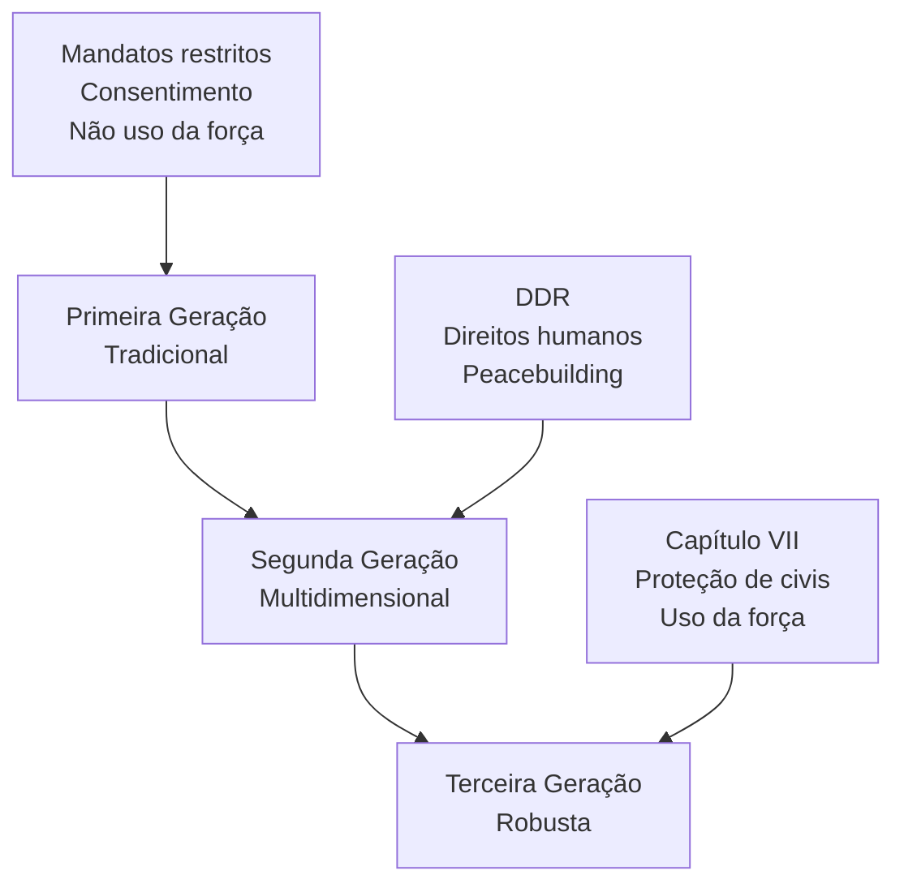

# Operações de Paz da ONU: Evolução, Princípios, Desafios e a Atuação do Brasil

## 1. Introdução

As Operações de Manutenção da Paz das Nações Unidas (OMP) figuram entre os instrumentos mais emblemáticos e dinâmicos do sistema internacional para a promoção e manutenção da paz e segurança globais. Desde sua gênese em 1948, as OMPs evoluíram em escopo, complexidade e ambição, refletindo as transformações da ordem internacional, as mudanças nos padrões de conflito e as expectativas da comunidade global. O Brasil, tradicional defensor do multilateralismo e da solução pacífica de controvérsias, consolidou-se como ator relevante nesse campo, tanto por sua expressiva participação em missões emblemáticas quanto pela formulação de doutrinas próprias, com destaque para a liderança na MINUSTAH (Haiti). Esta nota de estudo oferece uma análise aprofundada dos conceitos, princípios, evolução histórica, desafios contemporâneos e, especialmente, da experiência brasileira nas OMPs, articulando os temas mais prováveis de serem cobrados no CACD e conectando a evolução das operações de paz às transformações da ordem internacional.

## 2. Conceito, Base Jurídica e Princípios Fundamentais das Operações de Paz

> [!definition]  
> **Operações de Paz da ONU** são missões autorizadas pelo Conselho de Segurança (ou, em casos excepcionais, pela Assembleia Geral), compostas por contingentes militares, policiais e civis de diferentes Estados-membros, com o objetivo de apoiar países ou regiões em situações de conflito ou pós-conflito na transição para a paz sustentável. Elas podem envolver desde a observação de cessar-fogo até tarefas complexas de reconstrução institucional, proteção de civis e promoção dos direitos humanos .

A definição das OMPs não está explicitamente prevista na Carta da ONU, mas foi construída a partir da prática institucional e consolidada em documentos doutrinários, como a "Capstone Doctrine" (2008), que orienta o planejamento, a execução e a avaliação dessas operações .

### 2.1 Base Jurídica: Capítulos VI, VII e VIII da Carta da ONU

A base jurídica das OMPs é um dos temas mais debatidos no direito internacional contemporâneo. Embora a Carta da ONU não mencione expressamente o termo "peacekeeping", a legalidade e legitimidade dessas operações derivam de uma interpretação combinada de três capítulos fundamentais:

- **Capítulo VI:** Trata dos mecanismos de solução pacífica de disputas, como negociação, mediação, arbitragem e outros meios diplomáticos. As OMPs tradicionais, especialmente aquelas estabelecidas durante a Guerra Fria, são frequentemente associadas a este capítulo, pois pressupõem o consentimento das partes envolvidas e a não utilização da força, exceto em legítima defesa .
- **Capítulo VII:** Confere ao Conselho de Segurança poderes para adotar medidas coercitivas, inclusive o uso da força, quando identifica ameaças à paz, quebras da paz ou atos de agressão. A partir dos anos 1990, o Conselho passou a autorizar OMPs com mandatos "robustos", permitindo o uso da força para proteger civis e garantir a implementação do mandato, mesmo sem o consentimento pleno de todas as partes .
- **Capítulo VIII:** Reconhece o papel de organizações regionais na manutenção da paz e segurança, desde que suas ações estejam em conformidade com os propósitos e princípios da ONU e sejam autorizadas pelo Conselho de Segurança. Isso permite a cooperação entre a ONU e entidades como a União Africana, a União Europeia e a OTAN em operações conjuntas ou complementares .

> [!note]  
> **Resumo da Base Jurídica:** As OMPs são legitimadas por resoluções do Conselho de Segurança, fundamentadas nos Capítulos VI (solução pacífica), VII (medidas coercitivas) e VIII (cooperação regional) da Carta da ONU. A prática consolidou o entendimento de que a legalidade das OMPs decorre da combinação desses dispositivos, mesmo que o termo "peacekeeping" não esteja explicitamente previsto .

### 2.2 Princípios Fundamentais das Operações de Paz

A doutrina das OMPs é estruturada em torno de três princípios clássicos, conhecidos como a "tríade sagrada" do peacekeeping:

1. **Consentimento das Partes:** O consentimento das principais partes do conflito, especialmente do Estado anfitrião, é considerado condição sine qua non para o estabelecimento e a operação de uma OMP. Esse princípio garante legitimidade política e operacional, permitindo que a missão atue como facilitadora do processo de paz, sem ser percebida como força de ocupação ou parte do conflito .

2. **Imparcialidade:** A imparcialidade exige que as OMPs atuem sem favorecer qualquer parte do conflito, mantendo equidistância e credibilidade. No entanto, imparcialidade não significa neutralidade absoluta: a missão deve agir de acordo com o mandato e os princípios da ONU, não podendo ser conivente com violações de direitos humanos ou sabotagem do processo de paz .

3. **Não Uso da Força, Exceto em Legítima Defesa ou Defesa do Mandato:** Tradicionalmente, as OMPs são desprovidas de mandato para o uso da força, exceto em situações de legítima defesa dos próprios contingentes ou para proteger o mandato, especialmente a proteção de civis. A partir dos anos 1990, o conceito foi ampliado para incluir a defesa do mandato, permitindo o uso da força em situações de ameaça iminente a civis ou à ordem pública, desde que autorizado pelo Conselho de Segurança .

> [!note]  
> O uso da força deve ser sempre proporcional, calibrado e considerado como último recurso, pois pode ter implicações políticas graves e afetar a percepção de imparcialidade da missão .

A observância dos três princípios é vista como condição para a classificação de uma missão como "peacekeeping" (Capítulo VI ou "Capítulo VI e meio", na expressão de Dag Hammarskjöld). Quando o Conselho de Segurança autoriza o uso da força sem consentimento das partes, a missão é classificada como "peace enforcement" (imposição da paz), sob o Capítulo VII, e não mais como peacekeeping tradicional .

> [!example]  
> **MINUSTAH (Haiti, 2004-2017):** Embora estabelecida sob o Capítulo VII, a MINUSTAH buscou manter o consentimento do governo haitiano e atuar de forma imparcial, mas enfrentou desafios significativos para equilibrar o uso da força e a manutenção da legitimidade .

## 3. Evolução Histórica e as "Gerações" de Operações de Paz

A trajetória das OMPs pode ser dividida em três grandes "gerações", cada uma marcada por mudanças no contexto internacional, nos tipos de conflito e nas expectativas em relação ao papel das Nações Unidas .

### 3.1 Primeira Geração: Operações Tradicionais (1948–final da Guerra Fria)

As primeiras OMPs surgiram no contexto da Guerra Fria, com mandatos restritos à observação e monitoramento de cessar-fogos entre Estados, geralmente após conflitos interestatais. Exemplos clássicos incluem a UNEF I (Força de Emergência das Nações Unidas, Suez, 1956) e a UNTSO (Organização das Nações Unidas para Supervisão da Trégua, Palestina, 1948). Essas missões eram caracterizadas por:

- Mandatos limitados e não intrusivos.
- Desdobramento apenas com o consentimento explícito das partes.
- Não uso da força, exceto em autodefesa.
- Foco em conflitos interestatais, com pouca ou nenhuma interferência em assuntos internos dos Estados .

### 3.2 Segunda Geração: Operações Multidimensionais (Pós-Guerra Fria)

O fim da Guerra Fria trouxe uma explosão de conflitos intraestatais (guerras civis, colapso de Estados, crises humanitárias), exigindo mandatos mais complexos. As OMPs passaram a incorporar tarefas de *peacebuilding*, como desarmamento, desmobilização e reintegração (DDR), assistência humanitária, monitoramento eleitoral, reforma do setor de segurança e promoção dos direitos humanos. Exemplos emblemáticos incluem a ONUMOZ (Moçambique, 1992-1994) e a UNAVEM III (Angola, 1995-1997) .

O relatório "Agenda para a Paz" (Boutros-Ghali, 1992) foi fundamental ao expandir o conceito de manutenção da paz para incluir prevenção de conflitos, *peacemaking* e *peacebuilding*, reconhecendo a interdependência entre segurança e desenvolvimento .

### 3.3 Terceira Geração: Operações Robustas / Imposição da Paz (Anos 2000 em diante)

A partir dos anos 2000, diante de falhas em proteger civis (como em Ruanda e Srebrenica), as OMPs passaram a receber mandatos sob o Capítulo VII, autorizando o uso da força para proteger civis e garantir a implementação do mandato, mesmo sem o consentimento pleno de todas as partes. São as chamadas operações "robustas" ou de "imposição da paz" (*peace enforcement*), como a MONUSCO (República Democrática do Congo) e a MINUSMA (Mali) .

O Relatório Brahimi (2000) consolidou essa evolução, recomendando mandatos claros, recursos adequados, regras de engajamento robustas e integração entre componentes militares, policiais e civis .




### 3.4 Impacto dos Relatórios "Agenda para a Paz" e Brahimi

- **Agenda para a Paz (1992):** Propôs uma abordagem integrada para a paz, articulando diplomacia preventiva, pacificação, manutenção da paz e construção da paz. Destacou a necessidade de mandatos claros, recursos adequados e integração com organizações regionais .
- **Relatório Brahimi (2000):** Recomendou mandatos claros, credíveis e alcançáveis, com recursos compatíveis, capacidade de rápida mobilização, regras de engajamento robustas e integração entre componentes civis, policiais e militares. Destacou a importância do envolvimento dos países contribuintes de tropas nas decisões e da necessidade de financiamento estável e previsível para as operações .

> [!note]  
> **Contribuições dos Relatórios:**  
> - Expansão do escopo das OMPs para além da separação de forças, incluindo tarefas políticas, humanitárias e de reconstrução.
> - Introdução do conceito de peacebuilding como ação estruturante para evitar recaídas em conflito.
> - Consolidação da "terceira geração" de OMPs, com mandatos sob o Capítulo VII e uso proativo da força .

### Primeira Geração - Peacekeeping Tradicional (1948-1988)

**Características fundamentais:**

- **Princípio da Trindade Sagrada**: consentimento das partes, imparcialidade e uso mínimo da força (apenas em legítima defesa)
- **Mandato restrito**: separar beligerantes e monitorar cessar-fogo
- **Base legal**: Capítulo VI da Carta da ONU (solução pacífica de controvérsias)

**Exemplos clássicos:** UNEF I (Suez, 1956), UNFICYP (Chipre, 1964)

## **Segunda Geração - Peacekeeping Multidimensional (1989-1999)**

**Contexto:** Fim da Guerra Fria permitiu maior consenso no Conselho de Segurança

**Expansão do mandato:**

- **DDR**: Desarmamento, Desmobilização e Reintegração de combatentes
- **Peacebuilding**: reconstrução institucional, eleições, Estado de Direito
- **Proteção de direitos humanos** e assistência humanitária
- **Componente civil** massivo (administradores, juízes, policiais)

**Exemplos:** UNTAC (Camboja, 1992-1993), ONUMOZ (Moçambique, 1992-1994)

## **Terceira Geração - Peacekeeping Robusto (2000-presente)**

**Marco conceitual:** Relatório Brahimi (2000) e Doutrina da Responsabilidade de Proteger

**Características distintivas:**

- **Mandatos sob Capítulo VII**: autorização para uso da força além da legítima defesa
- **Proteção de civis** como prioridade absoluta
- **Imposição da paz** mesmo sem consentimento pleno das partes
- **Neutralidade ativa**: parcialidade em favor dos princípios da Carta da ONU

**Exemplos:** MONUSCO (RD Congo), MINUSMA (Mali), UNMISS (Sudão do Sul)
## 4. A Atuação do Brasil nas Operações de Paz da ONU

### 4.1 Histórico de Participação e Motivação

O Brasil é um dos países fundadores da ONU e tradicional defensor do multilateralismo e da solução pacífica de controvérsias. Desde 1947, o país já participou de mais de 50 operações de paz, tendo contribuído com mais de 55 mil militares, policiais e civis ao longo de sete décadas . A participação brasileira é orientada por princípios constitucionais e de política externa, como a não intervenção, a defesa da paz, a solução pacífica de controvérsias e o respeito aos direitos humanos.

O Brasil prioriza missões em países com laços históricos e culturais, como Angola, Moçambique, Timor-Leste, Haiti e Líbano, mas também tem atuado em contextos diversos, como o Oriente Médio e a África Central .

<!DOCTYPE html>
<html lang="pt-BR">
<head>
    <meta charset="UTF-8">
    <meta name="viewport" content="width=device-width, initial-scale=1.0">
    <title>Participação Brasileira em Operações de Paz da ONU</title>
    <script src="https://cdnjs.cloudflare.com/ajax/libs/Chart.js/3.9.1/chart.min.js"></script>
    <style>
        body {
            font-family: -apple-system, BlinkMacSystemFont, 'Segoe UI', Roboto, sans-serif;
            background: linear-gradient(135deg, #667eea 0%, #764ba2 100%);
            margin: 0;
            padding: 20px;
            min-height: 100vh;
        }
        .container {
            max-width: 1200px;
            margin: 0 auto;
            background: white;
            border-radius: 15px;
            box-shadow: 0 20px 40px rgba(0,0,0,0.1);
            overflow: hidden;
        }
        .header {
            background: linear-gradient(135deg, #1e3c72 0%, #2a5298 100%);
            color: white;
            padding: 30px;
            text-align: center;
        }
        .header h1 {
            margin: 0;
            font-size: 2.2em;
            font-weight: 300;
        }
        .subtitle {
            margin-top: 10px;
            opacity: 0.9;
            font-size: 1.1em;
        }
        .chart-container {
            padding: 40px;
            position: relative;
            height: 500px;
        }
        .stats-grid {
            display: grid;
            grid-template-columns: repeat(auto-fit, minmax(200px, 1fr));
            gap: 20px;
            padding: 20px 40px;
            background: #f8fafc;
        }
        .stat-card {
            background: white;
            padding: 20px;
            border-radius: 10px;
            text-align: center;
            box-shadow: 0 4px 6px rgba(0,0,0,0.05);
            border-left: 4px solid #3b82f6;
        }
        .stat-number {
            font-size: 2em;
            font-weight: bold;
            color: #1e40af;
            margin-bottom: 5px;
        }
        .stat-label {
            color: #64748b;
            font-size: 0.9em;
            text-transform: uppercase;
            letter-spacing: 0.5px;
        }
        .analysis {
            padding: 40px;
            background: #fafbfc;
        }
        .analysis h2 {
            color: #1e40af;
            margin-bottom: 20px;
            border-bottom: 2px solid #e2e8f0;
            padding-bottom: 10px;
        }
        .key-points {
            display: grid;
            grid-template-columns: repeat(auto-fit, minmax(300px, 1fr));
            gap: 20px;
            margin-top: 20px;
        }
        .point-card {
            background: white;
            padding: 20px;
            border-radius: 8px;
            border-left: 4px solid #10b981;
        }
        .point-title {
            font-weight: bold;
            color: #065f46;
            margin-bottom: 8px;
        }
        .legend {
            margin-top: 20px;
            font-size: 0.9em;
            color: #64748b;
            text-align: center;
        }
    </style>
</head>
<body>
    <div class="container">
        <div class="header">
            <h1>🇧🇷 Participação Brasileira em Operações de Paz da ONU</h1>
            <div class="subtitle">Análise para o CACD - Dados históricos de contribuições</div>
        </div>

        <div class="stats-grid">
            <div class="stat-card">
                <div class="stat-number">52,228</div>
                <div class="stat-label">Total de Pessoal Enviado</div>
            </div>
            <div class="stat-card">
                <div class="stat-number">7</div>
                <div class="stat-label">Missões Principais</div>
            </div>
            <div class="stat-card">
                <div class="stat-number">67</div>
                <div class="stat-label">Anos de Participação</div>
            </div>
            <div class="stat-card">
                <div class="stat-number">11</div>
                <div class="stat-label">Missões Atuais (2024)</div>
            </div>
        </div>

        <div class="chart-container">
            <canvas id="peacekeepingChart"></canvas>
        </div>

        <div class="analysis">
            <h2>📊 Análise Estratégica para o CACD</h2>
            
            <div class="key-points">
                <div class="point-card">
                    <div class="point-title">MINUSTAH: Marco Histórico</div>
                    <div>36.407 militares (2004-2017). Brasil liderou a componente militar, demonstrando capacidade de liderança regional e compromisso com estabilização no Haiti.</div>
                </div>
                
                <div class="point-card">
                    <div class="point-title">Diplomacia Naval</div>
                    <div>UNIFIL Maritime (2011-2020): 4.292 militares. Brasil comandou força-tarefa marítima no Líbano, projetando poder naval e expertise em operações marítimas.</div>
                </div>
                
                <div class="point-card">
                    <div class="point-title">Pioneirismo Histórico</div>
                    <div>UNEF I (1957): Primeira participação brasileira em peacekeeping. 6.300 militares no Batalhão Suez, estabelecendo tradição de contribuição para paz mundial.</div>
                </div>
                
                <div class="point-card">
                    <div class="point-title">Expertise Continental</div>
                    <div>UNAVEM III (Angola) e ONUMOZ (Moçambique): Total de 4.468 militares, demonstrando especialização em contextos lusófonos africanos.</div>
                </div>
            </div>
            
            <div class="legend">
                <strong>Relevância para o CACD:</strong> A participação brasileira em peacekeeping reflete os princípios da Política Externa Brasileira: multilateralismo, solução pacífica de controvérsias e diplomacia para a paz. Evidencia o soft power brasileiro e a capacidade de liderança em questões de segurança internacional.
            </div>
        </div>
    </div>

    <script>
        const ctx = document.getElementById('peacekeepingChart').getContext('2d');
        
        const data = {
            labels: ['MINUSTAH\n(Haiti)', 'UNEF I\n(Suez)', 'UNIFIL\n(Líbano)', 'UNAVEM III\n(Angola)', 'ONUC\n(Congo)', 'ONUMOZ\n(Moçambique)', 'Atuais\n(11 missões)'],
            datasets: [{
                label: 'Pessoal Brasileiro Enviado',
                data: [36407, 6300, 4292, 4205, 179, 263, 80],
                backgroundColor: [
                    'rgba(59, 130, 246, 0.8)',
                    'rgba(16, 185, 129, 0.8)',
                    'rgba(245, 158, 11, 0.8)',
                    'rgba(239, 68, 68, 0.8)',
                    'rgba(139, 92, 246, 0.8)',
                    'rgba(236, 72, 153, 0.8)',
                    'rgba(34, 197, 94, 0.8)'
                ],
                borderColor: [
                    'rgba(59, 130, 246, 1)',
                    'rgba(16, 185, 129, 1)',
                    'rgba(245, 158, 11, 1)',
                    'rgba(239, 68, 68, 1)',
                    'rgba(139, 92, 246, 1)',
                    'rgba(236, 72, 153, 1)',
                    'rgba(34, 197, 94, 1)'
                ],
                borderWidth: 2,
                borderRadius: 8,
                borderSkipped: false,
            }]
        };

        const config = {
            type: 'bar',
            data: data,
            options: {
                responsive: true,
                maintainAspectRatio: false,
                plugins: {
                    legend: {
                        display: false
                    },
                    tooltip: {
                        backgroundColor: 'rgba(0, 0, 0, 0.8)',
                        titleColor: 'white',
                        bodyColor: 'white',
                        borderColor: 'rgba(255, 255, 255, 0.2)',
                        borderWidth: 1,
                        cornerRadius: 8,
                        callbacks: {
                            afterLabel: function(context) {
                                const missions = [
                                    '🇭🇹 Liderança militar (2004-2017)',
                                    '🇪🇬 Batalhão Suez (1957)',
                                    '🇱🇧 Comando marítimo (2011-2020)',
                                    '🇦🇴 Apoio pós-guerra civil (1996)',
                                    '🇨🇩 Suporte aéreo (1960)',
                                    '🇲🇿 Observadores militares (1993)',
                                    '🌍 Diversas operações ativas'
                                ];
                                return missions[context.dataIndex];
                            }
                        }
                    }
                },
                scales: {
                    y: {
                        beginAtZero: true,
                        ticks: {
                            callback: function(value) {
                                return value.toLocaleString('pt-BR');
                            }
                        },
                        grid: {
                            color: 'rgba(0, 0, 0, 0.05)'
                        }
                    },
                    x: {
                        grid: {
                            display: false
                        },
                        ticks: {
                            maxRotation: 0,
                            font: {
                                size: 11
                            }
                        }
                    }
                },
                animation: {
                    duration: 1500,
                    easing: 'easeOutQuart'
                }
            }
        };

        new Chart(ctx, config);
    </script>
</body>
</html>

### 4.2 Participações Emblemáticas

> [!example]  
> **Missões-Chave do Brasil**
> - **UNEF I (Suez, 1956):** Primeira participação relevante, com papel fundamental na supervisão do cessar-fogo e retirada de tropas estrangeiras do Egito.
> - **ONUMOZ (Moçambique, 1992-1994):** Apoio ao processo de paz e reconstrução pós-guerra civil em país lusófono.
> - **UNAVEM III (Angola, 1995-1997):** Participação significativa no apoio à paz e reconciliação nacional, com o batalhão brasileiro (BRABAT) desempenhando papel central.
> - **MINUSTAH (Haiti, 2004-2017):** Caso paradigmático de liderança militar e engajamento multidimensional, detalhado a seguir .

### 4.3 MINUSTAH (Haiti, 2004-2017): Análise Aprofundada

A Missão das Nações Unidas para a Estabilização do Haiti (MINUSTAH) representa o maior e mais duradouro envolvimento do Brasil em OMPs, com profundas implicações para as Forças Armadas e a política externa brasileira .

#### Objetivos e Mandato

A MINUSTAH foi criada em 2004, após a queda do presidente Jean-Bertrand Aristide, com o objetivo de restaurar a ordem, apoiar o processo político, proteger civis, promover direitos humanos e contribuir para a reconstrução institucional do Haiti. O Brasil assumiu o comando militar da missão desde o início, liderando o maior contingente de tropas e exercendo papel de referência para outros países latino-americanos .

#### Desafios Enfrentados

A missão enfrentou desafios complexos, como a violência de gangues armadas, instabilidade política crônica, desastres naturais (notadamente o terremoto de 2010), pobreza extrema e fragilidade institucional. O ambiente operacional exigiu adaptação doutrinária, integração entre componentes militares e civis, e sensibilidade cultural .

#### Resultados e Legado

O Brasil destacou-se pela implementação de projetos de impacto rápido (*Quick Impact Projects*), combinando ações de segurança com iniciativas de desenvolvimento comunitário, como reconstrução de escolas, postos de saúde e infraestrutura básica. O país também promoveu a participação de outros Estados do Sul Global, consolidando uma abordagem de cooperação horizontal e solidariedade
No entanto, a missão também foi alvo de críticas, incluindo alegações de uso excessivo da força, limitações na promoção de processos políticos inclusivos e denúncias de má conduta por parte de alguns contingentes.

O legado da MINUSTAH para o Brasil inclui:

- Fortalecimento da capacidade expedicionária das Forças Armadas.
- Consolidação de uma doutrina própria de atuação em OMPs, enfatizando a conexão entre segurança e desenvolvimento.
- Projeção internacional do Brasil como ator responsável e comprometido com a paz.
- Reflexão crítica sobre os limites e dilemas da intervenção internacional, especialmente em contextos de fragilidade estatal e pobreza extrema.

> [!important]  
> **Lições da MINUSTAH**
> - A experiência no Haiti consolidou a doutrina brasileira de que a paz sustentável depende da integração entre segurança, desenvolvimento e inclusão social.
> - O comando da missão projetou o Brasil como líder regional e global em operações de paz, mas também expôs desafios de coordenação civil-militar e de adaptação a cenários de alta complexidade### Legado para as Forças Armadas e a Política Externa Brasileira

O legado da MINUSTAH para o Brasil é multifacetado:

- **Aprimoramento Operacional:** As Forças Armadas adquiriram expertise em operações multinacionais, logística, coordenação civil-militar e resposta a crises humanitárias, elevando o padrão de profissionalismo e a capacidade de projeção internacional.
- **Influência Doutrinária Interna:** Métodos e protocolos testados no Haiti foram adaptados para operações de pacificação em favelas do Rio de Janeiro, influenciando o debate sobre o papel das Forças Armadas na segurança pública interna.
- **Projeção Internacional:** O Brasil consolidou-se como referência em peacekeeping, ampliando sua interface com a ONU, promovendo cooperação Sul-Sul e participando ativamente de debates sobre reforma das OMPs e proteção de civis.
- **Desafios e Críticas:** O envolvimento em missões robustas gerou debates sobre os limites da intervenção, a tensão entre soberania e proteção de civis, e a necessidade de alinhar a atuação externa com os princípios constitucionais de não intervenção e defesa da paz
> [!note]  
> **A "Responsabilidade ao Proteger" (RwP)**
> O Brasil propôs, no contexto da MINUSTAH e do debate sobre a "Responsabilidade de Proteger" (R2P), o conceito de "Responsabilidade ao Proteger" (RwP), defendendo critérios claros, monitoramento e accountability em intervenções autorizadas pela ONU, buscando equilibrar proteção de civis e respeito à soberania## 4.4 Doutrina Brasileira de Atuação em OMPs

A atuação do Brasil em OMPs é marcada por uma doutrina que valoriza:

- A interdependência entre segurança e desenvolvimento, defendendo que a paz só é sustentável quando acompanhada de inclusão social, fortalecimento institucional e promoção dos direitos humanos.
- O respeito aos princípios tradicionais das OMPs (consentimento, imparcialidade, uso restrito da força), com ênfase na prevenção de conflitos e na solução pacífica de controvérsias.
- A defesa de mandatos claros, realistas e compatíveis com os recursos disponíveis, evitando a "inflacionamento" de expectativas e a sobrecarga das missões.
- A promoção da participação de países do Sul Global e a valorização da cooperação Sul-Sul.
- O compromisso com a agenda "Mulheres, Paz e Segurança", buscando ampliar a participação feminina em missões e combater a violência de gênero.

### 4.5 Situação Atual da Contribuição Brasileira

Após o encerramento da MINUSTAH em 2017, a participação brasileira em OMPs sofreu acentuada redução. Em 2011, o Brasil chegou a ter cerca de 2.500 militares em missões da ONU; em 2024, esse número caiu para cerca de 80 militares e civis, refletindo uma tendência de retração e cautela
Atualmente, o Brasil mantém presença em missões como MONUSCO (República Democrática do Congo, onde fornece o Force Commander), MINURSO (Saara Ocidental), UNIFIL (Líbano), MINUSCA (República Centro-Africana), UNFICYP (Chipre), entre outras. O perfil da participação é predominantemente de observadores militares, oficiais de Estado-Maior e pequenos contingentes, sem grandes destacamentos de tropas.

Em termos de política, o Brasil segue defendendo o fortalecimento do multilateralismo, a centralidade do Conselho de Segurança e a necessidade de reformas para tornar as OMPs mais eficazes, transparentes e representativas# 5. Desafios Contemporâneos das Operações de Paz

As OMPs enfrentam desafios crescentes, decorrentes da complexidade dos conflitos atuais e das limitações institucionais e políticas da ONU## 5.1 Complexidade dos Conflitos Atuais

Os conflitos contemporâneos envolvem múltiplos atores (grupos armados não estatais, terroristas, milícias), fronteiras difusas entre guerra e criminalidade, e ameaças assimétricas, dificultando a aplicação dos princípios tradicionais das OMPs. A proteção de civis tornou-se central, exigindo mandatos robustos e regras de engajamento flexíveis, mas também aumentando o risco de envolvimento em hostilidades e de violações de direitos.

### 5.2 Financiamento, Recursos e Segurança

A obtenção de tropas, equipamentos e financiamento adequado é um desafio persistente. Muitos países desenvolvidos preferem contribuir financeiramente, enquanto países do Sul Global fornecem a maior parte dos contingentes. A segurança dos "capacetes-azuis" é uma preocupação crescente, com aumento de ataques, emboscadas e uso de artefatos explosivos improvisados

### 5.3 Conduta, Disciplina e Abusos

Casos de exploração e abuso sexual, corrupção e má conduta por parte de alguns contingentes minam a legitimidade das OMPs. A ONU tem implementado políticas de "tolerância zero" e mecanismos de responsabilização, mas desafios persistem, especialmente em contextos de impunidade e fragilidade institucional.

```charts
{"id":"a/e56fdd36-2bf0-4300-ad8f-3a92f5bfadd5","columns":["Year","Number of Allegations","Key UN Response Initiatives"],"data_table":[[2016,165,"Mandatory online training launched; Special Coordinator appointed"],[2017,138,"Victims' Rights Advocate appointed; High-level task force created; Zero-tolerance policy reinforced"]],"provenance":{"1":"https://home.crin.org/un-peacekeepers-timeline"},"title":"Trends and Responses to Sexual Exploitation and Abuse by UN Peacekeepers (2014-2019)","description":"This chart shows the number of allegations of sexual exploitation and abuse by UN peacekeepers over time and highlights key UN response initiatives to address conduct and discipline issues.","chart_view":{"chart_type":"bar_chart","x":"Year","y":"Number of Allegations","hue":null}}
```

### 5.4 Relação com a "Responsabilidade de Proteger" (R2P) e Dilemas da Intervenção

A doutrina da "Responsabilidade de Proteger" (R2P), adotada em 2005, ampliou o debate sobre o papel das OMPs na proteção de populações contra genocídio, crimes de guerra, limpeza étnica e crimes contra a humanidade. No entanto, a aplicação da R2P enfrenta dilemas de soberania, seletividade e instrumentalização política, exigindo equilíbrio entre intervenção legítima e respeito à autodeterminação dos povos 

[!important]  
> **Dilemas Atuais das OMPs**
> - Como proteger civis sem violar a soberania dos Estados?
> - Como garantir recursos e legitimidade em um contexto de crescente competição geopolítica?
> - Como adaptar mandatos e doutrinas a cenários de conflito híbrido e ameaças transnacionais?

## 6. Conclusão

As Operações de Paz da ONU permanecem como instrumento central, porém em constante transformação, da agenda internacional de paz e segurança. Sua evolução reflete as mudanças do sistema internacional, os avanços e limitações do multilateralismo e as tensões entre soberania, intervenção e proteção de direitos. O Brasil, ao longo de sua trajetória, consolidou-se como ator relevante, combinando participação efetiva, liderança regional e contribuição doutrinária, especialmente ao enfatizar a conexão entre segurança e desenvolvimento. A experiência na MINUSTAH ilustra tanto o potencial quanto os desafios das OMPs, servindo de referência para debates futuros sobre o papel do Brasil e da ONU na promoção de uma paz sustentável e inclusiva. Os desafios contemporâneos — desde a adaptação a novos tipos de conflito até a necessidade de reformas institucionais e aprimoramento dos mecanismos de proteção de civis — exigem respostas criativas, coordenação internacional e compromisso com os valores fundadores da ONU. A experiência brasileira, marcada pela busca de legitimidade, integração entre segurança e desenvolvimento e valorização do multilateralismo, oferece lições relevantes para o futuro das operações de paz e para a agenda internacional de paz e segurança.

## 7. Questões para Autoavaliação (Active Recall)

> [!question]  
> 1. Quais são os três princípios fundamentais das Operações de Paz da ONU e como eles foram reinterpretados ao longo das diferentes "gerações" de OMPs?
> 2. Analise criticamente a experiência brasileira na MINUSTAH, destacando os principais desafios, resultados e lições para a política externa e as Forças Armadas do Brasil.
> 3. Quais são os principais desafios contemporâneos enfrentados pelas Operações de Paz da ONU e como o Brasil tem se posicionado em relação a esses desafios?

> [!note]  
> Recomenda-se complementar este material com leituras acadêmicas e dados atualizados da ONU, do Ministério daplos e debates.
![[Operações de Paz da ONU_ Evolução, Princípios, Desafios e a Atuação do Brasil.pdf]]
