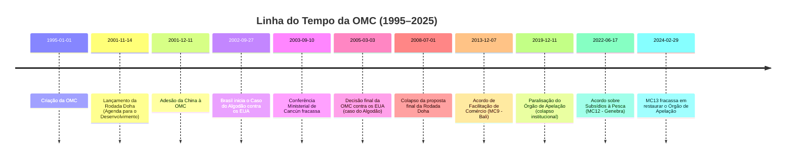
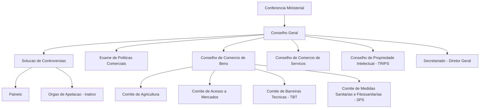

# A Organização Mundial do Comércio (OMC) e a Crise da Governança do Comércio Global

## Criação da OMC (1995) e o “Otimismo Liberal” do Pós-Guerra Fria

A criação da OMC em 1995 representou o auge de um projeto de aprofundamento da governança econômica **multilateral**, emergindo no contexto de euforia pós-Guerra Fria. Como sucessora institucional do GATT (1947), a OMC nasceu com a missão de promover o livre comércio sob regras quase universais e mecanismos vinculantes de resolução de disputas. Esse salto institucional – incluindo novas áreas como serviços, propriedade intelectual e um órgão de solução de controvérsias com poder efetivo – **refletiu o otimismo liberal do período**, marcado pela crença de que a expansão da globalização e das normas neoliberais traria prosperidade e estabilidade internacional. Analistas notam que a criação da OMC foi vista como _“um grande passo na institucionalização da governança do comércio global, refletindo o otimismo do pós-Guerra Fria e o triunfo de princípios econômicos neoliberais”_. Em outras palavras, no clima de “fim da História” dos anos 1990, pressupunha-se que **regras multilaterais fortes** e a adesão de praticamente todas as grandes economias (incluindo novos membros como China a partir de 2001) consolidariam um sistema de comércio aberto, previsível e benéfico a todos.

> [!note] **O papel dos EUA na ordem liberal comercial** 
> Como potência hegemônica vitoriosa da Guerra Fria, os EUA lideraram a conclusão da Rodada Uruguai que criou a OMC e, num ato de _“autolimitação estratégica”_ segundo John Ikenberry, **vincularam-se voluntariamente** a novas regras e instituições. A OMC tornou-se assim símbolo da combinação entre o poder contínuo dos EUA e sua disposição (na época) de se submeter a regras comuns – uma manifestação do multilateralismo liberal de então. Sem a liderança dos EUA a OMC não teria se materializado, mas _“a organização também não existiria sem os esforços cooperativos de potências médias e, em especial, da grande potência da UE”_, indicando um esforço coletivo no auge do globalismo dos anos 90.

## As Funções Políticas da OMC

### A Rodada de Doha para o Desenvolvimento: impasse e conflito Norte–Sul

Lançada em 2001, semanas após os atentados de 11 de setembro, a **Rodada Doha** foi anunciada como _“Agenda de Desenvolvimento”_, prometendo corrigir assimetrias anteriores e colocar os interesses dos países em desenvolvimento no centro das negociações. Porém, mais de vinte anos depois, Doha se tornou sinônimo de impasse. Diferentemente de rodadas anteriores, o que travou não foram apenas detalhes técnicos, mas sim um **choque político estrutural entre Norte e Sul** dentro da OMC. De um lado, Estados Unidos, União Europeia e outros desenvolvidos resistiram a abrir mão de subsídios agrícolas e demandaram incluir novas pautas (os _Singapore issues_: investimento, concorrência, compras governamentais e facilitação de comércio). De outro, países em desenvolvimento – fortalecidos pela maior voz de emergentes como Brasil, Índia, China e pela formação de alianças Sul-Sul – exigiam que a rodada tratasse prioritariamente de agricultura e desenvolvimento, com reduções substanciais do protecionismo agrícola do Norte e espaço para políticas industriais domésticas no Sul.

> [!important] **Conflito Norte–Sul na Rodada Doha** 
> Mais do que divergências técnicas, o fracasso de Doha refletiu profundas discordâncias políticas. Países desenvolvidos **tentaram impor propostas insuficientes** em temas centrais (especialmente agricultura), enquanto países em desenvolvimento se recusaram a aceitar um acordo desequilibrado. A **Conferência de Cancún (2003)** colapsou quando uma coalizão de emergentes rechaçou uma oferta UE–EUA que não atendia seus **interesses mínimos** em acesso a mercados agrícolas. Essa derrota do Norte foi celebrada como vitória política do Sul, evidenciando a mudança no _power politics_ comercial após a criação do G-20 comercial liderado pelo Brasil. Desde então, a rodada entrou num ciclo de colapsos e retomadas sem sucesso. Em 2008, mesmo após árduos avanços técnicos em cortes tarifários agrícolas e industriais, **novos impasses políticos** (e.g. discordância entre EUA e Índia sobre salvaguardas especiais a agricultores) levaram ao colapso final das negociações. Os EUA declararam Doha “morta” em 2015, formalizando o malogro daquela que seria a rodada do desenvolvimento.

Em suma, o impasse de Doha revelou a dificuldade de conciliar visões distintas sobre o papel do comércio no desenvolvimento. Para os países desenvolvidos, tratava-se de abrir mercados emergentes e consolidar disciplinas em novas áreas; para o mundo em desenvolvimento, era inaceitável prosseguir a liberalização sem corrigir distorções históricas (sobretudo os **subsídios agrícolas e barreiras** que prejudicam suas exportações) e sem garantir tratamento especial e diferenciado. A OMC, que no fim dos anos 90 parecia uma arena de **consenso pró-liberalização**, transformou-se em palco de embates distributivos entre Norte e Sul. O fracasso prolongado da Rodada Doha contribuiu para enfraquecer a credibilidade negociadora da OMC e marcou o fim do _“otimismo liberal”_ irrestrito que cercou sua criação.

### O Sistema de Solução de Controvérsias como arena de poder

A função de **solução de controvérsias** da OMC – frequentemente chamada de “jóia da coroa” do sistema multilateral de comércio – elevou a Organização a uma arena quasi-judicial onde até países menos poderosos puderam enfrentar, com certo sucesso, grandes potências em disputas comerciais. Desde 1995, painéis e o Órgão de Apelação (tribunal de segunda instância da OMC) julgaram centenas de casos, garantindo que acordos comerciais não ficassem apenas no papel. Esse sistema, dotado de **caráter vinculante** e possibilidade de retaliação autorizada, permitiu inédita **equidade legal** entre membros: mesmo países em desenvolvimento conseguiram vitórias contra EUA e UE, algo impensável no período do GATT.

Casos emblemáticos ilustram esse empoderamento jurídico. Por exemplo, o Brasil liderou, ao lado de Tailândia e Austrália, a contestação contra os **subsídios ao açúcar** da União Europeia; em 2004, o painel da OMC considerou ilegais os subsídios europeus que levavam o bloco a exportar _quatro vezes acima_ de sua cota permitida. A decisão confirmou que tais práticas deprimiam preços mundiais e prejudicavam produtores no Brasil e em outros países pobres, levando a UE a reformar sua política açucareira. Ainda mais simbólico foi o **Caso do Algodão** (DS267), em que o Brasil processou os EUA por gigantescos subsídios dados aos cotonicultores norte-americanos. Em 2005, o Órgão de Apelação da OMC deu ganho de causa ao Brasil, reconhecendo que os subsídios dos EUA de fato deprimiam os preços internacionais e feriam as regras. Incapaz de politicamente eliminar os subsídios condenados, Washington optou por um acordo inusitado: pagar compensações anuais ao Brasil para continuar subsidiando seus produtores (_settlement_ de 2010). Em 2014, os EUA desembolsaram um último pagamento de **US$300 milhões** para encerrar o litígio, numa solução criticada por mostrar os limites do cumprimento pleno das decisões da OMC. Ainda assim, esses casos demonstraram que mesmo potências teriam de arcar com custos (financeiros ou políticos) ao violar regras – um **divisor de águas** em relação ao frágil mecanismo do GATT.

Outros países em desenvolvimento também usaram o sistema: Índia venceu os EUA em **antidumping de aço**, vários países africanos juntaram-se ao contencioso do algodão do Brasil (_Cotton-4_) para pressionar por justiça, e até pequenas economias (como Antigua e Barbuda contra os EUA em jogo online) obtiveram vitórias simbólicas. O **efeito sistêmico** foi relevante: criou-se uma base jurisprudencial rica e aumentou a confiança de membros de que acordos seriam respeitados. Não à toa, o Órgão de Apelação ganhou reputação de **tribunal internacional de comércio**, garantindo previsibilidade às relações comerciais globais.

Entretanto, o mesmo sucesso do sistema de disputas gerou **resistências políticas crescentes**, especialmente por parte dos Estados Unidos. Washington passou a acusar o Órgão de Apelação de _judicial overreach_ (extrapolação de mandato): alegava que os juízes estariam **“criando novas leis comerciais”** não acordadas pelos membros e interpretando os acordos de forma a limitar excessivamente políticas comerciais domésticas dos países. Várias decisões contra medidas norte-americanas alimentaram esse descontentamento – por exemplo, sucessivas condenações à prática norte-americana de _zeroing_ em antidumping (método de cálculo de margens de dumping). Autoridades dos EUA reclamavam também da demora nas decisões (muitas vezes acima dos 90 dias previstos) e até dos salários dos julgadores. Em essência, setores políticos em Washington viam o sistema da OMC como uma intromissão na **soberania nacional**: _“a Constituição dos EUA não permite que um tribunal estrangeiro substitua um tribunal americano”_, bradava a USTR (Representação Comercial). Esse sentimento anti-OMC intensificou-se sob o governo Trump (2017-2021), embora já estivesse presente no governo Obama. Trump levou a contestação ao extremo, adotando táticas de bloqueio que discutiremos adiante.

Assim, o sistema de solução de controvérsias da OMC transformou-se em um **palco de poder**: ao mesmo tempo em que empoderou países menos desenvolvidos para enfrentar práticas injustas (equilibrando em parte o jogo de forças no comércio global), também colocou em xeque a disposição das grandes potências – principalmente os EUA – de aceitarem decisões desfavoráveis. Esse embate entre a lógica do _rule of law_ comercial e os interesses geopolíticos nacionais explode, de forma mais aguda, na atual crise do Órgão de Apelação.

>[!important]
> A **Conferência Ministerial** (nível mais alto) se reúne a cada dois anos.
   O **Conselho Geral** é o principal órgão decisório no intervalo entre conferências.
  O **Órgão de Solução de Controvérsias** julga disputas e **está paralisado** desde 2019 pela ausência do Órgão de Apelação.
  Os **três conselhos** especializados cuidam dos principais acordos da OMC: Bens, Serviços e TRIPS.
 A **Secretaria**, chefiada pela Diretora-Geral (atualmente Ngozi Okonjo-Iweala), apoia tecnicamente os membros.

### A atuação do Brasil na OMC

O Brasil destaca-se historicamente como um **ator-chave** na OMC, combinando defesa assertiva de seus interesses comerciais com liderança diplomática em coalizões de países em desenvolvimento. Desde os primórdios, o Brasil viu no sistema multilateral de comércio uma oportunidade para **nivelar assimetrias**: por meio de regras estáveis e do Órgão de Solução de Controvérsias, o país poderia enfrentar práticas protecionistas de parceiros maiores e garantir acesso para seu competitivo agronegócio.

Na frente **negociadora**, o Brasil foi protagonista na criação do **G20 Comercial** – grupo formado na Ministerial de Cancún em 2003, reunindo economias em desenvolvimento de peso (como Índia, África do Sul, China, Argentina, etc.) em torno da demanda por cortes efetivos nos subsídios agrícolas de EUA/UE. Essa iniciativa, capitaneada pela diplomacia brasileira (então sob o Chanceler Celso Amorim), _“mudou o power politics das negociações comerciais na OMC”_, criando um contrapeso coletivo ao poder de barganha do Norte. O G20 liderado pelo Brasil teve um papel central de coordenação na rodada Doha, especialmente em agricultura, defendendo posições comuns do mundo em desenvolvimento e forçando EUA/UE a melhores ofertas. Embora Doha tenha emperrado, o surgimento do G20 consolidou o Brasil como **porta-voz** de reivindicações do Sul global no comércio.

No âmbito dos **contenciosos**, o Brasil figura entre os membros mais ativos. O país já foi reclamante em mais de 30 disputas na OMC, muitas de grande impacto. Além dos já mencionados casos do _algodão_ (contra os EUA) e do _açúcar_ (contra a UE), o Brasil contestou barreiras em setores estratégicos como **suco de laranja, carne bovina, frango, aço e biocombustíveis** impostas por diversos parceiros. Em várias ocasiões, obteve vitórias que obrigaram mudanças em políticas estrangeiras ou abriram espaço para exportações brasileiras. Essa atuação contenciosa permitiu, por exemplo, que o Brasil contornasse práticas protecionistas que afetavam seu agronegócio e indústria, consolidando mercados externos. Não por acaso, a paralisação do Órgão de Apelação é vista pelo Brasil com preocupação: _“O país recorre ao órgão em áreas em que é muito competitivo... e tem conseguido decisões favoráveis para contornar o protecionismo de alguns governos”_, apontou a CNI em 2019.

Além disso, o Brasil também assume papel construtivo na formulação de regras. Participou ativamente das negociações que levaram ao **Acordo de Facilitação de Comércio** (concluído em 2013), apoia iniciativas sobre comércio eletrônico e regulação doméstica de serviços, e atualmente integra arranjos plurilaterais como o **MPIA** (Mecanismo de Apelação provisório – discutido a seguir). Cabe notar que um brasileiro, Roberto Azevêdo, foi Diretor-Geral da OMC de 2013 a 2020, refletindo o prestígio diplomático do país na área. Em suma, a **diplomacia comercial brasileira** enxerga a OMC como foro primordial: seja liderando coalizões Sul-Sul, seja litigando para fazer valer direitos, o Brasil busca uma ordem comercial baseada em regras que lhe permita competir de forma mais equitativa. Por isso, os reveses recentes do multilateralismo comercial afetam diretamente seus interesses.

## A Crise do Multilateralismo Comercial

### A Paralisia do Órgão de Apelação: da técnica à geopolítica

O colapso do Órgão de Apelação da OMC, consumado em dezembro de 2019, é o elemento central da atual crise da organização – **um fenômeno político-geopolítico que transcende meras questões jurídicas**. Após anos de queixas, os Estados Unidos sob Donald Trump **bloquearam sistematicamente a nomeação de novos juízes** ao Órgão de Apelação, usando o requisito de consenso para impedir reposições. Com isso, o órgão foi perdendo quórum: de sete juízes previstos, caiu para o mínimo de três e, em 11/12/2019, para apenas _um_ juiz – número insuficiente para analisar recursos, paralisando o mecanismo. Essa situação inédita mergulhou a OMC _“no período mais crítico de seus 24 anos de existência”_, uma **“situação extrema, sem precedentes, que ameaça parte do sistema de governança global construído após a Segunda Guerra”*. Em outras palavras, ao asfixiar o sistema de disputas – pilar que garantia o cumprimento das regras – a crise do Órgão de Apelação questiona a própria autoridade da OMC como árbitro do comércio mundial.

Os **motivos declarados** pelos EUA para tal bloqueio residem nas críticas já mencionadas: Washington acusa o Órgão de Apelação de **exceder suas funções e criar obrigações não acordadas**, especialmente ao reverter vitórias americanas em antidumping e outras áreas. Reclama também que o órgão interpreta indevidamente as exceções de segurança nacional e outras cláusulas, e não respeita prazos. Em um relatório de 2020, o USTR afirmou que o Órgão de Apelação _“se desviou muito de seu papel pretendido... expandindo continuamente o escopo das questões que revisa, alongando o processo e reduzindo a confiança nos resultados”_. Para os EUA, mais de **25% de todas as disputas na OMC visaram leis ou medidas americanas**, o que reforça a percepção de que o sistema passou a _impactar desproporcionalmente_ sua agenda doméstica. Autoridades americanas também se queixam que suas preocupações vinham sendo ignoradas por 20 anos. Assim, ao bloquear juízes, Washington força a reforma do mecanismo nos seus termos.

> [!important] **Por que os EUA travaram o Órgão de Apelação?** 
> A visão em Washington é que o sistema de disputas da OMC passou a **prejudicar seus interesses nacionais**. Os americanos alegam que o Órgão de Apelação _“extrapolou suas funções”_, atuando além do mandato e _“criando novas leis comerciais”_ sem consentimento dos membros. Argumentam também que juízes estrangeiros estariam substituindo tribunais domésticos, ameaçando a **soberania dos EUA** (um ponto sensível na política interna). Além disso, reclamam da morosidade das decisões e discordam de abordagens metodológicas em casos de defesa comercial (por exemplo, contestam como a OMC julga práticas de _dumping_). Em suma, tanto sob Obama quanto, especialmente, sob Trump, os EUA sustentam que o órgão **viola os interesses americanos** (por supostamente favorecer países como a China em disputas) e, por isso, exigem mudanças estruturais antes de reativá-lo.

Vale frisar que **outros membros discordam dessa caracterização**. A UE, o Brasil, o Japão e a maioria defendem que o Órgão de Apelação sempre agiu dentro do mandato, esclarecendo ambiguidades dos acordos e fortalecendo o sistema baseado em regras. Porém, sem poder contornar o veto americano, esses países optaram por criar um arranjo temporário: o **MPIA (Acordo de Arbitragem de Apelação Múltipla)**, em 2020, replicando informalmente o mecanismo apelatório apenas entre os signatários (UE, China, Brasil, Austrália e mais ~20 membros). Embora útil para _“manter a chama acesa”_, o MPIA é limitado – os EUA não participam, nem a Índia – e não possui autoridade formal da OMC. Logo, a solução real passa por trazer Washington de volta ao sistema, conciliando as preocupações levantadas.

Entendida a gênese, nota-se que a **paralisia do Órgão de Apelação é mais sintoma do que causa**: reflete o enfraquecimento do compromisso político com o multilateralismo liberal por parte da potência líder do sistema. Insere-se num contexto mais amplo de **contestação à ordem liberal**: os EUA de Trump adotaram postura abertamente hostil a organismos internacionais (saindo do Acordo de Paris, UNESCO, etc.) e veem vantagem em lidar com disputas comercialmente via poder bruto. _“Os EUA agora preferem usar o jogo de forças em vez de operar sob um sistema baseado em regras”_, resume um economista alemão. Trump deixou claro seu **preferência por acordos bilaterais** onde o peso econômico americano lhe dá vantagem – a OMC, ao contrário, iguala membros pelo direito. Essa mudança de paradigma – da liderança benevolente para o unilateralismo – abalou o pilar central da OMC.

Até o momento (2025), **o impasse persiste**. O governo Biden, embora menos agressivo retoricamente, manteve o bloqueio aos juízes, demandando primeiro reformas que garantam que o Órgão de Apelação “não legisle” e respeite limites. Nas discussões de reforma em Genebra, propostas incluem estabelecer prazos rígidos, restringir precedentes e clarificar certas interpretações – mas ainda não há acordo. Os ministros do Comércio fixaram a meta de restaurar um sistema de solução de controvérsias “completo e funcional” até 2024, porém a Conferência Ministerial de 2024 (MC13, Abu Dhabi) **falhou em chegar a um consenso** sobre o Órgão de Apelação. Com eleições nos EUA e outros países, o tema deve se arrastar. Enquanto isso, **cresce o risco** de países agirem unilateralmente frente a disputas – exatamente o retorno à _lei do mais forte_ que o sistema multilateral buscava evitar. O próprio Roberto Azevêdo alertou que, sem um árbitro confiável, membros podem perder confiança e recorrer ao unilateralismo, aumentando incertezas e minando investimentos. Em síntese, a paralisia do Órgão de Apelação condensa a crise da OMC: um choque entre a lógica jurídica global e os ventos políticos nacionalistas. Sua resolução exigirá não apenas ajustes técnicos, mas **vontade política das grandes potências** para reforçar (ou ao menos tolerar) instituições multilaterais de restrição mútua.

### A competição estratégica EUA–China e o desafio às regras da OMC

Outra dimensão crucial da crise da governança comercial é a **rivalidade entre EUA e China**, as duas maiores potências econômicas, cuja disputa coloca enorme pressão sobre a OMC. Quando a China ingressou na OMC em 2001, esperava-se (no mundo ocidental) que ela gradualmente se tornasse uma economia mais orientada ao mercado e aderente às normas liberais. Passadas duas décadas, essa expectativa não se materializou plenamente – pelo contrário, o modelo econômico chinês **permanece fortemente dirigido pelo Estado**, com alto nível de intervenções, subsídios maciços (frequentemente pouco transparentes), empresas estatais dominantes em setores-chave e práticas industriais consideradas desleais pelos concorrentes (como transferência forçada de tecnologia e restrições a investimentos estrangeiros).

Esse cenário representa um **desafio inédito à OMC**, cujas regras foram desenhadas majoritariamente por e para economias de mercado. Em avaliação recente, o USTR dos EUA classificou a abordagem econômica da China como um _“desafio único, sério e em constante evolução”_ para o sistema de comércio global. O mesmo relatório afirma que a China _“ainda abraça um sistema não de mercado”_, violando ou contornando regras da OMC e frustrando mecanismos de transparência. Em outras palavras, do ponto de vista americano (e de parceiros como UE e Japão), a China **se beneficia do sistema** – acesso a mercados globais – sem cumprir integralmente suas contrapartidas, mantendo práticas mercantilistas que prejudicam empresas e trabalhadores alheios. Exemplos incluem subsídios industriais maciços (em aço, painéis solares, alta tecnologia), metas de conteúdo local (como no programa _Made in China 2025_) e restrições às exportações de matérias-primas. A OMC possui regras sobre subsídios e transparência, mas estas se mostram insuficientes diante da escala e opacidade das políticas chinesas. Além disso, a China tem argumentado ser país em desenvolvimento em certos aspectos, buscando flexibilidades que os EUA contestam dada a dimensão da economia chinesa.

A **disputa comercial aberta entre EUA e China desde 2018** ilustra o impasse. Alegando práticas desleais chinesas (roubo de propriedade intelectual, transferência forçada de tecnologia, subsídios, etc.), o governo Trump impôs tarifas unilaterais sobre aproximadamente US$ 360 bilhões em importações chinesas. Pequim retaliou com tarifas sobre bens americanos. Esse **conflito tarifário bilateral** ignorou solenemente os compromissos da OMC – violou o princípio da não discriminação (tarifas acima das tarifas consolidadas e só contra um país) e apostou na força em vez de recorrer a Genebra. O resultado foi uma _guerra comercial_ que fugiu ao escopo multilateral: os dois países firmaram em 2020 a chamada “Fase 1” de um acordo bilateral, sem envolver a OMC. Embora a OMC tenha posteriormente decidido que as tarifas dos EUA violaram regras, a ausência do Órgão de Apelação impediu solução efetiva – e os EUA criticaram a decisão, reforçando sua posição de que a OMC não sabe lidar com a China.

De fato, muitos argumentam que **as regras da OMC não foram pensadas para disciplinar uma economia do tamanho da chinesa com papel estatal tão grande**. Por exemplo, o Acordo de Subsídios proíbe apenas subsídios explícitos à exportação ou ligados a desempenho exportador – a China contorna isso usando subsídios horizontais, crédito subsidiado via bancos estatais, etc. Regras de propriedade intelectual (TRIPS) não preveem penalidades rápidas para apropriação forçada de tecnologia. A própria definição de “economia de mercado” em antidumping tornou-se disputa: a China pleiteou status de economia de mercado em 2016 (15 anos pós-adesão), mas EUA e UE negaram, mantendo métodos especiais que imputam tarifas antidumping elevadas aos produtos chineses. A OMC não conseguiu arbitrar essa questão até agora.

Assim, a ascensão chinesa **exige atualizações normativas** que a OMC não consegue produzir devido à falta de consenso (muito menos com o clima político atual). Os EUA, a UE e o Japão chegaram a formar um grupo trilateral propondo novas regras sobre subsídios industriais, disciplinando subsídios a SOEs, maior transparência e controle sobre transferência forçada de tecnologia. Porém, tais propostas não avançaram multilateralmente, em parte pela oposição chinesa (e de países em desenvolvimento temerosos de regras muito estritas).

Em âmbito político, a rivalidade EUA–China na OMC se manifesta em trocas de acusações: Washington acusa Pequim de _“mercantilismo predatório”_, enquanto Pequim acusa Washington de minar a OMC para manter sua hegemonia. Essa tensão dificulta acordos em praticamente todos os temas significativos – seja e-commerce, seja reforma do Órgão de Apelação (China e EUA discordam sobre escopo). Ambos os países **priorizam medidas unilaterais** quando convém: além das tarifas, os EUA ampliaram sanções tecnológicas (bloqueio de componentes para Huawei, restrições a exportação de semicondutores), justificadas por segurança nacional fora do âmbito da OMC; a China, por sua vez, restringiu exportações de terras raras no passado (alegando razões ambientais) e em 2023 anunciou controles sobre exportação de metais cruciais, também fora da alçada direta da OMC. Esses movimentos reforçam a percepção de que a **estrutura multilateral de regras está sendo contornada** nas disputas entre grandes potências.

Em suma, a competição EUA–China expôs os **limites da OMC em lidar com desafios do século XXI**. O sistema multilateral de 1995 não antecipou uma potência econômica estatal-capitalista integrada e, agora, está travado pela incapacidade política de atualizar-se. A paz comercial relativa das primeiras décadas da OMC cedeu lugar a conflitos geoeconômicos intensos, onde as grandes potências testam os limites (e brechas) das regras vigentes. Resolver esse dilema é central para o futuro da organização: sem integrar a China de forma equilibrada (ou sem que a China aceite novas disciplinas), e sem que os EUA confiem novamente na OMC como fórum primário, o regime multilateral continuará esvaziado. Por enquanto, prevalece uma espécie de **duelo hegemônico** que a OMC assiste sem poder arbitrar plenamente.

### O ressurgimento do protecionismo e da política industrial

O período recente tem sido marcado por um **retorno de políticas protecionistas e industriais** em diversas partes do mundo – um desenvolvimento que colide com os princípios de liberalização da OMC e aprofunda a crise do multilateralismo comercial. Após a crise financeira de 2008 e, especialmente, na segunda metade da década de 2010, vários países adotaram tarifas e subsídios em magnitude não vista desde os anos 1980. Dados do Global Trade Alert mostram que **o número de medidas comerciais restritivas (tarifas, subsídios, controles de exportação)** mais que dobrou entre 2010 e 2023 (de ~1.576 para ~3.285 medidas por ano). Governos de diferentes matizes passaram a invocar _“soberania econômica”_ e _“interesses nacionais”_ para justificar interferências no livre mercado, numa clara preferência por objetivos domésticos em detrimento de compromissos multilaterais. Esse **ressurgimento do protecionismo**, somado aos problemas internos da OMC, levanta dúvidas sobre a capacidade do sistema de regras global de conter os efeitos distorsivos dessas políticas.

Entre os exemplos mais notórios está a própria **guerra comercial EUA–China (2018-)**, já discutida, na qual tarifas retaliatórias recíprocas elevaram as barreiras de ambos os lados muito acima dos níveis consolidados na OMC. Mas não se trata de caso isolado. Os EUA, sob Trump, também impuseram tarifas amplas sobre aço e alumínio de diversos países (incluindo aliados) alegando **segurança nacional** (Seção 232), uma justificativa permitida pelas regras da OMC apenas em circunstâncias excepcionais, e controversa nesse caso. Outros governos responderam com tarifas retaliatórias. Viu-se, portanto, uma erosão do respeito ao princípio da Nação Mais Favorecida e ao teto tarifário acordado. Embora alguns desses conflitos tenham sido amenizados sob Biden (que eliminou tarifas com a UE, por exemplo), _in extremis_ os EUA mantêm a maior parte das tarifas contra a China, sinalizando continuidade do protecionismo seletivo.

Além das tarifas, há o **renascimento da política industrial ativa** em grandes economias. Em parte motivados por lições da pandemia (escassez de suprimentos médicos, fragilidade de cadeias globais) e pela urgência climática, países desenvolvidos lançaram pacotes robustos de subsídios para fomentar indústrias domésticas “estratégicas”. Os EUA aprovaram o **CHIPS Act (2022)**, destinando US$ 52 bi para semicondutores produzidos no país, e a **Lei de Redução da Inflação – IRA (2022)**, com mais de US$ 369 bi em subsídios e créditos fiscais a tecnologias verdes (painéis solares, baterias, veículos elétricos) desde que em grande medida fabricados nos EUA. A União Europeia, temendo desindustrialização, anunciou flexibilização de suas regras de auxílios estatais e um _Green Deal Industrial Plan_ para contrabalancear, além de avançar com o plano NextGenerationEU que inclui impulso à produção limpa local. A China, por sua vez, nunca abandonou sua estratégia industrial – pelo contrário, ampliou programas como _Made in China 2025_ e subsídios à inteligência artificial e veículos elétricos, buscando autossuficiência tecnológica. Mesmo economias emergentes como a Índia têm adotado esquemas de incentivo à fabricação doméstica (ex: esquema _PLI_ para eletrônicos).

Do ponto de vista da OMC, esse **volteio à política industrial** traz dois problemas: (1) muitos desses subsídios podem ser considerados **proibidos ou contestáveis** pelos acordos (se vinculados a exportações ou se causarem prejuízo a outros membros), porém a capacidade da OMC de arbitrar foi minada (vide crise do Órgão de Apelação); (2) ainda que não infrinjam a letra das regras, tais políticas **contrariam o espírito da não discriminação e da vantagem comparativa** – argui-se que inauguram uma era de competição de subsídios que distorce comércio e investimento globais. A UE, por exemplo, criticou a IRA americana como protecionismo climático; já os EUA e UE juntos criticam os massivos subsídios industriais chineses. Mas num ambiente de desconfiança mútua, em vez de cooperar via OMC para atualizar regras sobre subsídios verdes, cada bloco opta por suas medidas, potencialmente desencadeando retaliações e **fragmentação** do mercado global em blocos suportados por estados.

Outro aspecto é a **justificativa da segurança nacional** emergindo como carta branca para restringir comércio. Além das tarifas 232 dos EUA, houve restrições de exportação de insumos críticos (ex.: durante a pandemia, muitos países limitaram exportação de equipamentos médicos e vacinas; em 2022-23, diante da guerra na Ucrânia, países europeus cortaram importações de energia russa e Rússia cortou exportações de gás). Embora a OMC permita medidas de segurança nacional (Artigo XXI) ou emergenciais (Art. XIX, salvaguardas), o uso frequente e não coordenado dessas exceções enfraquece a previsibilidade do sistema. Alguns países podem passar a alegar “segurança econômica” para justificar protecionismo clássico, algo que já preocupa observadores.

Adicionalmente, agendas outrora periféricas ao comércio ganham peso: a **sustentabilidade ambiental e os direitos trabalhistas**. Até recentemente, a OMC pouco incorporava tais temas, mas pressões domésticas nos países ricos estão levando a iniciativas que, indiretamente, funcionam como barreiras. Por exemplo, a UE implementará em 2026 o **Mecanismo de Ajuste de Carbono na Fronteira (CBAM)**, cobrando uma taxa sobre importações com alta pegada de carbono (aço, cimento, etc.) equivalente ao custo do carbono interno da UE. A ideia é evitar _leakage_ (evasão de emissões para fora), mas para parceiros isso pode ser visto como tarifa disfarçada. A compatibilidade do CBAM com as regras da OMC (que exigem não discriminar produtos similares) será possivelmente questionada. Similarmente, acordos comerciais e nacionais estão impondo cláusulas trabalhistas (combate a trabalho forçado, por ex.). A OMC não possui normas trabalhistas e seus membros em desenvolvimento historicamente bloqueiam essa pauta no foro multilateral (por temerem protecionismo social). Assim, novas tensões surgem: **como conciliar comércio, clima e trabalho?** Alguns argumentam ser necessário atualizar a OMC para contemplar exceções ou regras claras nessas áreas; outros preferem tratar isso fora da OMC, o que pode marginalizar ainda mais a instituição.

Resumindo, vivemos um contexto de **retorno do Estado na economia** e de políticas de autocentramento produtivo, em reação a choques externos e mudanças políticas internas (nacionalismo econômico, desconfiança da globalização). Essa tendência contraria os pressupostos do regime da OMC (de redução contínua de barreiras e mínima intervenção estatal). A OMC, sem capacidade negociadora recente e sem pleno funcionamento do árbitro de disputas, vê-se mal equipada para enfrentar essa onda. Ao invés de tentar proibir todas as políticas industriais (o que seria inviável e indesejável em casos como energias renováveis), o desafio seria desenvolver _disciplinas atualizadas_: por exemplo, regras compartilhadas para subsídios climáticos que minimizem distorções, códigos de conduta para medidas de segurança nacional, etc. Tais discussões existem, mas esbarram na falta de confiança entre os membros – os mesmos que, simultaneamente, ampliam medidas unilaterais. O risco é uma **espiral protecionista** que enfraqueça o sistema multilateral a ponto de torná-lo irrelevante. Embora não estejamos nos anos 1930 (há mais interdependência hoje), a preocupação de ver um _“desacoplamento”_ do comércio global em blocos rivais e um aumento de disputas comerciais **fora** das regras multilaterais é real. Isso agrava a crise de legitimidade da OMC e pressiona por reformas urgentes – tema da próxima seção.

## O Futuro da OMC: Reformar ou definhar?

Diante dos desafios expostos – impasse do Órgão de Apelação, rivalidade EUA–China, proliferação de medidas protecionistas e novas agendas como clima e trabalho – o futuro da OMC depende de **reformas significativas** e da reconstrução de convergência política entre seus membros. Nos últimos anos, multiplicaram-se apelos para atualizar a organização (_WTO reform_). Contudo, as visões divergem sobre o conteúdo e a profundidade dessas reformas.

Um primeiro pilar é, sem dúvida, **restaurar o sistema de solução de controvérsias** a pleno funcionamento. Há consenso amplo (exceto talvez dos EUA) de que sem um mecanismo eficaz de resolução de disputas, a OMC perde sua força. Por isso, membros se comprometeram, no documento final da MC12 (Genebra, 2022), a estabelecer até 2024 um sistema de disputa “totalmente funcional e bem sucedido”. Grupos de trabalho informais discutiram propostas: _“soluções de Genebra”_ foram esboçadas por delegados como o embaixador David Walker (NZ) e, mais recentemente, por Marco Molina (Guatemala) – este último apresentou um draft sugerindo enfatizar mais arbitragem e mediação, além de impor limites de tempo mais estritos e páginas nos recursos. Importante, Molina evitou tocar no ponto mais espinhoso: o **próprio Órgão de Apelação**, ciente da oposição dos EUA. Infelizmente, Molina foi destituído pelo governo de seu país às vésperas da MC13 (2024) e as negociações esmoreceram. Na MC13, como visto, **não houve acordo** sobre a retomada do sistema apelatório – os EUA mantiveram sua linha de não reativá-lo sem reformas profundas, e países como Índia tampouco pressionaram devido a conjunturas políticas. O processo, porém, continua: os membros adotaram apenas uma Decisão Ministerial reconhecendo o progresso feito e estendendo o debate sobre _“como alcançar até 2024/25 um sistema de disputas plenamente operacional”_. O relógio está correndo: sem uma solução, a credibilidade da OMC segue abalada. **Possíveis cenários** incluem: (a) **concessões mútuas com os EUA** – por exemplo, incorporar clarificações no Entendimento de Solução de Controvérsias para restringir certas ações do Órgão de Apelação (como não criar precedentes vinculantes, obedecer prazos, deferência maior em questões antidumping, etc.) em troca do fim do bloqueio; (b) **institucionalização do MPIA** – se os EUA permanecerem fora por muito tempo, os demais membros poderiam formalizar o mecanismo arbitral plurilateral como substituto de facto (embora ele cubra menos de metade do comércio mundial sem EUA/Índia); (c) **paralisia prolongada** – o pior caso, onde nenhum acordo surge e a OMC convive com um vácuo jurídico, aumentando insatisfação e tentação de justiça pelas próprias mãos. Claramente, restaurar a _“coroa”_ do sistema multilateral é condição sine qua non para a OMC retomar relevância.

Outra frente de reforma é atualizar as **regras de negociação e deliberação** da OMC. Muitos apontam que o método de **consenso absoluto** entre 164 membros para qualquer decisão tornou-se disfuncional. Propostas incluem adotar mecanismos de decisão por maioria em certos casos (hoje possível, mas politicamente raro) ou flexibilizar a negociação via **acordos plurilaterais** dentro da OMC. De fato, diante do bloqueio de Doha, vários países engajaram-se em negociações plurilaterais “Open Variable Geometry”, chamadas de **Iniciativas Conjuntas (JSI)**. Exemplos: negociação sobre **Comércio Eletrônico** (envolvendo ~80 membros, incluindo UE, China, mas com Índia e África do Sul fora), negociação sobre **Facilitação de Investimentos** (mais de 100 membros, quase concluída em 2023), acordo plurilateral de **Regulação Doméstica de Serviços** (concluído em 2021 por 67 membros, incluindo Brasil, simplificando procedimentos regulatórios). Esses acordos não incluem todos, mas pretendem ser abertos a adesões futuras. Há controvérsia: alguns países temem que plurilaterais fragmentem a OMC ou violem o princípio de single undertaking. Ainda assim, na MC12, o acordo de serviços foi endossado e espera-se que esses plurilaterais integrem o arcabouço da OMC mesmo sem consenso unânime. A reforma, portanto, pode seguir na direção de aceitar uma **OMC de “geometrias variáveis”**, em que grupos de membros avançam em temas específicos, garantindo MFN a todos, mas sem obrigar os não-signatários.

Nos temas negociados, o foco do futuro recai sobre **novas agendas do século XXI**: comércio digital, sustentabilidade e regras para subsídios/estatais. A negociação **e-commerce** visa estabelecer normas para fluxos digitais (desde proibir tarifas sobre transmissões eletrônicas – moratória renovada na MC13 – até questões de fluxo de dados, proteção ao consumidor, etc.). Em dezembro de 2023, 70 membros anunciaram a conclusão de um acordo plurilateral de comércio digital com disposições sobre assinatura eletrônica, pagamentos, etc., embora aquém de temas mais espinhosos. Já a **agenda de sustentabilidade** abrange desde eliminar subsídios ambientalmente danosos até facilitar comércio de bens ecológicos. Uma grande vitória foi o **Acordo sobre Subsídios à Pesca** alcançado na MC12 (2022): pela primeira vez, a OMC pactuou regras com objetivo explícito de proteção ambiental, proibindo subsídios que contribuam para pesca ilegal ou excessiva. Esse acordo será ampliado (faltam disciplinas sobre sobrepesca e sobrecapacidade; negociações prosseguem, embora a MC13 não tenha finalizado a segunda fase). Outras iniciativas incluem discussões estruturadas sobre comércio e meio ambiente (TESSD), circularidade, plásticos, etc., que podem futuramente gerar acordos. No campo de **subsídios industriais e SOEs**, há pressão para revisar regras: a UE e aliados querem trazer assuntos como **subvenções a empresas estatais, transparência de apoio estatal** e controle de subsídios a setores high-tech para a mesa, em clara referência à China. A dificuldade é obter concordância chinesa (e de outros que valorizam flexibilidade). Provavelmente, eventuais regras novas surgirão primeiro em acordos regionais (como CPTPP ou acordos UE) e só depois some-se momentum para multilateralizar.

Uma questão delicada de reforma é a do **tratamento especial e diferenciado (TED)** para países em desenvolvimento. Tradicionalmente, todos os países em desenvolvimento (autodeclarados) obtêm certas flexibilidades nos acordos. Porém, EUA e outros argumentam que economias grandes como China, Índia, Brasil não deveriam ter mesmas regalias que pequenos países de baixa renda. Os EUA propuseram critérios para limitar quem pode usar TED, mas houve rejeição ampla do mundo em desenvolvimento. Provavelmente a solução será caso a caso em cada negociação futura: ex., no acordo de subsídios à pesca, delineou-se exceções para subsistência e para países pobres. No comércio eletrônico, há pedidos de tratamento especial (como maior tempo para implementar obrigações) – esses detalhes serão fundamentais para conciliar ambições dos desenvolvidos com necessidades dos outros. Uma reforma bem-sucedida terá de equilibrar **inclusividade e ambição**: nem impor obrigações inviáveis aos mais pobres, nem permitir que gigantes escapem de regras sob rótulo de “em desenvolvimento”.

Em termos institucionais, discute-se fortalecer o papel dos **órgãos regulares da OMC** (Conselhos, Comitês) para monitorar e debater novas políticas. Por exemplo, melhorar a **transparência**: muitos membros não notificam subsídios conforme exigido. Ideias surgiram para “punir” não notificação com presunção adversa, mas sem consenso. Outra sugestão é a OMC atuar mais em **análise de políticas comerciais** (upgrade do mecanismo de revisão de políticas comerciais – TPRM), oferecendo espaço para nomear e envergonhar práticas nocivas (peer pressure). Igualmente, ampliar a interação com outras organizações (OMC–OIT para trabalho, OMC–MEA para ambientais) para tratar questões interseccionais.

No cenário atual, há ceticismo, mas também _pontos de esperança_. A MC12 de 2022 foi considerada um sucesso modesto: além do acordo de pesca, aprovou flexibilização de TRIPS para vacinas (mostrando responsividade a crises) e lançou oficialmente o processo de reforma da OMC. A atual Diretora-Geral Ngozi Okonjo-Iweala (desde 2021) vem fazendo esforços diplomáticos para aproximar posições – seu papel na MC12 foi elogiado. Entretanto, a MC13 (fev/2024) demonstrou as **limitações do momento político**: com eleições chave (EUA 2024, Índia 2024) e guerras em curso, os ministros pouco cederam. Apesar disso, a mera realização de reuniões plurilaterais e a continuidade das discussões evitam o colapso total. Um analista resumiu: _“um colapso da organização não é iminente, mas sua relevância permanece em questão”_.

É possível que 2025–2027 sejam anos definidores. Se até lá os membros conseguirem **um acordo sobre o sistema de disputas** e alguns avanços em regras (mesmo que parciais, via acordos plurilaterais ratificados), a OMC pode ressurgir reforçada em nova forma. Caso contrário, corre-se o risco de ela se tornar **“leão sem dentes”**: um fórum de diálogo, mas sem capacidade de impor disciplina, enquanto as grandes decisões comerciais são tomadas bilateralmente ou nos mega-acordos regionais (CPTPP, RCEP, USMCA, UE-Ásia, etc.). Vale lembrar que, apesar de tudo, nenhum país se retirou da OMC e mesmo na era Trump os EUA não deram esse passo (apesar de ameaças). Isso indica que, mal ou bem, a estrutura multilateral é reconhecida como valiosa – ela fornece base comum de tarifas consolidadas, transparência e previsibilidade mínima. O grande desafio é adaptá-la ao **mundo multipolar e geoeconômico atual**, onde o consenso fácil dos anos 90 deu lugar a divergências tanto de interesses quanto de modelos de desenvolvimento.

Em conclusão, a **crise da OMC** espelha a transição da ordem mundial: do apogeu do multilateralismo liberal nos anos 90 para um cenário de competição entre grandes potências e revalorização do Estado. A OMC continua sendo pilar da governança econômica global, mas seu futuro depende da capacidade de seus membros de renovarem o **contrato político** que a sustenta. Reformar a OMC não é tarefa meramente técnica – requer reconciliação de visões sobre comércio, desenvolvimento e soberania. O caminho adiante pode não recriar o mesmo otimismo liberal de 1995, mas um compromisso de mínima cooperação para evitar o pior (uma guerra comercial generalizada) já seria um triunfo do pragmatismo. O mundo diplomático, incluindo o Brasil, observa atentamente: para países médios, uma OMC funcional é garantia contra arbitrariedades dos mais fortes. Resta ver se os guardiões do sistema multilateral conseguirão **reinventá-lo** para o século XXI, ou se a inação os condenará a testemunhar a erosão de sete décadas de regras compartilhadas de comércio.

> [!question] **Perguntas para autoavaliação:**
> 
> 1. Quais fatores políticos explicam o fracasso da Rodada Doha e de que modo esse impasse refletiu o conflito de interesses entre países desenvolvidos e em desenvolvimento no sistema multilateral de comércio?
>     
> 2. Por que a paralisia do Órgão de Apelação da OMC representa uma crise de natureza geopolítica (contestação à ordem liberal), e não apenas um problema jurídico-técnico? Analise o papel dos EUA nesse contexto e as implicações para países como o Brasil.
>     
> 3. Como a competição estratégica entre EUA e China desafia as regras e a estrutura da OMC? Em sua visão, que reformas seriam necessárias para que a OMC acomodasse economias com modelos distintos (como a economia estatal chinesa) sem comprometer seus princípios fundamentais?
>     

**★** _Referências selecionadas:_ OMC (documentos oficiais e informativos), publicações jornalísticas e acadêmicas sobre a crise da OMC, análises da USTR e da UE sobre a aderência da China às regras, bem como contribuições de think tanks (Brookings, CFR) e especialistas brasileiros (ex.: Vera Thorstensen, Pedro da Motta Veiga) sobre o papel do Brasil e a reforma da OMC. As citações destacadas ao longo do texto referenciam algumas dessas fontes para aprofundamento, entre outras.

![[output.png]]

