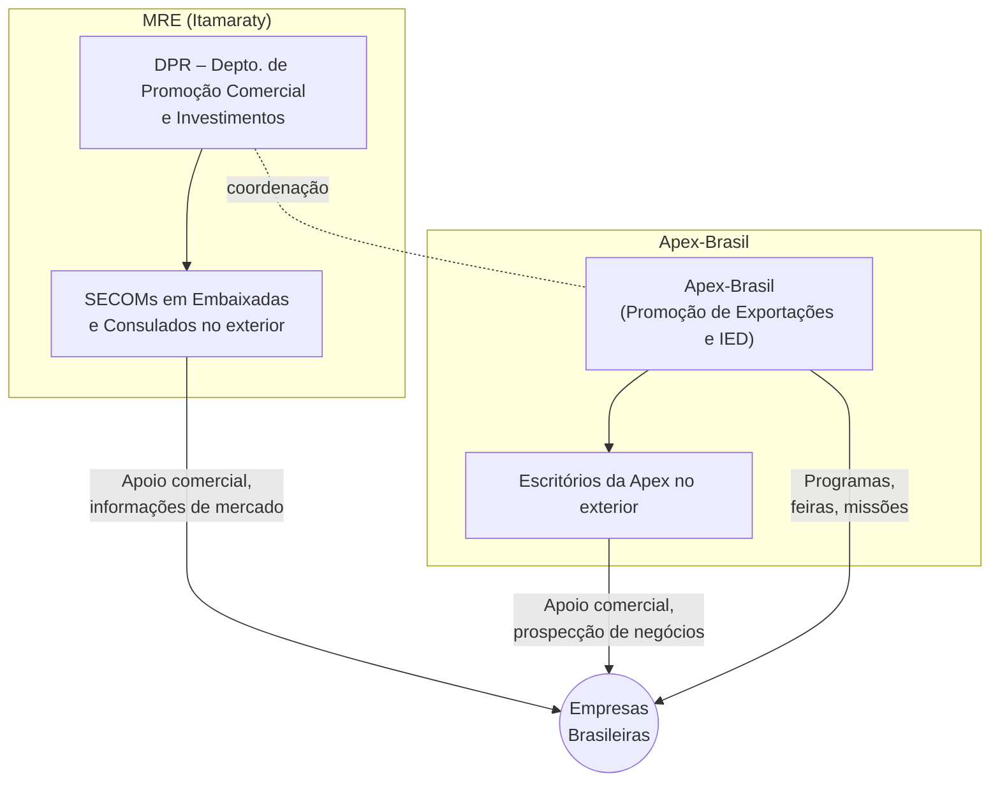

# Política Comercial Externa Brasileira – Nota de Estudo Estratégica (CACD)

> [!note]  
> **Visão Geral:** Esta nota analisa três pilares da política comercial externa do Brasil com foco estratégico para o CACD: **(1)** a atuação do Brasil nos blocos econômicos, em especial o Mercosul; **(2)** a estratégia negociadora em acordos comerciais (incluindo o acordo Mercosul-União Europeia e outras negociações-chave até 2025); e **(3)** a diplomacia de promoção comercial e de investimentos, com destaque à coordenação entre Itamaraty (MRE) e Apex-Brasil.

## 1. O Brasil e os Blocos Econômicos

_Presidentes do Mercosul – Luis Lacalle Pou (Uruguai) e Luiz Inácio Lula da Silva (Brasil) – reafirmam compromissos de integração durante a Cúpula do Mercosul (Montevidéu, dezembro de 2024)._

### Mercosul como Plataforma Principal de Negociação

O **Mercosul** (Mercado Comum do Sul) é a pedra angular da inserção econômica internacional do Brasil, servindo como sua principal plataforma de negociações comerciais externas. Desde sua criação em 1991, o bloco consolidou uma união aduaneira com tarifa externa comum e coordenação de políticas comerciais. **Negociar via Mercosul** confere ao Brasil e parceiros maior peso político e de mercado nas tratativas externas, ampliando o poder de barganha coletivo[agenciagov.ebc.com.br](https://agenciagov.ebc.com.br/noticias/202412/perguntas-e-respostas-acordo-de-parceria-mercosul-uniao-europeia#:~:text=O%20Acordo%20integrar%C3%A1%20dois%20dos,Uni%C3%A3o%20Europeia%20com%20parceiros%20comerciais)[agenciagov.ebc.com.br](https://agenciagov.ebc.com.br/noticias/202412/perguntas-e-respostas-acordo-de-parceria-mercosul-uniao-europeia#:~:text=Fruto%20do%20esfor%C3%A7o%20de%20mais,internacional%20de%20seus%20Estados%20Partes). Por exemplo, o acordo Mercosul-União Europeia – em processo de ratificação – integrará dois dos maiores blocos econômicos do mundo e reforça o Mercosul como instrumento de inserção internacional dos Estados Partes[agenciagov.ebc.com.br](https://agenciagov.ebc.com.br/noticias/202412/perguntas-e-respostas-acordo-de-parceria-mercosul-uniao-europeia#:~:text=Fruto%20do%20esfor%C3%A7o%20de%20mais,internacional%20de%20seus%20Estados%20Partes). Em um contexto global de megablocos e acordos regionais, o Brasil tem priorizado o Mercosul para evitar isolamento e obter acesso ampliado a mercados externos.

**Vantagens de negociar via Mercosul:**

- _Maior Poder de Barganha:_ O Mercosul reúne ~$300$ milhões de consumidores e um PIB conjunto significativo, permitindo ao Brasil melhores concessões de parceiros comerciais ao negociar em bloco do que conseguiria isoladamente. O acordo com a UE, por exemplo, só foi possível dentro do formato birregional Mercosul-UE[agenciagov.ebc.com.br](https://agenciagov.ebc.com.br/noticias/202412/perguntas-e-respostas-acordo-de-parceria-mercosul-uniao-europeia#:~:text=O%20Acordo%20integrar%C3%A1%20dois%20dos,Uni%C3%A3o%20Europeia%20com%20parceiros%20comerciais).
    
- _Inserção e Integracão Regional:_ Fortalece a integração sul-americana e a _solidariedade regional_. A atuação conjunta promove a coesão política e econômica da América do Sul, evitando divisões e aumentando a relevância da região em fóruns globais.
    
- _Plataforma para Novos Acordos:_ O acesso preferencial conquistado pelo Mercosul tende a atrair interesse de outros países em negociar com o bloco[agenciagov.ebc.com.br](https://agenciagov.ebc.com.br/noticias/202412/perguntas-e-respostas-acordo-de-parceria-mercosul-uniao-europeia#:~:text=Ademais%2C%20os%20compromissos%20assumidos%20conjuntamente,negociar%20entendimentos%20com%20o%20Mercosul), gerando um ciclo virtuoso de mais acordos. Ex.: após o acerto com a UE, países como Canadá e Coreia do Sul intensificaram negociações com o Mercosul.
    

**Desafios e limitações:**

- _Ritmo e Consenso:_ Decisões no Mercosul exigem consenso entre membros com estruturas econômicas distintas (Brasil, Argentina, Paraguai, Uruguai – e possivelmente _Bolívia_, em processo de adesão). Divergências internas podem atrasar ou bloquear negociações. A busca de posição comum frequentemente torna as ofertas mais **conservadoras**, refletindo a sensibilidade do membro mais defensivo.
    
- _Restrições à Ação Individual:_ Como união aduaneira, vigora a regra de negociacão conjunta: países-membros se comprometem a _não negociar FTAs individualmente_ com terceiros. Isso gera tensões, especialmente quando algum membro deseja maior abertura. O Uruguai, por exemplo, vem pressionando por flexibilização para firmar um acordo bilateral com a China, argumentando que o Mercosul seria **muito protecionista**. O governo uruguaio chegou a ameaçar saída do bloco e deixou de assinar comunicados conjuntos em protesto[oglobo.globo.com](https://oglobo.globo.com/mundo/noticia/2023/07/uruguai-volta-a-ameacar-acordo-bilateral-com-china-e-pela-4a-vez-seguida-nao-assina-comunicado-conjunto-do-mercosul.ghtml#:~:text=Por%20acordo%20com%20China%2C%20Uruguai,justificou%20que%20o%20pa%C3%ADs)[poder360.com.br](https://www.poder360.com.br/internacional/por-negociacao-com-china-uruguai-nao-assina-declaracao-do-mercosul/#:~:text=Por%20negocia%C3%A7%C3%A3o%20com%20China%2C%20Uruguai,em%20acordo%20bilateral%20com%20chineses). O Brasil tem resistido a violações da regra conjunta – o chanceler Mauro Vieira advertiu em 2023 que um FTA **Uruguai–China à revelia do Mercosul “seria a destruição do Mercosul”**, pois romperia a Tarifa Externa Comum e incentivaria outros a buscar acordos próprios[gov.br](https://www.gov.br/mre/pt-br/centrais-de-conteudo/publicacoes/discursos-artigos-e-entrevistas/ministro-das-relacoes-exteriores/entrevistas-mre/mauro-vieira-2023/acordo-do-uruguai-com-a-china-seria-destruicao-do-mercosul-diz-chanceler-folha-de-s-paulo-21-01-2023#:~:text=Um%20acordo%20de%20livre%20com%C3%A9rcio,americano).
    
- _Assimetria entre Membros:_ Economias menores (Paraguai, Uruguai) por vezes sentem-se preteridas ou restringidas em seus interesses comerciais, enquanto o Brasil e Argentina (maiores) dominam a agenda. Isso alimenta discussões sobre compensações e cláusulas de _flexibilização_ para que membros avancem em ritmos distintos, sem consenso até 2025.
    
- _Imagem Externa e Credibilidade:_ A dificuldade em concluir acordos importantes (como o Mercosul-UE, pendente há décadas) gerou questionamentos externos sobre a eficácia do Mercosul como negociador. A superação desses impasses é crucial para demonstrar que o bloco **ainda é viável e relevante**.
    

> [!important]  
> **Flexibilização do Mercosul:** A tensão entre manter a coesão do bloco e permitir maior autonomia nacional é um dilema estratégico. O Brasil historicamente privilegia a integridade do Mercosul – evitando exceções que minem a Tarifa Externa Comum – por acreditar que a _força coletiva supera ganhos individuais de acordos isolados_. Ao mesmo tempo, reconhece-se que o Mercosul precisa agilizar negociações e mostrar resultados para deter a percepção de estagnação. Esse equilíbrio entre **coesão** e **flexibilidade** permanece no centro dos debates sobre o futuro do bloco.

### Integração Regional e Outras Iniciativas Latino-Americanas

Embora o Mercosul seja o núcleo da política comercial regional brasileira, o país participa de outras iniciativas de integração sul-americana/latino-americana, buscando conciliar _regionalismo aberto_ e liderança regional:

- **ALADI (Associação Latino-Americana de Integração):** Marco legal sob o qual o Mercosul e outros países da região firmam acordos comerciais parciais. O Brasil, via Mercosul, estabeleceu acordos de complementação econômica (ACEs) com praticamente todos os vizinhos sul-americanos no âmbito da ALADI. Exemplo: acordos Mercosul-Chile (ACE-35) e Mercosul-Comunidade Andina, que eliminam tarifas na maioria dos produtos, aproximando o Mercosul da zona de livre-comércio sul-americana. Essas iniciativas reforçam a integração comercial continental de forma flexível, sem formar novas instituições supranacionais.
    
- **Relação Mercosul–Aliança do Pacífico:** A Aliança do Pacífico (México, Colômbia, Peru e Chile) adota modelo mais liberal de integração. O Brasil não integra a Aliança, mas foi aceito como _observador_ e apoiou planos de _convergência Mercosul–Aliança_. Em 2017–2018 houve diálogos para aproximar normativas e facilitar comércio entre os blocos, porém avanços concretos foram limitados pelas mudanças políticas na região. Até 2025, a interação Mercosul–Pacífico ocorre mais via acordos bilaterais Mercosul-países da Aliança (Chile, Colômbia, Peru) no âmbito da ALADI.
    
- **UNASUL e CELAC:** No campo político, o Brasil impulsionou a UNASUL (União de Nações Sul-Americanas) nos anos 2000 como foro de coordenação regional ampla (infraestrutura, defesa, etc.). Contudo, a UNASUL entrou em hiato em 2017–2020 devido a divergências ideológicas. Em 2023, o governo Lula liderou esforços para **revitalizar a UNASUL**, buscando retomar projetos de integração (embora sem foco comercial específico). A CELAC (Comunidade de Estados Latino-Americanos e Caribenhos) é outro mecanismo que inclui todo o hemisfério exceto EUA/Canadá – o Brasil voltou a participar ativamente em 2023 após afastamento em 2020. Esses fóruns reforçam a diplomacia regional brasileira, mas têm impacto indireto na política comercial, servindo mais à **coordenação política** e promoção de valores comuns (democracia, desenvolvimento sustentável, etc.) do que à liberalização comercial concreta.
    
- **ALBA e outros blocos ideológicos:** O Brasil observa mas não adere a iniciativas como a ALBA (Aliança Bolivariana) de cunho político-ideológico restrito a alguns países. A postura brasileira tem sido de dialogar com todos, mantendo a ênfase no Mercosul e ALADI como veículos centrais para integração econômica regional.
    

Em resumo, o **Brasil equilibra seu protagonismo regional** entre o aprofundamento do Mercosul e a participação construtiva em mecanismos mais amplos de diálogo latino-americano. A estratégia brasileira privilegia convergência e complementaridade: usar o Mercosul como **base** para ampliação de mercados (inclusive para além da região), enquanto engaja diplomaticamente toda a América Latina em prol de integração e desenvolvimento compartilhado.

## 2. Estratégia de Negociação de Acordos Comerciais

### Da Postura Defensiva à Abertura Ofensiva

Historicamente, a política comercial brasileira adotou uma posição **defensiva** em negociações internacionais. Desde os anos 1990 até meados dos 2000, o Brasil focou em proteger sua indústria nascente e agricultura familiar, evitando acordos de livre-comércio amplos com países desenvolvidos. Por exemplo, durante a ALCA (Área de Livre Comércio das Américas) o Brasil impôs condições que acabaram por travar as negociações, receoso de assimetria com os EUA. Nas rodadas da OMC, liderou o G-20 agrícola em defesa de flexibilidades para países em desenvolvimento e manteve altas tarifas industriais como barganha.

A partir da década de 2010, observou-se gradativa **mudança de postura**. Diante da estagnação da Rodada Doha e do avanço de acordos regionais em outras partes do mundo, o Brasil começou a adotar uma _agenda negociadora mais proativa_. O governo Temer (2016–2018) imprimiu um viés mais liberalizante, retomando ou iniciando negociações comerciais antes paralisadas. Sob Jair Bolsonaro (2019–2022), apesar de oscilações ideológicas, o Ministério da Economia (de Paulo Guedes) buscou acelerar acordos para abrir a economia. Houve **substantiva expansão da rede de acordos** do Mercosul nesse período, incluindo a conclusão de negociações históricas (UE, EFTA) e novos parceiros (Singapura) – refletindo uma estratégia mais _ofensiva_ de inserção econômica.

Em 2023, o governo Lula retomou um viés desenvolvimentista, mas sem retornar ao isolacionismo do passado. Ao contrário, manteve o empenho em finalizar e ratificar acordos em andamento (como o Mercosul-UE) e em explorar parcerias na Ásia e Oriente Médio, combinando abertura comercial com defesa de políticas industriais e sustentabilidade. Assim, até 2025 o Brasil apresenta uma estratégia **híbrida**: pragmática na busca por novos mercados, porém exigindo condições equilibradas que resguardem interesses nacionais (ex.: cláusulas de salvaguarda, tratamento especial a produtos sensíveis e vinculação a desenvolvimento sustentável). Em suma, o Brasil passou **“de postura defensiva a mais aberta”** nas negociações comerciais internacionais, compatibilizando abertura econômica gradual com suas políticas de desenvolvimento[cebri.org](https://cebri.org/media/documentos/arquivos/LiderancaResponsabilidadeNova.pdf#:~:text=Bras%C3%ADlia%20,de%20uma%20postura%20defensiva%2C).

### Acordo Mercosul–União Europeia: Histórico, Entraves e Status Atual (até 2025)

**Histórico:** As negociações Mercosul-UE iniciaram-se em 1999 e arrastaram-se por _20 anos_ de idas e vindas. Em junho de 2019, foi anunciado um “acordo político” entre as partes – marco histórico após duas décadas[agenciagov.ebc.com.br](https://agenciagov.ebc.com.br/noticias/202412/perguntas-e-respostas-acordo-de-parceria-mercosul-uniao-europeia#:~:text=Em%206%20de%20dezembro%20de,durava%20cerca%20de%2025%20anos)[agenciagov.ebc.com.br](https://agenciagov.ebc.com.br/noticias/202412/perguntas-e-respostas-acordo-de-parceria-mercosul-uniao-europeia#:~:text=Em%20junho%20de%202019%2C%20as,temas%20como%20indica%C3%A7%C3%B5es%20geogr%C3%A1ficas%20e). Porém, o acerto de 2019 era _preliminar_: vários capítulos não estavam finalizados (ex.: indicações geográficas, cláusulas de implementação) e surgiram **novos entraves** na etapa pós-negociação. Principal obstáculo: preocupações europeias com políticas ambientais do Brasil – notadamente o desmatamento na Amazônia durante o governo Bolsonaro – geraram forte resistência de países como França e parlamento europeu à ratificação do tratado. A UE passou a exigir **garantias adicionais ambientais**, travando o avanço.

**Reabertura em 2023:** Com a posse de Lula e mudança da política ambiental brasileira, as negociações com a UE foram **retomadas em 2023** para resolver pendências e incorporar compromissos adicionais. Essa nova rodada (2023–2024) ocorreu em contexto distinto, marcado pela pandemia, crise climática e tensões geopolíticas, o que influenciou as tratativas[agenciagov.ebc.com.br](https://agenciagov.ebc.com.br/noticias/202412/perguntas-e-respostas-acordo-de-parceria-mercosul-uniao-europeia#:~:text=A%20etapa%20negociadora%20iniciada%20em,mais%20favor%C3%A1vel%20aos%20interesses%20brasileiros). O Brasil buscou _ajustes_ para tornar o acordo mais favorável aos interesses nacionais, enquanto a UE demandou garantias de sustentabilidade. Novos textos foram negociados em temas como **comércio e desenvolvimento sustentável**, incluindo mecanismos de diálogo ambiental e incentivos a produtos “verdes”[agenciagov.ebc.com.br](https://agenciagov.ebc.com.br/noticias/202412/perguntas-e-respostas-acordo-de-parceria-mercosul-uniao-europeia#:~:text=,apoiar%20a%20implementa%C3%A7%C3%A3o%20do%20Acordo). Incorporou-se também um inédito **mecanismo de reequilíbrio** que permitirá ao Mercosul retaliar ou compensar caso a UE adote medidas internas que anulem concessões negociadas (ex.: regulações sanitárias ou ambientais que impeçam exportações agro do Mercosul)[agenciagov.ebc.com.br](https://agenciagov.ebc.com.br/noticias/202412/perguntas-e-respostas-acordo-de-parceria-mercosul-uniao-europeia#:~:text=,de%20vantagens%20obtidas%20no%20Acordo). Ademais, concluiu-se capítulos pendentes (compras governamentais, regras de origem, indicações geográficas etc.), **finalizando efetivamente a negociação** em todos os pontos.

**Conclusão da Negociação (Dez/2024):** Em 6 de dezembro de 2024, os líderes do Mercosul e UE anunciaram a conclusão definitiva das negociações do Acordo de Associação Birregional[agenciagov.ebc.com.br](https://agenciagov.ebc.com.br/noticias/202412/perguntas-e-respostas-acordo-de-parceria-mercosul-uniao-europeia#:~:text=Em%206%20de%20dezembro%20de,durava%20cerca%20de%2025%20anos). Diferentemente do anúncio de 2019 (que foi político e deixou pontos em aberto), o de 2024 significa que _todos os capítulos estão acordados_[agenciagov.ebc.com.br](https://agenciagov.ebc.com.br/noticias/202412/perguntas-e-respostas-acordo-de-parceria-mercosul-uniao-europeia#:~:text=,e%20o%20an%C3%BAncio%20de%202024). Os textos passam por revisão legal (“legal scrubbing”) e tradução para as línguas oficiais (português, espanhol e 23 idiomas da UE)[agenciagov.ebc.com.br](https://agenciagov.ebc.com.br/noticias/202412/perguntas-e-respostas-acordo-de-parceria-mercosul-uniao-europeia#:~:text=%23%20%20O%20Acordo%20Mercosul,j%C3%A1%20foi%20assinado). A expectativa do governo brasileiro é **assinar o acordo em 2025** após essas etapas técnicas, levando-o então aos Parlamentos para aprovação[agenciagov.ebc.com.br](https://agenciagov.ebc.com.br/noticias/202412/perguntas-e-respostas-acordo-de-parceria-mercosul-uniao-europeia#:~:text=,ser%C3%A1%20assinado).

**Entraves à Ratificação:** Apesar do avanço técnico, a **ratificação política** permanece desafiadora. Na UE, persiste resistência de setores agrícolas e ambientalistas. Alguns países (França, Áustria, Irlanda) cobram compromissos ambientais mais rígidos e garantias de que o Brasil cumprirá metas climáticas. Para contornar isso, negocia-se um _instrumento adicional_ de compromissos ambientais mútuos. O Brasil, por sua vez, faz ofensiva diplomática para melhorar sua imagem: lançou campanha para mostrar ao público europeu que o agronegócio brasileiro não é “vilão ambiental”[cnnbrasil.com.br](https://www.cnnbrasil.com.br/blogs/luisa-martins/politica/por-acordo-mercosul-ue-brasil-prepara-campanha-e-conta-votos-de-europeus/#:~:text=Como%20parte%20do%20esfor%C3%A7o%20pela,agro%20brasileiro%20como%20vil%C3%A3o%20ambiental). Autoridades brasileiras veem o momento externo favorável – por exemplo, tarifas protecionistas dos EUA (era Trump) empurram a UE a buscar novos acordos[cnnbrasil.com.br](https://www.cnnbrasil.com.br/blogs/luisa-martins/politica/por-acordo-mercosul-ue-brasil-prepara-campanha-e-conta-votos-de-europeus/#:~:text=Embora%20as%20autoridades%20em%20Bras%C3%ADlia,ocorrer%20at%C3%A9%20a%20reta%20final) – mas reconhecem que **surpresas podem ocorrer** no processo de aprovação[cnnbrasil.com.br](https://www.cnnbrasil.com.br/blogs/luisa-martins/politica/por-acordo-mercosul-ue-brasil-prepara-campanha-e-conta-votos-de-europeus/#:~:text=Embora%20as%20autoridades%20em%20Bras%C3%ADlia,ocorrer%20at%C3%A9%20a%20reta%20final). Em 2025, o Brasil mobiliza sua diplomacia (inclusive _Apex-Brasil e MRE em conjunto_) em capitais europeias para angariar apoio e neutralizar narrativas contrárias[cnnbrasil.com.br](https://www.cnnbrasil.com.br/blogs/luisa-martins/politica/por-acordo-mercosul-ue-brasil-prepara-campanha-e-conta-votos-de-europeus/#:~:text=Para%20avan%C3%A7ar%20nas%20tratativas%20e,abril%20em%20agendas%20na%20Europa).

No cronograma europeu, espera-se votação no **Conselho da UE** em _fins de 2025_ e, se aprovada por maioria qualificada (55% dos países representando 65% da população)[cnnbrasil.com.br](https://www.cnnbrasil.com.br/blogs/luisa-martins/politica/por-acordo-mercosul-ue-brasil-prepara-campanha-e-conta-votos-de-europeus/#:~:text=A%20expectativa%20%C3%A9%20de%20que,travar%20ou%20validar%20o%20acordo), seguida de debate no **Parlamento Europeu**, onde a maioria simples será necessária[cnnbrasil.com.br](https://www.cnnbrasil.com.br/blogs/luisa-martins/politica/por-acordo-mercosul-ue-brasil-prepara-campanha-e-conta-votos-de-europeus/#:~:text=A%20fase%20seguinte%2C%20prevista%20para,%C3%A0%20press%C3%A3o%20do%20setor%20agr%C3%ADcola). Esta etapa parlamentar é considerada a mais imprevisível, dado que eurodeputados sofrem pressão direta de lobbies agrícolas e ambientais[cnnbrasil.com.br](https://www.cnnbrasil.com.br/blogs/luisa-martins/politica/por-acordo-mercosul-ue-brasil-prepara-campanha-e-conta-votos-de-europeus/#:~:text=A%20fase%20seguinte%2C%20prevista%20para,%C3%A0%20press%C3%A3o%20do%20setor%20agr%C3%ADcola). Além disso, questões internas do Brasil podem afetar percepções: por exemplo, a coincidência das votações europeias com a temporada de queimadas na Amazônia ou eventos como a COP30 em Belém (novembro/2025) pode influenciar opiniões[cnnbrasil.com.br](https://www.cnnbrasil.com.br/blogs/luisa-martins/politica/por-acordo-mercosul-ue-brasil-prepara-campanha-e-conta-votos-de-europeus/#:~:text=press%C3%A3o%20do%20setor%20agr%C3%ADcola). Reconhecendo isso, o governo Lula intensificou ações de combate ao desmatamento em 2023–2024 e projeta cumprir metas climáticas, tentando **convencer europeus de sua seriedade ambiental**.

**Importância Estratégica:** Se ratificado, o acordo Mercosul-UE será o maior já firmado pelo Mercosul (abrangendo 718 milhões de pessoas e ~US$22 trilhões em PIB combinado)[agenciagov.ebc.com.br](https://agenciagov.ebc.com.br/noticias/202412/perguntas-e-respostas-acordo-de-parceria-mercosul-uniao-europeia#:~:text=O%20Acordo%20integrar%C3%A1%20dois%20dos,Uni%C3%A3o%20Europeia%20com%20parceiros%20comerciais). As tarifas sobre cerca de 90% dos produtos comerciados serão eliminadas ao longo de até 15 anos, impulsionando setores competitivos do Mercosul (agroindústria, minerais, manufaturas selecionadas) e abrindo oportunidades nas compras governamentais e serviços europeus. Estudos citados pelo governo brasileiro projetam ganhos significativos de comércio e PIB a longo prazo[gov.br](https://www.gov.br/mdic/pt-br/assuntos/comercio-exterior/noticias/2021/junho/mercosul-retoma-negociacoes-do-acordo-de-livre-comercio-com-coreia-do-sul#:~:text=As%20negocia%C3%A7%C3%B5es%C2%A0Mercosul,do%20Brasil%E2%80%9D%2C%20destacou%20Lucas%20Ferraz)[agenciagov.ebc.com.br](https://agenciagov.ebc.com.br/noticias/202412/perguntas-e-respostas-acordo-de-parceria-mercosul-uniao-europeia#:~:text=A%20UE%20%C3%A9%20o%20segundo,investimento%20estrangeiro%20direto%20no%20Brasil). Politicamente, o acordo associará dois blocos que compartilham valores de democracia e multilateralismo, enviando sinal de compromisso com a integração econômica em um momento de tendências protecionistas globais[agenciagov.ebc.com.br](https://agenciagov.ebc.com.br/noticias/202412/perguntas-e-respostas-acordo-de-parceria-mercosul-uniao-europeia#:~:text=Medido%20pelas%20popula%C3%A7%C3%B5es%20abrangidas%20em,fator%20para%20o%20crescimento%20econ%C3%B4mico). Para o Brasil, a UE é já o _segundo maior parceiro comercial_ (corrente de comércio de US$92 bi em 2023) e principal investidor externo[agenciagov.ebc.com.br](https://agenciagov.ebc.com.br/noticias/202412/perguntas-e-respostas-acordo-de-parceria-mercosul-uniao-europeia#:~:text=,do%20Acordo%20para%20o%20Brasil). O acordo tende a **diversificar parcerias**, reduzir a dependência das exportações para a Ásia e reforçar a modernização industrial via integração a cadeias produtivas europeias[agenciagov.ebc.com.br](https://agenciagov.ebc.com.br/noticias/202412/perguntas-e-respostas-acordo-de-parceria-mercosul-uniao-europeia#:~:text=A%20UE%20%C3%A9%20o%20segundo,investimento%20estrangeiro%20direto%20no%20Brasil). Também deve fortalecer a **coesão interna do Mercosul**, pois para aproveitar plenamente o acordo será necessário harmonizar normas regionais (TEC, regras de origem) e isso pressiona os sócios a resolverem pendências de união aduaneira[agenciagov.ebc.com.br](https://agenciagov.ebc.com.br/noticias/202412/perguntas-e-respostas-acordo-de-parceria-mercosul-uniao-europeia#:~:text=Ademais%2C%20os%20compromissos%20assumidos%20conjuntamente,negociar%20entendimentos%20com%20o%20Mercosul). Em síntese, o acordo Mercosul-UE é visto como _pilar estratégico_ da inserção internacional brasileira neste início de século XXI – sua implementação bem-sucedida seria um **divisor de águas**, enquanto um eventual fracasso teria custo político elevado para o Mercosul.

### Outros Acordos Comerciais Concluídos via Mercosul

Apesar do longo foco na UE, o Mercosul (e o Brasil) também fecharam acordos com diversos parceiros nas últimas décadas – intensificando-se a partir de 2010. Destacam-se:

- **Mercosul–Israel:** Primeiro FTA extra-regional do Mercosul, assinado em 18/12/2007 e em vigor desde 2010[gov.br](https://www.gov.br/siscomex/pt-br/acordos-comerciais/mercosul-israel#:~:text=Data%20de%20assinatura%3A%2018%20de,159%2C%20de). Abrange comércio de bens com remoção tarifária escalonada. Israel ofereceu acesso a produtos tropicais do Mercosul e o bloco abriu seu mercado gradualmente a manufaturas israelenses. O acordo simbolizou a abertura do Mercosul ao Oriente Médio e serviu de _modelo_ para outros acordos com países fora da América Latina.
    
- **Mercosul–Egito:** Assinado em 02/08/2010, foi o primeiro acordo do Mercosul com um país africano. Entrou em vigor somente em 1º/09/2017 após ratificações[static.portaldaindustria.com.br](https://static.portaldaindustria.com.br/media/filer_public/af/6c/af6ca6c4-6d68-42b2-8b7c-99735169863a/informepoliticacomercial_22_03_acordomercosulegito.pdf#:~:text=,em%20setembro%20de%202026%2C). Prevê liberalização tarifária mútua sobre ~90% do comércio até 2026[static.portaldaindustria.com.br](https://static.portaldaindustria.com.br/media/filer_public/af/6c/af6ca6c4-6d68-42b2-8b7c-99735169863a/informepoliticacomercial_22_03_acordomercosulegito.pdf#:~:text=,em%20setembro%20de%202026%2C). Desde então, o comércio bilateral triplicou, com forte aumento das exportações do Egito para o Brasil (além de diversificação das vendas brasileiras ao Egito)[comexdobrasil.com](https://comexdobrasil.com/acordo-com-o-mercosul-faz-triplicar-as-exportacoes-do-egito-para-o-brasil/#:~:text=,incluir%20produtos%20agr%C3%ADcolas%20e). O acordo reforça a presença do Brasil no mundo árabe e integra a estratégia Sul-Sul de diversificação de parcerias.
    
- **Mercosul–Palestina:** Assinado em 2011, este acordo de livre-comércio teve um trâmite peculiar e demorado – o Brasil só ratificou em 2023, _mais de 12 anos depois_[aeb.org.br](https://www.aeb.org.br/assuntos-de-interesse/2024/07/acordo-mercosul-palestina-e-ratificado-pelo-brasil-doze-anos-e-seis-meses-apos-sua-assinatura/#:~:text=Acordo%20Mercosul,Palestina%20s%C3%B3%20foi). Apesar do simbolismo político de apoio à Palestina, o intercâmbio comercial é reduzido. O acordo aguarda a efetiva implementação, dependendo também da situação política palestina.
    
- **Mercosul–União Aduaneira da África Austral (SACU):** Acordo assinado em 2008 estabelecendo preferências tarifárias fixas (não é livre-comércio integral). É modesto em cobertura, mas aproximou o Mercosul de economias como África do Sul. Entrou em vigor parcialmente, mas sem grande impacto comercial até agora.
    
- **Mercosul–Índia:** Acordo de Preferências Fixas assinado em 2004, em vigor desde 2009, abrangendo uma lista limitada de produtos com descontos tarifários (não é FTA pleno). As preferências foram expandidas em 2016. Apesar do potencial, o comércio bilateral ainda enfrenta barreiras altas e negociações para ampliar o acordo seguem em consideração.
    
- **Mercosul–** **Singapura:** Concluído em 2022 e **assinado em 07/12/2023** no Rio de Janeiro, durante a 63ª Cúpula do Mercosul[mercojuris.com](https://mercojuris.com/acordo-de-livre-comercio-entre-mercosul-e-singapura-facilitacoes-aduaneiras-e-comerciais-ad-anna-dolores-sa-malta/#:~:text=Ap%C3%B3s%20cinco%20anos%20de%20negocia%C3%A7%C3%B5es%2C,pelo%20bloco%20em%2012%20anos). Trata-se do _primeiro acordo de livre-comércio do Mercosul com um país da Ásia-Pacífico_ e o primeiro FTA completo firmado pelo bloco em 12 anos[mercojuris.com](https://mercojuris.com/acordo-de-livre-comercio-entre-mercosul-e-singapura-facilitacoes-aduaneiras-e-comerciais-ad-anna-dolores-sa-malta/#:~:text=Ap%C3%B3s%20cinco%20anos%20de%20negocia%C3%A7%C3%B5es%2C,pelo%20bloco%20em%2012%20anos). O acordo é abrangente: inclui comércio de bens (tarifas, regras de origem, facilitação aduaneira), serviços, investimentos, compras governamentais, propriedade intelectual e disposições sobre MPMEs. Singapura, sendo economia altamente aberta, concordou em **zerar imediatamente 100% das tarifas** sobre produtos originários do Mercosul na entrada em vigor do acordo[mercojuris.com](https://mercojuris.com/acordo-de-livre-comercio-entre-mercosul-e-singapura-facilitacoes-aduaneiras-e-comerciais-ad-anna-dolores-sa-malta/#:~:text=O%20acordo%20prev%C3%AA%2C%20a%20partir,o%20mercado%20interno%20no%20MERCOSUL). O Mercosul, por sua vez, concederá acesso preferencial a ~95,8% das linhas tarifárias de Singapura, com desgravação paulatina ao longo de até 15 anos[mercojuris.com](https://mercojuris.com/acordo-de-livre-comercio-entre-mercosul-e-singapura-facilitacoes-aduaneiras-e-comerciais-ad-anna-dolores-sa-malta/#:~:text=O%20acordo%20prev%C3%AA%2C%20a%20partir,o%20mercado%20interno%20no%20MERCOSUL). Setores sensíveis do Mercosul (alguns manufaturados e produtos industriais) foram _excluídos_ ou terão prazos longos para liberalização, resguardando a indústria regional[mercojuris.com](https://mercojuris.com/acordo-de-livre-comercio-entre-mercosul-e-singapura-facilitacoes-aduaneiras-e-comerciais-ad-anna-dolores-sa-malta/#:~:text=O%20acordo%20prev%C3%AA%2C%20a%20partir,o%20mercado%20interno%20no%20MERCOSUL). O acordo com Singapura reveste-se de importância estratégica: além de facilitar exportações de commodities já robustas (petróleo, carnes, minérios) – Singapura é o 2º maior destino das exportações brasileiras na Ásia, atrás apenas da China[mercojuris.com](https://mercojuris.com/acordo-de-livre-comercio-entre-mercosul-e-singapura-facilitacoes-aduaneiras-e-comerciais-ad-anna-dolores-sa-malta/#:~:text=No%20com%C3%A9rcio%20com%20o%20Brasil%2C,2) – ele insere o Mercosul nas cadeias globais de valor via um hub logístico-financeiro asiático. Espera-se que este acordo sirva de **porta de entrada** para o Mercosul na Ásia e aumente a atratividade do bloco para outros parceiros asiáticos.
    
- **Outros:** Há ainda acordos do Mercosul com **Peru, Colômbia e Equador** (via ALADI, alcançando praticamente livre-comércio bilateral), além de acordos de complementação econômica com México (parcial, focado em setor automotivo e bens específicos, via ACE-53 e 55). Esses acordos consolidam uma densa _rede latino-americana_ de preferências comerciais envolvendo o Brasil, que embora menos debatida que os acordos extra-regionais, é fundamental para setores como manufaturas de veículos, eletrônicos e bens de capital (mercados andinos e mexicano).
    

### Negociações em Curso e Perspectivas (até mid-2025)

O Brasil, via Mercosul, mantém uma agenda ativa de negociações comerciais, com várias frentes em andamento ou potenciais, alinhadas à estratégia de diversificar parceiros e reduzir vulnerabilidades. As negociações de destaque incluem:

- **Mercosul–Canadá:** Iniciadas em 2018, as tratativas do acordo de livre-comércio enfrentaram **pausa** nos anos seguintes, mas há esforço para retomá-las. Em 2025, o governo brasileiro sinaliza como meta _“ressuscitar”_ o acordo Mercosul-Canadá[www1.folha.uol.com.br](https://www1.folha.uol.com.br/mercado/2025/04/brasil-aposta-em-acordos-comerciais-com-paises-asiaticos-canada-e-mexico-para-se-contrapor-a-trump.shtml#:~:text=Uma%20das%20metas%20%C3%A9%20ressuscitar,s%C3%A9rie%20de%20tarifas%20de%20Trump), visto como estratégico após medidas protecionistas dos EUA. Autoridades canadenses manifestaram interesse em aprofundar a integração com o Brasil e Mercosul, buscando reduzir a dependência em relação aos EUA[www1.folha.uol.com.br](https://www1.folha.uol.com.br/mercado/2025/04/brasil-aposta-em-acordos-comerciais-com-paises-asiaticos-canada-e-mexico-para-se-contrapor-a-trump.shtml#:~:text=Uma%20das%20metas%20%C3%A9%20ressuscitar,s%C3%A9rie%20de%20tarifas%20de%20Trump). Espera-se que no segundo semestre de 2025 novas rodadas ocorram. Um acordo com o Canadá traria acesso a um mercado de alto poder aquisitivo e consolidaria parceria com um país que compartilha valores de multilateralismo e sustentabilidade, além de fortalecer a posição negociadora do Mercosul frente aos EUA.
    
- **Mercosul–Coreia do Sul:** Lançadas formalmente em maio/2018[gov.br](https://www.gov.br/mdic/pt-br/assuntos/comercio-exterior/noticias/2021/junho/mercosul-retoma-negociacoes-do-acordo-de-livre-comercio-com-coreia-do-sul#:~:text=As%20negocia%C3%A7%C3%B5es%C2%A0Mercosul,do%20Brasil%E2%80%9D%2C%20destacou%20Lucas%20Ferraz), as negociações com a Coreia tiveram 7 rodadas até 2021[cnabrasil.org.br](https://cnabrasil.org.br/negociacoes-internacionais-mercosul-coreia-do-sul#:~:text=magnitude%20tem%20o%20potencial%20de,a%20%C3%BAltima%20em%20setembro%202021)[cnabrasil.org.br](https://cnabrasil.org.br/negociacoes-internacionais-mercosul-coreia-do-sul#:~:text=particularmente%20para%20o%20setor%20agropecu%C3%A1rio,a%20%C3%BAltima%20em%20setembro%202021), cobrindo temas como acesso a bens (tarifas agrícolas e industriais), serviços, propriedade intelectual e barreiras técnicas. Trata-se de potencialmente o _primeiro FTA do Mercosul com um país da Ásia Oriental_. Houve dificuldades: a indústria automotiva brasileira e argentina teme a concorrência sul-coreana, enquanto Seul hesita em abrir seu mercado agrícola (sobretudo a carne bovina brasileira). Após 2021, as conversas desaceleraram; porém, com a nova estratégia brasileira pró-Ásia, há expectativa de retomar o ímpeto. Em 2023, negociadores-chefes estimaram possibilidade de conclusão em _meados de 2024_[mercosur.int](https://www.mercosur.int/pt-br/mercosul-e-coreia-mais-proximos-de-assinar-um-acordo-comercial/#:~:text=MERCOSUL%20e%20Coreia%20mais%20pr%C3%B3ximos,pr%C3%B3ximo%20ano%2C%20com%20a), mas isso não se concretizou. A CNA (agropecuária) do Brasil apoia fortemente o acordo, vendo grande oportunidade para carnes, grãos e frutas no mercado sul-coreano[cnabrasil.org.br](https://cnabrasil.org.br/negociacoes-internacionais-mercosul-coreia-do-sul#:~:text=com%C3%A9rcio%20representam%20um%20passo%20significativo,a%20%C3%BAltima%20em%20setembro%202021)[cnabrasil.org.br](https://cnabrasil.org.br/negociacoes-internacionais-mercosul-coreia-do-sul#:~:text=O%20acordo%20de%20livre%20com%C3%A9rcio,coreano). A conclusão do acordo Mercosul-Coreia seria um marco para inserir o Brasil no eixo Ásia-Pacífico e equilibrar a excessiva dependência do comércio com China. Até meados de 2025, no entanto, **não houve conclusão**, permanecendo pontos sensíveis em aberto.
    
- **Mercosul–EFTA:** As negociações com a EFTA (bloco europeu de países desenvolvidos não-UE: Suíça, Noruega, Islândia e Liechtenstein) ocorreram paralelamente às da UE. Em agosto/2019, Mercosul e EFTA anunciaram conclusão de um _acordo político_, similarmente incompleto[gov.br](https://www.gov.br/mre%E2%80%8B/pt-br/assuntos/politica-externa-comercial-e-economica/agenda-de-negociacoes-externas/acordo-mercosul-efta#:~:text=Ap%C3%B3s%20a%20d%C3%A9cima%20rodada%20negociadora%2C,das%20tratativas%20ocorridas%20em%202024). Houve hiato e, em abril/2024, realizou-se a 11ª rodada para decidir ajustes finais[gov.br](https://www.gov.br/mre%E2%80%8B/pt-br/assuntos/politica-externa-comercial-e-economica/agenda-de-negociacoes-externas/acordo-mercosul-efta#:~:text=Ap%C3%B3s%20a%20d%C3%A9cima%20rodada%20negociadora%2C,das%20tratativas%20ocorridas%20em%202024). **Status 2025:** as negociações prosseguem com base nos pontos pendentes identificados em 2024[gov.br](https://www.gov.br/mre%E2%80%8B/pt-br/assuntos/politica-externa-comercial-e-economica/agenda-de-negociacoes-externas/acordo-mercosul-efta#:~:text=Ap%C3%B3s%20a%20d%C3%A9cima%20rodada%20negociadora%2C,das%20tratativas%20ocorridas%20em%202024), indicando que o acordo ainda não foi formalmente concluído até junho/2025. No entanto, há otimismo de que possa ser finalizado em breve, dado o pequeno número de temas em aberto. O acordo Mercosul-EFTA, quando concluído, abrirá mercados com altíssimo poder de consumo (EFTA possui PIB per capita dos maiores do mundo) e garantirá acesso preferencial para produtos brasileiros como carnes, café, suco de laranja e manufaturados, além de atrair investimentos suíços e noruegueses[gov.br](https://www.gov.br/mre%E2%80%8B/pt-br/assuntos/politica-externa-comercial-e-economica/agenda-de-negociacoes-externas/acordo-mercosul-efta#:~:text=Com%20PIB%20de%20US%24%201%2C4,consumidor%20de%20grande%20relev%C3%A2ncia%20global)[gov.br](https://www.gov.br/mre%E2%80%8B/pt-br/assuntos/politica-externa-comercial-e-economica/agenda-de-negociacoes-externas/acordo-mercosul-efta#:~:text=A%20Su%C3%AD%C3%A7a%2C%20maior%20economia%20da,papel%20e%20celulose%20e%20minera%C3%A7%C3%A3o). É visto como complemento natural ao acordo com a UE, reforçando a presença brasileira na Europa.
    
- **Mercosul–México (ampliação):** Brasil e México não têm um FTA amplo devido à inserção do México no NAFTA/USMCA. Contudo, existem acordos parciais via ACEs, principalmente no setor automotivo. Em 2025, com a chegada da presidente Claudia Sheinbaum (progressista) no México, o Brasil identificou oportunidade de **ampliar o escopo desses acordos**[www1.folha.uol.com.br](https://www1.folha.uol.com.br/mercado/2025/04/brasil-aposta-em-acordos-comerciais-com-paises-asiaticos-canada-e-mexico-para-se-contrapor-a-trump.shtml#:~:text=de%20Trump). A ideia é incluir _mais produtos industriais e agropecuários_ em preferências mútuas e incorporar disciplinas modernas (serviços, facilitação). Isso depende de negociações **Mercosul-México** (já que o México tem status de observador no Mercosul). Planos foram discutidos para retomar a Comissão Mercosul-México e, possivelmente, evoluir para um acordo de livre-comércio parcial mais robusto. Essa aproximação visa aproveitar a complementaridade das economias e reduzir barreiras entre as duas maiores economias da AL.
    
- **Negociações Exploratórias – Ásia e Oriente Médio:** O Brasil empreende esforços para estreitar laços comerciais com economias asiáticas dinâmicas, alinhado ao “pivot to Asia”. Em 2023–2025, Lula visitou Japão, China (duas vezes), Vietnã e participou de cúpulas com ASEAN, reforçando o interesse em acordos. **Mercosul–Indonésia** desponta como possibilidade após a Indonésia ter firmado FTA com outros emergentes; diálogos iniciais ocorreram e um _memorando de entendimento_ pode ser firmado em 2025. **Mercosul–Vietnã** é outra frente mencionada, em linha com a busca de acordos com países ASEAN. Até o momento, tratam-se de sondagens e estudos de viabilidade, mas com forte endosso político brasileiro para avançar.  
    Simultaneamente, fora do eixo Ásia, o Brasil mira parcerias no Oriente Médio: em abril/2025 o Planalto anunciou expectativa de **acordo Mercosul–Emirados Árabes Unidos** nos próximos meses[www1.folha.uol.com.br](https://www1.folha.uol.com.br/mercado/2025/04/brasil-aposta-em-acordos-comerciais-com-paises-asiaticos-canada-e-mexico-para-se-contrapor-a-trump.shtml#:~:text=Carregando). Os Emirados são importante hub logístico e investidor no Golfo, e um acordo focado em investimentos e facilitação de comércio seria benéfico. Há também interesse em diálogo Mercosul-Arábia Saudita (grande importador de alimentos brasileiros). Esses movimentos sinalizam a intenção de **diversificar acordos além do tradicional eixo transatlântico**, posicionando o Brasil/Mercosul como global trader.
    
- **Outras Negociações/Perspectivas:** A pauta negociadora brasileira inclui ainda acordos temáticos e modernizações: negociação de acordos de _facilitação de investimentos_ (já concluiu com Índia e outros via OCDE), atualização do acordo Mercosul–Chile (assinada adição de capítulos de última geração em 2018), e potencial retomada de discussões Mercosul-Japão (ainda incipiente). Adicionalmente, o Brasil avalia adesão a acordos plurilaterais na OMC (como o Acordo de Compras Governamentais) como parte da estratégia de inserção competitiva.
    

> [!note] **Cenário Estratégico em 2025:** A conjuntura internacional atual – tensões comerciais EUA-China, reorganização de cadeias pós-pandemia, busca por acordos “verdes” – oferece tanto oportunidades quanto pressões. O Brasil percebe **janela de oportunidade** para fechar acordos enquanto países buscam novos mercados frente à guerra comercial sino-americana[cnnbrasil.com.br](https://www.cnnbrasil.com.br/blogs/luisa-martins/politica/por-acordo-mercosul-ue-brasil-prepara-campanha-e-conta-votos-de-europeus/#:~:text=%E2%80%9CHoje%2C%20para%20a%20aprova%C3%A7%C3%A3o%20do,ficar%20pregando%20no%20vazio%E2%80%9D%2C%20reconheceu). Ao mesmo tempo, cobra-se que o Brasil equilibre abertura econômica com compromissos ambientais e sociais para viabilizar a aprovação dos acordos. No CACD, é fundamental entender que a estratégia comercial brasileira não é estática: ela **evolui conforme o contexto doméstico (prioridades de governo)** e **internacional (dinâmica dos parceiros)**, sempre buscando maximizar ganhos comerciais sem comprometer setores sensíveis. O período recente reflete um Brasil mais ativo, disposto a negociar acesso a mercados globais, porém sob seus próprios termos e valores (desenvolvimento sustentável, multilateralismo, redução de desigualdades).

## 3. Diplomacia da Promoção Comercial e de Investimentos

A promoção comercial e de investimentos é um pilar complementar à negociação de acordos na política externa comercial. Trata-se do **trabalho diplomático de apoiar empresas brasileiras no exterior, atrair investimentos estrangeiros ao Brasil e fortalecer a imagem do país** como parceiro econômico. O Brasil possui uma **arquitetura institucional complexa** para essa promoção, envolvendo o Ministério das Relações Exteriores (MRE) – com sua rede diplomática – em sinergia com a Apex-Brasil (Agência Brasileira de Promoção de Exportações e Investimentos), além de outros órgãos econômicos. A seguir, detalhamos essa estrutura e seus instrumentos.

### Estrutura Institucional: Itamaraty (MRE) e Apex-Brasil

- **Ministério das Relações Exteriores (MRE)**: Por meio do **Departamento de Promoção Comercial e Investimentos (DPR)**, o Itamaraty coordena os esforços de promoção comercial na diplomacia. O DPR, sediado em Brasília, gerencia uma vasta **rede de Setores de Promoção Comercial e de Investimentos (SECOMs)** alocados em embaixadas e consulados brasileiros pelo mundo. Esses setores contam com diplomatas (chamados _conselheiros comerciais_ ou secretários) dedicados a auxiliar exportadores brasileiros, identificar oportunidades de negócios, promover produtos e apoiar investidores estrangeiros interessados no Brasil. Até 2024, a rede conjunta de **SECOMs** abrangia **mais de 120 postos em 87 países nos 5 continentes**[brasilexportacao.com.br](https://brasilexportacao.com.br/rede-de-apoio-no-exterior-apexbrasil-mre/#:~:text=Trata,e%20ampliar%20suas%20opera%C3%A7%C3%B5es%20internacionalmente) – uma presença global robusta. Os SECOMs atuam como _antenas comerciais_, oferecendo inteligência de mercado, orientação sobre acesso a mercados locais, organizando eventos de divulgação e apoiando missões empresariais.
    
- **Apex-Brasil (Agência Brasileira de Promoção de Exportações e Investimentos):** É uma entidade paraestatal (serviço social autônomo), fundada em 2003, voltada exclusivamente à promoção comercial e atração de investimento estrangeiro direto (IED). A Apex-Brasil tem sede em Brasília e escritórios regionais no país, além de alguns **escritórios no exterior** (chamados EBX, em locais como Miami, Bruxelas, Dubai, Beijing, etc., conforme prioridades). Com orçamento significativo (cerca de R$ 500 milhões/ano recentemente), a Apex realiza projetos em parceria com o setor privado para inserir empresas brasileiras no mercado internacional. Suas especialidades incluem: organização de **feiras e pavilhões internacionais** para produtos brasileiros, missões empresariais ao exterior, rodadas de negócio (B2B), programas de capacitação para exportação (projeto _Peiex_), além de campanhas de imagem do Brasil e apoio a internacionalização de startups. Na vertente de investimentos, a Apex prospecta e atende investidores estrangeiros, articulando oportunidades de investimento no Brasil (ex.: portfólio de projetos em infraestrutura, agronegócio, tecnologia).
    
- **Sinergia Itamaraty–Apex:** Historicamente, havia sobreposição de funções e disputa de protagonismo entre MRE e Apex. Até meados da década de 2010, a cooperação entre o DPR (Itamaraty) e a Apex era considerada aquém do ideal, levando a duplicação de esforços e desperdício de recursos[agrolink.com.br](https://www.agrolink.com.br/noticias/itamaraty--apex-e-comercio-exterior---por-marcos-sawaya-jank_351013.html#:~:text=como%20Carnaval%2C%20F). Diplomatas nos SECOMs tinham orçamentos limitados, enquanto a Apex conduzia ações paralelamente com consultores externos, com pouca coordenação. Reconhecendo isso, medidas foram tomadas para **integrar as ações**. Em 2016, a Apex passou a ser vinculada formalmente ao MRE (antes respondia ao MDIC), num esforço de unificar a diplomacia econômica[agrolink.com.br](https://www.agrolink.com.br/noticias/itamaraty--apex-e-comercio-exterior---por-marcos-sawaya-jank_351013.html#:~:text=Segundo%2C%20a%20Apex%20passa%20a,ela%20se%20prop%C3%B5e%20a%20promover). Embora a vinculação administrativa tenha oscilado (no governo Bolsonaro a Apex esteve ligada ao Itamaraty e depois ao Ministério da Economia), na prática criou-se um **modelo de governança compartilhada**: o Conselho Deliberativo da Apex inclui representantes do MRE, do Ministério da Economia/Desenvolvimento e do setor privado, definindo prioridades conjuntas. A Apex e o DPR hoje trabalham de forma muito mais coordenada, dividindo tarefas conforme as vocações: o Itamaraty aportando sua capilaridade global e peso político, e a Apex aportando recursos financeiros, know-how técnico em marketing e acesso direto ao empresariado.
    

**Funcionamento Integrado:** Na linha de frente, um SECOM de embaixada frequentemente atua em parceria com a Apex para executar ações. Por exemplo, se a Apex organiza um pavilhão brasileiro em uma feira setorial em Dubai, o SECOM em Abu Dhabi apoia com contatos locais, convites a autoridades, logística e conhecimento de mercado. Inversamente, se um SECOM identifica demanda por certo produto brasileiro em seu país de atuação, ele pode acionar a Apex para recrutar empresas no Brasil aptas a fornecer aquele mercado. Em 2024, foi lançada uma plataforma digital unificada (_Brasil Exportação_) com um **mapa virtual da rede de apoio exterior**, indicando para cada país o SECOM responsável e o escritório Apex correlato, facilitando que empresas localizem o ponto de apoio adequado[brasilexportacao.com.br](https://brasilexportacao.com.br/rede-de-apoio-no-exterior-apexbrasil-mre/#:~:text=ApexBrasil%20e%20MRE%20disponibilizam%20mapa,para%20impulsionar%20as%20exporta%C3%A7%C3%B5es%20brasileiras)[brasilexportacao.com.br](https://brasilexportacao.com.br/rede-de-apoio-no-exterior-apexbrasil-mre/#:~:text=Com%20uma%20interface%20intuitiva%20e,%C3%81frica%2C%20%C3%81sia%2C%20Europa%20e%20Oceania). Essa ferramenta exemplifica a sinergia atual: Apex e MRE integrando seus serviços para atender o exportador de forma ágil, evitando duplicações.

_Esquema: Estrutura institucional da promoção comercial brasileira._ O **Itamaraty**, por meio do **DPR** em Brasília, coordena uma rede de **SECOMs** (Setores de Promoção Comercial) espalhados em postos diplomáticos no exterior, que dão apoio local às **empresas brasileiras** exportadoras e promovem oportunidades de **investimento** no Brasil. A **Apex-Brasil**, agência especializada, realiza programas de promoção (feiras, missões, inteligência) e mantém alguns escritórios fora do país. MRE e Apex cooperam estreitamente – compartilhando informações e planejamento – para potencializar a **promoção comercial e atração de investimentos** de forma unificada.

> [!definition] **SECOM e SECTEC:** No exterior, além dos SECOMs comerciais, o Brasil estabeleceu _Setores de Ciência, Tecnologia e Inovação (SECTECs)_ em algumas embaixadas, bem como Adidos Agrícolas (especialistas do Ministério da Agricultura) em postos-chave. Essas figuras trabalham alinhadas aos SECOMs. Por exemplo, os **SECTECs** promovem parcerias tecnológicas e P&D, complementando a promoção comercial tradicional com foco em inovação. Já os **Adidos Agrícolas** abrem mercados para produtos do agronegócio e acompanham exigências sanitárias. Esse _time ampliado_ – SECOM + SECTEC + Adido – reflete a diversificação da diplomacia econômica brasileira.

### Instrumentos e Ações de Promoção Comercial e Investimentos

A diplomacia econômica brasileira lança mão de diversos **instrumentos práticos** para promover exportações, internacionalização de empresas e atrair investimentos produtivos. Entre as principais ações, destacam-se:

- **Missões Comerciais Oficiais:** Visitas de alto nível (Presidente, ministros ou embaixadores) acompanhadas de **delegações empresariais** aos mercados-alvo. Nessas missões, organiza-se agendas B2B, seminários país (country seminars) e networking com autoridades locais. Exemplo: a **Missão Apex/MRE à Europa em abril de 2025**, liderada pelo presidente da ApexBrasil, reuniu diplomatas (SECOMs de toda Europa) e empresários de setores como carnes, café e frutas em eventos em Lisboa, Varsóvia e Bruxelas[diplomaciabusiness.com](https://www.diplomaciabusiness.com/missao-da-apexbrasil-e-itamaraty-a-europa-discutira-avancos-para-validacao-do-acordo-mercosul-uniao-europeia/#:~:text=De%2023%20a%2030%20de,como%20prote%C3%ADna%20animal%2C%20caf%C3%A9%2C%20frutas). O objetivo era estreitar relações econômicas e **destravar acordos** como o Mercosul-UE[diplomaciabusiness.com](https://www.diplomaciabusiness.com/missao-da-apexbrasil-e-itamaraty-a-europa-discutira-avancos-para-validacao-do-acordo-mercosul-uniao-europeia/#:~:text=pessoas%20e%20Produto%20Interno%20Bruto,o%20fortalecimento%20de%20la%C3%A7os%20estrat%C3%A9gicos)[diplomaciabusiness.com](https://www.diplomaciabusiness.com/missao-da-apexbrasil-e-itamaraty-a-europa-discutira-avancos-para-validacao-do-acordo-mercosul-uniao-europeia/#:~:text=Conselho%20da%20Uni%C3%A3o%20Europeia%2C%20que,o%20fortalecimento%20de%20la%C3%A7os%20estrat%C3%A9gicos). Essas missões promovem produtos brasileiros, esclarecem dúvidas de compradores estrangeiros e elevam o perfil do Brasil junto a investidores. Na atração de IED, há _road shows_ em capitais financeiras para apresentar projetos (ex.: infraestrutura, energia verde) a potenciais investidores globais.
    
- **Feiras Internacionais e Rodadas de Negócios:** A Apex-Brasil coordena a participação do Brasil em grandes feiras setoriais mundiais (de alimentos, têxteis, tecnologia, defesa etc.), montando _pavilhões Brasil_ que abrigam dezenas de empresas nacionais. Essa estratégia dá visibilidade e acesso a novos clientes. Aliado a isso, realizam-se _rodadas de negócios_ – eventos matchmaking onde exportadores brasileiros encontram importadores estrangeiros previamente selecionados. Muitas vezes, essas rodadas ocorrem _in loco_ em embaixadas ou centros de convenções, com apoio do SECOM local para trazer compradores regionais. Resultados são medidos em volume de contratos prospectados. A Apex também organiza no Brasil eventos para compradores estrangeiros (ex.: **Projeto Comprador**, que traz importadores para rodadas com produtores brasileiros, em especial no setor de agronegócios e moda).
    
- **Inteligência de Mercado:** O MRE (via DPR e SECOMs) e a Apex produzem estudos e informações de inteligência para guiar empresas e políticas. Exemplos incluem **estudos de mercado** por país/setor, mapeamento de barreiras comerciais, identificação de tendências de consumo e requisitos técnicos. Um empreendedor brasileiro pode acessar essas análises via portais (Invest & Export Brasil) ou solicitá-las aos SECOMs. Além disso, existem **observatórios** e sistemas de alerta: o governo monitora alterações em políticas comerciais estrangeiras que afetem exportações brasileiras (tarifas, cotas, regulamentos sanitários) e aciona diplomatas para atuar preventivamente ou propor soluções (inclusive contenciosos na OMC se necessário). Essa inteligência ajuda o Brasil a **adaptar sua oferta exportadora** conforme demandas específicas de cada mercado.
    
- **Atração de Investimento Estrangeiro Direto (IED):** No front de investimentos, a Apex-Brasil mantém uma área dedicada (Coordenação de Investimentos) que faz _prospectiva_ de investidores. Em parceria com embaixadas, são realizadas **missões de investimento**: delegações vão a países-alvo (por ex. Golfo Pérsico, EUA, Europa, China) apresentar oportunidades no Brasil – muitas vezes alinhadas a planos governamentais (concessões de infraestrutura, privatizações ou projetos do PAC). Ao mesmo tempo, em Brasília e nos estados, recepcionam-se comitiva de empresários estrangeiros, organizando agendas com autoridades e visitas a potenciais sites de investimento. Uma prática frutífera são os **MoUs de Cooperação Investimentos** que o Brasil firma com países específicos para facilitar troca de informações e apoio mútuo a investidores. Os resultados são vistos em números: nos últimos anos o Brasil se manteve entre os maiores destinos de IED na AL, beneficiado pelo empenho diplomático em **garantir segurança jurídica e divulgar vantagens competitivas** (mercado interno grande, setores como energias renováveis, agronegócio eficiente, polo tech emergente etc.).
    
- **Marca Brasil e Diplomacia de Imagem:** Parte da promoção comercial envolve _vender a imagem_ do Brasil no exterior. Iniciativas de _nation branding_ incluem campanhas como “Brazil – Agribusiness Powerhouse” ou eventos culturais/gastronômicos para associar produtos brasileiros a qualidade e sustentabilidade. As embaixadas frequentemente realizam **seminários sobre oportunidades no Brasil**, convidando imprensa e formadores de opinião locais. Um aspecto recente é a resposta a **desafios reputacionais**: frente a críticas internacionais (ex.: desmatamento, questões trabalhistas), governo e Apex intensificaram a comunicação transparente, destacando melhorias e compromissos. Conforme mencionado, uma **“campanha antidifamação”** foi preparada em 2025 para mostrar ao consumidor europeu os esforços ambientais do agro brasileiro e evitar danos à reputação que prejudiquem as exportações[cnnbrasil.com.br](https://www.cnnbrasil.com.br/blogs/luisa-martins/politica/por-acordo-mercosul-ue-brasil-prepara-campanha-e-conta-votos-de-europeus/#:~:text=Como%20parte%20do%20esfor%C3%A7o%20pela,agro%20brasileiro%20como%20vil%C3%A3o%20ambiental). Essa _diplomacia da reputação_ tornou-se crucial, pois hoje aspectos socioambientais influenciam diretamente o acesso a mercados.
    
- **Apoio ao Exportador e Capacitação:** Internamente, a diplomacia comercial atua junto a outras entidades (Câmara de Comércio Exterior – CAMEX, Sebrae, federações industriais) para capacitar empresas – especialmente pequenas e médias – a exportar. Programas como o **PEIEX** (da Apex) oferecem consultoria para iniciantes em comércio exterior. O Itamaraty organiza eventos chamados **ENCOMEX** (Encontros de Comércio Exterior) em cidades brasileiras, levando diplomatas e especialistas para orientar produtores locais sobre como acessar mercados externos. Essas ações melhoram a competitividade da base exportadora do Brasil, tornando a internacionalização um objetivo acessível a mais empresas.
    

Em conjunto, esses instrumentos compõem a **diplomacia da promoção comercial brasileira**, que atua de ponta a ponta: desde preparar a empresa domesticamente, abrir caminhos com acordos internacionais, até apoiá-la concretamente na hora de fechar negócios e se estabelecer lá fora. A sinergia entre MRE e Apex, unindo a **legitimidade diplomática** com a **eficiência técnico-operacional**, tem se mostrado cada vez mais essencial para o sucesso dessas iniciativas. A missão Apex-Itamaraty à Europa em 2025, já citada, ilustra essa convergência de esforços em prol de um objetivo estratégico (no caso, viabilizar o acordo Mercosul-UE e promover exportações agroindustriais)[diplomaciabusiness.com](https://www.diplomaciabusiness.com/missao-da-apexbrasil-e-itamaraty-a-europa-discutira-avancos-para-validacao-do-acordo-mercosul-uniao-europeia/#:~:text=De%2023%20a%2030%20de,como%20prote%C3%ADna%20animal%2C%20caf%C3%A9%2C%20frutas)[diplomaciabusiness.com](https://www.diplomaciabusiness.com/missao-da-apexbrasil-e-itamaraty-a-europa-discutira-avancos-para-validacao-do-acordo-mercosul-uniao-europeia/#:~:text=O%20principal%20objetivo%20dos%20encontros,grandes%20blocos%20est%C3%A3o%20dispostos%20a). A mensagem central é que a política comercial brasileira não se encerra na mesa de negociação de acordos – ela se projeta no dia a dia dos mercados, **promovendo ativamente o Brasil e seus produtos no cenário global**.

## Questões de Autoavaliação

1. **Mercosul como Plataforma:** Qual é o papel do Mercosul na política comercial externa brasileira? Cite **vantagens** de negociar via Mercosul e **desafios** enfrentados pelo Brasil ao atuar dentro do bloco.
    
2. **Acordo Mercosul-UE:** Resuma a importância estratégica do acordo Mercosul-União Europeia para o Brasil. Quais foram os principais _entraves à ratificação_ até 2025, especialmente no tocante às questões ambientais?
    
3. **Acordos e Negociações:** Quais acordos comerciais o Mercosul (ou Brasil via Mercosul) já concluiu nas últimas décadas fora da América do Sul (mencione pelo menos três) e quais negociações de acordos **ainda em curso** até 2025 você destacaria como prioritárias?
    
4. **Evolução Negociadora:** Explique a transição da postura negociadora do Brasil de uma abordagem mais **defensiva** para outra mais **ofensiva/aberta**. Quais fatores internos e externos motivaram essa mudança de estratégia a partir dos anos 2010?
    
5. **Promoção Comercial:** Descreva a **estrutura institucional** da promoção comercial e de investimentos do Brasil. Qual o papel dos SECOMs e do MRE, e como atua a Apex-Brasil? Dê exemplos de _instrumentos_ utilizados para promover exportações e atrair investimentos. (Comente também sobre a importância da sinergia entre Itamaraty e Apex nesse contexto.)
    

**Respostas esperadas:** _As respostas devem cobrir os pontos-chave de cada pergunta, demonstrando entendimento profundo dos temas. Por exemplo, na questão 1 espera-se menção à força coletiva do Mercosul versus limitações (consenso, caso Uruguai-China); na 2, destacar benefícios econômicos do acordo UE e obstáculos como pressão ambiental europeia; na 3, conhecimento de acordos com Israel, Egito, Singapura, etc., e negociações com Canadá, Coreia, EFTA; na 4, contextualizar que Brasil priorizou indústria e multilateralismo antes, passando a buscar FTAs pós-2010 devido à mudança global; na 5, mapear o funcionamento do DPR/SECOMs + Apex e citar ferramentas (missões, feiras, inteligência, etc.)._

**Fonte(s) de estudo recomendada(s):** Política externa comercial nas _Relações Internacionais do Brasil_ (Pinheiro & Gaio), coletâneas de acordos no site do MDIC/MRE, relatórios da Apex-Brasil, e noticiários econômicos atualizados sobre Mercosul e acordos (até 2025). Aproveite para revisar também perguntas de prova anteriores do CACD sobre Mercosul e política comercial, para calibrar o nível de detalhe necessário nas respostas.

---

**Bibliografia selecionada:**

- Ministério das Relações Exteriores – _Agenda de Negociações Externas_: atualizações sobre acordos Mercosul-UE, EFTA etc.[agenciagov.ebc.com.br](https://agenciagov.ebc.com.br/noticias/202412/perguntas-e-respostas-acordo-de-parceria-mercosul-uniao-europeia#:~:text=Em%206%20de%20dezembro%20de,durava%20cerca%20de%2025%20anos)[gov.br](https://www.gov.br/mre%E2%80%8B/pt-br/assuntos/politica-externa-comercial-e-economica/agenda-de-negociacoes-externas/acordo-mercosul-efta#:~:text=Ap%C3%B3s%20a%20d%C3%A9cima%20rodada%20negociadora%2C,das%20tratativas%20ocorridas%20em%202024)
    
- Planalto/AgênciaBrasil – _Perguntas e Respostas Mercosul-UE (06/12/2024)_[agenciagov.ebc.com.br](https://agenciagov.ebc.com.br/noticias/202412/perguntas-e-respostas-acordo-de-parceria-mercosul-uniao-europeia#:~:text=Em%20junho%20de%202019%2C%20as,temas%20como%20indica%C3%A7%C3%B5es%20geogr%C3%A1ficas%20e)[agenciagov.ebc.com.br](https://agenciagov.ebc.com.br/noticias/202412/perguntas-e-respostas-acordo-de-parceria-mercosul-uniao-europeia#:~:text=A%20etapa%20negociadora%20iniciada%20em,mais%20favor%C3%A1vel%20aos%20interesses%20brasileiros)
    
- CNN Brasil – _Blog Luísa Martins: esforço pela ratificação Mercosul-UE_ (09/05/2025)[cnnbrasil.com.br](https://www.cnnbrasil.com.br/blogs/luisa-martins/politica/por-acordo-mercosul-ue-brasil-prepara-campanha-e-conta-votos-de-europeus/#:~:text=Como%20parte%20do%20esfor%C3%A7o%20pela,agro%20brasileiro%20como%20vil%C3%A3o%20ambiental)[cnnbrasil.com.br](https://www.cnnbrasil.com.br/blogs/luisa-martins/politica/por-acordo-mercosul-ue-brasil-prepara-campanha-e-conta-votos-de-europeus/#:~:text=A%20expectativa%20%C3%A9%20de%20que,travar%20ou%20validar%20o%20acordo)
    
- Folha de S.Paulo – _Brasil aposta em acordos com Ásia, Canadá, México_ (07/04/2025)[www1.folha.uol.com.br](https://www1.folha.uol.com.br/mercado/2025/04/brasil-aposta-em-acordos-comerciais-com-paises-asiaticos-canada-e-mexico-para-se-contrapor-a-trump.shtml#:~:text=Uma%20das%20metas%20%C3%A9%20ressuscitar,s%C3%A9rie%20de%20tarifas%20de%20Trump)[www1.folha.uol.com.br](https://www1.folha.uol.com.br/mercado/2025/04/brasil-aposta-em-acordos-comerciais-com-paises-asiaticos-canada-e-mexico-para-se-contrapor-a-trump.shtml#:~:text=Carregando)
    
- Diplomacia Business – _Missão Apex-Itamaraty à Europa_ (21/04/2025)[diplomaciabusiness.com](https://www.diplomaciabusiness.com/missao-da-apexbrasil-e-itamaraty-a-europa-discutira-avancos-para-validacao-do-acordo-mercosul-uniao-europeia/#:~:text=De%2023%20a%2030%20de,como%20prote%C3%ADna%20animal%2C%20caf%C3%A9%2C%20frutas)[diplomaciabusiness.com](https://www.diplomaciabusiness.com/missao-da-apexbrasil-e-itamaraty-a-europa-discutira-avancos-para-validacao-do-acordo-mercosul-uniao-europeia/#:~:text=O%20principal%20objetivo%20dos%20encontros,grandes%20blocos%20est%C3%A3o%20dispostos%20a)
    
- Marcos Jank – _Itamaraty, Apex e comércio exterior_ (Folha/Agrolink, 2016)

