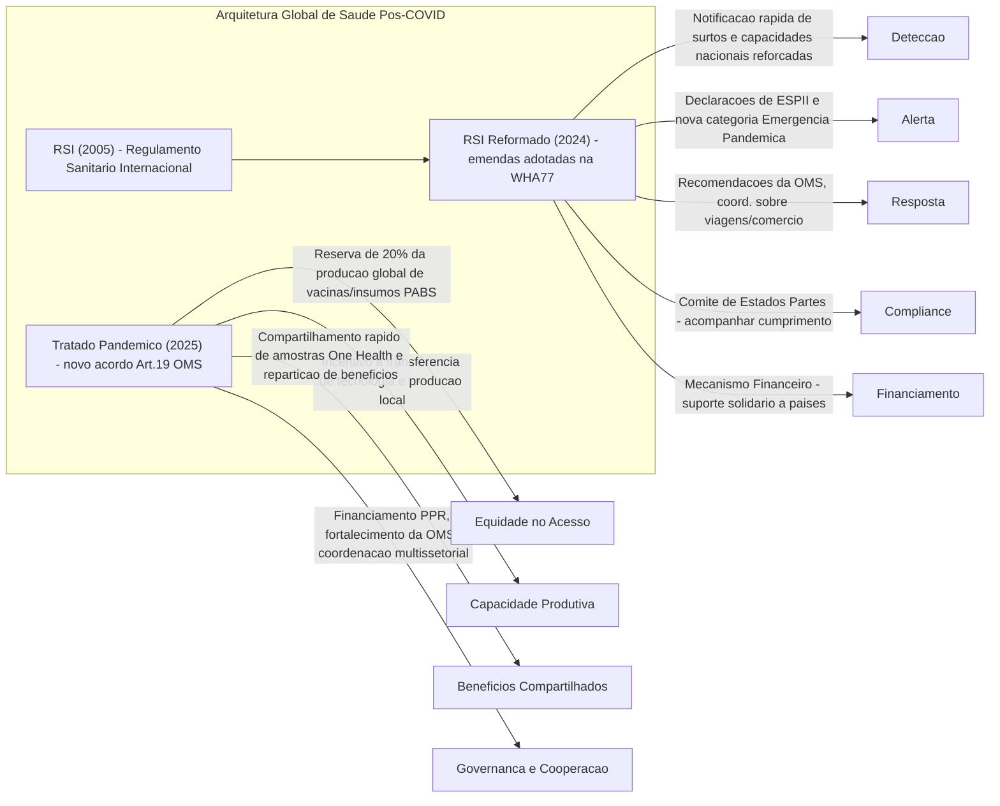

# Os Acordos Internacionais da Saúde: Do Regulamento Sanitário Internacional à Reforma da Arquitetura Pós-Pandemia

## Introdução

A pandemia de COVID-19 colocou em xeque a governança global da saúde, testando os instrumentos internacionais existentes e expondo lacunas significativas na preparação e resposta coletiva a emergências sanitárias. **Como a comunidade internacional reagiu?** Lançou-se uma agenda ambiciosa de reformas: desde o fortalecimento do **Regulamento Sanitário Internacional (RSI – 2005)** até a negociação de um inédito **Tratado Pandêmico** sob a égide da Organização Mundial da Saúde (OMS). Este documento analisa criticamente essa arquitetura, seus pilares jurídicos e políticos, o desempenho durante a crise de COVID-19 e as reformas em curso para aprimorar a segurança sanitária global no mundo pós-pandemia.

> [!note] **Escopo Geral: Governança Sanitária Global em Transformação**
> 
> - **RSI (2005)** – Principal marco legal vigente para emergências de saúde pública internacionais, cujo objetivo é **“prevenir, proteger e controlar a disseminação internacional de doenças”**. Testado pela COVID-19, evidenciou acertos e fragilidades.
>     
> - **Reformas Pós-COVID** – Incluem emendas ao RSI (adotadas em 2024) e a criação de um **novo instrumento jurídico sobre pandemias** (Tratado Pandêmico, negociado até 2025), visando corrigir falhas e institucionalizar princípios como equidade, solidariedade e cooperação científica.
>     
> - **Outros Acordos Relevantes** – A experiência da **Convenção-Quadro para Controle do Tabaco (CQCT)** ilustra sucesso em tratados de saúde, enquanto as tensões entre saúde pública e regras de **Propriedade Intelectual (TRIPS/OMC)** mostram a interdependência entre regimes globais.
>     
> - **Perspectiva Brasileira** – O Brasil figura como ator central nessas negociações, defendendo acesso equitativo, transferência de tecnologia e fortalecimento do multilateralismo em saúde, coerente com sua diplomacia da saúde de longa data.
>     

Nos tópicos a seguir, exploraremos em profundidade cada componente dessa arquitetura, com destaque especial para a negociação do Tratado Pandêmico – seus objetivos, impasses e implicações – e para o papel que o Brasil desempenha na promoção de uma ordem sanitária internacional mais justa e eficaz.

## O Pilar da Segurança Sanitária: O Regulamento Sanitário Internacional (RSI – 2005)

### Natureza e Objetivos do RSI (2005)

O RSI é um **acordo jurídico vinculante** adotado por todos os 194 Estados-membros da OMS, autorizado pelo Artigo 21 da Constituição da OMS. Revisado pela última vez em 2005 após a epidemia de SARS, entrou em vigor em 2007 como a espinha dorsal da segurança sanitária global. Seu propósito central, conforme o Artigo 2, é **“prevenir, proteger contra, controlar e dar resposta de saúde pública à disseminação internacional de doenças”**, evitando interferências desnecessárias no tráfego e comércio internacionais.

Para alcançar esses objetivos, o RSI estabelece **obrigações claras para os países e para a OMS**. Alguns elementos-chave incluem:

- **Notificação Imediata de Emergências:** Países devem reportar à OMS, dentro de 24 horas, qualquer evento que possa constituir uma Emergência de Saúde Pública de Importância Internacional (ESPII). Critérios em um anexo (Anexo 2) auxiliam os Estados a identificar tais ameaças.
    
- **Capacidades Nacionais Mínimas:** Os Estados-partes se comprometem a desenvolver e manter **capacidades essenciais de vigilância e resposta** – como laboratórios, sistemas de detecção, recursos humanos treinados e planos de preparação. Devem também designar um **Ponto Focal Nacional do RSI** ativo 24/7 para comunicação com a OMS.
    
- **Cooperação Internacional:** Espera-se a colaboração mútua entre países, com assistência técnica e financeira aos Estados que necessitem fortalecer suas capacidades, especialmente países em desenvolvimento.
    
- **Papel da OMS:** A OMS coleta e avalia informações sobre possíveis emergências, podendo usar fontes não oficiais além dos governos. Em caso de ameaça, pode convocar um Comitê de Emergência de especialistas para assessorar o Diretor-Geral na **declaração de uma ESPII (PHEIC)**. Uma vez declarada, a OMS emite **Recomendações Temporárias** sobre medidas a serem tomadas (por ex., vigilância, viagens, comércio), cabendo aos países segui-las.
    

Em suma, o RSI 2005 representa um contrato coletivo: **Estados abrem mão de certo isolamento decisório em prol de transparência e resposta coordenada** a surtos, enquanto a OMS atua como guardiã e coordenadora da segurança sanitária global.

### Críticas e Limitações: Lições da Pandemia de COVID-19

Embora o RSI constitua a referência legal para emergências internacionais, a pandemia de COVID-19 expôs **fragilidades importantes** em sua implementação e enforcement:

- **Cumprimento Deficiente e Falta de Mecanismos de Sanção:** O RSI confia na cooperação voluntária dos Estados, sem prever sanções formais em caso de descumprimento. Não há um sistema robusto de **accountability** – a OMS não possui poderes de inspeção ou coercitivos para garantir que os países honrem obrigações como notificar surtos ou compartilhar informações. Durante a COVID-19, viu-se países ignorando recomendações da OMS ou omitindo dados sem consequência legal imediata.
    
- **Atrasos e Falhas de Transparência:** O início do surto de SARS-CoV-2 revelou reticências e atrasos na comunicação. Houve críticas de que a China demorou a compartilhar informações completas nos estágios iniciais. De modo geral, **faltou rapidez e transparência na troca de informações** entre países – exatamente o que o RSI buscava assegurar. Essa lentidão inicial comprometeu a capacidade de “apagar o incêndio” antes de se alastrar globalmente.
    
- **Violações unilaterais (ex. restrições de viagem não justificadas):** Diversos países impuseram restrições de viagem e comércio além do recomendado pela OMS, especialmente no início da pandemia, contrariando o Artigo 43 do RSI. Esse artigo permite medidas adicionais apenas se baseadas em evidências científicas e recomendações da OMS, e proíbe ações mais restritivas do que o necessário. Ainda assim, em 2020 mais da metade dos países ignorou essas diretrizes – por exemplo, fechando fronteiras a viajantes de certas origens – muitas vezes **sem notificar a OMS**, violando a obrigação de informar medidas que interfiram no tráfego internacional. Além de pouco efetivas para conter o vírus, tais ações unilaterais minaram a confiança mútua e **“frustraram a capacidade da OMS de coordenar a resposta global”**.
    
- **Ausência de Incentivos e Assistência vinculante:** Embora o RSI preveja que países colaborem e se assistam, na prática não havia mecanismos concretos para **viabilizar apoio financeiro ou compartilhamento de insumos** durante a crise. Países de baixa renda ficaram dependentes de doações ad hoc de vacinas e equipamentos, expondo a falta de disposições mais firmes sobre **solidariedade e repartição de recursos** em emergências.
    
- **No limiar de uma pandemia, RSI revelou-se limitado:** Vale notar que o RSI não continha sequer a palavra “pandemia”. A OMS declarou a COVID-19 uma ESPII em 30 de janeiro de 2020, acionando as obrigações do RSI, mas só rotulou oficialmente de “pandemia” em 11 de março de 2020 – um termo sem base jurídica no RSI. Essa ausência de categoria específica pode ter retardado a mobilização máxima; muitos países não agiram com a urgência necessária até verem o vírus disseminado em vários continentes. Ou seja, **o alerta global soou, mas não disparou todas as sirenes nacionais**, em parte por limites de definição e percepção de risco.
    

Em retrospecto, **COVID-19 comprovou que o RSI (2005), embora necessário, não era suficiente**. Conforme resumido por especialistas, **“o RSI carece de mecanismos robustos de responsabilização, fiscalização e transparência”**. A capacidade da OMS de comandar a coordenação global ficou aquém do ideal diante de **soberanias nacionais relutantes** e **interesses divergentes**. Esse diagnóstico impulsionou uma forte pressão por reformas: tanto uma atualização do próprio RSI, quanto a concepção de um novo tratado internacional que complementasse e suprisse o que o RSI não abrange.

## A Agenda de Reformas Pós-Pandemia (Foco Principal)

Diante das falhas expostas pela COVID-19, a comunidade internacional lançou mão de uma **agenda dupla de reformas** sob a OMS: (1) **negociar um novo instrumento global sobre pandemias** – frequentemente apelidado de “tratado pandêmico” – para fortalecer a preparação e resposta, e (2) **revisar o RSI (2005)** através de emendas que o tornem mais efetivo e alinhado às lições da pandemia. Ambos os processos ocorreram em paralelo, interligados pelo objetivo comum de **construir uma arquitetura de segurança sanitária mais robusta, equitativa e vinculante** para o futuro.

### A Negociação de um “Tratado Pandêmico”

#### Origens e Processo Negocial

No **pico da pandemia, em dezembro de 2021**, os países-membros da OMS decidiram dar um passo histórico: estabeleceram um **Órgão de Negociação Intergovernamental (INB)** para elaborar e negociar um **“convênio, acordo ou outro instrumento internacional sobre prevenção, preparação e resposta a pandemias”**. Esse mandato, adotado numa sessão especial da Assembleia Mundial da Saúde, sinalizou o reconhecimento de que apenas remendar o RSI não bastaria – **era preciso um tratado global dedicado a pandemias**, sob a autorização do Artigo 19 da Constituição da OMS (que permite adoção de tratados pela Assembleia).

O INB conduziu um processo intenso: **13 rodadas formais de negociação**, além de inúmeras consultas informais, ao longo de 2022-2025. Delegados de todos os continentes se debruçaram sobre propostas textuais, muitas vezes até altas horas, tentando conciliar visões muito distintas sobre como enfrentar a próxima pandemia de forma mais justa e eficaz. Em abril de 2025, após mais de três anos de trabalho, **concluiu-se um rascunho de acordo**. Esse projeto foi submetido à 78ª Assembleia Mundial da Saúde (maio de 2025) para apreciação.

> **Objetivo Geral do Tratado:** “prevenir, preparar-se e responder a pandemias” doravante, fortalecendo a coordenação global em todos esses estágios. Em outras palavras, criar uma estrutura complementar ao RSI focada especificamente em **ameaças pandêmicas**, incorporando as lições da COVID-19 quanto a **equidade, solidariedade e cooperação multissetorial**.

A seguir, examinamos os **principais pontos do conteúdo negociado** – especialmente aqueles que suscitaram debates acalorados – e como esses foram resolvidos (ou não) no texto final.

#### Principais Objetivos e Elementos Controversos do Tratado Pandêmico

**1. Garantir Maior Equidade no Acesso a Contramedidas Médicas**  
Um consenso emergiu de que não se poderia repetir o “*apartheid vacinal*” visto em 2021, quando países ricos abocanharam a maioria das vacinas contra COVID-19 enquanto nações pobres ficavam de mãos vazias. Assim, **equidade** tornou-se palavra de ordem. O tratado busca operacionalizá-la de várias formas concretas:

- **Reserva de Produtos para Distribuição Global:** Instituiu-se no texto a criação de um **Sistema de Acesso a Patógenos e Compartilhamento de Benefícios (em inglês, _Pathogen Access and Benefit-Sharing System_ – PABS)**. Pelo PABS, países e laboratórios compartilham rapidamente amostras de patógenos emergentes (vírus, etc.) com a rede global, e **como contrapartida, os fabricantes de contramedidas devem disponibilizar uma parcela da produção resultante para a OMS distribuir equitativamente**. A meta fixada foi ambiciosa: **20% de todos os produtos pandêmicos (vacinas, tratamentos, diagnósticos) seriam reservados ao mecanismo global, dos quais pelo menos 10% doados e o restante a preços acessíveis**. Em termos práticos, se uma empresa produzir 100 milhões de doses de vacina pandêmica, 20 milhões iriam para um pool internacional gerido pela OMS (10 milhões gratuitamente, 10 milhões vendidas a baixo custo). Isso garantiria que, mesmo que países ricos comprem a maior parte, uma fatia significativa alcançaria populações vulneráveis ao redor do mundo simultaneamente. Trata-se de um **avanço inédito em compromissos de acesso equitativo**, inspirado em parte pelo **Marco de Preparação para Pandemia de Influenza (PIP)** de 2011, que já previa troca de vírus por acesso a vacinas, mas agora estendido a quaisquer pandemias.
    
- **Distribuição e alocação justas:** O tratado endossa fortalecer mecanismos tipo COVAX (consórcio que distribuiu vacinas COVID-19) e desenvolver planos de alocação global para evitar **nacionalismo de vacinas**. Prevê ainda cooperação para remover barreiras logísticas e **proibir proativamente restrições de exportação de insumos críticos** durante pandemias, problema que afetou severamente suprimentos em 2020.
    

Em suma, a dimensão da equidade de acesso busca responder ao apelo de que “ninguém estará seguro até todos estarem seguros” – lema frequentemente citado nos debates.

**2. Transferência de Tecnologia e Diversificação da Produção**  
Outra lição da COVID-19: concentração geográfica da fabricação de vacinas e medicamentos deixou regiões inteiras dependentes de importações. O tratado, portanto, enfatiza a necessidade de **descentralizar a capacidade produtiva**, fortalecendo indústrias regionais em países em desenvolvimento. Os pontos centrais incluem:

- **Compromisso de Transferência de Tecnologia:** Os países concordam em **“facilitar a transferência de tecnologia e know-how relacionados à produção de produtos de saúde pandêmicos”**. Na prática, isso significaria incentivar parcerias para que fábricas na África, América Latina e Ásia possam produzir vacinas, testes e tratamentos novos. Contudo, a redação exata deste compromisso foi um **campo de batalha diplomático**. O texto base afirmava que a transferência ocorrerá **“em termos mutuamente acordados”**, linguagem típica em acordos globais que indica voluntariedade e consenso entre as partes envolvidas (donos da tecnologia e receptores). Países desenvolvidos, notadamente membros da União Europeia, pressionaram por adicionar explícitamente que toda transferência será **“voluntária”**. Alemanha, em particular, insistiu em gravar essa palavra, temendo que a ausência dela pudesse abrir brecha para obrigatoriedade ou imposições às empresas. Do outro lado, muitos países em desenvolvimento protestaram: entendiam que **“mutuamente acordado” já implica voluntariedade** e que frisar isso só enfraquecia o espírito de cooperação, praticamente **consagrando o modelo atual no qual fabricantes só compartilham tecnologia se quiserem**. Trinta juristas de renome escreveram aos negociadores alertando que insistir em “voluntária” minaria a capacidade dos governos de usar medidas não-voluntárias (como licenças compulsórias) mesmo em emergências. Argumentaram que **“consagrar a transferência de tecnologia como ‘voluntária’ no acordo pandêmico seria institucionalizar uma abordagem que falhou durante a COVID-19”** – afinal, naquele contexto, quase nenhuma empresa voluntariamente licenciou suas vacinas para fabricantes do Sul global. Esse embate Norte-Sul sobre a natureza do compromisso de tecnologia foi um dos mais árduos da negociação. **O resultado?** Um compromisso textual: o tratado menciona a transferência “em termos mutuamente acordados” (mantendo a possibilidade de acordos voluntários caso a caso), mas **sem adicionar a palavra “voluntária” diretamente**, evitando tolher a soberania dos Estados de, por exemplo, legislarem mecanismos de compartilhamento forçado em crises. Ainda assim, o tom geral reflete mais **incentivo e facilitação** do que obrigação mandatória – um ponto considerado aquém do desejado por países como Índia e África do Sul, que queriam garantias mais firmes.
    
- **Hubs de Produção Regional:** O texto também promove a criação de **capacidade de P&D e fabricação em todas as regiões**. Fala-se em **“construir capacidades de pesquisa e desenvolvimento geograficamente diversificadas”**, evitando dependência de poucos fornecedores. Isso alinha-se a iniciativas já em curso, como o hub de mRNA na África do Sul apoiado pela OMS. O tratado busca fornecer respaldo político e legal para expansão de tais polos.
    
- **Compartilhamento de Conhecimento e Licenciamento:** Há previsão de mecanismos voluntários de compartilhamento de propriedade intelectual, como repositórios de patentes, expansões do programa C-TAP (Covid-19 Technology Access Pool), e incentivo a **licenciamentos compulsórios coordenados** em emergências. Embora nada disso seja absolutamente obrigatório, o acordo reconhece explicitamente que **flexibilidades de propriedade intelectual podem e devem ser usadas para proteger a saúde pública**. Essa linguagem – importada diretamente da Declaração de Doha sobre TRIPS e Saúde Pública – foi uma vitória para o bloco em desenvolvimento, garantindo que o tratado **não fique omisso quanto ao direito de ignorar patentes em prol da vida**.
    

**3. Compartilhamento de Patógenos e de Benefícios**  
A reciprocidade entre fornecer dados biológicos e receber os frutos terapêuticos desse dado tornou-se um **tema central**, muitas vezes referido como _access and benefit-sharing (ABS)_. O tratado pandêmico aborda isso estabelecendo o já mencionado **PABS (Pathogen Access and Benefit-Sharing System)**. Vamos detalhar seu funcionamento e controvérsias:

- **Acesso a Patógenos:** Países que detectarem um agente patogênico perigoso se comprometem a rapidamente compartilhar amostras e informações genéticas dele com a comunidade internacional, por meio de bancos de dados e laboratórios de referência designados pela OMS. Essa troca ágil é crucial para que vacinas e diagnósticos sejam desenvolvidos o quanto antes (por exemplo, sequenciaram o SARS-CoV-2 em semanas em 2020, permitindo criar testes e protótipos de vacina). No entanto, muitos países – especialmente megadiversos ou endêmicos – temem ser prejudicados: **e se fornecerem um vírus e outros lucram com a vacina primeiro?** Daí a demanda por **benefit-sharing**.
    
- **Repartição de Benefícios:** Para equilibrar, o tratado define que aqueles que se beneficiarem dos recursos biológicos compartilhados (como as empresas farmacêuticas desenvolvendo contramedidas a partir dos patógenos) devem conceder de volta benefícios tangíveis. **O requisito de 20% da produção ao PABS** já comentado é o principal mecanismo de benefício coletivo. Adicionalmente, discute-se contribuições financeiras a um fundo internacional de pandemias ou transferência de tecnologias derivadas. Em suma, **se um país cumpre seu dever de alertar e compartilhar o vírus, ele não ficará “de mãos abanando” – terá prioridade em receber vacinas/insumos gerados a partir daquele vírus**. Isso também cria um incentivo positivo à transparência: em vez de esconder um surto com receio de isolamento ou de perder vantagem, o país saberá que ao compartilhar, ajudará o mundo e a si próprio via acesso privilegiado aos contra-medidas.
    
- **Debate Político:** Esse componente mobilizou debates Norte-Sul de longa data, similares às negociações ambientais sobre recursos genéticos. Países desenvolvidos temiam que um sistema rígido demais de repartição pudesse **atrasar o compartilhamento rápido de amostras** (se muitos termos e condições forem negociados). Já países em desenvolvimento, inclusive o grupo africano, consideraram o ABS **não-negociável** – sem ele, _“não entregaríamos o acordo do RSI reformado”_, chegaram a sinalizar. O equilíbrio encontrado foi incluir o PABS no tratado, com parâmetros claros (20%/10%), mas deixando detalhes operacionais para serem refinados por protocolos futuros. Importante: o ABS do tratado pandêmico cobre _todos os patógenos de potencial pandêmico_, não apenas influenza como no PIP Framework. Trata-se, portanto, de ampliar para um âmbito geral um princípio já testado no caso da gripe aviária.
    

**4. Outros Aspectos Relevantes do Tratado**  
Além dos três eixos centrais acima (equidade no acesso, tecnologia/produção, patógenos/benefícios), o tratado pandêmico abrange uma série de **outros temas importantes**, completando uma abordagem holística à segurança sanitária:

- **Prevenção & One Health:** O acordo enfatiza abordar as causas das pandemias na origem. Adota formalmente o conceito de **“Uma Só Saúde” (One Health)** – reconhecendo que a saúde humana está interligada à saúde animal e ambiental. Isso implica compromissos de monitorar doenças zoonóticas (que saltam de animais para humanos), reduzir riscos em mercados de animais silvestres, controlar resistência antimicrobiana e integrar setores (saúde, agricultura, meio ambiente) nos planos de prevenção. Artigos dedicados tratam de **vigilância integrada** e compartilhamento de dados epidemiológicos e genômicos entre países para detecção precoce de ameaças. Vários países elogiaram a centralidade da abordagem One Health no tratado como um de seus pontos altos.
    
- **Fortalecimento de Sistemas de Saúde e Mão-de-Obra:** Reconhecendo que uma resposta eficaz depende de sistemas nacionais resilientes, o tratado inclui obrigações de investir em **sistemas de saúde fortalecidos** e expandir a força de trabalho de saúde. Menciona-se desenvolver uma força-tarefa global de emergências, treinar profissionais e estabelecer **redes de resposta rápida**. Isso vincula a agenda de pandemia à de **Cobertura Universal de Saúde**, para que choques pandêmicos não colapsem serviços essenciais.
    
- **Financiamento Sustentável:** Outra inovação é a proposta de um **mecanismo financeiro internacional coordenado para pandemias**. Ele complementaria fundos existentes (como o Fundo Pandêmico do Banco Mundial) e possibilitaria mobilizar recursos rapidamente quando uma emergência é declarada. A ideia é garantir que falta de dinheiro não seja o gargalo para ações de resposta, e apoiar países de baixa renda a implementar medidas de controle. Porém, aqui também houve **impasse**: na reta final, países africanos queriam que o tratado já criasse um fundo robusto, enquanto Estados Unidos e outros ricos resistiram a assumir obrigações financeiras específicas. Optou-se por termos genéricos de “mobilizar financiamento” e “coordenar mecanismos”, cabendo a instâncias como o G20 detalhar aportes voluntários.
    
- **Governança e Monitoramento:** O acordo propõe a criação de **Conferências das Partes (COP)** periódicas – similar aos tratados ambientais e à CQCT – onde os países se reunirão para avaliar a implementação, adotar protocolos adicionais e ajustar o acordo conforme necessário. Isso confere dinamismo e acompanhamento político de alto nível. Ademais, sugere-se um **painel consultivo de especialistas** e envolvimento da sociedade civil na revisão dos progressos. Esses fóruns, espera-se, poderão iluminar onde falhas persistem (por ex., se um país não compartilha dados ou se fabricantes não cumprem o PABS). No entanto, a natureza das medidas corretivas continua diplomática e branda; não há sanções automáticas pelo tratado, refletindo de novo a sensibilidade com soberania.
    
- **Soberania Nacional e Flexibilidade:** Falando em soberania, vale destacar um trecho explícito do texto final: **“nada no acordo deverá ser interpretado como concessão de autoridade à OMS para ditar ou obrigar ações específicas nos países”**. Isso inclui lockdowns, exigências de vacinas ou fechamento de fronteiras – medidas assim continuam sendo decisões soberanas. Tal cláusula foi inserida para rebater desinformação circulante de que o tratado daria poder à OMS de impor quarentenas ou suprimir liberdades nacionais. Vários governos (incluindo o Brasil e os EUA) fizeram questão de afirmar que o tratado **respeita integralmente a soberania dos Estados**. Dessa forma, o acordo equilibra obrigações coletivas com a garantia de que a OMS não se tornará um “governo mundial da saúde”. A tensão entre **ação coletiva vs. autonomia** permeou as discussões e esse dispositivo deixou claro o limite político do consenso.
    

**5. Controvérsias Norte-Sul e Saúde vs. Interesses Comerciais**  
Os itens acima já indicam por si diversas tensões geopolíticas que moldaram a negociação. Em essência, emergiram **dois blocos de interesse** (com nuances internas) em muitos debates:

- **Países de Renda Baixa e Média (Sul Global)**: Buscavam um tratado transformador, com **obrigações robustas de solidariedade**. Para eles, **equidade não podia ser só discurso** – era preciso amarrar por escrito que, em pandemias, vacinas e remédios seriam compartilhados, que know-how seria socializado e que recursos fluiriam aos mais necessitados. Liderados por África do Sul, Índia, Indonésia, Brasil e outros, esse grupo pressionou por linguagem forte em **tecnologia (transferência obrigatória ou facilitada)**, **PABS vinculante**, **financiamento novo** e **flexibilização de patentes**. Sua posição partia da realidade vivida: na COVID-19, viram filas de espera por vacinas enquanto fábricas no Norte produziam; viram a dependência de importar kits de PCR, ventiladores e EPI; e notaram que sem instrumentos jurídicos, a solidariedade ficou ao sabor da caridade ou de interesses políticos. Assim, queriam **recalibrar a ordem de saúde para corrigir assimetrias estruturais**.
    
- **Países Desenvolvidos (Norte Global)**: Reconheciam a necessidade de um acordo (afinal, pandemias não poupam ninguém) e apoiavam medidas de cooperação, mas de forma **mais cautelosa e flexível**. Preocuparam-se em **preservar incentivos à inovação** – daí sua ênfase em que transferência de tecnologia fosse voluntária, temendo que exigências pudessem desestimular empresas farmacêuticas a investir em P&D de vacinas se achassem que teriam de compartilhar segredos industriais sem garantia de retorno. Defenderam fortemente a **proteção à propriedade intelectual** como motor da criação de novas contramedidas, embora admitindo as flexibilidades já existentes (não queriam ir além do que TRIPS já permite). No acesso a produtos, preferiram confiar em mecanismos voluntários tipo Covax e doações, em vez de reservar cotas obrigatórias (alguns países inicialmente se opuseram à porcentagem fixa no PABS, argumentando que _“pode faltar vacina para nossas próprias populações”_). Também houve receio de **compromissos financeiros abertos** – e.g., um fundo pandêmico com aportes definidos foi rejeitado, pois parlamentos poderiam não aprovar desembolsos automáticos. Resumindo, o Norte Global quis um tratado **menos prescritivo, mais “enabling” do que “enforcing”**, enfatizando termos como _incentivar_, _facilitar_, _colaborar_, ao invés de _assegurar_, _garantir_, _obrigar_. Estados Unidos, União Europeia, Japão e outros frequentemente aliviaram trechos do texto durante as negociações, com esse intuito.
    
- **Interesses Comerciais e de Saúde Pública:** Subjacente a esse embate diplomático estava o conflito latente entre **priorizar a saúde pública global vs. proteger interesses comerciais nacionais e empresariais**. De um lado, ativistas de saúde e países do Sul clamavam que vidas deviam vir antes do lucro em emergências – pedindo quebra de patentes, por exemplo. De outro, **a indústria farmacêutica pressionou nos bastidores (e publicamente)** para garantir que o tratado não enfraquecesse direitos de propriedade intelectual ou introduzisse controles de preços. A Federação Internacional de Fabricantes Farmacêuticos (IFPMA) declarou reiteradamente ao INB que **“respeito à propriedade intelectual em tempos de pandemia” e “transferência de tecnologia em bases voluntárias”** eram fundamentais para contar com a expertise da indústria. Isso ecoou nos posicionamentos de alguns países desenvolvidos (Alemanha foi citada como particularmente alinhada a essa visão, ao brigar pela inclusão de “voluntária” na seção de tecnologia). Assim, o texto final reflete compromissos: reafirma a importância da PI para inovação, mas também ressalta que TRIPS não deve impedir medidas de saúde pública – uma forma de **conciliar os dois lados no papel**.
    

Esse embate de interesses se cristalizou em vários impasses. Por exemplo, **na véspera da Assembleia Mundial da Saúde de 2024, as negociações do tratado fracassaram temporariamente** por falta de consenso, sobretudo devido à **“resistência de europeus e americanos em aceitar cláusulas de transferência de tecnologia e acesso a medicamentos”** aos países em desenvolvimento. O Brasil qualificou esse colapso momentâneo como _“um duro golpe nas ambições da OMS de evitar repetir os erros da COVID-19”_, apontando que as **assimetrias econômicas e tecnológicas ficaram expostas**. Posteriormente, para retomar o processo, marcou-se novo prazo até 2025 – o que de fato levou ao consenso final, mas com concessões mútuas.

No texto final acordado, podemos observar claramente os **equilíbrios diplomáticos** resultantes desses choques:

- Há menção repetida à **equidade como princípio orientador** (vitória retórica do Sul), e instrumentos como PABS e objetivos de tech transfer que, se implementados de boa-fé, representam ganhos concretos para a saúde pública.
    
- Porém, muitos desses vêm acompanhados de **condicionalidades brandas**: “segundo termos mutuamente acordados”, “conforme legislação nacional”, etc., o que potencialmente esvazia sua obrigatoriedade estrita. **Não há sanções** se um país não compartilhar patógeno ou se uma farmacêutica não aderir ao PABS – confia-se na pressão política e moral.
    
- **Propriedade intelectual permanece intocada diretamente**: o tratado não suspende patentes automaticamente em pandemia, apenas **relembra que países podem usar flexibilidades existentes**. Desenvolvedores no Norte celebraram essa proteção, enquanto defensores da saúde lamentam que nenhuma nova ferramenta jurídica (como um “waiver” multilateral pré-acordado) tenha sido incluída.
    
- **Tecnologia: compromisso voluntarista** – ficou aquém do pedido original de países como a África do Sul, mas ao menos não bloqueia ações unilaterais (um governo ainda poderia, por exemplo, acionar uma licença compulsória doméstica para forçar uma tecnologia vacinal a ser produzida localmente).
    

Em síntese, o **Tratado Pandêmico resultante é um documento de compromissos híbridos**, refletindo o melhor esforço de consenso possível em um mundo dividido. Para uns, ele **“capturou com sucesso a prioridade da equidade na PPR pandêmica”**, como declararam países do Norte. Para outros, **a equidade ainda poderá ficar na teoria se não houver implementação concreta** – preocupação vocalizada por países do Sul durante a adoção. A verdadeira prova virá na próxima crise: veremos se as promessas de solidariedade se traduzem em doses de vacina entregues e tecnologias compartilhadas.

#### Status Atual: Adoção e Próximos Passos

Em **Maio de 2025**, a 78ª Assembleia Mundial da Saúde entrou para a história ao **adotar o Tratado Global sobre Pandemias**. Numa votação histórica, **124 países votaram a favor, 0 contra e 11 absteram-se** – ou seja, aprovação praticamente unânime. A resolução de adoção foi saudada com aplausos; delegados celebraram “um marco importante e histórico” para fortalecer a segurança sanitária global. Diversos países, do Haiti à Áustria, enfatizaram em seus discursos que **equidade e solidariedade devem guiar a implementação**. Membros do INB ressaltaram que _“nenhum país pode enfrentar sozinho uma crise global”_, justificando o pacto firmado.

Entretanto, a unanimidade superficial esconde nuances: **Índia e Colômbia**, por exemplo, mesmo votando a favor, registraram cautela quanto a disposições de **transferência de tecnologia e direitos de propriedade intelectual** no tratado, sinalizando que pretendem analisá-las cuidadosamente. Tais colocações sugerem que durante a implementação e possíveis protocolos adicionais, haverá novas rodadas de debate sobre esses temas sensíveis. Por outro lado, União Europeia, EUA e outros reafirmaram seu apoio enfatizando que o tratado respeita a inovação e a soberania, o que para eles foi um triunfo.

**E depois da adoção?** O tratado, por ser aprovado sob Artigo 19 da OMS, necessita agora **ratificação pelos países conforme seus processos nacionais**. Entrará em vigor após um certo número de ratificações (esse detalhe será especificado no texto final). A expectativa é que a maioria dos países aderirá formalmente, mas há incógnitas – por exemplo, nos EUA, opositores políticos sinalizam rejeição a qualquer acordo que pareça “ceder poder à OMS”, o que pode impedir a ratificação pelo Senado americano. Alguns países podem demorar ou condicionar a adesão a clarificações.

Adicionalmente, a primeira **Conferência das Partes** deverá ser convocada após a entrada em vigor, para começar a operacionalizar elementos como o PABS, financiamento, etc. Organismos da OMS e coalizões como a **Pandemic Fund** do G20 precisarão trabalhar em sinergia. Ou seja, há **muito trabalho pela frente** para tornar realidade os dispositivos do tratado. Ainda assim, seu nascimento formal já representa um **pilar inédito na governança da saúde** – um compromisso de mais alto nível político para que, na próxima pandemia, o mundo responda de forma mais coordenada e justa do que em 2020-21.

### A Reforma do Próprio Regulamento Sanitário Internacional (RSI)

Em paralelo ao tratado pandêmico, correu um segundo processo crucial: a **atualização do RSI (2005)** via emendas. Em janeiro de 2022, o Conselho Executivo da OMS apelou aos países que considerassem emendas ao RSI à luz da COVID-19. Logo depois, em maio de 2022, a 75ª Assembleia Mundial criou um **Grupo de Trabalho sobre Emendas ao RSI (WGIHR)** e convocou os Estados-partes a submeter propostas até final de setembro daquele ano. Choveram ideias: **foram mais de 300 emendas propostas, cobrindo metade dos artigos do regulamento**.

Após intensas negociações (8 sessões formais entre nov/2022 e abr/2024), os países **chegaram a um consenso de pacote de emendas** em maio de 2024, que foi adotado pela 77ª Assembleia Mundial da Saúde em 1º de junho de 2024. Importante: a adoção se deu **por consenso, sem voto**, mostrando um compromisso coletivo em fortalecer o RSI. As emendas entram em vigor em maio de 2025 (12 meses após a notificação oficial da OMS aos países) para todos os Estados que não rejeitarem formalmente – e espera-se que quase todos as aceitem, dado o consenso obtido.

Quais foram as principais mudanças aprovadas no RSI (vamos chamá-lo de **RSI-2024** para distinguir da versão 2005 original)?

**1. Conceito de “Emergência Pandêmica”**  
Preencheu-se a lacuna conceitual destacada pela COVID-19: introduziu-se formalmente a definição de **“Emergência de Pandemia”** no texto. Essa categoria corresponde a uma situação mais grave ou abrangente que uma ESPII comum – tipicamente, quando um surto atingiu proporções de pandemia global. A ideia é que, ao declarar uma “Emergência Pandêmica” (além de declarar ESPII), a OMS possa **acionar automaticamente medidas reforçadas de coordenação e resposta**. Por exemplo, espera-se que isso **“aumente o nível de alarme a um patamar mais alto do que o de uma ESPII”**, desencadeando compromissos especiais: reuniões urgentes de ministros da saúde, mobilização de recursos internacionais pelo novo fundo (ver abaixo), e possivelmente recomendações temporárias mais amplas e de longo prazo. Em síntese, o mundo não ficará mais no limbo semântico se outro vírus se espalhar globalmente – haverá um **rótulo jurídico claro (“pandemic emergency”) para elevar a urgência** e uma resposta coordenada correspondente da OMS.

**2. Mecanismo Financeiro de Solidariedade**  
Reconhecendo que **“parte da falha do RSI na COVID foi a falta de financiamento e insumos para países em desenvolvimento cumprirem obrigações”**, aprovou-se a criação de um **Mecanismo de Financiamento Coordenado** no âmbito do RSI. Este fundo, sob orientação da Assembleia Mundial da Saúde, tem dupla função: (a) **apoiar o fortalecimento de capacidades básicas** (vigilância, laboratórios, RH) nos países de forma contínua, e (b) **permitir mobilização rápida de recursos em caso de emergência pandêmica** para aquisição de vacinas, EPI, etc., para quem precisar. Trata-se de instituir um pilar de **“compromisso com a solidariedade e equidade”** no RSI, conforme destacou o co-presidente do WGIHR. Em outras palavras, a comunidade internacional se compromete a **colocar dinheiro onde antes havia só boas intenções**, ajudando nações menos favorecidas a detectar e conter surtos antes que virem pandemias.

Mesmo aqui houve debate: o **Grupo Africano pressionou por um fundo robusto** e facilmente acessível, enquanto EUA e alguns aliados **resistiram** a algo que parecesse obrigação financeira automática. O consenso final estabelece o mecanismo, mas detalhes de capitalização ficarão a cargo de decisões futuras. De todo modo, a existência formal do mecanismo é um passo notável: **pela primeira vez o RSI incorpora solidariedade financeira explícita**, contrastando com a versão 2005 que nada dizia sobre financiamento.

**3. Fortalecimento de Capacidades e Assistência Mútua**  
Foram incluídas ou refinadas obrigações referentes ao desenvolvimento das chamadas **“core capacities”** do RSI. Os países reiteraram compromissos de investir em sistemas de saúde pública, e as emendas **explicitam a necessidade de apoio internacional** para isso. Uma novidade é a expectativa de que países com mais recursos **contribuam tecnicamente e financeiramente** para que países menos desenvolvidos alcancem as metas de capacidade – institucionalizando práticas como as avaliações externas conjuntas (JEE) e planos nacionais de ação para segurança sanitária, que antes eram voluntários. O RSI-2024 também menciona integração com setores não tradicionais (One Health aparece implicitamente) e necessidade de envolver comunidades locais na preparação e resposta, reconhecendo aspectos de confiança pública (dado o impacto de desinformação e hesitação vacinal na pandemia).

**4. Monitoramento de Implementação e Compliance**  
Um dos pontos mais inovadores – embora controversos – das emendas de 2024 foi criar mecanismos formais para **acompanhar o cumprimento do RSI pelos Estados** e melhorar a transparência. Destacam-se duas criações institucionais:

- **Comitê de Estados Partes do RSI:** Será um fórum composto por representantes de todos os países, reunindo-se pelo menos a cada dois anos, com mandato de **“promover e apoiar a implementação efetiva”** do RSI. Ele poderá analisar relatórios de países, identificar lacunas comuns, facilitar cooperação e emitir recomendações não vinculantes para aprimorar o cumprimento. Importante: o texto sublinha que o comitê terá caráter **“facilitador, consultivo, não punitivo e não adversarial”**, buscando **troca de boas práticas e apoio mútuo** em vez de constrangimento público. Essa caracterização foi decisiva para obter consenso – países não aceitariam um mecanismo intrusivo de fiscalização dura. Assim, o Comitê de Estados Partes lembra mais um **mecanismo de peer review cooperativo** do que um tribunal de cumprimento. Ainda assim, sua existência é significativa: pela primeira vez os países concordam coletivamente em **se autoavaliar periodicamente quanto às obrigações do RSI**, criando certa **pressão de pares**. Se bem conduzido, pode aumentar a responsabilização política (soft accountability).
    
- **Autoridades Nacionais do RSI:** Cada governo deverá designar ou estabelecer uma **Autoridade Nacional do RSI** encarregada de coordenar internamente a implementação do regulamento e servir de ponto de contato de alto nível. Essa figura – distinta do Ponto Focal do RSI (que é mais operacional) – seria responsável por assegurar que todas as agências relevantes domésticas cumpram as obrigações (vigilância, notificação, relatórios anuais, etc.). Em outras palavras, dá-se um status mais elevado ao RSI dentro das estruturas governamentais, tentando evitar que as obrigações sejam negligenciadas por falta de coordenação ou prioridade nacional. Essa Autoridade também interagiria com o novo Comitê de Estados Partes, preparando as avaliações e acompanhando recomendações.
    

Juntas, essas medidas de compliance representam um esforço de **iluminar onde estão as falhas de implementação** e corrigi-las coletivamente, sem ferir soberania. Entretanto, alguns observadores apontaram que a versão final das emendas **diluíu elementos mais incisivos** – por exemplo, havia proposta inicial de um **Mecanismo de Avaliação de Conformidade** mais forte, possivelmente com revisão por especialistas independentes, que acabou não indo adiante. A especialista Nina Schwalbe notou que as emendas **acabaram por retirar a inclusão explícita de um mecanismo de compliance mais robusto**, deixando dúvidas sobre como garantir que países sejam de fato cobrados. Ou seja, **persistem limites**: tudo dependerá do empenho político que se der a esse comitê e se os países o levarão a sério ou não.

**5. Princípio de Equidade e Definição de Produtos de Saúde**  
Outra inserção simbólica importante: o RSI-2024 **reconhece explicitamente o princípio da equidade** na preparação e resposta a emergências. Essa palavra praticamente não aparecia no RSI original. Agora, os países concordaram que equidade deve guiar ações – um reflexo direto da lição de desigualdade da COVID-19. Claro, afirmar o princípio não garante sua realização, mas baliza futuras medidas (por ex., nas recomendações da OMS durante emergências, considerar equidade no acesso a vacinas). Além disso, definiu-se o termo **“produtos de saúde relevantes”** para deixar claro que, ao falar de resposta, o RSI inclui medicamentos, vacinas, diagnósticos e outros insumos essenciais. Essa clarificação evita interpretações restritivas – antes, alguns poderiam alegar que o RSI não cobria, por exemplo, garantir acesso a vacinas, por não estar explícito. Agora, está claro que sim: **vacinas, tratamentos e testes são parte integrante da resposta prevista no RSI**.

**6. Outras Emendas Diversas:**  
Houve também dezenas de ajustes técnicos: melhorias nos procedimentos de declaração de ESPII (por ex., incentivar o Diretor-Geral a considerar declarações _graduais_ ou provisórias se nem todos critérios estão presentes – para ganhar tempo precioso no alerta); encurtar prazos de reporte de eventos (tornar **mais ágil a comunicação inicial de um surto**); prever que **informações genéticas (dados de sequenciamento)** também devem ser compartilhadas, não apenas amostras físicas, etc. Cada linha alterada buscou modernizar o texto frente às realidades da era da genômica e de viagens ultrarrápidas.

**Desafios e Limites Restantes:**  
Mesmo com essas melhorias, o RSI reformado ainda enfrenta **desafios**:

- **Ausência de Coerção Legal:** Tal como o tratado pandêmico, o RSI continuará dependendo essencialmente de pressão política e boa vontade. Não se criaram multas, sanções comerciais ou outras punições a violadores (isso seria inaceitável para muitos países). Assim, caso um Estado oculte um surto ou ignore recomendações da OMS, a consequência formal continuará sendo apenas pedidos de reconsideração por parte da OMS e potencial condenação diplomática. Alguns críticos avaliam que sem “dentes”, o RSI seguirá impotente ante Estados determinados a descumpri-lo. Por isso, houve decepção quando um mecanismo de compliance mais firme ficou de fora no texto final.
    
- **Implementação Desigual:** As obrigações podem esbarrar em falta de capacidade ou vontade. Por exemplo, países precisam investir em vigilância; mas muitos enfrentam restrições orçamentárias. O sucesso de medidas como o Mecanismo Financeiro será crucial para **converter obrigações em realidade**, apoiando tecnicamente e financeiramente quem precisa. Se esse fluxo de apoio não se materializar (por promessas vazias de doadores, etc.), corre-se o risco de alguns países ficarem para trás – o que enfraquece a corrente global de segurança sanitária.
    
- **Dependência do Tratado Pandêmico:** Curiosamente, as negociações do RSI e do tratado tornaram-se interdependentes. Em maio de 2024, relatou-se que o Grupo Africano **condicionou o avanço das emendas do RSI à garantia de que o Tratado Pandêmico seria concluído** até 2025. Sua lógica: reforçar procedimentos é bom, mas sem equidade concreta (vacinas, remédios) garantida no outro instrumento, o RSI revisado seria “muito pouco, muito tarde” para salvar vidas. Isso quase travou as negociações em 2024, já que países desenvolvidos queriam adotar o RSI logo e **dilatar o prazo do tratado por 1-2 anos** alegando divergências pendentes. Ao fim, acordou-se adotar o RSI em 2024, mas com a **decisão paralela de concluir o tratado até a WHA de 2025**. Essa dinâmica mostra que sem as contrapartidas do tratado, os países em desenvolvimento não viam tanto valor em aperfeiçoar regras que eles já cumprem mas que não os protegeram do desequilíbrio na pandemia. **Portanto, a eficácia do RSI reformado está intimamente ligada à implementação do Tratado Pandêmico**. Se este último fracassar em entregar equidade, o RSI sozinho não impede novas desigualdades.
    

Em resumo, as emendas de 2024 **fortaleceram o RSI de forma relevante**, especialmente ao criar mecanismos de financiamento e acompanhamento e ao elevar o foco em equidade e pandemia. O RSI-2024 foi saudado pelo Diretor-Geral Tedros como tendo “fortalecido a pedra angular do direito sanitário internacional”. Ainda assim, **não é uma revolução, mas evolução incremental** – importante, porém limitada pelo que politicamente se pôde acordar. Caberá agora implementar essas melhorias e avaliar, na próxima emergência, se de fato resultam em detecção mais rápida, alerta mais eficaz e resposta mais solidária do que em 2020.

## Outros Acordos Relevantes na Governança da Saúde Global

A governança global da saúde não se resume ao RSI e ao novo tratado pandêmico. Há outros acordos internacionais que interagem ou servem de referência para a cooperação em saúde. Nesta seção, destacamos dois elementos:

1. A **Convenção-Quadro para o Controle do Tabaco (CQCT)** – exemplo de um tratado de saúde bem-sucedido, útil como paralelo histórico.
    
2. A **interface com regimes externos à saúde, em especial o Acordo TRIPS da OMC sobre propriedade intelectual** – cuja interação com saúde pública foi crucial na pandemia e continuará sendo.
    

### A Convenção-Quadro para o Controle do Tabaco (CQCT) – um Caso de Sucesso

Adotada em 2003 e em vigor desde 2005, a **CQCT da OMS** foi o **primeiro tratado internacional de saúde pública negociado sob os auspícios da OMS**. Com 182 países Parte, alcançou adesão quase universal e é frequentemente citada como um **marco histórico na saúde global**. Seu objetivo: **“proteger gerações presentes e futuras das devastadoras consequências sanitárias, sociais, ambientais e econômicas do consumo de tabaco e da exposição à fumaça”**. Para tanto, a convenção estabeleceu uma série de **medidas obrigatórias** para os países, incluindo: proibição de publicidade de cigarros, adoção de embalagens com advertências, criação de espaços livres de fumo, aumento de impostos sobre tabaco, combate ao contrabando, entre outras.

A CQCT se destaca por alguns motivos relevantes para nossa análise:

- **Natureza Legal e Mecanismos de Implementação:** Foi adotada como tratado sob o Artigo 19 da Constituição da OMS (o mesmo fundamento jurídico usado agora para o Tratado Pandêmico). Isso mostrou que é possível usar o poder normativo da OMS para enfrentar ameaças de saúde globais de maneira vinculante. A convenção se tornou **padrão mínimo global** – países podem adotar medidas mais rígidas, mas não menos do que o estipulado. Além disso, a CQCT estabeleceu um **modelo de governança própria**: Conferências das Partes regulares, relatórios periódicos de implementação nacionais, e até protocolos adicionais (como o Protocolo de Combate ao Comércio Ilícito de Produtos de Tabaco). Esses mecanismos criaram uma **cultura de accountability**: países reportam progresso, trocam experiências e são avaliados pelos pares. Não há sanções estritas, mas o escrutínio internacional e doméstico incentivou governos a fortalecer suas políticas antitabaco. Em 10 anos, evidências mostraram que medidas alinhadas à CQCT contribuíram para declínios no tabagismo em várias regiões.
    
- **Enfrentamento de Interesses Comerciais Poderosos:** O sucesso da CQCT envolveu **confrontar a indústria tabagista global**, então extremamente influente. Foi uma batalha de saúde pública vs. interesses comerciais e de lucros – não muito diferente do que vemos com Big Pharma no contexto de pandemias. Na CQCT, a balança pendeu para a saúde: o tratado inclui até uma cláusula (Artigo 5.3) determinando que políticas de saúde pública sobre controle do tabaco **devem estar protegidas dos interesses da indústria do tabaco**. Essa vitória mostrou que é possível, em fórum multilateral, limitar a atuação de corporações cujo produto causa dano sanitário. No caso de um tratado pandêmico, o “inimigo” não é uma indústria específica, mas houve similar tensão com setores farmacêuticos e de tecnologia. A CQCT provou que **acordos de saúde podem sim impor regulamentações drásticas apesar de lobistas contrários**, estabelecendo precedente político.
    
- **Um Foco em Fatores de Risco vs. Emergências:** A CQCT lida com um **fator de risco crônico (tabagismo)**, enquanto o tratado pandêmico lida com **eventos agudos (surtos/pandemias)**. Ainda assim, há paralelos: ambos requerem ação multissetorial, lidam com determinantes (no caso de pandemia, originas zoonóticas, no caso do tabaco, marketing e dependência) e têm implicações econômicas (a CQCT afetou uma grande cadeia produtiva, assim como o tratado pandêmico poderá afetar cadeias de suprimentos médicos e PI). O êxito da CQCT em reduzir a aceitação social do fumo e impulsionar leis nacionais rígidas inspira a esperança de que um tratado pandêmico possa, por exemplo, **difundir e padronizar práticas de preparação e resposta**, tornando politicamente custoso para líderes ignorarem alertas ou para empresas lucrarem em cima da escassez em emergências.
    
- **Estímulo a Novos Tratados de Saúde:** O relativo sucesso da CQCT – considerada **“um momento decisivo para a saúde pública internacional”** – estimulou a ideia de outros tratados em saúde. Nos anos seguintes, houve propostas de tratados sobre álcool, alimentos não saudáveis, resistência antimicrobiana, etc.. Embora não tenham prosperado, essas discussões mantiveram viva a noção de que **instrumentos legais globais podem complementar a ação da OMS** em áreas críticas. Quando a pandemia de COVID-19 eclodiu, muitos imediatamente lembraram: “temos um tratado para tabaco, por que não um para pandemias?” – catalisando apoio político. Ou seja, sem a CQCT pavimentando o caminho e demonstrando viabilidade, talvez fosse ainda mais difícil propor um tratado pandêmico.
    

Em suma, a **CQCT serve como um exemplo encorajador** de que **tratados de saúde podem ter impacto real**. Graças a ela, hoje impostos de cigarro subiram, embalagens têm fotos de alerta em quase todo o mundo e a prevalência global de fumantes adultos estagnou ou caiu (evitando milhões de mortes futuras). É claro que o tratado pandêmico lida com desafios diferentes – vírus imprevisíveis, respostas emergenciais – mas busca igualmente alterar paradigmas (no caso, de reação descoordenada para cooperação solidária). Ambas iniciativas mostram a OMS exercendo um papel normativo forte. **Para o CACDista**, é interessante notar que o Brasil foi ativo também na CQCT (sendo um dos primeiros a ratificar e implementando políticas avançadas de controle do tabaco). A experiência da CQCT fornece lições sobre **mobilização política, envolvimento de sociedade civil (que teve grande peso na luta antitabaco) e necessidade de monitoramento** – todos pertinentes também ao tratado pandêmico.

### A Relação com Outros Regimes: Saúde e Propriedade Intelectual (Acordo TRIPS/OMC)

A saúde global não opera isolada – ela interage com regimes de comércio, propriedade intelectual, direitos humanos e outros. Durante a pandemia de COVID-19, uma interface em particular ganhou destaque: **a relação entre as regras de propriedade intelectual internacionais (Acordo TRIPS da OMC) e o acesso a medicamentos/vacinas**. Essa relação, porém, vem de décadas, e vale contextualizar:

**TRIPS e Saúde – Antecedentes:** O Acordo TRIPS (Trade-Related Aspects of Intellectual Property Rights) de 1994 estabeleceu padrões mínimos globais de proteção a patentes, inclusive para produtos farmacêuticos, como condição da OMC. Isso preocupou países em desenvolvimento, pois patentes prolongadas poderiam encarecer remédios essenciais. Nos anos 1990-2000, travou-se a chamada **“Guerra das Patentes”** em torno dos medicamentos de HIV/AIDS: países como Brasil, África do Sul, Índia e Tailândia enfrentaram grande pressão de farmacêuticas e países desenvolvidos ao tentar produzir ou importar genéricos mais baratos para salvar vidas na epidemia de AIDS. O clímax foi a **Declaração de Doha sobre TRIPS e Saúde Pública (2001)**, onde todos os membros da OMC concordaram que **“o TRIPS não deve impedir os países de tomar medidas para proteger a saúde pública”** e afirmaram o direito dos países usarem **licenciamento compulsório** e outras flexibilidades para acesso a medicamentos. Essa declaração – citada inclusive no preâmbulo do tratado pandêmico – foi uma vitória diplomática do Sul, com forte envolvimento brasileiro.

O Brasil teve papel proeminente: adotou leis permitindo licença compulsória e, em 2007, emitiu uma licença compulsória para um antirretroviral de HIV (efavirenz), reduzindo seu preço drasticamente. Isso consolidou sua imagem de defensor do **princípio de que o direito à saúde prevalece sobre patentes em caso de conflito**.

**COVID-19 e a “Waiver do TRIPS”:** Com a chegada das vacinas de COVID-19 em 2021, a velha questão ressurgiu: patentes e segredos tecnológicos estavam majoritariamente nas mãos de poucas empresas ocidentais, e países sem fabricação própria ficaram à mercê das exportações. Diante disso, **Índia e África do Sul propuseram na OMC, em outubro de 2020, uma isenção temporária (“waiver”) de certas obrigações de patentes e outros direitos de propriedade intelectual relacionados a tecnologias de COVID-19**. A lógica: remover barreiras jurídicas para que mais fabricantes pudessem produzir vacinas, medicamentos e suprimentos sem risco de litígio, acelerando a oferta global. Mais de 100 países em desenvolvimento apoiaram a ideia.

Porém, **países desenvolvidos (UE, Reino Unido, Suíça, Japão, entre outros)** e as corporações farmacêuticas foram contra, argumentando que patentes não eram o real gargalo e que a inovação sofreria se fossem suspensas. O debate durou mais de um ano e meio, sob forte clamor global (ONGs, Nobelistas e até o governo dos EUA – sob Biden – apoiaram parcialmente a waiver). O desfecho: em junho de 2022, a OMC aprovou um texto de compromisso bem mais restrito que a proposta original – basicamente permitindo que países em desenvolvimento utilizassem certas flexibilidades já existentes de forma simplificada para produção de vacinas (mas excluindo diagnósticos e tratamentos, e sem anular patentes de fato). Muitos avaliaram esse resultado como insuficiente frente à escala do problema; outros viram nele ao menos um precedente de que em emergências se pode considerar suspender regras de PI.

**Intersecção com o Tratado Pandêmico:** Essa contenda na OMC influenciou diretamente as negociações do tratado na OMS. Os países do Sul queriam incorporar o **espírito da waiver** no acordo pandêmico – isto é, assegurar que, numa pandemia futura, questões de propriedade intelectual **não atrasem ou impeçam a produção e distribuição de contramedidas**. Algumas propostas radicais incluíam: um mecanismo automático de suspensão de patentes para produtos pandêmicos; ou um compromisso de apoiar ativamente waivers na OMC em emergências. Não surpreende que países do Norte rechaçaram tais ideias no INB, preferindo tratar de IP de forma limitada. Como compromisso, o tratado pandêmico:

- Reafirma Doha 2001: ou seja, registra que **PI é importante para inovação, mas que TRIPS tem flexibilidades que os países podem usar para proteger a saúde**. Isso vincula o acordo pandêmico àquele marco legal, mas não cria nada de novo. Serve principalmente para **dar respaldo político** a países que decidam emitir licenças compulsórias de vacinas, por exemplo – poderão dizer que agiram conforme tanto TRIPS quanto o Tratado Pandêmico permitem.
    
- **Evita minar TRIPS**: A linguagem ficou calibrada para não parecer que a OMS estaria alterando ou se sobrepondo às regras da OMC. Países como Suíça, sede de big pharmas, foram vigilantes contra qualquer “invasão de mandato”. Assim, nenhum dispositivo obriga partilha de know-how sem remuneração ou algo do gênero – tudo é “incentivar”, “facilitar” e “como mutuamente acordado”, preservando o arcabouço vigente de PI. Os EUA e a UE fizeram questão de elogiar que o texto final **manteve o equilíbrio entre incentivar inovação e promover acesso** – em outras palavras, **protegeu-se o sistema de patentes** concomitante às concessões de equidade.
    
- Aborda _open science_: Há menções a promover acesso aberto a dados e publicações científicas durante pandemias, o que tangencia PI (ex.: publicar sequências genéticas livremente, fomentar pesquisa colaborativa sem paywalls). Isso contribui para o bem comum científico, mas não toca no âmago das patentes de produtos.
    
- **Coordenação com OMC e outras entidades:** O tratado reconhece que é necessário diálogo com a OMC, OMPI e outros organismos para **“remover barreiras comerciais”** e agilizar cadeias de suprimento em pandemias. Durante a COVID-19, além de patentes, vimos restrições de exportação de insumos (máscaras, reagentes) e falta de harmonização regulatória como entraves. O acordo pandêmico quer que **na próxima vez, comércio e saúde andem alinhados**, sem medidas protecionistas indevidas. Isso exigirá cooperação além da OMS – como G20, OMC e acordos regionais – para fluir suprimentos críticos onde necessários.
    

Em síntese, a **interface saúde-PI** no pós-pandemia continua delicada. O tratado pandêmico não é revolucionário nesse aspecto, mas **reflete a crescente pressão política para que, em crises globais, considerações comerciais cedam espaço à solidariedade sanitária**. O grau em que isso acontecerá dependerá do engajamento dos países nas instâncias corretas (OMC, COP do tratado, etc.) quando a hora chegar. Por ora, o importante é que os diplomatas de saúde precisam navegar confortavelmente tanto nos fóruns de saúde (OMS) quanto nos de comércio (OMC) – a **governança global é interconectada**, e respostas efetivas a pandemias requerem quebrar silos entre esses regimes.

## O Papel do Brasil

Finalmente, nenhuma análise sobre diplomacia da saúde estaria completa sem examinar **como o Brasil tem atuado e posicionado-se** nessa agenda de acordos internacionais pós-pandemia. O Brasil carrega um histórico notável em saúde global: foi pioneiro no acesso universal a antirretrovirais para HIV, usou habilmente flexibilidades de patentes, liderou discussões na OMS sobre determinantes sociais da saúde, e possui um reconhecido complexo industrial público de saúde (instituições como Fiocruz e Butantan). No cenário atual, **a diplomacia brasileira retomou protagonismo** após um período de menor engajamento, alinhando-se com princípios tradicionais: multilateralismo, solidariedade, direito à saúde e cooperação Sul-Sul.

### Nas Negociações do “Tratado Pandêmico”

Desde o início das discussões, o Brasil apoiou firmemente a criação de um novo acordo pandêmico e buscou influenciar seu conteúdo para refletir prioridades de países em desenvolvimento. Destacam-se elementos da atuação brasileira:

- **Defesa da Equidade e do Acesso Universal:** Em diversos pronunciamentos, representantes brasileiros enfatizaram que **não se pode repetir o cenário em que países pobres ficam sem vacinas e recursos**. Na abertura da AMS de 2024, por exemplo, o Secretário de Ciência, Tecnologia e Inovação do Ministério da Saúde, Carlos Gadelha, fez um discurso contundente: **“o governo brasileiro defendeu o estabelecimento de um acordo mundial que permita que países em desenvolvimento tenham acesso a remédios, vacinas e diagnósticos”**, como forma de garantir melhor preparação para novas pandemias. Ele questionou se será preciso "esperar a próxima pandemia para chorar novamente" ou se vamos **“reconstruir a ordem global de saúde depois de milhões de mortes”**. Ou seja, o Brasil clamou por **aprender com os erros** e criar mecanismos de compartilhamento justos.
    
- **Transferência de Tecnologia e Produção Local:** O Brasil, coerente com sua experiência de produzir vacinas localmente (Butantan, Bio-Manguinhos), defendeu fortemente a **descentralização da produção mundial de contramedidas**. Gadelha ressaltou na AMS-2024 que o Brasil só atingiu cobertura vacinal alta contra COVID graças à produção local, “que infelizmente foi uma exceção global”. Assim, advogou por um tratado que **permita a transferência de tecnologia** ampla. Em suas palavras, é necessário **“desconcentração tecnológica e de conhecimento”** e promoção de equidade no acesso e compartilhamento de benefícios. O Brasil essencialmente colocou-se ao lado de Índia, África do Sul e Indonésia na exigência de cláusulas significativas de tech transfer no acordo.
    
- **Críticas à Posição do Norte Global:** Quando as negociações emperraram no INB, o Brasil não hesitou em atribuir responsabilidade: mencionou explicitamente a **“resistência de europeus e americanos” em aceitar medidas de acesso e tecnologia** como causa do fracasso temporário do acordo em 2024. Essa franqueza é marcante; indica que o Brasil atuou como **porta-voz dos interesses do Sul**, cobrando os países ricos. O Brasil enxerga o **multilateralismo em saúde passando por maior simetria de compromissos** – e vocalizou isso nas negociações.
    
- **Atuação nos Bastidores (Leadership Role):** Diplomatas brasileiros também ocuparam posições-chave. O Embaixador **Tovar da Silva Nunes** foi Vice-Presidente do Bureau do INB, contribuindo na mediação do processo. Essa participação no núcleo duro das negociações sinaliza que o Brasil estava engajado não só retoricamente, mas também tecnicamente na construção do texto. A Ministra da Saúde, Nísia Trindade, também acompanhou o tema e, embora ausente fisicamente em 2024 por conta de emergências internas (chuvas no RS), orientou a delegação brasileira a manter posição firme pró-equidade.
    
- **Convergência com Alianças Sul-Sul:** O Brasil atuou em sintonia com coalizões como o **Grupo de Países de Renda Média** e o **GRULAC (Latino-americanos)**, e frequentemente fez coro às declarações do **Grupo Africano** quando o assunto era solidariedade e financiamento. Houve reaproximação inclusive com parceiros do BRICS (África do Sul, Índia, China) na defesa de certos pontos. Por exemplo, Brasil e Índia juntos enfatizaram na OMS que o tratado deve respeitar a **soberania sobre recursos biológicos** e assegurar retorno para países provedores (tema de patógenos e benefícios). Essa diplomacia de alianças reforçou o peso dos argumentos em prol dos países em desenvolvimento.
    

Em resumo, **o Brasil posicionou-se como líder moderador do Sul Global nas negociações pandêmicas**, defendendo com veemência os princípios de **equidade, acesso universal e compartilhamento de tecnologias**. Essa postura está em linha com sua tradição (ex.: na luta por acesso a medicamentos no início dos anos 2000) e com interesses objetivos (como país com capacidade industrial de saúde, o Brasil se beneficia de regras que facilitem transferência de tecnologia e diversificação de produção). Também coaduna com a política externa do atual governo, inclinada ao multilateralismo cooperativo e à redução de desigualdades internacionais.

### Na Reforma do RSI

No tocante às emendas do RSI, o Brasil igualmente apoiou a iniciativa desde o princípio. Como país que historicamente cumpriu diligentemente o RSI (o Brasil tem Ponto Focal ativo, faz avaliações externas, etc.), interessava-lhe um RSI mais forte e que cobrasse reciprocidade global.

- **Apoio às Emendas-Chave:** O Brasil foi favorável às principais mudanças – definição de pandemia, financiamento, comitê de compliance – vendo nelas formas de melhorar a eficácia do RSI. Em intervenções nas reuniões do WGIHR, insistiu na importância de **solidariedade e construção de capacidades** como núcleo das reformas (ressaltando que países desenvolvidos também tinham que fazer sua parte, não apenas cobrar cumprimento alheio). O Brasil, por exemplo, apoiou propostas para reduzir o tempo de notificação de emergências e para incluir a linguagem de equidade no RSI.
    
- **Visão Integrada RSI-Tratado:** A delegação brasileira por vezes pontuou que as reformas do RSI e o tratado pandêmico **deveriam ser sinérgicos e complementares**. Em notas e comunicações diplomáticas, defendeu que o RSI revisado deveria “**andar de mãos dadas**” com o novo acordo – um não substitui o outro. Isso porque o RSI abrange o espectro mais amplo de emergências e obrigações técnicas, enquanto o tratado poderia cobrir lacunas específicas de pandemias (produtos de saúde, por ex.). O Brasil portanto pregou uma visão de **arquitetura dual** (RSI + tratado) como alicerce da segurança sanitária global renovada. Esse discurso ajudava a justificar por que o tratado era necessário, rebatendo alguns países céticos que diziam bastar atualizar o RSI.
    
- **Defesa do Fortalecimento da OMS:** Um elemento consistente foi o Brasil salientar que tanto o RSI quanto o tratado precisariam vir acompanhados de um **fortalecimento da OMS** – em autoridade e financiamento. O raciocínio: de nada adianta novas normas se a OMS continuar dependente de orçamentos exíguos ou for ignorada politicamente. Assim, o Brasil defendeu o aumento de contribuições obrigatórias à OMS (tema debatido no âmbito do Grupo de Trabalho de Financiamento Sustentável) e apoiou dar à OMS papel central nos novos mecanismos (como coordenar o fundo pandêmico, gerir PABS, etc.). Essa posição converge com o interesse de ter uma OMS menos sujeita a pressões unilaterais (como as ameaças de saída dos EUA no passado) e mais capacitada a ajudar países em desenvolvimento.
    
- **Soberania e Flexibilidades:** Ao mesmo tempo, o Brasil cuidou de aspectos sensíveis à soberania nacional. Por exemplo, ao discutir o novo Comitê de Estados Partes, apoiou que este fosse **não-intrusivo e não-punitivo**, garantindo conforto a todos. Quando vozes externas (principalmente ONGs internacionais) pediam que a OMS pudesse conduzir investigações independentes em países (depois do caso da China/Wuhan), o Brasil – assim como a maioria dos países – não apoiou ideias que violassem a prerrogativa estatal primária sobre gestão da saúde dentro de seu território. Essa prudência ecoa a doutrina tradicional brasileira de **respeito à soberania e não-intervenção**, inclusive nas esferas sanitárias.
    

Em síntese, na reforma do RSI o Brasil atuou de forma **construtiva e equilibrada**: buscou aprimorar o regulamento, dotando-o de recursos e mecanismos cooperativos, mas **sem exceder limites de soberania**. Sua voz ajudou a costurar o consenso final, que, como vimos, adota uma abordagem incremental e não conflitiva.

### Coerência com a Tradição Diplomática e Desafios Futuros

A postura brasileira nas negociações de saúde pós-COVID **reflete uma continuidade** de valores da diplomacia brasileira: defesa de soluções multilaterais, preocupação com países vulneráveis, e promoção do direito humano à saúde. Já nos anos 80/90, o Brasil liderou no debate de acesso a medicamentos e no conceito de “segurança sanitária” no Mercosul. Nos anos 2000, protagonizou o movimento de saúde pública vs. patentes. Agora, retoma esse fio ao clamar por vacinas como bens públicos globais e por democratização do conhecimento científico.

Contudo, há **desafios para o Brasil transformar suas posições em resultados concretos**:

- **Capacidade de Influência:** Embora respeitado, o Brasil sozinho não dita rumos. Precisa de alianças e coordenação (com G77, OMS, etc.) para que as ideias de equidade saiam do papel. Manter a coesão do Sul Global será vital nas próximas fases (ex.: na COP do tratado, ao negociar protocolos ou monitorar implementação). Divisões internas nesse grupo (por exemplo, países com indústria farmacêutica forte vs. países sem indústria) podem emergir, e o Brasil pode desempenhar papel mediador.
    
- **Exemplo Doméstico:** A credibilidade externa do Brasil também depende de suas políticas internas. Continuar fortalecendo o SUS, a produção local de insumos (vacinas COVID nacionais, por ex.), e cumprindo transparência pelo RSI reforça sua **autoridade moral** para cobrar outros países. Se o Brasil vacila internamente (como durante parte da resposta à COVID-19, quando foi criticado), isso enfraquece sua voz diplomática. Felizmente, a atual gestão reposicionou o país positivamente no cenário global de saúde.
    
- **Contexto Geopolítico Volátil:** Questões fora do controle do Brasil podem afetar acordos – e.g., tensões EUA-China, guerra na Ucrânia, crise econômica – podem desviar atenções ou endurecer posições unilaterais de grandes potências. O Brasil terá de usar sua tradição de **ponte diplomática** para navegar nesses ambientes, buscando consensos criativos. A presidência do G20 em 2024, por exemplo, dará chance ao Brasil de pautar a saúde global (seguindo os passos da Indonésia e Índia que priorizaram o tema).
    

Em suma, **o Brasil reafirmou seu papel de ator-chave na diplomacia da saúde**, advogando por uma arquitetura sanitária global mais justa. Sua defesa de equidade, se por um lado é altruística e baseada em princípios, por outro alinha-se ao interesse nacional de ter acesso seguro a contramedidas em crises (reduzindo dependências externas). A atuação brasileira nas negociações recebeu elogios de diversos países e da OMS, reposicionando o país como **líder do Sul Global na saúde**. O desafio agora será ajudar a implementar os acordos: transformar as cláusulas sobre papel em vacinas no braço, laboratórios em funcionamento e informação livre circulando quando um novo patógeno surgir. A diplomacia brasileira provavelmente continuará engajada nessa missão, equilibrando idealismo humanitário e pragmatismo estratégico.

> [!important] **Visão Estratégica – Conflitos e Convergências na Governança Pós-Pandemia** 
> As reformas pós-COVID ilustram um cenário de **tensão permanente entre duas forças**: de um lado, a busca por **solidariedade e justiça global** em saúde; de outro, a proteção de **interesses nacionais e econômicos** no sistema internacional. Os acordos negociados (RSI emendado e Tratado Pandêmico) são produtos desse embate: carregam **princípios nobres e avanços** (como equidade, financiamento solidário, compartilhamento de benefícios), mas também são marcados por **compromissos frágeis** e linguagem suavizada para acomodar reticências (voluntariedade, soberania, respeito a PI). Para o candidato do CACD, é crucial notar que esses acordos **não ocorrem em vácuo político** – refletem disputas Norte-Sul históricas (tecnologia, recursos, poder) e até divisões dentro dos países (saúde pública vs. setores privados). O Brasil, ao se posicionar, navega nesse mar de interesses: faz valer seus princípios universalistas, mas consciente de suas capacidades e limites. Dominar essa análise crítica – dos progressos e insuficiências da nova arquitetura global de saúde – permite discutir com propriedade temas de política internacional e direito internacional público contemporâneos, dialogando com conceitos de **bens públicos globais, soberania compartilhada e desenvolvimento desigual**.

> [!question] **Perguntas para Autoavaliação:**

1. **(RSI e Reformas)** – Quais foram as principais falhas do RSI (2005) evidenciadas pela pandemia de COVID-19, e de que forma as emendas de 2024 buscaram corrigir essas deficiências? Avalie se tais mudanças são suficientes para garantir maior cumprimento e eficácia do RSI em futuras emergências.
    
2. **(Tratado Pandêmico e Conflitos de Interesse)** – Como as negociações do Tratado Pandêmico revelaram os conflitos entre países desenvolvidos e em desenvolvimento, especialmente no tocante à equidade no acesso a vacinas e transferência de tecnologia? Discuta como o texto final do acordo equilibra (ou não) esses interesses divergentes, mencionando exemplos de compromissos adotados.
    
3. **(Brasil na Diplomacia da Saúde)** – Examine o papel do Brasil nas negociações internacionais de saúde pós-COVID-19. Em que medida a atuação brasileira em temas como acesso a medicamentos, flexibilização de patentes e fortalecimento da OMS reflete a tradição da diplomacia do país? Quais desafios o Brasil enfrenta para transformar suas posições em resultados concretos na implementação do Tratado Pandêmico e das reformas do RSI?