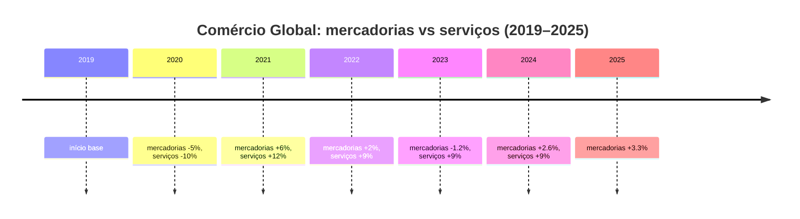
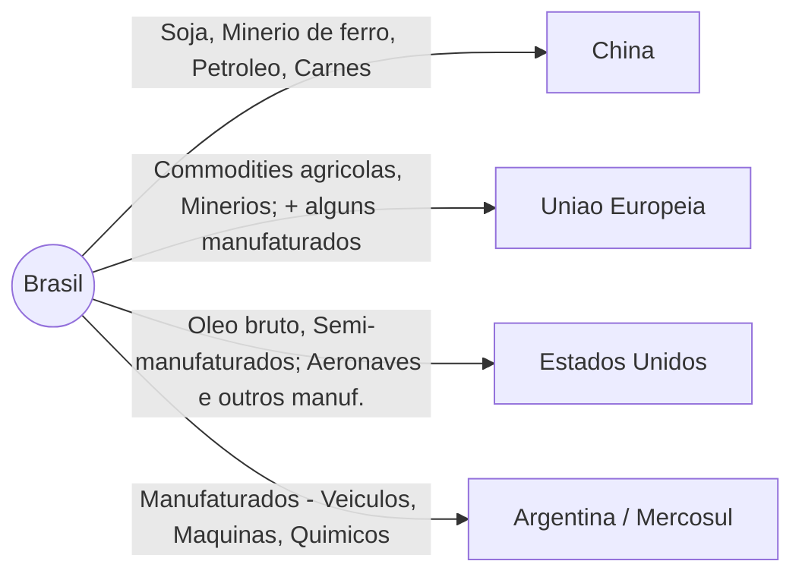
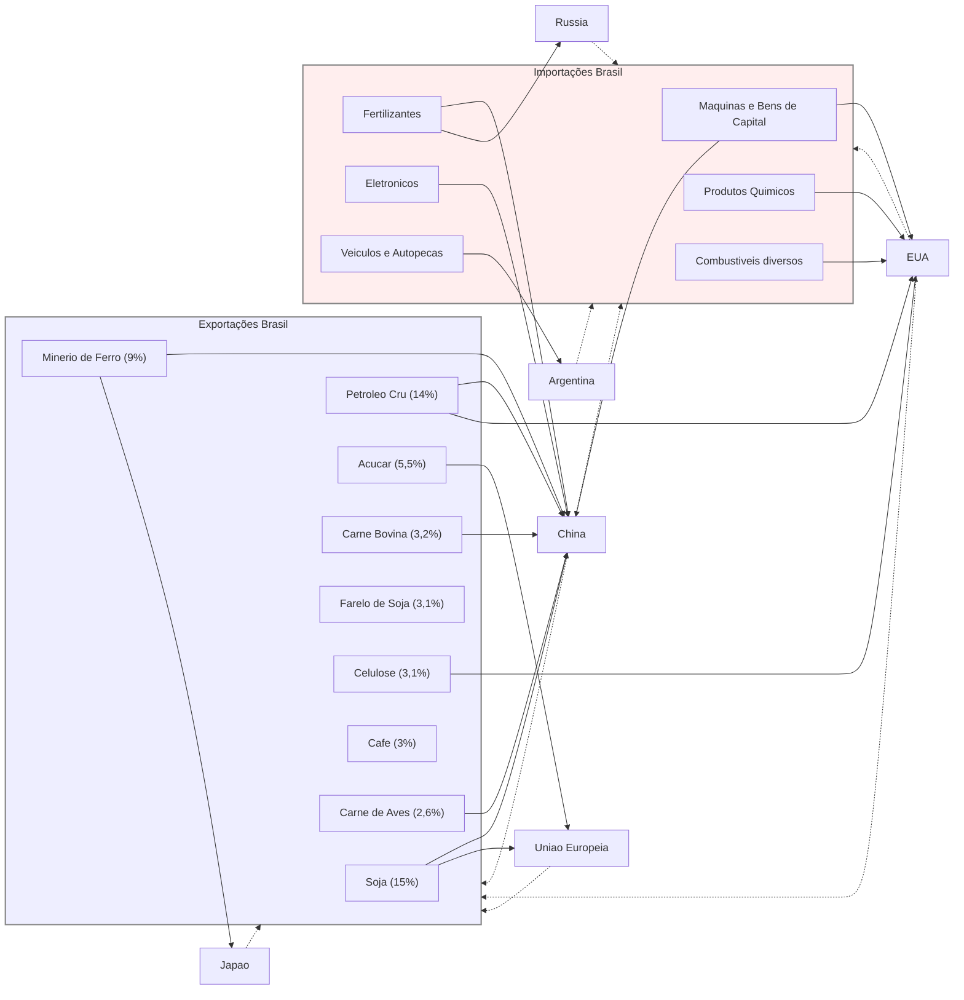

# O Comércio Internacional Contemporâneo: Fluxos Globais e a Inserção do Brasil na Última Década

## O Cenário do Comércio Internacional Global

### Principais Fluxos

Nas últimas décadas, **os fluxos de comércio internacional se concentraram em grandes eixos inter-regionais**, com destaque para a Ásia nas redes globais. A China consolidou-se como maior exportador mundial de bens (14% das exportações globais em 2023), superando com folga economias tradicionais como os EUA (8,5%) e a Alemanha (7,1%). Isso reflete o peso dos **fluxos Ásia–América do Norte e Ásia–Europa**, impulsionados pelo papel da China como _hub_ manufatureiro global. Ao mesmo tempo, o comércio **intra-regional europeu** permanece volumoso dada a integração econômica da União Europeia. Nenhuma região é autossuficiente: por exemplo, a Ásia importadora líquida de recursos naturais depende dos **corredores de commodities** originados em regiões ricas em recursos. _Grandes fluxos de minerais partem da Austrália, Brasil, Chile e África do Sul para abastecer os polos industriais chineses_, enquanto o Oriente Médio supre a Ásia de energia e a Europa e a América do Norte fornecem máquinas avançadas e know-how tecnológico.

| Ano  | Crescimento do comércio de mercadorias (%) |                                                                         Crescimento do comércio de serviços (%)                                                                         |
| :--: | :----------------------------------------: | :-------------------------------------------------------------------------------------------------------------------------------------------------------------------------------------: |
| 2019 |                     —                      |                                                                                            —                                                                                            |
| 2020 |              –5,0 (COVID‑19)               |                                                                               –10,0 (hipótese do impacto)                                                                               |
| 2021 |          +6,0 (recuperação forte)          |                                                                                          +12,0                                                                                          |
| 2022 |                    +2,0                    |                                                                                          +9,0                                                                                           |
| 2023 |                    –1,2                    | +9,0 ([bcb.gov.br](https://www.bcb.gov.br/content/ri/inflationreport/202412/ri202412c1i.pdf?utm_source=chatgpt.com "[PDF] Inflation Report – December 2024 - Banco Central do Brasil")) |
| 2024 |                +2,6 (proj.)                |                                                                                          +9,0                                                                                           |
| 2025 |                +3,3 (proj.)                |                                                                                            —                                                                                            |
Tabela: Fluxos Globais de Comércio (2019–2025 proj.)

### Composição do Comércio Mundial

A **composição setorial do comércio global** passou por mudanças importantes na última década. Bens manufaturados ainda respondem pela maior parcela do comércio de mercadorias, mas as **commodities primárias** (produtos agropecuários e minerais) mantêm papel crucial – em especial para conectar países produtores (muitos em economias emergentes) a centros industriais demandantes. Além disso, observa-se a **crescente importância do comércio de serviços** e fluxos intangíveis. Entre 2010 e 2019, as exportações de serviços (especialmente serviços intensivos em conhecimento, como tecnologia da informação, finanças e propriedade intelectual) cresceram aproximadamente **duas vezes mais rápido** que o comércio de bens. Esse dinamismo dos serviços – juntamente com fluxos de dados digitais e capital humano – impulsiona a integração global contemporânea. Em contrapartida, o comércio de bens físicos como proporção da economia mundial se estabilizou após 2008, indicando um limite na _onda_ de mercantilização que marcara os 30 anos anteriores. Em suma, a última década viu **serviços e fluxos de conhecimento ganharem espaço relativo**, embora os bens tangíveis – manufaturas e commodities – sigam fundamentais na pauta global.

### Impactos Recentes

Nos anos recentes, **choques geopolíticos e sanitários** perturbaram os fluxos comerciais, sem contudo reverter completamente a globalização. A pandemia de _COVID-19_ em 2020 provocou uma queda abrupta no comércio mundial, em face de restrições logísticas e contração da demanda. **Surpreendentemente, a recuperação foi rápida**: já em 2021 o comércio de bens atingiu um recorde histórico, impulsionado pela demanda reprimida e pela capacidade das cadeias asiáticas de suprir gargalos de produção no Ocidente. Contudo, a retomada esbarrou em novos obstáculos. **Tensões geopolíticas** – como a guerra comercial e tecnológica entre _EUA e China_ – alimentam pressões protecionistas e **sinais de fragmentação nas relações comerciais globais**. Em 2022, a invasão da **Ucrânia pela Rússia** desorganizou mercados de energia e alimentos: a Europa, que importava mais de 50% de sua energia e gás da Rússia antes da guerra, viu-se forçada a diversificar fornecedores; simultaneamente, a redução das exportações de grãos do Leste Europeu elevou preços agrícolas mundialmente e redirecionou fluxos para outros produtores. Países como o Brasil foram afetados indiretamente – seja pela alta dos preços de commodities (beneficiando suas exportações de bens agrícolas e minerais), seja pela exposição em insumos críticos (por exemplo, Brasil e Argentina importam mais de **50% dos fertilizantes potássicos** de Rússia e Belarus, o que suscitou alertas diante das sanções e escassez durante o conflito). Em resumo, _os últimos choques ressaltaram tanto a resiliência quanto as vulnerabilidades do comércio global_: apesar de interrupções pontuais e reconfigurações de rotas (p. ex. petróleo russo sendo redirecionado à Ásia, cadeias buscando “_friend-shoring_”), a interdependência econômica persiste e nenhum grande bloco consegue suprir internamente todas as suas necessidades.

> [!note] **Resiliência x Desglobalização:** Apesar das turbulências (pandemia, guerra, tensões sino-americanas), os dados não apontam um colapso da globalização comercial. O **comércio mundial de bens cresceu cerca de +3% em 2022** e, embora tenha recuado -1,2% em 2023, espera-se retomada modesta em 2024-25. O padrão recente, contudo, mostra o comércio internacional crescendo em ritmo similar ou ligeiramente inferior ao PIB mundial (relação ~1:1 desde 2011) – diferentemente das décadas anteriores em que a expansão do comércio superava amplamente o crescimento econômico. Assim, fala-se hoje mais em **reorganização** do que em reversão da globalização: cadeias de valor se adaptam (busca por fornecedores alternativos, aumento de estoques estratégicos), mas **a integração global permanece elevada** e continua sendo fonte de prosperidade, embora acompanhada de riscos a gerenciar.

## A Inserção do Brasil no Comércio Internacional

### A Balança Comercial Brasileira nos Últimos Anos

A última década caracterizou-se por **saldos comerciais amplamente superavitários** para o Brasil. Após alguns anos de déficits no início dos anos 2010 (como em 2014), a partir de 2015 a balança comercial entrou em forte trajetória de superávit, reflexo da depreciação cambial, da retração das importações durante a recessão doméstica de 2015-16 e do vigor das exportações de commodities. Desde então, os superávits anuais tornaram-se pilares das contas externas brasileiras. Nos anos mais recentes, esses saldos atingiram patamares recordes: **em 2023, o superávit comercial chegou a US$ 98,8 bilhões – o maior da série histórica iniciada em 1989**. Esse resultado extraordinário (60% superior ao de 2022) decorreu de exportações também recordes (US$ 339,7 bi) combinadas a uma contração das importações, impulsionando o Brasil a **ganhar participação no comércio global** mesmo em um ano de retração do comércio mundial. Em 2024, ainda que os preços das commodities tenham arrefecido, o país manteve um **superávit elevado (US$ 74,6 bi, o segundo maior já registrado)** graças à safra agrícola volumosa e à expansão da produção de petróleo. Esses saldos positivos acumulados **têm sido fundamentais para o equilíbrio macroeconômico externo**: graças ao forte desempenho comercial, o déficit em transações correntes reduziu-se significativamente (chegando próximo de zero em fins de 2023), compensando parcialmente os déficits persistentes na balança de serviços e na conta de rendas (remessas de lucros, juros etc.). Em outras palavras, **o comércio exterior voltou a ser um “motor” do setor externo brasileiro**, fornecendo divisas e fortalecendo as reservas internacionais em meio a um cenário global incerto.

| Ano  | Exportações (US$ bi) | Importações (US$ bi) |                                                                                                                                                     Superávit (US$ bi) |
| :--: | -------------------: | -------------------: | ---------------------------------------------------------------------------------------------------------------------------------------------------------------------: |
| 2022 |                341,0 |                262,0 |                                                                                                                                                                  +79,0 |
| 2023 |                339,7 |                240,9 | +98,8 (recorde) ([wto.org](https://www.wto.org/english/res_e/booksp_e/trade_outlook24_e.pdf?ref=tippinsights.com&utm_source=chatgpt.com "[PDF] Global Trade Outlook")) |
| 2024 |                337,0 |                262,5 |                                                                                                                                                     +74,6 (2º recorde) |
Tabela: Comércio Brasileiro (2022–2024)
### A Composição da Pauta Comercial Brasileira

A estrutura da pauta de comércio exterior do Brasil na última década evidencia uma característica marcante: a **concentração em commodities**. Essa tendência de especialização em produtos primários – muitas vezes chamada de **“reprimarização” da pauta exportadora** – contrasta com os esforços históricos de diversificação e agrega um **debate crítico** sobre seus impactos no desenvolvimento econômico.

> [!definition] **Reprimarização da pauta exportadora:** fenômeno em que **produtos básicos (commodities agropecuárias e minerais)** passam a representar parcela crescente das exportações de um país, em detrimento de produtos manufaturados. No caso do Brasil, esse processo se acentuou nas últimas duas décadas, **revertendo parcialmente a diversificação obtida no final do século XX**. A reprimarização está associada a preços internacionais elevados de commodities e vantagens comparativas naturais, mas **gera preocupações** sobre **vulnerabilidade a choques de preços**, _desindustrialização_ e perda de complexidade econômica.

#### Pauta de Exportação: Commodities em Destaque

Atualmente, **os principais produtos exportados pelo Brasil são todos de base primária**. Em 2023, por exemplo, os três itens líderes da pauta foram: **soja** (complexo soja, incluindo grão e farelo, responsável por cerca de **15,7%** do valor total exportado), **óleos brutos de petróleo** (∼12,5%) e **minério de ferro** (∼9%). Juntos, esses três produtos – todos _commodities_ – perfizeram praticamente **40% das exportações brasileiras** naquele ano, ilustrando a forte concentração da pauta. Outros itens de destaque incluem o **açúcar** (cana-de-açúcar e derivados, ~4–5%), o **milho** (que ganhou importância recente com safras recordes), a **celulose** e as **carnes** (bovinas e de frango), cada um contribuindo com parcelas menores porém significativas.

Essa estrutura **contrasta com a realidade de duas décadas atrás**. No início dos anos 2000, a pauta era bem mais diversificada: cerca de **nove produtos distintos compunham 30% das exportações** – incluindo manufaturados relevantes à época, como automóveis, autopeças, aviões e até bens industrializados de petróleo. Já em **2021, apenas três produtos (minério de ferro, soja e petróleo cru) responderam por 40% do total exportado**, refletindo a perda de diversidade e o predomínio de commodities de baixo grau de processamento. Em suma, **houve uma regressão na complexidade da pauta exportadora brasileira**, com peso crescente do agronegócio e da mineração. O chamado _“complexo soja”_ (soja em grão, farelo e óleo) tornou-se a _locomotiva_ das vendas externas, seguido de perto pela cadeia da mineração de ferro e pelo petróleo bruto extraído do _pré-sal_. Esse perfil gera receitas expressivas em períodos de alta de preços (como na _supercommodity boom_ de 2021-2022), mas também **expõe o país à volatilidade cíclica** dos mercados globais de commodities.

Do ponto de vista de valor agregado, verifica-se que **a indústria de transformação brasileira perdeu espaço nas exportações**. Há uma década, produtos industrializados chegavam a representar ~64% das exportações; hoje giram em torno de **52%** – queda que indica _reprimarização_. Muitos dos itens de maior crescimento exportador têm **baixíssimo nível de processamento** (grãos in natura, petróleo cru, minério bruto, carnes resfriadas), enquanto houve estagnação ou redução na participação de manufaturados de maior tecnologia. Mesmo setores tradicionalmente exportadores de manufaturas (como automóveis, máquinas e equipamentos) enfrentam dificuldades para ganhar competitividade externa diante do câmbio, da concorrência asiática e do foco doméstico no mercado interno. Assim, o Brasil **exporta cada vez mais volume, porém ainda concentrado em bens básicos**, o que alimenta o debate sobre estratégia de desenvolvimento e políticas de incentivo à industrialização.

#### Pauta de Importação: Bens de Capital e Insumos Tecnológicos

No espelho das exportações, a **pauta de importação brasileira** é dominada por itens de maior valor agregado e insumos necessários à indústria nacional. Em 2023, por exemplo, os **principais produtos importados** foram: **adubos e fertilizantes** (US$ 13,4 bilhões), **óleos combustíveis de petróleo** – sobretudo combustíveis refinados, como diesel e nafta – (US$ 12,1 bi), **medicamentos e produtos farmacêuticos** (US$ 7,3 bi) e **equipamentos de telecomunicações** (eletrônicos de alta tecnologia, US$ 7,0 bi). Também figuram com peso relevante as **máquinas e bens de capital** em geral, componentes eletroeletrônicos, químicos finos, além de bens de consumo duráveis de tecnologia avançada (como computadores e semicondutores). Essa composição deixa claro que **o Brasil depende do exterior para suprir grande parte de seus insumos estratégicos e bens de alta complexidade**. Enquanto exportamos principalmente matérias-primas, **importamos produtos com maior conteúdo tecnológico**, desde fertilizantes para a agricultura até equipamentos médicos e industrializados em que nossa indústria possui lacunas competitivas.

Essa dinâmica **traz oportunidades e desafios**. Por um lado, a importação de bens de capital e insumos pode elevar a produtividade doméstica (permitindo modernização do parque industrial e abastecendo o agronegócio com fertilizantes, por exemplo). De fato, em 2024 observou-se aumento de 25,6% nas importações de bens de capital – um sinal positivo em tese para investimentos futuros. Por outro lado, **evidencia-se a vulnerabilidade brasileira em áreas-chave**: a dependência externa em fertilizantes, por exemplo, tornou-se evidente com a guerra na Ucrânia, dada a grande concentração de fornecedores em poucos países (Rússia e China). Situação semelhante ocorre com produtos de alto conteúdo tecnológico, importados principalmente de economias avançadas ou da Ásia. _Em suma: o Brasil exporta principalmente o que a natureza fornece, e importa o que a tecnologia produz_.

> [!important] **Estrutura do Comércio Exterior Brasileiro:** Os dados recentes reforçam uma realidade estrutural: **exportamos matérias-primas e importamos produtos industriais**. Essa configuração garante saldos comerciais favoráveis – afinal, somos competitivos em commodities – mas ao mesmo tempo **limita o avanço tecnológico interno**. A indústria nacional concorre com importados em vários segmentos e sofre com a falta de escala nas exportações. Esse **“duplo padrão”** (commodity-driven exports vs. high-tech imports) é uma característica central da inserção brasileira na economia global contemporânea.

### Os Principais Parceiros e Fluxos Comerciais do Brasil

A geografia do comércio exterior brasileiro também **passou por transformações na última década**, acompanhando as mudanças na economia mundial. Enquanto alguns parceiros tradicionais reduziram participação relativa, **a China despontou como destino dominante**, reordenando os fluxos comerciais do país. A seguir, analisamos os principais parceiros e a natureza dos intercâmbios com cada um:

#### China

A **República Popular da China** consolidou-se como _o principal parceiro comercial do Brasil_. Em 2009, a China já havia ultrapassado os EUA como maior destino das exportações brasileiras, e desde então sua vantagem só cresceu. Atualmente, **cerca de um terço das exportações do Brasil têm a China como destino** – em 2023, aproximadamente **30,7% do volume exportado** pelo país foi absorvido pelo mercado chinês. Este **estreito vínculo comercial Brasil–China** está alicerçado nas commodities: a China é a maior compradora de soja brasileira (para alimentar seu rebanho e indústria de ração), além de importar em massa **minério de ferro** (insumo-chave para o aço em seu parque industrial) e **petróleo bruto** do Brasil. Produtos como **carne bovina e de frango, celulose, açúcar e polpa de minério de manganês** também encontram na China um mercado crescente. Em outras palavras, **a pauta de exportações para a China é intensiva em recursos naturais**, refletindo a complementaridade entre a abundância brasileira em commodities agro-minerais e a demanda chinesa por matérias-primas.

Do lado das **importações**, a China tornou-se igualmente um dos principais fornecedores do Brasil, respondendo por grande parte dos produtos manufaturados importados – de eletrônicos a máquinas industriais e insumos químicos. Isso reforça a relação de dependência: **exportamos commodities e importamos manufaturados chineses de maior valor agregado**, contribuindo para o _déficit_ brasileiro na balança de manufaturados. Geopoliticamente, essa relação traz tanto ganhos (receitas robustas de exportação) quanto **riscos**: elevada concentração das vendas em um só mercado (sensível a mudanças de política comercial ou desaceleração na China) e exposição a oscilações de preços internacionais ditados em boa medida pela demanda chinesa. Ainda assim, a parceria com a China tem sido extremamente lucrativa na última década – **a corrente de comércio bilateral alcançou US$ 160 bilhões em 2023**, um recorde histórico. A China figura como **pilar do superávit comercial brasileiro** e qualquer análise da inserção internacional do Brasil hoje começa por esse eixo Ásia-Pacífico.

#### União Europeia

A **União Europeia (UE)** foi, por longo período, o destino mais importante das exportações brasileiras, porém seu peso relativo diminuiu com a ascensão asiática. Em 2000, somados, os países da UE absorviam cerca de 25% das nossas exportações; hoje essa parcela caiu para **em torno de 13–15%**. Entre 2003 e 2023, por exemplo, a participação da UE no comércio internacional do Brasil reduziu-se de 23% para 13,6%. Essa queda reflete sobretudo o crescimento exponencial do comércio com a China e outros mercados emergentes, mas não significa perda de relevância absoluta da Europa. **A UE permanece um parceiro estratégico e diversificado**: é tradicionalmente o segundo ou terceiro maior mercado para exportações brasileiras e grande fornecedor de bens e investimentos para o Brasil.

A pauta de **exportações brasileiras para a UE** é relativamente **diversificada** se comparada à pauta para a Ásia. Inclui tanto produtos básicos – como **commodities agrícolas** (café, soja em farelo para ração animal, suco de laranja, açúcar, carnes) e **commodities minerais** (minérios, celulose) – quanto **bens manufaturados e semimanufaturados** de maior valor. Por exemplo, a Europa importa **aeronaves regionais da Embraer**, motores e peças automotivas, calçados e alguns produtos químicos do Brasil, ainda que em volumes bem menores que os básicos. Esse perfil se deve à complementaridade parcial das economias: a UE demanda alimentos tropicais e matérias-primas (nas quais o Brasil é competitivo) ao mesmo tempo em que adquire alguns bens industriais _nicho_ nos quais o Brasil possui excelência. Por sua vez, o **Brasil importa da UE** principalmente **máquinas e equipamentos** de alta tecnologia, produtos químicos finos, medicamentos, além de veículos e eletrônicos de ponta – itens nos quais a indústria europeia é líder. O saldo comercial com a UE costuma ser superavitário para o Brasil (dado o peso das commodities exportadas), mas **menos expressivo** do que com a Ásia. Além do aspecto comercial, a UE representa um parceiro institucional importante: negociações como o **Acordo Mercosul-UE** (aguardando ratificação) buscam abrir mercados e consolidar regras, o que poderia impulsionar ainda mais os fluxos birregionais. _Em suma, apesar da queda relativa, a Europa continua sendo um mercado-chave com pauta mais equilibrada e sofisticada, cuja relação com o Brasil transcende o modelo simples de “primário vs. industrial”_.

#### Estados Unidos

Os **Estados Unidos** já foram, individualmente, o principal destino das exportações brasileiras (posição que mantiveram por grande parte do século XX e início dos anos 2000). Na última década, entretanto, foram ultrapassados pela China e, eventualmente, equiparados pelo bloco europeu, situando-se atualmente como **segundo maior parceiro individual**. Em 2024, os EUA representaram cerca de **12% das exportações brasileiras**, mantendo-se como o _destino número 2_ para os produtos do Brasil. A relação comercial Brasil-EUA é significativa tanto em volume quanto em diversidade setorial. **As exportações brasileiras para os EUA** incluem uma mescla de produtos básicos e manufaturados: por um lado, embarcamos petróleo bruto, celulose, café, suco de laranja, aço semiacabado e outras commodities/tradings; por outro, os EUA são destino de **bens industrializados de maior valor** como **aeronaves (da Embraer)**, peças automotivas, motores, e até alguns produtos químicos e bens de consumo (calçados, por exemplo). De fato, ao contrário da China (onde manufaturados brasileiros são praticamente ausentes), **nos EUA há espaço para alguns produtos da indústria de transformação brasileira** – especialmente aqueles nos quais temos competitividade regional ou acordos preferenciais (ex.: aço semimanufaturado sob cotas, etanol, aviões regionais). Em 2023, as exportações de manufaturados brasileiros aos EUA atingiram US$ 29,9 bilhões, _ultrapassando as vendas para a UE_ nesse quesito, o que evidencia a importância do mercado norte-americano para setores industriais brasileiros.

Nas **importações brasileiras dos EUA**, predominam itens de alta tecnologia e equipamentos: o Brasil compra dos norte-americanos máquinas industriais, aparelhos eletroeletrônicos, partes e peças para aviação, além de produtos químicos (resinas, fármacos, defensivos agrícolas) e combustíveis refinados. Os EUA figuram consistentemente entre os **principais fornecedores de bens de capital e insumos sofisticados** ao Brasil, atrás apenas da China em muitos casos. Essa relação bilateral tem se mantido robusta, embora sujeita a **oscilações conforme o contexto político-comercial** (por exemplo, tarifas aplicadas pelos EUA ao aço brasileiro em 2018, ou questões sanitárias envolvendo exportações agropecuárias). No contexto geopolítico atual, o Brasil busca equilibrar a parceria com os EUA – que envolve cooperação em investimentos, inovação e é destino crucial de manufaturados – com sua integração crescente à Ásia. Em suma, **os EUA seguem sendo um parceiro comercial e tecnológico de primeira grandeza** para o Brasil, fornecendo produtos estratégicos e absorvendo parcela importante de nossas exportações de maior valor agregado.

#### Argentina e Mercosul

No âmbito regional, a **Argentina** – juntamente com os demais sócios do Mercosul (Paraguai e Uruguai) – ocupa posição de destaque especial na inserção comercial brasileira. A Argentina tradicionalmente figura entre os **três principais destinos** das exportações do Brasil (já foi o 2º maior em diversos momentos) e é, de longe, o maior dentro da América Latina. Mais do que o volume, importa a **composição das trocas Brasil-Argentina**: este é o mercado que mais absorve **produtos manufaturados brasileiros**. Historicamente, cerca de _80% a 90%_ das exportações brasileiras para a Argentina são **bens industrializados**, incluindo veículos automotores e autopeças, máquinas e equipamentos, eletrodomésticos, eletrônicos e produtos químicos. Isso contrasta fortemente com outros parceiros (como China ou mesmo EUA), onde predominam commodities. **O Mercosul, portanto, cumpre o papel de principal destino para a indústria de transformação brasileira**, funcionando como um “mercado cativo” para setores como o automobilístico – que, graças ao acordo regional, exporta volumes significativos para os vizinhos sul-americanos.

Nos últimos anos, a **profunda crise econômica na Argentina** (recessão, desvalorização cambial, restrições cambiais) impactou negativamente o comércio bilateral, reduzindo o apetite argentino por importados. A participação da Argentina nas exportações brasileiras tem caído em 2023-2024, e o saldo comercial tradicionalmente superavitário para o Brasil encolheu bastante. Ainda assim, a Argentina **permanece um destino estratégico**, sobretudo para pequenas e médias empresas brasileiras exportadoras e para segmentos industriais que pouco conseguem penetrar mercados fora da região. Além da Argentina, outros parceiros do Mercosul e América do Sul (Chile, Colômbia, Peru) são relevantes compradores de manufaturados brasileiros – de alimentos processados a ônibus e implementos rodoviários. Essa dinâmica regional ressalta a importância do **Mercosul como plataforma de exportação de manufaturas**, embora limitada pelo tamanho das economias vizinhas. No médio prazo, a recuperação da demanda argentina e a eventual expansão do Mercosul (ou acordos com outros países da América Latina) poderão influenciar significativamente a performance exportadora da indústria brasileira.

> [!example] **Diagramas – Principais Parceiros Comerciais do Brasil e Produtos Exportados:** O diagrama a seguir ilustra, de forma simplificada, os principais destinos das exportações brasileiras e os tipos de produtos enviados a cada parceiro (dados aproximados para 2023):

_(Obs: Fluxos ilustrativos. A espessura das setas representa aproximadamente o volume exportado; China > UE ≈ EUA > Argentina.)_

## Análise Conclusiva: Desafios para o Desenvolvimento

A análise da estrutura e da dinâmica do comércio exterior brasileiro na última década revela um **paradoxo de desenvolvimento**. Por um lado, a especialização em commodities tem proporcionado **vantagens comparativas claras**: o Brasil tornou-se um _supplier_ global de alimentos e minerais, colhendo ganhos expressivos com a alta demanda da Ásia. Os **superávits comerciais recordes** evidenciam como essa inserção garantiu fartos ingressos de divisas, fortaleceu as contas externas e permitiu ao país se beneficiar do ciclo de alta de preços das commodities. Adicionalmente, a posição de grande exportador agrícola e mineral vem acompanhada de **incrementos de produtividade e investimento nessas áreas** (por exemplo, avanços em tecnologia agropecuária tropical, expansão da fronteira do _agronegócio_, exploração do pré-sal), gerando crescimento econômico regionalizado e empregos nessas cadeias.

Por outro lado, **os riscos e vulnerabilidades** dessa estrutura são notórios. A **forte dependência de commodities** expõe o Brasil a **choques de preços internacionais** e à volatilidade: períodos de bonança (boom) podem ser seguidos de quedas abruptas nas receitas de exportação se os preços de soja, petróleo ou minério despencarem no mercado global – algo comum em fases de desaceleração econômica mundial. Essa vulnerabilidade externa pode afetar o câmbio, a arrecadação e a balança corrente, colocando em xeque a estabilidade macroeconômica (como ocorreu no passado em ciclos de _bust_ das commodities). Além disso, a concentração em poucos produtos e mercados traz o **risco de concentração de mercado**: a China, por exemplo, sozinha dita boa parte da demanda pelas exportações brasileiras; uma eventual redução do apetite chinês (seja por mudança de matriz econômica ou por tensões comerciais) teria impacto desproporcional sobre o Brasil.

Internamente, discute-se que essa trajetória comercial reforça tendências de **desindustrialização prematura**. Com a valorização cambial em épocas de boom de commodities (_doença holandesa_) e a preferência do mercado por atividades extrativas e agrícolas de retorno rápido, a indústria de transformação nacional tem perdido participação no PIB e no emprego. A **pauta exportadora reprimarizada** significa também menor estímulo para segmentos industriais subirem na cadeia tecnológica, pois o país se apoia em vantagens naturais ao invés de conhecimento. Há uma **perda de complexidade econômica** relativa, o que pode limitar o crescimento de longo prazo, já que setores primários – embora eficientes – têm menos encadeamentos tecnológicos e agregam menos valor localmente que setores manufatureiros avançados. Em suma, **a atual inserção gera riqueza, mas pode comprometer o futuro caso não se diversifique**.

O desafio estratégico para o Brasil reside em **equilibrar essas forças**: _aproveitar as oportunidades comparativas das commodities_, sem acomodar-se nelas a ponto de prejudicar a inovação e a diversificação produtiva. Isso implica políticas que **apoiem a industrialização e a agregação de valor** nas cadeias de exportação (por exemplo, incentivar a industrialização de produtos agrícolas, desenvolver a indústria de biocombustíveis e química a partir do petróleo e gás, etc.), bem como a busca de **novos mercados e nichos** para produtos manufaturados brasileiros. Também requer fortalecer a integração em **cadeias globais de valor** de forma competitiva – por exemplo, inserindo a manufatura brasileira em segmentos onde possa complementar parceiros (como aconteceu parcialmente na cadeia automotiva regional ou na indústria aeronáutica).

Em termos de política externa, diversificar parcerias comerciais é igualmente vital: _ampliar acordos comerciais_, reduzir barreiras e explorar mercados na Ásia (além da China, países do Sudeste Asiático), na África e no Oriente Médio pode diluir riscos. Ao mesmo tempo, **consolidar parcerias tradicionais** (EUA, UE) com foco em comércio de maior valor agregado e investimentos em tecnologia pode ajudar o Brasil a escapar da armadilha da primarização. O **Acordo Mercosul-União Europeia**, se ratificado, e a participação mais ativa em fóruns como OCDE, OMC e acordos transpacíficos podem oferecer oportunidades para integrar o país em cadeias globais mais sofisticadas.

Em conclusão, a **inserção comercial brasileira da última década é um caso de sucesso em volumes e saldos**, porém **com fragilidades estruturais**. O país logrou posicionar-se como powerhouse exportadora de commodities em um mundo sedento por alimentos e insumos, mas **pagou o preço de ver sua pauta menos complexa e mais vulnerável**. O grande desafio adiante é **transformar esse ganho de curto prazo em alavanca para o desenvolvimento de longo prazo** – isto é, usar o fôlego proporcionado pelos superávits para investir em educação, tecnologia e infraestrutura que permitam sofisticar a produção nacional. Somente assim o Brasil poderá, no futuro, exportar não apenas soja, minério e petróleo, mas também _bens e serviços de alto valor agregado_, reduzindo a dependência de ciclos externos e tornando sua economia mais resiliente e competitiva no cenário global.

> [!question] **Questões para Autoavaliação:**
> 
> 1. **Composição Exportadora e “Reprimarização”:** Quais evidências indicam que houve reprimarização da pauta exportadora brasileira na última década? Discuta os principais produtos hoje exportados, em comparação com duas décadas atrás, e analise os _pros_ e _contras_ dessa especialização em commodities para o desenvolvimento econômico do Brasil.
>     
> 2. **Choques Globais e Comércio Brasileiro:** Como os choques internacionais recentes – pandemia de Covid-19, guerra na Ucrânia e tensões comerciais entre EUA e China – afetaram o comércio mundial e, especificamente, a inserção do Brasil? Explique de que forma esses eventos impactaram os fluxos comerciais brasileiros (seja por mudanças de preços, de parceiros ou de cadeias produtivas) e quais foram as respostas ou oportunidades resultantes para o Brasil.
>     
> 3. **Desafios Estruturais e Estratégias:** Considerando a atual estrutura da balança comercial brasileira (forte superávit baseado em commodities, importação de manufaturados), quais são os principais desafios de política econômica para o Brasil equilibrar crescimento de curto prazo com desenvolvimento de longo prazo? Proponha medidas ou estratégias que possam aumentar o valor agregado das exportações brasileiras e reduzir vulnerabilidades externas, fundamentando sua resposta com elementos da análise apresentada.
>