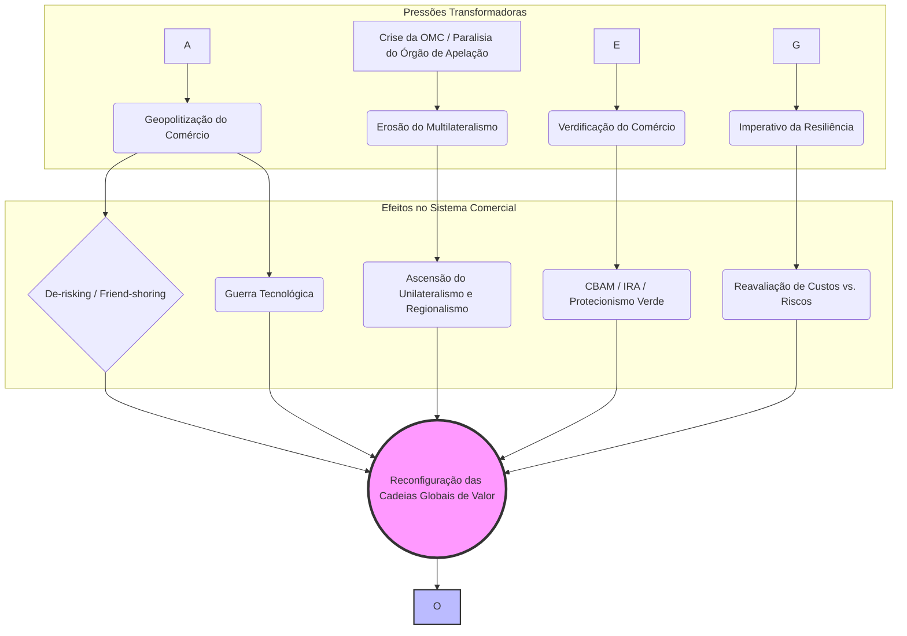

# O Comércio Internacional em Transformação: Geopolítica, Crise da OMC e a Agenda Socioambiental (2023-2025)

## Introdução

O comércio internacional atravessa, no período 2023-2025, um ponto de inflexão histórico, marcando uma ruptura com a ordem liberal que caracterizou a globalização no pós-Guerra Fria. A lógica de integração econômica, antes predominantemente guiada pela busca de eficiência e pela redução de custos, cede espaço a uma nova era de fragmentação, incerteza e competição estratégica. A Conferência das Nações Unidas sobre Comércio e Desenvolvimento (UNCTAD) identifica este momento como um "ponto de inflexão na globalização", no qual a economia global, já pressionada por crises e mudanças climáticas, enfrenta um crescimento lento e um investimento fraco, incapaz de atender às necessidades de desenvolvimento.

A tese central desta análise é que a atual reconfiguração do sistema comercial global é impulsionada pela convergência de três vetores de pressão interconectados:

1. **A Geopolitização do Comércio:** A crescente rivalidade entre grandes potências, notadamente entre os Estados Unidos (EUA) e a China, subordina a lógica econômica a imperativos de segurança nacional, transformando o comércio em uma arena de disputa por poder e influência tecnológica.
    
2. **A Crise Institucional do Multilateralismo:** O pilar da governança comercial, a Organização Mundial do Comércio (OMC), enfrenta uma crise existencial, marcada pela paralisia de seu sistema de solução de controvérsias e pela dificuldade em negociar novas regras adequadas aos desafios do século XXI.
    
3. **A Emergência da Normatividade Socioambiental:** A agenda climática e ambiental consolida-se como um novo paradigma para as relações comerciais, gerando novas condicionalidades e instrumentos, como ajustes de carbono na fronteira e subsídios para tecnologias verdes, que são simultaneamente vistos como legítimos e como potenciais barreiras comerciais disfarçadas.
    

A confluência desses vetores está provocando uma transformação estrutural no comércio mundial, redesenhando a geografia das Cadeias Globais de Valor (CGV), alterando os cálculos de risco e eficiência das empresas e desafiando os fundamentos da governança global. O objetivo desta nota de estudo é dissecar analiticamente cada uma dessas forças, examinar suas profundas interconexões e avaliar a posição estratégica do Brasil neste cenário complexo e volátil.

## 1. A Geopolitização do Comércio: A Primazia da Segurança sobre a Eficiência

A dimensão mais visível da transformação do comércio internacional é sua crescente politização, onde a lógica da eficiência econômica é progressivamente substituída por considerações de segurança nacional e alinhamento geopolítico. Esta seção analisa como a rivalidade estratégica está redefinindo as regras, os fluxos e o próprio léxico do comércio global.

### 1.1. A Rivalidade Estratégica EUA-China e a Subordinação da Lógica Econômica

A guerra comercial iniciada pela administração Trump em 2018, com a imposição de tarifas sobre produtos chineses, evoluiu de um conflito focado em déficits comerciais e propriedade intelectual para uma competição sistêmica e duradoura. A administração Biden não apenas manteve as tarifas, mas as expandiu para setores estratégicos como veículos elétricos e painéis solares, consolidando a visão de que o comércio é um instrumento central da política de segurança nacional. A lógica subjacente não é mais apenas econômica, mas sim a de conter o avanço tecnológico e a influência global da China.

Essa mudança paradigmática gerou uma fragmentação mensurável dos fluxos comerciais. Dados do Fundo Monetário Internacional (FMI) indicam que a participação da China nas importações dos EUA caiu 8 pontos percentuais entre 2017 e 2023, enquanto a participação dos EUA nas exportações da China recuou 4 pontos percentuais no mesmo período. O crescimento do comércio entre os blocos de países politicamente alinhados aos EUA e à China desacelerou quase 5 pontos percentuais em comparação com o período anterior, evidenciando uma reorientação dos fluxos comerciais com base em alinhamentos geopolíticos.

> [!note] O Surgimento de "Países Conectores"
> 
> Uma consequência direta do desacoplamento entre EUA e China é a ascensão de "países conectores", como México e Vietnã. Essas economias têm atuado como intermediárias, absorvendo fluxos comerciais que antes ocorriam diretamente entre as duas superpotências. Embora essa dinâmica possa ter amortecido o impacto econômico global da fragmentação, ela levanta questionamentos sobre a verdadeira diversificação e resiliência das cadeias de valor, havendo a possibilidade de que parte desse comércio seja apenas uma rerrotulação de produtos de origem chinesa para contornar tarifas.

### 1.2. A Guerra Tecnológica: Semicondutores, IA e a Batalha pelos Padrões do Futuro

A competição geopolítica tem seu epicentro na tecnologia. Os EUA identificaram o acesso a semicondutores avançados e às ferramentas de software para seu design (EDA - _Electronic Design Automation_) como um ponto de estrangulamento (_chokepoint_) crítico para o desenvolvimento militar e de inteligência artificial (IA) da China.

A estratégia americana se desdobra em múltiplas frentes:

- **Controles de Exportação:** A administração Biden intensificou as restrições, barrando a venda de chips avançados, equipamentos de fabricação de semicondutores capazes de produzir chips com litografia inferior a 16 nanômetros e softwares EDA para a China. As medidas foram expandidas para proibir cidadãos e residentes permanentes dos EUA de apoiarem o desenvolvimento ou a produção de semicondutores em certas instalações chinesas.
    
- **"Entity List":** A inclusão de gigantes tecnológicos chineses como Huawei e SMIC (Semiconductor Manufacturing International Corporation) na "Lista de Entidades" do Departamento de Comércio dos EUA visa cortar seu acesso a tecnologias críticas de origem americana, aplicando a "Foreign Direct Product Rule" para restringir vendas até mesmo de empresas estrangeiras que utilizem tecnologia dos EUA.
    
- **Diplomacia Coercitiva:** Os EUA obtiveram sucesso em pressionar aliados-chave na cadeia de semicondutores, como a Holanda (sede da ASML, líder em equipamentos de litografia) e o Japão, para que alinhassem suas políticas de controle de exportação às restrições americanas.
    

A China, por sua vez, responde com uma estratégia defensiva robusta, focada na autossuficiência tecnológica, conforme delineado em planos como o "Made in China 2025".5 Uma tática notável é a exploração de brechas nas restrições ocidentais. Pequim está investindo pesadamente e incentivando o uso de arquiteturas de chip de código aberto, como o RISC-V. Ao alavancar essa tecnologia, que se origina no Ocidente mas não é proprietária, empresas chinesas podem projetar seus próprios processadores para IA, computação em nuvem e aplicações militares sem violar diretamente os controles de exportação que incidem sobre softwares e tecnologias patenteadas.

Essa "guerra dos chips" transcende o setor de semicondutores. Ela representa uma batalha fundamental sobre quem definirá os padrões tecnológicos do futuro em áreas como IA, 5G/6G e computação quântica. O resultado provável é uma bifurcação tecnológica, forçando outros países a, eventualmente, escolherem entre ecossistemas tecnológicos concorrentes, o que fragmentaria ainda mais o comércio e a economia digital global.

### 1.3. O Novo Léxico Estratégico: Análise Crítica de _De-risking_, _Friend-shoring_ e _Nearshoring_

A reconfiguração geopolítica do comércio deu origem a um novo vocabulário estratégico, cujos termos devem ser compreendidos em suas nuances.

> [!definition] Definições do Novo Léxico Comercial
> 
> - **_De-risking_** **(Redução de Riscos):** Popularizado por autoridades dos EUA e da UE, o termo descreve uma estratégia focada em reduzir dependências econômicas excessivas e vulnerabilidades em cadeias de valor críticas, especialmente em relação à China, sem buscar um desacoplamento econômico total. A ênfase é na resiliência e na segurança, não na separação.
>     
> - **_Friend-shoring / Ally-shoring_** **(Produção em Países Amigos/Aliados):** Refere-se à realocação de cadeias de produção para países que compartilham valores políticos e alinhamento geopolítico com o país-sede da empresa. Essa estratégia introduz um critério explicitamente político nas decisões de investimento e sourcing.
>     
> - **_Nearshoring_** **(Produção em Países Próximos):** Consiste em mover a produção para países geograficamente mais próximos do mercado consumidor final, visando reduzir custos logísticos, diminuir os tempos de entrega e aumentar a resiliência a choques de transporte.
>     

A transição da retórica de "decoupling" (desacoplamento), associada à administração Trump, para a de "de-risking" não é meramente semântica. Ela representa um ajuste estratégico sofisticado. O discurso do "decoupling" foi percebido por muitos, inclusive por aliados, como excessivamente confrontacional e potencialmente desestabilizador para a economia global. O termo "de-risking", por outro lado, soa mais moderado, defensivo e razoável. Ele permite que os governos ocidentais implementem políticas de contenção tecnológica e industrial altamente seletivas — que na prática constituem um desacoplamento setorial — sob a justificativa mais defensável de "segurança nacional" e "resiliência econômica".

Essa mudança de enquadramento cria uma "zona cinzenta" na governança do comércio. Medidas com claro impacto protecionista, como os subsídios do _CHIPS Act_ 17 ou os controles de exportação de semicondutores, são legitimadas por uma lógica de segurança que é, por sua natureza, autodeclarada e extremamente difícil de ser contestada em foros multilaterais como a OMC, que historicamente evitam julgar o mérito de decisões de segurança nacional de seus membros. Para países como o Brasil, isso significa que o ambiente comercial se torna menos previsível, pois as regras implícitas, como o alinhamento geopolítico, passam a ter um peso tão ou mais significativo que as regras explícitas dos acordos comerciais.

## 2. A Crise Sistêmica da Governança Multilateral

Paralelamente à geopolitização, o pilar institucional que sustentou a ordem comercial por décadas, a OMC, atravessa uma profunda crise de relevância e funcionalidade. O esvaziamento de suas funções essenciais, especialmente a de solução de controvérsias, corrói a segurança jurídica e acelera a transição para um sistema onde o poder prevalece sobre as regras.

### 2.1. A Paralisia do Órgão de Apelação da OMC: Diagnóstico de um Impasse Estratégico

O coração da crise da OMC reside na paralisia de seu Órgão de Apelação. Desde 2017, os EUA têm sistematicamente bloqueado a nomeação de novos juízes, citando um suposto "ativismo judicial" (_judicial overreach_) e a usurpação de funções que, na visão americana, ferem sua soberania nacional.6 Como consequência direta, desde 11 de dezembro de 2019, o Órgão de Apelação está inoperante por falta do quórum mínimo de três membros para julgar casos.

O impacto sistêmico é devastador. A ausência de uma segunda instância funcional mina a principal característica do sistema de solução de controvérsias da OMC: a capacidade de emitir decisões finais e vinculantes. Na prática, qualquer membro que perca um caso em um painel de primeira instância pode simplesmente "apelar para o vácuo", bloqueando indefinidamente a adoção do relatório e impedindo que a parte vencedora obtenha reparação. Isso enfraquece drasticamente a previsibilidade e a segurança jurídica do sistema multilateral, que era seu maior trunfo.

Como medida paliativa, a União Europeia liderou a criação do Arranjo Plurilateral Provisório de Apelação por Arbitragem (MPIA, na sigla em inglês), que replica um processo de apelação de dois níveis entre os membros participantes. Mais de 50 membros, incluindo o Brasil, aderiram à iniciativa. Contudo, o MPIA é uma solução imperfeita, pois não conta com a participação de atores cruciais, notadamente os EUA, e opera à margem da estrutura formal da OMC.

### 2.2. O Labirinto da Reforma da OMC: Debates sobre as Três Funções Essenciais

Em resposta à crise, os membros da OMC estão engajados em intensas negociações de reforma, com o objetivo de alcançar um acordo sobre um sistema de solução de controvérsias funcional até o final de 2024. As discussões, facilitadas pelo diplomata guatemalteco Marco Tulio Molina, abrangem as três funções centrais da organização.

**1. Solução de Controvérsias:** Este é o tema mais complexo e politicamente sensível. As propostas técnicas em debate buscam responder às críticas dos EUA sem destruir o sistema. As discussões giram em torno de:

- **Escopo e Padrão de Revisão:** Propostas incluem limitar as apelações apenas a erros de direito que tenham impacto material na disputa ou criar um mecanismo de "permissão para apelar" para filtrar casos frívolos.
    
- **Forma do Mecanismo:** As opções variam desde um corpo permanente com mais juízes, um sistema _ad hoc_ com árbitros selecionados para cada caso, até a ideia mais radical de uma revisão feita por um comitê de membros da OMC.
    
- **Posições dos Atores-Chave:** As posições divergem significativamente, como ilustrado na tabela abaixo, dificultando o consenso.
    

**Tabela 1: Posições dos Principais Atores na Reforma do Sistema de Solução de Controvérsias da OMC**

| Tema da Reforma         | Posição dos EUA                                                                                                                                                           | Posição da UE                                                                                                                                           | Posição da China                                                                                                                              | Posição do Brasil / Países em Desenvolvimento                                                                                                                    |
| ----------------------- | ------------------------------------------------------------------------------------------------------------------------------------------------------------------------- | ------------------------------------------------------------------------------------------------------------------------------------------------------- | --------------------------------------------------------------------------------------------------------------------------------------------- | ---------------------------------------------------------------------------------------------------------------------------------------------------------------- |
| **Status do Mecanismo** | Ceticismo quanto à restauração de um órgão de apelação permanente e vinculante. Busca por um sistema que preserve a flexibilidade política e evite o "ativismo judicial". | Forte apoio a um sistema de dois níveis, vinculante e reformado, usando o MPIA como modelo. Aberta a discutir tecnicalidades para alcançar um consenso. | Apoio à restauração de um sistema de dois níveis, mas com ênfase em maior eficiência e mecanismos para evitar o abuso do sistema de apelação. | Defesa de um sistema de dois níveis, vinculante, imparcial e profissional como garantia essencial de segurança jurídica e previsibilidade para todos os membros. |
| **Escopo da Apelação**  | Favorece um escopo estritamente limitado a questões de direito, evitando que o órgão de apelação crie novas obrigações ("gap filling") não negociadas pelos membros.      | Disposta a negociar um escopo mais claro e limitado para a apelação, como forma de construir confiança e responder às preocupações americanas.          | Concorda com a necessidade de focar em erros de direito, mas resiste a limitações que possam enfraquecer excessivamente o direito à revisão.  | Defende que o direito à apelação sobre questões de direito seja preservado, pois é um elemento central para a correção de erros e a coerência do sistema.        |
| **Prazos**              | Crítica histórica ao descumprimento do prazo de 90 dias para a decisão de apelações, exigindo adesão estrita a prazos processuais.                                        | Reconhece a necessidade de maior eficiência e cumprimento de prazos, propondo mecanismos de gestão de casos mais eficazes.                              | Apoia medidas para garantir a celeridade do processo de apelação.                                                                             | Concorda com a necessidade de eficiência, desde que não comprometa a qualidade e a justiça das decisões.                                                         |

**2. Negociação:** A paralisia da Rodada de Doha levou a uma mudança de foco para acordos plurilaterais, que envolvem apenas os membros interessados em um determinado tema. Negociações sobre Comércio Eletrônico, Facilitação de Investimentos para o Desenvolvimento e Regulação Doméstica de Serviços são exemplos dessa nova abordagem. A UE defende que esses acordos possam ser integrados ao arcabouço legal da OMC, mas isso gera controvérsia entre membros que temem a erosão do princípio do "single undertaking".

**3. Monitoramento e Transparência:** Há um esforço contínuo para aprimorar a função de monitoramento da OMC, especialmente no que tange à notificação de subsídios pelos membros — uma crítica recorrente dos EUA e da UE em relação às práticas da China — e à eficácia dos diversos comitês da organização.

### 2.3. A Fragmentação da Ordem: A Ascensão de Acordos Plurilaterais e Regionais

A estagnação do pilar negociador multilateral da OMC impulsionou a proliferação de acordos comerciais regionais (ACRs) e mega-acordos, como o CPTPP (Acordo Abrangente e Progressivo para a Parceria Transpacífica) e o RCEP (Parceria Econômica Regional Abrangente). Embora esses acordos possam liberalizar o comércio entre seus membros, eles também representam uma ameaça ao multilateralismo. Eles arriscam criar um sistema comercial global de "geometria variável", com regras sobrepostas e, por vezes, conflitantes, que erodem o princípio fundamental da Nação Mais Favorecida (NMF) e podem marginalizar os países que não fazem parte dos grandes blocos comerciais.

O bloqueio dos EUA ao Órgão de Apelação não deve ser visto como uma mera disputa técnica, mas como um sintoma e, ao mesmo tempo, um acelerador da geopolitização do comércio. É uma manifestação da rejeição americana a um sistema multilateral que Washington passou a perceber como restritivo à sua soberania e à sua capacidade de confrontar a China em seus próprios termos. Ao paralisar o mecanismo de _enforcement_ da OMC, os EUA removem um freio multilateral às suas próprias ações unilaterais, como as tarifas sobre aço e alumínio justificadas por segurança nacional (Seção 232). Isso cria um vácuo onde o poder econômico e a capacidade de retaliação se tornam mais determinantes do que a conformidade com as regras. Para países como o Brasil, que historicamente utilizaram o sistema de solução de controvérsias para nivelar o campo de jogo contra subsídios de potências ricas (como no emblemático caso do algodão contra os EUA 25), a perda desse instrumento representa um revés estratégico significativo.

## 3. A "Verdificação" do Comércio: A Agenda Socioambiental como Paradigma e Campo de Batalha

A interseção entre comércio, clima e meio ambiente emergiu como um dos eixos mais dinâmicos e contenciosos da transformação do comércio global. Políticas concebidas para combater as mudanças climáticas estão sendo implementadas de forma a remodelar vantagens comparativas e fluxos comerciais, gerando um intenso debate sobre sua legitimidade e seus verdadeiros propósitos.

### 3.1. Análise Aprofundada do CBAM: Mecanismo, Implicações e o Desafio da Compatibilidade com a OMC

O *Mecanismo de Ajuste de Carbono na Fronteira (CBAM, na sigla em inglês)* da União Europeia é a principal manifestação dessa nova tendência.

> [!note] Como Funciona o CBAM?
> 
> O CBAM é, em essência, uma tarifa sobre as emissões de carbono "embutidas" em determinados bens importados pela UE. Seus objetivos declarados são:
> 
> 1. **Prevenir a "fuga de carbono":** Evitar que indústrias europeias, sujeitas a um alto custo de carbono sob o Sistema de Comércio de Emissões da UE (EU ETS), se desloquem para países com regulamentações ambientais menos rigorosas.
>     
> 2. **Equalizar o campo de jogo:** Garantir que os produtos importados enfrentem um custo de carbono equivalente ao dos produtos fabricados na UE, promovendo a concorrência leal.
>     

O mecanismo está sendo implementado em duas fases:

- **Fase de Transição (1 de outubro de 2023 a 31 de dezembro de 2025):** Durante este período, os importadores da UE devem apenas reportar trimestralmente o volume de emissões de gases de efeito estufa (diretas e indiretas) contido nos bens importados, sem qualquer pagamento financeiro. Os setores inicialmente cobertos são cimento, ferro e aço, alumínio, fertilizantes, eletricidade e hidrogênio.
    
- **Fase Definitiva (a partir de 1 de janeiro de 2026):** Os importadores terão que comprar e entregar anualmente "certificados CBAM" em quantidade correspondente às emissões reportadas no ano anterior. O preço desses certificados será calculado com base na média semanal dos preços de leilão das licenças do EU ETS. Caso um preço de carbono já tenha sido pago no país de origem, esse valor poderá ser deduzido do custo dos certificados CBAM.
    

Para o Brasil, as implicações são significativas. Como grande exportador de commodities para a UE, especialmente nos setores de ferro e aço, o país será diretamente afetado. A ausência, até o momento, de um sistema nacional de precificação de carbono significa que os exportadores brasileiros não teriam créditos para abater do custo do CBAM, o que poderia reduzir sua competitividade. Análises da Confederação Nacional da Indústria (CNI) e da Câmara de Comércio Internacional (ICC Brasil) indicam que a competitividade dos produtos brasileiros dependerá crucialmente da sua intensidade de carbono em comparação com a média da UE e de outros concorrentes globais.

### 3.2. O Debate sobre o "Protecionismo Verde": Medida Legítima ou Barreira Comercial Disfarçada?

O CBAM está no centro de um acalorado debate global sobre "protecionismo verde". De um lado, a UE defende o mecanismo como uma medida ambiental legítima, essencial para a integridade de seu _European Green Deal_ e desenhada para ser compatível com as regras da OMC.

Do outro lado, países em desenvolvimento, incluindo o Brasil e o grupo BASIC (Brasil, África do Sul, Índia e China), levantam fortes críticas:

- **Incompatibilidade com a OMC:** Argumenta-se que o CBAM pode violar princípios fundamentais da OMC, como a Nação Mais Favorecida (pois não se aplica a países com sistemas de precificação de carbono equivalentes, como a Suíça) e o Tratamento Nacional. É visto como uma barreira não tarifária que discrimina produtos com base em seus Processos e Métodos de Produção (PPMs), algo historicamente controverso na OMC.
    
- **Desrespeito ao Princípio CBDR-RC:** Uma das críticas mais contundentes é que o CBAM impõe um padrão ambiental uniforme, ignorando o princípio das "responsabilidades comuns, porém diferenciadas e respectivas capacidades" (CBDR-RC), consagrado na Convenção-Quadro das Nações Unidas sobre a Mudança do Clima (UNFCCC). Esse princípio reconhece o papel histórico dos países desenvolvidos nas emissões e as diferentes capacidades dos países em desenvolvimento para arcar com os custos da transição climática.
    
- **Unilateralismo e Extraterritorialidade:** O CBAM é percebido como uma medida unilateral que impõe os padrões regulatórios e os custos da política climática europeia a seus parceiros comerciais, sem uma negociação multilateral prévia. O Itamaraty tem consistentemente expressado preocupação com o uso de temas de sustentabilidade como "cobertura para medidas protecionistas", defendendo que tais discussões devem ocorrer em foros multilaterais.
    

### 3.3. A Nova Corrida por Subsídios: O _Inflation Reduction Act_ (IRA) e a Reconfiguração das Vantagens Comparativas

Se a UE aposta em uma tarifa de carbono, os EUA apostam em subsídios massivos. O _Inflation Reduction Act_ (IRA), sancionado em 2022, é uma legislação histórica que aloca aproximadamente US$ 370 bilhões (com estimativas de impacto total podendo ultrapassar US$ 800 bilhões) em créditos fiscais e outros incentivos para impulsionar a produção e o consumo domésticos de tecnologias de energia limpa, como veículos elétricos, baterias e equipamentos de energia renovável.

Um elemento central e controverso do IRA são seus requisitos de conteúdo local. Muitos dos subsídios, como o crédito fiscal de US$ 7.500 para veículos elétricos, são condicionados à montagem final do veículo na América do Norte e ao fornecimento de um percentual crescente de minerais críticos e componentes de bateria de origem americana ou de países com os quais os EUA têm acordos de livre comércio.

Os efeitos sobre o comércio global são profundos:

- **Acusações de Protecionismo:** A UE e outros parceiros comerciais acusaram o IRA de ser abertamente discriminatório e de violar as regras da OMC sobre subsídios e tratamento nacional.
    
- **Desvio de Comércio e Investimento:** Análises econômicas demonstram que o IRA está efetivamente realocando investimentos e produção para os EUA, em detrimento da UE e da China, especialmente em setores como equipamentos elétricos e ópticos. Estima-se que o IRA possa realocar para os EUA cerca de US$ 280 bilhões em produção anual até 2030, principalmente às custas da China (US$ -210 bilhões) e da UE (US$ -70 bilhões).
    
- **Guerra de Subsídios:** O IRA gerou uma reação em cadeia. A UE respondeu com seu _Green Deal Industrial Plan_, flexibilizando regras de ajuda estatal para permitir que seus membros também subsidiem tecnologias verdes. Isso deu início a uma custosa corrida global por subsídios, onde os países competem para atrair investimentos em setores estratégicos, distorcendo os fluxos comerciais e de capital.
    

Fica evidente que a agenda climática está sendo instrumentalizada pelas grandes potências para perseguir objetivos de política industrial e de segurança nacional. O CBAM da UE e o IRA dos EUA, embora usem instrumentos distintos (tarifa vs. subsídio), são duas faces da mesma moeda: o uso de políticas climáticas para remodelar as vantagens comparativas e as cadeias de valor em seu favor, no contexto da competição com a China e da busca por autonomia estratégica. Para o Brasil, isso representa um desafio duplo: de um lado, a necessidade de se adaptar a novas barreiras "verdes" como o CBAM; do outro, a dificuldade de competir em um mercado global distorcido por subsídios massivos.

## 4. A Reconfiguração das Cadeias Globais de Valor: Do _Just-in-Time_ ao _Just-in-Case_

Os choques sistêmicos dos últimos anos e as novas dinâmicas geopolíticas e ambientais estão forçando uma reavaliação fundamental da arquitetura das Cadeias Globais de Valor (CGV). A lógica que dominou as últimas décadas está sendo invertida, com novas prioridades moldando as decisões de empresas e governos.

### 4.1. Lições da Pandemia e da Guerra: O Imperativo da Resiliência sobre a Eficiência

A pandemia de COVID-19 e a invasão da Ucrânia pela Rússia expuseram de forma dramática a fragilidade das CGVs longas, complexas e hiper-otimizadas exclusivamente para a redução de custos — o modelo _just-in-time_. A súbita interrupção no fornecimento de insumos críticos, desde equipamentos médicos e semicondutores até alimentos, fertilizantes e energia, demonstrou os enormes riscos associados à dependência de fontes únicas ou geograficamente concentradas.

Como resultado, a resiliência tornou-se a nova palavra de ordem para governos e conselhos de administração. A busca por segurança no fornecimento, redundância e capacidade de absorver choques — o modelo _just-in-case_ — passou a justificar custos de produção mais elevados, que agora são vistos como uma apólice de seguro necessária contra a volatilidade e a incerteza.

Essa nova prioridade se manifesta em várias estratégias:

- **Diversificação:** Em vez de depender de um único país ou fornecedor (como a China em muitos setores), as empresas estão ativamente buscando diversificar suas fontes de suprimentos em múltiplas regiões para mitigar riscos de concentração.39 A UNCTAD observou que, em 2024, essa tendência de diversificação geográfica se sobrepôs às estratégias mais restritivas de _friendshoring_ e _nearshoring_.
    
- **Regionalização e _Friend-shoring_:** As estratégias de _nearshoring_ e _friend-shoring_ são manifestações diretas dessa busca por resiliência, visando encurtar as cadeias de valor e alinhá-las geográfica e politicamente.
    
- **O Trade-off Eficiência-Resiliência:** O FMI formalizou essa troca em seus modelos, concluindo que a diversificação das fontes de importação, embora possa levar a perdas de eficiência (custos mais altos), pode aumentar o bem-estar econômico esperado em um cenário onde a probabilidade de grandes choques comerciais é elevada.
    

### 4.2. Diagrama das Forças em Jogo: Visualizando as Pressões sobre o Comércio Global

A complexa interação das forças que remodelam o comércio global pode ser visualizada no diagrama abaixo, que ilustra como as pressões geopolíticas, institucionais, ambientais e sistêmicas se combinam para gerar a reconfiguração das cadeias de valor.

É crucial entender que o próprio conceito de "resiliência", embora pareça técnico e neutro, tornou-se politizado e contestado. Os choques que impulsionaram a busca por resiliência, como a pandemia, foram universais. No entanto, as _soluções_ propostas para a falta de resiliência estão sendo moldadas por agendas geopolíticas distintas.

Para os Estados Unidos, "resiliência" tornou-se sinônimo de reduzir a dependência da China, o que se manifesta na estratégia de _friend-shoring_. Para a União Europeia, "resiliência" está ligada à sua "autonomia estratégica aberta", o que justifica medidas como o CBAM para proteger sua base industrial e seu projeto regulatório. Para a OTAN, a resiliência é um imperativo de segurança que justifica custos econômicos mais altos para evitar a dependência de competidores estratégicos.1 Para as empresas, a resiliência pode simplesmente significar uma diversificação geográfica mais ampla para mitigar riscos, como aponta o FMI.

Portanto, quando um país como o Brasil é chamado a contribuir para "cadeias de valor mais resilientes", sua diplomacia precisa decodificar o que esse termo significa para cada um de seus parceiros. A "resiliência" não é um objetivo único e consensual, mas sim um campo de disputa sobre como o futuro do comércio global deve ser organizado.

## 5. O Brasil em um Mundo em Transição: Desafios e Estratégias

Neste cenário de profundas transformações, o Brasil se depara com um ambiente externo complexo, que desafia os paradigmas tradicionais de sua política externa comercial. A navegação bem-sucedida por essas águas turbulentas exige uma análise precisa dos desafios e a formulação de estratégias adaptativas.

### 5.1. Navegando a Crise da OMC: A Posição Brasileira na Reforma do Sistema

A diplomacia brasileira mantém sua tradicional defesa do sistema multilateral de comércio, com a OMC em seu centro, como pilar para o crescimento econômico e o desenvolvimento sustentável. Diante da crise atual, a posição do Brasil na agenda de reformas é clara e assertiva em três pontos principais:

1. **Prioridade Máxima na Solução de Controvérsias:** Tanto o Ministério das Relações Exteriores (MRE) quanto o Ministério do Desenvolvimento, Indústria, Comércio e Serviços (MDIC) enfatizam a urgência de restaurar um sistema de solução de controvérsias plenamente funcional, com dois níveis de jurisdição, como a prioridade número um da reforma. Para um país como o Brasil, que historicamente utilizou o sistema para contestar com sucesso subsídios e barreiras de potências maiores, a segurança jurídica proporcionada por um mecanismo de _enforcement_ eficaz é um interesse nacional permanente.
    
2. **Agenda Ofensiva na Agricultura:** O Brasil argumenta que nenhuma reforma da OMC será completa ou legítima se não abordar, finalmente, as profundas distorções no comércio agrícola. A posição brasileira cobra a redução de subsídios domésticos que deprimem os preços internacionais, maior acesso a mercados e soluções para temas pendentes como estoques públicos para fins de segurança alimentar e a questão do algodão. Esta é a agenda ofensiva histórica do país, que vê a liberalização agrícola como essencial para o desenvolvimento.
    
3. **Combate ao Protecionismo Unilateral:** O Brasil, muitas vezes em coordenação com parceiros do BRICS e do Grupo de Ottawa, tem sido uma voz ativa contra o aumento de medidas protecionistas unilaterais, incluindo aquelas que utilizam a sustentabilidade como pretexto para restringir o comércio.
    

### 5.2. Resposta ao Desafio Ambiental: O CBAM e a Estratégia Brasileira

A ascensão da agenda "comércio e meio ambiente" representa um dos maiores desafios para a diplomacia comercial brasileira. A resposta do país ao CBAM e a outras medidas, como a Lei Antidesmatamento da UE (EUDR), tem se desdobrado em múltiplas frentes:

- **Crítica e Engajamento Diplomático:** O Brasil tem sido um crítico vocal do caráter unilateral e potencialmente discriminatório de medidas como o CBAM e a EUDR. Juntamente com o grupo BASIC e outros países em desenvolvimento, argumenta que tais medidas podem ser incompatíveis com as regras da OMC e desrespeitam o princípio das responsabilidades comuns, porém diferenciadas (CBDR-RC). A CNI ecoa essas preocupações, destacando os riscos de uma nova forma de protecionismo.
    
- **Instrumentos de Defesa Comercial:** Internamente, a aprovação da *Lei de Reciprocidade Comercial em 2025* dota o governo brasileiro de um instrumento legal para aplicar contramedidas a barreiras comerciais consideradas injustificadas, incluindo as de natureza ambiental. Embora a via preferencial seja sempre a negociação, a existência da lei serve como uma ferramenta de dissuasão e barganha.
    
- **Adaptação Interna e Oportunidades:** Há um crescente consenso no setor privado e entre analistas de que a melhor resposta ao CBAM é proativa. Isso envolve avançar com a agenda de descarbonização da economia brasileira, incluindo a regulamentação de um mercado de carbono nacional. Tal medida não apenas ajudaria o Brasil a cumprir suas próprias metas climáticas, mas também poderia mitigar os custos do CBAM, pois o preço do carbono pago internamente poderia, em tese, ser deduzido da taxa europeia. A matriz energética predominantemente limpa do Brasil é uma vantagem competitiva, mas as emissões provenientes de processos industriais e, crucialmente, do desmatamento, são vulnerabilidades que precisam ser endereçadas.
    

### 5.3. O Equilíbrio Estratégico: Gerenciando as Relações com China, EUA e UE

O maior desafio da política externa brasileira no cenário atual é gerenciar simultaneamente suas relações com seus três principais parceiros comerciais, que se encontram em dinâmicas de competição e tensão.

- **China:** É o principal parceiro comercial do Brasil e destino crucial das exportações de commodities como soja, minério de ferro e petróleo, garantindo superávits comerciais robustos. Ao mesmo tempo, a presença chinesa na América do Sul é crescente, representando uma ameaça competitiva nos mercados regionais que eram tradicionalmente dominados pelo Brasil.
    
- **Estados Unidos:** Parceiro estratégico histórico, importante fonte de investimentos e tecnologia. No entanto, suas políticas comerciais, como as tarifas sobre aço e alumínio e os subsídios do IRA, afetam diretamente as exportações e a competitividade brasileira.45 A balança comercial de bens e serviços com os EUA é, na verdade, superavitária para os americanos, um ponto que o Brasil utiliza para contestar medidas protecionistas.45
    
- **União Europeia:** Parceiro fundamental em termos normativos e mercado de alto valor agregado. Contudo, é da UE que emanam as novas e mais complexas barreiras comerciais, baseadas em exigências socioambientais como o CBAM e a EUDR, que impõem custos significativos de adaptação para os exportadores brasileiros.
    

Nesse contexto, a política externa brasileira enfrenta o que pode ser descrito como um "trilema estratégico". O Brasil não pode, simultaneamente e sem custos, maximizar seus interesses econômicos com a China, seu alinhamento normativo e de valores com o Ocidente (EUA/UE), e sua autonomia decisória baseada no multilateralismo (OMC). Cada escolha em um desses eixos acarreta _trade-offs_ nos outros. Aprofundar os laços econômicos com a China pode gerar desconfiança em Washington e Bruxelas. Adotar as condicionalidades ocidentais pode limitar a soberania regulatória e gerar atritos com Pequim. Insistir na primazia da OMC é a estratégia tradicional para preservar a autonomia, mas o foro multilateral está enfraquecido pela própria geopolítica. A arte da diplomacia comercial brasileira no período 2023-2025 será, portanto, a de gerenciar os _trade-offs_ inevitáveis deste trilema.

## Conclusão

O período de 2023 a 2025 se consolida como um divisor de águas para o comércio internacional. A ordem global está transitando de um sistema focado na eficiência econômica e governado por regras multilaterais para uma realidade mais fragmentada, securitizada e normativamente contestada. A lógica do _just-in-time_ foi suplantada pela do _just-in-case_, e a geopolítica e a agenda climática tornaram-se variáveis tão ou mais importantes que a economia na definição dos fluxos comerciais e de investimento.

Para o Brasil, esta nova era apresenta um conjunto de desafios estratégicos de grande magnitude. Primeiro, a erosão da eficácia do sistema multilateral, especialmente do seu pilar de solução de controvérsias, enfraquece o principal instrumento que o país historicamente utilizou para se defender contra o poder desproporcional das grandes economias. Segundo, o Brasil se vê pressionado por dois flancos: a necessidade de se adaptar a novas barreiras comerciais "verdes" impostas por parceiros como a UE, e a dificuldade de competir em um ambiente global distorcido por subsídios massivos, como os do IRA americano. Terceiro, a gestão do equilíbrio entre seus principais parceiros — China, EUA e UE — tornou-se um ato de complexidade sem precedentes, exigindo a navegação cuidadosa de um "trilema estratégico" onde cada escolha implica custos e benefícios em diferentes dimensões da política externa.

Navegar com sucesso neste novo ambiente exigirá do Brasil uma combinação de agilidade diplomática, uma visão estratégica clara sobre seu posicionamento nas reconfiguradas cadeias globais de valor e, crucialmente, a implementação de reformas internas que fortaleçam sua competitividade e resiliência. Em especial, o avanço decisivo na agenda de descarbonização e na transição para uma economia de baixo carbono não é apenas um imperativo ambiental, mas uma condição cada vez mais indispensável para a inserção internacional do país no século XXI.

---

### Questões para Autoavaliação (Active Recall)

> [!question] Questão 1
> 
> Analise criticamente como a transição do conceito de "decoupling" para "de-risking" reflete uma mudança na estratégia geoeconômica dos EUA e da UE em relação à China e discuta as implicações dessa mudança para a formulação da política externa comercial de um país como o Brasil.

> [!question] Questão 2
> 
> Compare e contraste os mecanismos e os impactos sobre o sistema multilateral de comércio do CBAM da União Europeia e do Inflation Reduction Act dos EUA. De que forma ambos os instrumentos, embora distintos, representam um desafio comum aos princípios da OMC e aos interesses de países em desenvolvimento?

> [!question] Questão 3
> 
> Considerando a paralisia do Órgão de Apelação da OMC e a ascensão de novas condicionalidades comerciais (ambientais e geopolíticas), disserte sobre os principais desafios e as possíveis estratégias para a diplomacia brasileira na defesa de seus interesses comerciais no período 2023-2025, com foco especial na relação com EUA, China e UE.

---

## 🌍 1. Tarifas dos EUA sobre produtos brasileiros (2024–2025)

- Em 2024, os EUA impuseram uma tarifa de **25 % sobre aço** brasileiro e **10 % sobre diversos outros produtos**, enquadrando o Brasil no escopo do Section 232 e Section 301 ([Associated Press News](https://apnews.com/article/958bafd5f28d600eb0dd55fa8e942f64?utm_source=chatgpt.com "Trump tariffs goods from Brazil at 50%, citing 'witch hunt' trial against Bolsonaro"), [Associated Press News](https://apnews.com/article/48e7ef0c1659a3fccbdf23f6508b1ac7?utm_source=chatgpt.com "Brazil to prioritize negotiation after US trade tariffs, official says")).
    
- Em julho de 2025, o ex-presidente Trump anunciou a possibilidade de **tarifa de 50 % sobre todas as importações brasileiras**, contrapondo-se ao julgamento de Bolsonaro e medidas vis‑à‑vis plataformas digitais ([Wall Street Journal](https://www.wsj.com/world/americas/trump-threatens-50-brazil-tariff-citing-bolsonaro-trial-93a95e7b?utm_source=chatgpt.com "Trump Threatens 50% Brazil Tariff, Citing Bolsonaro Trial")).
    

Esses episódios representam contenciosos bilaterais intensos, com a proposta de uma investigação formal e possível retaliação pelo Brasil.

---

## 🌏 2. Antidumping sobre produtos da China (2024)

- Em outubro de 2024, o Brasil aplicou **tarifas antidumping** sobre importações chinesas de **ferro, aço e cabos de fibra óptica**, alegando “dumping” e subsídios chineses ([Wikipedia](https://en.wikipedia.org/wiki/Brazil%E2%80%93China_relations?utm_source=chatgpt.com "Brazil–China relations")).
    
- Em 2024, o Brasil foi um dos principais usuários de mecanismos de defesa comercial, junto com Índia e outros, para responder ao excesso de exportações jurídicas da China .
    

---

## 🚢 3. Crise diplomática da Hidrovia do Mercosul (2023–2024)

- De julho de 2023 a setembro de 2024, o Brasil participou de uma disputa com a Argentina sobre **taxas de passagem em vias navegáveis**, alegando violação dos acordos de livre navegação no Rio Paraná ([Wikipedia](https://en.wikipedia.org/wiki/Mercosur_Waterways_diplomatic_crisis?utm_source=chatgpt.com "Mercosur Waterways diplomatic crisis")).
    
- A crise teve impacto significativo sobre o transporte de commodities como soja e afeta direta e indiretamente o comércio da região Mercosul.
    

---

## 🚗 4. Contencioso da União Europeia no setor automotivo (desde ~2019–2020; ainda em andamento)

- Por volta de 2019‑2020, a **UE abriu consultas contra o Brasil** sobre medidas fiscais, subsídios e encargos no setor automotivo (caso DS 472) ([World Trade Organization](https://www.wto.org/english/tratop_e/dispu_e/cases_e/ds472_e.htm?utm_source=chatgpt.com "WTO | dispute settlement - DS472: Brazil — Certain Measures ...")).
    
- O processo ainda está em curso nos fóruns da OMC, exigindo acompanhamento jurídico.
    

---

## ✈️ 5. Disputa Embraer–Bombardier vs EUA/Canadá (2017–2022)

- Embora iniciada em 2017 (DS 522), essa disputa sobre subsídios à Bombardier ainda reverbera no período recente, influenciando políticas de apoio industrial ([Wikipedia](https://en.wikipedia.org/wiki/Bombardier_Aerospace_and_Embraer_S.A._government_subsidy_controversy?utm_source=chatgpt.com "Bombardier Aerospace and Embraer S.A. government subsidy controversy")).
    

---

### 📌 Síntese dos contenciosos (2020–2025)

|Período|Parte adversária|Produto / Setor|Tipo de medida|
|---|---|---|---|
|2024–2025|EUA|Aço, diversos|Tarifas (25 %, 10 %, ameaça de 50 %)|
|2024|China|Ferro, aço, fibra óptica|Antidumping (investigações e tarifas)|
|2023–2024|Argentina|Navegação hidrovia|Disputa diplomática e tarifária|
|2019–2020–?|União Europeia|Automóveis|Contencioso OMC (DS 472)|
|2017–2022|Canadá (Circuito)|Jatos/aviões|Disputa industrial Embraer–Bombardier|

---

Se quiser, posso procurar detalhes exclusivos sobre cada caso, como prazos exatos, estágios nos fóruns da OMC ou respostas oficiais do governo brasileiro. Quer que eu aprofunde algum específico?

- [Associated Press News](https://apnews.com/article/48e7ef0c1659a3fccbdf23f6508b1ac7?utm_source=chatgpt.com)
- [ft.com](https://www.ft.com/content/c4bce44e-9c66-4d74-bebd-0f35f0ea007f?utm_source=chatgpt.com)