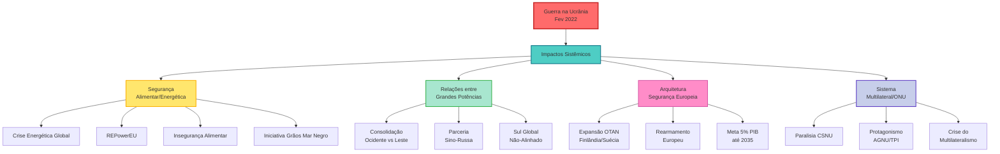

# Os Impactos Sistêmicos da Guerra na Ucrânia: A Reconfiguração da Ordem Internacional no Pós-2022

A invasão russa da Ucrânia em 24 de fevereiro de 2022 representa o mais significativo ponto de inflexão na ordem internacional desde o fim da Guerra Fria, catalisando transformações estruturais que redefinem a arquitetura de segurança global, as relações entre grandes potências e o próprio sistema multilateral. Este conflito não constitui meramente uma guerra regional, mas um evento sistêmico que acelerou tendências preexistentes de fragmentação da ordem liberal e emergência de um mundo multipolar competitivo. A análise dos impactos multidimensionais revela como a guerra consolidou uma nova era de confrontação geopolítica, marcada pela divisão Ocidente-Leste, pelo protagonismo do Sul Global e pela crise terminal do multilateralismo centrado na ONU.

## O impacto na segurança alimentar e energética global

### A primeira crise energética verdadeiramente global do século XXI

A guerra desencadeou uma reconfiguração sem precedentes dos fluxos energéticos globais, com a Europa protagonizando a mais ambiciosa transição energética de sua história. Antes do conflito, a Rússia fornecia **45% das importações de gás da UE** e controlava 16% da produção global de gás natural. Em resposta à invasão, o bloco europeu lançou o REPowerEU em maio de 2022, estabelecendo a meta de eliminar completamente a dependência de combustíveis fósseis russos até 2027.

> [!important] A participação russa no fornecimento de gás da UE despencou de 44% em 2021 para aproximadamente 10% em 2023, representando uma das mais rápidas reconfigurações de dependência energética da história moderna.

Os resultados quantitativos impressionam pela velocidade da transformação. A UE reduziu seu consumo de gás em **18% entre 2023 e 2024**, superando a meta inicial de 15%. Simultaneamente, a capacidade renovável instalada aumentou 16% em 2025, com **66 GW de nova capacidade solar** instalada apenas em 2024. Os Estados Unidos consolidaram-se como o maior fornecedor de GNL para a Europa, preenchendo mais de 40% do déficit deixado pelo gás russo.

A volatilidade dos preços energéticos atingiu níveis sem precedentes nas primeiras semanas do conflito. Os preços do petróleo, carvão e gás subiram **40%, 130% e 180%** respectivamente, com o gás chegando a custar nove vezes mais que as renováveis em meados de 2022. Embora os preços tenham se estabilizado gradualmente, permanecem **51% mais elevados** que no inverno de 2021-22, impactando desproporcionalmente populações vulneráveis – estima-se que 70 milhões de pessoas que recentemente obtiveram acesso à eletricidade não podem mais pagá-la.

### "Weaponização" dos alimentos e a Iniciativa de Grãos do Mar Negro

A dimensão alimentar do conflito revelou a vulnerabilidade das cadeias globais de suprimentos. Rússia e Ucrânia representavam conjuntamente **19% da produção global de cevada, 14% do trigo e 4% do milho** antes da guerra. A Rússia, como maior exportador mundial de trigo (32,9 milhões de toneladas em 2021), e a Ucrânia, como quinto maior (20 milhões de toneladas), desempenhavam papel crucial na segurança alimentar global.

> [!note] O Índice de Preços de Alimentos da FAO atingiu seu recorde histórico em março de 2022, com o trigo subindo 58% e o milho 47% em relação a janeiro de 2021.

A Iniciativa de Grãos do Mar Negro, mediada pela Turquia e ONU entre julho de 2022 e julho de 2023, demonstrou tanto o potencial quanto os limites da diplomacia em tempos de guerra. Durante sua vigência, **32,9 milhões de toneladas** de grãos foram exportadas através de 1.004 viagens marítimas, com 65% do trigo atingindo países em desenvolvimento. Contudo, o término unilateral da iniciativa pela Rússia em julho de 2023 forçou a criação dos Corredores de Solidariedade UE-Ucrânia, que transportaram **83 milhões de toneladas** até setembro de 2024, demonstrando notável capacidade de adaptação logística.

O impacto humanitário permanece severo: **258 milhões de pessoas** sofreram insegurança alimentar aguda em 2022, um recorde histórico. Cinquenta países dependem da Rússia e Ucrânia para mais de 30% de suas importações de trigo, com a Eritreia obtendo 100% dessas fontes. A produção ucraniana contraiu drasticamente – a área plantada reduziu 22% em 2022, com quedas de 32%, 27% e 37% nas áreas colhidas de trigo, milho e cevada respectivamente.

## O impacto na relação entre as grandes potências

### Consolidação definitiva da rivalidade sistêmica Ocidente-Leste

A guerra cristalizou uma divisão geopolítica que vinha se gestando desde a crise financeira de 2008, mas que agora assume contornos de confrontação estrutural. A ruptura entre Europa e Rússia tornou-se **irreversível**, com a Alemanha abandonando cinco décadas de Ostpolitik numa "reversão fundamental" de sua grande estratégia. As relações EUA-Rússia deterioraram-se ao ponto de contatos de alto nível tornarem-se "poucos e distantes", marcando o nível mais baixo de interação desde o auge da Guerra Fria.

> [!definition] **Parceria "sem limites"**: Declaração conjunta sino-russa de fevereiro de 2022 estabelecendo cooperação irrestrita "sem áreas proibidas", consolidando o eixo autoritário contra a ordem liberal ocidental.

O aprofundamento da parceria estratégica sino-russa representa talvez a consequência geopolítica mais duradoura do conflito. Xi Jinping e Vladimir Putin encontraram-se **42 vezes** desde 2012, muito mais que com qualquer outro líder mundial. O comércio bilateral atingiu o recorde de **US$ 240 bilhões em 2023**, com a China tornando-se o maior comprador de petróleo russo, importando 49% a mais em 2022. A cooperação militar expandiu-se dramaticamente, incluindo exercícios navais conjuntos no Mar do Sul da China e patrulhas de bombardeiros próximas ao Alasca.

Ambos os países articulam uma narrativa compartilhada de resistência à "hegemonia ocidental", promovendo uma "ordem mundial mais equitativa e multipolar". Veem o conflito como parte de uma estratégia americana de "dupla contenção" contra potências revisionistas. A China forneceu à Rússia insumos industriais de duplo uso críticos, incluindo microeletrônicos, óptica militar e componentes de drones, sustentando o esforço de guerra russo apesar das sanções ocidentais.

### Emergência do Sul Global como terceiro polo autônomo

A guerra catalisou o ressurgimento do não-alinhamento como estratégia viável para potências médias, mas com características distintamente contemporâneas. O "não-alinhamento ativo" do século XXI difere fundamentalmente do movimento original da Guerra Fria – os países do Sul Global agora possuem **muito mais poder econômico** e capacidade de influência. O PIB dos BRICS já ultrapassou o do G7 em paridade de poder de compra, conferindo-lhes margem de manobra sem precedentes.

> [!example] **Índia**: Absteve-se na resolução da AGNU condenando a invasão, expandiu laços comerciais com a Rússia aproveitando petróleo com desconto, justificando a posição pela parceria histórica desde 1947.
> 
> **Brasil**: Sob Lula, tentou mediar o conflito mantendo neutralidade ativa, condenando a invasão mas atribuindo responsabilidade compartilhada, recusando-se a fornecer armas.
> 
> **Turquia**: Como membro da OTAN que mantém relações com ambos os lados, fornece drones à Ucrânia enquanto preserva dependência do gás russo, posicionando Erdogan como mediador indispensável.

A resistência ao alinhamento automático manifesta-se concretamente nas votações da ONU. Enquanto 141 países condenaram a invasão em março de 2022, **32 se abstiveram**, com o maior número de abstenções vindo da África. Quase nenhum país na África, Ásia e América Latina implementou sanções contra a Rússia. Os benefícios do não-alinhamento são tangíveis: acesso a energia russa com desconto, manutenção de investimentos chineses via BRI, e elevação de status como "swing states" em questões globais críticas.

## O impacto sobre a arquitetura de segurança europeia

### Metamorfose histórica da OTAN: do brain death à revitalização total

A invasão russa provocou a mais profunda transformação da OTAN desde sua fundação em 1949. O Conceito Estratégico de Madrid (2022) marca uma ruptura paradigmática ao declarar que **"a área Euro-Atlântica não está em paz"**, contrastando radicalmente com o documento de 2010 que afirmava estar a região "em paz" com ameaça convencional "baixa". A Rússia foi reclassificada como "a ameaça mais significativa e direta", enquanto a China aparece pela primeira vez como desafio sistêmico.

> [!important] A adesão da Finlândia (4 de abril de 2023) e Suécia (7 de março de 2024) representa a mais significativa expansão da OTAN desde 2004, duplicando a fronteira terrestre com a Rússia de 1.215 km para 2.555 km.

A expansão nórdica transcende números – marca o abandono de **séculos de neutralidade**. A Finlândia contribui com 900.000 reservistas treinados, enquanto a Suécia aporta tecnologia militar avançada. O Mar Báltico transformou-se efetivamente num "lago da OTAN", alterando fundamentalmente os cálculos estratégicos russos. O processo acelerado de adesão – 11 meses para a Finlândia versus décadas típicas – demonstra a urgência percebida da ameaça.

O fortalecimento do flanco oriental assumiu proporções sem precedentes. De 4 battlegroups em 2017, a presença avançada expandiu para 8 em 2022, com planos de elevação para brigadas completas. A Polônia recebeu **+10.000 soldados americanos**, aproximando-se da presença na Itália. A Alemanha estabeleceu sua 45ª Brigada Blindada permanentemente na Lituânia. Os países bálticos receberão coletivamente **20 lançadores HIMARS**, enquanto a Polônia adquiriu impressionantes 486 sistemas através do programa "Homar-A".

### Revolução nos gastos militares: o novo consenso dos 5%

O cumprimento da meta de 2% do PIB em gastos militares evoluiu dramaticamente. De apenas 3 países em 2014, **23 dos 32 membros** (72%) cumprem a meta em 2024, com expectativa de cumprimento universal em 2025. A Polônia lidera com impressionantes **4,12% do PIB**, seguida pela Estônia (3,43%) e Estados Unidos (3,38%).

> [!note] A Cúpula de Haia (junho 2025) estabeleceu nova meta revolucionária: 5% do PIB até 2035, divididos em 3,5% para defesa pura e 1,5% para segurança/cibersegurança.

O rearmamento europeu atingiu escala não vista desde a Guerra Fria. Os gastos militares combinados da UE saltaram de €214 bilhões (2021) para €326 bilhões (2024), crescimento de **52%**. A Alemanha mobilizou seu Sondervermögen de €100 bilhões, enquanto a Polônia aumentou gastos de 2,2% para 4,7% do PIB. A indústria de defesa europeia, com €70 bilhões de faturamento e 500.000 empregos, enfrenta o desafio de triplicar a capacidade produtiva.

O debate sobre autonomia estratégica europeia intensificou-se, equilibrando a necessidade de independência com a realidade da interdependência transatlântica. A Estratégia Industrial de Defesa Europeia (EDIS) promove o lema "gastar mais, melhor e europeu", mas tensões persistem sobre transferência de tecnologia e duplicação de esforços entre estruturas da UE e OTAN.

## O impacto sobre a ONU e o multilateralismo

### Paralisia terminal do Conselho de Segurança

A guerra expôs de forma definitiva a obsolescência do sistema de segurança coletiva centrado no Conselho de Segurança quando um membro permanente é o agressor. A Rússia utilizou seu poder de veto sistematicamente, bloqueando qualquer ação significativa. O primeiro uso do mecanismo "Uniting for Peace" em 40 anos, em fevereiro de 2022, sublinha a gravidade da paralisia institucional.

> [!definition] **Iniciativa do Veto (Resolução 76/262)**: Aprovada em abril de 2022, exige que a Assembleia Geral se reúna automaticamente em 10 dias após qualquer veto, aumentando transparência mas sem resolver a paralisia fundamental.

As estatísticas revelam o impacto: o Conselho adotou apenas 54 resoluções em 2022 (versus 57 em 2021), com **1/3 não-unânimes** comparado a 1/6 anteriormente. Das 276 reuniões em 2022, 46 dedicaram-se à Ucrânia sem produzir ação concreta. A comparação histórica é reveladora – padrões similares emergiram durante a Crise de Suez (1956), mas com a diferença crucial de um P5 como agressor direto.

### Protagonismo compensatório de outros órgãos

A Assembleia Geral assumiu papel mais assertivo, aprovando resoluções condenando a invasão (141 votos favoráveis) e rejeitando anexações (143 votos). Contudo, a votação de fevereiro de 2025 revelou **fissuras emergentes**, com os EUA votando contra a resolução ucraniana pela primeira vez, sinalizando mudanças sob a administração Trump.

> [!important] O TPI emitiu mandado de prisão contra Vladimir Putin em 17 de março de 2023 – o primeiro contra um líder de membro permanente do CSNU – por deportação ilegal de crianças ucranianas.

A Corte Internacional de Justiça ordenou a suspensão das operações militares russas em março de 2022 (13-2), mas enfrenta limitações de enforcement. O TPI demonstrou maior assertividade, emitindo mandados contra Putin, Maria Lvova-Belova e comandantes militares por crimes de guerra. Embora 125 países sejam obrigados a executar os mandados, a Mongólia demonstrou os limites práticos ao não prender Putin em setembro de 2024.

As agências humanitárias mobilizaram-se massivamente. O ACNUR assiste **6,7 milhões de refugiados** ucranianos na Europa, com Alemanha (1,2 milhão) e Polônia (1 milhão) liderando o acolhimento. O WFP investiu US$ 1,3 bilhão na economia ucraniana, fornecendo US$ 708 milhões em assistência monetária para 3 milhões de pessoas.

### Crise existencial do multilateralismo

A guerra catalisou debates fundamentais sobre a viabilidade do sistema multilateral atual. Propostas de reforma proliferam mas enfrentam resistência estrutural. A proposta Derviš-Ocampo de dupla maioria (2/3 de países + 2/3 da população) para reverter vetos, a iniciativa França-México de suspender vetos em atrocidades em massa, e o Código de Conduta ACT permanecem bloqueados pela resistência dos P5.

O sistema mostra sinais de adaptação incremental – fortalecimento da Assembleia Geral, uso expandido de tribunais internacionais, coalizões ad hoc para sanções – mas não a transformação fundamental necessária. A guerra expôs a inadequação de uma arquitetura de 1945 para desafios do século XXI, intensificando debates sobre "multilateralismo eficaz" sem produzir consenso para mudanças estruturais.

## Conclusão: a grande aceleração histórica

A Guerra na Ucrânia funcionou como um **acelerador histórico**, cristalizando tendências latentes e forçando realinhamentos que levariam décadas para se materializar em circunstâncias normais. O conflito não criou a rivalidade entre grandes potências, a crise do multilateralismo ou os dilemas de segurança europeia – mas comprimiu processos graduais em transformações abruptas e irreversíveis.

A consolidação de um sistema internacional genuinamente multipolar e competitivo emerge como legado estrutural mais significativo. A divisão Ocidente-Leste, o protagonismo autônomo do Sul Global e a militarização acelerada da Europa configuram uma nova geometria de poder que definirá as próximas décadas. O paradoxo central reside em que, enquanto a interdependência econômica e os desafios transnacionais demandam mais cooperação, a lógica de competição entre grandes potências torna tal cooperação crescentemente improvável.

Para o Brasil e a diplomacia brasileira, este cenário apresenta oportunidades e riscos sem precedentes. A política de autonomia estratégica e não-alinhamento ativo pode conferir influência desproporcional como mediador e bridge-builder, mas exigirá navegação sofisticada entre pressões crescentes por alinhamento. A crise do multilateralismo, arena tradicional de atuação brasileira, demandará criatividade institucional e coalizões inovadoras para preservar espaços de governança global.

A guerra demonstra que a história não acabou – apenas hibernava. Seu despertar abrupto em 2022 inaugurou era de incerteza estrutural, onde as certezas do pós-Guerra Fria evaporaram e um novo equilíbrio ainda busca sua forma. Compreender estas transformações sistêmicas constitui imperativo analítico fundamental para qualquer aspirante à carreira diplomática no século XXI.

> [!question]
> 
> ## Questões para autoavaliação (active recall)
> 
> **1. Analise criticamente como a Guerra na Ucrânia evidenciou tanto as vulnerabilidades quanto as capacidades adaptativas do sistema internacional contemporâneo. Em sua resposta, compare os mecanismos de resposta à crise energética (REPowerEU) com a paralisia do Conselho de Segurança da ONU, explicando o que essa divergência revela sobre a eficácia relativa de instituições regionais versus globais em contextos de competição entre grandes potências.**
> 
> **2. O conceito de "não-alinhamento ativo" do Sul Global representa continuidade ou ruptura com o Movimento Não-Alinhado da Guerra Fria? Desenvolva uma análise comparativa considerando: (a) as diferenças de poder econômico relativo; (b) a natureza da competição sistêmica atual versus bipolaridade ideológica; (c) as implicações para a inserção internacional brasileira e sua tradicional política de autonomia estratégica.**
> 
> **3. A meta de 5% do PIB em gastos militares até 2035 representa uma militarização insustentável da Europa ou uma correção necessária de décadas de subinvestimento em defesa? Em sua análise, considere: os trade-offs com gastos sociais e climáticos; a viabilidade da autonomia estratégica europeia versus dependência transatlântica; e as implicações sistêmicas de uma Europa remilitarizada para o equilíbrio global de poder.**